# **Chapter 1**

# **Introduction to Vectors**

The heart of linear algebra is in two operations-both with vectors. We add vectors to get *v*+ *w.* We multiply them by numbers *c* and *d* to get *cv* and *dw.* Combining those two operations (adding *cv* to *dw)* gives the *linear combination cv* + *dw.* 

| Linear combination | $cv + dw = c \begin{bmatrix} 1 \\ 1 \end{bmatrix} + d \begin{bmatrix} 2 \\ 3 \end{bmatrix} = \begin{bmatrix} c+2d \\ c+3d \end{bmatrix}$ |
|--------------------|------------------------------------------------------------------------------------------------------------------------------------------|
|--------------------|------------------------------------------------------------------------------------------------------------------------------------------|

**Example**    
$$v + w = \begin{bmatrix} 1 \\ 1 \end{bmatrix} + \begin{bmatrix} 2 \\ 3 \end{bmatrix} = \begin{bmatrix} 3 \\ 4 \end{bmatrix}$$
 is the combination with  $c = d = 1$ 

Linear combinations are all-important in this subject! Sometimes we want one particular combination, the specific choice *c* = 2 and *d* = **l** that produces *cv* + *dw* = ( 4, **5).** Other times we want *all the combinations* of *v* and *w* (coming from all *c* and *d).* 

The vectors *cv* lie along a line. When *w* is not on that line, **the combinations** *cv* + *dw* **fill the whole two-dimensional plane.** Starting from four vectors *u, v, w, z* in fourdimensional space, their combinations *cu* + *dv* + *ew* + *f z* are likely to fill the spacebut not always. The vectors and their combinations could lie in a plane or on a line.

Chapter 1 explains these central ideas, on which everything builds. We start with twodimensional vectors and three-dimensional vectors, which are reasonable to draw. Then we move into higher dimensions. The really impressive feature of linear algebra is how smoothly it takes that step into n-dimensional space. Your mental picture stays completely correct, even if drawing a ten-dimensional vector is impossible.

This is where the book is going (into n-dimensional space). The first steps are the operations in Sections 1.1 and 1.2. Then Section 1.3 outlines three fundamental ideas.

**1.1** *Vector addition v* + *wand linear combinations cv* + *dw.* **1.2** *The dot product v* · *wof two vectors and the length* 11 *v* 11= �- **1.3** *Matrices A, linear equations Ax* = *b, solutions x* = *A*- I *b.* 

### **1.1 Vectors and Linear Combinations**

**1** *3v* + *5w* is a typical **linear combination** *cv* + *dw* of the vectors *v* and *w.* 

2 For v = [ � ] and w = [ � ] that combination is 3 [ � ] + 5 [ � ] = [ � ! �� ] = [ � � ] . 3 The vector [ � ] = [ � ] + [ � ] goes across to x = 2 and up to y = 3 in the xy plane. **4**The combinations c [ � ] + d [ � ] fill the whole xy plane. They produce every [ : ] . **5**The comb;nations **c [** t ] **+d [** ! ] fill a **plane** ill **xyz** space. Same plan doc [ t l · [ ! ] · C+ 2d = 1 6 But c+ *3d* = 0 *c+4d* = 0 **has no solut;on because ;,s rights;de [ � ] ;, not on that plane.** 

"You can't add apples and oranges." In a strange way, this is the reason for vectors. We have two separate numbers v1 and v2. That pair produces a *two-dimensional vector* v:

| Column vector $v$ | $v = \begin{bmatrix} v_1 \\ v_2 \end{bmatrix}$ | $v_1 = \text{first component of } v$ | $v_2 = \text{second component of } v$ |
|-------------------|------------------------------------------------|--------------------------------------|---------------------------------------|
|                   |                                                |                                      |                                       |

We write v as a *column,* not as a row. The main point so far is to have a single letter v (in *boldface italic)* for this pair of numbers v1 and v2 (in *lightface italic).*

Even if we don't add v1 to v2, we do *add vectors.* The first components of v and w stay separate from the second components:

| VECTOR ADDITION | $v = \begin{bmatrix} v_1 \\ v_2 \end{bmatrix}$ | and | $w = \begin{bmatrix} w_1 \\ w_2 \end{bmatrix}$ | add to | $v + w = \begin{bmatrix} v_1 + w_1 \\ v_2 + w_2 \end{bmatrix}$ |
|-----------------|------------------------------------------------|-----|------------------------------------------------|--------|----------------------------------------------------------------|
|-----------------|------------------------------------------------|-----|------------------------------------------------|--------|----------------------------------------------------------------|

Subtraction follows the same idea: *The components of v* -*ware* v1 - w1 *and* v2 - w2.

The other basic operation is *scalar multiplication.* Vectors can be multiplied by 2 or by -1 or by any number c. To find 2v, multiply each component of v by 2:

| <b>SCALAR MULTIPLICATION</b> | $2v = \begin{bmatrix} 2v_1 \\ 2v_2 \end{bmatrix} = v + v - v = \begin{bmatrix} -v_1 \\ -v_2 \end{bmatrix}$ |
|------------------------------|------------------------------------------------------------------------------------------------------------|
|------------------------------|------------------------------------------------------------------------------------------------------------|

The components of *cv* are cv1 and cv2. The number c is called a "scalar".

Notice that the sum of *-v* and vis the zero vector. This is 0, which is not the same as the number zero! The vector O has components O and 0. Forgive me for hammering away at the difference between a vector and its components. Linear algebra is built on these operations *v* + w and *cv* and *dw-adding vectors and multiplying by scalars.*

#### **Linear Combinations**

Now we combine addition with scalar multiplication to produce a **"linear combination"** of *v* and *w.* Multiply *v* by c and multiply *w* by *d.* Then add *cv* + *dw.* 

*The sum of cv and dw is a linear combination cv* + *dw.* 

Four special linear combinations are: sum, difference, zero, and a scalar multiple cv:

lv + lw lv- lw *0v+0w*  sum of vectors in Figure 1.1 a difference of vectors in Figure 1.1 b *zero vector* 

**$$cv + 0w$$
  $=$**       vector  $cv$  in the direction of  $v$ 

The zero vector is always a possible combination (its coefficients are zero). Every time we see a "space" of vectors, that zero vector will be included. This big view, taking *all* the combinations of v and *w,* is linear algebra at work.

The figures show how you can visualize vectors. For algebra, we just need the components (like 4 and 2). That vector v is represented by an arrow. The arrow goes v1 = 4 units to the right and *v2* = 2 units up. It ends at the point whose *x, y* coordinates are 4, 2. This point is another representation of the vector-so we have three ways to describe v:

**Represent vector v** Two numbers Arrow from (0, 0) Point in the plane

We add using the numbers. We visualize v + *w*using arrows:

*Vector addition* (head to tail) *At the end of v,place the start of w.*

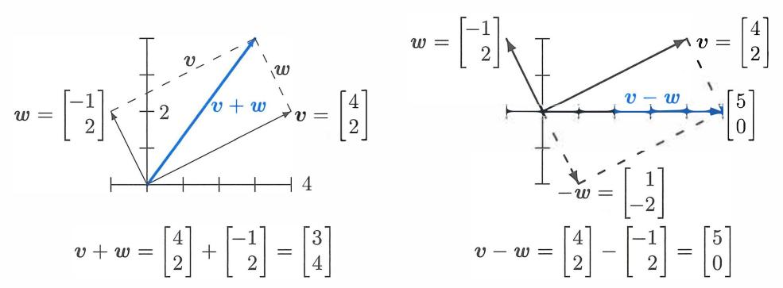

Figure 1.1: Vector addition v + *w*= (3, 4) produces the diagonal of a parallelogram. The reverse of *w* is *-w.* The linear combination on the right is *v* - *w*= (5, 0).

We travel along *v* and then along *w.* Or we take the diagonal shortcut along *v*+ *w.* We could also go along w and then *v.* In other words, w + *v* **gives the same answer as** v + *w.* These are different ways along the parallelogram (in this example it is a rectangle).

#### **Vectors in Three Dimensions**

A vector with two components corresponds to a point in the *xy* plane. The components of *v*  are the coordinates of the point: x = v1 and y = v2. The arrow ends at this point ( v1, v2), when it starts from (0,0). Now we allow vectors to have three components (v1,v2,v3).

The *xy* plane is replaced by three-dimensional *xyz* space. Here are typical vectors (still column vectors but with three components):

$$\mathbf{v} = \begin{bmatrix} 1 \\ 1 \\ -1 \end{bmatrix} \quad \text{and} \quad \mathbf{w} = \begin{bmatrix} 2 \\ 3 \\ 4 \end{bmatrix} \quad \text{and} \quad \mathbf{v} + \mathbf{w} = \begin{bmatrix} 3 \\ 4 \\ 3 \end{bmatrix}.$$

The vector *v* corresponds to an arrow in 3-space. Usually the arrow starts at the "origin", where the *xyz* axes meet and the coordinates are (0, 0, 0). The arrow ends at the point with coordinates v1, v2, *v3•* There is a perfect match between the *column vector* and the *arrow from the origin* and the *point where the arrow ends.* 

The vector ( x, *y)* in the plane is different from ( x, *y,* 0) in 3-space !

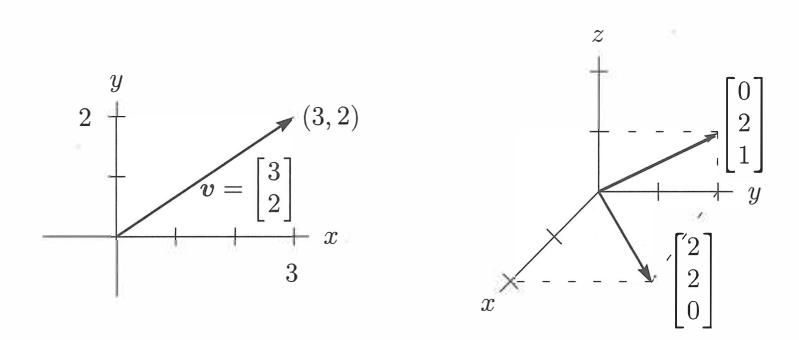

Figu,e 1.2, Vectorn [;] and [;] correspond to points ( x, *y)* and ( x, *y,* z).

From now on 
$$v = \begin{bmatrix} 1 \\ 1 \\ -1 \end{bmatrix}$$
 is also written as  $v = (1, 1, -1)$ .

The reason for the row form (in parentheses) is to save space. But *v* = (l, 1, -1) is not a row vector! It is in actuality a column vector, just temporarily lying down. The row vector [ 1 1 -1] is absolutely different, even though it has the same three components. That 1 by 3 row vector is the "transpose" of the 3 by 1 column vector *v.*

In three dimensions, *v* + *w* is still found a component at a time. The sum has components V1 + w1 and v2 + w2 and *V3* + *W3.* You see how to add vectors in 4 or 5 or *n* dimensions. When *w* starts at the end of *v,* the third side is *v* + *w.* The other way around the parallelogram is *w* + *v.* Question: Do the four sides all lie in the same plane? *Yes.* And the sum *v* + *w* - *v* - *w* goes completely around to produce the \_\_ vector.

A typical linear combination of three vectors in three dimensions is *u* + *4v* - 2w:

| Linear combination   | $\begin{bmatrix} 1 \\ 0 \\ 3 \end{bmatrix} + 4 \begin{bmatrix} 2 \\ 3 \\ -1 \end{bmatrix} = \begin{bmatrix} 1 \\ 2 \\ 9 \end{bmatrix}$ |
|----------------------|----------------------------------------------------------------------------------------------------------------------------------------|
| Multiply by 1, 4, -2 |                                                                                                                                        |
| Then add             |                                                                                                                                        |

# **The Important Questions**

For one vector *u,* the only linear combinations are the multiples *cu.* For two vectors, the combinations are *cu+ dv.* For three vectors, the combinations are *cu* + *dv* + *ew.*  Will you take the big step from *one* combination to **all combinations?** Every c and *d* and *e* are allowed. Suppose the vectors *u, v,* w are in three-dimensional space:

- 1. What is the picture of *all* combinations *cu?*
- 2. What is the picture of *all* combinations *cu* + *dv?*
- 3. What is the picture of *all* combinations *cu+ dv* + *ew?*

The answers ·depend on the particular vectors *u, v,* and *w.* If they were zero vectors ( a very extreme case), then every combination would be zero. If they are typical nonzero vectors (components chosen at random), here are the three answers. This is the key to our subject:

- 1. The combinations *cu* fill a *line through* (0, 0, 0).
- 2. The combinations *cu+ dv* fill a *plane through* (0, 0, 0).
- 3. The combinations *cu+ dv* + *ew* fill *three-dimensional space.*

The zero vector (0, 0, 0) is on the line because c can be zero. It is on the plane because c and *d* could both be zero. The line of vectors *cu* is infinitely long (forward and backward). It is the plane of all *cu* + *dv* (combining two vectors in three-dimensional space) that I especially ask you to think about.

#### *Adding all cu on one line to all dv on the other line fills in the plane in Figure* 1.3.

When we include a third vector *w,* the multiples *ew* give a third line. **Suppose that third line is not in the plane of** *u* **and** *v.* Then combining all *ew* with all *cu+ dv* fills up the whole three-dimensional space.

This is the typical situation! **Line,** then **plane,** then **space.** But other possibilities exist. When *w* happens to be *cu* + *dv,* that third vector *w* is in the plane of the first two. The combinations of *u, v, w* will not go outside that *uv* plane. We do not get the full three-dimensional space. Please think about the special cases in Problem 1.

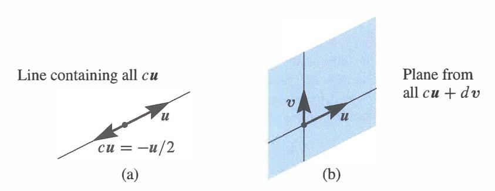

Figure 1.3: (a) Line through *u.* (b) The plane containing the lines through *u* and *v.* 

#### **• REVIEW OF THE KEY IDEAS •**

- 1. A vector *v* in two-dimensional space has two components v1 and v2.
- **2.** *v* + *w* = ( v1 + w1, v2 + w2) and *cv* = ( cv1, cv2) are found a component at a time.
- **3.** A linear combination of three vectors *u* and *v* and *w* is *cu+ dv* + *ew.*
- **4.** Take *all* linear combinations of *u,* or *u* and *v,* or *u, v, w.* In three dimensions, those combinations typically fill a line, then a plane, then the whole space R**3**

#### **• WORKED EXAMPLES •**

**1.1 A** The linear combinations of *v* = (l, 1, 0) and *w* = (0, 1, 1) fill a plane in **R3 .**  *Describe that plane.* Find a vector that is *not* a combination of *v* and *w-not* on the plane.

**Solution** The plane of *v* and *w* contains all combinations *cv* + *dw.* The vectors in that plane allow any c and *d.* The plane of Figure 1.3 fills in between the two lines.

| Combinations | $cv + dw = c \begin{bmatrix} 1 \\ 1 \\ 0 \end{bmatrix} + d \begin{bmatrix} 0 \\ 1 \\ 1 \end{bmatrix} = \begin{bmatrix} c \\ c+d \\ d \end{bmatrix}$ fill a plane. |
|--------------|-------------------------------------------------------------------------------------------------------------------------------------------------------------------|
|--------------|-------------------------------------------------------------------------------------------------------------------------------------------------------------------|

Four vectors in that plane are (0,0,0) and (2,3,1) and (5,7,2) and (7r,27r,7r). The second component *c* + *d* is always the sum of the first and third components. Like most vectors, (1, 2, 3) *is not in the plane, because* 2 =/- 1 + 3.

Another description of this plane through ( 0, 0, 0) is to know that *n* = ( 1, -1, 1) is **perpendicular** to the plane. Section 1.2 will confirm that 90° angle by testing dot products: *v* · *n* = 0 and *w* · *n* = 0. Perpendicular vectors have zero dot products.

**1.1 B** For *v* = (l, 0) and w = (0, 1), describe all points *cv* with (1) *whole numbers* c (2) *nonnegative* numbers c 2: 0. Then add all vectors *dw* and describe all *cv* + *dw.*

#### **Solution**

- (1) The vectors *cv* = (c, 0) with whole numbers c are **equally spaced points** along the x axis (the direction of v). They include ( -2, 0), ( -1, 0), (0, 0), (1, 0), (2, 0).
- (2) The vectors *cv* with c 2: 0 fill a *half-line.* It is the positive *x* axis. This half-line starts at (0, 0) where c = 0. It includes (100, 0) and (1r, 0) but not (-100, 0). **(1')** Adding all vectors *dw* = (0, d) puts a vertical line through those equally spaced *cv.*  We have infinitely many *parallel lines* from *(whole number* c, *any number* d). (2') Adding all vectors *dw* puts a vertical line through every *cv* on the half-line. Now we have a *half-plane.* The right half of the *xy* plane has any *x* 2'. 0 and any *y.*

**1.1 C** Find two equations for c and *d* so that **the linear combination** *cv* + *dw* **equals** b:

$$\mathbf{v} = \begin{bmatrix} 2 \\ -1 \end{bmatrix} \quad \mathbf{w} = \begin{bmatrix} -1 \\ 2 \end{bmatrix} \quad \mathbf{b} = \begin{bmatrix} 1 \\ 0 \end{bmatrix}.$$

**Solution** In applying mathematics, many problems have two parts:

1 *Modeling part* Express the problem by a set of equations. 2 *Computational part* Solve those equations by a fast and accurate algorithm.

Here we are only asked for the first part (the equations). Chapter 2 is devoted to the second part (the solution). Our example fits into a fundamental model for linear algebra:

Find 
$$n$$
 numbers  $c_1, \dots, c_n$  so that  $c_1 v_1 + \dots + c_n v_n = b$ .

For *n* = 2 we will find a formula for the e's. The "elimination method" in Chapter 2 succeeds far beyond *n* = 1000. For *n* greater than 1 billion, see Chapter 11. Here *n* = 2:

**Vector equation** 
$$c \begin{bmatrix} 2 \\ -1 \end{bmatrix} + d \begin{bmatrix} -1 \\ 2 \end{bmatrix} = \begin{bmatrix} 1 \\ 0 \end{bmatrix}$$

The required equations for c and *d* just come from the two components separately:

|                               | $2c - d = 1$ $-c + 2d = 0$ |
|-------------------------------|----------------------------|
| <b>Two ordinary equations</b> |                            |

2 1 Each equation produces a line. The two lines cross at the solution c =3, *d* =3. Why not see this also as a **matrix equation,** since that is where we are going :

| 2 by 2 matrix | $\begin{bmatrix} 2 & -1 \\ -1 & 2 \end{bmatrix}$ | $\begin{bmatrix} c \\ d \end{bmatrix}$ | $\begin{bmatrix} 1 \\ 0 \end{bmatrix}$ |
|---------------|--------------------------------------------------|----------------------------------------|----------------------------------------|
|---------------|--------------------------------------------------|----------------------------------------|----------------------------------------|

### **Problem Set 1.1**

**Problems 1-9 are about addition of vectors and linear combinations.** 

**1**Describe geometrically (line, plane, or all of **R**3 ) all linear combinations of

| (a) | $\begin{bmatrix} 1 \\ 2 \\ 3 \end{bmatrix}$ and $\begin{bmatrix} 3 \\ 6 \\ 9 \end{bmatrix}$ | (b) | $\begin{bmatrix} 1 \\ 0 \\ 0 \end{bmatrix}$ and $\begin{bmatrix} 0 \\ 2 \\ 3 \end{bmatrix}$ | (c) | $\begin{bmatrix} 2 \\ 0 \\ 0 \end{bmatrix}$ and $\begin{bmatrix} 0 \\ 2 \\ 2 \end{bmatrix}$ | (d) | $\begin{bmatrix} 2 \\ 0 \\ 3 \end{bmatrix}$ |
|-----|---------------------------------------------------------------------------------------------|-----|---------------------------------------------------------------------------------------------|-----|---------------------------------------------------------------------------------------------|-----|---------------------------------------------|
|     |                                                                                             |     |                                                                                             |     |                                                                                             |     |                                             |

Draw *v* = [ 1] and *w* = [ -�] and *v+w* and *v-w* in a single *xy* plane. If *v* + *w* = [ �] and *v* - *w*= [!],compute and draw the vectors *v* and *w.* From *v* = [ �] and *w* = [;], find the components of *3v* +wand *cv* + *dw.* Compute *u* + *v* +wand *2u* + *2v* + *w.* How do you know *u, v, w* lie in a plane?

| These lie in a plane because     | $u = \begin{bmatrix} 1 \\ 2 \\ 3 \end{bmatrix}$ , | $v = \begin{bmatrix} -3 \\ 1 \\ -2 \end{bmatrix}$ , | $w = \begin{bmatrix} 2 \\ -3 \\ -1 \end{bmatrix}$ |
|----------------------------------|---------------------------------------------------|-----------------------------------------------------|---------------------------------------------------|
| $w = cu + dv$ . Find $c$ and $d$ |                                                   |                                                     |                                                   |

**6**Every combination of *v* = ( 1, -2, 1) and *w* = ( 0, 1, -1) has components that add to \_\_ . Find *c* and *d* so that *cv* + *dw* = (3, 3, -6). Why is (3, 3, 6) impossible? **7**In the *xy* plane mark all nine of these linear combinations:

| $c \begin{bmatrix} 2 \\ 1 \end{bmatrix} + d \begin{bmatrix} 0 \\ 1 \end{bmatrix}$ | with | $c = 0, 1, 2$ | and | $d = 0, 1, 2$ |
|-----------------------------------------------------------------------------------|------|---------------|-----|---------------|
|-----------------------------------------------------------------------------------|------|---------------|-----|---------------|

8 The parallelogram in Figure 1.1 has diagonal *v* + *w.* What is its other diagonal? What is the sum of the two diagonals? Draw that vector sum. **9**If three corners of a parallelogram are (1, 1), (4, 2), and (1, 3), what are all three of the possible fourth corners? Draw two of them.

**Problems 10-14 are about special vectors on cubes and clocks in Figure 1.4.** 

**10**Which point of the cube is i + *j?* Which point is the vector sum of i = (1, 0, 0) and *j*= (0, 1, 0) and k = (0, 0, 1)? Describe all points *(x, y,* z) in the cube. **11**Four corners of this unit cube are (0, 0, 0), ( 1, 0, 0), (0, 1, 0), (0, 0, 1). What are the other four corners? Find the coordinates of the center point of the cube. The center points of the six faces are \_\_ . The cube has how many edges? **12***Review Question.* In *xyz* space, where is the plane of all linear combinations of i = ( 1, 0, 0) and i + *j* = ( 1, 1, 0)?

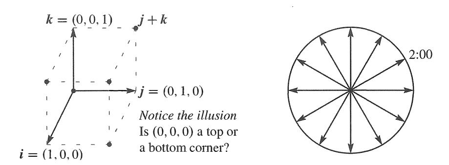

Figure 1.4: Unit cube from *i,j, k* and twelve clock vectors.

- 13 (a) What is the sum *V* of the twelve vectors that go from the center of a clock to the hours 1 :00, 2:00, ... , 12:00?
- (b) If the 2:00 vector is removed, why do the 11 remaining vectors add to 8:00? ( c) What are the *x, y* components of that 2:00 vector *v* = ( cos 0, sin 0)? 14 Suppose the twelve vectors start from 6:00 at the bottom instead of (0, 0) at the center. The vector to 12:00 is doubled to (0, 2). The new twelve vectors add to \_\_ .

## Problems 15-19 go further with linear combinations of *v* and *w* (Figure 1.Sa).

15 Figure I.Sa shows½ *v* + ½ *w.* Mark the points¾ *v* +¼wand ¼ *v* +¼wand *v* + *w.* 16 Mark the point *�v* + 2w and any other combination *cv* + *dw* with *c* + *d* = l. Draw the line of all combinations that have *c* + *d* = l. 17 Locate½ *v* +½wand� *v* + � *w.* The combinations *cv* + *cw* fill out what line? 18 Restricted by O s cs 1 and O S *d* s 1, shade in all combinations *cv* + *dw.* 19 Restricted only by *c* :::0: 0 and *d* 2 0 draw the "cone" of all combinations *cv* + *dw.*

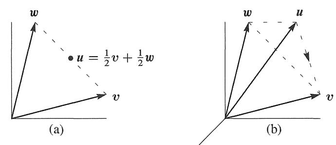

Figure 1.5: Problems 15-19 in a plane Problems **20-25** in 3-dimensional space

**Problems 20-25 deal with** *u, v,* **win three-dimensional space {see Figure L5b).** 

20 Locate ½ *u* **+** ½ *v*+ ½ *w* and ½ *u* **+** ½ *w*in Figure 1.5b. Challenge problem: Under what restrictions on *c, d, e,* will the combinations *cu* + *dv* + *ew* fill in the dashed triangle? To stay in the triangle, one requirement is *c* :2: 0, *d* :2'. 0, *e* :2: 0. 21 The three sides of the dashed triangle are *v* - *u*and *w* - *v*and *u* - *w.* Their sum is \_\_ . Draw the head-to-tail addition around a plane triangle of (3, 1) plus ( -1, 1) plus (-2, -2). 22 Shade in the pyramid of combinations *cu* + *dv* + *ew* with *c* :2: 0, *d* :2'. 0, *e* :2: 0 and *c*+ *d* + *e*:::; 1. Mark the vector ½ ( *u*+ *v* + *w)* as inside or outside this pyramid. 23 If you look at *all* combinations of those *u, v,* and *w,* is there any vector that can't be produced from *cu+ dv* + *ew?* Different answer if *u, v,* ware all in \_\_ . 24 Which vectors are combinations of *u* and *v,* and *also* combinations of *v* and *w?* 25 Draw vectors *u, v, w* so that their combinations *cu* + *dv* + *ew* fill only a line. Find vectors *u, v, w* so that their combinations *cu+ dv* + *ew* fill only a plane. 26 What combination *c* [ �] + d [ ! ] produces [ 1 :] ? Express this question as two equations for the coefficients *c* and d in the linear combination.

# **Challenge Problems**

27 How many corners does a cube have in 4 dimensions? How many 3D faces? How many edges? A typical corner is (0, 0, 1, 0). A typical edge goes to (0, 1, 0, 0). 28 Find vectors *v* and *w* so that *v*+ *w***=** (4, 5, 6) and *v* - *w***=** (2, 5, 8). This is a question with \_\_ unknown numbers, and an equal number of equations to find those numbers. 29 Find *two different combinations* of the three vectors *u* **=** (1, 3) and *v* **=** (2, 7) and *w*= (1, 5) that produce *b* = (0, 1). Slightly delicate question: If I take any three vectors *u, v, w* in the plane, will there always be two different combinations that produce *b* =(0, 1)? 30 The linear combinations of *v* **= (** *a, b)* and *w* **= (** *c, d)* fill the plane unless \_\_ . Find four vectors *u, v, w, z* with four components each so that their combinations *cu+ dv* + *ew* + *f z* produce all vectors (b1, *b2, b3, b4)* in four-dimensional space. 31 Write down three equations for *c, d, e* so that *cu+ dv* + *ew* **=** *b.* Can you somehow find *c, d, e* for this *b?*

| $u = \begin{bmatrix} 2 \\ -1 \\ 0 \end{bmatrix}$ | $v = \begin{bmatrix} -1 \\ 2 \\ -1 \end{bmatrix}$ | $w = \begin{bmatrix} 0 \\ -1 \\ 2 \end{bmatrix}$ | $b = \begin{bmatrix} 1 \\ 0 \\ 0 \end{bmatrix}$ |
|--------------------------------------------------|---------------------------------------------------|--------------------------------------------------|-------------------------------------------------|
| 
                                            |                                                   |                                                  |                                                 |

# **1.2 Lengths and Dot Products**

1 The "dot product" of 
$$\mathbf{v} = \begin{bmatrix} 1 \\ 2 \end{bmatrix}$$
 and  $\mathbf{w} = \begin{bmatrix} 4 \\ 5 \end{bmatrix}$  is  $\mathbf{v} \cdot \mathbf{w} = (1)(4) + (2)(5) = 4 + 10 = 14$ .

1 The"dot product"ofv= [ �] andw= [:] isv·w=(1)(4) +(2)(5)=4+ 10=14. 2*v* = [ ! ] and *w* = [ -! ] are perpendicular because *v* · *w* is zero: 2 4 (1)(4) + (3)(-4) + (2)(4) = 0. 3 The length squa,-ed of *v �* [ ! ] is *v, v �* 1 + 9 + 4 � 14. **The length** is 11•11 � *v'u. V V* 1 1 9 4 [ 1 l 4 Then u = � = vl4 = v14 � has length I Jul = I 1. Check 14 + 14 + 14 = 1. *V•W* **5**The angle0 betweenv andw hascos0= llvll llwll . 6 The angle between [ � ] and [ � ] has cos 0 = ( 1)tv'2) . That angle is 0 = 45 °. 7 All angles have I cos 0I :::; 1. So all vectors have I v· I wl :::; I Iv! I I wJ l 1-I

The first section backed off from multiplying vectors. Now we go forward to define the *"dot product"* of v and *w.* This multiplication involves the separate products vt w1 and *v2w2,* but it doesn't stop there. Those two numbers are added to produce one number *v* · *w.*

*This is the geometry section (lengths of vectors and cosines of angles between them).* 

*Thedotproductorinnerproductofv* = (v1,v2) andw = (w1,w2) is the numberv-w :

**Example 1** The vectors *v* = ( 4, 2) and w = ( -1, 2) have a *zero* dot product:

| Dot product is zero   | $\begin{bmatrix} 4 \\ 2 \end{bmatrix} \cdot \begin{bmatrix} -1 \\ 2 \end{bmatrix} = -4 + 4 = 0$ |
|-----------------------|-------------------------------------------------------------------------------------------------|
| Perpendicular vectors |                                                                                                 |

| $\mathbf{v} \cdot \mathbf{w} = v_1 w_1 + v_2 w_2$ | (1) |
|---------------------------------------------------|-----|
|---------------------------------------------------|-----|

In mathematics, zero is always a special number. For dot products, it means that *these two vectors are perpendicular.* The angle between them is 90° . When we drew them in Figure 1. 1, we saw a rectangle (not just any parallelogram). The clearest example of perpendicular vectors is i = (1, 0) along the x axis and j = (0, 1) up they axis. Again the dot product is i · *j* = 0 + 0 = 0. Those vectors i and *j* form a right angle.

The dot product of *v* = (1, 2) and *w* = (3, 1) is 5. Soon *v* · *w* will reveal the angle between *v* and *w* (not go0 ). Please check that *w ·vis* also 5.

*The dot product w* · *v equals v* · *w.* The order of *v* and *w* makes no difference.

**Example 2** Put a weight of 4 at the point x = -1 (left of zero) and a weight of 2 at the point x = 2 (right of zero). The x axis will balance on the center point (like a see-saw). The weights balance because the dot product is ( 4) ( -1) + ( 2) ( 2) = 0.

This example is typical of engineering and science. The vector of weights is ( w1, w*2)* = ( 4, 2). The vector of distances from the center is ( v1, v*2)* = (-1, 2). The weights times the distances, w1v1and *w2*v*2,* give the "moments". The equation for the see-saw to balance is W1V1 + *W2V2* = 0.

**Example 3** Dot products enter in economics and business. We have three goods to buy and sell. Their prices are (p1, P2, p3) for each unit-this is the "price vector" p. The quantities we buy or sell are (q1,q2,q3)-positive when we sell, negative when we buy. *Selling* q1 *units at the price* p1 *brings in* q1p1. The total income (quantities *q* times prices p) is *the dot product q ·pin three dimensions:*

**Income** = 
$$(q_1, q_2, q_3) \cdot (p_1, p_2, p_3) = q_1 p_1 + q_2 p_2 + q_3 p_3 =$$
 *dot product*.

A zero dot product means that "the books balance". Total sales equal total purchases if *q* · p = 0. Then p is perpendicular to q (in three-dimensional space). A supermarket with thousands of goods goes quickly into high dimensions.

Small note: Spreadsheets have become essential in management. They compute linear combinations and dot products. What you see on the screen is a matrix.

**Main point** For *v* · *w,* multiply each *Vi* times *Wi.* Then *v* · *w* = v1w1+ · · · + *VnWn.* 

# **Lengths and Unit Vectors**

An important case is the dot product of a vector *with itself.* In this case *v* equals w. When the vector is *v* = (1, 2, 3), the dot product with itself is *v* · *v* = llvll 2= 14:

| Dot product $v \cdot v$ | $\ v\ ^2 = \begin{bmatrix} 1 \\ 2 \\ 3 \end{bmatrix} \cdot \begin{bmatrix} 1 \\ 2 \\ 3 \end{bmatrix} = 1 + 4 + 9 = 14.$ |
|-------------------------|-------------------------------------------------------------------------------------------------------------------------|
| Length squared          |                                                                                                                         |

Instead of a go oangle between vectors we have 0 ° . The answer is not zero because v is not perpendicular to itself. The dot product *v* · *v* gives the *length of v squared.* 

**DEFINITION** The *length* llvll of a vector *vis* the square root of *v* · *v:* 

$$\text{length} = \|\mathbf{v}\| = \sqrt{\mathbf{v} \cdot \mathbf{v}} = (v_1^2 + v_2^2 + \cdots + v_n^2)^{1/2}.$$

In two dimensions the length is v'vf + *V§.* In three dimensions it is v'vf + *V§* + v�. By the calculation above, the length of v = (1, 2, 3) is llvll = /14.

Here llvll = � is just the ordinary length of the arrow that represents the vector. If the components are 1 and 2, the arrow is the third side of a right triangle (Figure 1.6 ). The Pythagoras formula a 2+ b 2=c 2connects the three sides: 1 2+ 2 2=llvll 2 .

For the length of v = (1, 2, 3) , we used the right triangle formula twice. The vector (1, 2, 0) in the base has length v'5. This base vector is perpendicular to (0, 0, 3) that goes straight up. So the diagonal of the box has length l lvll = v5+9 = /14.

The length of a four-dimensional vector would be v'vf + *V§* + v� + v�. Thus the vector (1, 1, 1, 1) has length )12 + 1 2+ 1 2+ 1 2= 2. This is the diagonal through a unit cube in four-dimensional space. That diagonal in n dimensions has length fa.

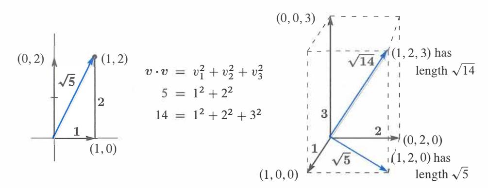

Figure 1.6: The length VV-:V of two-dimensional and three-dimensional vectors.

The word **"unit"** is always indicating that some measurement equals "one". The unit price is the price for one item. A unit cube has sides of length one. A unit circle is a circle with radius one. Now we see the meaning of a "unit vector".

**DEFINITION** *A unit vector u is a vector whose length equals one.* Then *u* · *u* = 1.

An example in four dimensions is *u* = ( ½, ½, ½, ½) . Then *u* · *u* is ¾ + ¾ + ¾ + ¾ = 1. We divided v = (1, 1, 1, 1) by its length llvll = 2 to get this unit vector.

**Example 4** The standard unit vectors along the x and y axes are written i and *j.* In the *xy* plane, the unit vector that makes an angle "theta" with the *x* axis is ( cos 0, sin 0):

| Unit vectors | $i = \begin{bmatrix} 1 \\ 0 \end{bmatrix}$ | and | $j = \begin{bmatrix} 0 \\ 1 \end{bmatrix}$ | and | $u = \begin{bmatrix} \cos \theta \\ \sin \theta \end{bmatrix}$ |
|--------------|--------------------------------------------|-----|--------------------------------------------|-----|----------------------------------------------------------------|
|--------------|--------------------------------------------|-----|--------------------------------------------|-----|----------------------------------------------------------------|

When 0 = 0, the horizontal vector *u* is i. When 0 = 90 ° (or � radians), the vertical vector is *j.* At any angle, the components cos 0 and sin 0 produce u · u = 1 because cos20 + sin 20 = 1. These vectors reach out to the unit circle in Figure 1. 7. Thus cos 0 and sin 0 are simply the coordinates of that point at angle 0 on the unit circle.

Since (2, 2, 1) has length 3, the vector ( l, *i,* ½) has length l. Check that *u* · *u* ½ +½ + ½ = l. For a unit vector, **divide any nonzero vector** *v* **by its length** llvll-

**Unit vector** *u* **=** *v I* 11 *v* 11 **is a unit vector in the same direction as** *v.*

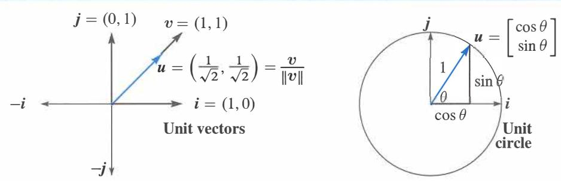

Figure 1.7: The coordinate vectors i and *j.* The unit vector *u* at angle 45 ° (left) divides *v*= (1, 1) by its length llvll = \/'2. The unit vector *u* = ( cos 0, sin 0) is at angle 0.

### **The Angle Between Two Vectors**

We stated that perpendicular vectors have *v* · *w* = 0. The dot product is zero when the angle is go0 • To explain this, we have to connect angles to dot products. Then we show how *v* · *w* finds the angle between any two nonzero vectors*v*and *w.* 

**Right angles** *The dot product is v* · *w* = 0 *when v is perpendicular to w.*

*Proof* When *v* and *w* are perpendicular, they form two sides of a right triangle. The third side is *v* - *w* (the hypotenuse going across in Figure 1.8). The *Pythagoras Law* for the sides of a right triangle is a 2+b 2= c2 :

| Perpendicular vectors | $\ v\ ^2 + \ w\ ^2 = \ v - w\ ^2$ | (2) |
|-----------------------|-----------------------------------|-----|
|-----------------------|-----------------------------------|-----|

Writing out the formulas for those lengths in two dimensions, this equation is

| <b>Pythagoras</b> | $(v_1^2 + v_2^2) + (w_1^2 + w_2^2) = (v_1 - w_1)^2 + (v_2 - w_2)^2$ . | (3) |
|-------------------|-----------------------------------------------------------------------|-----|
|-------------------|-----------------------------------------------------------------------|-----|

The right side begins with *vf* - 2v1 w1+*wf.* Then *vf* and *wf* are on both sides of the equation and they cancel, leaving -2v1 w1. Also *v�* and w� cancel, leaving -2v2w2. (In three dimensions there would be *-2v3*w*3.)* Now divide by -2 to see *v* - *w* = 0:

| $0 = -2v_1w_1 - 2v_2w_2$ | which leads to | $v_1w_1 + v_2w_2 = 0$ . | (4) |
|--------------------------|----------------|-------------------------|-----|
|--------------------------|----------------|-------------------------|-----|

**Conclusion** Right angles produce v · *w* = 0. The dot product is zero when the angle is 0 = go0 • Then cos 0 = 0. The zero vector v = 0 is perpendicular to every vector *w* because O · *w* is always zero.

Now suppose v · w is **not zero.** It may be positive, it may be negative. The sign of v · *w* immediately tells whether we are below or above a right angle. The angle is less than go0 when v · *w* is positive. The angle is above go0 when v · *w* is negative. The right side of Figure 1. 8 shows a typical vector v = ( 3, 1). The angle with w = ( 1, 3) is less than goo because v · w = 6 is positive.

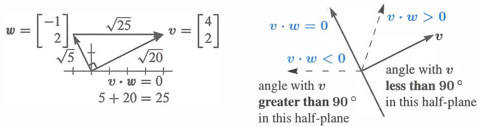

Figure 1.8: Perpendicular vectors have v · *w* = 0. Then llvll 2+ llwll 2= llv - wll 2 .

The borderline is where vectors are perpendicular to v. On that dividing line between plus and minus, (1, -3) is perpendicular to (3, 1 ). The dot product is zero.

**The dot product reveals the exact angle** *0.* For unit vectors *u* and *U,* the sign of *u* · *U* tells whether *0* < go0 or *0* > go0 • More than that, *the dot product* u · *U is the cosine of 0.* This remains true in n dimensions.

**Unit vectors** u **and** *U* **at angle** *0* **have** u · *U* = cos *0.* **Certainly** lu · UI ::::; 1.

Unit vectors 
$$u$$
 and  $U$  at angle  $\theta$  have  $|u \cdot U| = \cos \theta$ . Certainly  $|u \cdot U| \leq 1$ .

Remember that cos *0* is never greater than 1. It is never less than -1. *The dot product of unit vectors is between* -1 *and* 1. **The cosine of** *0* **is revealed by** u · *U.* 

Figure 1.9 shows this clearly when the vectors are u = (cos0,sin0) and i = (1,0). The dot product is u · i = cos 0. That is the cosine of the angle between them.

After rotation through any angle a, these are still unit vectors. The vector i = (1, 0) rotates to ( cos a, sin a). The vector u rotates to ( cos /3, sin /3) with /3 = a + *0.* Their dot product is cos a cos /3 + sin a sin /3. From trigonometry this is cos(/3 - a) = cos *0.* 

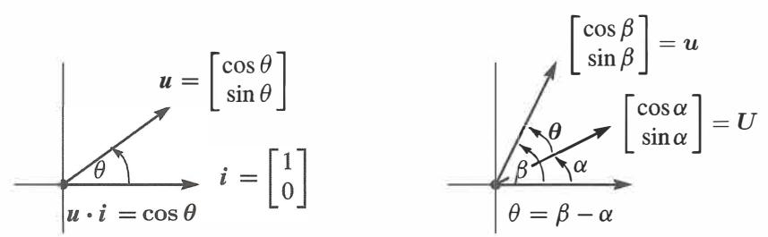

Figure 1.9: Unit vectors: u · *U* is the cosine of *0* (the angle between).

*What if v and ware not unit vectors?* Divide by their lengths to get *u* = *v/llvll* and *U*= *w/llwll-* Then the dot product of those unit vectors *u* and *U* gives cos *0.* 

**COSINE FORMULA** If 
$$v$$
 and  $w$  are nonzero vectors then  $\frac{v \cdot w}{\|v\| \|w\|} = \cos \theta$ . (5)

Whatever the angle, this dot product of *v/llvll* with w/llwll never exceeds one. That is the *"Schwarz inequality" Iv·* wl ::::; llvll *llwll* for dot products-or more correctly the Cauchy-Schwarz-Buniakowsky inequality. It was found in France and Germany and Russia (and maybe elsewhere-it is the most important inequality in mathematics).

Since I cos BJ never exceeds 1, the cosine formula gives two great inequalities:

**SCHWARZ INEQUALITY** 

**TRIANGLE INEQUALITY** 

*lv·wl* s:; *llvll* llwll

llv + wll ::::; llvll +*llwll*

**Example 5** Find cos *0* for v = [ � ] and *w* = [ � ] and check both inequalities.

**Solution** The dot product is *v* · *w* = 4. Both *v* and *w* have length )5. The cosine is 4/5.

$$\cos \theta = \frac{v \cdot w}{\|v\| \|w\|} = \frac{4}{\sqrt{5}\sqrt{5}} = \frac{4}{5}.$$

By the Schwarz inequality, v · *w* = 4 is less than jjvjj l lwll = 5. By the triangle inequality, side 3 = jjv + wjj is less than side 1 + side 2. For v + *w* = (3, 3) the three sides are yl8 < v5 + )5. Square this triangle inequality to get 18 < 20.

**Example 6** The dot product of *v* = *(a, b)* and *w* = *(b, a)* is *2ab.* Both lengths are v' a 2+b . The Schwarz inequality *v* · *w* s:; I !vi 11 lwl I says that *2ab* s:; a 2+ b

This is more famous if we write x = a2 and y = b2 . The "geometric mean" vxfi is not larger than the "arithmetic mean" = average ½ ( x + *y).*

| Geometric mean | Arithmetic mean | $ab \leq \frac{a^2 + b^2}{2}$ | becomes | $\sqrt{xy} \leq \frac{x + y}{2}$ |
|----------------|-----------------|-------------------------------|---------|----------------------------------|
|                |                 |                               |         |                                  |

Example 5 had a = 2 and b = 1. So x = 4 and y = 1. The geometric mean ,.jxfj = 2 is below the arithmetic mean ½ (1 + 4) = 2.5.

### **Notes on Computing**

MATLAB, Python *and* Julia *work directly with whole vectors, not their components.* When *v* and *w* have been defined, *v* + *w* is immediately understood. Input *v* and *w* as rows-the prime ' transposes them to columns. 2v + *3w* becomes 2 \* v + 3 \* *w.* The result will be printed unless the line ends in a semicolon.

| MATLAB | $v = [2 \ 1 \ 4]'$ | $v = [1 \ 1 \ 1]'$ | $v = [2 \ 1 \ 3]'$ |
|--------|--------------------|--------------------|--------------------|
|        |                    |                    |                    |

The dot product *v* · *w* is *a row vector times a column vector (use* \* *instead of·)* :

Instead of 
$$\begin{bmatrix} 1 \\ 2 \end{bmatrix} \cdot \begin{bmatrix} 3 \\ 4 \end{bmatrix}$$
 we more often see  $\begin{bmatrix} 1 & 2 \end{bmatrix} \begin{bmatrix} 3 \\ 4 \end{bmatrix}$  or  $v' * w$ 

The length of *v* is known to MATLAB as norm ( *v).* This is sqrt ( *v'* \* *v).* Then find the cosine from the dot product *v 1*\* *w* and the angle (in radians) that has that cosine:

| <b>Cosine formula</b> | $\cos i = v' * w' / (\text{norm}(v) * \text{norm}(w))$ |
|-----------------------|--------------------------------------------------------|
| <b>The arc cosine</b> | $\text{angle} = \text{acos}(\text{cosine})$            |

An M-file would create a new function **cosine** ( *v, w* ). Python and Julia are open source.

#### **• REVIEW OF THE KEY IDEAS •**

- **1.** The dot product *v w* multiplies each component *Vi* by *wi* and adds all *viwi.*
- **2.** The length 11 *v* 11 is the square root of *v* · *v.* Then *u* = *v* / 11 *v* 11 is a *unit vector* : length 1.
- 3. The dot product is *v* · *w* = 0 when vectors *v* and *w* are perpendicular.
- **4.** The cosine of *0* ( the angle between any nonzero *v* and *w)* never exceeds I:

| Cosine | $\cos \theta = \frac{v \cdot w}{\ v\  \ w\ }$ | Schwarz inequality | $ v \cdot w  \leq \ v\  \ w\ $ |
|--------|-----------------------------------------------|--------------------|--------------------------------|
|--------|-----------------------------------------------|--------------------|--------------------------------|

#### **• WORKED EXAMPLES •**

**1.2 A** For the vectors *v* = ( 3, 4) and *w* = ( 4, 3) test the Schwarz inequality on *v* · *w* and the triangle inequality on llv + wll- Find cos0 for the angle between *v* and *w.* Which *v* and *w* give *equality* Iv· wl=llvll llwll and llv + wll=llvll + llwll?

**Solution** The dot product is *v* · *w* = (3)(4) + (4)(3) = 24. The length of *v* is llvll = v9 + 16 = 5 and also llwll = 5. The sum *v*+ *w* = (7, 7) has length 7v12 < 10.

**Schwarz inequality** Iv· wl ::; llvll llwll is 24 < 25.

| Triangle inequality | $\ v + w\  \leq \ v\  + \ w\ $ | is | $7\sqrt{2} < 5 + 5$ |
|---------------------|--------------------------------|----|---------------------|
|                     |                                |    |                     |

| Cosine of angle | $\cos \theta = \frac{2\pi}{25}$ | Thin angle from $v = (3, 4)$ to $w = (4, 3)$ |
|-----------------|---------------------------------|----------------------------------------------|
|                 |                                 |                                              |

*Equality:* One vector is a multiple of the other as in *w* = *cv.* Then the angle is 0 ° or 180° . In this case I cos01 = 1 and Iv· wl *equals* llvll llwll- If the angle is 0 , as in w = *2v,* then llv + wll=llvll + llwll (both sides give 3llvll ). This *v, 2v, 3v* triangle is flat!

**1.2 B** Find a unit vector *u* in the direction of *v* = (3, 4). Find a unit vector *U* that is perpendicular to *u.* How many possibilities for *U?* 

**Solution** For a unit vector *u,* divide *v* by its length llvll = 5. For a perpendicular vector *V*we can choose (-4, 3) since the dot product *v* ·Vis (3)(-4) + (4)(3) = 0. For a *unit*  vector perpendicular to *u,* divide *V* by its length IIV II:

$$\mathbf{u} = \frac{\mathbf{v}}{\|\mathbf{v}\|} = \begin{pmatrix} 3 & 4 \\ 5 & 5 \end{pmatrix} \quad \mathbf{U} = \frac{\mathbf{V}}{\|\mathbf{V}\|} = \begin{pmatrix} 4 & 3 \\ 5 & 5 \end{pmatrix} \quad \mathbf{u} \cdot \mathbf{U} = 0$$

The only other perpendicular unit vector would be *-U* = ( *t,* -¾).

**1.2 C** Find a vector *x* = ( c, *d)* that has dot products *x* · *r* = 1 and *x* · *s* = 0 with two given vectors *r* = (2, -1) ands = (-1, 2).

**Solution** Those two dot products give linear equations for *c* and *d.* Then *x* = ( c, *d).* 

| $\mathbf{x} \cdot \mathbf{r} = 1$ | is | $2c - d = 1$  | The same equations as |
|-----------------------------------|----|---------------|-----------------------|
| $\mathbf{x} \cdot \mathbf{s} = 0$ | is | $-c + 2d = 0$ | in Worked Example 1.1 |

*Comment on n equations for x* = (x1, ... , *Xn) inn-dimensional space* 

Section 1.1 would start with columns *v j*· The goal is to produce x1 v1 + · · · + *Xn Vn* = *b.* This section would start from rows *ri .* Now the goal is to find *x* with *x* · *Ti* =*bi .* 

Soon the *v's* will be the columns of a matrix *A,* and the *r's* will be the rows of *A.* Then the (one and only) problem will be to solve *Ax* = *b.*

#### **Problem Set 1.2**

**1**Calculate the dot products *u* · *v* and *u* · *w* and *u* · ( *v* +*w)* and *w* · *v:* 

$$\mathbf{u} = \begin{bmatrix} -.6 \\ .8 \end{bmatrix}, \quad \mathbf{v} = \begin{bmatrix} 4 \\ 3 \end{bmatrix}, \quad \mathbf{w} = \begin{bmatrix} 1 \\ 2 \end{bmatrix}.$$

- **2**Compute the lengths llull and llvll and llwll of those vectors. Check the Schwarz inequalities lu ·vi::::; llull llvll and Iv· wl ::::; llvll llwll. **3**Find unit vectors in the directions of *v* and *w* in Problem 1, and the cosine of the angle *0.* Choose vectors *a, b, c* that make 0 , 90° , and 180° angles with *w.*  4 For any *unit* vectors *v* and *w,* find the dot products (actual numbers) of
- (a) *v* and *-v* (b) *v* +*w* and *v w* (c) *v*  2w and *v* +2w 5 Find unit vectors u1 and u2 in the directions of *v* =(l, 3) and *w* =(2, 1, 2). Find unit vectors *U* 1 and *U* 2 that are perpendicular to u1 and u2.

- 6 ( a ) Describe every vector w = ( w1, w2) that is perpendicular to v = ( 2, -1).
  - (b) All vectors perpendicular to V = (1, 1, 1) lie on a \_\_ in 3 dimensions.
- (c) The vectors perpendicular to both (1, 1, 1) and (1, 2, 3) lie on a \_\_ . **7**Find the angle 0 (from its cosine) between these pairs of vectors:
  - (a) *V*=[�] and w = [�] (b) *V* [j] and w � Hl
- (c) *V*=[ �] and w = [ �] (d) *V* = [�] and w = [=� l 8 True or false (give a reason if true or find a counterexample if false):
  - (a) If u = (1, 1, 1) is perpendicular to v and w, then vis parallel tow.
  - (b) If u is perpendicular to v and w, then u is perpendicular to v + 2w.
- (c) If *u* and *v* are perpendicular unit vectors then llu v/1 = ,v2. *Yes!* 9 The slopes of the arrows from (0, 0) to (v1, v*2 )* and (w1, w*2 )* are v*2*/v*1* and w*2*/w*1.*  Suppose the product v*2*w*2* / v1 w1 of those slopes is -1. Show that v · w = 0 and the vectors are perpendicular. (The line y = 4x is perpendicular to y = -¼ x.) 10 Draw arrows from (0, 0) to the points v = (1, 2) and w = (-2, 1). Multiply their slopes. That answer is a signal that v · w = 0 and the arrows are \_\_ . 11 If v · w is negative, what does this say about the angle between v and w? Draw a 3-dimensional vector v (an arrow), and show where to find all w's with v · w < 0. 12 With v = (1, 1) and w = (1, 5) choose a number c so that w - cv is perpendicular to *v.* Then find the formula for *c* starting from *any* nonzero *v* and w. 13 Find nonzero vectors v and w that are perpendicular to (1, 0, 1) and to each other. 14 Find nonzero vectors u, v, w that are perpendicular to (1, 1, 1, 1) and to each other. 15 The geometric mean of x = 2 and y = 8 is *vX'fJ* = 4. The arithmetic mean is larger: ½ ( x + *y)* = \_\_ . This would come in Example 6 from the Schwarz inequality for v = ( J2, VS) and w = ( VS, J2). Find cos0 for this v and w. 16 How long is the vector v = (1, 1, ... , 1) in 9 dimensions? Find a unit vector u in the same direction as v and a unit vector w that is perpendicular to v. 17 What are the cosines of the angles a, *f3,* 0 between the vector ( 1, 0, -1) and the unit vectors i, *j, k* along the axes? Check the formula cos2*a* + cos2*f3* + cos2*0* = 1.

| (a) $v = \begin{bmatrix} 1 \\ \sqrt{3} \end{bmatrix}$ | and $w = \begin{bmatrix} 1 \\ 0 \end{bmatrix}$         | (b) $v = \begin{bmatrix} 2 \\ 2 \\ -1 \end{bmatrix}$ | and $w = \begin{bmatrix} 2 \\ -1 \\ 2 \end{bmatrix}$ |
|-------------------------------------------------------|--------------------------------------------------------|------------------------------------------------------|------------------------------------------------------|
| (c) $v = \begin{bmatrix} 1 \\ \sqrt{3} \end{bmatrix}$ | and $w = \begin{bmatrix} -1 \\ \sqrt{3} \end{bmatrix}$ | (d) $v = \begin{bmatrix} 3 \\ 1 \end{bmatrix}$       | and $w = \begin{bmatrix} -1 \\ -2 \end{bmatrix}$     |

**Problems 18-28 lead to the main facts about lengths and angles in triangles.** 

**18**The parallelogram with sides *v* = ( 4, 2) and *w* = ( -1, 2) is a rectangle. Check the Pythagoras formula a 2+ b 2= c 2which is for *right triangles only:*

(length of 
$$v$$
)2 + (length of  $w$ )2 = (length of  $v + w$ )2.

- **19**(Rules for dot products) These equations are simple but useful:
- **(1)** *V W* = *W V* **(2)** *U* ( *V*+ *W)* = *U V* + *U W* **(3)** *(CV) W* = c( *V W)*  Use **(2)** with *u* = *v* + *w*to prove llv + wll 2= *v* · *v* +2v · *w* + *w* · *w.* **20**The "Law of Cosines" comes from *(v* - *w)* · *(v* - *w)* = *v* · *v* - 2v · *w*+ *w* · w:

| Cosine Law | $\ v - w\ ^2 = \ v\ ^2 - 2\ v\  \ w\  \cos \theta + \ w\ ^2$ |
|------------|--------------------------------------------------------------|
|            |                                                              |

Draw a triangle with sides *v* and *w* and *v* - *w.* Which of the angles is *0* ?

21 The *triangle inequality* says: (length of *v* + *w)* :::; (length of *v)* + (length of *w* ). Problem 19 found llv + wll 2= llvll 2+2v · *w*+ llwll 2 . Increase that v · *w* to llvll llwll to show that II **side** 311 can not exceed II **side** 111 + II **side** 211:

| Triangle inequality | $\ v + w\ ^2 \leq (\ v\  + \ w\ )^2$ | or | $\ v + w\  \leq \ v\  + \ w\ $ . |
|---------------------|--------------------------------------|----|----------------------------------|
|                     |                                      |    |                                  |

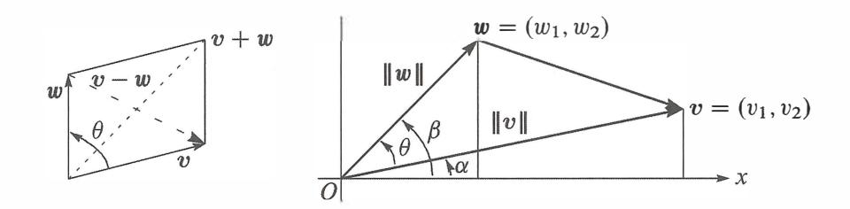

- **22**The Schwarz inequality Iv · wl :::; llvll llwll by algebra instead of trigonometry:
  - (a) Multiply out both sides of ( V1 W1 + V2W2) 2:::; (Vi+ V§) ( Wi + W§).
- (b) Show that the difference between those two sides equals (v1w2 v2w1) . This cannot be negative since it is a square-so the inequality is true. **23**The figure shows that cosa = vi/l lvll and sina = v2/llvll
  - Similarly *cos/3* is \_\_ and sin */3* is \_\_ . The angle *0* is */3 a.* Substitute into the trigonometry formula cos */3* cos *a+* sin */3* sin *a* for cos(/3 -a) to find cos *0* = *v* · *w* /llvll llwll-

24 One-line proofofthe inequality lu · UI \$ 1 for unit vectors (u1, u2) and (U1, U2) :

$$|\mathbf{u} \cdot \mathbf{U}| \leq |u_1| |U_1| + |u_2| |U_2| \leq \frac{u_1^2 + U_1^2}{2} + \frac{u_2^2 + U_2^2}{2} = 1.$$

Put ( u1, u2) **= (** .6, .8) and (U1, U2) **= (** .8, .6) in that whole line and find cos 0.

25 Why is I cos 01 never greater than 1 in the first place? 26 *(Recommended)* Draw a parallelogram 27 Parallelogram with two sides *v* and *w.* Show that the squared diagonal lengths llv + wll 2+ //v w/1 2add to the sum of four squared side lengths 2llvl/ 2+ 2//wll 2 . 28 If *v* **=** (1, 2) draw all vectors *w* **=** (x, y) in the *xy* plane with *v* · *w* **=** *x* + 2y **=** 5. Why do those *w's* lie along a line? Which is the shortest *w?*  29 *(Recommended)* If *//v/* I = 5 and I lw/ I = 3, what are the smallest and largest possible values of I /v - *w//?* What are the smallest and largest possible values of v · *w?* 

### **Challenge Problems**

30 Can three vectors in the *xy* plane have *u* · *v* < 0 and *v* · *w* < 0 and *u* · *w* < O? I don't know how many vectors in *xyz* space can have all negative dot products. (Four of those vectors in the plane would certainly be impossible ... ). 31 Pick any numbers that add to x + *y* + z = 0. Find the angle between your vector *v* **=** (x, *y,* z) and the vector *w* **=** (z, *x,* y). Challenge question: Explain why v · w///v// 1/wll is always-½- **32**How could you prove *{/xfii* \$ ½ ( *x* + *y* + z) ( geometric mean \$ arithmetic mean) ? 33 Find 4 perpendicular unit vectors of the form ( ± ½, ± ½, ± ½, ± ½): Choose + or -. **34**Using v **=** randn(3, 1) in MATLAB, create a random unit vector u **=** v///vll- Using V **=** randn ( 3, 30) create 30 more random unit vectors UJ . What is the average size of the dot products I *u* · *Uj* I? In calculus, the average is *f0,r* I cos *0* I *d0* / *1r* = 2 / 7f.

### **1.3 Matrices**

[ : l 4 2 6 1 A = ] is a 3 by 2 matrix: *m* = 3 rows and *n* = 2 columns.

| $2 Ax = \begin{bmatrix} 1 & 2 \\ 3 & 4 \\ 5 & 6 \end{bmatrix}$ | $\begin{bmatrix} x_1 \\ x_2 \end{bmatrix}$ | is a <b>combination of the columns</b> | $Ax = x_1 \begin{bmatrix} 1 \\ 3 \\ 5 \end{bmatrix} + x_2 \begin{bmatrix} 2 \\ 4 \\ 6 \end{bmatrix}$ |
|----------------------------------------------------------------|--------------------------------------------|----------------------------------------|------------------------------------------------------------------------------------------------------|
|----------------------------------------------------------------|--------------------------------------------|----------------------------------------|------------------------------------------------------------------------------------------------------|

3 The 3 components of *Ax* are dot products of the 3 rows of *A* with the vector *x :* 

| Row at a time | $\begin{bmatrix} 1 & 2 \\ 3 & 4 \\ 5 & 6 \end{bmatrix}$ | $\begin{bmatrix} 7 \\ 8 \end{bmatrix} = \begin{bmatrix} 1 \cdot 7 + 2 \cdot 8 \\ 3 \cdot 7 + 4 \cdot 8 \\ 5 \cdot 7 + 6 \cdot 8 \end{bmatrix} = \begin{bmatrix} 23 \\ 53 \\ 83 \end{bmatrix}$ |
|---------------|---------------------------------------------------------|-----------------------------------------------------------------------------------------------------------------------------------------------------------------------------------------------|
|---------------|---------------------------------------------------------|-----------------------------------------------------------------------------------------------------------------------------------------------------------------------------------------------|

| 4 | Equations in matrix form $Ax = b$ : | $\begin{bmatrix} 2 & 5 \\ 3 & 7 \end{bmatrix} \begin{bmatrix} x_1 \\ x_2 \end{bmatrix} = \begin{bmatrix} b_1 \\ b_2 \end{bmatrix}$ replaces | $2x_1 + 5x_2 = b_1$ $3x_1 + 7x_2 = b_2$ |
|---|-------------------------------------|---------------------------------------------------------------------------------------------------------------------------------------------|--------------------------------------------|
|---|-------------------------------------|---------------------------------------------------------------------------------------------------------------------------------------------|--------------------------------------------|

**5**The solution to *Ax* = *b* can be written as *x* = *A -*1*b.* But some matrices don't allow *A -*1 .

This section starts with three vectors *u, v, w.* I will combine them using *matrices.* 

| Three vectors | $u = \begin{bmatrix} 1 \\ -1 \\ 0 \end{bmatrix}$ | $v = \begin{bmatrix} 0 \\ 1 \\ -1 \end{bmatrix}$ | $w = \begin{bmatrix} 0 \\ 0 \\ 1 \end{bmatrix}$ |
|---------------|--------------------------------------------------|--------------------------------------------------|-------------------------------------------------|
|               |                                                  |                                                  |                                                 |

Their linear combinations in three-dimensional space are x1*u* + *x2v* + *x3w:* 

| Combination of the vectors | $x_1 \begin{bmatrix} 1 \\ -1 \\ 0 \end{bmatrix} + x_2 \begin{bmatrix} 0 \\ 1 \\ -1 \end{bmatrix} + x_3 \begin{bmatrix} 0 \\ x_2 - x_1 \\ x_3 - x_2 \end{bmatrix} = \begin{bmatrix} x_1 \\ x_2 - x_1 \\ x_3 - x_2 \end{bmatrix}$ | $\bullet$ | (1) |
|----------------------------|---------------------------------------------------------------------------------------------------------------------------------------------------------------------------------------------------------------------------------|-----------|-----|
|                            |                                                                                                                                                                                                                                 |           |     |

Now something important: *Rewrite that combination using a matrix.* The vectors *u, v, w*  go into the columns of the matrix *A.* That matrix *"multiplies"* the vector ( x1, *x2, x3)* :

| Matrix times vector    | $Ax = \begin{bmatrix} 1 & 0 & 0 \\ -1 & 1 & 0 \\ 0 & -1 & 1 \end{bmatrix}$ | $\begin{bmatrix} x_1 \\ x_2 \\ x_3 \end{bmatrix} = \begin{bmatrix} x_1 \\ x_2 - x_1 \\ x_3 - x_2 \end{bmatrix}$ | (2) |
|------------------------|----------------------------------------------------------------------------|-----------------------------------------------------------------------------------------------------------------|-----|
| Combination of columns |                                                                            |                                                                                                                 |     |

The numbers x1, x*2,* x*3*are the components of a vector x. The matrix *A* times the vector x is the **same** as the combination x1*u* + *x2v* + *x3w* of the three columns in equation (1).

This is more than a definition of *Ax,* because the rewriting brings a crucial change in viewpoint. At first, the numbers x1, x2, *x3* were multiplying the vectors. Now the matrix is multiplying those numbers. **The matrix** *A* **acts on the vector** *x.* The output *Ax* is a **combination** b **of the columns of** *A.* 

To see that action, I will write b1, b2, *b3* for the components of *Ax* :

| $Ax = \begin{bmatrix} 1 & 0 & 0 \\ -1 & 0 & 0 \\ 0 & -1 & 1 \end{bmatrix} \begin{bmatrix} x_1 \\ x_2 \\ x_3 \end{bmatrix} = \begin{bmatrix} x_1 \\ x_2 - x_1 \\ x_3 - x_2 \end{bmatrix} = \begin{bmatrix} b_1 \\ b_2 \\ b_3 \end{bmatrix} = b. \tag{3}$ |
|---------------------------------------------------------------------------------------------------------------------------------------------------------------------------------------------------------------------------------------------------------|
|---------------------------------------------------------------------------------------------------------------------------------------------------------------------------------------------------------------------------------------------------------|

The input is *x* and the output is b = *Ax.* This *A* is a **"difference matrix"** because b contains differences of the input vector x. The top difference is x1 - x*0* = x1 - 0.

Here is an example to show differences of *x* = (1, 4, 9): squares in *x,* odd numbers in b.

| $x = \begin{bmatrix} 1 \\ 4 \\ 9 \end{bmatrix} = \text{squares}$ | $Ax = \begin{bmatrix} 1 - 0 \\ 4 - 1 \\ 9 - 4 \end{bmatrix} = \begin{bmatrix} 1 \\ 3 \\ 5 \end{bmatrix} = b.$ | (4) |
|------------------------------------------------------------------|---------------------------------------------------------------------------------------------------------------|-----|
|------------------------------------------------------------------|---------------------------------------------------------------------------------------------------------------|-----|

That pattern would continue for a 4 by 4 difference matrix. The next square would be x*4* = 16. The next difference would be x*4* - x*3*=16 - 9 = 7 (the next odd number). The matrix finds all the differences 1, 3, 5, 7 at once.

**Important Note: Multiplication a row at a time.** You may already have learned about multiplying *Ax,* a matrix times a vector. Probably it was explained differently, using the rows instead of the columns. The usual way takes the dot product of each row with x:

**A** ***x*** is also 
$$\begin{bmatrix} 1 & 0 & 0 & 0 \\ \text{dot products} & -1 & 1 & 0 \\ \text{with rows} & 0 & -1 & 1 \end{bmatrix} \begin{bmatrix} x_1 \\ x_2 \\ x_3 \end{bmatrix} = \begin{bmatrix} (1, 0, 0) \cdot (x_1, x_2, x_3) \\ (-1, 1, 0) \cdot (x_1, x_2, x_3) \\ (0, -1, 1) \cdot (x_1, x_2, x_3) \end{bmatrix} \cdot (5)$$

Those dot products are the same x1 and x2 - x1 and *X3*- x2 that we wrote in equation (3). The new way is to work with *Ax a column at a time.* Linear combinations are the key to linear algebra, and the output *Ax* is a linear combination of the **columns** of *A.*

With numbers, you can multiply *Ax* by rows. With letters, columns are the good way. Chapter 2 will repeat these rules of matrix multiplication, and explain the ideas.

### **Linear Equations**

One more change in viewpoint is crucial. Up to now, the numbers x1, x2, *x3* were known. The right hand side b was not known. We found that vector of differences by multiplying *A*times *x.* **Now we think of bas known and we look for** *x.* 

*Old question:* Compute the linear combination x1*u* + *x2v* + *X3W* to find b.

*New question:* Which combination of *u, v, w* produces a particular vector *b?* 

This is the *inverse problem-to* find the input *x* that gives the desired output *b* = *Ax.*  You have seen this before, as a system of linear equations for x1, x2, *x3 •* The right hand sides of the equations are b1, b2, *b3 .* I will now solve that system *Ax= b* to find x1, x2, *x3 :* 

|  | $x_1 = b_1$ $-x_1 + x_2 = b_2$ $-x_2 + x_3 = b_3$ |  | <b>Solution</b> $x = A^{-1}b$ | $x_1 = b_1$ $x_2 = b_1 + b_2$ $x_3 = b_1 + b_2 + b_3.$ | (6) |
|--|---------------------------------------------------|--|-------------------------------|--------------------------------------------------------|-----|
|--|---------------------------------------------------|--|-------------------------------|--------------------------------------------------------|-----|

Let me admit right away-most linear systems are not so easy to solve. In this example, the first equation decided x1 = b1 . Then the second equation produced x2 = b1 + b2. *The equations can be solved in order* (top to bottom) *because A is a triangular matrix.* 

Look at two specific choices 0, 0, 0 and 1, 3, 5 of the right sides b1, b2, b3:

| $b = \begin{bmatrix} 0 \\ 0 \\ 0 \end{bmatrix}$ | gives $x = \begin{bmatrix} 0 \\ 0 \\ 0 \end{bmatrix}$ | $b = \begin{bmatrix} 1 \\ 3 \\ 5 \end{bmatrix}$ | gives $x = \begin{bmatrix} 1 \\ 1+3 \\ 1+3+5 \end{bmatrix} = \begin{bmatrix} 1 \\ 4 \\ 9 \end{bmatrix}$ |
|-------------------------------------------------|-------------------------------------------------------|-------------------------------------------------|---------------------------------------------------------------------------------------------------------|
|-------------------------------------------------|-------------------------------------------------------|-------------------------------------------------|---------------------------------------------------------------------------------------------------------|

The first solution (all zeros) is more important than it looks. In words: *If the output is b*= 0, *then the input must be x* = 0. That statement is true for this matrix *A.* It is not true for all matrices. Our second example will show (for a different matrix *C)* how we can have *Cx* = 0 when *C =/-* 0 and *x =/-* 0.

This matrix *A* is **"invertible".** From *b* we can recover *x.* We write *x* as A- 1*b.*

#### **The Inverse Matrix**

Let me repeat the solution *x* in equation (6). A sum matrix will appear!

| $Ax = b$ is solved by | $\begin{bmatrix} x_1 \\ x_2 \\ x_3 \end{bmatrix} = \begin{bmatrix} b_1 \\ b_1 + b_2 \\ b_1 + b_2 + b_3 \end{bmatrix} = \begin{bmatrix} 1 & 0 & 0 \\ 1 & 1 & 0 \\ 1 & 1 & 1 \end{bmatrix} \begin{bmatrix} b_1 \\ b_2 \\ b_3 \end{bmatrix} \cdot (7)$ |
|-----------------------|-----------------------------------------------------------------------------------------------------------------------------------------------------------------------------------------------------------------------------------------------------|
|-----------------------|-----------------------------------------------------------------------------------------------------------------------------------------------------------------------------------------------------------------------------------------------------|

If the differences of the *x's* are the *b's,* the sums of the *b's* are the *x's.* That was true for the odd numbers *b* = (1, 3, 5) and the squares *x* = (1, 4, 9). It is true for all vectors. **The sum matrix in equation** (7) **is the inverse** *A* - 1 **of the difference matrix** *A.*

Example: The differences of *x* = (1, 2, 3) are *b* = (1, 1, 1). *Sob= Ax* and *x* = A-1 b:

| $Ax = \begin{bmatrix} 1 & 0 & 0 \\ -1 & 1 & 0 \\ 0 & -1 & 1 \end{bmatrix}$ | $\begin{bmatrix} 1 \\ 2 \\ 3 \end{bmatrix}$ | $= \begin{bmatrix} 1 \\ 1 \\ 1 \end{bmatrix}$ | $A^{-1}b = \begin{bmatrix} 1 & 0 & 0 \\ 1 & 1 & 0 \\ 1 & 1 & 1 \end{bmatrix}$ | $\begin{bmatrix} 1 \\ 1 \\ 1 \end{bmatrix}$ | $= \begin{bmatrix} 1 \\ 2 \\ 3 \end{bmatrix}$ |
|----------------------------------------------------------------------------|---------------------------------------------|-----------------------------------------------|-------------------------------------------------------------------------------|---------------------------------------------|-----------------------------------------------|
|                                                                            |                                             |                                               |                                                                               |                                             |                                               |

Equation (7) for the solution vector *x* = ( x1, x2, x3) tells us two important facts:

1. For every *b* there is one solution to *Ax* = *b.* 2. The matrix A- 1 produces *x* = *A-1b.*

The next chapters ask about other equations *Ax* = *b.* Is there a solution? How to find it?

*Note on calculus.* Let me connect these special matrices to calculus. The vector *x* changes to a function *x(t).* The differences *Ax* become the *derivative dx/dt* = *b(t).* In the inverse direction, the sums A- 1*b*become the *integral* of *b(* t). **Sums of differences are like integrals of derivatives.** 

The Fundamental Theorem of Calculus says : *integration is the inverse of differentiation* .

| $Ax = b$ and $x = A^{-1}b$ | $\frac{dx}{dt} = b$ and $x(t) = \int_0^t b dt.$ | (8) |
|----------------------------|-------------------------------------------------|-----|
|----------------------------|-------------------------------------------------|-----|

The differences of squares 0, 1, 4, 9 are odd numbers 1, 3, 5. The derivative of *x(t)* = t2 is 2t. A perfect analogy would have produced the even numbers *b* = 2, 4, 6 at times *t* = 1, 2, 3. But differences are not the same as derivatives, and our matrix *A* produces not 2t but 2t - 1:

| Backward | $x(t) - x(t-1) = t^2 - (t-1)^2 = t^2 - (t^2 - 2t + 1) = 2t - 1$ | (9) |
|----------|-----------------------------------------------------------------|-----|
|          |                                                                 |     |

The Problem Set will follow up to show that "forward differences" produce 2t + l. The best choice (not always seen in calculus courses) is a **centered difference** that uses *x(t* + 1) - *x(t* - 1). Divide that *.6.x* by the distance *.6.t* from *t* - 1 to t+ 1, which is 2:

| Centered difference of $x(t) = t^2$ | $\frac{(t+1)^2 - (t-1)^2}{2} = 2t$ | exactly. | (10) |
|-------------------------------------|------------------------------------|----------|------|
|-------------------------------------|------------------------------------|----------|------|

Difference matrices are great. Centered is the best. Our second example is *not invertible.*

# **Cyclic Differences**

This example keeps the same columns u and v but changes *w* to a new vector *w\*:*

| Second example | $u = \begin{bmatrix} 1 \\ -1 \\ 0 \end{bmatrix}$ | $v = \begin{bmatrix} 0 \\ 1 \\ -1 \end{bmatrix}$ | $w^* = \begin{bmatrix} -1 \\ 0 \\ 1 \end{bmatrix}$ |
|----------------|--------------------------------------------------|--------------------------------------------------|----------------------------------------------------|
|                |                                                  |                                                  |                                                    |

Now the linear combinations of *u, v, w\** lead to a **cyclic difference matrix** C:

| Cyclic | $Cx = \begin{bmatrix} 1 & 0 & -1 \\ -1 & 1 & 0 \\ 0 & -1 & 1 \end{bmatrix}$ | $\begin{bmatrix} x_1 \\ x_2 \\ x_3 \end{bmatrix} = \begin{bmatrix} x_1 - x_3 \\ x_2 - x_1 \\ x_3 - x_2 \end{bmatrix} = \mathbf{b}$ | (11) |  |
|--------|-----------------------------------------------------------------------------|------------------------------------------------------------------------------------------------------------------------------------|------|--|
|        |                                                                             |                                                                                                                                    |      |  |

This matrix *C* is not triangular. It is not so simple to solve for **x** when we are given *b.*  Actually it is impossible to find *the* solution to *Cx* = *b,* because the three equations either have **infinitely many solutions** (sometimes) or else **no solution** (usually):

| $Cx = 0$                   | $\begin{bmatrix} x_1 - x_3 \\ x_2 - x_1 \\ x_3 - x_2 \end{bmatrix} = \begin{bmatrix} 0 \\ 0 \\ 0 \end{bmatrix}$ | is solved by all vectors | $\begin{bmatrix} x_1 \\ x_2 \\ x_3 \end{bmatrix} = \begin{bmatrix} c \\ c \\ c \end{bmatrix}$ | $($ |
|----------------------------|-----------------------------------------------------------------------------------------------------------------|--------------------------|-----------------------------------------------------------------------------------------------|-----|
| <b>Infinitely</b>          |                                                                                                                 |                          |                                                                                               |     |
| <b>many <math>x</math></b> |                                                                                                                 |                          |                                                                                               |     |

Every constant vector like *x* = (3, 3, 3) has zero differences when we go cyclically. The undetermined constant c is exactly like the + *C* that we add to integrals. The cyclic differences cycle around to x1- *x3*in the first component, instead of starting from *x0*= 0. The more likely possibility for *Cx* = bis **no solution** *x*at all:

| $Cx = b$ | $\begin{bmatrix} x_1 - x_3 \\ x_2 - x_1 \\ x_3 - x_2 \end{bmatrix} = \begin{bmatrix} 1 \\ 3 \\ 5 \end{bmatrix}$ | Left sides add to 0 Right sides add to 9 <i>No solution</i> $x_1, x_2, x_3$ | (13) |
|----------|-----------------------------------------------------------------------------------------------------------------|-----------------------------------------------------------------------------------|------|
|----------|-----------------------------------------------------------------------------------------------------------------|-----------------------------------------------------------------------------------|------|

Look at this example geometrically. No combination of *u, v,* and *w\** will produce the vector b = (1, 3, 5). The combinations don't fill the whole three-dimensional space. The right sides must have b1+b*2*+b*3*= 0 to allow a solution to *Cx* = *b,* because the left sides x1 -*X3, x2* - x1, and *X3* - *x2* always add to zero. Put that in different words:

**All linear combinations** x1 u + x*2*v + x3*w\** **lie on the plane given by** b1+b*2*+b3 = 0.

**All linear combinations 
$$x_1u + x_2v + x_3w^*$$
 lie on the plane given by  $b_1 + b_2 + b_3 = 0$ .**

This subject is suddenly connecting algebra with geometry. Linear combinations can fill all of space, or only a plane. We need a picture to show the crucial difference between *u, v, w* (the first example) and *u, v, w\** (all in the same plane).

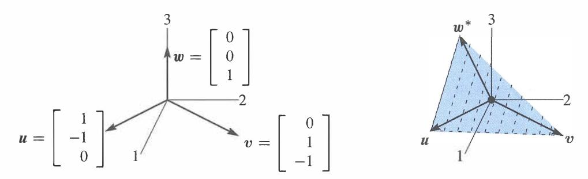

Figure 1.10: Independent vectors *u, v, w.* Dependent vectors *u, v, w\** in a plane.

# **Independence and Dependence**

Figure 1.10 shows those column vectors, first of the matrix *A* and then of *C.* The first two columns *u* and *v* are the same in both pictures. If we only look at the combinations of those two vectors, we will get a two-dimensional plane. **The key question is whether the third vector is in that plane:** 

**Independence** *w*is not in the plane of *u* and *v.*

**Dependence** *w\* is* in the plane of *u* and *v.*

The important point is that the new vector *w\** is a linear combination of *u* and v:

$$\mathbf{u} + \mathbf{v} + \mathbf{w}^* = 0 \quad \mathbf{w}^* = \begin{bmatrix} -1 \\ 0 \\ 1 \end{bmatrix} = -\mathbf{u} - \mathbf{v}. \quad (14)$$

All three vectors *u, v,* w\* have components adding to zero. Then all their combinations will have b 1+b2+b*3* = 0 (as we saw above, by adding the three equations). This is the equation for the plane containing all combinations of *u* and *v.* By including w\* we get *no new vectors* because w\* is already on that plane.

The original *w* = (0, 0, 1) is not on the plane: 0 + 0 + 1 =/- 0. The combinations of *u, v, w* fill the whole three-dimensional space. We know this already, because the solution *x* = *A-1 b* in equation (6) gave the right combination to produce any *b.* 

The two matrices *A* and *C,* with third columns wand w\*, allowed me to mention two key words of linear algebra: independence and dependence. The first half of the course will develop these ideas much further-I am happy if you see them early in the two examples:

*u, v,* ware **independent.** No combination except *Ou+ Ov +Ow=* **0** gives *b* = **0.** 

*u, v, w\** are **dependent.** Other combinations like *u* + *v* + *w\** give *b* = **0.** 

You can picture this in three dimensions. The three vectors lie in a plane or they don't. Chapter 2 has *n* vectors in n-dimensional space. *Independence or dependence* is the key point. The vectors go into the columns of an n by n matrix:

Independent columns: *Ax* = **0** has one solution. *A* is an **invertible matrix.** 

Dependent columns: *Cx* = **0** has many solutions. *C* is a **singular matrix.** 

Eventually we will have *n* vectors in m-dimensional space. The matrix *A* with those *n*  columns is now *rectangular* (m by *n).* Understanding *Ax =bis* the problem of Chapter 3.

#### **• REVIEW OF THE KEY IDEAS •**

- **1. Matrix times vector:** *Ax* = **combination of the columns of** *A.*
- **2.** The solution to *Ax* = *b* is *x* = *A lb,* when *A* is an invertible matrix.
- **3.** The cyclic matrix *C* has no inverse. Its three columns lie in the same plane. Those dependent columns add to the zero vector. *Cx* = 0 has many solutions.
- 4. This section is looking ahead to key ideas, not fully explained yet.

#### **• WORKED EXAMPLES •**

**1.3 A** Change the southwest entry a31 of *A* (row 3, column 1) to a31 = **1:**

| $Ax = b$ | $\begin{bmatrix} 1 & 0 & 0 \\ -1 & 1 & 0 \\ -1 & -1 & 1 \end{bmatrix} \begin{bmatrix} x_1 \\ x_2 \\ x_3 \end{bmatrix} = \begin{bmatrix} x_1 \\ -x_1 + x_2 \\ x_1 - x_2 + x_3 \end{bmatrix} = \begin{bmatrix} b_1 \\ b_2 \\ b_3 \end{bmatrix}$ |
|----------|-----------------------------------------------------------------------------------------------------------------------------------------------------------------------------------------------------------------------------------------------|
|          |                                                                                                                                                                                                                                               |

**Solution** Solve the (linear triangular) system  $A\mathbf{x} = \mathbf{b}$  from top to bottom:

$$\begin{aligned} \text{first } x_1 &= b_1 \\ \text{then } x_2 &= b_1 + b_2 && \text{This says that } \mathbf{x} = A^{-1}\mathbf{b} = \begin{bmatrix} 1 & 0 & 0 \\ 1 & 1 & 0 \\ 0 & 1 & 1 \end{bmatrix} \begin{bmatrix} b_1 \\ b_2 \\ b_3 \end{bmatrix} \\ \text{then } x_3 &= b_2 + b_3 \end{aligned}$$

This is good practice to see the columns of the inverse matrix multiplying  $b_1, b_2$ , and  $b_3$ . The first column of  $A^{-1}$  is the solution for  $\mathbf{b} = (1, 0, 0)$ . The second column is the solution for  $\mathbf{b} = (0, 1, 0)$ . The third column of  $A^{-1}$  is the solution for  $A\mathbf{x} = \mathbf{b} = (0, 0, 1)$ .

The three columns of  $A$  are still independent. They don't lie in a plane. The combinations of those three columns, using the right weights  $x_1, x_2, x_3$ , can produce any three-dimensional vector  $\mathbf{b} = (b_1, b_2, b_3)$ . Those weights come from  $\mathbf{x} = A^{-1}\mathbf{b}$ .

**1.3 B** This  $E$  is an **elimination matrix**.  $E$  has a subtraction and  $E^{-1}$  has an addition.

$$\mathbf{b} = E\mathbf{x} \begin{bmatrix} b_1 \\ b_2 \end{bmatrix} = \begin{bmatrix} x_1 \\ x_2 - \ell x_1 \end{bmatrix} = \begin{bmatrix} 1 & 0 \\ -\ell & 1 \end{bmatrix} \begin{bmatrix} x_1 \\ x_2 \end{bmatrix} \quad E = \begin{bmatrix} 1 & 0 \\ -\ell & 1 \end{bmatrix}$$

The first equation is  $x_1 = b_1$ . The second equation is  $x_2 - \ell x_1 = b_2$ . The inverse will add  $\ell b_1$  to  $b_2$ , because the elimination matrix subtracted :

$$\mathbf{x} = E^{-1}\mathbf{b} \begin{bmatrix} x_1 \\ x_2 \end{bmatrix} = \begin{bmatrix} b_1 \\ \ell b_1 + b_2 \end{bmatrix} = \begin{bmatrix} 1 & 0 \\ \ell & 1 \end{bmatrix} \begin{bmatrix} b_1 \\ b_2 \end{bmatrix} \quad E^{-1} = \begin{bmatrix} 1 & 0 \\ \ell & 1 \end{bmatrix}$$

**1.3 C** Change  $C$  from a cyclic difference to a **centered difference** producing  $x_3 - x_1$ :

$$C\mathbf{x} = \mathbf{b} \begin{bmatrix} 0 & 1 & 0 \\ -1 & 0 & 1 \\ 0 & -1 & 0 \end{bmatrix} \begin{bmatrix} x_1 \\ x_2 \\ x_3 \end{bmatrix} = \begin{bmatrix} x_2 - 0 \\ x_3 - x_1 \\ 0 - x_2 \end{bmatrix} = \begin{bmatrix} b_1 \\ b_2 \\ b_3 \end{bmatrix}. \quad (15)$$

 $C\mathbf{x} = \mathbf{b}$  can only be solved when  $b_1 + b_3 = x_2 - x_1 = 0$ . That is a plane of vectors  $\mathbf{b}$  in three-dimensional space. Each column of  $C$  is in the plane, the matrix has no inverse. So this plane contains all combinations of those columns (which are all the vectors  $C\mathbf{x}$ ).

I included the zeros so you could see that this  $C$  produces "centered differences". Row  $i$  of  $C\mathbf{x}$  is  $x_{i+1}$  (right of center) minus  $x_{i-1}$  (left of center). Here is 4 by 4:

$$\begin{aligned} C\mathbf{x} = \mathbf{b} \\ \text{Centered differences} \quad \begin{bmatrix} 0 & 1 & 0 & 0 \\ -1 & 0 & 1 & 0 \\ 0 & -1 & 0 & 1 \\ 0 & 0 & -1 & 0 \end{bmatrix} \begin{bmatrix} x_1 \\ x_2 \\ x_3 \\ x_4 \end{bmatrix} = \begin{bmatrix} x_2 - 0 \\ x_3 - x_1 \\ x_4 - x_2 \\ 0 - x_3 \end{bmatrix} = \begin{bmatrix} b_1 \\ b_2 \\ b_3 \\ b_4 \end{bmatrix} \end{aligned} \quad (16)$$

Surprisingly this matrix is now invertible! The first and last rows tell you  $x_2$  and  $x_3$ . Then the middle rows give  $x_1$  and  $x_4$ . It is possible to write down the inverse matrix  $C^{-1}$ . But 5 by 5 will be singular (not invertible) again ...

## Problem Set 1.3

1 Find the linear combination  $3s_1 + 4s_2 + 5s_3 = b$ . Then write  $b$  as a matrix-vector multiplication  $Sx$ , with 3, 4, 5 in  $x$ . Compute the three dot products (row of  $S$ )  $\cdot x$ :

$$s_1 = \begin{bmatrix} 1 \\ 1 \\ 1 \end{bmatrix} \quad s_2 = \begin{bmatrix} 0 \\ 1 \\ 1 \end{bmatrix} \quad s_3 = \begin{bmatrix} 0 \\ 0 \\ 1 \end{bmatrix} \text{ go into the columns of } S.$$

2 Solve these equations  $Sy = b$  with  $s_1, s_2, s_3$  in the columns of  $S$ :

$$\begin{bmatrix} 1 & 0 & 0 \\ 1 & 1 & 0 \\ 1 & 1 & 1 \end{bmatrix} \begin{bmatrix} y_1 \\ y_2 \\ y_3 \end{bmatrix} = \begin{bmatrix} 1 \\ 1 \\ 1 \end{bmatrix} \text{ and } \begin{bmatrix} 1 & 0 & 0 \\ 1 & 1 & 0 \\ 1 & 1 & 1 \end{bmatrix} \begin{bmatrix} y_1 \\ y_2 \\ y_3 \end{bmatrix} = \begin{bmatrix} 1 \\ 4 \\ 9 \end{bmatrix}.$$

 $S$  is a sum matrix. The sum of the first 5 odd numbers is \_\_\_\_\_.

3 Solve these three equations for  $y_1, y_2, y_3$  in terms of  $c_1, c_2, c_3$ :

$$Sy = c \quad \begin{bmatrix} 1 & 0 & 0 \\ 1 & 1 & 0 \\ 1 & 1 & 1 \end{bmatrix} \begin{bmatrix} y_1 \\ y_2 \\ y_3 \end{bmatrix} = \begin{bmatrix} c_1 \\ c_2 \\ c_3 \end{bmatrix}.$$

Write the solution  $y$  as a matrix  $A = S^{-1}$  times the vector  $c$ . Are the columns of  $S$  independent or dependent?

4 Find a combination  $x_1w_1 + x_2w_2 + x_3w_3$  that gives the zero vector with  $x_1 = 1$ :

$$w_1 = \begin{bmatrix} 1 \\ 2 \\ 3 \end{bmatrix} \quad w_2 = \begin{bmatrix} 4 \\ 5 \\ 6 \end{bmatrix} \quad w_3 = \begin{bmatrix} 7 \\ 8 \\ 9 \end{bmatrix}.$$

Those vectors are (independent) (dependent). The three vectors lie in a \_\_\_\_\_. The matrix  $W$  with those three columns is *not invertible*.

5 The rows of that matrix  $W$  produce three vectors (*I write them as columns*):

$$r_1 = \begin{bmatrix} 1 \\ 4 \\ 7 \end{bmatrix} \quad r_2 = \begin{bmatrix} 2 \\ 5 \\ 8 \end{bmatrix} \quad r_3 = \begin{bmatrix} 3 \\ 6 \\ 9 \end{bmatrix}.$$

Linear algebra says that these vectors must also lie in a plane. There must be many combinations with  $y_1r_1 + y_2r_2 + y_3r_3 = 0$ . Find two sets of  $y$ 's.

6 Which numbers  $c$  give dependent columns so a combination of columns equals zero?

$$\begin{bmatrix} 1 & 1 & 0 \\ 3 & 2 & 1 \\ 7 & 4 & c \end{bmatrix} \quad \begin{bmatrix} 1 & 0 & c \\ 1 & 1 & 0 \\ 0 & 1 & 1 \end{bmatrix} \quad \begin{bmatrix} c & c & c \\ 2 & 1 & 5 \\ 3 & 3 & 6 \end{bmatrix} \text{ maybe always independent for } c \neq 0?$$

7 If the columns combine into *Ax* = 0 then each of the rows has *r* · *x* = 0:

| $\begin{bmatrix} a_1 & a_2 & a_3 \end{bmatrix} \begin{bmatrix} x_1 \\ x_2 \\ x_3 \end{bmatrix} = \begin{bmatrix} 0 \\ 0 \\ 0 \end{bmatrix}$ | By rows | $\begin{bmatrix} r_1 \cdot x \\ r_2 \cdot x \\ r_3 \cdot x \end{bmatrix} = \begin{bmatrix} 0 \\ 0 \\ 0 \end{bmatrix}$ |
|---------------------------------------------------------------------------------------------------------------------------------------------|---------|-----------------------------------------------------------------------------------------------------------------------|
|---------------------------------------------------------------------------------------------------------------------------------------------|---------|-----------------------------------------------------------------------------------------------------------------------|

The three rows also lie in a plane. Why is that plane perpendicular to x?

8 Moving to a 4 by 4 difference equation *Ax* = b , find the four components x1, x*2,*  x3, *x4.* Then write this solution as *x* = *A* - 1*b* to find the inverse matrix :

$$Ax = \begin{bmatrix} 1 & 0 & 0 & 0 \\ -1 & 1 & 0 & 0 \\ 0 & -1 & 1 & 0 \\ 0 & 0 & -1 & 1 \end{bmatrix} \begin{bmatrix} x_1 \\ x_2 \\ x_3 \\ x_4 \end{bmatrix} = \begin{bmatrix} b_1 \\ b_2 \\ b_3 \\ b_4 \end{bmatrix}.$$

9 What is the *cyclic* 4 by 4 difference matrix *C* ? It will have 1 and -1 in each row and each column. Find all solutions *x* = ( x1, x*2 ,* x*3 ,* x*4)* to *Cx* = 0. The four columns of *C* lie in a "three-dimensional hyperplane" inside four-dimensional space. **10**A *forward* difference matrix 6. is *upper* triangular:

$$\Delta z = \begin{bmatrix} -1 & 1 & 0 \\ 0 & -1 & 1 \\ 0 & 0 & -1 \end{bmatrix} \begin{bmatrix} z_1 \\ z_2 \\ z_3 \end{bmatrix} = \begin{bmatrix} z_2 - z_1 \\ z_3 - z_2 \\ 0 - z_3 \end{bmatrix} = \begin{bmatrix} b_1 \\ b_2 \\ b_3 \end{bmatrix} = b.$$

Find z1, z2, z3 from b1, *b2, b3.* What is the inverse matrix in z = 6\_-l *b?*

11 Show that the forward differences ( *t* + l )2- t 2are 2 t+ 1 =*odd numbers.* As in calculus, the difference ( t + l r - t nwill begin with the derivative of t n , which is **12**The last lines of the Worked Example say that the 4 by 4 centered difference matrix in (16) *is* invertible. Solve *Cx* = (b1, *b2,* b3, *b4)* to find its inverse in *x* = c- 1*b.*

# Challenge **Problems**

**13**The very last words say that the 5 by 5 centered difference matrix *is not* invertible. Write down the 5 equations *Cx* = *b.* Find a combination of left sides that gives zero. What combination of b1, *b2 , b3, b4, b5*must be zero? (The 5 columns lie on a "4-dimensional hyperplane" in 5-dimensional space. *Hard to visualize.)*  **14**If ( *a, b)* is a multiple of ( *c, d)* with *abed -=f.* 0, *show that* ( *a,* c) *is a multiple of (b,* d). This is surprisingly important; two columns are falling on one line. You could use numbers first to see how a, *b,* c, *d* are related. The question will lead to: If [ : ! ] has dependent rows, then it also has dependent columns.

