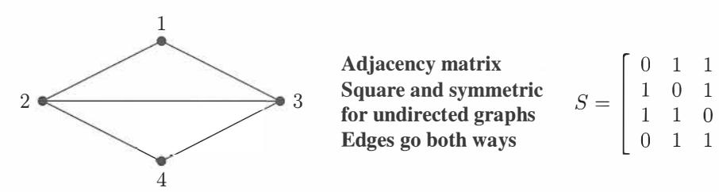

# **Chapter 2**

# **Solving Linear Equations**

# **2.1 Vectors and Linear Equations**

The **column picture** of  $Ax = b$ : a combination of  $n$  columns of  $A$  produces the vector  $b$ .

The **column picture of** *Ax* = **b:** a combination of *n* columns of *A* produces the vector *b.*  2 This is a vector equation *Ax=* x1a1 + · · · + Xn an=b: the columns of *A* are a1, a2, ... , an. 3 When b = 0, a combination *Ax* of the columns is *zero:* one possibility is *x* = (0, ... , 0). The **row picture of** *Ax= b: m* equations from *m* rows give *m* planes meeting at *x.*  A dot product gives the equation of each plane : ( row 1) · *x* = b 1 , ... , ( **row** *rn)* · *x* = *bm .*  When b = **0,** all the planes **(row** i) · *x* = 0 go through the center point *x* = (0, 0, ... , 0).

The central problem of linear algebra is to solve a system of equations. Those equations are linear, which means that the unknowns are only multiplied by numbers-we never see *x* times *y.* Our first linear system is small. But you will see how far it leads:

| <b>Two equations</b> | $x$  | $-x$ | $2y$ | $y =$ | 1  |
|----------------------|------|------|------|-------|----|
| <b>Two unknowns</b>  | $3x$ | $-x$ | $2y$ | $y =$ | 11 |

We begin *a row at a time.* The first equation *x* - 2y = 1 produces a straight line in the *xy* plane. The point *x* = l, *y* = 0 is on the line because it solves that equation. The point *x* = 3, y = l is also on the line because 3 - 2 = 1. If we choose *x* = 101 we find y = 50.

The slope of this particular line is ½, because *y* increases by 1 when x changes by 2. But slopes are important in calculus and this is linear algebra!

Figure 2.1 will show that first line x - 2y = 1. The second line in this "row picture" comes from the second equation *3x* + 2y = 11. You can't miss the point *x* = 3, y = l where the two lines meet. *That point* ( 3, 1) *lies on both lines and solves both equations.* 

Figure 2.1: *Row picture:* The point (3, 1) where the lines meet solves both equations.

### **ROWS** *The row picture shows two lines meeting at a single point (the solution).*

Turn now to the column picture. I want to recognize the same linear system as a "vector equation". Instead of numbers we need to see *vectors.* If you separate the original system into its columns instead of its rows, you get a vector equation:

| Combination equals $b$ | $x \begin{bmatrix} 1 \\ 3 \end{bmatrix} + y \begin{bmatrix} -2 \\ 2 \end{bmatrix} = \begin{bmatrix} 1 \\ 11 \end{bmatrix} = b.$ | (2) |
|------------------------|---------------------------------------------------------------------------------------------------------------------------------|-----|
|------------------------|---------------------------------------------------------------------------------------------------------------------------------|-----|

This has two column vectors on the left side. The problem is *to find the combination of those vectors that equals the vector on the right.* We are multiplying the first column by x and the second column by y, and adding. With the right choices x = 3 and y = 1 (the same numbers as before), this produces 3 *(column 1)* + 1 *(column 2)* = *b.* 

**COLUMNS** *The column picture combines the column vectors on the left side to produce the vector b on the right side.*

Figure 2.2 is the "column picture" of two equations in two unknowns. The first part shows the two separate columns, and that first column multiplied by 3. This multiplication by a *scalar* (a number) is one of the two basic operations in linear algebra:

| Scalar multiplication | $3 \begin{bmatrix} 1 \\ 3 \end{bmatrix} = \begin{bmatrix} 3 \\ 3 \end{bmatrix}$ |
|-----------------------|---------------------------------------------------------------------------------|
|-----------------------|---------------------------------------------------------------------------------|

If the components of a vector v are v1 and v2, then cv has components cv1 and cv2.

The other basic operation is *vector addition.* We add the first components and the second components separately. The vector sum is (1, 11), the desired vector b.

| Vector addition | $\begin{bmatrix} 3 \\ 9 \end{bmatrix} + \begin{bmatrix} -2 \\ 2 \end{bmatrix} = \begin{bmatrix} 1 \\ 11 \end{bmatrix}$ |
|-----------------|------------------------------------------------------------------------------------------------------------------------|
|                 |                                                                                                                        |

The right side of Figure 2.2 shows this addition. Two vectors are in black. The sum along the diagonal is the vector *b* = ( 1, 11) on the right side of the linear equations.

Figure 2.2: *Column picture:* A combination of columns produces the right side (1, 11).

To repeat: The left side of the vector equation is a *linear combination* of the columns. The problem is to find the right coefficients *x* = 3 and y = l. We are combining scalar multiplication and vector addition into one step. That step is crucially important, because it contains both of the basic operations: *Multiply by* 3 *and* 1, *then add.* 

| Linear combination | 3 | $\begin{bmatrix} 1 \\ 3 \end{bmatrix} + \begin{bmatrix} -2 \\ 2 \end{bmatrix} = \begin{bmatrix} 1 \\ 11 \end{bmatrix}$ |
|--------------------|---|------------------------------------------------------------------------------------------------------------------------|
|                    |   |                                                                                                                        |

Of course the solution *x* = 3, *y* = l is the same as in the row picture. I don't know which picture you prefer! I suspect that the two intersecting lines are more familiar at first. You may like the row picture better, but only for one day. My own preference is to combine column vectors. It is a lot easier to see a combination of four vectors in four-dimensional space, than to visualize how four hyperplanes might possibly meet at a point. *(Even one hyperplane is hard enough. .* . )

The *coefficient matrix* on the left side of the equations is the 2 by 2 matrix A:

| Coefficient matrix | $A = \begin{bmatrix} 1 & -2 \\ 3 & 2 \end{bmatrix}$ |
|--------------------|-----------------------------------------------------|
|--------------------|-----------------------------------------------------|

This is very typical of linear algebra, to look at a matrix by rows and by columns. Its rows give the row picture and its columns give the column picture. Same numbers, different pictures, same equations. We combine those equations into a matrix problem Ax =b:

| Matrix equation | $\begin{bmatrix} 1 & -2 \\ 3 & 2 \end{bmatrix} \begin{bmatrix} x \\ y \end{bmatrix} = \begin{bmatrix} 1 \\ 11 \end{bmatrix}$ |
|-----------------|------------------------------------------------------------------------------------------------------------------------------|
| $Ax = b$        |                                                                                                                              |

The row picture deals with the two rows of *A.* The column picture combines the columns. The numbers *x* = 3 and y = l go into *x.* Here is matrix-vector multiplication:

| Dot products with rows | $Ax = b$ | is | $\begin{bmatrix} 1 & -2 \\ 3 & 2 \end{bmatrix} \begin{bmatrix} 3 \\ 1 \end{bmatrix} = \begin{bmatrix} 1 \\ 11 \end{bmatrix}$ |
|------------------------|----------|----|------------------------------------------------------------------------------------------------------------------------------|
| Combination of columns |          |    |                                                                                                                              |

*Looking ahead* This chapter is going to solve n equations in n unknowns (for any n). I am not going at top speed, because smaller systems allow examples and pictures and a complete understanding. You are free to go faster, as long as **matrix multiplication and inversion** become clear. Those two ideas will be the keys to invertible matrices.

I can list four steps to understanding elimination using matrices.

- 1. Elimination goes from *A* to a triangular *U* by a sequence of matrix steps *Eij .*
- **2.** The triangular system is solved by *back substitution:* working bottom to top.
- **3.** In matrix language *A* is factored into *LU* = (lower triangular) (upper triangular).
- **4.** Elimination succeeds if *A* is invertible. (But it may need row exchanges.)

The most-used algorithm in computational science takes those steps (MATLAB calls it **lu).**  Its quickest form is *backslash: x* = *A\ b.* But linear algebra goes beyond square invertible matrices! Form by *n* matrices, *Ax* = **0** may have many solutions. Those solutions will go into a **vector space.** The **rank** of *A* leads to the **dimension** of that vector space.

All this comes in Chapter 3, and I don't want to hurry. But I must get there.

### **Three Equations in Three Unknowns**

The three unknowns are *x, y, z.* We have three linear equations:

*Ax =b X* + 2x + *6x 2y* + *5y* + *3y* + *3z 2z z*  6 4 *2*  (3)

We look for numbers *x, y, z* that solve all three equations at once. Those desired numbers might or might not exist. For this system, they do exist. When the number of unknowns matches the number of equations, in this case 3 = 3, there is *usually* one solution.

Before solving the problem, we visualize it both ways:

**ROW** *The row picture shows three planes meeting at a single point.* 

**COLUMN** *The column picture combines three columns to produce b* = (6, 4, 2).

In the row picture, each equation produces a *plane* in three-dimensional space. The first plane in Figure 2.3 comes from the first equation *x* + *2y* + *3z* = 6. That plane crosses the *x*  and *y* and *z* axes at the points (6, 0, 0) and (0, 3, 0) and (0, 0, 2). Those three points solve the equation and they determine the whole plane.

The vector *(x, y, z)* = (0, 0, 0) does not solve *x* + 2y + *3z* = 6. Therefore that plane does not contain the origin. The plane x + 2y + *3z* = 0 does pass through the origin, and it is parallel to x + 2y + *3z* = 6. When the right side increases to 6, the parallel plane moves away from the origin.

The second plane is given by the second equation 2x + *5y* + 2z = 4. *It intersects the first plane in a line L.* The usual result of two equations in three unknowns is a line *L* of solutions. (Not if the equations were *x* + 2y + *3z* = 6 and *x* + 2y + *3z* = 0.)

The third equation gives a third plane. It cuts the line L at a single point. That point lies on all three planes and it solves all three equations. It is harder to draw this triple intersection point than to imagine it. The three planes meet at the solution (which we haven't found yet). **The column form will now show immediately why** *z* = 2.

Figure 2.3: *Row picture:* Two planes meet at a line *L.* Three planes meet at a point.

*The column picture starts with the vector form of the equations Ax* = *b:* 

| Combine columns | $x \begin{bmatrix} 1 \\ 2 \\ 6 \end{bmatrix} + y \begin{bmatrix} 2 \\ 5 \\ -3 \end{bmatrix} + z \begin{bmatrix} 3 \\ 2 \\ 1 \end{bmatrix} = \begin{bmatrix} 6 \\ 4 \\ 2 \end{bmatrix} = b.$ | (4) |
|-----------------|---------------------------------------------------------------------------------------------------------------------------------------------------------------------------------------------|-----|
|-----------------|---------------------------------------------------------------------------------------------------------------------------------------------------------------------------------------------|-----|

The unknowns are the coefficients *x, y, z.* We want to multiply the three column vectors by the correct numbers *x, y, z* to produce *b* = (6, 4, 2).

Figure 2.4 shows this column picture. Linear combinations of those columns can produce any vector b! The combination that produces *b* = (6, 4, 2) is just 2 times the third column. *The coefficients we need are x* = 0, *y* = 0, *and z* = 2.

The three planes in the row picture meet at that same solution point (0, 0, 2):

| <b>Correct combination</b> | $0 \begin{bmatrix} 1 \\ 2 \\ 6 \end{bmatrix} + 0 \begin{bmatrix} 2 \\ 5 \\ -3 \end{bmatrix} + 2 \begin{bmatrix} 3 \\ 2 \\ 1 \end{bmatrix} = \begin{bmatrix} 6 \\ 4 \\ 2 \end{bmatrix}$ |
|----------------------------|----------------------------------------------------------------------------------------------------------------------------------------------------------------------------------------|
|----------------------------|----------------------------------------------------------------------------------------------------------------------------------------------------------------------------------------|

Figure 2.4: *Column picture: Combine the columns with weights (x, y, z)* = (0, 0, 2).

### **The Matrix Form of the Equations**

We have three rows in the row picture and three columns in the column picture (plus the right side). The three rows and three columns contain nine numbers. *These nine numbers fill a* 3 *by* 3 *matrix A:* 

| The "coefficient matrix" in $Ax = b$ is | $A =$ | $\begin{bmatrix} 1 & 2 & 3 \\ 2 & 5 & 2 \\ 6 & -3 & 1 \end{bmatrix}$ |
|-----------------------------------------|-------|----------------------------------------------------------------------|
|-----------------------------------------|-------|----------------------------------------------------------------------|

The capital letter *A* stands for all nine coefficients (in this square array). The letter *b* denotes the column vector with components 6, 4, 2. The unknown x is also a column vector, with components *x, y, z.* (We use boldface because it is a vector, *x* because it is unknown.) By rows the equations were (3), by columns they were (4), and by matrices they are (5):

*Matrix equation 
$$Ax = b$$*  $\begin{bmatrix} 1 & 2 & 3 \\ 2 & 5 & 2 \\ 6 & -3 & 1 \end{bmatrix} \begin{bmatrix} x \\ y \\ z \end{bmatrix} = \begin{bmatrix} 6 \\ 4 \\ 2 \end{bmatrix}$ . (5)

*Basic question:* **What does it mean to "multiply** *A* **times** *x"?* We can multiply by rows or by columns. Either way, *Ax* = *b* must be a correct statement of the three equations. You do the same nine multiplications either way.

*Multiplication by rows Ax* comes from **dot products,** each row times the column *x:* 

$$Ax = \begin{bmatrix} (\text{row } 1) \cdot x \\ (\text{row } 2) \cdot x \\ (\text{row } 3) \cdot x \end{bmatrix}. \quad (6)$$

*Multiplication by columns Ax* is a *combination of column vectors:*

| $x = x(\text{column } I) + y(\text{column } 2) + z(\text{column } 3)$ | (7) |
|-----------------------------------------------------------------------|-----|
|-----------------------------------------------------------------------|-----|

When we substitute the solution x = (0, 0, 2), the multiplication *Ax* produces b:

$$\begin{bmatrix} 1 & 2 & 3 \\ 2 & 5 & 2 \\ 6 & -3 & 1 \end{bmatrix} \begin{bmatrix} 0 \\ 0 \\ 2 \end{bmatrix} = 2 \text{ times column } 3 = \begin{bmatrix} 6 \\ 4 \\ 2 \end{bmatrix}.$$

The dot product from the first row is (1, 2, 3) · (0, 0, 2) = 6. The other rows give dot products 4 and 2. *This book sees Ax as a combination of the columns of A.*

**Example 1** Here are 3 by 3 matrices *A* and *I* = identity, with three 1 's and six O's:

| $Ax = \begin{bmatrix} 1 & 0 & 0 \\ 1 & 0 & 0 \\ 1 & 0 & 0 \end{bmatrix}$ | $\begin{bmatrix} 4 \\ 5 \\ 6 \end{bmatrix} = \begin{bmatrix} 4 \\ 4 \\ 4 \end{bmatrix}$ | $Ix = \begin{bmatrix} 1 & 0 & 0 \\ 0 & 1 & 0 \\ 0 & 0 & 1 \end{bmatrix}$ | $\begin{bmatrix} 4 \\ 5 \\ 6 \end{bmatrix} = \begin{bmatrix} 4 \\ 5 \\ 6 \end{bmatrix}$ |
|--------------------------------------------------------------------------|-----------------------------------------------------------------------------------------|--------------------------------------------------------------------------|-----------------------------------------------------------------------------------------|
|--------------------------------------------------------------------------|-----------------------------------------------------------------------------------------|--------------------------------------------------------------------------|-----------------------------------------------------------------------------------------|

If you are a row person, the dot product of (1, 0, 0) with (4, 5, 6) is 4. If you are a column person, the linear combination *Ax* is 4 times the first column ( 1, 1, 1). In that matrix *A,* the second and third columns are zero vectors.

The other matrix *I* is special. It has ones on the "main diagonal". *Whatever vector this matrix multiplies, that vector is not changed.* This is like multiplication by 1, but for matrices and vectors. The exceptional matrix in this example is the 3 by 3 *identity matrix* :

| $I = \begin{bmatrix} 1 & 0 & 0 \\ 0 & 1 & 0 \\ 0 & 0 & 1 \end{bmatrix}$ | always yields the multiplication | $Ix = x$ |
|-------------------------------------------------------------------------|----------------------------------|----------|
|-------------------------------------------------------------------------|----------------------------------|----------|

#### **Matrix Notation**

The first row of a 2 by 2 matrix contains a11 and a12. The second row contains a21 and a22. The first index gives the row number, so that aij is an entry in row i. The second index j gives the column number. But those subscripts are not very convenient on a keyboard! Instead of aij we type *A(i,j). The entry* a57= *A(5,* 7) *would be in row* 5, *column* 7.

$$A = \begin{bmatrix} a_{11} & a_{12} \\ a_{21} & a_{22} \end{bmatrix} = \begin{bmatrix} A(1,1) & A(1,2) \\ A(2,1) & A(2,2) \end{bmatrix}$$

For an *m* by *n* matrix, the row index i goes from 1 to *m.* The column index *j* stops at *n.* There are mn entries aij = *A(i, j).* A square matrix of order n has n *2* entries.

# **Multiplication in** MATLAB

I want to express *A* and *x* and their product *Ax* using MATLAB commands. This is a first step in learning that language (and others). I begin by defining *A* and *x.* A vector *x* in R n is an *n* by 1 matrix (as in this book). Enter matrices *a row at a time,* and use a semicolon to signal the end of a row. Or enter by columns and transpose by *1*:

| $A = [1 \quad 2 \quad 3; \quad 2 \quad 5 \quad 2; \quad 6 \quad -3 \quad 1]$ |
|------------------------------------------------------------------------------|
| $x = [0 \quad 2 \quad 2]'$                                                   |
| $x = [0; 0; 2]$                                                              |

Here are three ways to multiply *Ax* in MATLAB. In reality, *A* \* *x* is the good way to do it. MATLAB is a high level language, and it works with matrices:

# *Matrix multiplication b* = *A* \* *x*

We can also pick out the first row of *A* (as a smaller matrix!). The notation for that 3 by 3 submatrix is A(l, :). **Here the colon symbol: keeps all columns of row** 1.

**Row at a time**   
$$b = [A(1,:) * x; A(2,:) * x; A(3,:) * x]$$

Each entry of *b* is a dot product, row times column, 1 by 3 matrix times 3 by 1 matrix.

The other way to multiply uses the columns of *A.* The first column is the 3 by 1 submatrix A(: , 1). Now the colon symbol : comes first, *to keep all rows of column* 1. This column multiplies x(l) and the other columns multiply x(2) and x(3):

**Column at a time**   
$$b = A(:, 1) * x(1) + A(:, 2) * x(2) + A(:, 3) * x(3)$$

I think that matrices are stored by columns. Then multiplying a column at a time will be a little faster. So *A* \* *x* is actually executed by columns.

### **Programming Languages for Mathematics and Statistics**

Here are five more important languages and their commands for the multiplication *Ax* :

| Julia       | $A * x$          | julialang.org           |
|-------------|------------------|-------------------------|
| Python      | dot( $A$ , $x$ ) | python.org              |
| R           | $A \% * \% x$    | r-project.org           |
| Mathematica | $A . x$          | wolfram.com/mathematica |
| Maple       | $A * x$          | maplesoft.com           |

**Julia, Python,** and **R** are free and open source languages. R is developed particularly for applications in statistics. Other software for statistics (SAS, JMP, and many more) is described on Wikipedia's Comparison of Statistical Packages.

**Mathematica** and **Maple** allow symbolic entries *a, b, x, ...* and not only real numbers. As in MATLAB's Symbolic Toolbox, they work with symbolic expressions like x 2 *x.* The power of Mathematica is seen in Wolfram Alpha.

**Julia** combines the high productivity of SciPy or R for technical computing with performance comparable to C or Fortran. It can call Python and C/Fortran libraries. But it doesn't rely on "vectorized" library functions for speed; Julia is designed to be fast.

I entered **juliabox.org.** I clicked *Sign in via Google* to access my gmail space. Then I clicked *new* at the right and chose a Julia notebook. I chose 0.4.5 and not one under development. The Julia command line came up immediately.

As a novice, I computed 1 + 1. To see the answer I pressed *Shift+Enter.* I also learned that 1.0 + 1.0 uses floating point, much faster for a large problem. The website **math.mit.edu/linearalgebra** will show part of the power of Julia and Python and R.

**Python** is a popular general-purpose programming language. When combined with packages like NumPy and the SciPy library, it provides a full-featured environment for technical computing. NumPy has the basic linear algebra commands. Download the Anaconda Python distribution from **https://www.continuum.io** (a prepackaged collection of Python and most important mathematical libraries, with a graphical installer).

**R** is free software for statistical computing and graphics. To download and install R, go to **r-project.org** (prefix **https://www.).** Commands are prompted by > and Risa scripted language. It works with lists that can be shaped into vectors and matrices.

It is important to recommend RStudio for editing and graphing (and help resources). When you download from **www.RStudio.com,** a window opens for R commands-plus windows for editing and managing files and plots. Tell R the form of the matrix as well as the list of numerical entries:

*>A=* matrix (c (1, 2, 3, 2, 5, 2, 6, -3, 1), nrow = 3, byrow = TRUE) > *x* = matrix ( *c* (0, 0, 2), nrow = 3)

To see *A* and *x,* type their names at the new prompt>. To multiply type *b =A%\* %x.*  Transpose by t(A) and use as.matrix to turn a vector into a matrix.

MATLAB and Julia have a cleaner syntax for matrix computations than R. But R has become very familiar and widely used. The website for this book has space for proper demos (including the *Manipulate* command) of **MATLAB** and **Julia** and **Python** and **R.** 

#### **• REVIEW OF THE KEY IDEAS •**

- **1.** The basic operations on vectors are multiplication *cv* and vector addition *v* + *w.*
- **2.** Together those operations give *linear combinations cv* + *dw.*
- **3.** Matrix-vector multiplication *Ax* can be computed by dot products, a row at a time. But *Ax* must be understood as a *combination of the columns of A.*
- **4.** Column picture: *Ax* = *b* asks for a combination of columns to produce *b.*
- 5. Row picture: Each equation in *Ax* = *b* gives a line (n = 2) or a plane (n = 3) or a "hyperplane" (n > 3). They intersect at the solution or solutions, if any.

#### **• WORKED EXAMPLES •**

**2.1 A** Describe the column picture of these three equations *Ax* = *b.* Solve by careful inspection of the columns (instead of elimination):

If the columns (instead of elimination):
$$\begin{array}{ccccccc} x + 3y + 2z = -3 & & & & & & \\ 2x + 2y + 2z = -2 & & \text{which is} & & & & \\ 3x + 5y + 6z = -5 & & & & & & \end{array} \quad \left[ \begin{array}{ccc} 1 & 3 & 2 \\ 2 & 2 & 2 \\ 3 & 5 & 6 \end{array} \right] \begin{bmatrix} x \\ y \\ z \end{bmatrix} = \begin{bmatrix} -3 \\ -2 \\ -5 \end{bmatrix}.$$

**Solution** The column picture asks for a linear combination that produces b from the three columns of A. In this example b is *minus the second column.* So the solution is *x*= 0, *y* = -1, *z* = 0. To show that (0, -1, 0) is the *only* solution we have to know that *"A* is invertible" and "the columns are independent" and "the determinant isn't zero."

Those words are not yet defined but the test comes from elimination: We need (and for this matrix we find) a full set of three nonzero pivots.

Suppose the right side changes to b = ( 4, 4, 8) = sum of the first two columns. Then the good combination has x = 1, y = 1, z = 0. The solution becomes x = (1, 1, 0).

**2.1 B** This system has *no solution.* The planes in the row picture don't meet at a point. *. No combination of the three columns produces b. How to show this?* 

| $x + 3y + 5z = 4$  | $\begin{bmatrix} 1 & 3 & 5 \\ 1 & 2 & -3 \\ 2 & 2 & 5 \end{bmatrix} \begin{bmatrix} x \\ y \\ z \end{bmatrix} = \begin{bmatrix} 4 \\ 5 \\ 8 \end{bmatrix} = b$ |
|--------------------|----------------------------------------------------------------------------------------------------------------------------------------------------------------|
| $x + 2y - 3z = 5$  | $\begin{bmatrix} 1 & 2 & 5 \\ 1 & 2 & -3 \\ 2 & 2 & 5 \end{bmatrix} \begin{bmatrix} x \\ y \\ z \end{bmatrix} = \begin{bmatrix} 5 \\ -3 \\ 8 \end{bmatrix}$    |
| $2x + 5y + 2z = 8$ |                                                                                                                                                                |

*Idea* Add (equation 1) + (equation 2) - (equation 3). The result is **O** = 1. This system cannot have a solution. We could say: The vector (1, 1, -1) is orthogonal to all three columns of *A* but *not* orthogonal to *b.*

- **(1)** Are any two of the three planes parallel? What are the equations of planes parallel to *x+3y+5z=4?*
- **(2)** Take the dot product of each column of *A* ( and also *b)* with *y* = ( 1, 1, -1). How do those dot products show that no combination of columns equals *b?*
- **(3)** Find three different right side vectors *b\** and *b\*\** and *b\*\*\** that *do* allow solutions.

#### **Solution**

- **(1)** The planes don't meet at a point, even though no two planes are parallel. For a plane parallel to *x*+ *3y* + *5z* = 4, change the "4". The parallel plane *x*+ *3y* + *5z* = 0 goes through the origin (0, 0, 0). And the equation multiplied by any nonzero constant still gives the same plane, as in 2x + *6y* + lOz = 8.
- **(2)** The dot product of each column of *A* with *y* = (1, 1, -1) is *zero.* On the right side, *y*· *b* = (1, 1, -1) · (4, 5, 8) = 1 is *not zero. Ax* = bled to 0 = 1: **no solution.**
- **(3)** There is a solution when b is a combination of the columns. These three choices of b have solutions including *x\** = (1, 0, 0) and *x\*\** = (1, 1, 1) and *x\*\*\** = (0, 0, 0):

$$b^* = \begin{bmatrix} 1 \\ 1 \\ 2 \end{bmatrix} = \text{first column} \quad b^{**} = \begin{bmatrix} 9 \\ 0 \\ 9 \end{bmatrix} = \text{sum of columns} \quad b^{***} = \begin{bmatrix} 0 \\ 0 \\ 0 \end{bmatrix}$$

## **Problem Set 2.1**

**Problems 1-8 are about the row and column pictures of** *Ax* = *b.* 

**1** With *A* =*I* (the identity matrix) draw the planes in the row picture. Three sides of abox meet at the solutionx = *(x,y,z)* = (2,3,4):

| $1x + 0y + 0z = 2$ |    | $\begin{bmatrix} 1 & 0 & 0 \\ 0 & 1 & 0 \\ 0 & 0 & 1 \end{bmatrix}$ | $\begin{bmatrix} x \\ y \\ z \end{bmatrix} = \begin{bmatrix} 2 \\ 3 \\ 4 \end{bmatrix}$ |
|--------------------|----|---------------------------------------------------------------------|-----------------------------------------------------------------------------------------|
| $0x + 1y + 0z = 3$ | or |                                                                     |                                                                                         |
| $0x + 0y + 1z = 4$ |    |                                                                     |                                                                                         |

Draw the vectors in the column picture. Two times column 1 plus three times column 2 plus four times column 3 equals the right side *b.*

2 If the equations in Problem 1 are multiplied by 2, 3, 4 they become *DX=* B:

| $2x + 0y + 0z = 4$  |    |                                                                                   | $2 \quad 0 \quad 0$ | $\begin{bmatrix} x \\ y \\ z \end{bmatrix} = \begin{bmatrix} 4 \\ 9 \\ 16 \end{bmatrix} = B$ |
|---------------------|----|-----------------------------------------------------------------------------------|---------------------|----------------------------------------------------------------------------------------------|
| $0x + 3y + 0z = 9$  | or | $D\mathbf{X} = \begin{bmatrix} 2 & 0 & 0 \\ 0 & 3 & 0 \\ 0 & 0 & 4 \end{bmatrix}$ |                     |                                                                                              |
| $0x + 0y + 4z = 16$ |    |                                                                                   |                     |                                                                                              |

Why is the row picture the same? Is the solution *X*the same as x? What is changed in the column picture-the columns or the right combination to give *B?*

**3** If equation 1 is added to equation 2, which of these are changed: the planes in the row picture, the vectors in the column picture, the coefficient matrix, the solution? The new equations in Problem 1 would be *x* = 2, *x* + *y* = 5, *z* = 4. 4 Find a point with *z* = 2 on the intersection line of the planes *x* + *y* + *3z* = 6 and *x* - *y* + *z* = 4. Find the point with *z* = 0. Find a third point halfway between. 5 The first of these equations plus the second equals the third:

- $$x + y + z = 2$$
- $x + 2y + z = 3$
- $2x + 3y + 2z = 5$ .

The first two planes meet along a line. The third plane contains that line, because if *x, y, z* satisfy the first two equations then they also \_\_ . The equations have infinitely many solutions (the whole line L). Find three solutions on L.

**6** Move the third plane in Problem 5 to a parallel plane *2x* + *3y* + 2z = 9. Now the three equations have no solution-why *not?* The first two planes meet along the line L, but the third plane doesn't \_\_ that line. 7 In Problem 5 the columns are (1, 1, 2) and (1, 2, 3) and (1, 1, 2). This is a "singular case" because the third column is . Find two combinations of the columns that give b = (2, 3, 5). This is only possible for b = (4, 6, c) if c = \_\_ .

8 Normally 4 “planes” in 4-dimensional space meet at a \_\_\_\_. Normally 4 column vectors in 4-dimensional space can combine to produce  $\mathbf{b}$ . What combination of  $(1, 0, 0, 0)$ ,  $(1, 1, 0, 0)$ ,  $(1, 1, 1, 0)$ ,  $(1, 1, 1, 1)$  produces  $\mathbf{b} = (3, 3, 3, 2)$ ? What 4 equations for  $x, y, z, t$  are you solving?

**Problems 9–14 are about multiplying matrices and vectors.**

9 Compute each  $Ax$  by dot products of the rows with the column vector:

$$(a) \quad \begin{bmatrix} 1 & 2 & 4 \\ -2 & 3 & 1 \\ -4 & 1 & 2 \end{bmatrix} \begin{bmatrix} 2 \\ 2 \\ 3 \end{bmatrix} \quad (b) \quad \begin{bmatrix} 2 & 1 & 0 & 0 \\ 1 & 2 & 1 & 0 \\ 0 & 1 & 2 & 1 \\ 0 & 0 & 1 & 2 \end{bmatrix} \begin{bmatrix} 1 \\ 1 \\ 1 \\ 2 \end{bmatrix}$$

10 Compute each  $Ax$  in Problem 9 as a combination of the columns:

$$9(a) \text{ becomes } Ax = 2 \begin{bmatrix} 1 \\ -2 \\ -4 \end{bmatrix} + 2 \begin{bmatrix} 2 \\ 3 \\ 1 \end{bmatrix} + 3 \begin{bmatrix} 4 \\ 1 \\ 2 \end{bmatrix} = \begin{bmatrix} 2 \\ 3 \\ 1 \end{bmatrix}.$$

How many separate multiplications for  $Ax$ , when the matrix is “3 by 3”?

11 Find the two components of  $Ax$  by rows or by columns:

$$\begin{bmatrix} 2 & 3 \\ 5 & 1 \end{bmatrix} \begin{bmatrix} 4 \\ 2 \end{bmatrix} \quad \text{and} \quad \begin{bmatrix} 3 & 6 \\ 6 & 12 \end{bmatrix} \begin{bmatrix} 2 \\ -1 \end{bmatrix} \quad \text{and} \quad \begin{bmatrix} 1 & 2 & 4 \\ 2 & 0 & 1 \end{bmatrix} \begin{bmatrix} 3 \\ 1 \\ 1 \end{bmatrix}.$$

12 Multiply  $A$  times  $x$  to find three components of  $Ax$ :

$$\begin{bmatrix} 0 & 0 & 1 \\ 0 & 1 & 0 \\ 1 & 0 & 0 \end{bmatrix} \begin{bmatrix} x \\ y \\ z \end{bmatrix} \quad \text{and} \quad \begin{bmatrix} 2 & 1 & 3 \\ 1 & 2 & 3 \\ 3 & 3 & 6 \end{bmatrix} \begin{bmatrix} 1 \\ 1 \\ -1 \end{bmatrix} \quad \text{and} \quad \begin{bmatrix} 2 & 1 \\ 1 & 2 \\ 3 & 3 \end{bmatrix} \begin{bmatrix} 1 \\ 1 \\ 1 \end{bmatrix}.$$

13 (a) A matrix with  $m$  rows and  $n$  columns multiplies a vector with \_\_\_\_ components to produce a vector with \_\_\_\_ components.  
 (b) The planes from the  $m$  equations  $Ax = \mathbf{b}$  are in \_\_\_\_-dimensional space. The combination of the columns of  $A$  is in \_\_\_\_-dimensional space.

14 Write  $2x + 3y + z + 5t = 8$  as a matrix  $A$  (how many rows?) multiplying the column vector  $\mathbf{x} = (x, y, z, t)$  to produce  $\mathbf{b}$ . The solutions  $\mathbf{x}$  fill a plane or “hyperplane” in 4-dimensional space. *The plane is 3-dimensional with no 4D volume.*

**Problems 15–22 ask for matrices that act in special ways on vectors.**

15 (a) What is the 2 by 2 identity matrix?  $I$  times  $\begin{bmatrix} x \\ y \end{bmatrix}$  equals  $\begin{bmatrix} x \\ y \end{bmatrix}$ .  
 (b) What is the 2 by 2 exchange matrix?  $P$  times  $\begin{bmatrix} x \\ y \end{bmatrix}$  equals  $\begin{bmatrix} y \\ x \end{bmatrix}$ .

- 16 (a) What2by2matrixRrotates every vector by90° ? Rtimes [;]is[\_�]
- (b) What 2 by 2 matrix R2 rotates every vector by 180° ? 17 Find the matrix *P* that multiplies *(x, y,* z) to give *(y, z,* x). Find the matrix Q that multiplies *(y, z,* x) to bring back *(x, y,* z). 18 What 2 by 2 matrix *E* subtracts the first component from the second component? What 3 by 3 matrix does the same?

| $E \begin{bmatrix} 3 \\ 5 \end{bmatrix} = \begin{bmatrix} 3 \\ 2 \end{bmatrix}$ | and | $E \begin{bmatrix} 3 \\ 5 \\ 7 \end{bmatrix} = \begin{bmatrix} 3 \\ 2 \\ 7 \end{bmatrix}$ |
|---------------------------------------------------------------------------------|-----|-------------------------------------------------------------------------------------------|
|---------------------------------------------------------------------------------|-----|-------------------------------------------------------------------------------------------|

19 What 3 by 3 matrix *E* multiplies *(x, y,* z) to give *(x, y, z* + *x* )? What matrix E-1 multiplies *(x,y,z)* to give *(x,y,z* - x)? If you multiply (3,4,5) by *E* and then multiply by E- 1 , the two results are ( \_\_ ) and ( \_\_ ). 20 What 2 by 2 matrix Pi projects the vector *(x,* y) onto the *x* axis to produce *(x,* O)? What matrix A projects onto they axis to produce (0, y)? If you multiply (5, 7) by Pi and then multiply by P2 , you get ( \_\_ ) and ( \_\_ ). 21 What 2 by 2 matrix *R* rotates every vector through 45° ? The vector (1, 0) goes to ( /2/2, /2/2). The vector (0, 1) goes to (-/2/2, /2/2). Those determine the matrix. Draw these particular vectors in the *xy* plane and find *R.* 22 Write the dot product of (1, 4, 5) and *(x, y,* z) as a matrix multiplication *Ax.* The matrix *A* has one row. The solutions to *Ax* = 0 lie on a \_\_ perpendicular to the vector \_\_ . The columns of *A* are only in \_\_ -dimensional space. 23 In MATLAB notation, write the commands that define this matrix *A* and the column vectors *x* and *b.* What command would test whether or not *Ax* = *b?*

| $A = \begin{bmatrix} 1 & 2 \\ 3 & 4 \end{bmatrix}$ | $x = \begin{bmatrix} 5 \\ -2 \end{bmatrix}$ | $b = \begin{bmatrix} 1 \\ 7 \end{bmatrix}$ |
|----------------------------------------------------|---------------------------------------------|--------------------------------------------|
|----------------------------------------------------|---------------------------------------------|--------------------------------------------|

24 The MATLAB commands A = eye(3) and v = [ 3 : 5]' produce the 3 by 3 identity matrix and the column vector (3,4,5). What are the outputs from Aw and v'\*v? (Computer not needed!) If you ask for wA, what happens? 25 If you multiply the 4 by 4 all-ones matrix A= ones(4) and the column v = ones(4, 1 ), what is A\*v? (Computer not needed.) If you multiply B = eye(4) + ones(4) times w = zeros( 4, 1) + 2\*ones( 4, 1 ), what is B\*w?

Questions 26-28 review the row and column pictures in 2, 3, and 4 dimensions.

26 Draw the row and column pictures for the equations x - *2y* **=** 0, x + *y* **=** 6. 27 For two linear equations in three unknowns *x, y, z,* the row picture will show (2 or 3) (lines or planes) in (2 or 3)-dimensional space. The column picture is in (2 or 3) dimensional space. The solutions normally lie on a \_\_ . 28 For four linear equations in two unknowns x and *y,* the row picture shows four \_\_ . The column picture is in \_\_ -dimensional space. The equations have no solution unless the vector on the right side is a combination of \_\_ . 29 Start with the vector u*0*=(1, 0). Multiply again and again by the same "Markov matrix" *A=* [.8 .3; .2 .7]. The next three vectors are u1, u2, *u3:* 

$$u_1 = \begin{bmatrix} .8 & .3 \\ .2 & .7 \end{bmatrix} \begin{bmatrix} 1 \\ 0 \end{bmatrix} = \begin{bmatrix} .8 \\ .2 \end{bmatrix} \quad u_2 = Au_1 = \underline{\hspace{1cm}} \quad u_3 = Au_2 = \underline{\hspace{1cm}}.$$

What property do you notice for all four vectors uo, u1, u2, u3?

# **Challenge Problems**

30 Continue Problem 29 from u*0* **=** (1, 0) to u7, and also from v*0* **=** (0, 1) to v7. What do you notice about u7 and v7? Here are two MATLAB codes, with while and for. They plot *u0*to u7 and *v0*to v7. You can use other languages:

u = [1 ; OJ; A= [.8 .3 ; .2 .7); x = u; k = [O : 7]; while size(x,2) <= 7 u = A\*u; x = [x u]; end plot(k, x) v = [0; 1); A= [.8 .3; .2 .7]; **X=** v; k **=** [0 : 7]; for j **=** 1 : 7 v = A\*v; x = [xv]; end plot(k, x)

The u's and v's are approaching a steady state vectors. Guess that vector and check that *As* = *s.* If you start withs, you stay withs.

31 Invent a 3 by 3 magic matrix M3 with entries 1, 2, ... , 9. All rows and columns and diagonals add to 15. The first row could be 8, 3, 4. What is M3 times (1, 1, l)? What is M4 times (1, 1, 1, 1) if a 4 by 4 magic matrix has entries 1, ... , 16? 32 Suppose *u* and *v* are the first two columns of a 3 by 3 matrix *A.* Which third columns *w* would make this matrix singular? Describe a typical column picture of *Ax* =*b* in that singular case, and a typical row picture (for a random *b).* 

**33 Multiplication by** A **is a "linear transformation".** Those words mean: If *w* is a combination of *u* and *v,* then *Aw* is the same combination of *Au* and *Av.* It is this *"linearity" Aw= cAu* + *dAv* that gives us the name *"linear algebra".* Problem: If *u* = [ � ] and *v* = [ � ] then *Au* and *Av* are the columns of *A.* Combine *w =cu+ dv.* If *w* = [ � ] **how is** *Aw* **connected to** *Au* **and** *Av?* **34**Start from the four equations -xi+l + 2xi - Xi-l = i (for i = 1, 2, 3, 4 with *x0* = *x5* = 0). Write those equations in their matrix form *Ax* = *b.* Can you solve themforx1,x2,x3,x4? 35 A 9 by 9 *Sudoku matrix S*has the numbers 1, ... , 9 in every row and every column, and in every 3 by 3 block. For the all-ones vector *x* = (1, ... , 1), what is *Sx?*  A better question is: **Which row exchanges will produce another Sudoku matrix?** Also, which exchanges of block rows give another Sudoku matrix? Section 2.7 will look at all possible permutations (reorderings) of the rows. I can see 6 orders for the first 3 rows, all giving Sudoku matrices. Also 6 permutations of the

next 3 rows, and of the last 3 rows. And 6 block permutations of the block rows?

# **2.2 The Idea of Elimination**

1 For *rn* = *n* = 3, there are three equations *Ax=* band three unknowns x1, x2, x3. 2 The first two equations are aux1 + · · · = b1 and a21x1 + · · · = b2. **3**Multiply the first equation by a2i/ au and subtract from the second : then x1 **is eliminated.** 4 The comer entry au is the first "pivot " and the ratio a2i/ au is the first "multiplier." **5**Eliminate x1 from every remaining equation i by subtracting aii/ au times the first equation. 6 Now the last n - 1 equations contain n - 1 unknowns x2, ... , *Xn. Repeat to eliminate* x2. 7 Elimination breaks down if zero appears in the pivot. Exchanging two equations may save it.

This chapter explains a systematic way to solve linear equations. The method is called *"elimination",* and you can see it immediately in our 2 by 2 example. Before elimination, *x* and *y* appear in both equations. After elimination, the first unknown *x* has disappeared from the second equation *8y* = 8:

| Before | $x - 2y = 1$ $3x + 2y = 11$ | After | $x - 2y = 1$ $8y = 8$ | (multiply equation 1 by 3) (subtract to eliminate 3x) |
|--------|--------------------------------|-------|--------------------------|----------------------------------------------------------|
| 
  |                                |       |                          |                                                          |

The new equation *8y* = 8 instantly gives *y* = 1. Substituting *y* = 1 back into the first equation leaves *x* - 2 = 1. Therefore *x* = 3 and the solution *(x,* y) == (3, 1) is complete.

Elimination produces an *upper triangular system-this* is the goal. The nonzero coefficients 1, -2, 8 form a triangle. That system is solved from the bottom upwardsfirst y = l and then *x* = 3. This quick process is called *back substitution.* It is used for upper triangular systems of any size, after elimination gives a triangle.

Important point: The original equations have the same solution *x* = 3 and y = l. Figure 2.5 shows each system as a pair of lines, intersecting at the solution point (3, 1) .. After elimination, the lines still meet at the same point. Every step worked with correct equations.

*How did we get from the first pair of lines to the second pair?* We subtracted 3 times the first equation from the second equation. The step that eliminates *x* from equation 2 is the fundamental operation in this chapter. We use it so often that we look at it closely:

*To eliminate x : Subtract a multiple of equation 1 from equation 2.* 

Three times *x* - 2y = l gives *3x* - *6y* = 3. When this is subtracted from *3x* + 2y = 11, the right side becomes 8. The main point is that *3x* cancels *3x.* What remains on the left side is 2y - (-6y) or *8y,* and *xis* eliminated. The system became triangular.

Ask yourself how that multiplier C = 3 was found. The first equation contains lx. *So the first pivot was* **1** (the coefficient of x). The second equation contains *3x,* **so the multiplier was 3.** Then subtraction *3x* - *3x* produced the zero and the triangle.

You will see the multiplier rule if I change the first equation to 4x - 8y = 4. (Same straight line but the first pivot becomes 4.) The correct multiplier is now *C*= ¾. *To find the multiplier; divide the coefficient* "3" *to be eliminated by the pivot* "4 ":

| $4x - 8y = 4$  | <b>Multiply equation 1 by <math>\frac{3}{4}</math></b> | $4x - 8y = 4$ |
|----------------|--------------------------------------------------------|---------------|
| $3x + 2y = 11$ | <b>Subtract from equation 2</b>                        | $8y = 8$      |

The final system is triangular and the last equation still gives *y* = 1. Back substitution produces 4x - 8 = 4 and 4x = 12 and x = 3. We changed the numbers but not the lines or the solution. *Divide by the pivot to find that multiplier* £ = £:

**Pivot** = *first nonzero in the row that does the elimination*  
**Multiplier** = *(entry to eliminate) divided by (pivot)* = 
$$\frac{3}{4}$$
.

The new second equation starts with the second pivot, which is 8. We would use it to eliminate y from the third equation if there were one. *To solve* n *equations we want* n *pivots. The pivots are on the diagonal of the triangle after elimination.* 

You could have solved those equations for *x* and *y* without reading this book. It is an extremely humble problem, but we stay with it a little longer. Even for a 2 by 2 system, elimination might break down. By understanding the possible breakdown (when we can't find a full set of pivots), you will understand the whole process of elimination.

Figure 2.5: Eliminating x makes the second line horizontal. Then 8y = 8 gives y = 1.

#### **Breakdown of Elimination**

Normally, elimination produces the pivots that take us to the solution. But failure is possible. At some point, the method might ask us to *divide by zero.* We can't do it. The process has to stop. There might be a way to adjust and continue-or failure may be unavoidable.

Example 1 fails with *no solution to Oy* = 8. Example 2 fails with *too many solutions to Oy* = 0. Example 3 succeeds by exchanging the equations.

Figure 2.6: Row picture and column picture for Example 1: *no solution.*

**Example 1** *Permanent failure with no solution.* Elimination makes this clear:

|   |       |  |
|----------------|--------------------|---------------|
| $x - 2y = 1$   | Subtract 3 times   | $x - 2y = 1$  |
| $3x - 6y = 11$ | eqn. 1 from eqn. 2 | $0y = 8.$     |

There is *no* solution to *Oy* = 8. Normally we divide the right side 8 by the second pivot, but *this system has no second pivot. (Zero is never allowed as a pivot!)* The row and column pictures in Figure 2.6 show why failure was unavoidable. If there is no solution, elimination will discover that fact by reaching an equation like *Oy* = 8.

The row picture of failure shows parallel lines-which never meet. A solution must lie on both lines. With no meeting point, the equations have no solution.

The column picture shows the two columns (1, 3) and (-2, -6) in the same direction. *All combinations of the columns lie along a line.* But the column from the right side is in a different direction (1, 11). No combination of the columns can produce this right sidetherefore no solution.

When we change the right side to (1, 3), failure shows as a whole line of solution points. Instead of no solution, next comes Example 2 with infinitely many.

**Example 2** *Failure with infinitely many solutions. Change b* = (1, 11) *to* (1, 3).

|  |       |  |      |
|---------------|--------------------|---------------|-------------------|
| $x - 2y = 1$  | Subtract 3 times   | $x - 2y = 1$  | Still only        |
| $3x - 6y = 3$ | eqn. 1 from eqn. 2 | $0y = 0$ .    | <b>one pivot.</b> |

*Every y* satisfies *Oy* = 0. There is really only one equation *x* - 2y = 1. The unknown *y* is *''free".* After *y* is freely chosen, xis determined as *x* = 1 + 2y.

In the row picture, the parallel lines have become the same line. Every point on that line satisfies both equations. We have a whole line of solutions in Figure 2.7.

In the column picture, *b* = (1, 3) is now the same as column 1. So we can choose x = 1 and y = 0. We can also choose *x* = 0 and y = -½; column 2 times-½ equals *b.* Every *(x, y)* that solves the row problem also solves the column problem.

Figure 2.7: Row and column pictures for Example 2: *infinitely many solutions.*

**Failure** For n equations we do not get n pivots

**Elimination leads to an equation O** =/- **0**(no solution) or **O** = **0** (many solutions)

#### **Success comes with n pivots. But we may have to exchange the n equations.**

Elimination can go wrong in a third way-but this time it can be fixed. *Suppose the first pivot position contains zero.* We refuse to allow zero as a pivot. When the first equation has no term involving x, we can exchange it with an equation below:

#### **Example 3** *Temporary failure (zero in pivot). A row exchange produces two pivots:*

| <b>Permutation</b> | $0x + 2y = 4$ | Exchange the  | $3x - 2y = 5$ |
|--------------------|---------------|---------------|---------------|
|                    | $3x - 2y = 5$ | two equations | $2y = 4.$     |

The new system is already triangular. This small example is ready for back substitution. The last equation gives y = 2, and then the first equation gives x = 3. The row picture is normal (two intersecting lines). The column picture is also normal (column vectors not in the same direction). The pivots 3 and 2 are normal-but a *row exchange* was required.

Examples 1 and 2 are *singular-there* is no second pivot. Example 3 is *nonsingular*there is a full set of pivots and exactly one solution. Singular equations have no solution or infinitely many solutions. Pivots must be nonzero because we have to divide by them.

### **Three Equations in Three Unknowns**

To understand Gaussian elimination, you have to go beyond 2 by 2 systems. Three by three is enough to see the pattern. For now the matrices are square-an equal number of rows and columns. Here is a 3 by 3 system, specially constructed so that all elimination steps

lead to whole numbers and not fractions:

$$\begin{aligned} 2x + 4y - 2z &= 2 \\ 4x + 9y - 3z &= 8 \\ -2x - 3y + 7z &= 10 \end{aligned} \tag{1}$$

What are the steps? The first pivot is the boldface **2** (upper left). Below that pivot we want to eliminate the **4**. *The first multiplier is the ratio  $4/2 = 2$ .* Multiply the pivot equation by  $\ell_{21} = 2$  and subtract. Subtraction removes the  $4x$  from the second equation:

**Step 1** Subtract 2 times equation 1 from equation 2. This leaves  $y + z = 4$ .

We also eliminate  $-2x$  from equation 3—still using the first pivot. The quick way is to add equation 1 to equation 3. Then  $2x$  cancels  $-2x$ . We do exactly that, but the rule in this book is to *subtract rather than add*. The systematic pattern has multiplier  $\ell_{31} = -2/2 = -1$ . Subtracting  $-1$  times an equation is the same as adding:

**Step 2** Subtract  $-1$  times equation 1 from equation 3. This leaves  $y + 5z = 12$ .

The two new equations involve only  $y$  and  $z$ . The second pivot (in boldface) is 1:

$$\begin{array}{ll} x \text{ is eliminated} & 1y + 1z = 4 \\ & 1y + 5z = 12 \end{array}$$

We have reached a 2 by 2 system. The final step eliminates  $y$  to make it 1 by 1:

**Step 3** Subtract equation  $2_{\text{new}}$  from  $3_{\text{new}}$ . The multiplier is  $1/1 = 1$ . Then  $4z = 8$ .

The original  $Ax = b$  has been converted into an upper triangular  $Ux = c$ :

The goal is achieved—forward elimination is complete from  $A$  to  $U$ . **Notice the pivots 2, 1, 4 along the diagonal of  $U$ .** The pivots 1 and 4 were hidden in the original system. Elimination brought them out.  $Ux = c$  is ready for **back substitution**, which is quick:

$$(4z = 8 \text{ gives } z = 2) \quad (y + z = 4 \text{ gives } y = 2) \quad (\text{equation 1 gives } x = -1)$$

*The solution is  $(x, y, z) = (-1, 2, 2)$ .* The row picture has three planes from three equations. All the planes go through this solution. The original planes are sloping, but the last plane  $4z = 8$  after elimination is horizontal.

The column picture shows a combination  $Ax$  of column vectors producing the right side  $b$ . The coefficients in that combination are  $-1, 2, 2$  (the solution):

$$Ax = (-1) \begin{bmatrix} 2 \\ 4 \\ -2 \end{bmatrix} + 2 \begin{bmatrix} 4 \\ 9 \\ -3 \end{bmatrix} + 2 \begin{bmatrix} -2 \\ -3 \\ 7 \end{bmatrix} \text{ equals } \begin{bmatrix} 2 \\ 8 \\ 10 \end{bmatrix} = b. \tag{3}$$

The numbers  $x, y, z$  multiply columns 1, 2, 3 in  $Ax = b$  and also in the triangular  $Ux = c$ .

#### **Elimination from** *A* **to** *U*

For a 4 by 4 problem, or an *n* by *n* problem, elimination proceeds in the same way. Here is the whole idea, column by column from *A* to *U,* when Gaussian elimination succeeds.

**Column 1.** *Use the first equation to create zeros below the first pivot.* 

**Column 2.** *Use the new equation* **2** *to create zeros below the second pivot.* 

**Columns 3 to** *n. Keep going to find all n pivots and the upper triangular U.* 

| After column 2 we have | $\begin{bmatrix} x & x & x & x \\ 0 & x & x & x \\ 0 & 0 & x & x \\ 0 & 0 & x & x \end{bmatrix}$ | We want | $\begin{bmatrix} x & x & x & x \\ & x & & \\ & & x & x \\ & & & x \end{bmatrix}$ | (4) |
|------------------------|--------------------------------------------------------------------------------------------------|---------|----------------------------------------------------------------------------------|-----|
|------------------------|--------------------------------------------------------------------------------------------------|---------|----------------------------------------------------------------------------------|-----|

The result of forward elimination is an upper triangular system. It is nonsingular if there is a full set of *n* pivots (never zero!). *Question:* Which *x* on the left won't be changed in elimination because the pivot is known? Here is a final example to show the original *Ax* = *b,* the triangular system *U x* = c, and the solution ( *x, y, z)* from back substitution:

|       |    |    |    |    |
|--------------------|-----------------|-----------------|-----------------|-----------------|
| $x + y + z = 6$    | $x + y + z = 6$ | $x + y + z = 6$ | $x + y + z = 6$ | $x + y + z = 6$ |
| $x + 2y + 2z = 9$  | Forward         | $y + z = 3$     | $y + z = 3$     | Back            |
| $x + 2y + 3z = 10$ | Forward         | $z = 1$         | $z = 1$         |                 |

All multipliers are 1. All pivots are 1. All planes meet at the solution (3, 2, 1 ). The columns of *A* combine with 3, 2, 1 to give *b* = (6, 9, 10). The triangle shows *Ux* = c = (6, 3, 1).

#### **• REVIEW OF THE KEY IDEAS •**

- **1.** A linear system ( *Ax* = *b)* becomes **upper triangular** *(U x* = c) after elimination.
- **2.** We **subtract** Cij times equation *j* from equation i, to make the ( i, *j)* entry zero. . . . entry to eliminate in row *i* . **3.** The **multipher** 1s Cij= pivot in row j . **Pivots** can not be zero!
- **4.** When zero is in the pivot position, **exchange rows** if there is a nonzero below it.
- **5.** The upper triangular *U x* = c is solved by **back substitution** (starting at the bottom).
- **6.** When **breakdown** is permanent, *Ax* = *b* has no solution or infinitely many.

#### **• WORKED EXAMPLES •**

**2.2 A** When elimination is applied to this matrix *A,* what are the first and second pivots? What is the multiplier £21 in the first step (£21 times row 1 is *subtracted* from row 2)?

| $A = \begin{bmatrix} 1 & 1 & 0 \\ 1 & 2 & 1 \\ 0 & 1 & 2 \end{bmatrix} \longrightarrow \begin{bmatrix} 1 & 1 & 0 \\ 0 & 1 & 1 \\ 0 & 1 & 2 \end{bmatrix} \longrightarrow \begin{bmatrix} 1 & 1 & 0 \\ 0 & 1 & 1 \\ 0 & 0 & 1 \end{bmatrix} = U.$ |
|--------------------------------------------------------------------------------------------------------------------------------------------------------------------------------------------------------------------------------------------------|
|--------------------------------------------------------------------------------------------------------------------------------------------------------------------------------------------------------------------------------------------------|

What entry in the 2, 2 position (instead of 2) would force an exchange of rows 2 and 3? Why is the lower left multiplier £31 = 0, subtracting zero times row 1 from row 3? *If you change the corner entry from a33* = 2 *to a33* = 1, *why does elimination fail?* 

**Solution** The first pivot is 1. The multiplier £21 is 1, 1. When 1 times row 1 is subtracted from row 2, the second pivot is revealed as another 1. If the original middle entry had been 1 instead of 2, that would have forced a row exchange.

The multiplier £31 is zero because a31 = 0. A zero at the start of a row needs no elimination. This *A* is a *"band matrix".* Everything stays zero outside the band.

The last pivot is also 1. So if the original corner entry *a33* = 2 reduced by 1, elimination would produce 0. **No third pivot, elimination fails.** 

**2.2 B** Suppose A is already a *triangular matrix* (upper triangular or lower triangular). *Where do you see its pivots?* When does Ax = *b* have exactly one solution for every *b?* 

**Solution** The pivots of a triangular matrix are already set along the main diagonal. *Elimination succeeds when all those numbers are nonzero.* Use *back* substitution when *A* is upper triangular, go *forward* when A is lower triangular.

**2.2 C** Use elimination to reach upper triangular matrices *U.* Solve by back substitution or explain why this is impossible. What are the pivots (never zero)? Exchange equations when necessary. The only difference is the *-x* in the last equation.

| <b>Success</b> | $x + y + z = 7$ | <b>Failure</b> | $x + y + z = 7$  |
|----------------|-----------------|----------------|------------------|
|                | $x + y - z = 5$ |                | $x + y - z = 5$  |
|                | $x - y + z = 3$ |                | $-x - y + z = 3$ |

**Solution** For the first system, subtract equation 1 from equations 2 and 3 ( the multipliers are £21 = 1 and £31 = 1). The 2, 2 entry becomes zero, so exchange equations 2 and 3:

| <b>Success</b> | $x + y + z = 7$ |                |  | $x + y + z = 7$ |  |
|----------------|-----------------|----------------|--|-----------------|--|
|                | $0y - 2z = -2$  |                |  | $-2y + 0z = -4$ |  |
|                | $-2y + 0z = -4$ | exchanges into |  | $-2z = -2$      |  |

Then back substitution gives *z* = 1 and y = 2 and *x* = 4. The pivots are 1, -2, -2.

For the second system, subtract equation 1 from equation 2 as before. Add equation 1 to equation 3. This leaves zero in the 2, 2 entry *and also below:* 

| Failure | $x + y + z = 7$ | There is <b>no pivot in column 2</b> (it was – column 1)    |  |
|---------|-----------------|-------------------------------------------------------------|--|
|         | $0y - 2z = -2$  | A further elimination step gives <b><math>0z = 8</math></b> |  |
|         | $0y + 2z = 10$  | The three planes <b>don't meet</b>                          |  |

Plane 1 meets plane 2 in a line. Plane 1 meets plane 3 in a parallel line. *No solution.* 

If we change the "3" in the original third equation to "-5" then elimination would lead to 0 = 0. There are infinitely many solutions! *The three planes now meet along a whole line.* 

Changing 3 to -5 moved the third plane to meet the other two. The second equation gives z = l. Then the first equation leaves x + y = 6. **No pivot in column 2 makes** y **free**  (free variables can have any value). Then x = 6 - *y.* 

## **Problem Set 2.2**

**Problems 1-10 are about elimination on 2 by 2 systems.** 

**1** What multiple £21 of equation 1 should be subtracted from equation 2?

$$\begin{aligned} 2x + 3y &= 1 \\ 10x + 9y &= 11. \end{aligned}$$

After elimination, write down the upper triangular system and circle the two pivots. The numbers 1 and 11 don't affect the pivots-use them now in back substitution.

2 Solve the triangular system of Problem 1 by back substitution, y before *x.* Verify that *x* times (2, 10) plus y times (3, 9) equals (1, 11). If the right side changes to ( 4, 44), what is the new solution? 3 What multiple of equation 1 should be *subtracted* from equation 2?

$$\begin{aligned} 2x - 4y &= 6 \\ -x + 5y &= 0. \end{aligned}$$

After this elimination step, solve the triangular system. If the right side changes to (-6, 0), what is the new solution?

4 What multiple £ of equation 1 should be subtracted from equation 2 to remove e ?

$$\begin{aligned} ax + by &= f \\ cx + dy &= g. \end{aligned}$$

The first pivot is *a* (assumed nonzero). Elimination produces what formula for the second pivot ? What is *y* ? The second pivot is missing when *ad* = *be* : singular.

5 Choose a right side which gives no solution and another right side which gives infinitely many solutions. What are two of those solutions?

| <b>Singular system</b> |  | $3x + 2y = 10$ |  |  |  |
|------------------------|--|----------------|--|--|--|
|                        |  | $6x + 4y =$    |  |  |  |

6 Choose a coefficient *b* that makes this system singular. Then choose a right side g that makes it solvable. Find two solutions in that singular case.

$$\begin{aligned} 2x + by &= 16 \\ 4x + 8y &= g. \end{aligned}$$

7 For which numbers *a* does elimination break down (1) permanently (2) temporarily?

$$ax + 3y = -3$$

$$4x + 6y = 6$$
.

Solve for *x* and y after fixing the temporary breakdown by a row exchange.

8 For which three numbers *k* does elimination break down? Which is fixed by a row exchange? In each case, is the number of solutions O or 1 or oo?

$$kx + 3y = 6$$

$$3x + ky = -6$$
.

9 What test on b1 and b2 decides whether these two equations allow a solution? How many solutions will they have? Draw the column picture for *b* = (1, 2) and (1, 0).

$$\begin{aligned} 3x - 2y &= b_1 \\ 6x - 4y &= b_2. \end{aligned}$$

10 In the *xy* plane, draw the lines *x* + *y* = 5 and *x* + *2y* = 6 and the equation *y* = \_\_ that comes from elimination. The line *5x* - *4y* = c will go through the solution of these equations if c = \_\_ .

#### Problems 11-20 study elimination on 3 by 3 systems (and possible failure).

- 11 (Recommended) A system of linear equations can't have exactly two solutions. *Why?* 
  - (a) If *(x, y,* z) and (X, *Y,* Z) are two solutions, what is another solution?
  - (b) If 25 planes meet at two points, where else do they meet?

12 Reduce this system to upper triangular form by two row operations:

- $$2x + 3y + z = 8$$
- $4x + 7y + 5z = 20$
- $-2y + 2z = 0$ .

Circle the pivots. Solve by back substitution for *z, y, x.* 

13 Apply elimination (circle the pivots) and back substitution to solve

$$2x - 3y = 3$$

$$4x - 5y + z = 7$$

$$2x - y - 3z = 5.$$

List the three row operations: Subtract -� times row -� from row -�.

14 Which number *d* forces a row exchange, and what is the triangular system (not singular) for that *d?* Which *d* makes this system singular (no third pivot)?

$$\begin{aligned} 2x + 5y + z &= 0 \\ 4x + dy + z &= 2 \\ y - z &= 3. \end{aligned}$$

$$y - z = 3.$$

15 Which number b leads later to a row exchange? Which b leads to a missing pivot? In that singular case find a nonzero solution *x, y, z.* 

- $$x + by = 0$$
- $x - 2y - z = 0$
- $y + z = 0.$

- 16 (a) Construct a 3 by 3 system that needs two row exchanges to reach a triangular form and a solution.
- (b) Construct a 3 by 3 system that needs a row exchange to keep going, but breaks down later. 17 If rows 1 and 2 are the same, how far can you get with elimination (allowing row exchange)? If columns 1 and 2 are the same, which pivot is missing?

| <b>Equal rows</b> | $2x - y + z = 0$ | $2x + 2y + z = 0$ | <b>Equal columns</b> |  |  |
|-------------------|------------------|-------------------|----------------------|--|--|
|                   | $2x - y + z = 0$ | $4x + 4y + z = 0$ |                      |  |  |
|                   | $4x + y + z = 2$ | $6x + 6y + z = 2$ |                      |  |  |

18 Construct a 3 by 3 example that has 9 different coefficients on the left side, but rows 2 and 3 become zero in elimination. How many solutions to your system with *b* **=** (l, 10,100) and how many with b **=** (0, 0, O)?

19 Which number q makes this system singular and which right side *t* gives it infinitely many solutions? Find the solution that has *z* = l.

- $$x + 4y - 2z = 1$$
- $x + 7y - 6z = 6$
- $3y + qz = t.$

20 Three planes can fail to have an intersection point, even if no planes are parallel. The system is singular if row 3 of A is a \_\_ of the first two rows. Find a third equation that can't be solved together with *x* +*y* +*z* = 0 and *x* - 2y - *z*= l. 21 Find the pivots and the solution for both systems *(Ax* = *b* and *K x* = *b* ):

| $2x + y = 0$     | $2x - y = 0$      |
|------------------|-------------------|
| $x + 2y + z = 0$ | $-x + 2y - z = 0$ |
| $y + 2z + t = 0$ | $-y + 2z - t = 0$ |
| $z + 2t = 5$     | $-z + 2t = 5$     |

22 If you extend Problem 21 following the 1, 2, 1 pattern or the -1, 2, -1 pattern, what is the fifth pivot? What is the nth pivot? *K* is my favorite matrix. 23 If elimination leads to *x* + *y* = l and 2y = 3, find three possible original problems. 24 For which two numbers *a* will elimination fail on *A* = [; ;\_] ? 25 For which three numbers *a* will elimination fail to give three pivots?

| $A = \begin{bmatrix} a & 2 & 3 \\ a & a & 4 \\ a & a & a \end{bmatrix}$ is singular for three values of $a$ . |
|---------------------------------------------------------------------------------------------------------------|
|---------------------------------------------------------------------------------------------------------------|

26 Look for a matrix that has row sums 4 and 8, and column sums 2 and *s:*

| Matrix = $\begin{bmatrix} a & b \\ c & d \end{bmatrix}$ | $a+b=4$ | $a+c=2$ |
|---------------------------------------------------------|---------|---------|
|                                                         | $c+d=8$ | $b+d=s$ |

The four equations are solvable only ifs = \_\_ . Then find two different matrices that have the correct row and column sums. *Extra credit:* Write down the 4 by 4 system *Ax* = *b* with *x* = ( *a, b,* c, *d)* and make *A* triangular by elimination.

27 Elimination in the usual order gives what matrix *U* and what solution to this "lower triangular" system? We are really solving by *forward substitution:*

| $3x$              | $=$ 3 |
|-------------------|-------|
| $6x + 2y$         | $=$ 8 |
| $9x - 2y + z = 9$ |       |

28 Create a MATLAB command A(2, : ) = ... for the new row 2, to subtract 3 times row 1 from the existing row 2 if the matrix *A* is already known.

## **Challenge Problems**

- 29 Find experimentally the average 1st and 2nd and 3rd pivot sizes from MATLAB 's [L, U] = lu (rand (3)). The average size abs (U(l, 1)) is above½ because lu picks the largest available pivot in column 1. Here *A* **=** nmd (3) has random entries between O and 1. 30 If the last corner entry is *A* ( 5, 5) = 11 and the last pivot of *A* is *U* ( 5, 5) = 4, what different entry *A(5,* 5) would have made *A* singular? 31 Suppose elimination takes *A* to *U* without row exchanges. Then row *j* of *U* is a combination of which rows of *A?* If *Ax* **=** 0, is *U x* **=** O? If *Ax* **=** *b,* is *U x* **=** *b?* If *A* starts out lower triangular, what is the upper triangular *U?*  32 Start with 100 equations *Ax=* 0 for 100 unknowns *x* **=** (x1, ... ,x100). Suppose elimination reduces the 100th equation to O = 0, so the system is "singular".
  - (a) Elimination takes linear combinations of the rows. So this singular system has the singular property: Some linear combination of the 100 rows is ��.
  - (b) Singular systems *Ax* **=** 0 have infinitely many solutions. This means that some linear combination of the 100 *columns* is
  - (c) Invent a 100 by 100 singular matrix with no zero entries.
  - (d) For your matrix, describe in words the row picture and the column picture of *Ax* = 0. Not necessary to draw 100-dimensional space.

# **2.3 Elimination Using Matrices**

**1** The first step multiplies the equations *Ax= b* by a matrix E21 to produce *E21Ax* = E21b. 2 That matrix E21A has a zero in row 2, column 1 because x1 is eliminated from equation 2. **3** E21 is the **identity matrix** (diagonal of l's) minus the multiplier a2i/a11 in row 2, column 1. 4 Matrix-matrix multiplication is *n* matrix-vector multiplications: *EA* = [ *Ea1*... *Ean].*  **5** We must also multiply *Eb!* So *Eis* multiplying the **augmented matrix** [Ab] = [a1... *an* **b].** 6 Elimination multiplies *Ax= b* by E21 , E31 , ... , *En1,* then E32 , E42, ... , *En2,* and onward. **7** The **row exchange matrix** is not Eij but Pij . To find Pij , exchange rows i and j of I.

This section gives our first examples of **matrix multiplication.** Naturally we start with matrices that contain many zeros. Our goal is to see that matrices *do something. E* acts on a vector *b* or a matrix *A* to produce a new vector *Eb* or a new matrix *EA.* 

Our first examples will be **"elimination matrices."** They execute the elimination steps. Multiply the lh equation by £ij and subtract from the i th equation. (This eliminates Xj from equation i.) We need a lot of these simple matrices Eij , one for every nonzero to be eliminated below the main diagonal.

Fortunately we won't see all these matrices Eij in later chapters. They are good examples to start with, but there are too many. They can combine into one overall matrix *E* that takes all steps at once. The neatest way is to combine all their inverses ( Eij )-1 into one overall matrix *L* = E-1 . Here is the purpose of the next pages.

- 1. To see how each step is a matrix multiplication.
- 2. To assemble all those steps Eij into one elimination matrix E.
- 3. To see how each Eij is inverted by its inverse matrix E;/.
- 4. To assemble all those inverses EiJ 1(in the right order) into *L.*

The special property of L is that all the multipliers £ij fall into place. Those numbers are mixed up in *E* (forward elimination from *A* to *U).* They are perfect in *L* (undoing elimination, returning from *U* to *A).* Inverting puts the steps and their matrices *E;/* in the opposite order and that prevents the mixup.

This section finds the matrices Eij . Section 2.4 presents four ways to multiply matrices. Section 2.5 inverts every step. (For elimination matrices we can already see *E;/* here.) Then those inverses go into *L.* 

#### **Matrices times Vectors and** *Ax* = *b*

The 3 by 3 example in the previous section has the short form *Ax* =b:

| $2x_1 + 4x_2 - 2x_3 = 2$   | is the same as | $\begin{bmatrix} 2 & 4 & -2 \\ 4 & 9 & -3 \\ -2 & -3 & 7 \end{bmatrix}$ | $\begin{bmatrix} x_1 \\ x_2 \\ x_3 \end{bmatrix} = \begin{bmatrix} 2 \\ 8 \\ 10 \end{bmatrix}$ |
|----------------------------|----------------|-------------------------------------------------------------------------|------------------------------------------------------------------------------------------------|
| $2x_1 + 9x_2 - 2x_3 = 8$   |                |                                                                         |                                                                                                |
| $-2x_1 - 2x_2 + 7x_3 = 10$ |                |                                                                         |                                                                                                |

The nine numbers on the left go into the matrix *A.* That matrix not only sits beside x. *A multiplies x.* The rule for *"A* times *x"* is exactly chosen to yield the three equations.

*Review of A times x.* A matrix times a vector gives a vector. The matrix is square when the number of equations (three) matches the number of unknowns (three). Our matrix is 3 by 3. A general square matrix is n by n. Then the vector xis inn-dimensional space.

general square matrix is 
$$n$$
 by  $n$ . Then the vector  $\mathbf{x}$  is in  $n$ -dimensional the unknown is  $\mathbf{x} = \begin{bmatrix} x_1 \\ x_2 \\ x_3 \end{bmatrix}$  and the solution is  $\mathbf{x} = \begin{bmatrix} -1 \\ 2 \\ 2 \end{bmatrix}$ .

Key point: *Ax* = *b* represents the row form and also tlle column form of the equations.

| Column form | $Ax = (-1) \begin{bmatrix} 2 \\ 4 \\ -2 \end{bmatrix} + 2 \begin{bmatrix} 4 \\ 9 \\ -3 \end{bmatrix} + 2 \begin{bmatrix} -2 \\ -3 \\ 7 \end{bmatrix} = \begin{bmatrix} 2 \\ 8 \\ 10 \end{bmatrix} = b.$ |  |
|-------------|---------------------------------------------------------------------------------------------------------------------------------------------------------------------------------------------------------|--|
|             |                                                                                                                                                                                                         |  |

*Ax is a combination of the columns of A.* To compute each component of *Ax,* we use the **row form** of matrix multiplication. *Components of Ax are dot products with rows of A.*  The short formula for that dot product with x uses "sigma notation".

The first component of *Ax* above is (-1)(2) + (2)(4) + (2)(-2).

The ith component of *Ax* is (row i) · *x*= ai1X1 + ai2X2 + · · · + *ainXn·* 

This is sometimes written with the sigma symbol as I:7=1*aijXj,*

I: is an instruction to adli. Start witll *j*= 1 and stop with *j*= *n.* The sum begins with ai1X1 and ends with *ain Xn,* That produces the dot product (row i) · *x.* 

One point to repeat about matrix notation: The entry in row 1, column 1 (the top left corner) is *au.* The entry in row 1, column 3 is a13. The entry in row 3, column 1 is a31. (Row number comes before column number.) The word "entry" for a matrix corresponds to "component" for a vector. General rule: *aii* = *A(* i, j) *is in row* i, *column* j.

**Example 1** This matrix has *aij* = 2i + *j.* Then *au* = 3. Also a12 =4 and a21 = 5. Here is *Ax* by rows with numbers and letters:

| $\begin{bmatrix} 3 & 4 \\ 5 & 6 \end{bmatrix} \begin{bmatrix} 2 \\ 1 \end{bmatrix} = \begin{bmatrix} 3 \cdot 2 + 4 \cdot 1 \\ 5 \cdot 2 + 6 \cdot 1 \end{bmatrix}$ | $\begin{bmatrix} a_{11} & a_{12} \\ a_{21} & a_{22} \end{bmatrix} \begin{bmatrix} x_1 \\ x_2 \end{bmatrix} = \begin{bmatrix} a_{11}x_1 + a_{12}x_2 \\ a_{21}x_1 + a_{22}x_2 \end{bmatrix}$ |
|--------------------------------------------------------------------------------------------------------------------------------------------------------------------|--------------------------------------------------------------------------------------------------------------------------------------------------------------------------------------------|
|--------------------------------------------------------------------------------------------------------------------------------------------------------------------|--------------------------------------------------------------------------------------------------------------------------------------------------------------------------------------------|

#### *A row times a column gives a dot product.*

1Einstein shortened this even more by omitting the *L·* The repeated *j* in *aijXj*  automatically meant addition. He also wrote the sum as a{ *Xj,* Not being Einstein, we include the I: .

## **The Matrix Form of One Elimination Step**

*Ax* = *b* is a convenient form for the original equation. What about the elimination steps? In this example, 2 times the first equation is subtracted from the second equation. On the right side, 2 times the first component of *b* is subtracted from the second component.

| First step | $b = \begin{bmatrix} 2 \\ 8 \\ 10 \end{bmatrix}$ | changes to | $b_{\text{new}} = \begin{bmatrix} 2 \\ 4 \\ 10 \end{bmatrix}$ |
|------------|--------------------------------------------------|------------|---------------------------------------------------------------|
|------------|--------------------------------------------------|------------|---------------------------------------------------------------|

We want to do that subtraction with a matrix! The same result *bnew* = *Eb* is achieved when we multiply an "elimination matrix" *E* times *b.* It subtracts 2b1 from b2 :

| <i>The elimination matrix is</i> | $E = \begin{bmatrix} 1 & 0 & 0 \\ -2 & 1 & 0 \\ 0 & 0 & 1 \end{bmatrix}$ . |
|----------------------------------|----------------------------------------------------------------------------|
|----------------------------------|----------------------------------------------------------------------------|

**Multiplication by** *E* **subtracts 2 times row 1 from row 2.** Rows 1 and 3 stay the same:

| $\begin{bmatrix} 1 & 0 & 0 \\ -2 & 1 & 0 \\ 0 & 0 & 1 \end{bmatrix} \begin{bmatrix} 2 \\ 8 \\ 10 \end{bmatrix} = \begin{bmatrix} 2 \\ 4 \\ 10 \end{bmatrix}$ | $\begin{bmatrix} 1 & 0 & 0 \\ -2 & 1 & 0 \\ 0 & 0 & 1 \end{bmatrix} \begin{bmatrix} b_1 \\ b_2 \\ b_3 \end{bmatrix} = \begin{bmatrix} b_1 \\ b_2 - 2b_1 \\ b_3 \end{bmatrix}$ |
|--------------------------------------------------------------------------------------------------------------------------------------------------------------|-------------------------------------------------------------------------------------------------------------------------------------------------------------------------------|
|--------------------------------------------------------------------------------------------------------------------------------------------------------------|-------------------------------------------------------------------------------------------------------------------------------------------------------------------------------|

The first and third rows of *E* come from the identity matrix *I.* They don't change the first and third numbers (2 and 10). The new second component is the number 4 that appeared after the elimination step. This is b2 - 2b1 .

It is easy to describe the "elementary matrices" or "elimination matrices" like this *E.* Start with the identity matrix *I. Change one of its zeros to the multiplier-£:*

The *identity matrix* has 1 's on the diagonal and otherwise O's. Then *lb* = *b*for all *b.* The *elementary matrix or elimination matrix Eij* has the extra nonzero entry -£ in the i, *j* position. Then *Eij* subtracts a multiple£ of row *j* from row i.

**Example 2** The matrix E31 has -£ in the 3, 1 position:

| Identity | $I = \begin{bmatrix} 1 & 0 & 0 \\ 0 & 1 & 0 \\ 0 & 0 & 1 \end{bmatrix}$ | Elimination | $E_{31} = \begin{bmatrix} 1 & 0 & 0 \\ 0 & 1 & 0 \\ -\ell & 0 & 1 \end{bmatrix}$ |
|----------|-------------------------------------------------------------------------|-------------|----------------------------------------------------------------------------------|
|----------|-------------------------------------------------------------------------|-------------|----------------------------------------------------------------------------------|

When you multiply *I* times *b,* you get *b.* But E31 subtracts £ times the first component from the third component. With £ = 4 this example gives 9 - 4 = 5 :

| $Ib =$ | $\begin{bmatrix} 1 & 0 & 0 \\ 0 & 1 & 0 \\ 0 & 0 & 1 \end{bmatrix}$ | $\begin{bmatrix} 1 \\ 3 \\ 9 \end{bmatrix} =$ | $\begin{bmatrix} 1 \\ 3 \\ 9 \end{bmatrix}$ | and | $Eb =$ | $\begin{bmatrix} 1 & 0 & 0 \\ 0 & 1 & 0 \\ -4 & 1 & 1 \end{bmatrix}$ | $\begin{bmatrix} 1 \\ 3 \\ 9 \end{bmatrix} =$ | $\begin{bmatrix} 1 \\ 3 \\ 5 \end{bmatrix}$ |
|--------|---------------------------------------------------------------------|-----------------------------------------------|---------------------------------------------|-----|--------|----------------------------------------------------------------------|-----------------------------------------------|---------------------------------------------|
|--------|---------------------------------------------------------------------|-----------------------------------------------|---------------------------------------------|-----|--------|----------------------------------------------------------------------|-----------------------------------------------|---------------------------------------------|

What about the left side of *Ax* = *b?* Both sides will be multiplied by this E31 . *The purpose of* E31*is to produce a zero in the* ( 3, 1) *position of the matrix.* 

The notation fits this purpose. Start with *A.* Apply *E's* to produce zeros below the pivots (the first Eis E21). End with a triangular *U.* We now look in detail at those steps.

First a small point. The vector *x* stays the same. The solution *x* is not changed by elimination. (That may be more than a small point.) It is the coefficient matrix that is changed. When we start with *Ax* = *b* and multiply by *E,* the result is *EAx* = *Eb.*  The new matrix *EA* is the result of *multiplying E times A.* 

**Confession** The *elimination matrices Eij* are great examples, but you won't see them later. They show how a matrix acts on rows. By taking several elimination steps, we will see how to *multiply matrices* (and the order of the *E's* becomes important). *Products and inverses* are especially clear for *E's.* It is those two ideas that the book will use.

## **Matrix Multiplication**

The big question is: *How do we multiply two matrices?* When the first matrix is *E,*  we know what to expect for *EA.* This particular *E* subtracts 2 times row 1 from row 2. The multiplier is £ = 2:

| $EA = \begin{bmatrix} 1 & 0 & 0 \\ -2 & 1 & 0 \\ 0 & 0 & 1 \end{bmatrix}$ | $\begin{bmatrix} 2 & 4 & -2 \\ 4 & 9 & -3 \\ -2 & 7 & \end{bmatrix} = \begin{bmatrix} 2 & 4 & -2 \\ 0 & 1 & 1 \\ -2 & -3 & 7 \end{bmatrix}$ | (with the zero) | ( |
|---------------------------------------------------------------------------|---------------------------------------------------------------------------------------------------------------------------------------------|-----------------|---|
|---------------------------------------------------------------------------|---------------------------------------------------------------------------------------------------------------------------------------------|-----------------|---|

This step does not change rows 1 and 3 of *A.* Those rows are unchanged in *EA-only*  row 2 is different. *Twice the first row has been subtracted from the second row.* Matrix multiplication agrees with elimination-and the new system of equations is *EAx* = *Eb.* 

*EAx* is simple but it involves a subtle idea. Start with *Ax* = *b.* Multiplying both sides by *E* gives *E(Ax)* = *Eb.* With matrix multiplication, this is also *(EA)x* = *Eb.* 

#### **The first was** *E* **times** *Ax,* **the second is** *EA* **times** *x.* **They are the same.**

Parentheses are not needed. We just write *EAx.* 

That rule extends to a matrix *C* with several column vectors. When multiplying *EAC,*  you can do *AC* first or *EA* first. This is the point of an "associative law" like 3 x ( 4 x 5) = (3 x 4) x 5. Multiply 3 times 20, or multiply 12 times 5. Both answers are 60. That law seems so clear that it is hard to imagine it could be false.

The "commutative law" 3 x 4 = 4 x 3 looks even more obvious. But *EA* is usually different from *AE.* When *E* multiplies on the right, it acts on the *columns* of A-not the rows. *AE* actually subtracts 2 times column 2 from column 1. So *EA-/- AE .*

**Associative law is true** 

**Commutative law is false** 

## $$A(BC) = (AB)C$$

## Often $$AB \neq BA$$

There is another requirement on matrix multiplication. Suppose *B* has only one column (this column is *b).* The matrix-matrix law for *EB* should agree with the matrix-vector law for *Eb.* Even more, we should be able to *multiply matrices EB a column at a time:*

*If B has several columns b***1 ,** *b2 , b***3,** *then the columns of EB are Eb1 , Eb2 , Eb3.* 

| Matrix multiplication | $AB = A [b_1 \ b_2 \ b_3] = [Ab_1 \ Ab_2 \ Ab_3]$ | (4) |
|-----------------------|---------------------------------------------------|-----|
|-----------------------|---------------------------------------------------|-----|

This holds true for the matrix multiplication in (3). If you multiply column 3 of *A* by *E,* you correctly get column 3 of *EA:* 

| $\begin{bmatrix} 1 & 0 & 0 \\ -2 & 1 & 0 \\ 0 & 0 & 1 \end{bmatrix} \begin{bmatrix} -2 \\ -3 \\ 7 \end{bmatrix} = \begin{bmatrix} -2 \\ 1 \\ 7 \end{bmatrix}$ | $E(\text{column } j \text{ of } A) = \text{column } j \text{ of } EA.$ |
|---------------------------------------------------------------------------------------------------------------------------------------------------------------|------------------------------------------------------------------------|
|---------------------------------------------------------------------------------------------------------------------------------------------------------------|------------------------------------------------------------------------|

This requirement deals with columns, while elimination is applied to rows. **The next section describes each entry of every product** *AB.* The beauty of matrix multiplication is that all three approaches *(rows, columns, whole matrices)* come out right.

# **The Matrix** Pii **for a Row Exchange**

To subtract row *j* from row i we use *Eij.* To exchange or "permute" those rows we use another matrix *Pij* (a **permutation matrix).** A row exchange is needed when zero is in the pivot position. Lower down, that pivot column may contain a nonzero. By exchanging the two rows, we have a pivot and elimination goes forward.

What matrix P23 exchanges row 2 with row 3? We can find it by exchanging rows of the identity matrix J:

| Permutation matrix | $P_{23} =$ | $\begin{bmatrix} 1 & 0 & 0 \\ 0 & 0 & 1 \\ 0 & 1 & 0 \end{bmatrix}$ |
|--------------------|------------|---------------------------------------------------------------------|
|                    |            |                                                                     |

This is a *row exchange matrix.* Multiplying by P23 exchanges components 2 and 3 of any column vector. Therefore it also exchanges rows 2 and 3 of any matrix:

$$\begin{bmatrix} 1 & 0 & 0 \\ 0 & 1 & 1 \\ 0 & 0 & 1 \end{bmatrix} \begin{bmatrix} 1 \\ 3 \\ 5 \end{bmatrix} = \begin{bmatrix} 1 \\ 5 \\ 3 \end{bmatrix} \quad \text{and} \quad \begin{bmatrix} 1 & 0 & 0 \\ 0 & 1 & 1 \\ 0 & 0 & 1 \end{bmatrix} \begin{bmatrix} 2 & 4 & 1 \\ 0 & 6 & 3 \\ 0 & 6 & 5 \end{bmatrix} = \begin{bmatrix} 2 & 4 & 1 \\ 0 & 6 & 5 \\ 0 & 0 & 3 \end{bmatrix}.$$

On the right, *P23* is doing what it was created for. With zero in the second pivot position and "6" below it, the exchange puts 6 into the pivot.

Matrices *act.* They don't just sit there. We will soon meet other permutation matrices, which can change the order of several rows. Rows 1, 2, 3 can be moved to 3, 1, 2. Our P23 is one particular permutation matrix-it exchanges rows 2 and 3.

**Row Exchange Matrix** *Pij* is the identity matrix with rows i and *j* reversed. When this **"permutation matrix"** *Pij* multiplies a matrix, it exchanges rows i and *j.* 

To exchange equations 1 and 3 multiply by 
$$P_{13} = \begin{bmatrix} 0 & 0 & 1 \\ 0 & 1 & 0 \\ 1 & 0 & 0 \end{bmatrix}$$
.

Usually row exchanges are not required. The odds are good that elimination uses only the *Eij .* But the *Pij* are ready if needed, to move a pivot up to the diagonal.

# **The Augmented Matrix**

This book eventually goes far beyond elimination. Matrices have all kinds of practical applications, in which they are multiplied. Our best starting point was a square *E* times a square *A,* because we met this in elimination-and we know what answer to expect for *EA.*  The next step is to allow a *rectangular matrix.* It still comes from our original equations, but now it includes the right side *b.*

Key idea: Elimination does the same row operations to *A* and to *b. We can include bas an extra column and follow it through elimination.* The matrix *A* is enlarged or "augmented" by the extra column *b* :

| Augmented matrix | $[A \ b] = \begin{bmatrix} 2 & 4 & -2 & 2 \\ 4 & 9 & -3 & 8 \\ -2 & -3 & 7 & 10 \end{bmatrix}$ |
|------------------|------------------------------------------------------------------------------------------------|
|------------------|------------------------------------------------------------------------------------------------|

*Elimination acts on whole rows of this matrix.* The left side and right side are both multiplied by *E,* to subtract 2 times equation 1 from equation 2. With happen together: *[ A b]* those steps

| $\begin{bmatrix} 1 & 0 & 0 \\ -2 & 1 & 0 \\ 0 & 0 & 1 \end{bmatrix} \begin{bmatrix} 2 & 4 & -2 & 2 \\ 4 & 9 & -3 & 8 \\ -2 & -3 & 7 & 10 \end{bmatrix} = \begin{bmatrix} 2 & 4 & -2 & 2 \\ 0 & 1 & 1 & 4 \\ -2 & -3 & 7 & 10 \end{bmatrix}$ |
|---------------------------------------------------------------------------------------------------------------------------------------------------------------------------------------------------------------------------------------------|
|---------------------------------------------------------------------------------------------------------------------------------------------------------------------------------------------------------------------------------------------|

The new second row contains 0, 1, 1, 4. The new second equation is x2+x*3* = 4. Matrix multiplication works by rows and at the same time by columns:

**ROWS** Each row of *E* acts on [ *A* b] to give a row of [ *EA Eb].* 

**COLUMNS**   *E* acts on each column of 
$$[A \quad b]$$
 to give a column of  $[EA \quad Eb]$ .

Notice again that word "acts." This is essential. Matrices do something ! The matrix *A* acts on *x* to produce *b.* The matrix *E* operates on *A* to give *EA.* The whole process of elimination is a sequence of row operations, alias matrix multiplications. *A* goes to *E21A* which goes to E31 E21A. Finally E32E31E21A is a triangular matrix.

The right side is included in the augmented matrix. The end result is a triangular system of equations. We stop for exercises on multiplication by *E,* before writing down the rules for all matrix multiplications (including block multiplication).

#### **• REVIEW OF THE KEY IDEAS •**

- **1.** *Ax=* x1 times column 1 + · · · + *Xn* times column n. And *(Ax); =*I:?=l a;1x1 .
- **2.** Identity matrix = I, elimination matrix = E;1 using C;1 , exchange matrix = P;1 .
- **3.** Multiplying *Ax* = *b* by E21 subtracts a multiple £21 of equation 1 from equation 2. The number -£21 is the (2, 1) entry of the elimination matrix *E21 .*
- **4.** For the augmented matrix [ A b], that elimination step gives [ E21 A E21 b].
- 5. When *A* multiplies any matrix *B,* it multiplies each column of *B* separately.

#### **• WORKED EXAMPLES •**

**2.3 A** What 3 by 3 matrix E21 subtracts 4 times row 1 from row 2? What matrix P32 exchanges row 2 and row 3? If you multiply *A* on the *right* instead of the left, describe the results *AE21* and *AP32.*

**Solution** By doing those operations on the identity matrix *I,* we find

| $E_{21} = \begin{bmatrix} 1 & 0 & 0 \\ -4 & 1 & 0 \\ 0 & 0 & 1 \end{bmatrix}$ | and | $P_{32} = \begin{bmatrix} 1 & 0 & 0 \\ 0 & 0 & 1 \\ 0 & 1 & 0 \end{bmatrix}$ |
|-------------------------------------------------------------------------------|-----|------------------------------------------------------------------------------|
|-------------------------------------------------------------------------------|-----|------------------------------------------------------------------------------|

Multiplying by E21 on the right side will subtract 4 times **column 2** from **column** 1. Multiplying by P32 on the right will exchange **columns 2** and **3.**

**2.3 B** Write down the augmented matrix [A b] with an extra column:

- $$x + 2y + 2z = 1$$
- $4x + 8y + 9z = 3$
- $3y + 2z = 1$

Apply E21 and then ?32 to reach a triangular system. Solve by back substitution. What combined matrix ?32 E21 will do both steps at once?

**Solution E**21removes the **4 in** column 1. But zero also appears in column **2:**

| $[A \ b] =$ | $\begin{bmatrix} 1 & 2 & 2 & 1 \\ 4 & 8 & 9 & 3 \\ 0 & 3 & 2 & 1 \end{bmatrix}$ | and | $E_{21}[A \ b] =$ | $\begin{bmatrix} 1 & 2 & 2 & 1 \\ 0 & 0 & 0 & 1 \\ 0 & 3 & 2 & 1 \end{bmatrix}$ |
|-------------|---------------------------------------------------------------------------------|-----|-------------------|---------------------------------------------------------------------------------|
|-------------|---------------------------------------------------------------------------------|-----|-------------------|---------------------------------------------------------------------------------|

Now P32 exchanges rows 2 and 3. Back substitution produces *z* then y and *x.*

$$P_{32} E_{21}[A \quad b] = \begin{bmatrix} 1 & 2 & 2 & 1 \\ 0 & 3 & 2 & 1 \\ 0 & 0 & 1 & -1 \end{bmatrix} \quad \text{and} \quad \begin{bmatrix} x \\ y \\ z \end{bmatrix} = \begin{bmatrix} 1 \\ 1 \\ -1 \end{bmatrix}$$

For the matrix P32 E21 that does both steps at once, *apply* P32 *to* E21.

| One matrix | $P_{32} E_{21} =$ exchange the rows of $E_{21} = \begin{bmatrix} 1 & 0 & 0 \\ 0 & 0 & 1 \\ -4 & 1 & 0 \end{bmatrix}$ |
|------------|----------------------------------------------------------------------------------------------------------------------|
| Both steps |                                                                                                                      |

**2.3 C** Multiply these matrices in two ways. First, rows of *A* times columns of *B.* Second, *columns of A times rows of B.* That unusual way produces two matrices that add to *AB.* How many separate ordinary multiplications are needed?

| Both ways | $AB = \begin{bmatrix} 3 & 4 \\ 1 & 5 \\ 2 & 0 \end{bmatrix} \begin{bmatrix} 2 & 4 \\ 1 & 1 \end{bmatrix} = \begin{bmatrix} 10 & 1 \\ 7 & 9 \\ 4 & 8 \end{bmatrix}$ |
|-----------|--------------------------------------------------------------------------------------------------------------------------------------------------------------------|
|-----------|--------------------------------------------------------------------------------------------------------------------------------------------------------------------|

**Solution** Rows of *A* times columns of *B* are dot products of vectors:

| $(\text{row } 1) \cdot (\text{column } 1) = \begin{bmatrix} 3 & 4 \end{bmatrix} \begin{bmatrix} 2 \\ 1 \end{bmatrix} = \mathbf{10}$ | is the $(1, 1)$ entry of $AB$ |
|-------------------------------------------------------------------------------------------------------------------------------------|-------------------------------|
|-------------------------------------------------------------------------------------------------------------------------------------|-------------------------------|

| (row 2) · (column 1) = | $\begin{bmatrix} 1 & 5 \end{bmatrix}$ | $\begin{bmatrix} 2 \\ 1 \end{bmatrix} = \mathbf{7}$ | is the (2, 1) entry of AB |
|------------------------|---------------------------------------|-----------------------------------------------------|---------------------------|
|------------------------|---------------------------------------|-----------------------------------------------------|---------------------------|

We need 6 dot products, 2 multiplications each, 12 in all (3 · 2 · 2). The same *AB* comes from *columns of A times rows of B.* A column times a row is a matrix.

$$AB = \begin{bmatrix} 3 & 2 & 4 \\ 1 & 5 & 0 \\ 2 & 0 & 0 \end{bmatrix} + \begin{bmatrix} 4 & 1 \\ 5 & 0 \end{bmatrix} = \begin{bmatrix} 6 & 12 \\ 2 & 4 \\ 4 & 8 \end{bmatrix} + \begin{bmatrix} 4 & 4 \\ 5 & 5 \\ 0 & 0 \end{bmatrix}$$

### **Problem Set 2.3**

**Problems 1-15 are about elimination matrices.** 

- 1 Write down the 3 by 3 matrices that produce these elimination steps:
  - (a) E21 subtracts 5 times row 1 from row 2.
  - (b) E32 subtracts -7 times row 2 from row 3.
- (c) *P* exchanges rows 1 and 2, then rows 2 and 3. **2**In Problem 1, applying E21 and then E32 to *b* = (l, 0, 0) gives E32E21*b*= \_\_ . Applying E32 before E21 gives E21E32b When E32 comes first, row feels no effect from row 3 Which three matrices E21 , E31 , E32 put *A* into triangular form *U?*

| $A = \begin{bmatrix} 1 & 1 & 0 \\ 4 & 6 & 1 \\ -2 & 2 & 0 \end{bmatrix}$ | and | $E_{32}E_{31}E_{21}A = U.$ |
|--------------------------------------------------------------------------|-----|----------------------------|
|--------------------------------------------------------------------------|-----|----------------------------|

Multiply those *E's* to get one matrix *M* that does elimination: *MA= U.* 

- **4**Include *b*= (1, 0, 0) as a fourth column in Problem 3 to produce [ A *b* ]. Carry out the elimination steps on this augmented matrix to solve *Ax* = *b.* 5 Suppose *a33* = 7 and the third pivot is 5. **If** you change *a33* to 11, the third pivot is **\_\_ . If** you change *a33* to \_\_ , there is no third pivot. **6If** every column of *A* is a multiple of (1, 1, 1), then *Ax* is always a multiple of (1, 1, 1). Do a 3 by 3 example. How many pivots are produced by elimination? **7**Suppose *E* subtracts 7 times row 1 from row 3.
  - (a) To *invert* that step you should \_\_ 7 times row \_\_ to row \_\_ .
- (b) What "inverse matrix" **E-**1talces that reverse step (so **E-** 1*E* =*I)?*  ( c) **If** the reverse step is applied first ( and then E) show that *E* E-1=*I.* 8 The *determinant* of *M* = [ � �] is det *M* = *ad* - *be.* Subtract *C* times row 1 from row 2 to produce a new *M\*.* Show that det *M\** = det *M* for every *C.* When *C* =*e/a, the product of pivots equals the determinant: (a)(d* - *Cb)* equals *ad* - *be.*  **9**(a) E21 subtracts row 1 from row 2 and then P23 exchanges rows 2 and 3. What matrix *M* = P23E21 does both steps at once?
  - (b) P23 exchanges rows 2 and 3 and then E31 subtracts row 1 from row 3. What matrix *M* = E31P23 does both steps at once? Explain why the *M's* are the same but the *E's* are different.

- 10 (a) What 3 by 3 matrix E13 will add row 3 to row 1?
- (b) What matrix adds row 1 to row 3 and *at the same time* row 3 to row l? ( c) What matrix adds row 1 to row 3 and *then* adds row 3 to row 1 ? **11**Create a matrix that has *au* **=** a22**=** *a33***=** 1 but elimination produces two negative pivots without row exchanges. (The first pivot is 1.) 12 Multiply these matrices:

| $\begin{bmatrix} 0 & 0 & 1 \\ 0 & 1 & 0 \\ 1 & 0 & 0 \end{bmatrix} \begin{bmatrix} 1 & 2 & 3 \\ 4 & 5 & 6 \\ 7 & 8 & 9 \end{bmatrix} \begin{bmatrix} 0 & 0 & 1 \\ 0 & 1 & 0 \\ 1 & 0 & 0 \end{bmatrix}$ | $\begin{bmatrix} 1 & 0 & 0 \\ -1 & 1 & 0 \\ -1 & 0 & 1 \end{bmatrix} \begin{bmatrix} 1 & 2 & 3 \\ 1 & 3 & 0 \\ 1 & 4 & 0 \end{bmatrix}$ |
|---------------------------------------------------------------------------------------------------------------------------------------------------------------------------------------------------------|-----------------------------------------------------------------------------------------------------------------------------------------|
|---------------------------------------------------------------------------------------------------------------------------------------------------------------------------------------------------------|-----------------------------------------------------------------------------------------------------------------------------------------|

13 Explain these facts. If the third column of Bis all zero, the third column of *EB* is all zero (for any *E).* If the third *row* of Bis all zero, the third row of *EB* might *not*  be zero. 14 This 4 by 4 matrix will need elimination matrices E21 and *E32* and E43. What are those matrices?

$$A = \begin{bmatrix} 2 & -1 & 0 & 0 \\ -1 & 2 & -1 & 0 \\ 0 & -1 & 2 & -1 \\ 0 & 0 & -1 & 2 \end{bmatrix}.$$

15 Write down the 3 by 3 matrix that has *aij* **=** 2i - *3j.* This matrix has a32**=** 0, but elimination still needs E32 to produce a zero in the 3, 2 position. Which previous step destroys the original zero and what is E32?

#### Problems 16-23 are about creating and multiplying matrices.

- 16 Write these ancient problems in a 2 by 2 matrix form *Ax* **=** band solve them:
  - (a) Xis twice as old as *Y* and their ages add to 33.
- (b) *(x, y)* **=** (2, 5) and (3, 7) lie on the line *y* **=** *mx* + c. Find *m* and c. 17 The parabola *y* = *a+ bx+ cx2*goes through the points *(x, y)* = (1, 4) and (2, 8) and (3, 14). Find and solve a matrix equation for the unknowns *(a, b,* c). 18 Multiply these matrices in the orders *EF* and *FE:*

| $E = \begin{bmatrix} 1 & 0 & 0 \\ a & 1 & 0 \\ b & 0 & 1 \end{bmatrix}$ | $F = \begin{bmatrix} 1 & 0 & 0 \\ 0 & 1 & 0 \\ 0 & c & 1 \end{bmatrix}$ |
|-------------------------------------------------------------------------|-------------------------------------------------------------------------|
|-------------------------------------------------------------------------|-------------------------------------------------------------------------|

Also compute *E2***=** *EE* and *F3***=** *FF F.* You can guess F100 . **19**Multiply these row exchange matrices in the orders *PQ* and *QP* and P2 :

| $P = \begin{bmatrix} 1 & 1 & 0 \\ 1 & 0 & 0 \\ 0 & 0 & 1 \end{bmatrix}$ | and | $P = \begin{bmatrix} 0 & 0 & 1 \\ 0 & 1 & 0 \\ 1 & 0 & 0 \end{bmatrix}$ |
|-------------------------------------------------------------------------|-----|-------------------------------------------------------------------------|
|-------------------------------------------------------------------------|-----|-------------------------------------------------------------------------|

Find another non-diagonal matrix whose square is *M2*= *I.* 

- **20**(a) Suppose all columns of Bare the same. Then all columns of *EB* are the same, because each one is *E* times
- (b) Suppose all rows of *B* are [ 1 2 4]. Show by example that all rows of *EB* are *not* [ 1 2 4]. It is true that those rows are \_\_ . 21 If *E* adds row 1 to row 2 and *F* adds row 2 to row 1, does *EF* equal *FE?*  22 The entries of *A* and *x* are *aij* and *x j.* So the first component of *Ax* is I: *a1j x j* = a11x1 + · · · + *a1nXn,* If E21 subtracts row 1 from row 2, write a formula for
  - (a) the third component of *Ax*
  - (b) the (2, 1) entry of E21A
  - (c) the(2,l)entry ofE21(E21A)
- (d) the first component of *E21Ax.* 23 The elimination matrix *E* = [-� �] subtracts 2 times row 1 of *A* from row 2 of *A.*  The result is *EA.* What is the effect of *E(EA)?* In the opposite order *AE,* we are subtracting 2 times \_\_ of A from \_\_ . (Do examples.)

### **Problems 24-27 include the column** *b* **in the augmented matrix [** *A* **b].**

**24**Apply elimination to the 2 by 3 augmented matrix [ A b]. What is the triangular system *U* x = c? What is the solution *x?* 

$$Ax = \begin{bmatrix} 2 & 3 \\ 4 & 1 \end{bmatrix} \begin{bmatrix} x_1 \\ x_2 \end{bmatrix} = \begin{bmatrix} 1 \\ 17 \end{bmatrix}.$$

**25**Apply elimination to the 3 by 4 augmented matrix [ A b]. How do you know this system has no solution? Change the last number 6 so there *is* a solution.

$$Ax = \begin{bmatrix} 1 & 2 & 3 \\ 2 & 3 & 4 \\ 3 & 5 & 7 \end{bmatrix} \begin{bmatrix} x \\ y \\ z \end{bmatrix} = \begin{bmatrix} 1 \\ 2 \\ 6 \end{bmatrix}.$$

**26**The equations *Ax* = *b* and *Ax\* b\** have the same matrix *A.* What double augmented matrix should you use in elimination to solve both equations at once? Solve both of these equations by working on a 2 by 4 matrix:

$$\begin{bmatrix} x & 4 \\ 2 & 7 \end{bmatrix} \begin{bmatrix} x \\ y \end{bmatrix} = \begin{bmatrix} 1 \\ 0 \end{bmatrix} \quad \text{and} \quad \begin{bmatrix} 1 & 4 \\ 2 & 7 \end{bmatrix} \begin{bmatrix} u \\ v \end{bmatrix} = \begin{bmatrix} 0 \\ 1 \end{bmatrix}.$$

- 27 Choose the numbers *a, b, c, din* this augmented matrix so that there is (a) no solution
  - (b) infinitely many solutions.

$$[A \quad b] = \begin{bmatrix} 1 & 2 & 3 & a \\ 0 & 4 & 5 & b \\ 0 & 0 & d & c \end{bmatrix}$$

Which of the numbers *a, b, c,* or *d* have no effect on the solvability?

28 If *AB* = *I* and *BC* = *I* use the associative law to prove *A* = *C.*

# **Challenge Problems**

29 Find the triangular matrix *E* that reduces *"Pascal's matrix"* to a smaller Pascal:

| Elimination on column 1 | $E$ | $\begin{bmatrix} 1 & 0 & 0 & 0 \\ 1 & 2 & 1 & 0 \\ 1 & 3 & 3 & 0 \end{bmatrix}$ | $E = \begin{bmatrix} 1 & 0 & 0 & 0 \\ 0 & 1 & 1 & 0 \\ 0 & 0 & 1 & 2 \end{bmatrix}$ |  |
|-------------------------|-----|---------------------------------------------------------------------------------|-------------------------------------------------------------------------------------|--|
|                         |     |                                                                                 |                                                                                     |  |

|  |  | [1 | 0 | 0 | 0 | = | [0 | 1 | 0 | 0 | = |
|--|--|----|---|---|---|---|----|---|---|---|---|
|  |  | 1  | 2 | 1 | 0 | = | 1  | 1 | 1 | 0 |   |
|  |  | 1  | 2 | 1 | 0 | = | 0  | 1 | 1 | 0 |   |
|  |  | 1  | 2 | 1 | 0 | = | 0  | 1 | 1 | 0 |   |

Which matrix *M* (multiplying several E's) reduces Pascal all the way to *I?*  Pascal's triangular matrix is exceptional, all of its multipliers are Rij = 1.

- 30 Write *M* = rn *i* l as a product of many factors *A* = D �] and *B* = [ 6 ½].
  - (a) What matrix *E* subtracts row 1 from row 2 to make row 2 of *EM* smaller?
  - (b) What matrix *F* subtracts row 2 of *EM* from row 1 to reduce row 1 of *FEM?*
  - (c) Continue E's and F's until (many E's and F's) times *(M)* is *(A* or *B).*
- (d) *E* and F are the inverses of *A* and *B* ! Moving all E's and F's to the right side will give you the desired result *M* = *product of A's and B's.* This is possible for integer matrices *M* **= [ � �]** > 0 that have *ad* - *be* **=** 1. 31 Find elimination matrices E21 then E32 then E43 to change *K* into U:

$$E_{43} E_{32} E_{21} = I.$$

**Apply those three steps to the identity matrix** *I,* to **multiply** E43E32E21 -

# **2.4 Rules for Matrix Operations**

1 Matrices *A* with *n* columns multiply matrices *B* with *n* rows: I *Amxn Bnxp* = Cmxp-1 2 Each entry in *AB* = *C* is a dot product: *Cij* = (row i of *A)* · ( column *j* of *B).* **3** This rule is chosen so that *AB* **times** *C***equals** *A***times** *BC.* And *(AB)* x = *A(B* x ). 4 More ways to compute *AB:* (A times columns of *B)* (rows of *A* times *B) (columns times rows).* **5** It is not usually true that *AB* = *BA.* In most cases *Adoesn't commute with B.* **6** Matrices can be multiplied by *blocks: A=* [A1 A2] times *B* = [ !� ] is A1B1+ A2B2.

I will start with basic facts. A matrix is a rectangular array of numbers or "entries". When *A* has *m* rows and *n* columns, it is an *"m* by *n"* matrix. Matrices can be added if their shapes are the same. They can be multiplied by any constant c. Here are examples of *A*+ *B*and 2A, for 3 by 2 matrices :

| $\begin{bmatrix} 1 & 2 \\ 3 & 4 \\ 0 & 0 \end{bmatrix} + \begin{bmatrix} 2 & 2 \\ 4 & 2 \\ 9 & 9 \end{bmatrix} = \begin{bmatrix} 3 & 4 \\ 7 & 8 \\ 9 & 9 \end{bmatrix}$ | and | $2 \begin{bmatrix} 1 & 2 \\ 3 & 4 \\ 0 & 0 \end{bmatrix} = \begin{bmatrix} 2 & 4 \\ 6 & 8 \\ 0 & 0 \end{bmatrix}$ |
|-------------------------------------------------------------------------------------------------------------------------------------------------------------------------|-----|-------------------------------------------------------------------------------------------------------------------|
|-------------------------------------------------------------------------------------------------------------------------------------------------------------------------|-----|-------------------------------------------------------------------------------------------------------------------|

Matrices are added exactly as vectors are-one entry at a time. We could even regard a column vector as a matrix with only one column (son= 1). The matrix *-A* comes from multiplication by c = -1 (reversing all the signs). Adding *A* to *-A* leaves the *zero matrix,* with all entries zero. All this is only common sense.

*The entry in row* i *and column j is called aij or A(* i, *j). Then* entries along the first row are *au,* a12, ... , *a1n-* The lower left entry in the matrix is am1 and the lower right is *amn·* The row number i goes from 1 tom. The column number *j* goes from 1 *ton.*

Matrix addition is easy. The serious question is *matrix multiplication.* When can we multiply *A* times *B,* and what is the product *AB? This section gives* 4 *ways to find AB.* But we cannot multiply when *A* and Bare 3 by 2. They don't pass the following test:

*To multiply AB: If A has n columns, B must have n rows.* 

When *A* is 3 by 2, the matrix *B* can be 2 by 1 (a vector) or 2 by 2 (square) or 2 by 20. *Every column of B is multiplied by A.* I will begin matrix multiplication the *dot product way,* and return to this *column way: A* times columns of *B.* Both ways follow this rule:

**Fundamental Law of Matrix Multiplication** *AB times C equals A times BC* (1)

The parentheses can move safely in *(AB)C* = *A(BC).* Linear algebra depends on this law.

Suppose  $A$  is  $m$  by  $n$  and  $B$  is  $n$  by  $p$ . We can multiply. The product  $AB$  is  $m$  by  $p$ .

$$(m \times n)(n \times p) = (m \times p) \begin{bmatrix} m \text{ rows} \\ n \text{ columns} \end{bmatrix} \begin{bmatrix} n \text{ rows} \\ p \text{ columns} \end{bmatrix} = \begin{bmatrix} m \text{ rows} \\ p \text{ columns} \end{bmatrix}.$$

A row times a column is an extreme case. Then 1 by  $n$  multiplies  $n$  by 1. The result will be 1 by 1. That single number is the “dot product”.

In every case  $AB$  is filled with dot products. For the top corner, the  $(1, 1)$  entry of  $AB$  is  $(\text{row 1 of } A) \cdot (\text{column 1 of } B)$ . This is the first way, and the usual way, to multiply matrices. **Take the dot product of each row of  $A$  with each column of  $B$ .**

**1. The entry in row  $i$  and column  $j$  of  $AB$  is  $(\text{row } i \text{ of } A) \cdot (\text{column } j \text{ of } B)$ .**

Figure 2.8 picks out the second row ( $i = 2$ ) of a 4 by 5 matrix  $A$ . It picks out the third column ( $j = 3$ ) of a 5 by 6 matrix  $B$ . Their dot product goes into row 2 and column 3 of  $AB$ . The matrix  $AB$  has *as many rows as  $A$  (4 rows), and as many columns as  $B$ .*

$$\begin{bmatrix} * \\ a_{i1} & a_{i2} & \cdots & a_{i5} \\ * \\ * \end{bmatrix} \begin{bmatrix} * & * & b_{1j} & * & * & * \\ & & b_{2j} & & & \\ & & \vdots & & & \\ & & & b_{5j} & & \end{bmatrix} = \begin{bmatrix} * & * & (AB)_{ij} & * & * & * \\ * & * & * & * & * & \end{bmatrix}$$
A is 4 by 5      B is 5 by 6       $AB$  is  $(4 \times 5)(5 \times 6) = 4$  by 6

Figure 2.8: Here  $i=2$  and  $j=3$ . Then  $(AB)_{23}$  is **(row 2) · (column 3)** = sum of  $a_{2k}b_{k3}$ .

**Example 1** Square matrices can be multiplied if and only if they have the same size:

$$\begin{bmatrix} 1 & 1 \\ 2 & -1 \end{bmatrix} \begin{bmatrix} 2 & 2 \\ 3 & 4 \end{bmatrix} = \begin{bmatrix} 5 & 6 \\ 1 & 0 \end{bmatrix}.$$

The first dot product is  $1 \cdot 2 + 1 \cdot 3 = 5$ . Three more dot products give 6, 1, and 0. Each dot product requires two multiplications—thus eight in all.

If  $A$  and  $B$  are  $n$  by  $n$ , so is  $AB$ . It contains  $n^2$  dot products, row of  $A$  times column of  $B$ . Each dot product needs  $n$  multiplications, so **the computation of  $AB$  uses  $n^3$  separate multiplications**. For  $n = 100$  we multiply a million times. For  $n = 2$  we have  $n^3 = 8$ .

Mathematicians thought until recently that  $AB$  absolutely needed  $2^3 = 8$  multiplications. Then somebody found a way to do it with 7 (and extra additions). By breaking  $n$  by  $n$  matrices into 2 by 2 blocks, this idea also reduced the count to multiply large matrices. Instead of  $n^3$  multiplications the count has now dropped to  $n^{2.376}$ . Maybe  $n^2$  is possible? But the algorithms are so awkward that scientific computing is done the regular  $n^3$  way.

**Example 2** Suppose *A* is a row vector (1 by 3) and Bis a column vector (3 by 1). Then *AB* is 1 by 1 (only one entry, the dot product). On the other hand *B* times *A (a column times a row)* is a full 3 by 3 matrix. This multiplication is allowed!

| Column times row                          | $\begin{bmatrix} 0 \\ 1 \\ 2 \end{bmatrix}$ | $\begin{bmatrix} 1 & 2 & 3 \end{bmatrix} =$ | $\begin{bmatrix} 0 & 0 & 0 \\ 1 & 2 & 3 \\ 2 & 4 & 6 \end{bmatrix}$ |
|-------------------------------------------|---------------------------------------------|---------------------------------------------|---------------------------------------------------------------------|
| $(n \times 1)(1 \times n) = (n \times n)$ |                                             |                                             |                                                                     |

A row times a column is an *"inner"* product-that is another name for dot product. A column times a row is an *"outer"* product. These are extreme cases of matrix multiplication.

# **The Second and Third Ways: Rows and Columns**

In the big picture, *A* multiplies each column of *B.* The result is a column of *AB.* In that column, we are combining the columns of *A. Each column of AB is a combination of the columns of A.* That is the column picture of matrix multiplication:

| 2. Matrix $A$ times every column of $B$ | $A[b_1 \cdots b_p] = [Ab_1 \cdots Ab_p]$ |
|-----------------------------------------|------------------------------------------|
|                                         |                                          |

The row picture is reversed. Each row of *A* multiplies the whole matrix *B.* The result is a row of *AB.* **Every row of** *AB* **is a combination of the rows of B:** 

| 3. Every row of $A$ times matrix $B$ | $[\text{row } i \text{ of } A] \begin{bmatrix} 1 & 2 & 3 \\ 4 & 5 & 6 \\ 6 & 7 & 8 \end{bmatrix} = [\text{row } i \text{ of } AB].$ |
|--------------------------------------|-------------------------------------------------------------------------------------------------------------------------------------|
|--------------------------------------|-------------------------------------------------------------------------------------------------------------------------------------|

We see row operations in elimination ( *E* times *A).* Soon we see columns in *AA* **-** 1= *I.*  The "row-column picture" has the dot products of rows with columns. Dot products are the usual way to multiply matrices by hand: mnp separate steps of multiply/add.

| $AB = (m \times n)(n \times p) = (m \times p)$ | $mp$ dot products with $n$ steps each | (2) |
|------------------------------------------------|---------------------------------------|-----|
|                                                |                                       |     |

# **The Fourth Way: Columns Multiply Rows**

There is a fourth way to multiply matrices. Not many people realize how important this is. I feel like a magician explaining a trick. Magicians won't do it but mathematicians try. The fourth way was in previous editions of this book, but I didn't emphasize it enough.

4. **Multiply columns** 1 *ton* **of** *A* **times rows 1** *ton* **of** *B.* **Add those matrices.**

Column 1 of *A* multiplies row 1 of *B.* Columns 2 and 3 multiply rows 2 and 3. Then add :

| $\begin{bmatrix} \text{col 1} & \text{col 2} & \text{col 3} \end{bmatrix} \begin{bmatrix} \text{row 1} & \dots & \dots \\ \text{row 2} & \dots & \dots \\ \text{row 3} & \dots & \dots \end{bmatrix} = (\text{col 1})(\text{row 1}) + (\text{col 2})(\text{row 2}) + (\text{col 3})(\text{row 3}).$ |
|-----------------------------------------------------------------------------------------------------------------------------------------------------------------------------------------------------------------------------------------------------------------------------------------------------|
|-----------------------------------------------------------------------------------------------------------------------------------------------------------------------------------------------------------------------------------------------------------------------------------------------------|

If I multiply 2 by 2 matrices this column-row way, you will see that *AB* is correct.

$$AB = \begin{bmatrix} a & b \\ c & d \end{bmatrix} \begin{bmatrix} E & F \\ G & H \end{bmatrix} = \begin{bmatrix} aE + bG & aF + bH \\ cE + dG & cF + dH \end{bmatrix}.$$

| <b>Add columns of A times rows of B</b> | $AB = \begin{bmatrix} a \\ c \end{bmatrix} \begin{bmatrix} E & F \end{bmatrix} + \begin{bmatrix} b \\ d \end{bmatrix} \begin{bmatrix} G & H \end{bmatrix}$ | (3) |
|-----------------------------------------|------------------------------------------------------------------------------------------------------------------------------------------------------------|-----|
|-----------------------------------------|------------------------------------------------------------------------------------------------------------------------------------------------------------|-----|

Column *k* of *A* multiplies row *k* of *B.* That gives a matrix (not just a number). Then you add those matrices *fork=* 1, 2, ... , *n* to produce *AB.* 

If *AB* is (m by n) (n by p) then *n* matrices will be *(column)* (row). They are all *m* by *p.* This uses the same mnp steps as in the dot products-but in a new order.

### **The Laws for Matrix Operations**

May I put on record six laws that matrices do obey, while emphasizing a rule they *don't* obey? The matrices can be square or rectangular, and the laws involving *A* + *B* are all simple and all obeyed. Here are three addition laws:

| $A + B = B + A$             | (commutative law)  |
|-----------------------------|--------------------|
| $c(A + B) = cA + cB$        | (distributive law) |
| $A + (B + C) = (A + B) + C$ | (associative law). |

Three more laws hold for multiplication, but *AB = BA* is not one of them:

| $AB \neq BA$         | (the commutative "law" is <i>usually broken</i> )               |
|----------------------|-----------------------------------------------------------------|
| $A(B + C) = AB + AC$ | (distributive law from the left)                                |
| $(A + B)C = AC + BC$ | (distributive law from the right)                               |
| $A(BC) = (AB)C$      | (associative law for $ABC$ ) ( <i>parentheses not needed</i> ). |

When *A* and *B* are not square, *AB* is a different size from *BA.* These matrices can't be equal-even if both multiplications are allowed. For square matrices, almost any example shows that *AB* is different from *BA:*

| $AB = \begin{bmatrix} 0 & 0 \\ 1 & 0 \end{bmatrix} \begin{bmatrix} 0 & 1 \\ 0 & 0 \end{bmatrix} = \begin{bmatrix} 0 & 0 \\ 0 & 1 \end{bmatrix}$ | but | $BA = \begin{bmatrix} 0 & 1 \\ 0 & 0 \end{bmatrix} \begin{bmatrix} 0 & 0 \\ 1 & 0 \end{bmatrix} = \begin{bmatrix} 1 & 0 \\ 0 & 0 \end{bmatrix}$ |
|-------------------------------------------------------------------------------------------------------------------------------------------------|-----|-------------------------------------------------------------------------------------------------------------------------------------------------|
|-------------------------------------------------------------------------------------------------------------------------------------------------|-----|-------------------------------------------------------------------------------------------------------------------------------------------------|

It is true that *AI = I A.* All square matrices commute with *I* and also with *cl.* Only these matrices *cl* commute with all other matrices.

The law *A (B* + C) *=AB+ AC* is proved a column at a time. Start with *A (b* + c) *= Ab* + *Ac* for the first column. That is the key to *everything-linearity.* Say no more.

*The law A (BC)* = *(AB) C means that you can multiply BC first or else AB first.*  The direct proof is sort of awkward (Problem 37) but this law is extremely useful. We highlighted it above; it is the key to the way we multiply matrices.

Look at the special case when  $A = B = C =$  square matrix. Then ( $A$  times  $A^2$ ) is equal to ( $A^2$  times  $A$ ). The product in either order is  $A^3$ . The matrix powers  $A^p$  follow the same rules as numbers:

$$A^p = AAA \cdots A \text{ (} p \text{ factors)}$$

$$(A^p)(A^q) = A^{p+q}$$

$$(A^p)^q = A^{pq}.$$

Those are the ordinary laws for exponents.  $A^3$  times  $A^4$  is  $A^7$  (seven factors). But the fourth power of  $A^3$  is  $A^{12}$  (twelve  $A$ 's). When  $p$  and  $q$  are zero or negative these rules still hold, provided  $A$  has a “-1 power”—which is the *inverse matrix*  $A^{-1}$ . Then  $A^0 = I$  is the identity matrix in analogy with  $2^0 = 1$ .

For a number,  $a^{-1}$  is  $1/a$ . For a matrix, the inverse is written  $A^{-1}$ . (It is *not*  $I/A$ , except in MATLAB.) Every number has an inverse except  $a = 0$ . To decide when  $A$  has an inverse is a central problem in linear algebra. Section 2.5 will start on the answer. This section is a Bill of Rights for matrices, to say when  $A$  and  $B$  can be multiplied and how.

## Block Matrices and Block Multiplication

We have to say one more thing about matrices. They can be cut into **blocks** (which are smaller matrices). This often happens naturally. Here is a 4 by 6 matrix broken into blocks of size 2 by 2—in this example each block is just  $I$ :

$$\begin{array}{ll} 4 \text{ by } 6 \text{ matrix} & \\ 2 \text{ by } 2 \text{ blocks give} & \\ 2 \text{ by } 3 \text{ block matrix} & \end{array} \quad A = \begin{bmatrix} 1 & 0 & 1 & 0 & 1 & 0 \\ 0 & 1 & 0 & 1 & 0 & 1 \\ 1 & 0 & 1 & 0 & 1 & 0 \\ 0 & 1 & 0 & 1 & 0 & 1 \end{bmatrix} = \begin{bmatrix} I & I & I \\ I & I & I \end{bmatrix}.$$

If  $B$  is also 4 by 6 and the block sizes match, you can add  $A + B$  a block at a time.

You have seen block matrices before. The right side vector  $b$  was placed next to  $A$  in the “augmented matrix”. Then  $[A \ b]$  has two blocks of different sizes. Multiplying by an elimination matrix gave  $[EA \ Eb]$ . No problem to multiply blocks times blocks, when their shapes permit.

**Block multiplication** If blocks of  $A$  can multiply blocks of  $B$ , then block multiplication of  $AB$  is allowed. Cuts between columns of  $A$  match cuts between rows of  $B$ .

$$\begin{bmatrix} A_{11} & A_{12} \\ A_{21} & A_{22} \end{bmatrix} \begin{bmatrix} B_{11} \\ B_{21} \end{bmatrix} = \begin{bmatrix} A_{11}B_{11} + A_{12}B_{21} \\ A_{21}B_{11} + A_{22}B_{21} \end{bmatrix}. \quad (4)$$

This equation is the same as if the blocks were numbers (which are 1 by 1 blocks). We are careful to keep  $A$ 's in front of  $B$ 's, because  $BA$  can be different.

**Main point** When matrices split into blocks, it is often simpler to see how they act. The block matrix of  $I$ 's above is much clearer than the original 4 by 6 matrix  $A$ .

**Example 3 (Important special case)** Let the blocks of *A* be its *n* columns. Let the blocks of *B* be its *n* rows. Then block multiplication *AB* adds up *columns times rows:*

| Columns | $\begin{bmatrix}   & &   \\ a_1 & \cdots & a_n \\   & &   \end{bmatrix}$ | $\begin{bmatrix} -b_1 & -b_2 & -b_3 \\ \vdots & \vdots & \vdots \\ b_n & -b_2 & -b_3 \end{bmatrix}$ | $= \begin{bmatrix} a_1 b_1 + \cdots + a_n b_n \\ \vdots \\ b_n \end{bmatrix}$ | (5) |
|---------|--------------------------------------------------------------------------|-----------------------------------------------------------------------------------------------------|-------------------------------------------------------------------------------|-----|
|---------|--------------------------------------------------------------------------|-----------------------------------------------------------------------------------------------------|-------------------------------------------------------------------------------|-----|

This is Rule 4 to multiply matrices. Here is a numerical example:

$$\begin{bmatrix} 3 & 4 \\ 1 & 5 \end{bmatrix} \begin{bmatrix} 3 & 2 \\ 1 & 0 \end{bmatrix} = \begin{bmatrix} 1 & 3 & 2 \\ 1 & 1 & 2 \end{bmatrix} + \begin{bmatrix} 4 & 1 \\ 5 & 5 \end{bmatrix} \begin{bmatrix} 1 & 0 \\ 1 & 0 \end{bmatrix} = \begin{bmatrix} 3 & 2 \\ 3 & 2 \end{bmatrix} + \begin{bmatrix} 4 & 0 \\ 5 & 0 \end{bmatrix} = \begin{bmatrix} 7 & 2 \\ 8 & 2 \end{bmatrix}.$$

*Summary* The usual way, rows times columns, gives four dot products (8 multiplications). The new way, columns times rows, gives two full matrices (the same 8 multiplications).

**Example 4 (Elimination by blocks)** Suppose the first column of *A* contains 1, 3, 4. To change 3 and 4 to O and 0, multiply the pivot row by 3 and 4 and subtract. Those row operations are really multiplications by elimination matrices E21 and E31 :

One at a time 
$$E_{21} = \begin{bmatrix} 1 & 0 & 0 \\ -3 & 1 & 0 \\ 0 & 0 & 1 \end{bmatrix}$$
 and  $E_{31} = \begin{bmatrix} 1 & 0 & 0 \\ 0 & 1 & 0 \\ -4 & 0 & 1 \end{bmatrix}$ .

The "block idea" is to do both eliminations with one matrix *E.* That matrix clears out the whole first column of *A* below the pivot *a* = l :

|                                                              |  |                                                        |  |                                                             |  |
|---------------------------------------------------------------------------|---------------|---------------------------------------------------------------------|---------------|--------------------------------------------------------------------------|---------------|
| $E = \begin{bmatrix} 1 & 0 & 0 \\ -3 & 1 & 0 \\ -4 & 0 & 1 \end{bmatrix}$ | multiplies    | $\begin{bmatrix} 1 & x & x \\ 3 & x & x \\ 4 & x & x \end{bmatrix}$ | to give       | $EA = \begin{bmatrix} 1 & x & x \\ 0 & y & y \\ 0 & z & z \end{bmatrix}$ |               |

Using inverse matrices, a block matrix *E* can do elimination on a whole (block) column. Suppose a matrix has four blocks *A, B, C, D.* Watch how *E* eliminates *C* by blocks :

| <b>Block elimination</b> | $\begin{bmatrix} I & \mathbf{0} \\ -CA^{-1} & I \end{bmatrix} \begin{bmatrix} A & B \\ C & D \end{bmatrix} = \begin{bmatrix} A & B \\ \mathbf{0} & D - CA^{-1}B \end{bmatrix}. \quad (6)$ |
|--------------------------|-------------------------------------------------------------------------------------------------------------------------------------------------------------------------------------------|
|--------------------------|-------------------------------------------------------------------------------------------------------------------------------------------------------------------------------------------|

Elimination multiplies the first row [A BJ by *CA-1*(previously *c/a).* It subtracts from *C*to get a zero block in the first column. It subtracts from *D* to get *S* = *D* - *CA* - 1*B.*

This is ordinary elimination, a column at a time-using blocks. The pivot block is *A.* That final block is *D* - *CA-1B,* just liked - *cb/a.* This is called the *Schur complement.*

#### **• REVIEW OF THE KEY IDEAS •**

- 1. The (i,j) entry of *AB* is (row i of *A)·* (columnj of *B).*
- **2.** An m by n matrix times an n by p matrix uses mnp separate multiplications.
- **3.** *A* times *BC* equals *AB* times *C* (surprisingly important).
- **4.** *AB* is also the sum of these n matrices: ( column *j* of *A)* times (row *j* of *B).*
- **5.** Block multiplication is allowed when the block shapes match correctly.
- **6.** Block elimination produces the *Schur complement D CA*  1 *B.*

#### **• WORKED EXAMPLES •**

**2.4 A** A graph or a network has n nodes. Its **adjacency matrix** S is n by n. This is a 0-1 matrix with Bij = l when nodes i and *j* are connected by an edge.

**Adjacency matrix** l I **for undirected graphs** 1 0 **Edges go both ways** 1 1

$$S = \begin{bmatrix} 0 & 1 & 1 & 0 \\ 1 & 0 & 1 & 1 \\ 1 & 1 & 0 & 1 \\ 0 & 1 & 1 & 0 \end{bmatrix}$$

The matrix S 2has a useful interpretation. (S2 )ij **counts the walks of length 2** between node i and node *j.* Between nodes 2 and 3 the graph has two walks: go via 1 or go via 4. From node 1 to node 1, there are also two walks: 1-2-1 and 1-3-1.

$$S^2 = \begin{bmatrix} 2 & 1 & 2 & 1 \\ 1 & 2 & 3 & 1 \\ 1 & 1 & 1 & 2 \end{bmatrix} \quad S^3 = \begin{bmatrix} 2 & 5 & 5 & 5 \\ 5 & 5 & 4 & 5 \\ 5 & 5 & 4 & 5 \\ 2 & 5 & 5 & 5 \end{bmatrix}.$$

Can you find 5 walks of length 3 between nodes 1 and 2 ?

The real question is why S Ncounts all the N-step paths between pairs of nodes. Start with S 2and look at matrix multiplication by dot products:

| $(S^2)_{ij} = (\text{row } i \text{ of } S) \cdot (\text{column } j \text{ of } S) = s_{i1}s_{ij} + s_{i2}s_{2j} + s_{i3}s_{3j} + s_{i4}s_{4j}$ | (7) |
|-------------------------------------------------------------------------------------------------------------------------------------------------|-----|
|-------------------------------------------------------------------------------------------------------------------------------------------------|-----|

If there is a 2-step path i -+ 1 -+ *j,* the first multiplication gives si1s1j = (1)(1) = 1. If i -+ 1 -+ *j* is *not* a path, then either i -+ 1 is missing or 1 -+ *j* is missing. So the multiplication gives SiiBlj = 0 in that case.

(S2 )ij is adding up l's for all the 2-step paths i -4 *k* -4 *j.* So it counts those paths. In the same way 5 N�i5 will count N-step paths, because those are *(N* - 1)-step paths from i to *k* followed by one step from *k* to *j.* Matrix multiplication is exactly suited to counting paths on a graph-channels of communication between employees in a company.

**2.4 B** For these matrices, when does *AB= BA?* When does *BC= CB?* When does *A*times *BC* equal *AB* times *C?* Give the conditions on their entries *p, q, r,* z:

$$A = \begin{bmatrix} p & 0 \\ q & r \end{bmatrix} \quad B = \begin{bmatrix} 1 & 1 \\ 0 & 1 \end{bmatrix} \quad C = \begin{bmatrix} 0 & z \\ 0 & 0 \end{bmatrix}.$$

If *p, q, r,* 1, *z* are 4 by 4 blocks instead of numbers, do the answers change?

**Solution** First of all, *A* times *BC always* equals *AB* times *C.* Parentheses are not needed in *A(BC )* = *(AB)C =ABC.But* we must keep the matrices in this order:

| Usually $AB \neq BA$ | $AB = \begin{bmatrix} p & p \\ q & q+r \end{bmatrix}$ | $BA = \begin{bmatrix} p+q & r \\ q & r \end{bmatrix}$ |
|----------------------|-------------------------------------------------------|-------------------------------------------------------|
|----------------------|-------------------------------------------------------|-------------------------------------------------------|

| By chance $BC = CB$ | $BC = \begin{bmatrix} 0 & z \\ 0 & 0 \end{bmatrix}$ | $CB = \begin{bmatrix} 0 & z \\ 0 & 0 \end{bmatrix}$ |
|---------------------|-----------------------------------------------------|-----------------------------------------------------|
|---------------------|-----------------------------------------------------|-----------------------------------------------------|

Band *C* happen to commute. Part of the explanation is that the diagonal of Bis *I,* which commutes with all 2 by 2 matrices. When *p, q, r, z* are 4 by 4 blocks and 1 changes to *I,*  all these products remain correct. So the answers are the same.

# **Problem Set 2.4**

#### **Problems 1-16 are about the laws of matrix multiplication.**

**1***A*is 3 by 5, *B* is 5 by 3, *C* is 5 by 1, and *D* is 3 by 1. *,All entries are* 1. Which of these matrix operations are allowed, and what are the results ?

| $BA$ | $AB$ | $ABD$ | $DC$ | $A(B+C)$ . |
|------|------|-------|------|------------|
|      |      |       |      |            |

**2**What rows or columns or matrices do you multiply to find

(a) the second column of *AB?* (b) the first row of *AB* ?

(c) the entry in row 3, column 5 of *AB?* ( d) the entry in row 1, column 1 of *CD E* ?

**3**Add *AB* to *AC* and compare with *A(B* + C):

| $A = \begin{bmatrix} 1 & 5 \\ 2 & 3 \end{bmatrix}$ | and | $B = \begin{bmatrix} 0 & 2 \\ 0 & 1 \end{bmatrix}$ | and | $C = \begin{bmatrix} 3 & 1 \\ 0 & 0 \end{bmatrix}$ |
|----------------------------------------------------|-----|----------------------------------------------------|-----|----------------------------------------------------|
|----------------------------------------------------|-----|----------------------------------------------------|-----|----------------------------------------------------|

5 Compute *A* 2 and *A* 3 . Make a prediction for *A* 5 and *An:* 

| $A = \begin{bmatrix} 1 & b \\ 0 & 1 \end{bmatrix}$ | and | $A = \begin{bmatrix} 2 & 2 \\ 0 & 0 \end{bmatrix}$ |
|----------------------------------------------------|-----|----------------------------------------------------|
|----------------------------------------------------|-----|----------------------------------------------------|

6 Show that *(A+* B) 2is different from A 2+*2AB* + B2 , when

| $A = \begin{bmatrix} 1 & 2 \\ 0 & 0 \end{bmatrix}$ | and | $B = \begin{bmatrix} 1 & 0 \\ 3 & 0 \end{bmatrix}$ |
|----------------------------------------------------|-----|----------------------------------------------------|
|----------------------------------------------------|-----|----------------------------------------------------|

Write down the correct rule for *(A+ B)(A* + *B)* = A2+ �� + B2 .

- 7 True or false. Give a specific example when false:
  - (a) If columns 1 and 3 of Bare the same, so are columns 1 and 3 of *AB.*

(b) If rows 1 and 3 of *B* are the same, so are rows 1 and 3 of *AB.* (c) If rows 1 and 3 of *A* are the same, so are rows 1 and 3 of *ABC.*

(d) *(AB)2*=A

2B 2 .

8 How is each row of *DA* and *EA* related to the rows of *A,* when

| $D = \begin{bmatrix} 3 & 0 \\ 0 & 5 \end{bmatrix}$ | and | $E = \begin{bmatrix} 0 & 1 \\ 0 & 1 \end{bmatrix}$ | and | $A = \begin{bmatrix} a & b \\ c & d \end{bmatrix}$ ? |
|----------------------------------------------------|-----|----------------------------------------------------|-----|------------------------------------------------------|
|----------------------------------------------------|-----|----------------------------------------------------|-----|------------------------------------------------------|

How is each column of *AD* and *AE* related to the columns of *A?* 

9 Row 1 of *A* is added to row 2. This gives *EA* below. Then column 1 of *EA* is added to column 2 to produce *(EA)F:* 

$$EA = \begin{bmatrix} 1 & 0 \\ 1 & 1 \end{bmatrix} \begin{bmatrix} a & b \\ c & d \end{bmatrix} = \begin{bmatrix} a & b \\ a+c & b+d \end{bmatrix}$$
and  $(EA)F = (EA) \begin{bmatrix} 1 & 1 \\ 0 & 1 \end{bmatrix} = \begin{bmatrix} a & a+b \\ a+c & a+c+b+d \end{bmatrix}.$ 

- (a) Do those steps in the opposite order. First add column 1 of A to column 2 by *AF,* then add row 1 of *AF* to row 2 by *E(AF).*
- (b) Compare with *(EA)F.* What law is obeyed by matrix multiplication? 10 Row 1 of *A* is again added to row 2 to produce *EA.* Then *F* adds row 2 of *EA* to row 1. The result is *F(EA):*

$$F(EA) = \begin{bmatrix} 1 & 1 \\ 0 & 1 \end{bmatrix} \begin{bmatrix} a & b \\ a+c & b+d \end{bmatrix} = \begin{bmatrix} 2a+c & 2b+d \\ a+c & b+d \end{bmatrix}.$$

- (a) Do those steps in the opposite order: first add row 2 to row 1 by *FA,* then add row 1 of *FA* to row 2.
- (b) What law is or is not obeyed by matrix multiplication?

- 11 This fact still amazes me. If you do a row operation on *A* and then a column operation, the result is the same as if you did the column operation first. (Try it.) Why is this true? 12 (3 by 3 matrices) Choose the only *B* so that for every matrix *A*
  - (a) *BA= 4A*
  - (b) *BA= 4B*
  - (c) *BA* has rows 1 and 3 of *A* reversed and row 2 unchanged
- (d) All rows of *BA* are the same as row 1 of *A.* 13 Suppose *AB* = *BA* and *AC* = *CA* for these two particular matrices *B* and *C* :

| $A = \begin{bmatrix} a & b \\ c & d \end{bmatrix}$ | commutes with $B = \begin{bmatrix} 1 & 0 \\ 0 & 0 \end{bmatrix}$ | and $C = \begin{bmatrix} 0 & 1 \\ 0 & 0 \end{bmatrix}$ . |
|----------------------------------------------------|------------------------------------------------------------------|----------------------------------------------------------|
|----------------------------------------------------|------------------------------------------------------------------|----------------------------------------------------------|

Prove that *a* = *d* and *b* = *c* = 0. Then *A* is a multiple of *I.* The only matrices that commute with Band *C* and all other 2 by 2 matrices are *A=* multiple of *I.* 

- 14 Which of the following matrices are guaranteed to equal (A *B)2 :* A2- B2 , (B - *A)2 ,* A2- *2AB* + B2 , *A(A* - *B)* - *B(A* - *B),* A2- *AB* - *BA+* B2 ? 15 True or false:
  - (a) If A2 is defined then *A* is necessarily square.
  - (b) If *AB* and *BA* are defined then *A* and Bare square.
  - (c) If *AB* and *BA* are defined then *AB* and *BA* are square.
- (d) If *AB= B* then *A= I.* 16 If *A* is m by n, how many separate multiplications are involved when
  - (a) *A* multiplies a vector x with n components?
- (b) *A* multiplies an n by *p* matrix *B?* ( c) *A* multiplies itself to produce *A* 2? Here m = n. 17 For *A* = [; =�] and *B* = [ i g i], compute these answers *and nothing more:*
  - (a) column 2 of *AB*
  - (b) row 2 of *AB* ( c) row 2 of *AA* = *A*2
  - (d) row 2 of *AAA= A3 .*

**Problems 18-20 use** *aij* **for the entry in row i, column** *j* **of A.** 

- 18 Write down the 3 by 3 matrix A whose entries are
  - (a) *aij* = minimum of i and *j*
  - (b) % = (-l)i+j
- (c) *aij* = *i/j.* 19 What words would you use to describe each of these classes of matrices? Give a 3 by 3 example in each class. Which matrix belongs to all four classes?
  - (a) *aiJ* = 0 if i -I *j*
  - (b) % = 0 if i < *j*
  - (c) *aij* = *aji*
- (d) % =*aij-*20 The entries of *A* are *aij .* Assuming that zeros don't appear, what is
  - (a) the first pivot?
  - (b) the multiplier **£**31 of row 1 to be subtracted from row 3?
  - (c) the new entry that replaces a32 after that subtraction?
  - (d) the second pivot?

#### **Problems 21-24 involve powers of** *A.*

**21**Compute *A 2 , A3 ,* A 4and also *Av, A 2v, A 3v, A 4v*for

$$A = \begin{bmatrix} 0 & 2 & 0 & 0 \\ 0 & 0 & 2 & 0 \\ 0 & 0 & 0 & 2 \\ 0 & 0 & 0 & 0 \end{bmatrix} \quad \text{and} \quad v = \begin{bmatrix} x \\ y \\ z \\ t \end{bmatrix}.$$

- **22**By trial and error find real nonzero 2 by 2 matrices such that A *2*= -I *BC=O DE= -ED* (not allowing *DE=* 0). 23 (a) Find a nonzero matrix *A* for which *A 2*= 0.
- (b) Find a matrix that has A *2*-=/ 0 but A*3*= 0. 24 By experiment with *n* = 2 and *n* = 3 predict *A n* for these matrices:

| $A^2 = -I$ | $BC = 0$ | $DE = -ED$ (not allowing $DE = 0$ ) |
|------------|----------|-------------------------------------|
|            |          |                                     |

| $A_1 = \begin{bmatrix} 2 & 1 \\ 0 & 1 \end{bmatrix}$ | and | $A_2 = \begin{bmatrix} 1 & 1 \\ 1 & 1 \end{bmatrix}$ | and | $A_3 = \begin{bmatrix} a & b \\ 0 & 0 \end{bmatrix}$ |
|------------------------------------------------------|-----|------------------------------------------------------|-----|------------------------------------------------------|
|------------------------------------------------------|-----|------------------------------------------------------|-----|------------------------------------------------------|

**Problems 25-31 use** column-row multiplication and block multiplication.

25 Multiply *A* times *I* using columns of *A* (3 by 3) times rows of *I.* 26 Multiply *AB* using columns times rows:

| $AB = \begin{bmatrix} 1 & 0 \\ 2 & 4 \\ 2 & 1 \end{bmatrix} \begin{bmatrix} 3 & 3 & 0 \\ 1 & 2 & 1 \end{bmatrix} = \begin{bmatrix} 1 \\ 2 \\ 2 \end{bmatrix} \begin{bmatrix} 3 & 3 & 0 \end{bmatrix} + \underline{\underline{\quad}} = \underline{\underline{\quad}}$ . |
|-------------------------------------------------------------------------------------------------------------------------------------------------------------------------------------------------------------------------------------------------------------------------|
|-------------------------------------------------------------------------------------------------------------------------------------------------------------------------------------------------------------------------------------------------------------------------|

**27** Show that the product of upper triangular matrices is always upper triangular:

| $AB = \begin{bmatrix} x & x & x \\ 0 & x & x \\ 0 & 0 & x \end{bmatrix} \begin{bmatrix} x & x & x \\ 0 & x & x \\ 0 & 0 & x \end{bmatrix} = \begin{bmatrix} 0 & & \\ & 0 & \\ 0 & 0 & 0 \end{bmatrix}$ |
|--------------------------------------------------------------------------------------------------------------------------------------------------------------------------------------------------------|
|--------------------------------------------------------------------------------------------------------------------------------------------------------------------------------------------------------|

*Proof using dot products (Row times column)* (Row 2 of *A)·* (column 1 of *B)=* 0. Which other dot products give zeros **?** 

*Proof using full matrices (Column times* row) Draw *x's* and O's in (column 2 of A) times (row 2 of *B).* Also show (column 3 of *A)* times (row 3 of B).

**28** Draw the cuts in *A* (2 by 3) and *B* (3 by 4) and *AB* to show how each of the four multiplication rules is really a block multiplication:

- (1) Matrix *A* times columns of *B.*
- (2) Rows of *A* times the matrix *B.*
- (3) Rows of *A* times columns of *B.*
- (4) Columns of *A* times rows of *B.* **Columns of** *AB* **Rows of** *AB* **Inner products** (numbers in *AB)* **Outer products** (matrices add to *AB)*

29 Which matrices E21and E31 produce zeros in the (2, 1) and (3, 1) positions of *E21*A and E31A?

$$A = \begin{bmatrix} 2 & 1 & 0 \\ -2 & 0 & 1 \\ 8 & 5 & 3 \end{bmatrix}.$$

Find the single matrix E = E31E21that produces both zeros at once. Multiply EA.

**30** Block multiplication says that column 1 is eliminated by

$$E_A = \begin{bmatrix} 1 & 0 \\ -c/a & I \end{bmatrix} \begin{bmatrix} a & b \\ c & D \end{bmatrix} = \begin{bmatrix} a & b \\ 0 & D - cb/a \end{bmatrix}.$$

In Problem 29, what numbers go into c and *D* and what is *D* - *cb /a?*

31 Withi2= *-l,theproductof(A+iB)and(x+iy)isAx+iBx+iAy-By.* Use blocks to separate the real part without i from the imaginary part that multiplies i:

| $\begin{bmatrix} A & -B \\ ? & ? \end{bmatrix} \begin{bmatrix} x \\ y \end{bmatrix} = \begin{bmatrix} Ax - By \\ ? & ? \end{bmatrix}$ | real part      |
|---------------------------------------------------------------------------------------------------------------------------------------|----------------|
|                                                                                                                                       | imaginary part |

32 *(Very important)* Suppose you solve *Ax* **=** *b* for three special right sides b:

| $Ax_1 = \begin{bmatrix} 0 \\ 0 \\ 0 \end{bmatrix}$ | and | $Ax_2 = \begin{bmatrix} 0 \\ 1 \\ 0 \end{bmatrix}$ | and | $Ax_3 = \begin{bmatrix} 0 \\ 0 \\ 1 \end{bmatrix}$ |
|----------------------------------------------------|-----|----------------------------------------------------|-----|----------------------------------------------------|
|----------------------------------------------------|-----|----------------------------------------------------|-----|----------------------------------------------------|

If the three solutions x1, x*2,* x3are the columns of a matrix *X,* what is *A* times *X?* 

- 33 If the three solutions in Question 32 are x1 **=** (1, 1, 1) and x*2***=** (0, 1, 1) and x3= (0, 0, 1), solve *Ax= b* when *b* = (3, 5, 8). Challenge problem: What is *A?*  34 Find all matrices *A* = [ � �] that satisfy *A* [ i ½ ] = [ i i ] *A.*  35 Suppose a "circle graph" has 4 nodes connected (in both directions) by edges around a circle. What is its adjacency matrix *S* from Worked Example 2.4 A? What is *3 2 ?* Find all the 2-step paths predicted by 3
  - •

### **Challenge Problems**

- 36 Practical question Suppose *A* is m by n, *B* is n by *p,* and *C* is *p* by *q.* Then the multiplication count is *mnp* for *AB* + *mpq* for *(AB) C.* The same matrix comes from *A* times *BC* with *mnq* + *npq* separate multiplications. Notice *npq* for *BC.* 
  - (a) If *A* is 2 by 4, Bis 4 by 7, and *C* is 7 by 10, do you prefer *(AB) C* or *A (BC)?*
  - (b) With N-component vectors, would you choose ( u T v) w T or u T ( vw T)?
- (c) Divide by *mnpq* to show that *(AB) C* is faster when n-1+q-1 < m-1+p-1 . 37 To prove that *(AB) C* **=** *A (BC),* use the column vectors b1, ... , *bn*of *B.* First suppose that Chas only one column e with entries c1, ... , en: *AB* has columns *Ab1, ... , Abn*and then *(AB)* e equals c1Ab1 + · · · + *cnAbn. Be* has one column c1 b1 + · · · + *cnbn*and then *A (Be)* equals *A* ( C1 b1 + · · · + *cnbn). Linearity* gives equality of those two sums. This proves *(AB)e* **=** *A(Be).* The same is true for all other�� of *C.* Therefore *(AB)C* **=** *A(BC).* Apply to inverses: If *BA= I* and *AC* **=** *I,* prove that the left-inverse *B* equals the right-inverse *C.*  38 (a) Suppose *A* has rows *a!, ... , a'!ri.* Why does *A TA* equal *a1af* + · · · + *ama'!ri?*
  - (b) If *C* is a diagonal matrix with c1, ... , *Cm* on its diagonal, find a similar sum of columns times rows for *ATC A.* First do an example with m = n = 2.

# **2.5 Inverse Matrices**

If the square matrix *A* has an inverse, then both A- 1*A= I* and *AA-1*= *I.*  The *algorithm* to test invertibility is elimination : *A* must haven (nonzero) pivots. The *algebra* test for invertibility is the determinant of *A:* <let *A* must not be zero. The *equation* that tests for invertibility is *Ax* = **0** : *x* = **0 must be the only solution.**  If *A* and *B* (same size) are invertible then so is *AB:* I *(AB)-1*= B- 1A- 1 . I *AA-1*= *I* is *n* equations for *n* columns of *A* - . Gauss-Jordan eliminates [ *A* I] to [ *I* A- 1J. 7 The last page of the book gives 14 equivalent conditions for a square *A* to be invertible.

Suppose *A* is a square matrix. We look for an *"inverse matrix" A* - 1of the same size, such that A-1*times A equals I.* Whatever *A* does, A-1undoes. Their product is the identity matrix-which does nothing to a vector, so A-1*Ax* = *x. But* A-1*might not exist.* 

What a matrix mostly does is to multiply a vector *x.* Multiplying *Ax* = *b* by A- 1 gives A-1*Ax* = *A-1* b. *This is x* = *A-1* b. The product A-1*A* is like multiplying by a number and then dividing by that number. A number has an inverse if it is not zeromatrices are more complicated and more interesting. The matrix A- 1is called *"A* inverse."

**DEFINITION** The matrix *A* is *invertible* if there exists a matrix A-1that "inverts" *A:* 

| <b>Two-sided inverse</b> | $A^{-1}A = I$ | and | $AA^{-1} = I.$ | (1) |
|--------------------------|---------------|-----|----------------|-----|
|                          |               |     |                |     |

*Not all matrices have inverses.* This is the first question we ask about a square matrix: Is *A* invertible? We don't mean that we immediately calculate A-1 . In most problems we never compute it ! Here are six "notes" about *A* -l.

**Note 1** *The inverse exists if and only if elimination produces n pivots* (row exchanges are allowed). Elimination solves *Ax* = *b* without explicitly using the matrix A-1 .

**Note 2** The matrix *A* cannot have two different inverses. Suppose *BA* = *I* and also *AC= I.* Then *B* = *C,* according to this "proof by parentheses":

| $B(AC) = (BA)C$ | gives | $BI = IC$ | or | $B = C$ . | (2) |
|-----------------|-------|-----------|----|-----------|-----|
|-----------------|-------|-----------|----|-----------|-----|

This shows that a *left-inverse B* (multiplying from the left) and a *right-inverse C* (multiplying *A* from the right to give *AC* = *I)* must be the *same matrix.* 

**Note 3** If *A* is invertible, the one and only solution to *Ax* = *b* is *x* = A-1*b:* 

| Multiply | $Ax = b$ | $by$ | $A^{-1}$ | $Then$ | $x = A^{-1}Ax = A^{-1}b$ |
|----------|----------|------|----------|--------|--------------------------|
|          |          |      |          |        |                          |

**Note 4** (Important) *Suppose there is a nonzero vector  $x$  such that  $Ax = 0$ . Then  $A$  cannot have an inverse.* No matrix can bring 0 back to  $x$ .

If  $A$  is invertible, then  $Ax = 0$  can only have the zero solution  $x = A^{-1}0 = 0$ .

**Note 5** A 2 by 2 matrix is invertible if and only if  $ad - bc$  is not zero:

$$2 \text{ by 2 Inverse: } \begin{bmatrix} a & b \\ c & d \end{bmatrix}^{-1} = \frac{1}{ad - bc} \begin{bmatrix} d & -b \\ -c & a \end{bmatrix}. \quad (3)$$

This number  $ad - bc$  is the *determinant* of  $A$ . A matrix is invertible if its determinant is not zero (Chapter 5). The test for  $n$  pivots is usually decided before the determinant appears.

**Note 6** A diagonal matrix has an inverse provided no diagonal entries are zero:

$$\text{If } A = \begin{bmatrix} d_1 & & \\ & \ddots & \\ & & d_n \end{bmatrix} \text{ then } A^{-1} = \begin{bmatrix} 1/d_1 & & \\ & \ddots & \\ & & 1/d_n \end{bmatrix}.$$

**Example 1** The 2 by 2 matrix  $A = \begin{bmatrix} 1 & 2 \\ 1 & 2 \end{bmatrix}$  is not invertible. It fails the test in Note 5, because  $ad - bc$  equals  $2 - 2 = 0$ . It fails the test in Note 3, because  $Ax = 0$  when  $x = (2, -1)$ . It fails to have two pivots as required by Note 1.

Elimination turns the second row of this matrix  $A$  into a zero row.

### The Inverse of a Product $AB$

For two nonzero numbers  $a$  and  $b$ , the sum  $a + b$  might or might not be invertible. The numbers  $a = 3$  and  $b = -3$  have inverses  $\frac{1}{3}$  and  $-\frac{1}{3}$ . Their sum  $a + b = 0$  has no inverse. But the product  $ab = -9$  does have an inverse, which is  $\frac{1}{3}$  times  $-\frac{1}{3}$ .

For two matrices  $A$  and  $B$ , the situation is similar. It is hard to say much about the invertibility of  $A + B$ . But the *product  $AB$*  has an inverse, if and only if the two factors  $A$  and  $B$  are separately invertible (and the same size). The important point is that  $A^{-1}$  and  $B^{-1}$  come in *reverse order*:

If  $A$  and  $B$  are invertible then so is  $AB$ . The inverse of a product  $AB$  is

$$(AB)^{-1} = B^{-1}A^{-1}. \quad (4)$$

To see why the order is reversed, multiply  $AB$  times  $B^{-1}A^{-1}$ . Inside that is  $BB^{-1} = I$ :

$$\text{Inverse of } AB \quad (AB)(B^{-1}A^{-1}) = AIA^{-1} = AA^{-1} = I.$$

We moved parentheses to multiply  $BB^{-1}$  first. Similarly  $B^{-1}A^{-1}$  times  $AB$  equals  $I$ .

B-1 A-1 illustrates a basic rule of mathematics: Inverses come in reverse order. It is also common sense: If you put on socks and then shoes, the first to be taken off are the \_\_ . The same reverse order applies to three or more matrices:

| Reverse order | $(ABC)^{-1} = C^{-1}B^{-1}A^{-1}$ | (5) |
|---------------|-----------------------------------|-----|
|               |                                   |     |

**Example 2** *Inverse of an elimination matrix.* If *E* subtracts 5 times row 1 from row 2, then E-1*adds* 5 times row 1 to row 2:

$$E = \begin{bmatrix} 1 & 0 & 0 \\ -5 & 1 & 0 \\ 0 & 0 & 1 \end{bmatrix} \text{ and } E^{-1} = \begin{bmatrix} 1 & 0 & 0 \\ 5 & 1 & 0 \\ 0 & 0 & 1 \end{bmatrix}.$$

Multiply *EE-1*to get the identity matrix *I.* Also multiply E-1*E* to get *I.* We are adding and subtracting the same 5 times row 1. If *AC= I* then automatically *CA= I.*

*For square matrices, an inverse on one side is automatically an inverse on the other side.* 

**Example 3** Suppose *F* subtracts 4 times row 2 from row 3, and p-1 adds it back:

| $F = \begin{bmatrix} 1 & 0 & 0 \\ 0 & 1 & 0 \\ 0 & -4 & 1 \end{bmatrix}$ | and | $F^{-1} = \begin{bmatrix} 1 & 0 & 0 \\ 0 & 1 & 0 \\ 0 & 4 & 1 \end{bmatrix}$ |
|--------------------------------------------------------------------------|-----|------------------------------------------------------------------------------|
|--------------------------------------------------------------------------|-----|------------------------------------------------------------------------------|

Now multiply *F* by the matrix *E* in Example 2 to find *FE.* Also multiply E-1 times p-1 to find *(F* E)- 1 . Notice the orders *FE* and E- 1p-1 !

$$FE = \begin{bmatrix} 1 & 0 & 0 \\ -5 & 1 & 0 \\ \mathbf{20} & -4 & 1 \end{bmatrix} \text{ is inverted by } F^{-1}F^{-1} = \begin{bmatrix} 1 & 0 & 0 \\ \mathbf{5} & 1 & 0 \\ \mathbf{0} & 4 & 1 \end{bmatrix}. \quad (6)$$

The result is beautiful and correct. The product *FE* contains "20" but its inverse doesn't. *E*subtracts 5 times row 1 from row 2. Then *F* subtracts 4 times the *new* row 2 (changed by row 1) from row 3. *In this order FE, row 3feels an effect from row* 1.

In the order E-1 p-1 , that effect does not happen. First p-1 adds 4 times row 2 to row 3. After that, E-1 adds 5 times row 1 to row 2. There is no 20, because row 3 doesn't change again. *In this order* E-**1** p-1, *row 3feels no effect from row* 1.

This is why the next section chooses *A* = *LU,* to go back from the triangular *U* to *A.* The multipliers fall into place perfectly in the lower triangular *L.*

In elimination order *F* follows *E.* In reverse order E-1 follows p-1 . E-1 p-1*is quick. The multipliers* 5, *4fall into place below the diagonal of* 1 *'s.*

## Calculating $A^{-1}$ by Gauss-Jordan Elimination

I hinted that  $A^{-1}$  might not be explicitly needed. The equation  $Ax = b$  is solved by  $x = A^{-1}b$ . But it is not necessary or efficient to compute  $A^{-1}$  and multiply it times  $b$ . *Elimination goes directly to  $x$ .* And elimination is also the way to calculate  $A^{-1}$ , as we now show. The Gauss-Jordan idea is to solve  $AA^{-1} = I$ , *finding each column of  $A^{-1}$ .*

A multiplies the first column of  $A^{-1}$  (call that  $x_1$ ) to give the first column of  $I$  (call that  $e_1$ ). This is our equation  $Ax_1 = e_1 = (1, 0, 0)$ . There will be two more equations. *Each of the columns  $x_1, x_2, x_3$  of  $A^{-1}$  is multiplied by  $A$  to produce a column of  $I$ :*

$$3 \text{ columns of } A^{-1} \quad AA^{-1} = A[x_1 \ x_2 \ x_3] = [e_1 \ e_2 \ e_3] = I. \quad (7)$$

To invert a 3 by 3 matrix  $A$ , we have to solve three systems of equations:  $Ax_1 = e_1$  and  $Ax_2 = e_2 = (0, 1, 0)$  and  $Ax_3 = e_3 = (0, 0, 1)$ . Gauss-Jordan finds  $A^{-1}$  this way.

**The Gauss-Jordan method computes  $A^{-1}$  by solving all  $n$  equations together.** Usually the “augmented matrix”  $[A \ b]$  has one extra column  $b$ . Now we have three right sides  $e_1, e_2, e_3$  (when  $A$  is 3 by 3). They are the columns of  $I$ , so the augmented matrix is really the block matrix  $[A \ I]$ . I take this chance to invert my favorite matrix  $K$ , with 2’s on the main diagonal and  $-1$ ’s next to the 2’s:

$$\begin{aligned} [K \ e_1 \ e_2 \ e_3] &= \begin{bmatrix} 2 & -1 & 0 & 1 & 0 & 0 \\ -1 & 2 & -1 & 0 & 1 & 0 \\ 0 & -1 & 2 & 0 & 0 & 1 \end{bmatrix} && \text{Start Gauss-Jordan on } K \\ &\rightarrow \begin{bmatrix} 2 & -1 & 0 & 1 & 0 & 0 \\ 0 & \frac{3}{2} & -1 & \frac{1}{2} & 1 & 0 \\ 0 & -1 & 2 & 0 & 0 & 1 \end{bmatrix} && (\frac{1}{2} \text{ row } 1 + \text{row } 2) \\ &\rightarrow \begin{bmatrix} 2 & -1 & 0 & 1 & 0 & 0 \\ 0 & \frac{3}{2} & -1 & \frac{1}{2} & 1 & 0 \\ 0 & 0 & \frac{4}{3} & \frac{1}{3} & \frac{2}{3} & 1 \end{bmatrix} && (\frac{2}{3} \text{ row } 2 + \text{row } 3) \end{aligned}$$

We are halfway to  $K^{-1}$ . The matrix in the first three columns is  $U$  (upper triangular). The pivots 2,  $\frac{3}{2}, \frac{4}{3}$  are on its diagonal. Gauss would finish by back substitution. The contribution of Jordan is *to continue with elimination!* He goes all the way to the **reduced echelon form**  $R = I$ . Rows are added to rows above them, to produce **zeros above the pivots**:

$$\begin{aligned} \left( \begin{array}{c} \text{Zero above} \\ \text{third pivot} \end{array} \right) &\rightarrow \begin{bmatrix} 2 & -1 & 0 & 1 & 0 & 0 \\ 0 & \frac{3}{2} & 0 & \frac{3}{4} & \frac{3}{2} & \frac{3}{4} \\ 0 & 0 & \frac{4}{3} & \frac{1}{3} & \frac{2}{3} & 1 \end{bmatrix} && (\frac{3}{4} \text{ row } 3 + \text{row } 2) \\ \left( \begin{array}{c} \text{Zero above} \\ \text{second pivot} \end{array} \right) &\rightarrow \begin{bmatrix} 2 & 0 & 0 & \frac{3}{2} & 1 & \frac{1}{2} \\ 0 & \frac{3}{2} & 0 & \frac{3}{4} & \frac{3}{2} & \frac{3}{4} \\ 0 & 0 & \frac{4}{3} & \frac{1}{3} & \frac{2}{3} & 1 \end{bmatrix} && (\frac{2}{3} \text{ row } 2 + \text{row } 1) \end{aligned}$$

The final Gauss-Jordan step is to divide each row by its pivot. The new pivots are all 1.

We have reached *I* in the first half of the matrix, because *K* is invertible. *The three columns of* K- 1 *are in the second half of* [ *I* K- 1 ] :

| (divide by 2)              | $\left[ \begin{array}{ccccc} 1 & 0 & 0 & \frac{3}{4} & \frac{1}{2} & \frac{1}{4} \\ \hline 0 & 1 & 0 & \frac{1}{2} & 1 & \frac{1}{2} \end{array} \right]$ | $= \left[ I \quad x_1 \quad x_2 \quad x_3 \right] = \left[ I \quad K^{-1} \right]$ . |
|----------------------------|-----------------------------------------------------------------------------------------------------------------------------------------------------------|--------------------------------------------------------------------------------------|
| (divide by $\frac{3}{2}$ ) | $\left[ \begin{array}{ccccc} 0 & 0 & 0 & \frac{1}{4} & \frac{1}{2} & \frac{3}{4} \end{array} \right]$                                                     |                                                                                      |
| (divide by $\frac{4}{3}$ ) | $\left[ \begin{array}{ccccc} 0 & 0 & 0 & \frac{1}{4} & \frac{3}{4} \end{array} \right]$                                                                   |                                                                                      |

Starting from the 3 by 6 matrix [ *K I],* we ended with [ *I* K- 1 ] . Here is the whole Gauss-Jordan process on one line for any invertible matrix A :

| Gauss-Jordan | Multiply | $[A \ I]$ | $by$ | $A^{-1}$ | $to get$ | $[I \ A^{-1}]$ |
|--------------|----------|-----------|------|----------|----------|----------------|
|--------------|----------|-----------|------|----------|----------|----------------|

The elimination steps create the inverse matrix while changing *A* to *I.* For large matrices, we probably don't want A- 1 at all. But for small matrices, it can be very worthwhile to know the inverse. We add three observations about K- 1 : an important example.

- 1. *K* is *symmetric* across its main diagonal. Then K- 1 is also symmetric.
- **2.** *K*is *tridiagonal* (only three nonzero diagonals). But K- 1 is a dense matrix with no zeros. That is another reason we don't often compute inverse matrices. The inverse of a band matrix is generally a dense matrix.
- **3.** The *product of pivots* is 2 ( ½) ( ! ) = 4. This number 4 is the *determinant* of *K.*

| $K^{-1}$ involves division by the determinant of $K$ | $K^{-1} = \frac{1}{4} \begin{bmatrix} 3 & 2 & 1 \\ 2 & 4 & 2 \\ 1 & 2 & 3 \end{bmatrix}$ | (8) |
|------------------------------------------------------|------------------------------------------------------------------------------------------|-----|
|------------------------------------------------------|------------------------------------------------------------------------------------------|-----|

**This is why an invertible matrix cannot have a zero determinant: we need to divide.** 

**Example 4** Find A- 1 by Gauss-Jordan elimination starting from *A* = [ � �].

$$\begin{bmatrix} A & I \end{bmatrix} = \begin{bmatrix} 2 & 3 & 1 & 0 \\ 4 & 7 & 0 & 1 \end{bmatrix} \rightarrow \begin{bmatrix} 2 & 3 & 1 & 0 \\ 0 & 1 & -2 & 1 \end{bmatrix} \quad (\text{this is } [U \ I^{-1}])$$

$$\rightarrow \begin{bmatrix} 2 & 0 & 7 & -3 \\ 0 & 1 & -2 & 1 \end{bmatrix} \rightarrow \begin{bmatrix} 1 & 0 & \frac{7}{2} & -\frac{3}{2} \\ 1 & 1 & -2 & 1 \end{bmatrix} \quad (\text{this is } [I \ I^{-1}]).$$

**Example 5** *If A is invertible and upper triangular, so is A* - 1 . Start with *AA* - 1 = *I.*

1 *A* times *column j of* A- 1 equals *column j of I,* ending with *n* - *j*zeros. 2 Back substitution keeps those *n* - *j*zeros at the end of column *j* of A- 1 . 3 Put those columns [ \* ... \* 0 ... OjT into A- 1 and that matrix is upper triangular!

| $A^{-1} = \begin{bmatrix} 1 & -1 & 0 \\ 0 & 1 & -1 \\ 0 & 0 & 1 \end{bmatrix}^{-1} = \begin{bmatrix} 1 & 1 & 1 \\ 0 & 1 & 1 \\ 0 & 0 & 1 \end{bmatrix}$ | Columns $j = 1$ and $2$ end with $3 - j = 2$ and $1$ zeros. |
|---------------------------------------------------------------------------------------------------------------------------------------------------------|----------------------------------------------------------------|
|                                                                                                                                                         |                                                                |

The code for *X* = **inv(A)** can use **rref,** the reduced row echelon form from Chapter 3:

| $I = \text{eye } (n)$ ;        | % Define the $n$ by $n$ identity matrix                |
|--------------------------------|--------------------------------------------------------|
| $R = \text{rref } ([A \ I])$ ; | % Eliminate on the augmented matrix $[A \ I]$          |
| $X = R(:, n+1:n+n)$            | % Pick $X = A^{-1}$ from the last $n$ columns of $R$ . |

*A* must be invertible, or elimination cannot reduce it to *I* (in the left half of *R).* 

Gauss-Jordan shows why A- 1is expensive. We solve n equations for its n columns. But all those equations involve the same matrix *A* on the left side (where most of the work is done). The total cost for A- 1is n3 multiplications and subtractions. To solve a single *Ax* = *b* that cost (see the next section) is n3 /3.

#### To solve *Ax* = *b* without A-1 , we deal with *one* column *b* to find one column *x.*

### **Singular versus Invertible**

We come back to the central question. Which matrices have inverses? The start of this section proposed the pivot test: *A* - 1*exists exactly when A has a full set of n pivots.*  (Row exchanges are allowed.) Now we can prove that by Gauss-Jordan elimination:

- **1.** With *n* pivots, elimination solves all the equations *Axi* = *ei.* The columns *xi* go into *A-* 1 . Then *AA* -I = *I* and *A* -I is at least a *right-inverse.*
- **2.** Elimination is really a sequence of multiplications by *E's* and *P's* and n- 1

| Left-inverse $C$ | $CA = (D^{-1} \cdots E \cdots P \cdots E)A = I.$ | (9) |
|------------------|--------------------------------------------------|-----|
|------------------|--------------------------------------------------|-----|

n- 1divides by the pivots. The matrices *E* produce zeros below and above the pivots. *P* will exchange rows if needed (see Section 2.7). The product matrix in equation (9) is evidently a *left-inverse of A.* With *n* pivots we have reached *A* -I *A* = *I.* 

*The right-inverse equals the left-inverse.* That was Note 2 at the start of in this section. So a square matrix with a full set of pivots will always have a two-sided inverse.

Reasoning in reverse will now show that *A must have n pivots if AC* = *I.* 

- **1.** If *A* doesn't haven pivots, elimination will lead to a *zero row.*
- **2.** Those elimination steps are taken by an invertible *M. So a row of MA is zero.*
- 3. If *AC* = *I* had been possible, then *MAC* = *M.* The zero row of *MA,* times *C,* gives a zero row of *M* itself.
- **4.** An invertible matrix *M* can't have a zero row! *A must* haven pivots if *AC= I.*

That argument took four steps, but the outcome is short and important. *C* is A- 1 . Elimination gives a complete test for invertibility of a square matrix. A-**1***exists (and Gauss-Jordan finds it) exactly when A has n pivots.* The argument above shows more:

| $If \ AC = I \ \text{then} \ CA = I \ \text{and} \ C = A^{-1}$ | (10) |
|----------------------------------------------------------------|------|
|----------------------------------------------------------------|------|

**Example 6** If *Lis* lower triangular with 1 's on the diagonal, so is L-1

#### *A triangular matrix is invertible if and only if no diagonal entries are zero.*

Here *L* has l's so L-1 also has l's. Use the Gauss-Jordan method to construct L-1 from E32 , E31 , E21 . Notice how L-1 contains the strange entry 11, from 3 times 5 minus 4.

| Gauss-Jordan on triangular $L$     | $\begin{bmatrix} 1 \\ 3 \\ 4 \end{bmatrix}$ | $\begin{bmatrix} 0 \\ 1 \\ 5 \end{bmatrix}$                                        | $\begin{bmatrix} 0 & 1 & 0 & 1 \\ 0 & 0 & 0 & 1 \\ 0 & 0 & 0 & 1 \end{bmatrix}$ | $\begin{bmatrix} 0 \\ 0 \\ 1 \end{bmatrix}$                                                                                                        |
|---------------------------------------|---------------------------------------------|------------------------------------------------------------------------------------|---------------------------------------------------------------------------------|----------------------------------------------------------------------------------------------------------------------------------------------------|
|                                       | $\begin{bmatrix} 1 \\ 0 \\ 0 \end{bmatrix}$ | $\begin{bmatrix} 0 & 1 & 0 & 1 \\ 0 & 0 & -3 & 1 \\ 0 & 5 & 1 & 0 \end{bmatrix}$   | $\begin{bmatrix} 0 & 0 \\ 0 & 1 & 0 \\ 0 & 0 & 1 \end{bmatrix}$                 | $\begin{bmatrix} (3 \text{ times row 1 from row 2}) \\ (4 \text{ times row 1 from row 3}) \\ (\text{then 5 times row 2 from row 3}) \end{bmatrix}$ |
| The inverse is still triangular | $\begin{bmatrix} 1 \\ 0 \\ 0 \end{bmatrix}$ | $\begin{bmatrix} 0 & 1 & 0 & 1 \\ 0 & 1 & 0 & -3 \\ 0 & 0 & 11 & -5 \end{bmatrix}$ | $\begin{bmatrix} 0 & 0 \\ 0 & 0 & 0 \\ 0 & 0 & 1 \end{bmatrix}$                 | $\begin{bmatrix} I & L^{-1} \end{bmatrix}$                                                                                                         |

### **Recognizing an Invertible Matrix**

Normally, it takes work to decide if a matrix is invertible. The usual way is to find a full set of nonzero pivots in elimination. (Then the nonzero determinant comes from multiplying those pivots.) But for some matrices you can see quickly that they are invertible because every number *aii* on their main diagonal dominates the off-diagonal part of that row i.

**Diagonally dominant matrices are invertible.** Each *aii* on the diagonal is larger than the total sum along the rest of row i. On every row,

| $ a_{ii}  > \sum_{j \neq i}  a_{ji} $ | means that | $ a_{ii}  >  a_{i1}  + \dots (\text{skip }  a_{ii} ) \dots +  a_{in} $ . | (11) |
|---------------------------------------|------------|--------------------------------------------------------------------------|------|
|                                       |            |                                                                          |      |

**Examples.** *A* is diagonally dominant (3 > 2). *Bis* not (but still invertible). *C* is singular.

| $A = \begin{bmatrix} 3 & 1 & 1 \\ 1 & 3 & 1 \\ 1 & 1 & 3 \end{bmatrix}$ | $B = \begin{bmatrix} 2 & 1 & 1 \\ 1 & 2 & 1 \\ 1 & 1 & 3 \end{bmatrix}$ | $C = \begin{bmatrix} 1 & 1 & 1 \\ 1 & 1 & 1 \\ 1 & 1 & 3 \end{bmatrix}$ |
|-------------------------------------------------------------------------|-------------------------------------------------------------------------|-------------------------------------------------------------------------|
|-------------------------------------------------------------------------|-------------------------------------------------------------------------|-------------------------------------------------------------------------|

**Reasoning.** Take any nonzero vector *x. Suppose its largest component is* !xii- Then *Ax* = **0** is impossible, because row i of *Ax* = **0** would need

$$a_{i1}x_1 + \cdots + a_{ii}x_i + \cdots + a_{in}x_n = 0.$$

Those can't add to zero when *A* is diagonally dominant! The size of *aiiXi* (that one particular term) is greater than all the other terms combined:

**All** 
$$|x_j| \leq |x_i|$$
       $\sum_{j \neq i} |a_{ij}x_j| \leq \sum_{j \neq i} |a_{ij}| |x_i| < |a_{ii}| |x_i|$       because  $a_{ii}$  **dominates**

This shows that *Ax* = 0 is only possible when *x* = 0. *So A is invertible.* The example *B* was also invertible but not quite diagonally dominant: 2 is not larger than 1 + 1.

#### **• REVIEW OF THE KEY IDEAS •**

- 1. The inverse matrix gives *AA-1*= *I* and A- 1 *A* = *I.*
- **2.** *A*is invertible if and only if it has n pivots (row exchanges allowed).
- 3. *Important.* If *Ax* =0 for a nonzero vector *x,* then *A* has no inverse.
- **4.** The inverse of AB is the reverse product B-1 A-1 . And ( ABC)-*1*=c- 1B-1 A-1 .
- 5. The Gauss-Jordan method solves *AA-1*=*I*to find the *n* columns of A-1 . The augmented matrix [ *A I]* is row-reduced to [ *I* A- 1].
- **6.** Diagonally dominant matrices are invertible. Each I *aii* I dominates its row.

#### **• WORKED EXAMPLES •**

**2.5 A** The inverse of a triangular **difference matrix** A is a triangular **sum matrix** S :

$$[A \ I] = \begin{bmatrix} 1 & 0 & 0 & 1 & 0 & 0 \\ -1 & 1 & 0 & 0 & 1 & 0 \\ 0 & -1 & 1 & 0 & 0 & 1 \end{bmatrix} \rightarrow \begin{bmatrix} 1 & 0 & 0 & 1 & 0 & 0 \\ 0 & 1 & 0 & 1 & 1 & 0 \\ 0 & -1 & 1 & 0 & 0 & 1 \end{bmatrix} \\ \rightarrow \begin{bmatrix} 1 & 0 & 0 & 1 & 0 & 0 \\ 0 & 1 & 0 & 1 & 1 & 0 \\ 0 & 0 & 1 & 1 & 1 & 1 \end{bmatrix} = [I \ A^{-1}] = [I \ \text{sum matrix}].$$

If I change a13 to -1, then all rows of *A* add to zero. The equation *Ax* = 0 will now have the nonzero solution *x* = ( 1, 1, 1). *A* clear signal : *This new A can't be inverted.* 

**2.5 B** Three of these matrices are invertible, and three are singular. Find the inverse when it exists. Give reasons for noninvertibility (zero determinant, too few pivots, nonzero solution to  $Ax = 0$ ) for the other three. The matrices are in the order  $A, B, C, D, S, E$ :

$$\begin{bmatrix} 4 & 3 \\ 8 & 6 \end{bmatrix} \begin{bmatrix} 4 & 3 \\ 8 & 7 \end{bmatrix} \begin{bmatrix} 6 & 6 \\ 6 & 0 \end{bmatrix} \begin{bmatrix} 6 & 6 \\ 6 & 6 \end{bmatrix} \begin{bmatrix} 1 & 0 & 0 \\ 1 & 1 & 0 \\ 1 & 1 & 1 \end{bmatrix} \begin{bmatrix} 1 & 1 & 1 \\ 1 & 1 & 0 \\ 1 & 1 & 1 \end{bmatrix}$$

**Solution**

$$B^{-1} = \frac{1}{4} \begin{bmatrix} 7 & -3 \\ -8 & 4 \end{bmatrix} \quad C^{-1} = \frac{1}{36} \begin{bmatrix} 0 & 6 \\ 6 & -6 \end{bmatrix} \quad S^{-1} = \begin{bmatrix} 1 & 0 & 0 \\ -1 & 1 & 0 \\ 0 & -1 & 1 \end{bmatrix}$$

 $A$  is not invertible because its determinant is  $4 \cdot 6 - 3 \cdot 8 = 24 - 24 = 0$ .  $D$  is not invertible because there is only one pivot; the second row becomes zero when the first row is subtracted.  $E$  has two equal rows (and the second column minus the first column is zero). In other words  $Ex = 0$  has the solution  $x = (-1, 1, 0)$ .

Of course all three reasons for noninvertibility would apply to each of  $A, D, E$ .

**2.5 C** Apply the Gauss-Jordan method to invert this triangular “Pascal matrix”  $L$ . You see **Pascal’s triangle**—adding each entry to the entry on its left gives the entry below. The entries of  $L$  are “binomial coefficients”. The next row would be 1, 4, 6, 4, 1.

$$\text{Triangular Pascal matrix} \quad L = \begin{bmatrix} 1 & 0 & 0 & 0 \\ 1 & 1 & 0 & 0 \\ 1 & 2 & 1 & 0 \\ 1 & 3 & 3 & 1 \end{bmatrix} = \text{abs}(\text{pascal}(4,1))$$

**Solution** Gauss-Jordan starts with  $[L \ I]$  and produces zeros by subtracting row 1:

$$[L \ I] = \begin{bmatrix} 1 & 0 & 0 & 0 & 1 & 0 & 0 & 0 \\ 1 & 1 & 0 & 0 & 0 & 1 & 0 & 0 \\ 1 & 2 & 1 & 0 & 0 & 0 & 1 & 0 \\ 1 & 3 & 3 & 1 & 0 & 0 & 0 & 1 \end{bmatrix} \rightarrow \begin{bmatrix} 1 & 0 & 0 & 0 & 1 & 0 & 0 & 0 \\ 0 & 1 & 0 & 0 & -1 & 1 & 0 & 0 \\ 0 & 2 & 1 & 0 & -1 & 0 & 1 & 0 \\ 0 & 3 & 3 & 1 & -1 & 0 & 0 & 1 \end{bmatrix}.$$

The next stage creates zeros below the second pivot, using multipliers 2 and 3. Then the last stage subtracts 3 times the new row 3 from the new row 4:

$$\rightarrow \begin{bmatrix} 1 & 0 & 0 & 0 & 1 & 0 & 0 & 0 \\ 0 & 1 & 0 & 0 & -1 & 1 & 0 & 0 \\ 0 & 0 & 1 & 0 & 1 & -2 & 1 & 0 \\ 0 & 0 & 3 & 1 & 2 & -3 & 0 & 1 \end{bmatrix} \rightarrow \begin{bmatrix} 1 & 0 & 0 & 0 & 1 & 0 & 0 & 0 \\ 0 & 1 & 0 & 0 & -1 & 1 & 0 & 0 \\ 0 & 0 & 1 & 0 & 1 & -2 & 1 & 0 \\ 0 & 0 & 0 & 1 & -1 & 3 & -3 & 1 \end{bmatrix} = [I \ L^{-1}].$$

All the pivots were 1! So we didn’t need to divide rows by pivots to get  $I$ . The inverse matrix  $L^{-1}$  looks like  $L$  itself, except odd-numbered diagonals have minus signs.

The same pattern continues to  $n$  by  $n$  Pascal matrices.  $L^{-1}$  has “alternating diagonals”.

# **Problem Set 2.5**

**1**Find the inverses (directly or from the 2 by 2 formula) of *A, B, C:*

| $A = \begin{bmatrix} 0 & 3 \\ 4 & 0 \end{bmatrix}$ | and | $B = \begin{bmatrix} 2 & 0 \\ 4 & 2 \end{bmatrix}$ | and | $C = \begin{bmatrix} 3 & 4 \\ 5 & 7 \end{bmatrix}$ |
|----------------------------------------------------|-----|----------------------------------------------------|-----|----------------------------------------------------|
|----------------------------------------------------|-----|----------------------------------------------------|-----|----------------------------------------------------|

**2**For these "permutation matrices" find p-l by trial and error (with l's and O's):

$$P = \begin{bmatrix} 0 & 0 & 1 \\ 0 & 1 & 0 \\ 1 & 0 & 0 \end{bmatrix} \quad \text{and} \quad P = \begin{bmatrix} 0 & 1 & 0 \\ 0 & 0 & 1 \\ 1 & 0 & 0 \end{bmatrix}.$$

**3**Solve for the first column ( *x, y)* and second column ( *t, z)* of A-1 :

$$\begin{bmatrix} 10 & 20 \\ 20 & 50 \end{bmatrix} \begin{bmatrix} x \\ y \end{bmatrix} = \begin{bmatrix} 1 \\ 0 \end{bmatrix} \quad \text{and} \quad \begin{bmatrix} 10 & 20 \\ 20 & 50 \end{bmatrix} \begin{bmatrix} t \\ z \end{bmatrix} = \begin{bmatrix} 0 \\ 1 \end{bmatrix}.$$

4 Show that [} � ] is not invertible by trying to solve *AA* - 1= *I*for column 1 of A-1 :

| $\begin{bmatrix} 2 & 2 \\ 3 & 6 \end{bmatrix} \begin{bmatrix} x \\ y \end{bmatrix} = \begin{bmatrix} 1 \\ 0 \end{bmatrix}$ | (For a different $A$ , could column 1 of $A^{-1}$ (be possible to find but not column 2)? |
|----------------------------------------------------------------------------------------------------------------------------|----------------------------------------------------------------------------------------------|
|----------------------------------------------------------------------------------------------------------------------------|----------------------------------------------------------------------------------------------|

- **5**Find an upper triangular *U* (not diagonal) with U 2= *I* which gives *U* = u- 1 . **6**(a) If *A* is invertible and *AB* = *AC,* prove quickly that *B* = *C.*
- (b) If *A=* [ ½ ½], find two different matrices such that *AB* = *AC.* 7 (Important) If *A* has row 1 + row 2 = row 3, show that *A* is not invertible:
  - (a) Explain why *Ax=* (0, 0, 1) cannot have a solution. Add eqn 1 + eqn 2.
  - (b) Which right sides ( b1, b2, *b3)* might allow a solution to *Ax* = *b* ?
- (c) In elimination, what happens to equation 3? 8 If *A* has column 1 + column 2 =column 3, show that *A* is not invertible:
  - (a) Find a nonzero solution *x* to *Ax* = 0. The matrix is 3 by 3.
- (b) Elimination keeps column 1 + column 2 = column 3. Explain why there is no third pivot. **9**Suppose *A* is invertible and you exchange its first two rows to reach *B.* Is the new matrix *B* invertible? How would you find B- 1 from A-1 ?
10 Find the inverses (in any legal way) of

$$A = \begin{bmatrix} 0 & 0 & 0 & 2 \\ 0 & 0 & 3 & 0 \\ 0 & 4 & 0 & 0 \\ 5 & 0 & 0 & 0 \end{bmatrix} \quad \text{and} \quad B = \begin{bmatrix} 3 & 2 & 0 & 0 \\ 4 & 3 & 0 & 0 \\ 0 & 0 & 6 & 5 \\ 0 & 0 & 7 & 6 \end{bmatrix}.$$

11 (a) Find invertible matrices  $A$  and  $B$  such that  $A + B$  is not invertible.  
 (b) Find singular matrices  $A$  and  $B$  such that  $A + B$  is invertible.

12 If the product  $C = AB$  is invertible ( $A$  and  $B$  are square), then  $A$  itself is invertible. Find a formula for  $A^{-1}$  that involves  $C^{-1}$  and  $B$ .

13 If the product  $M = ABC$  of three square matrices is invertible, then  $B$  is invertible. (So are  $A$  and  $C$ .) Find a formula for  $B^{-1}$  that involves  $M^{-1}$  and  $A$  and  $C$ .

14 If you add row 1 of  $A$  to row 2 to get  $B$ , how do you find  $B^{-1}$  from  $A^{-1}$ ?

Notice the order. The inverse of  $B = \begin{bmatrix} 1 & 0 \\ 1 & 1 \end{bmatrix} \begin{bmatrix} A \end{bmatrix}$  is \_\_\_\_\_.

15 Prove that a matrix with a column of zeros cannot have an inverse.

16 Multiply  $\begin{bmatrix} a & b \\ c & d \end{bmatrix}$  times  $\begin{bmatrix} d & -b \\ -c & a \end{bmatrix}$ . What is the inverse of each matrix if  $ad \neq bc$ ?

17 (a) What 3 by 3 matrix  $E$  has the same effect as these three steps? Subtract row 1 from row 2, subtract row 1 from row 3, then subtract row 2 from row 3.  
 (b) What single matrix  $L$  has the same effect as these three reverse steps? Add row 2 to row 3, add row 1 to row 3, then add row 1 to row 2.

18 If  $B$  is the inverse of  $A^2$ , show that  $AB$  is the inverse of  $A$ .

19 Find the numbers  $a$  and  $b$  that give the inverse of  $5 * \text{eye}(4) - \text{ones}(4, 4)$ :

$$\begin{bmatrix} 4 & -1 & -1 & -1 \\ -1 & 4 & -1 & -1 \\ -1 & -1 & 4 & -1 \\ -1 & -1 & -1 & 4 \end{bmatrix}^{-1} = \begin{bmatrix} a & b & b & b \\ b & a & b & b \\ b & b & a & b \\ b & b & b & a \end{bmatrix}.$$

What are  $a$  and  $b$  in the inverse of  $6 * \text{eye}(5) - \text{ones}(5, 5)$ ?

20 Show that  $A = 4 * \text{eye}(4) - \text{ones}(4, 4)$  is *not* invertible: Multiply  $A * \text{ones}(4, 1)$ .

21 There are sixteen 2 by 2 matrices whose entries are 1's and 0's. How many of them are invertible?

Questions 22-28 a:re about the Gauss-Jordan method for cakulating *A* - 1 •

22 Change I into A - l as you reduce A to I (by row operations):

| $[A \ I] = \begin{bmatrix} 1 & 3 & 1 & 0 \\ 2 & 7 & 0 & 1 \end{bmatrix}$ | and | $[A \ I] = \begin{bmatrix} 1 & 4 & 1 & 0 \\ 3 & 9 & 0 & 1 \end{bmatrix}$ |
|--------------------------------------------------------------------------|-----|--------------------------------------------------------------------------|
|--------------------------------------------------------------------------|-----|--------------------------------------------------------------------------|

23 Follow the 3 by 3 text example but with plus signs in *A.* Eliminate above and below the pivots to reduce [ A I] to [ I A- 1J:

$$[A \ I] = \begin{bmatrix} 2 & 1 & 0 & 1 & 0 & 0 \\ 1 & 2 & 1 & 0 & 1 & 0 \\ 0 & 1 & 2 & 0 & 0 & 1 \end{bmatrix}.$$

24 Use Gauss-Jordan elimination on [ U I] to find the upper triangular u- 1 :

| $UU^{-1} = I$ | $\begin{bmatrix} 1 & a & b \\ 0 & 1 & c \\ 0 & 0 & 1 \end{bmatrix}$ | $\begin{bmatrix} x_1 & x_2 & x_3 \end{bmatrix}$ | $= \begin{bmatrix} 1 & 0 & 0 \\ 0 & 1 & 0 \\ 0 & 0 & 1 \end{bmatrix}$ |
|---------------|---------------------------------------------------------------------|-------------------------------------------------|-----------------------------------------------------------------------|
|---------------|---------------------------------------------------------------------|-------------------------------------------------|-----------------------------------------------------------------------|

25 Find A-1 and B-1 (if *they exist)* by elimination on [ *A* I] and [ *B* I]:

| $A = \begin{bmatrix} 2 & 1 & 1 \\ 1 & 2 & 1 \\ 1 & 1 & 2 \end{bmatrix}$ | and | $B = \begin{bmatrix} 2 & -1 & -1 \\ -1 & 2 & -1 \\ -1 & -1 & 2 \end{bmatrix}$ |
|-------------------------------------------------------------------------|-----|-------------------------------------------------------------------------------|
|-------------------------------------------------------------------------|-----|-------------------------------------------------------------------------------|

26 What three matrices E21 and E12 and n- 1reduce *A* = [ � �] to the identity matrix? Multiply n-1 E12 E21 to find A-1 .

27 Invert these matrices A by the Gauss-Jordan method starting with [ A I]:

|  | $\begin{bmatrix} 1 & 0 & 0 \\ 2 & 1 & 3 \\ 0 & 0 & 1 \end{bmatrix}$ | and | $A = \begin{bmatrix} 1 & 1 & 1 \\ 1 & 2 & 2 \\ 1 & 2 & 2 \end{bmatrix}$ |
|--|---------------------------------------------------------------------|-----|-------------------------------------------------------------------------|
|--|---------------------------------------------------------------------|-----|-------------------------------------------------------------------------|

28 Exchange rows and continue with Gauss-Jordan to find *A* - l:

$$[A \ I] = \begin{bmatrix} 0 & 2 & 1 & 0 \\ 2 & 2 & 0 & 1 \end{bmatrix}.$$

- 29 True or false ( with a counterexample if false and a reason if true):
  - (a) A 4 by 4 matrix with a row of zeros is not invertible.
  - (b) Every matrix with l's down the main diagonal is invertible. ( c) If A is invertible then A - land A 2 are invertible.
30 (Recommended) Prove that  $A$  is invertible if  $a \neq 0$  and  $a \neq b$  (find the pivots or  $A^{-1}$ ). Then find three numbers  $c$  so that  $C$  is not invertible:

$$A = \begin{bmatrix} a & b & b \\ a & a & b \\ a & a & a \end{bmatrix} \quad C = \begin{bmatrix} 2 & c & c \\ c & c & c \\ 8 & 7 & c \end{bmatrix}.$$

31 This matrix has a remarkable inverse. Find  $A^{-1}$  by elimination on  $[A \ I]$ . Extend to a 5 by 5 “alternating matrix” and guess its inverse; then multiply to confirm.

$$\text{Invert } A = \begin{bmatrix} 1 & -1 & 1 & -1 \\ 0 & 1 & -1 & 1 \\ 0 & 0 & 1 & -1 \\ 0 & 0 & 0 & 1 \end{bmatrix} \quad \text{and solve } Ax = (1, 1, 1, 1).$$

32 Suppose the matrices  $P$  and  $Q$  have the same rows as  $I$  but in any order. They are “permutation matrices”. Show that  $P - Q$  is singular by solving  $(P - Q)x = 0$ .

33 Find and check the inverses (assuming they exist) of these block matrices:

$$\begin{bmatrix} I & 0 \\ C & I \end{bmatrix} \quad \begin{bmatrix} A & 0 \\ C & D \end{bmatrix} \quad \begin{bmatrix} 0 & I \\ I & D \end{bmatrix}.$$

34 Could a 4 by 4 matrix  $A$  be invertible if every row contains the numbers 0, 1, 2, 3 in some order? What if every row of  $B$  contains 0, 1, 2, -3 in some order?

35 In the Worked Example 2.5 **C**, the triangular Pascal matrix  $L$  has  $L^{-1} = DLD$ , where the diagonal matrix  $D$  has alternating entries 1, -1, 1, -1. Then  $LDLD = I$ , so what is the inverse of  $LD = \text{pascal}(4, 1)$ ?

36 The Hilbert matrices have  $H_{ij} = 1/(i + j - 1)$ . Ask MATLAB for the exact 6 by 6 inverse invhilb (6). Then ask it to compute inv(hilb(6)). How can these be different, when the computer never makes mistakes?

37 (a) Use inv(P) to invert MATLAB’s 4 by 4 symmetric matrix  $P = \text{pascal}(4)$ .  
(b) Create Pascal’s lower triangular  $L = \text{abs}(\text{pascal}(4, 1))$  and test  $P = LL^T$ .

38 If  $A = \text{ones}(4)$  and  $b = \text{rand}(4, 1)$ , how does MATLAB tell you that  $Ax = b$  has no solution? For the special  $b = \text{ones}(4, 1)$ , which solution to  $Ax = b$  is found by  $A \setminus b$ ?

### Challenge Problems

39 (Recommended)  $A$  is a 4 by 4 matrix with 1’s on the diagonal and  $-a, -b, -c$  on the diagonal above. Find  $A^{-1}$  for this bidiagonal matrix.

40 Suppose E1 , *E2,* E3are 4 by 4 identity matrices, except E1 has *a, b, c* in column 1 and *E2* has *d, e* in column 2 and E3 has fin column 3 (below the l's). Multiply L = *E1E2E3* to show that all these nonzeros are copied into L. *E1E2E3* is in the *opposite* order from elimination (because E3 is acting first). But *E1E2E3* =Lis in the *correct* order to invert elimination and recover *A.* 41 Second difference matrices have beautiful inverses if they start with *Tu* = 1 (instead of *Ku* = 2). Here is the 3 by 3 tridiagonal matrix *T* and its inverse:

| $T = \begin{bmatrix} 1 & -1 & 0 \\ -1 & 2 & -1 \\ 0 & -1 & 2 \end{bmatrix}$ | $T^{-1} = \begin{bmatrix} 3 & 2 & 1 \\ 2 & 2 & 1 \\ 1 & 1 & 1 \end{bmatrix}$ |
|-----------------------------------------------------------------------------|------------------------------------------------------------------------------|
|-----------------------------------------------------------------------------|------------------------------------------------------------------------------|

42 Here are two more difference matrices, both important. *But are they invertible?* 

One approach is Gauss-Jordan elimination on [ T I]. I would rather write T as the product of first differences *L* times *U.* The inverses of Land *U* in Worked Example 2.5 A are sum matrices, so here are *T* = *LU* and r- 1= u- 1L- 1 :

$$T = \begin{bmatrix} 1 & -1 & 0 \\ -1 & 1 & -1 \\ 0 & -1 & 1 \end{bmatrix} \begin{bmatrix} 1 & -1 & 0 \\ 1 & 1 & -1 \\ 0 & -1 & 1 \end{bmatrix} \quad T^{-1} = \begin{bmatrix} 1 & 1 & 1 \\ 1 & 1 & 1 \\ 1 & 1 & 1 \end{bmatrix} \begin{bmatrix} 1 & 1 & 1 \\ 1 & 1 & 1 \\ 1 & 1 & 1 \end{bmatrix}$$

**Question. (4 by 4)** What are the pivots of *T?* What is its 4 by 4 inverse? The reverse order *UL* gives what matrix *T\*?* What is the inverse of *T\*?*

$$\text{Cyclic } C = \begin{bmatrix} 2 & -1 & 0 & -1 \\ -1 & 2 & -1 & 0 \\ 0 & -1 & 2 & -1 \\ -1 & 0 & -1 & 2 \end{bmatrix} \quad \text{Free ends } F = \begin{bmatrix} 1 & -1 & 0 & 0 \\ -1 & 2 & -1 & 0 \\ 0 & -1 & 2 & -1 \\ 0 & 0 & -1 & 1 \end{bmatrix}.$$

**43** *Elimination for a block matrix:* When you multiply the first block row [A B] by *CA-1*and subtract from the second row [CD], the *"Schur complement" S* appears:

| $\begin{bmatrix} I & 0 \\ -CA^{-1} & I \end{bmatrix} \begin{bmatrix} A & B \\ C & D \end{bmatrix} = \begin{bmatrix} A & B \\ 0 & S \end{bmatrix}$ | $A$ and $D$ are square |
|---------------------------------------------------------------------------------------------------------------------------------------------------|------------------------|
|                                                                                                                                                   | $S = D - CA^{-1}B$ .   |

Multiply on the right to subtract A- 1*B* times block column 1 from block column 2.

| $\begin{bmatrix} A & B \\ 0 & S \end{bmatrix} \begin{bmatrix} I & -A^{-1}B \\ 0 & I \end{bmatrix} = ?$ | Find $S$ for | $\begin{bmatrix} A & B \\ C & I \end{bmatrix} = \begin{bmatrix} 2 & 3 & 3 \\ 4 & 1 & 0 \\ 4 & 0 & 1 \end{bmatrix}$ |
|--------------------------------------------------------------------------------------------------------|--------------|--------------------------------------------------------------------------------------------------------------------|
|--------------------------------------------------------------------------------------------------------|--------------|--------------------------------------------------------------------------------------------------------------------|

*The block pivots are A and S. If they are invertible, so is [ A B ; C D ] .* 

44 How does the identity *A(I* + *BA)* = *(I+ AB)A* connect the inverses of *I+ BA* and *J* + *AB?* Those are both invertible or both singular: not obvious.

# **2.6 Elimination = Factorization:** *A* **=** *LU*

**1**Each elimination step Eij is inverted by Lij . Off the main diagonal change -/!,ij to +eij . 2 The whole forward elimination process (with no row exchanges) is inverted by L: *L*= (L21L31 .. · Ln1)(L32 · · · Ln2)(L43 · · · Ln3) · · · (Lnn-1). **3**That product matrix *L* is still lower triangular. **Every multiplier** .e.ij **is in row** i, **column** *j.* **4**The original *A* is recovered from *U* by *A*= *LU* = (lower triangular) ( upper triangular). 5 Elimination on *Ax* = breaches *U x* = c. Then back-substitution solves *U x* = c. **6**Solving a triangular system takes n 2/2 multiply-subtracts. Elimination to find U takes *n 3*/3.

Students often say that mathematics courses are too theoretical. Well, not this section. It is almost purely practical. The goal is to describe Gaussian elimination in the most useful way. Many key ideas of linear algebra, when you look at them closely, are really *factorizations* of a matrix. The original matrix *A* becomes the product of two or three special matrices. The first factorization-also the most important in practice--comes now from elimination. *The factors L and* U *are triangular matrices. The factorization that comes from elimination is A* = *LU.* 

We already know *U,* the upper triangular matrix with the pivots on its diagonal. The elimination steps take *A* to *U.* We will show how reversing those steps (taking *U* back to *A)* is achieved by a lower triangular *L. The entries of L are exactly the multipliers* /!,ij-which multiplied the pivot row *j* when it was subtracted from row i.

Start with a 2 by 2 example. The matrix *A* contains 2, 1, 6, 8. The number to eliminate is 6. *Subtract 3 times row* 1 *from row* 2. That step is E2 1 in the forward direction with multiplier /!,21 = 3. The return step from *U* to *A* is *L* = E2 / (an addition using +3):

**Forward from 
$$A$$
 to  $U$  :**  $E_{21}A = \begin{bmatrix} 1 & 0 \\ -3 & 1 \end{bmatrix} \begin{bmatrix} 2 & 1 \\ 6 & 8 \end{bmatrix} = \begin{bmatrix} 2 & 1 \\ 2 & 0 \end{bmatrix} = U$ 
**Back from  $U$  to  $A$  :**  $E_{21}^{-1}U = \begin{bmatrix} 1 & 0 \\ 3 & 1 \end{bmatrix} \begin{bmatrix} 2 & 1 \\ 0 & 5 \end{bmatrix} = \begin{bmatrix} 2 & 1 \\ 6 & 8 \end{bmatrix} = A.$ 

The second line is our factorization *LU* = *A.* Instead of E2 / we write *L.* Move now to larger matrices with many E's. *Then L will include all their inverses.* 

Each step from *A* to *U* multiplies by a matrix Eij to produce zero in the ( i, *j)* position. To keep this clear, we stay with the most frequent *case-when no row exchanges are involved.* If *A* is 3 by 3, we multiply by E21 and E31 and E32 . The multipliers /!,ij produce zeros in the (2, 1) and (3, 1) and (3, 2) positions-all below the diagonal. Elimination ends with the upper triangular *U.* 

Now move those E's onto the other side, *where their inverses multiply* U:

| $(E_{32}E_{31}E_{21})A = U$ | becomes | $A = (E_{21}^{-1}E_{31}^{-1}E_{32}^{-1})U$ | which is | $A = LU$ . |
|-----------------------------|---------|--------------------------------------------|----------|------------|
|-----------------------------|---------|--------------------------------------------|----------|------------|

The inverses go in opposite order, as they must. That product of three inverses is *L. We have reached A* = *LU.* Now we stop to understand it.

### **Explanation and Examples**

*First point:* Every inverse matrix E-1is *lower triangular.* Its off-diagonal entry is Cij , to undo the subtraction produced by -Cij · The main diagonals of E and E-1contain l's. Our example above had £21 = 3 and *E* = [\_! �] and *L* = E-1= [ � �].

*Second point:* Equation (2) shows a lower triangular matrix (the product of the Eij ) multiplying *A.* It also shows all the *Eij* 1multiplying *U* to bring back *A. This lower triangular product of inverses is L.* 

One reason for working with the inverses is that we want to factor *A,* not *U.* The "inverse form" gives *A* = *LU.* Another reason is that we get something extra, almost more than we deserve. This is the third point, showing that *L* is exactly right.

*Third point:* Each multiplier Cij goes directly into its i, *j position-unchanged-in* the product of inverses which is *L.* Usually matrix multiplication will mix up all the numbers. Here that doesn't happen. The order is right for the inverse matrices, to keep the C's unchanged. The reason is given below in equation (2).

Since each E-1has l's down its diagonal, the final good point is that *L* does too.

*A=LU* 

*This is elimination without row exchanges.* The upper triangular U has the pivots on its diagonal. The lower triangular *L* has all l's on its diagonal. *The multipliers* Cij *are below the diagonal of L.*

**Example 1** Elimination subtracts ½ times row 1 from row 2. The last step subtracts j times row 2 from row 3. The lower triangular *L* has £21 = ½ and £32= j. Multiplying *LU* produces A:

$$A = \begin{bmatrix} 2 & 1 & 0 \\ 1 & 2 & 1 \\ 0 & 1 & 2 \end{bmatrix} = \begin{bmatrix} 1 & 0 & 0 \\ \frac{1}{2} & \frac{1}{2} & 0 \\ 0 & \frac{3}{3} & 1 \end{bmatrix} \begin{bmatrix} 2 & 1 & 0 \\ 0 & \frac{3}{2} & 1 \\ 0 & 0 & \frac{4}{3} \end{bmatrix} = LU.$$

The (3, 1) multiplier is zero because the (3, 1) entry in A is zero. No operation needed.

**Example 2** Change the top left entry from 2 in *A* to 1 in *B.* The pivots all become 1. The multipliers are all 1. That pattern continues when *B* is 4 by 4:

$$\text{Special pattern} \quad B = \begin{bmatrix} 1 & 1 & 0 & 0 \\ 1 & 2 & 1 & 0 \\ 0 & 1 & 2 & 1 \\ 0 & 0 & 1 & 2 \end{bmatrix} = \begin{bmatrix} 1 & 1 & & & \\ 0 & 1 & & & \\ 0 & 1 & 1 & & \\ 0 & 0 & 1 & 1 \end{bmatrix} \begin{bmatrix} 1 & 1 & 0 & 0 \\ 1 & 1 & 1 & 0 \\ 1 & 1 & 1 & 1 \\ 1 & 1 & 1 & 1 \end{bmatrix}.$$

These *LU* examples are showing something extra, which is very important in practice. Assume no row exchanges. When can we predict *zeros* in *L* and *U?* 

> *When a row of A starts with zeros, so does that row of L. When a column of A starts with zeros, so does that column of U.*

Ifa row starts with zero, we don't need an elimination step. *L* has a zero, which saves computer time. Similarly, zeros at the *start* of a column survive into *U.* But please realize: Zeros in the *middle* of a matrix are likely to be filled in, while elimination sweeps forward. We now explain why L has the multipliers Cij in position, with no mix-up.

*The key reason why A equals LU:* Ask yourself about the pivot rows that are subtracted from lower rows. Are they the original rows of *A? No,* elimination probably changed them. Are they rows of *U? Yes,* the pivot rows never change again. When computing the third row of *U,* we subtract multiples of earlier rows of *U (not rows of* A!):

| Row 3 of $U = (Row 3 \text{ of } A) - \ell_{31}(Row 1 \text{ of } U) - \ell_{32}(Row 2 \text{ of } U)$ . | (1) |
|----------------------------------------------------------------------------------------------------------|-----|
|----------------------------------------------------------------------------------------------------------|-----|

Rewrite this equation to see that the row [ £31 £32 l] is multiplying the matrix *U:*

| (Row 3 of $A$ ) = $\ell_{31}(\text{Row 1 of } U) + \ell_{32}(\text{Row 2 of } U) + 1(\text{Row 3 of } U)$ . | (2) |
|-------------------------------------------------------------------------------------------------------------|-----|
|-------------------------------------------------------------------------------------------------------------|-----|

*This is exactly row* 3 *of A* = *LU.* That row of *L* holds £31, £32, 1. All rows look like this, whatever the size of *A.* With no row exchanges, we have *A= LU.* 

**Better balance from LDU** *A* = *L U* is "unsymmetric" because *U* has the pivots on its diagonal where *L* has l's. This is easy to change. *Divide U by a diagonal matrix D that contains the pivots.* That leaves a new triangular matrix with l's on the diagonal:

$$\text{Split } U \text{ into } \begin{bmatrix} d_1 & & & & \\ & d_2 & & & \\ & & \ddots & & \\ & & & d_n & \\ & & & & \ddots \\ & & & & & 1 \end{bmatrix}$$

It is convenient (but a little confusing) to keep the same letter *U* for this new triangular matrix. It has l's on the diagonal (like *L* ). Instead of the normal *LU,* the new form has *D* in the middle: *Lower triangular L times diagonal D times upper triangular U.*

### *The triangular factorization can be written A= LU or A= LDU.*

Whenever you see *LDU,* it is understood that *U* has l's on the diagonal. *Each row is divided by its first nonzero entry-the pivot.* Then *L* and *U* are treated evenly in *LDU* :

| $\begin{bmatrix} 1 & 0 \\ 3 & 1 \end{bmatrix}$ | $\begin{bmatrix} 2 & 8 \\ 0 & 5 \end{bmatrix}$ | splits further into | $\begin{bmatrix} 1 & 0 \\ 3 & 1 \end{bmatrix}$ | $\begin{bmatrix} 2 & 5 \\ 0 & 5 \end{bmatrix}$ | $\begin{bmatrix} 1 & 4 \\ 0 & 1 \end{bmatrix}$ | (3) |
|------------------------------------------------|------------------------------------------------|---------------------|------------------------------------------------|------------------------------------------------|------------------------------------------------|-----|
|------------------------------------------------|------------------------------------------------|---------------------|------------------------------------------------|------------------------------------------------|------------------------------------------------|-----|

The pivots 2 and 5 went into *D.* Dividing the rows by 2 and 5 left the rows [ 1 4] and [ 0 l] in the new *U* with diagonal ones. The multiplier 3 is still in *L.*

*My own lectures sometimes stop at this point.* I go forward to 2. 7. The next paragraphs show how elimination codes are organized, and how long they take. If MATLAB ( or any software) is available, you can measure the computing time by just counting the seconds.

### **One Square System = Two Triangular Systems**

The matrix *L* contains our memory of Gaussian elimination. It holds the numbers that multiplied the pivot rows, before subtracting them from lower rows. When do we need this record and how do we use it in solving *Ax* = *b* ?

We need *L* as soon as there is a *right side b.* The factors *L* and *U* were completely decided by the left side (the matrix *A).* On the right side of *Ax* = *b,* we use L- 1and then u- 1 . That *Solve* step deals with two triangular matrices.

1 *Factor* (into Land *U,* by elimination on the left side matrix *A).*  2 *Solve* (forward elimination on *b* using *L,* then back substitution for x using *U).* 

Earlier, we worked on *A* and *b* at the same time. No problem with that-just augment to [ *A b* ]. But most computer codes keep the two sides separate. The memory of elimination is held in *L* and *U,* to process *b* whenever we want to. The User's Guide to LAPACK remarks that "This situation is so common and the savings are so important that no provision has been made for solving a single system with just one subroutine."

How does *Solve* work on *b?* First, apply forward elimination to the right side (the multipliers are stored in *L,* use them now). This changes *b* to a new right side e. *We are really solving Le* = *b.* Then back substitution solves *U x* = e as always. The original system *Ax* = *b* is factored into *two triangular systems:* 

| Forward and backward | Solve | $Lc = b$ | <i>and then solve</i> | $Ux = c$ | (4) |
|----------------------|-------|----------|-----------------------|----------|-----|
|                      |       |          |                       |          |     |

To see that xis correct, multiply *U x* = e by *L.* Then *LU x* = *Le* is just *Ax* = *b.*

To emphasize: There is *nothing new* about those steps. This is exactly what we have done all along. We were really solving the triangular system *Le* = *b* as elimination went forward. Then back substitution produced *x.* An example shows what we actually did.

**Example 3** Forward elimination ( downward) on *Ax* = *b* ends at *U x* = e:

| $Ax = b$ | $u + 2v = 5$ $4u + 9v = 21$ | becomes | $u + 2v = 5$ $v = 1$ | $Ux = c$ |
|----------|--------------------------------|---------|-------------------------|----------|
|          |                                |         |                         |          |

The multiplier was 4, which is saved in *L.* The right side used that 4 to change 21 to 1:

| $Lc = b$ | The lower triangular system | $\begin{bmatrix} 1 & 0 \\ 4 & 1 \end{bmatrix} \begin{bmatrix} c \\ 2 \end{bmatrix} = \begin{bmatrix} 5 \\ 21 \end{bmatrix}$ | gave  | $c = \begin{bmatrix} 5 \\ 1 \end{bmatrix}$ |
|----------|-----------------------------|-----------------------------------------------------------------------------------------------------------------------------|-------|--------------------------------------------|
| $Ux = c$ | The upper triangular system | $\begin{bmatrix} 1 & 2 \\ 0 & 1 \end{bmatrix} \begin{bmatrix} x \\ 1 \end{bmatrix} = \begin{bmatrix} 5 \\ 1 \end{bmatrix}$  | gives | $x = \begin{bmatrix} 3 \\ 1 \end{bmatrix}$ |

*L*and *U* can go into the n2 storage locations that originally held *A* (now forgettable).

#### **The Cost of Elimination**

A very practical question is cost-or computing time. We can solve 1000 equations on a PC. What if n = 100, 000? *(ls A dense or sparse?)* Large systems come up all the time in scientific computing, where a three-dimensional problem can easily lead to a million unknowns. We can let the calculation run overnight, but we can't leave it for 100 years.

The first stage of elimination produces zeros below the first pivot in column 1. To find each new entry below the pivot row requires one multiplication and one subtraction. *We will count this first stage as* n2*multiplications and* n2*subtractions.* It is actually less, n2-n, because row 1 does not change.

The next stage clears out the second column below the second pivot. The working matrix is now of size n -l. Estimate this stage by ( n -l) 2 multiplications and subtractions. The matrices are getting smaller as elimination goes forward. The rough count to reach *U* is the sum of squares n2 + ( n -l ) 2+ · .. + 2 2+ 1 .

There is an exact formula ½n ( n + ½) ( n + l) for this sum of squares. When n is large, the ½ and the 1 are not important. *The number that matters is* ½ n*3 .* The sum of squares is like the integral of x 2! The integral from Oto n is ½ n*3 :* 

# *Elimination on A requires about* ½ n*3multiplications and* ½ n*3subtractions.*

What about the right side *b?* Going forward, we subtract multiples of b1 from the lower components b2 , ..• , *bn .* This is n -l steps. The second stage takes only n -2 steps, because b1 is not involved. The last stage of forward elimination takes one step.

Now start back substitution. Computing *Xn* uses one step (divide by the last pivot). The next unknown uses two steps. When we reach x1 it will require n steps ( n -l substitutions of the other unknowns, then division by the first pivot). The total count on the right side, from *b* to c to *x-forward to the bottom and back to the top-is* exactly n2 :

| $[(n-1) + (n-2) + \cdots + 1] + [1 + 2 + \cdots + (n-1) + n] = n^2.$ | (5) |
|----------------------------------------------------------------------|-----|
|----------------------------------------------------------------------|-----|

To see that sum, pair off (n -1) with 1 and (n -2) with 2. The pairings leaven terms, each equal to n. That makes n 2 . The right side costs a lot less than the left side!

#### **Solve** *Each right side needs* **n 2***multiplications and* **n 2***subtractions.*

A **band matrix** *B*has only w nonzero diagonals below and above its main diagonal. The zero entries outside the band stay zero in elimination (they are zero in *L* and *U).*

Clearing out the first column needs w 2multiplications and subtractions ( *w* zeros to be produced below the pivot, each one using a pivot row of length *w* ). Then clearing out all n columns, to reach *U,* needs no more than *nw2 •* This saves a lot of time:

| Band matrix | $A$ to $U$ $\frac{1}{3} n^3$ reduces to $nw^2$ | Solve $n^2$ reduces to $2nw$ |
|-------------|------------------------------------------------|------------------------------|
|-------------|------------------------------------------------|------------------------------|

A tridiagonal matrix (bandwidth *w* = 1) allows very fast computation. Don't store zeros!

The book's website has Teaching Codes to factor *A* into *LU* and to solve *Ax* = *b.* Professional codes will look down each column for the *largest available pivot,* to exchange rows and reduce roundoff error.

MATLAB' s backslash command x = *A\ b* combines **Factor** and **Solve** to reach x.

*How long does it take to solve Ax* = *b?* For a random matrix of order *n* = 1000, a typical time on a PC is 1 second. The time is multiplied by about 8 when *n* is multiplied by 2. For professional codes go to **netlib.org.**

According to this *n 3*rule, matrices that are 10 times as large (order 10,000) will take a thousand seconds. Matrices of order 100,000 will take a million seconds. This is too expensive without a supercomputer, but remember that these matrices are full. Most matrices in practice are sparse (many zero entries). In that case *A= LU* is much faster.

#### **• REVIEW OF THE KEY IDEAS •**

- **1.** Gaussian elimination (with no row exchanges) factors *A* into *L* times *U.*
- **2.** The lower triangular *L* contains the numbers £.ij that multiply pivot rows, going from *A* to *U.* The product *LU* adds those rows back to recover *A.*
- 3. On the right side we solve *Le* = *b* (forward) and *U x* = c (backward).
- **4.** *Factor* : There are ½ ( *n* 3 n) multiplications and subtractions on the left side.
- 5. *Solve* : There are n 2multiplications and subtractions on the right side.
- 6. For a band matrix, change½ *n 3*to *nw2*and change n 2to *2wn.*

#### **• WORKED EXAMPLES •**

**2.6 A** The lower triangular Pascal matrix *L* contains the famous *"Pascal triangle".* Gauss-Jordan inverted *L* in the worked example **2.5 C.** Here we factor Pascal.

**The symmetric Pascal matrix  $P$  is a product of triangular Pascal matrices  $L$  and  $U$ .** The symmetric  $P$  has Pascal's triangle tilted, so each entry is the sum of the entry above and the entry to the left. The  $n$  by  $n$  symmetric  $P$  is pascal ( $n$ ) in MATLAB.

**Problem:** Establish the amazing lower-upper factorization  $P = LU$ .

$$\text{pascal}(4) = \begin{bmatrix} 1 & 1 & 1 & 1 \\ 1 & 2 & 3 & 4 \\ 1 & 3 & 6 & 10 \\ 1 & 4 & 10 & 20 \end{bmatrix} = \begin{bmatrix} 1 & 0 & 0 & 0 \\ 1 & 1 & 0 & 0 \\ 1 & 2 & 1 & 0 \\ 1 & 3 & 3 & 1 \end{bmatrix} \begin{bmatrix} 1 & 1 & 1 & 1 \\ 0 & 1 & 2 & 3 \\ 0 & 0 & 1 & 3 \\ 0 & 0 & 0 & 1 \end{bmatrix} = LU.$$

Then predict and check the next row and column for 5 by 5 Pascal matrices.

**Solution** You could multiply  $LU$  to get  $P$ . Better to start with the symmetric  $P$  and reach the upper triangular  $U$  by elimination:

$$P = \begin{bmatrix} 1 & 1 & 1 & 1 \\ 1 & 2 & 3 & 4 \\ 1 & 3 & 6 & 10 \\ 1 & 4 & 10 & 20 \end{bmatrix} \rightarrow \begin{bmatrix} 1 & 1 & 1 & 1 \\ 0 & 1 & 2 & 3 \\ 0 & 2 & 5 & 9 \\ 0 & 3 & 9 & 19 \end{bmatrix} \rightarrow \begin{bmatrix} 1 & 1 & 1 & 1 \\ 0 & 1 & 2 & 3 \\ 0 & 0 & 1 & 3 \\ 0 & 0 & 3 & 10 \end{bmatrix} \rightarrow \begin{bmatrix} 1 & 1 & 1 & 1 \\ 0 & 1 & 2 & 3 \\ 0 & 0 & 1 & 3 \\ 0 & 0 & 0 & 1 \end{bmatrix} = U.$$

The multipliers  $\ell_{ij}$  that entered these steps go perfectly into  $L$ . Then  $P = LU$  is a particularly neat example. *Notice that every pivot is 1 on the diagonal of  $U$ .*

The next section will show how symmetry produces a special relationship between the triangular  $L$  and  $U$ . For Pascal,  $U$  is the "**transpose**" of  $L$ .

You might expect the MATLAB command `lu` (pascal(4)) to produce these  $L$  and  $U$ . That doesn't happen because the `lu` subroutine chooses the largest available pivot in each column. The second pivot will change from 1 to 3. But a "Cholesky factorization" does no row exchanges:  $U = \text{chol}(\text{pascal}(4))$ 

The full proof of  $P = LU$  for all Pascal sizes is quite fascinating. The paper "Pascal Matrices" is on the course web page [web.mit.edu/18.06](http://web.mit.edu/18.06) which is also available through MIT's *OpenCourseWare* at [ocw.mit.edu](http://ocw.mit.edu). These Pascal matrices have so many remarkable properties—we will see them again.

**2.6 B** The problem is: Solve  $Px = b = (1, 0, 0, 0)$ . This right side = column of  $I$  means that  $x$  will be the first column of  $P^{-1}$ . That is Gauss-Jordan, matching the columns of  $PP^{-1} = I$ . We already know the Pascal matrices  $L$  and  $U$  as factors of  $P$ :

**Two triangular systems**       $Lc = b$  (forward)       $Ux = c$  (back).

**Solution** The lower triangular system  $Lc = b$  is solved *top to bottom*:

$$\begin{array}{lll} c_1 & = 1 & c_1 = +1 \\ c_1 + c_2 & = 0 & c_2 = -1 \\ c_1 + 2c_2 + c_3 & = 0 & c_3 = +1 \\ c_1 + 3c_2 + 3c_3 + c_4 & = 0 & c_4 = -1 \end{array}$$
gives

Forward elimination is multiplication by *L* - l. It produces the upper triangular system *U* x = e. The solution x comes as always by back substitution, *bottom to top:*

| $x_1 + x_2 + x_3 + x_4 = 1$ | $x_1 = 1$ | $x_2 = -4$ |
|-----------------------------|-----------|------------|
| $x_2 + 2x_3 + 3x_4 = -1$    |           | $x_2 = -6$ |
| $x_3 + 3x_4 = 1$            |           | $x_3 = +4$ |
| $x_4 = -1$                  |           | $x_4 = -1$ |

I see a pattern in that *x,* but I don't know where it comes from. Try **inv (pascal** ( 4)).

### **Problem Set 2.6**

**Problems 1-14 compute the factorization** *A* = *LU* (and also *A* = *LDU).* 

1 (Important) Forward elimination changes [ ½ �] *x* = *b* to a triangular [ 6 ½] *x* = e:

| $x + y = 5$  | $x + y = 5$ | $\begin{bmatrix} 1 & 1 & 5 \\ 1 & 2 & 7 \end{bmatrix}$ | $\longrightarrow$ | $\begin{bmatrix} 1 & 1 & 5 \\ 0 & 1 & 2 \end{bmatrix}$ |
|--------------|-------------|--------------------------------------------------------|-------------------|--------------------------------------------------------|
| $x + 2y = 7$ | $y = 2$     |                                                        |                   |                                                        |

That step subtracted £21 = \_\_ times row 1 from row 2. The reverse step *adds* £21 times row 1 to row 2. The matrix for that reverse step is *L* = \_\_ . Multiply this *L*times the triangular system [ 6 ½] x1 = [ �] to get \_\_ = \_\_ . In letters, *L* multiplies *U x* = *e* to give \_\_ .

2 Write down the 2 by 2 triangular systems *Le* = *b* and *U x* = *e* from Problem 1. Check that *e* = (5, 2) solves the first one. Find *x* that solves the second one. 3 (Move to 3 by 3) Forward elimination changes *Ax* = *b* to a triangular *U x* = e:

| $x + y + z = 5$    | $x + y + z = 5$ | $x + y + z = 5$ |
|--------------------|-----------------|-----------------|
| $x + 2y + 3z = 7$  | $y + 2z = 2$    | $y + 2z = 2$    |
| $x + 3y + 6z = 11$ | $2y + 5z = 6$   | $z = 2$         |

The equation *z* = 2 in *U x e* comes from the original *x* + *3y* + *6z* = 11 in *Ax* = *b* by subtracting £31 = \_\_ times equation 1 and £32 = \_\_ times the *final* equation 2. Reverse that to recover [ 1 3 6 11 ] in the last row of *A* and b from the final [ 1 1 1 5 ] and [ 0 1 2 2 ] and [ 0 0 1 2 ] in *U* and e:

Row 3 of 
$$\begin{bmatrix} A & B \end{bmatrix} = (\ell_{31} \text{ Row } 1 + \ell_{32} \text{ Row } 2 + 1 \text{ Row } 3)$$
 of  $\begin{bmatrix} U & C \end{bmatrix}$ .

In matrix notation this is multiplication by *L.* So *A* = *LU* and *b* = *Le.* 

4 What are the 3 by 3 triangular systems *Le* = *b* and *U x* = *e* from Problem 3? Check that e = (5, 2, 2) solves the first one. Which x solves the second one?

5 What matrix  $E$  puts  $A$  into triangular form  $EA = U$ ? Multiply by  $E^{-1} = L$  to factor  $A$  into  $LU$ :

$$A = \begin{bmatrix} 2 & 1 & 0 \\ 0 & 4 & 2 \\ 6 & 3 & 5 \end{bmatrix}.$$

6 What two elimination matrices  $E_{21}$  and  $E_{32}$  put  $A$  into upper triangular form  $E_{32}E_{21}A = U$ ? Multiply by  $E_{32}^{-1}$  and  $E_{21}^{-1}$  to factor  $A$  into  $LU = E_{21}^{-1}E_{32}^{-1}U$ :

$$A = \begin{bmatrix} 1 & 1 & 1 \\ 2 & 4 & 5 \\ 0 & 4 & 0 \end{bmatrix}.$$

7 What three elimination matrices  $E_{21}, E_{31}, E_{32}$  put  $A$  into its upper triangular form  $E_{32}E_{31}E_{21}A = U$ ? Multiply by  $E_{32}^{-1}, E_{31}^{-1}$  and  $E_{21}^{-1}$  to factor  $A$  into  $L$  times  $U$ :

$$A = \begin{bmatrix} 1 & 0 & 1 \\ 2 & 2 & 2 \\ 3 & 4 & 5 \end{bmatrix} \quad L = E_{21}^{-1}E_{31}^{-1}E_{32}^{-1}.$$

8 **This is the problem that shows how the inverses  $E_{ij}^{-1}$  multiply to give  $L$ .** You see this best when  $A$  is already lower triangular with 1's on the diagonal. **Then  $U = I$ !**

$$A = L = \begin{bmatrix} 1 & 0 & 0 \\ a & 1 & 0 \\ b & c & 1 \end{bmatrix}.$$

The elimination matrices  $E_{21}, E_{31}, E_{32}$  contain  $-a$  then  $-b$  then  $-c$ .

(a) Multiply  $E_{32}E_{31}E_{21}$  to find the single matrix  $E$  that produces  $EA = I$ .  
 (b) Multiply  $E_{21}^{-1}E_{31}^{-1}E_{32}^{-1}$  to bring back  $L$ .

**The multipliers  $a, b, c$  are mixed up in  $E$  but perfect in  $L$ .**

9 When zero appears in a pivot position,  $A = LU$  is not possible! (We are requiring nonzero pivots in  $U$ .) Show directly why these equations are both impossible:

$$\begin{bmatrix} 0 & 1 \\ 2 & 3 \end{bmatrix} = \begin{bmatrix} 1 & 0 \\ \ell & 1 \end{bmatrix} \begin{bmatrix} d & e \\ 0 & f \end{bmatrix} \quad \begin{bmatrix} 1 & 1 & 0 \\ 1 & 1 & 2 \\ 1 & 2 & 1 \end{bmatrix} = \begin{bmatrix} 1 & & \\ \ell & 1 & \\ m & n & 1 \end{bmatrix} \begin{bmatrix} d & e & g \\ f & h & \\ i & & \end{bmatrix}.$$

These matrices need a row exchange. That uses a “permutation matrix”  $P$ .

10 Which number  $c$  leads to zero in the second pivot position? A row exchange is needed and  $A = LU$  will not be possible. Which  $c$  produces zero in the third pivot position? Then a row exchange can't help and elimination fails:

$$A = \begin{bmatrix} 1 & c & 0 \\ 2 & 4 & 1 \\ 3 & 5 & 1 \end{bmatrix}.$$

11 What are *L* and *D* ( the diagonal *pivot matrix)* for this matrix *A?* What is *U* in *A* = *LU* and what is the new *U* in *A* = *LDU?*

| Already triangular | $A = \begin{bmatrix} 2 & 4 & 8 \\ 0 & 3 & 9 \\ 0 & 0 & 7 \end{bmatrix}$ |
|--------------------|-------------------------------------------------------------------------|
|--------------------|-------------------------------------------------------------------------|

12 A and Bare symmetric across the diagonal (because 4 **=** 4). Find their triple factorizations *LDU* and say how *U* is related to *L* for these symmetric matrices:

| Symmetric | $A = \begin{bmatrix} 2 & 4 \\ 4 & 11 \end{bmatrix}$ | and | $B = \begin{bmatrix} 1 & 4 & 0 \\ 4 & 12 & 4 \\ 0 & 4 & 0 \end{bmatrix}$ |
|-----------|-----------------------------------------------------|-----|--------------------------------------------------------------------------|
|-----------|-----------------------------------------------------|-----|--------------------------------------------------------------------------|

13 *(Recommended)* Compute *L* and *U* for the symmetric matrix A:

$$A = \begin{bmatrix} a & a & a & a \\ a & b & b & b \\ a & b & c & c \\ a & b & c & d \end{bmatrix}.$$

Find four conditions on *a, b, c, d* to get *A* **=** *LU* with four pivots.

14 This nonsymmetric matrix will have the same Las in Problem 13:

$$\text{Find } L \text{ and } U \text{ for } A = \begin{bmatrix} a & r & r & r \\ a & b & s & s \\ a & b & c & t \\ a & b & c & d \end{bmatrix}.$$

Find the four conditions on *a, b, c, d, r, s, t* to get *A= LU* with four pivots.

Problems 15-16 use Land *U* (without needing *A)* to solve *Ax* = *b.*

15 Solve the triangular system *Le* **=** *b* to find e. Then solve *U x* **=** e to find *x:*

| $L = \begin{bmatrix} 1 & 0 \\ 4 & 1 \end{bmatrix}$ | and | $U = \begin{bmatrix} 2 & 4 \\ 0 & 1 \end{bmatrix}$ | and | $b = \begin{bmatrix} 2 \\ 11 \end{bmatrix}$ |
|----------------------------------------------------|-----|----------------------------------------------------|-----|---------------------------------------------|
|----------------------------------------------------|-----|----------------------------------------------------|-----|---------------------------------------------|

For safety multiply *LU* and solve *Ax* **=** *b* as usual. Circle c when you see it.

16 Solve *Le= b* to find e. Then solve *Ux* = c to find *x.* What was *A?*

| $L = \begin{bmatrix} 1 & 0 & 0 \\ 1 & 1 & 0 \\ 1 & 1 & 1 \end{bmatrix}$ | and | $U = \begin{bmatrix} 1 & 1 & 1 \\ 0 & 1 & 1 \\ 0 & 0 & 1 \end{bmatrix}$ | and | $b = \begin{bmatrix} 1 \\ 5 \\ 6 \end{bmatrix}$ |
|-------------------------------------------------------------------------|-----|-------------------------------------------------------------------------|-----|-------------------------------------------------|
|-------------------------------------------------------------------------|-----|-------------------------------------------------------------------------|-----|-------------------------------------------------|

17 (a) When you apply the usual elimination steps to *L,* what matrix do you reach?

$$L = \begin{bmatrix} 1 & 0 & 0 \\ \ell_{21} & 1 & 0 \\ \ell_{31} & \ell_{32} & 1 \end{bmatrix}.$$

- (b) When you apply the same steps to *I,* what matrix do you get?
- (c) When you apply the same steps to *LU,* what matrix do you get?

18 If *A* = *LDU* and also *A* = L1 D1 U1 with all factors invertible, then *L* = L1 and *D* = D1 and *U* = U1 . *"The three factors are unique."* 

Derive the equation L1 1*LD* =D1 U1 u�i. Are the two sides triangular or diagonal? Deduce *L* = L1 and *U* = U1 (they all have diagonal l's). Then *D* = D1 .

19 *Tridiagonal matrices* have zero entries except on the main diagonal and the two adjacent diagonals. Factor these into *A= LU* and *A= LDLT :*

*natrices* have zero entries except on the main diagonal and als. Factor these into 
$$A = LU$$
 and  $A = LDL^T$ :
$$A = \begin{bmatrix} 1 & 1 & 0 \\ 1 & 2 & 1 \\ 0 & 1 & 2 \end{bmatrix} \quad \text{and} \quad A = \begin{bmatrix} a & a & 0 \\ a & a+b & b \\ 0 & b & b+c \end{bmatrix}.$$

20 When *T* is tridiagonal, its *L* and *U* factors have only two nonzero diagonals. How would you take advantage of knowing the zeros in T, in a code for Gaussian elimination? Find Land *U.*

Tridiagonal 
$$T = \begin{bmatrix} 1 & 2 & 0 & 0 \\ 2 & 3 & 1 & 0 \\ 0 & 1 & 2 & 3 \\ 0 & 0 & 3 & 4 \end{bmatrix}$$
.

21 If *A* and *B* have nonzeros in the positions marked by *x,* which zeros (marked by 0) *stay zero* in their factors Land *U?* 

$$A = \begin{bmatrix} x & x & x & x \\ x & x & x & x \\ 0 & x & x & x \\ 0 & 0 & x & x \end{bmatrix} \quad B = \begin{bmatrix} x & x & x & 0 \\ x & 0 & x & x \\ 0 & x & x & x \\ 0 & x & x & x \end{bmatrix}.$$

22 Suppose you eliminate upwards (almost unheard of). Use the last row to produce zeros in the last column (the pivot is 1). Then use the second row to produce zero above the second pivot. Find the factors in the unusual order *A= UL.*

| Upper times lower | $A = \begin{bmatrix} 5 & 3 & 1 \\ 3 & 3 & 1 \\ 1 & 1 & 1 \end{bmatrix}$ |
|-------------------|-------------------------------------------------------------------------|
|-------------------|-------------------------------------------------------------------------|

23*Easy but important.* If *A* has pivots 5, 9, 3 with no row exchanges, what are the pivots for the upper left 2 by 2 submatrix A2 (without row 3 and column 3)?

# **Challenge Probl\_ems**

**24**Which invertible matrices allow *A* = *LU* (elimination without row exchanges)? *Good question!* Look at each of the square upper left submatrices *Ak* of *A.* 

*All upper left k by k sub matrices Ak must be invertible* ( **sizes** *k* = l, ... , *n* ).

Explain that answer: *Ak* factors into \_\_ because *LU=* [ �k *�* ] [ �k : ]-

**25**For the 6 by 6 second difference constant-diagonal matrix *K,* put the pivots and multipliers into *K* = *LU.* (Land *U* will have only two nonzero diagonals, because *K*has three.) Find a formula for the i, *j* entry of L- 1 , by software like MATLAB using inv *(L)* or by looking for a nice pattern.

$$-1, 2, -1 \text{ matrix} \quad K = \begin{bmatrix} 2 & -1 & & & & \\ -1 & & & & & \\ & & & & & \\ & & & & & \\ & & & & & \\ & & & & & \\ & & & & & \\ & & & & & \\ & & & & -1 & \\ & & & & & & \\ & & & & & & & \\ & & & & & & & \\ & & & & & & & \\ & & & & & & & \\ & & & & & & & \\ & & & & & & & \\ & & & & & & & \\ & & & & & & & \end{bmatrix} = \text{toeplitz}([2 \quad -1 \quad 0 \quad 0 \quad 0 \quad 0])$$

**26**If you print K- 1 , it doesn't look so good (6 by 6). But if you print 7 K- 1 , that matrix looks wonderful. Write down 7 K- 1by hand, following this pattern: **1**Row 1 and column 1 are (6, 5, 4, 3, 2, 1). 2 On and above the main diagonal, row i is i times row **1.** 3 On and below the main diagonal, column *j* is *j* times column 1.

Multiply *K* times that 7 K-1 to produce *7I.* Here is 4K-1 for n = 3:

| 3 by 3 case      | $(K)(4K^{-1}) = \begin{bmatrix} 2 & -1 & 0 \\ -1 & 2 & -1 \\ 0 & -1 & 2 \end{bmatrix} \begin{bmatrix} 3 & 2 & 1 \\ 2 & 4 & 2 \\ 1 & 2 & 3 \end{bmatrix} = \begin{bmatrix} 4 & & & \\ & 4 & & \\ & & 4 & \\ & & & 4 \end{bmatrix}$ |  |  |
|------------------|-----------------------------------------------------------------------------------------------------------------------------------------------------------------------------------------------------------------------------------|--|--|
| The determinant  |                                                                                                                                                                                                                                   |  |  |
| of this $K$ is 4 |                                                                                                                                                                                                                                   |  |  |

# **2. 7 Transposes and Permutations**

- 1 The transposes of *Ax* and *AB* and A- 1 are *x TA T*and *BTAT*and (AT)
- 1. 2 The dot product (inner product) is *x* · *y* = *x Ty.* This is (1 x *n)(n* x 1) = (1 x 1). The outer product is *xy* T = column times row = ( *n* x 1) ( 1 x *n)* = *n* x *n* matrix. 3 The idea behind *A T*is that *Ax* · *y* equals *x* · *A Ty* because *(Ax) Ty* = *x TATy* = *x* T( *ATy).*  **4 A symmetric matrix** has S T=*S* (and the product *A TA* is always symmetric). **5 An orthogonal matrix** has QT=Q-**1 .** The columns of *Q* are orthogonal unit vectors. **6 A permutation matrix** P has the same rows as *I* (in any order). There are *n* ! different orders. 7 Then *Px* puts the components x1, x2, ... , Xn in that new order. And pT equals p- 1 .

We need one more matrix, and fortunately it is much simpler than the inverse. It is the *"transpose"* of *A,* which is denoted by *A T. The columns of A Tare the rows of A.* 

When *A* is an m by n matrix, the transpose is n by m:

Transpose If 
$$A = \begin{bmatrix} 1 & 2 & 3 \\ 0 & 0 & 4 \end{bmatrix}$$
 then  $A^T = \begin{bmatrix} 1 & 0 \\ 2 & 0 \\ 3 & 4 \end{bmatrix}$ .

You can write the rows of *A* into the columns of *AT .* Or you can write the columns of *A*  into the rows of *A T .* The matrix "flips over" its main diagonal. The entry in row i, column *j*  of *AT*comes from row *j,* column i of the original A:

Exchange rows and columns 
$$(A^T)_{ij} = A_{ji}$$

The transpose of a lower triangular matrix is upper triangular. (But the inverse is still lower triangular.) The transpose of *A T*is A

*Note* MATLAB's symbol for the transpose of *A* is *A 1•* Typing [ 1 2 3] gives a row vector and the column vector is *v* = [ 1 2 3] *1 .* To enter a matrix *M* with second column *w* = [ 4 5 6 ] ' you could define M = [ *v w* ] . Quicker to enter by rows and then transpose the whole matrix: *M* = [ 1 2 3 ; 4 5 6] '.

The rules for transposes are very direct. We can transpose *A* + *B* to get ( *A* + *B)* T. Or we can transpose *A* and *B* separately, and then add *A T*+B T-with the same result. The serious questions are about the transpose of a product AB and an inverse A - 1

| Sum | The transpose of | $A + B$ | $A^T + B^T$ | (1) |
|-----|------------------|---------|-------------|-----|
|     |                  |         |             |     |

| Product | The transpose of $AB$ | $AB$ | $AB$ | $(AB)B = B^T A^T$ | (2) |
|---------|-----------------------|------|------|-------------------|-----|
|         |                       |      |      |                   |     |

| Inverse | The transpose of | $A^{-1}$ | is | $(A^{-1})^T = (A^T)^{-1}$ . | (3) |
|---------|------------------|----------|----|-----------------------------|-----|
|         |                  |          |    |                             |     |

Notice especially how BT A Tcomes in reverse order. For inverses, this reverse order was quick to check: B-1 A-1 times AB produces I. To understand (AB)T = BT A T, start with (Ax) T = x T A Twhen B is just a vector :

#### Ax *combines the columns of* A *while* x T A T*combines the rows of* A T.

It is the same combination of the same vectors! In A they are columns, in AT they are rows. So the transpose of the column Ax is the row x T A T. That fits our formula (Ax) T = x TAT . Now we can prove the formula (AB)T = BT A T, when B has several columns.

If B = [x1 x2] has two columns, apply the same idea to each column. The columns of AB are Ax*1* and Ax*2.* Their transposes appear correctly in the rows of BT A T:

Transposing 
$$AB = \begin{bmatrix} Ax_1 & Ax_2 & \cdots \end{bmatrix}$$
 gives  $\begin{bmatrix} x_1^T A^T \\ x_2^T A^T \\ \vdots \end{bmatrix}$  which is  $B^T A^T$ . (4)

The right answer BT A Tcomes out a row at a time. Here are numbers in ( AB) T = BT A T:

| $AB = \begin{bmatrix} 1 & 0 \\ 1 & 1 \end{bmatrix} \begin{bmatrix} 5 & 0 \\ 4 & 1 \end{bmatrix} = \begin{bmatrix} 5 & 0 \\ 9 & 1 \end{bmatrix}$ | and | $B^T A^T = \begin{bmatrix} 5 & 4 \\ 0 & 1 \end{bmatrix} \begin{bmatrix} 1 & 1 \\ 0 & 1 \end{bmatrix} = \begin{bmatrix} 5 & 9 \\ 0 & 1 \end{bmatrix}$ |
|-------------------------------------------------------------------------------------------------------------------------------------------------|-----|------------------------------------------------------------------------------------------------------------------------------------------------------|
|                                                                                                                                                 |     |                                                                                                                                                      |

The reverse order rule extends to three or more factors: ( ABC? equals CT BT A T.

If 
$$A = LDU$$
 then  $A^T = U^T D^T L^T$ . The pivot matrix has  $D = D^T$ .

Now apply this product rule by transposing both sides of A-1 *A*= *I.* On one side, J Tis I. We confirm the rule that ( A -l) T is the inverse of A T. Their product is I:

| Transpose of inverse | $A^{-1}A = I$ | is transposed to | $A^T(A^{-1})^T = I$ | (5) |
|----------------------|---------------|------------------|---------------------|-----|
|                      |               |                  |                     |     |

Similarly AA-*1* = I leads to (A-1) TA T= I. We can invert the transpose or we can transpose the inverse. Notice especially: A Tis *invertible exactly when* A is *invertible.*

**Example 1** The inverse of A = [ � �] is A-1 = [\_! �]. The transpose is A T= [ *i* �].

| $(A^{-1})^T$ | $and$ | $(A^T)^{-1}$ | $are$ both equal to | $[A^{-1} - A^T]^{-1}$ |
|--------------|-------|--------------|---------------------|-----------------------|
|              |       |              |                     |                       |

## **The Meaning of Inner Products**

We know the dot product (inner product) of x and *y.* It is the sum of numbers XiYi· Now we have a better way to write x · *y,* without using that unprofessional dot. Use matrix notation instead:

*T* **is inside** *The dot product or inner product is x Ty* ( 1 x *n)* ( *n* x 1) *T* **is outside** *The rank one product or outer product is xy T ( n* x 1) ( 1 x *n)* 

*x Ty* is a number, *xyT* is a matrix. Quantum mechanics would write those as< *xly* > (inner) and Ix >< YI (outer). Maybe the universe is governed by linear algebra. Here are three more examples where the inner product has meaning:

**From mechanics** Work= (Movements) (Forces) = *x* T *f* 

**From circuits**      Heat loss = (Voltage drops) (Currents) = 
$$e^T$$

**From economics** 

Income = (Quantities) (Prices) = *q* T *p* 

We are really close to the heart of applied mathematics, and there is one more point to emphasize. It is the deeper connection between inner products and the transpose of *A.* 

We defined *A T*by flipping the matrix across its main diagonal. That's not mathematics. There is a better way to approach the transpose. *A Tis the matrix that makes these two inner products equal for every* x *and y:* 

(
$$Ax$$
)T $y = x^T(A^Ty)$     Inner product of  $Ax$  with  $y = \text{Inner product of } x$  with  $A^Ty$ 

| Start with $A = \begin{bmatrix} -1 & 1 & 0 \\ 0 & -1 & 1 \end{bmatrix}$ | $x = \begin{bmatrix} x_1 \\ x_2 \\ x_3 \end{bmatrix}$ | $y = \begin{bmatrix} y_1 \\ y_2 \end{bmatrix}$ |
|-------------------------------------------------------------------------|-------------------------------------------------------|------------------------------------------------|
|-------------------------------------------------------------------------|-------------------------------------------------------|------------------------------------------------|

On one side we have *Ax* multiplying *y:* (x2 - x1) Y1 + (x3 - x2) Y2

That is the same as x1 ( y1) + x2 (Y1 - Y2) + x3 (y2). Now xis multiplying *A Ty.* 

| $A^T \mathbf{y}$ must be | $\begin{bmatrix} -y_1 \\ y_1 - y_2 \\ y_2 \end{bmatrix}$ | which produces | $A^T = \begin{bmatrix} -1 & 0 \\ 1 & -1 \\ 0 & 1 \end{bmatrix}$ | as expected. |
|--------------------------|----------------------------------------------------------|----------------|-----------------------------------------------------------------|--------------|
|--------------------------|----------------------------------------------------------|----------------|-----------------------------------------------------------------|--------------|

#### **Symmetric Matrices**

For a *symmetric matrix,* transposing *A* to *A T*produces no change. Then *A T*equals *A.*  Its *(j,* i) entry across the main diagonal equals its ( i, *j)* entry. In my opinion, these are the most important matrices of all. We give symmetric matrices the special letter *S.* 

**DEFINITION** A *symmetric matrix* has 
$$S^T = S$$
 . This means that  $s_{ji} = s_{ij}$  .

$$\text{Symmetric matrices} \quad S = \begin{bmatrix} 1 & 2 \\ 2 & 5 \end{bmatrix} = S^T \quad \text{and} \quad D = \begin{bmatrix} 1 & 0 \\ 0 & 10 \end{bmatrix} = D^T.$$

*The inverse of a symmetric matrix is also symmetric.* The transpose of  $S^{-1}$  is  $(S^{-1})^T = (S^T)^{-1} = S^{-1}$ . That says  $S^{-1}$  is symmetric (when  $S$  is invertible):

$$\text{Symmetric inverses} \quad S^{-1} = \begin{bmatrix} 5 & -2 \\ -2 & 1 \end{bmatrix} \quad \text{and} \quad D^{-1} = \begin{bmatrix} 1 & 0 \\ 0 & 0.1 \end{bmatrix}.$$

Now we produce a symmetric matrix  $S$  by *multiplying any matrix  $A$  by  $A^T$* .

### Symmetric Products $A^T A$ and $AA^T$ and $LDL^T$

Choose any matrix  $A$ , probably rectangular. Multiply  $A^T$  times  $A$ . Then the product  $S = A^T A$  is automatically a square symmetric matrix:

*The transpose of  $A^T A$  is  $A^T(A^T)^T$  which is  $A^T A$  again.* (6)

That is a quick proof of symmetry for  $A^T A$ . We could look at the  $(i, j)$  entry of  $A^T A$ . It is the dot product of row  $i$  of  $A^T$  (column  $i$  of  $A$ ) with column  $j$  of  $A$ . The  $(j, i)$  entry is the same dot product, column  $j$  with column  $i$ . So  $A^T A$  is symmetric.

The matrix  $AA^T$  is also symmetric. (The shapes of  $A$  and  $A^T$  allow multiplication.) But  $AA^T$  is a different matrix from  $A^T A$ . In our experience, most scientific problems that start with a rectangular matrix  $A$  end up with  $A^T A$  or  $AA^T$  or both. As in least squares.

**Example 2** Multiply  $A = \begin{bmatrix} -1 & 1 & 0 \\ 0 & -1 & 1 \end{bmatrix}$  and  $A^T = \begin{bmatrix} -1 & 0 \\ 1 & -1 \\ 0 & 1 \end{bmatrix}$  in both orders.

$$AA^T = \begin{bmatrix} 2 & -1 \\ -1 & 2 \end{bmatrix} \quad \text{and} \quad A^T A = \begin{bmatrix} 1 & -1 & 0 \\ -1 & 2 & -1 \\ 0 & -1 & 1 \end{bmatrix} \quad \text{are both symmetric matrices.}$$

The product  $A^T A$  is  $n$  by  $n$ . In the opposite order,  $AA^T$  is  $m$  by  $m$ . Both are symmetric, with positive diagonal (why?). But even if  $m = n$ , it is very likely that  $A^T A \neq AA^T$ . Equality can happen, but it is abnormal.

**Symmetric matrices in elimination**  $S^T = S$  makes elimination faster, because we can work with half the matrix (plus the diagonal). It is true that the upper triangular  $U$  is probably not symmetric. *The symmetry is in the triple product*  $S = LDU$ . Remember how the diagonal matrix  $D$  of pivots can be divided out, to leave 1's on the diagonal of both  $L$  and  $U$ :

$$\begin{bmatrix} 1 & 2 \\ 2 & 7 \end{bmatrix} = \begin{bmatrix} 1 & 0 \\ 2 & 1 \end{bmatrix} \begin{bmatrix} 1 & 2 \\ 0 & 3 \end{bmatrix} \quad LU \text{ misses the symmetry of } S$$

$$\begin{bmatrix} 1 & 2 \\ 2 & 7 \end{bmatrix} = \begin{bmatrix} 1 & 0 \\ 2 & 1 \end{bmatrix} \begin{bmatrix} 1 & 0 \\ 0 & 3 \end{bmatrix} \begin{bmatrix} 1 & 2 \\ 0 & 1 \end{bmatrix} \quad LDL^T \text{ captures the symmetry } L \quad \text{Now } U \text{ is the transpose of } L.$$

When Sis symmetric, the usual form *A* = *LDU* becomes *S* = *LDLT \_* The final *U*  (with 1 's on the diagonal) is the transpose of *L* (also with 1 's on the diagonal). The diagonal matrix *D* containing the pivots is symmetric by itself.

#### *If S* = *S Tis factored into LDU with no row exchanges, then U is exactly L T .*

### *The symmetric factorization of a symmetric matrix is S* = *LD LT .*

Notice that the transpose of *LDLT* is automatically *(LT ) TDT L T*which is *LDLT* again. The work of elimination is cut in half, from *n* 3/3 multiplications to *n* 3/6. The storage is also cut essentially in half. We only keep *L* and *D,* not *U* which is just *L T .* 

#### **Permutation Matrices**

The transpose plays a special role for a *permutation matrix.* This matrix *P* has a single "1" in every row and every column. Then *p T*is also a permutation matrix-maybe the same as *P* or maybe different. Any product Pi P2 is again a permutation matrix.

We now create every *P* from the identity matrix, by reordering the rows of *I.*

The simplest permutation matrix is *P*= *I (no exchanges).* The next simplest are the row exchanges *Pij ·* Those are constructed by exchanging two rows i and *j* of *I.* Other permutations reorder more rows. By doing all possible row exchanges to *I,* we get all possible permutation matrices:

#### **DEFINITION** *A permutation matrix P has the rows of the identity I in any order.*

**Example 3** There are six 3 by 3 permutation matrices. Here they are without the zeros:

|                                                           |                                                           |                                                                 |  |
|------------------------------------------------------------------------|------------------------------------------------------------------------|------------------------------------------------------------------------------|---------------|
| $I = \begin{bmatrix} 1 & & & \\ & 1 & & \\ & & 1 & \end{bmatrix}$      | $P_{21} = \begin{bmatrix} 1 & & & \\ & 1 & & \\ & & 1 & \end{bmatrix}$ | $P_{32}P_{21} = \begin{bmatrix} 1 & & & \\ & 1 & & \\ & & 1 & \end{bmatrix}$ |               |
| $P_{31} = \begin{bmatrix} 1 & & & \\ & 1 & & \\ & & 1 & \end{bmatrix}$ | $P_{32} = \begin{bmatrix} 1 & & & \\ & 1 & & \\ & & 1 & \end{bmatrix}$ | $P_{21}P_{32} = \begin{bmatrix} 1 & & & \\ & 1 & & \\ & & 1 & \end{bmatrix}$ |               |

*There are* n! *permutation matrices of order n.* The symbol n! means *"n* factorial," the product of the numbers (1)(2) · · · *(n).* Thus 3! = (1)(2)(3) which is 6. There will be 24 permutation matrices of order *n*= 4. And 120 permutations of order 5.

There are only two permutation matrices of order 2, namely [ 5 �] and [ � 5].

*Important:* p-l *is also a permutation matrix.* Among the six 3 by 3 P's displayed above, the four matrices on the left are their own inverses. The two matrices on the right are inverses of each other. In all cases, a single row exchange is its own inverse. If we repeat the exchange we are back to *I.* But for P32P21, the inverses go in opposite order as always. The inverse is P21P32.

More important: p-l *is always the same as* pT\_ The two matrices on the right are transposes-and inverses-of each other. When we multiply *P* pT, the "1" in the first row of *P* hits the "1" in the first column of pT( since the first row of *P* is the first column of PT ). It misses the ones in all the other columns. So *P* pT=*I.* 

Another proof of pT= p- 1looks at *P* as a product of row exchanges. Every row exchange is its own transpose and its own inverse. pTand p-1both come from the product of row exchanges *in reverse order.* So pTand p-l are the same.

*Permutations (row exchanges before elimination) lead to PA= LU.* 

# **The** *PA* = *LU* **Factorization with Row Exchanges**

We sure hope you remember *A* = *LU.* It started with *A* = *(E:;/* · · · *E;/* · · · *)U.* Every elimination step was carried out by an Eij and it was inverted by EiJ 1 . Those inverses were compressed into one matrix *L.* The lower triangular *L* has 1 's on the diagonal, and the result is *A= LU.* 

This is a great factorization, but it doesn't always work. Sometimes row exchanges are needed to produce pivots. Then *A* = (E-1 · · · p-l · · · E-1 · · · p-l · · ·) *U.* Every row exchange is carried out by a Pij and inverted by that Pij . We now compress those row exchanges into a *single permutation matrix P.* This gives a factorization for every invertible matrix A-which we naturally want.

The main question is where to collect the Pij 's. There are two good possibilitiesdo all the exchanges before elimination, or do them after the Ei/s. The first way gives *PA= LU.* The second way has a permutation matrix A in the middle.

- 1. The row exchanges can be done *in advance.* Their product *P* puts the rows of *A* in the right order, so that no exchanges are needed for *PA. Then PA* = *L U.*
- 2. If we hold row exchanges until *after elimination,* the pivot rows are in a strange order. A puts them in the correct triangular order in U1 . *Then A* = *L1P1 U1•*

*PA* = *LU* is constantly used in all computing. *We will concentrate on this form.*

The factorization *A* = L1Pi U1 might be more elegant. If we mention both, it is because the difference is not well known. Probably you will not spend a long time on either one. Please don't. The most important case has *P* = *I,* when *A* equals *LU* with no exchanges.

This matrix *A* starts with a11 = 0. Exchange rows 1 and 2 to bring the first pivot into its usual place. Then go through elimination on *PA:* 

$$\begin{bmatrix} 0 & 1 & 1 \\ 1 & 2 & 9 \\ 2 & 7 & 9 \\ A & A & A \end{bmatrix} \rightarrow \begin{bmatrix} 1 & 2 & 1 \\ 0 & 1 & 1 \\ 2 & 7 & 9 \\ PA & A & PA \end{bmatrix} \rightarrow \begin{bmatrix} 1 & 2 & 1 \\ 0 & 3 & 7 \\ 0 & 3 & 7 \\ 3_{31} = 2 \end{bmatrix} \rightarrow \begin{bmatrix} 1 & 2 & 1 \\ 0 & 0 & 4 \\ 0 & 0 & 4 \\ 3_{32} = 3 \end{bmatrix}.$$

The matrix *PA* has its rows in good order, and it factors as usual into *L U:* 

$$P = \begin{bmatrix} 0 & 1 & 0 \\ 1 & 0 & 0 \\ 0 & 0 & 1 \end{bmatrix} \quad PA = \begin{bmatrix} 1 & 0 & 0 \\ 0 & 1 & 0 \\ 2 & 3 & 1 \end{bmatrix} \begin{bmatrix} 1 & 2 & 1 \\ 0 & 1 & 1 \\ 0 & 0 & 4 \end{bmatrix} = LU. \quad (7)$$

We started with *A* and ended with *U. The only requirement is invertibility of A.* 

If *A* is invertible, a permutation *P* will put its rows in the right order to factor *PA* = *LU*  There must be a full set of pivots after row exchanges for *A* to be invertible.

In MATLAB, *A* ([r kl,:) = *A* ([k *r],* :) exchanges row *k* with row *r* below it (where the *kth* pivot has been found). Then the **lu** code updates *L* and *P* and the sign of P:

|                 | $A([r \ k], :) = A([k \ r], :);$               |
|------------------------------|------------------------------------------------|
| <b>This is part of</b>       | $L([r \ k], 1 : k - 1) = L([k r], 1 : k - 1);$ |
| $[L, U, P] = \mathbf{lu}(A)$ | $P([r \ k], :) = P([k r], :);$                 |
|                              | sign = -sign                                   |

The **"sign"** of *P* tells whether the number of row exchanges is even (sign = +1). An odd number of row exchanges will produce sign = -1. At the start, *P* is *I* and sign =+1. When there is a row exchange, the sign is reversed. The final value of sign is the **determinant of** *P*and it does not depend on the order of the row exchanges.

For *PA* we get back to the familiar *L U.* In reality, a code like **lu** *(A)* often does not use the first available pivot. Mathematically we can accept a small pivot- anything but zero. **All good codes look down the column for the largest pivot.** 

Section 11.1 explains why this *"partial pivoting"* reduces the roundoff error. Then *P* may contain row exchanges that are not algebraically necessary. Still *PA= LU.* 

Our advice is to understand permutations but let the computer do the work. Calculations of *A* = *LU* are enough to do by hand, without *P.* The Teaching Code splu *(A)* factors *PA= LU* and splv *(A, b)* solves *Ax* = *b* for any invertible *A.* The program splu on the website stops if no pivot can be found in column *k.* Then *A* is not invertible.

#### **• REVIEW OF THE KEY IDEAS •**

- **1.** The transpose puts the rows of *A* into the columns of *A*
- *T.* Then *(AT )ij*=*Aj i·*
- **2.** The transpose of *AB* is *B TA*
- *T.* The transpose of *A*  lis the inverse of *A*
- *T.*
- 3. The dot product is *x* · *y* = *x Ty.* Then *(Ax ) T y* equals the dot product *x T(ATy* ).
- **4.** When Sis symmetric *(ST= S),* its *LDU* factorization is symmetric: *S* = *LDLT.*
- 5. A permutation matrix *P* has a 1 in each row and column, and *pT*=p- *1 .*
- **6.** There are n! permutation matrices of size n. *Half even, half odd.*
- 7. If *A* is invertible then a permutation *P* will reorder its rows for *PA= LU.*

#### **• WORKED EXAMPLES •**

**2.7 A** Applying the permutation *P* to the rows of *S* destroys its symmetry :

$$P = \begin{bmatrix} 0 & 1 & 0 \\ 0 & 0 & 1 \\ 1 & 0 & 0 \end{bmatrix} \quad S = \begin{bmatrix} 1 & 4 & 5 \\ 4 & 2 & 6 \\ 5 & 6 & 3 \end{bmatrix} \quad PS = \begin{bmatrix} 4 & 2 & 6 \\ 5 & 6 & 3 \\ 1 & 4 & 5 \end{bmatrix}$$

What permutation *Q* applied to the *columns* of *PS* will recover symmetry in *P SQ?* The numbers 1, 2, 3 must come back to the main diagonal (not necessarily in order). Show that *Q* is *pT ,* so that **symmetry is saved by** *PS p T.* 

**Solution** To recover symmetry and put "2" back on the diagonal, column 2 of *PS* must move to column 1. Column 3 of *PS* (containing "3") must move to column 2. Then the "l" moves to the 3, 3 position. The matrix that permutes columns is Q:

| $PS = \begin{bmatrix} 4 & 2 & 6 \\ 5 & 6 & 3 \\ 1 & 4 & 5 \end{bmatrix}$ | $Q = \begin{bmatrix} 0 & 0 & 1 \\ 1 & 0 & 0 \\ 0 & 1 & 0 \end{bmatrix}$ | $PSQ = \begin{bmatrix} 2 & 6 & 4 \\ 6 & 3 & 5 \\ 4 & 5 & 1 \end{bmatrix}$ | is symmetric. |
|--------------------------------------------------------------------------|-------------------------------------------------------------------------|---------------------------------------------------------------------------|---------------|
|--------------------------------------------------------------------------|-------------------------------------------------------------------------|---------------------------------------------------------------------------|---------------|

*The matrix Q is* pT. This choice always recovers symmetry, because *PS pT* is guaranteed to be symmetric. (Its transpose is again *PSPT .) The matrix Q is also* p-1 , *because the inverse of every permutation matrix is its transpose.* 

If D is a diagonal matrix, we are finding that PD *p T*is also diagonal. When P moves row 1 down to row 3, *pT* on the right will move column 1 to column 3. The (1, 1) entry moves down to (3, 1) and over to (3, 3).

**2.7 8** Find the symmetric factorization *S* = *LDLT* for the matrix *S* above.

**Solution** To factor *S* into *LDLT* we eliminate as usual to reach U:

| $S = \begin{bmatrix} 1 & 4 & 5 \\ 4 & 2 & 6 \\ 5 & 6 & 3 \end{bmatrix} \longrightarrow \begin{bmatrix} 1 & 4 & 5 \\ 0 & -14 & -14 \\ 0 & -14 & -22 \end{bmatrix} \longrightarrow \begin{bmatrix} 1 & 4 & 5 \\ 0 & -14 & -14 \\ 0 & 0 & -8 \end{bmatrix} = U.$ |
|---------------------------------------------------------------------------------------------------------------------------------------------------------------------------------------------------------------------------------------------------------------|
|---------------------------------------------------------------------------------------------------------------------------------------------------------------------------------------------------------------------------------------------------------------|

The multipliers were £21 = 4 and £31= 5 and £32= 1. **The pivots 1, -14, -8 go into** *D.* When we divide the rows of *U* by those pivots, *L T*should appear:

| Symmetric | $S = LDL^T = \begin{bmatrix} 1 & 0 & 0 \\ 4 & 1 & 0 \\ 5 & 1 & 0 \end{bmatrix}$ | $\begin{bmatrix} 1 & -14 & -8 \\ 0 & 0 & 0 \\ 0 & 0 & 0 \end{bmatrix}$ | $\begin{bmatrix} 1 & 4 & 4 & 5 \\ 0 & 1 & 1 & 1 \\ 0 & 0 & 0 & 1 \end{bmatrix}$ |
|-----------|---------------------------------------------------------------------------------|------------------------------------------------------------------------|---------------------------------------------------------------------------------|
|-----------|---------------------------------------------------------------------------------|------------------------------------------------------------------------|---------------------------------------------------------------------------------|

This matrix *Sis* invertible because *it has three pivots.* Its inverse is (LT)-1 D-1 L-1 and s-1is also symmetric. The numbers 14 and 8 will turn up in the denominators of s-1 . The "determinant" of *Sis* the product of the pivots (1) ( -14) ( -8) = 112.

**2.7 C** For a rectangular *A,* this *saddle-point matrix* Sis symmetric and important:

| <b>Block matrix from least squares</b> | $S = \begin{bmatrix} I & A \\ A^T & 0 \end{bmatrix} = S^T$ has size $m + n$ . |
|--------------------------------------------|-------------------------------------------------------------------------------|
|--------------------------------------------|-------------------------------------------------------------------------------|

Apply block elimination to find a **block factorization** *S* = *LDLT .* Then test invertibility:

| <i>S</i> is invertible | $\iff$ | $A^T A$ is invertible | $\iff$ | $Ax \neq 0$ whenever $x \neq 0$ |
|------------------------|--------|-----------------------|--------|---------------------------------|
|                        |        |                       |        |                                 |

**Solution** The first block pivot is *I.* Subtract *AT*times row 1 from row 2:

| Block elimination | $S = \begin{bmatrix} I & A \\ A^T & 0 \end{bmatrix}$ | goes to | $\begin{bmatrix} I & A \\ 0 & -A^T A \end{bmatrix}$ | This is $U$ . |
|-------------------|------------------------------------------------------|---------|-----------------------------------------------------|---------------|
|-------------------|------------------------------------------------------|---------|-----------------------------------------------------|---------------|

The block pivot matrix *D* contains *I* and *-ATA.* Then *L* and *L T*contain *AT*and A:

| Block factorization | $S = LDL^T = \begin{bmatrix} I & 0 \\ A^T & I \end{bmatrix}$ | $\begin{bmatrix} I & 0 \\ 0 & -A^T A \end{bmatrix}$ | $\begin{bmatrix} I & A \\ 0 & I \end{bmatrix}$ |
|---------------------|--------------------------------------------------------------|-----------------------------------------------------|------------------------------------------------|
|                     |                                                              |                                                     |                                                |

*L* is certainly invertible, with diagonal 1 's. The inverse of the middle matrix involves *(AT*A)- 1 . Section 4.2 answers a key question about the matrix *AT*A:

**When is** *ATA* **invertible?** *Answer:* A *must have independent columns.*  **Then** *Ax* = 0 **only if** *x*= 0. **Otherwise** *Ax* = 0 **will lead to** *A TAx=* 0.

### **Problem Set 2.7**

**Questions 1-7 are about the rules for transpose matrices.** 

**1**Find *AT*and A-1 and (A-1 )T and (AT )-1 for

$$A = \begin{bmatrix} 1 & 0 \\ 0 & 3 \end{bmatrix} \quad \text{and also} \quad A = \begin{bmatrix} 1 & c \\ c & 0 \end{bmatrix}.$$

**2**Verify that ( *AB)* T equals *BTAT*but those are different from *ATBT*:

| $A = \begin{bmatrix} 1 & 0 \\ 2 & 1 \end{bmatrix}$ | $B = \begin{bmatrix} 1 & 3 \\ 0 & 1 \end{bmatrix}$ | $AB = \begin{bmatrix} 1 & 3 \\ 2 & 7 \end{bmatrix}$ |
|----------------------------------------------------|----------------------------------------------------|-----------------------------------------------------|
|----------------------------------------------------|----------------------------------------------------|-----------------------------------------------------|

Show also that *AAT*is different from *ATA.* But both of those matrices are

- 3 (a) The matrix ( (AB)-1 )T comes from (A-1 )T and (B-1 *?- In what order?*
- (b) If U is upper triangular then (u-1? is \_\_ triangular. 4 Show that *A* 2= 0 is possible but *AT A*= 0 is not possible (unless *A* = zero matrix).

5 (a) The row vector x T times *A* times the column *y* produces what number ?

$$x^T A y = \begin{bmatrix} 0 & 1 \end{bmatrix} \begin{bmatrix} 1 & 2 & 3 \\ 4 & 5 & 6 \end{bmatrix} \begin{bmatrix} 0 \\ 1 \\ 0 \end{bmatrix} = \underline{\hspace{1cm}}.$$

- (b) This is the row *x TA=* \_\_ times the column *y* = (0, 1, 0).
- (c) This is the row x T = [ 0 1] times the column *Ay* = \_\_ . 6 The transpose of a block matrix *M* = [ � � ] is *MT*= \_\_ . Test an example. Under what conditions on *A, B, C,* Dis the block matrix symmetric ? 7 True or false :
  - (a) The block matrix [ l\_ \*] is automatically symmetric.
  - (b) If *A* and *B* are symmetric then their product *AB* is symmetric. ( c) If *A* is not symmetric then *A* - 1is not symmetric.
  - (d) When *A, B,* Care symmetric, the transpose of *ABC* is *CEA.*

#### Questions 8-15 are about permutation matri.ces.

8 Why are there n! permutation matrices of order n? 9 If Pi and *P2* are permutation matrices, so is Pi *P2.* This still has the rows of *I* in some order. Give examples with *PiP2* =/= *P2Pi* and *P3P4* = *P4P3.*  10 There are 12 *"even"* permutations of (1, 2, 3, 4), with an *even number of exchanges.*  Two of them are (1, 2, 3, 4) with no exchanges and ( 4, 3, 2, 1) with two exchanges. List the other ten. Instead of writing each 4 by 4 matrix, just order the numbers. 11 Which permutation makes *PA* upper triangular? Which permutations make *PiAP2* lower triangular? *Multiplying A on the right by* P2 *exchanges the* \_\_ *of A.* 

$$A = \begin{bmatrix} 0 & 0 & 6 \\ 1 & 2 & 3 \\ 0 & 4 & 5 \end{bmatrix}$$

- 12 Explain why the dot product of *x* and *y* equals the dot product of *Px* and *Py.* Then *(Pxf (Py)* = *x Ty* tells us that *p TP* = *I* for any permutation. With *x* = (1, 2, 3) and *y* = (1, 4, 2) choose *P* to show that *Px* · *y* is not always *x* · *Py.*  13 (a) Find a 3 by 3 permutation matrix with *P3* = *I* (but not *P* = *I).*
- (b) Find a 4 by 4 permutation P with P4 =/= *I.* 14 If *P* has l's on the antidiagonal from (1, *n)* to *(n,* 1), describe *PAP.* Note *P* = *p T \_*

- 15 All row exchange matrices are symmetric: pT=*P.* Then pT *P* P2 = *I.* Other permutation matrices may or may not be symmetric. *I*becomes
  - (a) If *P* sends row 1 to row 4, then p Tsends row \_\_ to row \_\_ . When p T= P the row exchanges come in pairs with no overlap.
  - (b) Find a 4 by 4 example with p T= P that moves all four rows.

**Questions 16-21 are about symmetric matrices and their factorizations.** 

- 16 If *A* = *AT* and *B* = *BT ,* which of these matrices are certainly symmetric?
- (a) A 2 -B2(b) *(A+ B)(A* - *B)* (c) *ABA* 17 Find 2 by 2 symmetric matrices *S* = *S T*with these properties:
  - (a) Sis not invertible.
- (d) *ABAB.*
- (b) S is invertible but cannot be factored into L U (row exchanges needed).
- (c) Scan be factored into *LDLT* but not into *LLT*(because of negative D). 18 (a) How many entries of Scan be chosen independently, if *S* = *S T*is 5 by 5?
- (b) How do *L* and *D* (still 5 by 5) give the same number of choices in *LD L T* ? ( c) How many entries can be chosen if *A* is *skew-symmetric* ? *(A T*= -*A).* 19 Suppose A is rectangular ( *m* by *n)* and S is symmetric ( *m* by m).
  - (a) Transpose *AT SA* to show its symmetry. What shape is this matrix?
- (b) Show why *AT A*has no negative numbers on its diagonal. 20 Factor these symmetric matrices into *S* = *LDLT .* The pivot matrix Dis diagonal:

| $S = \begin{bmatrix} 1 & 3 \\ 3 & 2 \end{bmatrix}$ | and | $S = \begin{bmatrix} 1 & b \\ b & c \end{bmatrix}$ | and | $S = \begin{bmatrix} 2 & -1 & 0 \\ -1 & 2 & -1 \\ 0 & -1 & 2 \end{bmatrix}$ |
|----------------------------------------------------|-----|----------------------------------------------------|-----|-----------------------------------------------------------------------------|
|----------------------------------------------------|-----|----------------------------------------------------|-----|-----------------------------------------------------------------------------|

21 After elimination clears out column 1 below the first pivot, find the symmetric 2 by 2 matrix that appears in the lower right corner:

| Start from $S =$ | $\begin{bmatrix} 2 & 4 & 8 \\ 4 & 3 & 9 \\ 8 & 9 & 0 \end{bmatrix}$ | and | $S =$ | $\begin{bmatrix} 1 & b & c \\ b & d & e \\ c & e & f \end{bmatrix}$ |
|------------------|---------------------------------------------------------------------|-----|-------|---------------------------------------------------------------------|
|                  |                                                                     |     |       |                                                                     |

**Questions 22-24 are about the factorizations** *PA* = *LU* **and** *A*= **L**1 **P**1 **U**1 o

22 Find the *PA= LU* factorizations (and check them) for

23 Find a 4 by 4 permutation matrix (call it A) that needs 3 row exchanges to reach the end of elimination. For this matrix, what are its factors *P, L,* and *U?*  24 Factor the following matrix into *PA* **=** *LU.* Factor it also into *A* L1Pi U1 (hold the exchange of row 3 until 3 times row 1 is subtracted from row 2):

$$A = \begin{bmatrix} 0 & 1 & 2 \\ 0 & 3 & 8 \\ 2 & 1 & 1 \end{bmatrix}.$$

**25**Prove that the identity matrix cannot be the product of three row exchanges ( or five). It can be the product of two exchanges ( or four).

**26** (a) Choose **E**21 to remove the **3** below the first pivot. Then multiply E*21*SE!i to

remove both 3's:

| $A = \begin{bmatrix} 0 & 1 & 1 \\ 1 & 0 & 1 \\ 2 & 3 & 4 \end{bmatrix}$ | and | $A = \begin{bmatrix} 1 & 2 & 0 \\ 2 & 4 & 1 \\ 1 & 1 & 1 \end{bmatrix}$ |
|-------------------------------------------------------------------------|-----|-------------------------------------------------------------------------|
|-------------------------------------------------------------------------|-----|-------------------------------------------------------------------------|

| $S = \begin{bmatrix} 1 & 3 & 0 \\ 3 & 11 & 4 \\ 0 & 4 & 9 \end{bmatrix}$ | is going toward | $D = \begin{bmatrix} 1 & 0 & 0 \\ 0 & 2 & 0 \\ 0 & 0 & 1 \end{bmatrix}$ |
|--------------------------------------------------------------------------|-----------------|-------------------------------------------------------------------------|
|--------------------------------------------------------------------------|-----------------|-------------------------------------------------------------------------|

- (b) Choose E32 to remove the 4 below the second pivot. Then *S* is reduced to *D* by E32E2 1SE'f1 E;f2 = D. Invert the E's to find Lin S = LDLT \_ **27**If every row of a 4 by 4 matrix contains the numbers 0, 1, 2, 3 in some order, can the matrix be symmetric? **28**Prove that no reordering of rows and reordering of columns can transpose a typical matrix. (Watch the diagonal entries.)

**The next three questions are about applications of the identity** *(Ax) Ty* = *x* T (AT y).

**29**Wires go between Boston, Chicago, and Seattle. Those cities are at voltages *xB, x*c, xs. With unit resistances between cities, the currents between cities are in y:

$$y = Ax \quad \text{is} \quad \begin{bmatrix} y_{BC} \\ y_{CS} \\ y_{BS} \end{bmatrix} = \begin{bmatrix} 1 & -1 & 0 \\ 0 & 1 & -1 \\ 1 & 0 & -1 \end{bmatrix} \begin{bmatrix} x_B \\ x_C \\ x_S \end{bmatrix}.$$

- (a) Find the total currents *ATy*out of the three cities.
- (b) Verify that *(Ax) Ty* agrees with *x* T *(ATy*)-six terms in both.

30 Producing x1trucks and *x2*planes needs x1+*50x2*tons of steel, 40x1+1000x2 pounds of rubber, and 2x1+*50x2*months of labor. If the unit costs y1, *Y2, y3*are \$700 per ton, \$3 per pound, and \$3000 per month, what are the values of one truck and one plane? Those are the components of *A T y\_*  31 *Ax* gives the amounts of steel, rubber, and labor to produce *x* in Problem 31. Find *A.*  Then *Ax* · *y* is the \_\_ of inputs while *x* · AT*y* is the value of \_\_ . 32 The matrix *P* that multiplies ( *x, y, z)* to give ( *z, x, y)* is also a rotation matrix. Find *P* and *P3 .* The rotation axis *a* = (l, 1, 1) doesn't move, it equals *Pa.*  What is the angle of rotation from *v* = (2, 3, -5) to *Pv* = (-5, 2, 3)? 33 Write *A* = [ l �] as the product *ES* of an elementary row operation matrix *E* and a symmetric matrix *S.*  34 Here is a new factorization of *A* into *LS: triangular* (with l's) *times symmetric:* 

Start from 
$$A = LDU$$
. Then  $A$  equals  $L(U^T)^{-1}$  times  $S = U^TDU$ .

Why is *L* (UT)-1 triangular? Its diagonal is all l's. Why is UT*DU* symmetric?

35 A *group* of matrices includes *AB* and *A* -l if it includes *A* and *B.* "Products and inverses stay in the group." Which of these sets are groups? Lower triangular matrices *L* with l's on the diagonal, symmetric matrices *S,*  positive matrices *M,* diagonal invertible matrices *D,* permutation matrices *P,*  matrices with Q T=Q-1 . *Invent two more matrix groups.*

### **Challenge Problems**

- 36 A square *northwest matrix B* is zero in the southeast comer, below the antidiagonal that connects (1, *n)* to *(n,* 1). Will BT and *B2*be northwest matrices? Will B-1 be northwest or southeast? What is the shape of *BC* **=** *northwest times southeast?* 37 If you take powers of a permutation matrix, why is some *p k*eventually equal to *I?* Find a 5 by 5 permutation *P* so that the smallest power to equal *J* is P 6 38 (a) Write down any 3 by 3 matrix *M.* Split Minto *S* + *A* where *S* = ST is symmetric and A **=** -AT is anti-symmetric.
- (b) Find formulas for *S* and *A* involving *M* and MT. We want *M* = *S* + *A.* 39 Suppose QT*equals* Q-1 (transpose equals inverse, so QT*Q* **=** *I).* 
  - (a) Show that the columns q1, ... , qn are unit vectors: llqill 2=1.
  - (b) Show that every two columns of Q are perpendicular: *q'f q2* = 0. ( c) Find a 2 by 2 example with first entry q11 =cos *0.*

# **The Transpose of a Derivative**

Will you allow me a little calculus? It is extremely important or I wouldn't leave linear algebra. (This is really linear algebra for functions x(t).) **The matrix changes to a derivative so** *A* = *d/ dt.* To find the transpose of this unusual A we need to define the inner product between two functions *x(t)* and *y(t).* 

The inner product changes from the sum of *Xk Yk* to the *integral* of *x(t) y(t).* 

| Inner product of functions | $x^T y = (x, y) = \int_{-\infty}^{\infty} x(t) y(t) dt$ |
|----------------------------|---------------------------------------------------------|
|----------------------------|---------------------------------------------------------|

From this inner product we know the requirement on *A T.* The word "adjoint" is more correct than "transpose" when we are working with derivatives.

The transpose of a matrix has *(Ax) Ty* = *x*T ( *A Ty).* The adjoint of *A* = *!!\_* has *dt* 00 00

$$(Ax, y) = \int_{-\infty}^{\infty} \frac{dx}{dt} y(t) dt = \int_{-\infty}^{\infty} x(t) \left( -\frac{dy}{dt} \right) dt = (x, A^T y)$$

*I hope you recognize integration by parts.* The derivative moves from the first function *x(t)* to the second function *y(t).* During that move, a minus sign appears. This tells us that *the transpose of the derivative is minus the derivative.* 

The derivative is *antisymmetric: A* = *d/ dt and AT*= *-d/ dt.* Symmetric matrices have *S T*= *S,* antisymmetric matrices have *A T*= *-A.* Linear algebra includes derivatives and integrals in Chapter 8, *because those are both linear.* 

This antisymmetry of the derivative applies also to centered difference matrices.

$$A = \begin{bmatrix} 0 & 1 & 0 & 0 \\ -1 & 0 & 1 & 0 \\ 0 & -1 & 0 & 1 \\ 0 & 0 & -1 & 0 \end{bmatrix} \quad \text{transposes to} \quad A^T = \begin{bmatrix} 0 & -1 & 0 & 0 \\ 1 & 0 & -1 & 0 \\ 0 & 1 & 0 & -1 \\ 0 & 0 & 1 & 0 \end{bmatrix} = -A.$$

And a forward difference matrix transposes to a backward difference matrix, *multiplied by* -1. In differential equations, the second derivative (acceleration) is symmetric. The first derivative (damping proportional to velocity) is *antisymmetric.* 

