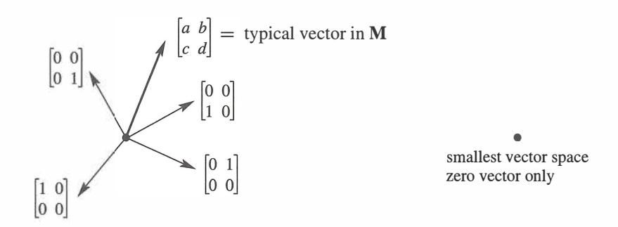
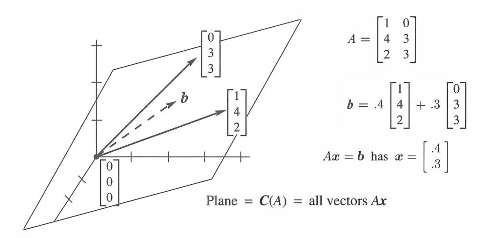
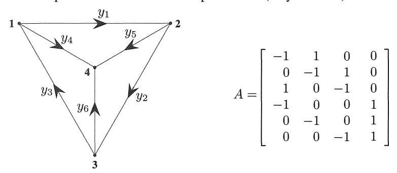
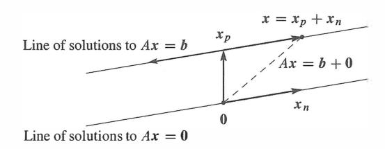
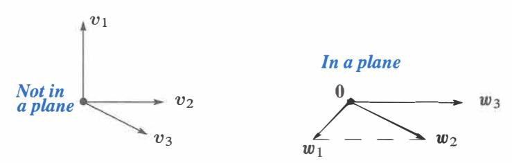
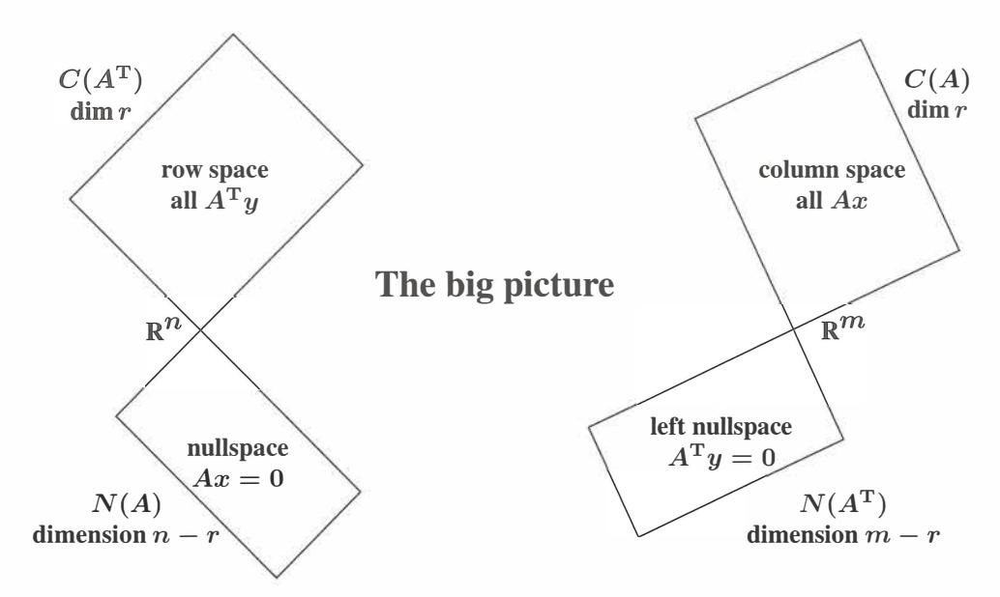

# **Chapter 3**

# **Vector Spaces and Subspaces**

# **3.1 Spaces of Vectors**

- 1 The standard n-dimensional space R **2** If *v* and ware in a **vector space** *S,* every combination *cv* + *dw* must be in *S.*  **3** The "vectors" in Scan be matrices or functions of *x.* The I-point space *Z* consists of *x* = **0.** 4 A **subspace** of R nis a vector space inside R . *Example:* The line y = *3x* inside R **5** The **column space** of *A* contains all combinations of the columns of *A:* a subspace of R
- m. **6** The column space contains all the vectors *Ax.* So *Ax* = bis solvable when bis in *C(A).*

ncontains all real column vectors with *n* components.

To a newcomer, matrix calculations involve a lot of numbers. To you, they involve vectors. The columns of *Ax* and *AB* are linear combinations of *n* vectors-the columns of A. This chapter moves from numbers and vectors to a third level of understanding (the highest level). Instead of individual columns, we look at "spaces" of vectors. Without seeing *vector spaces* and especially their *subspaces,* you haven't understood everything about *Ax= b.* 

Since this chapter goes a little deeper, it may seem a little harder. That is natural. We are looking inside the calculations, to find the mathematics. The author's job is to make it clear. The chapter ends with the *"Fundamental Theorem of Linear Algebra".* 

We begin with the most important vector spaces. They are denoted by R**1 ,** R 2 , R 3 , R 4 , .... Each space *Rn* consists of a whole collection of vectors. R 5contains all column vectors with five components. This is called "5-dimensional space".

**DEFINITION** *The space* R n*consists of all column vectors v with n components.*  The components of v are real numbers, which is the reason for the letter R. A vector whose n components are complex numbers lies in the space *e .*

The vector space R**2**is represented by the usual xy plane. Each vector v in R**2**has two components. The word *"space"* asks us to think of all those vectors-the whole plane. Each vector gives the *x* and *y* coordinates of a point in the plane: *v* = ( *x, y).* 

Similarly the vectors in R 3correspond to points ( *x, y, z)* in three-dimensional space. The one-dimensional space R 1is a line (like the *x* axis). As before, we print vectors as a column between brackets, or along a line using commas and parentheses:

$$\begin{bmatrix} 4 \\ \pi \end{bmatrix} \text{ is in } \mathbf{R}^2, \quad (1, 1, 0, 1, 1) \text{ is in } \mathbf{R}^5, \quad \begin{bmatrix} 1+i \\ 1-i \end{bmatrix} \text{ is in } \mathbf{C}^2.$$

The great thing about linear algebra is that it deals easily with five-dimensional space. We don't draw the vectors, we just need the five numbers (or n numbers).

To multiply v by 7, multiply every component by 7. Here 7 is a "scalar". To add vectors in R 5 , add them a component at a time. The two essential vector operations go on *inside the vector space,* and they produce *linear combinations:* 

*We can add any vectors in* Rn , *and we can multiply any vector v by any scalar* c.

"Inside the vector space" means that *the result stays in the space.* If *v* is the vector in R 4 with components 1, 0, 0, 1, then 2v is the vector in R**4**with components 2, 0, 0, 2. (In this case 2 is the scalar.) A whole series of properties can be verified in Rn . The commutative law is *v* + *w* = *w* + *v;* the distributive law is c( *v* + *w)* = *cv* + *cw.* There is a unique "zero vector" satisfying O + v = v. Those are three of the eight conditions listed at the start of the problem set.

These eight conditions are required of every vector space. There are vectors other than column vectors, and there are vector spaces other than Rn , and all vector spaces have to obey the eight reasonable rules.

*A real vector space is a set of* "vectors" *together with rules for vector addition and for multiplication by real numbers.* The addition and the multiplication must produce vectors that are in the space. And the eight conditions must be satisfied (which is usually no problem). Here are three vector spaces other than Rn :

M The vector space of *all real* 2 *by* 2 *matrices.*  F The vector space of *all real functions f* ( *x).*  Z The vector space that consists only of a *zero vector.* 

In M the "vectors" are really matrices. In F the vectors are functions. In Z the only addition is O + 0 = 0. In each case we can add: matrices to matrices, functions to functions, zero vector to zero vector. We can multiply a matrix by 4 or a function by 4 or the zero vector by 4. The result is still in M or F or Z. The eight conditions are all easily checked.

The function space F is infinite-dimensional. A smaller function space is P, or P n, containing all polynomials a*0*+a*1* x + · · · + anx n of degree n.

The space Z is zero-dimensional (by any reasonable definition of dimension). Z is the smallest possible vector space. We hesitate to call it RO , which means no componentsyou might think there was no vector. The vector space Z contains exactly *one vector* (zero). No space can do without that zero vector. Each space has its own zero vector-the zero matrix, the zero function, the vector (0, 0, 0) in R**3 .** 

Figure 3.1: "Four-dimensional" matrix space M. The "zero-dimensional" space Z.

## **Subspaces**

At different times, we will ask you to think of matrices and functions as vectors. But at all times, the vectors that we need most are ordinary column vectors. They are vectors with n components-but *maybe not all* of the vectors with *n* components. There are important vector spaces *inside Rn .* Those are *subspaces* of *Rn .*

Start with the usual three-dimensional space R 3 . Choose a plane through the origin ( 0, 0, 0). *That plane is a vector space in its own right.* If we add two vectors in the plane, their sum is in the plane. If we multiply an in-plane vector by 2 or -5, it is still in the plane. A plane in three-dimensional space is not R2(even if it looks like R2 ). The vectors have three components and they belong to R 3 . The plane is a vector space *inside* R 3 .

This illustrates one of the most fundamental ideas in linear algebra. The plane going through (0, 0, 0) is a *subspace* of the full vector space R 3 •

**DEFINITION** A *subspace* of a vector space is a set of vectors (including 0) that satisfies two requirements: *If v and ware vectors in the subspace and* c *is any scalar, then* 

(i) v + w is in the subspace (ii) *cv* is in the subspace.

In other words, the set of vectors is "closed" under addition *v*+ *w*and multiplication *cv* (and *dw).* Those operations leave us in the subspace. We can also subtract, because *-w* is in the subspace and its sum with vis v - *w.* In short, *all linear combinations stay in the subspace.* 

All these operations follow the rules of the host space, so the eight required conditions are automatic. We just have to check the linear combinations requirement for a subspace.

First fact: *Every subspace contains the zero vector.* The plane in R 3 has to go through (0, 0, 0). We mention this separately, for extra emphasis, but it follows directly from rule **(ii).** Choose c = 0, and the rule requires *Ov* to be in the subspace.

Planes that don't contain the origin fail those tests. Those planes are not subspaces.

*Lines through the origin are also subspaces.* When we multiply by 5, or add two vectors on the line, we stay on the line. But the line must go through (0, 0, 0).

Another subspace is all of R 3 . The whole space is a subspace *(of itself).* Here is a list of all the possible subspaces of R 3

- (L) Any line through (0, 0, 0)
- (P) Any plane through (0, 0, 0) (R3) The whole space
  - (Z) The single vector (0, 0, 0)

If we try to keep only *part* of a plane or line, the requirements for a subspace don't hold. Look at these examples in R2-they are not subspaces.

**Example 1** Keep only the vectors *(x, y)* whose components are positive or zero (this is a quarter-plane). The vector (2, 3) is included but (-2, -3) is not. So rule **(ii)** is violated when we try to multiply by c = -1. *The quarter-plane is not a subspace.* 

**Example 2** Include also the vectors whose components are both negative. Now we have two quarter-planes. Requirement **(ii)** is satisfied; we can multiply by any c. But rule **(i)** now fails. The sum of v = (2, 3) and *w* = (-3, -2) is (-1, 1), which is outside the quarter-planes. *Two quarter-planes don't make a subspace.* 

Rules **(i)** and **(ii)** involve vector addition v + *w*and multiplication by scalars c and *d.* The rules can be combined into a single requirement-the *rule for subspaces:* 

*A subspace containing v and w must contain all linear combinations cv* + *dw.* 

**Example 3** Inside the vector space M of all 2 by 2 matrices, here are two subspaces:

- (U) All upper triangular matrices [ � ! ] (D) All diagonal matrices [ � �] .

| (U) | All upper triangular matrices | $\begin{bmatrix} a & b \\ 0 & d \end{bmatrix}$ | (D) | All diagonal matrices | $\begin{bmatrix} a & 0 \\ 0 & d \end{bmatrix}$ |
|-----|-------------------------------|------------------------------------------------|-----|-----------------------|------------------------------------------------|
|-----|-------------------------------|------------------------------------------------|-----|-----------------------|------------------------------------------------|

Add any two matrices in U, and the sum is in U. Add diagonal matrices, and the sum is diagonal. In this case D is also a subspace of U ! Of course the zero matrix is in these subspaces, when *a, b,* and *d* all equal zero. Z is always a subspace.

Multiples of the identity matrix also form a subspace. 2J + *3I* is in this subspace, and so is 3 times 4J. The matrices *cJ* form a "line of matrices" inside Mand U and D.

Is the matrix *I* a subspace by itself? Certainly not. Only the zero matrix is. Your mind will invent more subspaces of 2 by 2 matrices -write them down for Problem 5.

### **The Column Space of** *A*

The most important subspaces are tied directly to a matrix *A.* We are trying to solve *Ax* = *b.* If *A* is not invertible, the system is solvable for some band not solvable for other *b.* We want to describe the good right sides b-the vectors that *can* be written as *A* times some vector *x.* Those *b' s* form the *"column space"* of *A.*

Remember that *Ax* is a combination of the columns of *A.* To get every possible *b,* we use every possible *x.* Start with the columns of *A* and *take all their linear combinations. This produces the column space of A.* It **is a vector space made up of column vectors.**

*C(A)* contains not just then columns of *A,* but all their combinations *Ax.* 

**DEFINITION** The *column space* consists of *all linear combinations of the columns .*  The combinations are all possible vectors *Ax.* They fill the column space *C(A).* 

This column space is crucial to the whole book, and here is why. *To solve Ax* = *bis to express bas a combination of the columns .* The right side *b* has to be *in the column space* produced by *A* on the left side, or no solution!

*The system Ax* = *b is solvable if and only if b is in the column space of A.* 

When *b* is in the column space, it is a combination of the columns. The coefficients in that combination give us a solution *x* to the system *Ax* = *b.* 

Suppose *A* is an *m* by *n* matrix. Its columns have *m* components (not *n).* So the columns belong to Rm. *The column space of A is a subspace ofRrn (not R ).* The set of all column combinations *Ax* satisfies rules (i) and (ii) for a subspace: When we add linear combinations or multiply by scalars, we still produce combinations of the columns. The word "subspace" is justified *by taking all linear combinations.*

Here is a 3 by 2 matrix *A,* whose column space is a subspace of R 3 • The column space of *A* is a plane in Figure 3 .2. With only 2 columns, *C (A)* can't be all of R 3 .

#### **Example4**

$$Ax \text{ is } \begin{bmatrix} 1 & 0 \\ 4 & 3 \\ 2 & 3 \end{bmatrix} \begin{bmatrix} x_1 \\ x_2 \end{bmatrix} \text{ which is } x_1 \begin{bmatrix} 1 \\ 4 \\ 2 \end{bmatrix} + x_2 \begin{bmatrix} 0 \\ 3 \\ 3 \end{bmatrix}.$$

The column space of all combinations of the two columns *fills up a plane in* R 3 . We drew one particular *b* (a combination of the columns). This *b* = *Ax* lies on the plane. The plane has zero thickness, so most right sides b in R 3 are *not* in the column space. For most *b* there is no solution to our 3 equations in 2 unknowns.

Figure 3.2: The column space C(A) is a plane containing the two columns. *Ax* =bis solvable when *b* is on that plane. Then b is a combination of the columns.

Of course (0, 0, 0) is in the column space. The plane passes through the origin. There is certainly a solution to *Ax* = 0. That solution, always available, is *x* = \_\_ .

To repeat, the attainable right sides *b* are exactly the vectors in the column space. One possibility is the first column itself-take x1 = 1 and x2 = 0. Another combination is the second column-take x1 = 0 and x2 = 1. The new level of understanding is to see *all* combinations-the whole subspace is generated by those two columns.

**Notation** The column space of *A* is denoted by C(A). Start with the columns and take all their linear combinations. We might get the whole Rm or only a subspace.

**Important** Instead of columns in Rm, we could start with any set **S** of vectors in a vector space V. To get a *subspace* **SS** of V, we take *all combinations* of the vectors in that set:

**S**set of vectors in V (probably *not* a subspace)

**SS** all combinations of vectors in S (definitely a subspace)

**SS** = all 
$$c_1 v_1 + \dots + c_n v_n$$
 = **the subspace of V** "spanned" by **S**

When **S** is the set of columns, **SS** is the column space. When there is only one nonzero vector *v* in S, the subspace **SS** is the line through *v. Always* **SS** *is the smallest subspace containing* S. This is a fundamental way to create subspaces and we will come back to it.

To repeat: The columns "span" the column space.

**The subspace** SS **is the "span" of S, containing all combinations of vectors in S.**

**Example 5** Describe the column spaces (they are subspaces of **R )** for

| $I = \begin{bmatrix} 1 & 0 \\ 0 & 1 \end{bmatrix}$ | and | $A = \begin{bmatrix} 1 & 2 \\ 2 & 4 \end{bmatrix}$ | and | $B = \begin{bmatrix} 1 & 2 & 3 \\ 0 & 0 & 0 \end{bmatrix}$ |
|----------------------------------------------------|-----|----------------------------------------------------|-----|------------------------------------------------------------|
|----------------------------------------------------|-----|----------------------------------------------------|-----|------------------------------------------------------------|

**Solution** The column space of *I* is the *whole space* **R .** Every vector is a combination of the columns of *I.* In vector space language, *C(I)* is R**2 .** 

The column space of *A* is only a line. The second column (2, 4) is a multiple of the first column (1, 2). Those vectors are different, but our eye is on vector *spaces.* The column space contains (1, 2) and (2, 4) and all other vectors (c, 2c) along that line. The equation *Ax* = bis only solvable when *b* is on the line.

For the third matrix (with three columns) the column space *C(B)* is all of **R .** Every *b* is attainable. The vector *b* = (5, 4) is column 2 plus column 3, so *x* can be (0, 1, 1). The same vector (5, 4) is also 2(column 1) + column 3, so another possible *xis* (2, 0, 1). This matrix has the same column space as I-any *bis* allowed. But now *x* has extra components and there are more solutions-more combinations that give *b.* 

The next section creates a vector space *N(A),* to describe all the solutions of *Ax* = 0. This section created the column space *C(A),* to describe all the attainable right sides *b.*

#### **• REVIEW OF THE KEV IDEAS •**

- **1.** *Rn* contains all column vectors with *n* real components.
- 2. M (2 by 2 matrices) and F (functions) and Z (zero vector alone) are vector spaces.
- **3.** A subspace containing *v* and *w* must contain all their combinations *cv* + *dw.*
- **4.** The combinations of the columns of *A* form the *column space C(A).* Then the column space is "spanned" by the columns.
- 5. *Ax* = *b*has a solution exactly when *b* is in the column space of *A. C(A)* = **all combinations of the columns = all vectors** *Ax.*

#### **• WORKED EXAMPLES •**

**3.1 A** We are given three different vectors b1, b2, b3. Construct a matrix so that the equations *Ax* = b1 and *Ax* = b2 are solvable, but *Ax* = *b3* is not solvable. How can you decide if this is possible? How could you construct *A?* 

Solution We want to have b1 and *b2*in the column space of *A.* Then *Ax* = b1 and *Ax* = *b2* will be solvable. *The quickest way is to make* b1 *and b2 the two columns of A.* Then the solutions are x = (l, 0) and x = (0, 1).

Also, we don't want *Ax* = *b3* to be solvable. So don't make the column space any larger! Keeping only the columns b1 and *b2,* the question is:

| Is $Ax = \begin{bmatrix} b_1 & b_2 \end{bmatrix} \begin{bmatrix} x_1 \\ x_2 \end{bmatrix} = b_3$ solvable? | Is $b_3$ a combination of $b_1$ and $b_2$ ? |
|------------------------------------------------------------------------------------------------------------|---------------------------------------------|
|------------------------------------------------------------------------------------------------------------|---------------------------------------------|

If the answer is *no,* we have the desired matrix *A.* If the answer is *yes,* then it is *not possible* to construct *A.* When the column space contains b1 and *b2,* it will have to contain all their linear combinations. So *b3* would necessarily be in that column space and *Ax* = *b3* would necessarily be solvable.

3.1 B Describe a subspace S of each vector space V, and then a subspace SS of S.

V1=all combinations of ( 1, 1, 0, 0) and ( 1, 1, 1, 0) and ( 1, 1, 1, 1) V2=all vectors perpendicular to *u*= (l, 2, 1), *sou· v* = 0 V3=all symmetric 2 by 2 matrices ( a subspace of M) V4=all solutions to the equation *d 4*y / *dx4*=0 ( a subspace of F)

Describe each V two ways: *"All combinations of ... " "All solutions of the equations ... "*

Solution V 1 starts with three vectors. A subspace S comes from all combinations of the first two vectors (1, 1, 0, 0) and (1, 1, 1, 0). A subspace SS of S comes from all multiples ( *c, c,* 0, 0) of the first vector. So many possibilities.

A subspace S of V 2 is the line through ( 1, -1, 1). This line is perpendicular to *u.* The vector *x* = (0, 0, 0) is in S and all its multiples *ex* give the smallest subspace SS = Z.

The diagonal matrices are a subspace S of the symmetric matrices. The multiples *cf* are a subspace SS of the diagonal matrices.

V 4 contains all cubic polynomials y = *a*+ *bx* + *cx2*+ *dx3 ,* with *d 4* y / *dx4*= 0. The quadratic polynomials give a subspace S. The linear polynomials are one choice of SS. The constants could be SSS.

In all four parts we could take S = V itself, and SS = the zero subspace Z.

Each V can be described as *all combinations of* .... and as *all solutions of* .... :

V1=all combinations of the 3 vectors V1=all solutions of v1 - *v2* =0 V2=all combinations of (1, 0, -1) and (1, -1, 1) V2=all solutions of *u* · *v* =0. V 3= all combinations of [ 6 g] , [ � 6 ] , [8 � ] . V 3= all solutions [ � � ] of b = *c*

V4=all combinations of 1, *x, x*

*, x*

*3*V 4= all solutions to *d*

*4*

*y*/ *dx4*=0.

# **Problem Set 3.1**

**The first problems 1-8 are about vector spaces in general. The vectors in those spaces are not necessarily column vectors. In the definition of a** *vector space,* **vector addition**  *x* + *y* **and scalar multiplication** *ex* **must obey the following eight rules:** 

- (1) *X*+ *y* = *y* + *X*
- (2) *x+(y+z)=(x+y)+z*
- (3) There is a unique "zero vector" such that *x* + 0 = *x* for all *x* ( 4) For each *x* there is a unique vector *-x* such that *x* + ( *-x)* = 0
- (5) 1 times *x* equals *x*
- (6) (e1e2)x = e1(e2x)
- (7) e( *x* + *y)* = *ex* + *ey*
- (8) (e1 + *e2)x* = e1x + *e2x.*
- (1) to (4) about x + *y*
- (5) to (6) about *ex*
- (7) to (8) connects them **1**Suppose (x1,x2) + (Y1,Y2) is defined to be (x1 + *Y2 ,x2* + Y1). With the usual multiplication *ex* = ( ex1, *ex2),* which of the eight conditions are not satisfied? **2**Suppose the multiplication *ex* is defined to produce (ex1, 0) instead of (ex1, *ex2 ).*  With the usual addition in R 2 , are the eight conditions satisfied? 3 (a) Which rules are broken if we keep only the positive numbers x > 0 in R 1 ? Every *e* must be allowed. The half-line is not a subspace.
- (b) The positive numbers with *x* + *y* and *ex* redefined to equal the usual *xy* and *x cdo* satisfy the eight rules. Test rule 7 when *e* = 3, *x* = 2, y = 1. (Then *x* + *y* = 2 and *ex=* 8.) Which number acts as the "zero vector"? 4 The matrix *A* = [; =;] is a "vector" in the space M of all 2 by 2 matrices. Write down the zero vector in this space, the vector ½ *A,* and the vector *-A.* What matrices are in the smallest subspace containing *A?*  5 (a) Describe a subspace of M that contains *A=* [ *i* g] but not *B* = [ g -�].
- (b) If a subspace of M does contain *A* and *B,* must it contain *I?* ( c) Describe a subspace of M that contains no nonzero diagonal matrices. **6**The functions *f(x)* = *x 2*and *g(x)* = *5x* are "vectors" in F. This is the vector space of all real functions. (The functions are defined for -oo < x < oo.) The combination *3f(x)* - *4g(x)* is the function *h(x)* = \_\_ .

7 Which rule is broken if multiplying f ( x) by e gives the function *f* (ex)? Keep the usual addition *f(x)* + *g(x).*  8 If the sum of the "vectors" *f(x)* and *g(x)* is defined to be the function f(g(x)), then the "zero vector" is *g(x)* = *x.* Keep the usual scalar multiplication *ef(x)* and find two rules that are broken.

Questions 9-18 are about the "subspace requirements": *x* + y and *ex* (and then ail I.in.ear combinations *ex* + *dy)* stay in the subspace.

- 9 One requirement can be met while the other fails. Show this by finding
  - (a) A set of vectors in R 2 for which x + y stays in the set but ½x may be outside.
- (b) A set of vectors in R2( other than two quarter-planes) for which every *ex* stays in the set but x + *y* may be outside. 10 Which of the following subsets of R 3are actually subspaces ?
  - (a) The plane of vectors (b1, b2, b3 ) with b1 **=** h
  - (b) The plane of vectors with b 1=1. ( c) The vectors with b1 b*2*b*3***=**0.
  - (d) All linear combinations of v **=** (1, 4, 0) and w **=** (2, 2, 2).
  - (e) All vectors that satisfy b1+b2+*b3*=0.
- (f) All vectors with b1 ::; b2 ::; b3. 11 Describe the smallest subspace of the matrix space M that contains
- (a) [� �]and[� �] (b) [� �] (c) [� �] and [� �]- 12 Let P be the plane in R 3 with equation *x* + *y* - 2z = 4. The origin ( 0, 0, 0) is not in P! Find two vectors in *P* and check that their sum is not in *P.*  13 Let P0 be the plane through (0, 0, 0) parallel to the previous plane *P.* What is the equation for PO? Find two vectors in PO and check that their sum is in PO• 14 The subspaces of R3 are planes, lines, R3 itself, or Z containing only (0, 0, 0).
  - (a) Describe the three types of subspaces of R .
  - (b) Describe all subspaces of D, the space of 2 by 2 diagonal matrices.

- 15 (a) The intersection of two planes through (0, 0, 0) is probably a \_\_ in R 3but it could be a . It can't be Z!
- (b) The intersection of a plane through ( 0, 0, 0) with a line through ( 0, 0, 0) is probably a \_\_ but it could be a \_\_ . ( c) If S and T are subspaces of R 5 , prove that their intersection S n T is a subspace of R 5 . Here S n T consists of the vectors that lie in both subspaces. *Check that x* + *y and ex are in* S nT if *x and* y *are in both spaces.* 16 Suppose Pis a plane through (0, 0, 0) and Lis a line through (0, 0, 0). The smallest vector space containing both P and L is either \_\_ or \_\_ . 17 (a) Show that the set of *invertible* matrices in Mis not a subspace.
- (b) Show that the set of *singular* matrices in M is not a subspace. 18 True or false (check addition in each case by an example):
  - (a) The symmetric matrices in M (with *A T = A)* form a subspace.
  - (b) The skew-symmetric matrices in M (with *AT = -A)* form a subspace.
  - (c) The unsymmetric matrices in M (with *AT*I- *A)* form a subspace.

**Questions 19-27 are about column spaces** *C (A)* **and the equation** *Ax* = *b.*  19 Describe the column spaces (lines or planes) of these particular matrices:

| $A = \begin{bmatrix} 1 & 2 \\ 0 & 0 \\ 0 & 0 \end{bmatrix}$ | and | $B = \begin{bmatrix} 1 & 0 \\ 0 & 2 \\ 0 & 0 \end{bmatrix}$ | and | $C = \begin{bmatrix} 1 & 0 \\ 2 & 0 \\ 0 & 0 \end{bmatrix}$ |
|-------------------------------------------------------------|-----|-------------------------------------------------------------|-----|-------------------------------------------------------------|
|-------------------------------------------------------------|-----|-------------------------------------------------------------|-----|-------------------------------------------------------------|

20 For which right sides (find a condition on b1, b2, b3) are these systems solvable?

| (a) | $\begin{bmatrix} 1 & 4 & 2 \\ 2 & 8 & 4 \\ -1 & -4 & -2 \end{bmatrix}$ | $\begin{bmatrix} x_1 \\ x_2 \\ x_3 \end{bmatrix} = \begin{bmatrix} b_1 \\ b_2 \\ b_3 \end{bmatrix}$ | (b) | $\begin{bmatrix} 1 & 4 \\ 2 & 9 \\ -1 & -4 \end{bmatrix}$ | $\begin{bmatrix} x_1 \\ x_2 \end{bmatrix} = \begin{bmatrix} b_1 \\ b_2 \\ b_3 \end{bmatrix}$ |
|-----|------------------------------------------------------------------------|-----------------------------------------------------------------------------------------------------|-----|-----------------------------------------------------------|----------------------------------------------------------------------------------------------|
|-----|------------------------------------------------------------------------|-----------------------------------------------------------------------------------------------------|-----|-----------------------------------------------------------|----------------------------------------------------------------------------------------------|

21 Adding row 1 of *A* to row 2 produces *B.* Adding column 1 to column 2 produces *C.* A combination of the columns of *(B* or *C* ?) is also a combination of the columns of

*A.* Which two matrices have the same column ?

| $A = \begin{bmatrix} 1 & 2 \\ 2 & 4 \end{bmatrix}$ | and | $B = \begin{bmatrix} 1 & 2 \\ 3 & 6 \end{bmatrix}$ | and | $C = \begin{bmatrix} 1 & 3 \\ 2 & 3 \end{bmatrix}$ |
|----------------------------------------------------|-----|----------------------------------------------------|-----|----------------------------------------------------|
|----------------------------------------------------|-----|----------------------------------------------------|-----|----------------------------------------------------|

$$\begin{bmatrix} 1 & 1 & 1 \\ 0 & 1 & 1 \\ 0 & 0 & 1 \end{bmatrix} \begin{bmatrix} x_1 \\ x_2 \\ x_3 \end{bmatrix} = \begin{bmatrix} b_1 \\ b_2 \\ b_3 \end{bmatrix} \quad \text{and} \quad \begin{bmatrix} 1 & 1 & 1 \\ 0 & 1 & 1 \\ 0 & 0 & 0 \end{bmatrix} \begin{bmatrix} x_1 \\ x_2 \\ x_3 \end{bmatrix} = \begin{bmatrix} b_1 \\ b_2 \\ b_3 \end{bmatrix}$$

**22** For which vectors (b1, b2, b3) do these systems have a solution?

- **23**(Recommended) If we add an extra column *b* to a matrix *A,* then the column space gets larger unless \_\_ . Give an example where the column space gets larger and an example where it doesn't. Why is *Ax* = *b* solvable exactly when the column space *doesn't* get larger-it is the same for *A* and [ *A* b]? **24**The columns of *AB* are combinations of the columns of *A.* This means: *The column space of AB is contained in* (possibly equal to) *the column space of A.* Give an example where the column spaces of *A* and *AB* are not equal. **25**Suppose *Ax* = band *Ay* = *b\** are both solvable. Then *Az* = *b* + *b\** is solvable. What is *z?* This translates into: If *b* and *b\** are in the column space *C(A), then b* + *b\** is in *C(A).*  **26**If *A* is any 5 by 5 invertible matrix, then its column space is \_\_ . Why? **27**True or false (with a counterexample if false):
  - (a) The vectors *b* that are not in the column space *C(A)* form a subspace.
  - (b) If *C(A)* contains only the zero vector, then *A* is the zero matrix. ( c) The column space of *2A* equals the column space of *A.*
- (d) The column space of *A I* equals the column space of *A* (test this). **28**Construct a 3 by 3 matrix whose column space contains ( 1, 1, 0) and ( 1, 0, 1) but not (1, 1, 1). Construct a 3 by 3 matrix whose column space is only a line. **29**If the 9 by 12 system *Ax* = bis solvable for every *b,* then *C(A)* = \_\_ .

# **Challenge Problems**

- **30**Suppose **S** and **T** are two subspaces of a vector space **V.**
  - (a) **Definition:** The **sum S** + T contains all sums s + *t* of a vectors in S and a vector tin T. Show that S + T satisfies the requirements (addition and scalar multiplication) for a vector space.
- (b) If S and T are lines in Rm, what is the difference between S + T and S U T? That union contains all vectors from S or T or both. Explain this statement: *The span of* SU *Tis* S + T. (Section 3.5 returns to this word "span".) 31 If Sis the column space of *A* and T is *C(B),* then S +T is the column space of what matrix *M?* The columns of *A* and *B* and *M* are all in Rm. (I don't think *A+ B*  is always a correct *M.)*  **32**Show that the matrices *A* and [ *A AB]* (with extra columns) have the same column space. But find a square matrix with C(A2 ) smaller than *C(A).* Important point: *Ann* by *n* matrix has *C(A)* = Rn exactly when *A* is an \_\_ matrix.

# **3.2 The Nullspace of** *A:* **Solving** *Ax=* **0 and** *Rx* **0**

The **nullspace** *N(A)* in R ncontains all solutions *x* to *Ax* = 0. This includes *x* = 0. Elimination (from *A* to *U* to *R)* does not change the nullspace: *N(A)* = *N(U)* = *N(R).* The **reduced row echelon form** *R* =**rref(A)** has all pivots= 1, with zeros above and below. 4 If column *j* of *R* is free (no pivot), there is a *"special solution"* to *Ax* = 0 with *Xj* = 1. Number of pivots = number of nonzero rows in *R* = **rank** r. There are n - r free columns. Every matrix with m < *n* has nonzero solutions to *Ax* = 0 in its nullspace.

This section is about the subspace containing all solutions to *Ax* = 0. The m by n matrix *A* can be square or rectangular. The right hand side is *b* = 0. *One immediate solution is x* = 0. For invertible matrices this is the only solution. For other matrices, not invertible, there are nonzero solutions to *Ax* = 0. *Each solution x belongs to the nullspace of A.*

Elimination will find all solutions and identify this very important subspace.

# *The nullspace N(A) consists of all solutions to Ax=* 0. *These vectors x are in* R

Check that the solution vectors form a subspace. Suppose *x* and *y* are in the nullspace (this means *Ax* = **0** and *Ay* = **0).** The rules of matrix multiplication give *A( x* + *y)* = **0** + **0.**  The rules also give *A( ex)* = e0. The right sides are still zero. Therefore *x* + *y* and *ex* are also in the nullspace *N(A).* Since we can add and multiply without leaving the nullspace, it is a subspace.

To repeat: The solution vectors x have n components. They are vectors in R , so *the nullspace is a subspace of* R . The column space *C(A)* is a subspace of R m.

**Example 1** Describe the nullspace of *A* = [ ! �] . This matrix is singular!

**Solution** Apply elimination to the linear equations *Ax* =0:

| $x_1 + 2x_2 = 0$  | $\rightarrow$ | $x_1 + 2x_2 = 0$          |
|-------------------|---------------|---------------------------|
| $3x_1 + 6x_2 = 0$ |               | $\mathbf{0} = \mathbf{0}$ |

There is really only one equation. The second equation is the first equation multiplied by 3. In the row picture, the line x1 + 2x2 = 0 is the same as the line 3x1 + 6x2 = 0. That line is the nulls pace *N (A).* It contains all solutions ( x1, x2).

To describe the solutions to *Ax* = 0, here is an efficient way. Choose one point on the line (one *"special solution").* Then all points on the line are multiples of this one. We choose the second component to be x2=1 (a special choice). From the equation x1 + 2x2 = 0, the first component must be x1 = -2. **The special solution is** *s* = (-2, 1).

**Special solution**   
$$As = \mathbf{0}$$
   The nullspace of  $A = \begin{bmatrix} 1 & 2 \\ 3 & 6 \end{bmatrix}$  contains all multiples of  $s = \begin{bmatrix} -2 \\ 1 \end{bmatrix}$ .

This is the best way to describe the nullspace, by computing special solutions to *Ax* = **0. The solution is special because we set the free variable to** x2=**1.**

### *The nullspace of A consists of all combinations of the special solutions to Ax* = 0.

**Example 2** *x* + 2y + *3z* = 0 comes from the 1 by 3 matrix *A* = [ 1 2 3 ]. Then *Ax* = 0 produces a plane. All vectors on the plane are perpendicular to (1, 2, 3). *The plane is the nullspace of A.* There are two free variables y and *z* : Set to 0 and 1.

$$\begin{bmatrix} 1 & 2 & 3 \end{bmatrix} \begin{bmatrix} x \\ y \\ z \end{bmatrix} = 0 \text{ has two special solutions } s_1 = \begin{bmatrix} -2 \\ 1 \\ 0 \end{bmatrix} \text{ and } s_2 = \begin{bmatrix} -3 \\ 0 \\ 1 \end{bmatrix}.$$

Those vectors s1 and s2 lie on the plane x + 2y + *3z* = 0. All vectors on the plane are combinations of s1 and s2.

Notice what is special about s1 and s2. *The last two components are "free" and we choose them specially as* 1, 0 *and* 0, 1. Then the first components -2 and -3 are determined by the equation *Ax* = 0.

The solutions to x + 2y + *3z* = **6** also lie on a plane, but that plane is not a subspace. The vector x = **0** is only a solution if b = **0.** Section 3.3 will show how the solutions to *Ax* = *b* (if there are any solutions) are shifted away from zero by one particular solution.

The two key steps of this section are **(1)** reducing *A* to its **row echelon form** *R* ( **2)** finding the **special solutions to** *Ax* = **0**

The display on page 138 shows 4 by 5 matrices *A* and *R,* with 3 pivots.

The equations *Ax* = **0** and also *Rx* = **0** have 5 - 3 = 2 special solutions s1 and s2.

#### **Pivot Columns and Free Columns**

The first column of *A* = [ 1 2 3 ] contains the only pivot, so the first component of x is *not free.* **The free components correspond to columns with no pivots.** The special choice (one or zero) is only for the free variables in the special solutions.

**Example 3** Find the nullspaces of *A, B, C* and the two special solutions to *Cx* = **0.**

$$A = \begin{bmatrix} 1 & 2 \\ 3 & 8 \end{bmatrix} \quad B = \begin{bmatrix} A \\ 2A \end{bmatrix} = \begin{bmatrix} 1 & 2 \\ 3 & 4 \\ 6 & 16 \end{bmatrix} \quad C = [A \quad 2A] = \begin{bmatrix} 1 & 2 & 2 & 4 \\ 3 & 8 & 6 & 16 \end{bmatrix}.$$

**Solution** The equation *Ax* = 0 has only the zero solution *x* = 0. *The nullspace is* **Z.** It contains only the single point x = 0 in R **.** This fact comes from elimination:

| $\mathbf{Ax} = \begin{bmatrix} 1 & 2 \\ 3 & 8 \end{bmatrix} \begin{bmatrix} x_1 \\ x_2 \end{bmatrix} = \begin{bmatrix} 0 \\ 0 \end{bmatrix}$ yields $\begin{bmatrix} 1 & 2 \\ 0 & 2 \end{bmatrix} \begin{bmatrix} x_1 \\ x_2 \end{bmatrix} = \begin{bmatrix} 0 \\ 0 \end{bmatrix}$ and $\begin{bmatrix} x_1 = 0 \\ x_2 = 0 \end{bmatrix}$ . |
|---------------------------------------------------------------------------------------------------------------------------------------------------------------------------------------------------------------------------------------------------------------------------------------------------------------------------------------------|
|---------------------------------------------------------------------------------------------------------------------------------------------------------------------------------------------------------------------------------------------------------------------------------------------------------------------------------------------|

*A* is invertible. There are no special solutions. Both columns of this matrix have pivots.

The rectangular matrix *B* has the same nullspace Z. The first two equations in *Bx* = 0 again require x = 0. The last two equations would also force x = 0. When we add extra equations (giving extra rows), the nullspace certainly cannot become larger. The extra rows impose more conditions on the vectors x in the nullspace.

The rectangular matrix *C* is different. It has extra columns instead of extra rows. The solution vector *x* has *four* components. Elimination will produce pivots in the first two columns of *C,* but **the last two columns of** *C* **and** *U* **are "free". They don't have pivots:**

| Subtract 3 (row 1) | $C = \begin{bmatrix} 1 & 2 & 2 & 4 \end{bmatrix}$ | becomes $U = \begin{bmatrix} 1 & 2 & 2 & 4 \\ 0 & 2 & 0 & 4 \\ \uparrow & \uparrow & \uparrow & \uparrow \end{bmatrix}$ |              |
|--------------------|---------------------------------------------------|-------------------------------------------------------------------------------------------------------------------------|--------------|
| from row 2 of $C$  |                                                   | pivot columns                                                                                                           | free columns |

For the free variables *x3*and *x4,* we make special choices of ones and zeros. First *X3* = 1, *x4*= 0 and second *x3*= 0, *x4*= 1. The pivot variables x i and x2 are determined by the equation *U x* = 0 ( or *Cx* = 0 or eventually *Rx* = 0). We get two special solutions in the nullspace of *C.* This is also the nullspace of *U:* elimination doesn't change solutions.

| Cs= o |           |
|-------|-----------|
| Us= 0 |           |
| +---  | pivot     |
| +---  | variables |
| +---  | free      |
| +---  | variables |

#### **The Reduced Row Echelon Form** *R*

When *A* is rectangular, elimination will not stop at the upper triangular *U.* We can continue to make this matrix simpler, in two ways. These steps bring us to the best matrix *R:*

- **1.** *Produce zeros above the pivots.* **Use pivot rows to eliminate upward in** *R.*
- **2.** *Produce ones in the pivots.* **Divide the whole pivot row by its pivot.**

Those steps don't change the zero vector on the right side of the equation. The nullspace stays the same: *N(A)* = *N(U)* = *N(R).* This nullspace becomes easiest to see when we reach the *reduced row echelon form R* = rref *(A). The pivot columns of R contain I.*

| Reduced form $R$ | $U = \begin{bmatrix} 1 & 2 & 2 & 4 \\ 0 & 3 & 0 & 4 \end{bmatrix}$ | becomes | $R = \begin{bmatrix} 1 & 0 & 2 & 0 \\ 0 & 1 & 0 & 2 \\ & & 1 & \uparrow \\ & & & \uparrow \end{bmatrix}$ |
|------------------|--------------------------------------------------------------------|---------|----------------------------------------------------------------------------------------------------------|
|------------------|--------------------------------------------------------------------|---------|----------------------------------------------------------------------------------------------------------|

| Reduced form $R$ | $U = \begin{bmatrix} 1 & 2 & 2 & 4 \\ 0 & 3 & 0 & 4 \end{bmatrix}$ | becomes | $R = \begin{bmatrix} 1 & 0 & 2 & 0 \\ 0 & 1 & 0 & 2 \\ 0 & 0 & 1 & 0 \\ \uparrow & \uparrow & \uparrow & \uparrow \end{bmatrix}$ |  |
|------------------|--------------------------------------------------------------------|---------|----------------------------------------------------------------------------------------------------------------------------------|--|
|                  |                                                                    |         |                                                                                                                                  |  |

I subtracted row 2 of *U* from row 1. Then I multiplied row 2 by ½ to get pivot = 1. Now **(free column 3)** = **2 (pivot column 1),** so -2 appears in s1 = (-2, 0, 1, 0). The special solutions are much easier to find from the reduced system *Rx* = 0. In each free column of *R,* I change all the signs to finds. Second special solution s2 = (0, -2, 0, 1).

Before moving to m by n matrices *A* and their nullspaces *N* (A) and special solutions, allow me to repeat one comment. For many matrices, the only solution to *Ax* = 0 is *x* = 0. Their nullspaces N(A) = Z contain only that zero vector: *no* special solutions. The only combination of the columns that produces b = 0 is then the "zero combination". The solution to *Ax* = 0 is trivial (just *x* = 0) but the idea is not trivial.

This case of a zero nullspace Z is of the greatest importance. It says that the columns of *A* are **independent.** No combination of columns gives the zero vector (except the zero combination). All columns have pivots, and no columns are free. You will see this idea of independence again ...

#### **Pivot Variables and Free Variables in the Echelon Matrix** *R*

$$A = \begin{bmatrix} p & p & f & p & f \\ | & | & | & | & | \\ | & | & | & | & | \\ | & | & | & | & | \\ | & | & | & | & | \end{bmatrix} \quad R = \begin{bmatrix} 1 & 0 & a & 0 & c \\ 0 & 1 & b & 0 & d \\ 0 & 0 & 0 & 1 & e \\ 0 & 0 & 0 & 0 & 0 \end{bmatrix} \quad s_1 = \begin{bmatrix} -a \\ -b \\ 1 \\ 0 \\ 0 \end{bmatrix} \quad s_2 = \begin{bmatrix} -c \\ -d \\ 0 \\ -e \\ 1 \end{bmatrix}$$

3 pivot columns *p I* in pivot columns special Rs1 = 0 and *Rs2*= 0 2 free columns *f F* in free columns take *-a* to *-e* from *R* to be revealed by *R* 3 pivots: rank *r* = 3 *Rs* = 0 means *As* = 0

*R*shows clearly: *column* 3 = *a (column* 1) + *b (column* 2). The same must be true for *A.* The special solution s1 repeats that combination so ( *-a, -b,* 1, 0, 0) has Rs1 = 0. Nullspace of *A=* Nullspace of *R* = all combinations of s1 and s2.

Here are those steps for a 4 by 7 *reduced row echelon matrix R* with three pivots:

|                                                                                                                         |  |                                             |  |  |  |
|--------------------------------------------------------------------------------------------------------------------------------------|---------------|----------------------------------------------------------|---------------|---------------|---------------|
| $R = \begin{bmatrix} 1 & 0 & x & x & x & 0 \\ 0 & 1 & x & x & x & 0 \\ 0 & 0 & 0 & 0 & 0 & 1 \\ 0 & 0 & 0 & 0 & 0 & 0 \end{bmatrix}$ |               |                                                          |               |               |               |
|                                                                                                                                      |               | <b>Three pivot variables</b> $x_1, x_2, x_6$             |               |               |               |
|                                                                                                                                      |               | <b>Four free variables</b> $x_3, x_4, x_5, x_7$          |               |               |               |
|                                                                                                                                      |               | <b>Four special solutions</b> $s$ in $N(R)$              |               |               |               |
|                                                                                                                                      |               | <b>The pivot rows and columns contain <math>I</math></b> |               |               |               |

|   |   |   1   | 0   | x   | x   | x   | 0   | x   |     |     |     |     |     |     |     |     |     |     |     |     |                  |                  |                  |                  |
|----------------|----------------|---------------------------------|------------------|------------------|------------------|------------------|------------------|------------------|------------------|------------------|------------------|------------------|------------------|------------------|------------------|------------------|------------------|------------------|------------------|------------------|------------------|------------------|------------------|------------------|
|   |   |   0   | 1   | x   | x   | x   | 0   | 1   | 0   |     |     |     |     |     |     |     |     |     |     |     |     |     |                  |                  |
|   |   | 0                  | 0   | x   | 0   | 0   | 0   | 1   | 0   | 0   |     |     |     |     |     |     |     |     |     |     |     |     |     |                  |
|   |   | 0                  | 0   | x   | x   | x   | x   | 0   | 1   | 0   | 0   |     |     |     |     | 0   | 0   | 0   | 0   | 0   | 0   | 0   | 0   | 0   |
|   |   | 0                  | 0   | 0   | 0   | 0   | 0   | 0   | 0   | 0   | 0   | 0   | 0   | 0   | 0   | 0   | 0   | 0   | 0   | 0   | 0   | 0   | 0   |                  |
|   |   | 0                  | 0   | 0   | 0   | 0   | 0   | 0   | 0   | 0   | 0   | 0   | 0   | 0   | 0   | 0   | 0   | 0   | 0   | 0   | 0   | 0   | 0   |                  |
|   |   | 0                  | 0   | 0   | 0   | 0   | 0   | 0   | 0   | 0   | 0   | 0   | 0   | 0   | 0   | 0   | 0   | 0   | 0   | 0   | 0   | 0   | 0   |                  |
|   |   | 0                  | 0   | 0   | 0   | 0   | 0   | 0   | 0   | 0   | 0   | 0   | 0   | 0   | 0   | 0   | 0   | 0   | 0   | 0   | 0   | 0   | 0   |                  |
|   |   | 0                  | 0   | 0   | 0   | 0   | 0   | 0   | 0   | 0   | 0   | 0   | 0   | 0   | 0   | 0   | 0   | 0   | 0   | 0   | 0   | 0   | 0   |                  |
|   |   | 0                  | 0   | 0   | 0   | 0   | 0   | 0   | 0   | 0   | 0   | 0   | 0   | 0   | 0   | 0   | 0   | 0   | 0   | 0   | 0   | 0   | 0   |                  |

**Question** What are the column space and the nullspace for this matrix *R?*

*Answer* The columns of *R* have four components so they lie in R . (Not in R 3!) The fourth component of every column is zero. Every combination of the columnsevery vector in the column space-has fourth component zero. *The column space* C(R) *consists of all vectors of the form* (bi, b2, *b3 ,* 0). For those vectors we can solve *Rx* = *b.* 

The nullspace *N(R)* is a subspace of R **.** The solutions to *Rx* = 0 are all the combinations of the four special solutions-one *for each free variable:* 

- 1. Columns 3, 4, 5, 7 have no pivots. So the four free variables are x3, X4, xs, X7.
- 2. Set one free variable to 1 and set the other three free variables to zero.
- 3. To find *s,* solve *Rx* = 0 for the pivot variables x1, x2, *X5.*

Counting the pivots leads to an extremely important theorem. Suppose *A* has more columns than rows. *With n* > *m there is at least one free variable.* The system *Ax* = 0 has at least one special solution. This solution is *not zero!* 

Suppose *Ax* = 0 has more unknowns than equations *(n* > m, more columns than rows). There must be at least one free column. **Then** *Ax* = **0 has nonzero solutions.** 

*A short wide matrix (n* > m) *always has nonzero vectors in its nullspace.* There must be at least *n* - *m*free variables, since the number of pivots cannot exceed *m.* (The matrix only has *m* rows, and a row never has two pivots.) Of course a row might have *no* pivotwhich means an extra free variable. But here is the point: When there is a free variable, it can be set to 1. Then the equation *Ax* = 0 has at least a line of nonzero solutions.

*The nullspace is a subspace. Its "dimension" is the number of free variables.* This central idea-the *dimension* of a subspace-is defined and explained in this chapter.

#### **The Rank of a Matrix**

The numbers *m* and *n* give the size of a matrix-but not necessarily the *true size* of a linear system. An equation like O = 0 should not count. If there are two identical rows in *A,*  the second one disappears in elimination. Also if row 3 is a combination of rows 1 and 2, then row 3 will become all zeros in the triangular *U* and the reduced echelon form *R.* We don't want to count rows of zeros. *The true size of A is given by its rank.* 

#### DEFINITION OF RANK *The rank of A is the number of pivots. This number is r.*

That definition is computational, and I would like to say more about the rank *r.*  The final matrix *R* will have *r* nonzero rows. Start with a 3 by 4 example of rank *r* = 2:

| Four columns | $A = \begin{bmatrix} 1 & 1 & 2 & 4 \\ 1 & 2 & 2 & 5 \\ 1 & 3 & 2 & 6 \end{bmatrix}$ | $R = \begin{bmatrix} 1 & 0 & 2 & 3 \\ 0 & 1 & 0 & 1 \\ 0 & 0 & 0 & 0 \end{bmatrix}$ |
|--------------|-------------------------------------------------------------------------------------|-------------------------------------------------------------------------------------|
|--------------|-------------------------------------------------------------------------------------|-------------------------------------------------------------------------------------|

The first two columns of *A* are ( 1, 1, 1) and ( 1, 2, 3), going in different directions. Those will be pivot columns (revealed by *R).* The third column (2, 2, 2) is a multiple

of the first. We won't see a pivot in that third column. The fourth column  $(4, 5, 6)$  is the sum of the first three. That fourth column will also have no pivot. The rank of  $A$  and  $R$  is 2.

Every "free column" is a combination of earlier pivot columns. It is the special solutions  $s$  that tell us those combinations:

$$\begin{aligned} \text{Column } 3 &= \mathbf{2} \text{ (column 1)} + \mathbf{0} \text{ (column 2)} & s_1 &= (-\mathbf{2}, -\mathbf{0}, 1, 0) \\ \text{Column } 4 &= \mathbf{3} \text{ (column 1)} + \mathbf{1} \text{ (column 2)} & s_2 &= (-\mathbf{3}, -\mathbf{1}, 0, 1) \end{aligned}$$

The numbers 2, 0 in column 3 of  $R$  show up in  $s_1$  (with signs reversed). And the numbers 3, 1 in column 4 of  $R$  show up in  $s_2$  (with signs reversed to  $-3, -1$ ).

## Rank One

Matrices of **rank one** have only **one pivot**. When elimination produces zero in the first column, it produces zero in all the columns. Every row is a multiple of the pivot row. At the same time, every column is a multiple of the pivot column!

$$\text{Rank one matrix} \quad A = \begin{bmatrix} \mathbf{1} & 3 & 10 \\ \mathbf{2} & 6 & 20 \\ \mathbf{3} & 9 & 30 \end{bmatrix} \quad \longrightarrow \quad R = \begin{bmatrix} \mathbf{1} & 3 & 10 \\ 0 & 0 & 0 \\ 0 & 0 & 0 \end{bmatrix}.$$

The column space of a rank one matrix is "one-dimensional". Here all columns are on the line through  $\mathbf{u} = (1, 2, 3)$ . The columns of  $A$  are  $\mathbf{u}$  and  $3\mathbf{u}$  and  $10\mathbf{u}$ . Put those numbers into the row  $\mathbf{v}^T = [ \mathbf{1} \quad 3 \quad 10 ]$  and you have the special rank one form  $A = \mathbf{uv}^T$ :

$$A = \text{column times row} = \mathbf{uv}^T \quad \begin{bmatrix} \mathbf{1} & 3 & 10 \\ 2 & 6 & 20 \\ 3 & 9 & 30 \end{bmatrix} = \begin{bmatrix} \mathbf{1} \\ \mathbf{2} \\ \mathbf{3} \end{bmatrix} \begin{bmatrix} \mathbf{1} & 3 & 10 \end{bmatrix}$$

With rank one,  $A\mathbf{x} = \mathbf{0}$  is easy to understand. That equation  $\mathbf{u}(\mathbf{v}^T\mathbf{x}) = \mathbf{0}$  leads us to  $\mathbf{v}^T\mathbf{x} = \mathbf{0}$ . All vectors  $\mathbf{x}$  in the nullspace must be orthogonal to  $\mathbf{v}$  in the row space. This is the geometry when  $r = 1$ : **row space = line, nullspace = perpendicular plane**.

**Example 4** When all rows are multiples of one pivot row, the rank is  $r = 1$ :

$$\begin{bmatrix} \mathbf{1} & 3 & 4 \\ 2 & 6 & 8 \end{bmatrix} \text{ and } \begin{bmatrix} \mathbf{0} & 3 \\ \mathbf{0} & 5 \end{bmatrix} \text{ and } \begin{bmatrix} 5 \\ 2 \end{bmatrix} \text{ and } \begin{bmatrix} 6 \\ 6 \end{bmatrix} \text{ all have rank 1.}$$

For those matrices, the reduced row echelon  $R = \mathbf{rref}(A)$  can be checked by eye:

$$R = \begin{bmatrix} \mathbf{1} & 3 & 4 \\ 0 & 0 & 0 \end{bmatrix} \text{ and } \begin{bmatrix} \mathbf{0} & 1 \\ \mathbf{0} & 0 \end{bmatrix} \text{ and } \begin{bmatrix} 1 \\ 0 \end{bmatrix} \text{ and } \begin{bmatrix} 1 \\ 1 \end{bmatrix} \text{ have only one pivot.}$$

Our second definition of rank will be at a higher level. It deals with entire rows and entire columns—vectors and not just numbers. All three matrices  $A$  and  $U$  and  $R$  have  $r$  **independent rows**.

*A* and *U* and *R* also have *r* **independent columns** (the pivot columns). Section 3.4 says what it means for rows or columns to be independent.

A third definition of rank, at the top level of linear algebra, will deal with *spaces* of vectors. *The rank r is the "dimension" of the column space. It is also the dimension of the row space.* The great thing is that n - r **is the dimension of the nullspace.** 

#### **• REVIEW OF THE KEY IDEAS •**

- 1. The nullspace *N(A)* is a subspace of R . It contains all solutions to *Ax=* 0.
- **2.** Elimination on *A* produces a row reduced *R* with pivot columns and free columns.
- **3.** Every free column leads to a special solution. That free variable is 1, the others are 0.
- **4.** The *rank r* of *A* is the number of pivots. All pivots are 1 's in *R* = rref (A).
- 5. The complete solution to *Ax* = 0 is a combination of the *n r* special solutions.
- **6.** *A* always has a free column if *n* > *m,* giving a *nonzero solution* to *Ax* = **0.**

#### **• WORKED EXAMPLES •**

**3.2 A** Why do *A* and *R* have the same nullspace if *EA=* Rand *Eis* invertible?

**Solution** If *Ax* = 0 then *Rx* = *EAx* = *E0* = 0

| If $Rx = 0$ then | $Ax = E^{-1}Rx = E^{-1}0 = 0$ |
|------------------|-------------------------------|
|                  |                               |

*A* and *R* also have the same row space and the same rank.

**3.2 B** Create a 3 by 4 matrix *R* whose special solutions to *Rx* = 0 are s 1and s2:

$$s_1 = \begin{bmatrix} -3 \\ 1 \\ 0 \\ 0 \end{bmatrix} \quad \text{and} \quad s_2 = \begin{bmatrix} -2 \\ 0 \\ -6 \\ 1 \end{bmatrix} \quad \text{pivot columns 1 and 3} \\ \text{free variables } x_2 \text{ and } x_4$$

Describe all possible matrices *A* with this nullspace *N(A)* = all combinations of s 1and s2.

**Solution** The reduced matrix *R* has pivots = 1 in columns 1 and 3. There is no third pivot, so row 3 of *R* is all zeros. The free columns 2 and 4 will be combinations of the pivot columns: 3, 0, 2, 6 in *R* come from -3, -0, -2, -6 in s 1and s2. **Every** *A* = *ER.*

Every 3 by 4 matrix has at least one special solution. *These matrices have two.* 

| $R = \begin{bmatrix} 1 & 3 & 0 & 2 \\ 0 & 0 & 1 & 6 \\ 0 & 0 & 0 & 0 \end{bmatrix}$ | has | $Rs_1 = \mathbf{0}$ | and | $Rs_2 = \mathbf{0}.$ |
|-------------------------------------------------------------------------------------|-----|---------------------|-----|----------------------|
|-------------------------------------------------------------------------------------|-----|---------------------|-----|----------------------|

**3.2 C** Find the row reduced form *R* and the rank *r* of *A* and *B (those depend on* c). Which are the pivot columns of *A?* What are the special solutions?

| Find special solutions | $A = \begin{bmatrix} 1 & 2 & 1 \\ 3 & 6 & 3 \\ 4 & 8 & c \end{bmatrix}$ | and | $B = \begin{bmatrix} c & c \\ c & c \end{bmatrix}$ |
|------------------------|-------------------------------------------------------------------------|-----|----------------------------------------------------|
|------------------------|-------------------------------------------------------------------------|-----|----------------------------------------------------|

**Solution** The matrix *A* has row 2 = 3 (row 1). The rank of *A* is r = 2 *except if* c =4. Row 4 - 4 (row 1) ends inc - 4. The pivots are in columns 1 and 3. The second variable x2 is free. Notice the form of R: Row 3 has moved up into row 2.

(4) end in 
$$c = 4$$
. The pivots are in columns 4 and 5. The second row. Notice the form of  $R$ : Row 3 has moved up into row 2.

Two pivots leave one free variable x2. But when c = 4, the only pivot is in column 1 (rank one). The second and third variables are free, producing two special solutions:

*c* =j:. 4 Special solution (-2, 1, 0) *c* = 4 Another special solution (-1,0, 1).

| $c \neq 4$ | Special solution $(-2, 1, 0)$ | $c = 4$ | Another special solution $(-1, 0, 1)$ |
|------------|-------------------------------|---------|---------------------------------------|
|            |                               |         |                                       |

The 2 by 2 matrix *B* = [ � �] has rank *r* = l *except if c* =0, when the rank is zero!

| $c \neq 0$ | $R = \begin{bmatrix} 1 & 1 \\ 0 & 0 \end{bmatrix}$ | $c = 0$ | $R = \begin{bmatrix} 0 & 0 \\ 0 & 0 \end{bmatrix}$ | and nullspace = $\mathbf{R}^2$ . |
|------------|----------------------------------------------------|---------|----------------------------------------------------|----------------------------------|
|            |                                                    |         |                                                    |                                  |

### **Problem Set 3.2**

1 Reduce *A* and *B* to their triangular echelon forms *U.* Which variables are free?

Reduce 
$$A$$
 and  $B$  to their triangular echelon forms  $U$ . We have  $A = \begin{bmatrix} 1 & 2 & 2 & 4 & 6 \\ 1 & 2 & 3 & 6 & 9 \\ 0 & 0 & 1 & 2 & 3 \end{bmatrix}$  and  $B = \begin{bmatrix} 2 & 4 & 2 \\ 0 & 4 & 4 \\ 0 & 8 & 8 \end{bmatrix}$ .

2 For the matrices in Problem 1, find a special solution for each free variable. (Set the free variable to 1. Set the other free variables to zero.) 3 By further row operations on each *U* in Problem 1, find the reduced echelon form *R. True or false with a reason:* The nullspace of *R* equals the nullspace of *U.* 4 For the same A and B, find the special solutions to Ax= 0 and Bx= 0. For an m by *n* matrix, the number of pivot variables plus the number of free variables is \_\_ . This is the **Counting Theorem** : *r* + ( *n* - *r)* = *n.*

| (a) | $A = \begin{bmatrix} -1 & 3 & 5 \\ -2 & 6 & 10 \end{bmatrix}$ | (b) | $B = \begin{bmatrix} -1 & 3 & 5 \\ -2 & 6 & 10 \end{bmatrix}$ |
|-----|---------------------------------------------------------------|-----|---------------------------------------------------------------|
|-----|---------------------------------------------------------------|-----|---------------------------------------------------------------|

### Questions 5-14 are about free variables and pivot variables.

- 5 True or false (with reason if true or example to show it is false):
  - (a) A square matrix has no free variables.
  - (b) An invertible matrix has no free variables.
  - (c) An m by n matrix has no more than n pivot variables.
- (d) An m by n matrix has no more than m pivot variables. 6 Put as many l's as possible in a 4 by 7 echelon matrix *U* whose pivot columns are
- (a) 2, 4, 5 (b)l,3,6,7 (c) 4 and 6. 7 Put as many l's as possible in a 4 by 8 *reduced* echelon matrix *R* so that the free columns are
- (a) 2, 4, 5, 6 (b) 1, 3, 6, 7, 8. 8 Suppose column 4 of a 3 by 5 matrix is all zero. Then x*4* is certainly a variable. The special solution for this variable is the vector x = \_\_ . 9 Suppose the first and last columns of a 3 by 5 matrix are the same (not zero). Then \_\_ is a free variable. Find the special solution for this variable. 10 Suppose an m by n matrix has r pivots. The number of special solutions is \_\_ . The nullspace contains only x = 0 when r = \_\_ . The column space is all of R mwhenr = 11 The nullspace of a 5 by 5 matrix contains only x = 0 when the matrix has \_\_ pivots. The column space is R 5when there are \_\_ pivots. Explain why. 12 The equation *x* - *3y* - *z*=0 determines a plane in R . What is the matrix *A* in this equation? Which variables are free? The special solutions are \_\_ and \_\_ . 13 (Recommended) The plane x - *3y* - z = 12 is parallel to x - *3y* - z = 0. One particular point on this plane is ( 12, 0, 0). All points on the plane have the form

$$\begin{bmatrix} x \\ y \\ z \end{bmatrix} = \begin{bmatrix} 0 \\ 0 \\ 0 \end{bmatrix} + y \begin{bmatrix} 1 \\ 0 \end{bmatrix} + z \begin{bmatrix} 0 \\ 1 \end{bmatrix}.$$

14 Suppose column 1 + column 3 + column 5 = 0 in a 4 by 5 matrix with four pivots. Which column has no pivot? What is the special solution? Describe *N(A).* 

Questions 15-22 ask for matrices ( if possible) with specific properties.

15 Construct a matrix for which *N(A)* =all combinations of (2, 2, 1, 0) and (3, 1, 0, 1). 16 Construct A so thatN(A) = all multiples of(4,3,2,l). Its rank is \_\_ .

- 17 Construct a matrix whose column space contains (1, 1, 5) and (0, 3, 1) and whose nullspace contains (1, 1, 2). 18 Construct a matrix whose column space contains (1, 1, 0) and (0, 1, 1) and whose nullspace contains (1, 0, 1) and (0, 0, 1). 19 Construct a matrix whose column space contains (1, 1, 1) and whose nullspace is the line of multiples of (1, 1, 1, 1). 20 Construct a 2 by 2 matrix whose nullspace equals its column space. This is possible. 21 Why does no 3 by 3 matrix have a nullspace that equals its column space? 22 If *AB* = 0 then the column space of *B* is contained in the \_\_ of*A.* Why? 23 The reduced form *R* of a 3 by 3 matrix with randomly chosen entries is almost sure to be \_\_ . What *R* is virtually certain if the random *A* is 4 by 3? 24 Show by example that these three statements are generally *false:*
  - (a) A and AThave the same nullspace.
  - (b) A and AThave the same free variables.
- (c) If R is the reduced form rref(A) then R Tis rref(AT). **25**If N(A) = all multiples of x = (2, 1, 0, 1), what is R and what is its rank? 26 If the special solutions to *Rx=* 0 are in the columns of these nullspace matrices *N,* go backward to find the nonzero rows of the reduced matrices R:

| $N = \begin{bmatrix} 2 & 3 \\ 1 & 0 \\ 0 & 1 \end{bmatrix}$ | and | $N = \begin{bmatrix} 0 \\ 0 \\ 1 \end{bmatrix}$ | and | $N = \begin{bmatrix} 1 \\ 2 \\ 3 \end{bmatrix}$ | (empty 3 by 1). |
|-------------------------------------------------------------|-----|-------------------------------------------------|-----|-------------------------------------------------|-----------------|
|-------------------------------------------------------------|-----|-------------------------------------------------|-----|-------------------------------------------------|-----------------|

- **27**(a) What are the five 2 by 2 reduced matrices *R* whose entries are all O's and l's?
- (b) What are the eight 1 by 3 matrices containing only O's and l's? Are all eight of them reduced echelon matrices *R* ? 28 Explain why *A* and *-A* always have the same reduced echelon form *R.* **29**If *A* is 4 by 4 and invertible, describe the nullspace of the 4 by 8 matrix *B* = [ *A* A]. **30**How is the nullspace N(C) related to the spaces N(A) and N(B), if *C* = [ 1] ? 31 Find the reduced row echelon forms *R* and the rank of these matrices:
  - (a) The 3 by 4 matrix with all entries equal to 4.
  - (b) The 3 by 4 matrix with *aij* = i+ j l.
  - (c) The 3 by 4 matrix with *aij* = (-l)j.

32 Kirchhoff's Current Law *AT*y = 0 says that *current in* = *current out* at every node. At node 1 this is y*3* = y1+y*4.* Write the four equations for Kirchhoff's Law at the four nodes (arrows show the positive direction of each *y).* Reduce *A T*to *R*  and find three special solutions in the nullspace of *A T*( 4 by 6 matrix).

- 33 Which of these rules gives a correct definition of the *rank* of *A?*
  - (a) The number of nonzero rows in *R.*
- (b) The number of columns minus the total number of rows. ( c) The number of columns minus the number of free columns. ( d) The number of l's in the matrix *R.* 34 Find the reduced R for each of these (block) matrices:

| $A = \begin{bmatrix} 0 & 0 & 0 \\ 0 & 0 & 3 \\ 2 & 4 & 6 \end{bmatrix}$ | $B = [A \quad A]$ | $C = \begin{bmatrix} A & A \\ A & 0 \end{bmatrix}$ |
|-------------------------------------------------------------------------|-------------------|----------------------------------------------------|
|-------------------------------------------------------------------------|-------------------|----------------------------------------------------|

35 Suppose all the pivot variables come *last* instead of first. Describe all four blocks in the reduced echelon form (the block *B* should be r by r):

- **36 37 38**  (Silly problem) Describe all 2 by 3 matrices A1 and A2 , with row echelon forms R1 and R2, such that R1 + R2 is the row echelon form of A1+A2 . Is is true that R1 = A1 and R2 = A2 in this case? Does R1 - R2 equal rref(A1 - A2 )? If *A* has *r* pivot columns, how do you know that *A T*has *r* pivot columns? Give a 3 by 3 example with different column numbers in *pivcol* for *A* and *A*
  - *T.* What are the special solutions to *Rx* = 0 and y *TR* = 0 for these *R?*

$$R = \begin{bmatrix} A & B \\ C & D \end{bmatrix}.$$

What is the nullspace matrix N containing the special solutions?

| $R =$ | $\begin{bmatrix} 0 & 0 & 2 & 3 \\ 0 & 1 & 4 & 5 \\ 0 & 0 & 0 & 0 \end{bmatrix}$ | $R = \begin{bmatrix} 0 & 1 & 2 \\ 0 & 0 & 0 \\ 0 & 0 & 0 \end{bmatrix}$ |
|-------|---------------------------------------------------------------------------------|-------------------------------------------------------------------------|
|       |                                                                                 |                                                                         |

39 Fill out these matrices so that they have rank 1:

$$A = \begin{bmatrix} 1 & 2 & 4 \\ 2 & & \\ 4 & & \end{bmatrix} \quad \text{and} \quad B = \begin{bmatrix} 9 & & \\ 1 & 6 & -3 \\ 2 & 6 & -3 \end{bmatrix} \quad \text{and} \quad M = \begin{bmatrix} a & b \\ c & b \end{bmatrix}.$$

40 If *A* is an m by n matrix with r **=**1, its columns are multiples of one column and its rows are multiples of one row. The column space is a \_\_ inRm . The nullspace is a \_\_ in *Rn .* The nullspace matrix *N* has shape \_\_ . 41 Choose vectors *u* and *v* so that *A***=***uv* T **=** column times row:

| $A = \begin{bmatrix} 3 & 6 & 6 \\ 1 & 2 & 2 \\ 4 & 8 & 8 \end{bmatrix}$ | and | $A = \begin{bmatrix} 2 & 2 & 6 & 4 \\ -1 & -1 & -3 & -2 \end{bmatrix}$ |
|-------------------------------------------------------------------------|-----|------------------------------------------------------------------------|
|-------------------------------------------------------------------------|-----|------------------------------------------------------------------------|

*A= uv Tis the natural form for every matrix that has rank r* = 1.

42 If *A* is a rank one matrix, the second row of *R* is \_\_ . Do an example.

Problems 43-45 are about r by r invertible matrices inside *A.*

**43***If A has rank r, then it has an r by r submatrix S that is invertible.* Remove m - r rows and n - r columns to find an invertible submatrix *S* inside *A, B,* and *C.* You could keep the pivot rows and pivot columns:

| $A = \begin{bmatrix} 1 & 2 & 3 \\ 1 & 2 & 4 \end{bmatrix}$ | $B = \begin{bmatrix} 1 & 2 & 3 \\ 2 & 4 & 6 \end{bmatrix}$ | $C = \begin{bmatrix} 0 & 1 & 0 \\ 0 & 0 & 1 \\ 0 & 0 & 1 \end{bmatrix}$ |
|------------------------------------------------------------|------------------------------------------------------------|-------------------------------------------------------------------------|
|------------------------------------------------------------|------------------------------------------------------------|-------------------------------------------------------------------------|

44 Suppose *P* contains only the r pivot columns of an m by n matrix. Explain why this m by r submatrix *P* has rank r. **45**Transpose *P* in Problem 44. Find the *r* pivot columns of pT (which is *r* by m). Transposing back, this produces an r by r invertible submatrix S inside P and A:

| For $A = \begin{bmatrix} 1 & 2 & 3 \\ 2 & 4 & 6 \\ 2 & 4 & 7 \end{bmatrix}$ | find $P$ (3 by 2) and then the invertible $S$ (2 by 2). |
|-----------------------------------------------------------------------------|---------------------------------------------------------|
|-----------------------------------------------------------------------------|---------------------------------------------------------|

**Problems 46-51** show **that** rank(AB) **is not greater than** rank(A) **or** rank(B).

**46**Find the ranks of *AB* and *AC* (rank one matrix times rank one matrix):

| $A = \begin{bmatrix} 1 & 2 \\ 2 & 4 \end{bmatrix}$ | and | $B = \begin{bmatrix} 2 & 1 & 4 \\ 3 & 1.5 & 6 \end{bmatrix}$ | and | $C = \begin{bmatrix} 1 & b \\ c & bc \end{bmatrix}$ |
|----------------------------------------------------|-----|--------------------------------------------------------------|-----|-----------------------------------------------------|
|----------------------------------------------------|-----|--------------------------------------------------------------|-----|-----------------------------------------------------|

47 The rank one matrix *uv* T times the rank one matrix *wz* T is *uz* T times the number \_\_ . This product *uv* T *wz* T also has rank one unless \_\_ = 0.

- **48**(a) Suppose column *j* of *Bis* a combination of previous columns of *B.* Show that column *j* of *AB* is the same combination of previous columns of *AB.* Then *AB* cannot have new pivot columns, so rank(AB) � rank(B).
- (b) Find A1 and A2 so that rank(A1B) = 1 and rank(A2B) = 0 for *B* = [ i i]. **49**Problem 48 proved that rank(AB) ::::; rank(B). Then the same reasoning gives rank(BT*AT )* :=:; rank(AT). How do you deduce that rank(AB) � rank *A?* **50***(Important)* Suppose *A* and *B* are n by n matrices, and *AB* = *I.* Prove from rank(AB) ::::; rank(A) that the rank of *A* is n. So *A* is invertible and *B* must be its two-sided inverse (Section 2.5). Therefore *BA= I (which is not so obvious!).*  51 If *A* is 2 by 3 and *Bis* 3 by 2 and *AB* = *I,* show from its rank that *BA-/- I.* Give an example of *A* and *B* with *AB* = *I.* For m < n, a right inverse is not a left inverse. **52**Suppose *A* and *B* have the *same* reduced row echelon form *R.* 
  - (a) Show that *A* and *B* have the same nullspace and the same row space.
- (b) We know *E1A* =Rand *E2B* = *R.* So *A* equals an \_\_ matrix times *B.* **53**Express *A* and then *B* as the sum of two rank one matrices:

| rank = 2 | $A = \begin{bmatrix} 1 & 1 & 0 \\ 1 & 1 & 4 \\ 1 & 1 & 8 \end{bmatrix}$ | $B = \begin{bmatrix} 2 & 2 \\ 2 & 3 \end{bmatrix}$ |
|----------|-------------------------------------------------------------------------|----------------------------------------------------|
|----------|-------------------------------------------------------------------------|----------------------------------------------------|

**54**Answer the same questions as in Worked Example **3.2 C** for

| $A = \begin{bmatrix} 1 & 1 & 2 & 2 \\ 2 & 2 & 4 & 4 \\ 1 & c & 2 & 2 \end{bmatrix}$ | and | $B = \begin{bmatrix} 1-c & 2 \\ 0 & 2-c \end{bmatrix}$ |
|-------------------------------------------------------------------------------------|-----|--------------------------------------------------------|
|-------------------------------------------------------------------------------------|-----|--------------------------------------------------------|

**55**What is the nulls pace matrix *N* ( containing the special solutions) for *A, B, C?* 

| Block matrices | $A = [I \ I]$ | and | $B = \begin{bmatrix} I & I \\ 0 & 0 \end{bmatrix}$ | and | $C = [I \ I \ I]$ |
|----------------|---------------|-----|----------------------------------------------------|-----|-------------------|
|----------------|---------------|-----|----------------------------------------------------|-----|-------------------|

**56***Neat fact Every m by n matrix of rank r reduces to* (m by r) *times (r* by n):

$$A = (\text{pivot columns of } A)$$
 (first  $r$  rows of  $R$ ) = (**COL**)(**ROW**).

Write the 3 by 4 matrix *A* of all ones as the product of the 3 by 1 matrix from the pivot columns and the 1 by 4 matrix from *R.*

# Challenge Problems

57 Suppose *A* is an m by n matrix of rank r. Its reduced echelon form is *R.* Describe exactly the matrix *Z* (its shape and all its entries) that comes from *transposing the reduced row echelon form of RT :* 

| $R = \text{rref}(A)$ | and | $Z = (\text{rref}(A^T))^T$ |
|----------------------|-----|----------------------------|
|                      |     |                            |

58 (Recommended) Suppose *R* is m by n of rank r, with pivot columns first:

$$R = \begin{bmatrix} I & F \\ 0 & 0 \end{bmatrix}.$$

- (a) What are the shapes of those four blocks?
- (b) Find a *right-inverse B* with *RB* = *I* if *r* = m. The zero blocks are gone. ( c) Find a *left-inverse C* with *CR* = *I* if *r* = *n.* The *F* and O column is gone.
- (d) What is the reduced row echelon form of *RT*(with shapes)?
- (e) What is the reduced row echelon form of RT R (with shapes)? 59 I think that the reduced echelon form of RT R is always R (except for extra zero rows). Can you do an example when R is 2 by 3? Later we show that A TA always has the same nullspace as *A* (a valuable fact). 60 Suppose you allow elementary *column* operations on *A* as well as elementary row operations (which get to R). What is the "row-and-column reduced form" for an *m* by *n* matrix of rank *r?*

# **Elimination: The Big Picture**

This page explains elimination at the vector level and subspace level, when *A* is reduced to *R.* You know the steps and I won't repeat them. Elimination starts with the first pivot. It moves a column at a time (left to right) and a row at a time (top to bottom). As it moves, elimination answers two questions:

#### **Question 1 Is this column a combination of previous columns?**

If the column contains a pivot, the answer is no. Pivot columns are "independent" of previous columns. If column 4 has no pivot, it is a combination of columns 1, 2, 3.

### **Question 2 Is this row a combination of previous rows?**

If the row contains a pivot, the answer is no. Pivot rows are "independent" of previous rows. If row 3 ends up with no pivot, it is a zero row and it is moved to the bottom of *R.* 

It is amazing to me that one pass through the matrix answers both questions. Actually that pass reaches the triangular echelon matrix *U,* not the reduced echelon matrix *R.* Then the reduction from *U* to *R* goes bottom to top. *U* tells which columns are combinations of earlier columns (pivots are missing). Then *R tells us what those combinations are.*

In other words, *R* **tells us the special solutions to** *Ax* = **0.** We could reach *R* from *A* by different row exchanges and elimination steps, but it will always be the same *R*  (because the special solutions are decided by *A).* In the language coming soon, *R* reveals a "basis" for three fundamental subspaces:

The **column space** of A-choose the pivot columns of *A* as a basis.

The **row space** of A-choose the nonzero rows of *R* as a basis.

The **nullspace** of A-choose the special solutions to *Rx* = 0 (and *Ax* = 0).

We learn from elimination the single most important number-the **rank** *r.* That number counts the pivot columns and the pivot rows. Then n - r counts the free columns and the special solutions.

I mention that reducing [A I] to [R E] will tell you even more about A-in fact virtually everything (including *EA* = *R).* The matrix *E* keeps a record, otherwise lost, of the elimination from *A* to *R.* When *A* is square and invertible, *R* is *I* and *E* is A-1 .

### 3.3 The Complete Solution to $Ax = b$

1. 1 **Complete solution to  $Ax = b$ :**  $x = (\text{one particular solution } x_p) + (\text{any } x_n \text{ in the nullspace})$ .
2. 2 Elimination on  $[A \ b]$  leads to  $[R \ d]$ . Then  $Ax = b$  is equivalent to  $Rx = d$ .
3. 3  $Ax = b$  and  $Rx = d$  are solvable only when all zero rows of  $R$  have zeros in  $d$ .
4. 4 When  $Rx = d$  is solvable, one very particular solution  $x_p$  has all free variables equal to zero.
5. 5  $A$  has **full column rank**  $r = n$  when its nullspace  $N(A) = \text{zero vector: no free variables}$ .
6. 6  $A$  has **full row rank**  $r = m$  when its column space  $C(A)$  is  $\mathbf{R}^m$ :  $Ax = b$  is always solvable.
7. 7 The four cases are  $r = m = n$  ( $A$  is invertible) and  $r = m < n$  (every  $Ax = b$  is solvable) and  $r = n < m$  ( $Ax = b$  has 1 or 0 solutions) and  $r < m, r < n$  (0 or  $\infty$  solutions).

The last section totally solved  $Ax = 0$ . Elimination converted the problem to  $Rx = 0$ . The free variables were given special values (one and zero). Then the pivot variables were found by back substitution. We paid no attention to the right side  $b$  because it stayed at zero. The solution  $x$  was in the nullspace of  $A$ .

Now  $b$  is not zero. Row operations on the left side must act also on the right side.  $Ax = b$  is reduced to a simpler system  $Rx = d$  with the same solutions. One way to organize that is to **add  $b$  as an extra column of the matrix**. I will “augment”  $A$  with the right side  $(b_1, b_2, b_3) = (1, 6, 7)$  to produce the **augmented matrix**  $[A \ b]$ :

$$\begin{bmatrix} 1 & 3 & 0 & 2 \\ 0 & 0 & 1 & 4 \\ 1 & 3 & 1 & 6 \end{bmatrix} \begin{bmatrix} x_1 \\ x_2 \\ x_3 \\ x_4 \end{bmatrix} = \begin{bmatrix} 1 \\ 6 \\ 7 \end{bmatrix} \quad \begin{array}{l} \text{has the} \\ \text{augmented} \\ \text{matrix} \end{array} \quad \begin{bmatrix} 1 & 3 & 0 & 2 & 1 \\ 0 & 0 & 1 & 4 & 6 \\ 1 & 3 & 1 & 6 & 7 \end{bmatrix} = [A \ b].$$

When we apply the usual elimination steps to  $A$ , reaching  $R$ , we also apply them to  $b$ .

In this example we subtract row 1 from row 3. Then we subtract row 2 from row 3. This produces a row of zeros in  $R$ , and it changes  $b$  to a new right side  $d = (1, 6, 0)$ :

$$\begin{bmatrix} 1 & 3 & 0 & 2 \\ 0 & 0 & 1 & 4 \\ 0 & 0 & 0 & 0 \end{bmatrix} \begin{bmatrix} x_1 \\ x_2 \\ x_3 \\ x_4 \end{bmatrix} = \begin{bmatrix} 1 \\ 6 \\ 0 \end{bmatrix} \quad \begin{array}{l} \text{has the} \\ \text{augmented} \\ \text{matrix} \end{array} \quad \begin{bmatrix} 1 & 3 & 0 & 2 & 1 \\ 0 & 0 & 1 & 4 & 6 \\ 0 & 0 & 0 & 0 & 0 \end{bmatrix} = [R \ d].$$

That very last zero is crucial. The third equation has become  $0 = 0$ . So the equations can be solved. In the original matrix  $A$ , the first row plus the second row equals the third row. If the equations are consistent, this must be true on the right side of the equations also! The all-important property of the right side  $b$  was  $1 + 6 = 7$ . That led to  $0 = 0$ .

Here are the same augmented matrices for a general *b* = (b1, b2, *b3 ):*

$$[A \ b] = \begin{bmatrix} 1 & 3 & 0 & 2 & b_1 \\ 0 & 0 & 1 & 4 & b_2 \\ 1 & 3 & 1 & 6 & b_3 \end{bmatrix} \rightarrow \begin{bmatrix} 1 & 3 & 0 & 2 & b_1 \\ 0 & 0 & 1 & 4 & b_2 \\ 0 & 0 & 0 & 0 & b_3 - b_1 - b_2 \end{bmatrix} = [R \ d]$$

Now we get 0 = 0 in the third equation only if b3 - b1 - b2 = 0. This is b1+b2 = h

# **One Particular Solution** Axp=b

For an easy solution *Xp, choose the free variables to be zero:* x2 = *x4*= 0. Then the two nonzero equations give the two pivot variables x1= 1 and x*3* = 6. Our particular solution to *Ax* = *b* (and also *Rx* = *d)* is *Xi,* = (1, 0, 6, 0). This particular solution is my favorite: *free variables* = *zero, pivot variables from d.* The method always works.

**For a solution to exist, zero rows in** *R* **must also be zero in** *d.* **Since** *I* **is in the pivot rows and pivot columns of** *R,* **the pivot variables in Xp articular come from** *d:*

$$Rx_p = \begin{bmatrix} 1 & 3 & 0 & 2 \\ 0 & 0 & 1 & 4 \\ 0 & 0 & 0 & 0 \end{bmatrix} \begin{bmatrix} 1 \\ 0 \\ 6 \\ 0 \end{bmatrix} = \begin{bmatrix} 1 \\ 6 \\ 0 \end{bmatrix} = \begin{bmatrix} \text{Pivot variables 1, 6} \\ \text{Free variables 0, 0} \\ \text{Solution } x_p = (1, 0, 6, 0) \end{bmatrix}.$$

Notice how we *choose* the free variables (as zero) and *solve* for the pivot variables. After the row reduction to *R,* those steps are quick. When the free variables are zero, the pivot variables for *Xi,* are already seen in the right side vector *d.*

| $x_{\text{particular}}$ | <i>The particular solution solves</i>                 | $Ax_p = b$   |
|-------------------------|-------------------------------------------------------|--------------|
| $x_{\text{nullspace}}$  | <i>The <math>n - r</math> special solutions solve</i> | $Ax_n = 0$ . |

That particular solution is (1, 0, 6, 0). The two special (nullspace) solutions to *Rx* = 0 come from the two free columns of *R,* by reversing signs of 3, 2, and 4. *Please notice how I write the complete solution Xi,* + *Xn to Ax* = *b:*

**Complete solution**  
 one 
$$x_p$$
  
 many  $x_n$ 

$$x = x_p + x_n = \begin{bmatrix} 1 \\ 0 \\ 6 \\ 0 \end{bmatrix} + x_2 \begin{bmatrix} -3 \\ 1 \\ 0 \\ 0 \end{bmatrix} + x_4 \begin{bmatrix} -2 \\ 0 \\ -4 \\ 1 \end{bmatrix},$$

*Question* Suppose *A* is a square invertible matrix, *m* = *n* = *r.* What are *Xi,* and *Xn? Answer* The particular solution is the one and *only* solution *Xp* = *A-lb.* There are no special solutions or free variables. *R* = *I* has no zero rows. The only vector in the nullspace is *Xn* = 0. The complete solution is x *=Xi,+ Xn* = *A-1 b*+ 0.

We didn't mention the nullspace in Chapter 2, because *A* was invertible and N(A) contained only the zero vector. Reduction went from [ *A b]* to [ *I A* -I *b]* . The matrix *A*was reduced all the way to *I.* Then *Ax= b* became *x* = *A-1 b*which is *d.* This is a special case here, but square invertible matrices are the ones we see most often in practice. So they got their own chapter at the start of the book.

For small examples we can reduce [ A *b]* to [ R d] . For a large matrix, MATLAB does it better. One particular solution (not necessarily ours) is x = *A \b*  from backslash. Here is an example with *full column rank.* Both columns have pivots.

**Example 1** Find the condition on (b1 , b2, b3) for *Ax* = *b* to be solvable, if

| $A = \begin{bmatrix} 1 & 1 \\ 1 & 2 \\ -2 & -3 \end{bmatrix}$ | and | $b = \begin{bmatrix} b_1 \\ b_2 \\ b_3 \end{bmatrix}$ |
|---------------------------------------------------------------|-----|-------------------------------------------------------|
|---------------------------------------------------------------|-----|-------------------------------------------------------|

This condition puts bin the column space of A. Find the complete x = Xp +*Xn. Solution* Use the augmented matrix, with its extra column *b.* Subtract row 1 of [ *A b]*  from row 2. Then add 2 times row 1 to row 3 to reach [ R d]:

| $\begin{bmatrix} 1 & 1 & b_1 \\ 1 & 2 & b_2 \\ -2 & -3 & b_3 \end{bmatrix} \rightarrow \begin{bmatrix} 1 & 1 & b_1 \\ 0 & 1 & b_2 - b_1 \\ 0 & -1 & b_3 + b_1 \end{bmatrix} \rightarrow \begin{bmatrix} 1 & 0 & 2b_1 - b_2 \\ 0 & 1 & b_2 - b_1 \\ 0 & 0 & b_3 + b_1 + b_2 \end{bmatrix}$ |
|-------------------------------------------------------------------------------------------------------------------------------------------------------------------------------------------------------------------------------------------------------------------------------------------|
|-------------------------------------------------------------------------------------------------------------------------------------------------------------------------------------------------------------------------------------------------------------------------------------------|

The last equation is O = 0 provided b3 bi + b+2= 0. This is the condition to put *b* in the column space. Then *Ax* = *b* will be solvable. The rows of *A* add to the zero row. So for consistency (these are equations!) the entries of b must also add to zero.

This example has no free variables since n - r = 2 -2. Therefore no special solutions. The nullspace solution is *Xn* = 0. The particular solution to *Ax* = *b* and *Rx* = dis at the top of the final column d:

| Only solution to $Ax = b$ | $x = x_p + x_n = \begin{bmatrix} 2b_1 - b_2 \\ b_2 - b_1 \end{bmatrix} + \begin{bmatrix} 0 \\ 0 \end{bmatrix}$ |
|---------------------------|----------------------------------------------------------------------------------------------------------------|
|---------------------------|----------------------------------------------------------------------------------------------------------------|

bIf 3 bi + b+2is not zero, there is no solution to *Ax* = *b* (Xp and *x* don't exist).

This example is typical of an extremely important case: *A* has *full column rank.* Every column has a pivot. *The rank is r* = *n.* The matrix is tall and thin (m � *n).* Row reduction puts *I* at the top, when *A* is reduced to *R* with rank n:

| Full column rank | $R = \begin{bmatrix} I \\ 0 \end{bmatrix} = \begin{bmatrix} n & \text{identity matrix} \\ m - n & \text{rows of zeros} \end{bmatrix}$ | (1) |
|------------------|---------------------------------------------------------------------------------------------------------------------------------------|-----|
|------------------|---------------------------------------------------------------------------------------------------------------------------------------|-----|

There are no free columns or free variables. The nullspace is Z = { zero vector}.

We will collect together the different ways of recognizing this type of matrix.

Every matrix *A* with **full column rank** ( *r* = *n)* has all these properties:

- 1. All columns of *A* are pivot columns.
- **2.** There are no free variables or special solutions.
- 3. The nullspace *N(A)* contains only the zero vector x = 0.
- 4. If *Ax* = *b* has a solution (it might not) then it has only *one solution.*

In the essential language of the next section, **this** *A* **has** *independent columns. Ax* = 0 only happens when *x* = 0. In Chapter 4 we will add one more fact to the list: *The square matrix A TA is invertible when the rank is n.* 

In this case the nullspace of *A* (and *R)* has shrunk to the zero vector. The solution to *Ax* = *b* is *unique* (if it exists). There will be *m* - *n* zero rows in *R.* So there are *m* - *n* conditions on *b* in order to have O = 0 in those rows, and *b* in the column space. With full column rank, *Ax* = *b* has *one* solution or *no* solution *(m* > *n* is overdetermined).

# **The Complete Solution**

The other extreme case is full row rank. Now *Ax* = *b* has *one or infinitely many* solutions. In this case *A* must be *short and wide (m* ::; *n). A matrix has full row rank if r* = *m. "The rows are independent."* Every row has a pivot, and here is an example.

**Example 2** This system *Ax* = *b* has *n* = 3 unknowns but only *m* = 2 equations:

| Full row rank | $x$ | $+$ | $y$  | $+$ | $z$ | $=$ | $3$ | $(\text{rank } r = m = 2)$ |
|---------------|-----|-----|------|-----|-----|-----|-----|----------------------------|
|               | $x$ | $+$ | $2y$ | $-$ | $z$ | $=$ | $4$ |                            |

These are two planes in *xyz* space. The planes are not parallel so they intersect in a line. This line of solutions is exactly what elimination will find. *The particular solution will be one point on the line. Adding the nullspace vectors Xn will move us along the line in Figure 3.3.* Then x = Xp + *Xn* gives the whole line of solutions.

Figure 3.3: Complete solution = *one* particular solution + *all* nullspace solutions.

We find Xp and *Xn* by elimination on [ *A b].* Subtract row 1 from row 2 and then subtract row 2 from row 1:

$$\begin{bmatrix} 1 & 1 & 1 & 3 \\ 2 & -1 & 4 \end{bmatrix} \rightarrow \begin{bmatrix} 1 & 1 & 1 & 3 \\ 0 & 1 & -2 & 1 \end{bmatrix} \rightarrow \begin{bmatrix} 1 & 0 & 3 & 2 \\ 0 & 1 & -2 & 1 \end{bmatrix} = \begin{bmatrix} R & d \end{bmatrix}.$$

*The particular solution has free variable x3*= 0. The special solution has *x3*=1:

Xparticular comes directly from don the right side: Xp = (2, 1, 0)

Xspecial comes from the third column (free column) of R: *s* = (-3, 2, 1)

It is wise to check that *Xp* and *s* satisfy the original equations *AXp* = *b* and *As* = 0:

2+1 2+2 3 4 -3+ 2 + 1 -3+4- 1 0 0

The nullspace solution *Xn* is any multiple of *s.* It moves along the line of solutions, starting at Xparticular · *Please notice again how to write the answer:* 

| Complete solution | $x = x_p + x_n = \begin{bmatrix} 2 \\ 1 \\ 0 \end{bmatrix} + x_3 \begin{bmatrix} -3 \\ 2 \\ 1 \end{bmatrix}$ |
|-------------------|--------------------------------------------------------------------------------------------------------------|
|-------------------|--------------------------------------------------------------------------------------------------------------|

This line of solutions is drawn in Figure 3.3. Any point on the line *could* have been chosen as the particular solution. We chose the point with x*3* = 0.

The particular solution is *not* multiplied by an arbitrary constant! The special solution needs that constant, and you understand why-to produce all *Xn* in the nullspace.

Now we summarize this short wide case of *full row rank.* If *m* < *n* the equation *Ax* = bis **underdetermined** (many solutions).

Every matrix *A* with *full row rank (r* =m) has all these properties:

- **1.** All rows have pivots, and R **has no zero rows.**
- **2.** *Ax* = *b* has a **solution for every right side** *b.*
- 3. The column space is the whole space Rm .
- 4. There are *n r* =*n m* special solutions in the nullspace of *A.*

In this case with *m* pivots, the rows are *"linearly independent".* So the columns of A T are linearly independent. The nullspace of A T is the zero vector.

We are ready for the definition of linear independence, as soon as we summarize the four possibilities-which depend on the rank. Notice how *r, m, n* are the critical numbers.

*The four possibilities for linear equations depend on the rank r* 

*r=m* and *r=n Square and invertible Ax=b* has 1 solution *r=m* and *r<n Short and wide Ax =b* has oo solutions *r <m* and *r=n Tall and thin Ax =b* has O or 1 solution *r <m* and *r<n Not full rank Ax =b* has O or oo solutions

The reduced *R* will fall in the same category as the matrix *A.* In case the pivot columns happen to come first, we can display these four possibilities for *R.* For *Rx* = *d* (and the original *Ax* = *b)* to be solvable, *d* must end in *m* - *r* zeros. Fis the free part of *R.* 

| Four types for $R$ | $[I]$       | $[I \ F]$   | $\begin{bmatrix} I \\ 0 \end{bmatrix}$ | $\begin{bmatrix} I & F \\ 0 & 0 \end{bmatrix}$ |
|--------------------|-------------|-------------|----------------------------------------|------------------------------------------------|
| Their ranks        | $r = m = n$ | $r = m < n$ | $r = n < m$                            | $r < m, r < n$                                 |

Cases 1 and 2 have full row rank *r* = *m.* Cases 1 and 3 have full column rank *r* = *n.*  Case 4 is the most general in theory and it is the least common in practice.

#### **• REVIEW OF THE KEY IDEAS •**

- 1. The rank *r* is the number of pivots. The matrix *R* has *m r* zero rows.
- **2.** *Ax* = bis solvable if and only if the last *m r* equations reduce to O = 0.
- **3.** One particular solution Xp has all free variables equal to zero.
- **4.** The pivot variables are determined after the free variables are chosen.
- S. Full column rank r = n means no free variables: one solution or none.
- 6. Full row rank *r* = *m* means one solution if *m* = *n* or infinitely many if *m* < *n.*

#### **• WORKED EXAMPLES •**

**3.3 A** This question connects elimination **(pivot columns and back substitution)** to **column space-nullspace-rank-solvability** (the higher level picture). *A* has rank 2:

|          | $x_1 + 2x_2 + 3x_3 + 5x_4 = b_1$   |
|----------|------------------------------------|
| $Ax = b$ | $x_1 + 4x_2 + 8x_3 + 12x_4 = b_2$  |
|          | $3x_1 + 6x_2 + 7x_3 + 13x_4 = b_3$ |

- 1, Reduce [ A b] to [ U c], so that Ax = b becomes a triangular system U x = c.
- 2. Find the condition on b1 , b2, b*3* for Ax = b to have a solution.
- 3. Describe the column space of *A.* Which plane in R ?
- 4. Describe the nullspace of *A.* Which special solutions in R 4 ?
- 5. Reduce [ U c] to [ R d]: Special solutions from R, particular solution from d.
- 6. Find a particular solution to Ax =(0, 6, -6) and then the complete solution.

#### **Solution**

- 1. The multipliers in elimination are 2 and 3 and -1. They take [ A b] into [ U c].

| $\begin{bmatrix} 1 & 2 & 3 & 5 & \mathbf{b}_1 \\ 2 & 4 & 8 & 12 & \mathbf{b}_2 \\ 3 & 6 & 7 & 13 & \mathbf{b}_3 \end{bmatrix} \rightarrow \begin{bmatrix} 1 & 2 & 3 & 5 & \mathbf{b}_1 \\ 0 & 0 & 2 & 2 & \mathbf{b}_2 - 2\mathbf{b}_1 \\ 0 & 0 & 0 & -2 & \mathbf{b}_3 - 3\mathbf{b}_1 \end{bmatrix} \rightarrow \begin{bmatrix} 1 & 2 & 3 & 5 & \mathbf{b}_1 \\ 0 & 0 & 2 & 2 & \mathbf{b}_2 - 2\mathbf{b}_1 \\ 0 & 0 & 0 & 0 & \mathbf{b}_3 + \mathbf{b}_2 - 2\mathbf{b}_1 \end{bmatrix}$ |
|----------------------------------------------------------------------------------------------------------------------------------------------------------------------------------------------------------------------------------------------------------------------------------------------------------------------------------------------------------------------------------------------------------------------------------------------------------------------------------------------|
|----------------------------------------------------------------------------------------------------------------------------------------------------------------------------------------------------------------------------------------------------------------------------------------------------------------------------------------------------------------------------------------------------------------------------------------------------------------------------------------------|

- 2. The last equation shows the solvability condition b*3*+b2 5b1=0. Then 0 =0.
- 3. First description: The column space is the plane containing all combinations of the pivot columns (1, 2, 3) and (3, 8, 7). The pivots are in columns 1 and 3. Second description: The column space contains all vectors with b*3*+b2 - 5b1=0. That makes *Ax* = *b* solvable, so *b* is in the column space. *All columns of A pass this test b3* + b2 - 5b1=0. *This* is *the equation for the plane in the first description* !
- 4. The special solutions have free variables x2 = 1, x4 = 0 and then x2 = 0, x4 = 1:

| <b>Special solutions to <math display="block">Ax = 0</math></b> |  |  |  |  |  |
|-----------------------------------------------------------------|--|--|--|--|--|
|                                                                 |  |  |  |  |  |
| <b>Back substitution in <math>Ux = 0</math></b>                 |  |  |  |  |  |
|                                                                 |  |  |  |  |  |
| <b>or change signs of 2, 2, 1 in <math>R</math></b>             |  |  |  |  |  |
|                                                                 |  |  |  |  |  |
|                                                                 |  |  |  |  |  |

The nullspace N(A) in R 4contains all *Xn* = c1 s1+c2s2.

- 5. In the reduced form R, the third column changes from (3, 2, 0) in U to (0, 1, 0). The right side c = (0, 6, 0) becomes d = (-9, 3, 0) showing -9 and 3 in :1:p:

| $[U \ c] =$ | $\begin{bmatrix} 1 & 2 & 3 & 5 & 0 \\ 0 & 0 & 2 & 2 & 6 \\ 0 & 0 & 0 & 0 & 0 \end{bmatrix} \longrightarrow [R \ d] =$ | $\begin{bmatrix} 1 & 2 & 0 & 2 & 2 \\ 0 & 0 & 1 & 1 & 1 \\ 0 & 0 & 0 & 0 & 0 \end{bmatrix}$ |
|-------------|-----------------------------------------------------------------------------------------------------------------------|---------------------------------------------------------------------------------------------|
|-------------|-----------------------------------------------------------------------------------------------------------------------|---------------------------------------------------------------------------------------------|

- 6. One particular solution Xp has free variables = zero. Back substitute in U x = c:

| Particular solution to $Ax_p = b$       | $-9$ |
|-----------------------------------------|------|
| Bring $-9$ and 3 from the vector $d$    | $0$  |
| Free variables $x_2$ and $x_4$ are zero | $3$  |
|                                         | $0$  |

The complete solution to *Ax=* (0, 6, -6) is *x* =*Xp* + *Xn* = *Xp* +c1 s1+c2s2.

**3.3 B** Suppose you have this information about the solutions to  $Ax = b$  for a specific  $b$ . What does that tell you about  $m$  and  $n$  and  $r$  (and  $A$  itself)? And possibly about  $b$ .

1. 1. There is exactly one solution.
2. 2. All solutions to  $Ax = b$  have the form  $x = \begin{bmatrix} 2 \\ 1 \end{bmatrix} + c \begin{bmatrix} 1 \\ 1 \end{bmatrix}$ .
3. 3. There are no solutions.
4. 4. All solutions to  $Ax = b$  have the form  $x = \begin{bmatrix} 1 \\ 1 \\ 0 \end{bmatrix} + c \begin{bmatrix} 1 \\ 0 \\ 1 \end{bmatrix}$
5. 5. There are infinitely many solutions.

**Solution** In case 1, with exactly one solution,  $A$  must have full column rank  $r = n$ . The nullspace of  $A$  contains only the zero vector. Necessarily  $m \geq n$ .

In case 2,  $A$  must have  $n = 2$  columns (and  $m$  is arbitrary). With  $\begin{bmatrix} 1 \\ 1 \end{bmatrix}$  in the nullspace of  $A$ , column 2 is the *negative* of column 1. Also  $A \neq 0$ : the rank is 1. With  $x = \begin{bmatrix} 2 \\ 1 \end{bmatrix}$  as a solution,  $b = 2(\text{column 1}) + (\text{column 2})$ . My choice for  $x$  would be  $(1, 0)$ .

In case 3 we only know that  $b$  is not in the column space of  $A$ . The rank of  $A$  must be less than  $m$ . I guess we know  $b \neq 0$ , otherwise  $x = 0$  would be a solution.

In case 4,  $A$  must have  $n = 3$  columns. With  $(1, 0, 1)$  in the nullspace of  $A$ , column 3 is the negative of column 1. Column 2 must *not* be a multiple of column 1, or the nullspace would contain another special solution. So the rank of  $A$  is  $3 - 1 = 2$ . Necessarily  $A$  has  $m \geq 2$  rows. The right side  $b$  is column 1 + column 2.

In case 5 with infinitely many solutions, the nullspace must contain nonzero vectors. The rank  $r$  must be less than  $n$  (not full column rank), and  $b$  must be in the column space of  $A$ . We don't know if every  $b$  is in the column space, so we don't know if  $r = m$ .

**3.3 C** Find the complete solution  $x = x_p + x_n$  by forward elimination on  $[A \ b]$ :

$$\begin{bmatrix} 1 & 2 & 1 & 0 \\ 2 & 4 & 4 & 8 \\ 4 & 8 & 6 & 8 \end{bmatrix} \begin{bmatrix} x_1 \\ x_2 \\ x_3 \\ x_4 \end{bmatrix} = \begin{bmatrix} 4 \\ 2 \\ 10 \end{bmatrix}.$$

Find numbers  $y_1, y_2, y_3$  so that  $y_1(\text{row 1}) + y_2(\text{row 2}) + y_3(\text{row 3}) = \text{zero row}$ . Check that  $b = (4, 2, 10)$  satisfies the condition  $y_1b_1 + y_2b_2 + y_3b_3 = 0$ . Why is this the condition for the equations to be solvable and  $b$  to be in the column space?

**Solution** Forward elimination on  $[A \ b]$  produces a zero row in  $[U \ c]$ . The third equation becomes  $0 = 0$  and the equations are consistent (and solvable):

$$\begin{bmatrix} 1 & 2 & 1 & 0 & 4 \\ 2 & 4 & 4 & 8 & 2 \\ 4 & 8 & 6 & 8 & 10 \end{bmatrix} \longrightarrow \begin{bmatrix} 1 & 2 & 1 & 0 & 4 \\ 0 & 0 & 2 & 8 & -6 \\ 0 & 0 & 2 & 8 & -6 \end{bmatrix} \longrightarrow \begin{bmatrix} 1 & 2 & 1 & 0 & 4 \\ 0 & 0 & 2 & 8 & -6 \\ 0 & 0 & 0 & 0 & 0 \end{bmatrix}.$$

Columns 1 and 3 contain pivots. The variables  $x_2$  and  $x_4$  are free. If we set those to zero we can solve (back substitution) for the particular solution or we continue to  $R$ .

*Rx= d* shows that the particular solution with free variables= 0 is *xp* = (7, 0, -3, 0).

$$\begin{bmatrix} 1 & 2 & 1 & 0 & 4 \\ 0 & 0 & 2 & 8 & -6 \\ 0 & 0 & 0 & 0 \end{bmatrix} \longrightarrow \begin{bmatrix} 1 & 2 & 1 & 0 & 4 \\ 0 & 0 & 1 & 4 & -3 \\ 0 & 0 & 0 & 0 \end{bmatrix} \longrightarrow \begin{bmatrix} 1 & 2 & 0 & -4 & 7 \\ 0 & 0 & 1 & 4 & -3 \\ 0 & 0 & 0 & 0 & 0 \end{bmatrix}$$

For the nullspace part xn with *b* = 0, set the free variables x2, x*4* to 1, 0 and also 0, 1:

| Special solutions | $s_1 = (-2, -1, 0)$ | $\mathbf{and}$ | $s_2 = (4, -7, 1)$ |
|-------------------|---------------------|----------------|--------------------|
|                   |                     |                |                    |

Then the complete solution to *Ax* = *b* (and *Rx* = d) is Xcomplete = *xp* + c1s1 + c2s2. The rows of *A* produced the zero row from 2(row 1) + (row 2)-(row 3) = (00, 0, , 0).

Thus *y* = (2, 1, -1). The same combination for *b* = (4, 102, ) gives 2( 4) + (2)-0) (1 = 0.

**If** a combination of the rows ( on the left side) gives the zero row, then the same combination must give zero on the right side. Of course! *Otherwise no solution.*

Later we will say this again in different words: **If** every column of *A* is perpendicular *toy* = (21, , -1), then any combination *b* of those columns must also be perpendicular to *y.* Otherwise bis not in the column space and *Ax* = bis not solvable.

And again: **If** *y*is in the nullspace of *A T*then *y* must be perpendicular to every *b* in the column space of *A.* Just looking ahead ...

### **Problem Set 3.3**

**1**(Recommended) Execute the six steps of Worked Example **3.3 A** to describe the column space and nullspace of *A* and the complete solution to *Ax* = *b:*

| $A = \begin{bmatrix} 2 & 4 & 6 & 4 \\ 2 & 5 & 7 & 6 \\ 2 & 3 & 5 & 2 \end{bmatrix}$ | $b = \begin{bmatrix} b_1 \\ b_2 \\ b_3 \end{bmatrix} = \begin{bmatrix} 4 \\ 3 \\ 5 \end{bmatrix}$ |
|-------------------------------------------------------------------------------------|---------------------------------------------------------------------------------------------------|
|-------------------------------------------------------------------------------------|---------------------------------------------------------------------------------------------------|

**2**Carry out the same six steps for this matrix *A* with rank one. You will find *two* conditions on b1 , b2 , b3 for *Ax* = *b* to be solvable. Together these two conditions put *b* into the \_\_ space (two planes give a line):

| $A = \begin{bmatrix} 1 \\ 3 \\ 2 \end{bmatrix}$ | $\begin{bmatrix} 2 & 1 & 3 \\ 6 & 3 & 9 \\ 4 & 2 & 6 \end{bmatrix}$ | $b = \begin{bmatrix} b_1 \\ b_2 \\ b_3 \end{bmatrix}$ | $\begin{bmatrix} 10 \\ 30 \\ 20 \end{bmatrix}$ |
|-------------------------------------------------|---------------------------------------------------------------------|-------------------------------------------------------|------------------------------------------------|
|-------------------------------------------------|---------------------------------------------------------------------|-------------------------------------------------------|------------------------------------------------|

**Questions 3-15 are about the solution of** *Ax* = *b.* **Follow the steps in the text to Xp and** *Xn.* **Start from the augmented matrix with last column** *b.*

**3**Write the complete solution as **Xp** plus any multiple of *s* in the nullspace:

$$x + 3y + 3z = 1$$

$$2x + 6y + 9z = 5$$

$$-x - 3y + 3z = 5.$$

4 Find the complete solution (also called the *general solution)* to

$$\begin{bmatrix} 1 & 3 & 1 & 2 \\ 2 & 6 & 4 & 8 \\ 0 & 0 & 2 & 4 \end{bmatrix} \begin{bmatrix} x \\ y \\ z \\ t \end{bmatrix} = \begin{bmatrix} 1 \\ 3 \\ 1 \end{bmatrix}.$$

5 Under what condition on bi, b*2,* b3 is this system solvable? Include b as a fourth column in elimination. Find all solutions when that condition holds:

- $$x + 2y - 2z = b_1$$
- $2x + 5y - 4z = b_2$
- $4x + 9y - 8z = b_3$

6 What conditions on b1, b*2,* b3, b*4*make each system solvable? Find x in that case:

$$\begin{bmatrix} 1 & 2 \\ 2 & 4 \\ 2 & 5 \\ 3 & 9 \end{bmatrix} \begin{bmatrix} x_1 \\ x_2 \end{bmatrix} = \begin{bmatrix} b_1 \\ b_2 \\ b_3 \\ b_4 \end{bmatrix} \quad \begin{bmatrix} 1 & 2 & 3 \\ 2 & 4 & 7 \\ 2 & 5 & 6 \\ 3 & 9 & 12 \end{bmatrix} \begin{bmatrix} x_1 \\ x_2 \\ x_3 \end{bmatrix} = \begin{bmatrix} b_1 \\ b_2 \\ b_3 \\ b_4 \end{bmatrix}.$$

7 Show by elimination that (bi, b*2,* b3 ) is in the column space if b3 - 2b2 + 4b1 = 0.

$$A = \begin{bmatrix} 1 & 3 & 1 \\ 3 & 8 & 2 \\ 2 & 4 & 0 \end{bmatrix}.$$

What combination of the rows of A gives the zero row?

- 8 Which vectors (b1 , *b2,* b3 ) are in the column space of *A?* Which combinations of the rows of A give zero? (a)A [ii!] (h) A ••• [1 ! ; l 9 (a) The Worked Example 3.3 A reached [ U c] from [ A b ]. Put the multipliers into *L* and verify that *LU* equals *A* and *Le* equals *b.*
- (b) Combine the pivot columns of *A* with the numbers -9 and 3 in the particular solution Xp. What is that linear combination and why? 10 Construct a 2 by 3 system *Ax* = *b* with particular solution Xp = (2, 4, 0) and homogeneous solution *Xn* = any multiple of (1, 1, 1). 11 Why can't a 1 by 3 system have Xp = (2, 4, 0) and *Xn* = any multiple of (1, 1, l)?

| (a) | $A = \begin{bmatrix} 1 & 2 & 1 \\ 2 & 6 & 3 \\ 0 & 2 & 5 \end{bmatrix}$ | (b) | $A = \begin{bmatrix} 1 & 1 & 1 \\ 1 & 2 & 4 \\ 2 & 4 & 8 \end{bmatrix}$ |
|-----|-------------------------------------------------------------------------|-----|-------------------------------------------------------------------------|
|-----|-------------------------------------------------------------------------|-----|-------------------------------------------------------------------------|

12 (a) If  $Ax = b$  has two solutions  $x_1$  and  $x_2$ , find two solutions to  $Ax = 0$ .  
 (b) Then find another solution to  $Ax = 0$  and another solution to  $Ax = b$ .

13 Explain why these are all false:  
 (a) The complete solution is any linear combination of  $x_p$  and  $x_n$ .  
 (b) A system  $Ax = b$  has at most one particular solution.  
 (c) The solution  $x_p$  with all free variables zero is the shortest solution (minimum length  $\|x\|$ ). Find a 2 by 2 counterexample.  
 (d) If  $A$  is invertible there is no solution  $x_n$  in the nullspace.

14 Suppose column 5 of  $U$  has no pivot. Then  $x_5$  is a \_\_\_\_\_ variable. The zero vector (is) (is not) the only solution to  $Ax = 0$ . If  $Ax = b$  has a solution, then it has \_\_\_\_\_ solutions.

15 Suppose row 3 of  $U$  has no pivot. Then that row is \_\_\_\_\_. The equation  $Ux = c$  is only solvable provided \_\_\_\_\_. The equation  $Ax = b$  (is) (is not) (might not be) solvable.

**Questions 16–20 are about matrices of “full rank”  $r = m$  or  $r = n$ .**

16 The largest possible rank of a 3 by 5 matrix is \_\_\_\_\_. Then there is a pivot in every \_\_\_\_\_ of  $U$  and  $R$ . The solution to  $Ax = b$  (always exists) (is unique). The column space of  $A$  is \_\_\_\_\_. An example is  $A = \underline{\hspace{1cm}}$ .

17 The largest possible rank of a 6 by 4 matrix is \_\_\_\_\_. Then there is a pivot in every \_\_\_\_\_ of  $U$  and  $R$ . The solution to  $Ax = b$  (always exists) (is unique). The nullspace of  $A$  is \_\_\_\_\_. An example is  $A = \underline{\hspace{1cm}}$ .

18 Find by elimination the rank of  $A$  and also the rank of  $A^T$ :

$$A = \begin{bmatrix} 1 & 4 & 0 \\ 2 & 11 & 5 \\ -1 & 2 & 10 \end{bmatrix} \quad \text{and} \quad A = \begin{bmatrix} 1 & 0 & 1 \\ 1 & 1 & 2 \\ 1 & 1 & q \end{bmatrix} \quad (\text{rank depends on } q).$$

19 Find the rank of  $A$  and also of  $A^T A$  and also of  $AA^T$ :

$$A = \begin{bmatrix} 1 & 1 & 5 \\ 1 & 0 & 1 \end{bmatrix} \quad \text{and} \quad A = \begin{bmatrix} 2 & 0 \\ 1 & 1 \\ 1 & 2 \end{bmatrix}.$$

20 Reduce  $A$  to its echelon form  $U$ . Then find a triangular  $L$  so that  $A = LU$ .

$$A = \begin{bmatrix} 3 & 4 & 1 & 0 \\ 6 & 5 & 2 & 1 \end{bmatrix} \quad \text{and} \quad A = \begin{bmatrix} 1 & 0 & 1 & 0 \\ 2 & 2 & 0 & 3 \\ 0 & 6 & 5 & 4 \end{bmatrix}.$$

21 Find the complete solution in the form Xi, + *Xn* to these full rank systems:

| $(x + y + z = 4)$ | (b) | $x + y + z = 4$  |
|-------------------|-----|------------------|
|                   |     | $x - y + z = 4.$ |

22 If *Ax* = *b* has infinitely many solutions, why is it impossible for *Ax* = *B* (new right side) to have only one solution? Could *Ax* **=** *B* have no solution?

23 Choose the number q so that (if possible) the ranks are ( a) 1, (b) 2, ( c) 3:

| $A = \begin{bmatrix} 6 & 4 & 2 \\ -3 & -2 & -1 \\ 9 & 6 & q \end{bmatrix}$ | and | $B = \begin{bmatrix} 3 & 1 & 3 \\ q & 2 & q \end{bmatrix}$ |
|----------------------------------------------------------------------------|-----|------------------------------------------------------------|
|----------------------------------------------------------------------------|-----|------------------------------------------------------------|

24 Give examples of matrices *A* for which the number of solutions to *Ax* =*b*is

(a) 0 or 1, depending on *b* (b) oo, regardless of *b* (c) 0 or oo, depending on *b* (d) 1, regardless of b.

25 Write down all known relations between r and m and n if *Ax* **=** *b*has

(a) no solution for some *b*

(b) infinitely many solutions for every b

(c) exactly one solution for some b, no solution for other b

(d) exactly one solution for every *b.*

#### Questions **26-33** are about Gauss-Jordan elimination (upwards as well as downwards) and the reduced echelon matrix *R.*

26 Continue elimination from *U* to *R.* Divide rows by pivots so the new pivots are all 1. Then produce zeros *above* those pivots to reach R:

| $U = \begin{bmatrix} 2 & 4 & 4 \\ 0 & 3 & 6 \\ 0 & 0 & 0 \end{bmatrix}$ | and | $U = \begin{bmatrix} 2 & 4 & 4 \\ 0 & 3 & 6 \\ 0 & 0 & 5 \end{bmatrix}$ |
|-------------------------------------------------------------------------|-----|-------------------------------------------------------------------------|
|-------------------------------------------------------------------------|-----|-------------------------------------------------------------------------|

27 If *A* is a triangular matrix, when is *R***=**rref(A) equal to *I?* 28 Apply Gauss-Jordan elimination to *Ux* = 0 and *Ux* = *c.* Reach *Rx* =0 and *Rx=d:* 

$$[U \ 0] = \begin{bmatrix} 1 & 2 & 3 & 0 \\ 0 & 0 & 4 & 0 \end{bmatrix} \quad \text{and} \quad [U \ c] = \begin{bmatrix} 1 & 2 & 3 & 5 \\ 0 & 0 & 4 & 8 \end{bmatrix}.$$

Solve *Rx=* 0 to find *Xn* (its free variable is *x2*=1). Solve *Rx= d* to find Xi, (its free variable is x*2***=**0).

29 Apply Gauss-Jordan elimination to reduce to *Rx* = 0 and *Rx* = d:

| $\begin{bmatrix} U & 0 \end{bmatrix} = \begin{bmatrix} 3 & 0 & 6 & 0 \\ 0 & 0 & 2 & 0 \\ 0 & 0 & 0 & 0 \end{bmatrix}$ and $\begin{bmatrix} U & c \end{bmatrix} = \begin{bmatrix} 3 & 0 & 6 & 0 \\ 0 & 0 & 2 & 4 \\ 0 & 0 & 0 & 5 \end{bmatrix}$ |
|-------------------------------------------------------------------------------------------------------------------------------------------------------------------------------------------------------------------------------------------------|
|-------------------------------------------------------------------------------------------------------------------------------------------------------------------------------------------------------------------------------------------------|

Solve *U* x= 0 or *Rx* = 0 to find *Xn* (free variable = 1). What are the solutions to *Rx= d?* 

30 Reduce to *U x* = c (Gaussian elimination) and then *Rx* = *d* (Gauss-Jordan):

$$Ax = \begin{bmatrix} 1 & 0 & 2 & 3 \\ 1 & 3 & 2 & 0 \\ 2 & 0 & 4 & 9 \end{bmatrix} \begin{bmatrix} x_1 \\ x_2 \\ x_3 \\ x_4 \end{bmatrix} = \begin{bmatrix} 2 \\ 5 \\ 10 \end{bmatrix} = b.$$

Find a particular solution Xp and all homogeneous solutions *Xn.* 

31 Find matrices *A* and *B* with the given property or explain why you can't:

(a) The only solution of 
$$Ax = \begin{bmatrix} 1 \\ 2 \\ 3 \end{bmatrix}$$
 is  $x = \begin{bmatrix} 0 \\ 1 \end{bmatrix}$ .

(b) The only solution of 
$$Bx = \begin{bmatrix} 0 \\ 1 \end{bmatrix}$$
 is  $x = \begin{bmatrix} 1 \\ 2 \\ 3 \end{bmatrix}$ .

32 Find the *LU* factorization of *A* and the complete solution to *Ax* = b:

$$A = \begin{bmatrix} 1 & 3 & 3 \\ 1 & 4 & 6 \\ 2 & 4 & 6 \\ 1 & 1 & 5 \end{bmatrix} \quad \text{and} \quad b = \begin{bmatrix} 1 \\ 3 \\ 6 \\ 5 \end{bmatrix} \quad \text{and then} \quad b = \begin{bmatrix} 0 \\ 1 \\ 0 \\ 0 \end{bmatrix}.$$

33 The complete solution to *Ax* = [ ! ] is *x* = [ � ] + c [ � ] . Find *A.*

**33**      The complete solution to 
$$Ax = \begin{bmatrix} 1 \\ 3 \end{bmatrix}$$
 is  $x = \begin{bmatrix} 1 \\ 0 \end{bmatrix} + c \begin{bmatrix} 0 \\ 1 \end{bmatrix}$ . Find  $A$ .

# Challenge Problems

- 34 (Recommended!) Suppose you know that the 3 by 4 matrix *A* has the vectors = (2, 3, 1, 0) as the only special solution to *Ax* = 0.
  - (a) What is the *rank* of *A* and the complete solution to *Ax* = O?
  - (b) What is the exact row reduced echelon form *R* of *A?*
- (c) How do you know that *Ax* = *b*can be solved for all *b?* 35 Suppose *K* is the 9 by 9 second difference matrix (2's on the diagonal, -1 's on the diagonal above and also below). Solve the equation *Kx* = *b* = (10, ... , 10). If you graph x1, ... , x*9* above the points 1, ... , 9 on the x axis, I think the nine points fall on a parabola. 36 Suppose *Ax* = band *Cx* Is it true that *A* equals *C* ? b have the same (complete) solutions for every b. 37 Describe the column space of a reduced row echelon matrix *R.*

# **3.4 Independence, Basis and Dimension**

**1 Independent columns** of A: The only solution to *Ax* = **0** is *x* = **0.** The nullspace is *Z.* 2 Independent vectors: The only zero combination c1v 1+ · · · + *CkVk* = 0 has all e's= 0. **3** A matrix with m < n has **dependent columns:** At least n-m free variables/ special solutions. **4** The vectors v 1, ... , v *k* **span the space** *S* if *S* = all combinations of the v 's. **5** The vectors v 1, ... , v *k* are a **basis for** *S* if they are independent and they span *S.* **6** The **dimension of a space** *S* is the number of vectors in every basis for *S.* 7 If *A* is 4 by 4 and invertible, its columns are a basis for R **4.** The dimension of R **4**is 4.

This important section is about the true size of a subspace. There are n columns in an m by n matrix. But the true "dimension" of the column space is not necessarily n. The dimension is measured by counting *independent columns-and* we have to say what that means. We will see that *the true dimension of the column space is the rank r.* 

The idea of independence applies to any vectors v 1, ... , *Vn* in any vector space. Most of this section concentrates on the subspaces that we know and use---especially the column space and the nullspace of *A.* In the last part we also study "vectors" that are not column vectors. They can be matrices and functions; they can be linearly independent (or dependent). First come the key examples using column vectors.

The goal is to understand a *basis:* **independent vectors that "span the space".** 

**Every vector in the space is a unique combination of the basis yectors.** 

We are at the heart of our subject, and we cannot go on without a basis. The four essential ideas in this section (with first hints at their meaning) are:

- **1. Independent vectors**
- **2. Spanning a space**
- **3. Basis for a space**
- **4. Dimension of a space** *(no extra vectors) (enough vectors to produce the rest) (not too many or too few) (the number of vectors in a basis)*

### **Linear Independence**

Our first definition of independence is not so conventional, but you are ready for it.

**DEFINITION** The columns of *A* are *linearly independent* when the only solution to *Ax* = 0 is *x* = 0. *No other combination Ax of the columns gives the zero vector.* 

The columns are independent when the nullspace *N(A)* contains only the zero vector. Let me illustrate linear independence (and dependence) with three vectors in R

- 1. If three vectors are *not* in the same plane, they are independent. No combination of v1, v2, v3 in Figure 3.4 gives zero except 0v1 + 0v2 + 0v3.
- 2. If three vectors w1, w2, w*3*are *in the same plane,* they are dependent.

Figure 3.4: Independent vectors v1, v2, v3. Only 0v1 + 0v2 + 0v3 gives the vector 0. Dependent vectors w1, w2, *w3.* The combination w1 - w2 + *W3* is (0, 0, 0).

This idea of independence applies to 7 vectors in 12-dimensional space. If they are the columns of *A,* and independent, the nullspace only contains x = 0. None of the vectors is a combination of the other six vectors.

Now we choose different words to express the same idea. The following definition of independence will apply to any sequence of vectors in any vector space. When the vectors are the columns of *A,* the two definitions say exactly the same thing.

**DEFINITION** The sequence of vectors v1, ... , *Vn* is *linearly independent* if the only combination that gives the zero vector is 0v1 + 0v2 + · · · + 0vn.

#### **Linear independence**

X1 V1 + X2V2 + · · · + *XnVn* = 0 only happens when all *x's* are zero. (1)

If a combination gives 0, when the *x's* are not all zero, the vectors are *dependent.* 

*Correct language:* "The sequence of vectors is linearly independent." *Acceptable shortcut:* "The vectors are independent." *Unacceptable:* "The matrix is independent."

A sequence of vectors is either dependent or independent. They can be combined to give the zero vector (with nonzero x's) or they can't. So the key question is: Which combinations of the vectors give zero? We begin with some small examples in R

- (a) The vectors (1, 0) and (0, 1) are independent.
- (b) The vectors (1, 0) and (1, 0.00001) are independent. ( c) The vectors ( 1, 1) and ( -1, -1) are *dependent.*
- (d) The vectors (1, 1) and (0, 0) are *dependent* because of the zero vector. ( e) In R 2 , any three vectors ( *a, b)* and ( c, *d)* and ( *e, f)* are *dependent.*

Geometrically, (1, 1) and (-1, -1) are on a line through the origin. They are dependent. To use the definition, find numbers x 1 and 2 x so that x 1(1, 1) + x2(-1, -1) = (0,0). This is the same as solving *Ax* = **0:**

| $\begin{bmatrix} 1 & -1 \\ 1 & -1 \end{bmatrix} \begin{bmatrix} x_1 \\ x_2 \end{bmatrix} = \begin{bmatrix} 0 \\ 0 \end{bmatrix}$ | for $x_1 = 1$ and $x_2 = 1$ . |
|----------------------------------------------------------------------------------------------------------------------------------|-------------------------------|
|----------------------------------------------------------------------------------------------------------------------------------|-------------------------------|

The columns are dependent exactly when *there is a nonzero vector in the nullspace.*

If one of the *v's* is the zero vector, independence has no chance. Why not?

Three vectors in R**2** cannot be independent! One way to see this: the matrix *A* with those three columns must have a free variable and then a special solution to *Ax* = 0. Another way: If the first two vectors are independent, some combination will produce the third vector. See the second highlight below.

Now move to three vectors in R **.** If one of them is a multiple of another one, these vectors are dependent. But the complete test involves all three vectors at once. We put them in a matrix and try to solve *Ax* = 0.

**Example 1** The columns of this *A* are dependent. *Ax* = **0**has a nonzero solution:

| $Ax = \begin{bmatrix} 1 & 0 & 3 \\ 2 & 1 & 5 \\ 1 & 0 & 3 \end{bmatrix}$ | $\begin{bmatrix} -3 \\ 1 \\ 1 \end{bmatrix}$ | is | $-3 \begin{bmatrix} 1 \\ 2 \\ 1 \end{bmatrix} + 1 \begin{bmatrix} 0 \\ 1 \\ 0 \end{bmatrix} + 1 \begin{bmatrix} 3 \\ 5 \\ 3 \end{bmatrix} = \begin{bmatrix} 0 \\ 0 \\ 0 \end{bmatrix}$ |
|--------------------------------------------------------------------------|----------------------------------------------|----|----------------------------------------------------------------------------------------------------------------------------------------------------------------------------------------|
|--------------------------------------------------------------------------|----------------------------------------------|----|----------------------------------------------------------------------------------------------------------------------------------------------------------------------------------------|

The rank is only *r*= 2. *Independent columns produce full column rank r* = *n* = 3.

In that matrix the rows are also dependent. Row 1 minus row 3 is the zero row. For a *square matrix,* we will show that dependent columns imply dependent rows.

**Question** How to find that solution to *Ax* =**0?** The systematic way is elimination.

| $A = \begin{bmatrix} 1 & 0 & 3 \\ 2 & 1 & 5 \\ 1 & 0 & 3 \end{bmatrix}$ | reduces to $R = \begin{bmatrix} 1 & 0 & 3 \\ 0 & 1 & -1 \\ 0 & 0 & 0 \end{bmatrix}$ |
|-------------------------------------------------------------------------|-------------------------------------------------------------------------------------|
|-------------------------------------------------------------------------|-------------------------------------------------------------------------------------|

The solution x = (-3, 1, 1) was exactly the special solution. It shows how the free column (column 3) is a combination of the pivot columns. That kills independence!

**Full column rank** The columns of *A* are independent exactly when the rank is *r*= *n.* There are *n* pivots and no free variables. Only *x*= **0**is in the nullspace.

One case is of special importance because it is clear from the start. Suppose seven columns have five components each (m = 5 is less than *n* = 7). Then the columns *must be dependent.* Any seven vectors from R **5**are dependent. The rank of *A* cannot be larger than 5. There cannot be more than five pivots in five rows. *Ax* = **0** has at least 7 -5 = 2 free variables, so it has nonzero solutions-which means that the columns are dependent.

Any set of *n* vectors in R mmust be linearly dependent if *n*> m. This type of matrix has more columns than rows-it is short and wide. The columns are certainly dependent if *n* > *m,* because *Ax* = 0 has a nonzero solution.

The columns might be dependent or might be independent if *n* :::; *m.* Elimination will reveal the *r* pivot columns. *It is those r pivot columns that are independent.* 

*Note* Another way to describe linear dependence is this: *"One vector is a combination of the other vectors."* That sounds clear. Why don't we say this from the start? Our definition was longer: *"Some combination gives the zero vector, other than the trivial combination with every x* = O." We must rule out the easy way to get the zero vector. That trivial combination of zeros gives every author a headache. If one vector is a combination of the others, that vector has coefficient x = 1.

The point is, our definition doesn't pick out one particular vector as guilty. All columns of *A* are treated the same. We look at *Ax* = **0,** and it has a nonzero solution or it hasn't. In the end that is better than asking if the last column ( or the first, or a column in the middle) is a combination of the others.

# **Vectors that Span a Subspace**

The first subspace in this book was the column space. Starting with columns v1, ... , *Vn,*  the subspace was filled out by including all combinations x1 v1 + · · · + *Xn Vn. The column space consists of all combinations Ax of the columns.* We now introduce the single word "span" to describe this: The column space is *spanned* by the columns.

#### **DEFINITION** A set of vectors *spans* a space if their linear combinations fill the space.

#### *The columns of a matrix span its column space. They might be dependent.*

**Example 2** v1 = [ �] and v2 = [ �] span the full two-dimensional space **R .** 

**Example 2** 
$$v_1 = \begin{bmatrix} 1 \\ 0 \end{bmatrix}$$
 and  $v_2 = \begin{bmatrix} 0 \\ 1 \end{bmatrix}$  span the full two-dimensional space  $\mathbb{R}^2$ .

**Example 3** 
$$v_1 = \begin{bmatrix} 1 \\ 0 \end{bmatrix}, v_2 = \begin{bmatrix} 0 \\ 1 \end{bmatrix}, v_3 = \begin{bmatrix} 4 \\ 7 \end{bmatrix}$$
 also span the full space  $\mathbb{R}^2$ .

**Example 4** w1 = [ �] and w2 = [ = �] only span a line in **R .** So does w1 by itself.

**Example 4** 
$$w_1 = \begin{bmatrix} 1 \\ 1 \end{bmatrix}$$
 and  $w_2 = \begin{bmatrix} -1 \\ -1 \end{bmatrix}$  only span a line in  $\mathbb{R}^2$ . So does  $w_1$  by itself:

Think of two vectors coming out from (0, 0, 0) in 3-dimensional space. Generally they span a plane. Your mind fills in that plane by taking linear combinations. Mathematically you know other possibilities: two vectors could span a line, three vectors could span all of R **,** or only a plane. It is even possible that three vectors span only a line, or ten vectors span only a plane. They are certainly not independent!

The columns span the column space. Here is a new subspace-which *is spanned by the rows. The combinations of the rows produce the "row space".* 

**DEFINITION** The *row space* of a matrix is the subspace of R nspanned by the rows.

*The row space of A is C(AT ). It is the column space of AT.* 

The rows of an m by n matrix haven components. They are vectors in R n-or they would be if they were written as column vectors. There is a quick way to fix that: *Transpose the matrix.* Instead of the rows of *A,* look at the columns of *AT .* Same numbers, but now in the column space *C(AT ).* This row space of *A* is a subspace of R .

**Example 5** Describe the column space and the row space of A.

| $A = \begin{bmatrix} 1 & 4 \\ 2 & 7 \\ 3 & 5 \end{bmatrix}$ and $A^T = \begin{bmatrix} 1 & 2 & 3 \\ 4 & 7 & 5 \end{bmatrix}$ . Here $m = 3$ and $n = 2$ . |
|-----------------------------------------------------------------------------------------------------------------------------------------------------------|
|-----------------------------------------------------------------------------------------------------------------------------------------------------------|

The column space of *A* is the plane in R 3 spanned by the two columns of A. *The row space of A* is *spanned by the three rows of A* (which are columns of *AT )\_* This row space is all of R **.** Remember: The rows are in R nspanning the row space. The columns are in R mspanning the column space. Same numbers, different vectors, different spaces.

# **A Basis for a Vector Space**

Two vectors can't span all of R**3 ,** even if they are independent. Four vectors can't be independent, even if they span R 3 . We want *enough independent vectors to span the space* (and not more). A *"basis"* is just right.

**DEFINITION** A *basis* for a vector space is a sequence of vectors with two properties:

*The basis vectors are linearly independent and they span the space.* 

This combination of properties is fundamental to linear algebra. Every vector v in the space is a combination of the basis vectors, because they span the space. More than that, the combination that produces *v* is *unique,* because the basis vectors v1, ... , *Vn* are independent:

**There is one and only one way to write** v **as a combination of the basis vectors.** 

**Reason:** Supposev = a1v1 +· · ·+anvn and alsov = b1v1 +· · -+bnvn. By subtraction (a1 - b1)v1 +···+(an - bn )vn is the zero vector. From the independence of the v's, each ai - bi = 0. Hence ai = bi, and there are not two ways to produce v.

**Example 6** The columns of *I* = [ � �] produce the "standard basis" for R

The basis vectors 
$$i = \begin{bmatrix} 0 \\ 0 \end{bmatrix}$$
 and  $j = \begin{bmatrix} 0 \\ 1 \end{bmatrix}$  are independent. They span  $\mathbf{R}^2$ .

Everybody thinks of this basis first. The vector i goes across and *j* goes straight up. The columns of the 3 by 3 identity matrix are the standard basis i, *j, k.* The columns of the *n* by *n* identity matrix give the **"standard basis"** for R .

Now we find many other bases (infinitely many). The basis is not unique!

**Example 7** (Important) The columns of *every invertible n by n matrix* give a basis for R :

| <b>Invertible matrix</b>       | $A = \begin{bmatrix} 1 & 0 & 0 \\ 1 & 1 & 0 \\ 1 & 1 & 1 \end{bmatrix}$ | <b>Singular matrix</b>           | $A = \begin{bmatrix} 1 & 0 & 1 \\ 1 & 1 & 2 \\ 1 & 1 & 2 \end{bmatrix}$ |
|--------------------------------|-------------------------------------------------------------------------|----------------------------------|-------------------------------------------------------------------------|
| Independent columns            |                                                                         | Dependent columns                | $A = \begin{bmatrix} 1 & 0 & 1 \\ 1 & 1 & 2 \\ 1 & 1 & 2 \end{bmatrix}$ |
| Column space is $\mathbf{R}^3$ |                                                                         | Column space $\neq \mathbf{R}^3$ |                                                                         |

The only solution to Ax = 0 is x = A-1 0 = 0. The columns are independent. They span the whole space R n-because every vector bis a combination of the columns. Ax = *b* can always be solved by x = A-1*b.* Do you see how everything comes together for invertible matrices? Here it is in one sentence:

The vectors v1, ... , *Vn* are a *basis for* R nexactly when they are *the columns of an n by ninvertible matrix.* Thus R nhas infinitely many different bases.

When the columns are dependent, we keep only the *pivot columns-the* first two columns of *B* above, with its two pivots. They are independent and they span the column space.

*The pivot columns of A are a basis for its column space.* The pivot rows of *A* are a basis for its row space. So are the pivot rows of its echelon form *R.*

**Example 8** This matrix is not invertible. Its columns are not a basis for anything!

| <b>One pivot column</b>                   | $A = \begin{bmatrix} 2 & 4 \\ 3 & 6 \end{bmatrix}$ | reduces to $R = \begin{bmatrix} 1 & 2 \\ 0 & 3 \end{bmatrix}$ . |
|-------------------------------------------|----------------------------------------------------|-----------------------------------------------------------------|
| <b>One pivot row (<math>r = 1</math>)</b> |                                                    |                                                                 |

Column 1 of A is the pivot column. That column alone is a basis for its column space. The second column of *A* would be a different basis. So would any nonzero multiple of that column. There is no shortage of bases. One definite choice is the pivot columns.

Notice that the pivot column (1, 0) of this Rends in zero. That column is a basis for the column space of *R,* but it doesn't belong to the column space of *A.* The column spaces of *A* and *Rare* different. Their bases are different. (Their dimensions are the same.)

The row space of *A* is the *same* as the row space of *R.* It contains (2, 4) and (1, 2) and all other multiples of those vectors. As always, there are infinitely many bases to choose from. One natural choice is to pick the nonzero rows of *R* (rows with a pivot). So this matrix *A* with rank one has only one vector in the basis:

| Basis for the column space: | $\begin{bmatrix} 2 \\ 3 \end{bmatrix}$ | Basis for the row space: | $\begin{bmatrix} 1 \\ 2 \end{bmatrix}$ |
|-----------------------------|----------------------------------------|--------------------------|----------------------------------------|
|-----------------------------|----------------------------------------|--------------------------|----------------------------------------|

The next chapter will come back to these bases for the column space and row space. We are happy first with examples where the situation is clear (and the idea of a basis is still new). The next example is larger but still clear.

**Example 9** Find bases for the column and row spaces of this rank two matrix:

$$R = \begin{bmatrix} 1 & 2 & 0 & 3 \\ 0 & 0 & 1 & 4 \\ 0 & 0 & 0 & 0 \end{bmatrix}.$$

Columns 1 and 3 are the pivot columns. They are a basis for the column space (of R!). The vectors in that column space all have the form *b* = *(x, y,* 0). The column space of *R* is the *"xy* plane" inside the full 3-dimensional *xyz* space. That plane is not R **,** it is a subspace of R **.** Columns 2 and 3 are also a basis for the same column space. Which pairs of columns of *Rare not* a basis for its column space?

The row space of *R* is a subspace of R **4 .** The simplest basis for that row space is the two nonzero rows of *R.* The third row (the zero vector) is in the row space too. But it is not in a *basis* for the row space. The basis vectors must be independent.

#### **Question** Given five vectors in R 7 , *how do you find a basis for the space they span?*

*First answer* Make them the rows of *A,* and eliminate to find the nonzero rows of *R. Second answer* Put the five vectors into the columns of *A.* Eliminate to find the pivot columns (of *A* not *R).* Those pivot columns are a basis for the column space.

Could another basis have more vectors, or fewer? This is a crucial question with a good answer: *No. All bases/or a vector space contain the same number of vectors.* 

*The number of vectors, in any and every basis, is the "dimension" of the space.* 

### **Dimension of a Vector Space**

We have to prove what was just stated. There are many choices for the basis vectors, but the *number* of basis vectors doesn't change.

If V1, ... , *Vm* and W1, ... , *Wn* are both bases for the same vector space, then *m* =*n.* 

*Proof* Suppose that there are more *w's* than *v's.* From *n* > *m* we want to reach a contradiction. The *v's* are a basis, so w1 must be a combination of the *v's.* If w1 equals an v1+ · · · + am1 *Vm,* this is the first column of a matrix multiplication VA:

| Each $w$ is a combination of the $v$ 's | $W = \begin{bmatrix} w_1 & w_2 & \dots & w_n \end{bmatrix} = \begin{bmatrix} v_1 & \dots & v_m \end{bmatrix}$ | $\begin{bmatrix} a_{11} & a_{1n} \\ \vdots & \vdots \\ a_{m1} & a_{mn} \end{bmatrix} = VA$ |
|-----------------------------------------|---------------------------------------------------------------------------------------------------------------|--------------------------------------------------------------------------------------------|
|-----------------------------------------|---------------------------------------------------------------------------------------------------------------|--------------------------------------------------------------------------------------------|

We don't know each a;j, but we know the shape of A (it ism by n). The second vector w2 is also a combination of the *v's.* The coefficients in that combination fill the second column of *A.* The key is that *A* has a row for every *v* and a column for every *w. A* is a short wide matrix, since we assumed *n* > *m.* So *Ax=* 0 *has a nonzero solution.*

*Ax* = 0 gives *V Ax* = 0 which is *W x* = 0. *A combination of the w 's gives zero!* Then thew's could not be a basis-our assumption *n* > mis **not possible** for two bases.

If *m* > *n* we exchange the *v's* and *w's* and repeat the same steps. The only way to avoid a contradiction is to have *m* = *n.* This completes the proof that *m* = *n.*

The number of basis vectors depends on the space-not on a particular basis. The number is the same for every basis, and it counts the "degrees of freedom" in the space. The dimension of the space R nis *n.* We now introduce the important word *dimension* for other vector spaces too.

**DEFINITION** The *dimension of a space* is the *number of vectors* in every basis.

This matches our intuition. The line through *v* = (1, 5, 2) has dimension one. It is a subspace with this one vector *v* in its basis. Perpendicular to that line is the plane *x* + *5y* + 2z = 0. This plane has dimension 2. To prove it, we find a basis (-5, 1, 0) and (-2, 0, 1). The dimension is 2 because the basis contains two vectors.

The plane is the nullspace of the matrix *A* = [ 1 5 2], which has two free variables. Our basis vectors (-5, 1, 0) and (-2, 0, 1) are the "special solutions" to *Ax* = 0. The next section shows that the *n* - *r* special solutions always give *a basis for the nullspace. C(A)* has dimension rand the nullspace *N(A)* has dimension *n* - *r.*

*Note about the language of linear algebra* We never say "the rank of a space" or "the dimension of a basis" or "the basis of a matrix". Those terms have no meaning. It is the *dimension of the column space* that equals the *rank of the matrix.*

## **Bases for Matrix Spaces and Function Spaces**

The words "independence" and "basis" and "dimension" are not at all restricted to column vectors. We can ask whether three matrices A1 , A2 , A3 are independent. When they are in the space of all 3 by 4 matrices, some combination might give the zero matrix. We can also ask the dimension of the full 3 by 4 matrix space. (It is 12.)

In differential equations, d y / dx*2*= y has a space of solutions. One basis is y = *e x*  and y = *e-x .* Counting the basis functions gives the dimension 2 for the space of all solutions. (The dimension is 2 because of the second derivative.)

Matrix spaces and function spaces may look a little strange after *Rn .* But in some way, you haven't got the ideas of basis and dimension straight until you can apply them to "vectors" other than column vectors.

Matrix spaces The vector space M contains all 2 by 2 matrices. Its dimension is 4.

| One basis is | $A_1, A_2, A_3, A_4 = \begin{bmatrix} 1 & 0 \\ 0 & 0 \end{bmatrix}, \begin{bmatrix} 0 & 1 \\ 0 & 0 \end{bmatrix}, \begin{bmatrix} 0 & 1 \\ 1 & 0 \end{bmatrix}, \begin{bmatrix} 0 & 0 \\ 1 & 1 \end{bmatrix}, \begin{bmatrix} 0 & 0 \\ 0 & 1 \end{bmatrix}$ |
|--------------|-------------------------------------------------------------------------------------------------------------------------------------------------------------------------------------------------------------------------------------------------------------|
|              |                                                                                                                                                                                                                                                             |

Those matrices are linearly independent. We are not looking at their columns, but at the whole matrix. Combinations of those four matrices can produce any matrix in M, so they span the space:

| Every $A$ combines | $c_1A_1 + c_2A_2 + c_3A_3 + c_4A_4 = \begin{bmatrix} c_1 & c_2 \\ c_3 & c_4 \end{bmatrix} = A$ |
|--------------------|------------------------------------------------------------------------------------------------|
| the basis matrices |                                                                                                |

Ais zero only if the e's are all zero-this proves independence of A1, A2, A3, A4.

The three matrices A1, A2, A*4* are a basis for a subspace-the upper triangular matrices. Its dimension is 3. A1 and A*4* are a basis for the diagonal matrices. What is a basis for the symmetric matrices? Keep A1 and A4, and throw in A2+ A3 .

To push this further, think about the space of all n by n matrices. One possible basis uses matrices that have only a single nonzero entry (that entry is 1). There are n *2*positions for that 1, so there are n 2basis matrices:

The dimension of the whole n by n matrix space is n *2*

The dimension of the subspace of *upper triangular* matrices is ½n2+½n.

The dimension of the subspace of *diagonal* matrices is *n.* 

The dimension of the subspace of *symmetric* matrices is ½n2+½n (why ?).

Function spaces The equations *d 2y/dx2*=0 and *d 2y/dx2*=*-y* and *d 2y/dx2*=*y*  involve the second derivative. In calculus we solve to find the functions *y(* x):

| $y'' = 0$  | is solved by any linear function $y = cx + d$          |
|------------|--------------------------------------------------------|
| $y'' = -y$ | is solved by any combination $y = c \sin x + d \cos x$ |
| $y'' = y$  | is solved by any combination $y = ce^x + de^{-x}$ .    |

That solution space for *y"* = *-y* has two basis functions: sin x and cos x. The space for *y"* = 0 has x and 1. It is the "nullspace" of the second derivative! The dimension is 2 in each case (these are second-order equations).

The solutions of y" = 2 don't form a subspace-the right side b = 2 is not zero. A particular solution is *y(x)* = *x .* The complete solution is *y(x)* = *x 2+ex+ d.* All those functions satisfy y" = 2. Notice the particular solution plus any function *ex* + *d* in the nullspace. A linear differential equation is like a linear matrix equation *Ax* = *b.* But we solve it by calculus instead of linear algebra.

We end here with the space Z that contains only the zero vector. The dimension of this space is *zero. The empty set* (containing no vectors) *is a basis for* Z. We can never allow the zero vector into a basis, because then linear independence is lost.

#### **• REVIEW OF THE KEY IDEAS •**

- **1.** The columns of A are *independent* if x = **0** is the only solution to Ax = **0.**
- **2.** The vectors v1, ... , *Vr span* a space if their combinations fill that space.
- **3.** *A basis consists of linearly independent vectors that span the space.* Every vector in the space is a *unique* combination of the basis vectors.
- **4.** All bases for a space have the same number of vectors. This number of vectors in a basis is the *dimension* of the space.
- **5.** The pivot columns are one basis for the column space. The dimension is r.

#### **• WORKED EXAMPLES •**

**3.4 A** Start with the vectors v1 = (1, 2, 0) and v*2*= (2, 3, 0). **(a)** Are they linearly independent? **(b)** Are they a basis for any space? **(c)** What space **V** do they span? **(d)** What is the dimension of **V? (e)** Which matrices *A* have Vas their column space? **(f)** Which matrices have Vas their nullspace? **(g)** Describe all vectors v*3*that complete a basis v1, v*2,* v*3*for **R .** 

#### **Solution**

- **(a)** v1and v*2*are independent-the only combination to give O is 0v1+Ov*2.*
- **(b)** Yes, they are a basis for the space they span.
- **(c)** That space **V** contains all vectors *(x, y,* 0). It is the *xy* plane in **R .**
- **(d)** The dimension of **Vis** 2 since the basis contains two vectors.
- **(e)** This Vis the column space of any 3 by n matrix *A* of rank 2, if every column is a combination of v1and v2. In particular *A* could just have columns v1and v2.
- **(f)** This Vis the nullspace of any m by 3 matrix B of rank 1, if every row is a multiple of (0, 0, 1). In particular take B = [0 0 1]. Then Bv*1*= **0** and Bv2 = **0.**
- **(g)** Any third vector *v3*= *(a, b,* c) will complete a basis for **R 3**provided c-/- 0.

3.4 B Start with three independent vectors w1, *w2,* w*3.* Take combinations of those vectors to produce v1, v*2,* v*3.* Write the combinations in matrix form as V = vV B:

| $w_1 = w_1 + w_2$        | which is | $\begin{bmatrix} v_1 & v_2 & v_3 \end{bmatrix} = \begin{bmatrix} w_1 & w_2 & w_3 \end{bmatrix}$ | $\begin{bmatrix} 1 & 1 & 0 \\ 2 & 2 & 1 \\ 0 & 1 & c \end{bmatrix}$ |
|--------------------------|----------|-------------------------------------------------------------------------------------------------|---------------------------------------------------------------------|
| $w_2 = w_1 + 2w_2 + w_3$ |          |                                                                                                 |                                                                     |
| $w_3 = w_2 + cw_3$       |          |                                                                                                 |                                                                     |

What is the test on *B* to see if *V*= *W B* has independent columns? If *c* -=/- 1 show that v1, v2, *v3*are linearly independent. If *c* = 1 show that the *v's* are linearly *dependent.*

**Solution** The test on *V* for independence of its columns was in our first definition: *The nullspace of V must contain only the zero vector.* Then x = (0, 0, 0) is the only combination of the columns that gives V x = zero vector.

If *c* = 1 in our problem, we can see *dependence* in two ways. First, v1 + *v3*will be the same as v2. (If you add w1 + w2 to w2 + w*3*you get w1 + 2w2 +*W3* which is v2.) In other words v1 - v2+ *v3* =0-which says that the v's are not independent.

The other way is to look at the nullspace of *B.* If *c* = 1, the vector *x* = ( 1, -1, 1) is in that nullspace, and Bx = 0. Then certainly W Bx = 0 which is the same as V x = 0. So the *v's* are dependent. This specific x = (1, -1, 1) from the nullspace tells us again that V1 - *V2* + *V3* =0.

Now suppose *c* -=/- 1. Then the matrix *B* is invertible. So if xis *any nonzero vector* we know that Bx is nonzero. Since the *w's* are given as independent, we further know that W Bx is nonzero. Since *V* = W B, this says that xis *not* in the nullspace of *V.* In other words v1, v2, v*3*are independent.

The general rule is "independent *v's* from independent *w's* when *B* is invertible". And if these vectors are in R **,** they are not only independent-they are a basis for R . *"Basis of v'sfrom basis of w's when the change of basis matrix Bis invertible."* 

**3.4 C** *(Important example)* Suppose v1, ... , *Vn* is a basis for *Rn* and then by n matrix *A* is invertible. Show that *Av* 1, ... , *Avn* is also a basis for *Rn .*

**Solution** In *matrix language:* Put the basis vectors v1, ... , *Vn* in the columns of an invertible(!) matrix *V.* Then *Av1, ... , Avn* are the columns of *AV.* Since *A* is invertible, so is *AV* and its columns give a basis.

In *vector language:* Suppose c1Av1 + · · · + *cnAVn* = 0. This is *Av* = 0 with *v* = c1 v1 +· · *+cnVn.* Multiply by *A* �l to reach *v* = 0. By linear independence of the *v's,* all Ci = 0. This shows that the *Av's* are independent.

To show that the *Av's* span *Rn ,* solve c1Av1 + · · · + *cnAvn*=b which is the same as c1 v1 + · · · + *Cn Vn*= *A* �lb. Since the *v's* are a basis, this must be solvable.

## **Problem Set 3.4**

**Questions 1-10 are about linear independence and linear dependence.** 

**1** Show that v1, v2, *v3* are independent but v1, v2, *v3, v4* are dependent:

| $v_1 = \begin{bmatrix} 1 \\ 0 \\ 0 \end{bmatrix}$ | $v_2 = \begin{bmatrix} 1 \\ 1 \\ 0 \end{bmatrix}$ | $v_3 = \begin{bmatrix} 1 \\ 1 \\ 1 \end{bmatrix}$ | $v_4 = \begin{bmatrix} 2 \\ 3 \\ 4 \end{bmatrix}$ |
|---------------------------------------------------|---------------------------------------------------|---------------------------------------------------|---------------------------------------------------|
|---------------------------------------------------|---------------------------------------------------|---------------------------------------------------|---------------------------------------------------|

Solve c1 v1 + c2v2 + *C3V3* + c4 *V4* = 0 or *Ax* = 0. The *v's* go in the columns of *A.* 

2 (Recommended) Find the largest possible number of independent vectors among

$$v_1 = \begin{bmatrix} 1 \\ -1 \\ 0 \\ 0 \end{bmatrix}, \quad v_2 = \begin{bmatrix} 1 \\ 0 \\ -1 \\ 0 \end{bmatrix}, \quad v_3 = \begin{bmatrix} 1 \\ 0 \\ 0 \\ -1 \end{bmatrix}, \quad v_4 = \begin{bmatrix} 0 \\ 1 \\ -1 \\ 0 \end{bmatrix}, \quad v_5 = \begin{bmatrix} 0 \\ 1 \\ 0 \\ -1 \end{bmatrix}, \quad v_6 = \begin{bmatrix} 0 \\ 0 \\ 1 \\ 1 \\ -1 \end{bmatrix}$$

**3**Prove that if *a=* 0 or *d* = 0 or *f* = 0 (3 cases), the columns of *U* are dependent:

$$U = \begin{bmatrix} a & b & c \\ 0 & d & e \\ 0 & 0 & f \end{bmatrix}.$$

- **4**If *a, d, f* in Question 3 are all nonzero, show that the only solution to *U x* = **0** is *x*= 0. Then the upper triangular *U* has independent columns. **5**Decide the dependence or independence of
  - (a) the vectors (1, 3, 2) and (2, 1, 3) and (3, 2, 1)
- (b) the vectors (1, -3, 2) and (2, 1, -3) and (-3, 2, 1). **6**Choose three independent columns of *U.* Then make two other choices. Do the same for *A.*

$$U = \begin{bmatrix} 2 & 3 & 7 & 1 \\ 0 & 2 & 0 & 0 \\ 0 & 0 & 0 & 0 \\ 0 & 0 & 0 & 0 \end{bmatrix} \quad \text{and} \quad A = \begin{bmatrix} 2 & 3 & 4 & 1 \\ 0 & 2 & 0 & 0 \\ 0 & 0 & 0 & 0 \\ 4 & 6 & 8 & 2 \end{bmatrix}.$$

7 If w1, w2, *w3* are independent vectors, show that the differences v1 = w2 - *W3* and v2 = w1 - *w3* and *v3* = w1 -w2 are *dependent.* Find a combination of the *v's*  that gives zero. Which matrix A in [ v1 v2 v3] = [ w1 w2 w3] A is singular? 8 If w1, w2, *w3* are independent vectors, show that the sums v1 = w2 + *w3* and V2 = W1 + *W3* and *V3* = W1 + W2 are *independent.* (Write C1 V1 + C2V2 + *C3V3* = 0 in terms of thew's. Find and solve equations for the e's, to show they are zero.)

- 9 Suppose v 1, *v2,* v3, *V4* are vectors in R 3 .
  - (a) These four vectors are dependent because \_\_ .
  - (b) The two vectors v1 and v*2* will be dependent if \_\_ .
- (c) The vectors v 1and (0, 0, 0) are dependent because \_\_ . 10 Find two independent vectors on the plane *x* +*2y* -*3z* -*t*= 0 in R 4 . Then find three independent vectors. Why not four? This plane is the nullspace of what matrix?

Questions 11-14 are about the space *spanned* by a set of vectors. Take an l.inear combinations of the vectors.

- 11 Describe the subspace of R 3(is it a line or plane or R 3 ?) spanned by
  - (a) the two vectors (1, 1, -1) and ( -1, -1, 1)
  - (b) the three vectors (0, 1, 1) and (1, 1, 0) and (0, 0, 0)
  - (c) all vectors in R3 with whole number components
- (d) all vectors with positive components. 12 The vector b is in the subspace spanned by the columns of A when \_\_ has a solution. The vector c is in the row space of *A* when \_\_ has a solution. *True or false:* If the zero vector is in the row space, the rows are dependent. 13 Find the dimensions of these 4 spaces. Which two of the spaces are the same? (a) column space of *A,* (b) column space of *U,* ( c) row space of *A,* ( d) row space of *U:*

$$A = \begin{bmatrix} 1 & 1 & 0 \\ 1 & 3 & 1 \\ 3 & 1 & -1 \end{bmatrix} \quad \text{and} \quad U = \begin{bmatrix} 1 & 1 & 0 \\ 0 & 2 & 1 \\ 0 & 0 & 0 \end{bmatrix}$$

14*v* +wand *v* -ware combinations of *v* and *w.* Write *v* and was combinations of *v* +wand *v* -*w.* The two pairs of vectors \_\_ the same space. When are they a basis for the same space?

**Questions 15-25 are about the requirements for a basi.s.** 

- 15 If v 1, ... , *Vn* are linearly independent, the space they span has dimension \_\_ . These vectors are a \_\_ for that space. If the vectors are the columns of an m by *n* matrix, then *m* is \_\_ than *n.* If *m* **=** *n,* that matrix is \_\_ . 16 Find a basis for each of these subspaces of R **4 :** 
  - (a) All vectors whose components are equal.
  - (b) All vectors whose components add to zero.
  - (c) All vectors that are perpendicular to (1, 1, 0, 0) and (1, 0, 1, 1). ( d) The column space and the nullspace of *I* ( 4by 4).

- 17 Find three different bases for the column space of *U* = [ 6 *1* 6 � 5 ] . Then find two different bases for the row space of *U.*  18 Suppose v1, v2, ... , v*6* are six vectors in R 4 .
  - (a) Those vectors (do )(do not)(might not) span R 4 .
  - (b) Those vectors (are )(are not)(might be) linearly independent.
- (c) Any four of those vectors (are)(are not)(might be) a basis for R **4 .**  19 The columns of *A* are n vectors from R
- m. If they are linearly independent, what is the rank of *A?* If they span R m, what is the rank? If they are a basis for R m, what then? *Looking ahead:* The rank *r* counts the number of \_\_ columns. 20 Find a basis for the plane x - 2y + 3z = 0 in R . Then find a basis for the intersection of that plane with the *xy* plane. Then find a basis for all vectors perpendicular to the plane. 21 Suppose the columns of a 5 by 5 matrix *A* are a basis for R .
  - (a) The equation Ax = 0 has only the solution x = 0 because \_\_ .
  - (b) If bis in R 5then Ax = bis solvable because the basis vectors R 5 .

Conclusion: *A* is invertible. Its rank is 5. Its rows are also a basis for R 5 .

- 22 Suppose Sis a 5-dimensional subspace of R 6 . True or false (example if false):
  - (a) Every basis for Scan be extended to a basis for R **6**by adding one more vector.
- (b) Every basis for R 6can be reduced to a basis for S by removing one vector. 23 *U* comes from *A* by subtracting row 1 from row 3:

| $A = \begin{bmatrix} 1 & 3 & 2 \\ 0 & 1 & 1 \\ 1 & 3 & 2 \end{bmatrix}$ | and | $U = \begin{bmatrix} 1 & 3 & 2 \\ 0 & 1 & 1 \\ 0 & 0 & 0 \end{bmatrix}$ |
|-------------------------------------------------------------------------|-----|-------------------------------------------------------------------------|
|-------------------------------------------------------------------------|-----|-------------------------------------------------------------------------|

Find bases for the two column spaces. Find bases for the two row spaces. Find bases for the two nullspaces. Which spaces stay fixed in elimination?

- 24 True or false (give a good reason):
  - (a) If the columns of a matrix are dependent, so are the rows.
  - (b) The column space of a 2 by 2 matrix is the same as its row space. ( c) The column space of a 2 by 2 matrix has the same dimension as its row space.
  - (d) The columns of a matrix are a basis for the column space.

25 For which numbers *c* and d do these matrices have rank 2?

| $A = \begin{bmatrix} 1 & 2 & 5 & 0 & 5 \\ 0 & 2 & c & 2 & 2 \\ 0 & 0 & 0 & d & 2 \end{bmatrix}$ | and | $B = \begin{bmatrix} c & d \\ d & c \end{bmatrix}$ |
|-------------------------------------------------------------------------------------------------|-----|----------------------------------------------------|
|-------------------------------------------------------------------------------------------------|-----|----------------------------------------------------|

#### Questions 26-30 are about spaces where the "vectors" are matriceso

- 26 Find a basis (and the dimension) for each of these subspaces of 3 by 3 matrices:
  - (a) All diagonal matrices.
  - (b) All symmetric matrices *(AT*= *A).*
- (c) All skew-symmetric matrices *(AT = -A).* 27 Construct six linearly independent 3 by 3 echelon matrices U1, ... , U6. 28 Find a basis for the space of all 2 by 3 matrices whose columns add to zero. Find a basis for the subspace whose rows also add to zero. 29 What subspace of 3 by 3 matrices is spanned (take all combinations) by
  - (a) the invertible matrices?
  - (b) the rank one matrices?
- (c) the identity matrix? 30 Find a basis for the space of 2 by 3 matrices whose nullspace contains (2, 1, 1 ).

#### **Questions 31-35 are about spaces where the "vectors" are functions.**

- 31 (a) Find all functions that satisfy � =0.
  - (b) Choose a particular function that satisfies �; = 3.
- (c) Find all functions that satisfy �; **=** 3. **32**The cosine space **F**3contains all combinations y(x) = A cos x+ B cos 2x+C cos 3x. Find a basis for the subspace with *y(O)* = 0. **33**Find a basis for the space of functions that satisfy
  - (a) �; 2y = 0
- (b) *dy*  '1L = 0 *dx X*  34 Suppose y1 ( x), y*2* ( x), y*3* ( x) are three different functions of x. The vector space they span could have dimension 1, 2, or 3. Give an example of y1, y2, y3 to show each possibility. 35 Find a basis for the space of polynomials p( *x)* of degree :S: 3. Find a basis for the subspace with p(l) = 0. 36 Find a basis for the space S of vectors ( *a, b,* c, *d)* with *a+ c* + *d* **=**0 and also for the space **T** with *a+* b **=** 0 and *c* **=**2d. What is the dimension of the intersection S n T?

**37** If *AS= SA* for the *shift matrix S,* show that *A* must have this special form:

| If | $\begin{bmatrix} a & b & c \\ d & e & f \\ g & h & i \end{bmatrix}$ | $\begin{bmatrix} 0 & 1 & 0 \\ 0 & 0 & 1 \\ 0 & 0 & 0 \end{bmatrix}$ | $= \begin{bmatrix} 0 & 1 & 0 \\ 0 & 0 & 1 \\ 0 & 0 & 0 \end{bmatrix}$ | $\begin{bmatrix} a & b & c \\ d & e & f \\ g & h & i \end{bmatrix}$ | then $A = \begin{bmatrix} a & b & c \\ 0 & a & b \\ 0 & 0 & a \end{bmatrix}$ |
|----|---------------------------------------------------------------------|---------------------------------------------------------------------|-----------------------------------------------------------------------|---------------------------------------------------------------------|------------------------------------------------------------------------------|
|----|---------------------------------------------------------------------|---------------------------------------------------------------------|-----------------------------------------------------------------------|---------------------------------------------------------------------|------------------------------------------------------------------------------|

"The subspace of matrices that commute with the shift *S* has dimension \_\_ ."

- **38** Which of the following are bases for **R** 3 ?
  - (a) (1,2, 0) and(0,1,-1)
  - (b) (1, 1, -1), (2, 34, ), 4( 1, , -1), 0( 1, , -1)
  - (c) (1, 2, 2), (-1, 2, 1), 0( , 8, 0)
- (d) (1, 2, 2), (-1, 2, 1), (0, 8, 6) **39** Suppose *A* is 5 by 4 with rank 4. Show that *Ax* = *b* has no solution when the 5 by 5 matrix [ *A* b] is invertible. Show that *Ax* = *b* is solvable when [ *A* b] is singular. **40** (a) Find a basis for all solutions to *d 4y/dx4*= *y(x).*
  - (b) Find a particular solution to *d 4y* / *dx4*= *y( x)* + 1. Find the complete solution.

# **Challenge Problems**

- 41 Write the 3 by 3 identity matrix as a combination of the other five permutation matrices! Then show that those five matrices are linearly independent. (Assume a combination gives c1Pi + · · · + *c5P5* = zero matrix, and check entries to prove that c1 to c5 must all be zero.) The five permutations are a basis for the subspace of 3 by 3 matrices with row and column sums all equal. **42** Choose *x* = *(x1,x2,x3,x4 )* in **R .** It has 24 rearrangements like *(x2,x1,x3,x4)* and *(x4, x3,* x1, x2 ). Those 24 vectors, including *x* itself, span a subspace S. Find specific vectors x so that the dimension of **Sis:** (a) zero, (b) one, (c) three, (d) four. **43**Intersections and sums have dimV( ) + dimW( ) = dimV ( n**W)** + dimV ( +**W).** Start with a basis u1, ... , *Ur* for the intersection V n W. Extend with v 1, ... , *Vs* to a basis for V, and separately with w1, ... , *Wt* to a basis for W. Prove that the *u's, v's* and *w's* together are *independent.* The dimensions have *(r* + *s)* + *(r* + *t)* =
- *(r)* +*(r* + *s* + *t)* as desired. **44** Mike Artin suggested a neat higher-level proof of that dimension formula in Problem 43. From all inputs v in V and *w* in W, the "sum transformation" produces *v* + *w.* Those outputs fill the space V + W. The nullspace contains all pairs *v* = *u, w*= *-u* for vectors *u* in V n W. (Then *v* + *w* = *u* - *u*= 0.) So dimV ( +W) + dim(V n W) equals dimV( ) + dimW) ( *(input dimension from* V *and* W) by the Counting Theorem.

*dimension of outputs* + *dimension of nullspace* = *dimension of inputs.* 

*Problem* For an *m* by *n* matrix of rank *r,* what are those 3 dimensions? Outputs= column space. This question will be answered in Section 3.5, can you do it now?

45 Inside Rn , suppose dimension (V) + dimension (W) > n. Show that some nonzero vector is in both V and W. 46 Suppose A is 10 by 10 and A *2*= 0 (zero matrix). So A multiplies each column of A to give the zero vector. This means that the column space of A is contained in the \_\_ . If *A* has rank r, those subspaces have dimension r � 10 � r. So the rank is '(' � 5.

# **3.5 Dimensions of the Four Subspaces**

**1**The column space *C(A)* and the row space *C(AT)* both have *dimension r* (the rank of A). 2 The nullspace *N(A)* has *dimension n* - *r.* The left nullspace *N(AT)* has *dimension m* - *r.*  **3**Elimination produces bases for the row space and nullspace of *A* : They are the same as for *R.*  4 Elimination often changes the column space and left nullspace (but dimensions don't change). **S Rank one matrices:** *A= uvT*=column times row : *C(A)* has basis *u, C(AT)* has basis *v.* 

The main theorem in this chapter connects *rank* and *dimension.* The *rank* of a matrix is the number of pivots. The *dimension* of a subspace is the number of vectors in a basis. We count pivots or we count basis vectors. *The rank of A reveals the dimensions of all four fundamental subspaces.* Here are the subspaces, including the new one.

Two subspaces come directly from *A,* and the other two from *AT :* 

#### *Four Fundamental Subspaces*

- 1. The *row space* is *C (AT),* a subspace of *Rn .*
- 2. The *column space* is *C(A) ,* a subspace of Rm.
- **3.** The *nullspace* is *N (A),* a subspace of *Rn .*
- **4.** The *left nullspace* is *N(AT ),* a subspace of Rm. This is our new space.

In this book the column space and nullspace came first. We know *C(A)* and *N(A)* pretty well. Now the other two subspaces come forward. The row space contains all combinations of the rows. *This row space of A is the column space of AT.* 

For the left nullspace we solve *ATy* = 0-that system is n by m. *This is the nullspace of AT.* The vectors *y* go on the *left* side of *A* when the equation is written *y TA* = oT. The matrices *A* and *AT*are usually different. So are their column spaces and their nullspaces. But those spaces are connected in an absolutely beautiful way.

Part 1 of the Fundamental Theorem finds the dimensions of the four subspaces. One fact stands out: *The row space and column space have the same dimension r.* This number *r*  is the **rank** of the matrix. The other important fact involves the two nullspaces:

*N(A) and N(AT) have dimensions n* - *rand rn* - *r, to make up the full n and rn.*

Part 2 of the Fundamental Theorem will describe how the four subspaces fit together (two in *Rn*and two in Rm ). That completes the "right way" to understand every *Ax= b.*  Stay with it-you are doing real mathematics.

# **The Four Subspaces for** R

Suppose *A* is reduced to its row echelon form *R.* For that special form, the four subspaces are easy to identify. We will find a basis for each subspace and check its dimension. Then we watch how the subspaces change (two of them don't change!) as we look back at *A.*  The main point is that *the four dimensions are the same for A and R.*

As a specific 3 by 5 example, look at the four subspaces for this echelon matrix R:

| $m = 3$ | $R = \begin{bmatrix} 1 & 3 & 0 & 0 & 7 \\ 0 & 0 & 0 & 1 & 2 \\ 0 & 0 & 0 & 0 & 0 \end{bmatrix}$ | pivot rows 1 and 2    |
|---------|-------------------------------------------------------------------------------------------------|-----------------------|
| $n = 5$ |                                                                                                 |                       |
| $r = 2$ |                                                                                                 | pivot columns 1 and 4 |

The rank of this matrix is *r* = 2 *(two pivots).* Take the four subspaces in order.

### 1. The *row space* of *R* has dimension 2, matching the rank.

**Reason:** The first two rows are a basis. The row space contains combinations of all three rows, but the third row (the zero row) adds nothing new. So rows 1 and 2 span the row space *C(RT).* 

The pivot rows 1 and 2 are independent. That is obvious for this example, and it is always true. If we look only at the pivot columns, we see the r by r identity matrix. There is no way to combine its rows to give the zero row ( except by the combination with all coefficients zero). So the r pivot rows are a basis for the row space.

#### *The dimension of the row space is the rank r. The nonzero rows of Rform a basis.*

#### **2.** The *column space* of *R* also has dimension *r* = 2.

**Reason:** The pivot columns 1 and 4 form a basis for *C(R).* They are independent because they start with the *r* by *r* identity matrix. No combination of those pivot columns can give the zero column (except the combination with all coefficients zero). And they also span the column space. Every other (free) column is a combination of the pivot columns. Actually the combinations we need are the three special solutions !

Column 2 is 3 (column 1). The special solution is 
$$(-3, 1, 0, 0, 0)$$
.  
Column 3 is 5 (column 1). The special solution is  $(-5, 0, 1, 0, 0, )$ .  
Column 5 is 7 (column 1) + 2 (column 4). That solution is  $(-7, 0, 0, -2, 1)$ .

The pivot columns are independent, and they span, so they are a basis for *C(R).* 

*The dimension of the column space is the rank r. The pivot columns form a basis.* 

3. The *nullspace* of *R* has dimension *n* - *r* = 5 - 2. There are *n* - *r* = 3 free variables. Here *x2 ,x3,x5* are free (no pivots in those columns). They yield the three special solutions to *Rx* = 0. Set a free variable to 1, and solve for x1 and *x4.* 

$$s_2 = \begin{bmatrix} -3 \\ 1 \\ 0 \\ 0 \\ 0 \\ 0 \\ 0 \end{bmatrix}, \quad s_3 = \begin{bmatrix} -5 \\ 0 \\ 1 \\ 0 \\ 0 \\ 0 \\ 0 \end{bmatrix}, \quad s_5 = \begin{bmatrix} -7 \\ 0 \\ 0 \\ -2 \\ 1 \end{bmatrix}, \quad \begin{aligned} Rx &= \mathbf{0} \text{ has the} \\ &\text{complete solution} \\ x &= x_2 s_2 + x_3 s_3 + x_5 s_5 \\ &\text{The nullspace has dimension 3.} \end{aligned}$$

**Reason:** There is a special solution for each free variable. With *n* variables and *r* pivots, that leaves *n* - *r* free variables and special solutions. The special solutions are independent, because they contain the identity matrix in rows 2, 3, 5. So *N(R)* has dimension *n* - *r.* 

*The nullspace has dimension n* - *r. The special solutions form a basis.* 

**4.** The *nullspace of* RT*(left nullspace of R)* has dimension *m* - *r* = 3 - 2.

**Reason:** The equation *RTy* = 0 looks for combinations of the columns of *RT(the rows of R)* that produce zero. This equation *RTy* = 0 or *y T R* = oTis

|                 | $y_1 [1, 3, 5, 0, 2]$  |  |  |  |     |
|-----------------|------------------------|--|--|--|-----|
| Left nullspace  |                        |  |  |  |     |
| Combination     | $+y_2 [0, 0, 0, 1, 2]$ |  |  |  | (1) |
| of rows is zero | $+y_3 [0, 0, 0, 0, 0]$ |  |  |  |     |
|                 | $[0, 0, 0, 0, 0]$      |  |  |  |     |

The solutions y1, Y2, y3 are pretty clear. We need Y1 = 0 and Y2 = 0. The variable y3 is free (it can be anything). **The nullspace of** RT**contains all vectors** *y* = (0, 0, *y3).* 

In all cases *R* ends with *m* - *r* zero rows. Every combination of these *m* - *r* rows gives zero. These are the *only* combinations of the rows of *R* that give zero, because the pivot rows are linearly independent. So *y* in the left nullspace has y1 = 0, ... , Yr = 0.

*If A ism by n of rank r, its left nullspace has dimension m* - *r.* 

Why is this a *"left* nullspace"? The reason is that *RTy* = 0 can be transposed to y T*R* = o T \_ Now y Tis a row vector to the *left* of *R.* You see the y's in equation (1) multiplying the rows. This subspace came fourth, and some linear algebra books omit it-but that misses the beauty of the whole subject.

*In Rnthe row space and nullspace have dimensions r* and *n* - *r* ( adding to *n). In* Rm*the column space and left nullspace have dimensions r* and *m* - *r* ( total m).

# **The Four Subspaces for** A

We have a job still to do. *The subspace dimensions for A are the same as for R.* The job is to explain why. *A* is now any matrix that reduces to *R* = rref(A).

| This $A$ reduces to $R$ | $A = \begin{bmatrix} 1 & 3 & 5 & 0 & 7 \\ 0 & 0 & 0 & 1 & 2 \\ 1 & 3 & 5 & 1 & 9 \end{bmatrix}$ | Notice $C(A) \neq C(R)!$ | $2$ |
|-------------------------|-------------------------------------------------------------------------------------------------|--------------------------|-----|
|                         |                                                                                                 |                          |     |
|                         |                                                                                                 |                          |     |

Figure 3.5: The dimensions of the Four Fundamental Subspaces (for Rand for *A).*

#### **1** *A has the same row space as R.* **Same dimension rand same basis.**

*Reason:* Every row of **A** is a combination of the rows of **R.** Also every row of **R** is a combination of the rows of **A.** Elimination changes rows, but not row *spaces.*

Since *A* has the same row space as *R,* we can choose the first **r** rows of *R* as a basis. Or we could choose *r* suitable rows of the original **A.** They might not always be the *first r* rows of *A,* because those could be dependent. The good **r** rows of *A* are the ones that end up as pivot rows in **R.** 

### **2***The column space of A has dimension* **r.** *The column rank equals the row rank.*

### *Rank Theorem: The number of independent columns =the number of independent rows.*

*Wrong reason: "A* and *R* have the same column space." This is false. *The columns of R* often end in zeros. The columns of *A* don't often end in zeros. Then *C(A)* is not *C(R).*

*Right reason:* The *same* combinations of the columns are zero ( or nonzero) for *A* and *R.*  Dependent in *A* ¢c;, dependent in *R.* Say that another way: *Ax* = 0 *exactly when Rx* = 0. The column spaces are different, but their *dimensions* are the same-equal to *r.* 

*Conclusion* The *r* pivot columns of *A* are a basis for *its* column space *C(A).* 

### **3** *A has the same nullspace as R* **Same dimension** *n* - *r* **and same basis.**

*Reason:* The elimination steps don't change the solutions. The special solutions are a basis for this nullspace (as we always knew). There are *n* - *r* free variables, so the dimension of the nullspace is *n* - *r.* This is the **Counting Theorem** : *r* + ( *n* - *r)* equals *n.* 

( **dimension of column space)** + ( **dimension of nullspace)** = **dimension of** *Rn .*

(dimension of column space) + (dimension of nullspace) = dimension of 
$$R^n$$
.

#### 4 *The left nullspace of A* (the nullspace of *AT) has dimension m* - *r.*

*Reason: AT*is just as good a matrix as *A.* When we know the dimensions for every *A,*  we also know them for *AT.* Its column space was proved to have dimension *r.* Since *AT* is *n* by *m,* the "whole space" is now Rm. The counting rule for *A* was *r* + ( *n* - *r)* = *n.*  The counting rule for *AT*is *r* + ( *m* - *r)* = *m.* We now have all details of a big theorem:

#### *Fundamental Theorem of Linear Algebra,* **Part 1**

*The column space and row space both have dimension r.* 

*The nullspaces have dimensions n* - *r and m* - *r.* 

By concentrating on *spaces* of vectors, not on individual numbers or vectors, we get these clean rules. You will soon take them for granted-eventually they begin to look obvious. But if you write down an 11 by 17 matrix with 187 nonzero entries, I don't think most people would see why these facts are true:

| Two key facts | dimension of $C(A)$ = dimension of $C(A^T)$ = rank of $A$ dimension of $C(A)$ + dimension of $N(A)$ = 17. |
|---------------|--------------------------------------------------------------------------------------------------------------|
|---------------|--------------------------------------------------------------------------------------------------------------|

**Example 1** A = [ 1 2 3 ] has m = 1 and n = 3 and rank r = 1.

The row space is a line in R**3 .** The nullspace is the plane *Ax=* x1 + 2x2 + *3x3* = 0. This plane has dimension 2 (which is 3 - 1). The dimensions add to 1 + 2 = 3.

The columns of this 1 by 3 matrix are in R 1! The column space is all of R 1 . The left nullspace contains only the zero vector. The only solution to *ATy* = 0 is *y* = 0, no other multiple of [ 1 2 3] gives the zero row. Thus *N(AT)* is Z, the zero space with dimension 0 (which ism - *r).* In Rm the dimensions of *C(A)* and *N(AT)* add to 1 + 0 = 1.

**Example 2**    
$$A = \begin{bmatrix} 1 & 2 & 3 \\ 2 & 4 & 6 \end{bmatrix}$$
 has  $m = 2$  with  $n = 3$  and rank  $r = 1$ .

The row space is the same line through (1, 2, 3). The nullspace must be the same plane xi + 2x2 + 3x3 = 0. The line and plane dimensions still add to 1 + 2 = 3.

All columns are multiples of the first column (1, 2). Twice the first row minus the second row is the zero row. Therefore A T*y*= 0 has the solution *y* = ( 2, -1). The column space and left nullspace are **perpendicular lines** in **R** 2. Dimensions 1 + 1 = 2.

Column space = line through [ �] Left nullspace = line through [ \_ �] .

If *A* has three equal rows, its rank is \_\_ . What are two of the y's in its left nullspace?

#### *The y's in the left nullspace combine the rows to give the zero row.*

**Example 3** You have nearly finished three chapters with made-up equations, and this can't continue forever. Here is a better example of five equations (one for every edge in Figure 3.6). The five equations have four unknowns (one for every node). The matrix in *Ax* = *b* is an **incidence matrix.** This matrix *A* has 1 and -1 on every row.

|                            | $-x_1$ | $+x_2$ | $= b_1$ |         |         |
|----------------------------|--------|--------|---------|---------|---------|
| Differences $Ax = b$       | $-x_1$ |        | $+x_3$  | $= b_2$ |         |
| across edges 1, 2, 3, 4, 5 |        | $-x_2$ | $+x_3$  | $= b_3$ | (3)     |
| between nodes 1, 2, 3, 4   |        | $-x_2$ |         | $= b_4$ |         |
|                            |        |        | $-x_3$  | $+x_4$  | $= b_5$ |

If you understand the four fundamental subspaces for this matrix *(the column spaces and the nullspaces for* A *and* A T) you have captured the central ideas of linear algebra.

> Xi edges -1

**1 1** 

-1

12

X2 X3 *A=* -1 13

-1

14

-1

1 **5** 

X4

Figure 3.6: A "graph" with 5 edges and 4 nodes. *A* is its 5 by 4 incidence matrix.

**The nullspace** *N(A)* To find the nullspace we set *b* = 0. Then the first equation says xi = x2. The second equation is x3 =xi.Equation 4 is x2 = x4. *All four unknowns* xi, x2, X3, x4 *have the same value* c. The vectors x = ( c, c, c, c) fill the nulls pace of *A.* 

That nullspace is a line in R **4 .** The special solution x = (l, 1, 1, 1) is a basis for *N(A).* The dimension of *N(A)* is 1 (one vector in the basis). *The rank of A must be* 3, *since* n - *r*= 4 - 3 = 1. We now know the dimensions of all four subspaces.

The column space C(A) There must be *r* = 3 independent columns. The fast way is to look at the first 3 columns. The systematic way is to find *R* = rref(A).

| Columns | -1 | -1 | 0 | 0     | 0            | 0 | 0 | -1 | -1 |
|---------|----|----|---|-------|--------------|---|---|----|----|
| 1, 2, 3 | 0  | -1 | 1 |       |              |   |   | 0  | 0  |
| of A    | 0  | -1 | 1 | $R =$ | reduced row  | = | 0 | 0  | 1  |
|         | 0  | -1 | 0 |       | echelon form |   | 0 | 0  | 0  |
|         | 0  |    | 0 |       |              |   | 0 | 0  | 0  |

From *R* we see again the special solution *x* **=** (1, 1, 1, 1). The first 3 columns are basic, the fourth column is free. To produce a basis for *C(A)* and not *C(R),* we go back to columns 1, 2, 3 of *A.* The column space has dimension *r* = 3.

The row space *C* (AT ) The dimension must again be *r* **=** 3. But the first 3 rows of *A* are *not independent:* row 3 **=** row 2 - row 1. So row 3 became zero in elimination, and row 3 was exchanged with row 4. *The first three independent rows are rows* 1, 2, 4. Those three rows are a basis (one possible basis) for the row space.

I notice that edges 1, 2, 3 form a loop in the picture: Dependent rows 1, 2, 3. Edges 1, 2, 4 form a tree in the picture. Trees have no loops! Independent rows 1, 2, 4.

The left nullspace N(AT ) Now we solve *A T y* **=** 0. Combinations of the rows give zero. We already noticed that row 3 = row 2 - row 1, so one solution is *y* = (1, -1, 1, 0, 0). I would say: That *y* comes from following the upper loop in the picture. Another *y* comes from going around the lower loop and it is *y* **=** (0, 0, -1, 1, -1): *row* 3 = *row* 4 - *row* 5. Those two y's are independent, they solve *A T y* = 0, and the dimension of N(AT) is *rn* - *r* = 5 - 3 = 2. So we have a basis for the left nullspace.

You may ask how "loops" and "trees" got into this problem. That didn't have to happen. We could have used elimination to solve *ATy* = 0. The 4 by 5 matrix *AT*would have three pivot columns 1, 2, 4 and two free columns 3, 5. There are two special solutions and the nullspace of *A T*has dimension two: *m* - *r* = 5 - 3 = 2. But *loops* and *trees* identify *dependent rows* and *independent rows* in a beautiful way. We use them in Section 10.1 for every incidence matrix like this *A.* 

The equations *Ax= b* give "voltages" x1, x2, *x3, x4*at the four nodes. The equations A T y = 0 give "currents" Y1,Y2,Y3,Y4,Y5 on the five edges. These two equations are Kirchhoff's Voltage Law and Kirchhoff's Current Law. Those words apply to an electrical network. But the ideas behind the words apply all over engineering and science and economics and business.

Graphs are *the most important model in discrete applied mathematics.* You see graphs everywhere: roads, pipelines, blood flow, the brain, the Web, the economy of a country or the world. We can understand their matrices A and A T.

# **Rank One Matrices (Review)**

Suppose every row is a multiple of the first row. Here is a typical example:

$$\begin{bmatrix} 2 & 3 & 7 & 8 \\ 2a & 3b & 7a & 8a \\ 2b & 3b & 7b & 8b \end{bmatrix} = \begin{bmatrix} 1 \\ a \\ b \end{bmatrix} \begin{bmatrix} 2 & 3 & 7 & 8 \end{bmatrix} = uv^T$$

On the left is a matrix with three rows. But its row *space* only has dimension = 1. The row vector *v* T = [ 2 3 7 8] tells us a basis for that row space. *The row rank is* l.

Now look at the columns. "The column rank equals the row rank which is l." All columns of the matrix must be multiples of one column. Do you see that this key rule of linear algebra is true? The column vector *u* = (l, *a, b)* is multiplied by 2, 3, 7, 8. That nonzero vector u is a basis for the column space. *The column rank is also* l.

**Every rank one matrix is one column times one row**      
$$A = uv^T$$

# **Rank Two Matrices** = **Rank One plus Rank One**

Here is a matrix *A* of rank r = 2. We can't see r immediately from *A.* So we reduce the matrix by row operations to *R* = rref(A). Some elimination matrix *E* simplifies *A* to *EA= R.* Then the inverse matrix *C* = E-1connects *R* back to *A= CR.*

You know the main point already: *R***has the same row space as** *A.*

| Rank | $A = \begin{bmatrix} 1 & 0 & 3 \\ 1 & 1 & 7 \\ 4 & 2 & 20 \end{bmatrix}$ | $= \begin{bmatrix} 1 & 0 & 0 \\ 1 & 1 & 0 \\ 4 & 2 & 1 \end{bmatrix}$ | $\begin{bmatrix} 1 & 0 & 3 \\ 0 & 1 & 4 \\ 0 & 0 & 0 \end{bmatrix}$ | $= CR.$ | (4) |
|------|--------------------------------------------------------------------------|-----------------------------------------------------------------------|---------------------------------------------------------------------|---------|-----|
|      |                                                                          |                                                                       |                                                                     |         |     |

The row space of R clearly has two basis vectors v'f = [ 1 0 3] and v! = [ 0 1 4]. So the (same!) row space of *A* also has this basis: *row rank=* 2. Multiplying *C* times *R*  says that row 3 of A is 4v'f + 2vJ.

**Now look at columns.** The pivot columns of *R* are clearly (1, 0, 0) and (0, 1, 0). Then the pivot columns of *A* are also in columns 1 and 2: u1 = (1, 1, 4) and u2 = (0, 1, 2). Notice that Chas those same first two columns! That was guaranteed since multiplying by two columns of the identity matrix (in R) won't change the pivot columns u1 and u2.

When you put in letters for the columns and rows, you see **rank 2** =**rank** 1 + **rank** 1.

Matrix 
$$A$$
 Rank two  $A = \begin{bmatrix} u_1 & u_2 & u_3 \\ v_1 & v_2 & v_3 \end{bmatrix} \begin{bmatrix} v_1^T \\ v_2^T \\ \text{zero row} \end{bmatrix} = u_1 v_1^T + u_2 v_2^T = (\text{rank 1}) + (\text{rank 1}).$ 

Did you see that last step? I multiplied the matrices using **columns times rows.** That was perfect for this problem. *Every rank r matrix is a sum of r rank one matrices:*  Pivot columns of *A* times nonzero rows of *R.* The row [ 0 0 0] simply disappeared.

The pivot columns u1 and u2 are a basis for the column space, which you knew.

#### **• REVIEW OF THE KEY IDEAS •**

- **1.** The *r* pivot rows of *Rare* a basis for the row spaces of Rand *A* (same space).
- **2.** The *r* pivot columns of A(!) are a basis for its column space *C(A).*
- **3.** Then *r* special solutions are a basis for the nullspaces of *A* and *R* (same space).
- **4.** If *EA* = *R,* the last *m r* rows of *E* are a basis for the left nullspace of *A.*

*Note about the four subspaces* The Fundamental Theorem looks like pure algebra, but it has very important applications. My favorites are the networks in Chapter 10 (often I go to 10.1 for my next lecture). The equation for *y* in the left nullspace is AT*y* = 0:

*Flow into a node equals flow out. Kirchhoff's Current Law is the "balance equation".* 

This must be the most important equation in applied mathematics. All models in science and engineering and economics involve a balance-of force or heat flow or charge or momentum or money. That balance equation, plus Hooke's Law or Ohm's Law or some law connecting "potentials" to "flows", gives a clear framework for applied mathematics.

My textbook on *Computational Science and Engineering* develops that framework, together with algorithms to solve the equations: Finite differences, finite elements, spectral methods, iterative methods, and multigrid.

#### **• WORKED EXAMPLES •**

**3.5 A** Put four 1 's into a 5 by 6 matrix of zeros, keeping the dimension of its *row space*  as small as possible. Describe all the ways to make the dimension of its *column space* as small as possible. Describe all the ways to make the dimension of its *nullspace* as small as possible. How to make the *sum of the dimensions of all four subspaces small?* 

**Solution** The rank is 1 if the four l's go into the same row, or into the same column. They can also go into *two rows and two columns* (so *aii* = *aij* = *aji* = *ajj* = 1). Since the column space and row space always have the same dimensions, this answers the first two questions: Dimension 1.

The nullspace has its smallest possible dimension 6 - 4 = 2 when the rank is *r* = 4. To achieve rank 4, the 1 's must go into four different rows and four different columns.

**You can't do anything about the sum** *r* + *(n-r)* + *r* + *(m-r)* = *n* + m. It will be 6 + 5 = 11 no matter how the 1 's are placed. The sum is 11 even if there aren't any 1 's ...

If all the other entries of *A* are 2's instead of O's, how do these answers change?

**3.5 B** Fact: All the rows of *AB* are combinations of the rows of *B.* So the row space of *AB* is contained in (possibly equal to) the row space of *B.* **Rank** *(AB)* :::; **rank** *(B).*  All columns of *AB* are combinations of the columns of *A.* So the column space of

*AB* is contained in (possibly equal to) the column space of *A.* **Rank** *(AB)* :::; **rank** *(A).*  If we multiply by an *invertible* matrix, the rank will not change. The rank can't drop,

because when we multiply by the inverse matrix the rank can't jump back.

### **Problem Set 3.5**

- **1**(a) If a 7 by 9 matrix has rank 5, what are the dimensions of the four subspaces? What is the sum of all four dimensions?
- (b) If a 3 by 4 matrix has rank 3, what are its column space and left nullspace? **2**Find bases and dimensions for the four subspaces associated with *A* and B:

| $A = \begin{bmatrix} 1 & 2 & 4 \\ 2 & 4 & 8 \end{bmatrix}$ | and | $B = \begin{bmatrix} 1 & 2 & 4 \\ 2 & 5 & 8 \end{bmatrix}$ |
|------------------------------------------------------------|-----|------------------------------------------------------------|
|                                                            |     |                                                            |

3 Find a basis for each of the four subspaces associated with A:

| $A = \begin{bmatrix} 0 & 1 & 2 & 3 & 4 \\ 0 & 1 & 2 & 4 & 6 \\ 0 & 0 & 0 & 1 & 2 \end{bmatrix} = \begin{bmatrix} 1 & 0 & 0 \\ 1 & 1 & 0 \\ 0 & 1 & 1 \end{bmatrix} \begin{bmatrix} 0 & 1 & 2 & 3 & 4 \\ 0 & 0 & 0 & 1 & 2 \\ 0 & 0 & 0 & 0 & 0 \end{bmatrix}$ |
|---------------------------------------------------------------------------------------------------------------------------------------------------------------------------------------------------------------------------------------------------------------|
|---------------------------------------------------------------------------------------------------------------------------------------------------------------------------------------------------------------------------------------------------------------|

- 4 Construct a matrix with the required property or explain why this is impossible:
  - (a) Column space contains [ ! ] , [�],row space contains [ �], [ �].
- (b) Column space has basis [ l] , nulls pace has basis [ ½] . ( c) Dimension of nullspace = 1 +dimension of left nullspace. ( d) Nullspace contains [ §], column space contains [ f]. ( e) Row space = column space, nullspace -/- left nullspace. 5 If V is the subspace spanned by (1, 1, 1) and (2, 1, 0), find a matrix *A* that has Vas its row space. Find a matrix *B* that has Vas its nullspace. Multiply *AB.* **6**Without using elimination, find dimensions and bases for the four subspaces for

| $A = \begin{bmatrix} 0 & 3 & 3 & 3 \\ 0 & 0 & 0 & 0 \\ 0 & 1 & 0 & 1 \end{bmatrix}$ | and | $B = \begin{bmatrix} 1 \\ 4 \\ 5 \end{bmatrix}$ |
|-------------------------------------------------------------------------------------|-----|-------------------------------------------------|
|-------------------------------------------------------------------------------------|-----|-------------------------------------------------|

7 Suppose the 3 by 3 matrix *A* is invertible. Write down bases for the four subspaces for *A,* and also for the 3 by 6 matrix *B* = [ *A* A]. (The basis for *Z* is empty.)

8 What are the dimensions of the four subspaces for *B,* and *C,* if *I* is the 3 by 3 identity matrix and O is the 3 by 2 zero matrix?

| $A = [I \ 0]$ | and | $B = \begin{bmatrix} I & I \\ 0^T & 0^T \end{bmatrix}$ | and | $C = [0]$ . |
|---------------|-----|--------------------------------------------------------|-----|-------------|
|               |     |                                                        |     |             |

9 Which subspaces are the same for these matrices of different sizes?

| (a) $[A]$ and $\begin{bmatrix} A \\ A \end{bmatrix}$ | (b) $\begin{bmatrix} A \\ A \end{bmatrix}$ and $\begin{bmatrix} A & A \\ A & A \end{bmatrix}$ |
|------------------------------------------------------|-----------------------------------------------------------------------------------------------|
|------------------------------------------------------|-----------------------------------------------------------------------------------------------|

Prove that all three of those matrices have the *same rank r.*

- 10 If the entries of a 3 by 3 matrix are chosen randomly between O and 1, what are the most likely dimensions of the four subspaces? What if the random matrix is 3 by 5? 11 (Important) *A* is an *m* by *n* matrix of rank *r.* Suppose there are right sides *b* for which *Ax* = *b* has *no solution.*
  - (a) What are all inequalities ( < or :s;) that must be true between m, *n,* and *r?*
- (b) How do you know that *ATy*= 0 has solutions other than *y* = O? 12 Construct a matrix with 1, ( 0, 1) and 1, ( 2, 0) as a basis for its row space and its column space. Why can't this be a basis for the row space and nullspace? 13 True or false (with a reason or a counterexample):
  - (a) If *m* = *n* then the row space of *A* equals the column space.
  - (b) The matrices *A* and *-A* share the same four subspaces. ( c) If *A* and *B* share the same four subspaces then *A* is a multiple of *B.*

14 Without computing *A,* find bases for its four fundamental subspaces:

| $A = \begin{bmatrix} 1 & 0 & 0 \\ 6 & 1 & 0 \\ 9 & 8 & 1 \end{bmatrix}$ | $\begin{bmatrix} 1 & 2 & 3 & 4 \\ 0 & 1 & 2 & 3 \\ 0 & 0 & 1 & 2 \end{bmatrix}$ |
|-------------------------------------------------------------------------|---------------------------------------------------------------------------------|
|-------------------------------------------------------------------------|---------------------------------------------------------------------------------|

15 If you exchange the first two rows of *A,* which of the four subspaces stay the same? If *v* = ( 1, 2, 3, 4) is in the left nullspace of *A,* write down a vector in the left nullspace of the new matrix after the row exchange. 16*Explain why v* = ( 1, 0, -1) *cannot be a row of A and also in the nullspace.* 17 Describe the four subspaces of R3 associated with

| $A = \begin{bmatrix} 0 & 1 & 0 \\ 0 & 0 & 1 \\ 0 & 0 & 0 \end{bmatrix}$ | and | $I + A = \begin{bmatrix} 1 & 0 & 0 \\ 0 & 1 & 1 \\ 0 & 0 & 1 \end{bmatrix}$ |
|-------------------------------------------------------------------------|-----|-----------------------------------------------------------------------------|
|-------------------------------------------------------------------------|-----|-----------------------------------------------------------------------------|

18 (Left nullspace) Add the extra column b and reduce A to echelon form:

| $\begin{bmatrix} A & b \end{bmatrix} = \begin{bmatrix} 2 & 3 & b_1 \\ 5 & 6 & b_2 \\ 7 & 8 & b_3 \end{bmatrix} \rightarrow \begin{bmatrix} 2 & 3 & b_1 \\ 0 & -3 & -6 \\ 0 & 0 & 0 \end{bmatrix} \begin{bmatrix} b_1 \\ b_2 - 4b_1 \\ b_3 - 2b_2 + b_1 \end{bmatrix}$ |
|-----------------------------------------------------------------------------------------------------------------------------------------------------------------------------------------------------------------------------------------------------------------------|
|-----------------------------------------------------------------------------------------------------------------------------------------------------------------------------------------------------------------------------------------------------------------------|

A combination of the rows of *A* has produced the zero row. What combination is it? (Look at b*3*- 2b2+b1 on the right side.) Which vectors are in the nullspace of A T and which vectors are in the nullspace of *A?*

19 Following the method of Problem 18, reduce A to echelon form and look at zero rows. The b column tells which combinations you have taken of the rows:

$$(a) \quad \begin{bmatrix} 1 & 2 & b_1 \\ 3 & 4 & b_2 \\ 4 & 6 & b_3 \end{bmatrix} \quad (b) \quad \begin{bmatrix} 1 & 2 & b_1 \\ 2 & 3 & b_2 \\ 2 & 4 & b_3 \\ 2 & 5 & b_4 \end{bmatrix}.$$

From the b column after elimination, read off *m-r* basis vectors in the left nullspace. Those y's are combinations of rows that give zero rows in the echelon form.

20 (a) Check that the solutions to *Ax* **=**0 are perpendicular to the rows of A:

| $A = \begin{bmatrix} 1 & 0 & 0 \\ 2 & 1 & 0 \\ 0 & 3 & 1 \end{bmatrix} \begin{bmatrix} 4 & 2 & 0 & 0 \\ 0 & 0 & 1 & 3 \\ 0 & 0 & 0 & 0 \end{bmatrix} = ER.$ |
|-------------------------------------------------------------------------------------------------------------------------------------------------------------|
|-------------------------------------------------------------------------------------------------------------------------------------------------------------|

(b) How many independent solutions to A Ty = O? Why does y T = row 3 of E-1 ?

- 21 Suppose *A* is the sum of two matrices of rank one: *A* **=** *uv* T +*wz* T.
  - (a) Which vectors span the column space of *A?*
  - (b) Which vectors span the row space of *A?* ( c) The rank is less than 2 if \_\_ or if \_\_ .
- (d) Compute A and its rank if *u* = *z* = (1, 0, 0) and *v* = *w* = (0, 0, 1). 22 Construct *A* **=** *uv* T + *wz* Twhose column space has basis (1, 2, 4), (2, 1) 2, and whose row space has basis (1, 0), (1, 1). Write *A* as (3 by 2) times (2 by 2). 23 Without multiplying matrices, find bases for the row and column spaces of A:

$$A = \begin{bmatrix} 1 & 2 \\ 4 & 5 \\ 2 & 7 \end{bmatrix} \begin{bmatrix} 3 & 0 & 3 \\ 1 & 1 & 2 \end{bmatrix}.$$

How do you know from these shapes that A cannot be invertible?

24 (Important) A Ty **=***d* is solvable when *d* is in which of the four subspaces? The solution y is unique when the \_\_ contains only the zero vector.

- 25 True or false (with a reason or a counterexample):
  - (a) *A* and *AT*have the same number of pivots.
  - (b) *A* and *AT*have the same left nullspace. ( c) If the row space equals the column space then *AT*=*A.*
- (d) If *AT = -A* then the row space of *A* equals the column space. 26 If *a, b, c* are given with *a* -/=- 0, how would you choose *d* so that [ � �] has rank 1? Find a basis for the row space and nullspace. Show they are perpendicular! 27 Find the ranks of the 8 by 8 checkerboard matrix B and the chess matrix C:

1 0 1 0 1 0 1 0 r n *b q k b* n 0 1 0 1 0 1 0 1 *p p p p p p p*  B= 1 0 1 0 1 0 1 0 and C= four zero rows *p p p p p p p*  0 1 0 1 0 1 0 1 r n *b q k b* n r *p p*  r

The numbers *r, n, b, q, k, p*are all different. Find bases for the row space and left nullspace of Band *C.* Challenge problem: Find a basis for the nullspace of *C.*

28 Can tic-tac-toe be completed (5 ones and 4 zeros in *A)* so that rank *(A)* =2 but neither side passed up a winning move?

### **Challenge Problems**

29 If *A* =uv T is a 2 by 2 matrix of rank 1, redraw Figure 3.5 to show clearly the Four Fundamental Subspaces. If B produces those same four subspaces, what is the exact relation of *B* to *A?* 30 M is the space of 3 by 3 matrices. Multiply every matrix *X* in M by

| $A = \begin{bmatrix} 1 & 0 & -1 \\ -1 & 1 & 0 \\ 0 & -1 & 1 \end{bmatrix}$ | Notice: $A \begin{bmatrix} 1 \\ 1 \\ 1 \end{bmatrix} = \begin{bmatrix} 0 \\ 0 \\ 0 \end{bmatrix}$ |
|----------------------------------------------------------------------------|---------------------------------------------------------------------------------------------------|
|----------------------------------------------------------------------------|---------------------------------------------------------------------------------------------------|

- (a) Which matrices *X* lead to *AX* =zero matrix?
- (b) Which matrices have the form *AX* for some matrix *X?*

(a) finds the "nullspace" of that operation *AX* and (b) finds the "column space". What are the dimensions of those two subspaces of M? Why do the dimensions add to(n-r)+r=9?

31 Suppose the m by n matrices *A* and *B* have *the same four subspaces.* If they are both in row reduced echelon form, prove that *F* must equal *G:*

$$A = \begin{bmatrix} I & F \\ 0 & 0 \end{bmatrix} \quad B = \begin{bmatrix} I & G \\ 0 & 0 \end{bmatrix}.$$

