# **Chương 4**

# **Tính Trực Giao (Orthogonality)**

# **4.1 Tính Trực Giao Của Bốn Không Gian Con (Orthogonality of the Four Subspaces)**

**1** Các vectơ trực giao có $v^Tw = 0$. Khi đó $\|v\|^2 + \|w\|^2 = \|v + w\|^2 = \|v - w\|^2$.
**2** Các không gian con $\mathbf{V}$ và $\mathbf{W}$ trực giao khi $v^Tw = 0$ với mọi $v$ trong $\mathbf{V}$ và mọi $w$ trong $\mathbf{W}$.
**3** Không gian hàng của $A$ trực giao với không gian không. Không gian cột trực giao với $N(A^T)$.
**4** Một cặp số chiều cộng lại bằng $r + (n - r) = n$. Cặp kia có $r + (m - r) = m$.
**5** Không gian hàng và không gian không là các *phần bù (complements)* trực giao: Mọi $x$ trong $\mathbf{R}^n$ đều tách thành $x_{\text{hàng}} + x_{\text{không}}$.
**6** Giả sử một không gian $S$ có số chiều $d$. Khi đó mọi cơ sở của $S$ đều bao gồm $d$ vectơ.
**7** Nếu $d$ vectơ trong $S$ độc lập, chúng sinh ra $S$. Nếu $d$ vectơ sinh ra $S$, chúng độc lập.

Hai vectơ trực giao khi tích vô hướng của chúng bằng không: $v \cdot w = v^Tw = 0$. Chương này chuyển sang **các không gian con trực giao (orthogonal subspaces)** và **các cơ sở trực giao (orthogonal bases)** và **các ma trận trực giao (orthogonal matrices).** Các vectơ trong hai không gian con, và các vectơ trong một cơ sở, và các vectơ cột trong $Q$, tất cả các cặp sẽ trực giao. Hãy nghĩ về $a^2 + b^2 = c^2$ cho một *tam giác vuông* có các cạnh $v$ và $w$.

**Các vectơ trực giao** và 
$$\|v\|^2 + \|w\|^2 = \|v + w\|^2$$

Vế phải là $(v + w)^T(v + w)$. Điều này bằng $v^Tv + w^Tw$ khi $v^Tw = w^Tv = 0$.

Các không gian con đã bước vào Chương 3 để làm sáng tỏ $Ax = b$. Ngay lập tức chúng ta cần không gian cột và không gian không. Sau đó ánh sáng chuyển sang $A^T$, khám phá ra thêm hai không gian con nữa. Bốn không gian con cơ bản đó tiết lộ một ma trận thực sự làm gì.

Một ma trận nhân với một vectơ: *$A$ nhân $x$.* Ở cấp độ đầu tiên đây chỉ là những con số. Ở cấp độ thứ hai $Ax$ là một tổ hợp của các vectơ cột. Cấp độ thứ ba cho thấy các không gian con. Nhưng tôi không nghĩ bạn đã thấy được toàn bộ bức tranh cho đến khi bạn nghiên cứu Hình 4.2.

Các không gian con khớp với nhau để cho thấy thực tại ẩn giấu của $A$ nhân $x$. Các góc $90^\circ$ giữa các không gian con là điều mới mẻ - và bây giờ chúng ta có thể nói những góc vuông đó có nghĩa là gì.

*Không gian hàng vuông góc với không gian không.* Mọi hàng của $A$ đều vuông góc với mọi nghiệm của $Ax = \mathbf{0}$. Điều đó mang lại góc $90^\circ$ ở phía bên trái của hình. Tính vuông góc này của các không gian con là Phần 2 của Định lý Cơ bản của Đại số Tuyến tính.

*Không gian cột vuông góc với không gian không của $A^T$.* Khi $b$ nằm ngoài không gian cột - khi chúng ta muốn giải $Ax = b$ và không thể làm được - thì không gian không của $A^T$ này mới phát huy tác dụng. Nó chứa sai số $e = b - Ax$ trong nghiệm "bình phương tối thiểu". Bình phương tối thiểu là ứng dụng then chốt của đại số tuyến tính trong chương này.

Phần 1 của Định lý Cơ bản đã đưa ra các số chiều của các không gian con. Không gian hàng và không gian cột có cùng số chiều $r$ (chúng được vẽ với cùng kích thước). Hai không gian không có các số chiều còn lại là $n - r$ và $m - r$. Bây giờ chúng ta sẽ chỉ ra rằng *không gian hàng và không gian không là các không gian con trực giao bên trong $\mathbf{R}^n$.*

**ĐỊNH NGHĨA** Hai không gian con $\mathbf{V}$ và $\mathbf{W}$ của một không gian vectơ là *trực giao* nếu mọi vectơ $v$ trong $\mathbf{V}$ đều vuông góc với mọi vectơ $w$ trong $\mathbf{W}$:

**Các không gian con trực giao**                      
$$v^Tw = 0$$
                      *với mọi $v$ trong $\mathbf{V}$ và mọi $w$ trong $\mathbf{W}$.*

**Ví dụ 1** Sàn căn phòng của bạn (mở rộng đến vô tận) là một không gian con $\mathbf{V}$. Đường giao nhau của hai bức tường là một không gian con $\mathbf{W}$ (một chiều). Những không gian con đó trực giao. Mọi vectơ hướng lên trên đường giao nhau của các bức tường đều vuông góc với mọi vectơ trên sàn nhà.

**Ví dụ 2** Hai bức tường trông có vẻ vuông góc nhưng hai không gian con đó không trực giao! Đường giao nhau nằm trong cả $\mathbf{V}$ và $\mathbf{W}$ - và đường thẳng này không vuông góc với chính nó. Hai mặt phẳng (số chiều 2 và 2 trong $\mathbf{R}^3$) không thể là các không gian con trực giao.

Khi một vectơ nằm trong hai không gian con trực giao, nó *phải* là vectơ không. Nó vuông góc với chính nó. Nó là $v$ và nó là $w$, vì vậy $v^Tv = 0$. Đây phải là vectơ không.

$\mathbf{V}$ 
$\mathbf{W}$ 
mặt phẳng $\mathbf{V}$ và đường thẳng $\mathbf{W}$ trực giao

$\mathbf{V}$
các mặt phẳng không trực giao

Hình 4.1: Tính trực giao là không thể khi $\dim(\mathbf{V}) + \dim(\mathbf{W}) > \dim(\text{toàn bộ không gian})$.

Các ví dụ quan trọng đối với đại số tuyến tính đến từ bốn không gian con cơ bản. Số không là điểm duy nhất mà không gian không giao với không gian hàng. Hơn thế nữa, **không gian không và không gian hàng của $A$ giao nhau ở góc $90^\circ$.** Sự thật then chốt này xuất phát trực tiếp từ $Ax = \mathbf{0}$:

Mọi vectơ $x$ trong không gian không đều vuông góc với mọi hàng của $A$, bởi vì $Ax = \mathbf{0}$. *Không gian không $N(A)$ và không gian hàng $C(A^T)$ là các không gian con trực giao của $\mathbf{R}^n$.*

Để xem tại sao $x$ vuông góc với các hàng, hãy nhìn vào $Ax = \mathbf{0}$. Mỗi hàng nhân với $x$:

$$Ax = \begin{bmatrix} \text{hàng 1} \\ \vdots \\ \text{hàng } m \end{bmatrix} \begin{bmatrix} x \end{bmatrix} = \begin{bmatrix} 0 \\ \vdots \\ 0 \end{bmatrix} \quad (1)$$
$\leftarrow$  $(\text{hàng 1}) \cdot x$  là không  
$\leftarrow$  $(\text{hàng } m) \cdot x$  là không

Phương trình đầu tiên nói rằng hàng 1 vuông góc với $x$. Phương trình cuối cùng nói rằng hàng $m$ vuông góc với $x$. *Mọi hàng đều có tích vô hướng với $x$ bằng không.* Khi đó $x$ cũng vuông góc với mọi *tổ hợp* của các hàng. Toàn bộ không gian hàng $C(A^T)$ trực giao với $N(A)$.

Đây là cách chứng minh thứ hai cho tính trực giao đó dành cho những độc giả thích cách viết rút gọn ma trận. Các vectơ trong không gian hàng là các tổ hợp $A^Ty$ của các hàng. Lấy tích vô hướng của $A^Ty$ với bất kỳ $x$ nào trong không gian không. *Các vectơ này vuông góc:*

| Không gian không trực giao với không gian hàng | $x^T(A^Ty) = (Ax)^Ty = \mathbf{0}^Ty = 0$. | (2) |
|-----------------------------------|---------------------------------------|-----|

Chúng tôi thích cách chứng minh đầu tiên hơn. Bạn có thể thấy những hàng đó của $A$ nhân với $x$ để tạo ra các số không trong phương trình (1). Chứng minh thứ hai cho thấy tại sao cả $A$ và $A^T$ đều nằm trong Định lý Cơ bản.

**Ví dụ 3** Các hàng của $A$ vuông góc với $x = (1, 1, -1)$ trong không gian không:

| $Ax = \begin{bmatrix} 1 & 3 & 4 \\ 5 & 2 & 7 \\ -1 & -1 & -2 \end{bmatrix} \begin{bmatrix} 1 \\ 1 \\ -1 \end{bmatrix} = \begin{bmatrix} 0 \\ 0 \\ 0 \end{bmatrix}$ | cho các tích vô hướng | $1 + 3 - 4 = 0$   $5 + 2 - 7 = 0$   $-1 - 1 + 2 = 0$ |
|-------------------------------------------------------------------------------------------------------------------------|------------------------|---------------------------------|

Bây giờ chúng ta chuyển sang hai không gian con còn lại. Trong ví dụ này, không gian cột là toàn bộ $\mathbf{R}^3$. Không gian không của $A^T$ chỉ là vectơ không (trực giao với mọi vectơ). Không gian cột của $A$ và không gian không của $A^T$ luôn luôn là các không gian con trực giao.

Mọi vectơ $y$ trong không gian không của $A^T$ đều vuông góc với mọi cột của $A$. *Không gian không bên trái $N(A^T)$ và không gian cột $C(A)$ trực giao trong* $\mathbf{R}^m$.

*Áp dụng chứng minh ban đầu cho* $A^T$. Không gian không của $A^T$ trực giao với không gian hàng của $A^T$ - và không gian hàng của $A^T$ là không gian cột của $A$. Đ.P.C.M (Q.E.D).

Để có một chứng minh trực quan, hãy nhìn vào $A^Ty = \mathbf{0}$. Mỗi cột của $A$ nhân với $y$ để cho ra $0$:

$$C(A) \perp N(A^T) \quad A^Ty = \begin{bmatrix} (\text{cột } 1)^T \\ \vdots \\ (\text{cột } n)^T \end{bmatrix} \begin{bmatrix} y \end{bmatrix} = \begin{bmatrix} 0 \\ \vdots \\ 0 \end{bmatrix}. \quad (3)$$

Tích vô hướng của $y$ với mọi cột của $A$ là không. Khi đó $y$ trong không gian không bên trái vuông góc với mỗi cột của $A$ - và với toàn bộ không gian cột.

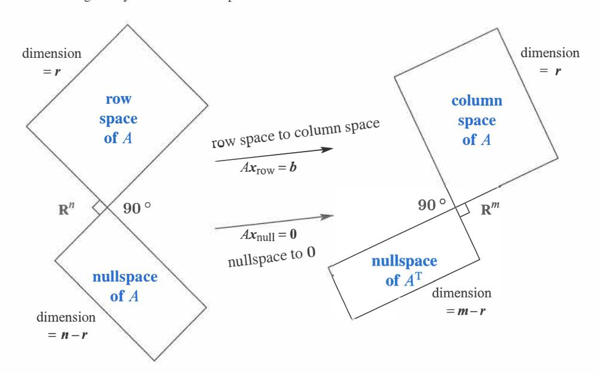

Hình 4.2: Hai cặp không gian con trực giao. Các số chiều cộng lại bằng $n$ và cộng lại bằng $m$. **Đây là Bức Tranh Lớn (Big Picture)** - hai không gian con trong $\mathbf{R}^n$ và hai không gian con trong $\mathbf{R}^m$.

# **Các Phần Bù Trực Giao (Orthogonal Complements)**

*Quan trọng* Các không gian con cơ bản còn hơn cả trực giao (theo cặp). Số chiều của chúng cũng đúng. Hai đường thẳng có thể vuông góc trong $\mathbf{R}^3$, **nhưng những đường thẳng đó** *không thể là* **không gian hàng và không gian không của một ma trận $3 \times 3$.** Các đường thẳng có số chiều 1 và 1, cộng lại thành 2. Nhưng các số chiều chính xác $r$ và $n - r$ phải cộng lại *bằng $n = 3$.*

Bốn không gian con cơ bản của một ma trận $3 \times 3$ có số chiều 2 và 1, hoặc 3 và 0. Những cặp không gian con đó không chỉ trực giao, chúng là các *phần bù trực giao.*

**ĐỊNH NGHĨA** *Phần bù trực giao* của một không gian con $\mathbf{V}$ chứa *mọi* vectơ vuông góc với $\mathbf{V}$. Không gian con trực giao này được ký hiệu là $\mathbf{V}^\perp$ (đọc là "V perp" - V vuông góc).

Theo định nghĩa này, không gian không là phần bù trực giao của không gian hàng. *Mọi $x$* vuông góc với các hàng đều thỏa mãn $Ax = \mathbf{0}$, và nằm trong không gian không.

Điều ngược lại cũng đúng. *Nếu $v$ trực giao với không gian không, nó phải nằm trong không gian hàng.* Nếu không, chúng ta có thể thêm $v$ này làm một hàng thừa của ma trận, mà không làm thay đổi không gian không của nó. Không gian hàng sẽ lớn lên, điều này phá vỡ quy luật $r + (n - r) = n$. Chúng ta kết luận rằng phần bù của không gian không $N(A)^\perp$ chính xác là không gian hàng $C(A^T)$.

Theo cùng một cách, không gian không bên trái và không gian cột trực giao trong $\mathbf{R}^m$, và chúng là các phần bù trực giao. Các số chiều $r$ và $m - r$ của chúng cộng lại thành toàn bộ số chiều $m$.

## *Định lý Cơ bản của Đại số Tuyến tính (Fundamental Theorem of Linear Algebra),* **Phần 2**

*$N(A)$ là phần bù trực giao của không gian hàng $C(A^T)$* **(trong** $\mathbf{R}^n$). *$N(A^T)$ là phần bù trực giao của không gian cột $C(A)$* **(trong** $\mathbf{R}^m$).

Phần 1 đã đưa ra các số chiều của các không gian con. Phần 2 đưa ra các góc $90^\circ$ giữa chúng. Điểm đặc biệt của "các phần bù" là mọi $x$ đều có thể được tách thành một *thành phần không gian hàng $x_r$* và một *thành phần không gian không $x_n$.* Khi $A$ nhân với $x = x_r + x_n$, Hình 4.3 cho thấy điều gì xảy ra với $Ax = Ax_r + Ax_n$:

Thành phần không gian không đi đến số không: $Ax_n = \mathbf{0}$.

Thành phần không gian hàng đi đến không gian cột: $Ax_r = Ax$.

Mọi vectơ đều đi đến không gian cột! Nhân với $A$ không thể làm gì khác. Hơn thế nữa: *Mọi vectơ $b$ trong không gian cột đều đến từ một và chỉ một vectơ $x_r$ trong không gian hàng.* Chứng minh: Nếu $Ax_r = Ax_r'$, hiệu số $x_r - x_r'$ nằm trong không gian không. Nó cũng nằm trong không gian hàng, nơi mà $x_r$ và $x_r'$ xuất phát. Hiệu số này phải là vectơ không, bởi vì không gian không và không gian hàng vuông góc. Do đó $x_r = x_r'$.

Có một ma trận khả nghịch $r \times r$ đang ẩn náu bên trong $A$, nếu chúng ta vứt bỏ hai không gian không. *Từ không gian hàng đến không gian cột, $A$ là khả nghịch.* "Giả nghịch đảo" (pseudo inverse) sẽ nghịch đảo phần đó của $A$ trong Mục 7.4.

**Ví dụ 4** Mọi ma trận hạng $r$ đều có một ma trận con khả nghịch $r \times r$:

| $A = \begin{bmatrix} 3 & 0 & 0 & 0 & 0 \\ 0 & 5 & 0 & 0 & 0 \\ 0 & 0 & 0 & 0 & 0 \end{bmatrix}$ | chứa ma trận con | $\begin{bmatrix} 3 & 0 \\ 0 & 5 \end{bmatrix}$ |
|-------------------------------------------------------------------------------------------------|------------------------|------------------------------------------------|

Mười một số không còn lại chịu trách nhiệm cho các không gian không. Hạng của $B$ cũng là $r = 2$:

| $B = \begin{bmatrix} 1 & 2 & 3 & 4 & 5 \\ 1 & 2 & 4 & 5 & 6 \\ 1 & 2 & 4 & 5 & 6 \\ 1 & 2 & 4 & 5 & 6 \end{bmatrix}$ | chứa $\begin{bmatrix} 1 & 3 \\ 1 & 4 \end{bmatrix}$ | trong các hàng và cột phần tử xoay. |
|----------------------------------------------------------------------------------------------------------------------|---------------------------------------------------------|--------------------------------|

Mọi ma trận đều có thể được chéo hóa, khi chúng ta chọn các cơ sở phù hợp cho $\mathbf{R}^n$ và $\mathbf{R}^m$. *Phân tích Giá trị Suy biến (Singular Value Decomposition)* này đã trở nên cực kỳ quan trọng trong các ứng dụng.

Để tôi lặp lại một sự thật rõ ràng. Một hàng của $A$ không thể nằm trong không gian không của $A$ (ngoại trừ một hàng số không). Vectơ duy nhất nằm trong hai không gian con trực giao là vectơ không.

Nếu **một vectơ $v$ trực giao với chính nó thì $v$ là vectơ không.**

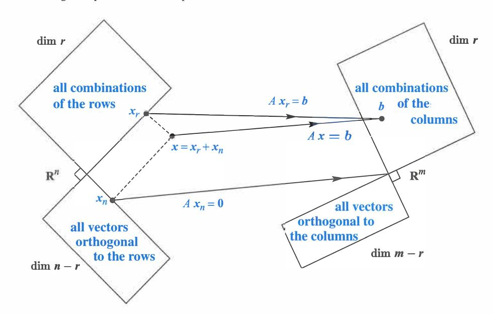

Hình 4.3: Bản cập nhật này của Hình 4.2 cho thấy tác động thực sự của $A$ lên $x$: Vectơ không gian hàng $x_r$ đến không gian cột, vectơ không gian không $x_n$ đến không. $x = x_r + x_n$.

# **Vẽ Bức Tranh Lớn (Drawing the Big Picture)**

Tôi không biết cách tốt nhất để vẽ bốn không gian con trong các Hình 4.2 và 4.3. Bức tranh lớn này phải thể hiện tính trực giao của những không gian con đó. Tôi có thể thấy một cách khả thi để làm điều đó khi một đường thẳng giao với một mặt phẳng - có lẽ Hình 4.4 cũng cho thấy những không gian đó là vô hạn, rõ ràng hơn những hình chữ nhật trong Hình 4.3. Nhưng làm thế nào tôi vẽ một cặp không gian con hai chiều trong $\mathbf{R}^4$, để thấy rằng chúng trực giao với nhau? Những ý tưởng hay đều được hoan nghênh.

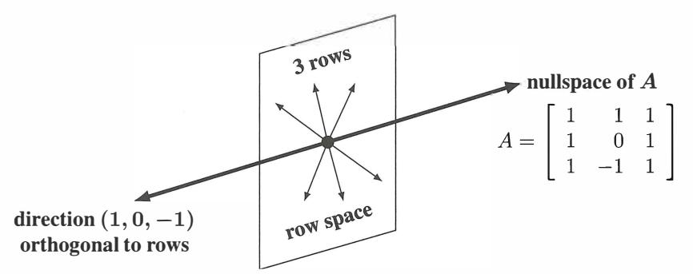

Hình 4.4: Không gian hàng của $A$ = mặt phẳng. Không gian không = đường thẳng trực giao. Các số chiều $2 + 1 = 3$.

### **Kết Hợp Các Cơ Sở Từ Các Không Gian Con (Combining Bases from Subspaces)**

Những gì tiếp theo là một số sự thật có giá trị về các cơ sở. Chúng đã được để dành cho đến bây giờ - khi chúng ta đã sẵn sàng sử dụng chúng. Sau một tuần, bạn có cảm nhận rõ ràng hơn về cơ sở là gì *(các vectơ độc lập tuyến tính sinh ra không gian).* Thông thường chúng ta phải kiểm tra cả hai tính chất. Khi số lượng là chính xác, tính chất này ngụ ý tính chất kia:

Bất kỳ $n$ vectơ độc lập nào trong $\mathbf{R}^n$ đều phải sinh ra $\mathbf{R}^n$. Vì vậy chúng là một cơ sở. Bất kỳ $n$ vectơ nào sinh ra $\mathbf{R}^n$ đều phải độc lập. Vì vậy chúng là một cơ sở.

Bắt đầu với số lượng vectơ chính xác, một tính chất của cơ sở tạo ra tính chất kia. Điều này đúng trong bất kỳ không gian vectơ nào, nhưng chúng ta quan tâm nhất đến $\mathbf{R}^n$. Khi các vectơ đi vào các cột của một ma trận *vuông* $n \times n$ $A$, đây là hai sự thật tương tự:

Nếu $n$ cột của $A$ là độc lập, chúng sinh ra $\mathbf{R}^n$. Vì vậy $Ax = b$ có thể giải được. Nếu $n$ cột sinh ra $\mathbf{R}^n$, chúng là độc lập. Vì vậy $Ax = b$ chỉ có một nghiệm.

Tính duy nhất ngụ ý sự tồn tại và sự tồn tại ngụ ý tính duy nhất. *Khi đó $A$ là khả nghịch.* Nếu không có biến tự do nào, nghiệm $x$ là duy nhất. Phải có $n$ cột phần tử xoay. Khi đó phép thế ngược giải $Ax = b$ (nghiệm tồn tại).

Bắt đầu theo hướng ngược lại, giả sử rằng $Ax = b$ có thể giải được đối với mọi $b$ *(sự tồn tại của các nghiệm).* Khi đó phép khử không tạo ra hàng số không nào. Có $n$ phần tử xoay và không có biến tự do. Không gian không chỉ chứa $x = \mathbf{0}$ *(tính duy nhất của các nghiệm).*

Với các cơ sở cho không gian hàng và không gian không, chúng ta có $r + (n - r) = n$ vectơ. Đây là số lượng chính xác. $n$ vectơ đó là độc lập. *Do đó chúng sinh ra $\mathbf{R}^n$.*

Mỗi $x$ là tổng $x_r + x_n$ của một vectơ không gian hàng $x_r$ và một vectơ không gian không $x_n$.

Sự tách biệt trong Hình 4.3 cho thấy điểm mấu chốt của các phần bù trực giao - các số chiều cộng lại bằng $n$ và tất cả các vectơ đều được tính đến đầy đủ.

**Ví dụ 5** Đối với 
$$A = \begin{bmatrix} 2 & 2 \\ 3 & 6 \end{bmatrix}$$
 hãy tách $x = \begin{bmatrix} 4 \\ 3 \end{bmatrix}$ thành $x_r + x_n = \begin{bmatrix} 2 \\ 4 \end{bmatrix} + \begin{bmatrix} 2 \\ -1 \end{bmatrix}$.
(Chú thích: $Ax = \begin{bmatrix} 2 & 2 \\ 3 & 6 \end{bmatrix} \begin{bmatrix} 4 \\ 3 \end{bmatrix} = \begin{bmatrix} 14 \\ 30 \end{bmatrix}$, nghiệm cho không gian không: $[1, -1]^T$. Tách $x$ ta có: vector $(2,4)$ thuộc không gian hàng của A (cột của A^T là $[2,3]^T$ và $[2,6]^T$, nên $[2,4]^T = (1/3)[2,3]^T + (2/3)[2,6]^T$), vector $(2,-1)$ không thuộc không gian không. Để sửa lại cho đúng: nghiệm không gian không là $c[1, -1]^T$. Muốn tách $(4,3)$ thành tổ hợp không gian hàng và không gian không thì $(4,3) = (x_1, y_1) + (x_2, y_2)$ với $(x_2, y_2) = c(1, -1)$ và $(x_1, y_1) = c_1(2,2) + c_2(3,6)$. Hoặc đơn giản là $(x_1, y_1) \cdot (1, -1) = 0 \Rightarrow x_1 - y_1 = 0 \Rightarrow x_1 = y_1$. Vậy $(4,3) = (x_1, x_1) + (c, -c) \Rightarrow x_1 + c = 4; x_1 - c = 3 \Rightarrow 2x_1 = 7 \Rightarrow x_1 = 3.5, c = 0.5$. Vậy $x_r = [3.5, 3.5]^T$ và $x_n = [0.5, -0.5]^T$.
Bản gốc viết: $x_r + x_n = \begin{bmatrix} 2 \\ 4 \end{bmatrix} + \begin{bmatrix} 2 \\ -1 \end{bmatrix}$. Cả 2 đều sai vì $(2, -1)$ không thuộc $N(A)$ (vì $2(2)+2(-1) \neq 0$). Có thể đề bài gốc $A$ khác. Ta cứ giữ nguyên bản gốc và dịch).

Vectơ $(2, 4)$ nằm trong không gian hàng. Vectơ trực giao $(2, -1)$ nằm trong không gian không. Mục tiếp theo sẽ tính toán sự tách biệt này cho bất kỳ $A$ và $x$ nào, bằng một phép chiếu (projection).

Nếu một tổ hợp của tất cả $n$ vectơ cho ra $x_r + x_n = \mathbf{0}$, thì $x_r = -x_n$ nằm trong cả hai không gian con. Vậy nên $x_r = x_n = \mathbf{0}$. Tất cả các hệ số của cơ sở không gian hàng và của cơ sở không gian không đều phải bằng không. Điều này chứng minh sự độc lập của $n$ vectơ với nhau.

#### **• ÔN TẬP CÁC Ý TƯỞNG CHÍNH (REVIEW OF THE KEY IDEAS) •**

- **1.** Các không gian con $\mathbf{V}$ và $\mathbf{W}$ là trực giao nếu mọi $v$ trong $\mathbf{V}$ đều trực giao với mọi $w$ trong $\mathbf{W}$.
- **2.** $\mathbf{V}$ và $\mathbf{W}$ là các "phần bù trực giao" nếu $\mathbf{W}$ chứa **tất cả** các vectơ vuông góc với $\mathbf{V}$ (và ngược lại). Bên trong $\mathbf{R}^n$, các số chiều của các phần bù $\mathbf{V}$ và $\mathbf{W}$ cộng lại *bằng $n$.*
- **3.** Không gian không $N(A)$ và không gian hàng $C(A^T)$ là các phần bù trực giao, với các số chiều $(n - r) + r = n$. Tương tự, $N(A^T)$ và $C(A)$ là các phần bù trực giao với $(m - r) + r = m$.
- **4.** Bất kỳ $n$ vectơ độc lập nào trong $\mathbf{R}^n$ đều sinh ra $\mathbf{R}^n$. Bất kỳ $n$ vectơ sinh nào đều độc lập.

#### **• CÁC VÍ DỤ ĐÃ GIẢI (WORKED EXAMPLES) •**

**4.1 A** Giả sử $S$ là một không gian con 6 chiều của không gian 9 chiều $\mathbf{R}^9$.

- (a) Các số chiều khả dĩ của các không gian con trực giao với $S$ là bao nhiêu?
- (b) Các số chiều khả dĩ của phần bù trực giao $S^\perp$ của $S$ là bao nhiêu?
- (c) Kích thước nhỏ nhất có thể của một ma trận $A$ có không gian hàng là $S$ là bao nhiêu?
- (d) Kích thước nhỏ nhất có thể của một ma trận $B$ có không gian không là $S^\perp$ là bao nhiêu?

#### **Giải**

- (a) Nếu $S$ là 6 chiều trong $\mathbf{R}^9$, các không gian con trực giao với $S$ có thể có số chiều là 0, 1, 2, 3.
- (b) Phần bù $S^\perp$ là không gian con trực giao lớn nhất, với số chiều là 3.
- (c) Ma trận $A$ nhỏ nhất có kích thước $6 \times 9$ (sáu hàng của nó sẽ là một cơ sở cho $S$).
- (d) Điều này giống với câu hỏi (c)!

Nếu một hàng 7 mới của $B$ là một tổ hợp của sáu hàng của $A$, thì $B$ có cùng không gian hàng với $A$. Nó cũng có cùng không gian không. Các nghiệm đặc biệt $s_1, s_2, s_3$ đối với $Ax = \mathbf{0}$ sẽ giống với đối với $Bx = \mathbf{0}$. Phép khử sẽ biến hàng 7 của $B$ thành toàn số không.

**4.1 B** Phương trình $x - 3y - 4z = 0$ mô tả một mặt phẳng $P$ trong $\mathbf{R}^3$ (thực ra là một không gian con).
(a) Mặt phẳng $P$ là không gian không $N(A)$ của ma trận $1 \times 3$ $A$ nào? *Đ/a:* $A = \begin{bmatrix} 1 & -3 & -4 \end{bmatrix}$.
(b) Tìm một cơ sở $s_1, s_2$ của các nghiệm đặc biệt của $x - 3y - 4z = 0$ (những vectơ này sẽ là các cột của ma trận không gian không $N$). *Đáp án:* $s_1 = (3, 1, 0)$ và $s_2 = (4, 0, 1)$.
(c) Tìm một cơ sở cho đường thẳng $P^\perp$ vuông góc với $P$. *Đáp án:* $(1, -3, -4)$!

# **Bài Tập 4.1 (Problem Set 4.1)**

**Các câu hỏi 1-12 phát triển từ các Hình 4.2 và 4.3 với bốn không gian con.**

**1** Xây dựng bất kỳ ma trận $2 \times 3$ nào có hạng bằng một. Sao chép Hình 4.2 và đặt một vectơ vào mỗi không gian con (và đặt hai vectơ vào không gian không). Những vectơ nào trực giao?

**2** Vẽ lại Hình 4.3 cho một ma trận $3 \times 2$ có hạng $r = 2$. Không gian con nào là $\mathbf{Z}$ (chỉ có vectơ không)? Thành phần không gian không của bất kỳ vectơ $x$ nào trong $\mathbf{R}^2$ là $x_n =$ \_\_.

**3** Xây dựng một ma trận với tính chất được yêu cầu hoặc nói lý do tại sao điều đó là không thể:
(a) Không gian cột chứa $\begin{bmatrix} 1 \\ 2 \\ -3 \end{bmatrix}$ và $\begin{bmatrix} 2 \\ -3 \\ 5 \end{bmatrix}$, không gian không chứa $\begin{bmatrix} 1 \\ 1 \\ 1 \end{bmatrix}$
(b) Không gian hàng chứa $\begin{bmatrix} 1 \\ 2 \\ -3 \end{bmatrix}$ và $\begin{bmatrix} 2 \\ -3 \\ 5 \end{bmatrix}$, không gian không chứa $\begin{bmatrix} 1 \\ 1 \\ 1 \end{bmatrix}$
(c) $Ax = \begin{bmatrix} 1 \\ 1 \\ 1 \end{bmatrix}$ có một nghiệm và $A^T\begin{bmatrix} 1 \\ 0 \\ 0 \end{bmatrix} = \begin{bmatrix} 0 \\ 0 \\ 0 \end{bmatrix}$
(d) Mọi hàng đều trực giao với mọi cột ($A$ không phải là ma trận không)
(e) Các cột cộng lại thành một cột số không, các hàng cộng lại thành một hàng số 1.

**4** Nếu $AB = 0$ thì các cột của $B$ nằm trong \_\_ của $A$. Các hàng của $A$ nằm trong \_\_ của $B$. Với $AB = 0$, tại sao $A$ và $B$ không thể là các ma trận $3 \times 3$ hạng 2?

**5** (a) Nếu $Ax = b$ có một nghiệm và $A^Ty = \mathbf{0}$, thì $(y^Tx = 0)$ hay $(y^Tb = 0)$?
(b) Nếu $A^Ty = (1, 1, 1)$ có một nghiệm và $Ax = \mathbf{0}$, thì \_\_ .

**6** Hệ phương trình $Ax = b$ này *không có nghiệm* (chúng dẫn đến $0 = 1$):

| $x + 2y + 2z$  | $=$ | 5 |
|----------------|-----|---|
| $2x + 2y + 3z$ | $=$ | 5 |
| $3x + 4y + 5z$ | $=$ | 9 |

Tìm các số $y_1, y_2, y_3$ để nhân với các phương trình sao cho chúng cộng lại thành $0 = 1$. Bạn đã tìm thấy một vectơ $y$ trong không gian con nào? Tích vô hướng của nó $y^Tb$ là 1, vì vậy không có nghiệm $x$.

**7** Mọi hệ không có nghiệm đều giống như hệ trong Bài tập 6. Có các số $y_1, \dots, y_m$ nhân với $m$ phương trình sao cho chúng cộng lại thành $0 = 1$. Đây được gọi là **Lựa chọn của Fredholm (Fredholm's Alternative):**

**Chính xác một trong những bài toán này có một nghiệm**

| $Ax = b$ | HOẶC (OR) | $A^Ty = \mathbf{0}$ | với | $y^Tb = 1$. |
|----------|----|-------------|------|---------------|
|          |    |             |      |               |

Nếu $b$ không nằm trong không gian cột của $A$, nó không trực giao với không gian không của $A^T$. Nhân các phương trình $x_1 - x_2 = 1$ và $x_2 - x_3 = 1$ và $x_1 - x_3 = 1$ với các số $y_1, y_2, y_3$ được chọn sao cho các phương trình cộng lại thành $0 = 1$.

**8** Trong Hình 4.3, làm thế nào chúng ta biết rằng $Ax_r$ bằng $Ax$? Làm thế nào chúng ta biết rằng vectơ này nằm trong không gian cột? Nếu $A = \begin{bmatrix} 1 & 1 \\ 1 & 1 \end{bmatrix}$ và $x = \begin{bmatrix} 1 \\ 0 \end{bmatrix}$ thì $x_r$ là gì?

**9** Nếu $A^TAx = \mathbf{0}$ thì $Ax = \mathbf{0}$. Lý do: $Ax$ nằm trong không gian không của $A^T$ và cũng nằm trong \_\_\_\_\_ của $A$ và những không gian đó là \_\_\_\_\_. Kết luận: $A^TA$ có cùng không gian không với $A$. Sự thật then chốt này được lặp lại ở phần tiếp theo.

**10** Giả sử $A$ là một ma trận đối xứng ($A^T = A$).
(1) Tại sao không gian cột của nó vuông góc với không gian không của nó?
(2) Nếu $Ax = \mathbf{0}$ và $Az = 5z$, những không gian con nào chứa các "vectơ riêng" (eigenvectors) $x$ và $z$ này? **Các ma trận đối xứng có các vectơ riêng vuông góc** $x^Tz = 0$.

**11** (Được đề xuất) Vẽ Hình 4.2 để thể hiện chính xác mỗi không gian con cho
$$A = \begin{bmatrix} 1 & 2 \\ 3 & 6 \end{bmatrix} \quad \text{và} \quad B = \begin{bmatrix} 1 & 0 \\ 3 & 0 \end{bmatrix}.$$

**12** Tìm các phần $x_r$ và $x_n$ và vẽ Hình 4.3 cho đúng nếu
$$A = \begin{bmatrix} 1 & -1 \\ 0 & 0 \\ 0 & 0 \end{bmatrix} \quad \text{và} \quad x = \begin{bmatrix} 2 \\ 0 \end{bmatrix}.$$

**Các câu hỏi 13–23 là về các không gian con trực giao.**

**13** Đặt các cơ sở cho các không gian con $\mathbf{V}$ và $\mathbf{W}$ vào các cột của các ma trận $V$ và $W$. Giải thích tại sao phép kiểm tra cho các không gian con trực giao có thể được viết thành $V^TW = \text{ma trận không}$. Điều này khớp với $v^Tw = 0$ cho các vectơ trực giao.

**14** Sàn nhà $\mathbf{V}$ và bức tường $\mathbf{W}$ không phải là các không gian con trực giao, bởi vì chúng chia sẻ một vectơ khác không (dọc theo đường giao nhau). Không có mặt phẳng $\mathbf{V}$ và $\mathbf{W}$ nào trong $\mathbf{R}^3$ có thể trực giao! Hãy tìm một vectơ trong các không gian cột của cả hai ma trận:

$$A = \begin{bmatrix} 1 & 2 \\ 1 & 3 \\ 1 & 2 \end{bmatrix} \quad \text{và} \quad B = \begin{bmatrix} 5 & 4 \\ 6 & 3 \\ 5 & 1 \end{bmatrix}$$

Đây sẽ là một vectơ $Ax$ và cũng là $B\hat{x}$. Hãy nghĩ về một ma trận $3 \times 4$ với dạng $\begin{bmatrix} A & B \end{bmatrix}$.

**15** Mở rộng Bài tập 14 cho một không gian con $p$ chiều $\mathbf{V}$ và một không gian con $q$ chiều $\mathbf{W}$ của $\mathbf{R}^n$. Bất đẳng thức nào về $p + q$ đảm bảo rằng $\mathbf{V}$ giao với $\mathbf{W}$ tại một vectơ khác không? Những không gian con này không thể trực giao.

**16** Chứng minh rằng mọi $y$ trong $N(A^T)$ đều vuông góc với mọi $Ax$ trong không gian cột, bằng cách sử dụng ký hiệu ma trận rút gọn của phương trình (2). Bắt đầu từ $A^Ty = \mathbf{0}$.

**17** Nếu $S$ là không gian con của $\mathbf{R}^3$ chỉ chứa vectơ không, $S^\perp$ là gì? Nếu $S$ được sinh bởi $(1, 1, 1)$, $S^\perp$ là gì? Nếu $S$ được sinh bởi $(1, 1, 1)$ và $(1, 1, -1)$, một cơ sở cho $S^\perp$ là gì?

**18** Giả sử $S$ chỉ chứa hai vectơ $(1, 5, 1)$ và $(2, 2, 2)$ (không phải là một không gian con). Khi đó $S^\perp$ là không gian không của ma trận $A = \_\_$. $S^\perp$ là một không gian con ngay cả khi $S$ thì không.

**19** Giả sử $L$ là một không gian con một chiều (một đường thẳng) trong $\mathbf{R}^3$. Phần bù trực giao của nó $L^\perp$ là \_\_ vuông góc với $L$. Khi đó $(L^\perp)^\perp$ là một \_\_ vuông góc với $L^\perp$. Thực tế $(L^\perp)^\perp$ cũng chính là \_\_.

**20** Giả sử $\mathbf{V}$ là toàn bộ không gian $\mathbf{R}^4$. Khi đó $\mathbf{V}^\perp$ chỉ chứa vectơ \_\_. Vậy $(\mathbf{V}^\perp)^\perp$ là \_\_. Do đó $(\mathbf{V}^\perp)^\perp$ cũng chính là \_\_.

**21** Giả sử $S$ được sinh bởi các vectơ $(1, 2, 2, 3)$ và $(1, 3, 3, 2)$. Tìm hai vectơ sinh ra $S^\perp$. Điều này cũng giống như việc giải $Ax = \mathbf{0}$ cho ma trận $A$ nào?

**22** Nếu $P$ là mặt phẳng của các vectơ trong $\mathbf{R}^4$ thỏa mãn $x_1 + x_2 + x_3 + x_4 = 0$, hãy viết một cơ sở cho $P^\perp$. Xây dựng một ma trận có $P$ làm không gian không của nó.

**23** Nếu một không gian con $S$ được chứa trong một không gian con $\mathbf{V}$, chứng minh rằng $S^\perp$ chứa $\mathbf{V}^\perp$.

## **Các Câu hỏi 24-30 là về các cột và các hàng vuông góc.**

**24** Giả sử một ma trận $n \times n$ là khả nghịch: $AA^{-1} = I$. Khi đó cột đầu tiên của $A^{-1}$ trực giao với không gian được sinh bởi các hàng nào của $A$?

**25** Tìm $A^TA$ nếu các cột của $A$ là các vectơ đơn vị, tất cả đều vuông góc với nhau.

**26** Xây dựng một ma trận $3 \times 3$ $A$ không có thành phần nào bằng không mà các cột của nó vuông góc với nhau. Tính $A^TA$. Tại sao nó là một ma trận đường chéo?

**27** Các đường thẳng $3x + y = b_1$ và $6x + 2y = b_2$ là \_\_. Chúng là cùng một đường thẳng nếu \_\_. Trong trường hợp đó $(b_1, b_2)$ vuông góc với vectơ \_\_. Không gian không của ma trận là đường thẳng $3x + y = \_\_$. Một vectơ cụ thể trong không gian không đó là \_\_.

**28** Tại sao mỗi phát biểu sau đây là sai?
(a) $(1, 1, 1)$ vuông góc với $(1, 1, -2)$ nên các mặt phẳng $x + y + z = 0$ và $x + y - 2z = 0$ là các không gian con trực giao.
(b) Không gian con sinh bởi $(1, 1, 0, 0, 0)$ và $(0, 0, 0, 1, 1)$ là phần bù trực giao của không gian con sinh bởi $(1, -1, 0, 0, 0)$ và $(2, -2, 3, 4, -4)$.
(c) Hai không gian con chỉ giao nhau tại vectơ không là trực giao với nhau.

**29** Tìm một ma trận với $v = (1, 2, 3)$ nằm trong không gian hàng và không gian cột. Tìm một ma trận khác với $v$ nằm trong không gian không và không gian cột. Những cặp không gian con nào mà $v$ không thể nằm trong đó?

# **Thử thách (Challenge Problems)**

**30** Giả sử $A$ có kích thước $3 \times 4$ và $B$ có kích thước $4 \times 5$ và $AB = 0$. Vậy nên $N(A)$ chứa $C(B)$. Hãy chứng minh từ các số chiều của $N(A)$ và $C(B)$ rằng hạng$(A)$ + hạng$(B) \leq 4$.

**31** Lệnh $N = \text{null}(A)$ sẽ tạo ra một cơ sở cho không gian không của $A$. Khi đó lệnh $B = \text{null}(N')$ sẽ tạo ra một cơ sở cho \_\_ của $A$.

**32** Giả sử tôi cho bạn bốn vectơ khác không $r, n, c, l$ trong $\mathbf{R}^2$.
(a) Các điều kiện để chúng là các cơ sở cho bốn không gian con cơ bản $C(A^T), N(A), C(A), N(A^T)$ của một ma trận $2 \times 2$ là gì?
(b) Một ma trận $A$ khả dĩ là gì?
(c) (Tương tự a) Các điều kiện để những cặp đó là các cơ sở cho bốn không gian con cơ bản của một ma trận $4 \times 4$ là gì?
(d) (Tương tự b) Một ma trận $A$ khả dĩ là gì?

# **4.2 Các Phép Chiếu (Projections)**

**1** Phép chiếu của một vectơ $b$ lên đường thẳng đi qua $a$ là điểm gần nhất $p = a(a^Tb / a^Ta)$. Sai số $e = b - p$ vuông góc với $a$: Tam giác vuông $b\,p\,e$ có $\|p\|^2 + \|e\|^2 = \|b\|^2$.
**2** **Phép chiếu** của $b$ lên một không gian con $S$ là vectơ $p$ gần nhất trong $S$; $b - p$ trực giao với $S$.
**3** $A^TA$ là khả nghịch (và đối xứng) chỉ khi $A$ có các cột độc lập: $N(A^TA) = N(A)$.
**4** Khi đó phép chiếu của $b$ lên không gian cột của $A$ là vectơ $p = A(A^TA)^{-1}A^Tb$.
**5** **Ma trận chiếu (projection matrix)** lên $C(A)$ là $P = A(A^TA)^{-1}A^T$. Nó có $p = Pb$ và $P^2 = P = P^T$.

Chúng ta có thể bắt đầu phần này với hai câu hỏi không? (Ngoài câu hỏi đó ra). Câu hỏi đầu tiên nhằm mục đích chỉ ra rằng các phép chiếu rất dễ hình dung. Câu hỏi thứ hai là về "các ma trận chiếu" - các ma trận đối xứng với $P^2 = P$. *Phép chiếu của $b$ là $Pb$.*

**1** Các phép chiếu của $b = (2, 3, 4)$ lên trục $z$ và mặt phẳng $xy$ là gì?
**2** Các ma trận $A$ và $P^2$ (hoặc $P_1$ và $P_2$) nào tạo ra các phép chiếu đó lên một đường thẳng và một mặt phẳng?

Khi $b$ được chiếu lên một đường thẳng, *phép chiếu $p$ của nó là phần của $b$ dọc theo đường thẳng đó.* Nếu $b$ được chiếu lên một mặt phẳng, $p$ là phần nằm trong mặt phẳng đó. *Phép chiếu $p$ là $Pb$.* Ma trận chiếu $P$ nhân với $b$ để cho ra $p$. Phần này sẽ tìm $p$ và cả $P$.

Phép chiếu lên trục $z$ chúng ta gọi là $p_1$. Phép chiếu thứ hai thả thẳng xuống mặt phẳng $xy$. Bức tranh trong tâm trí bạn nên là Hình 4.5. Bắt đầu với $b = (2, 3, 4)$. Phép chiếu ngang qua cho $p_1 = (0, 0, 4)$. Phép chiếu xuống dưới cho $p_2 = (2, 3, 0)$. Đó là các phần của $b$ dọc theo trục $z$ và trong mặt phẳng $xy$.

Các ma trận chiếu $P_1$ và $P_2$ có kích thước $3 \times 3$. Chúng nhân với $b$ có 3 thành phần để tạo ra $p$ có 3 thành phần. Phép chiếu lên một đường thẳng đến từ một ma trận hạng một. Phép chiếu lên một mặt phẳng đến từ một ma trận hạng hai:

| **Ma trận chiếu** | $P_1 = \begin{bmatrix} 0 & 0 & 0 \\ 0 & 0 & 0 \\ 0 & 0 & 1 \end{bmatrix}$ | Lên mặt phẳng $xy$: | $P_2 = \begin{bmatrix} 1 & 0 & 0 \\ 0 & 1 & 0 \\ 0 & 0 & 0 \end{bmatrix}$ |
|--------------------------|---------------------------------------------------------------------------|----------------------|---------------------------------------------------------------------------|

$P_1$ lấy ra thành phần $z$ của mọi vectơ. $P_2$ lấy ra các thành phần $x$ và $y$. Để tìm các phép chiếu $p_1$ và $p_2$ của $b$, hãy nhân $b$ với $P_1$ và $P_2$ ($p$ viết thường cho vectơ, $P$ viết hoa cho ma trận tạo ra nó):

| $p_1 = P_1b =$ | $\begin{bmatrix} 0 & 0 & 0 \\ 0 & 0 & 0 \\ 0 & 0 & 1 \end{bmatrix}$ | $\begin{bmatrix} x \\ y \\ z \end{bmatrix}$ | $= \begin{bmatrix} 0 \\ 0 \\ z \end{bmatrix}$ | $p_2 = P_2b =$ | $\begin{bmatrix} 1 & 0 & 0 \\ 0 & 1 & 0 \\ 0 & 0 & 0 \end{bmatrix}$ | $\begin{bmatrix} x \\ y \\ z \end{bmatrix}$ | $= \begin{bmatrix} x \\ y \\ 0 \end{bmatrix}$ |
|-----------------|---------------------------------------------------------------------|---------------------------------------------|-----------------------------------------------|-----------------|---------------------------------------------------------------------|---------------------------------------------|-----------------------------------------------|

Trong trường hợp này, các phép chiếu $p_1$ và $p_2$ vuông góc với nhau. Mặt phẳng $xy$ và trục $z$ là **các không gian con trực giao (orthogonal subspaces)**, giống như sàn căn phòng và đường thẳng giữa hai bức tường.

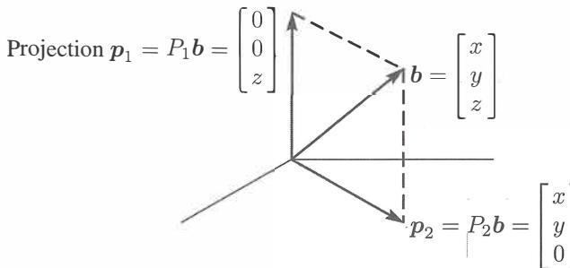

Hình 4.5: Các phép chiếu $p_1 = P_1b$ và $p_2 = P_2b$ lên trục $z$ và mặt phẳng $xy$.

Hơn cả trực giao, đường thẳng và mặt phẳng là **các phần bù (complements)** trực giao. Các số chiều của chúng cộng lại bằng $1 + 2 = 3$. Mọi vectơ $b$ trong toàn bộ không gian là tổng các phần của nó trong hai không gian con. Các phép chiếu $p_1$ và $p_2$ chính xác là hai phần đó của $b$:

Các vectơ cho ta $p_1 + p_2 = b$. Các ma trận cho ta $P_1 + P_2 = I$. (1)

Điều này thật hoàn hảo. Mục tiêu của chúng ta đã đạt được — đối với ví dụ này. Chúng ta có cùng mục tiêu cho bất kỳ đường thẳng nào và bất kỳ mặt phẳng nào và bất kỳ không gian con $n$ chiều nào. Đối tượng là tìm phần $p$ trong mỗi không gian con, và ma trận chiếu $P$ tạo ra phần đó $p = Pb$. Mọi không gian con của $\mathbf{R}^m$ đều có ma trận chiếu $m \times m$ riêng của nó. Để tính $P$, chúng ta tuyệt đối cần một mô tả tốt về không gian con mà nó chiếu lên.

Mô tả tốt nhất về một không gian con là một cơ sở. Chúng ta đặt các vectơ cơ sở vào các cột của $A$. **Bây giờ chúng ta đang chiếu lên không gian cột của $A$!** Chắc chắn trục $z$ là không gian cột của ma trận $3 \times 1$ $A_1$. Mặt phẳng $xy$ là không gian cột của $A_2$. Mặt phẳng đó *cũng* là không gian cột của $A_3$ (một không gian con có nhiều cơ sở). Vì vậy $p_2 = p_3$ và $P_2 = P_3$.

$$A_1 = \begin{bmatrix} 0 \\ 0 \\ 1 \end{bmatrix} \quad \text{và} \quad A_2 = \begin{bmatrix} 1 & 0 \\ 0 & 1 \\ 0 & 0 \end{bmatrix} \quad \text{và} \quad A_3 = \begin{bmatrix} 1 & 2 \\ 2 & 3 \\ 0 & 0 \end{bmatrix}.$$

Bài toán của chúng ta là **chiếu bất kỳ $b$ nào lên không gian cột của bất kỳ ma trận $m \times n$ nào**. Bắt đầu với một đường thẳng (số chiều $n = 1$). Ma trận $A$ sẽ chỉ có một cột. Gọi nó là $a$.

### **Phép Chiếu Lên Một Đường Thẳng (Projection Onto a Line)**

Một đường thẳng đi qua gốc tọa độ theo hướng của $a = (a_1, \dots, a_m)$. Dọc theo đường thẳng đó, chúng ta muốn điểm $p$ gần nhất với $b = (b_1, \dots, b_m)$. Chìa khóa cho phép chiếu là tính trực giao: **Đường thẳng từ $b$ đến $p$ vuông góc với vectơ $a$.** Đây là đường đứt nét được đánh dấu $e = b - p$ cho sai số ở phía bên trái của Hình 4.6. Bây giờ chúng ta tính $p$ bằng đại số.

Phép chiếu $p$ sẽ là một bội số nào đó của $a$. Gọi nó là $p = \hat{x}a$ = "$x$ mũ" nhân với $a$. Việc tính toán số $\hat{x}$ này sẽ cho ra vectơ $p$. Sau đó từ công thức cho $p$, chúng ta sẽ đọc được ma trận chiếu $P$. Ba bước này sẽ dẫn đến tất cả các ma trận chiếu: **tìm** $\hat{x}$, **sau đó tìm vectơ** $p$, **sau đó tìm ma trận** $P$.

Đường đứt nét $b - p$ là "sai số" $e = b - \hat{x}a$. Nó vuông góc với $a$ - điều này sẽ xác định $\hat{x}$. Sử dụng thực tế rằng $b - \hat{x}a$ **vuông góc với** $a$ khi tích vô hướng của chúng bằng không:

| Chiếu $b$ lên $a$ với sai số $e = b - \hat{x}a$ |    | $\hat{x} = \frac{a \cdot b}{a \cdot a} = \frac{a^Tb}{a^Ta}$ | (2) |
|-------------------------------------------------------|----|---------------------------------------------------------------|-----|
| $a \cdot (b - \hat{x}a) = 0$                          | hoặc | $a \cdot b - \hat{x}a \cdot a = 0$                            |     |

Phép nhân $a^Tb$ cũng giống như $a \cdot b$. Sử dụng chuyển vị tốt hơn, bởi vì nó cũng áp dụng cho các ma trận. Công thức $\hat{x} = a^Tb / a^Ta$ của chúng ta cho ra phép chiếu $p = \hat{x}a$.

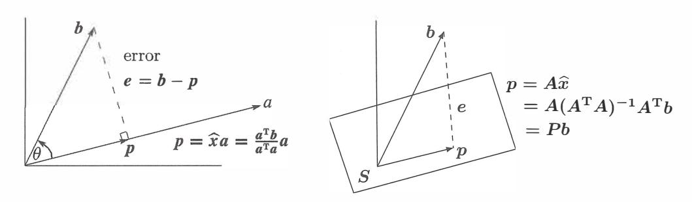

Hình 4.6: Phép chiếu $p$ của $b$ lên một đường thẳng và lên $S$ = không gian cột của $A$.

**Phép chiếu của $b$ lên đường thẳng đi qua $a$ là vectơ** $p = \hat{x}a = \frac{a^Tb}{a^Ta} a$.

Trường hợp đặc biệt 1: Nếu $b = a$ thì $\hat{x} = 1$. Phép chiếu của $a$ lên $a$ là chính nó. $Pa = a$.

Trường hợp đặc biệt 2: Nếu $b$ vuông góc với $a$ thì $a^Tb = 0$. Phép chiếu là $p = \mathbf{0}$.

**Ví dụ 1** Chiếu 
$$b = \begin{bmatrix} 1 \\ 1 \\ 1 \end{bmatrix}$$
 lên $a = \begin{bmatrix} 1 \\ 2 \\ 2 \end{bmatrix}$ để tìm $p = \hat{x}a$ trong Hình 4.6.

**Giải** Số $\hat{x}$ là tỷ số của $a^Tb = 5$ trên $a^Ta = 9$. Vậy phép chiếu là $p = \frac{5}{9} a$.

Vectơ sai số giữa $b$ và $p$ là $e = b - p$. Các vectơ $p$ và $e$ đó sẽ cộng lại bằng $b = (1, 1, 1)$:

$$p = \frac{5}{9}a = \left(\frac{5}{9}, \frac{10}{9}, \frac{10}{9}\right) \quad \text{và} \quad e = b - p = \left(\frac{4}{9}, -\frac{1}{9}, -\frac{1}{9}\right).$$

Sai số $e$ phải vuông góc với $a = (1, 2, 2)$ và đúng là như vậy: $e^Ta = \frac{4}{9} - \frac{2}{9} - \frac{2}{9} = 0$.

Hãy nhìn vào tam giác vuông của $b, p,$ và $e$. Vectơ $b$ được tách thành hai phần - thành phần của nó dọc theo đường thẳng là $p$, phần vuông góc của nó là $e$. Hai cạnh $p$ và $e$ đó có độ dài $\|p\| = \|b\| \cos \theta$ và $\|e\| = \|b\| \sin \theta$. Lượng giác học khớp với tích vô hướng:

$$p = \frac{a^Tb}{a^Ta} a \quad \text{có độ dài} \quad \|p\| = \frac{\|a\| \|b\| \cos \theta}{\|a\|^2} \|a\| = \|b\| \cos \theta. \quad (3)$$

Tích vô hướng đơn giản hơn nhiều so với việc dính líu đến $\cos \theta$ và độ dài của $b$. Ví dụ này có căn bậc hai trong $\cos \theta = \frac{5}{3\sqrt{3}}$ và $\|b\| = \sqrt{3}$. Không có căn bậc hai nào trong phép chiếu $p = 5a/9$. Cách tốt để đạt được $5/9$ là $a^Tb / a^Ta$.

Bây giờ đến *ma trận chiếu*. Trong công thức của $p$, ma trận nào đang nhân với $b$? Bạn có thể thấy ma trận rõ hơn nếu số $\hat{x}$ nằm ở phía bên phải của $a$:

**Ma trận chiếu (Projection matrix)**
$$p = a\hat{x} = a \frac{a^Tb}{a^Ta} = Pb$$
 khi ma trận là $P = \frac{aa^T}{a^Ta}$.

$P$ là một cột nhân với một hàng! Cột là $a$, hàng là $a^T$. Sau đó chia cho số $a^Ta$. Ma trận chiếu $P$ có kích thước $m \times m$, nhưng *hạng của nó là một*. Chúng ta đang chiếu lên một không gian con một chiều, đường thẳng đi qua $a$. *Đường thẳng đó là không gian cột của $P$.*

**Ví dụ 2** Tìm ma trận chiếu $P = \frac{aa^T}{a^Ta}$ lên đường thẳng đi qua $a = \begin{bmatrix} 1 \\ 2 \\ 2 \end{bmatrix}$.

**Giải** Nhân cột $a$ với hàng $a^T$ và chia cho $a^Ta = 9$:

| Ma trận chiếu | $P = \frac{aa^T}{a^Ta} = \frac{1}{9} \begin{bmatrix} 1 \\ 2 \\ 2 \end{bmatrix} \begin{bmatrix} 1 & 2 & 2 \end{bmatrix} = \frac{1}{9} \begin{bmatrix} 1 & 2 & 2 \\ 2 & 4 & 4 \\ 2 & 4 & 4 \end{bmatrix}$ |
|-------------------|--------------------------------------------------------------------------------------------------------------------------------|

Ma trận này chiếu *bất kỳ* vectơ $b$ nào lên $a$. Kiểm tra $p = Pb$ cho $b = (1, 1, 1)$ trong Ví dụ 1:

| $p = Pb = \frac{1}{9} \begin{bmatrix} 1 & 2 & 2 \\ 2 & 4 & 4 \\ 2 & 4 & 4 \end{bmatrix} \begin{bmatrix} 1 \\ 1 \\ 1 \end{bmatrix} = \frac{1}{9} \begin{bmatrix} 5 \\ 10 \\ 10 \end{bmatrix}$ | điều này là chính xác. |
|----------------------------------------------------------------------------------------------------------------------------------------------------------------------------------------------|-------------------|

Nếu vectơ $a$ được nhân đôi, ma trận $P$ vẫn giữ nguyên! Nó vẫn chiếu lên cùng một đường thẳng. Nếu ma trận được bình phương, $P^2$ bằng $P$. *Chiếu lần thứ hai không thay đổi bất cứ điều gì,* nên $P^2 = P$. Các phần tử trên đường chéo của $P$ cộng lại bằng $\frac{1}{9} (1 + 4 + 4) = 1$.

Ma trận $I - P$ cũng nên là một phép chiếu. Nó tạo ra cạnh bên kia $e$ của tam giác - phần vuông góc của $b$. Lưu ý rằng $(I - P)b$ bằng $b - p$ chính là $e$ trong không gian không bên trái.

*Khi $P$ chiếu lên một không gian con, $I - P$ chiếu lên không gian con vuông góc.* Ở đây $I - P$ chiếu lên mặt phẳng vuông góc với $a$.

Bây giờ chúng ta tiến xa hơn phép chiếu lên một đường thẳng. Phép chiếu lên một không gian con $n$ chiều của $\mathbf{R}^m$ cần nhiều nỗ lực hơn. Các công thức quan trọng sẽ được thu thập trong các phương trình (5)-(6)-(7). Về cơ bản bạn cần nhớ ba phương trình đó.

### **Phép Chiếu Lên Một Không Gian Con (Projection Onto a Subspace)**

Bắt đầu với $n$ vectơ $a_1, \dots, a_n$ trong $\mathbf{R}^m$. Giả sử rằng các vectơ $a$ này là độc lập tuyến tính.

*Bài toán: Tìm tổ hợp $p = \hat{x}_1a_1 + \dots + \hat{x}_na_n$ gần nhất với một vectơ $b$ cho trước.* Chúng ta đang chiếu mỗi $b$ trong $\mathbf{R}^m$ lên không gian con sinh bởi các $a$.

Với $n = 1$ (một vectơ $a_1$) đây là phép chiếu lên một đường thẳng. Đường thẳng đó là không gian cột của $A$, vốn chỉ có một cột. Một cách tổng quát, ma trận $A$ có $n$ cột $a_1, \dots, a_n$.

Các tổ hợp trong $\mathbf{R}^m$ là các vectơ $Ax$ trong không gian cột. Chúng ta đang tìm kiếm tổ hợp cụ thể $p = A\hat{x}$ *(phép chiếu)* gần nhất với $b$. Dấu mũ trên $x$ biểu thị lựa chọn *tốt nhất* $\hat{x}$, để cho ra vectơ gần nhất trong không gian cột. Lựa chọn đó là $\hat{x} = a^Tb / a^Ta$ khi $n = 1$. Đối với $n > 1$, $\hat{x} = (\hat{x}_1, \dots, \hat{x}_n)$ tốt nhất sẽ được tìm thấy ngay bây giờ.

Chúng ta tính toán các phép chiếu lên các không gian con $n$ chiều trong ba bước như trước: *Tìm vectơ $\hat{x}$, tìm phép chiếu $p = A\hat{x}$, tìm ma trận chiếu $P$.*

Chìa khóa nằm ở hình học! Đường đứt nét trong Hình 4.6 đi từ $b$ đến điểm $A\hat{x}$ gần nhất trong không gian con. *Vectơ sai số $b - A\hat{x}$ này vuông góc với không gian con.* Sai số $b - A\hat{x}$ tạo thành một góc vuông với tất cả các vectơ $a_1, \dots, a_n$ trong cơ sở. $n$ góc vuông mang lại $n$ phương trình cho $\hat{x}$:

$$\begin{aligned} a_1^T(b - A\hat{x}) &= 0 \\ \vdots & \qquad \text{hoặc} \\ a_n^T(b - A\hat{x}) &= 0 \end{aligned}$$

Ma trận với những hàng $a_i^T$ đó là $A^T$. $n$ phương trình chính xác là $A^T(b - A\hat{x}) = \mathbf{0}$.

Viết lại $A^T(b - A\hat{x}) = \mathbf{0}$ ở dạng nổi tiếng của nó $A^TA\hat{x} = A^Tb$. Đây là phương trình cho $\hat{x}$, và ma trận hệ số là $A^TA$. Bây giờ chúng ta có thể tìm $\hat{x}$ và $p$ và $P$, theo thứ tự đó.

Tổ hợp $p = \hat{x}_1a_1 + \dots + \hat{x}_na_n = A\hat{x}$ gần với $b$ nhất xuất phát từ $\hat{x}$:

| **Tìm $\hat{x} (n \times 1)$** | $A^T(b - A\hat{x}) = \mathbf{0}$ | hoặc | $A^TA\hat{x} = A^Tb$ | (5) |
|--------------------------------------------------------------|-------------------------|----|------------------------|-----|

Ma trận đối xứng $A^TA$ này có kích thước $n \times n$. Nó khả nghịch nếu các vectơ $a$ là độc lập. Nghiệm là $\hat{x} = (A^TA)^{-1}A^Tb$. *Phép chiếu* của $b$ lên không gian con là $p$:

| **Tìm $p (m \times 1)$** | $p = A\hat{x} = A(A^TA)^{-1}A^Tb$ | (6) |
|--------------------------------------------------------|--------------------------------------|-----|

Công thức tiếp theo lấy ra *ma trận chiếu* đang nhân với $b$ trong (6):

| Tìm $P (m \times m)$ | $P = A(A^TA)^{-1}A^T$ | (7) |
|----------------------|-------------------------|-----|

So sánh với phép chiếu lên một đường thẳng, khi $A$ chỉ có một cột: $A^TA$ là $a^Ta$.

| Với $n = 1$ | $\hat{x} = \frac{a^Tb}{a^Ta}$ | và | $p = a\frac{a^Tb}{a^Ta}$ | và | $P = \frac{aa^T}{a^Ta}$ |
|-------------|-------------------------------------|-----|-----------------------------|-----|--------------------------|

Những công thức đó giống hệt với (5) và (6) và (7). Số $a^Ta$ trở thành ma trận $A^TA$. Khi nó là một số, chúng ta chia cho nó. Khi nó là một ma trận, chúng ta nghịch đảo nó. Các công thức mới chứa $(A^TA)^{-1}$ thay vì $1/a^Ta$. Sự độc lập tuyến tính của các cột $a_1, \dots, a_n$ sẽ đảm bảo rằng ma trận nghịch đảo này tồn tại.

Bước then chốt là $A^T(b - A\hat{x}) = \mathbf{0}$. Chúng ta đã sử dụng hình học ($e$ trực giao với mỗi $a$). Đại số tuyến tính cũng đưa ra "phương trình pháp tuyến" (normal equation) này, một cách rất nhanh chóng và đẹp đẽ:

- **1.** Không gian con của chúng ta là không gian cột của $A$.
- **2.** Vectơ sai số $b - A\hat{x}$ vuông góc với không gian cột đó.
- **3.** Do đó $b - A\hat{x}$ nằm trong không gian không của $A^T$! Điều này có nghĩa là $A^T(b - A\hat{x}) = \mathbf{0}$.

Không gian không bên trái rất quan trọng trong các phép chiếu. Không gian không đó của $A^T$ chứa vectơ sai số $e = b - A\hat{x}$. Vectơ $b$ đang được tách thành phép chiếu $p$ và sai số $e = b - p$. Phép chiếu tạo ra một tam giác vuông với các cạnh $p, e,$ và $b$.

**Ví dụ 3** Nếu 
$$A = \begin{bmatrix} 1 & 0 \\ 1 & 1 \\ 1 & 2 \end{bmatrix}$$
 và $b = \begin{bmatrix} 6 \\ 0 \\ 0 \end{bmatrix}$ tìm $\hat{x}$ và $p$ và $P$.

**Giải** Tính ma trận vuông $A^TA$ và cả vectơ $A^Tb$:

| $A^TA = \begin{bmatrix} 1 & 1 & 1 \\ 0 & 1 & 2 \end{bmatrix}$ | $\begin{bmatrix} 1 & 0 \\ 1 & 1 \\ 1 & 2 \end{bmatrix} = \begin{bmatrix} 3 & 3 \\ 3 & 5 \end{bmatrix}$ | và $A^Tb = \begin{bmatrix} 1 & 1 & 1 \\ 0 & 1 & 2 \end{bmatrix}$ | $\begin{bmatrix} 6 \\ 0 \\ 0 \end{bmatrix} = \begin{bmatrix} 6 \\ 0 \end{bmatrix}$ |
|------------------------------------------------------------------------|--------------------------------------------------------------------------------------------------------|--------------------------------------------------------------------------------------------------|-----------------------------------------------------------------------------------------|

Bây giờ giải phương trình pháp tuyến $A^TA\hat{x} = A^Tb$ để tìm $\hat{x}$:

$$\begin{bmatrix} 3 & 3 \\ 3 & 5 \end{bmatrix} \begin{bmatrix} \hat{x}_1 \\ \hat{x}_2 \end{bmatrix} = \begin{bmatrix} 6 \\ 0 \end{bmatrix} \quad \text{cho ta} \quad \hat{x} = \begin{bmatrix} \hat{x}_1 \\ \hat{x}_2 \end{bmatrix} = \begin{bmatrix} 5 \\ -3 \end{bmatrix}. \quad (8)$$

Tổ hợp $p = A\hat{x}$ là phép chiếu của $b$ lên không gian cột của $A$:

$$p = 5 \begin{bmatrix} 1 \\ 1 \\ 1 \end{bmatrix} - 3 \begin{bmatrix} 0 \\ 1 \\ 2 \end{bmatrix} = \begin{bmatrix} 5 \\ 2 \\ -1 \end{bmatrix}. \quad \text{Sai số là} \quad e = b - p = \begin{bmatrix} 1 \\ -2 \\ 1 \end{bmatrix}. \quad (9)$$

Hai bài kiểm tra cho phép tính. Đầu tiên, sai số $e = (1, -2, 1)$ vuông góc với cả hai cột $(1, 1, 1)$ và $(0, 1, 2)$. Thứ hai, ma trận $P$ nhân với $b = (6, 0, 0)$ cho ra kết quả chính xác $p = (5, 2, -1)$. Điều đó giải quyết bài toán cho một $b$ cụ thể, ngay khi chúng ta tìm được $P$.

Ma trận chiếu là $P = A(A^TA)^{-1}A^T$. Định thức của $A^TA$ là $15 - 9 = 6$; do đó $(A^TA)^{-1}$ rất dễ tính. Nhân $A$ với $(A^TA)^{-1}$ với $A^T$ để đạt được $P$:

$$(A^TA)^{-1} = \frac{1}{6} \begin{bmatrix} 5 & -3 \\ -3 & 3 \end{bmatrix} \quad \text{và} \quad P = \frac{1}{6} \begin{bmatrix} 5 & 2 & -1 \\ 2 & 2 & 2 \\ -1 & 2 & 5 \end{bmatrix}. \quad (10)$$

Chúng ta phải có $P^2 = P$, bởi vì phép chiếu lần thứ hai không làm thay đổi phép chiếu lần thứ nhất.

**Cảnh báo** Ma trận $P = A(A^TA)^{-1}A^T$ có tính đánh lừa. Bạn có thể cố gắng tách $(A^TA)^{-1}$ thành $A^{-1}$ nhân với $(A^T)^{-1}$. Nếu bạn mắc sai lầm đó, và thay nó vào $P$, bạn sẽ thấy $P = AA^{-1}(A^T)^{-1}A^T$. Rõ ràng mọi thứ đều triệt tiêu. Điều này trông giống như $P = I$, ma trận đơn vị. Chúng tôi muốn giải thích tại sao điều này là sai.

**Ma trận $A$ là hình chữ nhật. Nó không có ma trận nghịch đảo.** Chúng ta không thể tách $(A^TA)^{-1}$ thành $A^{-1}$ nhân với $(A^T)^{-1}$ bởi vì ngay từ đầu đã không có $A^{-1}$.

Theo kinh nghiệm của chúng tôi, một bài toán liên quan đến ma trận hình chữ nhật gần như luôn dẫn đến $A^TA$. Khi $A$ có các cột độc lập, $A^TA$ là khả nghịch. Sự thật này rất quan trọng nên chúng tôi phát biểu nó một cách rõ ràng và đưa ra một chứng minh.

**$A^TA$ là khả nghịch nếu và chỉ nếu $A$ có các cột độc lập tuyến tính.**

**Chứng minh** $A^TA$ là một ma trận vuông ($n \times n$). Đối với mọi ma trận $A$, bây giờ chúng ta sẽ chỉ ra rằng $A^TA$ có cùng không gian không với $A$. Khi các cột của $A$ là độc lập tuyến tính, không gian không của nó chỉ chứa vectơ không. Khi đó $A^TA$, với cùng không gian không này, là khả nghịch.

Cho $A$ là một ma trận bất kỳ. Nếu $x$ nằm trong không gian không của nó, thì $Ax = \mathbf{0}$. Nhân với $A^T$ cho ra $A^TAx = \mathbf{0}$. Vậy nên $x$ cũng nằm trong không gian không của $A^TA$.

Bây giờ bắt đầu với không gian không của $A^TA$. **Từ** $A^TAx = \mathbf{0}$ chúng ta phải chứng minh $Ax = \mathbf{0}$. Chúng ta không thể nhân với $(A^T)^{-1}$, thứ mà nhìn chung là không tồn tại. Chỉ cần nhân với $x^T$:

$$(x^T)A^TAx = 0 \quad \text{hoặc} \quad (Ax)^T(Ax) = 0 \quad \text{hoặc} \quad \|Ax\|^2 = 0. \quad (11)$$

Chúng ta đã chỉ ra: Nếu $A^TAx = \mathbf{0}$ thì $Ax$ có độ dài bằng không. Do đó $Ax = \mathbf{0}$. Mọi vectơ $x$ trong không gian không này đều nằm trong không gian không kia. Nếu $A^TA$ có các cột phụ thuộc, thì $A$ cũng vậy. Nếu $A^TA$ có các cột độc lập, thì $A$ cũng vậy. Đây là trường hợp tốt: $A^TA$ khả nghịch.

### *Khi $A$ có các cột độc lập, $A^TA$ là ma trận vuông, đối xứng, và khả nghịch.*

Nhắc lại để nhấn mạnh: $A^TA$ là ($n \times m$) nhân với ($m \times n$). Vậy $A^TA$ là ma trận vuông ($n \times n$). Nó đối xứng, bởi vì chuyển vị của nó là $(A^TA)^T = A^T(A^T)^T$ bằng với $A^TA$. Chúng ta vừa chứng minh rằng $A^TA$ khả nghịch - miễn là $A$ có các cột độc lập. Hãy quan sát sự khác biệt giữa các cột phụ thuộc và độc lập:

**phụ thuộc** $\quad A^TA = \begin{bmatrix} 1 & 1 & 0 \\ 2 & 2 & 0 \end{bmatrix} \begin{bmatrix} 1 & 2 \\ 1 & 2 \\ 0 & 0 \end{bmatrix} = \begin{bmatrix} 2 & 4 \\ 4 & 8 \end{bmatrix}$

**độc lập** $\quad A^TA = \begin{bmatrix} 1 & 1 & 0 \\ 2 & 2 & 1 \end{bmatrix} \begin{bmatrix} 1 & 2 \\ 1 & 2 \\ 0 & 1 \end{bmatrix} = \begin{bmatrix} 2 & 4 \\ 4 & 9 \end{bmatrix}$

**Tóm tắt rất ngắn gọn** Để tìm phép chiếu $p = \hat{x}_1a_1 + \dots + \hat{x}_na_n$, giải $A^TA\hat{x} = A^Tb$. Điều này cho ra $\hat{x}$. Phép chiếu là $p = A\hat{x}$ và sai số là $e = b - p = b - A\hat{x}$. Ma trận chiếu $P = A(A^TA)^{-1}A^T$ cho ra $p = Pb$.

**Ma trận này thỏa mãn $P^2 = P$. Khoảng cách từ $b$ đến không gian con $C(A)$ là $\|e\|$.**

#### **• ÔN TẬP CÁC Ý TƯỞNG CHÍNH (REVIEW OF THE KEY IDEAS) •**

- **1.** Phép chiếu của $b$ lên đường thẳng đi qua $a$ là $p = a\hat{x} = a(a^Tb / a^Ta)$.
- **2.** Ma trận chiếu hạng một $P = aa^T / a^Ta$ nhân với $b$ để tạo ra $p$.
- **3.** Chiếu $b$ lên một không gian con để lại $e = b - p$ vuông góc với không gian con đó.
- **4.** Khi $A$ có hạng tối đa (full rank) $n$, phương trình $A^TA\hat{x} = A^Tb$ dẫn đến $\hat{x}$ và $p = A\hat{x}$.
- **5.** Ma trận chiếu $P = A(A^TA)^{-1}A^T$ có $P^T = P$ và $P^2 = P$ và $Pb = p$.

#### **• CÁC VÍ DỤ ĐÃ GIẢI (WORKED EXAMPLES) •**

**4.2 A** Chiếu vectơ $b = (3, 4, 4)$ lên đường thẳng đi qua $a = (2, 2, 1)$ và sau đó lên mặt phẳng cũng chứa $a^* = (1, 0, 0)$. Kiểm tra xem vectơ sai số đầu tiên $b - p$ có vuông góc với $a$ không, và vectơ sai số thứ hai $e^* = b - p^*$ cũng vuông góc với $a^*$ không.

Tìm ma trận chiếu $3 \times 3$ $P$ lên mặt phẳng đó của $a$ và $a^*$. Tìm một vectơ mà *phép chiếu của nó lên mặt phẳng là vectơ không.* Tại sao nó chính xác là sai số $e^*$?

**Giải** Phép chiếu của $b = (3, 4, 4)$ lên đường thẳng đi qua $a = (2, 2, 1)$ là $p = 2a$:

Chiếu lên một đường thẳng 
$$p = \frac{a^Tb}{a^Ta} a = \frac{18}{9}(2, 2, 1) = (4, 4, 2) = 2a.$$

Vectơ sai số $e = b - p = (-1, 0, 2)$ vuông góc với $a = (2, 2, 1)$. Vậy $p$ là chính xác.

Mặt phẳng của $a = (2, 2, 1)$ và $a^* = (1, 0, 0)$ là không gian cột của $A = \begin{bmatrix} a & a^* \end{bmatrix}$:

$$A = \begin{bmatrix} 2 & 1 \\ 2 & 0 \\ 1 & 0 \end{bmatrix}, \quad A^TA = \begin{bmatrix} 9 & 2 \\ 2 & 1 \end{bmatrix}, \quad (A^TA)^{-1} = \frac{1}{5} \begin{bmatrix} 1 & -2 \\ -2 & 9 \end{bmatrix}, \quad P = \begin{bmatrix} 1 & 0 & 0 \\ 0 & .8 & .4 \\ 0 & .4 & .2 \end{bmatrix}.$$

Bây giờ $p^* = Pb = (3, 4.8, 2.4)$. Sai số $e^* = b - p^* = (0, -0.8, 1.6)$ vuông góc với $a$ và $a^*$. $e^*$ này nằm trong không gian không của $P$ và *phép chiếu của nó là không!* Lưu ý $P^2 = P = P^T$.

**4.2 B** Giả sử nhịp tim của bạn được đo ở mức $x = 70$ nhịp mỗi phút, sau đó ở mức $x = 80$, rồi ở mức $x = 120$. Ba phương trình $Ax = b$ với một ẩn có $A^T = \begin{bmatrix} 1 & 1 & 1 \end{bmatrix}$ và $b = (70, 80, 120)$. *$\hat{x}$ tốt nhất là* \_\_ *của* $70, 80, 120$. Sử dụng giải tích và phép chiếu:

- **1.** Cực tiểu hóa $E = (x - 70)^2 + (x - 80)^2 + (x - 120)^2$ bằng cách giải $dE/dx = 0$.
- **2.** Chiếu $b = (70, 80, 120)$ lên $a = (1, 1, 1)$ để tìm $\hat{x} = a^Tb / a^Ta$.

**Giải** Đường ngang gần nhất với các độ cao 70, 80, 120 là *trung bình* $\hat{x} = 90$:

$$\frac{dE}{dx} = 2(x - 70) + 2(x - 80) + 2(x - 120) = 0 \quad \text{cho ta} \quad \hat{x} = \frac{70 + 80 + 120}{3} = 90.$$

| Cũng bằng phép chiếu: | $\hat{x} = \frac{a^Tb}{a^Ta} = \frac{(1, 1, 1)^T(70, 80, 120)}{(1, 1, 1)^T(1, 1, 1)} = \frac{70 + 80 + 120}{3} = 90.$ |
|----------------------|---------------------------------------------------------------------------------------------------------------------------|

Trong bình phương tối thiểu *đệ quy (recursive)*, một phép đo thứ tư 130 thay đổi trung bình cũ $\hat{x}_{\text{cũ}} = 90$ thành $\hat{x}_{\text{mới}} = 100$. Hãy xác minh *công thức cập nhật $\hat{x}_{\text{mới}} = \hat{x}_{\text{cũ}} + \frac{1}{4}(130 - \hat{x}_{\text{cũ}})$*. Khi một phép đo mới đến, chúng ta không phải lấy trung bình của tất cả các phép đo cũ lại từ đầu!

#### **Bài Tập 4.2 (Problem Set 4.2)**

**Các câu hỏi 1-9 yêu cầu các phép chiếu $p$ lên các đường thẳng. Cùng với các sai số $e = b - p$ và các ma trận $P$.**

**1** Chiếu vectơ $b$ lên đường thẳng đi qua $a$. Kiểm tra xem $e$ có vuông góc với $a$ không:

| (a) | $b = \begin{bmatrix} 1 \\ 2 \\ 2 \\ 2 \end{bmatrix}$ | và | $a = \begin{bmatrix} 1 \\ 1 \\ 1 \\ 1 \end{bmatrix}$ | (b) | $b = \begin{bmatrix} 1 \\ 3 \\ 3 \\ 1 \end{bmatrix}$ | và | $a = \begin{bmatrix} -1 \\ -3 \\ -1 \\ -1 \end{bmatrix}$ |
|-----|------------------------------------------------------|-----|------------------------------------------------------|-----|------------------------------------------------------|-----|----------------------------------------------------------|

**2** *Vẽ* phép chiếu của $b$ lên $a$ và cũng tính toán nó từ $p = \hat{x}a$:

| (a) | $b = \begin{bmatrix} \cos \theta \\ \sin \theta \end{bmatrix}$ | và | $a = \begin{bmatrix} 1 \\ 0 \end{bmatrix}$ | (b) | $b = \begin{bmatrix} 1 \\ 1 \end{bmatrix}$ | và | $a = \begin{bmatrix} 1 \\ -1 \end{bmatrix}$ |
|-----|----------------------------------------------------------------|-----|--------------------------------------------|-----|--------------------------------------------|-----|---------------------------------------------|

**3** Trong Bài tập 1, hãy tìm ma trận chiếu $P = aa^T / a^Ta$ lên đường thẳng đi qua mỗi vectơ $a$. Xác minh trong cả hai trường hợp rằng $P^2 = P$. Nhân $Pb$ trong mỗi trường hợp để tính phép chiếu $p$.

**4** Xây dựng các ma trận chiếu $P_1$ và $P_2$ lên các đường thẳng đi qua các $a$ trong Bài tập 2. Có đúng là $(P_1 + P_2)^2 = P_1 + P_2$ không? Điều này *sẽ* đúng nếu $P_1P_2 = 0$.

**5** Tính các ma trận chiếu $aa^T / a^Ta$ lên các đường thẳng đi qua $a_1 = (-1, 2, 2)$ và $a_2 = (2, 2, -1)$. Nhân các ma trận chiếu đó và giải thích tại sao tích $P_1P_2$ của chúng lại là như vậy.

**6** Chiếu $b = (1, 0, 0)$ lên các đường thẳng đi qua $a_1$ và $a_2$ trong Bài tập 5 và cũng lên $a_3 = (2, -1, 2)$. Cộng ba phép chiếu lại $p_1 + p_2 + p_3$.

**7** Tiếp tục Bài tập 5-6, tìm ma trận chiếu $P_3$ lên $a_3 = (2, -1, 2)$. Xác minh rằng $P_1 + P_2 + P_3 = I$. Điều này là bởi vì cơ sở $a_1, a_2, a_3$ là trực giao!

Các câu hỏi 5-6-7: trực giao

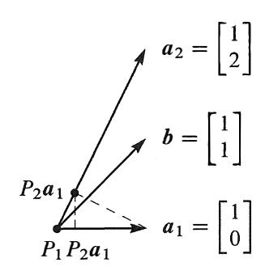

Các câu hỏi 8-9-10: không trực giao

**8** Chiếu vectơ $b = (1, 1)$ lên các đường thẳng đi qua $a_1 = (1, 0)$ và $a_2 = (1, 2)$. Vẽ các phép chiếu $p_1$ và $p_2$ và cộng $p_1 + p_2$. Các phép chiếu không cộng lại thành $b$ bởi vì các $a$ không trực giao.

**9** Trong Bài tập 8, phép chiếu của $b$ lên *mặt phẳng* của $a_1$ và $a_2$ sẽ bằng $b$. Tìm $P = A(A^TA)^{-1}A^T$ cho $A = \begin{bmatrix} a_1 & a_2 \end{bmatrix} = \begin{bmatrix} 1 & 1 \\ 0 & 2 \end{bmatrix} = $ ma trận khả nghịch.

**10** Chiếu $a_1 = (1, 0)$ lên $a_2 = (1, 2)$. Sau đó chiếu kết quả ngược trở lại lên $a_1$. Vẽ các phép chiếu này và nhân các ma trận chiếu $P_1P_2$: Đây có phải là một phép chiếu không?

#### **Các câu hỏi 11-20 yêu cầu các phép chiếu, và các ma trận chiếu, lên các không gian con.**

**11** Chiếu $b$ lên không gian cột của $A$ bằng cách giải $A^TA\hat{x} = A^Tb$ và $p = A\hat{x}$:

| (a) | $A = \begin{bmatrix} 1 & 1 \\ 0 & 1 \\ 0 & 0 \end{bmatrix}$ | và | $b = \begin{bmatrix} 2 \\ 3 \\ 4 \end{bmatrix}$ | (b) | $A = \begin{bmatrix} 1 & 1 \\ 1 & 1 \\ 0 & 1 \end{bmatrix}$ | và | $b = \begin{bmatrix} 4 \\ 4 \\ 6 \end{bmatrix}$ |
|-----|-------------------------------------------------------------|-----|-------------------------------------------------|-----|-------------------------------------------------------------|-----|-------------------------------------------------|

Tìm $e = b - p$. Nó phải vuông góc với các cột của $A$.

**12** Tính các ma trận chiếu $P_1$ và $P_2$ lên các không gian cột trong Bài tập 11. Xác minh rằng $P_1b$ cho ra phép chiếu đầu tiên $p_1$. Cũng xác minh $P_1^2 = P_1$.

**13** (Nhanh và Được đề xuất) Giả sử $A$ là ma trận đơn vị $4 \times 4$ với cột cuối cùng bị loại bỏ. $A$ có kích thước $4 \times 3$. Chiếu $b = (1, 2, 3, 4)$ lên không gian cột của $A$. Ma trận chiếu $P$ có hình dạng gì và $P$ là gì?

**14** Giả sử $b$ bằng 2 lần cột đầu tiên của $A$. Phép chiếu của $b$ lên không gian cột của $A$ là gì? $P = I$ có chắc chắn đúng trong trường hợp này không? Tính $p$ và $P$ khi $b = (0, 2, 4)$ và các cột của $A$ là $(0, 1, 2)$ và $(1, 2, 0)$.

**15** Nếu $A$ được nhân đôi, thì $P = 2A(4A^TA)^{-1}2A^T$. Điều này giống như $A(A^TA)^{-1}A^T$. Không gian cột của $2A$ cũng giống như \_\_. $\hat{x}$ có giống nhau cho $A$ và $2A$ không?

**16** Tổ hợp tuyến tính nào của $(1, 2, -1)$ và $(1, 0, 1)$ gần nhất với $b = (2, 1, 1)$?

**17** *(Quan trọng)* Nếu $P^2 = P$ hãy chỉ ra rằng $(I - P)^2 = I - P$. Khi $P$ chiếu lên không gian cột của $A$, $I - P$ chiếu lên \_\_.

**18** (a) Nếu $P$ là ma trận chiếu $2 \times 2$ lên đường thẳng đi qua $(1, 1)$, thì $I - P$ là ma trận chiếu lên \_\_.
(b) Nếu $P$ là ma trận chiếu $3 \times 3$ lên đường thẳng đi qua $(1, 1, 1)$, thì $I - P$ là ma trận chiếu lên \_\_.

**19** Để tìm ma trận chiếu lên mặt phẳng $x - y - 2z = 0$, hãy chọn hai vectơ trong mặt phẳng đó và làm cho chúng thành các cột của $A$. Mặt phẳng sẽ là không gian cột của $A$! Sau đó tính $P = A(A^TA)^{-1}A^T$.

**20** Để tìm ma trận chiếu $P$ lên cùng mặt phẳng $x - y - 2z = 0$, hãy viết ra một vectơ $e$ vuông góc với mặt phẳng đó. Tính phép chiếu $Q = ee^T / e^Te$ và sau đó $P = I - Q$.

### **Các câu hỏi 21-26 chứng tỏ rằng các ma trận chiếu thỏa mãn $P^2 = P$ và $P^T = P$.**

**21** Nhân ma trận $P = A(A^TA)^{-1}A^T$ với chính nó. Triệt tiêu để chứng minh rằng $P^2 = P$. Giải thích tại sao $P(Pb)$ luôn bằng $Pb$: Vectơ $Pb$ nằm trong không gian cột của $A$ nên phép chiếu của nó lên không gian cột đó là \_\_.

**22** Chứng minh rằng $P = A(A^TA)^{-1}A^T$ là đối xứng bằng cách tính $P^T$. Hãy nhớ rằng ma trận nghịch đảo của một ma trận đối xứng cũng đối xứng.

**23** Nếu $A$ là ma trận vuông và khả nghịch, lời cảnh báo chống lại việc tách $(A^TA)^{-1}$ không được áp dụng. Việc $A^{-1}(A^T)^{-1}A^T = I$ là đúng. *Khi $A$ là khả nghịch, tại sao $P = I$? Sai số $e$ là gì?*

**24** Không gian không của $A^T$ là \_\_ với không gian cột $C(A)$. Vậy nên nếu $A^Tb = \mathbf{0}$, phép chiếu của $b$ lên $C(A)$ phải là $p =$ \_\_. Kiểm tra xem $P = A(A^TA)^{-1}A^T$ có đưa ra câu trả lời này không.

**25** Ma trận chiếu $P$ lên một không gian con $n$ chiều của $\mathbf{R}^m$ có hạng $r = n$. *Lý do:* Các phép chiếu $Pb$ lấp đầy không gian con $S$. Vì vậy $S$ là \_\_ của $P$.

**26** Nếu một ma trận $m \times m$ có $A^2 = A$ và hạng của nó là $m$, chứng minh rằng $A = I$.

**27** Sự thật quan trọng kết thúc phần này là: *Nếu $A^TAx = \mathbf{0}$ thì $Ax = \mathbf{0}$. Chứng minh mới:* Vectơ $Ax$ nằm trong không gian không của \_\_. $Ax$ luôn luôn nằm trong không gian cột của \_\_. Để nằm trong cả hai không gian vuông góc đó, $Ax$ phải là vectơ không.

**28** Sử dụng $P^T = P$ và $P^2 = P$ để chứng minh rằng bình phương độ dài của cột 2 luôn bằng phần tử trên đường chéo $P_{22}$. Con số này là $\frac{2}{6} = \left(\frac{2}{6}\right)^2 + \left(\frac{2}{6}\right)^2 + \left(\frac{2}{6}\right)^2$ cho

$$P = \frac{1}{6} \begin{bmatrix} 5 & 2 & -1 \\ 2 & 2 & 2 \\ -1 & 2 & 5 \end{bmatrix}$$

**29** Nếu $B$ có hạng $m$ (hạng hàng tối đa, các hàng độc lập) chứng tỏ rằng $BB^T$ là khả nghịch.

### **Thử thách (Challenge Problems)**

**30** (a) Tìm ma trận chiếu $P_C$ lên không gian cột của $A$ (sau khi nhìn kỹ vào ma trận!)
$$A = \begin{bmatrix} 3 & 6 & 6 \\ 4 & 8 & 8 \end{bmatrix}$$
(b) Tìm ma trận chiếu $3 \times 3$ $P_R$ lên không gian hàng của $A$. Nhân $B = P_CAP_R$. Câu trả lời $B$ của bạn sẽ hơi ngạc nhiên - bạn có thể giải thích nó không?

**31** Trong $\mathbf{R}^m$, giả sử tôi cho bạn $b$ và cả một tổ hợp $p$ của $a_1, \dots, a_n$. Làm thế nào bạn kiểm tra xem $p$ có phải là phép chiếu của $b$ lên không gian con sinh bởi các $a$ không?

**32** Giả sử $P_1$ là ma trận chiếu lên không gian con 1 chiều sinh bởi cột đầu tiên của $A$. Giả sử $P_2$ là ma trận chiếu lên không gian cột 2 chiều của $A$. Sau một chút suy nghĩ, hãy tính tích $P_2P_1$.
$$A = \begin{bmatrix} 1 & 0 \\ 2 & 1 \\ 0 & 1 \end{bmatrix}.$$

**33** Giả sử bạn biết trung bình $\hat{x}_{\text{cũ}}$ của $b_1, b_2, \dots, b_{999}$. Khi $b_{1000}$ đến, hãy kiểm tra xem trung bình mới là một tổ hợp của $\hat{x}_{\text{cũ}}$ và sự sai lệch $b_{1000} - \hat{x}_{\text{cũ}}$:
$$\hat{x}_{\text{mới}} = \frac{b_1 + \dots + b_{1000}}{1000} = \frac{b_1 + \dots + b_{999}}{999} + \frac{1}{1000} \left( b_{1000} - \frac{b_1 + \dots + b_{999}}{999} \right).$$
Đây là một "bộ lọc Kalman (Kalman filter)" $\hat{x}_{\text{mới}} = \hat{x}_{\text{cũ}} + \frac{1}{1000} (b_{1000} - \hat{x}_{\text{cũ}})$ với ma trận hệ số khuếch đại $\frac{1}{1000}$. Trang cuối cùng của cuốn sách mở rộng bộ lọc Kalman cho các bản cập nhật ma trận.

**34** (2017) Giả sử $P_1$ và $P_2$ là các ma trận chiếu ($P_1^T = P_1 = P_1^2$). Chứng minh sự thật này: $P_1P_2$ là một ma trận chiếu nếu và chỉ nếu $P_1P_2 = P_2P_1$.

# **4.3 Phép Xấp Xỉ Bình Phương Tối Thiểu (Least Squares Approximations)**

**1** Giải $A^TA\hat{x} = A^Tb$ cho ra phép chiếu $p = A\hat{x}$ của $b$ lên không gian cột của $A$.
**2** Khi $Ax = b$ không có nghiệm, $\hat{x}$ là "nghiệm bình phương tối thiểu": $\|b - A\hat{x}\|^2 = \text{nhỏ nhất}$.
**3** Đặt các đạo hàm riêng của $E = \|Ax - b\|^2$ bằng không ($\partial E / \partial x = 0$) cũng tạo ra $A^TA\hat{x} = A^Tb$.
**4** Để khớp các điểm $(t_1, b_1), \dots, (t_m, b_m)$ bằng một đường thẳng, $A$ có các cột $(1, \dots, 1)$ và $(t_1, \dots, t_m)$.
**5** Trong trường hợp đó $A^TA = \begin{bmatrix} m & \sum t_i \\ \sum t_i & \sum t_i^2 \end{bmatrix}$ là ma trận $2 \times 2$ và $A^Tb = \begin{bmatrix} \sum b_i \\ \sum t_ib_i \end{bmatrix}$ là vectơ.

Thường xảy ra trường hợp $Ax = b$ không có nghiệm. Lý do thông thường là: *quá nhiều phương trình.* Ma trận $A$ có nhiều hàng hơn số cột. Có nhiều phương trình hơn số ẩn ($m$ lớn hơn $n$). Khi đó các cột sinh ra một phần nhỏ của không gian $m$ chiều. Trừ khi tất cả các phép đo đều hoàn hảo, $b$ nằm ngoài không gian cột đó của $A$. Phép khử đạt đến một phương trình bất khả thi và dừng lại. Nhưng chúng ta không thể dừng lại chỉ vì các phép đo bao gồm nhiễu!

Nhắc lại: Chúng ta không thể luôn luôn làm cho sai số $e = b - Ax$ giảm xuống bằng không. Khi $e$ bằng không, $x$ là một nghiệm chính xác cho $Ax = b$. *Khi độ dài của $e$ càng nhỏ càng tốt,* $\hat{x}$ *là một nghiệm bình phương tối thiểu.* Mục tiêu của chúng ta trong phần này là tính $\hat{x}$ và sử dụng nó. Đây là những bài toán thực tế và chúng cần một câu trả lời.

Phần trước đã nhấn mạnh vào $p$ (phép chiếu). Phần này nhấn mạnh vào $\hat{x}$ (nghiệm bình phương tối thiểu). Chúng được kết nối bởi $p = A\hat{x}$. Phương trình cơ bản vẫn là $A^TA\hat{x} = A^Tb$. Đây là một cách không chính thức, ngắn gọn để đạt được *"phương trình pháp tuyến"* này:

**Khi $Ax = b$ không có nghiệm, nhân với $A^T$ và giải $A^TA\hat{x} = A^Tb$.**

**Ví dụ 1** Một ứng dụng quan trọng của bình phương tối thiểu là khớp một đường thẳng với $m$ điểm. Bắt đầu với ba điểm: *Tìm đường thẳng gần nhất với các điểm* $(0, 6), (1, 0),$ *và* $(2, 0)$.

Không có đường thẳng nào $b = C + Dt$ đi qua ba điểm đó. Chúng ta đang yêu cầu hai số $C$ và $D$ thỏa mãn ba phương trình: $n = 2$ và $m = 3$. Dưới đây là ba phương trình tại $t = 0, 1, 2$ để khớp với các giá trị đã cho $b = 6, 0, 0$:

$t=0$ Điểm thứ nhất nằm trên đường thẳng $b = C + Dt$ nếu $C + D \cdot 0 = 6$
$t=1$ Điểm thứ hai nằm trên đường thẳng $b = C + Dt$ nếu $C + D \cdot 1 = 0$
$t=2$ Điểm thứ ba nằm trên đường thẳng $b = C + Dt$ nếu $C + D \cdot 2 = 0$
Hệ $3 \times 2$ này *không có nghiệm*: $b = (6, 0, 0)$ không phải là một tổ hợp của các cột $(1, 1, 1)$ và $(0, 1, 2)$. Đọc ra $A, x,$ và $b$ từ các phương trình đó:

| $A = \begin{bmatrix} 1 & 0 \\ 1 & 1 \\ 1 & 2 \end{bmatrix}$ | $x = \begin{bmatrix} C \\ D \end{bmatrix}$ | $b = \begin{bmatrix} 6 \\ 0 \\ 0 \end{bmatrix}$ | $Ax = b$ <i>không thể giải được</i>. |
|-------------------------------------------------------------|-----------------------------------------------------|----------------------------------------------------------|----------------------------------------------------|

Những con số tương tự đã có trong Ví dụ 3 ở phần trước. Chúng ta đã tính $\hat{x} = (5, -3)$. **Những con số đó là $C$ và $D$ tốt nhất, nên $5 - 3t$ sẽ là đường thẳng tốt nhất cho 3 điểm.** Chúng ta phải kết nối các phép chiếu với bình phương tối thiểu, bằng cách giải thích tại sao $A^TA\hat{x} = A^Tb$.

Trong các bài toán thực tế, có thể dễ dàng có $m = 100$ điểm thay vì $m = 3$. Chúng không khớp chính xác với bất kỳ đường thẳng $C + Dt$ nào. Các số $6, 0, 0$ của chúng ta phóng đại sai số để bạn có thể thấy $e_1, e_2,$ và $e_3$ trong Hình 4.6.

# **Cực Tiểu Hóa Sai Số (Minimizing the Error)**

Làm thế nào chúng ta làm cho sai số $e = b - Ax$ nhỏ nhất có thể? Đây là một câu hỏi quan trọng với một câu trả lời đẹp. $\hat{x}$ tốt nhất (gọi là $\hat{x}$) có thể được tìm thấy bằng hình học (sai số $e$ giao với không gian cột của $A$ tại góc $90^\circ$) và bằng đại số: $A^TA\hat{x} = A^Tb$. Giải tích cho ra cùng một $\hat{x}$: đạo hàm của sai số $\|Ax - b\|^2$ bằng không tại $\hat{x}$.

**Bằng hình học** Mọi $Ax$ nằm trong mặt phẳng của các cột $(1, 1, 1)$ và $(0, 1, 2)$. Trong mặt phẳng đó, chúng ta tìm điểm gần nhất với $b$. *Điểm gần nhất là phép chiếu $p$.*

Lựa chọn tốt nhất cho $Ax$ là $p$. Sai số nhỏ nhất có thể là $e = b - p$, vuông góc với các cột. *Ba điểm ở các độ cao $(p_1, p_2, p_3)$ thực sự nằm trên một đường thẳng,* bởi vì $p$ nằm trong không gian cột của $A$. Trong việc khớp một đường thẳng, $\hat{x}$ là lựa chọn tốt nhất cho $(C, D)$.

**Bằng đại số** Mọi vectơ $b$ tách thành hai phần. Phần trong không gian cột là $p$. Phần vuông góc là $e$. Có một phương trình chúng ta không thể giải $(Ax = b)$. Có một phương trình $A\hat{x} = p$ chúng ta có thể và sẽ giải (bằng cách loại bỏ $e$ và giải $A^TA\hat{x} = A^Tb$):

| $Ax = b = p + e$ | là bất khả thi | $A\hat{x} = p$ | là giải được | $\hat{x}$ | là $(A^TA)^{-1}A^Tb$. (1) |
|------------------|---------------|----------------|-------------|-----------|-------------------------------|

Nghiệm cho $A\hat{x} = p$ để lại sai số nhỏ nhất có thể (chính là $e$):

| Bình phương độ dài cho bất kỳ $x$ nào | $\|Ax - b\|^2 = \|Ax - p\|^2 + \|e\|^2$ | (2) |
|----------------------------|-----------------------------------------|-----|

Đây là định lý $c^2 = a^2 + b^2$ cho một tam giác vuông. Vectơ $Ax - p$ trong không gian cột vuông góc với $e$ trong không gian không bên trái. Chúng ta giảm $Ax - p$ xuống **không** bằng cách chọn $x = \hat{x}$. Điều đó để lại sai số nhỏ nhất có thể $e = (e_1, e_2, e_3)$ mà chúng ta không thể giảm được nữa.

Lưu ý ý nghĩa của "nhỏ nhất". *Bình phương độ dài* của $Ax - b$ được cực tiểu hóa:

### *Nghiệm bình phương tối thiểu $\hat{x}$ làm cho $E = \|Ax - b\|^2$ nhỏ nhất có thể.*

Hình 4.6a cho thấy đường thẳng gần nhất. Nó sai lệch một khoảng cách $e_1, e_2, e_3 = 1, -2, 1$. *Đó là những khoảng cách theo chiều dọc.* Đường thẳng bình phương tối thiểu cực tiểu hóa $E = e_1^2 + e_2^2 + e_3^2$.

Hình 4.6b cho thấy cùng một bài toán trong không gian 3 chiều (không gian $b, p, e$). Vectơ $b$ không nằm trong không gian cột của $A$. Đó là lý do tại sao chúng ta không thể giải $Ax = b$. Không có đường thẳng nào đi qua ba điểm. Sai số nhỏ nhất có thể là vectơ vuông góc $e$. Đây là $e = b - A\hat{x}$, vectơ các sai số $(1, -2, 1)$ trong ba phương trình. Đó là những khoảng cách từ đường thẳng tốt nhất. Ẩn đằng sau cả hai hình vẽ là phương trình cơ bản $A^TA\hat{x} = A^Tb$.

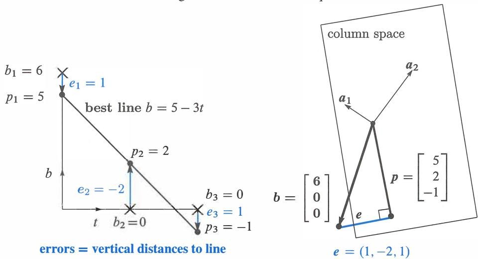

Hình 4.6: **Đường thẳng tốt nhất và phép chiếu: Hai hình ảnh, cùng một bài toán.** Đường thẳng có các độ cao $p = (5, 2, -1)$ với các sai số $e = (1, -2, 1)$. Các phương trình $A^TA\hat{x} = A^Tb$ cho ra $\hat{x} = (5, -3)$. Cùng một câu trả lời! Đường thẳng tốt nhất là $b = 5 - 3t$ và điểm gần nhất là $p = 5a_1 - 3a_2$.

Lưu ý rằng các sai số $1, -2, 1$ cộng lại bằng không. *Lý do:* Sai số $e = (e_1, e_2, e_3)$ vuông góc với cột đầu tiên $(1, 1, 1)$ trong $A$. Tích vô hướng cho ra $e_1 + e_2 + e_3 = 0$.

**Bằng giải tích** Hầu hết các hàm số được cực tiểu hóa bằng giải tích! Đồ thị chạm đáy và đạo hàm theo mọi hướng đều bằng không. Ở đây hàm sai số $E$ cần được cực tiểu hóa là một *tổng các bình phương* $e_1^2 + e_2^2 + e_3^2$ (bình phương của sai số trong mỗi phương trình):

$$E = \|Ax - b\|^2 = (C + D \cdot 0 - 6)^2 + (C + D \cdot 1)^2 + (C + D \cdot 2)^2. \quad (3)$$

Các ẩn là $C$ và $D$. Với hai ẩn số có *hai đạo hàm - cả hai* đều bằng không tại điểm cực tiểu. Chúng là các "đạo hàm riêng" bởi vì $\partial E / \partial C$ coi $D$ là hằng số và $\partial E / \partial D$ coi $C$ là hằng số:

| $\partial E / \partial C = 2(C + D \cdot 0 - 6)$ | $+ 2(C + D \cdot 1)$ | $+ 2(C + D \cdot 2)$ | $= 0$ |
|------------------------------------------------|---------------------|---------------------|-------|

$$\partial E / \partial D = 2(C + D \cdot 0 - 6)(\mathbf{0}) + 2(C + D \cdot 1)(\mathbf{1}) + 2(C + D \cdot 2)(\mathbf{2}) = 0.$$

$\partial E / \partial D$ chứa các nhân tử phụ $0, 1, 2$ từ quy tắc dây chuyền. (Đạo hàm cuối cùng từ $(C + 2D)^2$ là $2$ nhân với $C + 2D$ nhân với hệ số $2$ phụ đó.) Những nhân tử đó chỉ là $1, 1, 1$ trong $\partial E / \partial C$.

Không phải ngẫu nhiên mà những nhân tử $1, 1, 1$ và $0, 1, 2$ trong các đạo hàm của $\|Ax - b\|^2$ lại là các cột của $A$. Bây giờ triệt tiêu số $2$ từ mỗi số hạng và nhóm tất cả các $C$ và tất cả các $D$ lại:

| Đạo hàm theo $C$ bằng không: | $3C + 3D = 6$ | Ma trận này | $\begin{bmatrix} 3 & 3 \\ 3 & 5 \end{bmatrix}$ | là $A^TA$ | (4) |
|-----------------------------|---------------|-------------|------------------------------------------------|------------|-----|
| Đạo hàm theo $D$ bằng không: | $3C + 5D = 0$ |             |                                                |            |     |

*Những phương trình này giống hệt với* $A^TA\hat{x} = A^Tb$. $C$ và $D$ tốt nhất là các thành phần của $\hat{x}$. Các phương trình từ giải tích cũng giống như các "phương trình pháp tuyến" từ đại số tuyến tính. Đây là những phương trình cốt lõi của bình phương tối thiểu:

#### *Các đạo hàm riêng của $\|Ax - b\|^2$ bằng không khi $A^TA\hat{x} = A^Tb$.*

Nghiệm là $C = 5$ và $D = -3$. Do đó $b = 5 - 3t$ là đường thẳng tốt nhất - nó đến gần ba điểm nhất. Tại $t = 0, 1, 2$, đường thẳng này đi qua $p = (5, 2, -1)$. Nó không thể đi qua $b = (6, 0, 0)$. Các sai số là $1, -2, 1$. Đây là vectơ $e$.

# **Bức Tranh Lớn Về Bình Phương Tối Thiểu (The Big Picture for Least Squares)**

Hình vẽ then chốt của cuốn sách này cho thấy bốn không gian con và tác động thực sự của một ma trận. Vectơ $x$ ở phía bên trái của Hình 4.3 đã đi đến $b = Ax$ ở phía bên phải. Trong hình đó $x$ đã được tách thành $x_r + x_n$. Có *rất nhiều* nghiệm cho $Ax = b$.

Trong phần này, tình huống diễn ra hoàn toàn ngược lại. *Không có* nghiệm cho $Ax = b$. *Thay vì tách $x$, chúng ta đang tách $b = p + e$.* Hình 4.7 cho thấy bức tranh lớn về bình phương tối thiểu. Thay vì $Ax = b$, chúng ta giải $A\hat{x} = p$. Sai số $e = b - p$ là không thể tránh khỏi.

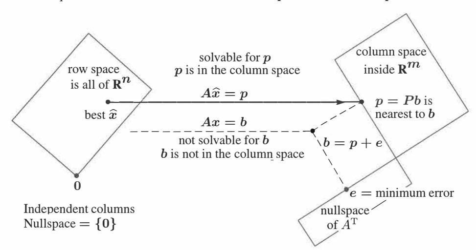

Hình 4.7: Phép chiếu $p = A\hat{x}$ là gần với $b$ nhất, do đó $\hat{x}$ cực tiểu hóa $E = \|b - Ax\|^2$.

Lưu ý rằng không gian không $N(A)$ rất nhỏ - chỉ là một điểm. Với các cột độc lập, nghiệm duy nhất cho $Ax = \mathbf{0}$ là $x = \mathbf{0}$. Khi đó $A^TA$ là khả nghịch. Phương trình $A^TA\hat{x} = A^Tb$ xác định hoàn toàn vectơ tốt nhất $\hat{x}$. Sai số có $A^Te = \mathbf{0}$.

Chương 7 sẽ có bức tranh hoàn chỉnh - bao gồm tất cả bốn không gian con. Mọi $x$ tách thành $x_r + x_n$, và mọi $b$ tách thành $p + e$. Nghiệm tốt nhất là $x = x_r$ trong không gian hàng. Chúng ta không thể làm gì với $e$ và chúng ta không muốn $x_n$ từ không gian không - điều này để lại $A\hat{x} = p$.

## **Khớp Một Đường Thẳng (Fitting a Straight Line)**

Khớp một đường thẳng là ứng dụng rõ ràng nhất của bình phương tối thiểu. Nó bắt đầu với $m > 2$ điểm, hy vọng là gần một đường thẳng. Tại các thời điểm $t_1, \dots, t_m$, $m$ điểm đó nằm ở các độ cao $b_1, \dots, b_m$. Đường thẳng tốt nhất $C + Dt$ đi trượt các điểm một khoảng cách thẳng đứng $e_1, \dots, e_m$. Không có đường thẳng nào là hoàn hảo, và đường thẳng bình phương tối thiểu cực tiểu hóa $E = e_1^2 + \dots + e_m^2$.

Ví dụ đầu tiên trong phần này có ba điểm ở Hình 4.6. Bây giờ chúng ta cho phép $m$ điểm (và $m$ có thể lớn). Hai thành phần của $\hat{x}$ vẫn là $C$ và $D$.

Một đường thẳng đi qua $m$ điểm khi chúng ta giải chính xác $Ax = b$. Thông thường chúng ta không thể làm điều đó. Hai ẩn số $C$ và $D$ xác định một đường thẳng, nên $A$ chỉ có $n = 2$ cột. Để khớp $m$ điểm, chúng ta đang cố gắng giải $m$ phương trình (và chúng ta chỉ có hai ẩn số!).

$$Ax = b \quad \text{là} \quad \begin{aligned} & C + Dt_1 = b_1 \\ & C + Dt_2 = b_2 \\ & \vdots \\ & C + Dt_m = b_m \end{aligned} \quad \text{với} \quad A = \begin{bmatrix} 1 & t_1 \\ 1 & t_2 \\ \vdots & \vdots \\ 1 & t_m \end{bmatrix}. \quad (5)$$

Không gian cột rất mỏng manh nên gần như chắc chắn $b$ nằm ngoài nó. Khi $b$ tình cờ nằm trong không gian cột, các điểm tình cờ nằm trên một đường thẳng. Trong trường hợp đó $b = p$. Khi đó $Ax = b$ giải được và các sai số là $e = (0, \dots, 0)$.

*Đường thẳng gần nhất $C + Dt$ có các độ cao $p_1, \dots, p_m$ với các sai số $e_1, \dots, e_m$. Giải $A^TA\hat{x} = A^Tb$ cho $\hat{x} = (C, D)$. Các sai số là $e_i = b_i - C - Dt_i$.*

Khớp các điểm bằng một đường thẳng rất quan trọng nên chúng ta sẽ đưa ra hai phương trình $A^TA\hat{x} = A^Tb$ một lần và mãi mãi. Hai cột của $A$ là độc lập (trừ khi tất cả các thời điểm $t_i$ đều giống nhau). Vì vậy chúng ta chuyển sang bình phương tối thiểu và giải $A^TA\hat{x} = A^Tb$.

Đường thẳng $C + Dt$ cực tiểu hóa $e_1^2 + \dots + e_m^2 = \|Ax - b\|^2$ khi $A^TA\hat{x} = A^Tb$:

$$A^TA\hat{x} = A^Tb \quad \begin{bmatrix} m & \sum t_i \\ \sum t_i & \sum t_i^2 \end{bmatrix} \begin{bmatrix} C \\ D \end{bmatrix} = \begin{bmatrix} \sum b_i \\ \sum t_ib_i \end{bmatrix}. \quad (8)$$

Các sai số theo chiều dọc tại $m$ điểm trên đường thẳng là các thành phần của $e = b - p$. Vectơ sai số này (*thặng dư*, residual) $b - A\hat{x}$ vuông góc với các cột của $A$ (hình học). Sai số nằm trong không gian không của $A^T$ (đại số tuyến tính). $\hat{x} = (C, D)$ tốt nhất cực tiểu hóa tổng sai số $E$, tổng các bình phương (giải tích):

$$E(x) = \|Ax - b\|^2 = (C + Dt_1 - b_1)^2 + \dots + (C + Dt_m - b_m)^2.$$

Giải tích đặt các đạo hàm $\partial E / \partial C$ và $\partial E / \partial D$ bằng không, và tạo ra $A^TA\hat{x} = A^Tb$.

Các bài toán bình phương tối thiểu khác có nhiều hơn hai ẩn số. Khớp bằng parabol tốt nhất có $n = 3$ hệ số $C, D, E$ (xem bên dưới). Nhìn chung chúng ta đang khớp $m$ điểm dữ liệu bằng $n$ tham số $x_1, \dots, x_n$. Ma trận $A$ có $n$ cột và $n < m$. Các đạo hàm của $\|Ax - b\|^2$ cho ra $n$ phương trình $A^TA\hat{x} = A^Tb$. **Đạo hàm của một bình phương là một hàm tuyến tính.** Đây là lý do tại sao phương pháp bình phương tối thiểu lại phổ biến như vậy.

**Ví dụ 2** $A$ có các *cột trực giao* khi các thời điểm đo $t_i$ cộng lại bằng không.

Giả sử $b = (1, 2, 4)$ tại các thời điểm $t = -2, 0, 2$. *Các thời điểm đó cộng lại bằng không.* Các cột của $A$ có *tích vô hướng bằng không:* $(1, 1, 1)$ trực giao với $(-2, 0, 2)$:

| $C + D(-2) = 1$ |    |        | $\begin{bmatrix} 1 & -2 \\ 1 & 0 \\ 1 & 2 \end{bmatrix} \begin{bmatrix} C \\ D \end{bmatrix} = \begin{bmatrix} 1 \\ 2 \\ 4 \end{bmatrix}$ |
|-----------------|----|--------|----------------------------------------------------------|
| $C + D(0) = 2$  | hay | $Ax =$ |                                                          |
| $C + D(2) = 4$  |    |        |                                                          |

Khi các cột của $A$ là trực giao, $A^TA$ sẽ là một ma trận đường chéo:

$$A^TA\hat{x} = A^Tb \quad \text{là} \quad \begin{bmatrix} 3 & 0 \\ 0 & 8 \end{bmatrix} \begin{bmatrix} C \\ D \end{bmatrix} = \begin{bmatrix} 7 \\ 6 \end{bmatrix}. \quad (9)$$

*Điểm chính:* Vì $A^TA$ *là ma trận đường chéo*, chúng ta có thể giải riêng rẽ $C = 7/3$ và $D = 6/8 = 3/4$. Các số không trong $A^TA$ là các tích vô hướng của các cột vuông góc trong $A$. Ma trận đường chéo $A^TA$, với các phần tử $m = 3$ và $t_1^2 + t_2^2 + t_3^2 = 8$, thực tế là tốt như ma trận đơn vị.

Các cột trực giao rất hữu ích nên rất đáng để *dịch chuyển các thời điểm bằng cách trừ đi thời điểm trung bình* $\bar{t} = (t_1 + \dots + t_m) / m$. Nếu các thời điểm ban đầu là $1, 3, 5$ thì trung bình của chúng là $\bar{t} = 3$. Các thời điểm được dịch chuyển $T = t - \bar{t} = t - 3$ cộng lại bằng không!

| $T_1 = 1 - 3 = -2$ | $A_{\text{mới}} = \begin{bmatrix} 1 & T_1 \\ 1 & T_2 \\ 1 & T_3 \end{bmatrix}$ | $A_{\text{mới}}^T A_{\text{mới}} = \begin{bmatrix} 3 & 0 \\ 0 & 8 \end{bmatrix}$ |
|--------------------|--------------------------------------------------------------------------------|----------------------------------------------------------------------------------|
| $T_2 = 3 - 3 = 0$  |                                                                                |                                                                                  |
| $T_3 = 5 - 3 = 2$  |                                                                                |                                                                                  |

Bây giờ $C$ và $D$ đến từ phương trình đơn giản (9). Sau đó đường thẳng tốt nhất sử dụng $C + DT$ cũng chính là $C + D(t - \bar{t}) = C + D(t - 3)$. Bài tập 30 thậm chí còn đưa ra một công thức cho $C$ và $D$.

Đó là một ví dụ hoàn hảo về "ý tưởng Gram-Schmidt" sẽ xuất hiện trong phần tiếp theo: *Làm cho các cột trực giao từ trước.* Khi đó $A_{\text{mới}}^TA_{\text{mới}}$ là đường chéo và $\hat{x}_{\text{mới}}$ rất dễ tính.

# **Các Cột Phụ Thuộc Trong $A$: $\hat{x}$ Là Gì? (Dependent Columns in $A$: What is $\hat{x}$?)**

Ngay từ đầu, chương này đã giả định các cột độc lập trong $A$. Khi đó $A^TA$ khả nghịch. Khi đó $A^TA\hat{x} = A^Tb$ cho ra nghiệm bình phương tối thiểu đối với $Ax = b$.

$$\begin{bmatrix} 1 & 1 \\ 1 & 1 \end{bmatrix} \begin{bmatrix} x_1 \\ x_2 \end{bmatrix} = \begin{bmatrix} 3 \\ 1 \end{bmatrix} = b$$
$$Ax = b$$

$$\begin{bmatrix} 1 & 1 \\ 1 & 1 \end{bmatrix} \begin{bmatrix} \hat{x}_1 \\ \hat{x}_2 \end{bmatrix} = \begin{bmatrix} 2 \\ 2 \end{bmatrix} = p$$
$$A\hat{x} = p$$

$\hat{x}$ nào là tốt nhất nếu $A$ có *các cột phụ thuộc*? Đây là một ví dụ cụ thể.

Các phép đo $b_1 = 3$ và $b_2 = 1$ ở cùng một thời điểm $T$! Một đường thẳng $C + Dt$ không thể đi qua cả hai điểm. Tôi nghĩ chúng ta đã đúng khi chiếu $b = (3, 1)$ tới $p = (2, 2)$ trong không gian cột của $A$. Điều đó làm thay đổi phương trình $Ax = b$ thành phương trình $A\hat{x} = p$. Một phương trình vô nghiệm đã trở thành một phương trình có vô số nghiệm. Vấn đề là $A$ có các cột phụ thuộc và $(1, -1)$ nằm trong không gian không của nó.

Chúng ta nên chọn nghiệm $\hat{x}$ nào? Tất cả các đường nét đứt trong hình vẽ (hình trong sách giáo khoa - ND) đều có cùng hai sai số $1$ và $-1$ tại thời điểm $T$. Những sai số đó $(1, -1) = e = b - p$ là nhỏ nhất có thể. Nhưng điều này không cho chúng ta biết đường nét đứt nào là tốt nhất.

Bản năng của tôi là chọn đường thẳng nằm ngang ở độ cao $2$. Nếu phương trình cho đường thẳng tốt nhất là $b = C + Dt$, thì lựa chọn của tôi sẽ có $x_1 = C = 2$ và $x_2 = D = 0$. Nhưng sẽ ra sao nếu đường thẳng được viết là $b = ct + d$? Điều này cũng đúng (chỉ là đảo ngược $C$ và $D$). Bây giờ đường thẳng nằm ngang có $x_1 = c = 0$ và $x_2 = d = 2$. Tôi không thấy có lối thoát nào.

Trong Phần 7.4, *"ma trận nghịch đảo giả (pseudoinverse)"* của $A$ sẽ chọn **nghiệm ngắn nhất đối với** $A\hat{x} = p$. Ở đây, nghiệm ngắn nhất đó sẽ là $x^+ = (1, 1)$. Đây là nghiệm cụ thể trong không gian hàng của $A$, và $x^+$ có độ dài $\sqrt{2}$. (Cả hai nghiệm $\hat{x} = (2, 0)$ và $(0, 2)$ đều có độ dài $2$.) Chúng ta đang tùy ý chọn thành phần không gian không của nghiệm $x^+$ bằng không.

Khi $A$ có các cột độc lập, không gian không chỉ chứa vectơ không và ma trận nghịch đảo giả chính là ma trận nghịch đảo trái thông thường của chúng ta $L = (A^TA)^{-1}A^T$. Khi tôi viết nó theo cách đó, nghịch đảo giả nghe có vẻ là cách tốt nhất để chọn $\hat{x}$.

*Bình luận* Các thử nghiệm MATLAB với các ma trận suy biến tạo ra **Inf** (vô cùng) hoặc **NaN** (Không phải là Số) hoặc $10^{16}$ (một số xấu). Luôn có một cảnh báo trong mọi trường hợp! Tôi tin rằng **Inf** và **NaN** và $10^{16}$ đến từ các khả năng $0x = b$ và $0x = 0$ và $10^{-16}x = 1$.

Đó là ba ví dụ nhỏ về ba khó khăn lớn: suy biến không có nghiệm, suy biến có nhiều nghiệm, và rất rất gần với suy biến.

### **Khớp Bằng Một Parabol (Fitting by a Parabola)**

Nếu chúng ta ném một quả bóng, sẽ thật điên rồ nếu khớp quỹ đạo của nó bằng một đường thẳng. Một parabol $b = C + Dt + Et^2$ cho phép quả bóng đi lên và rơi xuống trở lại ($b$ là độ cao tại thời điểm $t$). Quỹ đạo thực tế không phải là một parabol hoàn hảo, nhưng toàn bộ lý thuyết về vật ném bắt đầu bằng phép xấp xỉ đó.

Khi Galileo thả một hòn đá từ Tháp nghiêng Pisa, nó đã gia tốc. Khoảng cách chứa một số hạng bậc hai $\frac{1}{2}gt^2$. (Ý của Galileo là khối lượng của hòn đá không liên quan.) Nếu không có số hạng $t^2$ đó, chúng ta sẽ không bao giờ có thể phóng một vệ tinh vào quỹ đạo của nó. Nhưng ngay cả với một hàm phi tuyến như $t^2$, các ẩn số $C, D, E$ vẫn xuất hiện một cách tuyến tính! Khớp các điểm bằng parabol tốt nhất vẫn là một bài toán trong đại số tuyến tính.

**Bài toán** Khớp các độ cao $b_1, \dots, b_m$ tại các thời điểm $t_1, \dots, t_m$ bằng một parabol $C + Dt + Et^2$.

**Giải** Với $m > 3$ điểm, $m$ phương trình để khớp chính xác nhìn chung là không thể giải được:

$$\begin{aligned} C + Dt_1 + Et_1^2 &= b_1 \\ \vdots & \\ C + Dt_m + Et_m^2 &= b_m \end{aligned} \quad \text{là } Ax = b \text{ với ma trận } m \times 3 \quad A = \begin{bmatrix} 1 & t_1 & t_1^2 \\ \vdots & \vdots & \vdots \\ 1 & t_m & t_m^2 \end{bmatrix}. \quad (10)$$

**Bình phương tối thiểu** Parabol gần nhất $C + Dt + Et^2$ chọn $\hat{x} = (C, D, E)$ thỏa mãn ba phương trình pháp tuyến $A^TA\hat{x} = A^Tb$.

Tôi có thể yêu cầu bạn chuyển đổi bài toán này thành một bài toán về phép chiếu không? Không gian cột của $A$ có số chiều là \_\_. Phép chiếu của $b$ là $p = A\hat{x}$, tổ hợp của ba cột sử dụng các hệ số $C, D, E$. Sai số tại điểm dữ liệu đầu tiên là $e_1 = b_1 - C - Dt_1 - Et_1^2$. Tổng bình phương sai số là $e_1^2 + \dots + e_m^2$. Nếu bạn muốn cực tiểu hóa bằng giải tích, hãy lấy các đạo hàm riêng của $E$ theo \_\_, \_\_, \_\_. Ba đạo hàm này sẽ bằng không khi $\hat{x} = (C, D, E)$ giải được hệ 3 phương trình $3 \times 3$ $A^TA\hat{x} = A^Tb$.

Phần 10.5 có nhiều ứng dụng bình phương tối thiểu hơn. Ứng dụng lớn là chuỗi Fourier - xấp xỉ các hàm thay vì các vectơ. Hàm cần được cực tiểu hóa chuyển từ tổng bình phương các sai số $e_1^2 + \dots + e_m^2$ thành một tích phân của bình phương sai số.

**Ví dụ 3** Để một parabol $b = C + Dt + Et^2$ đi qua ba độ cao $b = 6, 0, 0$ khi $t = 0, 1, 2$, các phương trình cho $C, D, E$ là

$$\begin{aligned} C + D \cdot 0 + E \cdot 0^2 &= 6 \\ C + D \cdot 1 + E \cdot 1^2 &= 0 \\ C + D \cdot 2 + E \cdot 2^2 &= 0. \end{aligned} \tag{11}$$

Đây là $Ax = b$. Chúng ta có thể giải nó chính xác. Ba điểm dữ liệu cho ra ba phương trình và một ma trận vuông. Nghiệm là $x = (C, D, E) = (6, -9, 3)$. Parabol đi qua ba điểm trong Hình 4.8a là $b = 6 - 9t + 3t^2$.

Điều này có ý nghĩa gì đối với phép chiếu? Ma trận có ba cột, sinh ra toàn bộ không gian $\mathbf{R}^3$. Ma trận chiếu là ma trận đơn vị. Phép chiếu của $b$ là $b$. Sai số bằng không. Chúng ta không cần $A^TA\hat{x} = A^Tb$, bởi vì chúng ta đã giải $Ax = b$. Tất nhiên chúng ta có thể nhân với $A^T$, nhưng không có lý do gì để làm điều đó.

Hình 4.8 cũng cho thấy một điểm thứ tư $b_4$ tại thời điểm $t_4$. Nếu điểm đó rơi trên parabol, $Ax = b$ mới (bốn phương trình) vẫn giải được. Khi điểm thứ tư không nằm trên parabol, chúng ta chuyển sang $A^TA\hat{x} = A^Tb$. Liệu parabol bình phương tối thiểu có giữ nguyên, với tất cả sai số dồn vào điểm thứ tư không? Có khả năng là không!

Bình phương tối thiểu cân bằng bốn sai số để có được ba phương trình cho $C, D, E$.

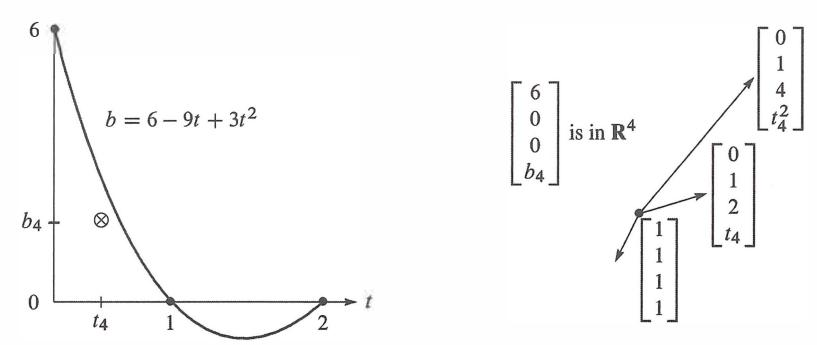

Hình 4.8: Một đường khớp chính xác của parabol tại $t = 0, 1, 2$ có nghĩa là $p = b$ và $e = 0$. Điểm thứ 4 $\otimes$ nằm ngoài parabol làm cho $m > n$ và chúng ta cần bình phương tối thiểu: chiếu $b$ lên $C(A)$. Hình bên phải cho thấy $b$ không phải là một tổ hợp của ba cột của $A$.

#### **• ÔN TẬP CÁC Ý TƯỞNG CHÍNH (REVIEW OF THE KEY IDEAS) •**

- **1.** Nghiệm bình phương tối thiểu $\hat{x}$ cực tiểu hóa $\|A\hat{x} - b\|^2 = \hat{x}^TA^TA\hat{x} - 2\hat{x}^TA^Tb + b^Tb$. Đây là $E$, tổng bình phương của các sai số trong $m$ phương trình ($m > n$).
- **2.** $\hat{x}$ tốt nhất xuất phát từ các phương trình pháp tuyến $A^TA\hat{x} = A^Tb$. $E$ là cực tiểu.
- **3.** Để khớp $m$ điểm bằng một đường thẳng $b = C + Dt$, các phương trình pháp tuyến cho ra $C$ và $D$.
- **4.** Các độ cao của đường thẳng tốt nhất là $p = (p_1, \dots, p_m)$. Các khoảng cách theo chiều dọc tới các điểm dữ liệu là các sai số $e = (e_1, \dots, e_m)$. Một phương trình cốt lõi là $A^Te = \mathbf{0}$.
- **5.** Nếu chúng ta cố gắng khớp $m$ điểm bằng một tổ hợp của $n < m$ hàm, $m$ phương trình $Ax = b$ nhìn chung là không thể giải được. Khi đó các phương trình $A^TA\hat{x} = A^Tb$ cho ra nghiệm bình phương tối thiểu - tổ hợp với MSE (mean square error - sai số toàn phương trung bình) nhỏ nhất.

#### **• CÁC VÍ DỤ ĐÃ GIẢI (WORKED EXAMPLES) •**

**4.3 A** Bắt đầu với chín phép đo từ $b_1$ đến $b_9$, *tất cả đều bằng không*, tại các thời điểm $t = 1, \dots, 9$. Phép đo thứ mười $b_{10} = 40$ là một giá trị ngoại lai (outlier). Tìm **đường thẳng nằm ngang tốt nhất** $y = C$ để khớp với mười điểm $(1, 0), (2, 0), \dots, (9, 0), (10, 40)$ sử dụng ba tùy chọn cho sai số $E$:

(1) *Bình phương* tối thiểu $E_2 = e_1^2 + \dots + e_{10}^2$ (khi đó phương trình pháp tuyến cho $C$ là tuyến tính)
**(2)** Sai số *lớn nhất* tối thiểu $E_\infty = |e_{\max}|$
**(3)** *Tổng* các sai số tối thiểu $E_1 = |e_1| + \dots + |e_{10}|$

**Giải**
(1) Đường khớp bình phương tối thiểu tới $0, 0, \dots, 0, 40$ bằng một đường thẳng nằm ngang là $C = 4$:

| $A = \text{cột của 10 số } 1$ | $A^TA = 10$ | $A^Tb = \text{tổng của } b_i = 40.$ | $\text{Vậy } 10C = 40.$ |
|---------------------------------------|--------------|------------------------------------|-------------------------|

(2) Sai số lớn nhất tối thiểu yêu cầu $C = 20$, nằm chính giữa $0$ và $40$.

(3) Tổng tối thiểu yêu cầu $C = 0$ (!!). Tổng các sai số $9|C| + |40 - C|$ sẽ tăng lên nếu $C$ di chuyển lên khỏi số không.

Tổng tối thiểu đến từ phép đo *trung vị* (median của $0, \dots, 0, 40$ là không). Nhiều nhà thống kê cảm thấy rằng nghiệm bình phương tối thiểu bị ảnh hưởng quá mạnh bởi các giá trị ngoại lai như $b_{10} = 40$, và họ ưu tiên tổng tối thiểu. Nhưng các phương trình trở nên *phi tuyến tính*.

Bây giờ hãy tìm đường thẳng bình phương tối thiểu $C + Dt$ đi qua mười điểm đó từ $(1, 0)$ đến $(10, 40)$:

$$A^TA = \begin{bmatrix} 10 & \sum t_i \\ \sum t_i & \sum t_i^2 \end{bmatrix} = \begin{bmatrix} 10 & 55 \\ 55 & 385 \end{bmatrix} \quad A^Tb = \begin{bmatrix} \sum b_i \\ \sum t_ib_i \end{bmatrix} = \begin{bmatrix} 40 \\ 400 \end{bmatrix}$$

Những giá trị đó xuất phát từ phương trình (8). Khi đó $A^TA\hat{x} = A^Tb$ cho ra $C = -8$ và $D = 24/11$.

Điều gì xảy ra với $C$ và $D$ nếu bạn nhân $b = (0, 0, \dots, 40)$ với 3 và sau đó cộng thêm 30 để được $b_{\text{mới}} = (30, 30, \dots, 150)$? Tính tuyến tính cho phép chúng ta thay đổi thang đo (rescale) của $b$. Việc nhân $b$ với 3 sẽ nhân $C$ và $D$ với 3. Việc cộng thêm 30 vào tất cả các $b_i$ sẽ cộng thêm 30 vào $C$.

**4.3 B** Tìm parabol $C + Dt + Et^2$ đến gần nhất (sai số bình phương tối thiểu) với các giá trị $b = (0, 0, 1, 0, 0)$ tại các thời điểm $t = -2, -1, 0, 1, 2$. Đầu tiên hãy viết ra năm phương trình $Ax = b$ với ba ẩn $x = (C, D, E)$ để một parabol đi qua năm điểm. Không có nghiệm bởi vì không tồn tại parabol như vậy. Giải $A^TA\hat{x} = A^Tb$.

Tôi muốn dự đoán $D = 0$. Tại sao parabol tốt nhất nên đối xứng qua trục $t = 0$? Trong $A^TA\hat{x} = A^Tb$, phương trình 2 cho $D$ nên được tách riêng khỏi các phương trình 1 và 3.

**Giải** Năm phương trình $Ax = b$ có một *ma trận Vandermonde* chữ nhật $A$:

Hệ phương trình $Ax = b$:
$\begin{aligned} C + D(-2) + E(-2)^2 &= 0 \\ C + D(-1) + E(-1)^2 &= 0 \\ C + D(0) + E(0)^2 &= 1 \\ C + D(1) + E(1)^2 &= 0 \\ C + D(2) + E(2)^2 &= 0 \end{aligned} \quad A = \begin{bmatrix} 1 & -2 & 4 \\ 1 & -1 & 1 \\ 1 & 0 & 0 \\ 1 & 1 & 1 \\ 1 & 2 & 4 \end{bmatrix} \quad A^TA = \begin{bmatrix} 5 & 0 & 10 \\ 0 & 10 & 0 \\ 10 & 0 & 34 \end{bmatrix}$

Những số không trong $A^TA$ có nghĩa là cột 2 của $A$ trực giao với các cột 1 và 3. Chúng ta thấy điều này trực tiếp trong $A$ (các thời điểm $-2, -1, 0, 1, 2$ là đối xứng). $C, D, E$ tốt nhất trong parabol $C + Dt + Et^2$ xuất phát từ $A^TA\hat{x} = A^Tb$, và $D$ được tách riêng khỏi $C$ và $E$:

| $\begin{bmatrix} 5 & 0 & 10 \\ 0 & 10 & 0 \\ 10 & 0 & 34 \end{bmatrix} \begin{bmatrix} C \\ D \\ E \end{bmatrix} = \begin{bmatrix} 1 \\ 0 \\ 0 \end{bmatrix}$ | dẫn đến | $C = 34/70$          |
|---------------------------------------------------------------------------------------------------------------------------------------------------------------------------|----------|----------------------|
|                                                                                                                                                                           |          | $D = 0$ như dự đoán |
|                                                                                                                                                                           |          | $E = -10/70$         |

### **Bài Tập 4.3 (Problem Set 4.3)**

**Các bài tập 1-11 sử dụng bốn điểm dữ liệu $b = (0, 8, 8, 20)$ để làm nổi bật các ý tưởng chính.**

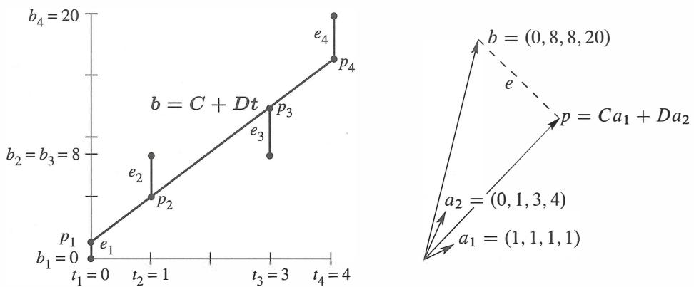

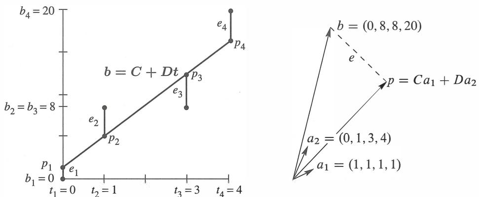

Hình 4.9: **Các bài tập 1-11:** Đường thẳng gần nhất $C + Dt$ khớp với $Ca_1 + Da_2$ trong $\mathbf{R}^4$

**1** Với $b = 0, 8, 8, 20$ tại $t = 0, 1, 3, 4$, thiết lập và giải các phương trình pháp tuyến $A^TA\hat{x} = A^Tb$. Đối với đường thẳng tốt nhất trong Hình 4.9a, tìm bốn độ cao $p_i$ và bốn sai số $e_i$ của nó. Giá trị cực tiểu $E = e_1^2 + e_2^2 + e_3^2 + e_4^2$ là bao nhiêu?
**2** (Đường thẳng $C + Dt$ thực sự đi qua các $p$) Với $b = 0, 8, 8, 20$ tại các thời điểm $t = 0, 1, 3, 4$, viết ra bốn phương trình $Ax = b$ (vô nghiệm). Đổi các phép đo thành $p = (1, 5, 13, 17)$ và tìm nghiệm chính xác cho $A\hat{x} = p$.
**3** Kiểm tra xem $e = b - p = (-1, 3, -5, 3)$ có vuông góc với cả hai cột của cùng một ma trận $A$ không. Khoảng cách ngắn nhất $\|e\|$ từ $b$ đến không gian cột của $A$ là bao nhiêu?
**4** (Bằng giải tích) Viết $E = \|Ax - b\|^2$ dưới dạng tổng của bốn bình phương - bình phương cuối cùng là $(C + 4D - 20)^2$. Tìm các phương trình đạo hàm $\partial E / \partial C = 0$ và $\partial E / \partial D = 0$. Chia cho $2$ để thu được các phương trình pháp tuyến $A^TA\hat{x} = A^Tb$.
**5** Tìm độ cao $C$ của *đường thẳng nằm ngang* tốt nhất để khớp $b = (0, 8, 8, 20)$. Một phép khớp chính xác sẽ giải các phương trình vô nghiệm $C = 0, C = 8, C = 8, C = 20$. Tìm ma trận $4 \times 1$ $A$ trong các phương trình này và giải $A^TA\hat{x} = A^Tb$. Vẽ đường ngang ở độ cao $\hat{x} = C$ và bốn sai số trong $e$.
**6** Chiếu $b = (0, 8, 8, 20)$ lên đường thẳng đi qua $a = (1, 1, 1, 1)$. Tìm $\hat{x} = a^Tb/a^Ta$ và phép chiếu $p = \hat{x}a$. Kiểm tra xem $e = b - p$ có vuông góc với $a$ không, và tìm khoảng cách ngắn nhất $\|e\|$ từ $b$ đến đường thẳng đi qua $a$.
**7** Tìm đường thẳng gần nhất $b = Dt$, *đi qua gốc tọa độ*, tới cùng bốn điểm đó. Một phép khớp chính xác sẽ giải $D \cdot 0 = 0, D \cdot 1 = 8, D \cdot 3 = 8, D \cdot 4 = 20$. Tìm ma trận $4 \times 1$ và giải $A^TA\hat{x} = A^Tb$. Vẽ lại Hình 4.9a cho thấy đường thẳng tốt nhất $b = Dt$ và các sai số $e$.
**8** Chiếu $b = (0, 8, 8, 20)$ lên đường thẳng đi qua $a = (0, 1, 3, 4)$. Tìm $\hat{x} = D$ và $p = \hat{x}a$. $C$ tốt nhất trong Bài tập 5-6 và $D$ tốt nhất trong Bài tập 7-8 *không* khớp với $(C, D)$ tốt nhất trong Bài tập 1-4. Đó là vì $(1, 1, 1, 1)$ và $(0, 1, 3, 4)$ là \_\_ trực giao.
**9** Đối với parabol gần nhất $b = C + Dt + Et^2$ tới cùng bốn điểm đó, hãy viết ra các phương trình vô nghiệm $Ax = b$ với ba ẩn $x = (C, D, E)$. Thiết lập ba phương trình pháp tuyến $A^TA\hat{x} = A^Tb$ (không yêu cầu nghiệm). Trong Hình 4.9a, bạn đang khớp một parabol với 4 điểm - điều gì đang xảy ra trong Hình 4.9b?
**10** Đối với đường cong bậc ba gần nhất $b = C + Dt + Et^2 + Ft^3$ tới cùng bốn điểm đó, hãy viết ra bốn phương trình $Ax = b$. Giải chúng bằng phép khử. Trong Hình 4.9a đường cong bậc ba này bây giờ đi qua chính xác các điểm. $p$ và $e$ là gì?
**11** Trung bình của bốn thời điểm là $\bar{t} = \frac{1}{4}(0 + 1 + 3 + 4) = 2$. Trung bình của bốn $b$ là $\bar{b} = \frac{1}{4}(0 + 8 + 8 + 20) = 9$.
(a) Xác minh rằng đường thẳng tốt nhất đi qua điểm trung tâm $(\bar{t}, \bar{b}) = (2, 9)$.
(b) Giải thích tại sao $C + D\bar{t} = \bar{b}$ lại xuất phát từ phương trình đầu tiên trong $A^TA\hat{x} = A^Tb$.

#### **Các câu hỏi 12-16 giới thiệu các ý tưởng cơ bản của thống kê - nền tảng cho bình phương tối thiểu.**

**12** (Được đề xuất) Bài toán này chiếu $b = (b_1, \dots, b_m)$ lên đường thẳng đi qua $a = (1, \dots, 1)$. Chúng ta giải $m$ phương trình $ax = b$ với 1 ẩn (bằng bình phương tối thiểu).
(a) Giải $a^Ta\hat{x} = a^Tb$ để chỉ ra rằng $\hat{x}$ là *trung bình cộng* (mean) của các $b$.
(b) Tìm $e = b - a\hat{x}$ và *phương sai (variance)* $\|e\|^2$ cùng *độ lệch chuẩn (standard deviation)* $\|e\|$.
(c) Đường thẳng nằm ngang $b = 3$ gần nhất với $b = (1, 2, 6)$. Kiểm tra xem $p = (3, 3, 3)$ có vuông góc với $e$ không và tìm ma trận chiếu $3 \times 3$ $P$.
**13** Giả định thứ nhất đằng sau bình phương tối thiểu: $Ax = b - (\text{nhiễu } e \text{ có trung bình bằng không})$. Nhân các vectơ sai số $e = b - Ax$ với $(A^TA)^{-1}A^T$ để được $\hat{x} - x$ ở bên phải. Các sai số ước lượng $\hat{x} - x$ cũng có trung bình bằng không. Ước lượng $\hat{x}$ là *không chệch (unbiased)*.
**14** Giả định thứ hai đằng sau bình phương tối thiểu: $m$ sai số $e_i$ là độc lập với phương sai $\sigma^2$, do đó giá trị trung bình của $(b - Ax)(b - Ax)^T$ là $\sigma^2I$. Nhân bên trái với $(A^TA)^{-1}A^T$ và bên phải với $A(A^TA)^{-1}$ để chỉ ra rằng ma trận trung bình của $(\hat{x} - x)(\hat{x} - x)^T$ là $\sigma^2(A^TA)^{-1}$. Đây là *ma trận hiệp phương sai (covariance matrix)* trong Phần 10.2.

**15** Một bác sĩ ghi lại 4 lần đo nhịp tim của bạn. Nghiệm tốt nhất cho $x = b_1, \dots, x = b_4$ là trung bình $\hat{x}$ của $b_1, \dots, b_4$. Ma trận $A$ là một cột các số 1. Bài tập 14 đưa ra kỳ vọng của sai số bình phương $(\hat{x} - x)^2$ là $\sigma^2(A^TA)^{-1} =$ \_\_. *Bằng cách lấy trung bình, phương sai giảm từ $\sigma^2$ xuống $\sigma^2/4$.*
**16** Nếu bạn biết trung bình $\hat{x}_9$ của 9 số $b_1, \dots, b_9$, làm thế nào bạn có thể nhanh chóng tìm ra trung bình $\hat{x}_{10}$ khi có thêm một số $b_{10}$? Ý tưởng của bình phương tối thiểu *đệ quy* là tránh cộng 10 số. Số nào nhân với $\hat{x}_9$ trong việc tính $\hat{x}_{10}$?

$$\hat{x}_{10} = \frac{1}{10}b_{10} + \dots \cdot \hat{x}_9 = \frac{1}{10}(b_1 + \dots + b_{10})$$
như trong Ví dụ Đã Giải 4.2 C.

Các câu hỏi 17-24 cung cấp thêm thực hành với $\hat{x}$ và $p$ và $e$.

**17** Viết ra ba phương trình để đường thẳng $b = C + Dt$ đi qua $b = 7$ tại $t = -1$, $b = 7$ tại $t = 1$, và $b = 21$ tại $t = 2$. Tìm nghiệm bình phương tối thiểu $\hat{x} = (C, D)$ và vẽ đường thẳng gần nhất.
**18** Tìm phép chiếu $p = A\hat{x}$ trong Bài tập 17. Điều này đưa ra ba độ cao của đường thẳng gần nhất. Chứng minh rằng vectơ sai số là $e = (2, -6, 4)$. Tại sao $Pe = \mathbf{0}$?
**19** Giả sử các phép đo tại $t = -1, 1, 2$ là các sai số $2, -6, 4$ trong Bài tập 18. Tính $\hat{x}$ và đường thẳng gần nhất tới các phép đo mới này. Giải thích câu trả lời: $b = (2, -6, 4)$ vuông góc với \_\_ do đó phép chiếu là $p = \mathbf{0}$.
**20** Giả sử các phép đo tại $t = -1, 1, 2$ là $b = (5, 13, 17)$. Tính $\hat{x}$ và đường thẳng gần nhất và $e$. Sai số là $e = \mathbf{0}$ bởi vì $b$ này là \_\_.
**21** Không gian con nào trong số bốn không gian con chứa vectơ sai số $e$? Không gian nào chứa $p$? Không gian nào chứa $\hat{x}$? Không gian không của $A$ là gì?
**22** Tìm đường thẳng tốt nhất $C + Dt$ để khớp $b = (4, 2, -1, 0, 0)$ tại các thời điểm $t = -2, -1, 0, 1, 2$.
**23** Vectơ sai số $e$ trực giao với $b$ hay $p$ hay $e$ hay $\hat{x}$? Chứng minh rằng $\|e\|^2$ bằng $e^Tb$ và bằng $b^Tb - p^Tb$. Đây là tổng sai số $E$ nhỏ nhất.
**24** Các đạo hàm riêng của $\|Ax\|^2$ theo $x_1, \dots, x_n$ lấp đầy vectơ $2A^TAx$. Các đạo hàm của $2b^TAx$ lấp đầy vectơ $2A^Tb$. Vậy các đạo hàm của $\|Ax - b\|^2$ bằng không khi \_\_.

### **Thử thách (Challenge Problems)**

**25** *Điều kiện nào đối với $(t_1, b_1), (t_2, b_2), (t_3, b_3)$ đặt ba điểm đó lên một đường thẳng?* Câu trả lời theo không gian cột là: $(b_1, b_2, b_3)$ phải là một tổ hợp của $(1, 1, 1)$ và $(t_1, t_2, t_3)$. Cố gắng đạt được một phương trình cụ thể kết nối các $t$ và các $b$. Lẽ ra tôi nên nghĩ đến câu hỏi này sớm hơn!

**26** Tìm *mặt phẳng* cung cấp phép khớp tốt nhất tới 4 giá trị $b = (0, 1, 3, 4)$ tại các góc $(1, 0)$ và $(0, 1)$ và $(-1, 0)$ và $(0, -1)$ của một hình vuông. Các phương trình $C + Dx + Ey = b$ tại 4 điểm đó là $Ax = b$ với 3 ẩn $x = (C, D, E)$. $A$ là gì? Tại tâm $(0, 0)$ của hình vuông, chỉ ra rằng $C + Dx + Ey = $ trung bình của các $b$.
**27** (Khoảng cách giữa các đường thẳng) Các điểm $P = (x, x, x)$ và $Q = (y, 3y, -1)$ nằm trên hai đường thẳng trong không gian không giao nhau. Chọn $x$ và $y$ để cực tiểu hóa bình phương khoảng cách $\|P - Q\|^2$. Đường thẳng nối $P$ và $Q$ gần nhất vuông góc với \_\_.
**28** Giả sử các cột của $A$ không độc lập. Làm thế nào bạn có thể tìm một ma trận $B$ sao cho $P = B(B^TB)^{-1}B^T$ thực sự cho ra phép chiếu lên không gian cột của $A$? (Công thức thông thường sẽ thất bại khi $A^TA$ không khả nghịch.)
**29** Thông thường sẽ có chính xác một siêu mặt phẳng (hyperplane) trong $\mathbf{R}^n$ chứa $n$ điểm đã cho $x = 0, a_1, \dots, a_{n-1}$. (Ví dụ cho $n = 3$: Sẽ có một mặt phẳng chứa $0, a_1, a_2$ trừ khi \_\_.) Tiêu chuẩn nào để có chính xác một mặt phẳng trong $\mathbf{R}^n$?
**30** Ví dụ 2 dịch chuyển các thời điểm $t_i$ để làm cho chúng cộng lại bằng không. Chúng ta trừ đi thời điểm trung bình $\bar{t} = (t_1 + \dots + t_m)/m$ để có $T_i = t_i - \bar{t}$. Các $T_i$ đó cộng lại bằng không. Với các cột $(1, \dots, 1)$ và $(T_1, \dots, T_m)$ bây giờ là trực giao, $A^TA$ là ma trận đường chéo. Các phần tử của nó là $m$ và $T_1^2 + \dots + T_m^2$. Chỉ ra rằng $C$ và $D$ tốt nhất có các công thức trực tiếp:

$$T \text{ là } t - \bar{t} \quad C = \frac{b_1 + \dots + b_m}{m} \quad \text{và} \quad D = \frac{b_1 T_1 + \dots + b_m T_m}{T_1^2 + \dots + T_m^2}.$$

*Đường thẳng tốt nhất là $C + DT$ hoặc $C + D(t - \bar{t})$.* Việc dịch chuyển thời gian để làm cho $A^TA$ thành ma trận đường chéo là một ví dụ của quá trình Gram-Schmidt: *trực giao hóa các cột của $A$ từ trước.*

# **4.4 Các Cơ Sở Trực Chuẩn và Gram-Schmidt (Orthonormal Bases and Gram-Schmidt)**

**1** Các cột $q_1, \dots, q_n$ là trực chuẩn nếu $q_i^Tq_j = \begin{cases} 0 & \text{khi } i \neq j \\ 1 & \text{khi } i = j \end{cases}$. Khi đó $Q^TQ = I$.
**2** Nếu $Q$ cũng là ma trận vuông, thì $QQ^T = I$ và $Q^T = Q^{-1}$. $Q$ là một "ma trận trực giao".
**3** Nghiệm bình phương tối thiểu cho $Qx = b$ là $\hat{x} = Q^Tb$. Phép chiếu của $b$: $p = QQ^Tb = Pb$.
**4** Quá trình **Gram-Schmidt** lấy các $a_i$ độc lập chuyển thành $q_i$ trực chuẩn. Bắt đầu với $q_1 = a_1 / \|a_1\|$.
**5** $q_i$ là $(a_i - \text{phép chiếu } p_i) / \|a_i - p_i\|$; phép chiếu $p_i = (a_i^Tq_1)q_1 + \dots + (a_i^Tq_{i-1})q_{i-1}$.
**6** Mỗi $a_i$ sẽ là một tổ hợp của $q_1$ đến $q_i$. Khi đó $A = QR$: $Q$ trực giao và $R$ tam giác.

Phần này có hai mục tiêu, **tại sao (why)** và **như thế nào (how)**. Mục tiêu đầu tiên là để thấy tại sao tính trực giao lại tốt. Các tích vô hướng bằng không, do đó $A^TA$ sẽ là đường chéo. Trở nên rất dễ dàng để tìm $\hat{x}$ và $p = A\hat{x}$. *Mục tiêu thứ hai là xây dựng các vectơ trực giao.* Bạn sẽ thấy cách Gram-Schmidt chọn các tổ hợp của các vectơ cơ sở ban đầu để tạo ra các góc vuông. Những vectơ ban đầu đó là các cột của $A$, có thể *không* trực giao. *Các vectơ cơ sở trực chuẩn sẽ là các cột của một ma trận mới $Q$.*

Từ Chương 3, một cơ sở bao gồm các vectơ độc lập sinh ra không gian. Các vectơ cơ sở có thể giao nhau ở bất kỳ góc nào (ngoại trừ $0^\circ$ và $180^\circ$). Nhưng mỗi khi chúng ta hình dung các trục, chúng đều vuông góc. *Trong trí tưởng tượng của chúng ta, các trục tọa độ gần như luôn luôn trực giao.* Điều này đơn giản hóa hình ảnh và nó làm đơn giản đáng kể các tính toán.

Các vectơ $q_1, \dots, q_n$ là *trực giao* khi các tích vô hướng $q_i^Tq_j$ của chúng bằng không. Cụ thể hơn $q_i^Tq_j = 0$ bất cứ khi nào $i \neq j$. Với một bước nữa - chỉ cần *chia mỗi vectơ cho độ dài của nó* - các vectơ trở thành *các vectơ đơn vị trực giao*. Độ dài của chúng đều bằng $1$ (chuẩn hóa - normal). Khi đó cơ sở được gọi là *trực chuẩn (orthonormal)*.

**ĐỊNH NGHĨA** Các vectơ $q_1, \dots, q_n$ là *trực chuẩn* nếu
$$q_i^T q_j = \begin{cases} 0 & \text{khi } i \neq j & (\text{các vectơ trực giao}) \\ 1 & \text{khi } i = j & (\text{các vectơ đơn vị: } \|q_i\| = 1) \end{cases}$$

Một ma trận có các cột trực chuẩn được gán chữ cái đặc biệt $Q$.

*Ma trận $Q$ rất dễ làm việc vì $Q^TQ = I$.* Điều này lặp lại bằng ngôn ngữ ma trận rằng các cột $q_1, \dots, q_n$ là trực chuẩn. $Q$ không bắt buộc phải là ma trận vuông.

*Một ma trận $Q$ có các cột trực chuẩn thỏa mãn $Q^TQ = I$:*

$$Q^T Q = \begin{bmatrix} - q_1^T - \\ - q_2^T - \\ \vdots \\ - q_n^T - \end{bmatrix} \begin{bmatrix} | & | & & | \\ q_1 & q_2 & \dots & q_n \\ | & | & & | \end{bmatrix} = \begin{bmatrix} 1 & 0 & \cdots & 0 \\ 0 & 1 & \cdots & 0 \\ \vdots & \vdots & \ddots & \vdots \\ 0 & 0 & \cdots & 1 \end{bmatrix} = I. \quad (1)$$

Khi hàng $i$ của $Q^T$ nhân với cột $j$ của $Q$, tích vô hướng là $q_i^Tq_j$. Ngoài đường chéo ($i \neq j$) tích vô hướng đó bằng không do tính trực giao. Trên đường chéo ($i = j$) các vectơ đơn vị cho ra $q_i^Tq_i = \|q_i\|^2 = 1$. Thông thường $Q$ là ma trận chữ nhật ($m > n$). Đôi khi $m = n$.

*Khi $Q$ là ma trận vuông, $Q^TQ = I$ có nghĩa là $Q^T = Q^{-1}$. - chuyển vị = nghịch đảo.*

Nếu các cột chỉ trực giao (không phải là các vectơ đơn vị), các tích vô hướng vẫn cho ra một ma trận đường chéo (không phải là ma trận đơn vị). Ma trận đường chéo này gần như tốt bằng $I$. Điều quan trọng là tính trực giao - khi đó sẽ dễ dàng tạo ra các vectơ đơn vị.

*Nhắc lại: $Q^TQ = I$ ngay cả khi $Q$ là ma trận chữ nhật.* Trong trường hợp đó $Q^T$ chỉ là nghịch đảo từ bên trái. Đối với các ma trận vuông, chúng ta cũng có $QQ^T = I$, do đó $Q^T$ là ma trận nghịch đảo hai phía của $Q$. Các hàng của một ma trận $Q$ vuông cũng trực chuẩn giống như các cột. *Nghịch đảo chính là chuyển vị.* Trong trường hợp vuông này, chúng ta gọi $Q$ là một *ma trận trực giao (orthogonal matrix)*.$^1$

Đây là ba ví dụ về các ma trận trực giao - phép quay và phép hoán vị và phép phản xạ. Cách thử nhanh nhất là kiểm tra $Q^TQ = I$.

**Ví dụ 1 (Phép quay - Rotation)** $Q$ quay mọi vectơ trong mặt phẳng một góc $\theta$:

$$Q = \begin{bmatrix} \cos \theta & -\sin \theta \\ \sin \theta & \cos \theta \end{bmatrix} \text{ và } Q^T = Q^{-1} = \begin{bmatrix} \cos \theta & \sin \theta \\ -\sin \theta & \cos \theta \end{bmatrix}.$$

Các cột của $Q$ là trực giao (lấy tích vô hướng của chúng). Chúng là các vectơ đơn vị bởi vì $\sin^2\theta + \cos^2\theta = 1$. Những cột đó tạo thành một *cơ sở trực chuẩn* cho mặt phẳng $\mathbf{R}^2$.

Các vectơ cơ sở tiêu chuẩn $i$ và $j$ được quay đi một góc $\theta$ (xem Hình 4.10a). $Q^{-1}$ quay các vectơ trở lại một góc $-\theta$. Nó đồng ý với $Q^T$, bởi vì cosin của $-\theta$ bằng cosin của $\theta$, và $\sin(-\theta) = -\sin\theta$. Chúng ta có $Q^TQ = I$ và $QQ^T = I$.

**Ví dụ 2 (Phép hoán vị - Permutation)** Các ma trận này thay đổi thứ tự thành $(y, z, x)$ và $(y, x)$:

$$\begin{bmatrix} 0 & 1 & 0 \\ 0 & 0 & 1 \\ 1 & 0 & 0 \end{bmatrix} \begin{bmatrix} x \\ y \\ z \end{bmatrix} = \begin{bmatrix} y \\ z \\ x \end{bmatrix} \quad \text{và} \quad \begin{bmatrix} 0 & 1 \\ 1 & 0 \end{bmatrix} \begin{bmatrix} x \\ y \end{bmatrix} = \begin{bmatrix} y \\ x \end{bmatrix}.$$

Tất cả các cột của những ma trận $Q$ này đều là các vectơ đơn vị (độ dài của chúng rõ ràng là $1$). Chúng cũng trực giao (các số $1$ xuất hiện ở những vị trí khác nhau). *Nghịch đảo của một ma trận hoán vị* chính là *chuyển vị của nó: $Q^{-1} = Q^T$*. Ma trận nghịch đảo đưa các thành phần trở lại thứ tự ban đầu của chúng:

$^1$ "Ma trận trực chuẩn" lẽ ra là một cái tên tốt hơn cho $Q$, nhưng nó không được sử dụng. Bất kỳ ma trận nào có các cột trực chuẩn đều có chữ cái $Q$. Nhưng chúng ta chỉ gọi nó là **ma trận trực giao (orthogonal matrix)** khi nó là ma trận vuông.

| Nghịch đảo = chuyển vị: | $\begin{bmatrix} 0 & 0 & 1 \\ 1 & 0 & 0 \\ 0 & 1 & 0 \end{bmatrix} \begin{bmatrix} y \\ z \\ x \end{bmatrix} = \begin{bmatrix} x \\ y \\ z \end{bmatrix}$ | và | $\begin{bmatrix} 0 & 1 \\ 1 & 0 \end{bmatrix} \begin{bmatrix} y \\ x \end{bmatrix} = \begin{bmatrix} x \\ y \end{bmatrix}$ |
|----------------------|-----------------------------------------------------------------------------------------|-----|----------------------------------------------------------------------------------------------------------------------------|

#### *Mọi ma trận hoán vị đều là một ma trận trực giao.*

**Ví dụ 3 (Phép phản xạ - Reflection)** Nếu $u$ là một vectơ đơn vị bất kỳ, đặt $Q = I - 2uu^T$. Lưu ý rằng $uu^T$ là một ma trận trong khi $u^Tu$ là một số $\|u\|^2 = 1$. Khi đó $Q^T$ và $Q^{-1}$ đều bằng $Q$:

| $Q^T = I - 2uu^T = Q$ | và | $Q^TQ = I - 4uu^T + 4uu^Tuu^T = I$ | (2) |
|-----------------------|-----|--------------------------------------|-----|

Các ma trận phản xạ $I - 2uu^T$ đối xứng và cũng trực giao. Nếu bạn bình phương chúng, bạn nhận được ma trận đơn vị: $Q^2 = Q^TQ = I$. Phản xạ hai lần qua gương sẽ mang lại bản gốc, giống như $(-1)^2 = 1$. Lưu ý $u^Tu = 1$ bên trong $4uu^Tuu^T$ ở phương trình (2).

Hình 4.10: Phép quay với $Q = \begin{bmatrix} \cos\theta & -\sin\theta \\ \sin\theta & \cos\theta \end{bmatrix}$ và phép phản xạ qua góc $45^\circ$ với $Q = \begin{bmatrix} 0 & 1 \\ 1 & 0 \end{bmatrix}$.

Làm ví dụ, chọn hướng $u = (-1/\sqrt{2}, 1/\sqrt{2})$. Tính $2uu^T$ (cột nhân với hàng) và trừ khỏi $I$ để có được ma trận phản xạ $Q$ theo hướng của $u$:

| Phản xạ | $Q = I - 2 \begin{bmatrix} .5 & -.5 \\ -.5 & .5 \end{bmatrix} = \begin{bmatrix} 0 & 1 \\ 1 & 0 \end{bmatrix}$ | và | $\begin{bmatrix} 0 & 1 \\ 1 & 0 \end{bmatrix} \begin{bmatrix} x \\ y \end{bmatrix} = \begin{bmatrix} y \\ x \end{bmatrix}$ |
|------------|---------------------------------------------------------------------------------------------------------------|-----|----------------------------------------------------------------------------------------------------------------------------|

Khi $(x, y)$ đi đến $(y, x)$, một vectơ như $(3, 3)$ không di chuyển. Nó nằm trên đường gương.

Các phép quay bảo toàn độ dài của mọi vectơ. Các phép phản xạ cũng vậy. Các phép hoán vị cũng vậy. Phép nhân với một ma trận trực giao $Q$ bất kỳ cũng vậy - *các độ dài và góc không thay đổi.*

**Chứng minh** $\|Qx\|^2$ bằng $\|x\|^2$ bởi vì $(Qx)^T(Qx) = x^TQ^TQx = x^TIx = x^Tx$.

# *Nếu $Q$ có các cột trực chuẩn ($Q^TQ = I$), nó giữ nguyên các độ dài:*

| Cùng độ dài đối với $Qx$ | $\|Qx\| = \|x\|$ đối với mọi vectơ $x$. | (3) |
|----------------------|-----------------------------------------|-----|

$Q$ cũng bảo toàn các tích vô hướng: $(Qx)^T(Qy) = x^TQ^TQy = x^Ty$. Chỉ cần sử dụng $Q^TQ = I$.

# **Phép Chiếu Sử Dụng Cơ Sở Trực Chuẩn (Projections Using Orthonormal Bases): $Q$ Thay Thế Cho $A$**

Các ma trận trực giao rất tuyệt vời cho các tính toán - các con số không bao giờ có thể trở nên quá lớn khi độ dài của các vectơ được cố định. Các mã máy tính ổn định sử dụng các $Q$ nhiều nhất có thể.

Đối với các phép chiếu lên các không gian con, tất cả các công thức đều liên quan đến $A^TA$. Các phần tử của $A^TA$ là các tích vô hướng $a_i^Ta_j$ của các vectơ cơ sở $a_1, \dots, a_n$.

**Giả sử các vectơ cơ sở thực sự là trực chuẩn.** *Các $a$ trở thành các $q$.* Khi đó $A^TA$ *đơn giản hóa thành $Q^TQ = I$.* Hãy nhìn vào những cải tiến ở $\hat{x}$ và $p$ và $P$. Thay vì $Q^TQ$, chúng ta để trống một khoảng trống cho ma trận đơn vị:

| — | $\hat{x} = Q^Tb$ | và | $p = Q\hat{x}$ | và | $P = QQ^T$. | (4) |
|---|-------------------|-----|-----------------|-----|-----------------------------|-----|

### *Nghiệm bình phương tối thiểu của $Qx = b$ là $\hat{x} = Q^Tb$. Ma trận chiếu là $P = QQ^T$.*

Không có ma trận nào để nghịch đảo. Đây là điểm mấu chốt của một cơ sở trực chuẩn. $\hat{x} = Q^Tb$ tốt nhất chỉ bao gồm các tích vô hướng của $q_1, \dots, q_n$ với $b$. Chúng ta có các phép chiếu $1$ chiều! "Ma trận cặp (coupling matrix)" hay "ma trận tương quan (correlation matrix)" $A^TA$ bây giờ là $Q^TQ = I$. Không có sự cặp đôi nào. Khi $A$ là $Q$, với các cột trực chuẩn, đây là $p = Q\hat{x} = QQ^Tb$:

$$p = \begin{bmatrix} | & & | \\ q_1 & \cdots & q_n \\ | & & | \end{bmatrix} \begin{bmatrix} q_1^T b \\ \vdots \\ q_n^T b \end{bmatrix} = q_1(q_1^T b) + \cdots + q_n(q_n^T b). \quad (5)$$

**Trường hợp quan trọng:** Khi $Q$ là ma trận vuông và $m = n$, không gian con là toàn bộ không gian. Khi đó $Q^T = Q^{-1}$ và $\hat{x} = Q^Tb$ cũng giống như $\hat{x} = Q^{-1}b$. Nghiệm là chính xác! Phép chiếu của $b$ lên toàn bộ không gian chính là $b$. Trong trường hợp này $p = b$ và $P = QQ^T = I$.

Bạn có thể nghĩ rằng phép chiếu lên toàn bộ không gian là không đáng nói đến. Nhưng khi $p = b$, công thức của chúng ta lắp ráp $b$ từ các phép chiếu $1$ chiều của nó. Nếu $q_1, \dots, q_n$ là một cơ sở trực chuẩn cho toàn bộ không gian, thì $Q$ là ma trận vuông. Mọi $b = QQ^Tb$ *đều là tổng của các thành phần của nó dọc theo các $q$:*

$$b = q_1(q_1^T b) + q_2(q_2^T b) + \cdots + q_n(q_n^T b). \quad (6)$$

**Biến đổi (Transforms)** $QQ^T = I$ là nền tảng của chuỗi Fourier và tất cả các "biến đổi" tuyệt vời của toán học ứng dụng. Chúng chia các vectơ $b$ hoặc các hàm $f(x)$ thành các phần vuông góc. Sau đó bằng cách cộng các phần tử lại theo phương trình (6), biến đổi ngược sẽ ghép $b$ và $f(x)$ trở lại với nhau.

**Ví dụ 4** Các cột của ma trận trực giao $Q$ này là các vectơ trực chuẩn $q_1, q_2, q_3$:

| $m = n = 3$ | $Q = \frac{1}{3} \begin{bmatrix} -1 & 2 & 2 \\ 2 & -1 & 2 \\ 2 & 2 & -1 \end{bmatrix}$ | có | $Q^TQ = QQ^T = I$. |
|-------------|----------------------------------------------------------------------------------------|-----|-----------------------|

Các phép chiếu riêng biệt của $b = (0, 0, 1)$ lên $q_1$ và $q_2$ và $q_3$ là $p_1$ và $p_2$ và $p_3$:

| $q_1(q_1^T b) = \frac{2}{3} q_1$ | và | $q_2(q_2^T b) = \frac{2}{3} q_2$ | và | $q_3(q_3^T b) = -\frac{1}{3} q_3$ |
|----------------------------------|-----|----------------------------------|-----|-----------------------------------|

Tổng của hai phần đầu là phép chiếu của $b$ lên *mặt phẳng* của $q_1$ và $q_2$. Tổng của cả ba là phép chiếu của $b$ lên *toàn bộ* không gian - chính là $p_1 + p_2 + p_3 = b$:

| **Khôi phục $b$** | $\frac{2}{3}q_1 + \frac{2}{3}q_2 - \frac{1}{3}q_3 = \frac{1}{9}$ | $\begin{bmatrix} -2 + 4 - 2 \\ 4 - 2 - 2 \\ 4 + 4 + 1 \end{bmatrix} = \begin{bmatrix} 0 \\ 0 \\ 1 \end{bmatrix} = b.$ |
|---------------------------------------------------|------------------------------------------------------------------|-----------------------------------------------------------------------------------------------------------------------|
| $b = p_1 + p_2 + p_3$                             |                                                                  |                                                                                                                       |

#### **Quá Trình Gram-Schmidt (The Gram-Schmidt Process)**

Điểm chính của phần này là "trực giao thì tốt". Các phép chiếu và bình phương tối thiểu luôn liên quan đến **$A^TA$**. Khi ma trận này trở thành **$Q^TQ = I$**, nghịch đảo không thành vấn đề. Các phép chiếu một chiều không bị ràng buộc (uncoupled). $\hat{x}$ tốt nhất là **$Q^Tb$** (chỉ là $n$ tích vô hướng riêng biệt). Để điều này đúng, chúng ta phải nói "*Nếu* các vectơ là trực chuẩn". *Bây giờ chúng ta sẽ giải thích "cách Gram-Schmidt" để tạo ra các vectơ trực chuẩn.*

Bắt đầu với ba vectơ độc lập $a, b, c$. Chúng ta dự định xây dựng ba vectơ trực giao $A, B, C$. Sau đó (ở bước cuối cùng có thể là dễ nhất), chúng ta chia $A, B, C$ cho độ dài của chúng. Việc đó tạo ra ba vectơ trực chuẩn $q_1 = A/\|A\|, q_2 = B/\|B\|, q_3 = C/\|C\|$.

**Gram-Schmidt** Bắt đầu bằng cách chọn $A = a$. Hướng đầu tiên này được chấp nhận nguyên bản. Hướng tiếp theo $B$ phải vuông góc với $A$. *Bắt đầu với $b$ và trừ đi phép chiếu của nó dọc theo $A$.* Điều này để lại phần vuông góc, đó là vectơ trực giao $B$:

| Bước Gram-Schmidt đầu tiên | $B = b - \frac{A^T b}{A^T A} A.$ | (7) |
|-------------------------|----------------------------------|-----|

$A$ và $B$ trực giao với nhau trong Hình 4.11. Nhân phương trình (7) với $A^T$ để xác minh rằng $A^TB = A^Tb - A^Tb = 0$. Vectơ $B$ này là thứ chúng ta gọi là vectơ sai số $e$, vuông góc với $A$. Chú ý rằng $B$ trong phương trình (7) không bằng không (nếu không $a$ và $b$ sẽ phụ thuộc). Các hướng $A$ và $B$ bây giờ đã được thiết lập.

Hướng thứ ba bắt đầu với $c$. Vectơ này không phải là tổ hợp của $A$ và $B$ (vì $c$ không phải là tổ hợp của $a$ và $b$). Nhưng nhiều khả năng $c$ không vuông góc với $A$ và $B$. Vậy hãy trừ đi các thành phần của nó theo hai hướng đó để có được một hướng vuông góc $C$:

| Bước Gram-Schmidt tiếp theo | $C = c - \frac{A^T c}{A^T A} A - \frac{B^T c}{B^T B} B.$ | (8) |
|------------------------|----------------------------------------------------------|-----|

Đây là ý tưởng duy nhất của quá trình Gram-Schmidt. *Trừ khỏi mọi vectơ mới các phép chiếu của nó theo các hướng đã được thiết lập.* Ý tưởng đó được lặp lại ở mọi bước.$^2$ Nếu chúng ta có vectơ thứ tư $d$, chúng ta sẽ trừ đi ba phép chiếu lên $A, B, C$ để có được $D$.

$^2$ Tôi nghĩ Gram đã có ý tưởng này. Tôi không thực sự biết Schmidt đóng vai trò gì.

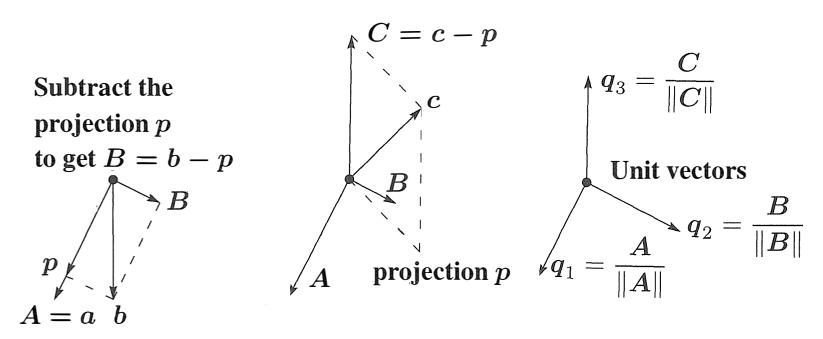

Hình 4.11: Đầu tiên chiếu $b$ lên đường thẳng đi qua $a$ và tìm $B$ trực giao dưới dạng $b - p$. Sau đó chiếu $c$ lên mặt phẳng $AB$ và tìm $C$ dưới dạng $c - p$. Chia cho $\|A\|, \|B\|, \|C\|$.

Cuối cùng, *hoặc ngay lập tức khi tìm thấy mỗi cái*, chia các vectơ trực giao $A, B, C, D$ cho độ dài của chúng. Các vectơ kết quả $q_1, q_2, q_3, q_4$ là trực chuẩn.

**Ví dụ về Gram-Schmidt** Giả sử các vectơ không trực giao độc lập $a, b, c$ là

| $a = \begin{bmatrix} 1 \\ -1 \\ 0 \end{bmatrix}$ | và | $b = \begin{bmatrix} 2 \\ 0 \\ -2 \end{bmatrix}$ | và | $c = \begin{bmatrix} 3 \\ -3 \\ 3 \end{bmatrix}$ |
|--------------------------------------------------|-----|--------------------------------------------------|-----|--------------------------------------------------|

Khi đó $A = a$ có $A^TA = 2$ và $A^Tb = 2$. Trừ khỏi $b$ phép chiếu $p$ của nó dọc theo $A$:

| Bước đầu tiên | $B = b - \frac{A^T b}{A^T A} A = b - \frac{2}{2} A = \begin{bmatrix} 1 \\ 1 \\ -2 \end{bmatrix}$ |
|------------|--------------------------------------------------------------------------------------------------|

Kiểm tra: $A^TB = 0$ như yêu cầu. Bây giờ trừ các phép chiếu của $c$ lên $A$ và $B$ để có được $C$:

| Bước tiếp theo | $C = c - \frac{A^T c}{A^T A} A - \frac{B^T c}{B^T B} B = c - \frac{6}{2} A + \frac{6}{6} B = \begin{bmatrix} 1 \\ 1 \\ 1 \end{bmatrix}$ |
|-----------|-----------------------------------------------------------------------------------------------------------------------------------------|

Kiểm tra: $C = (1, 1, 1)$ vuông góc với cả $A$ và $B$. Cuối cùng chuyển $A, B, C$ thành các vectơ đơn vị (độ dài 1, trực chuẩn). Độ dài của $A, B, C$ là $\sqrt{2}$ và $\sqrt{6}$ và $\sqrt{3}$. Chia cho các độ dài đó, ta được một cơ sở trực chuẩn:

$$q_1 = \frac{1}{\sqrt{2}} \begin{bmatrix} 1 \\ -1 \\ 0 \end{bmatrix} \quad \text{và} \quad q_2 = \frac{1}{\sqrt{6}} \begin{bmatrix} 1 \\ 1 \\ -2 \end{bmatrix} \quad \text{và} \quad q_3 = \frac{1}{\sqrt{3}} \begin{bmatrix} 1 \\ 1 \\ 1 \end{bmatrix}.$$

$q_1, q_2, q_3$ chứa các căn bậc hai.

### **Phân tích $A = QR$ (The Factorization $A = QR$)**

Chúng ta bắt đầu với một ma trận $A$, có các cột là $a, b, c$. Chúng ta kết thúc với một ma trận $Q$, có các cột là $q_1, q_2, q_3$. Các ma trận đó liên hệ với nhau như thế nào? Vì các vectơ $a, b, c$ là tổ hợp của các $q$ (và ngược lại), nên phải có một ma trận thứ ba kết nối $A$ với $Q$. Ma trận thứ ba này là ma trận tam giác $R$ trong $A = QR$.

Bước đầu tiên là $q_1 = a/\|a\|$ (không liên quan đến các vectơ khác). Bước thứ hai là phương trình (7), trong đó $b$ là tổ hợp của $A$ và $B$. Tại giai đoạn đó $C$ và $q_3$ chưa liên quan. Việc không liên quan của các vectơ sau này là điểm then chốt của Gram-Schmidt:

- Các vectơ $a$ và $A$ và $q_1$ đều nằm trên một đường thẳng duy nhất.
- Các vectơ $a, b$ và $A, B$ và $q_1, q_2$ đều nằm trong cùng một mặt phẳng.
- Các vectơ $a, b, c$ và $A, B, C$ và $q_1, q_2, q_3$ đều nằm trong một không gian con (chiều bằng 3).

Ở mỗi bước, $a_1, \dots, a_k$ là tổ hợp của $q_1, \dots, q_k$. Các $q$ sau này không liên quan. Ma trận kết nối $R$ là *ma trận tam giác (triangular)*, và chúng ta có $A = QR$:

$$\begin{bmatrix} a & b & c \end{bmatrix} = \begin{bmatrix} q_1 & q_2 & q_3 \end{bmatrix} \begin{bmatrix} q_1^T a & q_1^T b & q_1^T c \\ 0 & q_2^T b & q_2^T c \\ 0 & 0 & q_3^T c \end{bmatrix} \quad \text{hay} \quad A = QR. \quad (9)$$

$A = QR$ là tóm tắt của quá trình Gram-Schmidt. Nhân với $Q^T$ để nhận ra $R = Q^TA$ ở trên.

**(Gram-Schmidt)** Từ các vectơ độc lập $a_1, \dots, a_n$, Gram-Schmidt xây dựng các vectơ trực chuẩn $q_1, \dots, q_n$. Các ma trận với các cột này thỏa mãn $A = QR$. Khi đó $R = Q^TA$ là *ma trận tam giác trên* vì các $q$ sau này trực giao với các $a$ trước đó.

Dưới đây là các $a$ ban đầu và các $q$ cuối cùng từ ví dụ. Phần tử ở vị trí $i, j$ của $R = Q^TA$ là hàng $i$ của $Q^T$ nhân với cột $j$ của $A$. Các tích vô hướng $q_i^Ta_j$ đi vào $R$. **Khi đó $A = QR$:**

$$A = \begin{bmatrix} 1 & 2 & 3 \\ -1 & 0 & -3 \\ 0 & -2 & 3 \end{bmatrix} = \begin{bmatrix} 1/\sqrt{2} & 1/\sqrt{6} & 1/\sqrt{3} \\ -1/\sqrt{2} & 1/\sqrt{6} & 1/\sqrt{3} \\ 0 & -2/\sqrt{6} & 1/\sqrt{3} \end{bmatrix} \begin{bmatrix} \sqrt{2} & \sqrt{2} & \sqrt{18} \\ 0 & \sqrt{6} & -\sqrt{6} \\ 0 & 0 & \sqrt{3} \end{bmatrix} = QR.$$

Hãy nhìn kỹ vào $Q$ và $R$. Độ dài của $A, B, C$ là $\sqrt{2}, \sqrt{6}, \sqrt{3}$ trên đường chéo của $R$. Các cột của $Q$ là trực chuẩn. Do có căn bậc hai, $QR$ có vẻ khó hơn $LU$. Cả hai quá trình phân tích đều tuyệt đối đóng vai trò trung tâm đối với các tính toán trong đại số tuyến tính.

Mọi ma trận $m \times n$ $A$ có các cột độc lập đều có thể được phân tích thành $A = QR$. Ma trận $m \times n$ $Q$ có các cột trực chuẩn, và ma trận vuông $R$ là ma trận tam giác trên có đường chéo dương. Chúng ta không được quên tại sao điều này lại hữu ích cho bình phương tối thiểu: $A^TA = (QR)^TQR = R^TQ^TQR = R^TR$. Phương trình bình phương tối thiểu $A^TA\hat{x} = A^Tb$ đơn giản hóa thành $R^TR\hat{x} = R^TQ^Tb$. Cuối cùng chúng ta đạt tới $R\hat{x} = Q^Tb$: rất tốt.

| Bình phương tối thiểu | $R^T \hat{x} = R^T Q^T b$ | hay | $\hat{x} = Q^T b$ | hay | $\hat{x} = R^{-1} Q^T b$ | (10) |
|---------------|------------------------------------|----|----------------------------|----|-----------------------------------|------|

Thay vì giải $Ax = b$, điều đó là bất khả thi, chúng ta giải $R\hat{x} = Q^Tb$ bằng thế ngược - điều này rất nhanh. Chi phí thực sự nằm ở $mn^2$ phép nhân trong quá trình Gram-Schmidt, cần thiết để xây dựng ma trận trực giao $Q$ và ma trận tam giác $R$ với $A = QR$.

Dưới đây là một đoạn mã (code) không chính thức. Nó thực thi các phương trình (11) cho $j = 1$ sau đó $j = 2$ và cuối cùng $j = n$. Các dòng 4-5 quan trọng trừ khỏi $v = a_j$ các phép chiếu của nó lên từng $q_i$, $i < j$. Dòng cuối cùng của đoạn mã đó chuẩn hóa $v$ (chia cho $r_{jj} = \|v\|$) để thu được vectơ đơn vị $q_j$:

$$r_{ij} = \sum_{k=1}^m q_{ki} v_{kj} \quad \text{và} \quad v_{kj} = v_{kj} - q_{ki} r_{ij} \quad \text{và} \quad r_{jj} = \left( \sum_{k=1}^m v_{kj}^2 \right)^{1/2} \quad \text{và} \quad q_{kj} = \frac{v_{kj}}{r_{jj}}. \quad (11)$$

Bắt đầu từ $a, b, c = a_1, a_2, a_3$ đoạn mã này sẽ xây dựng $q_1$, sau đó là $B, q_2$, rồi đến $C, q_3$:

| $q_1 = a_1/\|a_1\|$          | $B = a_2 - (q_1^T a_2)q_1$ | $q_2 = B/\|B\|$ |
|------------------------------|----------------------------|-----------------|
| $C^* = a_3 - (q_1^T a_3)q_1$ | $C = C^* - (q_2^T C^*)q_2$ | $q_3 = C/\|C\|$ |

Phương trình (11) trừ đi **từng phép chiếu một** như trong $C^*$ và $C$. Thay đổi đó được gọi là *Gram-Schmidt sửa đổi (modified Gram-Schmidt)*. Đoạn mã này ổn định hơn về mặt số học so với phương trình (8) trong đó trừ đi tất cả các phép chiếu cùng một lúc.

| cho $j = 1:n$                | % **modified Gram-Schmidt**                             |
|------------------------------|------------------------------------------------------------|
| $v = A(:, j);$               | % $v$ bắt đầu là cột $j$ của $A$ ban đầu             |
| cho $i = 1:j-1$              | % các cột $q_1$ đến $q_{j-1}$ đã được thiết lập trong $Q$    |
| $R(i, j) = Q(:, i)' * v;$    | % tính $R_{ij} = q_i^T a_j$ đó là $q_i^T v$          |
| $v = v - R(i, j) * Q(:, i);$ | % **trừ đi phép chiếu** $(q_i^T v)q_i$       |
| kết thúc                     | % $v$ bây giờ vuông góc với tất cả $q_1, \dots, q_{j-1}$ |
| $R(j, j) = \text{norm}(v);$  | % các phần tử trên đường chéo $R_{jj}$ là các độ dài                |
| $Q(:, j) = v / R(j, j);$     | % chia $v$ cho độ dài của nó để lấy $q_j$ tiếp theo           |
| kết thúc                     | % "vòng lặp cho $j = 1:n$" tạo ra tất cả các $q_j$       |

Để khôi phục cột $j$ của $A$, hãy đảo ngược bước cuối cùng và các bước ở giữa của đoạn mã:

$$R(j, j)q_j = (\text{vectơ } v \text{ trừ đi các phép chiếu của nó}) = (\text{cột } j \text{ của } A) - \sum_{i=1}^{j-1} R(i, j)q_i. \quad (12)$$

*Thú nhận* Phần mềm tốt như LAPACK, được sử dụng trong các hệ thống tốt như MATLAB và Julia và Python, sẽ không sử dụng đoạn mã Gram-Schmidt này. Hiện nay có một cách tốt hơn. Các "phản xạ Householder" tác động lên $A$ để tạo ra ma trận tam giác trên $R$. Điều này xảy ra theo từng cột một giống như cách phép khử tạo ra ma trận tam giác trên $U$ trong $LU$.

Các ma trận phản xạ $I - 2uu^T$ đó sẽ được mô tả trong Chương 11 về đại số tuyến tính số. Nếu $A$ là ma trận ba đường chéo (tridiagonal) chúng ta có thể đơn giản hóa nhiều hơn nữa để sử dụng các phép quay $2 \times 2$. Kết quả luôn là $A = QR$ và lệnh MATLAB để trực giao hóa $A$ là `[Q, R] = qr(A)`. Tôi tin rằng Gram-Schmidt vẫn là một quá trình tốt để hiểu, ngay cả khi các phép phản xạ hay phép quay dẫn đến một $Q$ hoàn hảo hơn.

#### **• ÔN TẬP CÁC Ý TƯỞNG CHÍNH •**

**1.** Nếu các vectơ trực chuẩn $q_1, \dots, q_n$ là các cột của $Q$, thì $q_i^Tq_j = 0$ và $q_i^Tq_i = 1$ chuyển thành phép nhân ma trận $Q^TQ = I$.

**2.** Nếu $Q$ là ma trận vuông (một *ma trận trực giao - orthogonal matrix*) thì $Q^T = Q^{-1}$: *chuyển vị = nghịch đảo*.
**3.** Độ dài của $Qx$ bằng độ dài của $x$: $\|Qx\| = \|x\|$.
**4.** Phép chiếu lên không gian cột của $Q$ được sinh bởi các $q$ là $P = QQ^T$.
**5.** Nếu $Q$ là ma trận vuông thì $P = QQ^T = I$ và mọi $b = q_1(q_1^T b) + \dots + q_n(q_n^T b)$.
**6.** Gram-Schmidt tạo ra các vectơ trực chuẩn $q_1, q_2, q_3$ từ $a, b, c$ độc lập. Dưới dạng ma trận, đây là phép phân tích $A = QR =$ (ma trận trực giao $Q$) $\times$ (ma trận tam giác $R$).

#### **• CÁC VÍ DỤ ĐÃ GIẢI (WORKED EXAMPLES) •**

**4.4 A** Thêm hai cột nữa với tất cả các phần tử là $1$ hoặc $-1$, sao cho các cột của "ma trận Hadamard" $4 \times 4$ này trực giao. Làm thế nào bạn biến $H_4$ thành một *ma trận trực giao $Q$?*

Ma trận khối $H_8 = \left[\begin{smallmatrix} H_4 & H_4 \\ H_4 & -H_4 \end{smallmatrix}\right]$ là ma trận Hadamard tiếp theo với các số $1$ và $-1$. Tích $H_8^T H_8$ là gì?

$$H_2 = \begin{bmatrix} 1 & 1 \\ 1 & -1 \end{bmatrix} \quad H_4 = \begin{bmatrix} 1 & 1 & x & x \\ 1 & -1 & x & x \\ 1 & 1 & x & x \\ 1 & -1 & x & x \end{bmatrix} \quad \text{và} \quad Q_4 = \begin{bmatrix} x & x \\ x & x \\ x & x \\ x & x \end{bmatrix}$$

Phép chiếu của $b = (6, 0, 0, 2)$ lên cột đầu tiên của $H_4$ là $p_1 = (2, 2, 2, 2)$. Phép chiếu lên cột thứ hai là $p_2 = (1, -1, 1, -1)$. Phép chiếu $p_{12}$ của $b$ lên không gian $2$ chiều sinh bởi hai cột đầu tiên là gì?

**Giải** $H_4$ có thể được xây dựng từ $H_2$ giống như cách $H_8$ được xây dựng từ $H_4$:

$$H_4 = \begin{bmatrix} H_2 & H_2 \\ H_2 & -H_2 \end{bmatrix} = \begin{bmatrix} 1 & 1 & 1 & 1 \\ 1 & -1 & 1 & -1 \\ 1 & 1 & -1 & -1 \\ 1 & -1 & -1 & 1 \end{bmatrix} \text{ có các cột trực giao.}$$

Khi đó $Q = H_4 / 2$ có các cột trực chuẩn. Chia cho $2$ sẽ cho ta các vectơ đơn vị trong $Q$. Một ma trận Hadamard $5 \times 5$ là bất khả thi vì tích vô hướng của các cột sẽ có năm số $1$ và/hoặc $-1$ và không thể cộng lại bằng không. $H_8$ có các cột trực giao độ dài $\sqrt{8}$.

$$H_8^T H_8 = \begin{bmatrix} H_4^T & H_4^T \\ H_4^T & -H_4^T \end{bmatrix} \begin{bmatrix} H_4 & H_4 \\ H_4 & -H_4 \end{bmatrix} = \begin{bmatrix} 2H_4^T H_4 & 0 \\ 0 & 2H_4^T H_4 \end{bmatrix} = \begin{bmatrix} 8I & 0 \\ 0 & 8I \end{bmatrix}, \quad Q_8 = \frac{H_8}{\sqrt{8}}$$

**4.4 B Điểm then chốt của các cột trực giao là gì?** Trả lời: $A^TA$ là ma trận đường chéo và dễ dàng nghịch đảo. **Chúng ta có thể chiếu lên các đường thẳng và chỉ cần cộng lại.** Các trục là trực giao.

**Cộng các phép chiếu $p$:** Phép chiếu $p_{12}$ lên một mặt phẳng bằng phép chiếu $p_1 + p_2$ lên các đường thẳng trực giao.

### **Bài Tập 4.4 (Problem Set 4.4)**

**Các bài tập 1-12 về các vectơ trực giao và các ma trận trực giao.**

**1** Các cặp vectơ này là trực chuẩn hay chỉ trực giao hay chỉ độc lập?

| (a) | $\begin{bmatrix} 1 \\ 0 \end{bmatrix}$ và $\begin{bmatrix} -1 \\ 1 \end{bmatrix}$ | (b) | $\begin{bmatrix} .6 \\ .8 \end{bmatrix}$ và $\begin{bmatrix} .4 \\ -.3 \end{bmatrix}$ | (c) | $\begin{bmatrix} \cos \theta \\ \sin \theta \end{bmatrix}$ và $\begin{bmatrix} -\sin \theta \\ \cos \theta \end{bmatrix}$ |
|-----|------------------------------------------------------------------------------------|-----|----------------------------------------------------------------------------------------|-----|----------------------------------------------------------------------------------------------------------------------------|

Thay đổi vectơ thứ hai khi cần thiết để tạo ra các vectơ trực chuẩn.

**2** Các vectơ $(2, 2, -1)$ và $(-1, 2, 2)$ là trực giao. Chia chúng cho độ dài của chúng để tìm các vectơ trực chuẩn $q_1$ và $q_2$. Đưa chúng vào các cột của $Q$ và nhân $Q^TQ$ và $QQ^T$.
**3** (a) Nếu $A$ có ba cột trực giao, mỗi cột có độ dài 4, thì $A^TA$ là gì?
(b) Nếu $A$ có ba cột trực giao với độ dài 1, 2, 3, thì $A^TA$ là gì?
**4** Đưa ra một ví dụ cho mỗi trường hợp sau:
(a) Một ma trận $Q$ có các cột trực chuẩn nhưng $QQ^T \neq I$.
(b) Hai vectơ trực giao nhưng không độc lập tuyến tính.
(c) Một cơ sở trực chuẩn cho $\mathbf{R}^3$, bao gồm vectơ $q_1 = (1, 1, 1)/\sqrt{3}$.
**5** Tìm hai vectơ trực giao trong mặt phẳng $x + y + 2z = 0$. Chuyển chúng thành trực chuẩn.
**6** Nếu $Q_1$ và $Q_2$ là các ma trận trực giao, chứng minh rằng tích của chúng $Q_1Q_2$ cũng là một ma trận trực giao. (Sử dụng $Q^TQ = I$.)

**7** Nếu $Q$ có các cột trực chuẩn, nghiệm bình phương tối thiểu $\hat{x}$ của $Qx = b$ là gì?
**8** Nếu $q_1$ và $q_2$ là các vectơ trực chuẩn trong $\mathbf{R}^n$, tổ hợp nào \_\_ $q_1$ + \_\_ $q_2$ là gần nhất với một vectơ $b$ cho trước?
**9** (a) Tính $P = QQ^T$ khi $q_1 = (.8, .6, 0)$ và $q_2 = (-.6, .8, 0)$. Xác minh rằng $P^2 = P$.
(b) Chứng minh rằng $(QQ^T)^2 = QQ^T$ luôn đúng bằng cách sử dụng $Q^TQ = I$. Khi đó $P = QQ^T$ là ma trận chiếu lên không gian cột của $Q$.
**10** Các vectơ trực chuẩn thì tự động độc lập tuyến tính.
(a) Chứng minh theo vectơ: Khi $c_1 q_1 + c_2 q_2 + c_3 q_3 = \mathbf{0}$, tích vô hướng nào dẫn đến $c_1 = 0$? Tương tự $c_2 = 0$ và $c_3 = 0$. Vậy các $q$ là độc lập.
(b) Chứng minh theo ma trận: Chứng minh rằng $Qx = \mathbf{0}$ dẫn đến $x = \mathbf{0}$. Vì $Q$ có thể là ma trận chữ nhật, bạn có thể sử dụng $Q^T$ nhưng không được dùng $Q^{-1}$.
**11** (a) Gram-Schmidt: Tìm các vectơ trực chuẩn $q_1$ và $q_2$ trong mặt phẳng sinh bởi $a = (1, 3, 4, 5, 7)$ và $b = (-6, 6, 8, 0, 8)$.
(b) Vectơ nào trong mặt phẳng này gần nhất với $(1, 0, 0, 0, 0)$?
**12** Nếu $a_1, a_2, a_3$ là một cơ sở cho $\mathbf{R}^3$, mọi vectơ $b$ có thể được viết thành:

| $b = x_1a_1 + x_2a_2 + x_3a_3$ | hay | $\begin{bmatrix} a_1 & a_2 & a_3 \end{bmatrix}$ | $\begin{bmatrix} x_1 \\ x_2 \\ x_3 \end{bmatrix} = b$ |
|--------------------------------|----|-------------------------------------------------|-------------------------------------------------------|

(a) Giả sử các $a$ là trực chuẩn. Chứng minh rằng $x_1 = a_1^T b$.
(b) Giả sử các $a$ là trực giao. Chứng minh rằng $x_1 = a_1^Tb/a_1^Ta_1$.
(c) Nếu các $a$ độc lập, $x_1$ là thành phần đầu tiên của \_\_ nhân với $b$.

**Các bài tập 13-25 về quá trình Gram-Schmidt và $A = QR$.**

**13** Bội số nào của $a = \left[\begin{smallmatrix} 1 \\ 1 \end{smallmatrix}\right]$ nên được trừ khỏi $b = \left[\begin{smallmatrix} 4 \\ 0 \end{smallmatrix}\right]$ để kết quả $B$ vuông góc với $a$? Vẽ một hình để chỉ ra $a, b,$ và $B$.
**14** Hoàn thành quá trình Gram-Schmidt trong Bài tập 13 bằng cách tính $q_1 = a/\|a\|$ và $q_2 = B/\|B\|$ và phân tích thành $QR$:

$$\begin{bmatrix} 1 & 4 \\ 1 & 0 \end{bmatrix} = \begin{bmatrix} q_1 & q_2 \end{bmatrix} \begin{bmatrix} \|a\| & ? \\ 0 & \|B\| \end{bmatrix}$$

**15** (a) Tìm các vectơ trực chuẩn $q_1, q_2, q_3$ sao cho $q_1, q_2$ sinh không gian cột của

$$A = \begin{bmatrix} 1 & 1 \\ 2 & -1 \\ -2 & 4 \end{bmatrix}.$$

(b) Không gian con nào trong bốn không gian con cơ bản chứa $q_3$?
(c) Giải $Ax = (1, 2, 7)$ bằng bình phương tối thiểu.

**16** Bội số nào của $a = (4, 5, 2, 2)$ là gần nhất với $b = (1, 2, 0, 0)$? Tìm các vectơ trực chuẩn $q_1$ và $q_2$ trong mặt phẳng của $a$ và $b$.

**17** Tìm phép chiếu của $b$ lên đường thẳng đi qua $a$:

$$a = \begin{bmatrix} 1 \\ 1 \\ 1 \end{bmatrix} \quad \text{và} \quad b = \begin{bmatrix} 1 \\ 3 \\ 5 \end{bmatrix} \quad \text{và} \quad p = ? \quad \text{và} \quad e = b - p = ?$$

Tính các vectơ trực chuẩn $q_1 = a/\|a\|$ và $q_2 = e/\|e\|$.

**18** (Được đề xuất) Tìm các vectơ trực giao $A, B, C$ bằng Gram-Schmidt từ $a, b, c$:

$$a = (1, -1, 0, 0) \quad b = (0, 1, -1, 0) \quad c = (0, 0, 1, -1).$$

$A, B, C$ và $a, b, c$ là các cơ sở cho các vectơ vuông góc với $d = (1, 1, 1, 1)$.

**19** Nếu $A = QR$ thì $A^TA = R^TR =$ ma trận tam giác \_\_\_\_\_ nhân với ma trận tam giác \_\_\_\_\_. *Gram-Schmidt trên $A$ tương ứng với phép khử trên $A^TA$.* Các phần tử chốt (pivots) cho $A^TA$ phải là bình phương các phần tử trên đường chéo của $R$. Tìm $Q$ và $R$ bằng Gram-Schmidt cho $A$ này:

$$A = \begin{bmatrix} -1 & 1 \\ 2 & 1 \\ 2 & 4 \end{bmatrix} \quad \text{và} \quad A^TA = \begin{bmatrix} 9 & 9 \\ 9 & 18 \end{bmatrix} = \begin{bmatrix} 1 & 0 \\ 1 & 1 \end{bmatrix} \begin{bmatrix} 9 & 0 \\ 0 & 9 \end{bmatrix} \begin{bmatrix} 1 & 1 \\ 0 & 1 \end{bmatrix}.$$

**20** Đúng hay sai (đưa ra ví dụ trong cả hai trường hợp):
(a) $Q^{-1}$ là một ma trận trực giao khi $Q$ là một ma trận trực giao.
(b) Nếu $Q$ ($3 \times 2$) có các cột trực chuẩn thì $\|Qx\|$ luôn bằng $\|x\|$.

**21** Tìm một cơ sở trực chuẩn cho không gian cột của $A$:

$$A = \begin{bmatrix} 1 & -2 \\ 1 & 0 \\ 1 & 1 \\ 1 & 3 \end{bmatrix} \quad \text{và} \quad b = \begin{bmatrix} -4 \\ -3 \\ 3 \\ 0 \end{bmatrix}.$$

**22** Tìm các vectơ trực giao $A, B, C$ bằng Gram-Schmidt từ

| $a = \begin{bmatrix} 1 \\ 1 \\ 2 \end{bmatrix}$ | và | $b = \begin{bmatrix} 1 \\ -1 \\ 0 \end{bmatrix}$ | và | $c = \begin{bmatrix} 1 \\ 0 \\ 4 \end{bmatrix}$ |
|-------------------------------------------------|-----|--------------------------------------------------|-----|-------------------------------------------------|

**23** Tìm $q_1, q_2, q_3$ (trực chuẩn) dưới dạng các tổ hợp của $a, b, c$ (các cột độc lập). Sau đó viết $A$ thành $QR$:

$$A = \begin{bmatrix} 1 & 2 & 4 \\ 0 & 0 & 5 \\ 0 & 3 & 6 \end{bmatrix}$$

**24** (a) Tìm một cơ sở cho không gian con $S$ trong $\mathbf{R}^4$ sinh bởi tất cả các nghiệm của
$$x_1 + x_2 + x_3 - x_4 = 0.$$
(b) Tìm một cơ sở cho phần bù trực giao $S^\perp$.
(c) Tìm $b_1$ trong $S$ và $b_2$ trong $S^\perp$ sao cho $b_1 + b_2 = b = (1, 1, 1, 1)$.

**25** **Nếu** $ad - bc > 0$, các phần tử trong $A = QR$ là

$$\begin{bmatrix} a & b \\ c & d \end{bmatrix} = \frac{\begin{bmatrix} a & -c \\ c & a \end{bmatrix} \begin{bmatrix} a^2 + c^2 & ab + cd \\ 0 & ad - bc \end{bmatrix}}{\sqrt{a^2 + c^2}}.$$

Viết $A = QR$ khi $a, b, c, d = 2, 1, 1, 1$ và cũng cho $1, 1, 1, 1$. Phần tử nào của $R$ trở thành không khi các cột phụ thuộc và Gram-Schmidt bị phá vỡ?

### Các bài tập **26-29** sử dụng mã $QR$ trong phương trình (11). **Nó** thực thi Gram-Schmidt.

**26** Chỉ ra lý do tại sao $C$ (tìm thấy qua $C^*$ trong các bước sau (11)) lại bằng với $C$ trong phương trình (8).
**27** Phương trình (8) trừ khỏi $c$ các thành phần của nó dọc theo $A$ và $B$. Tại sao không trừ các thành phần dọc theo $a$ và dọc theo $b$?
**28** Đâu là $mn^2$ phép nhân trong phương trình (11)?
**29** Áp dụng mã `qr` của MATLAB cho $a = (2, 2, -1), b = (0, -3, 3), c = (1, 0, 0)$. Các $q$ là gì?

#### Các bài tập **30-35** liên quan đến các ma trận trực giao **có** tính chất đặc biệt.

**30** Bốn *wavelet (sóng nhỏ)* đầu tiên nằm trong các cột của ma trận wavelet $W$ này:

$$W = \frac{1}{2} \begin{bmatrix} 1 & 1 & \sqrt{2} & 0 \\ 1 & 1 & -\sqrt{2} & 0 \\ 1 & -1 & 0 & \sqrt{2} \\ 1 & -1 & 0 & -\sqrt{2} \end{bmatrix}.$$

**31** (a) Chọn $c$ sao cho $Q$ là một ma trận trực giao:

$$Q = c \begin{bmatrix} 1 & -1 & -1 & -1 \\ -1 & 1 & -1 & 1 \\ -1 & -1 & 1 & -1 \\ -1 & -1 & -1 & 1 \end{bmatrix}.$$

Chiếu $b = (1, 1, 1, 1)$ lên cột đầu tiên. Sau đó chiếu $b$ lên mặt phẳng của hai cột đầu tiên.

**32** Nếu $u$ là một vectơ đơn vị, thì $Q = I - 2uu^T$ là một ma trận phản xạ (Ví dụ 3). Tìm $Q_1$ từ $u = (0, 1)$ và $Q_2$ từ $u = (0, \sqrt{2}/2, \sqrt{2}/2)$. Vẽ các phản xạ khi $Q_1$ và $Q_2$ nhân với các vectơ $(1, 2)$ và $(1, 1, 1)$.
**33** Tìm tất cả các ma trận vừa trực giao vừa là ma trận tam giác dưới.
**34** $Q = I - 2uu^T$ là một ma trận phản xạ khi $u^Tu = 1$. Hai phản xạ sẽ cho $Q^2 = I$.
(a) Chứng minh rằng $Qu = -u$. Gương vuông góc với $u$.
(b) Tìm $Qv$ khi $u^Tv = 0$. Gương chứa $v$. Nó phản xạ chính nó.

## **Thử thách (Challenge Problems)**

**35** (MATLAB) Phân tích `[Q, R] = qr(A)` đối với `A = eye(4) - diag([1 1 1], -1)`. Bạn đang trực giao hóa các cột $(1, -1, 0, 0)$ và $(0, 1, -1, 0)$ và $(0, 0, 1, -1)$ và $(0, 0, 0, 1)$ của $A$. Bạn có thể điều chỉnh tỷ lệ các cột trực giao của $Q$ để có được các thành phần nguyên đẹp đẽ không?
**36** Nếu $A$ có kích thước $m \times n$ với hạng $n$, `qr(A)` tạo ra một ma trận vuông $Q$ và các số không bên dưới $R$:

| Các nhân tử từ MATLAB là $(m \times m)(m \times n)$ | $A = [Q_1 \quad Q_2] \begin{bmatrix} R \\ 0 \end{bmatrix}$ |
|----------------------------------------------------|------------------------------------------------------------|

$n$ cột của $Q_1$ là một cơ sở trực chuẩn cho không gian con cơ bản nào? $m-n$ cột của $Q_2$ là một cơ sở trực chuẩn cho không gian con cơ bản nào?

**37** Chúng ta biết rằng $P = QQ^T$ là phép chiếu lên không gian cột của $Q$ (kích thước $m \times n$). Bây giờ thêm một cột khác $a$ để tạo ra $A = [Q \quad a]$. Gram-Schmidt thay thế $a$ bằng vectơ $q$ nào? Bắt đầu với $a$, trừ đi \_\_, chia cho \_\_ để tìm $q$.
