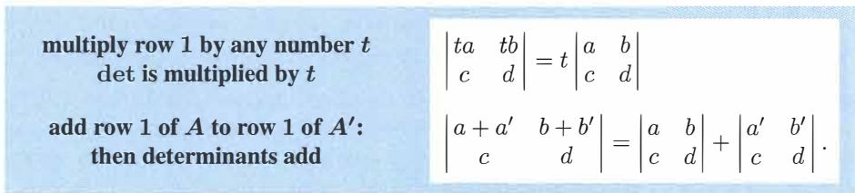
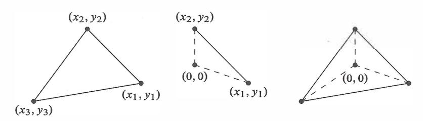
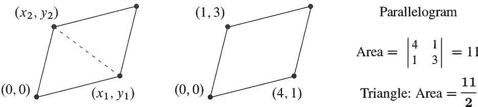
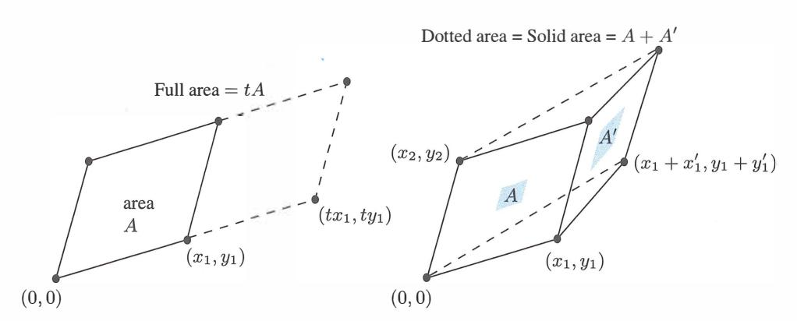
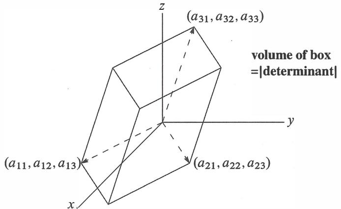
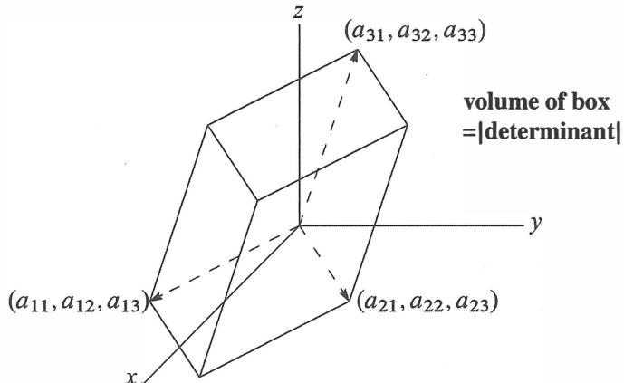

# **Chapter 5**

# **Determinants**

**1**The **determinant** of *A* = [ � �] is *ad* - *be.* Singular matrix *A* = [ � :�] has det = **0. 2Row exch� nge** p *A*= [ 0 0 1 ] [ *a e d b ]* = [ *a e d b ]* has det p *A* = *be* - *ad* = - det *A.* **reverses signs** 1 . [ *xa* + *yA xb* + *yB* ] . **Det is linear in 3**The determmant of *d* 1s *x(ad* - *be)+ y(Ad- Be). e* **row** 1 **b y I ·t se If . 4 Elimination** *EA=* [ � *d \_ b �* b ] det *EA= a* ( *d* - � *b )* = **product of pivots=** det *A.* **5 If** A is *n* by *n* then 1, **2, 3,** 4 remain true: det = **0** when A is singular, **det reverses sign** when rows are exchanged, det **is linear in row 1 by itself,** <let = **product of the pivots.**  Always det *BA* = ( det *B* )( det A) and det *AT*= det *A.* This is an amazing number.

# **5.1 The Properties of Determinants**

The determinant of a square matrix is a single number. That number contains an amazing amount of information about the matrix. It tells immediately whether the matrix is invertible. *The determinant is zero when the matrix has no inverse.* When A is invertible, the determinant of A-1 is 1 / ( <let *A).* **If** det *A* = 2 then det *A* - **I**= ½. In fact the determinant leads to a formula for every entry in A - 1 .

This is one use for determinants-to find formulas for inverse matrices and pivots and solutions A -**I** *b.* For a large matrix we seldom use those formulas, because elimination is faster. For a 2 by 2 matrix with entries *a, b,* e, *d,* its determinant *ad* - *be* shows how A- 1 changes as A changes. Notice the division by the determinant!

$$A = \begin{bmatrix} a & b \\ c & d \end{bmatrix} \quad \text{has inverse} \quad A^{-1} = \frac{1}{ad - bc} \begin{bmatrix} d & -b \\ -c & a \end{bmatrix}. \quad (1)$$

Multiply those matrices to get *I.* When the determinant is *ad* - *be* = 0, we are asked to divide by zero and we can't-then *A* has no inverse. (The rows are parallel when *a/* e = *b* / *d.* This gives *ad* = *be* and **det** *A* = **0.)** Dependent rows always lead to **det** *A* = 0.

The determinant is also connected to the pivots. For a 2 by 2 matrix the pivots are *a* and *d* - (e/ *a)b. The product of the pivots is the determinant:* 

| Product of pivots | $a\left(d - \frac{b}{a}\right) = ad - bc$ | which is | det. |
|-------------------|-------------------------------------------|----------|------|
|                   |                                           |          |      |

After a row exchange the pivots change to e and b - *(a/* e) d. Those new pivots multiply to give *be* - *ad.* The row exchange to [ � �] reversed the sign of the determinant.

*Looking ahead* The determinant of an *n* by *n* matrix can be found in three ways:

1 Multiply the *n* pivots ( times 1 or -1) 2 Add up n! terms (times 1 or -1) 3 Combine *n* smaller determinants ( times 1 or -1) This is the **pivot formula.**  This is the "big" **formula.** This is the **cofactor formula.**

You see that *plus or minus signs-the* decisions between 1 and -1-play a big part in determinants. That comes from the following rule for *n* by *n* matrices:

### *The determinant changes sign when two rows (* **or two columns)** *are exchanged.*

The identity matrix has determinant + 1. Exchange two rows and **det** *P* = -1. Exchange two more rows and the new permutation has **det** *P* = + 1. Half of all permutations are *even* ( **det** *P* = 1) and half are *odd* ( **det** *P* = -1). Starting from *I,* half of the *P's* involve an even number of exchanges and half require an odd number. In the 2 by 2 case, *ad* has a plus sign and *be* has minus-coming from the row exchange:

| $\det \begin{bmatrix} 1 & 0 \\ 0 & 1 \end{bmatrix} = 1$ | and | $\det \begin{bmatrix} 0 & 1 \\ 1 & 0 \end{bmatrix} = -1.$ |
|---------------------------------------------------------|-----|-----------------------------------------------------------|
|---------------------------------------------------------|-----|-----------------------------------------------------------|

The other essential rule is linearity-but a warning comes first. Linearity does not mean that **det(A** + B) = **det** *A+* **det** *B. This is absolutely false.* That kind of linearity is not even true when *A= I* and *B* =I.The false rule would say that **det(J** + I) = 1 + 1 = 2. The true rule is **det** 2J = 2 n. Determinants are multiplied by 2 n(not just by 2) when matrices are multiplied by 2.

We don't intend to define the determinant by its formulas. It is better to start with its properties-sign *reversal and linearity.* The properties are simple (Section 5.1). They prepare for the formulas (Section 5.2). Then come the applications, including these three:

- **(1)** Determinants give **A-**1 and *A-1 b*(this formula is called **Cramer's Rule).**
- **(2)** When the edges of a box are the rows of *A,* the **volume** is I **det** Al.
- **(3)** For *n* special numbers .\, called **eigenvalues,** the determinant of *A >-I* is zero. This is a truly important application and it fills Chapter 6.

## The Properties of the Determinant

Determinants have three basic properties (rules 1, 2, 3). By using those rules we can compute the determinant of any square matrix  $A$ . ***This number is written in two ways,  $\det A$  and  $|A|$ .*** Notice: Brackets for the matrix, straight bars for its determinant. When  $A$  is a 2 by 2 matrix, the rules 1, 2, 3 lead to the answer we expect:

$$\text{The determinant of } \begin{bmatrix} a & b \\ c & d \end{bmatrix} \text{ is } \begin{vmatrix} a & b \\ c & d \end{vmatrix} = ad - bc.$$

From rules 1–3 we will reach rules 4–10. The last two are  $\det(AB) = (\det A)(\det B)$  and  $\det A^T = \det A$ . We will check all rules with the 2 by 2 formula, but do not forget: The rules apply to any  $n$  by  $n$  matrix  $A$ .

Rule 1 (the easiest) matches  $\det I = 1$  with volume = 1 for a unit cube.

**1** *The determinant of the  $n$  by  $n$  identity matrix is 1.*

$$\begin{vmatrix} 1 & 0 \\ 0 & 1 \end{vmatrix} = 1 \quad \text{and} \quad \begin{vmatrix} 1 & & \\ & \ddots & \\ & & 1 \end{vmatrix} = 1.$$

**2** *The determinant changes sign when two rows are exchanged* (sign reversal):

$$\text{Check: } \begin{vmatrix} c & d \\ a & b \end{vmatrix} = - \begin{vmatrix} a & b \\ c & d \end{vmatrix} \quad (\text{both sides equal } bc - ad).$$

Because of this rule, we can find  $\det P$  for any permutation matrix. Just exchange rows of  $I$  until you reach  $P$ . Then  $\det P = +1$  for an ***even*** number of row exchanges and  $\det P = -1$  for an ***odd*** number.

The third rule has to make the big jump to the determinants of all matrices.

**3** *The determinant is a linear function of each row separately* (all other rows stay fixed). If the first row is multiplied by  $t$ , the determinant is multiplied by  $t$ . If first rows are added, determinants are added. This rule only applies when the other rows do not change! Notice how  $c$  and  $d$  stay the same:

In the first case, both sides are  $tad - tbc$ . Then  $t$  factors out. In the second case, both sides are  $ad + a'd - bc - b'c$ . These rules still apply when  $A$  is  $n$  by  $n$ , and ***one row changes***.

$$A = \begin{vmatrix} 4 & 8 & 8 \\ 0 & 1 & 1 \\ 0 & 0 & 1 \end{vmatrix} = 4 \begin{vmatrix} 1 & 2 & 2 \\ 0 & 1 & 1 \\ 0 & 0 & 1 \end{vmatrix} \quad \text{and} \quad \begin{vmatrix} 4 & 8 & 8 \\ 0 & 1 & 1 \\ 0 & 0 & 1 \end{vmatrix} = \begin{vmatrix} 4 & 0 & 0 \\ 0 & 1 & 1 \\ 0 & 0 & 1 \end{vmatrix} + \begin{vmatrix} 0 & 8 & 8 \\ 0 & 1 & 1 \\ 0 & 0 & 1 \end{vmatrix}.$$

Combining multiplication and addition, we get *any linear combination in one row*. Rule 2 for row exchanges can put that row into the first row and back again.

This rule does not mean that  $\det 2I = 2 \det I$ . To obtain  $2I$  we have to multiply *both* rows by 2, and the factor 2 comes out both times:

$$\begin{vmatrix} 2 & 0 \\ 0 & 2 \end{vmatrix} = 2^2 = 4 \quad \text{and} \quad \begin{vmatrix} t & 0 \\ 0 & t \end{vmatrix} = t^2.$$

This is just like area and volume. Expand a rectangle by 2 and its area increases by 4. Expand an  $n$ -dimensional box by  $t$  and its volume increases by  $t^n$ . The connection is no accident—we will see how *determinants equal volumes*.

Pay special attention to rules 1–3. They completely determine the number  $\det A$ . We could stop here to find a formula for  $n$  by  $n$  determinants (a little complicated). We prefer to go gradually, because rules 4 – 10 make determinants much easier to work with.

#### 4 If two rows of $A$ are equal, then $\det A = 0$ .

**Equal rows**

$$\text{Check 2 by } 2 : \begin{vmatrix} a & b \\ a & b \end{vmatrix} = 0.$$

Rule 4 follows from rule 2. (Remember we must use the rules and not the 2 by 2 formula.) *Exchange the two equal rows*. The determinant  $D$  is supposed to change sign. But also  $D$  has to stay the same, because the matrix is not changed. The only number with  $-D = D$  is  $D = 0$ —this must be the determinant. (Note: In Boolean algebra the reasoning fails, because  $-1 = 1$ . Then  $D$  is defined by rules 1, 3, 4.)

A matrix with two equal rows has no inverse. Rule 4 makes  $\det A = 0$ . But matrices can be singular and determinants can be zero without having equal rows! Rule 5 will be the key. We can do row operations (like elimination) without changing  $\det A$ .

#### 5 Subtracting a multiple of one row from another row leaves $\det A$ unchanged.

 **$\ell$  times row 1  
from row 2**

$$\begin{vmatrix} a & b \\ c - \ell a & d - \ell b \end{vmatrix} = \begin{vmatrix} a & b \\ c & d \end{vmatrix}.$$

Rule 3 (linearity) splits the left side into the right side plus another term  $-\ell \begin{vmatrix} a & b \\ a & b \end{vmatrix}$ . This extra term is zero by rule 4: equal rows. Therefore rule 5 is correct (not just 2 by 2).

**Conclusion** *The determinant is not changed by the usual elimination steps from  $A$  to  $U$ .* Thus  $\det A$  equals  $\det U$ . If we can find determinants of triangular matrices  $U$ , we can find determinants of all matrices  $A$ . Every row exchange reverses the sign, so always  $\det A = \pm \det U$ . Rule 5 has narrowed the problem to triangular matrices.

#### 6 A matrix with a row of zeros has $\det A = 0$ .

**Row of zeros**

$$\begin{vmatrix} 0 & 0 \\ c & d \end{vmatrix} = 0 \quad \text{and} \quad \begin{vmatrix} a & b \\ 0 & 0 \end{vmatrix} = 0.$$

For an easy proof, add some other row to the zero row. The determinant is not changed (rule 5). But the matrix now has two equal rows. So  $\det A = 0$  by rule 4.

**7 If  $A$  is triangular then  $\det A = a_{11}a_{22} \cdots a_{nn} = \text{product of diagonal entries}$ .**

**Triangular** 
$$\begin{vmatrix} a & b \\ 0 & d \end{vmatrix} = ad \quad \text{and also} \quad \begin{vmatrix} a & 0 \\ c & d \end{vmatrix} = ad.$$

Suppose all diagonal entries are nonzero. Remove the off-diagonal entries by elimination! (If  $A$  is lower triangular, subtract multiples of each row from lower rows. If  $A$  is upper triangular, subtract from higher rows.) By rule 5 the determinant is not changed—and now the matrix is diagonal:

**Diagonal matrix** 
$$\det \begin{bmatrix} a_{11} & & & 0 \\ & a_{22} & & \\ & & \ddots & \\ 0 & & & a_{nn} \end{bmatrix} = (a_{11})(a_{22}) \cdots (a_{nn}).$$

Factor  $a_{11}$  from the first row by rule 3. Then factor  $a_{22}$  from the second row. Eventually factor  $a_{nn}$  from the last row. The determinant is  $a_{11}$  times  $a_{22}$  times  $\cdots$  times  $a_{nn}$  times  $\det I$ . Then rule 1 (used at last!) is  $\det I = 1$ .

What if a diagonal entry  $a_{ii}$  is zero? Then the triangular  $A$  is singular. Elimination produces a zero row. By rule 5 the determinant is unchanged, and by rule 6 a zero row means  $\det A = 0$ . We reach the great test for **singular or invertible** matrices.

**8 If  $A$  is singular then  $\det A = 0$ . If  $A$  is invertible then  $\det A \neq 0$ .**

**Singular** 
$$\begin{bmatrix} a & b \\ c & d \end{bmatrix} \quad \text{is singular if and only if} \quad ad - bc = 0.$$

**Proof** Elimination goes from  $A$  to  $U$ . If  $A$  is singular then  $U$  has a zero row. The rules give  $\det A = \det U = 0$ . If  $A$  is invertible then  $U$  has the pivots along its diagonal. The product of nonzero pivots (using rule 7) gives a nonzero determinant:

**Multiply pivots** 
$$\det A = \pm \det U = \pm (\text{product of the pivots}). \quad (2)$$

The pivots of a 2 by 2 matrix (if  $a \neq 0$ ) are  $a$  and  $d - (c/a)b$ :

**The determinant is** 
$$\begin{vmatrix} a & b \\ c & d \end{vmatrix} = \begin{vmatrix} a & b \\ 0 & d - (c/a)b \end{vmatrix} = ad - bc.$$

*This is the first formula for the determinant.* MATLAB multiplies the pivots to find  $\det A$ . The sign in  $\pm \det U$  depends on whether the number of row exchanges is even or odd: +1 or -1 is the determinant of the permutation  $P$  that exchanges rows.

With no row exchanges,  $P = I$  and  $\det A = \det U = \text{product of pivots}$ . And  $\det L = 1$ :

**9***The determinant of AB is* det *A times* det *B:* I *AB* I = I *A* 11 BI,

| Product rule | $\begin{vmatrix} a & b \\ c & d \end{vmatrix} \begin{vmatrix} p & q \\ r & s \end{vmatrix} = \begin{vmatrix} ap + b & r & aq + bs \\ cp + dr & cq + ds \end{vmatrix}$ |
|--------------|-----------------------------------------------------------------------------------------------------------------------------------------------------------------------|
|              |                                                                                                                                                                       |

When the matrix *B* is *A-1, this rule says that the determinant of* A-1 is 1 / det *A:* 

| $A$ times $A^{-1}$ | $AA^{-1} = I$ | $A$ | $(\det A)(\det A^{-1}) = \det I = 1$ . |
|--------------------|---------------|-----|----------------------------------------|
|                    |               |     |                                        |

This product rule is the most intricate so far. Even the 2 by 2 case needs some algebra:

$$|A| |B| = (ad - b \cdot c)(\mathbf{p} - q\mathbf{r}) = (ap + b \cdot r)\mathbf{q}\mathbf{g} + ds) - (aq + bs)(cp + dr) = |AB|.$$

For then by *n* case, here is a snappy proof that IABI = IAI IBI. When IBI is not zero, consider the ratio *D(A)* = IABI/IBI. *Check that this ratio D(A) has properties* 1,2,3. Then *D (A)* has to be the determinant and we have I *AB* I/ I BI = I *A* 1- Good.

*Property 1 (Determinant of I)* If *A= I* then the ratio *D(A)* becomes IBI/IBI = 1.

*Property 2 (Sign reversal)* When two rows of *A* are exchanged, so are the same two rows of *AB.* Therefore IABI changes sign and so does the ratio IABI/IBI.

*Property 3 (Linearity)* When row 1 of *A* is multiplied by *t,* so is row 1 of *AB.* This multiplies the determinant IABI by *t.* So the ratio IABI/IBI is multiplied by *t.*

Add row 1 of *A* to row 1 of *A'.* Then row 1 of *AB* adds to row 1 of *A' B.*  By rule 3, determinants add. After dividing by IBI, the ratios add-as desired.

*Conclusion* This ratio IABI/IBI has the same three properties that define IAI. Therefore it equals IAI. This proves the product rule IABI = IAI IBI. The case IBI = 0 is separate and easy, because *AB* is singular when *Bis* singular. Then IABI = IAI IBI is O = 0.

**10***The transpose AThas the same determinant as A.* 

| Transpose | $\begin{vmatrix} a & b \\ c & d \end{vmatrix} = \begin{vmatrix} a & c \\ b & d \end{vmatrix}$ | since both sides equal | $ad - bc$ . |
|-----------|-----------------------------------------------------------------------------------------------|------------------------|-------------|
|           |                                                                                               |                        |             |

The equation IATI = IAI becomes O = 0 when *A* is singular (we know that *AT*is also singular). Otherwise *A* has the usual factorization *PA* = *LU.* Transposing both sides gives *ATpT*=*U TLT \_* The proof of IAI = IAT I comes by using rule 9 for products:

| Compare | $\det P \det A = \det L \det U$ | with | $\det A^T \det P^T = \det U^T \det L^T$ |
|---------|---------------------------------|------|-----------------------------------------|
|         |                                 |      |                                         |

First, det *L* = det *LT*=1 (both have 1 's on the diagonal). Second, det *U* = det *U T*(those triangular matrices have the same diagonal). Third, det *P* = det *p T*(permutations have *p TP* = *I,* so IPTI IPI = 1 by rule 9; thus IPI and IPT I both equal 1 or both equal -1). So *L, U, P* have the same determinants as *LT , UT , pT*and this leaves det *A* = det *AT.* 

*Important comment on columns* Every rule for the rows can apply to the columns (just by transposing, since IAI = IATI)- The determinant changes sign when two columns are exchanged. *A zero column or two equal columns will make the determinant zero.* If a column is multiplied by *t,* so is the determinant. The determinant is a linear function of each column separately.

It is time to stop. The list of properties is long enough. Next we find and use an explicit formula for the determinant.

#### **• REVIEW OF THE KEY IDEAS •**

- 1. The determinant is defined by det *I* =1, sign reversal, and linearity in each row.
- 2. After elimination det *A* is ± (product of the pivots).
- 3. The determinant is zero exactly when *A* is not invertible.
- 4. Two remarkable properties are det *AB=* (det A)(det *B)* and det *AT =* det *A.*

#### **• WORKED EXAMPLES •**

**5.1 A** Apply these operations to *A* and find the determinants of M1, M2, *M3, M4:*  In M1 , multiplying each *aij* by (-l)i+j gives a checkerboard sign pattern. In M2 , rows 1, 2, 3 of *A* are *subtracted* from rows 2, 3, 1. In *M3,* rows 1, 2, 3 of *A* are *added* to rows 2, 3, 1.

*How are the determinants of M1, M2, M3 related to the determinant of A?* 

| $\begin{bmatrix} a_{11} & -a_{12} & a_{13} \\ -a_{21} & a_{22} & -a_{23} \\ a_{31} & -a_{32} & a_{33} \end{bmatrix}$ | $\begin{bmatrix} \text{row } 1 - \text{row } 3 \\ \text{row } 2 - \text{row } 1 \\ \text{row } 3 - \text{row } 2 \end{bmatrix}$ | $\begin{bmatrix} \text{row } 1 + \text{row } 3 \\ \text{row } 2 + \text{row } 1 \\ \text{row } 3 + \text{row } 2 \end{bmatrix}$ |
|----------------------------------------------------------------------------------------------------------------------|---------------------------------------------------------------------------------------------------------------------------------|---------------------------------------------------------------------------------------------------------------------------------|
|----------------------------------------------------------------------------------------------------------------------|---------------------------------------------------------------------------------------------------------------------------------|---------------------------------------------------------------------------------------------------------------------------------|

**Solution** The three determinants are det *A,* 0, and 2 det *A.* Here are reasons:

| $M_1 = \begin{bmatrix} 1 & -1 & 1 \\ & & 1 \end{bmatrix} \begin{bmatrix} a_{11} & a_{12} & a_{13} \\ a_{21} & a_{22} & a_{23} \\ a_{31} & a_{32} & a_{33} \end{bmatrix} \begin{bmatrix} 1 & -1 & 1 \end{bmatrix}$ so $\det M_1 = (-1)(\det A)(-1)$ . |
|------------------------------------------------------------------------------------------------------------------------------------------------------------------------------------------------------------------------------------------------------|
|------------------------------------------------------------------------------------------------------------------------------------------------------------------------------------------------------------------------------------------------------|

M2 is singular because its rows add to the zero row. Its determinant is zero.

*M3* can be split into *eight matrices* by Rule 3 (linearity in each row separately):

row 1 + row 3 row 1 row 3 row 1 row 3 row 2 + row **1** = row 2 + row 2 + row 1 + · · · + row **1** row 3 + row 3 row3 row 3 row 3 row2

All but the first and last have repeated rows and zero determinant. The first is *A* and the last has *two* row exchanges. So det *M3* = det *A+* det *A.* (Try *A= I.)*

**5.1 B** Explain how to reach this determinant by row operations:

| det | $\begin{bmatrix} 1-a & 1 & 1 \\ 1 & 1-a & 1 \\ 1 & 1 & 1-a \end{bmatrix} = a^2(3-a).$ | (4) |
|-----|---------------------------------------------------------------------------------------|-----|
|-----|---------------------------------------------------------------------------------------|-----|

**Solution** Subtract row 3 from row 1 and then from row 2. This leaves

$$\det \begin{bmatrix} -a & 0 & a \\ 0 & -a & a \\ 1 & 1 & 1-a \end{bmatrix}.$$

Now add column 1 to column 3, and also column 2 to column 3. This leaves a lower triangular matrix with *-a, -a,* 3 - *a* on the diagonal: det = (-a)(-a)(3 - a).

The determinant is zero if *a* = 0 or *a* = 3. For *a* = 0 we have the *all-ones matrix*certainly singular. For *a* = 3, each row adds to zero-again singular. Those numbers 0 and 3 are the **eigenvalues** of the all-ones matrix. This example is revealing and important, leading toward Chapter 6.

# **Problem Set 5.1**

**Questions 1-12 are about the rules for determinants.** 

- **1**If a 4 by 4 matrix has det A = ½, find det(2A) and det(-A) and det(A2 ) and det(A-1 ). **2**If a 3 by 3 matrix has det A = -1, find det(½A) and det(- A) and det(A2 ) and det(A-1 ). **3**True or false, with a reason if true or a counterexample if false:
  - (a) The determinant of *I+ A* is 1 + det A.
  - (b) The determinant of *ABC* is IAI IBI ICI .
  - (c) The determinant of *4A* is 4IAI.
- (d) The determinant of *AB BA* is zero. Try an example with *A=* [ � � ] . **4**Which row exchanges show that these "reverse identity matrices" *J3* and *J4* have IJ3I = -1 but IJ4I = +1? [ o o 1] det O 1 0 = -1 1 0 0 but r 0 0 1 0 o o o 11 det O 1 0 0 = +1. 1 0 0 0 5 For *n* = 5, 6, 7, count the row exchanges to permute the reverse identity Jn to the identity matrix In . Propose a rule for every size *n* and predict whether J101 has determinant + 1 or -1.

$$\det \begin{bmatrix} 0 & 0 & 1 \\ 0 & 1 & 0 \\ 1 & 0 & 0 \end{bmatrix} = -1 \quad \text{but} \quad \det \begin{bmatrix} 0 & 0 & 0 & 1 \\ 0 & 1 & 0 & 0 \\ 0 & 1 & 0 & 0 \\ 1 & 0 & 0 & 0 \end{bmatrix} = +1.$$

6 Show how Rule 6 (determinant= 0 if a row is all zero) comes from Rule 3. 7 Find the determinants of rotations and reflections:

| $Q = \begin{bmatrix} \cos \theta & -\sin \theta \\ \sin \theta & \cos \theta \end{bmatrix}$ | and | $Q = \begin{bmatrix} 1 - 2 \cos^2 \theta & -2 \cos \theta \sin \theta \\ -2 \cos \theta \sin \theta & 1 - 2 \sin^2 \theta \end{bmatrix}$ |
|---------------------------------------------------------------------------------------------|-----|------------------------------------------------------------------------------------------------------------------------------------------|
|                                                                                             |     |                                                                                                                                          |

- 8 Prove that every orthogonal matrix ( QTQ = *I)* has determinant 1 or -1.
  - (a) Use the product rule IABI = IAI IBI and the transpose rule IQI = IQTI.
- (b) Use only the product rule. If I det QI > 1 then det Qn= (det Qr blows up. How do you know this can't happen to Qn ? 9 Do these matrices have determinant 0, 1, 2, or 3?

| $A = \begin{bmatrix} 0 & 0 & 1 \\ 1 & 0 & 0 \\ 0 & 1 & 0 \end{bmatrix}$ | $B = \begin{bmatrix} 0 & 1 & 1 \\ 1 & 0 & 1 \\ 1 & 1 & 0 \end{bmatrix}$ | $C = \begin{bmatrix} 1 & 1 & 1 \\ 1 & 1 & 1 \\ 1 & 1 & 1 \end{bmatrix}$ |
|-------------------------------------------------------------------------|-------------------------------------------------------------------------|-------------------------------------------------------------------------|
|-------------------------------------------------------------------------|-------------------------------------------------------------------------|-------------------------------------------------------------------------|

10 If the entries in every row of *A* add to zero, solve *Ax* = 0 to prove det *A* = 0. If those entries add to one, show that *det(A* - *I)* = 0. Does this mean det *A=* 1? 11 Suppose that *CD* = -*DC* and find the flaw in this reasoning: Taking determinants gives ICI IDI = -IDI ICI- Therefore ICI = 0 or IDI = 0. One or both of the matrices must be singular. (That is not true.) 12 The inverse of a 2 by 2 matrix seems to have determinant= 1:

$$\det A^{-1} = \det \frac{1}{ad - bc} \begin{bmatrix} d & -b \\ -c & a \end{bmatrix} = \frac{ad - bc}{ad - bc} = 1.$$

What is wrong with this calculation? What is the correct det *A* - I?

#### **Questions 13-27 use the rules to compute specific determinants.**

**13 Reduce  $A$  to  $U$  and find  $\det A =$  product of the pivot:**

| $A = \begin{bmatrix} 1 & 1 & 1 \\ 1 & 2 & 2 \\ 1 & 2 & 3 \end{bmatrix}$ | $A = \begin{bmatrix} 1 & 2 & 3 \\ 2 & 2 & 3 \\ 3 & 3 & 3 \end{bmatrix}$ |
|-------------------------------------------------------------------------|-------------------------------------------------------------------------|
|-------------------------------------------------------------------------|-------------------------------------------------------------------------|

14 By applying row operations to produce an upper triangular *U,* compute

| $[1 \ 2 \ 3]$                                                    | $[5 \ 3 \ 2]$                                                                                     |     |     |                                                                                                        |
|------------------------------------------------------------------|---------------------------------------------------------------------------------------------------|-----|-----|--------------------------------------------------------------------------------------------------------|
| ving row operations to produce an upper triangular $U$ , compute |                                                                                                   |     |     |                                                                                                        |
| det                                                              | $\begin{bmatrix} 1 & 2 & 3 & 0 \\ 2 & 6 & 6 & 1 \\ -1 & 0 & 0 & 3 \\ 0 & 2 & 0 & 7 \end{bmatrix}$ | and | det | $\begin{bmatrix} 2 & -1 & 0 & 0 \\ -1 & 2 & -1 & 0 \\ 0 & -1 & 2 & -1 \\ 0 & 0 & -1 & 2 \end{bmatrix}$ |

15 Use row operations to simplify and compute these determinants:

| det | $\begin{bmatrix} 101 & 201 & 301 \\ 102 & 201 & 302 \\ 103 & 201 & 303 \end{bmatrix}$ | and | det | $\begin{bmatrix} 1 & t & t^2 \\ t & 1 & t \\ t^2 & t & 1 \end{bmatrix}$ |
|-----|---------------------------------------------------------------------------------------|-----|-----|-------------------------------------------------------------------------|
|     |                                                                                       |     |     |                                                                         |

16 Find the determinants of a rank one matrix and a skew-symmetric matrix :

| $A = \begin{bmatrix} 1 \\ 2 \\ 3 \end{bmatrix}$ | $\begin{bmatrix} 1 & -4 & 5 \end{bmatrix}$ | and | $A = \begin{bmatrix} 0 & 1 & 3 \\ -1 & 0 & 4 \\ -3 & -4 & 0 \end{bmatrix}$ |
|-------------------------------------------------|--------------------------------------------|-----|----------------------------------------------------------------------------|
|-------------------------------------------------|--------------------------------------------|-----|----------------------------------------------------------------------------|

17 A skew-symmetric matrix has *A T= -A.* Insert a, *b,* e for 1, 3, 4 in Question 16 and show that [Al = 0. Write down a 4 by 4 example with \A\ = 1.

18 Use row operations to show that the 3 by 3 "Vandermonde determinant" is

| det | $\begin{bmatrix} 1 & a & a^2 \\ 1 & b & b^2 \\ 1 & c & c^2 \end{bmatrix} = (b-a)(c-a)(c-b).$ |
|-----|----------------------------------------------------------------------------------------------|
|-----|----------------------------------------------------------------------------------------------|

19 Find the determinants of *U* and u-1 and U 2

| $U = \begin{bmatrix} 1 & 4 & 6 \\ 0 & 2 & 5 \\ 0 & 0 & 3 \end{bmatrix}$ | and | $U = \begin{bmatrix} a & b \\ 0 & d \end{bmatrix}$ |
|-------------------------------------------------------------------------|-----|----------------------------------------------------|
|-------------------------------------------------------------------------|-----|----------------------------------------------------|

20 Suppose you do two row operations at once, going from

| $\begin{bmatrix} a & b \\ c & d \end{bmatrix}$ | to | $\begin{bmatrix} a - Lc & b - Ld \\ c - la & d - lb \end{bmatrix}$ |
|------------------------------------------------|----|--------------------------------------------------------------------|
|                                                |    |                                                                    |

Find the second determinant. Does it equal *ad* - *be?*

21 *Row exchange:* Add row 1 of *A* to row 2, then subtract row 2 from row 1. Then add row 1 to row 2 and multiply row 1 by -1 to reach *B.* Which rules show

| $\det B = \begin{vmatrix} c & d \\ a & b \end{vmatrix}$ equals $-\det A = -\begin{vmatrix} a & b \\ c & d \end{vmatrix}?$ |
|---------------------------------------------------------------------------------------------------------------------------|
|---------------------------------------------------------------------------------------------------------------------------|

Those rules could replace Rule 2 in the definition of the determinant.

22 From *ad* - *be,* find the determinants of *A* and A-1 and *A* - *>-.I:*

| $A = \begin{bmatrix} 2 & 1 \\ 1 & 2 \end{bmatrix}$ | and | $A^{-1} = \frac{1}{3} \begin{bmatrix} 2 & -1 \\ -1 & 2 \end{bmatrix}$ | and | $A - \lambda I = \begin{bmatrix} 2 & -\lambda \\ 1 & 2 - \lambda \end{bmatrix}$ |
|----------------------------------------------------|-----|-----------------------------------------------------------------------|-----|---------------------------------------------------------------------------------|
|                                                    |     |                                                                       |     |                                                                                 |

Which two numbers>-. lead to det(A - *>-.I)=* 0? Write down the matrix *A->-.I* for each of those numbers >-.-it should not be invertible.

23 From *A* = [ *i* ! ] find *A* 2and *A* - 1and *A* - *)J* and their determinants. Which two numbers,\ lead to det(A - *,\I)* = 0 ? **24**Elimination reduces *A* to *U.* Then *A= LU:* 

$$A = \begin{bmatrix} 3 & 3 & 4 \\ 6 & 8 & 7 \\ -3 & 5 & -9 \end{bmatrix} = \begin{bmatrix} 1 & 0 & 0 \\ 2 & 1 & 0 \\ -1 & 4 & 1 \end{bmatrix} \begin{bmatrix} 3 & 3 & 4 \\ 0 & 2 & -1 \\ 0 & 0 & -1 \end{bmatrix} = LU.$$

Find the determinants of *L, U, A,* u-1 L-1 , and u-1*L* - 1A.

25 If the i, *j* entry of *A* is i times *j,* show that det *A* = 0. (Exception when *A* = [ 1 ] . ) 26 If the i, *j* entry of *A* is i + *j,* show that det *A* = 0. (Exception when n = 1 or 2.) **27**Compute the determinants of these matrices by row operations:

$$A = \begin{bmatrix} 0 & a & 0 \\ 0 & 0 & b \\ c & 0 & 0 \end{bmatrix} \quad \text{and} \quad B = \begin{bmatrix} 0 & 0 & 0 & 0 \\ 0 & 0 & 0 & 0 \\ 0 & 0 & 0 & c \\ d & 0 & 0 & 0 \end{bmatrix} \quad \text{and} \quad C = \begin{bmatrix} a & a & a \\ a & b & b \\ a & b & c \end{bmatrix}.$$

- 28 True or false (give a reason if true or a 2 by 2 example if false):
  - (a) If *A* is not invertible then *AB* is not invertible.
  - (b) The determinant of *A* is always the product of its pivots. ( c) The determinant of *A* - *B* equals det *A* - det *B.*
- (d) *AB* and *BA* have the same determinant. 29 What is wrong with this proof that projection matrices have det *P* = 1?

**30** (Calculus question) Show that the partial derivatives of 
$$\ln(\det A)$$
 give  $A^{-1}$ .

| $f(a, b, c, d) = \ln(ad - bc)$ | leads to | $\begin{bmatrix} \partial f / \partial a & \partial f / \partial c \\ \partial f / \partial b & \partial f / \partial d \end{bmatrix} = A^{-1}$ |
|--------------------------------|----------|-------------------------------------------------------------------------------------------------------------------------------------------------|
|                                |          |                                                                                                                                                 |

31 (MATLAB) The Hilbert matrix hilb(n) has *i,j* entry equal to 1/(i + *j* - 1). Print the determinants ofhilb(l), hilb(2), ... ,hilb(lO). Hilbert matrices are hard to work

with! What are the pivots of hilb ( 5)? 32 (MATLAB) What is a typical determinant (experimentally) ofrand(n) and randn(n) for n = 50,100,200, 400? (And what does "Inf" mean in MATLAB?) 33 (MATLAB) Find the largest determinant of a 6 by 6 matrix of 1 's and -1 's. 34 If you know that det *A* = 6, what is the determinant of *B?* 

| From det $A =$ | row 1 |                    | row 3 + row 2 + row 1 |  |
|----------------|-------|--------------------|-----------------------|--|
|                | row 2 | = 6 find det $B =$ | row 2 + row 1         |  |
|                | row 3 |                    | row 1                 |  |

## 5.2 Permutations and Cofactors

1. 1 2 by 2:  $ad - bc$  has  $2!$  terms with  $\pm$  signs.  $n$  by  $n$ :  $\det A$  adds  $n!$  terms with  $\pm$  signs.
2. 2 For  $n = 3$ ,  $\det A$  adds  $3! = 6$  terms. Two terms are  $+a_{12}a_{23}a_{31}$  and  $-a_{13}a_{22}a_{31}$ . **Rows 1, 2, 3 and columns 1, 2, 3 appear once in each term.**
3. 3 That minus sign came because the column order 3, 2, 1 needs one exchange to recover 1, 2, 3.
4. 4 The six terms include  $+a_{11}a_{22}a_{33} - a_{11}a_{23}a_{32} = a_{11}(a_{22}a_{33} - a_{23}a_{32}) = a_{11}(\text{cofactor } C_{11})$ .
5. 5 Always  $\det A = a_{11}C_{11} + a_{12}C_{12} + \cdots + a_{1n}C_{1n}$ . Cofactors are determinants of size  $n - 1$ .

A computer finds the determinant from the pivots. This section explains two other ways to do it. There is a “big formula” using all  $n!$  permutations. There is a “cofactor formula” using determinants of size  $n - 1$ . The best example is my favorite 4 by 4 matrix:

$$A = \begin{bmatrix} 2 & -1 & 0 & 0 \\ -1 & 2 & -1 & 0 \\ 0 & -1 & 2 & -1 \\ 0 & 0 & -1 & 2 \end{bmatrix} \quad \text{has} \quad \det A = 5.$$

We can find this determinant in all three ways: *pivots, big formula, cofactors*.

1. 1. The product of the pivots is  $2 \cdot \frac{3}{2} \cdot \frac{4}{3} \cdot \frac{5}{4}$ . Cancellation produces 5.
2. 2. The “big formula” in equation (8) has  $4! = 24$  terms. Only five terms are nonzero:

$$\det A = 16 - 4 - 4 - 4 + 1 = 5.$$

The 16 comes from  $2 \cdot 2 \cdot 2 \cdot 2$  on the diagonal of  $A$ . Where do  $-4$  and  $+1$  come from? When you can find those five terms, you have understood formula (8).

1. 3. The numbers 2,  $-1, 0, 0$  in the first row multiply their cofactors 4, 3, 2, 1 from the other rows. That gives  $2 \cdot 4 - 1 \cdot 3 = 5$ . Those cofactors are 3 by 3 determinants. Cofactors use the rows and columns that are *not* used by the entry in the first row. *Every term in a determinant uses each row and column once!*

### The Pivot Formula

When elimination leads to  $A = LU$ , the pivots  $d_1, \dots, d_n$  are on the diagonal of the upper triangular  $U$ . If no row exchanges are involved, *multiply those pivots* to find the determinant:

$$\det A = (\det L)(\det U) = (1)(d_1 d_2 \cdots d_n). \quad (1)$$

This formula for  $\det A$  appeared in Section 5.1, with the further possibility of row exchanges. Then a permutation enters  $PA = LU$ . The determinant of  $P$  is  $-1$  or  $+1$ .

| $(\det P)(\det A) = (\det L)(\det U)$ | gives | $\det A = \pm(d_1d_2 \cdots d_n)$ | (2) |
|---------------------------------------|-------|-----------------------------------|-----|
|                                       |       |                                   |     |

**Example 1** A row exchange produces pivots 4, 2, 1 and that important minus sign:

| $A = \begin{bmatrix} 0 & 0 & 1 \\ 0 & 2 & 3 \\ 4 & 5 & 6 \end{bmatrix}$ | $PA = \begin{bmatrix} 4 & 5 & 6 \\ 0 & 2 & 3 \\ 0 & 0 & 1 \end{bmatrix}$ | $\det A = -(4)(2)(1) = -8.$ |
|-------------------------------------------------------------------------|--------------------------------------------------------------------------|-----------------------------|
|-------------------------------------------------------------------------|--------------------------------------------------------------------------|-----------------------------|

The odd number of row exchanges (namely one exchange) means that <let *P* = -l.

The next example has no row exchanges. It may be the first matrix we factored into LU (when it was 3 by 3). What is remarkable is that we can go directly ton by n. Pivots give the determinant. We will also see how determinants give the pivots.

**Example 2** The first pivots of this tridiagonal matrix *A* are 2, ! , ½. The next are ¾ and i and eventually �- Factoring this n by n matrix reveals its determinant:

$$\begin{bmatrix} 2 & -1 & & & & \\ -1 & 2 & -1 & & & \\ & -1 & 2 & & & \\ & & & -1 & & \\ & & & & -1 & 2 \end{bmatrix} = \begin{bmatrix} 1 & & & & & \\ -\frac{1}{2} & 1 & & & & \\ & -\frac{2}{3} & 1 & & & \\ & & & -\frac{n-1}{n} & 1 & \end{bmatrix} \begin{bmatrix} 2 & -1 & & & \\ & \frac{3}{2} & -1 & & \\ & & \frac{4}{3} & -1 & \\ & & & & -1 & \\ & & & & & \frac{n+1}{n} \end{bmatrix}$$

The pivots are on the diagonal of U (the last matrix). When 2 and ! and ½ and ¾ are multiplied, the fractions cancel. The determinant of the 4 by 4 matrix is 5. The 3 by 3 determinant is 4. *Then by n determinant is n* + l:

| $-1, 2, -1$ matrix | $\det A = (2) \left(\frac{3}{2}\right) \left(\frac{3}{3}\right) \cdots \left(\frac{n}{n}\right) = n + 1.$ |
|--------------------|-----------------------------------------------------------------------------------------------------------|
|--------------------|-----------------------------------------------------------------------------------------------------------|

Important point: The first pivots depend only on the *upper left corner* of the original matrix *A.* This is a rule for all matrices without row exchanges.

The first k pivots come from the k by k matrix Ak in the top left corner of A.

*The determinant of that corner submatrix* Ak *is* d1d2 · · · dk *(first k pivots).*

The 1 by 1 matrix A1 contains the very first pivot d1. This is det A1. The 2 by 2 matrix in the corner has <let A2 = d1d2. Eventually then by n determinant multiplies all n pivots.

Elimination deals with the matrix Ak in the upper left corner while starting on the whole matrix. We assume no row exchanges-then A = LU and Ak = LkUk. Dividing one determinant by the previous determinant ( <let Ak divided by <let Ak-l) cancels everything but the latest pivot dk. *Each pivot is a ratio of determinants:* 

| <b>Pivots from determinants</b> | <b>The <math display="block">k</math>th pivot is <math>d_k = \frac{d_1 d_2 \cdots d_k}{d_1 d_2 \cdots d_{k-1}} = \frac{\det A_k}{\det A_{k-1}}</math></b> | <b>(3)</b> |
|---------------------------------|-----------------------------------------------------------------------------------------------------------------------------------------------------------|------------|
|---------------------------------|-----------------------------------------------------------------------------------------------------------------------------------------------------------|------------|

### **The Big Formula for Determinants**

Pivots are good for computing. They concentrate a lot of information-enough to find the determinant. But it is hard to connect them to the original *aij.* That part will be clearer if we go back to rules 1-2-3, linearity and sign reversal and det *I* = l. We want to derive a single explicit formula for the determinant, directly from the entries aij.

*The formula has* n! *terms.* Its size grows fast because n! = 1, 2, 6, 24, 120, .... For *n* = 11 there are about forty million terms. For *n* = 2, the two terms are *ad* and *be.* Half the terms have minus signs (as in *-be).* The other half have plus signs (as in *ad).* For *n* = 3 there are 3! = (3)(2)(1) terms. Here are those six terms:

$$\begin{array}{ccc} 3 \text{ by } 3 & a_{11} & a_{12} & a_{13} \\ \text{determinant} & a_{21} & a_{22} & a_{23} \\ & a_{31} & a_{32} & a_{33} \end{array} = \begin{array}{l} +a_{11}a_{22}a_{33} + a_{12}a_{23}a_{31} + a_{13}a_{21}a_{32} \\ -a_{11}a_{23}a_{32} - a_{12}a_{21}a_{33} - a_{13}a_{22}a_{31}. \end{array} \quad (4)$$

Notice the pattern. Each product like a11a23a32 has *one entry from each rollf.* It also has *one entry from each column.* The column order 1,3, 2 means that this particular term comes with a minus sign. The column order 3, 1, 2 in a13a21a32 has a plus sign (boldface). It will be "permutations" that tell us the sign.

The next step *(n* = 4) brings 4! = 24 terms. There are 24 ways to choose one entry from each row and column. Down the main diagonal, a11 a22a33a44 with column order 1, 2, 3, 4 always has a plus sign. That is the "identity permutation".

To derive the big formula I start with n = 2. The goal is to reach *ad- be* in a systematic way. Break each row into two simpler rows:

| $[a \ b] = [a \ 0] + [0 \ b]$ | and | $[c \ d] = [c \ 0] + [0 \ d]$ |
|-------------------------------|-----|-------------------------------|
|                               |     |                               |

Now apply linearity, first in row 1 (with row 2 fixed) and then in row 2 (with row 1 fixed):

$$\begin{bmatrix} a & b \\ c & d \end{bmatrix} = \begin{bmatrix} a & b \\ c & d \end{bmatrix} + \begin{bmatrix} 0 & b \\ 0 & d \end{bmatrix} \quad (\text{break up row 1})$$

$$= \begin{bmatrix} a & 0 \\ c & 0 \end{bmatrix} + \begin{bmatrix} a & 0 \\ 0 & b \end{bmatrix} + \begin{bmatrix} 0 & b \\ c & 0 \end{bmatrix} + \begin{bmatrix} 0 & b \\ 0 & d \end{bmatrix} \quad (\text{break up row 2}).$$

The last line has 2 2= 4 determinants. The first and fourth are zero because one row is a multiple of the other row. We are left with 2! = 2 determinants to compute:

| $\begin{vmatrix} a & 0 \\ 0 & d \end{vmatrix} + \begin{vmatrix} 0 & b \\ c & 0 \end{vmatrix} = ad \begin{vmatrix} 1 & 0 \\ 0 & 1 \end{vmatrix} + bc \begin{vmatrix} 0 & 1 \\ 1 & 0 \end{vmatrix} = ad - bc.$ |
|--------------------------------------------------------------------------------------------------------------------------------------------------------------------------------------------------------------|
|--------------------------------------------------------------------------------------------------------------------------------------------------------------------------------------------------------------|

The splitting led to permutation matrices. Their determinants give a plus or minus sign. The permutation tells the column sequence. In this case the column order is (1, 2) or (2, 1 ).

Now try n = 3. Each row splits into 3 simpler rows like [ a11 0 0]. Using linearity in each row, det *A* splits into 3 3=27 simple determinants. If a column choice is repeatedfor example if we also choose the row [ a21 0 0 ]-then the simple determinant is zero. We pay attention only when *the entries aij come from different columns,* like (3, 1, 2):

| au  | a12       | a13 | au  | a12         | a13   |
|-----|-----------|-----|-----|-------------|-------|
| a21 | a22       | a23 | a22 | + a23 + a21 |       |
| a31 | a32       | a33 | a33 | a31         | a32   |
|     |           |     | au  | a12         | a13   |
|     | Six terms |     | +   | a23 + a21   | + a22 |
|     |           |     | a32 | a33         | a31   |

*There are* 3 ! = 6 *ways to order the columns, so six determinants.* The six permutations of (1, 2, 3) include the identity permutation (1, 2, 3) from *P* = *I.*

**Column numbers** = (1, 2, 3), (2, 3, 1), **(3, 1, 2),** (1, 3, 2), (2, 1, 3), (3, 2, 1). (6)

The last three are *odd permutations* (one exchange). The first three are *even permutations* (0 or 2 exchanges). When the column sequence is (3, 1, 2), we have chosen the entries a13a21a32-that particular column sequence comes with a plus sign (2 exchanges). The determinant of A is now split into six simple terms. Factor out the *aij:* 

| $\det A = a_{11}a_{22}a_{33} \left  \begin{array}{ccc c} 1 & & & & 1 \\ & 1 & & & \\ & & 1 & & \\ & & & 1 & \end{array} \right. + a_{12}a_{23}a_{31} \left  \begin{array}{ccc c} 1 & & & & 1 \\ & 1 & & & \\ & & 1 & & \end{array} \right. + a_{13}a_{21}a_{32} \left  \begin{array}{ccc c} 1 & & & & 1 \\ & 1 & & & \end{array} \right.$ | $(7)$ |
|-------------------------------------------------------------------------------------------------------------------------------------------------------------------------------------------------------------------------------------------------------------------------------------------------------------------------------------------|-------|
| $+ a_{11}a_{23}a_{32} \left  \begin{array}{ccc c} 1 & & & & 1 \\ & 1 & & & \\ & & 1 & & \\ & & & 1 & \end{array} \right. + a_{12}a_{21}a_{33} \left  \begin{array}{ccc c} 1 & & & & 1 \\ & 1 & & & \\ & & 1 & & \end{array} \right. + a_{13}a_{22}a_{31} \left  \begin{array}{ccc c} 1 & & & & 1 \\ & 1 & & & \end{array} \right.$        | $$    |

The first three (even) permutations have det *P* + l, the last three (odd) permutations have det *P* = -l. We have proved the 3 by 3 formula in a systematic way.

Now you can see the *n* by *n* formula. There are n! orderings of the columns. The columns (1, 2, ... , *n)* go in each possible order ( *a,* fJ, ... ,*w).* Taking a*1*a. from row 1 and a2(3 from row 2 and eventually anw from row *n,* the determinant contains the product a1a.a2(3 · · · anw times + 1 or -1. Half the column orderings have sign -1.

The determinant of A is the sum of these n! simple determinants, times 1 or -1. The simple determinants a1a.a2(3 · · · anw choose *one entry from every row and column.* For 5 by 5, the term a15a22a33a44a51 would have det *P* = -l from exchanging 5 and 1.

$$\begin{aligned} \det A &= \text{sum over all } \mathbf{n!} \text{ column permutations } P = (\alpha, \beta, \dots, \omega) \\ &= \sum (\det P)_{a_1\alpha_1 a_2\beta_1 \dots a_{n\omega}} = \text{BIG FORMULA.} \end{aligned} \quad (8)$$

The 3 by 3 case has three products "down to the right" (see Problem 28) and three products "down to the left". Warning: Many people believe they should follow this pattern in the 4 by 4 case. They only take 8 products-but we need 24.

**Example 3** (Determinant of *U)* When *U* is upper triangular, only one of the n! products can be nonzero. This one term comes from the diagonal: det *U* = +u11 u22 · · · *Unn·* All other column orderings pick at least one entry below the diagonal, where U has zeros. As soon as we pick a number like u21=0, that term in equation (8) is sure to be zero.

Of course det *I=* 1. The only nonzero term is +(1)(1) · · · (1) from the diagonal.

**Example 4** Suppose *Z* is the identity matrix except for column 3. Then

|                                                                                                            |                                                                                     |                                              |  |  |  |  |
|-------------------------------------------------------------------------------------------------------------------------|--------------------------------------------------------------------------------------------------|-----------------------------------------------------------|---------------|---------------|---------------|--|
| The determinant of $Z = \begin{vmatrix} 1 & 0 & a & 0 \\ 0 & 1 & 0 & 0 \\ 0 & 0 & c & 0 \\ 0 & 0 & 1 & 0 \end{vmatrix}$ | $\begin{vmatrix} 1 & 0 & a & 0 \\ 0 & 1 & 0 & 0 \\ 0 & 0 & c & 0 \\ 0 & 0 & 1 & 0 \end{vmatrix}$ | $\begin{vmatrix} is & c. & & & & & & & (9) \end{vmatrix}$ |               |               |               |  |

The term (l)(l)(c)(l) comes from the main diagonal with a plus sign. There are 4! = 24 products (choosing one factor from each row and column) but the other 23 products are zero. Reason: If we pick *a, b,* or *d* from column 3, that column is used up. Then the only available choice from row 3 is zero.

Here is a different reason for the same answer. If c = 0, then *Z* has a row of zeros and det *Z* = c = 0 is correct. If c is not zero, *use elimination.* Subtract multiples of row 3 from the other rows, to knock out *a, b, d.* That leaves a diagonal matrix and det *Z* = c.

This example will soon be used for "Cramer's Rule". If we move *a, b,* c, *d* into the first column of *Z,* the determinant is det *Z* = *a. (Why?)* Changing one column of *I* leaves *Z*  with an easy determinant, coming from its main diagonal only.

**Example 5** Suppose *A* has l's just above and below the main diagonal. Here *n* = 4:

|                                                                                         |  |                                                                                         |               |  |  |
|------------------------------------------------------------------------------------------------------|---------------|------------------------------------------------------------------------------------------------------|----------------------------|---------------|---------------|
| $A = \begin{bmatrix} 0 & 1 & 0 & 0 \\ 1 & 0 & 1 & 1 \\ 0 & 1 & 0 & 1 \\ 0 & 0 & 1 & 0 \end{bmatrix}$ | and           | $P = \begin{bmatrix} 0 & 1 & 0 & 0 \\ 1 & 0 & 0 & 1 \\ 0 & 0 & 0 & 1 \\ 0 & 0 & 1 & 0 \end{bmatrix}$ | have <b>determinant</b> 1. |               |               |

The only nonzero choice in the first row is column 2. The only nonzero choice in row 4 is column 3. Then rows 2 and 3 *must* choose columns 1 and 4. In other words det *P* = det *A.*  The determinant of Pis + 1 (two exchanges to reach 2, 1, 4, 3). Therefore det *A* = +1.

### **Determinant by Cofactors**

Formula (8) is a direct definition of the determinant. It gives you everything at oncebut you have to digest it. Somehow this sum of n! terms must satisfy rules 1-2-3 (then all the other properties 4-10 will follow). The easiest is detJ = 1, already checked.

*When you separate out the factor* a11 *or* a12 *or* a1°' *that comes from the first row,* you see linearity. For 3 by 3, separate the usual 6 terms of the determinant into 3 pairs:

| $\det A = a_{11} (a_{22}a_{33} - a_{23}a_{32}) + a_{12} (a_{23}a_{31} - a_{21}a_{33}) + a_{13} (a_{21}a_{32} - a_{22}a_{31}).$ | (10) |
|--------------------------------------------------------------------------------------------------------------------------------|------|
|--------------------------------------------------------------------------------------------------------------------------------|------|

Those three quantities in parentheses are called *"cofactors".* They are 2 by 2 **determinants,** from rows 2 and 3. The first row contributes the factors a11, a12, a13. *The lower rows contribute the cofactors* C11, C12, C13. Certainly the determinant a11 C11 +a12C12 + a13C13 depends linearly on a11, a12, a13-this is Rule 3.

The cofactor of a11 is C11 = a22a33 - a23a32. You can see it in this splitting:

|  |  |  |  |  |  |
|---------------|---------------|---------------|---------------|---------------|---------------|
| $a_{11}$      | $a_{12}$      | $a_{13}$      | $a_{11}$      |               |               |
| $a_{21}$      | $a_{22}$      | $a_{23}$      |               | $a_{22}$      | $a_{23}$      |
| $a_{31}$      | $a_{32}$      | $a_{33}$      |               | $a_{32}$      | $a_{33}$      |

We are still choosing *one entry from each row and column.* Since a11 uses up row 1 and column 1, that leaves a 2 by 2 determinant as its cofactor.

As always, we have to watch signs. The 2 by 2 determinant that goes with a12 looks like a21 a33 - a23a31. But in the cofactor C12, *its sign is reversed.* Then a12C12 is the correct 3 by 3 determinant. The sign pattern for cofactors along the first row is *plus-minusplus-minus. You cross out row* 1 *and column j to get a submatrix M1j of size n* - 1. Multiply its determinant by the sign ( -1) H j to get the cofactor:

The cofactors along row 1 are 
$$C_{1j} = (-1)^{1+j} \det M_{1j}$$
.  
**The cofactor expansion is  $\det A = a_{11}C_{11} + a_{12}C_{12} + \dots + a_{1n}C_{1n}$  (11)**

In the big formula (8), the terms that multiply a11 combine to give C11=det M11. The sign is ( -1) 1 + 1 , meaning *plus.* Equation ( 11) is another form of equation (8) and also equation (10), with factors from row 1 multiplying cofactors that use only the other rows.

**Note** Whatever is possible for row 1 is possible for row i. The entries aij in that row also have cofactors Cij. Those are determinants of order n - 1, multiplied by ( -1 ) i+ j . Since aij accounts for row i and column *j, the sub matrix* Mij *throws out row* i *and column j.* The display shows *a43* and *M43* (with row 4 and column 3 removed). The sign ( -1 ) 4+ 3 multiplies the determinant of *M43* to give C43. The sign matrix shows the± pattern:

$$A = \begin{bmatrix} \bullet & \bullet & & \bullet \\ \bullet & \bullet & & \bullet \\ \bullet & \bullet & & \bullet \\ \bullet & \bullet & & \bullet \end{bmatrix} \quad \text{signs}(-1)^{i+j} = \begin{bmatrix} + & - & + & - \\ - & + & + & - \\ + & - & + & + \\ - & + & - & + \end{bmatrix}$$

The determinant is the dot product of any row i of *A* with its cofactors using other rows: **COFACTOR FORMULA** (12)

Each cofactor Cij(order *n* - l, without row i and column j) includes its correct sign:

**Cofactor**      
$$C_{ij} = (-1)^{i+j} \det M_{ij}$$
.

A determinant of order *n* is a combination of determinants of order *n* - l. A recursive person would keep going. Each subdeterminant breaks into determinants of order *n* - 2. *We could define all determinants via equation* (12). This rule goes from order *n ton* - l *ton* - 2 and eventually to order 1. Define the 1 by 1 determinant !al to be the number *a.*  Then the cofactor method is complete.

We preferred to construct det A from its properties (linearity, sign reversal, det I = l). The big formula (8) and the cofactor formulas (10)-(12) follow from those rules. One last formula comes from the rule that det *A* = det *A T .* We can expand in cofactors, *down a column* instead of across a row. Down column *j* the entries are *a1j* to *anj.* The cofactors are C1j to Cnj . The determinant is the dot product:

| Cofactors down column $j$ | $\det A = a_1 C_{1j} + a_2 C_{2j} + \dots + a_{nj} C_{nj}$ | (13) |
|---------------------------|------------------------------------------------------------|------|
|                           |                                                            |      |

**Cofactors are useful when matrices have many zeros-as** in the next examples.

**Example 6** The -1, 2, -1 matrix has only two nonzeros in its first row. So only two cofactors C11 and C12 are involved in the determinant. I will highlight C12 :

$$\begin{vmatrix} 2 & -1 & -1 \\ -1 & 2 & -1 \\ -1 & -1 & -1 \end{vmatrix} = 2 \begin{vmatrix} 2 & -1 & -1 \\ -1 & 2 & -1 \\ -1 & -1 & 2 \end{vmatrix} - (-1) \begin{vmatrix} -1 & -1 & -1 \\ 2 & -1 & 2 \\ -1 & -1 & 2 \end{vmatrix}, \quad (14)$$

You see 2 times C11 first on the right, from crossing out row 1 and column 1. This cofactor C11 has exactly the same -1, 2, -1 pattern as the original *A-but* one size smaller.

To compute the boldface C12 , *use cofactors down its first column.* The only nonzero is at the top. That contributes another -1 (so we are back to minus). Its cofactor is the -1, 2, -1 determinant which is 2 by 2, *two sizes smaller* than the original *A.*

*Summary Each determinant* Dn *of order n comes from* Dn-l *and* Dn- 2:

| $D_4 = 2D_3 - D_2$ | and generally | $D_n = 2D_{n-1} - D_{n-2}$ | (15) |
|--------------------|---------------|----------------------------|------|
|                    |               |                            |      |

Direct calculation gives D2 = 3 and D*3* = 4. Equation (14) has D*4* = 2(4) - 3 = 5. These determinants 3, 4, 5 fit the formula *Dn*= *n* + 1. Then Dn equals 2n - (n - 1). That "special tridiagonal answer" also came from the product of pivots in Example 2.

**Example 7** This is the same matrix, except the first entry (upper left) is now 1:

$$B_4 = \begin{bmatrix} 1 & -1 & & & \\ -1 & 2 & -1 & & \\ & -1 & 2 & -1 & \\ & & -1 & 2 & \end{bmatrix}.$$

All pivots of this matrix turn out to be 1. So its determinant is 1. How does that come from cofactors? Expanding on row 1, the cofactors all agree with Example 6. Just change  $a_{11} = 2$  to  $b_{11} = 1$ :

$$\det B_4 = D_3 - D_2 \quad \text{instead of} \quad \det A_4 = 2D_3 - D_2.$$

The determinant of  $B_4$  is  $4 - 3 = 1$ . The determinant of every  $B_n$  is  $n - (n - 1) = 1$ . If you also change the last 2 into 1, why is  $\det = 0$ ?

## ■ REVIEW OF THE KEY IDEAS ■

1. 1. With no row exchanges,  $\det A = (\text{product of pivots})$ . In the upper left corner of  $A$ ,  $\det A_k = (\text{product of the first } k \text{ pivots})$ .
2. 2. Every term in the big formula (8) uses each row and column once. Half of the  $n!$  terms have plus signs (when  $\det P = +1$ ) and half have minus signs.
3. 3. The cofactor  $C_{ij}$  is  $(-1)^{i+j}$  times the smaller determinant that omits row  $i$  and column  $j$  (because  $a_{ij}$  uses that row and column).
4. 4. The determinant is the dot product of any row of  $A$  with its row of cofactors. When a row of  $A$  has a lot of zeros, we only need a few cofactors.

## ■ WORKED EXAMPLES ■

**5.2 A** A *Hessenberg matrix* is a triangular matrix with one extra diagonal. Use cofactors of row 1 to show that the 4 by 4 determinant satisfies Fibonacci's rule  $|H_4| = |H_3| + |H_2|$ . The same rule will continue for all sizes,  $|H_n| = |H_{n-1}| + |H_{n-2}|$ . Which Fibonacci number is  $|H_n|$ ?

$$H_2 = \begin{bmatrix} 2 & 1 \\ 1 & 2 \end{bmatrix} \quad H_3 = \begin{bmatrix} 2 & 1 \\ 1 & 2 & 1 \\ 1 & 1 & 2 \end{bmatrix} \quad H_4 = \begin{bmatrix} 2 & 1 & & \\ 1 & 2 & 1 & \\ 1 & 1 & 2 & 1 \\ 1 & 1 & 1 & 2 \end{bmatrix}$$

**Solution** The cofactor  $C_{11}$  for  $H_4$  is the determinant  $|H_3|$ . We also need  $C_{12}$  (in boldface):

$$C_{12} = - \begin{vmatrix} 1 & 1 & 0 \\ 1 & 2 & 1 \\ 1 & 1 & 2 \end{vmatrix} = - \begin{vmatrix} 2 & 1 & 0 \\ 1 & 2 & 1 \\ 1 & 1 & 2 \end{vmatrix} + \begin{vmatrix} 1 & 0 & 0 \\ 1 & 2 & 1 \\ 1 & 1 & 2 \end{vmatrix}$$

Rows 2 and 3 stayed the same and we used linearity in row 1. The two determinants on the right are  $-|H_3|$  and  $+|H_2|$ . Then the 4 by 4 determinant is

$$|H_4| = 2C_{11} + 1C_{12} = 2|H_3| - |H_3| + |H_2| = |H_3| + |H_2|.$$

The actual numbers are  $|H_2| = 3$  and  $|H_3| = 5$  (and of course  $|H_1| = 2$ ). Since  $|H_n| = 2, 3, 5, 8, \dots$  follows Fibonacci's rule  $|H_{n-1}| + |H_{n-2}|$ , it must be  $|H_n| = F_{n+2}$ .

**5.2 B** These questions use the  $\pm$  signs (even and odd  $P$ 's) in the big formula for  $\det A$ :

1. 1. If  $A$  is the 10 by 10 all-ones matrix, how does the big formula give  $\det A = 0$ ?
2. 2. If you multiply all  $n!$  permutations together into a single  $P$ , is  $P$  odd or even?
3. 3. If you multiply each  $a_{ij}$  by the fraction  $i/j$ , why is  $\det A$  unchanged?

**Solution** In Question 1, with all  $a_{ij} = 1$ , all the products in the big formula (8) will be 1. Half of them come with a plus sign, and half with minus. So they cancel to leave  $\det A = 0$ . (Of course the all-ones matrix is singular. I am assuming  $n > 1$ .)

In Question 2, multiplying  $\begin{bmatrix} 1 & 0 \\ 0 & 1 \end{bmatrix} \begin{bmatrix} 0 & 1 \\ 1 & 0 \end{bmatrix}$  gives an odd permutation. Also for 3 by 3, the three odd permutations multiply (in any order) to give *odd*. But for  $n > 3$  the product of all permutations will be *even*. There are  $n!/2$  odd permutations and that is an even number as soon as  $n!$  includes the factor 4.

In Question 3, each  $a_{ij}$  is multiplied by  $i/j$ . So each product  $a_{1\alpha}a_{2\beta} \cdots a_{n\omega}$  in the big formula is multiplied by all the row numbers  $i = 1, 2, \dots, n$  and divided by all the column numbers  $j = 1, 2, \dots, n$ . (The columns come in some permuted order!) Then each product is unchanged and  $\det A$  stays the same.

Another approach to Question 3: We are multiplying the matrix  $A$  by the diagonal matrix  $D = \text{diag}(1 : n)$  when row  $i$  is multiplied by  $i$ . And we are postmultiplying by  $D^{-1}$  when column  $j$  is divided by  $j$ . The determinant of  $DAD^{-1}$  is the same as  $\det A$  by the product rule.

## Problem Set 5.2

**Problems 1–10 use the big formula with  $n!$  terms:**  $|A| = \sum \pm a_{1\alpha}a_{2\beta} \cdots a_{n\omega}$ . Every term uses each row and each column once.

**1** Compute the determinants of  $A, B, C$  from six terms. Are their rows independent?

$$A = \begin{bmatrix} 1 & 2 & 3 \\ 3 & 1 & 2 \\ 3 & 2 & 1 \end{bmatrix} \quad B = \begin{bmatrix} 1 & 2 & 3 \\ 4 & 4 & 4 \\ 5 & 6 & 7 \end{bmatrix} \quad C = \begin{bmatrix} 1 & 1 & 1 \\ 1 & 1 & 0 \\ 1 & 0 & 0 \end{bmatrix}.$$

2 Compute the determinants of  $A, B, C, D$ . Are their columns independent?

$$A = \begin{bmatrix} 1 & 1 & 0 \\ 1 & 0 & 1 \\ 0 & 1 & 1 \end{bmatrix} \quad B = \begin{bmatrix} 1 & 2 & 3 \\ 4 & 5 & 6 \\ 7 & 8 & 9 \end{bmatrix} \quad C = \begin{bmatrix} A & 0 \\ 0 & A \end{bmatrix} \quad D = \begin{bmatrix} A & 0 \\ 0 & B \end{bmatrix}.$$

3 Show that  $\det A = 0$ , regardless of the five nonzeros marked by  $x$ 's:

$$A = \begin{bmatrix} x & x & x \\ 0 & 0 & x \\ 0 & 0 & x \end{bmatrix}. \quad \text{What are the cofactors of row 1?} \\ \text{What is the rank of } A? \\ \text{What are the 6 terms in } \det A?$$

4 Find two ways to choose nonzeros from four different rows and columns:

$$A = \begin{bmatrix} 1 & 0 & 0 & 1 \\ 0 & 1 & 1 & 1 \\ 1 & 1 & 0 & 1 \\ 1 & 0 & 0 & 1 \end{bmatrix} \quad B = \begin{bmatrix} 1 & 0 & 0 & 2 \\ 0 & 3 & 4 & 5 \\ 5 & 4 & 0 & 3 \\ 2 & 0 & 0 & 1 \end{bmatrix} \quad (B \text{ has the same zeros as } A).$$

Is  $\det A$  equal to 1 + 1 or 1 - 1 or -1 - 1? What is  $\det B$ ?

5 Place the smallest number of zeros in a 4 by 4 matrix that will guarantee  $\det A = 0$ . Place as many zeros as possible while still allowing  $\det A \neq 0$ .

6 (a) If  $a_{11} = a_{22} = a_{33} = 0$ , how many of the six terms in  $\det A$  will be zero?  
 (b) If  $a_{11} = a_{22} = a_{33} = a_{44} = 0$ , how many of the 24 products  $a_{1j}a_{2k}a_{3l}a_{4m}$  are sure to be zero?

7 How many 5 by 5 permutation matrices have  $\det P = +1$ ? Those are even permutations. Find one that needs four exchanges to reach the identity matrix.

8 If  $\det A$  is not zero, at least one of the  $n!$  terms in formula (8) is not zero. Deduce from the big formula that some ordering of the rows of  $A$  leaves no zeros on the diagonal. (Don't use  $P$  from elimination; that  $PA$  can have zeros on the diagonal.)

9 Show that 4 is the largest determinant for a 3 by 3 matrix of 1's and -1's.

10 How many permutations of  $(1, 2, 3, 4)$  are even and what are they? Extra credit: What are all the possible 4 by 4 determinants of  $I + P_{\text{even}}$ ?

**Problems 11–22 use cofactors  $C_{ij} = (-1)^{i+j} \det M_{ij}$ . Remove row  $i$  and column  $j$ .**

11 Find all cofactors and put them into cofactor matrices  $C, D$ . Find  $AC$  and  $\det B$ .

$$A = \begin{bmatrix} a & b \\ c & d \end{bmatrix} \quad B = \begin{bmatrix} 1 & 2 & 3 \\ 4 & 5 & 6 \\ 7 & 0 & 0 \end{bmatrix}.$$

- 12 Find the cofactor matrix C and multiply A times C
- T. Compare ACT with A -1 :

$$A = \begin{bmatrix} 2 & -1 & 0 \\ -1 & 2 & -1 \\ 0 & -1 & 2 \end{bmatrix} \quad A^{-1} = \frac{1}{4} \begin{bmatrix} 3 & 2 & 1 \\ 2 & 4 & 2 \\ 1 & 2 & 3 \end{bmatrix}.$$

13 Then by n determinant Cn has 1 's above and below the main diagonal:

$$C_1 = |0| \quad C_2 = \begin{vmatrix} 0 & 1 \\ 1 & 0 \end{vmatrix} \quad C_3 = \begin{vmatrix} 0 & 1 & 0 \\ 1 & 0 & 1 \\ 0 & 1 & 0 \end{vmatrix} \quad C_4 = \begin{vmatrix} 0 & 1 & 0 & 0 \\ 1 & 0 & 1 & 0 \\ 0 & 1 & 0 & 1 \\ 0 & 0 & 1 & 0 \end{vmatrix}.$$

- (a) What are these determinants C1, C2, C3, C4*?*
- (b) By cofactors find the relation between Cn and Cn-1 and Cn-2· Find C10.

14 The matrices in Problem 13 have 1 's just above and below the main diagonal. Going down the matrix, which order of columns (if any) gives all l's? Explain why that permutation is *even* for n = 4, 8, 12, ... and *odd* for n = 2, 6, 10, .... Then

| $C_n = 0$ (odd $n$ ) | $C_n = 1$ ( $n = 4, 8, \dots$ ) | $C_n = -1$ ( $n = 2, 6, \dots$ ) |
|----------------------|---------------------------------|----------------------------------|
|                      |                                 |                                  |

**15**The tridiagonal 1, 1, 1 matrix of order n has determinant En :

$$E_1 = |1| \quad E_2 = \begin{vmatrix} 1 & 1 \\ 1 & 1 \end{vmatrix} \quad E_3 = \begin{vmatrix} 1 & 1 & 0 \\ 1 & 1 & 1 \\ 0 & 1 & 1 \end{vmatrix} \quad E_4 = \begin{vmatrix} 1 & 1 & 0 & 0 \\ 1 & 1 & 1 & 1 \\ 0 & 1 & 1 & 1 \\ 0 & 0 & 0 & 0 \end{vmatrix}$$

- (a) By cofactors show that En=En-1 En-2·
- (b) Starting from E1 =1 and E2=0 find E3, E4, ... , Es.
- (c) By noticing how these numbers eventually repeat, find E100.

16 Fn is the determinant of the 1, 1, -1 tridiagonal matrix of order n:

$$F_2 = \begin{vmatrix} 1 & -1 \\ 1 & 1 \end{vmatrix} = 2 \quad F_3 = \begin{vmatrix} 1 & -1 & 0 \\ 1 & 1 & -1 \\ 0 & 1 & 1 \end{vmatrix} = 3 \quad F_4 = \begin{vmatrix} 1 & -1 \\ 1 & 1 & -1 \\ 1 & 1 & -1 \\ 1 & 1 & 1 \end{vmatrix} \neq 4.$$

Expand in cofactors to show that Fn = Fn-l + Fn\_*2.* These determinants are *Fibonacci numbers* 1, 2, 3, 5, 8, 13, .... The sequence usually starts 1, 1, 2, 3 (with two l's) so our Fn is the usual Fn+l·

17 The matrix  $B_n$  is the  $-1, 2, -1$  matrix  $A_n$  except that  $b_{11} = 1$  instead of  $a_{11} = 2$ . Using cofactors of the *last* row of  $B_4$  show that  $|B_4| = 2|B_3| - |B_2| = 1$ .

$$B_4 = \begin{bmatrix} 1 & -1 & & \\ -1 & 2 & -1 & \\ & -1 & 2 & -1 \\ & & -1 & 2 \end{bmatrix} \quad B_3 = \begin{bmatrix} 1 & -1 & \\ -1 & 2 & -1 \\ & -1 & 2 \end{bmatrix} \quad B_2 = \begin{bmatrix} 1 & -1 \\ -1 & 2 \end{bmatrix}.$$

The recursion  $|B_n| = 2|B_{n-1}| - |B_{n-2}|$  is satisfied when every  $|B_n| = 1$ . This recursion is the same as for the  $A$ 's in Example 6. The difference is in the starting values 1, 1, 1 for the determinants of sizes  $n = 1, 2, 3$ .

18 Go back to  $B_n$  in Problem 17. It is the same as  $A_n$  except for  $b_{11} = 1$ . So use linearity in the first row, where  $[1 \ -1 \ 0]$  equals  $[2 \ -1 \ 0]$  minus  $[1 \ 0 \ 0]$ :

$$|B_n| = \begin{vmatrix} 1 & -1 & & 0 \\ -1 & & & \\ & A_{n-1} & & \\ 0 & & & \end{vmatrix} = \begin{vmatrix} 2 & -1 & & 0 \\ -1 & & & \\ & A_{n-1} & & \\ 0 & & & \end{vmatrix} - \begin{vmatrix} 1 & 0 & & 0 \\ -1 & & & \\ & A_{n-1} & & \\ 0 & & & \end{vmatrix}.$$

Linearity gives  $|B_n| = |A_n| - |A_{n-1}| = \underline{\hspace{2cm}}$ .

19 Explain why the 4 by 4 Vandermonde determinant contains  $x^3$  but not  $x^4$  or  $x^5$ :

$$V_4 = \det \begin{bmatrix} 1 & a & a^2 & a^3 \\ 1 & b & b^2 & b^3 \\ 1 & c & c^2 & c^3 \\ 1 & x & x^2 & x^3 \end{bmatrix}.$$

The determinant is zero at  $x = \underline{\hspace{2cm}}$ ,  $\underline{\hspace{2cm}}$ , and  $\underline{\hspace{2cm}}$ . The cofactor of  $x^3$  is  $V_3 = (b-a)(c-a)(c-b)$ . Then  $V_4 = (b-a)(c-a)(c-b)(x-a)(x-b)(x-c)$ .

20 Find  $G_2$  and  $G_3$  and then by row operations  $G_4$ . Can you predict  $G_n$ ?

$$G_2 = \begin{vmatrix} 0 & 1 \\ 1 & 0 \end{vmatrix} \quad G_3 = \begin{vmatrix} 0 & 1 & 1 \\ 1 & 0 & 1 \\ 1 & 1 & 0 \end{vmatrix} \quad G_4 = \begin{vmatrix} 0 & 1 & 1 & 1 \\ 1 & 0 & 1 & 1 \\ 1 & 1 & 0 & 1 \\ 1 & 1 & 1 & 0 \end{vmatrix}.$$

21 Compute  $S_1, S_2, S_3$  for these 1, 3, 1 matrices. By Fibonacci guess and check  $S_4$ .

$$S_1 = |3| \quad S_2 = \begin{vmatrix} 3 & 1 \\ 1 & 3 \end{vmatrix} \quad S_3 = \begin{vmatrix} 3 & 1 & 0 \\ 1 & 3 & 1 \\ 0 & 1 & 3 \end{vmatrix}$$

22 Change 3 to 2 in the upper left corner of the matrices in Problem 21. Why does that subtract  $S_{n-1}$  from the determinant  $S_n$ ? Show that the determinants of the new matrices become the Fibonacci numbers 2, 5, 13 (always  $F_{2n+1}$ ).

#### **Problems 23-26 are about block matrices and block determinants.**

23 With 2 by 2 blocks in 4 by 4 matrices, you cannot always use block determinants:

| $\left  \begin{array}{cc} A & B \\ 0 & D \end{array} \right  =  A   D $ | but | $\left  \begin{array}{cc} A & B \\ C & D \end{array} \right  \neq  A   D  -  C   B $ . |
|-------------------------------------------------------------------------|-----|----------------------------------------------------------------------------------------|
|-------------------------------------------------------------------------|-----|----------------------------------------------------------------------------------------|

- (a) Why is the first statement true? Somehow *B* doesn't enter.
- (b) Show by example that equality fails (as shown) when Centers.
- (c) Show by example that the answer det(AD -*CB)* is also wrong.

24 With block multiplication, A= LU has Ak = LkUk in the top left corner:

| $A =$ | $\begin{bmatrix} A_k & * & * \\ * & * & * \end{bmatrix}$ | $\begin{bmatrix} L_k & 0 & * \\ * & * & * \end{bmatrix}$ | $\begin{bmatrix} U_k & * & * \\ 0 & * & * \end{bmatrix}$ |
|-------|----------------------------------------------------------|----------------------------------------------------------|----------------------------------------------------------|
|       |                                                          |                                                          |                                                          |

- (a) Suppose the first three pivots of A are 2, 3, -1. What are the determinants of L 1 , L 2 , L 3(with diagonal l's) and U 1 , U2, U 3and A 1 , A 2 , A 3?
- (b) If A 1 , A 2 , A *3*have determinants 5, 6, 7 find the three pivots from equation (3). 25 Block elimination subtracts *CA* -l times the first row [ *A B* ] from the second row [ *C* D]. This leaves the *Schur complement D* -*CA* -l *B* in the corner:

$$\begin{bmatrix} I & 0 \\ -CA^{-1} & I \end{bmatrix} \begin{bmatrix} A & B \\ C & D \end{bmatrix} = \begin{bmatrix} A & B \\ 0 & D - CA^{-1}B \end{bmatrix}.$$

Take determinants of these block matrices to prove correct rules if A-1 exists:

$$\left| \begin{array}{cc} A & B \\ C & D \end{array} \right| = |A| |D - CA^{-1}B| = |AD - CB|$$
 provided  $AC = CA$ .

26 If *A* is m by n and *B* is n by m, block multiplication gives det *M* = det *AB:* 

$$M = \begin{bmatrix} 0 & A \\ -B & I \end{bmatrix} = \begin{bmatrix} AB & A \\ 0 & I \end{bmatrix} \begin{bmatrix} I & 0 \\ -B & I \end{bmatrix}$$

If A is a single row and B is a single column what is det M? If A is a column and B is a row what is det M? Do a 3 by 3 example of each.

27 (A calculus question) Show that the derivative of det A with respect to au is the cofactor Cu. The other entries are fixed-we are only changing au.

28 A 3 by 3 determinant has three products “down to the right” and three “down to the left” with minus signs. Compute the six terms like  $(1)(5)(9) = 45$  to find  $D$ .

$$D = \begin{vmatrix} 1 & 2 & 3 & 1 & 2 \\ 4 & 5 & 6 & 4 & 5 \\ 7 & 8 & 9 & 7 & 8 \\ - & - & - & + & + \end{vmatrix}$$

Explain without determinants why this particular matrix is or is not invertible.

29 For  $E_4$  in Problem 15, five of the  $4! = 24$  terms in the big formula (8) are nonzero. Find those five terms to show that  $E_4 = -1$ .

30 For the 4 by 4 tridiagonal second difference matrix (entries  $-1, 2, -1$ ) find the five terms in the big formula that give  $\det A = 16 - 4 - 4 - 4 + 1$ .

31 Find the determinant of this cyclic  $P$  by cofactors of row 1 and then the “big formula”. How many exchanges reorder 4, 1, 2, 3 into 1, 2, 3, 4? Is  $|P^2| = 1$  or  $-1$ ?

$$P = \begin{bmatrix} 0 & 0 & 0 & 1 \\ 1 & 0 & 0 & 0 \\ 0 & 1 & 0 & 0 \\ 0 & 0 & 1 & 0 \end{bmatrix} \quad P^2 = \begin{bmatrix} 0 & 0 & 1 & 0 \\ 0 & 0 & 0 & 1 \\ 1 & 0 & 0 & 0 \\ 0 & 1 & 0 & 0 \end{bmatrix} = \begin{bmatrix} 0 & I \\ I & 0 \end{bmatrix}.$$

### Challenge Problems

32 Cofactors of the 1, 3, 1 matrices in Problem 21 give a recursion  $S_n = 3S_{n-1} - S_{n-2}$ . Amazingly that recursion produces every second Fibonacci number. Here is the challenge.

*Show that  $S_n$  is the Fibonacci number  $F_{2n+2}$  by proving  $F_{2n+2} = 3F_{2n} - F_{2n-2}$ . Keep using Fibonacci’s rule  $F_k = F_{k-1} + F_{k-2}$  starting with  $k = 2n + 2$ .*

33 The symmetric Pascal matrices have determinant 1. If I subtract 1 from the  $n, n$  entry, why does the determinant become zero? (Use rule 3 or cofactors.)

$$\det \begin{bmatrix} 1 & 1 & 1 & 1 \\ 1 & 2 & 3 & 4 \\ 1 & 3 & 6 & 10 \\ 1 & 4 & 10 & 20 \end{bmatrix} = 1 \text{ (known)} \quad \det \begin{bmatrix} 1 & 1 & 1 & 1 \\ 1 & 2 & 3 & 4 \\ 1 & 3 & 6 & 10 \\ 1 & 4 & 10 & 19 \end{bmatrix} = \mathbf{0} \text{ (to explain).}$$

34 This problem shows in two ways that det A= 0 (the x's are any numbers):

$$A = \begin{bmatrix} x & x & x & x & x & x \\ x & x & x & x & x & x \\ 0 & 0 & 0 & x & x & x \\ 0 & 0 & 0 & x & x & x \\ 0 & 0 & 0 & x & x & x \end{bmatrix}.$$

- (a) How do you know that the rows are linearly dependent?
- (b) Explain why all 120 terms are zero in the big formula for det *A.* 35 If ldet(A)I > 1, prove that the powers An cannot stay bounded. But if ldet(A)I :S 1, show that some entries of An might still grow large. Eigenvalues will give the right test for stability, determinants tell us only one number.

### 5.3 Cramer's Rule, Inverses, and Volumes

1. 1  $A^{-1}$  equals  $C^T / \det A$ . Then  $(A^{-1})_{ij}$  = cofactor  $C_{ji}$  divided by the determinant of  $A$ .
2. 2 **Cramer's Rule** computes  $x = A^{-1}b$  from  $x_j = \det(A$  with column  $j$  changed to  $b) / \det A$ .
3. 3 **Area of parallelogram** =  $|ad - bc|$  if the four corners are  $(0, 0)$ ,  $(a, b)$ ,  $(c, d)$ , and  $(a+c, b+d)$ .
4. 4 **Volume of box** =  $|\det A|$  if the rows of  $A$  (or the columns of  $A$ ) give the sides of the box.
5. 5 The **cross product**  $w = u \times v$  is  $\det \begin{bmatrix} i & j & k \\ u_1 & u_2 & u_3 \\ v_1 & v_2 & v_3 \end{bmatrix}$ . Notice  $v \times u = -(u \times v)$ .  $w_1, w_2, w_3$  are cofactors of row 1. Notice  $w^T u = 0$  and  $w^T v = 0$ .

This section solves  $Ax = b$  and also finds  $A^{-1}$ —by algebra and not by elimination. In all formulas you will see a division by  $\det A$ . Each entry in  $A^{-1}$  and  $A^{-1}b$  is a determinant divided by the determinant of  $A$ . Let me start with Cramer's Rule.

**Cramer's Rule solves**  $Ax = b$ . A neat idea gives the first component  $x_1$ . Replacing the first column of  $I$  by  $x$  gives a matrix with determinant  $x_1$ . When you multiply it by  $A$ , the first column becomes  $Ax$  which is  $b$ . The other columns of  $B_1$  are copied from  $A$ :

$$\text{Key idea} \quad \begin{bmatrix} A \end{bmatrix} \begin{bmatrix} x_1 & 0 & 0 \\ x_2 & 1 & 0 \\ x_3 & 0 & 1 \end{bmatrix} = \begin{bmatrix} b_1 & a_{12} & a_{13} \\ b_2 & a_{22} & a_{23} \\ b_3 & a_{32} & a_{33} \end{bmatrix} = B_1. \quad (1)$$

We multiplied a column at a time. Take determinants of the three matrices to find  $x_1$ :

**Product rule**  $(\det A)(x_1) = \det B_1$  or  $x_1 = \frac{\det B_1}{\det A}$ .

This is the first component of  $x$  in Cramer's Rule! Changing a column of  $A$  gave  $B_1$ . To find  $x_2$  and  $B_2$ , put the vectors  $x$  and  $b$  into the second columns of  $I$  and  $A$ :

$$\text{Same idea} \quad \begin{bmatrix} a_1 & a_2 & a_3 \end{bmatrix} \begin{bmatrix} 1 & x_1 & 0 \\ 0 & x_2 & 0 \\ 0 & x_3 & 1 \end{bmatrix} = \begin{bmatrix} a_1 & b & a_3 \end{bmatrix} = B_2. \quad (3)$$

Take determinants to find  $(\det A)(x_2) = \det B_2$ . This gives  $x_2 = (\det B_2)/(\det A)$ .

**Example 1** Solving  $3x_1 + 4x_2 = 2$  and  $5x_1 + 6x_2 = 4$  needs three determinants:

$$\det A = \begin{vmatrix} 3 & 4 \\ 5 & 6 \end{vmatrix} \quad \det B_1 = \begin{vmatrix} 2 & 4 \\ 4 & 6 \end{vmatrix} \quad \det B_2 = \begin{vmatrix} 3 & 2 \\ 5 & 4 \end{vmatrix}$$

Those determinants of *A,* B1, *B2*are -2 and -4 and 2. All ratios divide by det *A=* -2:

| Find $x = A^{-1}b$ | $x_1 = \frac{-4}{2} = 2$ | $x_2 = \frac{2}{-2} = -1$ | Check | $\begin{bmatrix} 3 & 4 \\ 5 & 6 \end{bmatrix} \begin{bmatrix} 2 \\ -1 \end{bmatrix} = \begin{bmatrix} 2 \\ 4 \end{bmatrix}$ |
|--------------------|--------------------------|---------------------------|-------|-----------------------------------------------------------------------------------------------------------------------------|
|                    |                          |                           |       |                                                                                                                             |

**CRAMER'S RULE** If det *A* is not zero, *Ax* = *b*is solved by determinants:

| $x_1 = \frac{\det B_1}{\det A}$ | $x_2 = \frac{\det B_2}{\det A}$ | $\dots$ | $x_n = \frac{\det B_n}{\det A}$ | (4) |
|---------------------------------|---------------------------------|---------|---------------------------------|-----|
|---------------------------------|---------------------------------|---------|---------------------------------|-----|

*The matrix Bjhas the jth column of A replaced by the vector b.* 

To solve an *n* by *n* system, Cramer's Rule evaluates *n*+l determinants ( of *A* and the *n* different B's). When each one is the sum of n! terms-applying the "big formula" with all permutations-this makes a total of ( *n* + l) ! terms. *It would be crazy to solve equations that way.* But we do finally have an explicit formula for the solution.x.

**Example 2** Cramer's Rule is inefficient for numbers but it is well suited to letters. For *n*= 2, find the columns of A-1 = [x y] by solving *AA-1*= I:

| Columns of $A^{-1}$ | $\begin{bmatrix} a & b \\ c & d \end{bmatrix}$ | $\begin{bmatrix} x_1 \\ x_2 \end{bmatrix}$ | $= \begin{bmatrix} 1 \\ 0 \end{bmatrix}$ | $\begin{bmatrix} a & b \\ c & d \end{bmatrix}$ | $\begin{bmatrix} y_1 \\ y_2 \end{bmatrix}$ | $= \begin{bmatrix} 0 \\ 1 \end{bmatrix}$ |
|---------------------|------------------------------------------------|--------------------------------------------|------------------------------------------|------------------------------------------------|--------------------------------------------|------------------------------------------|
| are $x$ and $y$     |                                                |                                            |                                          |                                                |                                            |                                          |

Those share the same matrix *A.* We need IAI and four determinants for x1, x2, YI, Y2:

|  |  |  |  |  |  |
|---------------|---------------|---------------|---------------|---------------|---------------|
| $a$           | $b$           | $a$           | $b$           | $a$           | $b$           |
| $c$           | $d$           | $a$           | $b$           | $a$           | $b$           |
|               |               |               |               |               |               |

The last four determinants are *d,* -c, *-b,* and *a.* (They are the cofactors!) Here is A-1 :

| $x_1 = \frac{d}{ A }$ , $x_2 = \frac{-c}{ A }$ , $y_1 = \frac{-b}{ A }$ , $y_2 = \frac{a}{ A }$ and then $A^{-1} = \frac{1}{ad - bc} \begin{bmatrix} d & -b \\ -c & a \end{bmatrix}$ . |
|----------------------------------------------------------------------------------------------------------------------------------------------------------------------------------------|
|----------------------------------------------------------------------------------------------------------------------------------------------------------------------------------------|

I chose 2 by 2 so that the main points could come through clearly. The new idea is : **A-1involves the cofactors.** When the right side is a column of the identity matrix *I,* as in *AA-1*= *I,* **the determinant of each** *Bj***in Cramer's Rule is a cofactor of** *A.*

You can see those cofactors for *n* =3. Solve *Ax* =(l, 0, 0) to find column 1 of A-1 :

|   |   $D$   |   $a_{12}$   |   $a_{13}$   |   $a_{11}$   |   $a_{12}$   |   $a_{13}$   |   $a_{11}$   |   $a_{12}$   |   $a_{13}$   |   (5)   |
|----------------|-----------------------------------|----------------------------------------|----------------------------------------|----------------------------------------|----------------------------------------|----------------------------------------|----------------------------------------|----------------------------------------|----------------------------------------|-----------------------------------|
|   |                      |   $D$        |                           |   $a_{21}$   |                           |   $a_{21}$   |                           |   $a_{21}$   |                           |                      |
|   |                      |   $D$        |                           |                           |                           |   $a_{31}$   |                           |                           |                           |                      |

That first determinant IB1 I is the cofactor C11 = a22a33 -a23a32. Then IB2I is the cofactor C1 2- Notice that the correct minus sign appears in -(a21a33 - a23a31). This cofactor C1 2 goes into column 1 of *A* -I. When we divide by det *A,* we have the inverse matrix !

The  $i, j$  entry of  $A^{-1}$  is the cofactor  $C_{ji}$  (not  $C_{ij}$ ) divided by  $\det A$ :

**FORMULA FOR  $A^{-1}$** 

$$(A^{-1})_{ij} = \frac{C_{ji}}{\det A} \quad \text{and} \quad A^{-1} = \frac{C^T}{\det A}. \quad (6)$$

The cofactors  $C_{ij}$  go into the “cofactor matrix”  $C$ . **The transpose of  $C$  leads to  $A^{-1}$ .** To compute the  $i, j$  entry of  $A^{-1}$ , cross out row  $j$  and column  $i$  of  $A$ . Multiply the determinant by  $(-1)^{i+j}$  to get the cofactor  $C_{ji}$ , and divide by  $\det A$ .

Check this rule for the 3, 1 entry of  $A^{-1}$ . For column 1 we solve  $Ax = (1, 0, 0)$ . The third component  $x_3$  needs the third determinant in equation (5), divided by  $\det A$ . That determinant is exactly the cofactor  $C_{13} = a_{21}a_{32} - a_{22}a_{31}$ . So  $(A^{-1})_{31} = C_{13}/\det A$ .

**Summary** In solving  $AA^{-1} = I$ , each column of  $I$  leads to a column of  $A^{-1}$ . Every entry of  $A^{-1}$  is a ratio: determinant of size  $n - 1$  / determinant of size  $n$ .

**Direct proof of the formula  $A^{-1} = C^T / \det A$**  This means  $AC^T = (\det A)I$ :

$$\begin{bmatrix} a_{11} & a_{12} & a_{13} \\ a_{21} & a_{22} & a_{23} \\ a_{31} & a_{32} & a_{33} \end{bmatrix} \begin{bmatrix} C_{11} & C_{21} & C_{31} \\ C_{12} & C_{22} & C_{32} \\ C_{13} & C_{23} & C_{33} \end{bmatrix} = \begin{bmatrix} \det A & 0 & 0 \\ 0 & \det A & 0 \\ 0 & 0 & \det A \end{bmatrix}. \quad (7)$$

(Row 1 of  $A$ ) times (column 1 of  $C^T$ ) yields the first  $\det A$  on the right:

$$a_{11}C_{11} + a_{12}C_{12} + a_{13}C_{13} = \det A \quad \text{This is exactly the cofactor rule!}$$

Similarly row 2 of  $A$  times column 2 of  $C^T$  (notice the transpose) also yields  $\det A$ . The entries  $a_{2j}$  are multiplying cofactors  $C_{2j}$  as they should, to give the determinant.

*How to explain the zeros off the main diagonal in equation (7)?* The rows of  $A$  are multiplying cofactors from *different* rows. Why is the answer zero?

**Row 2 of  $A$** 

**Row 1 of  $C$** 

$$a_{21}C_{11} + a_{22}C_{12} + a_{23}C_{13} = 0. \quad (8)$$

Answer: This is the cofactor rule for a new matrix, when the second row of  $A$  is copied into its first row. The new matrix  $A^*$  has two equal rows, so  $\det A^* = 0$  in equation (8). Notice that  $A^*$  has the same cofactors  $C_{11}, C_{12}, C_{13}$  as  $A$ —because all rows agree after the first row. Thus the remarkable multiplication (7) is correct:

$$AC^T = (\det A)I \quad \text{or} \quad A^{-1} = \frac{C^T}{\det A}.$$

**Example 3** The "sum matrix" A has determinant 1. Then A-1contains cofactors:

$$A = \begin{bmatrix} 1 & 0 & 0 & 0 \\ 1 & 1 & 1 & 0 \\ 1 & 1 & 1 & 0 \\ 1 & 1 & 1 & 1 \end{bmatrix} \quad \text{has inverse} \quad A^{-1} = \frac{C^T}{1} = \begin{bmatrix} 1 & 0 & 0 & 0 \\ -1 & 1 & 1 & 0 \\ 0 & -1 & 1 & 0 \\ 0 & 0 & -1 & 1 \end{bmatrix}.$$

Cross out row 1 and column 1 of A to see the 3 by 3 cofactor C11 = 1. Now cross out row 1 and column 2 for C12 . The 3 by 3 submatrix is still triangular with determinant 1. But the cofactor C12 is -1 because of the sign ( -1) 1+ . This number -1 goes into the (2, 1) entry of A-1-don't forget to transpose *C.*

*The inverse of a triangular matrix is triangular.* Cofactors give a reason why.

**Example 4** If all cofactors are nonzero, is *A* sure to be invertible? *No way.*

### **Area of a Triangle**

Everybody knows the area of a rectangle-base times height. The area of a triangle is *half* the base times the height. But here is a question that those formulas don't answer. *If we know the corners* (x1, Y1) *and* (x2, Y2) *and* (x3, y3) *of a triangle, what is the area?*  Using the corners to find the base and height is not a good way to compute area.

Determinants are the best way to find area. *The area of a triangle is half of a* 3 *by* 3 *determinant.* The square roots in the base and height cancel out in the good formula. If one corner is at the origin, say ( *x3, y3)* = ( 0, 0), the determinant is only 2 by 2.

Figure 5 .1: General triangle; special triangle from ( 0, 0); general from three specials.

**. . determinant** The tnangle with corners (x1, y1) and (x2, Y2) and (x3, *y3)* has **area=** 2:

| Area of triangle | $\frac{1}{2}$ | $\begin{vmatrix} x_1 & y_1 & x_3 \\ x_2 & y_2 & x_3 \\ x_3 & y_3 & x_1 \end{vmatrix}$ | Area = $\frac{1}{2}$ | $\begin{vmatrix} x_1 & y_1 & x_3 \\ x_2 & y_2 & x_3 \end{vmatrix}$ | when $(x_3, y_3) = (0, 0)$ . |
|------------------|---------------|---------------------------------------------------------------------------------------|----------------------|--------------------------------------------------------------------|------------------------------|
|------------------|---------------|---------------------------------------------------------------------------------------|----------------------|--------------------------------------------------------------------|------------------------------|

When you set  $x_3 = y_3 = 0$  in the 3 by 3 determinant, you get the 2 by 2 determinant. These formulas have no square roots—they are reasonable to memorize. The 3 by 3 determinant breaks into a sum of three 2 by 2's (cofactors), just as the third triangle in Figure 5.1 breaks into three special triangles from  $(0, 0)$ :

$$\text{Area} = \frac{1}{2} \begin{vmatrix} x_1 & y_1 & 1 \\ x_2 & y_2 & 1 \\ x_3 & y_3 & 1 \end{vmatrix} = \begin{vmatrix} +\frac{1}{2}(x_1y_2 - x_2y_1) \\ +\frac{1}{2}(x_2y_3 - x_3y_2) \\ +\frac{1}{2}(x_3y_1 - x_1y_3) \end{vmatrix} \quad (9)$$

If  $(0, 0)$  is outside the triangle, two of the special areas can be negative—but the sum is still correct. The real problem is to explain the area of a triangle with corner  $(0, 0)$ .

Why is  $\frac{1}{2}|x_1y_2 - x_2y_1|$  the area of this triangle? We can remove the factor  $\frac{1}{2}$  for a parallelogram (twice as big, because the parallelogram contains two equal triangles). We now prove that the parallelogram area is the determinant  $x_1y_2 - x_2y_1$ . This area in Figure 5.2 is 11, and therefore the triangle has area  $\frac{11}{2}$ .

Figure 5.2: A triangle is half of a parallelogram. Area is half of a determinant.

**Proof that a parallelogram starting from  $(0, 0)$  has area = 2 by 2 determinant.**

There are many proofs but this one fits with the book. We show that the area has the same properties 1-2-3 as the determinant. Then area = determinant! Remember that those three rules defined the determinant and led to all its other properties.

- 1 When  $A = I$ , the parallelogram becomes the unit square. Its area is  $\det I = 1$ .
- 2 When rows are exchanged, the determinant reverses sign. The absolute value (positive area) stays the same—it is the same parallelogram.
- 3 If row 1 is multiplied by  $t$ , Figure 5.3a shows that the area is also multiplied by  $t$ . Suppose a new row  $(x'_1, y'_1)$  is added to  $(x_1, y_1)$  (keeping row 2 fixed). Figure 5.3b shows that the solid parallelogram areas add to the dotted parallelogram area (because the two triangles completed by dotted lines are the same).

That is an exotic proof, when we could use plane geometry. But the proof has a major attraction—it applies in  $n$  dimensions. The  $n$  edges going out from the origin are given by the *rows of an  $n$  by  $n$  matrix*. The box is completed by more edges, like the parallelogram.

Figure 5.3: Areas obey the rule of linearity in side 1 (keeping the side (x2, y2) constant).

Figure 5.4 shows a three-dimensional box-whose edges are not at right angles. *The volume equals the absolute value of* <let *A.* Our proof checks again that rules 1-3 for determinants are also obeyed by volumes. When an edge is stretched by a factor *t,* the volume is multiplied by *t.* When edge 1 is added to edge l', the volume is the sum of the two original volumes. This is Figure 5.3b lifted into three dimensions or n dimensions. I would draw the boxes but this paper is only two-dimensional.

Figure 5.4: Three-dimensional box formed from the three rows of *A.* 

The unit cube has volume= 1, which is det *I.* Row exchanges or edge exchanges leave the same box and the same absolute volume. The determinant changes sign, to indicate whether the edges are a *right-handed triple* (det *A* > 0) or a *left-handed triple* ( det *A<* 0). The box volume follows the rules for determinants, so volume of det *A* = absolute value.

**Example 5** Suppose a rectangular box (90° angles) has side lengths *r, s,* and *t.* Its volume is *r* times *s* times *t.* The diagonal matrix *A* with entries *r, s,* and *t* produces those three sides. Then det *A* also equals the volume *rs t.*

**Example 6** In calculus, the box is infinitesimally small! To integrate over a circle, we might change  $x$  and  $y$  to  $r$  and  $\theta$ . Those are polar coordinates:  $x = r \cos \theta$  and  $y = r \sin \theta$ . The area of a “polar box” is a determinant  $J$  times  $dr d\theta$ :

$$\text{Area } r dr d\theta \text{ in calculus} \quad J = \begin{vmatrix} \partial x / \partial r & \partial x / \partial \theta \\ \partial y / \partial r & \partial y / \partial \theta \end{vmatrix} = \begin{vmatrix} \cos \theta & -r \sin \theta \\ \sin \theta & r \cos \theta \end{vmatrix} = \mathbf{r}.$$

This determinant is the  $r$  in the small area  $dA = r dr d\theta$ . The stretching factor  $J$  goes into double integrals just as  $dx/du$  goes into an ordinary integral  $\int dx = \int (dx/du) du$ . For triple integrals the Jacobian matrix  $J$  with nine derivatives will be 3 by 3.

### The Cross Product

The *cross product* is an extra (and optional) application, special for three dimensions. Start with vectors  $\mathbf{u} = (u_1, u_2, u_3)$  and  $\mathbf{v} = (v_1, v_2, v_3)$ . Unlike the dot product, which is a number, **the cross product is a vector**—also in three dimensions. It is written  $\mathbf{u} \times \mathbf{v}$  and pronounced “ $\mathbf{u}$  cross  $\mathbf{v}$ .” The components of this cross product are 2 by 2 cofactors. We will explain the properties that make  $\mathbf{u} \times \mathbf{v}$  useful in geometry and physics.

This time we bite the bullet, and write down the formula before the properties.

**DEFINITION** The *cross product* of  $\mathbf{u} = (u_1, u_2, u_3)$  and  $\mathbf{v} = (v_1, v_2, v_3)$  is a vector

$$\mathbf{u} \times \mathbf{v} = \begin{vmatrix} \mathbf{i} & \mathbf{j} & \mathbf{k} \\ u_1 & u_2 & u_3 \\ v_1 & v_2 & v_3 \end{vmatrix} = (u_2 v_3 - u_3 v_2) \mathbf{i} + (u_3 v_1 - u_1 v_3) \mathbf{j} + (u_1 v_2 - u_2 v_1) \mathbf{k}. \quad (10)$$

This vector  $\mathbf{u} \times \mathbf{v}$  is perpendicular to  $\mathbf{u}$  and  $\mathbf{v}$ . The cross product  $\mathbf{v} \times \mathbf{u}$  is  $-(\mathbf{u} \times \mathbf{v})$ .

**Comment** The 3 by 3 determinant is the easiest way to remember  $\mathbf{u} \times \mathbf{v}$ . It is not especially legal, because the first row contains vectors  $\mathbf{i}, \mathbf{j}, \mathbf{k}$  and the other rows contain numbers. In the determinant, the vector  $\mathbf{i} = (1, 0, 0)$  multiplies  $u_2 v_3$  and  $-u_3 v_2$ . The result is  $(u_2 v_3 - u_3 v_2, 0, 0)$ , which displays the first component of the cross product.

Notice the cyclic pattern of the subscripts: 2 and 3 give component 1 of  $\mathbf{u} \times \mathbf{v}$ , then 3 and 1 give component 2, then 1 and 2 give component 3. This completes the definition of  $\mathbf{u} \times \mathbf{v}$ . Now we list the properties of the cross product:

**Property 1**  $\mathbf{v} \times \mathbf{u}$  reverses rows 2 and 3 in the determinant so it equals  $-(\mathbf{u} \times \mathbf{v})$ .

**Property 2** The cross product  $\mathbf{u} \times \mathbf{v}$  is perpendicular to  $\mathbf{u}$  (and also to  $\mathbf{v}$ ). The direct proof is to watch terms cancel, producing a zero dot product:

$$\mathbf{u} \cdot (\mathbf{u} \times \mathbf{v}) = u_1(u_2 v_3 - u_3 v_2) + u_2(u_3 v_1 - u_1 v_3) + u_3(u_1 v_2 - u_2 v_1) = 0. \quad (11)$$

**Property 3** The cross product of any vector with itself (two equal rows) is  $u \times u = 0$ .

When  $u$  and  $v$  are parallel, the cross product is zero. When  $u$  and  $v$  are perpendicular, the dot product is zero. One involves  $\sin \theta$  and the other involves  $\cos \theta$ :

$$\|u \times v\| = \|u\| \|v\| |\sin \theta| \quad \text{and} \quad |u \cdot v| = \|u\| \|v\| |\cos \theta|. \quad (12)$$

**Example 7**  $u = (3, 2, 0)$  and  $v = (1, 4, 0)$  are in the  $xy$  plane,  $u \times v$  goes up the  $z$  axis:

$$u \times v = \begin{vmatrix} i & j & k \\ 3 & 2 & 0 \\ 1 & 4 & 0 \end{vmatrix} = 10k. \quad \text{The cross product is } u \times v = (0, 0, 10).$$

*The length of  $u \times v$  equals the area of the parallelogram with sides  $u$  and  $v$ .* This will be important: In this example the area is 10.

**Example 8** The cross product of  $u = (1, 1, 1)$  and  $v = (1, 1, 2)$  is  $(1, -1, 0)$ :

$$\begin{vmatrix} i & j & k \\ 1 & 1 & 1 \\ 1 & 1 & 2 \end{vmatrix} = i \begin{vmatrix} 1 & 1 \\ 1 & 2 \end{vmatrix} - j \begin{vmatrix} 1 & 1 \\ 1 & 2 \end{vmatrix} + k \begin{vmatrix} 1 & 1 \\ 1 & 1 \end{vmatrix} = i - j.$$

This vector  $(1, -1, 0)$  is perpendicular to  $(1, 1, 1)$  and  $(1, 1, 2)$  as predicted. Area =  $\sqrt{2}$ .

**Example 9** The cross product of  $i = (1, 0, 0)$  and  $j = (0, 1, 0)$  obeys the *right hand rule*. That cross product  $k = i \times j$  goes up not down:

Thus  $i \times j = k$ . The right hand rule also gives  $j \times k = i$  and  $k \times i = j$ . Note the cyclic order. In the opposite order (anti-cyclic) the thumb is reversed and the cross product goes the other way:  $k \times j = -i$  and  $i \times k = -j$  and  $j \times i = -k$ . You see the three plus signs and three minus signs from a 3 by 3 determinant.

The definition of  $u \times v$  can be based on vectors instead of their components:

**DEFINITION** The *cross product* is a vector with length  $\|u\| \|v\| |\sin \theta|$ . Its direction is perpendicular to  $u$  and  $v$ . It points “up” or “down” by the right hand rule.

This definition appeals to physicists, who hate to choose axes and coordinates. They see  $(u_1, u_2, u_3)$  as the position of a mass and  $(F_x, F_y, F_z)$  as a force acting on it. If  $F$  is

parallel to *u,* then *u* x *F* = 0-there is no turning. The cross product *u* x *F* is the turning force or *torque.* It points along the turning axis (perpendicular to *u* and *F).* Its length llul l llFI I sin 0 measures the "moment" that produces turning.

# **Triple Product = Determinant = Volume**

Since *u* x vis a vector, we can take its dot product with a third vector *w.* That produces the *triple product* ( u x v) · *w.* It is called a "scalar" triple product, because it is a number. In fact it is a determinant-it gives the volume of the *u, v, w* box:

|  | $(u \times v) \cdot w =$ | $w_1$ | $w_2$ | $w_3$ | $w_4$ | $w_5$ | $w_6$ | $w_7$ | $w_8$ | $w_9$ | $w_{10}$ | $w_{11}$ | $w_{12}$ | $w_{13}$ | $w_{14}$ | $w_{15}$ | $w_{16}$ | $w_{17}$ | $w_{18}$ | $w_{19}$ | $w_{20}$ | $w_{21}$ | $w_{22}$ | $w_{23}$ | $w_{24}$ | $w_{25}$ | $w_{26}$ | $w_{27}$ | $w_{28}$ | $w_{29}$ | $w_{30}$ | $w_{31}$ | $w_{32}$ | $w_{33}$ | $w_{34}$ | $w_{35}$ | $w_{36}$ | $w_{37}$ | $w_{38}$ | $w_{39}$ | $w_{40}$ | $w_{41}$ | $w_{42}$ | $w_{43}$ | $w_{44}$ | $w_{45}$ | $w_{46}$ | $w_{47}$ | $w_{48}$ | $w_{49}$ | $w_{50}$ | $w_{51}$ | $w_{52}$ | $w_{53}$ | $w_{54}$ | $w_{55}$ | $w_{56}$ | $w_{57}$ | $w_{58}$ | $w_{59}$ | $w_{60}$ | $w_{61}$ | $w_{62}$ | $w_{63}$ | $w_{64}$ | $w_{65}$ | $w_{66}$ | $w_{67}$ | $w_{68}$ | $w_{69}$ | $w_{70}$ | $w_{71}$ | $w_{72}$ | $w_{73}$ | $w_{74}$ | $w_{75}$ | $w_{76}$ | $w_{77}$ | $w_{78}$ | $w_{79}$ | $w_{80}$ | $w_{81}$ | $w_{82}$ | $w_{83}$ | $w_{84}$ | $w_{85}$ | $w_{86}$ | $w_{87}$ | $w_{88}$ | $w_{89}$ | $w_{90}$ | $w_{91}$ | $w_{92}$ | $w_{93}$ | $w_{94}$ | $w_{95}$ | $w_{96}$ | $w_{97}$ | $w_{98}$ | $w_{99}$ | $w_{100}$ | $w_{101}$ | $w_{102}$ | $w_{103}$ | $w_{104}$ | $w_{105}$ | $w_{106}$ | $w_{107}$ | $w_{108}$ | $w_{109}$ | $w_{109}$ | $w_{110}$ | $w_{111}$ | $w_{112}$ | $w_{113}$ | $w_{114}$ | $w_{115}$ | $w_{116}$ | $w_{117}$ | $w_{118}$ | $w_{119}$ | $w_{120}$ | $w_{121}$ | $w_{122}$ | $w_{123}$ | $w_{124}$ | $w_{125}$ | $w_{126}$ | $w_{127}$ | $w_{128}$ | $w_{129}$ | $w_{130}$ | $w_{131}$ | $w_{132}$ | $w_{133}$ | $w_{134}$ | $w_{135}$ | $w_{136}$ | $w_{137}$ | $w_{138}$ | $w_{139}$ | $w_{140}$ | $w_{141}$ | $w_{143}$ | $w_{144}$ | $w_{145}$ | $w_{146}$ | $w_{147}$ | $w_{148}$ | $w_{149}$ | $w_{150}$ | $w_{151}$ | $w_{152}$ | $w_{153}$ | $w_{154}$ | $w_{155}$ | $w_{156}$ | $w_{157}$ | $w_{158}$ | $w_{159}$ | $w_{160}$ | $w_{161}$ | $w_{162}$ | $w_{163}$ | $w_{164}$ | $w_{165}$ | $w_{166}$ | $w_{167}$ | $w_{168}$ | $w_{169}$ | $w_{170}$ | $w_{171}$ | $w_{172}$ | $w_{173}$ | $w_{174}$ | $w_{175}$ | $w_{176}$ | $w_{177}$ | $w_{178}$ | $w_{179}$ | $w_{180}$ | $w_{181}$ | $w_{182}$ | $w_{183}$ | $w_{184}$ | $w_{185}$ | $w_{186}$ | $w_{187}$ | $w_{188}$ | $w_{189}$ | $w_{190}$ | $w_{191}$ | $w_{192}$ | $w_{193}$ | $w_{194}$ | $w_{195}$ | $w_{196}$ | $w_{197}$ | $w_{198}$ | $w_{199}$ | $w_{200}$ | $w_{201}$ | $w_{202}$ | $w_{203}$ | $w_{204}$ | $w_{205}$ | $w_{206}$ | $w_{207}$ | $w_{208}$ | $w_{209}$ | $$ |
|--|--------------------------|-------|-------|-------|-------|-------|-------|-------|-------|-------|----------|----------|----------|----------|----------|----------|----------|----------|----------|----------|----------|----------|----------|----------|----------|----------|----------|----------|----------|----------|----------|----------|----------|----------|----------|----------|----------|----------|----------|----------|----------|----------|----------|----------|----------|----------|----------|----------|----------|----------|----------|----------|----------|----------|----------|----------|----------|----------|----------|----------|----------|----------|----------|----------|----------|----------|----------|----------|----------|----------|----------|----------|----------|----------|----------|----------|----------|----------|----------|----------|----------|----------|----------|----------|----------|----------|----------|----------|----------|----------|----------|----------|----------|----------|----------|----------|----------|----------|----------|----------|-----------|-----------|-----------|-----------|-----------|-----------|-----------|-----------|-----------|-----------|-----------|-----------|-----------|-----------|-----------|-----------|-----------|-----------|-----------|-----------|-----------|-----------|-----------|-----------|-----------|-----------|-----------|-----------|-----------|-----------|-----------|-----------|-----------|-----------|-----------|-----------|-----------|-----------|-----------|-----------|-----------|-----------|-----------|-----------|-----------|-----------|-----------|-----------|-----------|-----------|-----------|-----------|-----------|-----------|-----------|-----------|-----------|-----------|-----------|-----------|-----------|-----------|-----------|-----------|-----------|-----------|-----------|-----------|-----------|-----------|-----------|-----------|-----------|-----------|-----------|-----------|-----------|-----------|-----------|-----------|-----------|-----------|-----------|-----------|-----------|-----------|-----------|-----------|-----------|-----------|-----------|-----------|-----------|-----------|-----------|-----------|-----------|-----------|-----------|-----------|-----------|-----------|-----------|-----------|-----------|-----------|-----------|-----------|-----------|-----------|----|
|--|--------------------------|-------|-------|-------|-------|-------|-------|-------|-------|-------|----------|----------|----------|----------|----------|----------|----------|----------|----------|----------|----------|----------|----------|----------|----------|----------|----------|----------|----------|----------|----------|----------|----------|----------|----------|----------|----------|----------|----------|----------|----------|----------|----------|----------|----------|----------|----------|----------|----------|----------|----------|----------|----------|----------|----------|----------|----------|----------|----------|----------|----------|----------|----------|----------|----------|----------|----------|----------|----------|----------|----------|----------|----------|----------|----------|----------|----------|----------|----------|----------|----------|----------|----------|----------|----------|----------|----------|----------|----------|----------|----------|----------|----------|----------|----------|----------|----------|----------|----------|----------|-----------|-----------|-----------|-----------|-----------|-----------|-----------|-----------|-----------|-----------|-----------|-----------|-----------|-----------|-----------|-----------|-----------|-----------|-----------|-----------|-----------|-----------|-----------|-----------|-----------|-----------|-----------|-----------|-----------|-----------|-----------|-----------|-----------|-----------|-----------|-----------|-----------|-----------|-----------|-----------|-----------|-----------|-----------|-----------|-----------|-----------|-----------|-----------|-----------|-----------|-----------|-----------|-----------|-----------|-----------|-----------|-----------|-----------|-----------|-----------|-----------|-----------|-----------|-----------|-----------|-----------|-----------|-----------|-----------|-----------|-----------|-----------|-----------|-----------|-----------|-----------|-----------|-----------|-----------|-----------|-----------|-----------|-----------|-----------|-----------|-----------|-----------|-----------|-----------|-----------|-----------|-----------|-----------|-----------|-----------|-----------|-----------|-----------|-----------|-----------|-----------|-----------|-----------|-----------|-----------|-----------|-----------|-----------|-----------|-----------|----|

We can put *w* in the top or bottom row. The two determinants are the same because \_\_ row exchanges go from one to the other. Notice when this determinant is zero:

$$(\mathbf{u} \times \mathbf{v}) \cdot \mathbf{w} = 0$$
 exactly when the vectors  $\mathbf{u}, \mathbf{v}, \mathbf{w}$  lie in the *same plane*.

*First reason u* x *v* is perpendicular to that plane so its dot product with *w* is zero.

*Second reason* Three vectors in a plane are dependent. The matrix is singular (<let= 0).

*Third reason* Zero volume when the *u, v, w* box is squashed onto a plane.

It is remarkable that ( *u* x *v)* · *w* equals the volume of the box with sides *u, v, w.* This 3 by 3 determinant carries tremendous information. Like *ad* - *be* for a 2 by 2 matrix, it separates invertible from singular. Chapter 6 will be looking for singular.

#### **• REVIEW OF THE KEY IDEAS •**

- 1. Cramer's Rule solves *Ax= b* by ratios like X1= IB1I/IAI = lba2 · · · an l/lAI.
- 2. When *C* is the cofactor matrix for *A,* the inverse is A- 1= *C T /* det *A.*
- 3. The volume of a box is I det Al, when the box edges are the rows of *A.*
- 4. Area and volume are needed to change variables in double and triple integrals.
- 5. In R 3 , the cross product *u* x *v* is perpendicular to *u* and *v.* Notice i x *j* =*k.*

#### **• WORKED EXAMPLES •**

**5.3 A** If *A* is singular, the equation *ACT*= ( det *A )I* becomes *ACT*= **zero matrix.**  *Then each column of C Tis in the nullspace of A.* Those columns contain cofactors along rows of *A.* So the cofactors quickly find the nullspace for a 3 by 3 matrix of rank 2. My apologies that this comes so late! Solve *Ax* = **0** by *x*= cofactors along a row, for these singular matrices of rank 2:

| Cofactors | $A = \begin{bmatrix} 1 & 4 & 7 \\ 2 & 3 & 9 \\ 2 & 2 & 8 \end{bmatrix}$ | $A = \begin{bmatrix} 1 & 1 & 2 \\ 1 & 1 & 1 \\ 1 & 1 & 1 \end{bmatrix}$ |
|-----------|-------------------------------------------------------------------------|-------------------------------------------------------------------------|
|-----------|-------------------------------------------------------------------------|-------------------------------------------------------------------------|

**Solution** The first matrix has these cofactors along its top row (note each minus sign):

| $\begin{vmatrix} 3 & 9 \\ 2 & 8 \end{vmatrix} = 6$ | $- \begin{vmatrix} 2 & 9 \\ 2 & 8 \end{vmatrix} = 2$ | $\begin{vmatrix} 2 & 3 \\ 2 & 2 \end{vmatrix} = -2$ |
|----------------------------------------------------|------------------------------------------------------|-----------------------------------------------------|
|----------------------------------------------------|------------------------------------------------------|-----------------------------------------------------|

Then *x*= (6, 2, -2) solves *Ax* = 0. The cofactors along the second row are (-18, -6, 6) which is just -3x. This is also in the one-dimensional nullspace of *A.*

The second matrix has *zero cofactors* along its first row. The nullvector *x* = (0, 0, 0) is not interesting. The cofactors of row 2 give *x*= (l, -1, 0) which solves *Ax* = **0.**

Every n by n matrix of rank n - l has at least one nonzero cofactor by Problem 3.3.12. But for rank n - 2, all cofactors are zero and we only find x = 0.

**5.3 B** Use Cramer's Rule with ratios det *BJ/* det *A* to solve *Ax* = *b.* Also find the inverse matrix A- 1= *CT/* det *A.* For this *b*= (0, 0, 1) the solution *xis* column 3 of A- 1! Which cofactors are involved in computing that column *x* = ( *x, y, z)?*

| Column 3 of $A^{-1}$ | $\begin{bmatrix} 2 & 6 & 2 \\ 1 & 4 & 2 \\ 5 & 9 & 0 \end{bmatrix}$ | $\begin{bmatrix} x & y & z \\ y & z & \\ z & x & \end{bmatrix}$ | $= \begin{bmatrix} 0 \\ 0 \\ 1 \end{bmatrix}$ |
|----------------------|---------------------------------------------------------------------|-----------------------------------------------------------------|-----------------------------------------------|
|                      |                                                                     |                                                                 |                                               |

Find the volumes of two boxes : edges are *columns* of *A* and edges are rows of A- 1 .

**Solution** The determinants of the *BJ* (with right side *b* placed in column j) are

|  |  |  |  |  |  |   |
|---------------|---------------|---------------|---------------|---------------|---------------|---|
| $ B_1  =$     | 0             | 6             | 2             | $ B_2  =$     | 2             | 0 |
|               | 0             | 4             | 2             |               | 0             | 2 |
|               | 1             | 9             | 0             |               | 1             | 1 |
|               |               |               |               |               |               |   |

Those are cofactors C31, C32, C33 of row 3. Their dot product with row 3 is det *A* = 2:

$$\det A = a_{31}C_{31} + a_{32}C_{32} + a_{33}C_{33} = (5, 9, 0) \cdot (4, -2, 2) = 2.$$

The three ratios det *BJ/* det *A* give the three components of *x* = (2, -1, 1). This *x* is the third column of *A* -l because *b*= ( 0, 0, 1) is the third column of *I.*

The cofactors along the other *rows* of *A,* divided by det *A,* give the other *columns* of A-1 :

| $A^{-1} = \frac{C^T}{\det A} = \frac{1}{2} \begin{bmatrix} -18 & 18 & 4 \\ 10 & -10 & -2 \\ -11 & 12 & 2 \end{bmatrix}$ | Multiply to check | $AA^{-1} = I$ |
|-------------------------------------------------------------------------------------------------------------------------|-------------------|---------------|
|-------------------------------------------------------------------------------------------------------------------------|-------------------|---------------|

The box from the columns of *A* has volume = det *A* = 2. The box from the rows also has volume 2, since IATI = IAI. The box from the rows of A-1 has volume 1/IAI = ½-

**Problem Set 5.3** 
$$\begin{pmatrix} a_{11} & a_{12} \\ a_{21} & a_{22} \end{pmatrix} \begin{pmatrix} 1 & m \\ 0 & 1 \end{pmatrix}$$

**Problems 1-5 are about Cramer's Rule for x** = **A-***1* **b.** 

*( O �\ ( lA,(\*  I *Lo 1- , � ::-* L(/-.1,\ *>* 

**1**  Solve these linear equations by Cramer's Rule *x*1 = det B1 / det A: 0 ,1 \ 0 ,1. \_

**2**  Use Cramer's Rule to solve for y (only). Call the 3 by 3 determinant D:

**3** 

**() --\0 'v** 

111 ·"\ 0 (\ri( -'\lo-1.L\_-i/1\0 1.� 1.1--

(a) 2x1 + 5x2 = 1 X1 + 4X2 = 2

(b)

2X1 + x2 = 1 L

v \_,

X1 + 2x2 + X3 = 0 ( 0 '\

X2 + 2X3 = 0.

""CA\,-\ 0,� '11 cJ.1\_.\"'°o"'� ,,,

(a) *ax+ by =*1 *ex+ dy* = 0 *ax+ by+ cz* = 1 ( q ,, C{h / \ ) (b) *dx* + *ey* + *f z* = 0 '-', \ Q n *}* '- "'-' ::::-

*gx* + *hy* + *iz* = 0. ( (). \ \ .,,p, \ 'lfl

Cramer's Rule breaks down when det *A* = 0. Example (a) has no solution while o..\_

(b) has infinitely many. What are the ratios *x*1= det *B*1 / det *A* in these two cases? -i\ \-1"10,H

2x1 + 3x2 = 1 (a) 4 6 1 (parallel lmes)

X1 + X2 =

(b) 2x1 + 3x2 = 1 . 4 6 2 (same lme)

X1 + X2 =

4 *Quick proof of Cramer's rule.* The determinant is a linear function of column 1. It is zero if two columns are equal. When *b* = *Ax* = x1 a1 + x2a2 + x3a3 goes into the \. first column of *A,* the determinant of this matrix B1 is

| $ \mathbf{b} $ | $a_2$ | $a_3   =  x_1 a_1 + x_2 a_2 + x_3 a_3 $ | $a_2$ | $a_3   = x_1   a_1$ | $a_2$ | $a_3   = x_1 \det A$ |
|----------------|-------|-----------------------------------------|-------|---------------------|-------|----------------------|
|                |       |                                         |       |                     |       |                      |

(a) What formula for x1 comes from left side= right side?

(b) What steps lead to the middle equation?

5 If the right side *b* is the first column of *A,* solve the 3 by 3 system *Ax* = *b.* How does each determinant in Cramer's Rule lead to this solution *x?*

**Problems 6–15 are about  $A^{-1} = C^T / \det A$ . Remember to transpose  $C$ .**

6 Find  $A^{-1}$  from the cofactor formula  $C^T / \det A$ . Use symmetry in part (b).

$$(a) \quad A = \begin{bmatrix} 1 & 2 & 0 \\ 0 & 3 & 0 \\ 0 & 7 & 1 \end{bmatrix} \quad (b) \quad A = \begin{bmatrix} 2 & -1 & 0 \\ -1 & 2 & -1 \\ 0 & -1 & 2 \end{bmatrix}.$$

7 If all the cofactors are zero, how do you know that  $A$  has no inverse? If none of the cofactors are zero, is  $A$  sure to be invertible?

8 Find the cofactors of  $A$  and multiply  $AC^T$  to find  $\det A$ :

$$A = \begin{bmatrix} 1 & 1 & 4 \\ 1 & 2 & 2 \\ 1 & 2 & 5 \end{bmatrix} \quad \text{and} \quad C = \begin{bmatrix} 6 & -3 & 0 \\ \cdot & \cdot & \cdot \\ \cdot & \cdot & \cdot \end{bmatrix} \quad \text{and} \quad AC^T = \underline{\hspace{2cm}}.$$

If you change that 4 to 100, why is  $\det A$  unchanged?

9 Suppose  $\det A = 1$  and you know all the cofactors in  $C$ . How can you find  $A$ ?

10 From the formula  $AC^T = (\det A)I$  show that  $\det C = (\det A)^{n-1}$ .

11 If all entries of  $A$  are integers, and  $\det A = 1$  or  $-1$ , prove that all entries of  $A^{-1}$  are integers. Give a 2 by 2 example with no zero entries.

12 If all entries of  $A$  and  $A^{-1}$  are integers, prove that  $\det A = 1$  or  $-1$ . Hint: What is  $\det A$  times  $\det A^{-1}$ ?

13 Complete the calculation of  $A^{-1}$  by cofactors that was started in Example 5.

14  $L$  is lower triangular and  $S$  is symmetric. Assume they are invertible:

$$\begin{array}{ll} \text{To invert} & \\ \text{triangular } L & L = \begin{bmatrix} a & 0 & 0 \\ b & c & 0 \\ d & e & f \end{bmatrix} & S = \begin{bmatrix} a & b & d \\ b & c & e \\ d & e & f \end{bmatrix}. \end{array}$$
(a) Which three cofactors of  $L$  are zero? Then  $L^{-1}$  is also lower triangular.

(b) Which three pairs of cofactors of  $S$  are equal? Then  $S^{-1}$  is also symmetric.

(c) The cofactor matrix  $C$  of an orthogonal  $Q$  will be \_\_\_\_\_. Why?

15 For  $n = 5$  the matrix  $C$  contains \_\_\_\_\_ cofactors. Each 4 by 4 cofactor contains \_\_\_\_\_ terms and each term needs \_\_\_\_\_ multiplications. Compare with  $5^3 = 125$  for the Gauss-Jordan computation of  $A^{-1}$  in Section 2.4.

**Problems 16–26 are about area and volume by determinants.**

16 (a) Find the area of the parallelogram with edges  $v = (3, 2)$  and  $w = (1, 4)$ .  
 (b) Find the area of the triangle with sides  $v$ ,  $w$ , and  $v + w$ . Draw it.  
 (c) Find the area of the triangle with sides  $v$ ,  $w$ , and  $w - v$ . Draw it.

17 A box has edges from  $(0, 0, 0)$  to  $(3, 1, 1)$  and  $(1, 3, 1)$  and  $(1, 1, 3)$ . Find its volume. Also find the area of each parallelogram face using  $\|\mathbf{u} \times \mathbf{v}\|$ .

18 (a) The corners of a triangle are  $(2, 1)$  and  $(3, 4)$  and  $(0, 5)$ . What is the area?  
 (b) Add a corner at  $(-1, 0)$  to make a lopsided region (four sides). Find the area.

19 The parallelogram with sides  $(2, 1)$  and  $(2, 3)$  has the same area as the parallelogram with sides  $(2, 2)$  and  $(1, 3)$ . Find those areas from 2 by 2 determinants and say why they must be equal. (I can't see why from a picture. Please write to me if you do.)

20 The Hadamard matrix  $H$  has orthogonal rows. The box is a hypercube!

$$\text{What is } |H| = \begin{vmatrix} 1 & 1 & 1 & 1 \\ 1 & 1 & -1 & -1 \\ 1 & -1 & -1 & 1 \\ 1 & -1 & 1 & -1 \end{vmatrix} = \text{volume of a hypercube in } \mathbf{R}^4?$$

21 If the columns of a 4 by 4 matrix have lengths  $L_1, L_2, L_3, L_4$ , what is the largest possible value for the determinant (based on volume)? If all entries of the matrix are 1 or  $-1$ , what are those lengths and the maximum determinant?

22 Show by a picture how a rectangle with area  $x_1y_2$  minus a rectangle with area  $x_2y_1$  produces the same area as our parallelogram.

23 When the edge vectors  $\mathbf{a}, \mathbf{b}, \mathbf{c}$  are perpendicular, the volume of the box is  $\|\mathbf{a}\|$  times  $\|\mathbf{b}\|$  times  $\|\mathbf{c}\|$ . The matrix  $A^T A$  is \_\_\_\_\_. Find  $\det A^T A$  and  $\det A$ .

24 The box with edges  $i$  and  $j$  and  $\mathbf{w} = 2i + 3j + 4\mathbf{k}$  has height \_\_\_\_\_. What is the volume? What is the matrix with this determinant? What is  $i \times j$  and what is its dot product with  $\mathbf{w}$ ?

25 An  $n$ -dimensional cube has how many corners? How many edges? How many  $(n - 1)$ -dimensional faces? The cube in  $\mathbf{R}^n$  whose edges are the rows of  $2I$  has volume \_\_\_\_\_. A hypercube computer has parallel processors at the corners with connections along the edges.

26 The triangle with corners  $(0, 0), (1, 0), (0, 1)$  has area  $\frac{1}{2}$ . The pyramid in  $\mathbf{R}^3$  with four corners  $(0, 0, 0), (1, 0, 0), (0, 1, 0), (0, 0, 1)$  has volume \_\_\_\_\_. What is the volume of a pyramid in  $\mathbf{R}^4$  with five corners at  $(0, 0, 0, 0)$  and the rows of  $I$ ?

**Problems 27–30 are about areas  $dA$  and volumes  $dV$  in calculus.**

27 Polar coordinates satisfy  $x = r \cos \theta$  and  $y = r \sin \theta$ . Polar area is  $J dr d\theta$ :

$$J = \begin{vmatrix} \partial x / \partial r & \partial x / \partial \theta \\ \partial y / \partial r & \partial y / \partial \theta \end{vmatrix} = \begin{vmatrix} \cos \theta & -r \sin \theta \\ \sin \theta & r \cos \theta \end{vmatrix}.$$

28 Spherical coordinates  $\rho, \phi, \theta$  satisfy  $x = \rho \sin \phi \cos \theta$  and  $y = \rho \sin \phi \sin \theta$  and  $z = \rho \cos \phi$ . Find the 3 by 3 matrix of partial derivatives:  $\partial x / \partial \rho, \partial x / \partial \phi, \partial x / \partial \theta$  in row 1. Simplify its determinant to  $J = \rho^2 \sin \phi$ . Then  $dV$  in spherical coordinates is  $\rho^2 \sin \phi d\rho d\phi d\theta$ , the volume of an infinitesimal “coordinate box”.

29 The matrix that connects  $r, \theta$  to  $x, y$  is in Problem 27. Invert that 2 by 2 matrix:

$$J^{-1} = \begin{vmatrix} \partial r / \partial x & \partial r / \partial y \\ \partial \theta / \partial x & \partial \theta / \partial y \end{vmatrix} = \begin{vmatrix} \cos \theta & ? \\ ? & ? \end{vmatrix} = ?$$

It is surprising that  $\partial r / \partial x = \partial x / \partial r$  (*Calculus*, Gilbert Strang, p. 501). Multiplying the matrices  $J$  and  $J^{-1}$  gives the chain rule  $\frac{\partial x}{\partial x} = \frac{\partial x}{\partial r} \frac{\partial r}{\partial x} + \frac{\partial x}{\partial \theta} \frac{\partial \theta}{\partial x} = 1$ .

30 The triangle with corners  $(0, 0)$ ,  $(6, 0)$ , and  $(1, 4)$  has area \_\_\_\_\_. When you rotate it by  $\theta = 60^\circ$  the area is \_\_\_\_\_. The determinant of the rotation matrix is

$$J = \begin{vmatrix} \cos \theta & -\sin \theta \\ \sin \theta & \cos \theta \end{vmatrix} = \begin{vmatrix} \frac{1}{2} & ? \\ ? & ? \end{vmatrix} = ?$$

**Problems 31–38 are about the triple product  $(u \times v) \cdot w$  in three dimensions.**

31 A box has base area  $\|u \times v\|$ . Its perpendicular height is  $\|w\| \cos \theta$ . Base area times height = volume =  $\|u \times v\| \|w\| \cos \theta$  which is  $(u \times v) \cdot w$ . Compute base area, height, and volume for  $u = (2, 4, 0)$ ,  $v = (-1, 3, 0)$ ,  $w = (1, 2, 2)$ .

32 The volume of the same box is given more directly by a 3 by 3 determinant. Evaluate that determinant.

33 Expand the 3 by 3 determinant in equation (13) in cofactors of its row  $u_1, u_2, u_3$ . This expansion is the dot product of  $u$  with the vector \_\_\_\_\_.

34 Which of the triple products  $(u \times w) \cdot v$  and  $(w \times u) \cdot v$  and  $(v \times w) \cdot u$  are the same as  $(u \times v) \cdot w$ ? Which orders of the rows  $u, v, w$  give the correct determinant?

35 Let  $P = (1, 0, -1)$  and  $Q = (1, 1, 1)$  and  $R = (2, 2, 1)$ . Choose  $S$  so that  $PQRS$  is a parallelogram and compute its area. Choose  $T, U, V$  so that  $OPQRSTUV$  is a tilted box and compute its volume.

36 Suppose  $(x, y, z)$  and  $(1, 1, 0)$  and  $(1, 2, 1)$  lie on a plane through the origin. What determinant is zero? What equation does this give for the plane?

37 Suppose  $(x, y, z)$  is a linear combination of  $(2, 3, 1)$  and  $(1, 2, 3)$ . What determinant is zero? What equation does this give for the plane of all combinations?

38 (a) Explain from volumes why  $\det 2A = 2^n \det A$  for  $n$  by  $n$  matrices.  
(b) For what size matrix is the false statement  $\det A + \det A = \det(A + A)$  true?

## **Challenge Problems**

- 39 If you know all 16 cofactors of a 4 by 4 invertible matrix *A,* how would you find *A?*  40 Suppose *A* is a 5 by 5 matrix. Its entries in row 1 multiply determinants (cofactors) in rows 2-5 to give the determinant. Can you guess a "Jacobi formula" for det *A* using 2 by 2 determinants from rows 1-2 *times* 3 by 3 determinants from rows 3-5? Test your formula on the -1, 2, -1 tridiagonal matrix that has determinant= 6. 41 The 2 by 2 matrix *AB* =(2 by 3)(3 by 2) has a "Cauchy-Binet formula" for det *AB:*  det *AB* = sum of (2 by 2 determinants in *A)* (2 by 2 determinants in *B)* 
  - (a) Guess which 2 by 2 determinants to use from *A* and *B.*
- (b) Test your formula when the rows of *A* are 1, 2, 3 and 1, 4, 7 with *B* = *AT .* 42 The big formula has n! terms. But if an entry of *A* is zero, ( n - l) ! terms disappear. If *A* has only *three diagonals,* how many terms are left? For n = l, 2, 3, 4 the tridiagonal determinant has 1, 2, 3, 5 terms. Those are Fibonacci numbers in Section 6.2 ! Show why a tridiagonal 5 by 5 determinant has 5 + 3 = 8 nonzero terms (Fibonacci again). Use the cofactors of a11 and a12.

