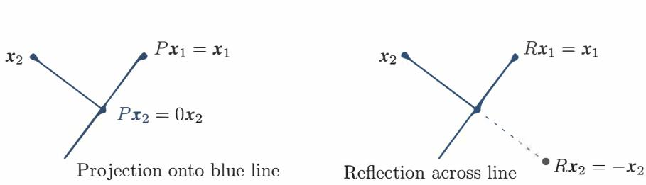
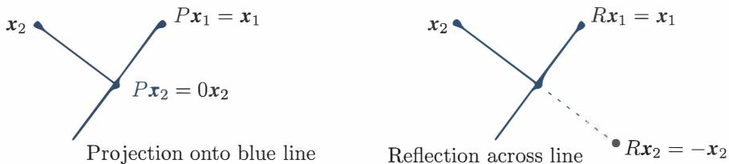
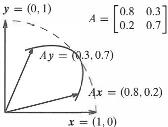
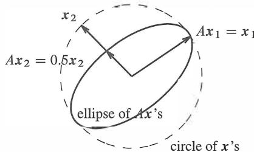
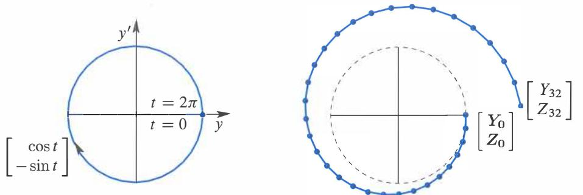
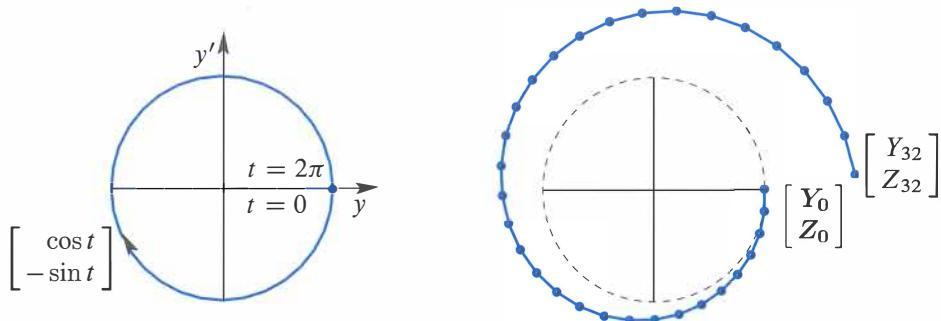
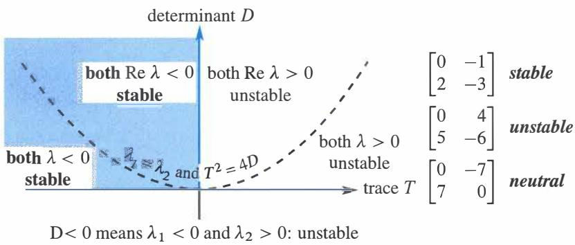
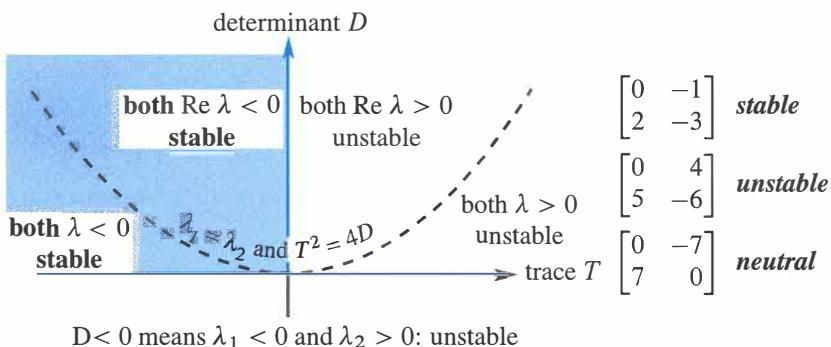
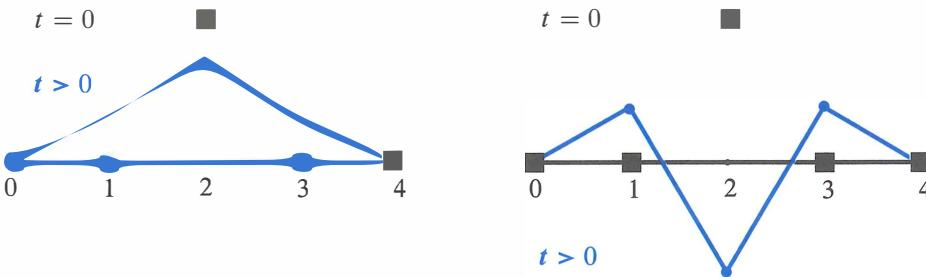
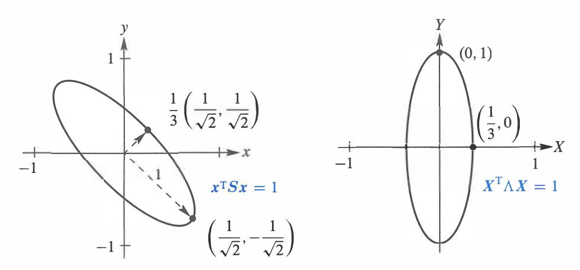

# **Chapter 6**

# **Eigenvalues and Eigenvectors**

# **6.1 Introduction to Eigenvalues**

An **eigenvector** *x* lies along the same line as *Ax* : I *Ax* = *Ax.* I The **eigenvalue** is *A.*  2 If *Ax* = *AX* then *A2x* = *A x* and *A-1x* = *A-1x* and *(A+ cI)x* = *(A+* c)x: the same *x.*  If *Ax* = *AX* then *(A->-I)x* = **0** and *A-Al* is singular and I **det(A->..J)** = **0.** I *n* eigenvalues. Check A's by det A= (A1 )(A2) ···(An) and diagonal sum a11 + a22 + · · · + ann = sum of A's. Projections have *A=* 1 and 0. Reflections have 1 and -1. Rotations have *e i&* and e-i&: *complex!*

This chapter enters a new part of linear algebra. The first part was about *Ax* = b: balance and equilibrium and steady state. Now the second part is about **change.** Time enters the picture-continuous time in a differential equation *du/dt* = Au or time steps in a difference equation Uk+i = Auk. Those equations are NOT solved by elimination.

The key idea is to avoid all the complications presented by the matrix *A.* Suppose the solution vector *u(t)* stays in the direction of a fixed vector *x.* Then we only need to find the number (changing with time) that multiplies x. A number is easier than a vector. **We want "eigenvectors"** *x* **that don't change direction when you multiply by** *A.*

A good model comes from the powers *A, A* 2 , *A* 3 , . . . of a matrix. Suppose you need the hundredth power *A* 100 . Its columns are very close to the *eigenvector* ( .6, .4) :

| $A, A^2, A^3 = \begin{bmatrix} .8 & .3 \\ .2 & .7 \end{bmatrix}$ | $\begin{bmatrix} .70 & .45 \\ .30 & .55 \end{bmatrix}$ | $\begin{bmatrix} .650 & .525 \\ .350 & .475 \end{bmatrix}$ | $A^{100} \approx \begin{bmatrix} .6000 & .6000 \\ .4000 & .4000 \end{bmatrix}$ |
|------------------------------------------------------------------|--------------------------------------------------------|------------------------------------------------------------|--------------------------------------------------------------------------------|
|------------------------------------------------------------------|--------------------------------------------------------|------------------------------------------------------------|--------------------------------------------------------------------------------|

*A*100 was found by using the *eigenvalues* of *A,* not by multiplying 100 matrices. Those eigenvalues (here they are A = 1 and 1/2) are a new way to see into the heart of a matrix.

To explain eigenvalues, we first explain eigenvectors. Almost all vectors change direction, when they are multiplied by *A. Certain exceptional vectors* x *are in the same direction as Ax. Those are the "eigenvectors".* Multiply an eigenvector by *A,* and the vector *Ax* is a number>- times the original *x.* 

#### **The basic equation is** *Ax= .>-x.* **The number>- is an eigenvalue of** *A.*

The eigenvalue >- tells whether the special vector x is stretched or shrunk or reversed or left unchanged-when it is multiplied by *A.* We may find *A* = 2 or ½ or -1 or 1. The eigenvalue *A* could be zero! Then *Ax* = *Ox* means that this eigenvector *x* is in the nullspace.

If *A* is the identity matrix, every vector has *Ax= x.* All vectors are eigenvectors of *I.* All eigenvalues "lambda" are >-= 1. This is unusual to say the least. Most 2 by 2 matrices have *two* eigenvector directions and *two* eigenvalues. We will show that det(A ->-I) = 0.

This section will explain how to compute the *x's* and *A's.* It can come early in the course because we only need the determinant of a 2 by 2 matrix. Let me use det(A -*Al)* = 0 to find the eigenvalues for this first example, and then derive it properly in equation (3).

**Example 1** The matrix *A* has two eigenvalues >- =1 and>- = 1 /2. Look at det *(A-Al):*

$$A = \begin{bmatrix} .8 & -\lambda \\ .7 & .7 \end{bmatrix} = \lambda^2 - \frac{3}{2}\lambda + \frac{1}{2} = (\lambda - 1) \left( \lambda - \frac{1}{2} \right).$$

I factored the quadratic into *A* - l times *A* - ½, to see the two eigenvalues .X = 1 and .X = ½. For those numbers, the matrix *A* -*>-I* becomes *singular* (zero determinant). The eigenvectors x1 and x2 are in the nullspaces of A -I and A -½I.

*(A* - *I)x1*= 0 is *Ax1*=x1 and the first eigenvector is ( .6, .4).

(
$$A - \frac{1}{2}I$$
) $\mathbf{x}_2 = 0$  is  $A\mathbf{x}_2 = \frac{1}{2}\mathbf{x}_2$  and the second eigenvector is  $(1, -1)$ .

| $x_1 = \begin{bmatrix} .6 \\ .4 \end{bmatrix}$ | and | $Ax_1 = \begin{bmatrix} .8 & .3 \\ .2 & .7 \end{bmatrix} \begin{bmatrix} .6 \\ .4 \end{bmatrix} = x_1$ | ( $Ax = x$ means that $\lambda_1 = 1$ ) |
|------------------------------------------------|-----|--------------------------------------------------------------------------------------------------------|-----------------------------------------|
|------------------------------------------------|-----|--------------------------------------------------------------------------------------------------------|-----------------------------------------|

$$x_2 = \begin{bmatrix} 1 \\ -1 \end{bmatrix} \quad \text{and} \quad Ax_2 = \begin{bmatrix} .8 & .3 \\ .2 & .7 \end{bmatrix} \begin{bmatrix} 1 \\ -1 \end{bmatrix} = \begin{bmatrix} .5 \\ -.5 \end{bmatrix} \quad (\text{this is } \frac{1}{2} x_2 \text{ so } \lambda_2 = \frac{1}{2}).$$

If x1 is multiplied again by *A,* we still get x1 . Every power of *A* will give *Anx1* = x1 . Multiplying x2 by *A* gave ½x2, and if we multiply again we get ( ½ )2times x2 .

*When A is squared, the eigenvectors stay the same. The eigenvalues are squared.* 

This pattern keeps going, because the eigenvectors stay in their own directions (Figure 6.1) and never get mixed. The eigenvectors of *A* 100are the same x1 and x2 . The eigenvalues of A100are 1 100=1 and (½)100=very small number.

Other vectors do change direction. But all other vectors are combinations of the two eigenvectors. The first column of *A* is the combination x1+(.2)x2 :

| Separate into eigenvectors | $\begin{bmatrix} .8 \\ .2 \end{bmatrix} = x_1 + (.2)x_2 = \begin{bmatrix} .6 \\ .4 \end{bmatrix} + \begin{bmatrix} .2 \\ -.2 \end{bmatrix} \cdot (1)$ |
|----------------------------|-------------------------------------------------------------------------------------------------------------------------------------------------------|
| Then multiply by $A$       |                                                                                                                                                       |

The diagram illustrates two parallel projections of vectors 
$$Ax_1$$
 and  $Ax_2$  onto vectors  $Ax$  and  $Ax^2$ .

- **Projection 1:** The vector  $Ax_1 = x_1 = \begin{bmatrix} .6 \\ .4 \end{bmatrix}$  is projected onto the vector  $Ax = \lambda x$ , where  $\lambda = 1$ . The projection is on the  $x$ -axis, with a pointer labeled  $\lambda = 1$ .
- **Projection 2:** The vector  $Ax_2 = (.5)^2 x_2 = \begin{bmatrix} .25 \\ -.25 \end{bmatrix}$  is projected onto the vector  $Ax^2 = (1)^2 x_1 = x_1^2$ , where  $\lambda^2 = .25$ . The projection is on the  $x^2$ -axis, with a pointer labeled  $\lambda^2 = .25$ .
- **Projection 2:** The vector  $Ax = \lambda x$  is projected onto the  $x$ -axis, with a pointer labeled  $\lambda$ .
- **Projection 2:** The vector  $Ax^2 = (.5)^2 x_2 = \begin{bmatrix} .25 \\ -.25 \end{bmatrix}$  is projected onto the  $x^2$ -axis, with a pointer labeled  $\lambda^2 = .25$ .
- **Projection 2:** The vector  $Ax = \lambda x$  is projected onto the  $x^2$ -axis, with a pointer labeled  $\lambda$ .
- **Projection 2:** The vector  $Ax^2 = (.5)^2 x_2 = \begin{bmatrix} .25 \\ -.25 \end{bmatrix}$  is projected onto the  $x^2$ -axis, with a pointer labeled  $\lambda^2 = .25$ .
- **Projection 2:** The vector  $Ax = \lambda x$  is projected onto the  $x^2$ -axis, with a pointer labeled  $\lambda$ .
- **Projection 2:** The vector  $Ax^2 = (.5)^2 x_2 = \begin{bmatrix} .25 \\ -.25 \end{bmatrix}$  is projected onto the  $x^2$ -axis, with a pointer labeled  $\lambda^2 = .25$ .
- **Projection 2:** The vector  $Ax = \lambda x$  is projected onto the  $x^2$ -axis, with a pointer labeled  $\lambda$ .
- **Projection 2:** The vector  $Ax^2 = (.5)^2 x_2 = \begin{bmatrix} .25 \\ -.25 \end{bmatrix}$  is projected onto the  $x^2$ -axis, with a pointer labeled  $\lambda^2 = .25$ .

Figure 6.1: The eigenvectors keep their directions. *A2*x = >.*2*x with >. 2= 12 and ( .5)2 .

When we multiply separately for x1 and (.2)x2, *A* multiplies x2 by its eigenvalue½:

| Multiply each $x_i$ by $\lambda_i$ | $A \begin{bmatrix} .8 \\ .2 \end{bmatrix}$ | is | $x_1 + \frac{1}{2}(.2)x_2 = \begin{bmatrix} .6 \\ .4 \end{bmatrix} + \begin{bmatrix} .1 \\ -.1 \end{bmatrix} = \begin{bmatrix} .7 \\ .3 \end{bmatrix}$ |
|------------------------------------|--------------------------------------------|----|--------------------------------------------------------------------------------------------------------------------------------------------------------|
|------------------------------------|--------------------------------------------|----|--------------------------------------------------------------------------------------------------------------------------------------------------------|

*Each eigenvector is multiplied by its eigenvalue,* when we multiply by *A.* At every step x1 is unchanged and x2 is multiplied by (½), so 99 steps give the small number (½)99 :

$$A^{99} \begin{bmatrix} .8 \\ .2 \end{bmatrix} \quad \text{is really} \quad x_1 + (.2)(\frac{1}{2})^{99} x_2 = \begin{bmatrix} .6 \\ .4 \end{bmatrix} + \begin{bmatrix} \text{very} \\ \text{small} \\ \text{vector} \end{bmatrix}.$$

This is the first column of A 100 . The number we originally wrote as .6000 was not exact. We left out (.2)(½)99 which wouldn't show up for 30 decimal places.

The eigenvector x1 is a "steady state" that doesn't change (because >-1=1). The eigenvector x2 is a "decaying mode" that virtually disappears (because >-2 = .5). The higher the power of *A,* the more closely its columns approach the steady state.

This particular *A* is a *Markov matrix.* Its largest eigenvalue is A = l. Its eigenvector x1 = (.6, .4) is the *steady state-which* all columns of *A k*will approach. Section 10.3 shows how Markov matrices appear when you search with Google.

*For projection matrices P, we can see when Px is parallel to x.* The eigenvectors for>- = 1 and A = 0 fill the column space and nullspace. The column space doesn't move *(Px* = *x* ). The nullspace goes to zero *(Px* = 0 *x* ).

**Example 2** The projection matrix 
$$P = \begin{bmatrix} .5 & .5 \\ .5 & .5 \end{bmatrix}$$
 has eigenvalues  $\lambda = 1$  and  $\lambda = 0$ .

Its eigenvectors are x 1= (1, 1) and x 2= (1, -1). For those vectors, Px *1*= x 1(steady state) and Px *2*= 0 (nullspace). This example illustrates Markov matrices and singular matrices and (most important) symmetric matrices. All have special ,\'s and x's:

- **1. Markov matrix:** Each column of *P* adds to 1, so ,\ = 1 is an eigenvalue.
- **2.** Pis **singular,** so,\= 0 is an eigenvalue.
- **3.** *P*is **symmetric,** so its eigenvectors ( 1, 1) and ( 1, -1) are perpendicular.

The only eigenvalues of a projection matrix are O and 1. The eigenvectors for,\= 0 (which means Px = Ox) fill up the nullspace. The eigenvectors for,\ = 1 (which means Px = x) fill up the column space. The nullspace is projected to zero. The column space projects onto itself. The projection keeps the column space and destroys the nullspace:

| Project each part | $v = \begin{bmatrix} 1 \\ -1 \end{bmatrix} + \begin{bmatrix} 2 \\ 2 \end{bmatrix}$ | projects onto | $Pv = \begin{bmatrix} 0 \\ 0 \end{bmatrix} + \begin{bmatrix} 2 \\ 2 \end{bmatrix}$ |
|-------------------|------------------------------------------------------------------------------------|---------------|------------------------------------------------------------------------------------|
|-------------------|------------------------------------------------------------------------------------|---------------|------------------------------------------------------------------------------------|

Projections have,\ = 0 and 1. Permutations have all i>-1 = 1. The next matrix Ris a reflection and at the same time a permutation. R also has special eigenvalues.

# **Example 3 The reflection matrix** R **= [ �** 5] **has eigenvalues 1 and** -1.

The eigenvector ( 1, 1) is unchanged by *R.* The second eigenvector is ( 1, -1 )-its signs are reversed by *R.* A matrix with no negative entries can still have a negative eigenvalue! The eigenvectors for Rare the same as for *P,* because *reflection= 2(projection)* - I:

| $R = 2P - I$ | $\begin{bmatrix} 0 & 1 \\ 1 & 0 \end{bmatrix} = 2 \begin{bmatrix} .5 & .5 \\ .5 & .5 \end{bmatrix} - \begin{bmatrix} 1 & 0 \\ 0 & 1 \end{bmatrix} \cdot$ | (2) |
|--------------|----------------------------------------------------------------------------------------------------------------------------------------------------------|-----|
|--------------|----------------------------------------------------------------------------------------------------------------------------------------------------------|-----|

*When a matrix is shifted by I, each.Xis shifted by* 1. No change in eigenvectors.

Figure 6.2: Projections *P* have eigenvalues 1 and 0. Reflections *R* have ,\ = 1 and -1. A typical x changes direction, but an eigenvector stays along the same line.

# **The Equation for the Eigenvalues**

For projection matrices we found A's and x's by geometry: *Px* = *x* and *Px* = 0. For other matrices we use determinants and linear algebra. *This is the key calculation in the chapter-almost* every application starts by solving *Ax* = *Ax.*

**First move** *>.x* **to the left side.** Write the equation *Ax* = *Ax* as *(A* - *AI)x* = **0.** The matrix *A* - Al times the eigenvector *x* is the zero vector. *The eigenvectors make up the nullspace of A* - *>.I.* When we know an eigenvalue *A,* we find an eigenvector by solving *(A* - *AI)x* = 0.

Eigenvalues first. If *(A* - *AI)x* = 0 has a nonzero solution, *A* - *Al* is not invertible. *The determinant of A* - *>.I must be zero.* This is how to recognize an eigenvalue A:

**Eigenvalues** The number *A* is an eigenvalue of *A* if and only if *A* - *Al* is singular.

| Equation for the eigenvalues | $\det(A - \lambda I) = 0.$ | (3) |
|------------------------------|----------------------------|-----|
|                              |                            |     |

This *"characteristic polynomial"* det(A - *AI)* involves only>., not *x.* When *A* is n by n, equation (3) has degree n. Then *A* has n eigenvalues (repeats possible!) Each A leads to x:

**For each eigenvalue>. solve** *(A* - *AI)x* = 0 or *Ax= Ax* **to find an eigenvector** *x.*

**Example 4** *A=* [ � ! ] is already singular (zero determinant). Find its A's and x's.

When *A* is singular, *A* = 0 is one of the eigenvalues. The equation *Ax* = *Ox* has solutions. They are the eigenvectors for *A=* 0. But det(A - *AI)* = 0 is the way to find *all* A's and x's. Always subtract Al from A:

| Subtract $\lambda$ from the diagonal to find | $A - \lambda I = \begin{bmatrix} 1 - \lambda & 2 \\ 2 & 4 - \lambda \end{bmatrix}$ | (4) |
|----------------------------------------------|------------------------------------------------------------------------------------|-----|
|----------------------------------------------|------------------------------------------------------------------------------------|-----|

*Take the determinant "ad* - *be" of this* 2 *by* 2 *matrix.* From 1 - *A* times 4 - *A,* the *"ad"* part is A 2 -*5A* + 4. The *"be"* part, not containing *A,* is 2 times 2.

$$\det \begin{bmatrix} 1 - \lambda & 2 \\ 2 & 4 - \lambda \end{bmatrix} = (1 - \lambda)(4 - \lambda) - (2)(2) = \lambda^2 - 5\lambda. \quad (5)$$

*Set this determinant* >. 2 - 5>. *to zero.* One solution is A = 0 (as expected, since *A* is singular). Factoring into *A* times *A* - 5, the other root is *A* = 5:

| $\det(A - \lambda I) = \lambda^2 - 5\lambda = 0$ | yields the eigenvalues | $\lambda_1 = 0$ | and | $\lambda_2 = 5$ |
|--------------------------------------------------|------------------------|-----------------|-----|-----------------|
|                                                  |                        |                 |     |                 |

Now find the eigenvectors. Solve *(A* - *>..I)x* = 0 separately for >..1 = 0 and >..2 = 5:

$$(A - 0I)\mathbf{x} = \begin{bmatrix} 1 & 2 \\ 2 & 4 \end{bmatrix} \begin{bmatrix} y \\ z \end{bmatrix} = \begin{bmatrix} 0 \\ 0 \end{bmatrix} \text{ yields an eigenvector } \begin{bmatrix} y \\ z \end{bmatrix} = \begin{bmatrix} 2 \\ -1 \end{bmatrix} \text{ for } \lambda_1 = 0$$

$$(A - 5I)\mathbf{x} = \begin{bmatrix} -4 & 2 \\ 2 & -1 \end{bmatrix} \begin{bmatrix} y \\ z \end{bmatrix} = \begin{bmatrix} 0 \\ 0 \end{bmatrix} \text{ yields an eigenvector } \begin{bmatrix} y \\ z \end{bmatrix} = \begin{bmatrix} 1 \\ 2 \end{bmatrix} \text{ for } \lambda_2 = 5.$$

The matrices *A* - *OJ* and *A* - *51* are singular (because O and 5 are eigenvalues). The eigenvectors (2, -1) and (1, 2) are in the nullspaces: *(A* - *>..I)x* = 0 is *Ax= >..x.* 

We need to emphasize: *There is nothing exceptional about >..* = 0. Like every other number, zero might be an eigenvalue and it might not. If *A* is singular, the eigenvectors for *>..* = 0 fill the nullspace: *Ax* = *Ox* = 0. If *A* is invertible, zero is not an eigenvalue. We shift *A* by a multiple of *I* to *make it singular.*

In the example, the shifted matrix *A* - *51* is singular and 5 is the other eigenvalue.

**Summary** To solve the eigenvalue problem for an n by n matrix, follow these steps:

1. *Compute the determinant of A* - *>..I.* With *>..* subtracted along the diagonal, this

- determinant starts with *>..* n or -*>..* n. It is a polynomial in *>..* of degree *n.*
- 2. *Find the roots of this polynomial,* by solving det(A *>..I)* = 0. Then roots are the *n* eigenvalues of *A.* They make *A* - *>..I* singular.
- 3. For each eigenvalue>.., *solve (A >..I)x* = 0 *to find an eigenvector x.*

A note on the eigenvectors of 2 by 2 matrices. When *A* - *>..I* is singular, both rows are multiples of a vector *(a, b). The eigenvector is any multiple of (b, -a).* The example had

*>..* = 0 : rows of *A* - *OJ* in the direction ( 1, 2); eigenvector in the direction ( 2, -1) *>..* = 5 : rows of *A* - *51* in the direction (-4, 2); eigenvector in the direction (2, 4).

Previously we wrote that last eigenvector as (1, 2). Both (1, 2) and (2, 4) are correct. There is a whole *line of eigenvectors-any* nonzero multiple of x is as good as x. MATLAB's eig(A) divides by the length, to make the eigenvector into a unit vector.

We must add a warning. Some 2 by 2 matrices have only *one* line of eigenvectors. This can only happen when two eigenvalues are equal. (On the other hand *A* = *I* has equal eigenvalues and plenty of eigenvectors.) Without a full set of eigenvectors, we don't have a basis. We can't write every *v* as a combination of eigenvectors. In the language of the next section, *we can't diagonalize a matrix without n independent eigenvectors.*

# **Determinant and Trace**

Bad news first: If you add a row of *A* to another row, or exchange rows, the eigenvalues usually change. *Elimination does not preserve the >.'s.* The triangular Uhas *its* eigenvalues sitting along the diagonal-they are the pivots. But they are not the eigenvalues of A! Eigenvalues are changed when row 1 is added to row 2:

| $U = \begin{bmatrix} 1 & 3 \\ 0 & 0 \end{bmatrix}$ | has $\lambda = 0$ and $\lambda = 1$ ; | $A = \begin{bmatrix} 1 & 3 \\ 2 & 6 \end{bmatrix}$ | has $\lambda = 0$ and $\lambda = 7$ . |
|----------------------------------------------------|---------------------------------------|----------------------------------------------------|---------------------------------------|
|----------------------------------------------------|---------------------------------------|----------------------------------------------------|---------------------------------------|

Good news second: The *product* >.1*times* >-2 *and the sum* >.1+ >-2 *can be found quickly from the matrix.* For this *A,* the product is O times 7. That agrees with the determinant (which is 0). The sum of eigenvalues is O + 7. That agrees with the sum down the main diagonal (the **trace** is 1 + 6). These quick checks always work:

> *The product of the n eigenvalues equals the determinant. The sum of the n eigenvalues equals the sum of the n diagonal entries.*

The sum of the entries along the main diagonal is called the *trace* of A:

| $\lambda_1 + \lambda_2 + \cdots + \lambda_n = \mathbf{trace} = a_{11} + a_{22} + \cdots + a_{nn}$ . | (6) |
|-----------------------------------------------------------------------------------------------------|-----|
|-----------------------------------------------------------------------------------------------------|-----|

Those checks are very useful. They are proved in Problems 16-17 and again in the next section. They don't remove the pain of computing *>.'s.* But when the computation is wrong, they generally tell us so. To compute the correct *>.'s,* go back to det(A - AI) = 0.

The trace and determinant *do* tell everything when the matrix is 2 by 2. We never want to get those wrong! Here trace= 3 and det = 2, so the eigenvalues are A= 1 and 2:

$$A = \begin{bmatrix} 1 & 9 \\ 0 & 2 \end{bmatrix} \quad \text{or} \quad \begin{bmatrix} 3 & 1 \\ -2 & 0 \end{bmatrix} \quad \text{or} \quad \begin{bmatrix} 7 & -3 \\ 10 & -4 \end{bmatrix}. \quad (7)$$

And here is a question about the best matrices for finding eigenvalues : *triangular.*

**Why do the eigenvalues of a triangular matrix lie along its diagonal?** 

### **Imaginary Eigenvalues**

One more bit of news (not too terrible). The eigenvalues might not be real numbers.

**Example 5** *The* **90°** *rotation Q* = [ � -�] *has no real eigenvectors. Its eigenvalues are* ..\1 = i *and* ..\2=-i. *Then* ..\1+ ..\2= **trace** = 0 *and* ..\**1..\2** *=determinant=* l.

After a rotation, *no real vector* Qx *stays in the same direction as* x (x = 0 is useless). There cannot be an eigenvector, unless we go to *imaginary numbers.* Which we do.

To see how i = *H* can help, look at Q2 which is -*I.* If *Q* is rotation through goo , then Q2 is rotation through 180° . Its eigenvalues are -1 and -1. (Certainly -Ix = -lx.) Squaring *Q* will square each .X, so we must have ). 2 = -1. *The eigenvalues of the* goo *rotation matrix Q are* +i *and* -i, because i 2= -1.

Those .X's come as usual from det( *Q* - Al) = 0. This equation gives ).2+1 = 0. Its roots are i and -i. We meet the imaginary number i also in the eigenvectors:

| <b>Complex eigenvectors</b> | $\begin{bmatrix} 0 & -1 \\ 1 & 0 \end{bmatrix} \begin{bmatrix} 1 \\ i \end{bmatrix} = -i \begin{bmatrix} 1 \\ i \end{bmatrix}$ | and | $\begin{bmatrix} 0 & -1 \\ 1 & 0 \end{bmatrix} \begin{bmatrix} i \\ 1 \end{bmatrix} = i \begin{bmatrix} i \\ 1 \end{bmatrix}$ |
|-----------------------------|--------------------------------------------------------------------------------------------------------------------------------|-----|-------------------------------------------------------------------------------------------------------------------------------|
|-----------------------------|--------------------------------------------------------------------------------------------------------------------------------|-----|-------------------------------------------------------------------------------------------------------------------------------|

Somehow these complex vectors x1 = (1, i) and x2 = ( i, 1) keep their direction as they are rotated. Don't ask me how. This example makes the all-important point that real matrices can easily have complex eigenvalues and eigenvectors. The particular eigenvalues i and -i also illustrate two special properties of Q:

- 1. *Q*is an orthogonal matrix so the absolute value of each A is I.XI = 1.
- **2.** *Q* is a skew-symmetric matrix so each ). is pure imaginary.

A symmetric matrix ( ST = S) can be compared to a real number. A skew-symmetric matrix (AT = -A) can be compared to an imaginary number. An orthogonal matrix *(QTQ*= *I)* corresponds to a complex number with I.XI = 1. For the eigenvalues of *S* and A and Q, those are more than analogies-they are facts to be proved in Section 6.4.

The eigenvectors for all these special matrices are perpendicular. Somehow ( i, 1) and (1, i) are perpendicular (Chapter 9 explains the dot product of complex vectors).

### **Eigenvalues of** *AB* **and** *A+ B*

The first guess about the eigenvalues of *AB* is not true. An eigenvalue ). of *A* times an eigenvalue *f3* of *B* usually does *not* give an eigenvalue of *AB:*

| False proof | $ABx = A\beta x = \beta Ax = \beta\lambda x.$ | (8) |
|-------------|-----------------------------------------------|-----|
|-------------|-----------------------------------------------|-----|

It seems that *f3* times). is an eigenvalue. When xis an eigenvector for *A* and *B,* this proof is correct. *The mistake is to expect that A and B automatically share the same eigenvector* x. Usually they don't. Eigenvectors of *A* are not generally eigenvectors of *B. A* and *B* could have all zero eigenvalues while 1 is an eigenvalue of *AB:*

| $A = \begin{bmatrix} 0 & 1 \\ 0 & 0 \end{bmatrix}$ | and | $B = \begin{bmatrix} 0 & 0 \\ 1 & 0 \end{bmatrix}$ ; | then | $AB = \begin{bmatrix} 1 & 0 \\ 0 & 0 \end{bmatrix}$ | and | $A + B = \begin{bmatrix} 0 & 1 \\ 1 & 0 \end{bmatrix}$ . |
|----------------------------------------------------|-----|------------------------------------------------------|------|-----------------------------------------------------|-----|----------------------------------------------------------|
|----------------------------------------------------|-----|------------------------------------------------------|------|-----------------------------------------------------|-----|----------------------------------------------------------|

For the same reason, the eigenvalues of *A+* Bare generally not *A+ (3.* Here *A+ f3* = 0 while *A+ B* has eigenvalues 1 and -1. (At least they add to zero.)

The false proof suggests what is true. Suppose  $\boldsymbol{x}$  really is an eigenvector for both  $A$  and  $B$ . Then we do have  $AB\boldsymbol{x} = \lambda\beta\boldsymbol{x}$  and  $BA\boldsymbol{x} = \lambda\beta\boldsymbol{x}$ . When all  $n$  eigenvectors are shared, we *can* multiply eigenvalues. The test  $AB = BA$  for shared eigenvectors is important in quantum mechanics—time out to mention this application of linear algebra:

 $A$  and  $B$  share the same  $n$  independent eigenvectors if and only if  $AB = BA$ .

**Heisenberg's uncertainty principle** In quantum mechanics, the position matrix  $P$  and the momentum matrix  $Q$  do not commute. In fact  $QP - PQ = I$  (these are infinite matrices). To have  $P\boldsymbol{x} = \mathbf{0}$  at the same time as  $Q\boldsymbol{x} = \mathbf{0}$  would require  $\boldsymbol{x} = I\boldsymbol{x} = \mathbf{0}$ . If we knew the position exactly, we could not also know the momentum exactly. Problem 36 derives Heisenberg's uncertainty principle  $\|P\boldsymbol{x}\| \|Q\boldsymbol{x}\| \geq \frac{1}{2}\|\boldsymbol{x}\|^2$ .

## ■ REVIEW OF THE KEY IDEAS ■

1. 1.  $A\boldsymbol{x} = \lambda\boldsymbol{x}$  says that eigenvectors  $\boldsymbol{x}$  keep the same direction when multiplied by  $A$ .
2. 2.  $A\boldsymbol{x} = \lambda\boldsymbol{x}$  also says that  $\det(A - \lambda I) = 0$ . This determines  $n$  eigenvalues.
3. 3. The eigenvalues of  $A^2$  and  $A^{-1}$  are  $\lambda^2$  and  $\lambda^{-1}$ , with the same eigenvectors.
4. 4. The sum of the  $\lambda$ 's equals the sum down the main diagonal of  $A$  (*the trace*). The product of the  $\lambda$ 's equals the determinant of  $A$ .
5. 5. Projections  $P$ , reflections  $R$ ,  $90^\circ$  rotations  $Q$  have special eigenvalues  $1, 0, -1, i, -i$ . Singular matrices have  $\lambda = 0$ . Triangular matrices have  $\lambda$ 's on their diagonal.
6. 6. *Special properties of a matrix lead to special eigenvalues and eigenvectors.* That is a major theme of this chapter (it is captured in a table at the very end).

## ■ WORKED EXAMPLES ■

**6.1 A** Find the eigenvalues and eigenvectors of  $A$  and  $A^2$  and  $A^{-1}$  and  $A + 4I$ :

$$A = \begin{bmatrix} 2 & -1 \\ -1 & 2 \end{bmatrix} \quad \text{and} \quad A^2 = \begin{bmatrix} 5 & -4 \\ -4 & 5 \end{bmatrix}.$$

Check the trace  $\lambda_1 + \lambda_2 = 4$  and the determinant  $\lambda_1\lambda_2 = 3$ .

**Solution** The eigenvalues of  $A$  come from  $\det(A - \lambda I) = 0$ :

$$A = \begin{bmatrix} 2 & -1 \\ -1 & 2 \end{bmatrix} \quad \det(A - \lambda I) = \begin{vmatrix} 2 - \lambda & -1 \\ -1 & 2 - \lambda \end{vmatrix} = \lambda^2 - 4\lambda + 3 = 0.$$

This factors into  $(\lambda - 1)(\lambda - 3) = 0$  so the eigenvalues of  $A$  are  $\lambda_1 = 1$  and  $\lambda_2 = 3$ . For the trace, the sum  $2 + 2$  agrees with  $1 + 3$ . The determinant  $3$  agrees with the product  $\lambda_1\lambda_2$ .

The eigenvectors come separately by solving *(A* -*>-.I)x* = 0 which is *Ax* = *>-.x:*

$$\boldsymbol{\lambda} = \mathbf{1}: (A - I)\boldsymbol{x} = \begin{bmatrix} 1 & -1 \\ -1 & 1 \end{bmatrix} \begin{bmatrix} x \\ y \end{bmatrix} = \begin{bmatrix} 0 \\ 0 \end{bmatrix} \text{ gives the eigenvector } \boldsymbol{x}_1 = \begin{bmatrix} 1 \\ 1 \end{bmatrix}$$

$$\lambda = 3: \quad (A - 3I)x = \begin{bmatrix} -1 & -1 \\ -1 & -1 \end{bmatrix} \begin{bmatrix} x \\ y \end{bmatrix} = \begin{bmatrix} 0 \\ 0 \end{bmatrix} \text{ gives the eigenvector } x_2 = \begin{bmatrix} 1 \\ -1 \end{bmatrix}$$

*A* 2and A- 1and *A* + *4I* keep the *same eigenvectors as A.* Their eigenvalues are *>-.* 2and >-.- 1and>-.+ 4:

| $A^2$ has eigenvalues $1^2 = 1$ and $3^2 = 9$ | $A^{-1}$ has $\frac{1}{1}$ and $\frac{1}{3}$ | $A + 4I$ has $\frac{1}{3} + 4 = \frac{7}{3}$ |
|-----------------------------------------------|----------------------------------------------|----------------------------------------------|
|-----------------------------------------------|----------------------------------------------|----------------------------------------------|

Notes for later sections: *A* has *orthogonal eigenvectors* (Section 6.4 on symmetric matrices). *A* can be *diagonalized* since >-.1 =/- >-.2 (Section 6.2). *A* is *similar* to any 2 by 2 matrix with eigenvalues 1 and 3 (Section 6.2). *A* is a *positive definite matrix* (Section 6.5) since *A* = *A T*and the *>-.'s* are positive.

### **6.1 B How can you estimate the eigenvalues of any** *A?* Gershgorin gave this answer.

Every eigenvalue of A must be "near" at least one of the entries aii on the main diagonal. For>-. to be "near ai/' means that laii ->-.i is no more than **the sum** Ri **of all other** laij I **in that row** i **of the matrix.** Then Ri = �#ilaij I is the radius of a circle centered at ai i·

**Every** A**is in the circle around one or more diagonal entries** *aii:* laii - Al :S: Ri .

Here is the reasoning. If>-. is an eigenvalue, then *A* -*>-.I* is not invertible. Then *A* -*>-.I* cannot be diagonally dominant (see Section 2.5). So at least one diagonal entry aii -*>-.* is *not larger* than the sum Ri of all other entries lai j I (we take absolute values!) in row i.

*Example 1.* Every eigenvalue *>-.* of this *A* falls into one or both of the **Gershgorin circles:** The centers are a and d, the radii are R1 = lbl and R2 = le-i

| $A = \begin{bmatrix} a & b \\ c & d \end{bmatrix}$ | First circle:  | $ \lambda - a  \leq  b $ |
|----------------------------------------------------|----------------|--------------------------|
|                                                    | Second circle: | $ \lambda - d  \leq  c $ |

Those are circles in the complex plane, since *>-.* could certainly be complex.

*Example* 2. All eigenvalues of this *A* lie in a circle of radius *R* = 3 around *one or more* of the diagonal entries d1 , d2 , *d3 :*

| $A = \begin{bmatrix} d_1 & 1 & 2 \\ 2 & d_2 & 1 \\ -1 & 2 & d_3 \end{bmatrix}$ | $ \lambda - d_1  \leq 1 + 2 = R_1$ $ \lambda - d_2  \leq 2 + 1 = R_2$ $ \lambda - d_3  \leq 1 + 2 = R_3$ |
|--------------------------------------------------------------------------------|----------------------------------------------------------------------------------------------------------------|
|--------------------------------------------------------------------------------|----------------------------------------------------------------------------------------------------------------|

**6.1 C** Find the eigenvalues and eigenvectors of this symmetric 3 by 3 matrix S:

| Symmetric matrix      |       |      |      |     |
|-----------------------|-------|------|------|-----|
| Singular matrix       | $S =$ | $-1$ | $-1$ | $0$ |
| Trace $1 + 2 + 1 = 4$ |       | $0$  | $-1$ | $1$ |

**Solution** Since all rows of S add to zero, the vector x = (1, 1, 1) gives Sx = **0.** This is an eigenvector for ,\ = 0. To find ,\2 and ,\3 I will compute the 3 by 3 determinant:

| $\det(S - \lambda I) =$ | $1 - \lambda$ | $-1$          | $0$           | $= (1 - \lambda)(2 - \lambda)(1 - \lambda) - 2(1 - \lambda)$ |
|-------------------------|---------------|---------------|---------------|--------------------------------------------------------------|
|                         | $-1$          | $2 - \lambda$ | $-1$          | $= (1 - \lambda)[(2 - \lambda)(1 - \lambda) - 2]$            |
|                         | $0$           | $-1$          | $1 - \lambda$ | $= (1 - \lambda)(-\lambda)(3 - \lambda)$                     |

Those three factors give,\ = 0, 1, 3. Each eigenvalue corresponds to an eigenvector (or a line of eigenvectors):

| $x_1 = \begin{bmatrix} 1 \\ 1 \\ 1 \\ 1 \end{bmatrix}$ | $Sx_1 = \mathbf{0}x_1$ | $x_2 = \begin{bmatrix} 1 \\ 0 \\ -1 \end{bmatrix}$ | $Sx_2 = \mathbf{1}x_2$ | $x_3 = \begin{bmatrix} 1 \\ -2 \\ 1 \end{bmatrix}$ | $Sx_3 = \mathbf{3}x_3$ |
|--------------------------------------------------------|------------------------|----------------------------------------------------|------------------------|----------------------------------------------------|------------------------|
|--------------------------------------------------------|------------------------|----------------------------------------------------|------------------------|----------------------------------------------------|------------------------|

I notice again that eigenvectors are perpendicular when *S* is symmetric. We were lucky to find,\ = 0, 1, 3. For a larger matrix I would use eig(A), and never touch determinants.

The full command [X ,E] =eig(A)will produce unit eigenvectors in the columns of *X.*

# **Problem Set 6.1**

**1**The example at the start of the chapter has powers of this matrix A:

| $A = \begin{bmatrix} .70 & .45 \\ .30 & .55 \end{bmatrix}$ | and | $A^\infty = \begin{bmatrix} .6 & .6 \\ .4 & .4 \end{bmatrix}$ |
|------------------------------------------------------------|-----|---------------------------------------------------------------|
|------------------------------------------------------------|-----|---------------------------------------------------------------|

Find the eigenvalues of these matrices. All powers have the same eigenvectors.

(a) Show from *A* how a row exchange can produce different eigenvalues.

(b) Why is a zero eigenvalue *not* changed by the steps of elimination?

2 Find the eigenvalues and the eigenvectors of these two matrices:

| $A = \begin{bmatrix} 1 & 4 \\ 2 & 3 \end{bmatrix}$ | and | $A + I = \begin{bmatrix} 2 & 4 \\ 2 & 4 \end{bmatrix}$ |
|----------------------------------------------------|-----|--------------------------------------------------------|
|----------------------------------------------------|-----|--------------------------------------------------------|

*A*+ *I*has the \_\_ eigenvectors as *A.* Its eigenvalues are \_\_ by 1.

3 Compute the eigenvalues and eigenvectors of *A* and A-1 . Check the trace!

| $A = \begin{bmatrix} 0 & 2 \\ 1 & 1 \end{bmatrix}$ | and | $A^{-1} = \begin{bmatrix} -1/2 & 1 \\ 1/2 & 0 \end{bmatrix}$ |
|----------------------------------------------------|-----|--------------------------------------------------------------|
|                                                    |     |                                                              |

A-1 has the \_\_ eigenvectors as *A.* When *A* has eigenvalues ,\1 and >.2 , its inverse has eigenvalues \_\_ .

4 Compute the eigenvalues and eigenvectors of *A* and *A*2 :

| $A = \begin{bmatrix} -1 & 3 \\ 2 & 0 \end{bmatrix}$ | and | $A^2 = \begin{bmatrix} 7 & -3 \\ -2 & 6 \end{bmatrix}$ |
|-----------------------------------------------------|-----|--------------------------------------------------------|
|-----------------------------------------------------|-----|--------------------------------------------------------|

*A*2has the same \_\_ as *A.* When *A* has eigenvalues ,\1 and ,\2, *A* 2has eigenvalues \_\_ . In this example, why is "-I+ *A§=* 13?

**5**Find the eigenvalues of *A* and *B* (easy for triangular matrices) and *A+ B:*

$$A = \begin{bmatrix} 3 & 0 \\ 1 & 1 \end{bmatrix} \quad \text{and} \quad B = \begin{bmatrix} 1 & 1 \\ 0 & 3 \end{bmatrix} \quad \text{and} \quad A + B = \begin{bmatrix} 4 & 1 \\ 1 & 4 \end{bmatrix}.$$

Eigenvalues of *A+ B (are equal to)(are not equal to)* eigenvalues of *A* plus eigenvalues of *B.* 

**6**Find the eigenvalues of *A* and *B* and *AB* and *BA:*

| $A = \begin{bmatrix} 1 & 0 \\ 1 & 1 \end{bmatrix}$ | and | $B = \begin{bmatrix} 1 & 2 \\ 0 & 1 \end{bmatrix}$ | and | $AB = \begin{bmatrix} 1 & 2 \\ 1 & 3 \end{bmatrix}$ | and | $BA = \begin{bmatrix} 3 & 2 \\ 1 & 1 \end{bmatrix}$ |
|----------------------------------------------------|-----|----------------------------------------------------|-----|-----------------------------------------------------|-----|-----------------------------------------------------|
|----------------------------------------------------|-----|----------------------------------------------------|-----|-----------------------------------------------------|-----|-----------------------------------------------------|

- (a) Are the eigenvalues of *AB* equal to eigenvalues of *A* times eigenvalues of *B?*
- (b) Are the eigenvalues of *AB* equal to the eigenvalues of *BA?* 7 Elimination produces *A* = *LU.* The eigenvalues of *U* are on its diagonal; they are the \_\_ . The eigenvalues of *L* are on its diagonal; they are all \_\_ . The eigenvalues of *A* are not the same as \_\_ . **8**(a) If you know that xis an eigenvector, the way to find,\ is to \_\_ .
- (b) If you know that ,\ is an eigenvalue, the way to find *x* is to \_\_ . 9 What do you do to the equation Ax= ,\x, in order to prove (a), (b), and (c)?
  - (a) ,\2 is an eigenvalue of A2 , as in Problem 4.
  - (b) ,\ 1is an eigenvalue of *A*  1 , as in Problem 3.
- (c) ,\ + 1 is an eigenvalue of *A+ I,* as in Problem 2. 10 Find the eigenvalues and eigenvectors for both of these Markov matrices *A* and *A* 00. Explain from those answers why *A*100is close to *A* 00:

$$A = \begin{bmatrix} .6 & .2 \\ .4 & .2 \end{bmatrix} \quad \text{and} \quad A^\infty = \begin{bmatrix} 1/3 & 1/3 \\ 2/3 & 2/3 \end{bmatrix}.$$

11 Here is a strange fact about 2 by 2 matrices with eigenvalues ,\1 -=/= ,\2 : The columns of *A* -,\1 J are multiples of the eigenvector x2 . Any idea why this should be?

12 Find three eigenvectors for this matrix *P* (projection matrices have .X = 1 and 0):

| Projection matrix | $P = \begin{bmatrix} .2 & .4 & .3 \\ .4 & .3 & .2 \\ .3 & .2 & .4 \end{bmatrix}$ |
|-------------------|----------------------------------------------------------------------------------|
|-------------------|----------------------------------------------------------------------------------|

If two eigenvectors share the same .X, so do all their linear combinations. Find an eigenvector of *P* with no zero components.

13 From the unit vector u = ( ½, ½, ¾, i) construct the rank one projection matrix P = uu T. This matrix has P2 = P because u Tu = 1.

(a) Pu= u comes from (uuT)u = u( \_\_ ). Then u is an eigenvector with

.A= 1.

(b) If v is perpendicular to u show that Pv =0. Then .X =0.

(c) Find three independent eigenvectors of Pall with eigenvalue .X = 0.

**14**Solve det( Q - AI) =0 by the quadratic formula to reach .X =cos *0* ± i sin 0:

| $Q = \begin{bmatrix} \cos \theta & -\sin \theta \\ \sin \theta & \cos \theta \end{bmatrix}$ | rotates the $xy$ plane by the angle $\theta$ . No real $\lambda$ 's. |
|---------------------------------------------------------------------------------------------|----------------------------------------------------------------------|
|---------------------------------------------------------------------------------------------|----------------------------------------------------------------------|

Find the eigenvectors of Q by solving ( Q - *.XI)x* = 0. Use i 2= -1.

15 Every permutation matrix leaves x = (1, 1, ... , 1) unchanged. Then .X = 1. Find two more A's (possibly complex) for these permutations, from det(P - .XI) = 0:

| $P = \begin{bmatrix} 0 & 1 & 0 \\ 0 & 0 & 1 \\ 1 & 0 & 0 \end{bmatrix}$ | and | $P = \begin{bmatrix} 0 & 0 & 1 \\ 0 & 1 & 0 \\ 1 & 0 & 0 \end{bmatrix}$ |
|-------------------------------------------------------------------------|-----|-------------------------------------------------------------------------|
|-------------------------------------------------------------------------|-----|-------------------------------------------------------------------------|

**16 The determinant of** A **equals the product** .X1.X2· · · >-n - Start with the polynomial det(A - Al) separated into its n factors (always possible). Then set .X = 0:

| $\det(A - \lambda I) = (\lambda_1 - \lambda)(\lambda_2 - \lambda) \cdots (\lambda_n - \lambda)$ | $\det A =$ |
|-------------------------------------------------------------------------------------------------|------------|
|-------------------------------------------------------------------------------------------------|------------|

Check this rule in Example **1** where the Markov matrix has .X = 1 and ½.

17 The sum of the diagonal entries (the *trace)* equals the sum of the eigenvalues:

| $A = \begin{bmatrix} a & b \\ c & d \end{bmatrix}$ | has | $\det(A - \lambda I) = \lambda^2 - (a+d)\lambda + ad - bc = 0.$ |
|----------------------------------------------------|-----|-----------------------------------------------------------------|
|----------------------------------------------------|-----|-----------------------------------------------------------------|

The quadratic formula gives the eigenvalues .X = *(a+ d* + r) / 2 and .X = \_\_. Their sum is \_\_ . If A has .X1 = 3 and .X2 = 4 then det(A - .XI) = \_\_ .

**18**If A has .X1 = 4 and .X2 = 5 then det(A - .XI)= (.X - 4)(.X - 5) = .X2 - 9.X + 20. Find three matrices that have trace *a+ d* = 9 and determinant 20 and .X = 4, 5.

- 19 A 3 by 3 matrix Bis known to have eigenvalues 0, 1, 2. This information is enough to find three of these (give the answers where possible) :
  - (a) the rank of *B*
- (b) the determinant of *BTB* ( c) the eigenvalues of *BTB*  ( d) the eigenvalues of ( B2+J)-1 . 20 Choose the last rows of *A* and *C* to give eigenvalues 4, 7 and 1, 2, 3:

| Companion matrices | $A = \begin{bmatrix} 0 & 1 \\ * & * \end{bmatrix}$ | $C = \begin{bmatrix} 0 & 1 \\ 0 & 0 \\ * & * \end{bmatrix}$ |
|--------------------|----------------------------------------------------|-------------------------------------------------------------|
|--------------------|----------------------------------------------------|-------------------------------------------------------------|

21 *The eigenvalues of A equal the eigenvalues of AT .* This is because <let ( *A* - *Al)*  equals det *(AT*- *>.I).* That is true because \_\_ . Show by an example that the eigenvectors of *A* and *A T*are *not* the same. 22 Construct any 3 by 3 Markov matrix M: positive entries down each column add to 1. Show that MT (l, 1, 1) = (1, 1, 1). By Problem 21, *>.* = l is also an eigenvalue of *M.* Challenge: A 3 by 3 singular Markov matrix with trace ½ has what *>.'s?* 23 Find three 2 by 2 matrices that have >.1=>.2=0. The trace is zero and the determinant is zero. *A* might not be the zero matrix but check that A 2= 0. 24 This matrix is singular with rank one. Find three >.'s and three eigenvectors:

$$A = \begin{bmatrix} 1 \\ 2 \\ 1 \end{bmatrix} \begin{bmatrix} 2 & 1 & 2 \\ 4 & 2 & 4 \\ 2 & 1 & 2 \end{bmatrix}.$$

25 Suppose *A* and *B* have the same eigenvalues >.1 , ... , An with the same independent eigenvectors x1 , ... , *Xn.* Then *A* = *B. Reason:* Any vector *x* is a combination c1X1 + · · · + *CnXn-* What is *Ax?* What is *Bx?* 26 The block *B* has eigenvalues 1, 2 and *C* has eigenvalues 3, 4 and *D* has eigenvalues 5, 7. Find the eigenvalues of the 4 by 4 matrix A:

$$A = \begin{bmatrix} B & C \\ 0 & D \end{bmatrix} = \begin{bmatrix} 0 & 1 & 3 & 0 \\ -2 & 3 & 0 & 4 \\ 0 & 0 & 6 & 1 \\ 0 & 0 & 1 & 0 \end{bmatrix}$$

**27**Find the rank and the four eigenvalues of *A* and **C:**

$$A = \begin{bmatrix} 1 & 1 & 1 & 1 \\ 1 & 1 & 1 & 1 \\ 1 & 1 & 1 & 1 \\ 1 & 1 & 1 & 1 \end{bmatrix} \quad \text{and} \quad C = \begin{bmatrix} 1 & 0 & 0 & 1 \\ 0 & 1 & 0 & 1 \\ 1 & 0 & 1 & 0 \\ 0 & 1 & 0 & 1 \end{bmatrix}.$$

28 Subtract  $I$  from the previous  $A$ . Find the  $\lambda$ 's and then the determinants of

$$B = A - I = \begin{bmatrix} 0 & 1 & 1 & 1 \\ 1 & 0 & 1 & 1 \\ 1 & 1 & 0 & 1 \\ 1 & 1 & 1 & 0 \end{bmatrix} \quad \text{and} \quad C = I - A = \begin{bmatrix} 0 & -1 & -1 & -1 \\ -1 & 0 & -1 & -1 \\ -1 & -1 & 0 & -1 \\ -1 & -1 & -1 & 0 \end{bmatrix}.$$

29 (Review) Find the eigenvalues of  $A$ ,  $B$ , and  $C$ :

$$A = \begin{bmatrix} 1 & 2 & 3 \\ 0 & 4 & 5 \\ 0 & 0 & 6 \end{bmatrix} \quad \text{and} \quad B = \begin{bmatrix} 0 & 0 & 1 \\ 0 & 2 & 0 \\ 3 & 0 & 0 \end{bmatrix} \quad \text{and} \quad C = \begin{bmatrix} 2 & 2 & 2 \\ 2 & 2 & 2 \\ 2 & 2 & 2 \end{bmatrix}.$$

30 When  $a + b = c + d$  show that  $(1, 1)$  is an eigenvector and find both eigenvalues:

$$A = \begin{bmatrix} a & b \\ c & d \end{bmatrix}.$$

31 If we exchange rows 1 and 2 and columns 1 and 2, the eigenvalues don't change. Find eigenvectors of  $A$  and  $B$  for  $\lambda = 11$ . Rank one gives  $\lambda_2 = \lambda_3 = 0$ .

$$A = \begin{bmatrix} 1 & 2 & 1 \\ 3 & 6 & 3 \\ 4 & 8 & 4 \end{bmatrix} \quad \text{and} \quad B = PAP^T = \begin{bmatrix} 6 & 3 & 3 \\ 2 & 1 & 1 \\ 8 & 4 & 4 \end{bmatrix}.$$

32 Suppose  $A$  has eigenvalues 0, 3, 5 with independent eigenvectors  $u, v, w$ .

1. Give a basis for the nullspace and a basis for the column space.
2. Find a particular solution to  $Ax = v + w$ . Find all solutions.
3. $Ax = u$  has no solution. If it did then \_\_\_\_\_ would be in the column space.

### Challenge Problems

33 Show that  $u$  is an eigenvector of the rank one  $2 \times 2$  matrix  $A = uv^T$ . Find both eigenvalues of  $A$ . Check that  $\lambda_1 + \lambda_2$  agrees with the trace  $u_1v_1 + u_2v_2$ .

34 Find the eigenvalues of this permutation matrix  $P$  from  $\det(P - \lambda I) = 0$ . Which vectors are not changed by the permutation? They are eigenvectors for  $\lambda = 1$ . Can you find three more eigenvectors?

$$P = \begin{bmatrix} 0 & 0 & 0 & 1 \\ 1 & 0 & 0 & 0 \\ 0 & 1 & 0 & 0 \\ 0 & 0 & 1 & 0 \end{bmatrix}.$$

35 There are six 3 by 3 permutation matrices  $P$ . What numbers can be the *determinants* of  $P$ ? What numbers can be *pivots*? What numbers can be the *trace* of  $P$ ? What *four numbers* can be eigenvalues of  $P$ , as in Problem 15?

36 **(Heisenberg's Uncertainty Principle)**  $AB - BA = I$  can happen for infinite matrices with  $A = A^T$  and  $B = -B^T$ . Then

$$x^T x = x^T A B x - x^T B A x \leq 2 \|Ax\| \|Bx\|.$$

Explain that last step by using the Schwarz inequality  $|u^T v| \leq \|u\| \|v\|$ . Then Heisenberg's inequality says that  $\|Ax\|/\|x\|$  times  $\|Bx\|/\|x\|$  is at least  $\frac{1}{2}$ . It is impossible to get the position error and momentum error both very small.

37 Find a 2 by 2 rotation matrix (other than  $I$ ) with  $A^3 = I$ . Its eigenvalues must satisfy  $\lambda^3 = 1$ . They can be  $e^{2\pi i/3}$  and  $e^{-2\pi i/3}$ . What are the trace and determinant?

38 (a) Find the eigenvalues and eigenvectors of  $A$ . They depend on  $c$ :

$$A = \begin{bmatrix} .4 & 1-c \\ .6 & c \end{bmatrix}.$$

(b) Show that  $A$  has just one line of eigenvectors when  $c = 1.6$ .  
 (c) This is a Markov matrix when  $c = .8$ . Then  $A^n$  will approach what matrix  $A^\infty$ ?

### Eigshow in MATLAB

There is a MATLAB demo (just type **eigshow**), displaying the eigenvalue problem for a 2 by 2 matrix. It starts with the unit vector  $x = (1, 0)$ . *The mouse makes this vector move around the unit circle.* At the same time the screen shows  $Ax$ , in color and also moving. Possibly  $Ax$  is ahead of  $x$ . Possibly  $Ax$  is behind  $x$ . *Sometimes  $Ax$  is parallel to  $x$ .*

At that parallel moment,  $Ax = \lambda x$  (at  $x_1$  and  $x_2$  in the second figure).

These are not eigenvectors

 $Ax$  lines up with  $x$  at eigenvectors

The eigenvalue  $\lambda$  is the length of  $Ax$ , when the unit eigenvector  $x$  lines up. The built-in choices for  $A$  illustrate three possibilities: 0, 1, or 2 real vectors where  $Ax$  crosses  $x$ .

The axes of the ellipse are **singular vectors** in 7.4—and eigenvectors if  $A^T = A$ .

# **6.2 Diagonalizing a Matrix**

**1**The columns of AX = XA are Axk = AkXk . The eigenvalue matrix A is diagonal. 2 n independent eigenvectors in *X* diagonalize *A* I *A* = XAx-**1** and A= x-**1***AX* I 3 The eigenvector matrix *X* also diagonalizes all powers *A k* : I *A k*= *X* A *k***x- 1**I 4 Solve Uk+l = Auk by Uk =A kuo = XAk*x- 1*uo = I c1(.X1) kx1 + ... + Cn(An) kxn I **5 No equal eigenvalues=}** *X* is invertible and *A* can be diagonalized. **Equal eigenvalues=}** *A might* have too few independent eigenvectors. Then x- 1fails. 6 Every matrix *C* = B-1*AB* has the **same eigenvalues** as *A.* These C's are **"similar"** to *A.*

When *x* is an eigenvector, multiplication by *A* is just multiplication by a number >-.: Ax = >-.x. All the difficulties of matrices are swept away. Instead of an interconnected system, we can follow the eigenvectors separately. It is like having a *diagonal matrix,* with no off-diagonal interconnections. The 100th power of a diagonal matrix is easy.

The point of this section is very direct. *The matrix A turns into a diagonal matrix* **A** *when we use the eigenvectors properly.* This is the matrix form of our key idea. We start right off with that one essential computation. The next page explains why *AX* = *X* A.

**Diagonalization** Suppose the n by n matrix *A* has n linearly independent eigenvectors x1, ... , Xn . Put them into the columns of an *eigenvector matrix X.* Then *x-1*AX is the *eigenvalue matrix* A:

Eigenvector matrix 
$$X$$
  
Eigenvalue matrix  $\Lambda$ 

$$X^{-1}AX = \Lambda = \begin{bmatrix} \lambda_1 & & & \\ & \ddots & & \\ & & \lambda_n & \\ & & & 1 \end{bmatrix}, \quad (1)$$

The matrix *A* is "diagonalized." We use capital lambda for the eigenvalue matrix, because the small A's (the eigenvalues) are on its diagonal.

**Example 1** This A is triangular so its eigenvalues are on the diagonal: >-. = land>-.= 6.

| <b>Eigenvectors go into <math display="block">X</math></b> | <b><math>\begin{bmatrix} 1 \\ 0 \end{bmatrix}</math></b> | <b><math>\begin{bmatrix} 1 \\ 1 \end{bmatrix}</math></b> | <b><math>\begin{bmatrix} 1 &amp; 5 \\ 0 &amp; 6 \end{bmatrix}</math></b> | <b><math>\begin{bmatrix} 1 &amp; 1 \\ 0 &amp; 1 \end{bmatrix}</math></b> | <b><math>=</math></b> | <b><math>\begin{bmatrix} 1 &amp; 0 \\ 0 &amp; 6 \end{bmatrix}</math></b> |                       |
|------------------------------------------------------------|----------------------------------------------------------|----------------------------------------------------------|--------------------------------------------------------------------------|--------------------------------------------------------------------------|-----------------------|--------------------------------------------------------------------------|-----------------------|
|                                                            |                                                          |                                                          | <b><math>X^{-1}</math></b>                                               | <b><math>A</math></b>                                                    | <b><math>X</math></b> | <b><math>=</math></b>                                                    | <b><math>A</math></b> |

In other words A =XAx- 1 . Then watch A 2= XAx- 1XAx- 1 . So *A2***is** XA**2** x-**1 .** 

> *A*2*has the same eigenvectors in X and squared eigenvalues in* **A** 2 .

**Why is** *AX* = *X* **A** ? *A* multiplies its eigenvectors, which are the columns of *X.* The first column of *AX* is *Ax1.* That is A1x1 . Each column of *X* is multiplied by its eigenvalue :

$$A \text{ times } X \quad AX = A \begin{bmatrix} x_1 & \cdots & x_n \end{bmatrix} = \begin{bmatrix} \lambda_1 x_1 & \cdots & \lambda_n x_n \end{bmatrix}$$

The trick is to split this matrix *AX* into *X* times A:

$$X \text{ times } \Lambda \quad \begin{bmatrix} \lambda_1 x_1 & \cdots & \lambda_n x_n \end{bmatrix} = \begin{bmatrix} x_1 & \cdots & x_n \end{bmatrix} \begin{bmatrix} \lambda_1 & & & \\ & \ddots & & \\ & & \lambda_n & \\ & & & \lambda_n \end{bmatrix} = X \Lambda.$$

Keep those matrices in the right order! Then A1multiplies the first column x1, as shown. The diagonalization is complete, and we can write *AX* = *X* A in two good ways:

| $AX = X\Lambda$ | is | $X^{-1}AX = \Lambda$ | or | $A = X\Lambda X^{-1}$ | (2) |
|-----------------|----|----------------------|----|-----------------------|-----|
|                 |    |                      |    |                       |     |

The matrix *X* has an inverse, because its columns (the eigenvectors of *A)* were assumed to be linearly independent. *Without n independent eigenvectors, we can't diagonalize.*

*A* and A have the same eigenvalues A1 , ... , An · The eigenvectors are different. The job of the original eigenvectors x1, ... , *Xn* was to diagonalize *A.* Those eigenvectors in *X* produce *A* = *X* Ax-1 . You will soon see their simplicity and importance and meaning. The *kth* power will be Ak = *X* A kx- 1which is easy to compute:

$$A^k = (X \Lambda X^{-1})(X \Lambda X^{-1}) \dots (X \Lambda X^{-1}) = X \Lambda^k X^{-1}.$$

| <b>Powers of <math display="block">A</math></b> | $\begin{bmatrix} 1 & 5 \\ 0 & 6 \end{bmatrix}^k = \begin{bmatrix} 1 & 1 \\ 0 & 1 \end{bmatrix} \begin{bmatrix} 1 & 6 \\ 0 & 1 \end{bmatrix} \begin{bmatrix} 1 & -1 \\ 0 & 1 \end{bmatrix} = \begin{bmatrix} 1 & 6^6 - 1 \\ 0 & 6^6 \end{bmatrix} = A^k$ |
|-------------------------------------------------|---------------------------------------------------------------------------------------------------------------------------------------------------------------------------------------------------------------------------------------------------------|
|-------------------------------------------------|---------------------------------------------------------------------------------------------------------------------------------------------------------------------------------------------------------------------------------------------------------|

*With k* = 1 *we get A. With k* = 0 *we get A 0*= *I* (and *A o=* 1). *With k* = -1 *we get* A- 1 . You can see how A 2= [1 35; 0 36] fits that formula when *k* = 2.

Here are four small remarks before we use A again in Example 2.

**Remark 1** Suppose the eigenvalues A1, ... ,An are all different. Then it is automatic that the eigenvectors x1, .. . , *Xn* are independent. The eigenvector matrix *X* will be *invertible. Any matrix that has no repeated eigenvalues can be diagonalized.* 

**Remark 2** *We can multiply eigenvectors by any nonzero constants.* A( *ex)* = A( *ex)* is still true. In Example 1, we can divide x = ( 1, 1) by v2 to produce a unit vector.

MATLAB and virtually all other codes produce eigenvectors of length I lxl I = 1.

**Remark 3** The eigenvectors in *X* come in the same order as the eigenvalues in A. To reverse the order in A, put the eigenvector ( 1, 1) before ( 1, 0) in X:

| New order 6, 1 | $\begin{bmatrix} 1 & 1 \\ 1 & -1 \end{bmatrix}$ | $\begin{bmatrix} 1 & 5 \\ 0 & 6 \end{bmatrix}$ | $\begin{bmatrix} 1 & 1 \\ 1 & 0 \end{bmatrix}$ | $= \begin{bmatrix} 6 & 0 \\ 0 & 1 \end{bmatrix}$ | $= \Lambda_{\text{new}}$ |
|----------------|-------------------------------------------------|------------------------------------------------|------------------------------------------------|--------------------------------------------------|--------------------------|
|                |                                                 |                                                |                                                |                                                  |                          |

To diagonalize *A* we *must* use an eigenvector matrix. From x- 1*AX* = A we know that *AX* = *X* A. Suppose the first column of *X* is *x.* Then the first columns of *AX* and *X* A are *Ax* and ,\1 *x.* For those to be equal, *x* must be an eigenvector.

**Remark 4** (repeated warning for repeated eigenvalues) Some matrices have too few eigenvectors. *Those matrices cannot be diagonalized.* Here are two examples:

| Not diagonalizable | $A = \begin{bmatrix} 1 & -1 \\ 1 & 1 \end{bmatrix}$ | and | $B = \begin{bmatrix} 0 & 1 \\ 0 & 0 \end{bmatrix}$ |
|--------------------|-----------------------------------------------------|-----|----------------------------------------------------|
|--------------------|-----------------------------------------------------|-----|----------------------------------------------------|

Their eigenvalues happen to be O and 0. Nothing is special about A = 0, the problem is the repetition of >.. All eigenvectors of the first matrix are multiples of ( 1, 1):

| <b>Only one line of eigenvectors</b> | $Ax = 0x$ | means | $\begin{bmatrix} 1 & -1 \\ 1 & -1 \end{bmatrix} \begin{bmatrix} x \\ x \end{bmatrix} = \begin{bmatrix} 0 \\ 0 \end{bmatrix}$ | and | $x = c \begin{bmatrix} 1 \\ 1 \end{bmatrix}$ |
|--------------------------------------|-----------|-------|------------------------------------------------------------------------------------------------------------------------------|-----|----------------------------------------------|
|--------------------------------------|-----------|-------|------------------------------------------------------------------------------------------------------------------------------|-----|----------------------------------------------|

There is no second eigenvector, so this unusual matrix *A* cannot be diagonalized.

Those matrices are the best examples to test any statement about eigenvectors. In many true-false questions, non-diagonalizable matrices lead to *false.*

Remember that there is no connection between invertibility and diagonalizability:

*Invertibility* is concerned with the *eigenvalues* (,\ = 0 or ,\ =/= 0).

*Diagonalizability* is concerned with the *eigenvectors* (too few or enough for X).

Each eigenvalue has at least one eigenvector! *A* - *Al* is singular. If *(A* - *AI)x* = 0 leads you to *x* = 0, A is *not* an eigenvalue. Look for a mistake in solving **det(A - AI)** = 0.

**Eigenvectors for** *n* **different** *A's* **are independent. Then we can diagonalize** *A.*

**Independent** x **from different** ,\ Eigenvectors x1, ... , Xj that correspond to distinct (all different) eigenvalues are linearly independent. An n by n matrix that has n different eigenvalues (no repeated A's) must be diagonalizable.

*Proof* Suppose c1x1 + c2x2 = 0. Multiply by *A* to find c1>-1x1 + c2>-2x2 = 0. Multiply by >.2 to find c1 >.2x1 + c2>.2x2=0. Now subtract one from the other:

**Subtraction leaves** 
$$(\lambda_1 - \lambda_2)c_1 \mathbf{x}_1 = \mathbf{0}$$
. Therefore  $c_1 = 0$ .

Since the ,\'s are different and x1 =/- 0, we are forced to the conclusion that c1 = 0. Similarly c2 = 0. Only the combination with c1 = c2 = 0 gives c1X1 + c2X2 = 0. So the eigenvectors x1 and x2 must be independent.

This proof extends directly to  $j$  eigenvectors. Suppose that  $c_1x_1 + \cdots + c_jx_j = \mathbf{0}$ . Multiply by  $A$ , multiply by  $\lambda_j$ , and subtract. This multiplies  $x_j$  by  $\lambda_j - \lambda_j = 0$ , and  $x_j$  is gone. Now multiply by  $A$  and by  $\lambda_{j-1}$  and subtract. This removes  $x_{j-1}$ . Eventually only  $x_1$  is left:

We reach  $(\lambda_1 - \lambda_2) \cdots (\lambda_1 - \lambda_j)c_1x_1 = \mathbf{0}$  which forces  $c_1 = 0$ . (3)

Similarly every  $c_i = 0$ . When the  $\lambda$ 's are all different, the eigenvectors are independent. A full set of eigenvectors can go into the columns of the eigenvector matrix  $X$ .

**Example 2 Powers of  $A$**  The Markov matrix  $A = \begin{bmatrix} .8 & .3 \\ .7 & .4 \end{bmatrix}$  in the last section had  $\lambda_1 = 1$  and  $\lambda_2 = .5$ . Here is  $A = X\Lambda X^{-1}$  with those eigenvalues in the diagonal  $\Lambda$ :

$$\text{Markov example} \quad \begin{bmatrix} .8 & .3 \\ .7 & .4 \end{bmatrix} = \begin{bmatrix} .6 & 1 \\ .4 & -1 \end{bmatrix} \begin{bmatrix} 1 & 0 \\ 0 & .5 \end{bmatrix} \begin{bmatrix} 1 & 1 \\ .4 & -.6 \end{bmatrix} = X\Lambda X^{-1}.$$

The eigenvectors  $(.6, .4)$  and  $(1, -1)$  are in the columns of  $X$ . They are also the eigenvectors of  $A^2$ . Watch how  $A^2$  has the same  $X$ , and *the eigenvalue matrix of  $A^2$  is  $\Lambda^2$* :

Same  $X$  for  $A^2$ 

$$A^2 = X\Lambda X^{-1}X\Lambda X^{-1} = X\Lambda^2 X^{-1}. \quad (4)$$

Just keep going, and you see why the high powers  $A^k$  approach a “steady state”:

$$\text{Powers of } A \quad A^k = X\Lambda^k X^{-1} = \begin{bmatrix} .6 & 1 \\ .4 & -1 \end{bmatrix} \begin{bmatrix} 1^k & 0 \\ 0 & (.5)^k \end{bmatrix} \begin{bmatrix} 1 & 1 \\ .4 & -.6 \end{bmatrix}.$$

As  $k$  gets larger,  $(.5)^k$  gets smaller. In the limit it disappears completely. That limit is  $A^\infty$ :

$$\text{Limit } k \rightarrow \infty \quad A^\infty = \begin{bmatrix} .6 & 1 \\ .4 & -1 \end{bmatrix} \begin{bmatrix} 1 & 0 \\ 0 & 0 \end{bmatrix} \begin{bmatrix} 1 & 1 \\ .4 & -.6 \end{bmatrix} = \begin{bmatrix} .6 & .6 \\ .4 & .4 \end{bmatrix}.$$

The limit has the eigenvector  $x_1$  in both columns. We saw this  $A^\infty$  on the very first page of Chapter 6. Now we see it coming from powers like  $A^{100} = X\Lambda^{100}X^{-1}$ .

**Question**

**When does  $A^k \rightarrow$  zero matrix?**

**Answer**

**All  $|\lambda| < 1$ .**

### Similar Matrices: Same Eigenvalues

Suppose the eigenvalue matrix  $\Lambda$  is fixed. As we change the eigenvector matrix  $X$ , we get a whole family of different matrices  $A = X\Lambda X^{-1}$ —all with the same eigenvalues in  $\Lambda$ . All those matrices  $A$  (with the same  $\Lambda$ ) are called **similar**.

This idea extends to matrices that can't be diagonalized. Again we choose one constant matrix  $C$  (not necessarily  $\Lambda$ ). And we look at the whole family of matrices  $A = BCB^{-1}$ , allowing all invertible matrices  $B$ . Again those matrices  $A$  and  $C$  are called **similar**.

We are using *C* instead of A because *C* might not be diagonal. We are using *B* instead of *X* because the columns of *B* might not be eigenvectors. We only require that *B* is invertible-its columns can contain any basis for R n . The key fact about similar matrices stays true. **Similar matrices** *A* **and** *C* **have the same eigenvalues.**

### **All the matrices A** = **BCB-***1***are "similar." They all share the eigenvalues of** *C.*

*Proof* Suppose Cx = >.x. Then BCB-*1* has the same eigenvalue).. with the new eigenvector Bx :

| <b>Same <math display="block">\lambda</math></b> | $(BCB^{-1})(Bx) = BCx = B\lambda x = \lambda(Bx)$ . | (5) |
|--------------------------------------------------|-----------------------------------------------------|-----|
|--------------------------------------------------|-----------------------------------------------------|-----|

A fixed matrix C produces a family of similar matrices BC B-1 , allowing all B. When *C* is the identity matrix, the "family" is very small. The only member is *BI* B-1 = *I.* The identity matrix is the only diagonalizable matrix with all eigenvalues >. = l.

The family is larger when>. = 1 and 1 *with only one eigenvector* (not diagonalizable). The simplest *C* is the *Jordan form-to* be developed in Section 8.3. All the similar A's have two parameters rand s, not both zero : always determinant= 1 and trace= 2.

$$C = \begin{bmatrix} 1 & 1 \\ 0 & 1 \end{bmatrix} = \text{Jordan form gives } A = BCB^{-1} = \begin{bmatrix} 1 & -rs & r^2 \\ -s^2 & 1 + rs & \end{bmatrix}. \quad (6)$$

For an important example I will take eigenvalues>.= 1 and O (not repeated!). Now the whole family is diagonalizable with the same eigenvalue matrix A. We get every 2 by 2 matrix that has eigenvalues 1 and 0. The trace is 1 and the determinant is zero:

| All similar | $\Lambda = \begin{bmatrix} 1 & 0 \\ 0 & 0 \end{bmatrix}$ | $A = \begin{bmatrix} 1 & 1 \\ 0 & 0 \end{bmatrix}$ | or | $A = \begin{bmatrix} .5 & .5 \\ .5 & .5 \end{bmatrix}$ | or any $A = \frac{xy}{x^T y}$ |
|----------------|----------------------------------------------------------|----------------------------------------------------|----|--------------------------------------------------------|-------------------------------|
|----------------|----------------------------------------------------------|----------------------------------------------------|----|--------------------------------------------------------|-------------------------------|

The family contains all matrices with A2 = A, including A= A when B = I. When *A*is symmetric these are also projection matrices. Eigenvalues 1 and O make life easy.

#### **Fibonacci Numbers**

We present a famous example, where eigenvalues tell how fast the Fibonacci numbers grow. *Every new Fibonacci number is the sum of the two previous* F's:

| <i>The sequence</i> | 0, 1, 1, 2, 3, 5, 8, 13, ... | <i>comes from</i> | $F_{k+2} = F_{k+1} + F_k$ |
|---------------------|------------------------------|-------------------|---------------------------|
|                     |                              |                   |                           |

These numbers turn up in a fantastic variety of applications. Plants and trees grow in a spiral pattern, and a pear tree has 8 growths for every 3 turns. For a willow those numbers can be 13 and 5. The champion is a sunflower of Daniel O'Connell, which had 233 seeds in 144 loops. Those are the Fibonacci numbers Fi3 and Fi2. Our problem is more basic.

*Problem: Find the Fibonacci number F100*The slow way is to apply the rule Fk+*2* = Fk+*1*+Fk one step at a time. By adding F6 = 8 to F1 = 13 we reach F*8* = 21. Eventually we come to F100. Linear algebra gives a better way.

The key is to begin with a matrix equation Uk+i = Auk. That is a *one-step* rule for vectors, while Fibonacci gave a two-step rule for scalars. We match those rules by putting two Fibonacci numbers into a vector. Then you will see the matrix *A.* 

**Every step multiplies by** *A=* [½A]. After 100 steps we reach u100 = A100uo:

$$\mathbf{u}_0 = \begin{bmatrix} 1 \\ 0 \end{bmatrix}, \quad \mathbf{u}_1 = \begin{bmatrix} 1 \\ 1 \end{bmatrix}, \quad \mathbf{u}_2 = \begin{bmatrix} 2 \\ 1 \end{bmatrix}, \quad \mathbf{u}_3 = \begin{bmatrix} 3 \\ 2 \end{bmatrix}, \quad \dots, \quad \mathbf{u}_{100} = \begin{bmatrix} F_{101} \\ F_{100} \end{bmatrix}.$$

This problem is just right for eigenvalues. Subtract .>. from the diagonal of A:

| $A - \lambda I = \begin{bmatrix} 1-\lambda & 1 \\ 1 & -\lambda \end{bmatrix}$ | leads to | $\det(A - \lambda I) = \lambda^2 - \lambda - 1.$ |
|-------------------------------------------------------------------------------|----------|--------------------------------------------------|
|-------------------------------------------------------------------------------|----------|--------------------------------------------------|

| Let $u_k = \begin{bmatrix} F_{k+1} \\ F_k \end{bmatrix}$ . The rule $F_{k+2} = F_{k+1} + F_k$ is $u_{k+1} = \begin{bmatrix} 1 & 1 \\ 1 & 0 \end{bmatrix} u_k$ . | (7) |
|-----------------------------------------------------------------------------------------------------------------------------------------------------------------|-----|
|-----------------------------------------------------------------------------------------------------------------------------------------------------------------|-----|

The equation .>. 2->. - l = 0 is solved by the quadratic formula *(-b* ± *)b2*- *4ac)* /2a:

| Eigenvalues | $\lambda_1 = \frac{1 + \sqrt{5}}{2} \approx 1.618$ | and | $\lambda_2 = \frac{1 - \sqrt{5}}{2} \approx -.618.$ |
|-------------|----------------------------------------------------|-----|-----------------------------------------------------|
|             |                                                    |     |                                                     |

These eigenvalues lead to eigenvectors x 1 = ( .>.1, 1) and x2 = ( .>.2 , 1). Step 2 finds the combination of those eigenvectors that gives *u0*= ( 1, 0):

$$\begin{bmatrix} 1 \\ 0 \end{bmatrix} = \frac{1}{\lambda_1 - \lambda_2} \left( \begin{bmatrix} \lambda_1 \\ 1 \end{bmatrix} - \begin{bmatrix} \lambda_2 \\ 1 \end{bmatrix} \right) \quad \text{or} \quad u_0 = \frac{x_1 - x_2}{\lambda_1 - \lambda_2}. \quad (8)$$

Step 3 multiplies u0 by *A*100 to find u100 . The eigenvectors x1 and x2 stay separate! They are multiplied by (.>.1) 100and (.>.2) 100:

| 100 steps from $u_0$ | $u_{100} = \frac{(\lambda_1)^{100} x_1 - (\lambda_2)^{100} x_2}{\lambda_1 - \lambda_2}.$ | (9) |
|----------------------|------------------------------------------------------------------------------------------|-----|
|----------------------|------------------------------------------------------------------------------------------|-----|

We want F100 = second component of u1oo- The second components of x1 and x2 are 1. The difference between .>.1 = (1 + v15)/2 and .>.2 = (1 - v15)/2 is v15. And A§oo � 0 .

$$100\text{th Fibonacci number} = \frac{\lambda_1^{100} - \lambda_2^{100}}{\lambda_1 - \lambda_2} = \text{nearest integer to } \frac{1}{\sqrt{5}} \left( \frac{1 + \sqrt{5}}{2} \right)^{100}. \quad (10)$$

Every Fk is a whole number. The ratio F101 / Fioo must be very close to the limiting ratio (1 + v15)/2. The Greeks called this number the *"golden mean".*  For some reason a rectangle with sides 1.618 and 1 looks especially graceful.

# **Matrix Powers** *A*k

Fibonacci's example is a typical difference equation Uk+l = Auk. *Each step multiplies by A.* The solution is Uk = Aku0. We want to make clear how diagonalizing the matrix gives a quick way to compute A kand find Uk in three steps.

The eigenvector matrix *X* produces *A* = *X* Ax-1 . This is a factorization of the matrix, like A = *LU* or A= *QR.* The new factorization is perfectly suited to computing powers, because *every time* **x- 1***multiplies X we get I:* 

| Powers of $A$ | $A^k u_0 = (X \Lambda X^{-1}) \cdots (X \Lambda X^{-1}) u_0 = X \Lambda^k X^{-1} u_0$ |
|---------------|---------------------------------------------------------------------------------------|
|               |                                                                                       |

I will split *X* A k x-1*u*0 into three steps that show how eigenvalues work:

- 1. Write u0 as a combination c1x1+ · · · + CnXn of the eigenvectors. Then c = *x-*1u0.
- 2. Multiply each eigenvector Xi by (..\i ) k. Now we have A k*x-1*u*0.*
- 3. Add up the pieces ci (..\i ) kxi to find the solution uk = Aku0. This is XAk*x-*1u0.

| Solution for $u_{k+1} = Au_k$ | $u_k = A^k u_0 = c_1(\lambda_1)^k x_1 + \cdots + c_n(\lambda_n)^k x_n$ | (11) |
|-------------------------------|------------------------------------------------------------------------|------|
|-------------------------------|------------------------------------------------------------------------|------|

In matrix language *Ak*equals ( *X* Ax-1 ) kwhich is *X* times A *k* times *x-* 1 . In Step 1, the eigenvectors in X lead to the e's in the combination uo = c1x1+ · · · + CnXn:

**Step 1** 
$$u_0 = \begin{bmatrix} x_1 & \cdots & x_n \end{bmatrix} \begin{bmatrix} c_1 \\ \vdots \\ c_n \end{bmatrix}$$
. This says that  $u_0 = Xc$ . (12)

The coefficients in Step 1 are c = *x-*1*u*0. Then Step 2 multiplies by A k. The final result Uk= E ci (..\i ) kxi in Step 3 is the product of X and A kand *x-*1uo:

$$A^k \mathbf{u}_0 = X \Lambda^k X^{-1} \mathbf{u}_0 = X \Lambda^k \mathbf{c} = \begin{bmatrix} x_1 & \dots & x_n \end{bmatrix} \begin{bmatrix} (\lambda_1)^k & & \\ & \ddots & \\ & & (\lambda_n)^k \end{bmatrix} \begin{bmatrix} \mathbf{c}_1 \\ \vdots \\ \mathbf{c}_n \end{bmatrix}. \quad (13)$$

This result is exactly Uk= c1(..\1) kx1 + · · · + Cn (..\n ) kxn. It solves Uk+l = Auk.

**Example 3** Start from u0 = (1, 0). Compute Aku0 for this faster Fibonacci:

$$A = \begin{bmatrix} 1 & 2 \\ 1 & 0 \end{bmatrix} \quad \text{has} \quad \lambda_1 = 2 \quad \text{and} \quad x_1 = \begin{bmatrix} 2 \\ 1 \end{bmatrix}, \quad \lambda_2 = -1 \quad \text{and} \quad x_2 = \begin{bmatrix} 1 \\ -1 \end{bmatrix}.$$

This matrix is like Fibonacci except the rule is changed to Fk+2 = Fk+l + 2Fk. The new numbers start with 0, 1, 1, 3. They grow faster because of,,\= 2.

Find  $u_k = A^k u_0$  in 3 steps  $u_0 = c_1 x_1 + c_2 x_2$  and  $u_k = c_1(\lambda_1)^k x_1 + c_2(\lambda_2)^k x_2$ 

**Step 1**  $u_0 = \begin{bmatrix} 1 \\ 0 \end{bmatrix} = \frac{1}{3} \begin{bmatrix} 2 \\ 1 \end{bmatrix} + \frac{1}{3} \begin{bmatrix} 1 \\ -1 \end{bmatrix}$  so  $c_1 = c_2 = \frac{1}{3}$ 

**Step 2** Multiply the two parts by  $(\lambda_1)^k = 2^k$  and  $(\lambda_2)^k = (-1)^k$ 

**Step 3** Combine eigenvectors  $c_1(\lambda_1)^k x_1$  and  $c_2(\lambda_2)^k x_2$  into  $u_k$ :

$$u_k = A^k u_0 \quad u_k = \frac{1}{3} 2^k \begin{bmatrix} 2 \\ 1 \end{bmatrix} + \frac{1}{3} (-1)^k \begin{bmatrix} 1 \\ -1 \end{bmatrix} = \begin{bmatrix} F_{k+1} \\ F_k \end{bmatrix}.$$

The new number is  $F_k = (2^k - (-1)^k)/3$ . After 0, 1, 1, 3 comes  $F_4 = 15/3 = 5$ .

Behind these numerical examples lies a fundamental idea: **Follow the eigenvectors.** In Section 6.3 this is the crucial link from linear algebra to differential equations ( $\lambda^k$  will become  $e^{\lambda t}$ ). Chapter 8 sees the same idea as “transforming to an eigenvector basis.” The best example of all is a **Fourier series**, built from the eigenvectors  $e^{ikx}$  of  $d/dx$ .

## Nondiagonalizable Matrices (Optional)

Suppose  $\lambda$  is an eigenvalue of  $A$ . We discover that fact in two ways:

1. 1. **Eigenvectors** (geometric) There are nonzero solutions to  $Ax = \lambda x$ .
2. 2. **Eigenvalues** (algebraic) The determinant of  $A - \lambda I$  is zero.

The number  $\lambda$  may be a simple eigenvalue or a multiple eigenvalue, and we want to know its **multiplicity**. Most eigenvalues have multiplicity  $M = 1$  (simple eigenvalues). Then there is a single line of eigenvectors, and  $\det(A - \lambda I)$  does not have a double factor.

For exceptional matrices, an eigenvalue can be **repeated**. Then there are two different ways to count its multiplicity. Always  $GM \leq AM$  for each  $\lambda$ :

1. 1. **(Geometric Multiplicity = GM)** Count the **independent eigenvectors** for  $\lambda$ . Then GM is the dimension of the nullspace of  $A - \lambda I$ .
2. 2. **(Algebraic Multiplicity = AM)** AM counts the **repetitions of  $\lambda$**  among the eigenvalues. Look at the  $n$  roots of  $\det(A - \lambda I) = 0$ .

If  $A$  has  $\lambda = 4, 4, 4$ , then that eigenvalue has  $AM = 3$  and  $GM = 1, 2$ , or  $3$ .

The following matrix  $A$  is the standard example of trouble. Its eigenvalue  $\lambda = 0$  is repeated. It is a double eigenvalue ( $AM = 2$ ) with only one eigenvector ( $GM = 1$ ).

$$AM = 2 \quad A = \begin{bmatrix} 0 & 1 \\ 0 & 0 \end{bmatrix} \text{ has } \det(A - \lambda I) = \begin{vmatrix} -\lambda & 1 \\ 0 & -\lambda \end{vmatrix} = \lambda^2. \quad \lambda = 0, 0 \text{ but } 1 \text{ eigenvector}$$

There "should" be two eigenvectors, because >.2 = 0 has a double root. The double factor >.2 makes AM = 2. But there is only one eigenvector x = (1, 0) and GM = 1. *This shortage of eigenvectors when* GM *is below* AM *means that A is not diagonalizable.*

These three matrices all have the same shortage of eigenvectors. Their repeated eigenvalue is>.= 5. Traces are 10 and determinants are 25:

| $A = \begin{bmatrix} 5 & 1 \\ 0 & 5 \end{bmatrix}$ | and | $A = \begin{bmatrix} 6 & -1 \\ 1 & 4 \end{bmatrix}$ | and | $A = \begin{bmatrix} 7 & 2 \\ -2 & 3 \end{bmatrix}$ |
|----------------------------------------------------|-----|-----------------------------------------------------|-----|-----------------------------------------------------|
|----------------------------------------------------|-----|-----------------------------------------------------|-----|-----------------------------------------------------|

Those all have det(A ->.I) = (>. - 5) 2 . The algebraic multiplicity is AM = 2. But each A - 51 has rank *r* = 1. The geometric multiplicity is GM = 1. There is only one line of eigenvectors for >. = 5, and these matrices are not diagonalizable.

#### **• REVIEW OF THE KEY IDEAS •**

- **1.** If *A* has *n* independent eigenvectors *x* 1, ... , *Xn,* they go into the columns of *X.*

| $A$ is diagonalized by $X$ | $X^{-1}AX = \Lambda$ | $\Lambda$ | $A = X\Lambda X^{-1}$ |
|----------------------------|----------------------|-----------|-----------------------|
|                            |                      |           |                       |

- **2.** The powers of *A* are *A k* = *X* A *k* x- 1 . The eigenvectors in *X* are unchanged.
- **3.** The eigenvalues of A k are ( ).1 ) k, ... , (An) k in the matrix A k.
- **4.** The solution to u k+l = Au kstarting from uo is u k= Ak uo = XAkx- 1 uo:

| $u_k = c_1(\lambda_1)^k x_1 + \cdots + c_n(\lambda_n)^k x_n$ | provided | $u_0 = c_1 x_1 + \cdots + c_n x_n$ |
|--------------------------------------------------------------|----------|------------------------------------|
|--------------------------------------------------------------|----------|------------------------------------|

That shows Steps 1, 2, 3 (e's from *x-1* u *0,* ,>. kfrom A k , and x's from X)

- **5.** *A*is diagonalizable if every eigenvalue has enough eigenvectors (GM= AM).

#### **• WORKED EXAMPLES •**

**6.2 A** The **Lucas numbers** are like the Fibonacci numbers except they start with L1 = 1 and L2 = 3. Using the same rule *Lk+2* = *Lk+1* + *Lk ,* the next Lucas numbers are 4, 7, 11, 18. Show that the Lucas number L100 is >-t00+>.½ *00 .* 

**Solution**  $u_{k+1} = \begin{bmatrix} 1 & 1 \\ 1 & 0 \end{bmatrix} u_k$  is the same as for Fibonacci, because  $L_{k+2} = L_{k+1} + L_k$  is the same rule (with different starting values). The equation becomes a 2 by 2 system:

$$\text{Let } u_k = \begin{bmatrix} L_{k+1} \\ L_k \end{bmatrix}. \quad \text{The rule } L_{k+2} = L_{k+1} + L_k \quad \text{is } u_{k+1} = \begin{bmatrix} 1 & 1 \\ 1 & 0 \end{bmatrix} u_k.$$

The eigenvalues and eigenvectors of  $A = \begin{bmatrix} 1 & 1 \\ 1 & 0 \end{bmatrix}$  still come from  $\lambda^2 = \lambda + 1$ :

$$\lambda_1 = \frac{1 + \sqrt{5}}{2} \quad \text{and} \quad x_1 = \begin{bmatrix} \lambda_1 \\ 1 \end{bmatrix} \quad \lambda_2 = \frac{1 - \sqrt{5}}{2} \quad \text{and} \quad x_2 = \begin{bmatrix} \lambda_2 \\ 1 \end{bmatrix}.$$

Now solve  $c_1 x_1 + c_2 x_2 = u_1 = (3, 1)$ . The solution is  $c_1 = \lambda_1$  and  $c_2 = \lambda_2$ . Check:

$$\lambda_1 x_1 + \lambda_2 x_2 = \begin{bmatrix} \lambda_1^2 + \lambda_2^2 \\ \lambda_1 + \lambda_2 \end{bmatrix} = \begin{bmatrix} \text{trace of } A^2 \\ \text{trace of } A \end{bmatrix} = \begin{bmatrix} 3 \\ 1 \end{bmatrix} = u_1$$

 $u_{100} = A^{99} u_1$  tells us the Lucas numbers ( $L_{101}, L_{100}$ ). The second components of the eigenvectors  $x_1$  and  $x_2$  are 1, so the second component of  $u_{100}$  is the answer we want:

$$\text{Lucas number} \quad L_{100} = c_1 \lambda_1^{99} + c_2 \lambda_2^{99} = \lambda_1^{100} + \lambda_2^{100}.$$

Lucas starts faster than Fibonacci, and ends up larger by a factor near  $\sqrt{5}$ .

**6.2 B** Find the inverse and the eigenvalues and the determinant of this matrix  $A$ :

$$A = 5 * \text{eye}(4) - \text{ones}(4) = \begin{bmatrix} 4 & -1 & -1 & -1 \\ -1 & 4 & -1 & -1 \\ -1 & -1 & 4 & -1 \\ -1 & -1 & -1 & 4 \end{bmatrix}.$$

Describe an eigenvector matrix  $X$  that gives  $X^{-1} A X = \Lambda$ .

**Solution** What are the eigenvalues of the all-ones matrix? Its rank is certainly 1, so three eigenvalues are  $\lambda = 0, 0, 0$ . Its trace is 4, so the other eigenvalue is  $\lambda = 4$ . Subtract this all-ones matrix from  $5I$  to get our matrix  $A$ :

**Subtract the eigenvalues 4, 0, 0 from 5, 5, 5, 5. The eigenvalues of  $A$  are 1, 5, 5, 5.**

The determinant of  $A$  is 125, the product of those four eigenvalues. The eigenvector for  $\lambda = 1$  is  $x = (1, 1, 1, 1)$  or  $(c, c, c, c)$ . The other eigenvectors are perpendicular to  $x$  (since  $A$  is symmetric). The nicest eigenvector matrix  $X$  is the symmetric orthogonal **Hadamard matrix  $H$** . The factor  $\frac{1}{2}$  produces unit column vectors.

$$\text{Orthonormal eigenvectors} \quad X = H = \frac{1}{2} \begin{bmatrix} 1 & 1 & 1 & 1 \\ 1 & -1 & 1 & -1 \\ 1 & 1 & -1 & -1 \\ 1 & -1 & -1 & 1 \end{bmatrix} = H^T = H^{-1}.$$

The eigenvalues of A-1are 1, ½, ½, ½- The eigenvectors are not changed so A-1 HA - 1H-1 . The inverse matrix is surprisingly neat:

$$A^{-1} = \frac{1}{5} * (\mathbf{eye}(4) + \mathbf{ones}(4)) = \frac{1}{5} \begin{bmatrix} 2 & 1 & 1 & 1 \\ 1 & 2 & 1 & 1 \\ 1 & 1 & 2 & 1 \\ 1 & 1 & 1 & 2 \end{bmatrix}$$

*A* is a rank-one change from 51. So A- 1is a rank-one change from *l* /5.

In a graph with 5 nodes, the determinant 125 counts the "spanning trees" (trees that touch all nodes). *Trees have no loops* (graphs and trees are in Section 10.1).

With 6 nodes, the matrix 6 \* eye(5) - ones(5) has the five eigenvalues 1, 6, 6, 6, 6.

### **Problem Set 6.2**

**Questions 1-7 are about the eigenvalue and eigenvector matrices** A and *X.*

1 (a) Factor these two matrices into *A=* XAx-1 :

$$A = \begin{bmatrix} 1 & 2 \\ 0 & 3 \end{bmatrix} \quad \text{and} \quad A = \begin{bmatrix} 1 & 1 \\ 3 & 3 \end{bmatrix}.$$

(b) If 
$$A = X\Lambda X^{-1}$$
 then  $A^3 = \begin{pmatrix} 1 & 0 & 0 & 0 \\ 0 & 1 & 0 & 0 \\ 0 & 0 & 1 & 0 \\ 0 & 0 & 0 & 1 \end{pmatrix}$  and  $A^{-1} = \begin{pmatrix} 1 & 0 & 0 & 0 \\ 0 & 1 & 0 & 0 \\ 0 & 0 & 1 & 0 \\ 0 & 0 & 0 & 1 \end{pmatrix}$ .

- **2**If *A* has .\1 = 2 with eigenvector x1 = [ 6] and .\2 = 5 with x2 = [ ½], use XAx-1to find *A.* No other matrix has the same .\'s and x's. **3**Suppose *A* = XAx- 1 . What is the eigenvalue matrix for *A+* 2I? What is the eigenvector matrix? Check that *A* + 21 = ( ) ( ) ( )-1 . 4 True or false: If the columns of *X* (eigenvectors of *A)* are linearly independent, then
  - (a) *A* is invertible (b) *A* is diagonalizable
- (c) Xis invertible (d) Xis diagonalizable. **5** If the eigenvectors of *A* are the columns of *l,* then *A* is a \_\_ matrix. If the eigenvector matrix Xis triangular, then x- 1is triangular. Prove that *A* is also triangular. 6 Describe all matrices *X* that diagonalize this matrix *A* (find all eigenvectors):

$$A = \begin{bmatrix} 4 & 0 \\ 1 & 2 \end{bmatrix}.$$

Then describe all matrices that diagonalize *A* -l.

**7** Write down the most general matrix that has eigenvectors [ ½] and [\_�].

### Questions 8-10 are about Fibonacci and Gibonacci numbers.

8 Diagonalize the Fibonacci matrix by completing x- 1 :

$$\begin{bmatrix} 1 & 1 \\ 1 & 0 \end{bmatrix} = \begin{bmatrix} \lambda_1 & \lambda_2 \\ 1 & 1 \end{bmatrix} \begin{bmatrix} \lambda_1 & 0 \\ 0 & \lambda_2 \end{bmatrix} \begin{bmatrix} & & \\ & & \\ & & \end{bmatrix}$$

Do the multiplication *X* A *k*x- 1 [ i] to find its second component. This is the *kth* Fibonacci number Fk = ( ,\} -,\�) / ( A1 -,\z).

9 Suppose Gk+2 is the *average* of the two previous numbers Gk+l and Gk:

| $G_{k+2} = \frac{1}{2}G_{k+1} + \frac{1}{2}G_k$ | is | $\begin{bmatrix} G_{k+2} \\ G_{k+1} \end{bmatrix} = \begin{bmatrix} A \end{bmatrix} \begin{bmatrix} G_{k+1} \\ G_k \end{bmatrix}$ |
|-------------------------------------------------|----|-----------------------------------------------------------------------------------------------------------------------------------|
| $G_{k+1} = G_{k+1}$                             |    |                                                                                                                                   |

- (a) Find the eigenvalues and eigenvectors of *A.*
- (b) Find the limit as n --+ oo of the matrices A n= X An x- 1 .
- (c) If *G0* = 0 and G1 = 1 show that the Gibonacci numbers approach l

10 Prove that every third Fibonacci number in 0, 1, 1, 2, 3, ... is even.

#### Questions 11-14 are about diagonalizability.

- 11 True or false: If the eigenvalues of A are 2, 2, 5 then the matrix is certainly
- (a) invertible (b) diagonalizable ( c) not diagonalizable. 12 True or false: If the only eigenvectors of A are multiples of (1, 4) then A has
- (a) no inverse (b) a repeated eigenvalue ( c) no diagonalization *X* Ax- 1 . 13 Complete these matrices so that det A = 25. Then check that,\ = 5 is repeatedthe trace is 10 so the determinant of A -,\J is ( ,\ - 5 ) 2 . Find an eigenvector with *Ax* = *5x.* These matrices will not be diagonalizable because there is no second line of eigenvectors.

| $A = \begin{bmatrix} 8 & 2 \end{bmatrix}$ | and | $A = \begin{bmatrix} 9 & 4 \\ 2 & 1 \end{bmatrix}$ | and | $A = \begin{bmatrix} 10 & 5 \\ -5 & 1 \end{bmatrix}$ |
|-------------------------------------------|-----|----------------------------------------------------|-----|------------------------------------------------------|
|-------------------------------------------|-----|----------------------------------------------------|-----|------------------------------------------------------|

14 The matrix A = [ 8 i ] is not diagonalizable because the rank of A - 3I is \_\_. Change one entry to make A diagonalizable. Which entries could you change?

#### Questions 15-19 are about powers of matrices.

15 *A k*= *X* A *k*x- 1 approaches the zero matrix as *k* --+ oo if and only if every ,\ has absolute value less than . Which of these matrices has A k--+ O?

| $A_1 = \begin{bmatrix} .6 & .9 \\ .4 & .7 \end{bmatrix}$ | and | $A_2 = \begin{bmatrix} .6 & .9 \\ .1 & .6 \end{bmatrix}$ |
|----------------------------------------------------------|-----|----------------------------------------------------------|
|----------------------------------------------------------|-----|----------------------------------------------------------|

16 (Recommended) Find A and *X* to diagonalize A1 in Problem 15. What is the limit of A *k* as *k* -+ oo? What is the limit of *X* A *k* x- 1 ? In the columns of this limiting matrix you see the \_\_ . 17 Find A and *X* to diagonalize A2 in Problem 15. What is (A2 ) 10 u0 for these u*0 ?*

$$u_0 = \begin{bmatrix} 3 \\ 1 \end{bmatrix} \quad \text{and} \quad u_0 = \begin{bmatrix} 3 \\ -1 \end{bmatrix} \quad \text{and} \quad u_0 = \begin{bmatrix} 6 \\ 0 \end{bmatrix}.$$

18 Diagonalize *A* and compute *X* A *k* x- 1to prove this formula for *A* k:

| $A = \begin{bmatrix} 2 & -1 \\ -1 & 2 \end{bmatrix}$ | has | $A^k = \frac{1}{2} \begin{bmatrix} 1+3^k & 1-3^k \\ 1-3^k & 1+3^k \end{bmatrix}$ |
|------------------------------------------------------|-----|----------------------------------------------------------------------------------|
|------------------------------------------------------|-----|----------------------------------------------------------------------------------|

19 Diagonalize Band compute *X* A kx- 1to prove this formula for Bk :

| $B = \begin{bmatrix} 5 & 1 \\ 0 & 4 \end{bmatrix}$ | has | $B^k = \begin{bmatrix} 5^k & 5^k - 4^k \\ 0 & 4^k \end{bmatrix}$ |
|----------------------------------------------------|-----|------------------------------------------------------------------|
|----------------------------------------------------|-----|------------------------------------------------------------------|

20 Suppose *A=* XAx-1 . Take determinants to prove detA = detA = >.1>.2 *···An .* This quick proof only works when *A* can be \_\_ . 21 Show that trace *XY* = trace *Y X,* by adding the diagonal entries of *XY* and *Y* X:

| $X = \begin{bmatrix} a & b \\ c & d \end{bmatrix}$ | and | $Y = \begin{bmatrix} q & r \\ s & t \end{bmatrix}$ |
|----------------------------------------------------|-----|----------------------------------------------------|
|                                                    |     |                                                    |

Now choose *Y* to be Ax-1 . Then XAx-1has the same trace as Ax-1x = A. This proves that *the trace of A equals the trace of* A = *sum of the eigenvalues.*

22 *AB* - *BA* = *I* is impossible since the left side has trace = elimination matrix so that *A* = *E* and *B* = *ET*give But find an

$$AB - BA = \begin{bmatrix} -1 & 0 \\ 0 & 1 \end{bmatrix}$$
 which has trace zero.

23 If *A* = *X* Ax- 1 , diagonalize the block matrix *B* = [ � 2 1 ] - Find its eigenvalue and eigenvector (block) matrices. 24 Consider all 4 by 4 matrices *A* that are diagonalized by the same fixed eigenvector matrix X. Show that the A's form a subspace (cA and A1+A2 have this same X). What is this subspace when *X* = *I?* What is its dimension? 25 Suppose A2= *A.* On the left side *A* multiplies each column of *A.* Which of our four subspaces contains eigenvectors with >. = l? Which subspace contains eigenvectors with >. = 0? From the dimensions of those subspaces, *A* has a full set of independent eigenvectors. So a matrix with *A* 2= *A* can be diagonalized.

26 (Recommended) Suppose Ax = ,\x. If,\ = 0 then xis in the nullspace. If,\ =J 0 then x is in the column space. Those spaces have dimensions ( n - r) + r **=** n. So why doesn't every square matrix haven linearly independent eigenvectors? 27 The eigenvalues of A are 1 and 9, and the eigenvalues of B are -1 and 9:

| $A = \begin{bmatrix} 5 & 4 \\ 4 & 5 \end{bmatrix}$ | and | $B = \begin{bmatrix} 4 & 5 \\ 5 & 4 \end{bmatrix}$ |
|----------------------------------------------------|-----|----------------------------------------------------|
|----------------------------------------------------|-----|----------------------------------------------------|

Find a matrix square root of *A* from *R***=** *X*vA x-1 . Why is there no real matrix square root of *B?* 

- 28 If A and B have the same ..\'s with the same independent eigenvectors, their factorizations into are the same. So *A***=** *B.*  29 Suppose the same *X* diagonalizes both *A* and *B.* They have the *same eigenvectors*  in *A=* XA1x- 1and *B*= XA2x- 1 . Prove that *AB= BA.* 30 (a) If *A=* [0 �] then the determinant of *A* - *..\I* is(..\ - *a)(..\* - *d).* Check the "Cayley-Hamilton Theorem" that *(A* - *aI)(A* - *dI)* **=** *zero matrix.*
- (b) Test the Cayley-Hamilton Theorem on Fibonacci's A = [½ 6]. The theorem predicts that A2 - *A*-*I=* 0, since the polynomial det(A- *..\I)* is ..\2 - ,\ -1. 31 Substitute *A=* XAx-*1* into the product *(A* -..\1I)(A -..\21) *···(A* -..\nI) and explain why this produces the zero matrix. We are substituting the matrix A for the number,\ in the polynomial *p(..\)* **=**det(A - *..\I).* The *Cayley-Hamilton Theorem*  says that this product is always *p(A)* = *zero matrix,* even if *A* is not diagonalizable. 32 If *A* = [ 6 g] and *AB* = *BA,* show that *B* = [ � �] is also a diagonal matrix. *B* has the same eigen \_\_ as A but different eigen \_\_ . These diagonal matrices *B*form a two-dimensional subspace of matrix space. *AB* - *BA* = 0 gives four equations for the unknowns a, b, c, d-find the rank of the 4 by 4 matrix. 33 The powers A *k* approach zero if all ..\i I I **<** 1 and they blow up if any ..\i I I > 1. Peter Lax gives these striking examples in his book *Linear Algebra:*

$$A = \begin{bmatrix} 3 & 2 \\ 1 & 4 \end{bmatrix} \quad B = \begin{bmatrix} 3 & 2 \\ -5 & -3 \end{bmatrix} \quad C = \begin{bmatrix} 5 & 7 \\ -3 & -4 \end{bmatrix} \quad D = \begin{bmatrix} 5 & 6.9 \\ -3 & -4 \end{bmatrix}$$

$$\|A^{1024}\| > 10^{700} \quad B^{1024} = I \quad C^{1024} = -C \quad \|D^{1024}\| < 10^{-78}$$

Find the eigenvalues..\ = e i0 of *B* and *C* to show *B*4 = *I* and C3 = -*I.*

## Challenge Problems

**34** The  $n$ th power of rotation through  $\theta$  is rotation through  $n\theta$ :

$$A^n = \begin{bmatrix} \cos \theta & -\sin \theta \\ \sin \theta & \cos \theta \end{bmatrix}^n = \begin{bmatrix} \cos n\theta & -\sin n\theta \\ \sin n\theta & \cos n\theta \end{bmatrix}.$$

Prove that neat formula by diagonalizing  $A = X\Lambda X^{-1}$ . The eigenvectors (columns of  $X$ ) are  $(1, i)$  and  $(i, 1)$ . You need to know Euler's formula  $e^{i\theta} = \cos \theta + i \sin \theta$ .

**35** The transpose of  $A = X\Lambda X^{-1}$  is  $A^T = (X^{-1})^T \Lambda X^T$ . The eigenvectors in  $A^T \mathbf{y} = \lambda \mathbf{y}$  are the columns of that matrix  $(X^{-1})^T$ . They are often called **left eigenvectors of  $A$** , because  $\mathbf{y}^T A = \lambda \mathbf{y}^T$ . How do you multiply matrices to find this formula for  $A$ ?

**Sum of rank-1 matrices**  $A = X\Lambda X^{-1} = \lambda_1 \mathbf{x}_1 \mathbf{y}_1^T + \cdots + \lambda_n \mathbf{x}_n \mathbf{y}_n^T$ .

**36** The inverse of  $A = \mathbf{eye}(n) + \mathbf{ones}(n)$  is  $A^{-1} = \mathbf{eye}(n) + C * \mathbf{ones}(n)$ . Multiply  $AA^{-1}$  to find that number  $C$  (depending on  $n$ ).

**37** Suppose  $A_1$  and  $A_2$  are  $n$  by  $n$  invertible matrices. What matrix  $B$  shows that  $A_2 A_1 = B(A_1 A_2)B^{-1}$ ? Then  $A_2 A_1$  is similar to  $A_1 A_2$ : *same eigenvalues*.

**38 When is a matrix  $A$  similar to its eigenvalue matrix  $\Lambda$ ?**  
 A and  $\Lambda$  always have the same eigenvalues. But similarity requires a matrix  $B$  with  $A = B\Lambda B^{-1}$ . Then  $B$  is the \_\_\_\_\_ matrix and  $A$  must have  $n$  independent \_\_\_\_\_.

**39** (Pavel Grinfeld) Without writing down any calculations, can you find the eigenvalues of this matrix? Can you find the 2017th power  $A^{2017}$ ?

$$A = \begin{bmatrix} 110 & 55 & -164 \\ 42 & 21 & -62 \\ 88 & 44 & -131 \end{bmatrix}.$$

**If  $A$  is  $m$  by  $n$  and  $B$  is  $n$  by  $m$ , then  $AB$  and  $BA$  have same nonzero eigenvalues.**

*Proof.* Start with this identity between square matrices (easily checked). The first and third matrices are inverses. The “size matrix” shows the shapes of all blocks.

$$\begin{bmatrix} I & -A \\ 0 & I \end{bmatrix} \begin{bmatrix} AB & 0 \\ B & 0 \end{bmatrix} \begin{bmatrix} I & A \\ 0 & I \end{bmatrix} = \begin{bmatrix} 0 & 0 \\ B & BA \end{bmatrix} \begin{bmatrix} m \times m & m \times n \\ n \times m & n \times n \end{bmatrix}$$

This equation  $D^{-1} ED = F$  says  $F$  is similar to  $E$ —they have the same  $m+n$  eigenvalues.

$$E = \begin{bmatrix} AB & 0 \\ B & 0 \end{bmatrix} \text{ has the } m \text{ eigenvalues of } AB, \text{ plus } n \text{ zeros}$$

$$F = \begin{bmatrix} 0 & 0 \\ B & BA \end{bmatrix} \text{ has the } n \text{ eigenvalues of } BA, \text{ plus } m \text{ zeros}$$

So  $AB$  and  $BA$  have the same eigenvalues except for  $|n - m|$  zeros. Wow.

If  $A = [1 \ 1]$  and  $B = A^T$  then  $A^T A = \begin{bmatrix} 1 & 1 \\ 1 & 1 \end{bmatrix}$  (notice  $\lambda = 2$  and  $0$ ) and  $AA^T = [2 \ 1]$ .

# **6.3 Systems of Differential Equations**

**1**If *Ax* = *AX* then *u(t)* = *e >-.tx*will solve �: = *Au.* Each *A*and *x*give a solution *e >-.tx.* **3***A*is **stable** and *u(* t) ---+ 0 and *e At* ---+ 0 when all eigenvalues of *A*have real part < 0. **4 Matrix exponential** *e At* = *I+ At+···+ (At)n*/n! + · · · = *X*e At x-1if *A*is diagonalizable. S**Second order equation** *II B* I *C*\_ 0 . . 1 [ *u* ] 1 \_ [ 0 1 ] [ *u* ] F. t **d** t *u* +*u* + *u*- 1s eqmva ent to 1- *C B* 1 . **irs or er sys em** *u* **- -** *u* 

Eigenvalues and eigenvectors and *A*= *X*Ax-1 are perfect for matrix powers *Ak.*  They are also perfect for differential equations *du/ dt* = *Au.* This section is mostly linear algebra, but to read it you need one fact from calculus: *The derivative of e >--t is Ae>-.t .* The whole point of the section is this: **To convert constant-coefficient differential equations into linear algebra.** 

The ordinary equations *d d u*  =*u*and *du*  =*>.u* are solved by exponentials: *t dt* 

| $\frac{du}{dt} = u$ produces $u(t) = Ce^t$ | $\frac{du}{dt} = \lambda u$ produces $u(t) = Ce^{\lambda t}$ | (1) |
|--------------------------------------------|--------------------------------------------------------------|-----|
|                                            |                                                              |     |

At time *t*= 0 those solutions include e 01. So they both reduce to *u(0)* = *C.* This "initial value" tells us the right choice for *C.* **The solutions that start from the number** *u(0)* **at time** *t* = 0 **are** *u(t)* = *u(0)et***and** *u(t)* = *u(0)e>-t .* 

We just solved a 1 by 1 problem. Linear algebra moves to *n*by *n.* The unknown is a vector *u*(now boldface). It starts from the initial vector *u(0),* which is given. The *n* equations contain a square matrix *A.* We expect *n*exponents *e >-.t* in *u(t),* from *n*A's:

| System of $n$ equations | $\frac{du}{dt} = Au$ | starting from the vector $u(0) = \begin{bmatrix} u_1(0) \\ \vdots \\ u_n(0) \end{bmatrix}$ | at $t = 0$ . (2) |
|-------------------------|----------------------|--------------------------------------------------------------------------------------------|------------------|
|-------------------------|----------------------|--------------------------------------------------------------------------------------------|------------------|

These differential equations are *linear.* If *u(t)* and *v(t)* are solutions, so is *Cu(t)* + *Dv(t).*  We will need *n*constants like *C* and *D* to match then components of *u(0).* Our first job is to find *n*"pure exponential solutions" *u*= *e >-.tx*by using *Ax* = *AX.* 

Notice that *A*is a *constant* matrix. In other linear equations, *A*changes as *t* changes. In nonlinear equations, *A* changes as *u*changes. We don't have those difficulties, *du/dt* = *Au* is "linear with constant coefficients". Those and only those are the differential equations that we will convert directly to linear algebra. Here is the key:

*Solve linear constant coefficient equations by exponentials e >--tx, when Ax* = *AX.* 

# **Solution of** *du/dt* = *Au*

Our pure exponential solution will be *e >-t* times a fixed vector *x.* You may guess that ).. is an eigenvalue of *A,* and *x is the eigenvector.* Substitute *u(t)* = *e >-tx* into the equation *du/ dt* = *Au* to prove you are right. The factor *e >-t* will cancel to leave *>.x* = *Ax:* 

| <b>Choose <math display="block">u = e^{\lambda t} x</math> when <math>Ax = \lambda x</math></b> | $\frac{du}{dt} = \lambda e^{\lambda t} x$ | agrees with | $Au = Ae^{\lambda t} x$ | (3) |
|-------------------------------------------------------------------------------------------------|-------------------------------------------|-------------|-------------------------|-----|
|-------------------------------------------------------------------------------------------------|-------------------------------------------|-------------|-------------------------|-----|

All components of this special solution *u* = *e >-t x* share the same *e >-t .* The solution grows when ).. > 0. It decays when ).. < 0. If ).. is a complex number, its real part decides growth or decay. The imaginary part *w* gives oscillation *e iwt* like a sine wave.

**Example 1** Solve 
$$\frac{du}{dt} = Au = \begin{bmatrix} 0 & 1 \\ 1 & 0 \end{bmatrix} u$$
 starting from  $u(0) = \begin{bmatrix} 4 \\ 2 \end{bmatrix}$ .

This is a vector equation for *u.* It contains two scalar equations for the components y and *z.* They are "coupled together" because the matrix *A* is not diagonal:

$$\frac{du}{dt} = Au \quad \frac{d}{dt} \begin{bmatrix} y \\ z \end{bmatrix} = \begin{bmatrix} 0 & 1 \\ 1 & 0 \end{bmatrix} \begin{bmatrix} y \\ z \end{bmatrix} \quad \text{means that} \quad \frac{dy}{dt} = z \quad \text{and} \quad \frac{dz}{dt} = y.$$

The idea of eigenvectors is to combine those equations in a way that gets back to 1 by 1 problems. The combinations y +*z*and y - *z*will do it. Add and subtract equations:

| $\frac{d}{dt}(y+z) = z+y$ | and | $\frac{d}{dt}(y-z) = -(y-z).$ |
|---------------------------|-----|-------------------------------|
|---------------------------|-----|-------------------------------|

The combination y + *z* grows like *e t ,* because it has ).. = 1. The combination y - *z* decays like *e-t ,* because it has ).. = -1. Here is the point: We don't have to juggle the original equations *du/ dt* = *Au,* looking for these special combinations. The eigenvectors and eigenvalues of *A* will do it for us.

This matrix *A* has eigenvalues 1 and -1. The eigenvectors x are ( 1, 1) and ( 1, -1). The pure exponential solutions u1 and u2 take the form *e >-tx* with )..1 = 1 and )..2 = -1:

| $u_1(t) = e^{\lambda_1 t} x_1 = e^t \begin{bmatrix} 1 \\ 1 \end{bmatrix}$ | and | $u_2(t) = e^{\lambda_2 t} x_2 = e^{-t} \begin{bmatrix} 1 \\ -1 \end{bmatrix}$ | (4) |
|---------------------------------------------------------------------------|-----|-------------------------------------------------------------------------------|-----|
|---------------------------------------------------------------------------|-----|-------------------------------------------------------------------------------|-----|

Notice: These *u's* satisfy *Au1*= u1 and *Au2*= -u2 , just like x1 and x2 . The factors *e t*  and *e-t* change with time. Those factors give *dui/ dt* = u1 = *Au1*and *du2/ dt* = *-u2* = *Au2.* **We have two solutions to** *du/dt =Au.To* find all other solutions, **multiply those special solutions by any numbers** *C* **and** *D* **and add:** 

Complete solution by any numbers 
$$C$$
 and  $D$  and adult.

With these two constants  $C$  and  $D$ , we can match any starting vector  $u(0) = (u_1(0), u_2(0))$ . Set  $t = 0$  and  $e^0 = 1$ . Example 1 asked for the initial value to be  $u(0) = (4, 2)$ :

$$u(0) \text{ decides } C, D \quad C \begin{bmatrix} 1 \\ 1 \end{bmatrix} + D \begin{bmatrix} 1 \\ -1 \end{bmatrix} = \begin{bmatrix} 4 \\ 2 \end{bmatrix} \quad \text{yields } C = 3 \quad \text{and} \quad D = 1.$$

With  $C = 3$  and  $D = 1$  in the solution (5), the initial value problem is completely solved. The same three steps that solved  $u_{k+1} = Au_k$  now solve  $du/dt = Au$ :

1. 1. Write  $u(0)$  as a **combination**  $c_1x_1 + \dots + c_nx_n$  **of the eigenvectors of  $A$** .
2. 2. Multiply each eigenvector  $x_i$  by **its growth factor**  $e^{\lambda_i t}$ .
3. 3. The solution is the same combination of those pure solutions  $e^{\lambda_i t}x$ :

$$\frac{du}{dt} = Au \quad u(t) = c_1 e^{\lambda_1 t} x_1 + \dots + c_n e^{\lambda_n t} x_n. \quad (6)$$

*Not included:* If two  $\lambda$ 's are equal, with only one eigenvector, another solution is needed. (It will be  $te^{\lambda t}x$ .) Step 1 needs to diagonalize  $A = X\Lambda X^{-1}$ : a basis of  $n$  eigenvectors.

**Example 2** Solve  $du/dt = Au$  knowing the eigenvalues  $\lambda = 1, 2, 3$  of  $A$ :

| <b>Typical example</b>                     | $\frac{du}{dt} = \begin{bmatrix} 1 & 1 & 1 \\ 0 & 2 & 1 \\ 0 & 0 & 3 \end{bmatrix} u$ | starting from $u(0) = \begin{bmatrix} 9 \\ 7 \\ 4 \end{bmatrix}$ . |
|--------------------------------------------|---------------------------------------------------------------------------------------|--------------------------------------------------------------------|
| <b>Equation for <math>u</math></b>         |                                                                                       |                                                                    |
| <b>Initial condition <math>u(0)</math></b> |                                                                                       |                                                                    |

The eigenvectors are  $x_1 = (1, 0, 0)$  and  $x_2 = (1, 1, 0)$  and  $x_3 = (1, 1, 1)$ .

**Step 1** The vector  $u(0) = (9, 7, 4)$  is  $2x_1 + 3x_2 + 4x_3$ . Thus  $(c_1, c_2, c_3) = (2, 3, 4)$ .

**Step 2** The factors  $e^{\lambda t}$  give exponential solutions  $e^t x_1$  and  $e^{2t} x_2$  and  $e^{3t} x_3$ .

**Step 3** The combination that starts from  $u(0)$  is  $u(t) = 2e^t x_1 + 3e^{2t} x_2 + 4e^{3t} x_3$ .

The coefficients 2, 3, 4 came from solving the linear equation  $c_1x_1 + c_2x_2 + c_3x_3 = u(0)$ :

$$\begin{bmatrix} x_1 & x_2 & x_3 \end{bmatrix} \begin{bmatrix} c_1 \\ c_2 \\ c_3 \end{bmatrix} = \begin{bmatrix} 1 & 1 & 1 \\ 0 & 1 & 1 \\ 0 & 0 & 1 \end{bmatrix} \begin{bmatrix} 2 \\ 3 \\ 4 \end{bmatrix} = \begin{bmatrix} 9 \\ 7 \\ 4 \end{bmatrix} \quad \text{which is } Xc = u(0). \quad (7)$$

You now have the basic idea—how to solve  $du/dt = Au$ . The rest of this section goes further. We solve equations that contain *second* derivatives, because they arise so often in applications. We also decide whether  $u(t)$  approaches zero or blows up or just oscillates.

At the end comes the *matrix exponential*  $e^{At}$ . The short formula  $e^{At}u(0)$  solves the equation  $du/dt = Au$  in the same way that  $A^k u_0$  solves the equation  $u_{k+1} = Au_k$ . Example 3 will show how “difference equations” help to solve differential equations.

All these steps use the ,\'s and the *x's.* This section solves the constant coefficient problems that turn into linear algebra. It clarifies these simplest but most important differential equations-whose solution is completely based on growth factors *e >.t .*

### **Second Order Equations**

**The most important equation in mechanics is** *rny" +by'+ ky* = 0. The first term is the mass *m* times the acceleration *a* = *y".* This term *ma* balances the force *F* (that is *Newton's Law).* The force includes the damping *-by'* and the elastic force *-ky,* proportional to distance moved. This is a second-order equation because it contains the second derivative *y"* = *d 2y* / *dt2 .* It is still linear with constant coefficients *m, b, k.* 

In a differential equations course, the method of solution is to substitute *y* = *e >.t .* Each derivative of *y* brings down a factor A. We want *y* = *e >.t* to solve the equation:

| $m \frac{d^2 y}{dt^2} + b \frac{dy}{dt} + ky = 0$ | becomes | $(m\lambda^2 + b\lambda + k)e^{\lambda t} = 0.$ | (8) |
|---------------------------------------------------|---------|-------------------------------------------------|-----|
|---------------------------------------------------|---------|-------------------------------------------------|-----|

Everything depends on m,\2+*b,\* + *k* = 0. This equation for ,\ has two roots ,\ 1and >-2. Then the equation for *y* has two pure solutions y1= e>. i tand y2 = e>.2t . Their combinations c1 y1+C2Y2 give the complete solution unless ,\1= >-2.

In a linear algebra course we expect matrices and eigenvalues. Therefore we turn the scalar equation (with *y")* into a *vector equation for y and y 1 :* first derivative only. Suppose the mass ism= l. Two equations for u = *(y, y')* give *du/dt* = *Au:*

| $dy/dt = y'$         | converts to | $\frac{d}{dt} \left[ \frac{y}{y'} \right] = \begin{bmatrix} 0 & 1 \\ -k & -b \end{bmatrix} \begin{bmatrix} y \\ y' \end{bmatrix} = Au.$ | $(9)$ |
|----------------------|-------------|-----------------------------------------------------------------------------------------------------------------------------------------|-------|
| $dy'/dt = -ky - by'$ |             |                                                                                                                                         |       |

The first equation *dy* / *dt* = *y'* is trivial (but true). The second is equation (8) connecting *y" toy'* and *y.* Together they connect *u'* to *u.* So we solve *u* 1= *Au* by eigenvalues of A:

$$A - \lambda I = \begin{bmatrix} -\lambda & 1 \\ -k & -b - \lambda \end{bmatrix}$$
 has determinant  $\lambda^2 + b\lambda + k = 0$ .

**The equation for the** ,\ 's **is the same as** ( 8) ! It **is still .X** 2 + *b.X* + *k* = **0, since** *rn* = **1.** The roots ,\ 1and ,\2 are now *eigenvalues of A.* The eigenvectors and the solution are

$$x_1 = \begin{bmatrix} 1 \\ \lambda_1 \end{bmatrix}, \quad x_2 = \begin{bmatrix} 1 \\ \lambda_2 \end{bmatrix}, \quad u(t) = c_1 e^{\lambda_1 t} \begin{bmatrix} 1 \\ \lambda_1 \end{bmatrix} + c_2 e^{\lambda_2 t} \begin{bmatrix} 1 \\ \lambda_2 \end{bmatrix}.$$

The first component of *u(t)* has *y* = c1 e >. i t+c2e >.2t-the same solution as before. It can't be anything else. In the second component of *u(t)* you see the velocity *dy/dt.* The vector problem is completely consistent with the scalar problem. The 2 by 2 matrix *A* is called a *companion matrix-a* companion to the second order equation with *y 11 •* 

### **Example 3** *Motion around a circle with y"* + *y* = **0** *and y* = **cos** *t*

This is our master equation with mass *m* = 1 and stiffness *k* = l and *d* = 0: no damping. Substitute *y* = *e >-t* into *y"* + *y* = 0 to reach .X **2**+1 = 0. *The roots are* .X = i *and* .X = -i. Then half of e it +e-it gives the solution y = cost.

As a first-order system, the initial values *y(0)* = 1, *y'(0)* = 0 go into *u(0)* = (1, 0):

| $\text{Use } y'' = -y$ | $\frac{du}{dt} = \frac{d}{dt} \left[ \frac{y}{y'} \right] = \left[ \begin{array}{cc} 0 & 1 \\ -1 & 0 \end{array} \right] \left[ \frac{y}{y'} \right] = Au.$ | (10) |
|------------------------|-------------------------------------------------------------------------------------------------------------------------------------------------------------|------|
|------------------------|-------------------------------------------------------------------------------------------------------------------------------------------------------------|------|

The eigenvalues of *A* are again the same >. = i and >. = -i (no surprise). *A* is antisymmetric with eigenvectors x1 = (1, i) and x2 = (1, -i). The combination that matches *u(0)* = (1,0) is ½(x1+x2 ). Step 2 multiplies the x's by e t and e-it \_ Step 3 combines the pure oscillations into *u( t)* to find y = cost as expected:

$$\mathbf{u}(t) = \frac{1}{2}e^{it} \begin{bmatrix} 1 \\ i \end{bmatrix} + \frac{1}{2}e^{-it} \begin{bmatrix} 1 \\ -i \end{bmatrix} = \begin{bmatrix} \cos t \\ -\sin t \end{bmatrix}. \quad \text{This is } \begin{bmatrix} y(t) \\ y'(t) \end{bmatrix}.$$

All good. The vector *u* = (cost, -sin *t)* goes around a circle (Figure 6.3). The radius is 1 because cos2 *t* + sin2 *t* = l.

# **Difference Equations** ( **optional)**

To display a circle on a screen, replace *y"* = *-y* by a *difference equation.* Here are three choices using *Y(t* +*b.t)* - 2Y(t) + *Y(t* - *b.t).* Divide by (b.t)2 to approximate *y".* 

|   |                     | (11 F)                                      |
|---|---------------------|---------------------------------------------|
| F | Forward from n - l  |                                             |
| C | Centered at time n  |                                             |
| B | Backward from n + l |                                             |
|   |                     | Y n +l - 2Y n + Y n -1 (11 C) (b.t)2 (11 B) |

Figure 6.3 shows the exact *y(t)* = cost completing a circle at *t* = 21r. The three difference methods *don't* complete a perfect circle in 32 time steps of length *b.t* = 21r /32. Those pictures will be explained by eigenvalues:

### **Forward** I.XI >1 **(spiral out) Centered** I.XI= **1 (best) Backward** 1-Xl<l **(spiral in)**

The 2-step equations ( 11) reduce to 1-step systems *Un+* 1 = *A Un.* Instead of *u* = *(y, y 1* the discrete unknown is *Un* = *(Yn, Zn)-* We take **n** time steps *b.t* starting from *U* 0:

| Forward (11F) | $Y_{n+1} = Y_n + \Delta t Z_n$ | becomes | $U_{n+1} = \begin{bmatrix} 1 & \Delta t \\ -\Delta t & 1 \end{bmatrix} \begin{bmatrix} Y_n \\ Z_n \end{bmatrix} = A U_n$ | (12) |
|------------------|--------------------------------|---------|--------------------------------------------------------------------------------------------------------------------------|------|
|------------------|--------------------------------|---------|--------------------------------------------------------------------------------------------------------------------------|------|

Those are like *Y'* = Zand *Z'* = *-Y.* They are first order equations involving times *n* and *n* + l. Eliminating *Z* would bring back the "forward" second order equation (11 F).

My question is simple. *Do the points (Yn , Zn) stay on the circle* Y2+Z 2= 1? No, they are growing to infinity in Figure 6.3. *We are taking powers* An *and not* e At , *so we test the magnitude* I.XI *and not the real parts of the eigenvalues.* 

| Eigenvalues of $A$ | $\lambda = 1 \pm i\Delta t$ | Then $ \lambda  > 1$ and $(Y_n, Z_n)$ spirals out |
|--------------------|-----------------------------|---------------------------------------------------|
|                    |                             |                                                   |

Figure 6.3: Exact u = *(cost,* - sin *t)* on a circle. **Forward Euler spirals out** (32 steps).

The backward choice in (11 B) will do the opposite in Figure 6.4. Notice the new A:

| Backward | $Y_{n+1} = Y_n + \Delta t Z_{n+1}$ | is | $\begin{bmatrix} 1 & -\Delta t \\ \Delta t & 1 \end{bmatrix} \begin{bmatrix} Y_{n+1} \\ Z_{n+1} \end{bmatrix} = \begin{bmatrix} Y_n \\ Z_n \end{bmatrix} = U_n$ | (13) |
|----------|------------------------------------|----|-----------------------------------------------------------------------------------------------------------------------------------------------------------------|------|
|          | $Z_{n+1} = Z_n - \Delta t Y_{n+1}$ |    |                                                                                                                                                                 |      |

That matrix has eigenvalues 1 ± *ib.t.* But we *invert* it to reach U n+l from Un · Then l>-1 < 1 explains why *the solution spirals in* to (0, 0) for backward differences.

On the right side of Figure 6.4 you see 32 steps with the *centered* choice. The solution stays close to the circle (Problem 28) if *b.t* < 2. This is the **leapfrog method,** constantly used. The second difference *Yn+l* - *2Yn*+*Yn-l* "leaps over" the center value *Yn* in (11).

This is the way a chemist follows the motion of molecules (molecular dynamics leads to giant computations). Computational science is lively because one differential equation can be replaced by many difference equations-some unstable, some stable, some neutral. Problem 30 has a fourth (very good) method that stays right on the circle.

Real engineering and real physics deal with systems (not just a single mass at one point). The unknown *y* is a vector. The coefficient of *y"* is a *mass matrix M,* with n masses. The coefficient of *y* is a *stiffness matrix K,* not a number *k.* The coefficient of *y'* is a damping matrix which might be zero.

The vector equation *My"* + *Ky* = *f* is a major part of computational mechanics. It is controlled by the eigenvalues of M- 1Kin K x = >-M x.

I *I I I*  /

/ '

' \ I

Figure 6.4: Backward differences spiral in. Leapfrog stays near the correct circle.

## **Stability of 2 by 2 Matrices**

For the solution of *du/ dt* = *Au,* there is a fundamental question. *Does the solution approach u* = 0*as t*-+ oo? Is the problem *stable,* by dissipating energy? A solution that includes e tis unstable. Stability depends on the eigenvalues of *A.*

The complete solution u(t) is built from pure solutions e >-tx. **If** the eigenvalue>. is real, we know exactly when e >-t will approach zero: *The number* >. *must be negative.* **If** the eigenvalue is a complex number >. = *r* + *is, the real part r must be negative.* When e >-t splits into e rt e ist , the factor e ist has absolute value fixed at 1:

| $e^{ist} = \cos st + i \sin st$ | has | $ e^{ist} ^2 = \cos^2 st + \sin^2 st = 1$ |
|---------------------------------|-----|-------------------------------------------|
|                                 |     |                                           |

The real part of>. controls the growth *(r* > 0) or the decay *(r* < 0).

The question is: *Which matrices have negative eigenvalues?* More accurately, when are the *real parts of the >.'s all negative?* 2 by 2 matrices allow a clear answer.

**Stability** *A*is *stable* and u(t) -+ **0** when all eigenvalues >. have *negative real parts.* The 2 by 2 matrix *A*= [ � �] must pass two tests:

|  | The trace $T = a + d$ must be negative.         |
|---------------|-------------------------------------------------|
|  | The determinant $D = ad - bc$ must be positive. |

**Reason If** the A's are real and negative, their sum is negative. This is the trace *T.* Their product is positive. This is the determinant *D.* The argument also goes in the reverse direction. **If** *D* = .\1.\2 is positive, then .\1 and .\2 have the same sign. **IfT** = .\1 + >-2is negative, that sign will be negative. We can test *T* and *D.*

**If** the .\'s are complex numbers, they must have the form *r*+ *is* and *r* - *is.* Otherwise *T* and *D* will not be real. The determinant *D* is automatically positive, since *(r* + *is)(r* - is) = r 2+s . The trace *Tis r +is+ r* - *is=* 2r. So a negative trace *T* means that the real part *r* is negative and the matrix is stable. Q.E.D.

Figure 6.5 shows the parabola T *2*= 4D separating real A's from complex A's. Solving .\ 2 T >. + D = 0 involves the square root v1T*2*- 4D. This is real below the parabola and imaginary above it. The stable region is the *upper left quarter* of the figurewhere the trace *T* is negative and the determinant *D* is positive.

Figure 6.5: A 2 by 2 matrix is stable ( u(t) -+ **0)** when **trace< 0** and det > **0.**

# **The Exponential of a Matrix**

*We want to write the solution* u(t) *in a new form* e Atu(O). First we have to say what e At means, with a matrix in the exponent. To define e At for matrices, we copy e xfor numbers.

The direct definition of e xis by the infinite series 1 + x + ½x2+ ¼x3+ · · ·. When you change x to a square matrix At, this series defines the matrix exponential e At

| Matrix exponential e   |                                                             |
|------------------------|-------------------------------------------------------------|
| At                     | e                                                           |
|                        | At =I+ At+ ½(At) 2 + ¼(At) 3 + · · · (14)                   |
| Its t derivative is Ae |                                                             |
| At                     | A+ A 2                                                      |
|                        | t + ½A 3 t                                                  |
| Its eigenvalues are e  | 2 + ... = Ae At                                             |
| >.t                    | (I+ At+ ½(At) 2 + · · · )x = (1 + >.t + ½(>-t) 2 + · · ·) x |

The number that divides (At) *n* is "n factorial". This is n! = ( 1) ( 2) · · · ( n - 1) ( n). The factorials after 1, 2, 6 are 4! = 24 and 5! = 120. They grow quickly. The series always converges and its derivative is always AeAt \_ Therefore e Atu(O) solves the differential equation with one quick formula-even *if there is a shortage of eigenvectors.*

I will use this series in Example 4, to see it work with a missing eigenvector. It **will produce te>.t .** First let me reach *X e At* x- 1in the good (diagonalizable) case.

This chapter emphasizes how to find u(t) = e Atu(O) by diagonalization. Assume *A* does haven independent eigenvectors, so it is diagonalizable. Substitute *A*= *X*Ax-1 into the series for e At . Whenever *X* Ax-1*X*Ax-1 appears, cancel x-1*X*in the middle:

| Use the series | $e^{At} = I + X\Lambda X^{-1}t + \frac{1}{2}(X\Lambda X^{-1}t)(X\Lambda X^{-1}t) + \dots$ |
|----------------|-------------------------------------------------------------------------------------------|
|                |                                                                                           |

| Factor out $X$ and $X^{-1}$ | $= X [I + \Lambda t + \frac{1}{2}(\Lambda t)^2 + \cdots] X^{-1}$ | (15) |
|-----------------------------|------------------------------------------------------------------|------|
|                             |                                                                  |      |

$$e^{At}$$
 is diagonalized!
$$e^{At} = X e^{\Lambda t} X^{-1}.$$

e At has the same eigenvector matrix *X* as *A.* Then A is a diagonal matrix and so is e At. The numbers e ; tare on the diagonal. Multiply *X* e At x-1u(O) to recognize u(t):

$$e^{At} \mathbf{u}(0) = X e^{\Lambda t} X^{-1} \mathbf{u}(0) = \begin{bmatrix} x_1 & \cdots & x_n \end{bmatrix} \begin{bmatrix} e^{\lambda_1 t} & & & \\ & \ddots & & \\ & & e^{\lambda_n t} & \\ & & & e^{\lambda_n t} \end{bmatrix} \begin{bmatrix} c_1 \\ \vdots \\ c_n \end{bmatrix}. \quad (16)$$

This solution e Atu(O) is the same answer that came in equation (6) from three steps:

- **1.** u(O) = c1x1 + · · · + *CnXn* = X c. Here we need n independent eigenvectors.
- 2. Multiply each *Xi* by its growth factor e >- ; tto follow it forward in time.
- 3. The best form of e Atu(O) is u(t) = c1 e >-1 tx1+ · · · + Cne >.ntxn. (17)

**Example 4** When you substitute y = e>-t into y" - 2y' + y = 0, you get an equation with **repeated roots:** >. 2- 2,\ + 1 = 0 is (>. - 1)2=0 with.>.= 1, 1. A differential equations course would propose e tand tet as two independent solutions. Here we discover why.

Linear algebra reduces y" - 2y' + y = 0 to a vector equation for u = (y, y'):

$$\frac{d}{dt} \begin{bmatrix} y \\ y' \end{bmatrix} = \begin{bmatrix} y' \\ 2y' - y \end{bmatrix} \text{ is } \frac{du}{dt} = Au = \begin{bmatrix} 0 & 1 \\ -1 & 2 \end{bmatrix} u. \quad (18)$$

A has a **repeated eigenvalue.>.** = **1, 1** (with trace = 2 and <let A = l). The only eigenvectors are multiples of *x* = (l, 1). *Diagonalization is not possible, A* has only one line of eigenvectors. So we compute e At from its definition as a series:

| Short series | $e^{At} = e^{It} e^{(A-I)t} = e^t [I + (A - I)t]$ | (19) |
|--------------|---------------------------------------------------|------|
|--------------|---------------------------------------------------|------|

That "infinite" series for e (A-I)t ended quickly because *(A* - J)2 is the zero matrix! You can see tet in equation (19). The first component of e At u(O) is our answer y(t):

$$\begin{bmatrix} y \\ y' \end{bmatrix} = e^t \begin{bmatrix} I + \begin{bmatrix} -1 & 1 \\ -1 & 1 \end{bmatrix} t \end{bmatrix} \begin{bmatrix} y(0) \\ y'(0) \end{bmatrix} \quad y(t) = e^t y(0) - te^t y(0) + te^t y'(0).$$

**Example 5** Use the infinite series to find *e At* for *A=* [ \_� �]. Notice that *A4* = I:

| $A = \begin{bmatrix} & 1 \\ -1 & \end{bmatrix}$ | $A^2 = \begin{bmatrix} -1 & \\ & -1 \end{bmatrix}$ | $A^3 = \begin{bmatrix} -1 \\ 1 \end{bmatrix}$ | $A^4 = \begin{bmatrix} 1 & \\ & 1 \end{bmatrix}$ |
|-------------------------------------------------|----------------------------------------------------|-----------------------------------------------|--------------------------------------------------|
|                                                 |                                                    |                                               |                                                  |

*A5 ,A6 ,A7 ,A8* will be a repeat of *A,A2 ,A3 ,A4 .* The top right corner has 1,0,-1,0 repeating over and over in powers of *A.* Then *t* - ½t3starts the infinite series for *e At* in that top right corner, and 1 - ½t2starts the top left corner:

$$e^{At} = I + At + \frac{1}{2}(At)^2 + \frac{1}{6}(At)^3 + \dots = \begin{bmatrix} 1 - \frac{1}{2}t^2 + \dots & t - \frac{1}{6}t^3 + \dots \\ -t + \frac{1}{6}t^3 & -\dots \end{bmatrix}.$$

The top row of that matrix *e At* shows the infinite series for the cosine and sine!

$$\mathbf{A} = \begin{bmatrix} 0 & 1 \\ -1 & 0 \end{bmatrix}, \quad e^{At} = \begin{bmatrix} \cos t & \sin t \\ -\sin t & \cos t \end{bmatrix}. \quad (20)$$

*A* is an antisymmetric matrix *(AT* = *-A).* Its exponential *e At* is an orthogonal matrix. The eigenvalues of *A* are i and -i. The eigenvalues of *e At* are *e it* and *e-it \_* Three rules:

*1 eAt always has the inverse e-At .*  **2** *The eigenvalues of e At are always e >..t .*  **3** *When A is antisymmetric, e At is orthogonal. Inverse= transpose= e-At .*

Antisymmetric is the same as "skew-symmetric". Those matrices have pure imaginary eigenvalues like i and -i. Then *e At* has eigenvalues like *e it* and *e-it .* Their absolute value is 1: neutral stability, pure oscillation, energy is conserved. So I *lu(t)* 11 = I *lu(0)* 11-

Our final example has a triangular matrix *A.* Then the eigenvector matrix *X* is triangular. So are x-1and *e At.* You will see the two forms of the solution: a combination of eigenvectors and the short form *e Atu(0).* 

**Example 6** Solve !: = *Au* = [ � �] *u* starting from *u(0)* = [ *n* at *t* = 0.

**Solution** The eigenvalues 1 and 2 are on the diagonal of *A* (since *A* is triangular). The eigenvectors are (1, 0) and (1, 1). The starting *u(0)* is x1 + *x2* so c1= c2= 1. Then *u(t)* is the same combination of pure exponentials *(no te>.t when,\=* land 2):

| Solution to $u' = Au$ | $u(t) = e^t \begin{bmatrix} 1 \\ 0 \end{bmatrix} + e^{2t} \begin{bmatrix} 1 \\ 1 \end{bmatrix}$ |
|-----------------------|-------------------------------------------------------------------------------------------------|
|-----------------------|-------------------------------------------------------------------------------------------------|

That is the clearest form. But the matrix form with *e At* produces *u(t)* for every *u(0):*

| $u(t) = X e^{\Lambda t} X^{-1} u(0)$ is $\begin{bmatrix} 1 & 1 \\ 0 & 1 \end{bmatrix} \begin{bmatrix} e^t & e^{2t} \end{bmatrix} \begin{bmatrix} 1 & -1 \\ 0 & 1 \end{bmatrix} u(0) = \begin{bmatrix} e^t & e^{2t} & e^t \\ 0 & e^{2t} \end{bmatrix} u(0).$ |
|-------------------------------------------------------------------------------------------------------------------------------------------------------------------------------------------------------------------------------------------------------------|
|-------------------------------------------------------------------------------------------------------------------------------------------------------------------------------------------------------------------------------------------------------------|

*That last matrix is e At .* It is nice because *A* is triangular. The situation is the same as for *Ax* = band inverses. We don't need A- 1to find *x,* and we don't need *e At* to solve *du/ dt* = *Au.* But as quick formulas for the answers, *A-1 b* and *e Atu(0)* are unbeatable.

#### **• REVIEW OF THE KEY IDEAS •**

- 1. The equation *u'* =*Au* is linear with constant coefficients in *A.* Start from u(0).
- **2.** Its solution is usually a combination of exponentials, involving every >- and x:

**Independent eigenvectors**      
$$u(t) = c_1 e^{\lambda_1 t} x_1 + \cdots + c_n e^{\lambda_n t} x_n$$

- **3.** The constants C1, ... , *Cn* are determined by u(0) = c1X1 + · · · + *CnXn* = *X* c.
- **4.** u( t) approaches zero **(stability)** if every >- has negative real part: All e >..t -+ 0.
- **5.** Solutions have the short form *u(t)* = *e Atu(O),* with the matrix exponential *e At \_*
- 6. Equations with *y"* reduce to *u'* = *Au* by combining *y* and *y'* into the vector *u.*

#### **• WORKED EXAMPLES •**

**6.3 A** Solve *y"* + *4y'* + *3y* = 0 by substituting *e >-t* and also by linear algebra.

**Solution** Substituting *y* = *e >-t* yields (>-2+*4>.* + 3)e>-t =0. That quadratic factors into >- 2+4>-+3 = (>-+ l)(>-+3) =0. Therefore ,\1=-1 and ,\2=-3. The pure solutions are YI = *e-t*and Y2 = e-3 t\_ The complete solution y = c1y1+ C2Y2 approaches zero.

To use linear algebra we set *u* =*(y,* y'). Then the vector equation is *u'* =*Au:* 

$$\frac{dy}{dt} = \begin{bmatrix} 0 & -3 \\ -3 & -4 \end{bmatrix} u.$$

This *A* is a "companion matrix" and its eigenvalues are again -1 and -3 :

| Same quadratic | $\det(A - \lambda I) = \begin{vmatrix} -\lambda & 1 \\ -3 & -4 - \lambda \end{vmatrix} = \lambda^2 + 4\lambda + 3 = 0.$ |
|----------------|-------------------------------------------------------------------------------------------------------------------------|
|                |                                                                                                                         |

The eigenvectors of *A* are (1, >-1) and (1, >-2). Either way, the decay in *y(t)* comes from *e-t* and e-3 t. With constant coefficients, calculus leads to linear algebra *Ax* = *>.x.* 

**Note** In linear algebra the serious danger is a shortage of eigenvectors. Our eigenvectors (1, >-1) and (1, >-2) are the same if >-1 = >.2 . Then we can't diagonalize *A.* In this case we don't yet have two independent solutions to *du/ dt* = *Au.* 

In differential equations the danger is also a repeated *>..* After *y* =*e >-t ,* a second solution has to be found. It turns out to be y = te>..t . This "impure" solution (with an extra t) appears in the matrix exponential *e At \_* Example 4 showed how.

**6.3 B** Find the eigenvalues and eigenvectors of  $A$ . Then write  $u(0) = (0, 2\sqrt{2}, 0)$  as a combination of the eigenvectors. Solve both equations  $u' = Au$  and  $u'' = Au$ :

$$\frac{du}{dt} = \begin{bmatrix} -2 & 1 & 0 \\ 1 & -2 & 1 \\ 0 & 1 & -2 \end{bmatrix} u \quad \text{and} \quad \frac{d^2u}{dt^2} = \begin{bmatrix} -2 & 1 & 0 \\ 1 & -2 & 1 \\ 0 & 1 & -2 \end{bmatrix} u \quad \text{with} \quad \frac{du}{dt}(0) = 0.$$

 $u' = Au$  is like the heat equation  $\partial u / \partial t = \partial^2 u / \partial x^2$ .

Its solution  $u(t)$  will decay ( $A$  has negative eigenvalues).

 $u'' = Au$  is like the wave equation  $\partial^2 u / \partial t^2 = \partial^2 u / \partial x^2$ .

Its solution will oscillate (the square roots of  $\lambda$  are imaginary).

**Solution** The eigenvalues and eigenvectors come from  $\det(A - \lambda I) = 0$ :

$$\det(A - \lambda I) = \begin{vmatrix} -2 - \lambda & 1 & 0 \\ 1 & -2 - \lambda & 1 \\ 0 & 1 & -2 - \lambda \end{vmatrix} = (-2 - \lambda)[(-2 - \lambda)^2 - 2] = 0.$$

One eigenvalue is  $\lambda = -2$ , when  $-2 - \lambda$  is zero. The other factor is  $\lambda^2 + 4\lambda + 2$ , so the other eigenvalues (also real and negative) are  $\lambda = -2 \pm \sqrt{2}$ . Find the eigenvectors:

$$\lambda = -2 \quad (A + 2I)x = \begin{bmatrix} 0 & 1 & 0 \\ 1 & 0 & 1 \\ 0 & 1 & 0 \end{bmatrix} \begin{bmatrix} x \\ y \\ z \end{bmatrix} = \begin{bmatrix} 0 \\ 0 \\ 0 \end{bmatrix} \quad \text{for } x_1 = \begin{bmatrix} 1 \\ 0 \\ -1 \end{bmatrix}$$

$$\lambda = -2 - \sqrt{2} \quad (A - \lambda I)x = \begin{bmatrix} \sqrt{2} & 1 & 0 \\ 1 & \sqrt{2} & 1 \\ 0 & 1 & \sqrt{2} \end{bmatrix} \begin{bmatrix} x \\ y \\ z \end{bmatrix} = \begin{bmatrix} 0 \\ 0 \\ 0 \end{bmatrix} \quad \text{for } x_2 = \begin{bmatrix} 1 \\ -\sqrt{2} \\ 1 \end{bmatrix}$$

$$\lambda = -2 + \sqrt{2} \quad (A - \lambda I)x = \begin{bmatrix} -\sqrt{2} & 1 & 0 \\ 1 & -\sqrt{2} & 1 \\ 0 & 1 & -\sqrt{2} \end{bmatrix} \begin{bmatrix} x \\ y \\ z \end{bmatrix} = \begin{bmatrix} 0 \\ 0 \\ 0 \end{bmatrix} \quad \text{for } x_3 = \begin{bmatrix} 1 \\ \sqrt{2} \\ 1 \end{bmatrix}$$

The eigenvectors are *orthogonal* (proved in Section 6.4 for all symmetric matrices). All three  $\lambda_i$  are negative. This  $A$  is *negative definite* and  $e^{At}$  decays to zero (stability).

The starting  $u(0) = (0, 2\sqrt{2}, 0)$  is  $x_3 - x_2$ . The solution is  $u(t) = e^{\lambda_3 t} x_3 - e^{\lambda_2 t} x_2$ .

**Heat equation** In Figure 6.6a, the temperature at the center starts at  $2\sqrt{2}$ . Heat diffuses into the neighboring boxes and then to the outside boxes (frozen at  $0^\circ$ ). The rate of heat flow between boxes is the temperature difference. From box 2, heat flows left and right at the rate  $u_1 - u_2$  and  $u_3 - u_2$ . So the flow out is  $u_1 - 2u_2 + u_3$  in the second row of  $Au$ .

**Wave equation**  $d^2u/dt^2 = Au$  has the same eigenvectors  $x$ . But now the eigenvalues  $\lambda$  lead to **oscillations**  $e^{i\omega t} x$  and  $e^{-i\omega t} x$ . The frequencies come from  $\omega^2 = -\lambda$ :

$$\frac{d^2}{dt^2}(e^{i\omega t} x) = A(e^{i\omega t} x) \quad \text{becomes} \quad (i\omega)^2 e^{i\omega t} x = \lambda e^{i\omega t} x \quad \text{and} \quad \omega^2 = -\lambda.$$

There are two square roots of  $-\lambda$ , so we have  $e^{i\omega t} x$  and  $e^{-i\omega t} x$ . With three eigenvectors this makes six solutions to  $u'' = Au$ . A combination will match the six components of  $u(0)$  and  $u'(0)$ . Since  $u' = 0$  in this problem,  $e^{i\omega t} x$  and  $e^{-i\omega t} x$  produce  $2 \cos \omega t x$ .

Figure 6.6: Heat diffuses away from box 2 (left). Wave travels from box 2 (right).

**6.3 C** Solve the four equations  $da/dt = 0$ ,  $db/dt = a$ ,  $dc/dt = 2b$ ,  $dz/dt = 3c$  in that order starting from  $u(0) = (a(0), b(0), c(0), z(0))$ . Solve the same equations by the matrix exponential in  $u(t) = e^{At}u(0)$ .

**Four equations**  $\lambda = \mathbf{0}, \mathbf{0}, \mathbf{0}, \mathbf{0}$   $\frac{d}{dt} \begin{bmatrix} a \\ b \\ c \\ z \end{bmatrix} = \begin{bmatrix} 0 & 0 & 0 & 0 \\ 1 & 0 & 0 & 0 \\ 0 & 2 & 0 & 0 \\ 0 & 0 & 3 & 0 \end{bmatrix} \begin{bmatrix} a \\ b \\ c \\ z \end{bmatrix}$  is  $\frac{du}{dt} = Au$ .

**Eigenvalues on the diagonal**

First find  $A^2$ ,  $A^3$ ,  $A^4$  and  $e^{At} = I + At + \frac{1}{2}(At)^2 + \frac{1}{6}(At)^3$ . Why does the series stop? Why is it true that  $(e^A)(e^A) = (e^{2A})$ ? **Always  $e^{As}$  times  $e^{At}$  is  $e^{A(s+t)}$ .**

**Solution 1** Integrate  $da/dt = 0$ , then  $db/dt = a$ , then  $dc/dt = 2b$  and  $dz/dt = 3c$ :

 $a(t) = a(0)$       The 4 by 4 matrix which is multiplying  $a(0), b(0), c(0), d(0)$   
 $b(t) = ta(0) + b(0)$       to produce  $a(t), b(t), c(t), d(t)$   
 $c(t) = t^2a(0) + 2tb(0) + c(0)$       must be the same  $e^{At}$  as below  
 $z(t) = t^3a(0) + 3t^2b(0) + 3tc(0) + z(0)$ 

**Solution 2** The powers of  $A$  (strictly triangular) are all zero after  $A^3$ .

 $A = \begin{bmatrix} 0 & 0 & 0 & 0 \\ 1 & 0 & 0 & 0 \\ 0 & 2 & 0 & 0 \\ 0 & 0 & 3 & 0 \end{bmatrix}$        $A^2 = \begin{bmatrix} 0 & 0 & 0 & 0 \\ 0 & 0 & 0 & 0 \\ 2 & 0 & 0 & 0 \\ 0 & 6 & 0 & 0 \end{bmatrix}$        $A^3 = \begin{bmatrix} 0 & 0 & 0 & 0 \\ 0 & 0 & 0 & 0 \\ 0 & 0 & 0 & 0 \\ 6 & 0 & 0 & 0 \end{bmatrix}$        $A^4 = \mathbf{0}$ 

The diagonals move down at each step. So the series for  $e^{At}$  stops after four terms:

**Same  $e^{At}$  as in Solution 1**  $e^{At} = I + At + \frac{(At)^2}{2} + \frac{(At)^3}{6} = \begin{bmatrix} 1 & & & \\ t & 1 & & \\ t^2 & 2t & 1 & \\ t^3 & 3t^2 & 3t & 1 \end{bmatrix}$ 

The square of  $e^A$  is  $e^{2A}$ . But  $e^Ae^B$  and  $e^Be^A$  and  $e^A + B$  can be all different.

# **Problem Set 6.3**

**1**Find two ,\'s and x's so that u = e >-tx solves

$$\frac{d\mathbf{u}}{dt} = \begin{bmatrix} 4 & 3 \\ 0 & 1 \end{bmatrix} \mathbf{u}.$$

What combination *u* = c1 e >-1 tx1+c2 e >-2tx2 starts from *u(O)* = (5, -2)?

**2**Solve Problem 1 for *u* = *(y, z)* by back substitution, *z* before y:

| Solve $\frac{dz}{dt} = z$ from $z(0) = -2$ . | Then solve $\frac{dy}{dt} = 4y + 3z$ from $y(0) = 5$ . |
|----------------------------------------------|--------------------------------------------------------|
|----------------------------------------------|--------------------------------------------------------|

The solution for *y* will be a combination of e 4t and e . The ,\'s are 4 and 1.

- 3 (a) If every column of *A* adds to zero, why is,\= 0 an eigenvalue?
  - (b) With negative diagonal and positive off-diagonal adding to zero, *u'* = *Au* will be a "continuous" Markov equation. Find the eigenvalues and eigenvectors, and the *steady state* as *t* -+ oo

| Solve | $\frac{du}{dt} = \begin{bmatrix} -2 & 3 \\ 2 & -3 \end{bmatrix} u$ with $u(0) = \begin{bmatrix} 4 \\ 1 \end{bmatrix}$ . What is $u(\infty)$ ? |
|-------|-----------------------------------------------------------------------------------------------------------------------------------------------|
|-------|-----------------------------------------------------------------------------------------------------------------------------------------------|

**4**A door is opened between rooms that hold *v(O)* = 30 people and *w(O)* = 10 people. The movement betwe�n rooms is proportional to the difference v -*w:* 

| $\frac{dv}{dt} = w - v$ | and | $\frac{dw}{dt} = v - w$ |
|-------------------------|-----|-------------------------|
|                         |     |                         |

Show that the total *v* + *w* is constant (40 people). Find the matrix in *du/dt* = *Au* and its eigenvalues and eigenvectors. What are *v* and *watt=* 1 and *t* = oo?

5 Reverse the diffusion of people in Problem 4 to *du/dt* = *-Au:*

| $\frac{dv}{dt} = v - w$ | and | $\frac{dw}{dt} = w - v$ |
|-------------------------|-----|-------------------------|
|                         |     |                         |

The total *v+w* still remains constant. How are the ,\'s changed now that *A* is changed to *-A?* But show that *v(t)* grows to infinity from *v(O)* = 30.

**6***A* has real eigenvalues but *B* has complex eigenvalues:

$$A = \begin{bmatrix} a & 1 \\ 1 & a \end{bmatrix} \quad B = \begin{bmatrix} b & -1 \\ 1 & b \end{bmatrix} \quad (a \text{ and } b \text{ are real})$$

Find the conditions on *a* and b so that all solutions of *du/ dt dv* / *dt* = *Bv* approach zero as *t* -+ oo : Re,\ < 0 for all eigenvalues. *Au* and 7 Suppose *P* is the projection matrix onto the 45 ° line y =*x* in R2 . What are its eigenvalues? If *du/ dt* **=** *-Pu* (notice minus sign) can you find the limit of *u(t)* at *t*= oo starting from u(0) = (3, 1)? 8 The rabbit population shows fast growth (from *6r)* but loss to wolves (from -2w). The wolf population always grows in this model ( -w2 would control wolves):

| $\frac{dw}{dt} = 6r - 2w$ | and | $\frac{dw}{dt} = 2r + w.$ |
|---------------------------|-----|---------------------------|
|                           |     |                           |

Find the eigenvalues and eigenvectors. If r(O) **=** *w(O)* **=** 30 what are the populations at time *t?* After a long time, what is the ratio of rabbits to wolves?

9 (a) Write (4, 0) as a combination c1x1 + c2x2 of these two eigenvectors of A:

| $\begin{bmatrix} 0 & 1 \\ -1 & 0 \end{bmatrix} \begin{bmatrix} 1 \\ i \end{bmatrix} = i \begin{bmatrix} 1 \\ i \end{bmatrix}$ | $\begin{bmatrix} 0 & 1 \\ -1 & 0 \end{bmatrix} \begin{bmatrix} 1 \\ -i \end{bmatrix} = -i \begin{bmatrix} 1 \\ -i \end{bmatrix}$ |
|-------------------------------------------------------------------------------------------------------------------------------|----------------------------------------------------------------------------------------------------------------------------------|
|-------------------------------------------------------------------------------------------------------------------------------|----------------------------------------------------------------------------------------------------------------------------------|

- (b) The solution to *du/dt* **=** *Au* starting from (4, 0) is c1e itx1 + c2e-itx2. Substitute e it = cost+ i sin *t* and e-it = cost -i sin *t* to find u( t).

### Questions 10-13 reduce second-order equations to first-order systems for *(y, y').*

10 Find *A* to change the scalar equation *y 11***=***5y'* + *4y* into a vector equation for *u* **=** (y, y'):

$$\frac{du}{dt} = \begin{bmatrix} y' \\ y'' \end{bmatrix} = \begin{bmatrix} & & & \\ & & & \\ & & & \\ & & & \end{bmatrix} \begin{bmatrix} y \\ y' \end{bmatrix} = Au.$$

What are the eigenvalues of *A?* Find them also by substituting *y* =e >-t into *y"* = *5y'* + *4y.* 

11 The solution to *y 11*= 0 is a straight line *y* = *C* + *Dt.* Convert to a matrix equation:

$$\frac{d}{dt} \begin{bmatrix} y \\ y' \end{bmatrix} = \begin{bmatrix} 0 & 1 \\ 0 & 0 \end{bmatrix} \begin{bmatrix} y \\ y' \end{bmatrix} \text{ has the solution } \begin{bmatrix} y \\ y' \end{bmatrix} = e^{At} \begin{bmatrix} y(0) \\ y'(0) \end{bmatrix}.$$

This matrix *A* has >- **=**0, 0 and it cannot be diagonalized. Find *A 2*and compute e At *=I+ At+* ½A2 t 2+ .... Multiply your e At times (y(0), y'(0)) to check the straight line *y(* t) **=** *y(O)* + *y'* (0)t.

12 Substitute *y* **=** e >-t into *y"* **=** *6y'* - *9y* to show that *A* **=** 3 is a repeated root. This is trouble; we need a second solution after e 3t . The matrix equation is

$$\frac{d}{dt} \begin{bmatrix} y \\ y' \end{bmatrix} = \begin{bmatrix} 0 & 1 \\ -9 & 6 \end{bmatrix} \begin{bmatrix} y \\ y' \end{bmatrix}.$$

Show that this matrix has *A* **=** 3, 3 and only one line of eigenvectors. *Trouble here too.* Show that the second solution *toy"* **=** *6y'* - *9y* is *y* **=** te3 t.

- 13 (a) Write down two familiar functions that solve the equation *d 2y/dt2* = *-9y.* Which one starts with y(0) = 3 and y'(0) = 0?
  - (b) This second-order equation *y"* = *-9y* produces a vector equation *u'* = *Au:*

$$u = \begin{bmatrix} y \\ y' \end{bmatrix} \quad \frac{du}{dt} = \begin{bmatrix} y' \\ y'' \end{bmatrix} = \begin{bmatrix} 0 & 1 \\ -9 & 0 \end{bmatrix} \begin{bmatrix} y \\ y' \end{bmatrix} = Au.$$

Find *u(t)* by using the eigenvalues and eigenvectors of A: u(0) = (3, 0).

14 The matrix in this question is skew-symmetric *(AT=* -A):

$$\frac{du}{dt} = \begin{bmatrix} 0 & c & -b \\ -c & 0 & a \\ b & -a & 0 \end{bmatrix} u \quad \text{or} \quad \begin{bmatrix} u'_1 = cu_2 - bu_3 \\ u'_2 = au_3 - cu_1 \\ u'_3 = bu_1 - au_2 \end{bmatrix}.$$

- (a) The derivative of llu(t) \1 2= ui+u�+u§ is 2u1 Ui +2u2u;+2u3u;. Substitute ui, u;, Uj to get zero. Then llu(t)ll 2stays equal to llu(0)ll 2 .
- (b) *When A is skew-symmetric,* Q = *e At* is *orthogonal.* Prove Q T= *e-At* from the series for Q = *e At \_* Then Q T Q = *I.*

15 A particular solution to *du/ dt* = *Au - bis up* = *A-1 b,* if *A* is invertible. The usual solutions to *du/ dt* = *Au* give *Un.* Find the complete solution *u* = *up*+ *Un:* 

| (a)   | $\frac{du}{dt} = u - 4$ | (b) | $\frac{du}{dt} = \begin{bmatrix} 1 & 0 \\ 1 & 1 \end{bmatrix} u - \begin{bmatrix} 4 \\ 6 \end{bmatrix}$ |
|-------|-------------------------|-----|---------------------------------------------------------------------------------------------------------|
| 
 |                         |     |                                                                                                         |

16 If c is not an eigenvalue of *A,* substitute *u* = *e ctv* and find a particular solution to *du/ dt* = *Au - ectb.* How does it break down when c is an eigenvalue of *A?* The "nullspace" of *du/dt* = *Au* contains the usual solutions *e >- ,txi.*

17 Find a matrix *A* to illustrate each of the unstable regions in Figure 6.5:

| (a) | $\lambda_1 < 0$ and $\lambda_2 > 0$ | (b) | $\lambda_1 > 0$ and $\lambda_2 > 0$ | (c) | $\lambda = a \pm ib$ with $a > 0$ |
|-----|-------------------------------------|-----|-------------------------------------|-----|-----------------------------------|
|     |                                     |     |                                     |     |                                   |

# Questions 18-27 are about the matrix exponential *eAt .*

18 Write five terms of the infinite series for *e At .* Take the *t* derivative of each term. Show that you have four terms of *AeAt .* Conclusion: *e Atu0* solves *u'* = *Au.* 19 The matrix *B* = [ g -t] has *B2* = 0. Find *e Bt* from a (short) infinite series. Check that the derivative of *e Bt* is *BeBt .* 20 Starting from u(0) the solution at time Tis *e AT* u(0). Go an additional time *t* to reach *e At e AT* u(0). This solution at time *t* +*T*can also be written as Conclusion: *e At* times *e AT* equals \_\_ . 21 Write *A= [* 6 il] in the form *X* Ax-1 . Find *e At* from *X* e At x-1 .

- **22**If A 2= A show that the infinite series produces e At = I+ ( et -1) A. For A = [ 5 il] in Problem 21 this gives e At = \_\_ . **23**Generally e Ae Bis different from e B e
  - A. They are both different from e A+ B. Check this using Problems 21-22 and 19. (If AB= BA, all three are the same.)

| $A = \begin{bmatrix} 1 & 4 \\ 0 & 0 \end{bmatrix}$ | $B = \begin{bmatrix} 0 & -4 \\ 0 & 0 \end{bmatrix}$ | $A + B = \begin{bmatrix} 1 & 0 \\ 0 & 0 \end{bmatrix}$ |
|----------------------------------------------------|-----------------------------------------------------|--------------------------------------------------------|
|                                                    |                                                     |                                                        |

**24**Write A= [A 1] as XAx-1 . Multiply XeAtx-1 to find the matrix exponential e At\_ Check e At and the derivative of e At when t = 0. **25**Put A = [ 5 g] into the infinite series to find e At. First compute A 2and An :

$$e^{At} = \begin{bmatrix} 1 & 0 \\ 0 & 1 \end{bmatrix} + \begin{bmatrix} t & 3t \\ 0 & 0 \end{bmatrix} + \frac{1}{2} \begin{bmatrix} & & \\ & & \\ & & 1 \end{bmatrix} + \dots + \begin{bmatrix} e^t \\ 0 \end{bmatrix}.$$

- **26**(Recommended) Give two reasons why the matrix exponential e At is never singular:
  - (a) Write down its inverse.
- (b) Why are these eigenvalues nonzero? If Ax= >-x then e Atx = \_\_ x. **27**Find a solution *x(* t), y( t) that gets large as *t* ---+ oo. To avoid this instability a scientist exchanged the two equations:

| $dx/dt = 0x - 4y$  | becomes | $dy/dt = -2x + 2y$ |
|--------------------|---------|--------------------|
| $dy/dt = -2x + 2y$ |         | $dx/dt = 0x - 4y.$ |

Now the matrix [-� -�] is stable. It has negative eigenvalues. How can this be?

# **Challenge Problems**

**28** Centering y" = -y in Example 3 will produce Yn+l - 2Yn+Yn-1 = -(b.t) 2Yn. This can be written as a one-step difference equation for *U* = *(Y,* Z):

| $Y_{n+1} = Y_n + \Delta t Z_n$ | $\begin{bmatrix} 1 & 0 \\ \Delta t & 1 \end{bmatrix} \begin{bmatrix} Y_{n+1} \\ Z_{n+1} \end{bmatrix} = \begin{bmatrix} 1 & \Delta t \\ 0 & 1 \end{bmatrix} \begin{bmatrix} Y_n \\ Z_n \end{bmatrix}$ |
|--------------------------------|-------------------------------------------------------------------------------------------------------------------------------------------------------------------------------------------------------|
|--------------------------------|-------------------------------------------------------------------------------------------------------------------------------------------------------------------------------------------------------|

Invert the matrix on the left side to write this as U n+l = AU n · Show that det A = l. Choose the large time step b.t = 1 and find the eigenvalues >-1 and >-2 = >:1of A:

$$A = \begin{bmatrix} 1 & 1 \\ -1 & 0 \end{bmatrix}$$
 has  $|\lambda_1| = |\lambda_2| = 1$ . Show that  $A^6$  is exactly  $I$ .

**29**That centered choice *(leapfrog method)* in Problem 28 is very successful for small time steps *6..t.* But find the eigenvalues of *A* for *6..t* =y'2 and 2:

| $A = \begin{bmatrix} 1 & \sqrt{2} \\ -\sqrt{2} & -1 \end{bmatrix}$ | and | $A = \begin{bmatrix} 1 & 2 \\ -2 & 3 \end{bmatrix}$ |
|--------------------------------------------------------------------|-----|-----------------------------------------------------|
|--------------------------------------------------------------------|-----|-----------------------------------------------------|

Both matrices have i>-1 = 1. Compute *A4*in both cases and find the eigenvectors of *A.* That second value *6..t* = 2 is at the border of instability. Any time step *6..t* > 2 will lead to l>-1 > 1, and the powers in Un = Anu O will explode.

*Note* You might say that nobody would compute with *6..t* > 2. But if an atom vibrates with *y"* = *-lO00000y,* then *6..t* > .0002 will give instability. Leapfrog has a very strict stability limit. Yn+l = Yn+3Zn and Zn+l = Zn -3Yn+l will explode because *6..t* = 3 is too large. The matrix has i>-1 > 1.

**30**Another good idea for *y"* =*-y* is the trapezoidal method (half forward/half back). *This may be the best way to keep* (Yn , Zn ) *exactly on a circle.* 

| Trapezoidal | $\begin{bmatrix} 1 & -\Delta t/2 \\ \Delta t/2 & -\Delta t/2 \end{bmatrix}$ | $\begin{bmatrix} Y_{n+1} \\ Z_{n+1} \end{bmatrix}$ | $= \begin{bmatrix} 1 & \Delta t/2 \\ -\Delta t/2 & 1 \end{bmatrix}$ | $\begin{bmatrix} Y_n \\ Z_n \end{bmatrix}$ |
|-------------|-----------------------------------------------------------------------------|----------------------------------------------------|---------------------------------------------------------------------|--------------------------------------------|
|             |                                                                             |                                                    |                                                                     |                                            |

- (a) Invert the left matrix to write this equation as U n+l = AU n · *Show that* A *is an orthogonal matrix:* AT A = *I.* **These points** Un **never leave the circle.** A= (I - B)-1 (1 + B) is always an orthogonal matrix if BT= -B.
- (b) (Optional MATLAB) Take 32 steps from *U* O = (1, 0) to *U* 32 with *6..t* = 21r /32. Is U 32 = U O ? I think there is a small error.

31 The *cosine of a matrix* is defined like e A, by copying the series for cost:

$$\cos t = 1 - \frac{1}{2!}t^2 + \frac{1}{4!}t^4 - \dots \quad \cos A = I - \frac{1}{2!}A^2 + \frac{1}{4!}A^4 - \dots$$

(a) If Ax = Ax, multiply each term times x to find the eigenvalue of cos *A.*

(b) Find the eigenvalues of *A* = [: : ] with eigenvectors ( 1, 1) and ( 1, -1). From the eigenvalues and eigenvectors of cos *A,* find that matrix *C* = cos *A.*

- (c) The second derivative of cos(At) is -A2 cos(At).

$$u(t) = \cos(At)u(0)$$
 solves  $\frac{d^2u}{dt^2} = -A^2u$  starting from  $u'(0) = 0$ .

Construct *u(t)* = cos(At) u(0) by the usual three steps for that specific A:

- **1.** Expand u(0) = ( 4, 2) = c1x1 + c2x2 in the eigenvectors.
- **2.** Multiply those eigenvectors by \_\_ and \_\_ (instead of e >-t).
- **3.** Add up the solution *u(t)* =c1 \_\_ x1 + c2 \_\_ x2.

- 32 Explain one of these three proofs that the square of e Ais e 2A.
  - 1. Solving with e Afrom *t* = 0 to 1 and then 1 to 2 agrees with e 2A from O to 2.
  - **2.** The squared series *(I+ A+* 1 2 + ... )2 matches *I+ 2A* + ( 2�l 2 + ... = e2A.
  - **3.** If *A* can be diagonalized then (X e Ax-1)(X e Ax-1 ) = *X* e 2A x-1 .

# **Notes on a Differential Equations Course**

Certainly constant-coefficient linear equations are the simplest to solve. This section 6.3 of the book shows you part of a differential equations course, but there is more:

- 1. The second order equation *mu 11* + *bu 1* + *ku* = 0 has major importance in applications. The exponents ,\ in the solutions u = e>-.t solve m.\2+ *b,\* + *k* = 0. The damping coefficient *b* is crucial: **Underdamping** b 2< *4mk* **Critical damping** b 2= *4mk* **Overdamping** b 2> *4mk* This decides whether .\1 and .\2 are real roots or repeated roots or complex roots. With complex *A's* the solution *u(t)* oscillates as it decays.
- 2. Our equations had no forcing term *f* (t). We were finding the "nullspace solution". To *un*
  - *(t)* we need to add a particular solution *up*
- *(t)* that balances the force f(t):

#### **Input** *f(s)* **at times Growth factor e A(t-s) Add up outputs at time** *t 1***t** *A(t-s)* Uparticular =

0

*e f* ( *S) ds.*

This solution can also be discovered and studied by *Laplace transform-that* is the established way to convert linear differential equations to linear algebra.

In real applications, nonlinear differential equations are solved numerically. A standard method with good accuracy is "Runge-Kutta"-named after its discoverers. Analysis can find the constant solutions to *du/dt* = *f(u).* Those are solutions *u(t)* = *Y* with *f(Y)* = 0 and *du/ dt* = 0: *no movement.* We can also understand stability or instability near *u* = *Y.* Far from *Y,* the computer takes over.

This basic course is the subject of my textbook (companion to this one) on *Differential Equations and Linear Algebra:* **math.mit.edu/dela.** 

# **6.4 Symmetric Matrices**

**1**A symmetric matrix *S* has n **real eigenvalues** *Ai* and n **orthonormal eigenvectors** q 1, ... , q n.

2 Every real symmetric S can be diagonalized : I *S* = QAQ- 1= QAQT I 3 The number of positive eigenvalues of *S* equals the number of positive pivots. **4**Antisymmetric matrices *A= -AT*have *imaginary* .\'s and *orthonormal (complex) q's.* 5 Section 9.2 explains why the test S = ST becomes *S* =S Tfor *complex matrices. S*= [ -� � ] = S Thas real.\= 1, -1. *A=* [ � � ] = -AT has.\= i, -i.

It is no exaggeration to say that symmetric matrices *S* are the most important matrices the world will ever see-in the theory of linear algebra and also in the applications. We come immediately to the key question about symmetry. Not only the question, but also the two-part answer.

*What is special about Sx* = *AX when Sis symmetric?* 

We look for special properties of the eigenvalues .\ and eigenvectors x when *S* = 5T.

The diagonalization S = X Ax- 1will reflect the symmetry of S. We get some hint by transposing to 5 T= (x- 1) TAXT. Those are the same since S = ST. Possibly x- 1 in the first form equals XT in the second form? Then XT X = I. That makes each eigenvector in *X* orthogonal to the other eigenvectors when *S* = 5T. Here are the key facts:

- **1. A symmetric matrix has only** *real eigenvalues.*
- **2. The** *eigenvectors* **can be chosen** *orthonormal.*

Those n orthonormal eigenvectors go into the columns of X. Every symmetric matrix can be diagonalized. *Its eigenvector matrix X becomes an orthogonal matrix* Q. Orthogonal matrices have Q- 1= QT-what we suspected about the eigenvector matrix is true. To remember it we write *Q* instead of *X,* when we choose orthonormal eigenvectors.

Why do we use the word "choose"? Because the eigenvectors do not *have* to be unit vectors. Their lengths are at our disposal. We will choose unit vectors-eigenvectors of length one, which are orthonormal and not just orthogonal. Then *A* = XAx-*1* is in its special and particular form *S* = *QAQT*for symmetric matrices.

**(Spectral Theorem)** Every symmetric matrix has the factorization *S* = *QAQT* with real eigenvalues in A and orthonormal eigenvectors in the columns of Q:

| Symmetric diagonalization | $S = Q\Lambda Q^{-1} = Q\Lambda Q^T$ | $Q$ | $Q^{-1} = Q^T$ |  |
|---------------------------|--------------------------------------|-----|----------------|--|
|                           |                                      |     |                |  |

It is easy to see that *QAQT* is symmetric. Take its transpose. You get ( QT) TA TQT, which is *QAQT* again. The harder part is to prove that every symmetric matrix has real A's and orthonormal x's. This is the *"spectral theorem"* in mathematics and the *"principal axis theorem"* in geometry and physics. We have to prove it! No choice. I will approach the proof in three steps:

- **1.** By an example, showing real A's in A and orthonormal x's in *Q.*
- **2.** By a proof of those facts when no eigenvalues are repeated.
- **3.** By a proof that allows repeated eigenvalues (at the end of this section).

**Example 1** Find the A's and x's when S = [� �] and S -Al= [ 1; A 4�A ]. **Solution** The determinant of S -Al is A *2*  5A. The eigenvalues are O and 5 *(both real).* We can see them directly: A = 0 is an eigenvalue because Sis singular, and A= 5 matches the *trace* down the diagonal of S: 0 + 5 agrees with 1 + 4.

Two eigenvectors are (2, -1) and (1, 2)-orthogonal but not yet orthonormal. The eigenvector for *A* = 0 is in the *nullspace* of A. The eigenvector for *A* = 5 is in the *column space.* We ask ourselves, why are the nullspace and column space perpendicular? The Fundamental Theorem says that the nullspace is perpendicular to the *row space-not* the column space. But our matrix is *symmetric!* Its row and column spaces are the same. Its eigenvectors ( 2, -1) and ( 1, 2) must be ( and are) perpendicular.

These eigenvectors have length v'5. Divide them by v'5 to get unit vectors. Put those unit eigenvectors into the columns of *Q.* Then Q-1 *SQ* is A and Q-1 = QT :

$$Q^{-1}SQ = \frac{1}{\sqrt{5}} \begin{bmatrix} 2 & -1 \\ 1 & 2 \end{bmatrix} \begin{bmatrix} 1 & 2 \\ 2 & 4 \end{bmatrix} \frac{1}{\sqrt{5}} \begin{bmatrix} 2 & 1 \\ -1 & 2 \end{bmatrix} = \begin{bmatrix} 0 & 0 \\ 0 & 5 \end{bmatrix} = \Lambda.$$

Now comes then by n case. The A's are real when S = ST and Sx = AX.

**Real Eigenvalues** All the eigenvalues of a real symmetric matrix are real.

*Proof* Suppose that Sx = AX. Until we know otherwise, A might be a complex number *a* + *ib* ( *a* and *b* real). *Its complex conjugate is �* = *a* - *ib.* Similarly the components of *x* may be complex numbers, and switching the signs of their imaginary parts gives x.

The good thing is that ,\ times xis always the conjugate of,\ times x. So we can take conjugates of Sx = .\x, remembering that Sis real:

| $S$ | $x = \lambda x$ | leads to | $S \bar{x} = \bar{\lambda} \bar{x}$ | Transpose to | $\bar{x}^T S = \bar{x}^T \bar{x}$ |
|-----|-----------------|----------|-------------------------------------|--------------|-----------------------------------|
| $S$ |                 |          |                                     |              |                                   |

Now take the dot product of the first equation with x and the last equation with x:

| $\bar{x}^T S x = \bar{x}^T \lambda x$ | and also | $\bar{x}^T S x = \bar{x}^T \bar{\lambda} x$ | (2) |
|---------------------------------------|----------|---------------------------------------------|-----|
|                                       |          |                                             |     |

The left sides are the same so the right sides are equal. One equation has ,\, the other has *>.'.* They multiply x T*x* = lx1 1 2+lx2 1 2+ · · · = length squared which is not zero. *Therefore* ,\ *must equal>.',* and *a* + *ib* equals *a* - *ib.* So *b* = 0 and ,\ = *a* = *real.* Q.E.D.

The eigenvectors come from solving the real equation *(S* -.\I)x = 0. So the x's are also real. The important fact is that they are perpendicular.

**Orthogonal Eigenvectors** Eigenvectors of a real symmetric matrix (when they correspond to different A's) are always perpendicular.

*Proof* Suppose Sx =.\1 x and Sy = .\2y. We are assuming here that .\1 # .\2. Take dot products of the first equation with y and the second with x:

| $\mathbf{U}$ | $(\lambda_1 x)^T \mathbf{y} = (Sx)^T \mathbf{y} = x^T S^T \mathbf{y} = x^T S \mathbf{y} = x^T \lambda_2 \mathbf{y}$ | $(x)^T$ |
|--------------|---------------------------------------------------------------------------------------------------------------------|---------|
| $S$          |                                                                                                                     |         |

The left side is x T .\1 y, the right side is x T .\2y. Since ,\1 # .\2, this proves that x T y= 0. The eigenvector x (for .\1 ) is perpendicular to the eigenvector y (for .\2).

**Example 2** The eigenvectors of a 2 by 2 symmetric matrix have a special form:

| Not widely known | $S = \begin{bmatrix} a & b \\ b & c \end{bmatrix}$ | has | $x_1 = \begin{bmatrix} b \\ \lambda_1 - a \end{bmatrix}$ | and | $x_2 = \begin{bmatrix} \lambda_2 - c \\ b \end{bmatrix}$ | (4) |
|------------------|----------------------------------------------------|-----|----------------------------------------------------------|-----|----------------------------------------------------------|-----|
|------------------|----------------------------------------------------|-----|----------------------------------------------------------|-----|----------------------------------------------------------|-----|

This is in the Problem Set. The point here is that x1 is perpendicular to x2:

$$\mathbf{x}_1^T \mathbf{x}_2 = b(\lambda_2 - c) + (\lambda_1 - a)b = b(\lambda_1 + \lambda_2 - a - c) = 0.$$

This is zero because .\1 + .\2equals the trace *a+* c. Thus Xf x2 = 0. Eagle eyes might notice the special case *S* = *I,* when band .\1 - *a* and .\2 - cand x1 and x2 are all zero. Then .\1 = .\2 = 1 is repeated. But of course *S* = *I* has perpendicular eigenvectors.

*Symmetric matrices S have orthogonal eigenvector matrices Q.* Look at this again:

| Symmetry | $S = X\Lambda X^{-1}$ | becomes | $S = Q\Lambda Q^T$ | with | $Q^T Q = I$ . |
|----------|-----------------------|---------|--------------------|------|---------------|
|----------|-----------------------|---------|--------------------|------|---------------|

This says that every 2 by 2 symmetric matrix is **(rotation)(stretch)(rotate back)**

$$S = Q\Lambda Q^T = \begin{bmatrix} \mathbf{q}_1 & \mathbf{q}_2 \end{bmatrix} \begin{bmatrix} \lambda_1 & \lambda_2 \end{bmatrix} \begin{bmatrix} \mathbf{q}_1^T \\ \mathbf{q}_2^T \end{bmatrix}. \quad (5)$$

| Columns $q_1$ and $q_2$ multiply rows $\lambda_1 q_1^T$ and $\lambda_2 q_2^T$ to produce $S = \lambda_1 q_1 q_1^T + \lambda_2 q_2 q_2^T$ |
|------------------------------------------------------------------------------------------------------------------------------------------|
|                                                                                                                                          |

| Every symmetric matrix | $S = Q\Lambda Q^T = \lambda_1 q_1 q_1^T + \dots + \lambda_n q_n q_n^T$ |  |
|------------------------|------------------------------------------------------------------------|--|
|                        |                                                                        |  |

Remember the steps to this great result (the spectral theorem).

| <i>Section 6.2</i> | Write $Ax_i = \lambda_i x_i$ in matrix form | $AX = X\Lambda$ | or                                   | $A = X\Lambda X^{-1}$ |
|--------------------|---------------------------------------------|-----------------|--------------------------------------|-----------------------|
| <i>Section 6.4</i> | Orthonormal $x_i = q_i$                     | gives $X = Q$   | $S = Q\Lambda Q^{-1} = Q\Lambda Q^T$ |                       |

*QAQT* in equation (6) has columns of *QA* times rows of *QT.* Here is a direct proof.

***S*** has correct eigenvectors 
$$Sq_i = (\lambda_1 q_1 q_1^T + \dots + \lambda_n q_n q_n^T) q_i = \lambda_i q_i$$
. Those  $q'$ 's are orthonormal

### **Complex Eigenvalues of Real Matrices**

For any real matrix, *S x* = ,\ *x* gives *S* x = "Xx. For a symmetric matrix, ,\ and *x* turn out to be real. Those two equations become the same. But a *nonsymmetric* matrix can easily produce,\ and *x* that are complex. Then *Ax* = *"Xx* is true but different from *Ax* = ,\ *x.* We get another complex eigenvalue (which is "X) and a new eigenvector (which is x):

**Example 3**  *A [* cos *0* - sin *0 ] h , 0* = *· · 0 d , 0 · · 0* . 0 0 as /\1 = cos + ism an /\2 = cos - ism . Sill COS

*For real matrices, complex ,\'sand x's come in "conjugate pairs."* 

|             |  |     |  |                      |     |
|--------------------------|---------------|------------------|---------------|-----------------------------------|-----|
| $\lambda = a + ib$       | <i>If</i>     | $Ax = \lambda x$ | <i>then</i>   | $A\bar{x} = \bar{\lambda}\bar{x}$ | (8) |
| $\bar{\lambda} = a - ib$ |               |                  |               |                                   |     |

Those eigenvalues are conjugate to each other. They are ,\ and ..\. The eigenvectors must be *x* and x, because *A* is real:

$$\text{This is } \lambda x = \begin{bmatrix} \cos \theta & -\sin \theta \\ \sin \theta & \cos \theta \end{bmatrix} \begin{bmatrix} 1 \\ -i \end{bmatrix} = (\cos \theta + i \sin \theta) \begin{bmatrix} 1 \\ -i \end{bmatrix} \quad (9)$$

$$\text{This is } \bar{\lambda} \bar{x} = \begin{bmatrix} \cos \theta & -\sin \theta \\ \sin \theta & \cos \theta \end{bmatrix} \begin{bmatrix} 1 \\ i \end{bmatrix} = (\cos \theta - i \sin \theta) \begin{bmatrix} 1 \\ i \end{bmatrix}.$$

Those eigenvectors (1, -i) and (1, i) are complex conjugates because *A* is real.

For this rotation matrix the absolute value is i>-1 = 1, because cos2 0 + sin2 0 =1. *This fact I,\ I* = 1 *holds for the eigenvalues of every orthogonal matrix Q.* 

We apologize that a touch of complex numbers slipped in. They are unavoidable even when the matrix is real. Chapter 9 goes beyond complex numbers ,\ and complex eigenvectors *x* to complex matrices *A.* Then you have the whole picture.

We end with two optional discussions.

# **Eigenvalues versus Pivots**

The eigenvalues of A are very different from the pivots. For eigenvalues, we solve *det(A* - *AI)* = 0. For pivots, we use elimination. The only connection so far is this:

*product of pivots* = *determinant* = *product of eigenvalues.* 

We are assuming a full set of pivots d1, ... , dn. There are n real eigenvalues A1, ... , An. The *d's* and *A's* are not the same, but they come from the same symmetric matrix. Those *d's* and *A's* have a hidden relation. *For symmetric matrices the pivots and the eigenvalues have the same signs:* 

*The number of positive eigenvalues of* S = S T*equals the number of positive pivots.*  Special case: *S* has all *Ai* > 0 if and only if all pivots are positive.

That special case is an all-important fact for **positive defin ite matrices** in Section 6.5.

**Example 4** This symmetric matrix has one positive eigenvalue and one positive pivot:

| Matching signs | $S = \begin{bmatrix} 3 & 3 \\ 3 & 1 \end{bmatrix}$ | has pivots 1 and -8 eigenvalues 4 and -2. |
|----------------|----------------------------------------------------|----------------------------------------------|
|                |                                                    |                                              |

The signs of the pivots match the signs of the eigenvalues, one plus and one minus. This could be false when the matrix is not symmetric:

**Opposite signs** 
$$B = \begin{bmatrix} 1 & 6 \\ -1 & -4 \end{bmatrix}$$
 has pivots 1 and 2 eigenvalues  $-1$  and  $-2$ .

The diagonal entries are a third set of numbers and we say nothing about them.

Here is a proof that the pivots and eigenvalues have matching signs, when S = S T.

You see it best when the pivots are divided out of the rows of *U.* Then *S* is *LDLT.*  The diagonal pivot matrix *D* goes between triangular matrices *L* and *L T:* 

| $\begin{bmatrix} 1 & 3 \\ 3 & 1 \end{bmatrix} = \begin{bmatrix} 1 & 0 \\ 3 & 1 \end{bmatrix} \begin{bmatrix} 1 & -3 \\ 0 & 1 \end{bmatrix} \begin{bmatrix} 1 & 3 \\ 0 & 1 \end{bmatrix}$ | This is $S = LDL^T$ . It is symmetric. |
|------------------------------------------------------------------------------------------------------------------------------------------------------------------------------------------|----------------------------------------|
|------------------------------------------------------------------------------------------------------------------------------------------------------------------------------------------|----------------------------------------|

#### *Watch the eigenvalues of LD L Twhen L moves to I. S changes to D.*

The eigenvalues of *LDLT*are 4 and -2. The eigenvalues of *IDJT*are 1 and -8 (the pivots!). The eigenvalues are changing, as the "3" in *L* moves to zero. But to change *sign,* a real eigenvalue would have to cross zero. The matrix would at that moment be singular. Our changing matrix always has pivots 1 and -8, so it is *never* singular. The signs cannot change, as the *A's* move to the *d's.* 

We repeat the proof for any *S* = *LDLT.* Move *L* toward *I,* by moving the off-diagonal entries to zero. The pivots are not changing and not zero. The eigenvalues *A* of *LDLT* change to the eigenvalues *d* of *ID I T .* Since these eigenvalues cannot cross zero as they move into the pivots, their signs cannot change. **Sa me signs for the A's and** *d's.* 

*This connects the two halves of applied linear algebra-pivots and eigenvalues.* 

# **All Symmetric Matrices are Diagonalizable**

When no eigenvalues of *A* are repeated, the eigenvectors are sure to be independent. Then *A* can be diagonalized. But a repeated eigenvalue can produce a shortage of eigenvectors. This *sometimes* happens for nonsymmetric matrices. It *never* happens for symmetric matrices. *There are always enough eigenvectors to diagonalize S* = *S T.* 

Here is one idea for a proof. Change *S* slightly by a diagonal matrix **diag(** c, 2c, ... , nc). If *c* is very small, the new symmetric matrix will have no repeated eigenvalues. Then we know it has a full set of orthonormal eigenvectors. As *c* ---+ 0 we obtain *n* orthonormal eigenvectors of the original S--even if some eigenvalues of that *S* are repeated.

Every mathematician knows that this argument is incomplete. How do we guarantee that the small diagonal matrix will separate the eigenvalues? (I am sure this is true.)

A different proof comes from a useful new factorization that applies to *all square matrices A,* symmetric or not. This new factorization quickly produces *S* = QAQTwith a full set of real orthonormal eigenvectors when *S* is any real symmetric matrix.

-T *Every square A factors into QTQ-1where Tis upper triangular and Q* = *Q-*1 • *If A has real eigenvalues then Q and T can be chosen real:* QT*Q* = *I.* 

*This is Schur's Theorem.* Its proof will go onto the website **math.mit.edu/linearalgebra.**  Here I will show how Tis diagonal (T = A) when Sis symmetric. Then Sis QAQT.

We know that every symmetric *S* has real eigenvalues, and Schur allows repeated A's:

Schur's *S* = *QTQ-1*means that *T* = QT*SQ.* The transpose is again QT*SQ.* 

*The triangular T is symmetric when S T*= *S.* Then *T* must be diagonal and *T* = A.

This proves that *S*= QAQ-1 . The symmetric *S* has n orthonormal eigenvectors in *Q.* 

*Note.* I have added another proof in Section 7.2 of this book. That proof shows how the eigenvalues>, can be described *one at a time.* The largest >.1 is the maximum of *x TSx/xTx.*  Then >.2 (second largest) is again the same maximum, if we only allow vectors x that are perpendicular to the first eigenvector. The third eigenvalue >.3 comes by requiring *X*T ql=0 and *X* T q2=0 ...

This proof is placed in Chapter 7 because the same one-at-a-time idea succeeds for the *singular values of any matrix A.* **Singular values come from** ATA **and** AA T.

#### **• REVIEW OF THE KEY IDEAS •**

- **1.** Every symmetric matrix *S* has *real eigenvalues* and *perpendicular eigenvectors.*
- **2.** Diagonalization becomes S = QAQTwith an orthogonal eigenvector matrix *Q.*
- **3.** All symmetric matrices are diagonalizable, even with repeated eigenvalues.
- **4.** The signs of the eigenvalues match the signs of the pivots, when *S* = *S*
- *T.*
- 5. Every square matrix can be "triangularized" by *A= QTQ-1 .* If *A= S* then *T* = A.

■ WORKED EXAMPLES ■**6.4 A** What matrix  $A$  has eigenvalues  $\lambda = 1, -1$  and eigenvectors  $\mathbf{x}_1 = (\cos \theta, \sin \theta)$  and  $\mathbf{x}_2 = (-\sin \theta, \cos \theta)$ ? Which of these properties can be predicted in advance?

$$A = A^T \quad A^2 = I \quad \det A = -1 \quad \text{pivot are + and -} \quad A^{-1} = A$$

**Solution** All those properties can be predicted! With real eigenvalues 1, -1 and orthonormal  $\mathbf{x}_1$  and  $\mathbf{x}_2$ , the matrix  $A = Q\Lambda Q^T$  must be symmetric. The eigenvalues 1 and -1 tell us that  $A^2 = I$  (since  $\lambda^2 = 1$ ) and  $A^{-1} = A$  (same thing) and  $\det A = -1$ . The two pivots must be positive and negative like the eigenvalues, since  $A$  is symmetric.

The matrix will be a reflection. Vectors in the direction of  $\mathbf{x}_1$  are unchanged by  $A$  (since  $\lambda = 1$ ). Vectors in the perpendicular direction are reversed (since  $\lambda = -1$ ). The reflection  $A = Q\Lambda Q^T$  is across the “ $\theta$ -line”. Write  $c$  for  $\cos \theta$  and  $s$  for  $\sin \theta$ :

$$A = \begin{bmatrix} c & -s \\ s & c \end{bmatrix} \begin{bmatrix} 1 & 0 \\ 0 & -1 \end{bmatrix} \begin{bmatrix} c & s \\ -s & c \end{bmatrix} = \begin{bmatrix} c^2 - s^2 & 2cs \\ 2cs & s^2 - c^2 \end{bmatrix} = \begin{bmatrix} \cos 2\theta & \sin 2\theta \\ \sin 2\theta & -\cos 2\theta \end{bmatrix}.$$

Notice that  $\mathbf{x} = (1, 0)$  goes to  $A\mathbf{x} = (\cos 2\theta, \sin 2\theta)$  on the  $2\theta$ -line. And  $(\cos 2\theta, \sin 2\theta)$  goes back across the  $\theta$ -line to  $\mathbf{x} = (1, 0)$ .

**6.4 B** Find the eigenvalues and eigenvectors (discrete sines and cosines) of  $A_3$  and  $B_4$ .

$$A_3 = \begin{bmatrix} 2 & -1 & 0 \\ -1 & 2 & -1 \\ 0 & -1 & 2 \end{bmatrix} \quad B_4 = \begin{bmatrix} 1 & -1 & & & \\ -1 & 2 & -1 & & \\ & -1 & 2 & -1 & \\ & & -1 & & 1 \end{bmatrix}$$

The  $-1, 2, -1$  pattern in both matrices is a “second difference”. This is like a second derivative. Then  $A\mathbf{x} = \lambda\mathbf{x}$  and  $B\mathbf{x} = \lambda\mathbf{x}$  are like  $d^2x/dt^2 = \lambda x$ . This has eigenvectors  $\mathbf{x} = \sin kt$  and  $\mathbf{x} = \cos kt$  that are the bases for Fourier series.

 $A_n$  and  $B_n$  lead to “discrete sines” and “discrete cosines” that are the bases for the *Discrete Fourier Transform*. This DFT is absolutely central to all areas of digital signal processing. The favorite choice for JPEG in image processing has been  $B_8$  of size  $n = 8$ .

**Solution** The eigenvalues of  $A_3$  are  $\lambda = 2 - \sqrt{2}$  and  $2$  and  $2 + \sqrt{2}$  (see 6.3 B). Their sum is 6 (the trace of  $A_3$ ) and their product is 4 (the determinant). The eigenvector matrix gives the “Discrete Sine Transform” and the eigenvectors fall onto sine curves.

$$\text{Sines} = \begin{bmatrix} 1 & \sqrt{2} & 1 \\ \sqrt{2} & 0 & -\sqrt{2} \\ 1 & -\sqrt{2} & 1 \end{bmatrix} \quad \text{Cosines} = \begin{bmatrix} 1 & 1 & 1 & 1 \\ 1 & \sqrt{2} - 1 & -1 & 1 - \sqrt{2} \\ 1 & 1 - \sqrt{2} & -1 & \sqrt{2} - 1 \\ 1 & -1 & 1 & -1 \end{bmatrix}$$

**Sine matrix = Eigenvectors of  $A_3$** 

**Cosine matrix = Eigenvectors of  $B_4$** 

The eigenvalues of  $B_4$  are  $\lambda = 2 - \sqrt{2}$  and  $2$  and  $2 + \sqrt{2}$  and 0 (the same as for  $A_3$ , plus the zero eigenvalue). The trace is still 6, but the determinant is now zero. The eigenvector matrix  $C$  gives the 4-point “Discrete Cosine Transform”. The graph on the Web shows how the first two eigenvectors fall onto cosine curves. (So do all the eigenvectors of  $B$ .) These eigenvectors match cosines at the *halfway points*  $\pi/8, 3\pi/8, 5\pi/8, 7\pi/8$ .

# **Problem Set 6.4**

**1**Which of these matrices *ASE* will be symmetric with eigenvalues 1 and -1?

*E* = *AT*doesn't do it. *E* = A- 1doesn't do it. *E* = will succeed. So *E* must be an matrix.

**2**Suppose *S* = *S*

*T .* When is *ASE* also symmetric with the same eigenvalues as *S?* 

(a) Transpose *ASE* to see that it stays symmetric when *E* = \_\_ . (b) *ASE* is similar to *S* (same eigenvalues) when *E* = \_\_ .

Put (a) and (b) together. The symmetric matrices similar to *S* look like ( \_ )S( \_ ).

3 Write *A* as *S* + *N,* symmetric matrix *S* plus skew-symmetric matrix N:

$$A = \begin{bmatrix} 1 & 2 & 4 \\ 4 & 3 & 0 \\ 8 & 6 & 5 \end{bmatrix} = S + N \quad (S^T = S \text{ and } N^T = -N).$$

For any square matrix, *S* =½(A+ *A T)* and *N* = \_\_ add up to *A.* 

4 If *C* is symmetric prove that *AT C A* is also symmetric. (Transpose it.) When *A* is 6 by 3, what are the shapes of *C* and *ATCA?*  5 Find the eigenvalues and the unit eigenvectors of

$$S = \begin{bmatrix} 2 & 2 & 2 \\ 2 & 0 & 0 \\ 2 & 0 & 0 \end{bmatrix}.$$

**6**Find an orthogonal matrix *Q* that diagonalizes *S* = [-� �]. What is A? 7 Find an orthogonal matrix *Q* that diagonalizes this symmetric matrix:

- **8**  Find *all* orthogonal matrices that diagonalize *S* = [ 1 ; 12] 16 . **9**(a) Find a symmetric matrix [ *i* �] that has a negative eigenvalue.
  - (b) How do you know it must have a negative pivot?
  - (c) How do you know it can't have two negative eigenvalues?

$$S = \begin{bmatrix} 1 & 0 & 2 \\ 0 & -1 & -2 \\ 2 & -2 & 0 \end{bmatrix}.$$

i O If A 3=0 then the eigenvalues of A must be \_\_ . Give an example that has A =I= 0. But if A is symmetric, diagonalize it to prove that A must be a zero matrix. 11 If *A* = a +*ib* is an eigenvalue of a real matrix A, then its conjugate "X = a - *ib* is also an eigenvalue. (If Ax = Ax then also *Ax* = "Xx: a conjugate pair A and °X.) Explain why every real 3 by 3 matrix has at least one real eigenvalue. 12 Here is a quick "proof" that the eigenvalues of every real matrix *A* are real:

False proof 
$$Ax = \lambda x$$
 gives  $x^T Ax = \lambda x^T x$  so  $\lambda = \frac{x^T Ax}{x^T x} = \frac{\text{real}}{\text{real}}$ 

Find the flaw in this reasoning-a hidden assumption that is not justified. You could test those steps on the 90° rotation matrix [ 0 -1; 1 0 ] with A = i and x = ( i, 1).

13 Write S and Bin the form A1x1x'f + A2x2x:f of the spectral theorem QAQT:

| $S = \begin{bmatrix} 3 & 1 \\ 1 & 3 \end{bmatrix}$ | $B = \begin{bmatrix} 9 & 12 \\ 12 & 16 \end{bmatrix}$ | (keep $\ \mathbf{x}_1\  = \ \mathbf{x}_2\  = 1$ ). |
|----------------------------------------------------|-------------------------------------------------------|----------------------------------------------------|
|----------------------------------------------------|-------------------------------------------------------|----------------------------------------------------|

14 Every 2 by 2 symmetric matrix is A1x1x'f + A2x2x:f = A1A + A2P2. Explain A+ P2 = x1x'f + x2x:f = I from columns times rows of *Q.* Why is AP2 = O? 15 What are the eigenvalues of *A* = [\_� �]? Create a 4 by 4 antisymmetric matrix (AT=-A) and verify that all its eigenvalues are imaginary. 16 (Recommended) This matrix M is antisymmetric and also . Then all its eigenvalues are pure imaginary and they also have I A I = 1. ( 11 M x 11 = 11 x 11 for every x so II Ax II = llxll for eigenvectors.) Find all four eigenvalues from the trace of M:

$$M = \frac{1}{\sqrt{3}} \begin{bmatrix} 0 & 1 & 1 & 1 \\ -1 & 0 & -1 & 1 \\ -1 & 1 & 0 & -1 \\ -1 & -1 & 1 & 0 \end{bmatrix} \quad \text{can only have eigenvalues } i \text{ or } -i.$$

17 Show that this *A* (symmetric but complex) has only one line of eigenvectors:

$$A = \begin{bmatrix} i & 1 \\ 1 & -i \end{bmatrix}$$
 is not even diagonalizable: eigenvalues  $\lambda = 0, 0$ .

AT = A is not such a special property for complex matrices. The good property is A T= *A* (Section 9.2). Then all A's are real and the eigenvectors are orthogonal.

18 Even if A is rectangular, the block matrix S = [ }T i] is symmetric:

| $x = \lambda x$ | $i$ | $\begin{bmatrix} 0 & A \\ A^T & 0 \end{bmatrix}$ | $\begin{bmatrix} y \\ z \end{bmatrix} = \lambda \begin{bmatrix} y \\ z \end{bmatrix}$ | which is | $Az = \lambda y$    |
|-----------------|-----|--------------------------------------------------|---------------------------------------------------------------------------------------|----------|---------------------|
|                 |     |                                                  |                                                                                       |          | $A^T y = \lambda z$ |

- (a) Show that -A is also an eigenvalue, with the eigenvector *(y, -z).*
- (b) Show that A TAz = *A* 2z, so that *A* 2is an eigenvalue of AT*A.*
- (c) If *A= I* (2 by 2) find all four eigenvalues and eigenvectors of *S.*

19 If *A* = [ �] in Problem 18, find all three eigenvalues and eigenvectors of *S.* 

20 *Another proof that eigenvectors are perpendicular when* S = S T. Two steps:

- 1. Suppose *Sx* = AX and *Sy* = *Oy* and A *#* 0. Then *y* is in the nullspace and x is in the column space. They are perpendicular because \_\_ . Go carefully-why are these subspaces orthogonal?
- 2. If *Sy* = *(3y,* apply that argument to *S f3I.* One eigenvalue of *S f3I* moves to zero. The eigenvectors x, *y* stay the same-so they are perpendicular.

21 Find the eigenvector matrices *Q* for Sand *X* for *B.* Show that *X* doesn't collapse at d = l, even though A = l is repeated. Are those eigenvectors perpendicular?

| $S = \begin{bmatrix} d & 0 & 0 \\ 0 & 0 & 0 \\ 0 & 0 & 1 \end{bmatrix}$ | $B = \begin{bmatrix} -d & 0 & 1 \\ 0 & 1 & 0 \\ 0 & 0 & d \end{bmatrix}$ | have | $\lambda = 1, d, -d$ |
|-------------------------------------------------------------------------|--------------------------------------------------------------------------|------|----------------------|
|-------------------------------------------------------------------------|--------------------------------------------------------------------------|------|----------------------|

22 Write a 2 by 2 *complex* matrix with *I ?*  = *S* (a "Hermitian matrix"). Find ,\1 and ,\2

- for your complex matrix. Check that x{ x2 = 0 (this is complex orthogonality). 23 *True* (with reason) *or false* (with example).
  - (a) A matrix with real eigenvalues and n real eigenvectors is symmetric.
  - (b) A matrix with real eigenvalues and n orthonormal eigenvectors is symmetric.
  - (c) The inverse of an invertible symmetric matrix is symmetric.
- (d) The eigenvector matrix *Q* of a symmetric matrix is symmetric. 24 (A paradox for instructors) If AAT = A TA then A and A T share the same eigenvectors (true). A and AT always share the same eigenvalues. Find the flaw in this conclusion: A and A Tmust have the same X and same A. Therefore A equals A
- T. 25 (Recommended) Which of these classes of matrices do *A* and *B* belong to: Invertible, orthogonal, projection, permutation, diagonalizable, Markov?

$$A = \begin{bmatrix} 0 & 0 & 1 \\ 0 & 1 & 0 \\ 1 & 0 & 0 \end{bmatrix} \quad B = \frac{1}{3} \begin{bmatrix} 1 & 1 & 1 \\ 1 & 1 & 1 \\ 1 & 1 & 1 \end{bmatrix}.$$

Which of these factorizations are possible for *A* and B: *LU, QR, X* Ax-1 , QAQT?

26 What number bin *A=* [ i g] makes *A=* QAQT possible? What number will make it impossible to diagonalize A? What number makes A singular?

**27**Find all 2 by 2 matrices that are orthogonal and also symmetric. Which two numbers can be eigenvalues of those two matrices? **28** This A is nearly symmetric. But its eigenvectors are far from orthogonal:

$$A = \begin{bmatrix} 1 & 10^{-15} \\ 0 & 1 + 10^{-15} \end{bmatrix} \text{ has eigenvectors } \begin{bmatrix} 1 \\ 0 \end{bmatrix} \text{ and } \begin{bmatrix} ? \\ ? \end{bmatrix}$$

What is the angle between the eigenvectors?

**29**(MATLAB) Take two symmetric matrices with different eigenvectors, say A = [ fi g] and *B* = [ 1 fi]. Graph the eigenvalues >.1 *(A+ tB)* and >-2 *(A+ tB)* for -8 < *t* < 8. Peter Lax says on page 113 of *Linear Algebra* that >.1 and >.2 appear to be on a collision course at certain values of *t.* "Yet at the last minute they turn aside." How close does >-1 come to >-2 ?

### **Challenge Problems**

**30** *For complex matrices,* the symmetry *S T*= *S* that produces real eigenvalues must change in Section 9.2 to S T =*S.* From det(S - *>.I)* = 0, find the eigenvalues of the 2 by 2 **Hermitian matrix** *S* = [4 2 + i; 2 - i OJ= S T . **31 Normal matrices** have *N T N* = *N NT .* For real matrices, this is *NT N* = *N NT .* Normal includes symmetric, skew-symmetric, and orthogonal (with real *>.,* imaginary>-, and i>-1 = 1). Other normal matrices can have any complex eigenvalues.

Key point: *Normal matrices have n orthonormal eigenvectors.* Those vectors *Xi*  probably will have complex components. In that complex case (Chapter 9) orthogonality means x; *x j*= 0. Inner products ( dot products) *x* Ty become x Ty.

*The test for n orthonormal columns in Q becomes Q TQ* = *I instead of QTQ* = *I.* 

*N* has *n* **orthonormal eigenvectors** *(N* = *QAQT )* if and only if *N* is **normal.**

-T -T -T -T (a) *StartfromN=QAQ* withQ *Q=I.* Show thatN *N=NN* : Nis normal. -T -T -T (b) Now start from *N N* = *N N* . Schur found *A* = *QTQ* for every matrix *A,* with a *triangular T.* For normal matrices *A* = *N* we must show (in 3 steps) that this triangular matrix *T* will actually be diagonal. Then *T* = A.

**Step 1.** Put 
$$N = QT\bar{Q}^T$$
 into  $\bar{N}^T N = N\bar{N}^T$  to find  $\bar{T}^T T = T\bar{T}^T$ .

Step 2. Suppose 
$$T = \begin{bmatrix} a & b \\ 0 & d \end{bmatrix}$$
 has  $\overline{T}^T T = T \overline{T}^T$ . Prove that  $b = 0$ .

Step 3. Extend Step 2 to size *n. Any normal triangular T must be diagonal.*

- 32 If Amax is the largest eigenvalue of a symmetric matrix *S,* no diagonal entry can be larger than Amax · What is the first entry au of *S* = QAQT? Show why au ::; Amax · 33 Suppose *A T*= *-A* (real *antisymmetric* matrix). Explain these facts about A:
  - (a) *x* T *Ax* = 0 for every real vector *x.*
  - (b) The eigenvalues of *A* are pure imaginary. ( c) The determinant of *A* is positive or zero (not negative).

For (a), multiply out an example of *xTAx* and watch terms cancel. Or reverse *xT (Ax)* to *-(Ax) Tx.* For (b), *Az* = *AZ* leads to :z T*Az* = *AZTz* = Allzll2 • Part(a) shows that :z T*Az* = ( *x* - *iy)* T A( *x* + *iy)* has zero real part. Then (b) helps with ( c ).

- 34 If Sis symmetric and all its eigenvalues are *A=* 2, how do you know that *S* must be 21? Key point: Symmetry guarantees that *S* = *Q* AQT. What is that A? 35 *Which symmetric matrices Sare also orthogonal?* Then ST = s- 1 .
  - (a) Show how symmetry and orthogonality lead to S2 = *I.*
- (b) What are the possible eigenvalues of this *S* ? ( c) What are the possible eigenvalue matrices A? Then *S* must be Q AQT for those A and any orthogonal *Q.* 36 If Sis symmetric, show that *A TSA* is also symmetric (take the transpose of *A TSA).*  Here *A* is m by n and *S* is m by m. Are eigenvalues of *S* = eigenvalues of *A TS A* ?

In case *A* is square and invertible, *A TS A* is called *congruent* to *S.* They have the same number of positive, negative, and zero eigenvalues: Law *of Inertia.* 

37 Here is a way to show that *a* is *in between* the eigenvalues A1 and *A2* of S:

| $S = \begin{bmatrix} a & b \\ b & c \end{bmatrix}$ | $\det(S - \lambda I) = \lambda^2 - a\lambda - c\lambda + ac - b^2$ is a parabola opening upwards (because of $\lambda^2$ ) |
|----------------------------------------------------|-------------------------------------------------------------------------------------------------------------------------------|
|----------------------------------------------------|-------------------------------------------------------------------------------------------------------------------------------|

Show that det ( *S* - >.I) is negative at >. = *a.* So the parabola crosses the axis left and right of >. = *a.* It crosses at the two eigenvalues of *S* so they must enclose *a.* 

The n - 1 eigenvalues of *A* always fall between the n eigenvalues of *S* = [ :T *:* ] .

### **6.5 Positive Definite Matrices**

**1 Symmetric** *S*: all eigenvalues > **0**{:} all pivots > **0**{:} all upper left determinants > 0. **2**The matrix Sis then **positive definite.** The energy test is x T Sx > 0 for all vectors x -/- **0.** 3 One more test for positive definiteness : *S* = *A T A* with independent columns in *A.* **4 Positive semidefinite** Sallows.\= 0, pivot= 0, determinant= 0, energy x TSx = 0. **5**The equation x TSx = l gives an ellipse in R nwhen Sis symmetric positive definite.

This section concentrates on *symmetric matrices that have positive eigenvalues.* If symmetry makes a matrix important, this extra property *(all>.* > 0) makes it truly special. When we say special, we don't mean rare. Symmetric matrices with positive eigenvalues are at the center of all kinds of applications. They are called *positive definite.* 

The first problem is to recognize positive definite matrices. You may say, just find all the eigenvalues and test.\ > 0. That is exactly what we want to avoid. Calculating eigenvalues is work. When the .\'s are needed, we can compute them. But if we just want to know that all the A's are positive, there are faster ways. Here are two goals of this section:

- To find *quick tests* on a symmetric matrix that guarantee *positive eigenvalues.*
- To explain important applications of positive definiteness.

Every eigenvalue is real because the matrix is symmetric.

Start with 2 by 2. When does 
$$S = \begin{bmatrix} a & b \\ b & c \end{bmatrix}$$
 have  $\lambda_1 > 0$  and  $\lambda_2 > 0$ ?

*Test: The eigenvalues of Sare positive if and only if a* > **0** *and ac* - *b 2*> **0.**

$$\begin{aligned} S_1 &= \begin{bmatrix} 1 & 2 \\ 2 & 1 \end{bmatrix} \text{ is not positive definite because } ac - b^2 = 1 - 4 < 0 \\ S_2 &= \begin{bmatrix} 1 & -2 \\ -2 & 6 \end{bmatrix} \text{ is positive definite because } a = 1 \text{ and } ac - b^2 = 6 - 4 > 0 \\ S_3 &= \begin{bmatrix} -1 & 2 \\ 2 & -6 \end{bmatrix} \text{ is not positive definite (even with } \det A = +2) \text{ because } a = -1 \end{aligned}$$

The eigenvalues 3 and -1 of Si confirm that S1 is *not* positive definite. Positive trace 3 - 1 = 2, but negative determinant (3)(-1) = -3. And S3 = -S2 is *negative* definite. Two positive eigenvalues for S2 , two negative eigenvalues for S3 .

*Proof that the* 2 *by* 2 *test is passed when* .\1 > 0 *and* .\2 > 0. Their product .\1 .\2 is the determinant so *ac* - b2 > 0. Their sum .\1+ .\2is the trace so *a+* c > 0. Then *a* and c are

both positive (if  $a$  or  $c$  is not positive,  $ac - b^2 > 0$  will fail). Problem 1 reverses the reasoning to show that the tests  $a > 0$  and  $ac > b^2$  guarantee  $\lambda_1 > 0$  and  $\lambda_2 > 0$ .

This test uses the 1 by 1 determinant  $a$  and the 2 by 2 determinant  $ac - b^2$ . When  $S$  is 3 by 3,  $\det S > 0$  is the third part of the test. The next test requires *positive pivots*.

**Test: The eigenvalues of  $S$  are positive if and only if the pivots are positive:**

$$a > 0 \quad \text{and} \quad \frac{ac - b^2}{a} > 0.$$

 $a > 0$  is required in both tests. So  $ac > b^2$  is also required, for the determinant test and now the pivot test. The point is to recognize that ratio as the *second pivot* of  $S$ :

$$\begin{bmatrix} a & b \\ b & c \end{bmatrix} \xrightarrow{\text{The first pivot is } a} \begin{bmatrix} a & b \\ 0 & c - \frac{b}{a}b \end{bmatrix} \xrightarrow{\text{The second pivot is } c - \frac{b^2}{a} = \frac{ac - b^2}{a}}$$

This connects two big parts of linear algebra. **Positive eigenvalues mean positive pivots and vice versa.** Each pivot is a ratio of upper left determinants. The pivots give a quick test for  $\lambda > 0$ , and they are a lot faster to compute than the eigenvalues. It is very satisfying to see pivots and determinants and eigenvalues come together in this course.

**3 by 3 example**  $S = \begin{bmatrix} 2 & 1 & 1 \\ 1 & 2 & 1 \\ 1 & 1 & 2 \end{bmatrix}$  is positive definite eigenvalues 1, 1, 4  
determinants 2 and 3 and 4  
pivots 2 and 3/2 and 4/3

 $S - I$  will be *semidefinite*: eigenvalues 0, 0, 3.  $S - 2I$  is *indefinite* because  $\lambda = -1, -1, 2$ . Now comes a different way to look at symmetric matrices with positive eigenvalues.

### Energy-based Definition

From  $Sx = \lambda x$ , multiply by  $x^T$  to get  $x^T Sx = \lambda x^T x$ . The right side is a positive  $\lambda$  times a positive number  $x^T x = \|x\|^2$ . So the left side  $x^T Sx$  is positive for any eigenvector.

**Important point:** The new idea is that  $x^T Sx$  is *positive for all nonzero vectors  $x$* , not just the eigenvectors. In many applications this number  $x^T Sx$  (or  $\frac{1}{2}x^T Sx$ ) is the **energy** in the system. The requirement of positive energy gives *another definition* of a positive definite matrix. I think this energy-based definition is the fundamental one.

Eigenvalues and pivots are two equivalent ways to test the new requirement  $x^T Sx > 0$ .

**Definition** *Sis positive definite if x T Sx* > *0for every nonzero vector x:*

$$2 \text{ by } 2 \quad ax^T S x = [x \ y] \begin{bmatrix} a & b \\ b & c \end{bmatrix} \begin{bmatrix} x \\ y \end{bmatrix} = ax^2 + 2bxy + cy^2 > 0. \quad (1)$$

The four entries *a, b, b,* c give the four parts of *x T Sx.* From *a* and c come the pure squares *ax 2*and cy2 . From *b* and *b* off the diagonal come the cross terms *bxy* and *byx* (the same). Adding those four parts gives *x* T *Sx.* This energy-based definition leads to a basic fact:

## *If S and T are symmetric positive definite, so is S* + *T.*

**Reason:** *x T (S+T)x* is simply *x TSx+x TTx.* Those two terms are positive (forx-/- 0) so *S*+ *T*is also positive definite. The pivots and eigenvalues are not easy to follow when matrices are added, but the energies just add.

*x TS x* also connects with our final way to recognize a positive definite matrix. Start with any matrix *A,* possibly rectangular. We know that *S* = *A TA* is square and symmetric. More than that, *S* will be positive definite when *A* has independent columns:

*Test: If the columns of A are independent, then S* =*AT A is positive definite.*

Again eigenvalues and pivots are not easy. But the number *x TSx* is the same as *x T A TAx. x TAT Ax* is exactly *(Ax)T (Ax)* = IIAxll2-another important proof by parenthesis! That vector *Ax* is not zero when *x -/-* 0 (this is the meaning of independent columns). Then *x TSx* is the positive number 11Axll2 and the matrix Sis positive definite.

Let me collect this theory together, into *five equivalent statements* of positive definiteness. You will see how that key idea connects the whole subject of linear algebra: pivots, determinants, eigenvalues, and least squares (from *AT A).* Then come the applications.

### *When a symmetric matrix S has one of these five properties, it has them all* :

- 1. All *n pivots* of *S* are positive.
- 2. All *n upper left determinants* are positive.
- 3. All *n eigenvalues* of *S* are positive.
- 4. *x* T *Sx* is positive except at *x* = 0. This is the *energy-based* definition.
- 5. *S* equals *A TA* for a matrix *A* with *independent columns.*

The "upper left determinants" are 1 by 1, 2 by 2, ... ,n by n. The last one is the determinant of the complete matrix *S.* This theorem ties together the whole linear algebra course. **Example 1** Test these symmetric matrices S and T for positive definiteness :

| $S = \begin{bmatrix} 2 & -1 & 0 \\ -1 & 2 & -1 \\ 0 & -1 & 2 \end{bmatrix}$ | and | $T = \begin{bmatrix} 2 & -1 & b \\ -1 & 2 & -1 \\ b & -1 & 2 \end{bmatrix}$ |
|-----------------------------------------------------------------------------|-----|-----------------------------------------------------------------------------|
|-----------------------------------------------------------------------------|-----|-----------------------------------------------------------------------------|

**Solution** The pivots of *S* are 2 and ½ and ½, all positive. Its upper left determinants are 2 and 3 and 4, all positive. The eigenvalues of *S* are 2 - v'2 and 2 and 2 + \1'2, all positive. That completes tests 1, 2, and 3. Any one test is decisive!

I have three candidates A1 , A2, A3 to suggest for S = AT*A.* They all show that S is positive definite. A1 is a first difference matrix, 4 by 3, to produce -1, 2, -1 in S:

$$S = A_1^T A_1 = \begin{bmatrix} 2 & -1 & 0 \\ -1 & 2 & -1 \\ 0 & -1 & 2 \end{bmatrix} = \begin{bmatrix} 1 & -1 & 0 & 0 \\ 0 & 1 & -1 & 0 \\ 0 & 0 & 1 & -1 \end{bmatrix} \begin{bmatrix} 1 & 0 & 0 \\ -1 & 1 & 0 \\ 0 & -1 & 1 \\ 0 & 0 & -1 \end{bmatrix}$$

The three columns of A1 are independent. Therefore *S* is positive definite.

A2 comes from S = LDLT (the symmetric version of S = LU). Elimination gives the pivots 2, ½,½ in D and the multipliers-½, 0, -j in L. **Just put A2**=Lffi.

$$LDL^T = \begin{bmatrix} 1 & & \\ -\frac{1}{2} & 1 & \\ 0 & -\frac{2}{3} & 1 \end{bmatrix} \begin{bmatrix} 2 & & \\ & \frac{3}{2} & \\ & & \frac{4}{3} \end{bmatrix} \begin{bmatrix} 1 & -\frac{1}{2} & 0 \\ & 1 & -\frac{2}{3} \\ & & 1 \end{bmatrix} = (L\sqrt{D})(L\sqrt{D})^T = A_2^T A_2. \quad \text{A}_2 \text{ is the Cholesky factor of } S$$

This triangular choice of *A* has square roots (not so beautiful). It is the "Cholesky factor" of Sand the MATLAB command is *A* = chol(S). In applications, the rectangular A1 is how we build S and this Cholesky A*2* is how we break it apart.

**Eigenvalues give the symmetric choice A3**=Qv'i\.QT. This is also successful with A§ A3 = QAQT = S. All tests show that the -1, 2, -1 matrix Sis positive definite.

To see that the energy x T Sx is positive, we can write it as a sum of squares. The three choices A1 , A2 , A3 give three different ways to split up x T Sx:

| $x^T S x = 2x_1^2 - 2x_1x_2 + 2x_2^2 - 2x_2x_3 + 2x_3^2$                                           | Rewrite with squares       |
|----------------------------------------------------------------------------------------------------|----------------------------|
| $\ A_1 x\ ^2 = x_1^2 + (x_2 - x_1)^2 + (x_3 - x_2)^2 + x_3^2$                                      | Using differences in $A_1$ |
| $\ A_2 x\ ^2 = 2(x_1 - \frac{1}{2}x_2)^2 + \frac{3}{2}(x_2 - \frac{2}{3}x_3)^2 + \frac{4}{3}x_3^2$ | Using $S = LDL^T$          |
| $\ A_3 x\ ^2 = \lambda_1 (q_1^T x)^2 + \lambda_2 (q_2^T x)^2 + \lambda_3 (q_3^T x)^2$              | Using $S = Q \Lambda Q^T$  |

Now turn to *T* (top of this page). The (1, 3) and (3, 1) entries move away from Oto *b.* This *b* must not be too large! *The determinant test is easiest.* The 1 by 1 determinant is 2, the 2 by 2 determinant T is still 3. The 3 by 3 determinant involves b:

| Test on $T$ | $\det T = 4 + 2b - b^2 = (1 + b)(4 - 2b)$ | must be positive. |
|-------------|-------------------------------------------|-------------------|
|             |                                           |                   |

At *b* = -l and *b* = 2 we get det *T* = 0. *Between b* = *-land b* = 2 *this matrix T is positive definite.* The corner entry *b* = 0 in the matrix *S* was safely between -1 and 2.

# **Positive Semidefinite Matrices**

Often we are at the edge of positive definiteness. The determinant is zero. The smallest eigenvalue is zero. The energy in its eigenvector is x T Sx = x Tox = 0. These matrices on the edge are called *positive semidefinite.* Here are two examples (not invertible):

| $S = \begin{bmatrix} 2 & 2 \\ 2 & 4 \end{bmatrix}$ and $T = \begin{bmatrix} 2 & -1 & -1 \\ -1 & 2 & -1 \\ -1 & -1 & 2 \end{bmatrix}$ are positive semidefinite. |
|-----------------------------------------------------------------------------------------------------------------------------------------------------------------|
|-----------------------------------------------------------------------------------------------------------------------------------------------------------------|

*S*has eigenvalues 5 and 0. Its upper left determinants are 1 and 0. Its rank is only 1. This matrix *S* factors into *A TA*with **dependent columns** in A:

| Dependent columns in $A$  | $\begin{bmatrix} 1 & 2 \\ 2 & 4 \end{bmatrix} = \begin{bmatrix} 1 & 0 \\ 2 & 0 \end{bmatrix}$ | $\begin{bmatrix} 1 & 2 \\ 0 & 0 \end{bmatrix}$ | $\begin{bmatrix} 1 & 2 \\ 0 & 0 \end{bmatrix}$ |
|---------------------------|-----------------------------------------------------------------------------------------------|------------------------------------------------|------------------------------------------------|
| Positive semidefinite $S$ |                                                                                               |                                                |                                                |

If 4 is increased by any small number, the matrix *S* will become positive definite.

The cyclic T also has zero determinant (computed above when b = -1). Tis singular. The eigenvector x = (l, 1, 1) has Tx = 0 and energy x TTx = 0. Vectors x in all other directions do give positive energy. This *T* can be written as *A TA*in many ways, but *A* will always have *dependent* columns, with ( 1, 1, 1) in its nullspace:

**Second differences 
$$T$$**       $\begin{bmatrix} 2 & -1 & -1 \\ -1 & 2 & -1 \\ -1 & -1 & 2 \end{bmatrix} = \begin{bmatrix} 1 & -1 & 0 \\ 0 & 1 & -1 \\ -1 & 0 & 1 \end{bmatrix} \begin{bmatrix} 1 & 0 & -1 \\ -1 & 1 & 0 \\ 0 & -1 & 1 \end{bmatrix}$ 

Positive semidefinite matrices have all .\ 2 0 and all x T Sx 2 0. Those weak inequalities ( � **instead of** > ) include positive definite *S* and also the singular matrices at the edge.

#### **The Ellipse** *ax*2+ *2bxy* + cy 2=1

Think of a tilted ellipse x T Sx = l. Its center is (0, 0), as in Figure 6.7a. Tum it to line up with the coordinate axes (X and *Y* axes). That is Figure 6.7b. These two pictures show the geometry behind the factorization *S* = QAQ-1 = QAQT :

- 1. The tilted ellipse is associated with S. Its equation is x T Sx = l.
- 2. The lined-up ellipse is associated with A. Its equation is XT AX =1.
- 3. The rotation matrix that lines up the ellipse is the eigenvector matrix *Q.*

**Example 2** Find the axes of this tilted ellipse 5x2+8xy + 5y2=1.

**Solution** Start with the positive definite matrix that matches this equation:

| The equation is | $\begin{bmatrix} x & y \end{bmatrix} \begin{bmatrix} 5 & 4 \\ 4 & 5 \end{bmatrix} \begin{bmatrix} x & y \end{bmatrix} = 1.$ | The matrix is | $S = \begin{bmatrix} 5 & 4 \\ 4 & 5 \end{bmatrix}.$ |
|-----------------|-----------------------------------------------------------------------------------------------------------------------------|---------------|-----------------------------------------------------|
|-----------------|-----------------------------------------------------------------------------------------------------------------------------|---------------|-----------------------------------------------------|

Figure 6.7: The tilted ellipse 5x2 + *8xy* +5y2=1. Lined up it is 9X2 +Y2=1.

The eigenvectors are [ ½] and [\_!]. Divide by v'2 for unit vectors. Then *S* =QAQT:

| <b>Eigenvectors in <math display="block">Q</math></b> | $\begin{bmatrix} 5 & 4 \\ 4 & 5 \end{bmatrix} = \frac{1}{\sqrt{2}} \begin{bmatrix} 1 & 1 \\ 1 & -1 \end{bmatrix} \begin{bmatrix} 9 & 0 \\ 0 & 1 \end{bmatrix} \frac{1}{\sqrt{2}} \begin{bmatrix} 1 & 1 \\ 1 & -1 \end{bmatrix}$ |
|-------------------------------------------------------|---------------------------------------------------------------------------------------------------------------------------------------------------------------------------------------------------------------------------------|
| <b>Eigenvalues 9 and 1</b>                            |                                                                                                                                                                                                                                 |

Now multiply by [x y] on the left and[;] on the right to get x TSx = (xTQ)A(QTx):

$$x^T S x = \text{sum of squares} \quad 5x^2 + 8xy + 5y^2 = 9 \left( \frac{x+y}{\sqrt{2}} \right)^2 + 1 \left( \frac{x-y}{\sqrt{2}} \right)^2. \quad (2)$$

The coefficients are not the pivots 5 and 9/5 from *D,* they are the eigenvalues 9 and 1 from A. Inside the squares are the eigenvectors q**1** = (1, 1)/v'2 and q**2** = (1, -1)/v'2.

*The axes of the tilted ellipse point along those eigenvectors.* This explains why *S*= QAQT is called the "principal axis theorem"-it displays the axes. Not only the axis directions (from the eigenvectors) but also the axis lengths (from the eigenvalues). To see it all, use capital letters for the new coordinates that line up the ellipse :

| Lined up | $\frac{x + y}{\sqrt{2}} = X$ | and | $\frac{x - y}{\sqrt{2}} = Y$ | and | $9X^2 + Y^2 = 1.$ |
|----------|------------------------------|-----|------------------------------|-----|-------------------|
| 
    |                              |     |                              |     |                   |

The largest value of X2 is 1/9. The endpoint of the shorter axis has *X*= 1/3 and *Y* =0. Notice: The *bigger* eigenvalue .\1 gives the *shorter* axis, of half-length 1/� = 1/3. The smaller eigenvalue >-2 = 1 gives the greater length 1/ 0½ = 1.

In the *xy* system, the axes are along the eigenvectors of *S.* In the *XY* system, the **axes are along the eigenvectors of** A-the coordinate axes. All comes from *S* =QAQT. *S*= *Q AQ T*is positive definite when all Ai > 0. The graph of *x* T *Sx* = l is an ellipse:

**Ellipse** 
$$[x \ y] Q \Lambda Q^T \begin{bmatrix} x \\ y \end{bmatrix} = [X \ Y] \Lambda \begin{bmatrix} X \\ Y \end{bmatrix} = \lambda_1 X^2 + \lambda_2 Y^2 = 1.$$
 (3)

The axes point along eigenvectors of *S.* The half-lengths are 1 / � and 1 / JX;°.

*S* = *I* gives the circle x 2+ y 2= 1. If one eigenvalue is negative (exchange 4's and 5's in S), the ellipse changes to a *hyperbola.* The sum of squares becomes a *difference of squares:* 9X2- Y 2= 1. For a negative definite matrix like *S* = *-I,* with both .X's negative, the graph of -x2 - y2 = 1 has no points at all.

If Sis *n* by *n, x T Sx* = l is an "ellipsoid" in R n . Its axes are the eigenvectors of *S.*

### **Important Application: Test for a Minimum**

Does *F(x,* y) have a minimum if *8F/8x* = 0 and *8F/8y* = 0 at the point *(x,* y) = (0, O)?

For *f* ( *x* ), the test for a minimum comes from calculus: *df* / *dx* is zero and d 2*f* / *dx2*> 0. Two variables in *F(x,* y) produce a symmetric matrix *S.* It contains *four second derivatives.* **Positive** d 2*f* / *dx2***changes to positive definite** S:

**Second derivatives** 
$$S = \begin{bmatrix} \partial^2 F / \partial x^2 & \partial^2 F / \partial x \partial y \\ \partial^2 F / \partial y \partial x & \partial^2 F / \partial y^2 \end{bmatrix}$$

*F* ( *x,* y) *has a minimum if a F* / *8x* = *aF* / *8y* = 0 *and S is positive definite.* 

Reason: *S* reveals the all-important terms *ax*2+*2bxy* + cy2 near *(x,* y) = (0, 0). The second derivatives of Fare *2a, 2b, 2b,* 2c. For *F(x, y,* z) the matrix *Swill* be 3 by 3.

#### **• REVIEW OF THE KEY IDEAS •**

- 1. Positive definite matrices have positive eigenvalues and positive pivots.
- **2.** A quick test is given by the upper left determinants: *a* > 0 and *ac*  b2 > 0.
- 3. The graph of the energy *x* T *Sx* is then a "bowl" going up from *x* = 0: *x* T *Sx* = *ax2*+*2bxy* + cy2 is positive except at *(x,* y) = (0, 0).
- **4.** *S*= *A TA* is automatically positive definite if *A* has independent columns.
- 5. The ellipsoid *x* T *Sx* = l has its axes along the eigenvectors of *S.* Lengths 1 / ,/>...
- **6.** Minimum of *F(x,* y) if!:=!: =0 and 2nd derivative matrix is positive definite.

#### **• WORKED EXAMPLES •**

**6.5 A** The great factorizations of a symmetric matrix are S = LDLT from pivots and multipliers, and *S* = QAQT from eigenvalues and eigenvectors. Try these n by n tests on pascal(6) and ones(6) and hilb(6) and other matrices in MATLAB's gallery.

**pascal(6)** is positive *definite* because all its pivots are 1 (Worked Example **2.6 A).**

**ones(6)** is positive *semidefinite* because its eigenvalues are 0, 0, 0, 0, 0, 6.

**H:hilb(6)** is positive *definite* even though eig(H) shows eigenvalues very near zero.

**Hilbert matrix** x THx = f0 1 (xi+ x2s + · · · + x5s5 ) 2ds > 0, Hij = 1/(i + *j* - l).

**rand(6)** + **rand(6)'** can be positive definite or not. *Experiments gave only* 2 *in* 20000.

*n* = 20000;p = O; fork= l *:n, A=* rand(6); *p* = *p* + all(eig(A *+A')>* O); end, *p* / *n* 

**6.5 B**      *When is the symmetric block matrix*      
$$M = \begin{bmatrix} A & B \\ B^T & C \end{bmatrix}$$
      positive definite?

**Solution** Multiply the first row of *M* by BT A-1 and subtract from the second row, to get a block of zeros. The *Schur complement S* = *C* - BT A-1 *B* appears in the corner:

$$\begin{bmatrix} I & 0 \\ -B^T A^{-1} & I \end{bmatrix} \begin{bmatrix} A & B \\ B^T & C \end{bmatrix} = \begin{bmatrix} A & B \\ 0 & C - B^T A^{-1} B \end{bmatrix} = \begin{bmatrix} A & B \\ 0 & S \end{bmatrix} \quad (4)$$

*Those two blocks A and S must be positive definite.* Their pivots are the pivots of *M.* 

**6.5 C** Find the eigenvalues of the -1, 2, -1 tridiagonal n by n matrix *S* (my favorite).

**Solution** The best way is to guess..\ and x. Then check Sx = ..\x. Guessing could not work for most matrices, but special cases are a big part of mathematics (pure and applied).

The key is hidden in a differential equation. The second difference matrix S is like a *second derivative,* and those eigenvalues are much easier to see:

| Eigenvalues $\lambda_1, \lambda_2, \dots$ | $\frac{d^2 y}{dx^2} = \lambda y(x)$ | with | $y(0) = 0$ | (5) |
|-------------------------------------------|-------------------------------------|------|------------|-----|
| Eigenfunctions $y_1, y_2, \dots$          |                                     |      | $y(1) = 0$ |     |

Try y = sin ex. Its second derivative is y" = -e2 sin ex. So the eigenvalue in (5) will be ..\ = -e2 , provided y = sin ex satisfies the end point conditions y(0) = 0 = y(l).

Certainly sin O = 0 (this is where cosines are eliminated). At the other end x = l, we need *y(l)* =sine= 0. The number e must be br, a multiple of Jr. Then..\ is -k2 1r

| Eigenvalues $\lambda = -k^2\pi^2$ | $\frac{d^2}{dx^2} \sin k\pi x = -k^2\pi^2 \sin k\pi x.$ | (6) |
|-----------------------------------|---------------------------------------------------------|-----|
| Eigenfunctions $y = \sin k\pi x$  |                                                         |     |

Now we go back to the matrix *S* and guess its eigenvectors. They come from sin *k1rx*  at *n* points *x* = *h,* 2h, ... , *nh,* equally spaced between 0 and 1. The spacing *�x* is *h* = 1/(n + 1), so the (n + l)st point has (n + *l)h* = l. Multiply that sine vector x by S:

|  | $Sx = \lambda_k x = (2 - 2 \cos k\pi h) x \quad (7)$ $x = (\sin k\pi h, \dots, \sin nk\pi h).$ |  |
|--|------------------------------------------------------------------------------------------------|--|
|--|------------------------------------------------------------------------------------------------|--|

### **Problem Set 6.5**

#### **Problems 1-13 are about tests for positive definiteness.**

- **1**Suppose the 2 by 2 tests *a* > 0 and *ac*  b2 > 0 are passed. Then c > b2/ *a* > 0.
  - (i) .\1 and >-2 have the *same sign* because their product .\1 .\2 equals \_\_ .
  - (i) That sign is positive because .\1+ .\2equals \_\_ .

*Conclusion:* The tests *a* > 0, *ac* - b2 > 0 guarantee positive eigenvalues .\1 , .\2.

**2**Which of S1 , S2, *S3, S4* has two positive eigenvalues? Use a test, don't compute the .\'s. Also find an x so that x T S*1*x < 0, so S1 is not positive definite.

| $S_1 = \begin{bmatrix} 5 & 6 \\ 6 & 7 \end{bmatrix}$ | $S_2 = \begin{bmatrix} -1 & -2 \\ -2 & -5 \end{bmatrix}$ | $S_3 = \begin{bmatrix} 1 & 10 \\ 10 & 100 \end{bmatrix}$ | $S_4 = \begin{bmatrix} 1 & 10 \\ 10 & 101 \end{bmatrix}$ |
|------------------------------------------------------|----------------------------------------------------------|----------------------------------------------------------|----------------------------------------------------------|
| 
                                                |                                                          |                                                          |                                                          |

**3**For which numbers *b* and care these matrices positive definite?

| $S = \begin{bmatrix} 1 & b \\ b & 9 \end{bmatrix}$ | $S = \begin{bmatrix} 2 & 4 \\ 4 & c \end{bmatrix}$ | $S = \begin{bmatrix} c & b \\ b & c \end{bmatrix}$ |
|----------------------------------------------------|----------------------------------------------------|----------------------------------------------------|
|----------------------------------------------------|----------------------------------------------------|----------------------------------------------------|

With the pivots in *D* and multiplier in *L,* factor each *A* into *LD L T .*

**4**What is the function *f* = *ax2*+ *2bxy* + cy 2for each of these matrices? Complete the square to write each fas a sum of one or two squares *f* = d1 ( ) 2+d2 ( ) 2 .

| $S_1 = \begin{bmatrix} 1 & 2 \\ 2 & 9 \end{bmatrix}$ | $S_2 = \begin{bmatrix} 1 & 3 \\ 3 & 9 \end{bmatrix}$ | $f = [x \ y] \begin{bmatrix} S \end{bmatrix} \begin{bmatrix} x \\ y \end{bmatrix}$ |
|------------------------------------------------------|------------------------------------------------------|------------------------------------------------------------------------------------|
|                                                      |                                                      |                                                                                    |

5 Write *f(x, y)* = x2+ *4xy* + 3y 2as a *difference* of squares and find a point *(x, y)* where *f* is negative. No minimum at (0, 0) even though *f* has positive coefficients. **6**The function *f (x, y)* = *2xy* certainly has a saddle point and not a minimum at (0, 0). What symmetric matrix S produces this *f?* What are its eigenvalues? 7 Test to see if A TA is positive definite in each case: A needs independent columns.

| $A = \begin{bmatrix} 1 & 2 \\ 0 & 3 \end{bmatrix}$ | and | $A = \begin{bmatrix} 1 & 1 \\ 1 & 2 \\ 2 & 1 \end{bmatrix}$ | and | $A = \begin{bmatrix} 1 & 1 & 2 \\ 1 & 2 & 1 \\ 1 & 1 & 1 \end{bmatrix}$ |
|----------------------------------------------------|-----|-------------------------------------------------------------|-----|-------------------------------------------------------------------------|
|----------------------------------------------------|-----|-------------------------------------------------------------|-----|-------------------------------------------------------------------------|

8 The function *f(x, y)* = *3(x* + 2y) 2+4y 2is positive except at (0, 0). What is the matrix inf= [ x *y* ]S[ x *y* ] T ? Check that the pivots of *A* are 3 and 4.

9 Find the 3 by 3 matrix  $S$  and its pivots, rank, eigenvalues, and determinant:

$$\begin{bmatrix} x_1 & x_2 & x_3 \end{bmatrix} \begin{bmatrix} S \end{bmatrix} \begin{bmatrix} x_1 \\ x_2 \\ x_3 \end{bmatrix} = 4(x_1 - x_2 + 2x_3)^2.$$

10 Which 3 by 3 symmetric matrices  $S$  and  $T$  produce these quadratics?

$$x^T S x = 2(x_1^2 + x_2^2 + x_3^2 - x_1 x_2 - x_2 x_3). \text{ Why is } S \text{ positive definite?}$$

$$x^T T x = 2(x_1^2 + x_2^2 + x_3^2 - x_1 x_2 - x_1 x_3 - x_2 x_3). \text{ Why is } T \text{ semidefinite?}$$

11 Compute the three upper left determinants of  $S$  to establish positive definiteness. Verify that their ratios give the second and third pivots.

$$\text{Pivots} = \text{ratios of determinants} \quad S = \begin{bmatrix} 2 & 2 & 0 \\ 2 & 5 & 3 \\ 0 & 3 & 8 \end{bmatrix}.$$

12 For what numbers  $c$  and  $d$  are  $S$  and  $T$  positive definite? Test their 3 determinants:

$$S = \begin{bmatrix} c & 1 & 1 \\ 1 & c & 1 \\ 1 & 1 & c \end{bmatrix} \quad \text{and} \quad T = \begin{bmatrix} 1 & 2 & 3 \\ 2 & d & 4 \\ 3 & 4 & 5 \end{bmatrix}.$$

13 Find a matrix with  $a > 0$  and  $c > 0$  and  $a + c > 2b$  that has a negative eigenvalue.

**Problems 14–20 are about applications of the tests.**

14 If  $S$  is positive definite then  $S^{-1}$  is positive definite. Best proof: The eigenvalues of  $S^{-1}$  are positive because \_\_\_\_\_. *Second proof* (only for 2 by 2):

$$\text{The entries of } S^{-1} = \frac{1}{ac - b^2} \begin{bmatrix} c & -b \\ -b & a \end{bmatrix} \text{ pass the determinant tests } \quad \quad \quad \text{_____.}$$

15 If  $S$  and  $T$  are positive definite, their sum  $S + T$  is positive definite. Pivots and eigenvalues are not convenient for  $S + T$ . Better to use  $x^T(S + T)x > 0$ . Also  $S = A^T A$  and  $T = B^T B$  give  $S + T = [A \ B]^T [A]$  with independent columns.

16 A positive definite matrix cannot have a zero (or even worse, a negative number) on its main diagonal. Show that this matrix fails to have  $x^T S x > 0$ :

$$\begin{bmatrix} x_1 & x_2 & x_3 \end{bmatrix} \begin{bmatrix} 4 & 1 & 1 \\ 1 & 0 & 2 \\ 1 & 2 & 5 \end{bmatrix} \begin{bmatrix} x_1 \\ x_2 \\ x_3 \end{bmatrix} \text{ is not positive when } (x_1, x_2, x_3) = (\quad, \quad, \quad).$$

17 A diagonal entry  $s_{jj}$  of a symmetric matrix cannot be smaller than all the  $\lambda$ 's. If it were, then  $S - s_{jj}I$  would have \_\_\_\_\_ eigenvalues and would be positive definite. But  $S - s_{jj}I$  has a \_\_\_\_\_ on the main diagonal.

- 18 If *Sx* = >-.x then x T *Sx* = \_\_ . Why is this number positive when)., > O? 19 Reverse Problem 18 to show that if *all).,* > 0 *then* x T*Sx* > 0. We must do this for every nonzero x, not just the eigenvectors. So write x as a combination of the eigenvectors and *explain why all "cross terms" are* x; Xj = 0. Then x T*Sx* is (c1X1 +· · +cnXn) T(c1A1X1 +· · +cnAnXn) = CiA1X{ X1 +· · ·+c;;,>-.nxJxn > 0. 20 Give a quick reason why each of these statements is true :
  - (a) Every positive definite matrix is invertible.
  - (b) The only positive definite projection matrix is *P* = *I.* ( c) A diagonal matrix with positive diagonal entries is positive definite.
  - (d) A symmetric matrix with a positive determinant might not be positive definite!

Problems **21-24** use the eigenvalues; Problems **25-27** are based on pivots.

21 For which sand *t* do Sand T have all>-. > 0 (therefore positive definite)?

| $S = \begin{bmatrix} s & -4 & -4 \\ -4 & s & -4 \\ -4 & -4 & s \end{bmatrix}$ | and | $T = \begin{bmatrix} t & 3 & 0 \\ 3 & t & 4 \\ 0 & 4 & t \end{bmatrix}$ |
|-------------------------------------------------------------------------------|-----|-------------------------------------------------------------------------|
|-------------------------------------------------------------------------------|-----|-------------------------------------------------------------------------|

22 From *S* = QAQTcompute the positive definite symmetric square root Q,/li.\_QT of each matrix. Check that this square root gives *A TA*= S:

$$S = \begin{bmatrix} 5 & 4 \\ 4 & 5 \end{bmatrix} \quad \text{and} \quad S = \begin{bmatrix} 10 & 6 \\ 6 & 10 \end{bmatrix}.$$

23 You may have seen the equation for an ellipse as *x*

*2*/ a 2+y 2*/b*

*2*= 1. What are *a*

and b when the equation is written >-.1x

2+>-.2 y

2= 1? The ellipse 9x2+4y2 = 1

has axes with half-lengths *a* = \_\_ and b = \_\_ .

24 Draw the tilted ellipse x

2+xy + y

2= 1 and find the half-lengths of its axes from

the eigenvalues of the corresponding matrix *S.* 

25 With positive pivots in *D,* the factorization *S* = *LDLT*becomes *L/l5/l5LT.* (Square roots of the pivots give *D* = */l5/l5.)* Then *C* = */l5LT* yields the

*Cholesky factorization A*= *CTC*which is "symmetrized *L U":* 

| From | $C = \begin{bmatrix} 3 & 1 \\ 0 & 2 \end{bmatrix}$ | find $S$ . | From | $S = \begin{bmatrix} 4 & 8 \\ 8 & 25 \end{bmatrix}$ | find $C = \mathbf{chol}(S)$ . |
|------|----------------------------------------------------|------------|------|-----------------------------------------------------|-------------------------------|
|------|----------------------------------------------------|------------|------|-----------------------------------------------------|-------------------------------|

26 In the Cholesky factorization *S*= *C TC,* with *C*=*vJ5 L T,* the square roots of the pivots are on the diagonal of *C.* Find *C* (upper triangular) for

| $S = \begin{bmatrix} 9 & 0 & 0 \\ 0 & 1 & 2 \\ 0 & 2 & 8 \end{bmatrix}$ | and | $S = \begin{bmatrix} 1 & 1 & 1 \\ 2 & 2 & 2 \\ 1 & 2 & 7 \end{bmatrix}$ |
|-------------------------------------------------------------------------|-----|-------------------------------------------------------------------------|
|-------------------------------------------------------------------------|-----|-------------------------------------------------------------------------|

27 The symmetric factorization  $S = LDL^T$  means that  $x^T S x = x^T LDL^T x$ :

$$\begin{bmatrix} x & y \end{bmatrix} \begin{bmatrix} a & b \\ b & c \end{bmatrix} \begin{bmatrix} x \\ y \end{bmatrix} = \begin{bmatrix} x & y \end{bmatrix} \begin{bmatrix} 1 & 0 \\ b/a & 1 \end{bmatrix} \begin{bmatrix} a & 0 \\ 0 & (ac - b^2)/a \end{bmatrix} \begin{bmatrix} 1 & b/a \\ 0 & 1 \end{bmatrix} \begin{bmatrix} x \\ y \end{bmatrix}.$$

The left side is  $ax^2 + 2bxy + cy^2$ . The right side is  $a(x + \frac{b}{a}y)^2 + \underline{\underline{y^2}}$ . The second pivot completes the square! Test with  $a = 2, b = 4, c = 10$ .

28 Without multiplying  $S = \begin{bmatrix} \cos \theta & -\sin \theta \\ \sin \theta & \cos \theta \end{bmatrix} \begin{bmatrix} 2 & 0 \\ 0 & 5 \end{bmatrix} \begin{bmatrix} \cos \theta & \sin \theta \\ -\sin \theta & \cos \theta \end{bmatrix}$ , find

- (a) the determinant of  $S$
- (b) the eigenvalues of  $S$
- (c) the eigenvectors of  $S$
- (d) a reason why  $S$  is symmetric positive definite.

29 For  $F_1(x, y) = \frac{1}{4}x^4 + x^2y + y^2$  and  $F_2(x, y) = x^3 + xy - x$  find the second derivative matrices  $S_1$  and  $S_2$ :

$$\text{Test for minimum} \quad S = \begin{bmatrix} \partial^2 F / \partial x^2 & \partial^2 F / \partial x \partial y \\ \partial^2 F / \partial y \partial x & \partial^2 F / \partial y^2 \end{bmatrix} \text{ is positive definite}$$

 $S_1$  is positive definite so  $F_1$  is concave up (= convex). Find the minimum point of  $F_1$ . Find the saddle point of  $F_2$  (look only where first derivatives are zero).

30 The graph of  $z = x^2 + y^2$  is a bowl opening upward. The graph of  $z = x^2 - y^2$  is a saddle. The graph of  $z = -x^2 - y^2$  is a bowl opening downward. What is a test on  $a, b, c$  for  $z = ax^2 + 2bxy + cy^2$  to have a saddle point at  $(x, y) = (0, 0)$ ?

31 Which values of  $c$  give a bowl and which  $c$  give a saddle point for the graph of  $z = 4x^2 + 12xy + cy^2$ ? Describe this graph at the borderline value of  $c$ .

### The Minimum of a Function $F(x, y, z)$

What tests would you expect for a minimum point? First come zero slopes:

**First derivatives are zero**  $\frac{\partial F}{\partial x} = \frac{\partial F}{\partial y} = \frac{\partial F}{\partial z} = 0$  at the minimum point.

Next comes the linear algebra version of the usual calculus test  $d^2 f / dx^2 > 0$ :

**Second derivative matrix  $S$  is positive definite**  $S = \begin{bmatrix} F_{xx} & F_{xy} & F_{xz} \\ F_{yx} & F_{yy} & F_{yz} \\ F_{zx} & F_{zy} & F_{zz} \end{bmatrix}$ 

Here  $F_{xy} = \frac{\partial}{\partial x} \left( \frac{\partial F}{\partial y} \right) = \frac{\partial}{\partial y} \left( \frac{\partial F}{\partial x} \right) = F_{yx}$  is a ‘mixed’ second derivative.

# **Challenge Problems**

- 32 A *group* of nonsingular matrices includes AB and A -l if it includes A and B. "Products and inverses stay in the group." Which of these are groups (as in 2.7.37)? Invent a "subgroup " of two of these groups (not *I* by itself= the smallest group).
  - (a) Positive definite symmetric matrices *S.*
  - (b) Orthogonal matrices *Q.* ( c) All exponentials e t*A* of a fixed matrix *A.*
  - (d) Matiices *P* with positive eigenvalues.
- (e) Matrices D with determinant 1. 33 When *S* and *T* are symmetric positive definite, *ST* might not even be symmetric. But its eigenvalues are still positive. Start from *STx* = AX and take dot products with *Tx.* Then prove *A* > 0. 34 Write down the 5 by 5 sine matrix *Q* from Worked Example 6.5 C, containing the eigenvectors of S when n = 5 and h = l/6. Multiply SQ to see the five A's. The sum of Xs should equal the trace 10. Their product should be det S = 6. 35 Suppose C is positive definite (so y T Cy > 0 whenever *y* =/= 0) and A has independent columns (so Ax=/= 0 whenever x =/= 0). Apply the energy test to x TA T CAx to show that *S* = *AT C A is positive definite: the crucial matrix in engineering.*  **36 Important!** Suppose Sis positive definite with eigenvalues A1 ?: A2 ?: ... ?: An.
  - (a) What are the eigenvalues of the matrix A1 J S? Is it positive semidefinite?
  - (b) How does it follow that A1 x T x ?: x T Sx for every x?
- (c) Draw this conclusion: **The maximum value of** x TSx/xTx is \_\_ . 37 For which *a* and *c* is this matrix positive definite ? For which *a* and *c* is it positive semidefinite (this includes definite) ?

$$S = \begin{bmatrix} a & a & a \\ a & a + c & a - c \\ a & a - c & a + c \end{bmatrix} \quad \text{All 5 tests are possible.} \quad \text{The energy } \mathbf{x}^T \mathbf{S} \mathbf{x} \text{ equals} \quad a(x_1 + x_2 + x_3)^2 + c(x_2 - x_3)^2.$$

# **Table of Eigenvalues and Eigenvectors**

How are the properties of a matrix reflected in its eigenvalues and eigenvectors? This question is fundamental throughout Chapter 6. A table that organizes the key facts may be helpful. Here are the special properties of the eigenvalues Ai and the eigenvectors Xi.

**Symmetric: s T= s = QAQT Orthogonal: QT = Q-1 Skew-symmetric:** *A T*=*-A* **Complex Hermitian:** *I P*= S **Positive Definite:** x TSx > 0 **Markov:** *mij* > 0, I::�=l *mij* = 1 **Similar:** A= BCB-*1* **Projection:** P = P2 = *pT* **Plane Rotation : cosine-sine Reflection:** *l* **-** *2uu* **T Rank One: uvT Inverse:** *A* **-** 1 **Shift: A+ cl Stable Powers:** An -+ 0 **Stable Exponential:** e At -+ O **Cyclic Permutation:** Pi,i+l = 1, Pn1 = 1 **Circulant:** *c0l* + c1P + · · · **Tridiagonal:** -1, 2, -1 on diagonals **Diagonalizable:** *A* = *X* Ax-1 **Schur:** *A* = QTQ-*1*  **Jordan:** A= BJB-*1*  **SVD:** A= U�VT real eigenvalues all IAI = 1 imaginary Xs real **A's** allA > 0 Amax =1 A(A) = A(C) A= l; 0 e i*0* and e-i*0*  A= -1; 1, .. , 1 A= **v T u; 0, .. ,0**  1/ A(A) A(A) +C all IAI < 1 orthogonal *X[ Xj* = 0 orthogonal X[ *Xj* = 0 Orthogonal X[ *Xj* = 0 orthogonal X[ *Xj* = 0 orthogonal since S T= S steady state **x** > 0 B times eigenvector of C column space; nullspace *x* =(l, i) and (1, -i) *u;* whole plane *u -1*  **u;** whole plane *v -1*  keep eigenvectors of *A* keep eigenvectors of *A* any eigenvectors all Re **A** < 0 any eigenvectors Ak **=** e 2nik/ n**=** roots of 1 Xk **=** (l, Ak, ... 'A�-l) Ak **=Co+ C1** e 2nik/ n**+ · · ·** Xk **=** (l, Ak, ... , A�-l) Ak = 2 - 2 cos n k .;1 Xk = ( sin n k .;1 , sin �t, ... ) diagonal of A columns of *X* are independent diagonal of triangular T columns of Q if *AT A* = *AA* T diagonal of J each block gives 1 eigenvector r singular values in� eigenvectors of *A TA, AAT* in *V, U*

