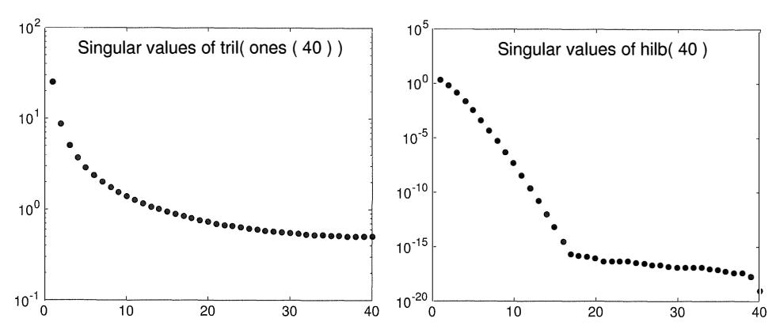
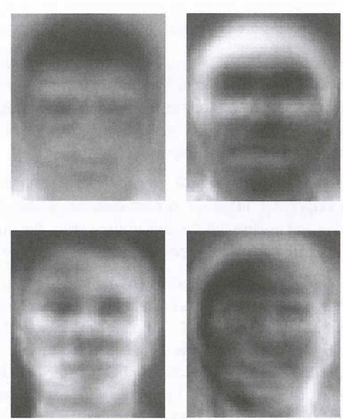
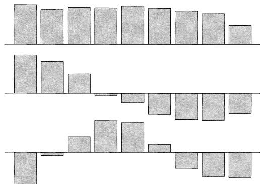
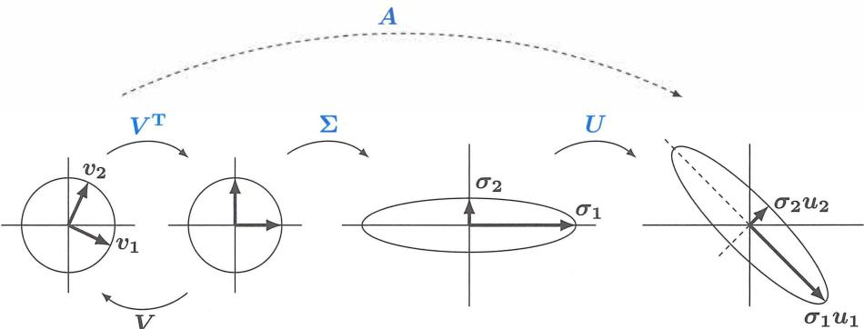
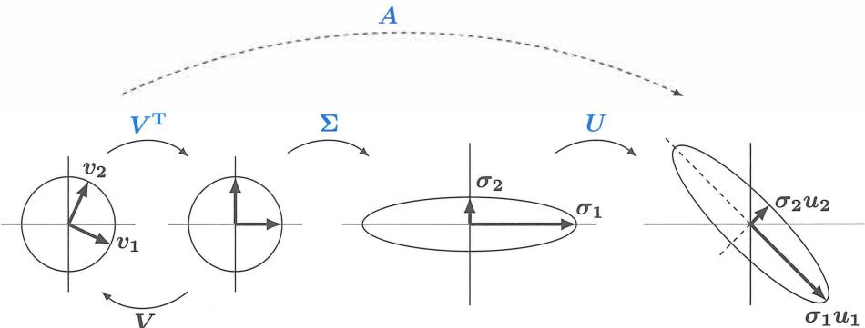
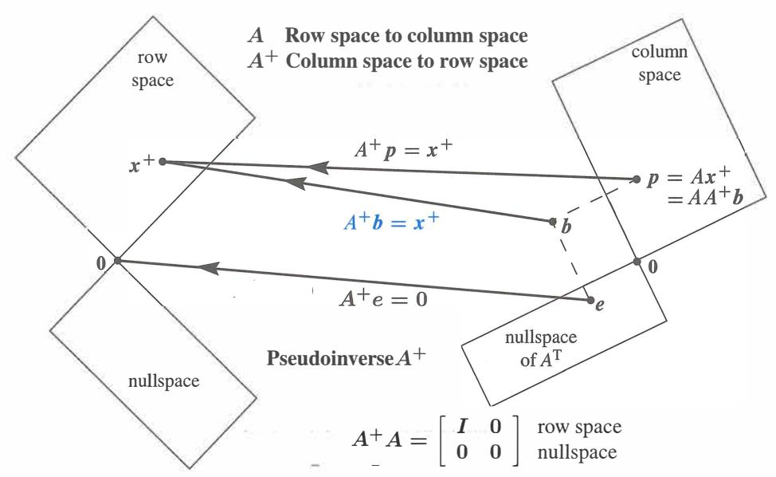

# **Chapter 7**

# **The Singular Value Decomposition (SVD)**

# **7 .1 Image Processing by Linear Algebra**

1 An image is a large matrix of grayscale values, one for each pixel and color. 2 When nearby pixels are correlated (not random) the image can be compressed. **3** The SVD separates any matrix *A* into rank one pieces uv T = **(column)(row).**  4 The columns and rows are eigenvectors of symmetric matrices AA T and ATA.

**The singular value theorem for** *A* **is the eigenvalue theorem for** AT*A* **and** *AA* T.

That is a quick preview of what you will see in this chapter. A has *two* sets of singular vectors (the eigenvectors of ATA and AAT). There is *one* set of positive singular values (because ATA has the same positive eigenvalues as AAT ). A is often rectangular, but ATA and AA T are square, symmetric, and positive semidefinite.

**The Singular Value Decomposition (SVD) separates any matrix into simple pieces.** 

Each piece is a column vector times a row vector. An m by n matrix has m times n entries (a big number when the matrix represents an image). But a column and a row only have m + *n* **components, far less than** m **times** *n.* Those (column)(row) pieces are full size matrices that can be processed with extreme speed-they need only *m plus n* numbers.

Unusually, this image processing application of the SVD is coming before the matrix algebra it depends on. I will start with simple images that only involve one or two pieces. Right now I am thinking of an image as a large rectangular matrix. The entries *aij*  tell the grayscales of all the pixels in the image. Think of a pixel as a small square, i steps across and j steps up from the lower left corner. Its grayscale is a number (often a whole number in the range O::; *aij* < 256 = 2 ). An all-white pixel has *aij* = 255 = 11111111. That number has eight 1 's when the computer writes 255 in binary notation.

You see how an image that has m times n pixels, with each pixel using 8 bits (0 or 1) for its grayscale, becomes an *m* by *n* matrix with 256 possible values for each entry *aij.*

In short, an image is a large matrix. To copy it perfectly, we need 8 ( m) ( n) bits of information. High definition television typically has m = 1080 and n = 1920. Often there are 24 frames each second and you probably like to watch in color (3 color scales). This requires transmitting ( 3) ( 8) ( 48, 4 70, 400) bits per second. That is too expensive and it is not done. The transmitter can't keep up with the show.

When compression is well done, you can't see the difference from the original. *Edges in the image* (sudden changes in the grayscale) are the hard parts to compress.

Major success in compression will be impossible if every *aij* is an independent random number. We totally depend on the fact that *nearby pixels generally have similar grayscales.* An edge produces a sudden jump when you cross over it. Cartoons are more compressible than real-world images, with edges everywhere.

For a video, the numbers *aij* don't change much between frames. **We only transmit the small changes.** This is *difference coding* in the H.264 video compression standard (on this book's website). We compress each change matrix by linear algebra (and by nonlinear "quantization" for an efficient step to integers in the computer).

The natural images that we see every day are absolutely ready and open for compression-but that doesn't make it easy to do.

# **Low Rank Images (Examples)**

The easiest images to compress are all black or all white or all a constant grayscale *g.* The matrix *A* has the same number *g* in every entry : *aij* = *g.* When *g* = 1 and *m*= *n* = 6, here is an extreme example of the central SVD dogma of image processing :

Example 1 Don't send 
$$A = \begin{bmatrix} 1 & 1 & 1 & 1 & 1 & 1 \\ 1 & 1 & 1 & 1 & 1 & 1 \\ 1 & 1 & 1 & 1 & 1 & 1 \\ 1 & 1 & 1 & 1 & 1 & 1 \\ 1 & 1 & 1 & 1 & 1 & 1 \\ 1 & 1 & 1 & 1 & 1 & 1 \end{bmatrix}$$
 Send this  $A = \begin{bmatrix} 1 \\ 1 \\ 1 \\ 1 \\ 1 \\ 1 \end{bmatrix} [ 1 \ 1 \ 1 \ 1 \ 1 \ 1 ]$ 

36 numbers become 12 numbers. With 300 by 300 pixels, 90,000 numbers become 600. And if we define the all-ones vector x in advance, we only have to send **one number.** That number would be the constant grayscale *g* that multiplies xx T to produce the matrix.

Of course this first example is extreme. But it makes an important point. If there are special vectors like x = **ones** that can usefully be defined in advance, then image processing can be extremely fast. The battle is between **preselected bases** (the Fourier basis allows speed-up from the FFT) and **adaptive bases** determined by the image. The SVD produces bases from the image itself-this is adaptive and it can be expensive.

I am not saying that the SVD always or usually gives the most effective algorithm in practice. The purpose of these next examples is instruction and not production.

| Example 2         |                  | $a \ a \ c \ c \ e \ e$ |            | $\begin{bmatrix} 1 \\ 1 \\ 1 \\ 1 \\ 1 \\ 1 \\ 1 \\ 1 \\ 1 \\ 1 \\ 1 \\ 1 \\ 1 \\ 1 \\ 1 \\ 1 \\ 1 \\ 1 \end{bmatrix}$      |
|-------------------|------------------|-------------------------|------------|-----------------------------------------------------------------------------------------------------------------------------|
| "ace flag"        |                  | $a \ a \ c \ c \ e \ e$ |            |                                                                                                                             |
| French flag $A$   | Don't send $A =$ | $a \ a \ c \ c \ e \ e$ | Send $A =$ | $\begin{bmatrix} 1 \\ 1 \\ 1 \\ 1 \\ 1 \\ 1 \\ 1 \\ 1 \\ 1 \\ 1 \\ 1 \\ 1 \\ 1 \\ 1 \\ 1 \\ 1 \\ 1 \\ 1 \\ 1 \end{bmatrix}$ |
| Italian flag $A$  |                  | $a \ a \ c \ c \ e \ e$ |            |                                                                                                                             |
| German flag $A^T$ |                  | $a \ a \ c \ c \ e \ e$ |            |                                                                                                                             |
|                   |                  | $a \ a \ c \ c \ e \ e$ |            |                                                                                                                             |

This flag has 3 colors but it still has rank 1. We still have one column times one row. The 36 entries could even be all different, provided they keep that rank 1 pattern *A* = u1 vI. But when the rank moves up tor = 2, we need u1 Vf + u2v'.f. Here is one choice :

| <b>Example 3</b>       | $A = \begin{bmatrix} 1 & 0 \\ 1 & 1 \end{bmatrix}$ | is equal to $A = \begin{bmatrix} 1 \\ 1 \end{bmatrix} \begin{bmatrix} 1 & 1 \end{bmatrix} - \begin{bmatrix} 1 \\ 0 \end{bmatrix} \begin{bmatrix} 0 & 1 \end{bmatrix}$ |
|------------------------|----------------------------------------------------|-----------------------------------------------------------------------------------------------------------------------------------------------------------------------|
| <b>Embedded square</b> |                                                    |                                                                                                                                                                       |

| <b>Example 3</b>       | $A = \begin{bmatrix} 1 & 0 \\ 1 & 1 \end{bmatrix}$ | is equal to $A = \begin{bmatrix} 1 \\ 1 \end{bmatrix} \begin{bmatrix} 1 & 1 \end{bmatrix} - \begin{bmatrix} 1 \\ 0 \end{bmatrix} \begin{bmatrix} 0 & 1 \end{bmatrix}$ |
|------------------------|----------------------------------------------------|-----------------------------------------------------------------------------------------------------------------------------------------------------------------------|
| <b>Embedded square</b> |                                                    |                                                                                                                                                                       |

The l's and the O in *A* could be blocks of l's and a block of O's. *We would still have rank* 2. We would still only need two terms u1 vI and *u2*v'.f. A 6 by 6 image would be compressed into 24 numbers. An *N* by *N* image (N2 numbers) would be compressed into *4N* numbers from the four vectors u1, v1, u2, v2.

Have I made the best choice for the *u's* and *v's?* This is *not* the choice from the SVD! I notice that u1 = ( 1, 1) is not orthogonal to u2 = ( 1, 0). And v 1 = ( 1, 1) is not orthogonal to v2 = ( 0, 1). The theory says that orthogonality will produce a smaller second piece c2u2v'.f. **(The SVD chooses rank one pieces in order of importance.)** 

If the rank of *A* is much higher than 2, as we expect for real images, then *A* will add up many rank one pieces. We want the small ones to be really small-they can be discarded with no loss to visual quality. Image compression becomes lossy, but good image compression is virtually undetectable by the human visual system.

The question becomes: **What are the orthogonal choices from the SVD?**

# **Eigenvectors for the SVD**

I want to introduce the use of eigenvectors. But the eigenvectors of most images are not orthogonal. Furthermore the eigenvectors x 1, x2give only one set of vectors, and we want two sets ( *u's* and *v's).* The answer to both of those difficulties is the SVD idea:

**Use the eigenvectors u of** *AA* **T and the eigenvectors v of** *ATA.*

Since AAT and AT A are automatically symmetric (but not usually equal!) the *u's* will be one orthogonal set and the eigenvectors v will be another orthogonal set. We can and will make them all unit vectors: I lui 11 **=** 1 and I lvi I I **=** 1. Then our rank 2 matrix will be *A*= <T1 u1 vI + <T2u2v'.f. The size of those numbers <T1 and CJ2 will decide whether they can be ignored in compression. *We keep larger CJ's, we discard small <T's.* 

The  $u$ 's from the SVD are called **left singular vectors** (unit eigenvectors of  $AA^T$ ). The  $v$ 's are **right singular vectors** (unit eigenvectors of  $A^T A$ ). The  $\sigma$ 's are **singular values**, square roots of the equal eigenvalues of  $AA^T$  and  $A^T A$ :

**Choices from the SVD**      $AA^T u_i = \sigma_i^2 u_i$       $A^T A v_i = \sigma_i^2 v_i$       $A v_i = \sigma_i u_i$      (1)

In Example 3 (the embedded square), here are the symmetric matrices  $AA^T$  and  $A^T A$ :

$$AA^T = \begin{bmatrix} 1 & 0 \\ 1 & 1 \end{bmatrix} \begin{bmatrix} 1 & 1 \\ 0 & 1 \end{bmatrix} = \begin{bmatrix} 1 & 1 \\ 1 & 2 \end{bmatrix} \quad A^T A = \begin{bmatrix} 1 & 1 \\ 0 & 1 \end{bmatrix} \begin{bmatrix} 1 & 0 \\ 1 & 1 \end{bmatrix} = \begin{bmatrix} 2 & 1 \\ 1 & 1 \end{bmatrix}.$$

Their determinants are 1, so  $\lambda_1 \lambda_2 = 1$ . Their traces (diagonal sums) are 3:

$$\det \begin{bmatrix} 1-\lambda & 1 \\ 1 & 2-\lambda \end{bmatrix} = \lambda^2 - 3\lambda + 1 = 0 \text{ gives } \lambda_1 = \frac{3+\sqrt{5}}{2} \text{ and } \lambda_2 = \frac{3-\sqrt{5}}{2}.$$

$$\text{The square roots of } \lambda_1 \text{ and } \lambda_2 \text{ are } \sigma_1 = \frac{\sqrt{5}+1}{2} \text{ and } \sigma_2 = \frac{\sqrt{5}-1}{2} \text{ with } \sigma_1 \sigma_2 = 1.$$

The nearest rank 1 matrix to  $A$  will be  $\sigma_1 u_1 v_1^T$ . The error is only  $\sigma_2 \approx 0.6 = \text{best possible}$ .

The orthonormal eigenvectors of  $AA^T$  and  $A^T A$  are

$$u_1 = \begin{bmatrix} 1 \\ \sigma_1 \end{bmatrix} \quad u_2 = \begin{bmatrix} \sigma_1 \\ -1 \end{bmatrix} \quad v_1 = \begin{bmatrix} \sigma_1 \\ 1 \end{bmatrix} \quad v_2 = \begin{bmatrix} 1 \\ -\sigma_1 \end{bmatrix} \text{ all divided by } \sqrt{1+\sigma_1^2}. \quad (2)$$

Every reader understands that in real life those calculations are done by computers! (Certainly not by unreliable professors. I corrected myself using `svd(A)` in MATLAB.) And we can check that the matrix  $A$  is correctly recovered from  $\sigma_1 u_1 v_1^T + \sigma_2 u_2 v_2^T$ :

$$A = \begin{bmatrix} u_1 & u_2 \end{bmatrix} \begin{bmatrix} \sigma_1 & \\ & \sigma_2 \end{bmatrix} \begin{bmatrix} v_1^T \\ v_2^T \end{bmatrix} \text{ or more simply } A \begin{bmatrix} v_1 & v_2 \end{bmatrix} = \begin{bmatrix} \sigma_1 u_1 & \sigma_2 u_2 \end{bmatrix} \quad (3)$$

**Important** The key point is not that images tend to have low rank. **No**: Images mostly have full rank. But they do have **low effective rank**. This means: Many singular values are small and can be set to zero. *We transmit a low rank approximation.*

**Example 4** Suppose the flag has two triangles of different colors. The lower left triangle has 1's and the upper right triangle has 0's. The main diagonal is included with the 1's. Here is the image matrix when  $n = 4$ . It has full rank  $r = 4$  so it is invertible:

$$\text{Triangular flag matrix} \quad A = \begin{bmatrix} 1 & 0 & 0 & 0 \\ 1 & 1 & 0 & 0 \\ 1 & 1 & 1 & 0 \\ 1 & 1 & 1 & 1 \end{bmatrix} \quad \text{and} \quad A^{-1} = \begin{bmatrix} 1 & 0 & 0 & 0 \\ -1 & 1 & 0 & 0 \\ 0 & -1 & 1 & 0 \\ 0 & 0 & -1 & 1 \end{bmatrix}$$

With full rank, *A* has a full set of n singular values u (all positive). The SVD will produce n pieces (]" i*U; V r* of rank one. Perfect reproduction needs all n pieces.

In compression *small* u's can be discarded with no serious loss in image quality. We want to understand and plot the u's for n = 4 and also for large n. Notice that Example 3 was the special case n = 2 of this triangular Example 4.

Working by hand, we begin with AAT (a computer would proceed differently):

$$AA^T = \begin{bmatrix} 1 & 1 & 2 & 1 \\ 1 & 2 & 2 & 3 \\ 2 & 3 & 3 & 4 \\ 1 & 2 & 2 & 4 \end{bmatrix} \text{ and } (AA^T)^{-1} = (A^{-1})^T A^{-1} = \begin{bmatrix} 2 & -1 & 0 & 0 \\ -1 & 2 & -1 & 0 \\ 0 & -1 & 2 & -1 \\ 0 & 0 & -1 & 1 \end{bmatrix}. \quad (4)$$

That -1, 2, -1 inverse matrix is included because its eigenvalues all have the 2 -2 cos 0. So we know the .\'s for AAT and the u's for A: form

$$\lambda = \frac{1}{2 - 2 \cos \theta} = \frac{1}{4 \sin^2(\theta/2)} \quad \text{gives} \quad \sigma = \sqrt{\lambda} = \frac{1}{2 \sin(\theta/2)}. \quad (5)$$

The n different angles 0 are equally spaced, which makes this example so exceptional:

$$\theta = \frac{\pi}{2n+1}, \frac{3\pi}{2n+1}, \dots, \frac{(2n-1)\pi}{2n+1} \quad \left( n = 4 \text{ includes } \theta = \frac{3\pi}{9} \text{ with } 2 \sin \frac{\theta}{2} = 1 \right).$$

That special case gives >-= l as an eigenvalue of AAT when n = 4. So u = � = 1 is a singular value of A. You can check that the vector u = ( 1, 1, 0, -1) has AA T u = u (a truly special case).

The important point is to graph the n singular values of *A.* Those numbers drop off (unlike the eigenvalues of *A,* which are all 1). But the dropoff is not steep. So the SVD gives only moderate compression of this triangular flag. *Great compression for Hilbert.* 

Figure 7.1: Singular values of the triangle of l's in Examples 3-4 (not compressible) and the evil Hilbert matrix *H* ( i, *j)* = ( i + *j* -1)-1 in Section 8.3 : compress it to work with it.

Your faithful author has continued research on the ranks of flags. Quite a few are based on horizontal or vertical stripes. Those have *rank one-all* rows or all columns are multiples of the *ones* vector (1, 1, ... , 1). Armenia, Austria, Belgium, Bulgaria, Chad, Colombia, Ireland, Madagascar, Mali, Netherlands, Nigeria, Romania, Russia (and more) have three stripes. Indonesia and Poland have two ! Libya was the extreme case in the Gadaffi years 1977 to 2011 *(the whole flag was green).* 

At the other extreme, many flags include diagonal lines. Those could be long diagonals as in the British flag. Or they could be short diagonals corning from the edges of a staras in the US flag. The text example of a triangle of ones shows how those flag matrices will have large rank. The rank increases to infinity as the pixel sizes get small.

Other flags have circles or crescents or various curved shapes. Their ranks are large and also increasing to infinity. These are still compressible! The compressed image won't be perfect but our eyes won't see the difference (with enough terms CTiUiV{ from the SVD). Those examples actually bring out the main purpose of image compression:

#### **Visual quality can be preserved even with a big reduction in the rank.**

For fun I looked back at the flags with finite rank. They can have stripes and they can also have crosses-provided the edges of the cross are horizontal or vertical. Some flags have a thin outline around the cross. This artistic touch will increase the rank. Right now my champion is the flag of Greece shown below, with a cross and also stripes. Its rank is **three** by my counting (three different columns). I see no US State Flags of finite rank !

The reader could google "national flags" to see the variety of designs and colors. I would be glad to know any finite rank examples with rank > 3. Good examples of all kinds will go on the book's website **math.mit.edu/linearalgebra** (and flags in full color).

### **Problem Set 7 .1**

**1**What are the ranks r for these matrices with entries i times *j* and i plus *j* ? Write A and B as the sum of r pieces uv T of rank one. Not requiring uT u2 = Vf v2 = 0.

$$A = \begin{bmatrix} 1 & 2 & 3 & 4 \\ 2 & 4 & 6 & 8 \\ 3 & 6 & 9 & 12 \\ 4 & 8 & 12 & 16 \end{bmatrix} \quad B = \begin{bmatrix} 2 & 3 & 4 & 5 \\ 3 & 4 & 5 & 6 \\ 4 & 5 & 6 & 7 \\ 5 & 6 & 7 & 8 \end{bmatrix}$$

**2**We usually think that the identity matrix *I* is as simple as possible. But why is *I* completely incompressible? *Draw a rank* 5 *flag with a cross.* **3**These flags have rank 2. Write A and B in any way as u1 Vf + u2vI.

$$A_{\text{Sweden}} = A_{\text{Finland}} = \begin{bmatrix} 1 & 2 & 1 & 1 \\ 2 & 2 & 2 & 2 \\ 1 & 2 & 1 & 1 \end{bmatrix} \quad B_{\text{Benin}} = \begin{bmatrix} 1 & 2 & 2 \\ 1 & 3 & 3 \end{bmatrix}$$

**4**Now find the trace and determinant of Problem 3. The singular values of B are close to *ar*  BET and BT B = 28 - /4and a� Is B compressible or not? **5**Use [U, *S,* V] = svd (A) to find two orthogonal pieces auv T of Asweden · **6**Find the eigenvalues and the singular values of this 2 by 2 matrix A. in 1 14"

$$A = \begin{bmatrix} 2 & 1 \\ 4 & 2 \end{bmatrix}$$
 with  $A^T A = \begin{bmatrix} 20 & 10 \\ 10 & 5 \end{bmatrix}$  and  $AA^T = \begin{bmatrix} 5 & 10 \\ 10 & 20 \end{bmatrix}$ .

The eigenvectors (1, 2) and (1, -2) of A are not orthogonal. How do you know the eigenvectors v 1, v2 of AT A are orthogonal? Notice that AT A and AA T have the same eigenvalues (25 and 0).

7 How does the second form *AV* = U� in equation (3) follow from the first form *A* =U�VT ? That is the most famous form of the SVD. 8 The two columns of AV = UY:, are Av*1* = a1 u1 and Av2 = a2u2. So we hope that

$$Av_1 = \begin{bmatrix} 1 & 0 \\ 1 & 1 \end{bmatrix} \begin{bmatrix} \sigma_1 \\ 1 \end{bmatrix} = \sigma_1 \begin{bmatrix} 1 \\ \sigma_1 \end{bmatrix} \quad \text{and} \quad \begin{bmatrix} 1 & 0 \\ 1 & 1 \end{bmatrix} \begin{bmatrix} 1 \\ -\sigma_1 \end{bmatrix} = \sigma_2 \begin{bmatrix} \sigma_1 \\ -1 \end{bmatrix}.$$

The first needs a1 + 1 = *ar* and the second needs 1 - a1 = -a2. Are those true?

**9**The MATLAB commands A = rand (20, 40) and B = randn (20, 40) produce 20 by 40 random matrices. The entries of A are between O and 1 with uniform probability. The entries of B have a normal "bell-shaped" probability distribution. Using an svd command, find and graph their singular values a1 to a*20.* Why do they have 20 a's ?

# **7 .2 Bases and Matrices in the SVD**

**1** The SVD produces **orthonormal basis** of *v's* and *u's* for the four fundamental subspaces. **2** Using those bases, *A* becomes a diagonal matrix I; and Avi = uiui : ui = **singular value.**  3 The two-bases diagonalization A = U:E VT often has more information than *A* = X Ax-1 . 4 UI;VTseparates A into rank-1 matrices CT1 u1 Vf + · · · + CTrUrv;. CT1 u1 vT is the largest!

The Singular Value Decomposition is a highlight of linear algebra. *A* is any m by n matrix, square or rectangular. Its rank is *r.* We will diagonalize this *A,* but not by x-1 *AX.* The eigenvectors in X have three big problems: They are usually not orthogonal, there are not always enough eigenvectors, and *Ax* = *>.x* requires *A* to be a square matrix. The *singular vectors* of *A* solve all those problems in a perfect way.

Let me describe what we want from the SVD : **the right bases for the four subspaces.**  Then I will write about the steps to find those basis vectors **in order of importance.** 

The price we pay is to have **two sets of singular vectors,** *u's* and *v's.* The *u's* are in R mand the *v* 's are in R n . They will be the columns of an *m* by *m* matrix U and an *n* by *n* matrix *V.* I will first describe the SVD in terms of those basis vectors. Then I can also describe the SVD in terms of the orthogonal matrices *U* and *V.* 

(using vectors) The u's and v's give bases for the four fundamental subspaces:

u1, ... , Ur is an orthonormal basis for the **column space** Ur+ 1, ... , Um is an orthonormal basis for the **left nullspace** *N* (AT) v1, ... , *Vr* is an orthonormal basis for the **row space** *Vr+l, ... , Vn* is an orthonormal basis for the **nullspace** N(A).

More than just orthogonality, these basis vectors diagonalize the matrix *A* :

| "A is diagonalized" | $Av_1 = \sigma_1 u_1$ | $Av_2 = \sigma_2 u_2$ | $Av_r = \sigma_r u_r$ | (1) |
|---------------------|-----------------------|-----------------------|-----------------------|-----|
|                     |                       |                       |                       |     |

Those **singular values** u1 to Ur will be positive numbers: CTi *is the length of* Avi. The CT's go into a diagonal matrix that is otherwise zero. That matrix is I;.

(using matrices) Since the u's are orthonormal, the matrix Ur with those r columns has U;Ur = I. Since the v's are orthonormal, the matrix Vr has V?Vr = I. Then the equations Avi = CTiUi tell us column by column that AVr=Ur:Er:

| $(m \text{ by } n)(n \text{ by } r)$     | $A \left[ v_1 \cdots v_r \right] = \left[ u_1 \cdots u_r \right] \left[ \begin{array}{c} \sigma_1 \\ \vdots \\ \sigma_r \end{array} \right]$ |
|------------------------------------------|----------------------------------------------------------------------------------------------------------------------------------------------|
| $A \mathbf{V}_r = \mathbf{U}_r \Sigma_r$ |                                                                                                                                              |
| $(m \text{ by } r)(r \text{ by } r)$     |                                                                                                                                              |

This is the heart of the SVD, but there is more. Those v's and u's account for the row space and column space of A. We haven - *r*more v's and *m* - *r*more u's, from the nullspace N(A) and the left nullspace N(AT ). They are automatically orthogonal to the first v's and u's (because the whole nullspaces are orthogonal). We now include all the v's and u's in *V* and *U,* so these matrices become *square. We still have AV* = *U:E.*

| $(m \text{ by } n)(n \text{ by } n)$ | $A$ | $v_1 \cdots v_r \cdots v_n$ | $= \left[ u_1 \cdots u_r \cdots u_m \right]$ | $\left[ \sigma_1 \cdots \sigma_r \right]$ | (3) |
|--------------------------------------|-----|-----------------------------|----------------------------------------------|-------------------------------------------|-----|
| $AV$ equals $U\Sigma$                |     |                             |                                              |                                           |     |
| $(m \text{ by } m)(m \text{ by } n)$ |     |                             |                                              |                                           |     |

The new I; is m by n. It is just the r by r matrix in equation (2) with m - r extra zero rows and n - r new zero columns. The real change is in the shapes of *U* and *V.* Those are square matrices and v-1 = VT. So AV= UI; becomes *A= U:EVT .* This is the *Singular Value Decomposition.* I can multiply columns Ui/Ji from UI; by rows of VT:

| SVD | $A = U\Sigma V^T = u_1\sigma_1 v_1^T + \dots + u_r\sigma_r v_r^T$ | (4) |
|-----|-------------------------------------------------------------------|-----|
|     |                                                                   |     |

Equation (2) was a "reduced SVD" with bases for the row space and column space. Equation (3) is the full SVD with nullspaces included. They both split up *A* into the same r matrices Ui!JiV[ of rank one. Column times row is the fourth way to multiply matrices.

We will see that each /Jr is an eigenvalue of AT A and also AA T. When we put the singular values in descending order, 1J1 ;:::: *1J2* ;:::: •.. /Jr > 0, the splitting in equation ( 4) gives the r rank-one pieces of *A in order of importance.* This is crucial.

**Example 1** When is A= UI;VT(singular values) the *same* as X Ax-1 (eigenvalues) ?

**Solution** *A* needs orthonormal eigenvectors to allow *X* = *U* = *V. A* also needs eigenvalues>-;:::: 0 if A= I;. So *A* must be a *positive semidefinite (or definite) symmetric matrix.* Only then will A= XAx-*1*which is also QAQT coincide with A= UI;VT.

**Example 2** If A= xyT(rank 1) with unit vectors x and y, what is the SVD of A?

**Solution** The reduced SVD in (2) is exactly xy T, with rank r = 1. It has u1 = x and v1 = *y* and 1J1 = 1. For the full SVD, complete u1 = x to an orthonormal basis of u's, and complete v1 = *y* to an orthonormal basis of v's. No new /J's, only 1J1= 1.

#### **Proof of the SVD**

We need to show how those amazing u's and v's can be constructed. The v's will be **orthonormal eigenvectors of** AT*A.* This must be true because we are aiming for

$$\mathbf{A}^T \mathbf{A} = (U\Sigma V^T)^T (U\Sigma V^T) = V\Sigma^T U^T U\Sigma V^T = V\Sigma^T \Sigma V^T. \quad (5)$$

On the right you see the eigenvector matrix *V* for the symmetric positive (semi) definite matrix AT A. And (I;T I;) must be the eigenvalue matrix of (AT A): Each 1J 2 is >-(AT A)!

Now Avi = CTiUi tells us the unit vectors u1 to Ur. This is the key equation (1). The essential point-the whole reason that the SVD succeeds-is that those unit vectors u1 to *Ur* are automatically orthogonal to each other *(because the* v's *are orthogonal):* 

| Key step $i \neq j$ | $u_i^T u_j = \left( \frac{Av_i}{\sigma_i} \right)^T \left( \frac{Av_j}{\sigma_j} \right) = \frac{v_i^T A^T A v_j}{\sigma_i \sigma_j} = \frac{\sigma_j^2}{\sigma_i \sigma_j} v_i^T v_j = \text{zero.}$ |
|------------------------|-------------------------------------------------------------------------------------------------------------------------------------------------------------------------------------------------------|
|------------------------|-------------------------------------------------------------------------------------------------------------------------------------------------------------------------------------------------------|

The v's are eigenvectors of A TA (symmetric). They are orthogonal and now the u's are also orthogonal. *Actually those* u's *will be eigenvectors of* AAT .

Finally we complete the v's and u's ton v's and m u's with any orthonormal bases for the nullspaces *N(A)* and N(AT ). We have found *V* and� and *U* in *A*= *U�VT .*

### **An Example of the SVD**

Here is an example to show the computation of all three matrices in *A* = *U�VT .*

**Example 3** Find the matrices *U,* �, *V*for A= [ ! � ] . The rank is r = **2.**

With rank 2, this *A* has positive singular values cr1 and cr2. We will see that cr1 is larger than Amax = 5, and cr2 is smaller than Amin = 3. Begin with A TA and AAT:

$$A^T A = \begin{bmatrix} 25 & 20 \\ 20 & 25 \end{bmatrix} \quad AA^T = \begin{bmatrix} 9 & 12 \\ 12 & 41 \end{bmatrix}.$$

Those have the same trace (50) and the same eigenvalues err = 45 and er� = 5. The square roots are cr1 = v'45 and cr2 = ,v5. Then cr1cr2 = 15 and this is the determinant of *A.*

A key step is to find the eigenvectors of A TA (with eigenvalues 45 and 5):

$$\begin{bmatrix} 25 & 20 \\ 20 & 25 \end{bmatrix} \begin{bmatrix} 1 \\ 1 \end{bmatrix} = 45 \begin{bmatrix} 1 \\ 1 \end{bmatrix} \quad \begin{bmatrix} 25 & 20 \\ 20 & 25 \end{bmatrix} \begin{bmatrix} -1 \\ 1 \end{bmatrix} = 5 \begin{bmatrix} -1 \\ 1 \end{bmatrix}$$

Then v1 and v2 are those orthogonal eigenvectors rescaled to length 1. Divide by ../2.

**Right singular vectors** 
$$v_1 = \frac{1}{\sqrt{2}} \begin{bmatrix} 1 \\ 1 \end{bmatrix}$$
  $v_2 = \frac{1}{\sqrt{2}} \begin{bmatrix} -1 \\ 1 \end{bmatrix}$  **Left singular vectors**  $u_i = \frac{Av_i}{\sigma_i}$ 

Now compute  $Av_1$  and  $Av_2$  which will be  $\sigma_1 u_1 = \sqrt{45} u_1$  and  $\sigma_2 u_2 = \sqrt{5} u_2$  :

| $Av_1 = \frac{3}{\sqrt{2}} \begin{bmatrix} 1 \\ 3 \end{bmatrix} = \sqrt{45} \frac{1}{\sqrt{10}} \begin{bmatrix} 1 \\ 3 \end{bmatrix} = \sigma_1 v_1$ |
|------------------------------------------------------------------------------------------------------------------------------------------------------|
|------------------------------------------------------------------------------------------------------------------------------------------------------|

$$Av_2 = \frac{1}{\sqrt{2}} \begin{bmatrix} -3 \\ 1 \end{bmatrix} = \sqrt{5} \frac{1}{\sqrt{10}} \begin{bmatrix} -3 \\ 1 \end{bmatrix} = \sigma_2 u_2$$

The division by V:W makes u1 and u2 orthonormal. Then cr1 = -./45 and cr2 = v15 as expected. The Singular Value Decomposition of *A* is *U* times � times *VT .* 

$$U = \frac{1}{\sqrt{10}} \begin{bmatrix} 1 & -3 \\ 3 & 1 \end{bmatrix} \quad \Sigma = \begin{bmatrix} \sqrt{45} & \sqrt{5} \end{bmatrix} \quad V = \frac{1}{\sqrt{2}} \begin{bmatrix} 1 & -1 \\ 1 & 1 \end{bmatrix}. \quad (7)$$

 $U$  and  $V$  contain orthonormal bases for the column space and the row space (both spaces are just  $\mathbf{R}^2$ ). The real achievement is that those two bases diagonalize  $A$ :  $AV$  equals  $U\Sigma$ . The matrix  $A$  splits into a combination of two rank-one matrices, columns times rows:

$$\sigma_1 u_1 v_1^T + \sigma_2 u_2 v_2^T = \frac{\sqrt{45}}{\sqrt{20}} \begin{bmatrix} 1 & 1 \\ 3 & 3 \end{bmatrix} + \frac{\sqrt{5}}{\sqrt{20}} \begin{bmatrix} 3 & -3 \\ -1 & 1 \end{bmatrix} = \begin{bmatrix} 3 & 0 \\ 4 & 5 \end{bmatrix} = A.$$

### An Extreme Matrix

Here is a larger example, when the  $u$ 's and the  $v$ 's are just columns of the identity matrix. So the computations are easy, but keep your eye on the *order of the columns*. The matrix  $A$  is badly lopsided (strictly triangular). All its eigenvalues are zero.  $AA^T$  is not close to  $A^T A$ . The matrices  $U$  and  $V$  will be permutations that fix these problems properly.

$$A = \begin{bmatrix} 0 & 1 & 0 & 0 \\ 0 & 0 & 2 & 0 \\ 0 & 0 & 0 & 3 \\ 0 & 0 & 0 & 0 \end{bmatrix} \quad \text{eigenvalues } \lambda = 0, 0, 0, 0 \text{ all zero!} \\ \quad \text{only one eigenvector } (1, 0, 0, 0) \\ \quad \text{singular values } \sigma = 3, 2, 1 \\ \quad \text{singular vectors are columns of } I$$

 $A^T A$  and  $AA^T$  are diagonal (with easy eigenvectors, but in different orders):

$$A^T A = \begin{bmatrix} 0 & 0 & 0 & 0 \\ 0 & 1 & 0 & 0 \\ 0 & 0 & 4 & 0 \\ 0 & 0 & 0 & 9 \end{bmatrix} \quad AA^T = \begin{bmatrix} 1 & 0 & 0 & 0 \\ 0 & 4 & 0 & 0 \\ 0 & 0 & 9 & 0 \\ 0 & 0 & 0 & 0 \end{bmatrix}$$

Their eigenvectors ( $u$ 's for  $AA^T$  and  $v$ 's for  $A^T A$ ) go in decreasing order  $\sigma_1^2 > \sigma_2^2 > \sigma_3^2$  of the eigenvalues. Those eigenvalues are  $\sigma^2 = 9, 4, 1$ .

$$U = \begin{bmatrix} 0 & 0 & 1 & 0 \\ 0 & 1 & 0 & 0 \\ 1 & 0 & 0 & 0 \\ 0 & 0 & 0 & 1 \end{bmatrix} \quad \Sigma = \begin{bmatrix} 3 & & & \\ & 2 & & \\ & & 1 & \\ & & & 0 \end{bmatrix} \quad V = \begin{bmatrix} 0 & 0 & 0 & 1 \\ 0 & 0 & 1 & 0 \\ 0 & 1 & 0 & 0 \\ 1 & 0 & 0 & 0 \end{bmatrix}$$

Those first columns  $u_1$  and  $v_1$  have 1's in positions 3 and 4. Then  $u_1 \sigma_1 v_1^T$  picks out the biggest number  $A_{34} = 3$  in the original matrix  $A$ . The three rank-one matrices in the SVD come (for this extreme example) exactly from the numbers 3, 2, 1 in  $A$ .

$$A = U\Sigma V^T = 3u_1 v_1^T + 2u_2 v_2^T + 1u_3 v_3^T$$

*Note* Suppose I remove the last row of  $A$  (all zeros). Then  $A$  is a 3 by 4 matrix and  $AA^T$  is 3 by 3—its fourth row and column will disappear. We still have eigenvalues  $\lambda = 1, 4, 9$  in  $A^T A$  and  $AA^T$ , producing the same singular values  $\sigma = 3, 2, 1$  in  $\Sigma$ .

Removing the zero row of  $A$  (now  $3 \times 4$ ) just removes the last row of  $\Sigma$  and also the last row and column of  $U$ . Then  $(3 \times 4) = U\Sigma V^T = (3 \times 3)(3 \times 4)(4 \times 4)$ . The SVD is totally adapted to rectangular matrices.

A good thing, because the rows and columns of a data matrix  $A$  often have completely different meanings (like a spreadsheet). If we have the grades for all courses, there would be a column for each student and a row for each course: The entry  $a_{ij}$  would be the grade. Then  $\sigma_1 u_1 v_1^T$  could have  $u_1 = \text{combination course}$  and  $v_1 = \text{combination student}$ . And  $\sigma_1$  would be the grade for those combinations: the highest grade.

The matrix  $A$  could count the frequency of key words in a journal: A different article for each column of  $A$  and a different word for each row. The whole journal is indexed by the matrix  $A$  and the most important information is in  $\sigma_1 u_1 v_1^T$ . Then  $\sigma_1$  is the largest frequency for a hyperword (the word combination  $u_1$ ) in the hyperarticle  $v_1$ .

Section 7.3 will apply the SVD to finance and genetics and search engines.

### Singular Value Stability versus Eigenvalue Instability

The 4 by 4 example  $A$  provides an example (an extreme case) of the instability of eigenvalues. **Suppose the 4,1 entry barely changes** from zero to 1/60,000. The rank is now 4.

$$A = \begin{bmatrix} 0 & 1 & 0 & 0 \\ 0 & 0 & 2 & 0 \\ 0 & 0 & 0 & 3 \\ 1 & 0 & 0 & 0 \end{bmatrix} \quad \begin{array}{l} \text{That change by only 1/60,000 produces a} \\ \text{much bigger jump in the eigenvalues of } A \\ \lambda = 0,0,0,0 \text{ to } \lambda = \frac{1}{10}, \frac{i}{10}, \frac{-1}{10}, \frac{-i}{10} \end{array}$$

The four eigenvalues moved from zero onto a circle around zero. The circle has radius  $\frac{1}{10}$  when the new entry is only 1/60,000. This shows serious instability of eigenvalues when  $AA^T$  is far from  $A^T A$ . At the other extreme, if  $A^T A = AA^T$  (a “normal matrix”) the eigenvectors of  $A$  are orthogonal and the eigenvalues of  $A$  are totally stable.

By contrast, **the singular values of any matrix are stable**. They don't change more than the change in  $A$ . In this example, the new singular values are **3, 2, 1**, and **1/60,000**. The matrices  $U$  and  $V$  stay the same. The new fourth piece of  $A$  is  $\sigma_4 u_4 v_4^T$ , with fifteen zeros and that small entry  $\sigma_4 = 1/60,000$ .

### Singular Vectors of $A$ and Eigenvectors of $S = A^T A$

Equations (5–6) “proved” the SVD *all at once*. The singular vectors  $v_i$  are the eigenvectors  $q_i$  of  $S = A^T A$ . The eigenvalues  $\lambda_i$  of  $S$  are the same as  $\sigma_i^2$  for  $A$ . The rank  $r$  of  $S$  equals the rank of  $A$ . The expansions in eigenvectors and singular vectors are perfectly parallel.

**Symmetric  $S$** 

**Any matrix  $A$** 

$$S = Q\Lambda Q^T = \lambda_1 q_1 q_1^T + \lambda_2 q_2 q_2^T + \cdots + \lambda_r q_r q_r^T$$

$$A = U\Sigma V^T = \sigma_1 u_1 v_1^T + \sigma_2 u_2 v_2^T + \cdots + \sigma_r u_r v_r^T$$

The  $q$ 's are orthonormal, the  $u$ 's are orthonormal, the  $v$ 's are orthonormal. Beautiful.

But I want to look again, for two good reasons. One is to fix a weak point in the eigenvalue part, where Chapter 6 was not complete. If  $\lambda$  is a *double* eigenvalue of  $S$ , we can and must find *two* orthonormal eigenvectors. The other reason is to see how the SVD picks off the largest term  $\sigma_1 u_1 v_1^T$  before  $\sigma_2 u_2 v_2^T$ . We want to understand the eigenvalues  $\lambda$  (of  $S$ ) and the singular values  $\sigma$  (of  $A$ ) **one at a time instead of all at once**.

Start with the largest eigenvalue  $\lambda_1$  of  $S$ . It solves this problem:

$$\lambda_1 = \text{maximum ratio} \frac{x^T S x}{x^T x}. \text{ The winning vector is } x = q_1 \text{ with } S q_1 = \lambda_1 q_1. \quad (8)$$

Compare with the largest singular value  $\sigma_1$  of  $A$ . It solves this problem:

$$\sigma_1 = \text{maximum ratio} \frac{\|Ax\|}{\|x\|}. \text{ The winning vector is } x = v_1 \text{ with } A v_1 = \sigma_1 u_1. \quad (9)$$

This “one at a time approach” applies also to  $\lambda_2$  and  $\sigma_2$ . But not all  $x$ 's are allowed:

$$\lambda_2 = \text{maximum ratio} \frac{x^T S x}{x^T x} \text{ among all } x\text{'s with } q_1^T x = 0. \quad x = q_2 \text{ will win.} \quad (10)$$

$$\sigma_2 = \text{maximum ratio} \frac{\|Ax\|}{\|x\|} \text{ among all } x\text{'s with } v_1^T x = 0. \quad x = v_2 \text{ will win.} \quad (11)$$

When  $S = A^T A$  we find  $\lambda_1 = \sigma_1^2$  and  $\lambda_2 = \sigma_2^2$ . Why does this approach succeed?

Start with the ratio  $r(x) = x^T S x / x^T x$ . This is called the *Rayleigh quotient*. To maximize  $r(x)$ , set its partial derivatives to zero:  $\partial r / \partial x_i = 0$  for  $i = 1, \dots, n$ . Those derivatives are messy and here is the result: one vector equation for the winning  $x$ :

$$\text{The derivatives of } r(x) = \frac{x^T S x}{x^T x} \text{ are zero when } Sx = r(x)x. \quad (12)$$

So the winning  $x$  is an eigenvector of  $S$ . The maximum ratio  $r(x)$  is the largest eigenvalue  $\lambda_1$  of  $S$ . All good. Now turn to  $A$ —and notice the connection to  $S = A^T A$ !

$$\text{Maximizing } \frac{\|Ax\|}{\|x\|} \text{ also maximizes } \left( \frac{\|Ax\|}{\|x\|} \right)^2 = \frac{x^T A^T A x}{x^T x} = \frac{x^T S x}{x^T x}.$$

So the winning  $x = v_1$  in (9) is the same as the top eigenvector  $q_1$  of  $S = A^T A$  in (8).

Now I have to explain why  $q_2$  and  $v_2$  are the winning vectors in (10) and (11). We know they are orthogonal to  $q_1$  and  $v_1$ , so they are allowed in those competitions. These paragraphs can be optional for readers who aim to see the SVD in action (Section 7.3).

Start with any orthogonal matrix  $Q_1$  that has  $q_1$  in its first column. The other  $n - 1$  orthonormal columns just have to be orthogonal to  $q_1$ . Then use  $Sq_1 = \lambda_1 q_1$ :

$$SQ_1 = S[q_1 \ q_2 \ \dots \ q_n] = [q_1 \ q_2 \ \dots \ q_n] \begin{bmatrix} \lambda_1 & w^T \\ 0 & S_{n-1} \end{bmatrix} = Q_1 \begin{bmatrix} \lambda_1 & w^T \\ 0 & S_{n-1} \end{bmatrix}. \quad (13)$$

Multiply by  $Q_1^T$ , remember  $Q_1^T Q_1 = I$ , and recognize that  $Q_1^T SQ_1$  is symmetric like  $S$ :

$$\text{The symmetry of } Q_1^T SQ_1 = \begin{bmatrix} \lambda_1 & w^T \\ 0 & S_{n-1} \end{bmatrix} \text{ forces } w = 0 \text{ and } S_{n-1}^T = S_{n-1}.$$

The requirement  $q_1^T x = 0$  has reduced the maximum problem (10) to size  $n - 1$ . The largest eigenvalue of  $S_{n-1}$  will be the *second largest* for  $S$ . **It is  $\lambda_2$ .** The winning vector in (10) will be the eigenvector  $q_2$  with  $Sq_2 = \lambda_2 q_2$ .

We just keep going—or use the magic word *induction*—to produce all the eigenvectors  $q_1, \dots, q_n$  and their eigenvalues  $\lambda_1, \dots, \lambda_n$ . The Spectral Theorem  $S = Q\Lambda Q^T$  is proved even with repeated eigenvalues. All symmetric matrices can be diagonalized.

Similarly the SVD is found one step at a time from (9) and (11) and onwards. Section 7.4 will show the geometry—we are finding the axes of an ellipse. Here I ask a different question: **How are the  $\lambda$ 's and  $\sigma$ 's actually computed?**

### Computing the Eigenvalues of $S$ and Singular Values of $A$

The singular values  $\sigma_i$  of  $A$  are the square roots of the eigenvalues  $\lambda_i$  of  $S = A^T A$ . This connects the SVD to a *symmetric eigenvalue problem* (good). But in the end we don't want to multiply  $A^T$  times  $A$  (squaring is time-consuming: not good).

The first idea is *to produce zeros in  $A$  and  $S$  without changing any  $\sigma$ 's and  $\lambda$ 's*. Singular vectors and eigenvectors will change—no problem. The similar matrix  $Q^{-1}SQ$  has the same  $\lambda$ 's as  $S$ . If  $Q$  is orthogonal, this matrix is  $Q^T SQ$  and still symmetric.

Section 11.3 will show how to build  $Q$  from 2 by 2 rotations so that  $Q^T SQ$  is **symmetric and tridiagonal** (many zeros). But rotations can't get all the way to a diagonal matrix. To show all the eigenvalues of  $S$  needs a new idea and more work.

For the SVD, what is the parallel to  $Q^T SQ$ ? Now we don't want to change any singular values of  $A$ . Natural answer: You can multiply  $A$  by *two different orthogonal matrices*  $Q_1$  and  $Q_2$ . Use them to produce zeros in  $Q_1^T A Q_2$ . The  $\sigma$ 's don't change:

$$(Q_1^T A Q_2)^T (Q_1^T A Q_2) = Q_2^T A^T A Q_2 = Q_2^T SQ_2 \text{ gives the same } \sigma(A) \text{ and } \lambda(S).$$

The freedom of two  $Q$ 's allows us to reach  $Q_1^T A Q_2 =$  **bidiagonal matrix** (2 diagonals). This compares perfectly to  $Q^T SQ = 3$  diagonals. It is nice to notice the connection between them:  $(\text{bidiagonal})^T (\text{bidiagonal}) = \text{tridiagonal}$ .

The final steps to a *diagonal*  $\Lambda$  and a *diagonal*  $\Sigma$  need more ideas. This problem can't be easy, because underneath we are solving  $\det(S - \lambda I) = 0$  for polynomials of degree  $n = 100$  or  $1000$  or more. We certainly don't use those polynomials!

The favorite way to find ,\'s and O"'s in LAPACK uses simple orthogonal matrices to approach Q TSQ= A and UT AV= I;, **We stop when very close to** A **and** I;,

This 2-step approach (zeros first) is built into the commands **eig(S)** and **svd(A).**

#### **• REVIEW OF THE KEY IDEAS •**

- 1. The SVD factors A into UI;VT, with *r* singular values 0"1 2". ... 2". O"r > 0.
- **2.** The numbers O"f, ... , O"; are the nonzero eigenvalues of AA T and AT*A.*
- **3.** The orthonormal columns of U and V are eigenvectors of AAT and A T*A.*
- **4.** Those columns hold orthonormal bases for the four fundamental subspaces of *A.*
- 5. Those bases diagonalize the matrix: Avi = O"iUi for i � *r.* This is *AV* = *U"E.*
- 6. A= 0"1 u1 Vf + · · · + O"rUrv; and 0"1 is the maximum of the ratio I I Ax I I/ I lxl 1-

#### **• WORKED EXAMPLES •**

**7.2 A** Identify by name these decompositions of *A* into a sum of columns times rows:

- **l.** *Orthogonalcolumns* U10"1, ... ,urO"r times *orthonormalrows* vT, ... ,v;.
- 2. *Orthonormal* columns *q1 , .. . ,qr*times *triangularrows rT, ... ,r;.*
- **3.** *Triangular* columns *l* 1, ... , lr times *triangular* rows uT, ... , *u;.*  Where do the rank and the pivots and the singular values of *A* come into this picture?

**Solution** These three factorizations are basic to linear algebra, pure or applied:

- 1. **Singular Value Decomposition** *A* = *U"EVT*
- **2. Gram-Schmidt Orthogonalization** *A= QR*
- **3. Gaussian Elimination** *A* = *LU*

You might prefer to separate out singular values CTi and heights *hi*and pivots di :

- 1. A= UI;VT with unit vectors in U and V. *The r singular values* CTi *are in* 'E.
- 2. *A*= *Q HR* with unit vectors in *Q* and diagonal l's in *R. The r heights hiare in H.*
- 3. A= LDU with diagonal l's in Land U. *The r pivots* di *are in D.*

Each *hi* tells the height of column i above the plane of columns 1 to i - 1. The volume of the full n-dimensional box (r = m = n) comes from A = UI;VT = LDU = QH R:

| det 
$$A$$
 | = | product of  $\sigma's$  | = | product of  $d's$  | = | product of  $h's$  |.

**7.2 B Show that** o-**1** 2': 1-Xl max· **The largest singular value dominates all eigenvalues.**

**Solution** Start from A = U�VT. Remember that multiplying by an orthogonal matrix *does not change length:* IIQxll = llxll because 11Qxll2 = xTQ TQx = xTx = llxll2 . This applies to Q = U and Q = VT. In between is the diagonal matrix �-

$$\|Ax\| = \|U\Sigma V^T x\| = \|\Sigma V^T x\| \leq \sigma_1 \|V^T x\| = \sigma_1 \|x\|. \quad (14)$$

An eigenvector has IIAxll = l>-lllxll- So (14) says that l>-lllxll::; u1llxll- Then I.XI � 0-1.

Apply also to the unit vector x = (1, 0, ... , 0). Now Ax is the first column of A. Then by inequality (14), this column has length::; u1. Every entry must have laijl ::; u1.

Equation (14) shows again that *the maximum value of* I I *Ax* 11 / 11 *x* I I *equals* 0-1.

Section 11.2 will explain how the ratio *u* max/ *u* min governs the roundoff error in solving Ax = *b.* MATLAB warns you if this *"condition number"* is large. Then x is unreliable.

#### **Problem Set 7 .2**

**1**Find the eigenvalues of these matrices. Then find singular values from A TA :

$$A = \begin{bmatrix} 0 & 4 \\ 0 & 0 \end{bmatrix} \quad A = \begin{bmatrix} 0 & 4 \\ 1 & 0 \end{bmatrix}$$

For each A, construct V from the eigenvectors of AT A and U from the eigenvectors of AAT . Check that A = U�VT.

2 Find AT A and V and � and ui = Avi/ui and the full SYD:

$$A = \begin{bmatrix} 2 & 2 \\ -1 & 1 \end{bmatrix} = U\Sigma V^T.$$

**3**In Problem 2, show that AAT is diagonal. Its eigenvectors u1, u2 are \_\_ . Its eigenvalues uf, U§ are \_\_ . The rows of A are orthogonal but they are not \_\_ . So the columns of A are not orthogonal. 4 Compute AT A and AA T and their eigenvalues and unit eigenvectors for V and U.

| Rectangular matrix | $A = \begin{bmatrix} 1 & 1 & 0 \\ 0 & 1 & 1 \end{bmatrix}$ |
|--------------------|------------------------------------------------------------|
|--------------------|------------------------------------------------------------|

Check AV = U� (this decides± signs in U). � has the same shape as A: 2 x 3.

5 (a) The row space of *A=* [ ! ! ] is 1-dimensional. Find v1 in the row space and u1 in the column space. What is u1? Why is there no u2?

- (b) Choose v2 and u2 in *U* and *V.* Then A =*UI;VT*= u*1*a*1* vT (one term only). 6 Substitute the SVD for A and AT to show that AT A has its eigenvalues in I; T I; and AAT has its eigenvalues in I:I:T . Since a diagonal I: T I: has the same nonzeros as I:I:T , we see again that AT A and AAT have the same nonzero eigenvalues. 7 If(AT A)v = a2v,multiply by A. *Movetheparenthesestoget* (AAT )Av = *a 2*(Av). If v is an eigenvector of *AT A,* then \_\_ is an eigenvector of *AA* T. 8 Find the eigenvalues and unit eigenvectors v1, v2of AT A. Then find u1= Av*1/* a1:

| $A = \begin{bmatrix} 1 & 2 \\ 3 & 6 \end{bmatrix}$ and $A^T A = \begin{bmatrix} 10 & 20 \\ 20 & 40 \end{bmatrix}$ and $AA^T = \begin{bmatrix} 5 & 15 \\ 15 & 45 \end{bmatrix}$ . |
|----------------------------------------------------------------------------------------------------------------------------------------------------------------------------------|
|----------------------------------------------------------------------------------------------------------------------------------------------------------------------------------|

Verify that u1 is a unit eigenvector of AA T . Complete the matrices *U,* I:, *V.*

| SVD | $\begin{bmatrix} 1 & 2 \\ 3 & 6 \end{bmatrix} = \begin{bmatrix} u_1 & u_2 \end{bmatrix} \begin{bmatrix} \sigma_1 & 0 \\ 0 & 0 \end{bmatrix} \begin{bmatrix} v_1 & v_2 \end{bmatrix}^T$ |
|-----|----------------------------------------------------------------------------------------------------------------------------------------------------------------------------------------|
|     |                                                                                                                                                                                        |

- 9 Write down orthonormal bases for the four fundamental subspaces of this *A.* 10 (a) Why is the trace of A TA equal to the sum of all a;j ? In Example 3 it is 50.
- (b) For every rank-one matrix, why is ar = sum of all a;j ? 11 Find the eigenvalues and unit eigenvectors of AT A and AA T . Keep each Av = au. Then construct the singular value decomposition and verify that *A* equals *UI:VT .*

| Fibonacci matrix | $A = \begin{bmatrix} 1 & 1 \\ 1 & 0 \end{bmatrix}$ |
|------------------|----------------------------------------------------|
|------------------|----------------------------------------------------|

**12**Use the svd part of the MATLAB demo **eigshow** to find those v's graphically. 13 If *A* = *UI:VT* is a square invertible matrix then A-1 = \_\_\_\_ \_\_ . Check A- 1*A.* This shows that *the singular values of* A- 1*are* 1/ ai. *Note:* The largest singular value of A- 1is therefore 1 / *a* min *(A).* The largest eigenvalue !>.(A-1 ) I max is 1/l>.(A) I min· Then equation (14) says that *a* min *(A)* :S: !>.(A) I min· 14 Suppose u1, ... , Un and v1, ... , Vn are orthonormal bases for Rn . Construct the matrix A=UI:VT that transforms each Vj into uj to give Av1=u1, ... , Avn = Un . 15 Construct the matrix with rank one that has Av = 12u for v = ½(1, 1, 1, 1) and *u* = ½(2, 2, 1). Its only singular value is a1= \_\_ . 16 Suppose *A* has orthogonal columns w*1* ,w*2, ...* ,wn of lengths a*1* ,a*2, ...* ,an , What are *U,* I:, and Vin the SYD? 17 Suppose *A* is a 2 by 2 symmetric matrix with unit eigenvectors u1and u2. If its eigenvalues are >. 1= 3 and >.2= -2, what are the matrices *U,* I:, *VT*in its SYD?

18 If  $A = QR$  with an orthogonal matrix  $Q$ , the SVD of  $A$  is almost the same as the SVD of  $R$ . Which of the three matrices  $U, \Sigma, V$  is changed because of  $Q$ ?

19 Suppose  $A$  is invertible (with  $\sigma_1 > \sigma_2 > 0$ ). Change  $A$  by *as small a matrix as possible* to produce a singular matrix  $A_0$ . Hint:  $U$  and  $V$  do not change:

$$\text{From } A = \begin{bmatrix} u_1 & u_2 \end{bmatrix} \begin{bmatrix} \sigma_1 & \\ & \sigma_2 \end{bmatrix} \begin{bmatrix} v_1 & v_2 \end{bmatrix}^T \text{ find the nearest } A_0.$$

20 Find the singular values of  $A$  from the command `svd(A)` or by hand.

$$A = \begin{bmatrix} 1 & 0 \\ 100 & 1 \end{bmatrix}. \text{ Why is } \sigma_2 = \frac{1}{\sigma_1} \text{ for this matrix?}$$

21 Why doesn't the SVD for  $A + I$  just use  $\Sigma + I$ ?

22 If  $A = U\Sigma V^T$  then  $Q_1 A Q_2^T = (Q_1 U) \Sigma (Q_2 V)^T$ . Why will any orthogonal matrices  $Q_1$  and  $Q_2$  leave  $Q_1 U =$  orthogonal matrix and  $Q_2 V =$  orthogonal matrix? Then  $\Sigma$  sees **no change in the singular values**:  $Q_1 A Q_2^T$  has the same  $\sigma$ 's as  $A$ .

23 If  $Q$  is an orthogonal matrix, why do all its singular values equal 1?

24 (a) Find the maximum of  $\frac{x^T S x}{x^T x} = \frac{3x_1^2 + 2x_1 x_2 + 3x_2^2}{x_1^2 + x_2^2}$ . What matrix is  $S$ ?

(b) Find the maximum of  $\frac{(x_1 + 4x_2)^2}{x_1^2 + x_2^2}$ . For what matrix  $A$  is this  $\frac{\|Ax\|^2}{\|x\|^2}$ ?

25 What are the **minimum values** of the ratios  $\frac{x^T S x}{x^T x}$  and  $\frac{\|Ax\|^2}{\|x\|^2}$ ? We should take  $x$  to be which eigenvectors of  $S$ ? Should  $x$  always be an eigenvector of  $A$ ?

26 Every matrix  $A = U\Sigma V^T$  takes **circles to ellipses**.  $AV = U\Sigma$  says that the radius vectors  $v_1$  and  $v_2$  of the circle go to the semi-axes  $\sigma_1 u_1$  and  $\sigma_2 u_2$  of the ellipse. Draw the circle and the ellipse for  $\theta = 30^\circ$ :

$$V = \begin{bmatrix} 0 & 1 \\ 1 & 0 \end{bmatrix} \quad U = \begin{bmatrix} \cos \theta & -\sin \theta \\ \sin \theta & \cos \theta \end{bmatrix} \quad \Sigma = \begin{bmatrix} 2 & 0 \\ 0 & 1 \end{bmatrix}.$$

Section 7.4 will start with an important SVD picture for 2 by 2 matrices:

 $A = (\text{rotate})(\text{stretch})(\text{rotate})$ . With symmetry  $S = (\text{rotate})(\text{stretch})(\text{rotate back})$ .

27 This problem looks for all matrices  $A$  with a given column space in  $\mathbf{R}^m$  and a given row space in  $\mathbf{R}^n$ . Suppose  $c_1, \dots, c_r$  and  $b_1, \dots, b_r$  are bases for those two spaces. Make them columns of  $C$  and  $B$ . The goal is to show that  $A$  has this form:

 $A = CMB^T$  for an  $r$  by  $r$  invertible matrix  $M$ . Hint: Start from  $A = U\Sigma V^T$ .

The first  $r$  columns of  $U$  and  $V$  must be connected to  $C$  and  $B$  by invertible matrices, because they contain bases for the same column space (in  $U$ ) and row space (in  $V$ ).

# **7.3 Principal Component Analysis (PCA by the SVD)**

**1** Data often comes in a matrix : n samples and m measurements per sample. 2 Center each row of the matrix *A* by subtracting the mean from each measurement. 3 The SVD finds combinations of the data that contain the most information. 4 Largest singular value a1+-+ greatest variance +-+ most information in u1.

This section explains a major application of the SVD to statistics and data analysis. Our examples will come from human genetics and face recognition and finance. The problem is to understand a large matrix of data(= measurements). For each of n samples we are measuring *m* variables. The data matrix *Ao* has *n* columns and *m* rows.

Graphically, the columns of *Ao* are *n* points in R m. After we subtract the average of each row to reach *A,* the n points are often clustered along a line or close to a plane ( or other low-dimensional subspace of R m). What is that line or plane or subspace?

Let me start with a picture instead of numbers. Form = 2 variables like age and height, the n points lie in the plane R **.** Subtract the average age and height to center the data. If the n recentered points cluster along a line, *how will linear algebra find that line?* 

*A* is 2 x n (large nulls pace)

AATis 2 x 2 (small matrix)

ATA is n x n (large matrix)

Two singular values a1 > a2 > 0

Figure 7 .2: Data points in *A* are often close to a line in R **2**or a subspace in R m.

Let me go more carefully in constructing the data matrix. Start with the measurements in Ao: the sample data. Find the average (the *mean)* µ1, *µ2, •.• , µm* of each row. *Subtract each mean µifrom row* i *to center the data.* The average along each row is now zero, for the centered matrix *A.* So the point (0, 0) in Figure 7.2 is now the true center of then points.

The "sample covariance matrix" is defined by 
$$S = \frac{AA^T}{n-1}$$
.

*A* shows the distance *aij* - *µi* from each measurement to the row average *µi.* 

(AAT)11 and (AAT)2*2* **showthesum ofsquareddistances(samplevariancess�,** s�).

(AAT) i2 shows the **sample covariance** s12= (row 1 of A)·(row 2 of *A).* 

The variance is a key number throughout statistics. An average exam score *µ* = 85 tells you it was a decent exam. A variance of s 2= 25 (standard deviation s = 5) means that most grades were in the SO's: closely packed. A sample variance s 2= 225 (s = 15) means that grades were widely scattered. Chapter 12 explains variances.

The *covariance* of a math exam and a history exam is a dot product of those rows of *A,* with average grades subtracted out. Covariance below zero means: One subject strong when the other is weak. High covariance means: Both strong or both weak.

We divide by *n* - 1 instead of *n* for reasons known best to statisticians. They tell me that one degree of freedom was used by the mean, leaving *n* - 1. (I think the best plan is to agree with them.) In any case n should be a big number to count on reliable statistics. Since the rows of A have n entries, the numbers in AAT have size growing like n and the division by n - 1 keeps them steady.

### **Example 1 Six math and history scores (notice the zero mean in each row)**

| $\mathbf{A} = \begin{bmatrix} 3 & -4 & 7 & 1 & -4 & -3 \\ 7 & -6 & 8 & -1 & -1 & -7 \end{bmatrix}$ has sample covariance $\mathbf{S} = \frac{\mathbf{A}\mathbf{A}^T}{5} = \begin{bmatrix} 20 & 25 \\ 25 & 40 \end{bmatrix}$ . |
|-------------------------------------------------------------------------------------------------------------------------------------------------------------------------------------------------------------------------------|
|-------------------------------------------------------------------------------------------------------------------------------------------------------------------------------------------------------------------------------|

The two rows of *A* are highly correlated : s 12 = 25. Above average math went with above average history. Changing all the signs in row 2 would produce *negative covariance* s 12= -25. Notice that S has positive trace and determinant; AAT is positive definite.

The eigenvalues of Sare near 57 and 3. So the first rank one piece v57 u1 Vf is much larger than the second piece v'3 u*2*v'.f. **The leading eigenvector** u1 **shows the direction that you see in the scatter graph of Figure 7.2.** That eigenvector is close to u1 = (.6, .8) and the direction in the graph nearly gives a 6 - 8 - 10 or 3 - 4 - 5 right triangle.

**The SVD of** *A* **(centered data) shows the dominant direction in the scatter plot.** 

The second singular vector u2 is perpendicular to u1. The second singular value CJ2 ::::; v'3 measures the spread across the dominant line. If the data points in *A* fell exactly on a line ( u1 direction), then CJ2would be zero. Actually there would only be CJ1.

# **The Essentials of Principal Component Analysis (PCA)**

PCA gives a way to understand a data plot in dimension m = the number of measured variables (here age and height). Subtract average age and height (m = 2 for *n* samples) to center the m by *n* data matrix *A. The crucial connection to linear algebra* is in the singular values and singular vectors of *A.* Those come from the eigenvalues ,\ = CJ 2and the eigenvectors *u* of the sample covariance matrix *S* = *AA* T / ( *n* - 1).

- The total variance in the data is the sum of all eigenvalues and of sample variances s 2: **Total variance** *T* = o-i + · · · + **o-�** = *Si* + · · · + *s�* = **trace** *(diagonal sum).*
- The first eigenvector u1 of *S* points in the most significant direction of the data. That direction accounts for (or *explains)* a fraction e7i/T of the total variance.
- The next eigenvector u2 (orthogonal to u1) accounts for a smaller fraction *d/T.*
- Stop when those fractions are small. You have the *R* directions that explain most of the data. The *n* data points are very near an R-dimensional subspace with basis u1 to UR- These u's are the **principal components** in m-dimensional space.
- *R* is the "effective rank" of *A.* The true rank r is probably m or n : full rank matrix.

# **Perpendicular Least Squares**

It may not be widely recognized that the best line in Figure 7.2 (the line in the u1direction) also solves a problem of *perpendicular least squares* ( = orthogonal regression):

**The sum of squared distances from the points to the line is a minimum.** 

*Proof* Separate each column *aj* into its components along the u1 line and u2 line:

| Right triangles | $\sum_{j=1}^n \ a_j\ ^2 = \sum_{j=1}^n  a_j^T u_1 ^2 + \sum_{j=1}^n  a_j^T u_2 ^2$ | (1) |
|-----------------|------------------------------------------------------------------------------------|-----|
|                 |                                                                                    |     |

The sum on the left is fixed by the data points *aj* (columns of *A).* The first sum on the right is Uf AATu1. So when we maximize that sum in PCA by choosing the eigenvector u1, we minimize the second sum. That second sum (squared distances from the data points to the best line) is a minimum for perpendicular least squares.

Ordinary least squares in Chapter 4 reached a linear equation ATAx = AT b by using *vertical distances* to the best line. PCA produces an eigenvalue problem for u1by using *perpendicular distances.* "Total least squares" will allow for errors in *A* as well as *b.* 

# **The Sample Correlation Matrix**

Data analysis works mostly with *A* (centered data). But the measurements in *A* might have different units like inches and pounds and years and dollars. Changing one set of units (inches to meters or years to seconds) would have a big effect on that row of *A* and *S.* If scaling is a problem, **we change from covariance matrix** S **to correlation matrix** *C* :

A diagonal matrix *D* rescales *A.* Each row of *DA* has length�-

**The sample correlation matrix** *C*= *D AA* **TD/ (** *n* **- 1) has 1 's on its diagonal.** 

Chapter 12 on Probability and Statistics will introduce the *expected* covariance matrix *V* and the *expected* correlation matrix (with diagonal 1 's). Those use probabilities instead of actual measurements. The covariance matrix *predicts* the spread of future measurements around their mean, while *A* and the sample covariances *S* and the scaled correlation matrix *C* = *DSD* use real data. All are highly important-a big connection between statistics and the linear algebra of positive definite matrices and the SYD.

# **Genetic Variation in Europe**

We can follow changes in human populations by looking at genomes. To manage the huge amount of data, one good way to see genetic variation is from SNP's. The uncommon alleles (bases A/Cff/G in a pair from father and mother) are counted by the SNP :

**SNP** = 0 No change from the common base in that population : normal genotype

**SNP** = 1 The base pair shows one change from the usual pair

**SNP** = 2 Both bases are the less common allele

The uncentered matrix Ao has a column for every person and a row for every base pair. The entries are mostly 0, quite a few 1, not so many 2. We don't test all 3 billion pairs. After subtracting row averages from Ao, the eigenvectors of AATare extremely revealing. **In Figure 7.4 the first singular vectors of** *A* **almost reproduce a map of Europe.** 

This means: The SNP's from France and Germany and Italy are quite different. Even from the French and German and Italian parts of Switzerland those "snips" are different! Only Spain and Portugal are surprisingly confounded and harder to separate. More often than not, the DNA of an individual reveals his birthplace within 300 kilometers or 200 miles. A mixture of grandparents usually places the grandchild between their origins.

Figure 7.3: *Nature* (2008) Novembre et al: vol. 456 pp.98-101/doc:10.1038/nature07331.

What is the significant message? If we test genomes to understand how they correlate with diseases, we must not forget their spatial variation. Without correcting for geography, what looks medically significant can be very misleading. *Confounding* is a serious problem in medical genetics that PCA and population genetics can help to solve-to remove effects due to geography that don't have medical importance.

In fact "spatial statistics" is a tricky world. *Example:* Every matrix with three diagonals of 1, C, 1 shows a not surprising influence of next door neighbors (from the l's). But its singular vectors have sine and cosine oscillations going across the map, independent of *C.* You might think those are true wave-like variations but they can be meaningless.

Maybe statistics produces more arguments than mathematics does? Reducing big data to a single small *"P-value"* can be instructive or it can be extremely deceptive. The expression *P-value* appears in many articles. *P* stands for the probability that an observation is consistent with the *null hypothesis(=* pure chance). If you see 5 heads in a row, the probability is P = 1/32 that this came by chance from a fair coin (or P = 2/32 if your observation is taken to be 5 heads or 5 tails in a row). Often a P-value below 0.05 makes the null hypothesis doubtful-maybe a crook is flipping the coin. As here, P-values are not the most reliable guides in statistics-but they are extremely convenient.

# **Eigenfaces**

Recognizing faces would not seem to depend-at first glance-on linear algebra. But an early and well publicized application of the SYD was to **face recognition.** We are not compressing an image, we are identifying it.

The plan is to start with a "training set" Ao of n images of a wide variety of faces. Each image becomes a very long vector by stacking all pixel grayscales into a column. Then Ao must be centered : subtract the average of every *column* of Ao to reach *A.*

The singular vector v1of this *A* tells us the combination of known faces that best identifies a new face. Then v2 tells us the next best combination.

Probably we will use the *R* best vectors v1, ... , *v R*with largest singular values 0"12 · · · 2 O"R of *A.* Those identify new faces more accurately than any other *R* vectors. Perhaps *R* = 100 of those **eigenfaces** *Av* will capture nearly all the variance in the training set. Those *R* eigenfaces span "face space".

This plan of attack was suggested by Matthew Turk and Alex Pentland. It developed the suggestion by Sirovich and Kirby to use PCA in compressing images of faces. I learned a lot from Jeff Jauregui's description on the Web. His summary is this: **PCA provides a mechanism to recognize geometric/photometric similarity through algebraic means.**  He assembled the first principal component (first singular vector) into the first eigenface. Of course the average of each column was added back or you wouldn't see a face!

**Note** PCA is compared to NMF in a fascinating letter to *Nature* (Lee and Seung, vol. 401, 21 Oct. 1999). Nonnegative Matrix Factorization does not allow the negative entries that always appear in the singular vectors *v.* So everything adds-which needs more vectors but they are often more meaningful.

Figure 7.4: Eigenfaces pick out hairline and mouth and eyes and shape.

### **Applications of Eigenfaces**

The first commercial use of PCA face recognition was for law enforcement and security. An early test at Super Bowl 35 in Tampa produced a very negative reaction from the crowd! The test was without the knowledge of the fans. Newspapers began calling it the "Snooper Bowl". I don't think the original eigenface idea is still used commercially (even in secret).

New applications of the SVD approach have come for other identification problems: Eigenvoices, Eigengaits, Eigeneyes, Eigenexpressions. I learned this from Matthew Turk (now in Santa Barbara, originally an MIT grad student. He told me he was in my class). The original eigenfaces in his thesis had problems accounting for rotation and scaling and lighting in the facial images. But the key ideas live on.

In the end, face space is nonlinear. So eventually we want nonlinear PCA.

# **Model Order Reduction**

For a large-scale dynamic problem, the computational cost can become unmanageable. "Dynamic" means that the solution *u(t)* evolves as time goes forward. Fluid flow, chemical reactions, wave propagation, biological growth, electronic systems, these problems are everywhere. **A reduced model tries to identify important states of the system.**  From a reduced problem we compute the needed information at much lower cost.

Model reduction is a truly important computational approach. Many good ideas have been proposed to reduce the original large problem. One simple and often useful idea is to take "snapshots" of the flow, put them in a matrix *A,* find the principal components (the left singular vectors of A), and work in their much smaller subspace:

A **snapshot** is a column vector that describes the state of the system

It can be an approximation to a typical true state *u( t\*)* 

From n snapshots, build a matrix *A* whose columns span a useful range of states

Now find the first *R* left singular vectors u1 to UR of *A.* They are a basis for a Proper Orthogonal Decomposition **(POD** basis). In practice we choose *R* so that

| Variance $\approx$ Energy | $\sigma_1^2 + \dots + \sigma_R^2$ is | 99% or 99.9% of $\sigma_1^2 + \dots + \sigma_R^2$ |
|---------------------------|--------------------------------------|---------------------------------------------------|
|                           |                                      |                                                   |

These vectors are an optimal basis for reconstructing the snapshots in *A.* If those snapshots are well chosen, then combinations of u1 to UR will be close to the exact solution *u(t)* for desired times *t* and parameters *p.* 

So much depends on the snapshots! *SIAM Review* 2015 includes an excellent survey by Beiner, Gugercin, and Willcox. The SVD compresses data as well as images.

### **Searching the Web**

We believe that Google creates rankings by a walk that follows web links. When this walk goes often to a site, the ranking is high. The frequency of visits gives the leading eigenvector(>-= 1) of the "Web matrix"-the largest eigenvalue problem ever solved.

*That Markov matrix has more than* 3 *billion rows and columns, from* 3 *billion web sites.* 

Many of the important techniques are well-kept secrets of Google. Probably they start with an earlier eigenvector as a first approximation, and they run the random walk very fast. To get a high ranking, you want a lot of links from important sites.

Here is an application of the SVD to web search engines. When you google a word, you get a list of web sites in order of importance. You could try typing "four subspaces".

The HITS algorithm was an early proposal to produce that ranked list. It begins with about 200 sites found from an index of key words. After that we look *only at links between pages.* Search engines are link-based more than content-based.

Start with the 200 sites and all sites that link to them and all sites they link to. That is our list, to be put in order. Importance can be measured by links out and links in.

- 1. The site may be an *authority: Links come in* from many sites. Especially from hubs.
- **2.** The site may be a *hub: Links go out* to many sites in the list. Especially to authorities.

We want numbers x1 , ... , x *N* to rank the authorities and y1 , ••• , *YN* to rank the hubs. Start with a simple count: *x?* and *Y?* count the links into and out of site i.

Here is the point: *A good authority has links from important sites* (like hubs). Links from universities count more heavily than links from friends. *A good hub is linked to important sites* (like authorities). A link to **amazon.com** unfortunately means more than a link to **wellesleycambridge.com.** The raw counts x *0*and y *0*are updated to x 1and y 1 by taking account of *good* links (measuring their quality by *x 0*and y ):

**Authority / Hub**   
$$x_i^1 / y_i^1 = \text{Add up } y_j^1 / x_j^1$$
   for all links **into**  $i$  / **out** from  $i$    (2)

In matrix language those are x 1= AT*y 0*and y 1= Ax*0 .* The matrix A contains 1 's and O's, with *aij* = 1 when i links to *j.* In the language of graphs, *A* is an "adjacency matrix" for the Web (an enormous matrix). The new x 1and y 1give better rankings, but not the best. Take another step like (2), to reach x *2*and *y 2*from ATAx*0*and AAT*y 0*:

| Authority | $x^2 = A^T y^1 = A^T A x^0$ | Hub | $y^2 = Ax^1 = AA^T y^0$ | $x^2$ |
|-----------|-----------------------------|-----|-------------------------|-------|
|           |                             |     |                         |       |

In two steps we are multiplying by A TA and AAT. Twenty steps will multiply by ( A TA) 10 and ( AA T) 10. **When we take powers, the largest eigenvalue ui begins to dominate.** The vectors x and *y* line up with the leading eigenvectors v1 and u1 of ATA and AAT. We are computing the top terms in the SVD, by the **power method** that is discussed in Section 11.3. It is wonderful that linear algebra helps to understand the Web.

This HITS algorithm is described in the 1999 *Scientific American* (June 16). But I don't think the SVD is mentioned there. . . The excellent book by Langville and Meyer, *Google's PageRank and Beyond,* explains in detail the science of search engines.

# **PCA in Finance: The Dynamics of Interest Rates**

The mathematics of finance constantly applies linear algebra and PCA. We choose one application: the **yield curve for Treasury securities.** The "yield" is the interest rate paid on the bonds or notes or bills. That rate depends on time to maturity. For longer bonds (3 years to 20 years) the rate increases with length. The Federal Reserve adjusts short term yields to slow or stimulate the economy. This is the *yield curve,* used by risk managers and traders and investors.

Here is data for the first 6 business days of 2001-each column is a yield curve for investments on a particular day. The time to maturity is the "tenor". The six columns at the left are the interest rates, changing from day to day. The five columns at the right are interest rate *differences between days,* with the mean difference subtracted from each row. **This is the centered matrix** *A* **with its rows adding to zero.** A real world application might start with 252 business days instead of 5 or 6 (a year instead of a week).

**Table 1. U.S. Treasury Yields : 6 Days and 5 Centered Daily Differences** 

| Tenor |      |      |      | US Treasury Yields in 2001 |      | Matrix A in Basis Points (0.01 %) Jan 5 Jan 6 Jan 7 Jan 10 |      |
|-------|------|------|------|----------------------------|------|------------------------------------------------------------|------|
| 3MO   | 5.87 | 5.69 | 5.37 | 5.12                       | 5.19 | 5.24 -5.4 -19.4 -12.4 19.6                                 | 17.6 |
| 6MO   | 5.58 | 5.44 | 5.20 | 4.98                       | 5.03 | 5.11 -4.6 -14.6 -12.6 14.4                                 | 17.4 |
| 1 YR  | 5.11 | 5.04 | 4.82 | 4.60                       | 4.61 | 4.71 1.0 -14.0 -14.0 9.0                                   | 18.0 |
| 2YR   | 4.87 | 4.92 | 4.77 | 4.56                       | 4.54 | 4.64 9.6 -10.4 -16.4 2.6                                   | 14.0 |
| 3YR   | 4.82 | 4.92 | 4.78 | 4.57                       | 4.55 | 4.65 13.4 -10.6 -17.6 1.4                                  | 13.4 |
| 5YR   | 4.76 | 4.94 | 4.82 | 4.66                       | 4.65 | 4.73 18.6 -11.4 -15.4 -0.4                                 | 8.6  |
| 7YR   | 4.97 | 5.18 | 5.07 | 4.93                       | 4.94 | 4.98 20.8 -11.2 -14.2 0.8                                  | 3.8  |
| lOYR  | 4.92 | 5.14 | 5.03 | 4.93                       | 4.94 | 4.98 20.8 -12.2 -11.2 -0.2                                 | 2.8  |
| 20YR  | 5.46 | 5.62 | 5.56 | 5.50                       | 5.52 | 5.53 14.6 -7.4 -7.4 0.6                                    | -0.4 |

With five columns we might expect five singular values. But the five column vectors add to the zero vector (since every row of A adds to zero after centering). So S = AAT/(5 - 1) has four nonzero eigenvalues CJf > CJ� > CJ� > d- Here are the singular values CJi and their squares CJ; and the fractions of the total variance T = CJf + · · · + CJl = trace of S that are "explained" by each principal component (each eigenvector ui of **S).** 

|                       |   | Ui    | i (]"2   | u:JT   |
|-----------------------|---|-------|----------|--------|
| Principal component u | 1 | 36.39 | 1323.9   | .7536  |
| Principal component u | 2 | 19.93 | 397.2    | .2261  |
| Principal component u | 3 | 5.85  | 34.2     | .0195  |
| Principal component u | 4 | 1.19  | 1.4      | .0008  |
| Principal component u | 5 | 0.00  | 0.0      | .0000  |
|                       |   | T     | = 1756.7 | 1.0000 |

A "scree plot" graphs those fractions CJ; */T* dropping quickly to zero. In a larger problem you often see fast dropoff followed by a flatter part at the bottom (near CJ *2*= 0). Locating the elbow between those two parts (significant and insignificant PC's) is important.

We also aim to understand each principal component. Those singular vectors u; of *A* are eigenvectors of *S.* The entries in those vectors are the *"loadings".* Here are u1 to u*5* for this yield curve example (with Su*5*=0).

|      |       | U1     | U2 U3  | U4     | U5     |
|------|-------|--------|--------|--------|--------|
| 3MO  | 0.383 | 0.529  | -0.478 | 0.060  | 0.084  |
| 6MO  | 0.336 | 0.436  | -0.046 | 0.210  | -0.263 |
| 1 YR | 0.358 | 0.263  | 0.225  | -0.491 | 0.237  |
| 2 YR | 0.352 | -0.028 | 0.460  | 0.096  | 0.242  |
| 3 YR | 0.371 | -0.131 | 0.430  | 0.258  | -0.555 |
| 5 YR | 0.349 | -0.293 | 0.117  | -0.188 | 0.446  |
| 7 YR | 0.323 | -0.365 | -0.228 | 0.459  | 0.081  |
| lOYR | 0.297 | -0.378 | -0.351 | -0.579 | -0.470 |
| 20YR | 0.184 | -0.280 | -0.361 | 0.227  | 0.268  |

Those five *u's* are orthonormal. They give bases for the four-dimensional column space of A and the one-dimensional nullspace of A T. What financial meaning do they have ?

u1 measures a weighted average of the daily changes in the 9 yields u*2*gauges the daily change in the yield spread between long and short bonds u*3*shows daily changes in the curvature (short and long bonds versus medium)

These graphs show the nine loadings on u1, u*2,* u*3*above from 3 months to 20 years.

The output from a typical code (written in R) will include two more tables-which are going on the book's website. One will show the *right* singular vectors *v;* of *A.* These are eigenvectors of A T*A.* They are proportional to the vectors A Tu. They have 5 components and they show the movement of yields and short-long spreads during the week.

The total variance *T*= 1756. 7 (the trace err + er� + er� + er� of S) is also the sum of the diagonal entries of *S.* Those are the sample variances of the rows of *A.* Here they are : Si+·· +s� = 313.3+225.8+199.5+172.3+195.8+196.8+193.7+178.7+80.8 = 1756. 7. Every *s 2*is below err. And 1756. 7 is also the trace of A TA/ ( *n* - 1): column variances.

Note that this PCA section 7.3 is working with centered *rows* in *A.* In some applications (like finance), the matrix is usually transposed and the *columns* are centered. Then the sample covariance matrix S uses AT A, and the *v's* are the more important principal components. Linear algebra with practical interpretations tells us so much.

# **Problem Set 7 .3**

**1**Suppose Ao holds these 2 measurements of 5 samples:

$$A_0 = \begin{bmatrix} 5 & 4 & 3 & 2 & 1 \\ -1 & 1 & 0 & 1 & -1 \end{bmatrix}$$

Find the average of each row and subtract it to produce the centered matrix *A.* Compute the sample covariance matrix S = AAT/ ( n - 1) and find its eigenvalues >.1 and >.2 . What line through the origin is closest to the 5 samples in columns of *A?* 

2 Take the steps of Problem 1 for this 2 by 6 matrix Ao :

$$A_0 = \begin{bmatrix} 1 & 0 & 1 & 0 & 1 & 0 \\ 1 & 2 & 3 & 3 & 2 & 1 \end{bmatrix}$$

**3**The sample variances Bi, *s�* and the sample covariance s12 are the entries of *S.* What is *S* (after subtracting means) when Ao = [ ! � � ] ? What is a1 ? 4 From the eigenvectors of *S* = AAT , find the line (the u**1**direction through the center point) and then the plane ( **u1, u2**directions) closest to these four points in three-dimensional space

$$A = \begin{bmatrix} 1 & -1 & 0 & 0 \\ 0 & 0 & 2 & -2 \\ 1 & 1 & -1 & -1 \end{bmatrix}.$$

5 From this sample covariance matrix *S,* find the correlation matrix *DSD* with l's down its main diagonal. *D* is a positive diagonal matrix that produces those 1 's.

$$S = \begin{bmatrix} 4 & 2 & 0 \\ 2 & 4 & 1 \\ 0 & 1 & 1 \end{bmatrix}$$

**6**Choose the diagonal matrix *D* that produces *DSD* and find the correlations Cij:

$$S = \begin{bmatrix} s_1^2 & s_{12} & s_{13} \\ s_{12} & s_2^2 & s_{23} \\ s_{13} & s_3^2 & \end{bmatrix} \quad DSD = \begin{bmatrix} 1 & c_{12} & c_{13} \\ c_{12} & 1 & c_{23} \\ c_{13} & c_{23} & 1 \end{bmatrix}.$$

7 Suppose Ao is a 5 by 10 matrix with average grades for 5 courses over 10 years. How would you create the centered matrix *A* and the sample covariance matrix *S* ? When you find the leading eigenvector of *S,* what does it tell you ?

# **7 .4 The Geometry of the SVD**

1 A typical square matrix A = UI:VTfactors into (rotation) (stretching) (rotation). 2 The geometry shows how A transforms vectors x on a circle to vectors Ax on an ellipse. **3**The **norm** of A is 11 A 11 = o-1. This singular value is its maximum growth factor 1 1 Ax 11 / 11 x 11- **4 Polar decomposition** factors A into QS: rotation Q = UVTtimes stretching S = VI:VT. **5**The **pseudoinverse** A+ = VI;+ U Tbrings Ax in the column space back to x in the row space.

The SYD separates a matrix into three steps: ( **orthogonal)** x ( **diagonal)** x ( **orthogonal).** Ordinary words can express the geometry behind it: **(rotation)** x **(stretching)** x **(rotation).** UI:VTx starts with the rotation to VTx. Then I: stretches that vector to I:VTx, and U rotates to Ax = UI:VTx. Here is the picture.

Figure 7.5: *U* and *V* are rotations and possible reflections. I: stretches circle to ellipse.

Admittedly, this picture applies to a 2 by 2 matrix. And not every 2 by 2 matrix, because *U* and *V* didn't allow for a reflection-all three matrices have determinant> 0. This *A* would have to be invertible because the three steps are shown as invertible:

$$\begin{bmatrix} a & b \\ c & d \end{bmatrix} = \begin{bmatrix} \cos \theta & -\sin \theta \\ \sin \theta & \cos \theta \end{bmatrix} \begin{bmatrix} \sigma_1 & \sigma_2 \end{bmatrix} \begin{bmatrix} \cos \phi & \sin \phi \\ -\sin \phi & \cos \phi \end{bmatrix} = U \Sigma V^T. \quad (1)$$

The four numbers *a, b,* c, *d* in the matrix *A* led to four numbers *0,* o-1, 0-2, *</>* in its SYD.

This picture will guide us to three neat ideas in the algebra of matrices:

**1 The norm** 11 A 11 **of a matrix-its** maximum growth factor. **2 The polar decomposition** A = QB-orthogonal *Q* times positive definite *S.* **3 The pseudoinverse** A+ -the best inverse when the matrix *A* is not invertible.

#### **The Norm of a Matrix**

**If** I choose one crucial number in the picture it is a-1. That number is the *largest growth factor of any vector x.* **If** you follow the vector v1 on the left, you see it rotate to (1, 0) and stretch to ( cr1, 0) and finally rotate to cr1 u1 . The statement Av1 = cr1 u1 is exactly the SVD equation. This largest singular value cr1 is the *"norm"* of the matrix *A.*

| The norm $\ A\ $ is the largest ratio $\frac{\ Ax\ }{\ x\ }$ | $\ A\  = \max_{x \neq 0} \frac{\ Ax\ }{\ x\ } = \sigma_1$ | (2) |
|--------------------------------------------------------------|-----------------------------------------------------------|-----|
|--------------------------------------------------------------|-----------------------------------------------------------|-----|

MATLAB uses norm *(x)* for vector lengths and the same word norm *(A)* for matrix norms. The math symbols have double bars: llxll and IIAII- Here llxll means the standard length of a vector with llxll 2=lx11 2+ · · · + lxnl . The matrix norm comes from this vector norm when *x* = V1 and *Ax* = cr1u1 and IIAxll / llxll = cr1 = largest ratio = IIAII-

Two valuable properties of that number norm *(A)* come directly from its definition:

| Triangle inequality | $\ A + B\  \leq \ A\  + \ B\ $ | Product inequality | $\ AB\  \leq \ A\  \ B\ $ | (3) |
|---------------------|--------------------------------|--------------------|---------------------------|-----|
|                     |                                |                    |                           |     |

The definition (2) says that I IAxl I :S I IAI I I lxl I for every vector *x.* That is what we know! Then the triangle inequality for vectors leads to the triangle inequality for matrices:

| For vectors | $\ (A + B)x\  \leq \ Ax\  + \ Bx\  \leq \ A\  \ x\  + \ B\  \ x\ $ |
|-------------|--------------------------------------------------------------------|
|             |                                                                    |

Divide this by I lxl 1- Take the maximum over all *x.* Then I IA+ Bl I ::; I IAI I + I IBI I -

The product inequality comes quickly from I I *AB* xi I ::; I IAI I I IBxl I ::; I IAI I I IBI 11 lxl I-Again divide by 11 *x* 11- Take the maximum over all *x.* The result is 11 *AB* 11 ::; 11 *A* 11 11 BI I ,

**Example 1** A rank-one matrix *A*=uv T is as basic as we can get. It has one nonzero eigenvalue ,\1 and one nonzero singular value cr1 . Neatly, its eigenvector is *u* and its singular vectors (left and right) are *u* and *v.*

| Eigenvector | $Au = (uv^T)u = u(v^Tu) = \lambda_1 u$ | So $\lambda_1 = v^Tu$ |
|-------------|----------------------------------------|-----------------------|
|             |                                        |                       |

**Singular vector** A TAv= (vuT)(uvT)v = v(uTu)(vTv) = crfv So cr1=llull llvll-It makes you feel good that l>-1 1::; cr1 is exactly theSchwarz inequality lv Tul::; llull llvll-

*How do we know that* l>-11 ::; cr1? The eigenvector for *Ax* = ,\1x will give the ratio I IAxl I/ I lxl I = I l>-1xl I/ I lxl I which is l>-11- The maximum ratio cr1 can't be less than l>-1 I 

Is it also true that l>-2 I ::; cr2 ? **No.** That is completely wrong. In fact a 2 by 2 matrix will have I det Al = l>-1>-2 I = cricr2 . In this case l>-1 I ::; cr1 will force l>-2 I � cr2.

**The closest rank  $k$  matrix to  $A$  is  $A_k = \sigma_1 u_1 v_1^T + \cdots + \sigma_k u_k v_k^T$** 

This is the key fact in matrix approximation: The Eckart-Young-Mirsky Theorem says that

$$\|A - B\| \geq \|A - A_k\| = \sigma_{k+1} \text{ for all matrices } B \text{ of rank } k.$$

To me this completes the Fundamental Theorem of Linear Algebra. The  $v$ 's and  $u$ 's give orthonormal bases for the four fundamental subspaces, and the first  $k$   $v$ 's and  $u$ 's and  $\sigma$ 's give the best matrix approximation to  $A$ .

### Polar Decomposition $A = QS$

**Every complex number  $x + iy$  has the polar form  $re^{i\theta}$ .** A number  $r \geq 0$  multiplies a number  $e^{i\theta}$  on the unit circle. We have  $x + iy = r \cos \theta + ir \sin \theta = r(\cos \theta + i \sin \theta) = re^{i\theta}$ . Think of these numbers as 1 by 1 matrices. Then  $e^{i\theta}$  is an *orthogonal matrix*  $Q$  and  $r \geq 0$  is a *positive semidefinite matrix* (call it  $S$ ). The *polar decomposition* extends the same idea to  $n$  by  $n$  matrices: orthogonal times positive semidefinite,  $A = QS$ .

Every real square matrix can be factored into  $A = QS$ , where  $Q$  is *orthogonal* and  $S$  is *symmetric positive semidefinite*. If  $A$  is invertible,  $S$  is positive definite.

For the proof we just insert  $V^T V = I$  into the middle of the SVD:

$$\text{Polar decomposition} \quad A = U\Sigma V^T = (UV^T)(V\Sigma V^T) = (Q)(S). \quad (4)$$

The first factor  $UV^T$  is  $Q$ . The product of orthogonal matrices is orthogonal. The second factor  $V\Sigma V^T$  is  $S$ . It is positive semidefinite because its eigenvalues are in  $\Sigma$ .

If  $A$  is invertible then  $\Sigma$  and  $S$  are also invertible.  **$S$  is the symmetric positive definite square root of  $A^T A$** , because  $S^2 = V\Sigma^2 V^T = A^T A$ . So the eigenvalues of  $S$  are the singular values of  $A$ . The eigenvectors of  $S$  are the singular vectors  $v$  of  $A$ .

There is also a polar decomposition  $A = KQ$  in the reverse order.  $Q$  is the same but now  $K = U\Sigma U^T$ . Then  $K$  is the symmetric positive definite square root of  $AA^T$ .

**Example 2** The SVD example in Section 7.2 was  $A = \begin{bmatrix} 3 & 0 \\ 4 & 5 \end{bmatrix} = U\Sigma V^T$ . Find the factors  $Q$  and  $S$  (rotation and stretch) in the polar decomposition  $A = QS$ .

**Solution** I will just copy the matrices  $U$  and  $\Sigma$  and  $V$  from Section 7.2:

$$Q = UV^T = \frac{1}{\sqrt{20}} \begin{bmatrix} 1 & -3 \\ 3 & 1 \end{bmatrix} \begin{bmatrix} 1 & -1 \\ -1 & 1 \end{bmatrix} = \frac{1}{\sqrt{20}} \begin{bmatrix} 4 & -2 \\ 2 & 4 \end{bmatrix} = \frac{1}{\sqrt{5}} \begin{bmatrix} 2 & -1 \\ 1 & 2 \end{bmatrix}$$

$$S = V\Sigma V^T = \frac{\sqrt{5}}{2} \begin{bmatrix} 1 & -1 \\ 1 & 1 \end{bmatrix} \begin{bmatrix} 3 & \\ 1 & 1 \end{bmatrix} \begin{bmatrix} 1 & 1 \\ -1 & 1 \end{bmatrix} = \sqrt{5} \begin{bmatrix} 2 & 1 \\ 1 & 2 \end{bmatrix}. \text{ Then } A = QS.$$

In mechanics, the polar decomposition separates the *rotation* (in  $Q$ ) from the *stretching* (in  $S$ ). The eigenvalues of  $S$  give the stretching factors as in Figure 7.5. The eigenvectors of  $S$  give the stretching directions (the principal axes of the ellipse). The orthogonal matrix  $Q$  includes both rotations  $U$  and  $V^T$ .

Here is a fact about rotations.  $Q = UV^T$  is the **nearest orthogonal matrix** to  $A$ . This  $Q$  makes the norm  $\|Q - A\|$  as small as possible. That corresponds to the fact that  $e^{i\theta}$  is the nearest number on the unit circle to  $re^{i\theta}$ .

The SVD tells us an even more important fact about nearest singular matrices :

**The nearest singular matrix  $A_0$  to  $A$  comes by changing the smallest  $\sigma_{\min}$  to zero.**

So  $\sigma_{\min}$  is measuring the distance from  $A$  to singularity. For the matrix in Example 2 that distance is  $\sigma_{\min} = \sqrt{5}$ . If I change  $\sigma_{\min}$  to zero, this knocks out the last (smallest) piece in  $A = \sigma_1 \mathbf{u}_1 \mathbf{v}_1^T + \sigma_2 \mathbf{u}_2 \mathbf{v}_2^T$ . Then only the rank-one (singular!) matrix  $\sigma_1 \mathbf{u}_1 \mathbf{v}_1^T$  will be left : the closest to  $A$ . The smallest change had norm  $\sigma_2 = \sqrt{5}$  (*smaller than 3*).

In computational practice we often do knock out a very small  $\sigma$ . Working with singular matrices is better than coming too close to zero and not noticing.

**The Pseudoinverse  $A^+$** 

By choosing good bases,  $A$  multiplies  $\mathbf{v}_i$  in the row space to give  $\sigma_i \mathbf{u}_i$  in the column space.  $A^{-1}$  must do the opposite! If  $A\mathbf{v} = \sigma\mathbf{u}$  then  $A^{-1}\mathbf{u} = \mathbf{v}/\sigma$ . The singular values of  $A^{-1}$  are  $1/\sigma$ , just as the eigenvalues of  $A^{-1}$  are  $1/\lambda$ . The bases are reversed. The  $\mathbf{u}$ 's are in the row space of  $A^{-1}$ , the  $\mathbf{v}$ 's are in the column space.

Until this moment we would have added “if  $A^{-1}$  exists.” Now we don’t. A matrix that multiplies  $\mathbf{u}_i$  to produce  $\mathbf{v}_i/\sigma_i$  does exist. It is the pseudoinverse  $A^+$ :

$$\text{Pseudoinverse of } A = A^+ = V\Sigma^+U^T = \begin{bmatrix} \mathbf{v}_1 \cdots \mathbf{v}_r \cdots \mathbf{v}_n \\ \vdots \\ \mathbf{u}_1 \cdots \mathbf{u}_r \cdots \mathbf{u}_m \end{bmatrix} \begin{bmatrix} \sigma_1^{-1} & & & \\ & \ddots & & \\ & & \ddots & \\ & & & \sigma_r^{-1} \end{bmatrix} \begin{bmatrix} \sigma_1^{-1} & & & \\ & \ddots & & \\ & & \ddots & \\ & & & \sigma_m^{-1} \end{bmatrix} \begin{bmatrix} \mathbf{u}_1 \cdots \mathbf{u}_r \cdots \mathbf{u}_m \\ \vdots \\ \mathbf{u}_1 \cdots \mathbf{u}_r \cdots \mathbf{u}_m \end{bmatrix}^T$$
*n by  $n$                        $n$  by  $m$                        $m$  by  $m$* 

The *pseudoinverse*  $A^+$  is an  $n$  by  $m$  matrix. If  $A^{-1}$  exists (we said it again), then  $A^+$  is the same as  $A^{-1}$ . In that case  $m = n = r$  and we are inverting  $U\Sigma V^T$  to get  $V\Sigma^{-1}U^T$ . The new symbol  $A^+$  is needed when  $r < m$  or  $r < n$ . Then  $A$  has no two-sided inverse, but it has a *pseudoinverse*  $A^+$  with that same rank  $r$ :

$$A^+\mathbf{u}_i = \frac{1}{\sigma_i}\mathbf{v}_i \quad \text{for } i \leq r \quad \text{and} \quad A^+\mathbf{u}_i = \mathbf{0} \quad \text{for } i > r.$$

The vectors  $\mathbf{u}_1, \dots, \mathbf{u}_r$  in the column space of  $A$  go back to  $\mathbf{v}_1, \dots, \mathbf{v}_r$  in the row space. The other vectors  $\mathbf{u}_{r+1}, \dots, \mathbf{u}_m$  are in the left nullspace, and  $A^+$  sends them to zero. When we know what happens to all those basis vectors, we know  $A^+$ .

Notice the pseudoinverse of the diagonal matrix  $\Sigma$ . Each  $\sigma$  in  $\Sigma$  is replaced by  $\sigma^{-1}$  in  $\Sigma^+$ . The product  $\Sigma^+\Sigma$  is as near to the identity as we can get. It is a projection matrix,  $\Sigma^+\Sigma$  is partly  $I$  and otherwise zero. We can invert the  $\sigma$ ’s, but we can’t do anything about the zero rows and columns. This example has  $\sigma_1 = 2$  and  $\sigma_2 = 3$ :

$$\Sigma^+\Sigma = \begin{bmatrix} 1/2 & 0 & 0 \\ 0 & 1/3 & 0 \\ 0 & 0 & 0 \end{bmatrix} \begin{bmatrix} 2 & 0 & 0 \\ 0 & 3 & 0 \\ 0 & 0 & 0 \end{bmatrix} = \begin{bmatrix} 1 & 0 & 0 \\ 0 & 1 & 0 \\ 0 & 0 & 0 \end{bmatrix} = \begin{bmatrix} I & 0 \\ 0 & 0 \end{bmatrix}.$$

Figure 7.6: Ax+ in the column space goes back to A+ Ax+ = x+ in the row space.

**Trying for**  AA-*1* =A- 1A=I AA+ = projection matrix onto the column space of A A+ A= projection matrix onto the row space of A

**Example 3** Every rank one matrix is a column times a row. With unit vectors u and v, that is A = *a-uv* T. Its pseudoinverse is A+ = *vu* T / *a-.* The product AA+ is *uu* T, the projection onto the line through *u.* The product A+ A is vv T.

**Example 4** Find the pseudoinverse of *A* = [ � �] . This matrix is not invertible. The rank is 1. The only singular value is a-1 = 2. That is inverted to 1/2 in I;+ (also rank 1).

$$A^+ = V\Sigma^+U^T = \frac{1}{\sqrt{2}} \begin{bmatrix} 1 & 1 \\ 1 & -1 \end{bmatrix} \begin{bmatrix} 1/2 & 0 \\ 0 & 0 \end{bmatrix} \frac{1}{\sqrt{2}} \begin{bmatrix} 1 & -1 \\ 1 & -1 \end{bmatrix} = \frac{1}{4} \begin{bmatrix} 1 & 1 \\ 1 & 1 \end{bmatrix}.$$

A+ also has rank 1. Its column space is always the row space of *A.*

### **Least Squares with Dependent Columns**

That matrix *A* with four 1 's appeared in Section 4.3 on least squares. It broke the requirement of independent columns. The matrix appeared when we made two measurements, both at time *t* = l. The closest straight line went halfway between the measurements 3 and 1, but there was no way to decide on the slope of the best line.

In matrix language, AT A was singular. The equation AT Ax = AT*b***had infinitely many solutions.** The pseudoinverse gives us a way to choose a "best solution" x + =A+ b. Let me repeat the unsolvable Ax = b and the infinitely solvable A TAx= ATb:

| $A\mathbf{x} = \begin{bmatrix} 1 & 1 \\ 1 & 1 \end{bmatrix} \begin{bmatrix} x_1 \\ x_2 \end{bmatrix} = \begin{bmatrix} 3 \\ 1 \end{bmatrix} = \mathbf{b}$ | $A^T A \widehat{\mathbf{x}} = \begin{bmatrix} 2 & 2 \\ 2 & 2 \end{bmatrix} \begin{bmatrix} \widehat{x}_1 \\ \widehat{x}_2 \end{bmatrix} = \begin{bmatrix} 4 \\ 4 \end{bmatrix} = A^T \mathbf{b}$ |
|-----------------------------------------------------------------------------------------------------------------------------------------------------------|--------------------------------------------------------------------------------------------------------------------------------------------------------------------------------------------------|
|-----------------------------------------------------------------------------------------------------------------------------------------------------------|--------------------------------------------------------------------------------------------------------------------------------------------------------------------------------------------------|

Any vector x = (1 + c, 1 - c) will solve those normal equations AT Ax ATb. The purpose of the pseudoinverse is to choose one solution *x* = *x* +.

$$x^+ = A^+ b = (1, 1)$$
 is the shortest solution to  $A^T A \widehat{x} = A^T b$  and  $A \widehat{x} = p$ .

You can see that x+ = (1, 1) is shorter than any other solution *x* = (1 + c, 1 - c). The length squared of xis (1 + c)2 + (1 - c)2 = 2 + 2c2 . The shortest choice is *c* = 0. That gives the solution x += (1, 1) in the row space of *A.*

The geometry tells us what A+ should do: Take the column space of A back to the row space. Both spaces have dimension r. Kill off the error vector e in the left nulls pace.

The pseudoinverse A+ and this best solution x +are essential in statistics, because experiments often have a matrix with dependent columns as well as dependent rows.

#### **• REVIEW OF THE KEY IDEAS •**

- **1.** The ellipse of vectors Ax has axes along the singular vectors ui.
- **2.** The matrix norm I IAI I = 0-1 comes from the vector length: Maximize I IAxl 1/1 lxl 1-
- **3.** Invertible matrix= (orthogonal matrix) (positive definite matrix): A= QS.
- **4.** Every A= U�VT has a pseudoinverse A+=v�+ u Tthat sends N(AT ) to *Z.*

#### **• WORKED EXAMPLES •**

**7.4 A** If *A* has rank n (full column rank) then it has a **left inverse** *L* = (AT A)-1 A T. This matrix *L* gives *LA* = *I.* Explain why the pseudoinverse is *A+* = *L* in this case.

If A has rank *m* (full row rank) then it has a **right inverse** R = A T( AA T ) -1 . This matrix R gives *AR* = I. Explain why the pseudoinverse is *A+* = *R* in this case.

Find L for A1 and find R for A2 . Find A+ for all three matrices A1 , A2 , A*3 :* 

| $A_1 = \begin{bmatrix} 2 \\ 2 \end{bmatrix}$ | $A_2 = \begin{bmatrix} 2 & 2 \\ 2 & 2 \end{bmatrix}$ | $A_3 = \begin{bmatrix} 2 & 2 \\ 1 & 1 \end{bmatrix}$ |
|----------------------------------------------|------------------------------------------------------|------------------------------------------------------|
|----------------------------------------------|------------------------------------------------------|------------------------------------------------------|

**Solution** If  $A$  has independent columns then  $A^T A$  is invertible—this is a key point of Section 4.2. Certainly  $L = (A^T A)^{-1} A^T$  multiplies  $A$  to give  $LA = I$ : a left inverse.

 $AL = A(A^T A)^{-1} A^T$  is the projection matrix (Section 4.2) on the column space. So  $L$  meets the requirements on  $A^+$ :  $LA$  and  $AL$  are projections on  $C(A)$  and  $C(A^T)$ .

If  $A$  has rank  $m$  (full row rank) then  $AA^T$  is invertible. Certainly  $A$  multiplies  $R = A^T(AA^T)^{-1}$  to give  $AR = I$ . In the opposite order,  $RA = A^T(AA^T)^{-1} A$  is the projection matrix onto the row space (column space of  $A^T$ ). So  $R$  equals the pseudoinverse  $A^+$ .

The example  $A_1$  has full column rank (for  $L$ ) and  $A_2$  has full row rank (for  $R$ ):

$$A_1^+ = (A_1^T A_1)^{-1} A_1^T = \frac{1}{\sqrt{8}} \begin{bmatrix} 2 & 2 \end{bmatrix} \quad A_2^+ = A_2^T (A_2 A_2^T)^{-1} = \frac{1}{\sqrt{8}} \begin{bmatrix} 2 \\ 2 \end{bmatrix}.$$

Notice  $A_1^+ A_1 = [1]$  and  $A_2 A_2^+ = [1]$ . But  $A_3$  has no left or right inverse. **Its rank is not full. Its pseudoinverse brings the column space of  $A_3$  to the row space.**

$$A_3^+ = \begin{bmatrix} 2 & 2 \\ 1 & 1 \end{bmatrix}^+ = \frac{v_1 u_1^T}{\sigma_1} = \frac{1}{10} \begin{bmatrix} 2 & 1 \\ 2 & 1 \end{bmatrix}.$$

## Problem Set 7.4

**Problems 1–4 compute and use the SVD of a particular matrix (not invertible).**

**1** (a) Compute  $A^T A$  and its eigenvalues and unit eigenvectors  $v_1$  and  $v_2$ . Find  $\sigma_1$ .

$$\text{Rank one matrix} \quad A = \begin{bmatrix} 1 & 2 \\ 3 & 6 \end{bmatrix}$$

(b) Compute  $AA^T$  and its eigenvalues and unit eigenvectors  $u_1$  and  $u_2$ .

(c) Verify that  $Av_1 = \sigma_1 u_1$ . Put numbers into  $A = U\Sigma V^T$  (this is the SVD).

**2** (a) From the  $u$ 's and  $v$ 's in Problem 1 write down orthonormal bases for the four fundamental subspaces of this matrix  $A$ .

(b) Describe all matrices that have those same four subspaces. Multiples of  $A$ ?

**3** From  $U$ ,  $V$ , and  $\Sigma$  in Problem 1 find the orthogonal matrix  $Q = UV^T$  and the symmetric matrix  $S = V\Sigma V^T$ . Verify the polar decomposition  $A = QS$ . This  $S$  is only semidefinite because \_\_\_\_\_. Test  $S^2 = A$ .

**4** Compute the pseudoinverse  $A^+ = V\Sigma^+ U^T$ . The diagonal matrix  $\Sigma^+$  contains  $1/\sigma_1$ . Rename the four subspaces (for  $A$ ) in Figure 7.6 as four subspaces for  $A^+$ . Compute the projections  $A^+ A$  and  $AA^+$  on the row and column spaces of  $A$ .

### Problems 5-9 are about the SVD of an invertible matrix.

5 Compute A TA and its eigenvalues and unit eigenvectors v1 and v2. What are the singular values CT1 and CT2 for this matrix *A?*

$$A = \begin{bmatrix} 3 & 3 \\ -1 & 1 \end{bmatrix}$$

6 AAT has the same eigenvalues (Tr and *(T�* as AT A. Find unit eigenvectors U1 and u2. Put numbers into the SVD:

| $A = \begin{bmatrix} 3 & 3 \\ -1 & 1 \end{bmatrix} = \begin{bmatrix} u_1 & u_2 \\ -1 & 1 \end{bmatrix} \begin{bmatrix} \sigma_1 & \\ & \sigma_2 \end{bmatrix} \begin{bmatrix} v_1 & v_2 \\ -1 & 1 \end{bmatrix}^T$ |
|--------------------------------------------------------------------------------------------------------------------------------------------------------------------------------------------------------------------|
|--------------------------------------------------------------------------------------------------------------------------------------------------------------------------------------------------------------------|

7 In Problem 6, multiply columns times rows to show that A = CT1 u1 v[ +*CT2*u2vJ. Prove from A = U�VT that every matrix of rank r is the sum of r matrices of rank one. 8 From U, V, and� find the orthogonal matrix *Q* = UVT and the symmetric matrix K = U�U T. Verify the polar decomposition in reverse order A = K *Q.* 9 The pseudoinverse of this A is the same as \_\_ because \_\_ .

# Problems 10-11 compute and use the SVD of a 1 by 3 rectangular **matrix.**

10 Compute AT A and AA T and their eigenvalues and unit eigenvectors when the matrix is *A* = [ 3 4 0] . What are the singular values of *A?* 11 Put numbers into the singular value decomposition of A:

| $A = [3 \ 4 \ 0] = [u_1] [\sigma_1 \ 0 \ 0 \ 0]$ |
|--------------------------------------------------|
| $u_1 = [3 \ 4 \ 0]$                              |
| $u_2 = [3 \ 4 \ 0]$                              |
| $u_3 = [3 \ 4 \ 0]$                              |
| $u_4 = [3 \ 4 \ 0]$                              |
| $u_5 = [3 \ 4 \ 0]$                              |
| $u_6 = [3 \ 4 \ 0]$                              |
| $u_7 = [3 \ 4 \ 0]$                              |
| $u_8 = [3 \ 4 \ 0]$                              |
| $u_9 = [3 \ 4 \ 0]$                              |
| $u_{10} = [3 \ 4 \ 0]$                           |
| $u_{11} = [3 \ 4 \ 0]$                           |
| $u_{12} = [3 \ 4 \ 0]$                           |
| $u_{13} = [3 \ 4 \ 0]$                           |
| $u_{14} = [3 \ 4 \ 0]$                           |
| $u_{15} = [3 \ 4 \ 0]$                           |
| $u_{16} = [3 \ 4 \ 0]$                           |
| $u_{17} = [3 \ 4 \ 0]$                           |
| $u_{18} = [3 \ 4 \ 0]$                           |
| $u_{19} = [3 \ 4 \ 0]$                           |
| $u_{20} = [3 \ 4 \ 0]$                           |
| $u_{21} = [3 \ 4 \ 0]$                           |
| $u_{22} = [3 \ 4 \ 0]$                           |
| $u_{23} = [3 \ 4 \ 0]$                           |
| $u_{24} = [3 \ 4 \ 0]$                           |
| $u_{25} = [3 \ 4 \ 0]$                           |
| $u_{26} = [3 \ 4 \ 0]$                           |
| $u_{27} = [3 \ 4 \ 0]$                           |
| $u_{28} = [3 \ 4 \ 0]$                           |
| $u_{29} = [3 \ 4 \ 0]$                           |
| $u_{30} = [3 \ 4 \ 0]$                           |
| $u_{31} = [3 \ 4 \ 0]$                           |
| $u_{32} = [3 \ 4 \ 0]$                           |
| $u_{33} = [3 \ 4 \ 0]$                           |
| $u_{34} = [3 \ 4 \ 0]$                           |
| $u_{35} = [3 \ 4 \ 0]$                           |
| $u_{36} = [3 \ 4 \ 0]$                           |
| $u_{37} = [3 \ 4 \ 0]$                           |
| $u_{38} = [3 \ 4 \ 0]$                           |
| $u_{39} = [3 \ 4 \ 0]$                           |
| $u_{40} = [3 \ 4 \ 0]$                           |
| $u_{41} = [3 \ 4 \ 0]$                           |
| $u_{42} = [3 \ 4 \ 0]$                           |
| $u_{43} = [3 \ 4 \ 0]$                           |
| $u_{44} = [3 \ 4 \ 0]$                           |
| $u_{45} = [3 \ 4 \ 0]$                           |
| $u_{46} = [3 \ 4 \ 0]$                           |
| $u_{47} = [3 \ 4 \ 0]$                           |
| $u_{48} = [3 \ 4 \ 0]$                           |
| $u_{49} = [3 \ 4 \ 0]$                           |
| $u_{50} = [3 \ 4 \ 0]$                           |
| $u_{51} = [3 \ 4 \ 0]$                           |
| $u_{52} = [3 \ 4 \ 0]$                           |
| $u_{53} = [3 \ 4 \ 0]$                           |
| $u_{54} = [3 \ 4 \ 0]$                           |
| $u_{55} = [3 \ 4 \ 0]$                           |
| $u_{56} = [3 \ 4 \ 0]$                           |
| $u_{57} = [3 \ 4 \ 0]$                           |
| $u_{58} = [3 \ 4 \ 0]$                           |
| $u_{59} = [3 \ 4 \ 0]$                           |
| $u_{60} = [3 \ 4 \ 0]$                           |
| $u_{61} = [3 \ 4 \ 0]$                           |
| $u_{62} = [3 \ 4 \ 0]$                           |
| $u_{63} = [3 \ 4 \ 0]$                           |
| $u_{64} = [3 \ 4 \ 0]$                           |
| $u_{65} = [3 \ 4 \ 0]$                           |
| $u_{66} = [3 \ 4 \ 0]$                           |
| $u_{67} = [3 \ 4 \ 0]$                           |
| $u_{68} = [3 \ 4 \ 0]$                           |
| $u_{69} = [3 \ 4 \ 0]$                           |
| $u_{70} = [3 \ 4 \ 0]$                           |
| $u_{71} = [3 \ 4 \ 0]$                           |
| $u_{72} = [3 \ 4 \ 0]$                           |
| $u_{73} = [3 \ 4 \ 0]$                           |
| $u_{74} = [3 \ 4 \ 0]$                           |
| $u_{75} = [3 \ 4 \ 0]$                           |
| $u_{76} = [3 \ 4 \ 0]$                           |
| $u_{77} = [3 \ 4 \ 0]$                           |
| $u_{78} = [3 \ 4 \ 0]$                           |
| $u_{79} = [3 \ 4 \ 0]$                           |
|                                                  |

Put numbers into the pseudoinverse v� +U Tof A. *Compute* AA+*and* A+ A:

| Pseudoinverse | $A^+ = \begin{bmatrix} & & & \\ & & & \\ & & & \\ & & & \end{bmatrix} = \begin{bmatrix} v_1 & v_2 & v_3 \end{bmatrix} \begin{bmatrix} 1/\sigma_1 \\ 0 \\ 0 \end{bmatrix} \begin{bmatrix} u_1 \end{bmatrix}^T.$ |
|---------------|----------------------------------------------------------------------------------------------------------------------------------------------------------------------------------------------------------------|
|---------------|----------------------------------------------------------------------------------------------------------------------------------------------------------------------------------------------------------------|

12 What is the only 2 by 3 matrix that has no pivots and no singular values? What is � for that matrix? A+ is the zero matrix, but what is its shape? 13 If det A= 0 why is det A+ = O? If A has rank r, why does A+ have rank r? 14 For vectors in the unit circle 11 *x* 11 = 1, the vectors *y* = *Ax* in the ellipse will have 1 1 A -l *y* 11 = 1. This ellipse has axes along the singular vectors with lengths = 0"1, ... , *O"r* (as in Figure 7.5). Expand IIA-1Yll2= 1 for A= [2 1; 1 2].

Problems 15-18 bring out the main p.rope:rties of A+ and x+=A+ b.

15 All matrices in this problem have rank one. The vector bis (bi, b*2 ),* 

| $A = \begin{bmatrix} 2 & 2 \\ 1 & 1 \end{bmatrix}$ | $AA^T = \begin{bmatrix} 8 & 4 \\ 4 & 2 \end{bmatrix}$ | $A^T A = \begin{bmatrix} 5 & 5 \\ 5 & 5 \end{bmatrix}$ | $A^+ = \begin{bmatrix} 2 & 1 \\ 2 & 1 \end{bmatrix}$ |
|----------------------------------------------------|-------------------------------------------------------|--------------------------------------------------------|------------------------------------------------------|
|----------------------------------------------------|-------------------------------------------------------|--------------------------------------------------------|------------------------------------------------------|

- (a) The equation AT Ax= AT b has many solutions because A TA is \_\_ ,
- (b) Verify that x += A+ b = (,2b1+,lb2, ,2b1+,lb2) solves AT Ax + = AT b,
- (c) Add (1, -1) to that x+ to get another solution to AT Ax= AT b, Show that llxll2 = llx+ ll2+2, and x+ is shorter. 16 The vector x += A+ b is the shortest possible solution to AT Ax= AT b. Reason: The difference x -x+ is in the nullspace of A TA, This is also the nullspace of A, orthogonal to x+ , Explain how it follows that llxll2 = llx+112+llx - x+112 , 17 Every b in R mis p + e, This is the column space part plus the left nullspace part Every x in R nis x ++Xn. This is the row space part plus the nullspace part Then AA+ e=

| $A^+ p =$ | $A^+ e =$ | $A^+ Ax^+ =$ | $A^+ Ax_n =$ |
|-----------|-----------|--------------|--------------|
|           |           |              |              |

18 Find A+ and A+ A and AA+ and x+ for this matrix A = U�VT and these b:

| $A = \begin{bmatrix} 3 \\ 4 \end{bmatrix} = \begin{bmatrix} .6 & -.8 \\ .8 & .6 \end{bmatrix} \begin{bmatrix} 5 \\ 0 \end{bmatrix} [1]$ | $b = \begin{bmatrix} 3 \\ 4 \end{bmatrix}$ and $b = \begin{bmatrix} -4 \\ 3 \end{bmatrix}$ . |
|-----------------------------------------------------------------------------------------------------------------------------------------|----------------------------------------------------------------------------------------------|
|-----------------------------------------------------------------------------------------------------------------------------------------|----------------------------------------------------------------------------------------------|

19 A general 2 by 2 matrix *A* is determined by four numbers. If triangular, it is determined by three, If diagonal, by two, If a rotation, by one, If a unit eigenvector, also by one, Check that the total count is four for each factorization of *A:*

> **Fournumbersin** *LU LDU QR U�VT* **XAx-**1 ,

20 Following Problem 18, check that LDLT and QAQT are determined by three numbers. This is correct because the matrix is now **21**From A and A+ show that A+ A is correct and (A+ A) *2*  A= *LO"iUiV[*  1 A+ A = projection. **22**Each pair of singular vectors v and u has Av = *O"U* and A Tu = *O"V,* Show that the double vector [:] is an eigenvector of the symmetric block matrix M = [ � � T] , The SVD of A is equivalent to the diagonalization of that symmetric matrix M.

| $A = \sum_1^r \sigma_i u_i v_i^T$ | $A^+ = \sum_1^r \frac{v_i u_i^T}{\sigma_i}$ | $A^+ A = \sum_1^r v_i v_i^T$ | $AA^+ = \sum_1^r u_i u_i^T$ |
|-----------------------------------|---------------------------------------------|------------------------------|-----------------------------|
|                                   |                                             |                              |                             |

