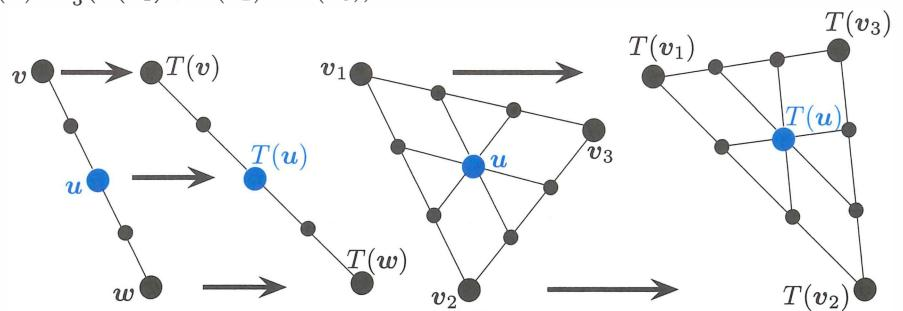
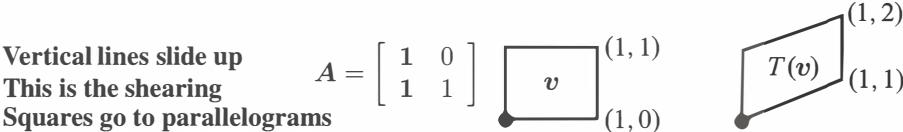

# **Chương 8 (Chapter 8)**

# **Các Phép biến đổi Tuyến tính (Linear Transformations)**

# **8.1 Ý tưởng về một Phép biến đổi Tuyến tính (The Idea of a Linear Transformation)**

**1** Một **phép biến đổi tuyến tính (linear transformation)** $T$ lấy các vectơ $v$ và biến chúng thành các vectơ $T(v)$. Tính tuyến tính đòi hỏi $T(cv + dw) = cT(v) + dT(w)$. Lưu ý $T(0) = 0$ nên $T(v) = v + u_0$ không phải là tuyến tính. 
**2** Các vectơ đầu vào $v$ và các đầu ra $T(v)$ có thể nằm trong $\mathbb{R}^n$ hoặc không gian ma trận (matrix space) hoặc không gian hàm (function space). 
**3** Nếu $A$ có kích thước $m \times n$, thì $T(x) = Ax$ là tuyến tính từ không gian đầu vào $\mathbb{R}^n$ tới không gian đầu ra $\mathbb{R}^m$. 
**4** Đạo hàm $T(f) = df/dx$ là tuyến tính. Tích phân $T^+(f) = \int_0^x f(t) dt$ là nghịch đảo giả (pseudoinverse) của nó. 
**5** Tích $ST$ của hai phép biến đổi tuyến tính vẫn là tuyến tính: $(ST)(v) = S(T(v))$.

Khi một ma trận $A$ nhân với một vectơ $v$, nó "biến đổi" $v$ thành một vectơ khác $Av$. Đầu vào là $v$, đầu ra là $T(v) = Av$. Một phép biến đổi $T$ tuân theo cùng một ý tưởng giống như một hàm số. Đầu vào là một con số $x$, đầu ra là $f(x)$. Đối với một vectơ $v$ hoặc một con số $x$, chúng ta nhân với ma trận hoặc chúng ta tính giá trị hàm số. Mục tiêu sâu xa hơn là xem xét tất cả các vectơ $v$ cùng một lúc. Chúng ta đang biến đổi toàn bộ không gian $V$ khi chúng ta nhân mọi $v$ với $A$.

Bắt đầu lại với một ma trận $A$. Nó biến đổi $v$ thành $Av$. Nó biến đổi $w$ thành $Aw$. Khi đó chúng ta *biết* chuyện gì xảy ra với $u = v + w$. Không có nghi ngờ gì về $Au$, nó phải bằng $Av + Aw$. Phép nhân ma trận $T(v) = Av$ mang lại một *phép biến đổi tuyến tính*:

Một *phép biến đổi $T$* gán một đầu ra $T(v)$ cho mỗi vectơ đầu vào $v$ trong $V$. Phép biến đổi là *tuyến tính* nếu nó đáp ứng những yêu cầu này cho tất cả $v$ và $w$:

| (a) $T(v + w) = T(v) + T(w)$ | (b) $T(cv) = cT(v)$ | đối với mọi $c$. |
|------------------------------------------------------------------|---------------------------------------|------------|

Nếu đầu vào là $v = 0$, đầu ra phải là $T(v) = 0$. Chúng ta kết hợp quy tắc (a) và (b) thành một:

**Phép biến đổi tuyến tính** $T(cv + dw)$ phải bằng $cT(v) + dT(w)$.

Một lần nữa tôi có thể kiểm tra phép nhân ma trận đối với tính tuyến tính: $A(cv + dw) = cAv + dAw$ là *đúng*.

Một phép biến đổi tuyến tính bị hạn chế rất nhiều. Giả sử $T$ cộng thêm $u_0$ vào mọi vectơ. Khi đó $T(v) = v + u_0$ và $T(w) = w + u_0$. Điều này không tốt, hoặc ít nhất *nó không tuyến tính*. Áp dụng $T$ cho $v + w$ tạo ra $v + w + u_0$. Điều đó không giống với $T(v) + T(w)$:

| Phép tịnh tiến (Shift) không tuyến tính | $v + w + u_0$ | không bằng | $T(v) + T(w) = (v + u_0) + (w + u_0)$ |
|---------------------|---------------|--------|---------------------------------------|

Ngoại lệ là khi $u_0 = 0$. Phép biến đổi thu gọn thành $T(v) = v$. Đây là *phép biến đổi đồng nhất (identity transformation)* (không có gì di chuyển, giống như trong phép nhân với ma trận đơn vị). Đó chắc chắn là tuyến tính. Trong trường hợp này không gian đầu vào $V$ cũng chính là không gian đầu ra $W$.

Phép biến đổi tuyến-tính-cộng-tịnh-tiến (linear-plus-shift transformation) $T(v) = Av + u_0$ được gọi là *"affine (affin)".* Các đường thẳng vẫn giữ nguyên sự thẳng mặc dù $T$ không phải là tuyến tính. Đồ họa máy tính hoạt động với các phép biến đổi affine trong Phần 10.6, bởi vì chúng ta phải có khả năng di chuyển các hình ảnh.

**Ví dụ 1** Chọn một vectơ cố định $a = (1, 3, 4)$, và gọi $T(v)$ là tích vô hướng $a \cdot v$:

Đầu ra là $T(v) = a \cdot v = v_1 + 3v_2 + 4v_3$.

| Đầu vào là | $v = (v_1, v_2, v_3)$ . | Đầu ra là | $T(v) = a \cdot v = v_1 + 3v_2 + 4v_3$ . |
|--------------|-------------------------|---------------|------------------------------------------------------------|

*Tích vô hướng là tuyến tính.* Các đầu vào $v$ đến từ không gian ba chiều, nên $V = \mathbb{R}^3$. Các đầu ra chỉ là những con số, nên không gian đầu ra là $W = \mathbb{R}^1$. Chúng ta đang nhân với ma trận hàng $A = \begin{bmatrix} 1 & 3 & 4 \end{bmatrix}$. Khi đó $T(v) = Av$.

Bạn sẽ trở nên giỏi trong việc nhận biết những phép biến đổi nào là tuyến tính. Nếu đầu ra bao gồm các bình phương hoặc tích hoặc độ dài, $v_1^2$ hoặc $v_1 v_2$ hoặc $\|v\|$, thì $T$ không tuyến tính.

**Ví dụ 2** Độ dài $T(v) = \|v\|$ không tuyến tính. Yêu cầu (a) cho tính tuyến tính sẽ là $\|v + w\| = \|v\| + \|w\|$. Yêu cầu (b) sẽ là $\|cv\| = c\|v\|$. Cả hai đều sai!

*Trái với* (a): Các cạnh của một tam giác thỏa mãn một *bất đẳng thức* $\|v + w\| \leq \|v\| + \|w\|$.
*Trái với* (b): Độ dài $\|-v\|$ là $\|v\|$ và không phải $-\|v\|$. Đối với $c$ âm, tính tuyến tính thất bại.

**Ví dụ 3** (Phép quay - Rotation) $T$ là phép biến đổi *quay mọi vectơ đi $30^\circ$*. *"Miền xác định (domain)"* của $T$ là mặt phẳng $xy$ (tất cả các vectơ đầu vào $v$). *"Miền giá trị (range)"* của $T$ cũng là mặt phẳng $xy$ (tất cả các vectơ đã được quay $T(v)$). Chúng ta đã mô tả $T$ mà không cần một ma trận: quay mặt phẳng đi $30^\circ$.

Phép quay có tuyến tính không? *Có.* Chúng ta có thể quay hai vectơ và cộng các kết quả lại. Tổng của các phép quay $T(v) + T(w)$ giống với phép quay $T(v + w)$ của tổng. **Toàn bộ mặt phẳng đang xoay cùng nhau, trong phép biến đổi tuyến tính này.**

# **Các đường thẳng biến thành Các đường thẳng, Các tam giác biến thành Các tam giác, Cơ sở cho biết Tất cả (Lines to Lines, Triangles to Triangles, Basis Tells All)**

Hình 8.1 cho thấy đường thẳng từ $v$ đến $w$ trong không gian đầu vào. Nó cũng cho thấy đường thẳng từ $T(v)$ đến $T(w)$ trong không gian đầu ra. Tính tuyến tính cho chúng ta biết: Mọi điểm trên đường thẳng đầu vào đi đến một điểm trên đường thẳng đầu ra. Và hơn thế nữa: *Các điểm cách đều nhau biến thành các điểm cách đều nhau.* Điểm ở giữa $u = \frac{1}{2}v + \frac{1}{2}w$ biến thành điểm ở giữa $T(u) = \frac{1}{2}T(v) + \frac{1}{2}T(w)$.

Hình thứ hai tiến lên một chiều không gian. Bây giờ chúng ta có ba góc $v_1, v_2, v_3$. Những đầu vào đó có ba đầu ra $T(v_1), T(v_2), T(v_3)$. *Tam giác đầu vào biến thành tam giác đầu ra.* Các điểm cách đều nhau vẫn cách đều nhau (dọc theo các cạnh, và sau đó là giữa các cạnh). Điểm ở giữa $u = \frac{1}{3}(v_1 + v_2 + v_3)$ biến thành điểm ở giữa $T(u) = \frac{1}{3}(T(v_1) + T(v_2) + T(v_3))$.

Hình 8.1: Các đường thẳng biến thành các đường thẳng, khoảng cách đều nhau biến thành khoảng cách đều nhau, $u = 0$ biến thành $T(u) = 0$.

*Quy tắc tuyến tính mở rộng sang các tổ hợp của ba vectơ hoặc $n$ vectơ:*

| Tính tuyến tính                                          | $u = c_1v_1 + c_2v_2 + \dots + c_nv_n$ | phải biến đổi thành | (1) |
|----------------------------------------------------|----------------------------------------|-------------------|-----|
| $T(u) = c_1T(v_1) + c_2T(v_2) + \dots + c_nT(v_n)$ |                                        |                   |     |

Quy tắc 2 vectơ khởi đầu cho chứng minh 3 vectơ: $T(cu + dv + ew) = T(cu) + T(dv + ew)$. Sau đó tính tuyến tính áp dụng cho cả hai phần đó, để mang lại $cT(u) + dT(v) + eT(w)$.

Quy tắc $n$ vectơ (1) dẫn đến sự thật quan trọng nhất về các phép biến đổi tuyến tính:

**Giả sử bạn biết $T(v)$ đối với tất cả các vectơ $v_1, \dots, v_n$ trong một cơ sở. Khi đó bạn biết $T(u)$ đối với mọi vectơ $u$ trong không gian.**

Bạn thấy lý do rồi đó: Mọi $u$ trong không gian đều là một tổ hợp của các vectơ cơ sở $v_j$. Khi đó tính tuyến tính cho chúng ta biết rằng $T(u)$ cũng chính là tổ hợp đó của các đầu ra $T(v_j)$.

**Ví dụ 4 Phép biến đổi $T$ lấy đạo hàm của đầu vào:** $T(u) = du/dx$. Làm thế nào để bạn tìm đạo hàm của $u = 6 - 4x + 3x^2$? Bạn bắt đầu với các đạo hàm của $1$, $x$, và $x^2$. Đó là các vectơ cơ sở. Đạo hàm của chúng là $0$, $1$, và $2x$. Sau đó bạn sử dụng tính tuyến tính để tính đạo hàm của bất kỳ tổ hợp nào:

$$\frac{du}{dx} = 6 (\text{đạo hàm của } 1) - 4 (\text{đạo hàm của } x) + 3 (\text{đạo hàm của } x^2) = -4 + 6x.$$

Toàn bộ giải tích phụ thuộc vào tính tuyến tính! Tiền giải tích (Precalculus) tìm ra một vài đạo hàm then chốt, cho $x^n$ và $\sin x$ và $\cos x$ và $e^x$. Sau đó tính tuyến tính áp dụng cho tất cả các tổ hợp của chúng.

Tôi có thể nói rằng quy tắc duy nhất đặc biệt đối với giải tích là *quy tắc chuỗi (chain rule)*. Nó tạo ra đạo hàm của một chuỗi các hàm số $f(g(x))$.

**Không gian không (Nullspace)** của $T(u) = du/dx$. Đối với không gian không, chúng ta giải phương trình $T(u) = 0$. Đạo hàm bằng 0 khi *u là một hàm hằng*. Vì vậy không gian không một chiều là một đường thẳng trong không gian hàm - tất cả các bội số của nghiệm đặc biệt $u = 1$.

**Không gian cột (Column space)** của $T(u) = du/dx$. Trong ví dụ của chúng ta, không gian đầu vào chứa tất cả các hàm bậc hai $a + bx + cx^2$. Các đầu ra (không gian cột) là tất cả các hàm bậc nhất $b + 2cx$. Chú ý rằng **Định lý Đếm (Counting Theorem)** vẫn đúng: $r + (n - r) = n$.

số chiều của (**không gian cột**) + số chiều của (**không gian không**) = 2 + 1 = **3** = số chiều của **(không gian đầu vào)**

*Ma trận cho $d/dx$ là gì?* Tôi không thể rời khỏi phần đạo hàm mà không hỏi về một ma trận. Chúng ta có một phép biến đổi tuyến tính $T = d/dx$. Chúng ta biết $T$ làm gì với các hàm cơ sở:

| $v_1, v_2, v_3 = 1, x, x^2$ | $\frac{dv_1}{dx} = 0$ | $\frac{dv_2}{dx} = 1 = v_1$ | $\frac{dv_3}{dx} = 2x = 2v_2.$ | (2) |
|-----------------------------|-----------------------|-----------------------------|--------------------------------|-----|

Không gian đầu vào 3 chiều $V$ (= các hàm bậc hai) biến đổi thành không gian đầu ra 2 chiều $W$ (= các hàm bậc nhất). Nếu $v_1, v_2, v_3$ là các vectơ, tôi sẽ biết ma trận.

| $A = \begin{bmatrix} 0 & 1 & 0 \\ 0 & 0 & 2 \end{bmatrix} = \text{dạng ma trận của đạo hàm } T = \frac{d}{dx}.$ | (3) |
|-------------------------------------------------------------------------------------------------------------------------------|-----|

Phép biến đổi tuyến tính $du/dx$ được sao chép một cách hoàn hảo bởi phép nhân ma trận $Au$.

| Đầu vào $u$       | Phép nhân $Au = \begin{bmatrix} 0 & 1 & 0 \\ 0 & 0 & 2 \end{bmatrix} \begin{bmatrix} a \\ b \\ c \end{bmatrix} = \begin{bmatrix} b \\ 2c \end{bmatrix}$ | Đầu ra $\frac{du}{dx} = b + 2cx$ . |
|-----------------|----------------------------------------------------------------------------|------------------------------------|

Sự kết nối từ $T$ tới $A$ (chúng ta sẽ kết nối mọi phép biến đổi với một ma trận) phụ thuộc vào việc chọn một cơ sở đầu vào $1, x, x^2$ và một cơ sở đầu ra $1, x$.

**Tiếp theo chúng ta xem xét tích phân. Chúng mang lại nghịch đảo giả $T^+$ của đạo hàm!** Tôi không thể viết $T^{-1}$ và tôi không thể nói *"nghịch đảo của $T$"* khi đạo hàm của 1 là 0.

**Ví dụ 5 Tích phân $T^+$ cũng là tuyến tính:** $\int_0^x (D + Et) dt = Dx + \frac{1}{2}Ex^2$

Cơ sở đầu vào bây giờ là $1, x$. Cơ sở đầu ra là $1, x, x^2$. Ma trận $A^+$ cho $T^+$ có kích thước 3 x 2:

**Đầu ra** = **Tích phân của $v$, $T^+(v) = Dx + \frac{1}{2}Ex^2$**

| Đầu vào $v$ | Phép nhân $A^+v = \begin{bmatrix} 0 & 0 \\ 1 & 0 \\ 0 & \frac{1}{2} \end{bmatrix} \begin{bmatrix} D \\ E \end{bmatrix} = \begin{bmatrix} 0 \\ D \\ \frac{1}{2}E \end{bmatrix}$ | Đầu ra = Tích phân của $v$ $T^+(v) = Dx + \frac{1}{2}Ex^2$ |
|-----------|-----------------------------------------------------------------------------------------|-------------------------------------------------------------|

*Định lý Cơ bản của Giải tích (Fundamental Theorem of Calculus) nói rằng tích phân là nghịch đảo giả (pseudoinverse) của đạo hàm.* Đối với đại số tuyến tính, ma trận $A^+$ là nghịch đảo giả của ma trận $A$:

$$A^+A = \begin{bmatrix} 0 & 0 \\ 1 & 0 \\ 0 & \frac{1}{2} \end{bmatrix} \begin{bmatrix} 0 & 1 & 0 \\ 0 & 0 & 2 \end{bmatrix} = \begin{bmatrix} 0 & 0 & 0 \\ 0 & 1 & 0 \\ 0 & 0 & 1 \end{bmatrix} \quad \text{và} \quad AA^+ = \begin{bmatrix} 1 & 0 \\ 0 & 1 \end{bmatrix}. \quad (4)$$

Đạo hàm của một hàm hằng bằng 0. Số 0 đó nằm trên đường chéo của $A^+A$. Giải tích sẽ không phải là giải tích nếu không có không gian không 1 chiều đó của $T = d/dx$.

### **Các ví dụ về Các phép biến đổi (chủ yếu là tuyến tính)**

**Ví dụ 6** Chiếu mọi vectơ 3 chiều lên mặt phẳng nằm ngang $z = 1$. Vectơ $v = (x, y, z)$ được biến đổi thành $T(v) = (x, y, 1)$. Phép biến đổi này không tuyến tính. Tại sao không? Thậm chí nó còn không biến đổi $v = 0$ thành $T(v) = 0$.

**Ví dụ 7** Giả sử $A$ là một *ma trận có thể nghịch đảo (invertible matrix).* Chắc chắn $T(v + w) = Av + Aw = T(v) + T(w)$. Một phép biến đổi tuyến tính khác là nhân với $A^{-1}$. Điều này tạo ra *phép biến đổi nghịch đảo (inverse transformation)* $T^{-1}$, đưa mọi vectơ $T(v)$ trở lại $v$:

$$T^{-1}(T(v)) = v$$
khớp với phép nhân ma trận $A^{-1}(Av) = v$.

Nếu $T(v) = Av$ và $S(u) = Bu$, thì tích $T(S(u))$ khớp với tích $ABu$.

Chúng ta đang đi đến một câu hỏi không thể tránh khỏi. *Có phải tất cả các phép biến đổi tuyến tính từ $V = \mathbb{R}^n$ tới $W = \mathbb{R}^m$ đều được tạo ra bởi các ma trận không?* Khi một $T$ tuyến tính được mô tả như một "phép quay" hoặc "phép chiếu" hoặc "...", liệu có luôn có một ma trận $A$ ẩn đằng sau $T$ không? Có phải $T(v)$ luôn là $Av$ không?

Câu trả lời là *có!* Đây là một cách tiếp cận đại số tuyến tính mà không bắt đầu bằng các ma trận. Cuối cùng chúng ta vẫn kết thúc bằng các ma trận - sau khi *chúng ta chọn một cơ sở đầu vào và một cơ sở đầu ra*.

**Lưu ý** Các phép biến đổi có ngôn ngữ riêng của chúng. Đối với một ma trận, không gian cột chứa tất cả các đầu ra $Av$. Không gian không chứa tất cả các đầu vào mà tại đó $Av = 0$. Hãy dịch những từ đó thành *"miền giá trị (range)"* và *"hạt nhân (kernel)":*

*Miền giá trị của $T$ (Range of $T$)* = tập hợp *tất cả các đầu ra $T(v)$*. Miền giá trị tương ứng với không gian cột.

*Hạt nhân của $T$ (Kernel of $T$)* = tập hợp *tất cả các đầu vào mà tại đó $T(v) = 0$*. Hạt nhân tương ứng với không gian không.

Miền giá trị nằm trong không gian đầu ra $W$. Hạt nhân nằm trong không gian đầu vào $V$. Khi $T$ là phép nhân với một ma trận, $T(v) = Av$, miền giá trị là không gian cột và hạt nhân là không gian không.

#### **Các Phép biến đổi Tuyến tính của Mặt phẳng (Linear Transformations of the Plane)**

Việc *nhìn thấy* một phép biến đổi thì thú vị hơn là định nghĩa nó. Khi một ma trận $2 \times 2$ $A$ nhân với tất cả các vectơ trong $\mathbb{R}^2$, chúng ta có thể quan sát cách nó hành động. Bắt đầu với một "ngôi nhà" có mười một điểm cuối. Mười một vectơ $v$ đó được biến đổi thành mười một vectơ $Av$. Các đường thẳng giữa các $v$ trở thành các đường thẳng giữa các vectơ đã được biến đổi $Av$. (Phép biến đổi từ ngôi nhà này sang ngôi nhà khác là tuyến tính!) Áp dụng $A$ cho một ngôi nhà tiêu chuẩn tạo ra một ngôi nhà mới - có thể bị kéo dài, xoay, hoặc bằng cách nào đó không thể ở được.

Phần này của cuốn sách mang tính trực quan, không mang tính lý thuyết. Chúng ta sẽ hiển thị bốn ngôi nhà và các ma trận tạo ra chúng. Các cột của $H$ là mười một góc của ngôi nhà đầu tiên. ($H$ có kích thước $2 \times 12$, do đó hàm `plot2d` trong Bài 25 sẽ kết nối góc thứ **11** với góc đầu tiên.) $A$ nhân với 11 điểm trong ma trận ngôi nhà $H$ để tạo ra các góc $AH$ của những ngôi nhà khác.

| Ma trận ngôi nhà | $H = \begin{bmatrix} -6 & -6 & -7 & 0 & 7 & 6 & 6 & -3 & -3 & 0 & -6 \\ -7 & 2 & 1 & 8 & 1 & 2 & -7 & -2 & -2 & -2 & -7 \end{bmatrix}$ |
|--------------|----------------------------------------------------------------------------------------------------------------------------------------|

Hình 8.2: Các phép biến đổi tuyến tính của một ngôi nhà được vẽ bởi `plot2d(A * H)`.

#### **• ÔN TẬP CÁC Ý TƯỞNG THEN CHỐT • (REVIEW OF THE KEY IDEAS)**

- **1.** Một phép biến đổi $T$ đưa mỗi $v$ trong không gian đầu vào tới $T(v)$ trong không gian đầu ra.
- **2.** $T$ là **tuyến tính** nếu $T(v + w) = T(v) + T(w)$ và $T(cv) = cT(v)$: đường thẳng biến thành đường thẳng.
- **3.** Tổ hợp biến thành tổ hợp: $T(c_1v_1 + \dots + c_nv_n) = c_1T(v_1) + \dots + c_nT(v_n)$.
- **4.** $T$ = *đạo hàm* và $T^+$ = *tích phân* là các phép biến đổi tuyến tính. Và $T(v) = Av$ từ $\mathbb{R}^n$ tới $\mathbb{R}^m$ cũng vậy.

■ **CÁC VÍ DỤ CÓ LỜI GIẢI (WORKED EXAMPLES)** ■

**8.1 A** Ma trận khử $\begin{bmatrix} 1 & 0 \\ 1 & 1 \end{bmatrix}$ mang lại một *phép biến đổi trượt (shearing transformation)* từ $(x, y)$ thành $T(x, y) = (x, x + y)$. Nếu các đầu vào lấp đầy một hình vuông, hãy vẽ hình vuông đã được biến đổi.

**Lời giải** Các điểm $(1, 0)$ và $(2, 0)$ trên trục $x$ biến đổi qua $T$ thành $(1, 1)$ và $(2, 2)$ trên đường thẳng $45^\circ$. Các điểm trên trục $y$ *không bị di chuyển*: $T(0, y) = (0, y) =$ các vectơ riêng với $\lambda = 1$.

**8.1 B** Một **phép biến đổi phi tuyến (nonlinear transformation)** $T$ có thể nghịch đảo nếu mọi $b$ trong không gian đầu ra xuất phát từ chính xác một $x$ trong không gian đầu vào: $T(x) = b$ luôn có chính xác một nghiệm. Phép biến đổi nào trong số những phép biến đổi này (đối với các số thực $x$) có thể nghịch đảo và $T^{-1}$ là gì? *Không có phép biến đổi nào là tuyến tính, ngay cả $T_3$.* Khi bạn giải $T(x) = b$, bạn đang nghịch đảo $T$:

$$T_1(x) = x^2 \quad T_2(x) = x^3 \quad T_3(x) = x + 9 \quad T_4(x) = e^x \quad T_5(x) = \frac{1}{x} \text{ đối với các } x \text{ khác } 0$$

**Lời giải** $T_1$ không thể nghịch đảo: $x^2 = 1$ có *hai* nghiệm và $x^2 = -1$ *không có* nghiệm nào. $T_4$ không thể nghịch đảo vì $e^x = -1$ không có nghiệm. (Nếu không gian đầu ra đổi thành các $b$ *dương* thì nghịch đảo của $e^x = b$ là $x = \ln b$.)

Chú ý $T_5^2 = \text{hàm đồng nhất (identity)}$. Nhưng $T_3^2(x) = x + 18$. $T_2^2(x)$ và $T_4^2(x)$ là gì?

$T_2, T_3, T_5$ có thể nghịch đảo: $x^3 = b$ và $x + 9 = b$ và $\frac{1}{x} = b$ có một nghiệm $x$.

$$x = T_2^{-1}(b) = b^{1/3} \quad x = T_3^{-1}(b) = b - 9 \quad x = T_5^{-1}(b) = 1/b$$

## **Tập bài tập 8.1 (Problem Set 8.1)**

**1** Một phép biến đổi tuyến tính phải giữ nguyên vectơ không: $T(0) = 0$. Chứng minh điều này từ $T(v + w) = T(v) + T(w)$ bằng cách chọn $w = \underline{\hspace{2cm}}$ (và hoàn thành phần chứng minh). Cũng hãy chứng minh nó từ $T(cv) = cT(v)$ bằng cách chọn $c = \underline{\hspace{2cm}}$.

**2** Yêu cầu (b) mang lại $T(cv) = cT(v)$ và cả $T(dw) = dT(w)$. Khi đó bằng phép cộng, yêu cầu (a) mang lại $T(\underline{\hspace{2cm}}) = (\underline{\hspace{2cm}})$. $T(cv + dw + eu)$ là gì?

**3** Phép biến đổi nào trong số này không tuyến tính? Đầu vào là $v = (v_1, v_2)$:
   (a) $T(v) = (v_2, v_1)$
   (b) $T(v) = (v_1, v_1)$
   (c) $T(v) = (0, v_1)$
   (d) $T(v) = (0, 1)$
   (e) $T(v) = v_1 - v_2$
   (f) $T(v) = v_1 v_2$.

**4** Nếu $S$ và $T$ là các phép biến đổi tuyến tính, thì $T(S(v))$ là tuyến tính hay bậc hai?
   (a) (Trường hợp đặc biệt) Nếu $S(v) = v$ và $T(v) = v$, thì $T(S(v)) = v$ hay $v^2$?
   (b) (Trường hợp tổng quát) $S(v_1 + v_2) = S(v_1) + S(v_2)$ và $T(v_1 + v_2) = T(v_1) + T(v_2)$ kết hợp thành $T(S(v_1 + v_2)) = T(\underline{\hspace{1cm}}) = \underline{\hspace{1cm}} + \underline{\hspace{1cm}}$.

**5** Giả sử $T(v) = v$ ngoại trừ $T(v_2) = (0, 0)$. Hãy chỉ ra rằng phép biến đổi này thỏa mãn $T(cv) = cT(v)$ nhưng không thỏa mãn $T(v + w) = T(v) + T(w)$.

**6** Phép biến đổi nào trong số này thỏa mãn $T(v + w) = T(v) + T(w)$ và phép biến đổi nào thỏa mãn $T(cv) = cT(v)$?
(a) $T(v) = v / \|v\|$ (d) $T(v) =$ thành phần lớn nhất của $v$.

**7** Đối với những phép biến đổi này từ $V = \mathbb{R}^2$ sang $W = \mathbb{R}^2$, hãy tìm $T(T(v))$. Hãy chỉ ra rằng khi $T(v)$ là tuyến tính, thì $T(T(v))$ cũng là tuyến tính.
(a) $T(v) = -v$
(b) $T(v) = v + (1, 1)$
(c) $T(v) = \text{phép quay } 90^\circ = (-v_2, v_1)$
(d) $T(v) = \text{phép chiếu} = \frac{1}{2}(v_1 + v_2, v_1 + v_2)$.

**8** Tìm miền giá trị và hạt nhân (giống như không gian cột và không gian không) của $T$:
(a) $T(v_1, v_2) = (v_1 - v_2, 0)$
(b) $T(v_1, v_2, v_3) = (v_1, v_2)$
(c) $T(v_1, v_2) = (0, 0)$
(d) $T(v_1, v_2) = (v_1, v_1)$.

**9** Phép biến đổi "vòng quanh (cyclic)" $T$ được định nghĩa bởi $T(v_1, v_2, v_3) = (v_2, v_3, v_1)$. $T(T(v))$ là gì? $T^3(v)$ là gì? $T^{100}(v)$ là gì? Áp dụng $T$ một trăm lần lên $v$.

**10** Một phép biến đổi tuyến tính từ $V$ tới $W$ có một *nghịch đảo* từ $W$ tới $V$ khi miền giá trị là toàn bộ $W$ và hạt nhân chỉ chứa $v = 0$. Khi đó $T(v) = w$ có một nghiệm $v$ cho mỗi $w$ trong $W$. Tại sao những phép biến đổi $T$ này không thể nghịch đảo?
(a) $T(v_1, v_2) = (v_2, v_2)$ với $W = \mathbb{R}^2$
(b) $T(v_1, v_2) = (v_1, v_2, v_1 + v_2)$ với $W = \mathbb{R}^3$
(c) $T(v_1, v_2) = v_1$ với $W = \mathbb{R}^1$

**11** Nếu $T(v) = Av$ và $A$ có kích thước $m \times n$, thì $T$ là "phép nhân với $A$".
(a) Các không gian đầu vào và đầu ra $V$ và $W$ là gì?
(b) Tại sao miền giá trị của $T =$ không gian cột của $A$?
(c) Tại sao hạt nhân của $T =$ không gian không của $A$?

**12** Giả sử một phép biến đổi tuyến tính $T$ biến $(1, 1)$ thành $(2, 2)$ và $(2, 0)$ thành $(0, 0)$. Tìm $T(v)$:
(a) $v = (2, 2)$ (b) $v = (3, 1)$ (c) $v = (-1, 1)$ (d) $v = (a, b)$.

**Các bài tập 13-19 có thể khó hơn. Không gian đầu vào $V$ chứa tất cả các ma trận $2 \times 2$ tên là $M$.**

**13** $M$ là một ma trận $2 \times 2$ bất kỳ và $A = \begin{bmatrix} 1 & 2 \\ 3 & 4 \end{bmatrix}$. Phép biến đổi $T$ được định nghĩa bởi $T(M) = AM$. Những quy tắc nhân ma trận nào cho thấy rằng $T$ là tuyến tính?

**14** Giả sử $A = \begin{bmatrix} 1 & 2 \\ 3 & 4 \end{bmatrix}$. Hãy chỉ ra rằng miền giá trị của $T$ là toàn bộ không gian ma trận $V$ và hạt nhân là ma trận 0:
(1) Nếu $AM = 0$ hãy chứng minh rằng $M$ phải là ma trận 0.
(2) Tìm một nghiệm cho $AM = B$ với bất kỳ ma trận $2 \times 2$ $B$ nào.

**15** Giả sử $A = \begin{bmatrix} 1 & 2 \\ 0 & 0 \end{bmatrix}$. Hãy chỉ ra rằng ma trận đơn vị $I$ không nằm trong miền giá trị của $T$. Tìm một ma trận $M$ khác 0 sao cho $T(M) = AM$ là 0.

**16** Giả sử $T$ chuyển vị mọi ma trận $2 \times 2$ $M$. Cố gắng tìm một ma trận $A$ mang lại $AM = M^T$. Hãy chỉ ra rằng không có ma trận $A$ nào sẽ làm được điều đó. *Gửi các giáo sư:* Đây có phải là một phép biến đổi tuyến tính mà không bắt nguồn từ một ma trận không? Ma trận sẽ phải có kích thước $4 \times 4$!

**17** Phép biến đổi $T$ chuyển vị mọi ma trận $2 \times 2$ chắc chắn là tuyến tính. Những tính chất phụ nào trong số này là đúng?
(a) $T^2 =$ phép biến đổi đồng nhất.
(b) Hạt nhân của $T$ là ma trận 0.
(c) Mọi ma trận $2 \times 2$ đều nằm trong miền giá trị của $T$.
(d) $T(M) = -M$ là điều không thể.

**18** Giả sử $T(M) = \begin{bmatrix} 1 & 0 \\ 0 & 0 \end{bmatrix} M \begin{bmatrix} 0 & 0 \\ 0 & 1 \end{bmatrix}$. Tìm một ma trận với $T(M) \neq 0$. Mô tả tất cả các ma trận có $T(M) = 0$ (hạt nhân) và tất cả các ma trận đầu ra $T(M)$ (miền giá trị).

**19** Nếu $A$ và $B$ có thể nghịch đảo và $T(M) = AMB$, hãy tìm $T^{-1}(M)$ ở dạng $(\quad) M (\quad)$.

**Các câu hỏi 20-26 nói về các phép biến đổi ngôi nhà. Đầu ra là $T(H) = AH$.**

**20** Làm thế nào bạn có thể nhận ra từ hình vẽ của $T(\text{house})$ rằng $A$ là
(a) một ma trận đường chéo?
(b) một ma trận hạng một?
(c) một ma trận tam giác dưới?

**21** Vẽ một hình ảnh của $T(\text{house})$ đối với các ma trận này:

| $D = \begin{bmatrix} 2 & 0 \\ 0 & 1 \end{bmatrix}$ | và | $A = \begin{bmatrix} .7 & .7 \\ .3 & .3 \end{bmatrix}$ | và | $U = \begin{bmatrix} 1 & 1 \\ 0 & 1 \end{bmatrix}$ |
|----------------------------------------------------|-----|--------------------------------------------------------|-----|----------------------------------------------------|

**22** Những điều kiện nào trên $A = \begin{bmatrix} a & b \\ c & d \end{bmatrix}$ để đảm bảo rằng $T(\text{house})$ sẽ
(a) ngồi thẳng đứng?
(b) mở rộng ngôi nhà thêm 3 ở tất cả các hướng?
(c) quay ngôi nhà mà không thay đổi hình dạng của nó?

**23** Mô tả $T(\text{house})$ khi $T(v) = -v + (1, 0)$. $T$ này là "affine".

**24** Thay đổi ma trận ngôi nhà $H$ để thêm vào một ống khói.

**25** Ngôi nhà tiêu chuẩn được vẽ bằng `plot2d(H)`. Các vòng tròn từ `o` và các đường thẳng từ `-`:

| `x = H(1, :)'; y = H(2, :)';` `axis([-10 10 -10 10]), axis('square')` `plot(x, y, 'o', x, y, '-');` |
|--------------------------------------------------------------------------------------------------------------------------------------------|

Kiểm tra `plot2d(A * H)` và `plot2d(A^-1 * A * H)` với các ma trận trong Hình 8.1.

**26** Không dùng máy tính, hãy phác họa các ngôi nhà $A * H$ cho các ma trận $A$ này:

| $\begin{bmatrix} 1 & 0 \\ 0 & 1 \end{bmatrix}$ | và | $\begin{bmatrix} .5 & .5 \\ .5 & .5 \end{bmatrix}$ | và | $\begin{bmatrix} .5 & .5 \\ -.5 & .5 \end{bmatrix}$ | và | $\begin{bmatrix} 1 & 1 \\ 1 & 0 \end{bmatrix}$ |
|------------------------------------------------|-----|----------------------------------------------------|-----|-----------------------------------------------------|-----|------------------------------------------------|

**27** Đoạn mã này tạo ra một vectơ `theta` gồm 50 góc. Nó vẽ vòng tròn đơn vị và sau đó nó vẽ $T(\text{circle}) = \text{elip}$. $T(v) = Av$ biến các vòng tròn **thành** các hình elip.
`A = [2 1; 1 2]` % Bạn có thể thay đổi A
`theta = [0:2*pi/50:2*pi];`
`circle = [cos(theta); sin(theta)];`
`ellipse = A * circle;`
`axis([-4 4 -4 4]); axis('square')`
`plot(circle(1,:), circle(2,:), ellipse(1,:), ellipse(2,:))`

**28** Thêm hai mắt và một nụ cười vào vòng tròn trong Bài 27. (Nếu một mắt tối và mắt kia sáng, bạn có thể nhận biết khi khuôn mặt bị phản xạ qua trục $y$.) Nhân với các ma trận $A$ để có được những khuôn mặt mới.

**29** Những điều kiện nào trên $\det A = ad - bc$ đảm bảo rằng ngôi nhà đầu ra $AH$ sẽ
(a) bị bóp nát trên một đường thẳng?
(b) giữ các điểm cuối của nó theo thứ tự chiều kim đồng hồ (không bị phản xạ)?
(c) có cùng diện tích với ngôi nhà ban đầu?

**30** Tại sao mọi phép biến đổi tuyến tính $T$ từ $\mathbb{R}^2$ đến $\mathbb{R}^2$ đều biến các hình vuông thành các hình bình hành? Các hình chữ nhật cũng biến thành các hình bình hành (bị bóp nát nếu $T$ không thể nghịch đảo).

# **8.2 Ma trận của một Phép biến đổi Tuyến tính (The Matrix of a Linear Transformation)**

**1** Chúng ta biết mọi $T(v)$ nếu chúng ta biết $T(v_1), \dots, T(v_n)$ đối với một cơ sở đầu vào $v_1, \dots, v_n$: sử dụng **tính tuyến tính.**
**2** Cột $j$ trong "ma trận cho $T$" xuất phát từ việc áp dụng $T$ lên vectơ cơ sở đầu vào $v_j$.
**3** Viết $T(v_j) = a_{1j}w_1 + \dots + a_{mj}w_m$ trong cơ sở đầu ra của các $w$. Các phần tử $a_{ij}$ đó đi vào cột $j$.
**4** Ma trận cho $T(x) = Ax$ là $A$, nếu các cơ sở đầu vào và đầu ra = các cột của $I_{n \times n}$ và $I_{m \times m}$.
**5** Khi các cơ sở thay đổi thành các $v$ và các $w$, ma trận cho cùng một $T$ đó thay đổi từ $A$ thành $W^{-1} A V$.
**6** Các cơ sở tốt nhất: $V = W =$ các vectơ riêng và $V, W =$ các vectơ suy biến mang lại $A$ và $\Sigma$ dạng đường chéo.

**Những trang tiếp theo gán một ma trận $A$ cho mọi phép biến đổi tuyến tính $T$.** Đối với các vectơ cột thông thường, đầu vào $v$ nằm trong $V = \mathbb{R}^n$ và đầu ra $T(v)$ nằm trong $W = \mathbb{R}^m$. Ma trận $A$ cho phép biến đổi này sẽ có kích thước $m \times n$. Sự lựa chọn các cơ sở trong $V$ và $W$ của chúng ta sẽ quyết định $A$.

Các vectơ cơ sở tiêu chuẩn cho $\mathbb{R}^n$ và $\mathbb{R}^m$ là các cột của $I$. Sự lựa chọn đó dẫn đến một ma trận tiêu chuẩn. Khi đó $T(v) = Av$ theo cách bình thường. Nhưng những không gian này cũng có các cơ sở khác, vì vậy *cùng một phép biến đổi $T$ đó được biểu diễn bởi các ma trận khác.* Một chủ đề chính của đại số tuyến tính là chọn các cơ sở mang lại ma trận tốt nhất (một ma trận đường chéo) cho $T$.

Tất cả các không gian vectơ $V$ và $W$ đều có các cơ sở. Mỗi sự lựa chọn các cơ sở đó dẫn đến một ma trận cho $T$. Khi cơ sở đầu vào khác với cơ sở đầu ra, ma trận cho $T(v) = v$ sẽ không phải là ma trận đơn vị $I$. Nó sẽ là "ma trận chuyển cơ sở". Dưới đây là ý tưởng then chốt:

**Giả sử chúng ta biết $T(v)$ đối với các vectơ cơ sở đầu vào $v_1$ tới $v_n$. Cột 1 tới cột $n$ của ma trận sẽ chứa các đầu ra $T(v_1)$ tới $T(v_n)$ đó.**
**Ma trận nhân với $c$ = ma trận nhân với vectơ = tổ hợp của $n$ cột đó. $Ac$ là tổ hợp chính xác $c_1 T(v_1) + \dots + c_n T(v_n) = T(v)$.**

**Lý do** Mọi $v$ đều là một tổ hợp duy nhất $c_1 v_1 + \dots + c_n v_n$ của các vectơ cơ sở $v_j$. Vì $T$ là một phép biến đổi tuyến tính (đây là khoảnh khắc dành cho tính tuyến tính), $T(v)$ phải là **cùng một tổ hợp đó** $c_1 T(v_1) + \dots + c_n T(v_n)$ **của các đầu ra $T(v_j)$ trong các cột.**

Ví dụ đầu tiên của chúng ta mang lại ma trận $A$ đối với các vectơ cơ sở tiêu chuẩn trong $\mathbb{R}^2$ và $\mathbb{R}^3$.

**Ví dụ 1** Giả sử $T$ biến đổi $v_1 = (1, 0)$ thành $T(v_1) = (2, 3, 4)$. Giả sử vectơ cơ sở thứ hai $v_2 = (0, 1)$ đi tới $T(v_2) = (5, 5, 5)$. Nếu $T$ là tuyến tính từ $\mathbb{R}^2$ đến $\mathbb{R}^3$ thì "ma trận tiêu chuẩn" của nó có kích thước $3 \times 2$. Những đầu ra $T(v_1)$ và $T(v_2)$ đó đi vào các cột của $A$:

| $A = \begin{bmatrix} 2 & 5 \\ 3 & 5 \\ 4 & 5 \end{bmatrix}$ | $c_1 = 1$ và $c_2 = 1$ mang lại $T(v_1 + v_2) = \begin{bmatrix} 2 & 5 \\ 3 & 5 \\ 4 & 5 \end{bmatrix} \begin{bmatrix} 1 \\ 1 \end{bmatrix} = \begin{bmatrix} 7 \\ 8 \\ 9 \end{bmatrix}$ |
|-------------------------------------------------------------|-------------------------------------------------------------------------------------------------------------------------------------------------------------------------------------------------------------|

## **Sự Chuyển đổi Cơ sở (Change of Basis)**

Bằng cách khớp (phép biến đổi)$^2$ với (ma trận)$^2$, chúng ta có được các công thức cho $\cos 2\theta$ và $\sin 2\theta$. Nhân $A$ với $A$:

$$\begin{bmatrix} \cos \theta & -\sin \theta \\ \sin \theta & \cos \theta \end{bmatrix} \begin{bmatrix} \cos \theta & -\sin \theta \\ \sin \theta & \cos \theta \end{bmatrix} = \begin{bmatrix} \cos^2 \theta - \sin^2 \theta & -2 \sin \theta \cos \theta \\ 2 \sin \theta \cos \theta & \cos^2 \theta - \sin^2 \theta \end{bmatrix}. \quad (5)$$

Việc so sánh (4) với (5) tạo ra $\cos 2\theta = \cos^2 \theta - \sin^2 \theta$ và $\sin 2\theta = 2 \sin \theta \cos \theta$. Lượng giác học (quy tắc góc nhân đôi) xuất phát từ đại số tuyến tính.

**Ví dụ 6** $S$ quay đi một góc $\theta$ và $T$ quay đi một góc $-\theta$. Khi đó $TS = I$ dẫn đến $AB = I$. Trong trường hợp này $T(S(u))$ là $u$. Chúng ta quay tới và quay lui. Để các ma trận khớp với nhau, $ABx$ phải là $x$. *Hai ma trận là nghịch đảo của nhau.* Hãy kiểm tra điều này bằng cách đặt $\cos(-\theta) = \cos \theta$ và $\sin(-\theta) = -\sin \theta$ vào ma trận quay ngược $A$:

$$AB = \begin{bmatrix} \cos \theta & \sin \theta \\ -\sin \theta & \cos \theta \end{bmatrix} \begin{bmatrix} \cos \theta & -\sin \theta \\ \sin \theta & \cos \theta \end{bmatrix} = \begin{bmatrix} \cos^2 \theta + \sin^2 \theta & 0 \\ 0 & \cos^2 \theta + \sin^2 \theta \end{bmatrix} = I.$$

### **Chọn Các Cơ sở Tốt nhất (Choosing the Best Bases)**

Bây giờ là bước cuối cùng trong phần này của cuốn sách. **Chọn các cơ sở chéo hóa ma trận.** Với cơ sở tiêu chuẩn (các cột của $I$), phép biến đổi $T$ của chúng ta tạo ra một ma trận $A$ nào đó - có thể không phải là đường chéo. Cùng phép biến đổi $T$ đó được biểu diễn bởi các ma trận khác nhau khi chúng ta chọn các cơ sở khác nhau. Hai sự lựa chọn tuyệt vời là các vectơ riêng và các vectơ suy biến:

**Các vectơ riêng (Eigenvectors)** Nếu $T$ biến đổi $\mathbb{R}^n$ thành $\mathbb{R}^n$, ma trận $A$ của nó là ma trận vuông. Nhưng sử dụng cơ sở tiêu chuẩn, ma trận $A$ đó có thể không phải là đường chéo. Nếu có $n$ vectơ riêng độc lập, *hãy chọn chúng làm cơ sở đầu vào và đầu ra.* Trong cơ sở tốt này, **ma trận cho** $T$ **là ma trận giá trị riêng dạng đường chéo $\Lambda$.**

**Ví dụ 7 Ma trận chiếu** $T$ chiếu mọi $v = (x, y)$ trong $\mathbb{R}^2$ lên đường thẳng $y = -x$. Sử dụng cơ sở tiêu chuẩn, $v_1 = (1,0)$ chiếu thành $T(v_1) = (\frac{1}{2}, -\frac{1}{2})$. Đối với $v_2 = (0, 1)$ hình chiếu là $T(v_2) = (-\frac{1}{2}, \frac{1}{2})$. Đó là các cột của $A$:

| Ma trận chiếu | $A = \begin{bmatrix} \frac{1}{2} & -\frac{1}{2} \\ -\frac{1}{2} & \frac{1}{2} \end{bmatrix}$ | có $A^T = A$ và $A^2 = A$ . |
|-------------------|----------------------------------------------------------------------------------------------|-------------------------------|
| Các cơ sở tiêu chuẩn |                                                                                              |                               |
| Không phải đường chéo |                                                                                              |                               |

**Khi các vectơ cơ sở là các vectơ riêng, ma trận trở thành ma trận đường chéo.**

$v_1 = w_1 = (1, -1)$ chiếu lên chính nó: $T(v_1) = v_1$ và $\lambda_1 = 1$
$v_2 = w_2 = (1, 1)$ chiếu thành 0: $T(v_2) = 0$ và $\lambda_2 = 0$

| **Các cơ sở vectơ riêng** | Ma trận mới là $\begin{bmatrix} 1 & 0 \\ 0 & 0 \end{bmatrix} = \begin{bmatrix} \lambda_1 & 0 \\ 0 & \lambda_2 \end{bmatrix} = \Lambda.$ | (6) |
|--------------------------|--------------------------------------------------------------------------------------------------------------------------------------------|-----|
| **Ma trận đường chéo**   |                                                                                                                                            |     |

Các vectơ riêng là các vectơ cơ sở hoàn hảo. Chúng tạo ra ma trận giá trị riêng $\Lambda$.

Còn những sự lựa chọn *cơ sở đầu vào = cơ sở đầu ra* khác thì sao? Hãy đặt các vectơ cơ sở đó vào các cột của $B$. Ở phần trên chúng ta đã thấy rằng các ma trận chuyển cơ sở (giữa cơ sở tiêu chuẩn và cơ sở mới) là $B_{\text{in}} = B$ và $B_{\text{out}} = B^{-1}$. Ma trận mới cho $T$ **đồng dạng (similar)** với $A$:

**$A_{\text{new}}$ trong cơ sở mới của các $b$ thì đồng dạng với $A$ trong cơ sở tiêu chuẩn:**

$$A_{\text{new (từ các } b \text{ tới các } b)} = B^{-1}_{\text{(từ tiêu chuẩn tới các } b)} A_{\text{tiêu chuẩn}} B_{\text{(từ các } b \text{ tới tiêu chuẩn)}} \quad (7)$$

Tôi đã sử dụng quy tắc nhân cho phép biến đổi $ITI$. Các ma trận cho $I, T, I$ là $B^{-1}, A, B$. Ma trận $B$ chứa các vectơ đầu vào $b$ trong cơ sở tiêu chuẩn.

Cuối cùng chúng ta cho phép *các không gian $V$ và $W$ khác nhau, và các cơ sở của các $v$ và các $w$ khác nhau*. Khi chúng ta biết $T$ và chúng ta chọn các cơ sở, chúng ta nhận được một ma trận $A$. Ma trận $A$ đó có thể không đối xứng hoặc thậm chí không vuông. Nhưng chúng ta luôn có thể chọn các $v$ và các $w$ tạo ra một ma trận đường chéo. Đây sẽ là *ma trận giá trị suy biến* $\Sigma = \text{diag}(\sigma_1, \dots, \sigma_r)$ trong phép phân tích $A = U \Sigma V^T$.

**Các vectơ suy biến (Singular vectors)** SVD nói rằng $U^{-1} A V = \Sigma$. Các vectơ suy biến phải $v_1, \dots, v_n$ sẽ là cơ sở đầu vào. Các vectơ suy biến trái $u_1, \dots, u_m$ sẽ là cơ sở đầu ra. Theo quy tắc nhân ma trận, ma trận cho cùng phép biến đổi đó trong các cơ sở mới này là $B_{\text{out}}^{-1} A B_{\text{in}} = U^{-1} A V = \Sigma$.

Tôi không thể nói rằng $\Sigma$ "đồng dạng" với $A$. Bây giờ chúng ta đang làm việc với hai cơ sở, đầu vào và đầu ra. Nhưng đó là các *cơ sở trực chuẩn (orthonormal bases)* và chúng bảo toàn độ dài của các vectơ. Theo một gợi ý hay từ David Vogan, tôi đề xuất chúng ta nói: $\Sigma$ **là "đẳng cự (isometric)" với** $A$.

Định nghĩa
$C = Q_1^{-1} A Q_2$
là đẳng cự với $A$ nếu $Q_1$ và $Q_2$ là trực giao.

**Ví dụ 8** Để xây dựng ma trận $A$ cho phép biến đổi $T = d/dx$, chúng ta đã chọn cơ sở đầu vào $1, x, x^2, x^3$ và cơ sở đầu ra $1, x, x^2$. Ma trận $A$ rất đơn giản nhưng thật không may nó không phải là đường chéo. Nhưng chúng ta có thể lấy mỗi cơ sở *theo thứ tự ngược lại*.

Bây giờ cơ sở đầu vào là $x^3, x^2, x, 1$ và cơ sở đầu ra là $x^2, x, 1$. Các ma trận chuyển cơ sở $B_{\text{in}}$ và $B_{\text{out}}$ là các hoán vị (permutations). Ma trận cho $T(u) = du/dx$ với các cơ sở mới là **ma trận giá trị suy biến dạng đường chéo** $B_{\text{out}}^{-1} A B_{\text{in}} = \Sigma$ với các $\sigma = 3, 2, 1$:

$$B_{\text{out}}^{-1}AB_{\text{in}} = \begin{bmatrix} 0 & 0 & 1 \\ 0 & 1 & 0 \\ 1 & 0 & 0 \end{bmatrix} \begin{bmatrix} 0 & 1 & 0 & 0 \\ 0 & 0 & 2 & 0 \\ 0 & 0 & 0 & 3 \end{bmatrix} \begin{bmatrix} 0 & 0 & 0 & 1 \\ 0 & 0 & 1 & 0 \\ 0 & 1 & 0 & 0 \\ 1 & 0 & 0 & 0 \end{bmatrix} = \begin{bmatrix} 3 & 0 & 0 & 0 \\ 0 & 2 & 0 & 0 \\ 0 & 0 & 1 & 0 \end{bmatrix}. \quad (8)$$

Chà, đây là một phần khó. Chúng ta đã tìm thấy rằng $x^3, x^2, x, 1$ có các đạo hàm $3x^2, 2x, 1, 0$.

■ **ÔN TẬP CÁC Ý TƯỞNG THEN CHỐT (REVIEW OF THE KEY IDEAS)** ■

1. Nếu chúng ta biết $T(v_1), \dots, T(v_n)$ cho một cơ sở, tính tuyến tính sẽ xác định tất cả các $T(v)$ khác.

2. $$\left\{ \begin{array}{l} \text{Phép biến đổi tuyến tính } T \\ \text{Cơ sở đầu vào } v_1, \dots, v_n \\ \text{Cơ sở đầu ra } w_1, \dots, w_m \end{array} \right\} \rightarrow \begin{array}{l} \text{Ma trận } A \text{ (} m \times n \text{)} \\ \text{biểu diễn } T \\ \text{trong các cơ sở này} \end{array}$$

3. Ma trận chuyển cơ sở $B = W^{-1}V = B_{\text{out}}^{-1}B_{\text{in}}$ biểu diễn phép biến đổi đồng nhất $T(v) = v$.

4. Nếu $A$ và $B$ biểu diễn $T$ và $S$, và cơ sở đầu ra cho $S$ chính là cơ sở đầu vào cho $T$, thì ma trận $AB$ biểu diễn phép biến đổi $T(S(u))$.

5. Các cơ sở đầu vào-đầu ra tốt nhất là các vectơ riêng và/hoặc các vectơ suy biến của $A$. Khi đó
$$B^{-1}AB = \Lambda = \text{các giá trị riêng} \quad B_{\text{out}}^{-1}AB_{\text{in}} = \Sigma = \text{các giá trị suy biến}.$$

■ **CÁC VÍ DỤ CÓ LỜI GIẢI (WORKED EXAMPLES)** ■

**8.2 A** Không gian của các ma trận $2 \times 2$ có bốn "vectơ" này làm cơ sở:

$$v_1 = \begin{bmatrix} 1 & 0 \\ 0 & 0 \end{bmatrix} \quad v_2 = \begin{bmatrix} 0 & 1 \\ 0 & 0 \end{bmatrix} \quad v_3 = \begin{bmatrix} 0 & 0 \\ 1 & 0 \end{bmatrix} \quad v_4 = \begin{bmatrix} 0 & 0 \\ 0 & 1 \end{bmatrix}.$$

$T$ là phép biến đổi tuyến tính *chuyển vị* mọi ma trận $2 \times 2$. Ma trận $A$ biểu diễn $T$ trong cơ sở này là gì (cơ sở đầu ra = cơ sở đầu vào)? Ma trận nghịch đảo $A^{-1}$ là gì? Phép biến đổi $T^{-1}$ để nghịch đảo phép toán chuyển vị là gì?

**Lời giải** Việc chuyển vị bốn "ma trận cơ sở" đó chỉ việc đảo ngược $v_2$ và $v_3$:

$$\begin{array}{ll} T(v_1) = v_1 & \\ T(v_2) = v_3 & \text{mang lại bốn cột của } A = \begin{bmatrix} 1 & 0 & 0 & 0 \\ 0 & 0 & 1 & 0 \\ 0 & 1 & 0 & 0 \\ 0 & 0 & 0 & 1 \end{bmatrix} \\ T(v_3) = v_2 & \\ T(v_4) = v_4 & \end{array}$$

Ma trận nghịch đảo $A^{-1}$ giống hệt như $A$. Phép biến đổi nghịch đảo $T^{-1}$ giống hệt như $T$. Nếu chúng ta chuyển vị và chuyển vị lại một lần nữa, ma trận cuối cùng bằng với ma trận ban đầu.

Chú ý rằng không gian của các ma trận $2 \times 2$ là 4 chiều. Vì vậy ma trận $A$ (cho phép chuyển vị $T$) có kích thước $4 \times 4$. Không gian không của $A$ là $Z$ (hạt nhân) và hạt nhân của $T$ là ma trận 0 — ma trận duy nhất chuyển vị thành 0. Các giá trị riêng của $A$ là $1, 1, 1, -1$.

Đường thẳng ma trận nào có $T(A) = A^T = -A$ với giá trị riêng $\lambda = -1$ đó?

### **Tập bài tập 8.2 (Problem Set 8.2)**

**Các câu hỏi 1-4 mở rộng ví dụ đạo hàm bậc nhất sang các đạo hàm bậc cao hơn.**

**1** Phép biến đổi $S$ lấy *đạo hàm bậc hai*. Giữ $1, x, x^2, x^3$ làm cơ sở đầu vào $v_1, v_2, v_3, v_4$ và cũng làm cơ sở đầu ra $w_1, w_2, w_3, w_4$. Viết $S(v_1), S(v_2), S(v_3), S(v_4)$ theo các $w$. Tìm ma trận $4 \times 4$ $A_2$ cho $S$.

**2** Những hàm nào có $S(v) = 0$? Chúng nằm trong hạt nhân của đạo hàm bậc hai $S$. Những vectơ nào nằm trong không gian không của ma trận $A_2$ của nó trong Bài 1?

**3** Đạo hàm bậc hai $A_2$ không phải là bình phương của ma trận đạo hàm bậc nhất chữ nhật $A_1$:

| $A_1 = \begin{bmatrix} 0 & 1 & 0 & 0 \\ 0 & 0 & 2 & 0 \\ 0 & 0 & 0 & 3 \end{bmatrix}$ | không cho phép $A_1^2 = A_2$ . |
|---------------------------------------------------------------------------------------|--------------------------------|

Thêm một hàng số không (hàng 4) vào $A_1$ để cho không gian đầu ra = không gian đầu vào. So sánh $A_1^2$ với $A_2$. Kết luận: Chúng ta muốn cơ sở đầu ra = cơ sở \_\_. Khi đó $m = n$.

**4** (a) Tích $TS$ của các đạo hàm bậc nhất và bậc hai tạo ra đạo hàm *bậc ba*. Thêm các số không để tạo thành các ma trận $4 \times 4$, sau đó tính $A_1 A_2 = A_3$.
(b) Ma trận $A_1^4$ tương ứng với $S^2 =$ đạo hàm *bậc bốn*. Tại sao ma trận này bằng 0?

**Các câu hỏi 5-9 nói về một phép biến đổi $T$ cụ thể và ma trận $A$ của nó.**

**5** Với các cơ sở $v_1, v_2, v_3$ và $w_1, w_2, w_3$, giả sử $T(v_1) = w_2$ và $T(v_2) = T(v_3) = w_1 + w_3$. $T$ là một phép biến đổi tuyến tính. Tìm ma trận $A$ và nhân với vectơ $(1, 1, 1)$. Đầu ra từ $T$ là gì khi đầu vào là $v_1 + v_2 + v_3$?

**6** Vì $T(v_2) = T(v_3)$, các nghiệm của $T(v) = 0$ là $v = \_\_$. Những vectơ nào nằm trong không gian không của $A$? Tìm tất cả các nghiệm của $T(v) = w_2$.

**7** Tìm một vectơ không nằm trong không gian cột của $A$. Tìm một tổ hợp của các $w$ không nằm trong miền giá trị của phép biến đổi $T$.

**8** Bạn không có đủ thông tin để xác định $T^2$. Tại sao ma trận của nó không nhất thiết phải là $A^2$? Bạn cần thêm thông tin gì?

**9** Tìm *hạng (rank)* của $A$. Hạng không phải là số chiều của toàn bộ không gian đầu ra $W$. Nó là số chiều của \_\_\_ của $T$.

**Các câu hỏi 10-13 nói về các phép biến đổi tuyến tính có thể nghịch đảo.**

**10** Giả sử $T(v_1) = w_1 + w_2 + w_3$ và $T(v_2) = w_2 + w_3$ và $T(v_3) = w_3$. Tìm ma trận $A$ cho $T$ bằng cách sử dụng các vectơ cơ sở này. Vectơ đầu vào $v$ nào cho $T(v) = w_1$?
**11** Nghịch đảo ma trận $A$ trong Bài 10. Cũng nghịch đảo phép biến đổi $T$ - vậy $T^{-1}(w_1)$ và $T^{-1}(w_2)$ và $T^{-1}(w_3)$ là gì?
**12** Câu nào sau đây là đúng và tại sao câu còn lại lại vô lý?
(a) $T^{-1}T = I$ (b) $T^{-1}(T(v_1)) = v_1$ (c) $T^{-1}(T(w_1)) = w_1$.

**13** Giả sử các không gian $V$ và $W$ có cùng cơ sở $v_1, v_2$.
(a) Mô tả một phép biến đổi $T$ (không phải $I$) là nghịch đảo của chính nó.
(b) Mô tả một phép biến đổi $T$ (không phải $I$) bằng với $T^2$.
(c) Tại sao không thể sử dụng cùng một $T$ cho cả (a) và (b)?

**Các câu hỏi 14-19 nói về sự chuyển đổi cơ sở.**

**14** (a) Ma trận $B$ nào biến đổi $(1, 0)$ thành $(2, 5)$ và biến đổi $(0, 1)$ thành $(1, 3)$?
(b) Ma trận $C$ nào biến đổi $(2, 5)$ thành $(1, 0)$ và $(1, 3)$ thành $(0, 1)$?
(c) Tại sao không có ma trận nào biến đổi $(2, 6)$ thành $(1, 0)$ và $(1, 3)$ thành $(0, 1)$?
**15** (a) Ma trận $M$ nào biến đổi $(1, 0)$ và $(0, 1)$ thành $(r, t)$ và $(s, u)$?
(b) Ma trận $N$ nào biến đổi $(a, c)$ và $(b, d)$ thành $(1, 0)$ và $(0, 1)$?
(c) Điều kiện nào đối với $a, b, c, d$ sẽ khiến phần (b) không thể thực hiện được?
**16** (a) Làm thế nào để $M$ và $N$ trong Bài 15 tạo ra ma trận biến đổi $(a, c)$ thành $(r, t)$ và $(b, d)$ thành $(s, u)$?
(b) Ma trận nào biến đổi $(2, 5)$ thành $(1, 1)$ và $(1, 3)$ thành $(0, 2)$?
**17** Nếu bạn giữ nguyên các vectơ cơ sở nhưng đặt chúng theo một thứ tự khác, ma trận chuyển cơ sở $B$ là một ma trận \_\_. Nếu bạn giữ nguyên thứ tự các vectơ cơ sở nhưng thay đổi độ dài của chúng, $B$ là một ma trận \_\_.
**18** Ma trận quay các vectơ trục $(1, 0)$ và $(0, 1)$ đi một góc $\theta$ là $Q$. Các tọa độ $(a, b)$ của $(1, 0)$ ban đầu khi sử dụng các trục mới (được quay) là gì? *Nghịch đảo* này có thể hơi khó khăn. Vẽ một hình hoặc giải tìm $a$ và $b$:
$$Q = \begin{bmatrix} \cos \theta & -\sin \theta \\ \sin \theta & \cos \theta \end{bmatrix} \begin{bmatrix} 1 \\ 0 \end{bmatrix} = a \begin{bmatrix} \cos \theta \\ \sin \theta \end{bmatrix} + b \begin{bmatrix} -\sin \theta \\ \cos \theta \end{bmatrix}.$$
**19** Ma trận biến đổi $(1, 0)$ và $(0, 1)$ thành $(1, 4)$ và $(1, 5)$ là $B = \_\_$. Tổ hợp $a(1, 4) + b(1, 5)$ bằng $(1, 0)$ có $(a, b) = (\_\_, \_\_)$. Những tọa độ mới này của $(1, 0)$ liên quan như thế nào với $B$ hoặc $B^{-1}$?

**Các câu hỏi 20-23 nói về không gian của các đa thức bậc hai $y = A + Bx + Cx^2$.**

**20** Parabol $w_1 = \frac{1}{2}(x^2 + x)$ bằng 1 tại $x = 1$, và bằng 0 tại $x = 0$ và $x = -1$. Tìm các parabol $w_2, w_3$, và sau đó tìm $y(x)$ bằng tính tuyến tính.
(a) $w_2$ bằng 1 tại $x = 0$ và bằng 0 tại $x = 1$ và $x = -1$.
(b) $w_3$ bằng 1 tại $x = -1$ và bằng 0 tại $x = 0$ và $x = 1$.
(c) $y(x)$ bằng 4 tại $x = 1$ và bằng 5 tại $x = 0$ và bằng 6 tại $x = -1$. Sử dụng $w_1, w_2, w_3$.
**21** Một cơ sở cho các đa thức bậc hai là $v_1 = 1$ và $v_2 = x$ và $v_3 = x^2$. Một cơ sở khác là $w_1, w_2, w_3$ từ Bài 20. Tìm hai ma trận chuyển cơ sở, từ các $w$ sang các $v$ và từ các $v$ sang các $w$.
**22** Ba phương trình cho $A, B, C$ là gì nếu parabol $y = A + Bx + Cx^2$ bằng 4 tại $x = a$ và bằng 5 tại $x = b$ và bằng 6 tại $x = c$? Tìm định thức của ma trận $3 \times 3$. Ma trận đó biến đổi các giá trị như 4, 5, 6 thành parabol $y$ - hay theo chiều ngược lại?
**23** Dưới điều kiện nào đối với các số $m_1, m_2, \dots, m_9$, ba parabol này tạo thành một cơ sở cho không gian của tất cả các parabol $a + bx + cx^2$? $v_1 = m_1 + m_2x + m_3x^2, v_2 = m_4 + m_5x + m_6x^2, v_3 = m_7 + m_8x + m_9x^2$.
**24** Quá trình Gram-Schmidt biến đổi một cơ sở $a_1, a_2, a_3$ thành một cơ sở trực chuẩn $q_1, q_2, q_3$. Đây là các cột trong $A = QR$. Chứng minh rằng $R$ là ma trận chuyển cơ sở từ các $a$ sang các $q$ ($a_2$ là tổ hợp nào của các $q$ khi $A = QR$?).
**25** Phép khử biến đổi các hàng của $A$ thành các hàng của $U$ với $A = LU$. Hàng 2 của $A$ là tổ hợp nào của các hàng của $U$? Viết $A^T = U^T L^T$ để làm việc với các cột, ma trận chuyển cơ sở là $B = L^T$. Chúng ta có *các cơ sở* nếu các ma trận là \_\_.
**26** Giả sử $v_1, v_2, v_3$ là các vectơ riêng cho $T$. Điều này có nghĩa là $T(v_i) = \lambda_i v_i$ với $i = 1, 2, 3$. Ma trận cho $T$ là gì khi các cơ sở đầu vào và đầu ra là các $v$?
**27** Mọi phép biến đổi tuyến tính có thể nghịch đảo đều có thể có $I$ làm ma trận của nó! Chọn bất kỳ cơ sở đầu vào nào $v_1, \dots, v_n$. Với cơ sở đầu ra, hãy chọn $w_i = T(v_i)$. Tại sao $T$ phải có thể nghịch đảo?
**28** Sử dụng $v_1 = w_1$ và $v_2 = w_2$, hãy tìm ma trận tiêu chuẩn cho các $T$ này:
(a) $T(v_1) = 0$ và $T(v_2) = 3v_1$ (b) $T(v_1) = v_1$ và $T(v_1 + v_2) = v_1$.
**29** Giả sử $T$ phản xạ mặt phẳng $xy$ qua trục $x$ và $S$ là phép phản xạ qua trục $y$. Nếu $v = (x, y)$ thì $S(T(v))$ là gì? Tìm một mô tả đơn giản hơn cho tích $ST$.
**30** Giả sử $T$ là phép phản xạ qua đường 45°, và $S$ là phép phản xạ qua trục $y$. Nếu $v = (2, 1)$ thì $T(v) = (1, 2)$. Tìm $S(T(v))$ và $T(S(v))$. Thông thường $ST \neq TS$.
**31 Tích của hai phép phản xạ** là **một phép quay.** Nhân các ma trận phản xạ này để tìm góc quay:
$$\begin{bmatrix} \cos 2\theta & \sin 2\theta \\ \sin 2\theta & -\cos 2\theta \end{bmatrix} \begin{bmatrix} \cos 2\alpha & \sin 2\alpha \\ \sin 2\alpha & -\cos 2\alpha \end{bmatrix}$$
**32** Giả sử $A$ là ma trận $3 \times 4$ có hạng $r = 2$, và $T(v) = Av$. Chọn các vectơ cơ sở đầu vào $v_1, v_2$ từ không gian hàng của $A$ và $v_3, v_4$ từ không gian không. Chọn các vectơ cơ sở đầu ra $w_1 = Av_1, w_2 = Av_2$ trong không gian cột và $w_3$ từ không gian không trái của $A^T$. Ma trận đặc biệt đơn giản nào biểu diễn $T$ trong các cơ sở đặc biệt này?
**33** Không gian $M$ của các ma trận $2 \times 2$ có cơ sở $v_1, v_2, v_3, v_4$ trong Ví dụ có lời giải **8.2 A**. Giả sử $T$ nhân mỗi ma trận với một ma trận $\begin{bmatrix} a & b \\ c & d \end{bmatrix}$ đã cho. Với các $w$ bằng với các $v$, ma trận $4 \times 4$ $A$ nào biểu diễn phép biến đổi $T$ này trên không gian ma trận?
**34** Đúng hay Sai: Nếu chúng ta biết $T(v)$ cho $n$ vectơ khác không khác nhau trong $\mathbb{R}^n$, thì chúng ta biết $T(v)$ cho mọi vectơ $v$ trong $\mathbb{R}^n$.

# **8.3 Tìm Kiếm Một Cơ sở Tốt (The Search for a Good Basis)**

**1** Với một cơ sở đầu vào mới $B_{\text{in}}$ và cơ sở đầu ra $B_{\text{out}}$, mọi ma trận $A$ đều trở thành $B_{\text{out}}^{-1} A B_{\text{in}}$.
**2** $B_{\text{in}} = B_{\text{out}} =$ **"các vectơ riêng suy rộng của $A$"** tạo ra **dạng Jordan** $J = B^{-1} A B$.
**3** **Ma trận Fourier** $F = B_{\text{in}} = B_{\text{out}}$ chéo hóa mọi ma trận luân hoàn (sử dụng **FFT**).
**4** Sin và cosin, Legendre và Chebyshev: đó là những cơ sở tuyệt vời cho **không gian hàm**.

Đây là một phần quan trọng của cuốn sách. Tôi e rằng hầu hết người đọc sẽ bỏ qua nó - hoặc sẽ không đọc đến mức này. Các chương đầu tiên đã dọn đường bằng cách giải thích ý tưởng về một **cơ sở**. Chương 6 giới thiệu các vectơ riêng $x$ và Chương 7 tìm thấy các vectơ suy biến $v$ và $u$. Đó là hai sự lựa chọn tuyệt vời nhưng nhiều sự lựa chọn khác cũng rất có giá trị.

Đầu tiên là phần đại số thuần túy từ Mục 8.2 và sau đó là các cơ sở tốt. Các vectơ cơ sở đầu vào sẽ là các cột của $B_{\text{in}}$. Các vectơ cơ sở đầu ra sẽ là các cột của $B_{\text{out}}$. $B_{\text{in}}$ và $B_{\text{out}}$ luôn **có thể nghịch đảo** - các vectơ cơ sở thì độc lập!

**Đại số thuần túy** Nếu $A$ là ma trận cho một phép biến đổi $T$ trong cơ sở tiêu chuẩn, thì
$$B_{\text{out}}^{-1} A B_{\text{in}} \text{ là ma trận trong các cơ sở mới.} \quad (1)$$

Các vectơ cơ sở tiêu chuẩn là các *cột của ma trận đơn vị:* $B_{\text{in}} = I_{n \times n}$ và $B_{\text{out}} = I_{m \times m}$. Bây giờ chúng ta đang chọn các cơ sở đặc biệt để làm cho ma trận rõ ràng và đơn giản hơn $A$. Khi $B_{\text{in}} = B_{\text{out}} = B$, ma trận vuông $B^{-1} A B$ *đồng dạng* với $A$.

**Đại số ứng dụng** Ứng dụng xoay quanh việc chọn các cơ sở tốt. Dưới đây là bốn sự lựa chọn quan trọng cho các vectơ và ba sự lựa chọn cho các hàm số. Các vectơ riêng và các vectơ suy biến dẫn đến $\Lambda$ và $\Sigma$ trong Mục 8.2. Dạng Jordan là mới.

**1** $B_{\text{in}} = B_{\text{out}} =$ **ma trận vectơ riêng $X$**. Khi đó $X^{-1} A X =$ **các giá trị riêng nằm trong $\Lambda$**. Sự lựa chọn này đòi hỏi $A$ phải là một ma trận vuông với $n$ vectơ riêng độc lập. "$A$ phải có thể chéo hóa được". Chúng ta nhận được $\Lambda$ khi $B_{\text{in}} = B_{\text{out}}$ là ma trận vectơ riêng $X$.
**2** $B_{\text{in}} = V$ và $B_{\text{out}} = U$: **các vectơ suy biến của $A$**. Khi đó $U^{-1} A V = \text{đường chéo } \Sigma$. $\Sigma$ là ma trận giá trị suy biến (với $\sigma_1, \dots, \sigma_r$ trên đường chéo của nó) khi $B_{\text{in}}$ và $B_{\text{out}}$ là các ma trận vectơ suy biến $V$ và $U$. Hãy nhớ lại rằng các cột đó của $B_{\text{in}}$ và $B_{\text{out}}$ là các vectơ riêng trực chuẩn của $A^T A$ và $A A^T$. Khi đó $A = U \Sigma V^T$ cho ra $\Sigma = U^{-1} A V$.
**3** $B_{\text{in}} = B_{\text{out}} =$ **các vectơ riêng suy rộng của $A$**. Khi đó $B^{-1} A B =$ **dạng Jordan $J$**. $A$ là một ma trận vuông nhưng nó có thể chỉ có $s$ vectơ riêng độc lập. (Nếu $s = n$ thì $B$ là $X$ và $J$ là $\Lambda$.) Trong mọi trường hợp, Jordan đã xây dựng thêm $n - s$ vectơ riêng "suy rộng", nhằm mục đích làm cho dạng Jordan $J$ *càng giống đường chéo càng tốt*:
i) Có $s$ khối vuông dọc theo đường chéo của $J$.
ii) Mỗi khối có một giá trị riêng $\lambda$, một vectơ riêng, và các số 1 ở ngay phía trên đường chéo.

Trường hợp tốt là có $n$ khối $1 \times 1$, mỗi khối chứa một giá trị riêng. Khi đó $J$ là $\Lambda$ (đường chéo).

**Ví dụ 1** Ma trận Jordan $J$ này có các giá trị riêng $\lambda = 2, 2, 3, 3$ (hai giá trị riêng kép). Các giá trị riêng đó nằm dọc theo đường chéo vì $J$ là ma trận tam giác. Có hai vectơ riêng độc lập cho $\lambda = 2$, nhưng chỉ có *một đường thẳng vectơ riêng* cho $\lambda = 3$. Điều này sẽ đúng với mọi ma trận $C = BJB^{-1}$ đồng dạng với $J$.

$$\text{Ma trận Jordan } J = \begin{bmatrix} 2 & & & \\ & 2 & & \\ & & 3 & 1 \\ & & 0 & 3 \end{bmatrix} \quad \begin{array}{l} \text{Hai khối } 1 \times 1 \\ \text{Một khối } 2 \times 2 \\ \text{Ba vectơ riêng} \\ \text{Các giá trị riêng } 2, 2, 3, 3 \end{array}$$

Hai vectơ riêng cho $\lambda = 2$ là $x_1 = (1, 0, 0, 0)$ và $x_2 = (0, 1, 0, 0)$. Một vectơ riêng cho $\lambda = 3$ là $x_3 = (0, 0, 1, 0)$. "Vectơ riêng suy rộng" cho ma trận Jordan này là vectơ cơ sở tiêu chuẩn thứ tư $x_4 = (0, 0, 0, 1)$. Các vectơ riêng cho $J$ (bình thường và suy rộng) chính là các cột $x_1, x_2, x_3, x_4$ của ma trận đơn vị $I$.

*Lưu ý $(J - 3I)x_4 = x_3$.* **Vectơ riêng suy rộng $x_4$ kết nối với vectơ riêng thực sự $x_3$.** Một $x_4$ thực sự sẽ có $(J - 3I)x_4 = 0$, nhưng điều đó không xảy ra ở đây.

Mọi ma trận $C = BJB^{-1}$ đồng dạng với $J$ này sẽ có các vectơ riêng thực sự $b_1, b_2, b_3$ trong ba cột đầu tiên của $B$. Cột thứ tư của $B$ sẽ là một vectơ riêng suy rộng $b_4$ của $C$, gắn liền với $b_3$ thực sự. Dưới đây là một chứng minh ngắn gọn sử dụng $Bx_3 = b_3$ và $Bx_4 = b_4$ để chỉ ra: Cột thứ tư $b_4$ gắn liền với $b_3$ bởi $(C - 3I)b_4 = b_3$.

$$(BJB^{-1} - 3I)b_4 = BJx_4 - 3Bx_4 = B(J - 3I)x_4 = Bx_3 = b_3. \quad (2)$$

Điểm mấu chốt của định lý Jordan là mọi ma trận vuông $A$ đều có một tập hợp đầy đủ các vectơ riêng và vectơ riêng suy rộng. Khi chúng được đưa vào các cột của $B$, ma trận $B^{-1} A B = J$ có dạng Jordan. Dựa trên Ví dụ 1, dưới đây là mô tả của $J$.

## Dạng Jordan (The Jordan Form)

Đối với mọi $A$, chúng ta muốn chọn $B$ sao cho $B^{-1}AB$ *gần với dạng đường chéo nhất có thể*. Khi $A$ có một tập hợp đầy đủ gồm $n$ vectơ riêng, chúng được đưa vào các cột của $B$. Khi đó $B = X$. Ma trận $X^{-1}AX$ là đường chéo, chấm hết. Đây là dạng Jordan của $A$ - khi $A$ có thể được chéo hóa. Trong trường hợp tổng quát, các vectơ riêng bị thiếu và không thể đạt được $\Lambda$.

Giả sử $A$ có $s$ vectơ riêng độc lập. Khi đó nó đồng dạng với một ma trận Jordan có $s$ khối. Mỗi khối có một *giá trị riêng trên đường chéo với các số 1 ở ngay phía trên nó*. Khối này tương ứng với đúng một vectơ riêng của $A$. Khi đó $B$ chứa các vectơ riêng suy rộng cũng như các vectơ riêng thông thường.

Khi có $n$ vectơ riêng, tất cả $n$ khối sẽ có kích thước $1 \times 1$. Trong trường hợp đó $J = \Lambda$.

Dạng Jordan giải phương trình vi phân $du/dt = Au$ cho **bất kỳ ma trận vuông nào** $A = BJB^{-1}$. Nghiệm $e^{At}u(0)$ trở thành $u(t) = Be^{Jt}B^{-1}u(0)$. $J$ là ma trận tam giác và hàm mũ ma trận $e^{Jt}$ của nó bao gồm $e^{\lambda t}$ nhân với các lũy thừa $1, t, \dots, t^{s-1}$.

**(Dạng Jordan)** Nếu $A$ có $s$ vectơ riêng độc lập, nó đồng dạng với một ma trận $J$ có $s$ khối Jordan $J_1, \dots, J_s$ trên đường chéo của nó. Một ma trận $B$ nào đó đưa $A$ về dạng Jordan:

$$\text{Dạng Jordan } \quad B^{-1}AB = \begin{bmatrix} J_1 & & \\ & \ddots & \\ & & J_s \end{bmatrix} = J. \quad (3)$$

Mỗi khối $J_i$ có một giá trị riêng $\lambda_i$, một vectơ riêng, và các số 1 ngay phía trên đường chéo:

$$\text{Khối Jordan } \quad J_i = \begin{bmatrix} \lambda_i & 1 & & \\ & \ddots & \ddots & \\ & & \ddots & 1 \\ & & & \lambda_i \end{bmatrix}. \quad (4)$$

*Các ma trận đồng dạng nếu chúng có chung dạng Jordan $J$ - nếu không thì không đồng dạng.*

Dạng Jordan $J$ có một số 1 nằm ngoài đường chéo cho mỗi vectơ riêng bị thiếu (và các số 1 nằm cạnh các giá trị riêng). Trong mỗi họ các ma trận đồng dạng, chúng ta chọn ra một thành viên nổi bật được gọi là $J$. Nó gần như là đường chéo (hoặc nếu có thể thì hoàn toàn là đường chéo). Chúng ta có thể nhanh chóng giải $du/dt = Ju$ và lấy các lũy thừa $J^k$. Mọi ma trận khác trong họ đều có dạng $BJB^{-1}$.

Định lý Jordan được chứng minh trong giáo trình *Linear Algebra and Its Applications* của tôi. Vui lòng tham khảo cuốn sách đó (hoặc các cuốn sách nâng cao hơn) để xem phần chứng minh. Lập luận khá phức tạp và trong tính toán thực tế, dạng Jordan hoàn toàn không phổ biến - việc tính toán nó không ổn định. Một thay đổi nhỏ trong $A$ sẽ tách các giá trị riêng bị lặp và loại bỏ các số 1 ngoài đường chéo - chuyển $J$ thành một đường chéo $\Lambda$.

Dù có được chứng minh hay không, bạn đã nắm bắt được ý tưởng trung tâm của sự đồng dạng - làm cho $A$ càng đơn giản càng tốt trong khi bảo toàn các tính chất thiết yếu của nó. Cơ sở tốt nhất $B$ cho $B^{-1}AB = J$.

**Câu hỏi** Tìm các giá trị riêng và tất cả các dạng Jordan có thể nếu $A^2 =$ ma trận không.

**Trả lời** Tất cả các giá trị riêng phải bằng 0, bởi vì $Ax = \lambda x$ dẫn đến $A^2 x = \lambda^2 x = 0x$. Dạng Jordan của $A$ có $J^2 = 0$ bởi vì $J^2 = (B^{-1} A B)(B^{-1} A B) = B^{-1} A^2 B = 0$. Mỗi khối trong $J$ có $\lambda = 0$ trên đường chéo. Hãy nhìn vào $J_i^2$ cho các kích thước khối 1, 2, 3:

| $[\ 0\ ]^2 = [\ 0\ ]$ | $\begin{bmatrix} 0 & 1 \\ 0 & 0 \end{bmatrix}^2 = \begin{bmatrix} 0 & 0 \\ 0 & 0 \end{bmatrix}$ | $\begin{bmatrix} 0 & 1 & 0 \\ 0 & 0 & 1 \\ 0 & 0 & 0 \end{bmatrix}^2 = \begin{bmatrix} 0 & 0 & 1 \\ 0 & 0 & 0 \end{bmatrix}$ |
|-----------------------|-------------------------------------------------------------------------------------------------|------------------------------------------------------------------------------------------------------------------------------|

Kết luận: Nếu $J^2 = 0$ thì mọi kích thước khối phải là 1 hoặc 2. $J^2$ không bằng 0 đối với kích thước $3 \times 3$.

Hạng của $J$ (và $A$) sẽ là tổng số các số 1. **Hạng lớn nhất là $n/2$**. Điều này xảy ra khi có $n/2$ khối, mỗi khối có kích thước 2 và hạng 1.

Bây giờ là lúc nói về các cơ sở vĩ đại của toán học ứng dụng. Các dạng rời rạc của chúng là các vectơ trong $\mathbb{R}^n$. Các dạng liên tục của chúng là các hàm số trong một không gian hàm. Vì chúng được chọn một lần và mãi mãi, *không cần biết ma trận $A$*, nên các cơ sở $B_{\text{in}} = B_{\text{out}}$ này có lẽ không chéo hóa $A$. Nhưng đối với nhiều ma trận $A$ quan trọng trong toán học ứng dụng, các ma trận $B_{\text{in}}^{-1}AB_{\text{in}}$ *gần với dạng đường chéo*.

## 4 $B_{\text{in}} = B_{\text{out}} =$ Ma trận Fourier $F$. Khi đó $Fx$ là một Biến đổi Fourier Rời rạc của $x$.

Những từ đó đang nói cho chúng ta biết: Ma trận Fourier với các cột $(1, \lambda, \lambda^2, \lambda^3)$ là quan trọng. Đó là những vectơ cơ sở tốt để làm việc.

Chúng ta tự hỏi: Những ma trận nào được chéo hóa bởi $F$? Lần này chúng ta bắt đầu với các vectơ riêng $(1, \lambda, \lambda^2, \lambda^3)^T$ và tìm các ma trận có các vectơ riêng đó:

$$\text{Nếu } \lambda^4 = 1 \text{ thì } Px = \begin{bmatrix} 0 & 1 & 0 & 0 \\ 0 & 0 & 1 & 0 \\ 0 & 0 & 0 & 1 \\ 1 & 0 & 0 & 0 \end{bmatrix} \begin{bmatrix} 1 \\ \lambda \\ \lambda^2 \\ \lambda^3 \end{bmatrix} = \lambda \begin{bmatrix} 1 \\ \lambda \\ \lambda^2 \\ \lambda^3 \end{bmatrix} = \lambda x. \quad (5)$$

$P$ là một ma trận hoán vị. Phương trình $Px = \lambda x$ nói rằng $x$ là một vectơ riêng và $\lambda$ là một giá trị riêng của $P$. Lưu ý cách hàng thứ tư của phương trình vectơ này là $1 = \lambda^4$. Quy tắc đó cho $\lambda$ làm cho mọi thứ hoạt động.

Điều này có cho bốn giá trị riêng $\lambda$ khác nhau không? *Có.* Bốn số $\lambda = 1, i, -1, -i$ đều thỏa mãn $\lambda^4 = 1$. (Bạn biết $i^2 = -1$. Bình phương cả hai vế ta được $i^4 = 1$.) Vì vậy bốn số đó là các giá trị riêng của $P$, mỗi số có vectơ riêng của nó $x = (1, \lambda, \lambda^2, \lambda^3)^T$. Ma trận vectơ riêng $F$ chéo hóa ma trận hoán vị $P$:

| Ma trận giá trị riêng $\Lambda$ | $\begin{bmatrix} 1 & & & \\ & i & & \\ & & -1 & \\ & & & -i \end{bmatrix}$ | Ma trận vectơ riêng $F$ | $\begin{bmatrix} 1 & 1 & 1 & 1 \\ 1 & i & -1 & -i \\ 1 & i^2 & 1 & i^2 \\ 1 & i^3 & -1 & i^3 \end{bmatrix}$ |
|----------------|-------------------------------------------------------------|--------------------|---------------------------------------------------------------------------------------------------------------------------------------------|

Những cột đó của $F$ trực giao với nhau vì chúng là các vectơ riêng của $P$ (một ma trận trực giao). Thật không may, ma trận Fourier $F$ này là số phức (nó là ma trận phức quan trọng nhất trên thế giới). Các phép nhân $Fx$ được thực hiện hàng triệu lần rất nhanh chóng, bằng Biến đổi Fourier Nhanh (FFT). FFT sẽ xuất hiện ở Mục 9.3.

Câu hỏi then chốt: Có ma trận nào khác ngoài $P$ có cùng ma trận vectơ riêng $F$ này không? Chúng ta biết rằng $P^2$ và $P^3$ và $P^4$ có cùng các vectơ riêng với $P$. Cùng một ma trận $F$ chéo hóa mọi lũy thừa của $P$. Và các giá trị riêng của $P^2$ và $P^3$ và $P^4$ là các số $\lambda^2$ và $\lambda^3$ và $\lambda^4$. Ví dụ $P^2 x = \lambda^2 x$:

$$P^2 x = \begin{bmatrix} 0 & 0 & 1 & 0 \\ 0 & 0 & 0 & 1 \\ 1 & 0 & 0 & 0 \\ 0 & 1 & 0 & 0 \end{bmatrix} \begin{bmatrix} 1 \\ \lambda \\ \lambda^2 \\ \lambda^3 \end{bmatrix} = \lambda^2 \begin{bmatrix} 1 \\ \lambda \\ \lambda^2 \\ \lambda^3 \end{bmatrix} = \lambda^2 x \text{ khi } \lambda^4 = 1.$$

Lũy thừa bậc bốn rất đặc biệt vì $P^4 = I$. Khi chúng ta thực hiện "hoán vị vòng quanh" bốn lần, $P^4 x$ chính là vectơ $x$ ban đầu mà chúng ta đã bắt đầu. Các giá trị riêng của $P^4 = I$ chỉ là $1, 1, 1, 1$. Và con số 1 đó thống nhất với lũy thừa bậc bốn của tất cả các giá trị riêng của $P$: $1^4 = 1$ và $i^4 = 1$ và $(-1)^4 = 1$ và $(-i)^4 = 1$.

Thêm một bước nữa sẽ mang lại nhiều ma trận hơn nữa. Nếu $P$ và $P^2$ và $P^3$ và $P^4 = I$ có cùng ma trận vectơ riêng $F$, thì bất kỳ tổ hợp nào $C = c_1 P + c_2 P^2 + c_3 P^3 + c_0 I$ cũng có cùng $F$:

$$\text{Ma trận luân hoàn (Circulant matrix) } C = \begin{bmatrix} c_0 & c_1 & c_2 & c_3 \\ c_3 & c_0 & c_1 & c_2 \\ c_2 & c_3 & c_0 & c_1 \\ c_1 & c_2 & c_3 & c_0 \end{bmatrix} \begin{array}{l} \text{có các vectơ riêng nằm trong ma trận Fourier } F \\ \text{có bốn giá trị riêng } c_0 + c_1 \lambda + c_2 \lambda^2 + c_3 \lambda^3 \\ \text{từ bốn số } \lambda = 1, i, -1, -i \\ \text{Giá trị riêng từ } \lambda = 1 \text{ là } c_0 + c_1 + c_2 + c_3 \end{array}$$

Đó là một bước tiến lớn. Chúng ta đã tìm thấy tất cả các ma trận (các ma trận luân hoàn $C$) có các vectơ riêng là các vectơ Fourier trong $F$. Chúng ta cũng biết bốn giá trị riêng của $C$, nhưng chúng ta chưa cung cấp cho chúng một công thức hay tên gọi tốt cho đến tận bây giờ:

$$\text{Bốn giá trị riêng của } C \text{ được cho bởi biến đổi Fourier } Fc \quad Fc = \begin{bmatrix} 1 & 1 & 1 & 1 \\ 1 & i & -1 & -i \\ 1 & -1 & 1 & -1 \\ 1 & -i & -1 & i \end{bmatrix} \begin{bmatrix} c_0 \\ c_1 \\ c_2 \\ c_3 \end{bmatrix} = \begin{bmatrix} c_0 + c_1 + c_2 + c_3 \\ c_0 + ic_1 - c_2 - ic_3 \\ c_0 - c_1 + c_2 - c_3 \\ c_0 - ic_1 - c_2 + ic_3 \end{bmatrix}$$

**Ví dụ 2** Các ý tưởng tương tự cũng áp dụng cho một ma trận Fourier $F$ và một ma trận luân hoàn $C$ có kích thước bất kỳ. Các ma trận hai nhân hai trông có vẻ tầm thường nhưng chúng rất hữu ích. Bây giờ các giá trị riêng của $P$ có $\lambda^2 = 1$ thay vì $\lambda^4 = 1$ và số phức $i$ không còn cần thiết nữa: $\lambda = \pm 1$.

$$\text{Ma trận Fourier } F \text{ từ các vectơ riêng của } P \text{ và } C \quad F = \begin{bmatrix} 1 & 1 \\ 1 & -1 \end{bmatrix} \quad P = \begin{bmatrix} 0 & 1 \\ 1 & 0 \end{bmatrix} \quad \text{Luân hoàn } C = \begin{bmatrix} c_0 & c_1 \\ c_1 & c_0 \end{bmatrix}.$$

Các giá trị riêng của $C$ là $c_0 + c_1$ và $c_0 - c_1$. Chúng được cho bởi biến đổi Fourier $Fc$ khi vectơ $c$ là $(c_0, c_1)^T$. Biến đổi $Fc$ này cung cấp các giá trị riêng của $C$ cho mọi kích thước $n$.

Lưu ý rằng **các ma trận luân hoàn có các đường chéo không đổi**. Cùng một số $c_0$ đi dọc xuống đường chéo chính. Số $c_1$ nằm trên đường chéo phía trên, và đường chéo đó "cuộn vòng lại" hoặc "quay vòng lại" góc tây nam của $C$. Điều này giải thích cho cái tên *luân hoàn (circulant)* và nó chỉ ra rằng các ma trận này có tính *chu kỳ (periodic)* hoặc *tuần hoàn (cyclic)*. Ngay cả các lũy thừa của $\lambda$ cũng lặp vòng quanh bởi vì $\lambda^4 = 1$ dẫn đến $\lambda^5, \lambda^6, \lambda^7, \lambda^8 = \lambda, \lambda^2, \lambda^3, \lambda^4$.

Tính không đổi dọc theo các đường chéo là một tính chất quan trọng của $C$. Nó tương ứng với *các hệ số hằng* trong một phương trình vi phân. Đây chính là lúc Fourier hoạt động một cách hoàn hảo!

$$\text{Phương trình } \frac{d^2 u}{dt^2} = -u \quad \text{được giải bởi } u = c_0 \cos t + c_1 \sin t.$$
$$\text{Phương trình } \frac{d^2 u}{dt^2} = tu \quad \text{không thể được giải bởi các hàm sơ cấp.}$$

Các phương trình này là tuyến tính. Phương trình đầu tiên là phương trình dao động cho một lò xo đơn giản. Đó là Định luật Newton $f = ma$ với khối lượng $m = 1$, $a = d^2 u / dt^2$, và lực $f = -u$. Các hệ số hằng tạo ra các phương trình vi phân mà bạn thực sự có thể giải được.

Phương trình $u'' = tu$ có hệ số biến thiên $t$. Đây là phương trình Airy trong vật lý và quang học (nó được suy ra để giải thích cầu vồng). Các nghiệm thay đổi hoàn toàn khi $t$ vượt qua 0, và các nghiệm đó đòi hỏi các chuỗi vô hạn. *Chúng ta sẽ không đi sâu vào đó.*

Vấn đề là các phương trình có các hệ số hằng có các nghiệm đơn giản như $e^{\lambda t}$. Bạn khám phá ra $\lambda$ bằng cách thay thế $e^{\lambda t}$ vào phương trình vi phân. Con số $\lambda$ đó giống như một giá trị riêng. Đối với $u = \cos t$ và $u = \sin t$ số đó là $\lambda = i$. Công thức vĩ đại của Euler $e^{it} = \cos t + i \sin t$ giới thiệu các số phức như chúng ta đã thấy trong các giá trị riêng của $P$ và $C$.

# **Các Cơ sở cho Không gian Hàm (Bases for Function Space)**

Đối với các hàm số theo $x$, cơ sở đầu tiên tôi nghĩ đến chứa các lũy thừa $1, x, x^2, x^3, \dots$ Thật không may, đây là một cơ sở tồi tệ. Những hàm $x^n$ đó chỉ *suýt soát (barely)* độc lập. $x^{10}$ *gần như* là một tổ hợp của các vectơ cơ sở khác $1, x, \dots, x^9$. Gần như không thể tính toán với cơ sở nghèo nàn, "có điều kiện xấu (ill-conditioned)" này.

Nếu chúng ta có các vectơ thay vì các hàm số, phép kiểm tra một cơ sở tốt sẽ xem xét $B^T B$. Ma trận này chứa tất cả các tích vô hướng giữa các vectơ cơ sở (các cột của $B$). *Cơ sở là trực chuẩn khi $B^T B = I$.* Đó là điều tốt nhất có thể xảy ra. Nhưng cơ sở $1, x, x^2, \dots$ tạo ra ma trận quỷ quyệt **ma trận Hilbert**: $B^T B$ có tỷ lệ khổng lồ giữa giá trị riêng lớn nhất và nhỏ nhất của nó. Số điều kiện lớn báo hiệu một sự lựa chọn cơ sở không hạnh phúc.

*Lưu ý* Bây giờ các cột của $B$ là các hàm số thay vì các vectơ. Chúng ta vẫn sử dụng $B^T B$ để kiểm tra tính độc lập. Vì vậy chúng ta cần biết tích vô hướng của hai hàm số - đó là các con số trong $B^T B$.

Tích vô hướng của các vectơ chỉ là $x^T y = x_1 y_1 + \dots + x_n y_n$. Tích vô hướng của các hàm số sẽ lấy tích phân thay vì cộng lại, nhưng ý tưởng thì hoàn toàn song song:

Tích vô hướng
$$(f, g) \equiv \int f(x)g(x) dx$$

Tích vô hướng phức
$$(\mathbf{f}, \mathbf{g}) = \int \bar{\mathbf{f}}(x) \mathbf{g}(x) dx, \quad \bar{\mathbf{f}} = \text{liên hợp phức}$$

Tích vô hướng có trọng số
$$(f, g)_w = \int f(x)g(x)w(x) dx, \quad w = \text{hàm trọng số}$$

Khi các tích phân đi từ $x = 0$ đến $x = 1$, tích vô hướng của $x^i$ với $x^j$ là
$$\int_0^1 x^i x^j dx = \frac{x^{i+j+1}}{i+j+1} \bigg]_{x=0}^{x=1} = \frac{1}{i+j+1} = \text{các phần tử của ma trận Hilbert } B^T B$$

Bằng cách chuyển sang khoảng đối xứng từ $x = -1$ đến $x = 1$, chúng ta ngay lập tức có được *tính trực giao giữa tất cả các hàm chẵn và tất cả các hàm lẻ:*

| Khoảng $[-1, 1]$ | $\int_{-1}^1 x^2 x^5 dx = 0$ | $\int_{-1}^1 \text{chẵn}(x) \text{lẻ}(x) dx = 0.$ |
|--------------------|------------------------------|----------------------------------------------------|

Sự thay đổi này làm cho một nửa số hàm cơ sở trực giao với nửa còn lại. Nó đơn giản đến mức chúng ta tiếp tục sử dụng khoảng đối xứng $-1$ đến $1$ (hoặc $-\pi$ đến $\pi$). Nhưng chúng ta muốn một cơ sở tốt hơn các lũy thừa $x^n$ - hy vọng là một cơ sở trực giao.

### **Các Cơ sở Trực giao cho Không gian Hàm (Orthogonal Bases for Function Space)**

Dưới đây là ba cơ sở chẵn-lẻ hàng đầu dùng cho tính toán lý thuyết và số trị:

| **5. Cơ sở Fourier**   | $1, \sin x, \cos x, \sin 2x, \cos 2x, \dots$         |
|-------------------------------|------------------------------------------------------|
| **6. Cơ sở Legendre**  | $1, x, x^2 - \frac{1}{3}, x^3 - \frac{3}{5}x, \dots$ |
| **7. Cơ sở Chebyshev** | $1, x, 2x^2 - 1, 4x^3 - 3x, \dots$                   |

Các hàm cơ sở Fourier (sin và cosin) đều có tính *chu kỳ*. Chúng lặp lại sau mỗi khoảng $2\pi$ vì $\cos(x + 2\pi) = \cos x$ và $\sin(x + 2\pi) = \sin x$. Vì vậy cơ sở này đặc biệt tốt cho các hàm số $f(x)$ mà bản thân chúng có tính chu kỳ: $f(x + 2\pi) = f(x)$.

Cơ sở này cũng có tính *trực giao*. Mọi sin và cosin đều trực giao với mọi sin và cosin khác. Tất nhiên chúng ta không kỳ vọng hàm cơ sở $\cos nx$ trực giao với chính nó.

Quan trọng nhất, cơ sở sin-cosin cũng *rất xuất sắc cho việc xấp xỉ*. Nếu chúng ta có một hàm chu kỳ trơn $f(x)$, thì một vài sin và cosin (tần số thấp) là tất cả những gì chúng ta cần. Các bước nhảy trong $f(x)$ và nhiễu trong tín hiệu được nhìn thấy ở các tần số cao hơn ($n$ lớn hơn). Chúng ta hy vọng và mong đợi rằng tín hiệu không bị chìm lấp bởi nhiễu.

*Biến đổi Fourier* kết nối $f(x)$ với các hệ số $a_k$ và $b_k$ trong chuỗi Fourier của nó:

| Chuỗi Fourier | $f(x) = a_0 + b_1 \sin x + a_1 \cos x + b_2 \sin 2x + a_2 \cos 2x + \dots$ |
|----------------|----------------------------------------------------------------------------|

Chúng ta thấy rằng **không gian hàm là vô hạn chiều**. Phải mất vô số hàm cơ sở để nắm bắt hoàn hảo một $f(x)$ điển hình. Nhưng công thức cho mỗi hệ số (ví dụ $a_3$) cũng giống hệt như công thức $b^T a / a^T a$ cho việc chiếu một vectơ $b$ lên đường thẳng đi qua $a$.

Ở đây chúng ta đang chiếu hàm $f(x)$ lên đường thẳng trong không gian hàm đi qua $\cos 3x$:

$$\text{Hệ số Fourier } a_3 = \frac{(f(x), \cos 3x)}{(\cos 3x, \cos 3x)} = \frac{\int f(x) \cos 3x dx}{\int \cos 3x \cos 3x dx}. \quad (7)$$

**Ví dụ 3** Công thức góc nhân đôi trong lượng giác học là $\cos 2x = 2 \cos^2 x - 1$. Điều này nói cho chúng ta biết rằng $\cos^2 x = \frac{1}{2} + \frac{1}{2} \cos 2x$. Một chuỗi Fourier rất ngắn. Tương tự đối với $\sin^2 x = \frac{1}{2} - \frac{1}{2} \cos 2x$.

**Chuỗi Fourier chỉ là đại số tuyến tính trong không gian hàm.** Hãy để tôi giải thích điều đó một cách thỏa đáng như là một điểm nhấn của Chương 10 về các ứng dụng.

# **Các Đa thức Legendre và Các Đa thức Chebyshev**

Các đa thức Legendre là kết quả của việc áp dụng ý tưởng Gram-Schmidt (Mục 4.4). Kế hoạch là trực giao hóa các lũy thừa $1, x, x^2, \dots$ Để bắt đầu, hàm lẻ $x$ đã trực giao với hàm chẵn 1 trên khoảng từ $-1$ đến $1$. Tích của chúng $(x)(1) = x$ tích phân ra 0. Nhưng tích vô hướng giữa $x^2$ và $1$ là $\int_{-1}^1 x^2 dx = 2/3$:

| $\frac{(x^2, 1)}{(1, 1)} = \frac{\int_{-1}^1 x^2 dx}{\int_{-1}^1 1 dx} = \frac{2/3}{2} = \frac{1}{3}$ | Gram-Schmidt cho $x^2 - \frac{1}{3} = \text{Legendre}$ |
|-----------------------------------------------------------------------------------------|------------------------------------------------------------|

Tương tự, lũy thừa lẻ $x^3$ có một thành phần $3x / 5$ theo hướng của hàm lẻ $x$:

$$\frac{(x^3, x)}{(x, x)} = \frac{\int_{-1}^1 x^4 dx}{\int_{-1}^1 x^2 dx} = \frac{2/5}{2/3} = \frac{3}{5} \quad \text{Gram-Schmidt cho } x^3 - \frac{3}{5}x = \text{Legendre}$$

Tiếp tục Gram-Schmidt cho $x^4, x^5, \dots$ tạo ra mọi hàm Legendre - một cơ sở tốt.

Cuối cùng, chúng ta chuyển sang các đa thức Chebyshev $1, x, 2x^2 - 1, 4x^3 - 3x$. Chúng không đến từ Gram-Schmidt. Thay vào đó, chúng được kết nối với $1, \cos \theta, \cos 2\theta, \cos 3\theta$. Điều này mang lại một lợi thế tính toán khổng lồ - chúng ta có thể sử dụng Biến đổi Fourier Nhanh. Mối liên hệ của Chebyshev với Fourier xuất hiện khi chúng ta đặt $x = \cos \theta$:

| Chebyshev  | $2x^2 - 1 = 2(\cos \theta)^2 - 1 = \cos 2\theta$               |
|------------|----------------------------------------------------------------|
| sang Fourier | $4x^3 - 3x = 4(\cos \theta)^3 - 3\cos \theta = \cos 3\theta$ |

Đa thức Chebyshev bậc $n$ là $T_n(x)$ chuyển đổi thành $\cos n\theta = T_n(\cos \theta)$ của Fourier. *Lưu ý* Các đa thức này là cơ sở cho một dự án phần mềm lớn có tên là **"chebfun"**. Mọi hàm $f(x)$ đều được thay thế bởi một phép xấp xỉ Chebyshev siêu chính xác. Sau đó bạn có thể tích phân $f(x)$, và giải $f(x) = 0$, và tìm cực đại hoặc cực tiểu của nó. Hơn thế nữa, bạn có thể giải các phương trình vi phân liên quan đến $f(x)$ - nhanh chóng và với độ chính xác cao.

Khi **chebfun** thay thế $f(x)$ bằng một đa thức, bạn đã sẵn sàng để giải quyết các bài toán.

#### **■ ÔN TẬP CÁC Ý TƯỞNG THEN CHỐT (REVIEW OF THE KEY IDEAS) ■**

- **1.** Một cơ sở là tốt nếu ma trận $B$ của nó có số điều kiện tốt. Các cơ sở trực giao là tốt nhất.
- **2.** Cũng tốt nếu $\Lambda = B^{-1}AB$ là đường chéo. Nhưng dạng Jordan $J$ có thể rất không ổn định.
- **3.** Ma trận Fourier chéo hóa các phương trình chu kỳ hệ số hằng: sự hoàn hảo.
- **4.** Cơ sở $1, x, x^2, \dots$ dẫn đến $B^T B = \text{ma trận Hilbert}$: Tồi tệ cho các tính toán.
- **5.** Các đa thức Legendre và Chebyshev là những cơ sở tuyệt vời cho không gian hàm.

# **Tập bài tập 8.3 (Problem Set 8.3)**

**1** Trong Ví dụ 1, hạng của $J - 3I$ là gì? Số chiều của không gian không của nó là bao nhiêu? Số chiều này cho biết số lượng các vectơ riêng độc lập ứng với $\lambda = 3$. Bội số đại số là 2, bởi vì $\det(J - \lambda I)$ chứa nhân tử bị lặp $(\lambda - 3)^2$. Bội số hình học là 1, vì chỉ có 1 vectơ riêng độc lập.
**2** Các ma trận $A_1$ và $A_2$ này đồng dạng với $J$. Giải $A_1 B_1 = B_1 J$ và $A_2 B_2 = B_2 J$ để tìm các ma trận cơ sở $B_1$ và $B_2$ với $J = B_1^{-1} A_1 B_1$ và $J = B_2^{-1} A_2 B_2$.
$$J = \begin{bmatrix} 0 & 1 \\ 0 & 0 \end{bmatrix} \quad A_1 = \begin{bmatrix} 0 & 4 \\ 0 & 0 \end{bmatrix} \quad A_2 = \begin{bmatrix} 4 & -8 \\ 2 & -4 \end{bmatrix}$$
**3** Khối chuyển vị $J^T$ này có cùng giá trị riêng bội ba là 2 (chỉ với một vectơ riêng) giống như $J$. Tìm sự đổi cơ sở $B$ sao cho $J = B^{-1} J^T B$ (điều đó có nghĩa là $BJ = J^T B$):
| $J = \begin{bmatrix} 2 & 1 & 0 \\ 0 & 2 & 1 \\ 0 & 0 & 2 \end{bmatrix}$ | $J^T = \begin{bmatrix} 2 & 0 & 0 \\ 1 & 2 & 0 \\ 0 & 1 & 2 \end{bmatrix}$ |
|-------------------------------------------------------------------------|---------------------------------------------------------------------------|
**4** $J$ và $K$ là các dạng Jordan có cùng các giá trị riêng bằng 0 và cùng hạng là 2. Nhưng hãy chứng minh rằng không có ma trận khả nghịch $B$ nào giải được $BK = JB$, vì vậy $K$ không đồng dạng với $J$:
$$J = \begin{bmatrix} 0 & 1 & 0 & 0 \\ 0 & 0 & 0 & 0 \\ 0 & 0 & 1 & 0 \\ 0 & 0 & 0 & 0 \end{bmatrix} \quad K = \begin{bmatrix} 0 & 1 & 0 & 0 \\ 0 & 0 & 0 & 0 \\ 0 & 0 & 0 & 0 \\ 0 & 0 & 0 & 0 \end{bmatrix}$$
**5** Nếu $A^3 = 0$, hãy chứng minh rằng tất cả $\lambda = 0$, và tất cả các khối Jordan với $J^3 = 0$ đều có kích thước là 1, 2, hoặc 3. Từ đó suy ra $\text{hạng}(A) \leq 2n/3$. Nếu $A^n = 0$ tại sao $\text{hạng}(A) < n$?
**6** Chứng minh rằng $u(t) = \begin{bmatrix} te^{\lambda t} \\ e^{\lambda t} \end{bmatrix}$ giải phương trình $\frac{du}{dt} = Ju$ với $J = \begin{bmatrix} \lambda & 1 \\ 0 & \lambda \end{bmatrix}$ và $u(0) = \begin{bmatrix} 0 \\ 1 \end{bmatrix}$. $J$ không thể chéo hóa được nên $te^{\lambda t}$ sẽ xuất hiện trong nghiệm.
**7** Chứng minh rằng phương trình sai phân $v_{k+2} - 2\lambda v_{k+1} + \lambda^2 v_k = 0$ được giải bởi $v_k = \lambda^k$ và cũng bởi $v_k = k\lambda^k$. Những nghiệm đó tương ứng với $e^{\lambda t}$ và $te^{\lambda t}$ trong Bài 6.
**8** 3 nghiệm của $\lambda^3 = 1$ là gì? Chúng là các số phức $\lambda = \cos \theta + i \sin \theta$. Khi đó $\lambda^3 = e^{3i\theta} = 1$ khi góc $3\theta$ là $0$ hoặc $2\pi$ hoặc $4\pi$. Viết ma trận Fourier $3 \times 3$ $F$ với các cột là $(1, \lambda, \lambda^2)^T$.
**9** Kiểm tra rằng bất kỳ ma trận luân hoàn $3 \times 3$ $C$ nào cũng có các vectơ riêng $(1, \lambda, \lambda^2)^T$ từ Bài 8. Nếu các đường chéo của ma trận $C$ của bạn chứa $c_0, c_1, c_2$ thì các giá trị riêng của nó nằm trong $Fc$.
**10** Sử dụng công thức (7) để tìm $a_3 \cos 3x$ trong chuỗi Fourier của $f(x) = \begin{cases} 1 & 0 \leq x \leq \pi \\ 0 & -\pi < x < 0 \end{cases}$.
