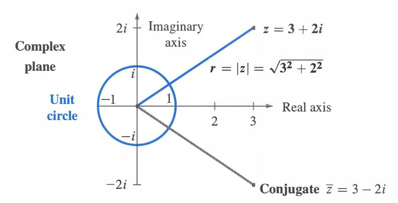
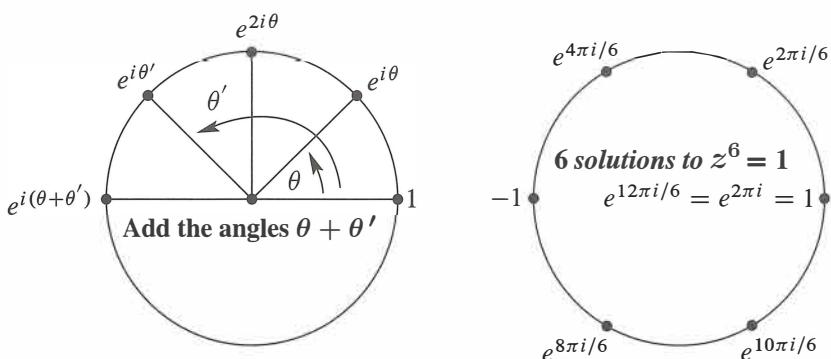
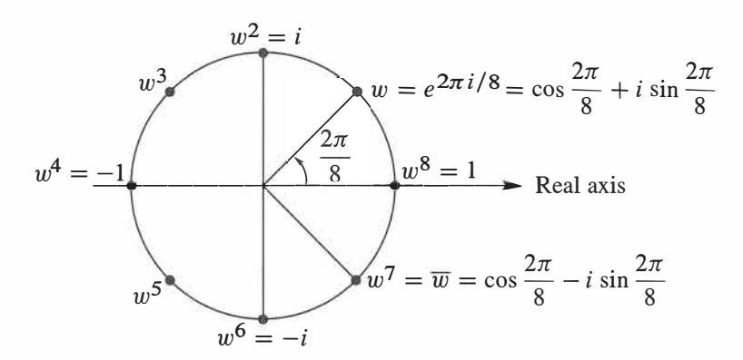
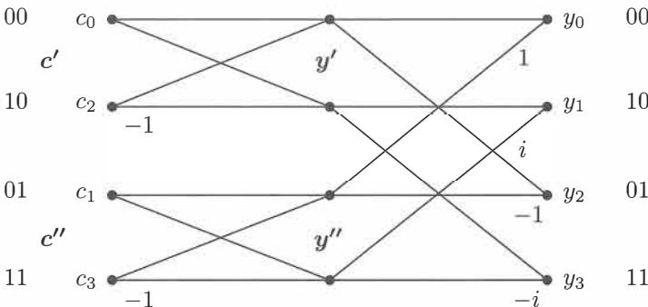

# **Chapter 9**

# **Complex Vectors and Matrices**

# **Real versus Complex** R =line of all real numbers -oo < *x* < oo +-+ C = plane of all complex numbers *z* =*x* + *iy*

Ix I = absolute value of *x* +-+ I *z* I = j x2+y

2=*r* =absolute value ( or modulus) of *z*

1 and -1 solve x

2=1 +-+ z = 1, w, ... , wn-l solve z

n=1 where w = e*2*1ri/n

1 z The **complex conjugate** of *Z*= *X*+ *iy* is *Z* = *X* - *iy.* lzl

2=x

2+y

2=*zz* and ;

=*w·* 

The **polar form** of *z* =*x* + *iy* is lzl

ei0 =*rei0* =*r*cos 0 + *ir* sin 0. The angle has tan0 = '}L\_

*X* 

R n : vectors with n real components length: llxll 2= *xr* + ... + *x;,*  transpose: (AT ) ij = A1i

dot product: *X*T

y= X1Y1 + · · · + XnYn

reason for A

T: (Ax) T

y= xT (AT

y)

orthogonality: x T

y= O

symmetric matrices: S = S

T

*S* =QAQ-**1**=QAQT

(real A)

skew-symmetric matrices: KT= -K orthogonal matrices: QT=Q-1 orthonormal columns: QT Q = *I* 

(Qx) T (Qy) = x

T

yand IIQxll = l

lxll

+-+ +-+ +-+ +-+ +-+ +-+ +-+ +-+ +-+ +-+ +-+ +-+ e n : vectors with n complex components

length: llzll 2= lz11

2+ · · · + lznl2

conjugate transpose: (AH ) ij = A1i

inner product: u

v = u1 V1 + · · · + Un Vn

reason for A

H: (Au) H v = uH (A

Hv)

orthogonality: uH v = 0

Hermitian matrices: S = S

H

S =U Au-1=U AUH(real A) skew-Hermitian matrices KH= -K

unitary matrices: U

H=u-l

orthonormal columns: u

u = *I* 

(Ux) H (U y) = xH

yand IIUzll = llzll

A complete presentation of linear algebra must include complex numbers *z* = *x* + *iy.* Even when the matrix is real, *the eigenvalues and eigenvectors are often complex.* Example: A 2 by 2 rotation matrix has complex eigenvectors x = (1, i) and x = (1, -i). I will summarize Sections 9.1 and 9.2 in these few unforgettable words: When you transpose a vector v or a matrix *A, take the conjugate of every entry* (i **changes to** -i). Section 9.3 is about the most important complex matrix of *all-the Fourier matrix F.*

# **9.1 Complex Numbers**

Start with the imaginary number i. Everybody knows that x 2= -1 has no real solution. When you square a real number, the answer is never negative. So the world has agreed on a solution called i. (Except that electrical engineers call it *j* .) Imaginary numbers follow the normal rules of addition and multiplication, with one difference. *Replace* i 2*by* -1.

This section gives the main facts about complex numbers. It is a review for some students and a reference for everyone. Everything comes from i 2= -1 and e21ri = 1.

*A complex number* (say 3 + 2i) *is a real number* (3) *plus an imaginary number* (2i). Addition keeps the real and imaginary parts separate. Multiplication uses i 2=-1:

| <b>Add:</b>      | $(3 + 2i) + (3 + 2i) = 6 + 4i$            |
|------------------|-------------------------------------------|
| <b>Multiply:</b> | $(3 + 2i)(1 - i) = 3 + 2i - 2i^2 = 5 - i$ |

If I add 3 + i to 1 - i, the answer is 4. The real numbers 3 + 1 stay separate from the imaginary numbers i - i. We are adding the vectors (3, 1) and (1, -1) to get (4, 0).

The number (1 + i)2is 1 + i times 1 + i. The rules give the surprising answer 2i:

$$(1 + i)(1 + i) = 1 + i + i + i^2 = 2i.$$

In the complex plane, 1 + i is at an angle of 45 ° . It is like the vector ( 1, 1). When we square 1 + i to get 2i, the angle doubles to go0 • If we square again, the answer is (2i)2=-4. The goo angle doubled to 180° , the direction of a negative real number.

A real number is just a complex number *z* = *a* + *bi,* with zero imaginary part: *b* = 0.

The *real part* is *a=* Re *(a+ bi).* The *imaginary part* is *b* = Im *(a+ bi).* 

### **The Complex Plane**

Complex numbers correspond to points in a plane. Real numbers go along the *x* axis. Pure imaginary numbers are on the y axis. *The complex number* 3 + 2i *is at the point with coordinates* (3, 2). The number zero, which is O + Oi, is at the origin.

Adding and subtracting complex numbers is like adding and subtracting vectors in the plane. The real component stays separate from the imaginary component. The vectors go head-to-tail as usual. The complex plane **C 1**is like the ordinary two-dimensional plane **R ,**  except that we multiply complex numbers and we didn't multiply vectors.

Now comes an important idea. *The complex conjugate of* 3 + 2i *is* 3 - 2i. The complex conjugate of *z*= 1 - i is z = 1 + i. In general the conjugate of *z*= *a* + *bi* is *z*= *a* - *bi.* **(Some writers use a** *"bar"* **on the number and others use a** *"star": z* = *z\** .) The imaginary parts of *z* and *"z* bar" have opposite signs. In the complex plane, z is the image of *z* on the other side of the real axis.

Figure 9 .1: The number *z* = *a* + *bi* corresponds to the point ( *a, b)* and the vector [ **b] .** 

Two useful facts. *When we multiply conjugates* z1 *and* z*2, we get the conjugate of* z1 z*2•*  And when we add z1 and z2 , we get the conjugate of z1+z2 :

$$\bar{z}_1 + \bar{z}_2 = (3 - 2i) + (1 + i) = 4 - i$$
. This is the conjugate of  $z_1 + z_2 = 4 + i$ .

$$\bar{\mathbf{z}}_1 \times \bar{\mathbf{z}}_2 = (3 - 2i) \times (1 + i) = \mathbf{5} + i\mathbf{1}$$
. This is the conjugate of  $z_1 \times z_2 = \mathbf{5} - i\mathbf{1}$ .

Adding and multiplying is exactly what linear algebra needs. By taking conjugates of *Ax* = *.\x,* when *A* is real, we have another eigenvalue "X and its eigenvector x:

| Eigenvalues | $\lambda$ | $and \bar{\lambda}$ | $If Ax = \lambda x$ | $and A$ is real then | $A\bar{x} = \bar{\lambda}\bar{x}$ | (1) |
|-------------|-----------|---------------------|---------------------|----------------------|-----------------------------------|-----|
|-------------|-----------|---------------------|---------------------|----------------------|-----------------------------------|-----|

Something special happens when *z* = 3 + 2i combines with its own complex conjugate z = 3 - 2i. The result from adding z + z or multiplying zz is always real:

| $z + \bar{z} = \text{real}$ | $(3 + 2i) + (3 - 2i) = 6$ (real)                             |
|-----------------------------|--------------------------------------------------------------|
| $z\bar{z} = \text{real}$    | $(3 + 2i) \times (3 - 2i) = 9 + 6i - 6i - 4i^2 = 13$ (real). |

The sum of *z* = *a* + *bi* and its conjugate z = *a* - *bi* is the real number 2a. The product of *z* times **z** is the real number a 2+b

| Multiply $z$ times $\overline{z}$ to get $ z ^2 = r^2$ | $(a + bi)(a - bi) = a^2 + b^2.$ | (2) |
|--------------------------------------------------------|---------------------------------|-----|
|--------------------------------------------------------|---------------------------------|-----|

The next step with complex numbers is 1/z. How to divide by *a+ ib?* The best idea is to multiply first by z/z = 1. That produces zz in the denominator, which is a 2+b :

| $\frac{1}{a+ib} = \frac{1}{a+ib} \frac{a-ib}{a-ib} = \frac{a-ib}{a^2+b^2}$ | $\frac{1}{3+2i} = \frac{1}{3+2i} \frac{3-2i}{3-2i} = \frac{3-2i}{13}$ |
|----------------------------------------------------------------------------|-----------------------------------------------------------------------|
|                                                                            |                                                                       |

In case a 2+b 2= 1, this says that *(a+ ib* )-1 is *a -ib. On the unit circle,* **1** / *z* **equals** z. Later we will say: 1/ei0 is *e-ie\_* Use distance rand angle *0* to multiply and divide.

# **The Polar Form** rei8

The square root of a 2+b 2is lzl. This is the *absolute value* (or *modulus)* of the number *z =a+ ib.* The square root lzl is also written *r,* because it is the distance from Oto *z. The real number r in the polar form gives the size of the complex number z:* 

| The absolute value of $z = a + ib$ | $ z  = \sqrt{a^2 + b^2}$ . | <b>This is called <math>r</math>.</b> |
|------------------------------------|----------------------------|---------------------------------------|
| The absolute value of $z = 3 + 2i$ | $ z  = \sqrt{3^2 + 2^2}$ . | This is $r = \sqrt{13}$ .             |

The other part of the polar form is the angle *0.* The angle for *z* = 5 is *0* = 0 (because this *z* is real and positive). The angle for *z* = 3i is 1r /2 radians. The angle for a negative *z* = -9 is 1r radians. *The angle doubles when the number is squared.* The polar form is excellent for multiplying complex numbers (not good for addition).

When the distance is rand the angle is *0,* trigonometry gives the other two sides of the triangle. The real part (along the bottom) is *a* = *r* cos *0.* The imaginary part (up or down) is b = r sin 0. Put those together, and the rectangular form becomes the polar form rei*0 .* 

| The number | $z = a + ib$ | $is \text{ also}$ | $z = r \cos \theta + ir \sin \theta$ | This is $re^{i\theta}$ |
|------------|--------------|-------------------|--------------------------------------|------------------------|
|            |              |                   |                                      |                        |

*Note:* cos *0* + i sin *0 has absolute value r* = 1 *because* cos2*0* + sin2*0* = 1. Thus cos *0* + i sin *0* lies on the circle of radius I *-the unit circle.*

**Example 1** Find r and 0 for z = 1 + i and also for the conjugate z = 1 - i.

**Solution** The absolute value is the same for z and z. It is r = Jf+T = vf2:

| $ x ^2 = 1^2 + 1^2 = 2$ | and also | $ \bar{z} ^2 = 1^2 + (-1)^2 = 2$ . |
|-------------------------|----------|------------------------------------|
|-------------------------|----------|------------------------------------|

The distance from the center is *r* J2. What about the angle *0?* The number 1 + i is at the point ( 1, 1) in the complex plane. The angle to that point is 1r / 4 radians or 45 °. The cosine is 1/V2 and the sine is 1/vf2. Combining rand 0 brings back *z*= 1 + i:

$$r \cos \theta + ir \sin \theta = \sqrt{2} \left( \frac{1}{\sqrt{2}} \right) + i\sqrt{2} \left( \frac{1}{\sqrt{2}} \right) = 1 + i.$$

The angle to the conjugate 1 - i can be positive or negative. We can go to 71r / 4 radians which is 315 ° . Or we can go *backwards through a negative angle,* to -1r / 4 radians or -45 ° . *If z is at angle 0, its conjugate z is at* 2n - *0 and also at -0.*

We can freely add 21r or 41r or -21r to any angle! Those go full circles so the final point is the same. This explains why there are infinitely many choices of *0.* Often we select the angle between 0 and 21r. But -0 is very useful for the conjugate z. And 1 = e *0*=e 21ri

#### **Powers and Products: Polar Form**

Computing (1 + i)2 and (1 + i)8 is quickest in polar form. That form has *r* = v'2 and 0 = 1r /4 (or 45 ° ). If we square the absolute value to get r 2= 2, and double the angle to get 20 = 1r /2 (or 90° ), we have (1 + i)2 . For the eighth power we need *r 8*and 80:

$$(1 + i)^8 = r^8 = 2 \cdot 2 \cdot 2 \cdot 2 = 16 \text{ and } 8\theta = 8 \cdot \frac{\pi}{4} = 2\pi.$$

This means: (1 + i)8 has absolute value 16 and angle 21r . *So* (l + i)8 = 16.

Powers are easy in polar form. So is multiplication of complex numbers.

| The <i>nth</i> power of | $z = r(\cos \theta + i \sin \theta)$ | $is$ | $z^n = r^n(\cos n\theta + i \sin n\theta)$ . | (3) |
|-------------------------|--------------------------------------|------|----------------------------------------------|-----|
|                         |                                      |      |                                              |     |

In that case *z* multiplies itself. To multiply *z* times *z', multiply r's and add angles:*

$$(\cos \theta + i \sin \theta)$$
 times  $r'(\cos \theta' + i \sin \theta') = rr'(\cos(\theta + \theta') + i \sin(\theta + \theta'))$ . (4)

One way to understand this is by trigonometry. Why do we get the double angle 20 for z ?

$$(\cos \theta + i \sin \theta) \times (\cos \theta + i \sin \theta) = \cos^2 \theta + i^2 \sin^2 \theta + 2i \sin \theta \cos \theta.$$

The real part cos2*0* - sin2*0* is cos 20. The imaginary part 2 sin *0* cos *0* is sin 20. Those are the "double angle" formulas. They show that 0 in *z* becomes 20 in z 2 .

There is a second way to understand the rule for *z n .* It uses the only amazing formula in this section. Remember that cos 0 + i sin 0 has absolute value 1. The cosine is made up of even powers, starting with 1 - ½02 • The sine is made up of odd powers, starting with *0* - ¼03 . The beautiful fact is that *e i0*combines both of those series into cos *0* + i sin *0:* 

| $e^x = 1 + x + \frac{1}{2}x^2 + \frac{1}{6}x^3 + \cdots$ | becomes | $e^{i\theta} = 1 + i\theta + \frac{1}{2}i^2\theta^2 + \frac{1}{6}i^3\theta^3 + \cdots$ |
|----------------------------------------------------------|---------|----------------------------------------------------------------------------------------|
|----------------------------------------------------------|---------|----------------------------------------------------------------------------------------|

Write -1 for i 2to see 1 - ½02 . *The complex number e i*8 *is* cos *0* + i sin *0:* 

| <i>Euler's Formula</i> | $e^{i\theta} = \cos \theta + i \sin \theta$ | gives | $z = r \cos \theta + ir \sin \theta = re^{i\theta}$ | $e^{i\theta}$ |
|------------------------|---------------------------------------------|-------|-----------------------------------------------------|---------------|
|                        |                                             |       |                                                     |               |

The special choice 0 = 21r gives cos 21r + i sin 21r which is l. Somehow the infinite series e 1ri = 1 + 21ri + ½(21ri)2 + · · · adds up to l.

Now multiply *e i0*times *e i0 '.* Angles add for the same reason that exponents add:

|  |  |   |  |  |
|---------------|---------------|----------------|---------------|---------------|
| $e^2$         | times         | $e^3$          | is            | $e^5$         |
|               |               |                |               |               |
|               | times         | $e^{i\theta}$  | times         | $e^{i\theta}$ |
|               | is            | $e^{2i\theta}$ |               |               |
|               |               |                |               |               |
|               |               |                |               |               |
|               |               |                |               |               |
|               |               |                |               |               |
|               |               |                |               |               |

The powers (rei*0* ) nare equal to r ne ine \_ They stay on the unit circle when r = 1 and r n=1. Then we find *n* different numbers whose *nth* powers equal 1:

Set 
$$w = e^{2\pi i/n}$$
. The  $n$ th powers of 1,  $w, w^2, \dots, w^{n-1}$  all equal 1.

Those are the *"nth* roots of l." They solve the equation *z n*=1. They are equally spaced around the unit circle in Figure 9.2b, where the full 2w is divided by *n.* Multiply their angles by *n* to take *nth* powers. That gives *w n*= e2 -rri which is 1. Also ( *w 2*r = e4 -rri = 1. Each of those numbers, to the *nth* power, comes around the unit circle to 1.

These *n* roots of 1 are the key numbers for signal processing. The Discrete Fourier Transform uses *w* = e *2*-rri/n and its powers. Section 9.3 shows how to decompose a vector (a signal) into *n* frequencies by the Fast Fourier Transform.

Figure 9.2: (a) e i*0*times e i*0'* is e i( e + '). (b) The *nth* power of e *2*-rri/n is e -rri = 1.

#### **• REVIEW OF THE KEY IDEAS •**

- **1.** Adding a+ ib to c + id is like adding ( a, b) + ( c, d). Use i 2= -1 to multiply.
- **2.** The conjugate of z = a+ bi = rei*0*is z = z\* = a bi = re-i*0 .*
- 3. z times z is rei*0*times re-i*0 .* This is r *2*= lzl2 = a*2*+ b *2*(real).
- **4.** Powers and products are easy in polar form z = rei*0 . Multiply* r's *and add* 0's.

# **Problem Set 9.1**

**Questions 1-8 are about operations on complex numbers.** 

- **1**Add and multiply each pair of complex numbers:
- (a) 2 + i, 2 i (b) -l+i,-l+i ( c) cos 0 + i sin 0, cos 0 -i sin 0 **2**Locate these points on the complex plane. Simplify them if necessary:
- (a) 2 + i (b) (2+i)2 (c) 1 2+i (d) 12+ ii **3**Find the absolute valuer = lzl of these four numbers. If 0 is the angle for 6 -8i, what are the angles for the other three numbers?
- (a) 6 -8i (b) (6 8i)2(c) 1 6-8i (d) (6 + 8i)2 4 If izl = 2 and lwl = 3 then iz x wl = \_\_ and lz + wl ::; \_\_ and iz/wl = \_\_ and lz -wl::; \_\_ . 5 Find a + *ib* for the numbers at angles 30° , 60° , 90° , 120° on the unit circle. If *w* is the number at 30° , check that w 2is at 60° . What power of w equals 1? **6**If *z* = *r* cos 0 + *ir* sin 0 then 1 / *z* has absolute value \_\_ and angle \_\_ . Its polar form is \_\_ . Multiply *z* x 1/ *z* to get 1. 7 The complex multiplication *M* = *(a+* bi)(c + di) is a 2 by 2 real multiplication

| (a) | $2 + i, 2 - i$ | (b) | $-1 + i, -1 + i$ | (c) | $\cos \theta + i \sin \theta, \cos \theta - i \sin \theta$ |
|-----|----------------|-----|------------------|-----|------------------------------------------------------------|
|     |                |     |                  |     |                                                            |

$$\begin{bmatrix} a & -b \\ b & a \end{bmatrix} \begin{bmatrix} c \\ d \end{bmatrix} = \begin{bmatrix} \\ \\ \end{bmatrix}.$$

The right side contains the real and imaginary parts of *M.* Test *M* = (1 +3i)(l-3i).

8 *A* = A1 + *iA2* is a complex n by n matrix and *b* = b**1** + *ib2* is a complex vector. The solution to *Ax* = bis x1 + ix2. Write *Ax* =bas a real system of size 2n:

| Complex $n$ by $n$ | $\begin{bmatrix} x_1 \\ x_2 \end{bmatrix} = \begin{bmatrix} b_1 \\ b_2 \end{bmatrix}$ |
|--------------------|---------------------------------------------------------------------------------------|
| Real $2n$ by $2n$  |                                                                                       |

**Questions 9-16 are about the conjugate** z = a - *ib* = re-i0 =z\*.

- **9**Write down the complex conjugate of each number by changing i to -i:
  - (a) 2 i (b) (2-i)(l-i) (c) ei1r/2 (which is i)
- (d) *e i1r* = -1 (e) i�! (which is alsoi) (f) i l 03= **10**The sum z + *z* is always \_\_ . The difference z - *z* is always \_\_ . Assume *z* -=J 0. The product *z* x *z* is always \_\_ . The ratio *z /z* has absolute value \_\_ .

| (a) | $2 - i$ | (b) | $(2 - i)(1 - i)$ | (c) | $e^{i\pi/2}$ (which is $i$ ) |
|-----|---------|-----|------------------|-----|------------------------------|
|     |         |     |                  |     |                              |

| (d) | $e^{i\pi} = -1$ | (e) | $\frac{1}{2i\pi}$ | (which is also $i$ ) | (f) | $i^{103} = \underline{\hspace{2cm}}$ |
|-----|-----------------|-----|-------------------|----------------------|-----|--------------------------------------|
|     |                 |     |                   |                      |     |                                      |

11 For a real matrix, the conjugate of Ax = AX is Ax = Xx. This proves two things: Xis another eigenvalue and xis its eigenvector. Find the eigenvalues A, X and eigenvectors x, x of A= [a b; -b a]. 12 The eigenvalues of a real 2 by 2 matrix come from the quadratic formula :

$$\det \begin{bmatrix} a-\lambda & b \\ c & d-\lambda \end{bmatrix} = \lambda^2 - (a+d)\lambda + (ad-bc) = 0$$

gives the two eigenvalues *A* = *[a+ d* ± *J (a+* d)2 - 4( *ad* - *be)]* /2.

(a) If a = *b* = *d* = 1, the eigenvalues are complex when e is \_\_ .

(b) What are the eigenvalues when *ad* = *be?*

13 In Problem 12 the eigenvalues are not real when (trace)2= *(a+ d) 2*is smaller than

. Show that the *A's are* real when *be>* 0.

14 A real skew-symmetric matrix ( AT= *-A)* has pure imaginary eigenvalues. First

proof: If Ax = AX then block multiplication gives

| $\begin{bmatrix} 0 & A \\ -A & 0 \end{bmatrix} \begin{bmatrix} x \\ ix \end{bmatrix} = i\lambda \begin{bmatrix} x \\ ix \end{bmatrix}$ |
|----------------------------------------------------------------------------------------------------------------------------------------|
|----------------------------------------------------------------------------------------------------------------------------------------|

This block matrix is symmetric. Its eigenvalues must be \_\_ ! So A is \_\_ .

Questions 15-22 are about the form rei*8* of the complex number r cos 0 + *ir* sin 0.

- 15 Write these numbers in Euler's form rei0 . Then square each number:
- (a) 1 + vf3i (b) cos *20* + i sin *20* (c) -7i (d) 5 5i. 16 (A favorite) Find the absolute value and the angle for *z* = sin *0* + i cos *0* (careful). Locate this z in the complex plane. Multiply z by cos *0* + i sin *0* to get \_\_ . 17 Draw all eight solutions of *z 8*= 1 in the complex plane. What is the rectangular form *a+ ib* of the root *z* = w = exp(-2ni/8)? 18 Locate the cube roots of l in the complex plane. Locate the cube roots of -1. Together these are the sixth roots of \_\_ . 19 By comparing e *3i0* = cos 30 + i sin 30 with ( ei8 3= ( cos 0 + i sin 0)3 , find the "triple angle" formulas for cos 30 and sin 30 in terms of cos 0 and sin 0. 20 Suppose the conjugate z is equal to the reciprocal 1/ *z.* What are all possible z's? 21 (a) Why do e iand i eboth have absolute value I?
  - (b) In the complex plane put stars near the points e iand i e.
- (c) The number i ecould be ( ei1r l2) eor ( e5i1r l2) e . Are those equal? 22 Draw the paths of these numbers from t = 0 to t = 27T in the complex plane:
  - (a) e i t

# **9.2 Hermitian and Unitary Matrices**

The main message of this section can be presented in one sentence: *When you transpose a complex vector* z *or matrix A, take the complex co njugate too.* Don't stop at z Tor AT. Reverse the signs of all imaginary parts. From a column vector with Zj = aj + ibj , the good row vector :z Tis the *conjugate transpose* with components aj - ibj :

| Conjugate transpose | $\bar{z}^T = [\bar{z}_1 \ \cdots \ \bar{z}_n] = [a_1 - ib_1 \ \cdots \ a_n - ib_n]$ | (1) |
|---------------------|-------------------------------------------------------------------------------------|-----|
|---------------------|-------------------------------------------------------------------------------------|-----|

Here is one reason to go to *z.* The length squared of a real vector is *xr* + · · · + *x;;,.* The length squared of a complex vector is *not zr* + · · · + *z;.* With that wrong definition, the length of (1, i) would be 1 2+ i 2= 0. A nonzero vector would have zero length-not good. Other vectors would have complex lengths. Instead of *(a+* bi)2 we want a 2+ b , the *absolute value squared.* This is ( a + bi) times ( a - bi).

For each component we want Zj times Zj , which is lzj1 2= a; + b;. That comes when the components of *z* multiply the components ofz:

Length squared 
$$[\bar{z}_1 \ \cdots \ \bar{z}_n] = |z_1|^2 + \cdots + |z_n|^2$$
. This is  $\bar{z}^T z = \|z\|^2$ . (2)

Now the squared length of (1, i) is 1 2+ lil2 = 2. The length is y12. The squared length of (1 + i, 1 - i) is 4. The only vectors with zero length are zero vectors.

The length 
$$\|z\|$$
 is the square root of  $z^T z = z^H z = |z_1|^2 + \cdots + |z_n|^2$ 

Before going further we replace two symbols by one symbol. Instead of a bar for the conjugate and T for the transpose, we just use a superscript H. Thus :z T= z H. This is *"z* Hermitian," the *conjugate transpose* of *z.* The new word is pronounced "Hermeeshan." The new symbol applies also to matrices: The conjugate transpose of a matrix A is AH.

Another popular notation is *A\*.* The MATLAB transpose command *I* automatically takes complex conjugates (z *I* is z H= :zT and A *I* is AH =A T ).

$$\mathbf{A}^H \text{ is "A Hermitian"} \quad \text{If} \quad \mathbf{A} = \begin{bmatrix} 1 & i \\ 0 & 1+i \end{bmatrix} \quad \text{then} \quad \mathbf{A}^H = \begin{bmatrix} 1 & 0 \\ -i & 1-i \end{bmatrix}.$$

## **Complex Inner Products**

For real vectors, the length squared is *x* T *x-the inner product of x with itself.* For complex vectors, the length squared is z Hz. It will be very desirable if z H z is the inner product of *z* with itself. To make that happen, the complex inner product should use the conjugate transpose (not just the transpose). This has no effect on real vectors.

**DEFINITION** The inner product of real or complex vectors u and v is u v:

$$\mathbf{u}^H \mathbf{v} = \begin{bmatrix} \bar{u}_1 & \cdots & \bar{u}_n \end{bmatrix} \begin{bmatrix} v_1 \\ \vdots \\ v_n \end{bmatrix} = \bar{u}_1 v_1 + \cdots + \bar{u}_n v_n. \quad (3)$$

With complex vectors, u Hv is different from v u. *The order of the vectors is now important.* In fact v Hu = v1 u1 + · · · + *VnUn* is the complex conjugate of u v. We have to put up with a few inconveniences for the greater good.

**Example 1** The inner product of 
$$\mathbf{u} = \begin{bmatrix} 1 \\ 1 \end{bmatrix}$$
 with  $\mathbf{v} = \begin{bmatrix} i \\ 1 \end{bmatrix}$  is  $\begin{bmatrix} 1 & -i \\ 1 & 1 \end{bmatrix} \begin{bmatrix} i \\ 1 \end{bmatrix} = 0$ .

Example 1 is surprising. Those vectors (1, i) and (i, 1) don't look perpendicular. But they are. *A zero inner product still means that the* (complex) *vectors are orthogonal.* Similarly the vector (1, i) is orthogonal to the vector (1, -i). Their inner product is 1 - 1. We are correctly getting zero for the inner product-where we would be incorrectly getting zero for the length of (1, i) if we forgot to take the conjugate.

**Note** We have chosen to conjugate the first vector *u.* Some authors choose the second vector *v.* Their complex inner product would be *u* Tv. I think it is a free choice.

*The inner product of* Au *with* v *equals the inner product of* u *with* A Hv:

| <b><math display="block">A^H</math> is also called the "adjoint" of <math>A</math></b> | $(Au)^H v = u^H (A^H v).$ | (4) |
|----------------------------------------------------------------------------------------|---------------------------|-----|
|----------------------------------------------------------------------------------------|---------------------------|-----|

The conjugate of Au is Au. Transposing Au gives u TA T as usual. This is u HAH. Everything that should work, does work. The rule for H comes from the rule for T. We constantly use the fact that ( *a* - *ib)* ( c - *id)* is the conjugate of ( *a* + *ib)* ( c + *id).*

*The conjugate transpose of AB is* 
$$(AB)^H = B^H A^H$$

#### **Hermitian Matrices** *S = S H*

Among real matrices, *symmetric matrices* form the most important special class: *S* = *S T .* They have real eigenvalues and the orthogonal eigenvectors in an orthogonal matrix *Q.* Every real symmetric matrix can be written as *S* = *QAQ-1*and also as *S* = *QAQT* (because Q-1 = *QT ).* All this follows from *S T* = *S,* when Sis real.

Among complex matrices, the special class contains the **Hermitian matrices**:  $S = S^H$ . The condition on the entries is  $s_{ij} = \overline{s_{ji}}$ . In this case we say that “ $S$  is Hermitian.” *Every real symmetric matrix is Hermitian*, because taking its conjugate has no effect. The next matrix is also Hermitian,  $S = S^H$ :

**Example 2**  $S = \begin{bmatrix} 2 & 3 - 3i \\ 3 + 3i & 5 \end{bmatrix}$  The main diagonal must be real since  $s_{ii} = \overline{s_{ii}}$ . Across it are conjugates  $3 + 3i$  and  $3 - 3i$ .

This example will illustrate the three crucial properties of all Hermitian matrices.

**If  $S = S^H$  and  $z$  is any real or complex column vector, the number  $z^H S z$  is real.**

Quick proof:  $z^H S z$  is certainly 1 by 1. Take its conjugate transpose:

$$(z^H S z)^H = z^H S^H (z^H)^H \quad \text{which is } z^H S z \text{ again.}$$

So the number  $z^H S z$  equals its conjugate and must be real. Here is that “energy”  $z^H S z$ :

$$\begin{bmatrix} \bar{z}_1 & \bar{z}_2 \end{bmatrix} \begin{bmatrix} 2 & 3 - 3i \\ 3 + 3i & 5 \end{bmatrix} \begin{bmatrix} z_1 \\ z_2 \end{bmatrix} = 2\bar{z}_1 z_1 + 5\bar{z}_2 z_2 + (3 - 3i)\bar{z}_1 z_2 + (3 + 3i)z_1 \bar{z}_2.$$
diagonal                                                      off-diagonal

The terms  $2|z_1|^2$  and  $5|z_2|^2$  from the diagonal are both real. The off-diagonal terms are conjugates of each other—so their sum is real. (The imaginary parts cancel when we add.) The whole expression  $z^H S z$  is real, and this will make  $\lambda$  real.

**Every eigenvalue of a Hermitian matrix is real.**

**Proof** Suppose  $Sz = \lambda z$ . Multiply both sides by  $z^H$  to get  $z^H S z = \lambda z^H z$ . On the left side,  $z^H S z$  is real. On the right side,  $z^H z$  is the length squared, real and positive. So the ratio  $\lambda = z^H S z / z^H z$  is a real number. Q.E.D.

The example above has eigenvalues  $\lambda = 8$  and  $\lambda = -1$ , real because  $S = S^H$ :

$$\begin{vmatrix} 2 - \lambda & 3 - 3i \\ 3 + 3i & 5 - \lambda \end{vmatrix} = \lambda^2 - 7\lambda + 10 - |3 + 3i|^2 \\ = \lambda^2 - 7\lambda + 10 - 18 = (\lambda - 8)(\lambda + 1).$$

**The eigenvectors of a Hermitian matrix are orthogonal** (when they correspond to different eigenvalues). If  $Sz = \lambda z$  and  $Sy = \beta y$  then  $y^H z = 0$ .

**Proof** Multiply  $Sz = \lambda z$  on the left by  $y^H$ . Multiply  $y^H S^H = \beta y^H$  on the right by  $z$ :

$$y^H S z = \lambda y^H z \quad \text{and} \quad y^H S^H z = \beta y^H z. \quad (5)$$

The left sides are equal so  $\lambda y^H z = \beta y^H z$ . Then  $y^H z$  must be zero.

The eigenvectors are orthogonal in our example with A = 8 and j3 = -1:

$$(S - 8I)\mathbf{z} = \begin{bmatrix} -6 & 3 - 3i \\ 3 + 3i & -3 \end{bmatrix} \begin{bmatrix} z_1 \\ z_2 \end{bmatrix} = \begin{bmatrix} 0 \\ 0 \end{bmatrix} \quad \text{and} \quad \mathbf{z} = \begin{bmatrix} 1 \\ 1 + i \end{bmatrix}$$

$$(S + I)\mathbf{y} = \begin{bmatrix} 3 & 3 - 3i \\ 3 + 3i & 6 \end{bmatrix} \begin{bmatrix} y_1 \\ y_2 \end{bmatrix} = \begin{bmatrix} 0 \\ 0 \end{bmatrix} \quad \text{and} \quad \mathbf{y} = \begin{bmatrix} 1 - i \\ -1 \end{bmatrix}.$$

| Orthogonal eigenvectors | $y^H z = [1 + i - 1] \begin{bmatrix} 1 \\ 1 + i \end{bmatrix} = 0.$ |
|-------------------------|---------------------------------------------------------------------|
|-------------------------|---------------------------------------------------------------------|

These eigenvectors have squared length 1 2+1 2+1 2= 3. After division by v3 they are unit vectors. They were orthogonal, now they are *orthonormal.* They go into the columns of the *eigenvector matrix X,* which diagonalizes *S.* 

When Sis real and symmetric, Xis Q-an orthogonal matrix. Now Sis complex and Hermitian. Its eigenvectors are complex and orthonormal. *The eigenvector matrix X is like* Q, *but complex:* QH Q =I.We assign *Q* a new name *"unitary"* but still call it *Q.*

# **Unitary Matrices**

A*unitary matrix Q* is a (complex) square matrix that has *orthonormal columns.*

| Unitary matrix that diagonalizes $S$ : | $Q = \frac{1}{\sqrt{3}} \begin{bmatrix} 1 & 1 - i \\ 1 + i & -1 \end{bmatrix}$ |
|----------------------------------------|--------------------------------------------------------------------------------|
|----------------------------------------|--------------------------------------------------------------------------------|

This *Q* is also a Hermitian matrix. I didn't expect that! The example is almost too perfect. We will see that the eigenvalues of this *Q* must be 1 and -1.

The matrix test for real orthonormal columns was Q T Q = *I.* The zero inner products appear off the diagonal. In the complex case, Q Tbecomes Q8. The columns show themselves as orthonormal when Q8 multiplies *Q.* The inner products fill up QH Q = *I:*

*Every matrix* Q *with orthonormal columns has* QHQ = *I.* 

*If Q is square,* it *is a unitary matrix. Then* QH = Q-**1.** 

Suppose *Q* (with orthonormal columns) multiplies any *z.* The vector length stays the same, because *z*8 *Q*8 *Qz* = *z*8*z.* If *z* is an eigenvector of *Q* we learn something more: *The eigenvalues of unitary (and orthogonal) matrices Q all have absolute value* i>-1 = 1.

If 
$$Q$$
 is unitary then  $\|Qz\| = \|z\|$ . Therefore  $Qz = \lambda z$  leads to  $|\lambda| = 1$ .

Our 2 by 2 example is both Hermitian *(Q* = Q8) and unitary (Q-1= Q8). That means real eigenvalues and it means i>-1 = 1. A real number with i>-1 = 1 has only two possibilities: *The eigenvalues are* 1 *or* -1. The trace of *Q* is zero so *A* = 1 and *A* = -1. **Example 3** The 3 by 3 *Fourier matrix* is in Figure 9.3. Is it Hermitian? Is it unitary? F3 is certainly symmetric. It equals its transpose. But it doesn't equal its conjugate transpose-it *is not Hermitian.* If you change i to -i, you get a different matrix.

$$\text{Fourier matrix} \quad F = \frac{1}{\sqrt{3}} \begin{bmatrix} 1 & 1 & 1 \\ 1 & e^{2\pi i/3} & e^{4\pi i/3} \\ 1 & e^{4\pi i/3} & e^{2\pi i/3} \end{bmatrix}.$$

Figure 9.3: The cube roots of 1 go into the Fourier matrix *F* =F3.

Is *F* unitary? *Yes.* The squared length of every column is ½(1 + 1 + 1) (unit vector). The first column is orthogonal to the second column because 1 + e21ri/3 + e41ri/3 = 0. This is the sum of the three numbers marked in Figure 9.3.

Notice the symmetry of the figure. If you rotate it by 120° , the three points are in the same position. Therefore their sum S also stays in the same position! The only possible sum in the same position after 120° rotation is S = 0.

Is column 2 of *F* orthogonal to column 3? Their dot product looks like

$$\frac{1}{3}(1 + e^{6\pi i/3} + e^{6\pi i/3}) = \frac{1}{3}(1 + 1 + 1).$$

This is not zero. The answer is wrong because we forgot to take complex conjugates. The complex inner product uses H not T:

$$(\text{column } 2)^H(\text{column } 3) = \frac{1}{3}(1 \cdot 1 + e^{-2\pi i/3}e^{4\pi i/3} + e^{-4\pi i/3}e^{2\pi i/3}) \\ = \frac{1}{3}(1 + e^{2\pi i/3} + e^{-2\pi i/3}) = 0.$$

So we do have orthogonality. *Conclusion: F is a unitary matrix.*

The next section will study the n by n Fourier matrices. Among all complex unitary matrices, these are the most important. When we multiply a vector by *F,* we are computing its *Discrete Fourier Transform.* When we multiply by p-1 , we are computing the *inverse transform.* The special property of unitary matrices is that p-l = p H \_ The inverse transform only differs by changing i to -i:

| Change $i$ to $-i$ | $F^{-1} = F^{\text{H}} = \frac{1}{\sqrt{3}} \begin{bmatrix} 1 & 1 & 1 \\ 1 & e^{-2\pi i/3} & e^{-4\pi i/3} \\ 1 & e^{-4\pi i/3} & e^{-2\pi i/3} \end{bmatrix}$ |
|--------------------|----------------------------------------------------------------------------------------------------------------------------------------------------------------|
|--------------------|----------------------------------------------------------------------------------------------------------------------------------------------------------------|

Everyone who works with *F* recognizes its value. The last section of this chapter will bring together Fourier analysis and complex numbers and linear algebra.

### **Problem Set 9.2**

**1**Find the lengths of u = (l + i, 1 - i, 1 + 2i) and v = (i, i, i). Find u H v and v H u. **2**Compute AH*A* and *AA* H. Those are both \_\_ matrices:

$$A = \begin{bmatrix} i & 1 & i \\ 1 & i & i \end{bmatrix}.$$

- 3 Solve *Az* =0 to find a vector *z* in the nullspace of *A* in Problem 2. Show that *z* is orthogonal to the columns of AH . Show that *z* is *not* orthogonal to the columns of AT. *The good row space is no longer* C(AT ). **Now it is C(AH ).**  4 Problem 3 indicates that the four fundamental subspaces are *C(A)* and *N(A)* and \_\_ and \_\_ . Their dimensions are still rand n - rand rand m - r. They are still orthogonal subspaces. *The symbol* H *takes the place of T.* 5 (a) Prove that AH A is always a Hermitian matrix.
- (b) If *Az* =0 then AH *Az* =0. If AH*Az* =0, multiply by z Hto prove that *Az* =0. The nulls paces of *A* and AH *A* are \_\_ . Therefore AH *A* is an invertible Hermitian matrix when the nullspace of A contains only *z*= 0. **6**True or false (give a reason if true or a counterexample if false):
  - (a) If *A* is a real matrix then *A+ if* is invertible.
- (b) If *S* is a Hermitian matrix then *S* + *if* is invertible. ( c) If *Q* is a unitary matrix then *Q* + *if* is invertible. 7 When you multiply a Hermitian matrix by a real number c, is *cS* still Hermitian? Show that *iS* is skew-Hermitian when Sis Hermitian. The 3 by 3 Hermitian matrices are a subspace provided the "scalars" are real numbers. 8 Which classes of matrices does *P* belong to: invertible, Hermitian, unitary?

$$P = \begin{bmatrix} 0 & i & 0 \\ 0 & 0 & i \\ i & 0 & 0 \end{bmatrix}.$$

Compute *P2 , P3 ,* and pioo . What are the eigenvalues of *P?* 

9 Find the unit eigenvectors of *P* in Problem 8, and put them into the columns of a unitary matrix *Q.* What property of *P* makes these eigenvectors orthogonal? **10**Write down the 3 by 3 circulant matrix *C* = 2f + *5P.* It has the same eigenvectors as Pin Problem 8. Find its eigenvalues. **11**If Q and U are unitary matrices, show that Q-1 is unitary and also QU is unitary. Start from QH Q = f and UHU = f.

12 How do you know that the determinant of every Hermitian matrix is real? 13 The matrix A HA is not only Hermitian but also positive definite, when the columns of A are independent. Proof: z HAHAz is positive if z is nonzero because \_\_ . 14 Diagonalize these Hermitian matrices to reach S = *Q* AQH :

| $S = \begin{bmatrix} 0 & 1-i \\ i+1 & 1 \end{bmatrix}$ | and | $S = \begin{bmatrix} 2 & 1+i \\ i-1 & 3 \end{bmatrix}$ |
|--------------------------------------------------------|-----|--------------------------------------------------------|
|                                                        |     |                                                        |

15 Diagonalize this skew-Hermitian matrix to reach K = QAQH \_ All ,,\'s are \_\_ :

$$K = \begin{bmatrix} 0 & -1+i \\ 1+i & i \end{bmatrix}.$$

16 Diagonalize this orthogonal matrix to reach U = QAQH. Now all Xs are \_\_ :

$$U = \begin{bmatrix} \cos \theta & -\sin \theta \\ \sin \theta & \cos \theta \end{bmatrix}.$$

17 Diagonalize this unitary matrix to reach *U* = *Q* AQH. Again all ,,\ 's are \_\_ :

$$U = \frac{1}{\sqrt{3}} \begin{bmatrix} 1 & 1-i \\ 1+i & -1 \end{bmatrix}.$$

18 If v 1, ... , Vn is an orthonormal basis for e n , the matrix with those columns is a \_\_ matrix. Show that any vector z equals ( *vr* z )v 1+ · · · + ( *v�* z )vn. 19 v = (l, i, 1), w = (i, 1, 0) and z = \_\_ are an orthogonal basis for \_\_ . 20 If S = A + iB is a Hermitian matrix, are its real and imaginary parts symmetric? 21 The ( complex) dimension of e nis \_\_ . Find a non-real basis for e n . 22 Describe all 1 by 1 and 2 by 2 Hermitian matrices and unitary matrices. 23 How are the eigenvalues of A Hrelated to the eigenvalues of the square matrix A? 24 If u Hu = 1 show that I - 2uuHis Hermitian and also unitary. The rank-one matrix uuHis the projection onto what line in en ? 25 If *A* + iB is a unitary matrix *(A* and B are real) show that *Q* = [ � -! ] is an orthogonal matrix. 26 If A+ iB is Hermitian (A and Bare real) show that [ � -! ] is symmetric. 27 Prove that the inverse of a Hermitian matrix is also Hermitian (transpose s- 1*S* = *I).*  28 A matrix with orthonormal eigenvectors has the form N = QAQ- 1= QAQH. *Prove that NNH*= *NHN.* These *N* are exactly the normal matrices. Examples are Hermitian, skew-Hermitian, and unitary matrices. Construct a 2 by 2 normal matrix from QAQH by choosing complex eigenvalues in A.

# **9.3 The Fast Fourier Transform**

Many applications of linear algebra take time to develop. It is not easy to explain them in an hour. The teacher and the author must choose between completing the theory and adding new applications. Often the theory wins, but this section is an exception. It explains the most valuable numerical algorithm in the last century.

*We want to multiply quickly by* F *and* p-1, *the Fourier matrix and its inverse.* This is achieved by the Fast Fourier Transform. An ordinary product *F* c uses n 2 multiplications *(F* has n2 entries). The FFT needs only n times ½ log2 n. We will see how.

The FFT has revolutionized signal processing. Whole industries are speeded up by this one idea. Electrical engineers are the first to know the difference-they take your Fourier transform as they meet you (if you are a function). Fourier's idea is to represent *f* as a sum of harmonics *Ck e ikx .* The function is seen *infrequency space* through the coefficients *Ck ,* instead of *physical space* through its values *f(x).* The passage backward and forward between e's and *f's* is by the Fourier transform. Fast passage is by the FFT.

### **Roots of Unity and the Fourier Matrix**

Quadratic equations have two roots (or one repeated root). Equations of degree n haven roots (counting repetitions). This is the Fundamental Theorem of Algebra, and to make it true we must allow complex roots. This section is about the very special equation z n= l. The solutions z are the "nth roots of unity." They are n evenly spaced points around the unit circle in the complex plane.

Figure 9 .4 shows the eight solutions to *z 8*= l. Their spacing is ½ ( 360° ) = 45 ° . The first root is at 45 ° or *0* =21r/8 radians. *It is the complex number* w = *e i0* =*e i2,r/B\_*  We call this number *w8* to emphasize that it is an 8th root. You could write it in terms of cos 2; and sin 2;, but don't do it. The seven other 8th roots are w , *w3 , .* .. , *w8 ,* going around the circle. Powers of *w* are best in polar form, because we work only with the angles 2;, 4;, ... , l � 1r = 21r. Those 8 angles in degrees are 45° , 90° , 135 ° , ... , 360° .

Figure 9.4: The eight solutions to *z 8*= 1 are 1, *w,* w , ... , *w7*with *w* = (l + i)/ ./2.

The fourth roots of 1 are also in the figure. They are i, -1, -i, 1. The angle is now 21r / 4 or 90° . The first root *w4* = e21ri/4 is nothing but i. Even the square roots of 1 are seen, with *w2* = ei2rr 1 *2*= -1. Do not despise those square roots 1 and -1. The idea behind the FFT is to go from an **8 by 8** Fourier matrix (containing powers of ws) to the **4 by 4** matrix below (with powers of w*4* = i). The same idea goes from 4 to 2. By exploiting the connections of F*8* down to F*4* and up to F15 (and beyond), the FFT makes multiplication by F1024 very quick.

We describe the *Fourier matrix,* first for *n* = 4. Its rows contain powers of 1 and *w* and *w 2*and *w .* These are the fourth roots of 1, and their powers come in a special order.

|          |                                                                                                                                                                                                                                                                  |  |  |  |  |
|-----------------------|-------------------------------------------------------------------------------------------------------------------------------------------------------------------------------------------------------------------------------------------------------------------------------|---------------|---------------|---------------|---------------|
| <b>Fourier matrix</b> | $F = \begin{bmatrix} 1 & 1 & 1 & 1 \\ 1 & w & w^2 & w^3 \\ 1 & w^2 & w^4 & w^5 \\ 1 & w^3 & w^6 & w^9 \end{bmatrix} = \begin{bmatrix} 1 & 1 & 1 & 1 \\ 1 & i & i^2 & i^3 \\ 1 & i^2 & i^4 & i^5 \\ 1 & i & i^3 & i^6 \\ 1 & 1 & i^4 & i^5 \\ 1 & 1 & i^5 & i^6 \end{bmatrix}$ |               |               |               |               |

The matrix is symmetric (F = FT). It is *not* Hermitian. Its main diagonal is not real. But ½Fis a *unitary matrix,* which means that (½pH) ( ½ *F)* = *I:*

| The columns of $F$ give | $H^H F = 4I$ . | Its inverse is $\frac{1}{4} F^H$ which is | $F^{-1} = \frac{1}{4} \overline{F}$ . |
|-------------------------|----------------|-------------------------------------------|---------------------------------------|
|-------------------------|----------------|-------------------------------------------|---------------------------------------|

The inverse changes from *w* = i *tow=* -i. That takes us from *F* to *F.* When the Fast Fourier Transform gives a quick way to multiply by *F,* it does the same for *P* and p-1 .

Every column has length *fo,.* So the unitary matrices are *Q* = F / ,/n and Q-1 = *F* / *fo,.* We avoid ,/n and just use *F* and p-l = p / n. The main point is to multiply *p* times co, c1, c2, c3:

| 4-point | $\begin{bmatrix} y_0 \\ y_1 \\ y_2 \\ y_3 \end{bmatrix}$ | $= F\mathbf{c} = \begin{bmatrix} 1 & 1 & 1 \\ 1 & w & w^3 \\ 1 & w^2 & w^4 \\ 1 & w^3 & w^6 \end{bmatrix}$ | $\begin{bmatrix} c_0 \\ c_1 \\ c_2 \\ c_3 \end{bmatrix}$ | (1) |
|---------|----------------------------------------------------------|------------------------------------------------------------------------------------------------------------|----------------------------------------------------------|-----|
|---------|----------------------------------------------------------|------------------------------------------------------------------------------------------------------------|----------------------------------------------------------|-----|

The input is four complex coefficients c0, c1, c2, c3. The output is four function values Yo, Yi, Y2, y3. The first output Yo = co + c1 + c2 + c3 is the value of the Fourier series *L ck e ikx* at *x* = 0. *The second output is the value of that series L Ck e ikx at x* = 21r /4:

$$y_1 = c_0 + c_1 e^{i2\pi/4} + c_2 e^{i4\pi/4} + c_3 e^{i6\pi/4} = c_0 + c_1 w + c_2 w^2 + c_3 w^3.$$

The third and fourth outputs *y2* and *y3* are the values of I:; *ck e ikx* at x = 41r / 4 and *x* = *61r* / 4. These are *finite* Fourier series! *They contain n* = 4 *terms and they are evaluated at n* = 4 *points.* Those points *x* = 0, 21r / 4, 41r / 4, *61r* / 4 are equally spaced.

The next point would be x = *81r* / 4 which is 21r. Then the series is back to Yo, because e 2rr i is the same as *e 0*= 1. Everything cycles around with period 4. In this world 2 + 2 is 0 because ( w2 ) ( w2 ) = w0 = 1. We follow the convention that j *and k go from* O *to n* - l (instead of 1 *ton).* The "zeroth row" and "zeroth column" of *F* contain all ones.

The *n* by *n* Fourier matrix contains powers of *w* = e 21ri/n :

$$F_n \mathbf{c} = \begin{bmatrix} 1 & 1 & 1 & 1 \\ 1 & w & w^2 & w^{n-1} \\ 1 & w^2 & w^4 & w^{2(n-1)} \\ \vdots & \vdots & \vdots & \vdots \\ 1 & w^{n-1} & w^{2(n-1)} & w^{(n-1)^2} \end{bmatrix} \begin{bmatrix} c_0 \\ c_1 \\ c_2 \\ \vdots \end{bmatrix} = \begin{bmatrix} y_0 \\ y_1 \\ y_2 \\ \vdots \end{bmatrix} = \mathbf{y}. \quad (2)$$

*Fn* is symmetric but not Hermitian. *Its columns are orthogonal,* and *FnF n*=*nl. Then*  F,;;1*is F n/n.* The inverse contains powers of *Wn* = e-21ri/n\_ Look at the pattern in *F:*

#### *The entry in* row *j,* column *k is* wJk \_ *Row zero and column zero contain* w 0= l.

When we multiply c by *Fn ,* we sum the series at *n* points. *When we multiply y by* F,;;1 , *we find the coefficients cfrom the function values y.* In MATLAB that command is c = fft(y). The matrix *F* passes from "frequency space" to "physical space."

*Important note.* Many authors prefer to work with *w* = e-21ri/N, which is the *complex conjugate* of our *w.* (They often use the Greek omega, and I will do that to keep the two options separate.) With this choice, their DFT matrix contains powers of *w* not *w.* It is F, the conjugate of our *F. F* goes from physical space to frequency space.

Fis a completely reasonable choice! MATLAB uses w = e-21ri/N. The DFT matrix fft(eye(N)) contains powers of this number w = w. **The Fourier matrix** *F* **with** *w's*  **reconstructs** *y* **from** c. **The matrix** *F* **with** *w's* **computes Fourier coefficients as** fft(y). *Also important.* When a function *f(x)* has period 21r, and we change *x* to e i*0 ,*  the function is defined around the unit circle (where *z* = ei0). The Discrete Fourier Transform is the same as interpolation. Find the polynomial *p(z)* = c0 + c1 z + · · · + *Cn-1Z n-l* that matches *n* values *Jo, ... , fn-1:*

| Interpolation | Find $c_0, \dots, c_{n-1}$ so that $p(z) = f$ at $n$ points $z = 1, \dots, w^{n-1}$ |
|---------------|-------------------------------------------------------------------------------------|
|               |                                                                                     |

The Fourier matrix is the Vandermonde matrix for interpolation at those *n* special points.

# **One Step of the Fast Fourier Transform**

We want to multiply *F* times c as quickly as possible. Normally a matrix times a vector takes n 2separate multiplications-the matrix has n 2 entries. You might think it is impossible to do better. (If the matrix has zero entries then multiplications can be skipped. But the Fourier matrix has no zeros!) By using the special pattern wjk for its entries, *F* can be factored in a way that produces many zeros. This is the **FFT.** 

*The key idea is to connect Fn with the half-size Fourier matrix Fn;2.* Assume that *n* is a power of 2 (say *n* = 210= 1024). We will connect F1024 to *two copies of* F512-

When  $n = 4$ , the key is in the relation between  $F_4$  and two copies of  $F_2$ :

$$F_4 = \begin{bmatrix} 1 & 1 & 1 & 1 \\ 1 & i & i^2 & i^3 \\ 1 & i^2 & i^4 & i^6 \\ 1 & i^3 & i^6 & i^9 \end{bmatrix} \quad \text{and} \quad \begin{bmatrix} F_2 & & & \\ & F_2 & & \\ & & & F_2 \end{bmatrix} = \begin{bmatrix} 1 & 1 & & \\ 1 & i^2 & & \\ & & 1 & 1 \\ & & 1 & i^2 \end{bmatrix}.$$

On the left is  $F_4$ , with no zeros. On the right is a matrix that is half zero. The work is cut in half. But wait, those matrices are not the same. We need two sparse and simple matrices to complete the FFT factorization:

$$\text{Factors for FFT} \quad F_4 = \begin{bmatrix} 1 & & 1 & \\ & 1 & & i \\ 1 & & -1 & \\ & & 1 & -i \end{bmatrix} \begin{bmatrix} 1 & 1 & & \\ 1 & i^2 & & \\ & 1 & 1 & \\ 1 & i^2 & & \end{bmatrix} \begin{bmatrix} 1 & & & \\ & 1 & & \\ & 1 & & \\ 1 & & 1 & \end{bmatrix}. \quad (3)$$

The last matrix is a permutation. It puts the even  $c$ 's ( $c_0$  and  $c_2$ ) ahead of the odd  $c$ 's ( $c_1$  and  $c_3$ ). The middle matrix performs half-size transforms  $F_2$  and  $F_2$  on the even  $c$ 's and odd  $c$ 's. The matrix at the left combines the two half-size outputs—in a way that produces the correct full-size output  $y = F_4 c$ .

The same idea applies when  $n = 1024$  and  $m = \frac{1}{2}n = 512$ . The number  $w$  is  $e^{2\pi i/1024}$ . It is at the angle  $\theta = 2\pi/1024$  on the unit circle. The Fourier matrix  $F_{1024}$  is full of powers of  $w$ . The first stage of the FFT is the great factorization discovered by Cooley and Tukey (and foreshadowed in 1805 by Gauss):

$$F_{1024} = \begin{bmatrix} I_{512} & D_{512} \\ I_{512} & -D_{512} \end{bmatrix} \begin{bmatrix} F_{512} & \\ & F_{512} \end{bmatrix} \begin{bmatrix} \text{even-odd} \\ \text{permutation} \end{bmatrix}. \quad (4)$$

 $I_{512}$  is the identity matrix.  $D_{512}$  is the diagonal matrix with entries  $(1, w, \dots, w^{511})$ . The two copies of  $F_{512}$  are what we expected. Don't forget that they use the 512th root of unity (which is nothing but  $w^2!!$ ). The permutation matrix separates the incoming vector  $c$  into its even and odd parts  $c' = (c_0, c_2, \dots, c_{1022})$  and  $c'' = (c_1, c_3, \dots, c_{1023})$ .

Here are the algebra formulas which say the same thing as that factorization of  $F_{1024}$ :

**(One step of the FFT)** Set  $m = \frac{1}{2}n$ . The first  $m$  and last  $m$  components of  $y = F_n c$  combine the half-size transforms  $y' = F_m c'$  and  $y'' = F_m c''$ . Equation (4) shows this step from  $n$  to  $m = n/2$  as  $Iy' + Dy''$  and  $Iy' - Dy''$ :

$$\begin{aligned} y_j &= y'_j + (w_n)^j y''_j, \quad j = 0, \dots, m-1 \\ y_{j+m} &= y'_j - (w_n)^j y''_j, \quad j = 0, \dots, m-1. \end{aligned} \quad (5)$$

Split  $c$  into  $c'$  and  $c''$ , transform them by  $F_m$  into  $y'$  and  $y''$ , then (5) reconstructs  $y$ .

Those formulas come from separating  $c_0 \dots, c_{n-1}$  into even  $c_{2k}$  and odd  $c_{2k+1}$ :  $w$  is  $w_n$ .

$$y = Fc \quad y_j = \sum_0^{n-1} w^{jk} c_k = \sum_0^{m-1} w^{2jk} c_{2k} + \sum_0^{m-1} w^{j(2k+1)} c_{2k+1} \text{ with } m = \frac{1}{2}n. \quad (6)$$

The even  $c$ 's go into  $c' = (c_0, c_2, \dots)$  and the odd  $c$ 's go into  $c'' = (c_1, c_3, \dots)$ . Then come the transforms  $F_m c'$  and  $F_m c''$ . **The key is  $w_n^2 = w_m$ .** This gives  $w_n^{2jk} = w_m^{jk}$ .

**Rewrite (6)**  $y_j = \sum (w_m)^{jk} c'_k + (w_n)^j \sum (w_m)^{jk} c''_k = y'_j + (w_n)^j y''_j$ . (7)

For  $j \geq m$ , the minus sign in (5) comes from factoring out  $(w_n)^m = -1$  from  $(w_n)^j$ .

MATLAB easily separates even  $c$ 's from odd  $c$ 's and multiplies by  $w_n^j$ . We use  $\text{conj}(F)$  or equivalently MATLAB's inverse transform ifft, because ifft is based on  $\omega = \bar{\omega} = e^{-2\pi i/n}$ . Problem 16 shows that  $F$  and  $\text{conj}(F)$  are linked by permuting rows.

| <b>FFT step</b>                                | $y' = \text{ifft}(c(0 : 2 : n - 2)) * n/2;$                                         |
|------------------------------------------------|-------------------------------------------------------------------------------------|
| <b>from <math>n</math> to <math>n/2</math></b> | $y'' = \text{ifft}(c(1 : 2 : n - 1)) * n/2;$                                        |
| <b>in MATLAB</b>                               | $d = w.^{\wedge}(0 : n/2 - 1)';$ $y = [y' + d \cdot * y''; y' - d \cdot * y''];$ |

The flow graph shows  $c'$  and  $c''$  going through the half-size  $F_2$ . Those steps are called “butterflies,” from their shape. Then the outputs  $y'$  and  $y''$  are combined (multiplying  $y''$  by 1,  $i$  from  $D$  and also by  $-1, -i$  from  $-D$ ) to produce  $y = F_4 c$ .

This reduction from  $F_n$  to two  $F_m$ 's almost cuts the work in half—you see the zeros in the matrix factorization. That reduction is good but not great. The full idea of the **FFT** is much more powerful. It saves much more than half the time.

**The Full FFT by Recursion**

If you have read this far, you probably guessed what comes next. We reduced  $F_n$  to  $F_{n/2}$ . **Keep going to  $F_{n/4}$ .** Every  $F_{512}$  leads to  $F_{256}$ . Then 256 leads to 128. **That is recursion.**

Recursion is a basic principle of many fast algorithms. Here is step 2 with four copies of  $F_{256}$  and  $D$  (256 powers of  $\omega_{512}$ ). Evens of evens  $c_0, c_4, c_8, \dots$  come first:

$$\begin{bmatrix} F_{512} \\ F_{512} \end{bmatrix} = \begin{bmatrix} I & D & & \\ I & -D & & \\ & I & D & \\ & I & -D & \end{bmatrix} \begin{bmatrix} F & & \\ & F & \\ & & F \end{bmatrix} \begin{bmatrix} \text{pick} & 0, 4, 8, \dots \\ \text{pick} & 2, 6, 10, \dots \\ \text{pick} & 1, 5, 9, \dots \\ \text{pick} & 3, 7, 11, \dots \end{bmatrix}.$$

We will count the individual multiplications, to see how much is saved. Before the FFT was invented, the count was the usual n 2= (1024)2 . This is about a million multiplications. I am not saying that they take a long time. The cost becomes large when we have many, many transforms to do-which is typical. Then the saving by the FFT is also large:

*The final count for size n* = *2*

*£ is reduced from n* 2 *to ½ n.e.* 

The number 1024 is 2 , so£ = 10. The original count of (1024)2 is reduced to (5)(1024). The saving is a factor of 200. A million is reduced to five thousand. That is why the FFT has revolutionized signal processing.

Here is the reasoning behind ½n£. There are £ levels, going from *n* = *2 e*down to *n* = l. Each level has *n/2* multiplications from the diagonal *D's,* to reassemble the halfsize outputs from the lower level. This yields the final count ½n£, which is ½n log2 n.

One last note about this remarkable algorithm. There is an amazing rule for the order that the e's enter the FFT, after all the even-odd permutations. Write the numbers Oto *n* - 1 in binary (like 00, 01, 10, 11 for n = 4). Reverse the order of those digits: 00, 10, 01, 11. That gives the **bit-reversed order O, 2, 1, 3** with evens before odds (See Problem 17.) The complete picture shows the e's in bit-reversed order, the £ = log2 *n* steps of the recursion, and the final output Yo, ... , Ynl which is Fn times c.

The chapter ends with that very fundamental idea, a matrix multiplying a vector.

### **Problem Set 9.3**

**1**Multiply the three matrices in equation (3) and compare with *F.* In which six entries do you need to know that i 2= -1? **2**Invert the three factors in equation (3) to find a fast factorization of p-1 . **3**Fis symmetric. So transpose equation (3) to find a new Fast Fourier Transform! 4 All entries in the factorization of *F6* involve powers of w*6* = sixth root of 1:

$$F_6 = \begin{bmatrix} I & D \\ I & -D \end{bmatrix} \begin{bmatrix} F_3 & \\ & F_3 \end{bmatrix} \begin{bmatrix} P \end{bmatrix}.$$

Write down these matrices with 1, w6, w� in *D* and w3 = w� in F3. Multiply!

5 If v = (l, 0, 0, 0) and w = (l, 1, 1, 1), show that Fv =wand Fw = 4v. Therefore p-*1w* = *v* and p-*1v* = **6**What is F2 and what is F4 for the 4 by 4 Fourier matrix? 7 Put the vector c = (1, 0, 1, 0) through the three steps of the FFT to find *y =Fe.Do*  the same for c = (0, 1, 0, 1). 8 Compute *y* = *F8* c by the three FFT steps for c = (1, 0, 1, 0, 1, 0, 1, 0). Repeat the computation for c = (0, 1, 0, 1, 0, 1, 0, 1).

9 If  $w = e^{2\pi i/64}$  then  $w^2$  and  $\sqrt{w}$  are among the \_\_\_\_\_ and \_\_\_\_\_ roots of 1.

10 (a) Draw all the sixth roots of 1 on the unit circle. Prove they add to zero.  
 (b) What are the three cube roots of 1? Do they also add to zero?

11 The columns of the Fourier matrix  $F$  are the *eigenvectors* of the cyclic permutation  $P$  (see Section 8.3). Multiply  $PF$  to find the eigenvalues  $\lambda_1, \lambda_2, \lambda_3, \lambda_4$ :

$$\begin{bmatrix} 0 & 1 & 0 & 0 \\ 0 & 0 & 1 & 0 \\ 0 & 0 & 0 & 1 \\ 1 & 0 & 0 & 0 \end{bmatrix} \begin{bmatrix} 1 & 1 & 1 & 1 \\ 1 & i & i^2 & i^3 \\ 1 & i^2 & i^4 & i^6 \\ 1 & i^3 & i^6 & i^9 \end{bmatrix} = \begin{bmatrix} 1 & 1 & 1 & 1 \\ 1 & i & i^2 & i^3 \\ 1 & i^2 & i^4 & i^6 \\ 1 & i^3 & i^6 & i^9 \end{bmatrix} \begin{bmatrix} \lambda_1 & & & \\ & \lambda_2 & & \\ & & \lambda_3 & \\ & & & \lambda_4 \end{bmatrix}.$$

This is  $PF = F\Lambda$  or  $P = F\Lambda F^{-1}$ . The eigenvector matrix (usually  $X$ ) is  $F$ .

12 The equation  $\det(P - \lambda I) = 0$  is  $\lambda^4 = 1$ . This shows again that the eigenvalues are  $\lambda = \underline{\hspace{1cm}}$ . Which permutation  $P$  has eigenvalues = cube roots of 1?

13 (a) Two eigenvectors of  $C$  are  $(1, 1, 1, 1)$  and  $(1, i, i^2, i^3)$ . Find the eigenvalues  $e$ .

$$\begin{bmatrix} c_0 & c_1 & c_2 & c_3 \\ c_3 & c_0 & c_1 & c_2 \\ c_2 & c_3 & c_0 & c_1 \\ c_1 & c_2 & c_3 & c_0 \end{bmatrix} \begin{bmatrix} 1 \\ 1 \\ 1 \\ 1 \end{bmatrix} = e_1 \begin{bmatrix} 1 \\ 1 \\ 1 \\ 1 \end{bmatrix} \quad \text{and} \quad C \begin{bmatrix} 1 \\ i \\ i^2 \\ i^3 \end{bmatrix} = e_2 \begin{bmatrix} 1 \\ i \\ i^2 \\ i^3 \end{bmatrix}.$$

(b)  $P = F\Lambda F^{-1}$  immediately gives  $P^2 = F\Lambda^2 F^{-1}$  and  $P^3 = F\Lambda^3 F^{-1}$ . Then  $C = c_0 I + c_1 P + c_2 P^2 + c_3 P^3 = F(c_0 I + c_1 \Lambda + c_2 \Lambda^2 + c_3 \Lambda^3) F^{-1} = \mathbf{F} \mathbf{E} \mathbf{F}^{-1}$ . That matrix  $E$  in parentheses is diagonal. It contains the \_\_\_\_\_ of  $C$ .

14 Find the eigenvalues of the “periodic”  $-1, 2, -1$  matrix from  $E = 2I - \Lambda - \Lambda^3$ , with the eigenvalues of  $P$  in  $\Lambda$ . The  $-1$ ’s in the corners make this matrix periodic:

$$C = \begin{bmatrix} 2 & -1 & 0 & -1 \\ -1 & 2 & -1 & 0 \\ 0 & -1 & 2 & -1 \\ -1 & 0 & -1 & 2 \end{bmatrix} \quad \text{has } c_0 = 2, c_1 = -1, c_2 = 0, c_3 = -1.$$

15 **Fast convolution = Fast multiplication by  $C$ :** To multiply  $C$  times a vector  $\mathbf{x}$ , we can multiply  $F(E(F^{-1}\mathbf{x}))$  instead. The direct way uses  $n^2$  separate multiplications. Knowing  $E$  and  $F$ , the second way uses only  $n \log_2 n + n$  multiplications. How many of those come from  $E$ , how many from  $F$ , and how many from  $F^{-1}$ ?

16 **Notice.** Why is row  $i$  of  $\overline{F}$  the same as row  $N - i$  of  $F$  (numbered 0 to  $N - 1$ )?

17 What is the *bit-reversed order* of the numbers  $0, 1, \dots, 7$ ? Write them all in binary (base 2) as 000, 001, ..., 111 and reverse each order. The 8 numbers are now \_\_\_\_\_.

