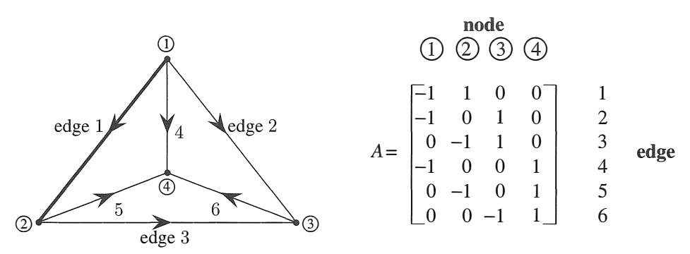
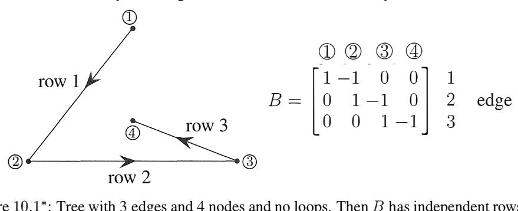
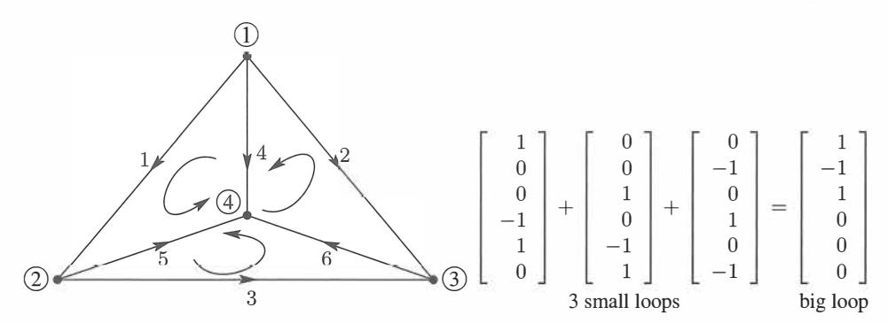
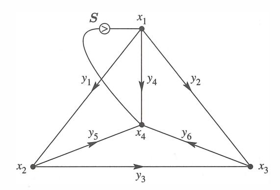
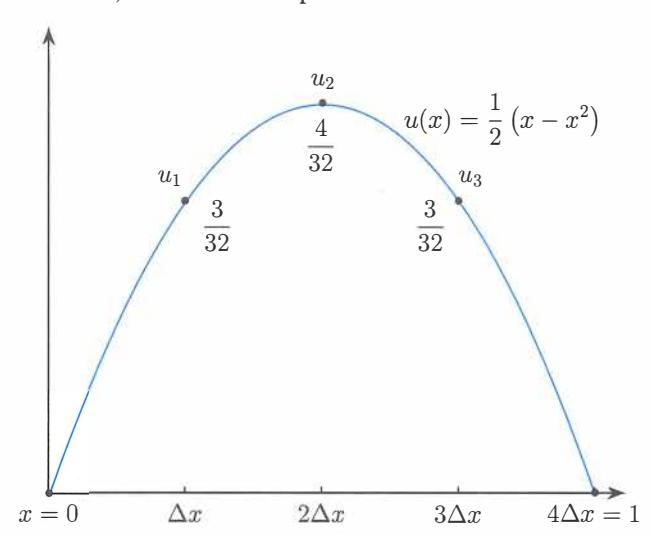
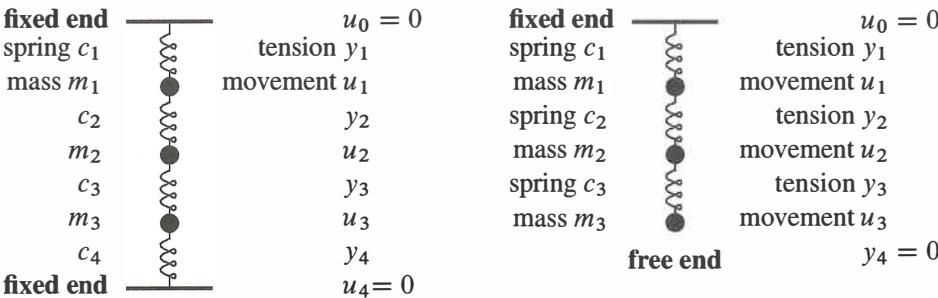
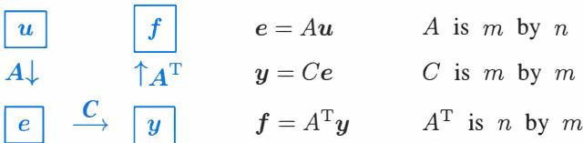
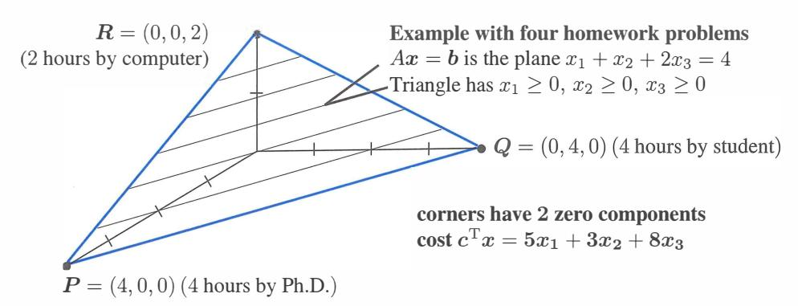

# **Chapter 10**

# **Applications**

# **10.1 Graphs and Networks**

Over the years I have seen one model so often, and I found it so basic and useful, that I always put it first. The model consists of *nodes connected by edges.* This is called a *graph.* 

Graphs of the usual kind display functions *f* ( *x).* Graphs of this node-edge kind lead to matrices. This section is about the *incidence matrix* of a graph-which tells how the n nodes are connected by them edges. Normally *m* > *n,* there are more edges than nodes.

For any m by *n* matrix there are two fundamental subspaces in R nand two in R m. They are the row spaces and nullspaces of *A* and *A T .* Their *dimensions r, n* - *r* and *r,* m - *r*  come from the most important theorem in linear algebra. The second part of that theorem is the *orthogonality* of the row space and nullspace. Our goal is to show how examples from graphs illuminate this Fundamental Theorem of Linear Algebra.

When I construct a *graph* and its *incidence matrix,* the subspace dimensions will be easy to discover. But we want the subspaces themselves-and orthogonality helps. It is essential to connect the subspaces to the graph they come from. By specializing to incidence matrices, **the laws of linear algebra become Kirchhoff's laws.** Please don't be put off by the words "current" and "voltage." These rectangular matrices are the best.

Every entry of an incidence matrix is O or 1 or -1. This continues to hold during elimination. All pivots and multipliers are ±1. Therefore both factors in *A* = *LU* also contain 0, 1, -1. So do the nullspace matrices! All four subspaces have basis vectors with these exceptionally simple components. The matrices are not concocted for a textbook, they come from a model that is absolutely essential in pure and applied mathematics.

#### **The Incidence Matrix**

Figure 10.1 displays a graph with m = 6 edges and *n* = 4 nodes. The 6 by 4 matrix *A* tells which nodes are connected by which edges. The first row -1, 1, 0, 0 shows that the first edge goes *from node* 1 *to node* 2 ( -1 for node 1 because the arrow goes out, + 1 for node 2 with arrow in).

Row numbers in *A* are edge numbers, column numbers 1, 2, 3, 4 are node numbers!

Figure 10.1: Complete graph with *m* = 6 edges and *n* = 4 nodes: 6 by 4 incidence matrix *A.*

You can write down the matrix by looking at the graph. The second graph has the same four nodes but only three edges. Its incidence matrix B is 3 by 4.

Figure 10.1 \*: Tree with 3 edges and 4 nodes and no loops. Then B has independent rows.

The first graph is *complete-every* pair of nodes is connected by an edge. The second graph is a *tree-the* graph has *no closed loops.* Those are the two extremes. The maximum number of edges is ½n(n - 1) = 6 and the minimum to stay connected is n - l = 3.

*Elimination reduces every graph to a tree.* Loops produce dependent rows in *A* and zero rows in the echelon forms *U* and *R.* Look at the large loop from edges 1, 2, 3 in the first graph, which leads to a zero row in *U:*

| $\begin{bmatrix} -1 & 1 & 0 & 0 \\ -1 & 0 & 1 & 0 \\ 0 & -1 & 1 & 0 \end{bmatrix} \longrightarrow \begin{bmatrix} -1 & 1 & 0 & 0 \\ 0 & -1 & 1 & 0 \\ 0 & 0 & 1 & 0 \end{bmatrix} \longrightarrow \begin{bmatrix} -1 & 1 & 0 & 0 \\ 0 & -1 & 1 & 0 \\ 0 & 0 & 0 & 0 \end{bmatrix}$ |
|------------------------------------------------------------------------------------------------------------------------------------------------------------------------------------------------------------------------------------------------------------------------------------|
|------------------------------------------------------------------------------------------------------------------------------------------------------------------------------------------------------------------------------------------------------------------------------------|

Those steps are typical. When edges 1 and 2 share node 1, elimination produces the "shortcut edge" without node 1. If the graph already has this shortcut edge making a loop, then elimination gives a row of zeros. When the dust clears we have a tree.

An idea suggests itself: *Rows are dependent when edges form a loop.* Independent rows come from trees. This is the key to the row space. We are assuming that the graph is connected, and the arrows could go either way. On each edge, *flow with the arrow is "positive."* Flow in the opposite direction counts as negative. The flow might be a current or a signal or a force-or even oil or gas or water.

**When x**1, *x2, x3, x4* **are voltages at the nodes,** *Ax* **gives voltage differences:** 

$$Ax = \begin{bmatrix} -1 & 1 & 0 & 0 \\ -1 & 0 & 1 & 0 \\ 0 & -1 & 1 & 0 \\ -1 & 0 & 0 & 1 \\ 0 & -1 & 0 & 1 \\ 0 & 0 & -1 & 1 \end{bmatrix} = \begin{bmatrix} x_2 - x_1 \\ x_3 - x_1 \\ x_3 - x_2 \\ x_4 - x_1 \\ x_4 - x_2 \\ x_4 - x_3 \end{bmatrix} \quad (1)$$

Let me say that again. The incidence matrix *A* is a difference matrix. The input vector *x*gives voltages, the output vector *Ax* gives voltage differences (along edges 1 to 6). If the voltages are equal, the differences are zero. This tells us the nullspace of *A.*

1 The *nullspace* contains the solutions to *Ax* = 0. All six voltage differences are zero. This means: *All four voltages are equal.* Every *x* in the nullspace is a **constant vector:** x = (c, c, c, c). The nullspace of *A* is a line in R n-its dimension is n - r = l.

The second incidence matrix *B* has the same nullspace. It contains **(1, 1, 1, 1):**

$$1 \text{---dimensional} \quad Bx = \begin{bmatrix} -1 & 1 & 0 & 0 \\ 0 & -1 & 1 & 0 \\ 0 & 0 & -1 & 1 \end{bmatrix} \begin{bmatrix} 1 \\ 1 \\ 1 \\ 1 \end{bmatrix} = \begin{bmatrix} 0 \\ 0 \\ 0 \\ 0 \end{bmatrix}.$$

We can raise or lower all voltages by the same amount c, without changing the differences. There is an "arbitrary constant" in the voltages. Compare this with the same statement for functions. We can raise or lower a function by *C,* without changing its derivative.

Calculus adds" +C" to indefinite integrals. Graph theory adds ( c, c, c, c) to the vector *x.* Linear algebra adds any vector *Xn* in the nullspace to one particular solution of *Ax* = *b.*

The "+C" disappears in calculus when a definite integral starts at a known point. Similarly the nullspace disappears when we fix *x4* = 0. The unknown *x4*is removed and so are the fourth columns of *A* and *B* (those columns multiplied *x4).* Electrical engineers would say that node 4 has been "grounded."

2 The *row space* contains all combinations of the six rows. Its dimension is certainly not 6. The equation r + (n - r) = n must be 3 + 1 = 4. The rank is r = 3, as we saw from elimination. After 3 edges, we start forming loops! The new rows are not independent.

How can we tell if *v* = (v1, v2, v3, *v4)* is in the row space? The slow way is to combine rows. The quick way is by orthogonality:

*v is in the row space if and only if it is perpendicular to* ( 1, 1, 1, 1) *in the nullspace.*

The vector v = (0, 1, 2, 3) fails this test-its components add to 6. The vector (-6, 1, 2, 3) is in the row space: -6+ 1 + 2+3 = 0. That vector equals 6(row 1) +5(row 3) +3(row 6).

Each row of *A* adds to zero. This must be true for every vector in the row space.

**3** The *column space* contains all combinations of the four columns. We expect three independent columns, since there were three independent rows. The first three columns of *A* are independent (so are any three). But the four columns add to the zero vector, which says again that (1, 1, 1, 1) is in the nullspace. *How can we tell if a particular vector b is in the column space of an incidence matrix?* 

**First answer** Try to solve *Ax* = *b.* That misses all the insight. As before, orthogonality gives a better answer. We are now corning to Kirchhoff's two famous laws of circuit theory-the voltage law and current law **(KVL** and **KCL).** Those are natural expressions of "laws" of linear algebra. It is especially pleasant to see the key role of the left nullspace.

**Second answer** *Ax* is the vector of voltage differences *Xi* - *Xj-* If we add differences around a closed loop in the graph, they cancel to leave zero. Around the big triangle formed by edges 1, 3, -2 *(the arrow goes backward on edge* 2) the differences cancel:

**Sum of differences is 0**      
$$(x_2 - x_1) + (x_3 - x_2) - (x_3 - x_1) = 0$$
.

*Kirchhoff's Voltage Law: The components of Ax* = *b add to zero around every loop.* 

*Around the big triangle:* 
$$b_1 + b_3 - b_2 = 0$$
.

By testing each loop, the Voltage Law decides whether bis in the column space. *Ax* = *b*  can be solved exactly when the components of *b* satisfy all the same dependencies as the rows of *A.* Then elimination leads to O = 0, and *Ax* = *b* is consistent.

**4** The *left nullspace* contains the solutions to *A Ty* = **0.** Its dimension is *m* - *r*= 6 - 3:

$$\text{Current Law} \quad A^T \mathbf{y} = \begin{bmatrix} -1 & -1 & 0 & -1 & 0 & 0 \\ 1 & 0 & -1 & 0 & -1 & 0 \\ 0 & 1 & 1 & 0 & 0 & -1 \\ 0 & 0 & 0 & 1 & 1 & 1 \\ 0 & 0 & 0 & 0 & 0 & 0 \end{bmatrix} = \begin{bmatrix} y_1 \\ y_2 \\ y_3 \\ y_4 \\ y_5 \\ y_6 \end{bmatrix} \quad (2)$$

The true number of equations is *r* =3 and not *n* =4. Reason: The four equations add to 0 = 0. The fourth equation follows automatically from the first three.

What do the equations mean? The first equation says that -y1 - Y2 - y4 = 0. *The net flow into node* 1 *is zero.* The fourth equation says that y*4*+y*5*+Y6 = 0. *Flow into node 4 minus flow out is zero.* The equations *A Ty* = 0 are famous and fundamental:

### *Kirchhoff's Current Law:ATy* =**0** *Flow in equals flow out at each node.*

This law deserves first place among the equations of applied mathematics. It expresses *"conservation"* and *"continuity"* and *"balance."* Nothing is lost, nothing is gained. When currents or forces are balanced, the equation to solve is *A Ty* = 0. Notice the beautiful fact that the matrix in this balance equation is the transpose of the incidence matrix *A.*

What are the actual solutions to *ATy* = O? The currents must balance themselves. The easiest way is to **flow around a loop.** If a unit of current goes around the big triangle (forward on edge 1 and 3, backward on 2), the six currents are *y* = (l, -1, 1, 0, 0, 0). This satisfies *ATy* = 0. *Every loop current is a solution to the Current Law.* Flow in equals flow out at every node. A smaller loop goes forward on edge 1, forward on 5, back on 4. Then *y* = (1, 0, 0, -1, 1, 0) is also in the left nullspace.

We expect three independent *y's: m-r* = 6-3 = 3. The three small loops in the graph are independent. The big triangle seems to give a fourth *y,* but that flow is the sum of flows around the small loops. *Flows around the* 3 *small loops are a basis for the left nullspace.* 

The incidence matrix *A* comes from a connected graph with *n* nodes and *m* edges. The row space and column space have dimensions *r* = *n* - l. The nullspaces of *A* .and *A T*have dimensions 1 and *m* - *n* + l:

- *N(A)* The constant vectors (c, c, ... , c) make up the nullspace of A: dim= 1. *C* ( *A*
- *T)* The edges of any tree give *r* independent rows of *A* : *r* = *n*  1. *C(A) Voltage Law:* The components of *Ax* add to zero around all loops: dim= *n* - l. *N(AT) Current Law: ATy* = **(flow in)** - **(flow out)= 0** is solved by loop currents. *There are m* - *r* = *m* - *n* + **1** *independent small loops in the graph.*

For every graph in a plane, linear algebra yields *Euler's formula:* Theorem 1 in topology! *(number of nodes)* - *(number of edges)* + *(number of small loops)* = 1.

This is ( *n)* - ( m) + ( *m* - *n* + 1) = 1. The graph in our example has 4 - 6 + 3 = 1.

A single triangle has (3 nodes) - (3 edges)+ (I loop). On a 10-node tree with 9 edges and no loops, Euler's count is 10 - 9 + 0. All planar graphs lead to the answer 1.

The next figure shows a network with a current source. Kirchhoff's Current Law changes from *ATy* = 0 to *ATy* = *f,* to balance the source *f* from outside. *Flow into each node still equals flow out.* The six edges would have conductances c1, ... , c6, and the current source goes into node 1. The source comes out from node 4 to keep the overall balance (in= out). The problem is: *Find the currents* y1, ••• , y6*on the six edges.*  Flows in networks now lead us from the incidence matrix *A* to the Laplacian matrix *ATA.*

#### **Voltages and Currents and A T***Ax* **=** *f*

We started with voltages x = ( x1, ... , Xn ) at the nodes. So far we have Ax to find voltage differences *Xi* - x *j*along edges. And we have the Current Law ATy = 0 to find edge currents *y* = (y1, ... Ym)- If all resistances in the network are 1, Ohm's Law will match *y* = Ax. Then AT*y* = ATAx = 0. We are close but not quite there.

Without any sources, the solution to ATAx = 0 will just be no flow: x = 0 and y = 0. I can see three ways to produce x -=/= 0 and *y* -=/= 0.

1 Assign fixed voltages *Xi* to one or more nodes. 2 Add batteries (voltage sources) in one or more edges. 3 Add current sources going into one or more nodes. See Figure 10.2

Figure 10.2: The currents y1to Y6 in a network with a source S from node 4 to node 1.

*Example* Figure 10.2 includes a current source *S* from node 4 to node 1. That current will trickle back through the network to node 4. Some current y*4*will go directly on edge 4. Other current will go the long way from node 1 to 2 to 4, or 1 to 3 to 4. By symmetry I expect no current (y3 = 0) from node 2 to node 3. Solving the network equations will confirm this. **The matrix in those equations is** *ATA, the graph Laplacian matrix:*

$$\begin{bmatrix} -1 & -1 & 0 & -1 & 0 & 0 \\ 1 & 0 & -1 & 0 & -1 & 0 \\ 0 & 1 & 1 & 0 & 0 & -1 \\ 0 & 0 & 0 & 1 & 1 & 1 \\ 0 & 0 & 0 & 0 & 0 & 0 \end{bmatrix} = \begin{bmatrix} 3 & -1 & -1 & -1 \\ -1 & 3 & -1 & -1 \\ -1 & -1 & 3 & -1 \\ -1 & -1 & -1 & 3 \\ -1 & -1 & -1 & 3 \end{bmatrix} A^T A$$

That Laplacian matrix is not invertible! We cannot solve for all four potentials because (1, 1, 1, 1) is in the nullspace of *A* and *ATA. One node has to be grounded.* Setting *x4*= 0 removes the fourth row and column, and this leaves a 3 by 3 invertible matrix. Now we solve *AT Ax= f* for the unknown potentials x1, x2, *x3,* with source *S* into node 1:

| Voltages $A^T Ax = f$ | $\begin{bmatrix} 3 & -1 & -1 \\ -1 & 3 & -1 \\ -1 & -1 & 3 \end{bmatrix}$ | $\begin{bmatrix} x_1 \\ x_2 \\ x_3 \end{bmatrix}$                                                                                            | $= \begin{bmatrix} S \\ 0 \\ 0 \end{bmatrix}$                               | gives                                                                         | $\begin{bmatrix} x_1 \\ x_2 \\ x_3 \end{bmatrix}$ | $= \begin{bmatrix} S/2 \\ S/4 \\ S/4 \end{bmatrix}$ |
|--------------------------|---------------------------------------------------------------------------|----------------------------------------------------------------------------------------------------------------------------------------------|-----------------------------------------------------------------------------|-------------------------------------------------------------------------------|---------------------------------------------------|-----------------------------------------------------|
| Currents $y = -Ax$    | $\begin{bmatrix} y_1 \\ y_2 \\ y_3 \\ y_4 \\ y_5 \\ y_6 \end{bmatrix}$    | $= - \begin{bmatrix} -1 & 1 & 0 & 0 \\ -1 & 0 & 1 & 0 \\ 0 & -1 & 1 & 0 \\ -1 & 0 & 0 & 1 \\ 0 & -1 & 0 & 1 \\ 0 & 0 & -1 & 1 \end{bmatrix}$ | $\begin{bmatrix} S/2 \\ S/4 \\ S/4 \\ 0 \\ S/2 \\ S/4 \\ S/4 \end{bmatrix}$ | $= \begin{bmatrix} S/4 \\ S/4 \\ S/2 \\ 0 \\ S/4 \\ S/4 \\ S/4 \end{bmatrix}$ |                                                   |                                                     |

Half the current goes directly on edge 4. That is y*4* = *S* /2. No current crosses from node 2 to node 3. Symmetry indicated y*3* = 0 and now the solution proves it.

*Admission of error* I remembered that current flows from high voltage to low voltage. That produces the minus sign in *y* = *-Ax.* And the correct form of Ohm's Law will be *Ry* = *-Ax* when the resistances on the edges are not all 1. *Conductances* are neater than resistances: *C* = R- 1= diagonal matrix. **We now present Ohm's Law** *y* = *-CAx.* 

#### **Networks and** A T C A

In a real network, the current *y* along an edge is the product of two numbers. One number is the difference between the potentials x at the ends of the edge. This voltage difference is *Ax* and it drives the flow. The other number *c* is the *"conductance"-which* measures how easily flow gets through.

In physics and engineering, *c* is decided by the material. For electrical currents, *c*  is high for metal and low for plastics. For a superconductor, *c* is nearly infinite. If we consider elastic stretching, *c* might be low for metal and higher for plastics. In economics, *c* measures the capacity of an edge or its cost.

To summarize, the graph is known from its incidence matrix *A.* This tells the nodeedge connections. A *network* goes further, and assigns a conductance *c* to each edge. *These numbers* c1, ... , *Cm go into the "conductance matrix" C-which is diagonal.* 

For a network of resistors, the conductance is *c* = 1 / (resistance). In addition to Kirchhoff's Laws for the whole system of currents, we have Ohm's Law for each current. Ohm's Law connects the current y1 on edge 1 to the voltage difference x2- x1:

#### *Ohm's Law: Current along edge* = *conductance times voltage difference.*

Ohm's Law for all *m* currents is *y* = *-CAx.* The vector *Ax* gives the potential differences, and *C* multiplies by the conductances. Combining Ohm's Law with Kirchhoff's Current Law AT*y* = 0, we get A T C Ax = 0. This is *almost* the central equation for network flows. The only thing wrong is the zero on the right side! The network needs power from outside-a voltage source or a current source-to make something happen.

*Note about signs* In circuit theory we change from Ax to -Ax. The flow is from higher potential to lower potential. There is (positive) current from node 1 to node 2 when xi - x2 is positive-whereas Ax was constructed to yield x2 - xi. The minus sign in physics and electrical engineering is a plus sign in mechanical engineering and economics. Ax versus -Ax is a general headache but unavoidable.

*Note about applied mathematics* Every new application has its own form of Ohm's Law. For springs it is Hooke's Law. The stress *y* is (elasticity C) times (stretching Ax). For heat conduction, Ax is a temperature gradient. For oil flows it is a pressure gradient. For least squares regression in statistics (Chapter 12) c-i is the covariance matrix.

My textbooks *Introduction to Applied Mathematics* and *Computational Science and Engineering* (Wellesley-Cambridge Press) are practically built on AT CA. This is the key to equilibrium in matrix equations and also in differential equations. Applied mathematics is more organized than it looks! *In new problems I have learned to watch for* AT C A.

# **Problem Set 10.1**

**Problems 1-7 and 8-14 are about the incidence matrices for these graphs.** 

1 1 2

1

edge 1 edge 2 2 3 4

5 2 edge 3 3 3 4

**1**Write down the 3 by 3 incidence matrix *A* for the triangle graph. The first row has -1 in column 1 and + 1 in column 2. What vectors (xi , x2, X3) are in its nulls pace? How do you know that (1, 0, 0) is not in its row space? **2**Write down ATfor the triangle graph. Find a vector *y* in its nullspace. The components of *y* are currents on the edges-how much current is going around the triangle? **3**Eliminate xi and x2 from the third equation to find the echelon matrix *U.* What tree corresponds to the two nonzero rows of *U?* 

$$-x_1 + x_2 = b_1$$

$$-x_1 + x_3 = b_2$$

$$-x_2 + x_3 = b_3$$
.

- 4 Choose a vector (b1, b2, b*3)* for which Ax = b can be solved, and another vector b that allows no solution. How are those *b's* related toy = (1, -1, l)? **5**Choose a vector (Ji, h, h) for which AT*y* = *f* can be solved, and a vector *f* that allows no solution. How are those *f's* related to *x* = **(1, 1,** l)? The equation AT y = *f* is Kirchhoff's \_\_ law. 6 Multiply matrices to find AT*A.* Choose a vector *f* for which ATAx = *f* can be solved, and solve for x. Put those potentials x and the currents y = -Ax and current sources *f* onto the triangle graph. Conductances are 1 because *C* = *I.*  7 With conductances c1 = 1 and c2 = c3 = 2, multiply matrices to find ATC *A.* For *f* = ( 1, 0, -1) find a solution to ATC Ax = *f.* Write the potentials x and currents y = -C Ax on the triangle graph, when the current source *f* goes into node 1 and out from node 3. 13 Write down the 5 by 4 incidence matrix *A* for the square graph with two loops. Find one solution to Ax = 0 and two solutions to AT*y* = 0. 9 Find two requirements on the *b's* for the five differences x2 - x1, x3 - x1, x3 - x2, *x4*- x2, *x4* - x3 to equal b1, b2, b3, *b4 , b5 .* You have found Kirchhoff's \_\_ law around the two \_\_ in the graph. **10** Reduce *A* to its echelon form *U.* The three nonzero rows give the incidence matrix for what graph? You found one tree in the square graph-find the other seven trees. 11 Multiply matrices to find ATA and guess how its entries come from the graph:
  - (a) The diagonal of ATA tells how many \_\_ into each node.
- (b) The off-diagonals -1 or O tell which pairs of nodes are \_\_ . 12 Why is each statement true about ATA? *Answer for* ATA *not A.*
  - (a) Its nullspace contains (1, 1, 1, 1). Its rank is n 1.
- (b) It is positive semidefinite but not positive definite. ( c) Its four eigenvalues are real and their signs are \_\_ . 13 With conductances c1= c2 = 2 and c3 = c4 = c5 = 3, multiply the matrices ATCA. Find a solution toATCAx = *f* = (1,0,0,-1). Write these potentials x and currents y = -C Ax on the nodes and edges of the square graph. 14 The matrix ATC A is not invertible. What vectors x are in its nullspace? Why does ATC Ax= *f* have a solution if and only if Ji+ h + h + *f4* = O? **15** A connected graph with 7 nodes and 7 edges has how many loops? 16 For the graph with 4 nodes, 6 edges, and 3 loops, add a new node. If you connect it to one old node, Euler's formula becomes ( ) - ( ) + ( ) = 1. If you connect it to two old nodes, Euler's formula becomes ( ) - ( ) + ( ) = 1.

- 17 Suppose A is a 12 by 9 incidence matrix from a connected (but unknown) graph.
  - (a) How many columns of A are independent?
- (b) What condition on *f* makes it possible to solve A T*y* = *f?* ( c) The diagonal entries of A TA give the number of edges into each node. What is the sum of those diagonal entries? 18 Why does a complete graph with n = 6 nodes have m = 15 edges? A tree connecting 6 nodes has \_\_ edges.

*Note* The *stoichiometric matrix* in chemistry is an important "generalized" incidence matrix. Its entries show how much of each chemical species (each column) goes into each reaction (each row).

# **10.2 Matrices in Engineering**

This section will show how engineering problems produce symmetric matrices *K* ( often *K* is positive definite). The "linear algebra reason" for symmetry and positive definiteness is their form K = ATA and K = AT C *A.* The "physical reason" is that the expression *½u* T *Ku* represents *energy-and* energy is never negative. The matrix *C,* often diagonal, contains positive physical constants like conductance or stiffness or diffusivity.

Our best examples come from mechanical and civil and aeronautical engineering. *K* is the *stiffness matrix,* and K-1 *f* is the structure's response to forces *f* from outside. Section 10.1 turned to electrical engineering-the matrices came from networks and circuits. The exercises involve chemical engineering and I could go on! Economics and management and engineering design come later in this chapter (the key is optimization).

Engineering leads to linear algebra in two ways, directly and indirectly:

*Direct way* The physical problem has only a finite number of pieces. The laws connecting their position or velocity are *linear* (movement is not too big or too fast). The laws are expressed by *matrix equations.* 

*Indirect way* The physical system is "continuous". Instead of individual masses, the mass density and the forces and the velocities are functions of x or x, *y* or x, *y,* z. The laws are expressed by *differential equations. To find accurate solutions we approximate by finite difference equations or finite element equations.* 

Both ways produce matrix equations and linear algebra. I really believe that you cannot do modern engineering without matrices.

Here we present equilibrium equations *Ku* = *f.* With motion, *M* d 2*u* / *dt2*+*Ku* = *f*  becomes dynamic. Then we would use eigenvalues from K x = >-.M x, or finite differences.

## **Differential Equation to Matrix Equation**

Differential equations are continuous. Our basic example will be -d*2*u/dx*2*= f(x). Matrix equations are discrete. Our basic example will be *K0u* = *f.* By taking the step from second derivatives to second differences, you will see the big picture in a very short space. *Start with fixed boundary conditions at both ends x* = 0 *and x* = l :

| Fixed-fixed boundary value problem | $-\frac{d^2u}{dx^2} = 1$ with $u(0) = 0$ and $u(1) = 0$ . | (1) |
|------------------------------------|-----------------------------------------------------------|-----|
|------------------------------------|-----------------------------------------------------------|-----|

That differential equation is linear. A particular solution is up = -½x2 (then d *2*u/ dx*2*= -1). We can add any function "in the nullspace". Instead of solving Ax = 0 for a vector x, we solve -d*2*u/ dx*2*= 0 for a function un(x). (Main point: The right side is zero.)

The nullspace solutions are un(x) = C + Dx (a 2-dimensional nullspace for a second order differential equation). The complete solution is *Up* + *Un* :

| Complete solution to | $-\frac{d^2u}{dx^2} = 1$ | $u(x) = -\frac{1}{2}x^2 + C + Dx.$ | $(2)$ |
|----------------------|--------------------------|------------------------------------|-------|
|----------------------|--------------------------|------------------------------------|-------|

Now find C and D from the two boundary conditions: Set x = 0 and then x = l. At

$$x = 0, u(0) = 0 \text{ forces } C = 0. \text{ At } x = 1, u(1) = 0 \text{ forces } -\frac{1}{2} + D = 0. \text{ Then } D = \frac{1}{2}: u(x) = -\frac{1}{2}x^2 + \frac{1}{2}x = \frac{1}{2}(x - x^2) \text{ solves the fixed-fixed boundary value problem. (3)}$$

### **Differences Replace Derivatives**

To get matrices instead of derivatives, we have three basic *choices-forward or backward or centered differences.* Start with first derivatives and first differences:

| $\frac{du}{dx} \approx$ | $\frac{u(x + \Delta x) - u(x)}{\Delta x}$ | or | $\frac{u(x) - u(x - \Delta x)}{\Delta x}$ | or | $\frac{u(x + \Delta x) - u(x - \Delta x)}{2\Delta x}$ |
|-------------------------|-------------------------------------------|----|-------------------------------------------|----|-------------------------------------------------------|
|-------------------------|-------------------------------------------|----|-------------------------------------------|----|-------------------------------------------------------|

Between x = 0 and x = l, we divide the interval into n + l equal pieces. The pieces have width *.6.x* = *l/(n* + 1). The values of *u* at then breakpoints *.6.x,* 2.6.x, ... will be the unknowns u1 to *Un* in our matrix equation *Ku* = *f:*

Solution to compute: *u* = ( u1, u2, ... , *un)* � ( *u(.6.x), u(2.6.x* ), ... , *u( n.6.x)* ).

Zero values *u0* = *Un+i* = 0 come from the boundary conditions *u(0)* = u(l) = 0.

*Replace the derivatives in* -*d �* ( ��) = 1 *by forward and backward differences:*

$$\frac{1}{(\Delta x)^2} \begin{bmatrix} 1 & -1 & 0 & 0 \\ 0 & 1 & -1 & 0 \\ 0 & 0 & 1 & -1 \end{bmatrix} \begin{bmatrix} 1 & 0 & 0 \\ -1 & 1 & 0 \\ 0 & -1 & -1 \\ 0 & 0 & -1 \end{bmatrix} \begin{bmatrix} u_1 \\ u_2 \\ u_3 \end{bmatrix} = \begin{bmatrix} 1 \\ 1 \\ 1 \end{bmatrix} \quad (4)$$

This is our matrix equation when *n* - 3 and *.6.x* = .!. . The two first differences are transposes of each other! The equation is *AT Au= (.6.x)1 f.* When we multiply *AT A,* we get the positive definite second difference matrix *Ko:*

| $K_0 u = (\Delta x)^2 f$ | $\begin{bmatrix} 2 & -1 & 0 \\ -1 & 2 & -1 \\ 0 & -1 & 2 \end{bmatrix} \begin{bmatrix} u_1 \\ u_2 \\ u_3 \end{bmatrix} = \frac{1}{16} \begin{bmatrix} 1 \\ 1 \\ 1 \end{bmatrix}$ | gives | $\begin{bmatrix} u_1 \\ u_2 \\ u_3 \end{bmatrix} = \frac{1}{32} \begin{bmatrix} 3 \\ 4 \\ 3 \end{bmatrix}$ | (5) |
|--------------------------|----------------------------------------------------------------------------------------------------------------------------------------------------------------------------------|-------|------------------------------------------------------------------------------------------------------------|-----|
|--------------------------|----------------------------------------------------------------------------------------------------------------------------------------------------------------------------------|-------|------------------------------------------------------------------------------------------------------------|-----|

The wonderful fact in this example is that those numbers u1, u2, u3 are exactly correct! They agree with the true solution *u* = ½ ( *x* - x2 ) at the three mesh points *x* = ¼, ¾, ¾. Figure 10.3 shows the true solution (continuous curve) and the approximations u1, u2, u3 (lying exactly on the curve). This curve is a parabola.

Figure 10.3: Solutions to -�:� = 1 and *K0u* = (..:lx) **2***f* with fixed-fixed boundaries.

How to explain this perfect answer, lying right on the graph of *u(x)?* In the matrix equation, *Ko* = *A TA* is a "second difference matrix." It gives a centered approximation to *-d2u/ dx2 .* I included the minus sign because the first derivative is *antisymmetric.* The second derivative by itself is *negative:* 

The "transpose" of 
$$\frac{d}{dx}$$
 is  $-\frac{d}{dx}$ . Then  $\left(-\frac{d}{dx}\right)\left(\frac{d}{dx}\right)$  is positive definite.

You can see that in the matrices *A* and *A T .* The transpose of *A* = *forward difference* is *A T =* -*backward difference.* I don't want to choose a centered *u(x+ D.x)-u(x-*D.x). Centered is the best for a first difference, but then the second difference *A TA* would stretch from *u(x* + 2D.x) to *u(x* - 2D.x): not good.

Now we can explain the perfect answers, exactly on the true curve *u(x)* = ½ *(x* - x2 ). Second differences -1, 2, -1 are exactly correct for straight lines y = *x* and parabolas !

| $y = x$ | $-\frac{d^2y}{dx^2} = 0$ | $-(x + \Delta x) + 2x - (x - \Delta x) = 0(\Delta x)^2$ |
|---------|--------------------------|---------------------------------------------------------|
|---------|--------------------------|---------------------------------------------------------|

| $y = x^2$ | $-\frac{d^2y}{dx^2} = -2$ | $-(x + \Delta x)^2 + 2x^2 - (x - \Delta x)^2 = -2(\Delta x)^2$ |
|-----------|---------------------------|----------------------------------------------------------------|
|-----------|---------------------------|----------------------------------------------------------------|

The miracle continues to *y* = x3 . The correct *-d2y* / *dx2* = *-6x* is produced by second differences. But for y = *x 4*we return to earth. Second differences don't exactly match *-y"* = -12x2 . The approximations u1, u2, u3 won't fall on the graph of *u(x).* 

## Fixed End and Free End and Variable Coefficient $c(x)$

To see two new possibilities, I will change the equation and also one boundary condition:

$$-\frac{d}{dx} \left( (1+x) \frac{du}{dx} \right) = f(x) \text{ with } u(0) = 0 \text{ and } \frac{du}{dx}(1) = 0. \quad (6)$$

The end  $x = 1$  is now **free**. There is no support at that end. “A hanging bar is fixed only at the top.” There is no force at the free end  $x = 1$ . That translates to  $du/dx = 0$  instead of the fixed condition  $u = 0$  at  $x = 1$ .

The other change is in the coefficient  $c(x) = 1 + x$ . The stiffness of the bar is varying as you go from  $x = 0$  to  $x = 1$ . Maybe its width is changing, or the material changes. This coefficient  $1 + x$  will bring a new matrix  $C$  into the difference equation.

Since  $u_4$  is no longer fixed at 0, it becomes a new unknown. The backward difference  $A$  is 4 by 4. And the multiplication by  $c(x) = 1 + x$  becomes a diagonal matrix  $C$ —which multiplies by  $1 + \Delta x, \dots, 1 + 4\Delta x$  at the meshpoints. Here are  $A^T, C$ , and  $A$ :

$$A^T C A = \begin{bmatrix} 1 & -1 & 0 & 0 \\ 0 & 1 & -1 & 0 \\ 0 & 0 & 1 & -1 \\ 0 & 0 & 0 & 1 \end{bmatrix} \begin{bmatrix} 1.25 & & & \\ & 1.5 & & \\ & & 1.75 & \\ & & & 2.0 \end{bmatrix} \begin{bmatrix} 1 & 0 & 0 & 0 \\ -1 & 1 & 0 & 0 \\ 0 & -1 & 1 & 0 \\ 0 & 0 & -1 & 1 \end{bmatrix}. \quad (7)$$

This matrix  $K = A^T C A$  will be symmetric and positive definite! Symmetric because  $(A^T C A)^T = A^T C^T A^T = A^T C A$ . Positive definite because it passes the energy test:  $A$  has independent columns, so  $Ax \neq 0$  when  $x \neq 0$ .

$$\text{Energy} = x^T A^T C A x = (Ax)^T C (Ax) > 0 \text{ for every } x \neq 0, \text{ because } Ax \neq 0.$$

When you multiply the matrices  $A^T A$  and  $A^T C A$  for this fixed-free combination, watch how 1 replaces 2 in the last corner of  $A^T A$ . That fourth equation has  $u_4 - u_3$ , a first (not second) difference coming from the free boundary condition  $du/dx = 0$ .

Notice in  $A^T C A$  how  $c_1, c_2, c_3, c_4$  come from  $c(x) = 1 + x$  in equation (7). Previously the  $c$ ’s were simply 1, 1, 1, 1. Here are the **fixed-free** matrices:

$$A^T A = \begin{bmatrix} 2 & -1 & & \\ -1 & 2 & -1 & \\ & -1 & 2 & -1 \\ & & -1 & 1 \end{bmatrix} \quad A^T C A = \begin{bmatrix} c_1 + c_2 & -c_2 & & \\ -c_2 & c_2 + c_3 & -c_3 & \\ & -c_3 & c_3 + c_4 & -c_4 \\ & & -c_4 & c_4 \end{bmatrix}. \quad (8)$$

# **Free-free Boundary Conditions**

Suppose both ends of the bar are free. Now *du/ dx* = 0 at both *x* = 0 and *x* = l. Nothing is holding the bar in place! Physically it is unstable-it can move with no force. Mathematically all constant functions like *u* = 1 satisfy these free conditions. **Algebraically our matrices** *ATA*and AT C *A* **will not be invertible:** 

| Free-free examples      | $A^T A = \begin{bmatrix} 1 & -1 & 0 \\ -1 & 2 & -1 \\ 0 & -1 & 1 \end{bmatrix}$ | $A^T C A = \begin{bmatrix} c_0 & -c_0 \\ -c_0 & c_0 + c_1 \\ -c_1 & c_1 \end{bmatrix}$ |  |
|-------------------------|---------------------------------------------------------------------------------|----------------------------------------------------------------------------------------|--|
| Unknown $u_0, u_1, u_2$ |                                                                                 |                                                                                        |  |
| $\Delta x = 0.5$        |                                                                                 |                                                                                        |  |

The vector (1, 1, 1) is in both nullspaces. This matches *u(x)* 1 in the continuous problem. Free-free *ATAu= f* and *AT C Au=* fare generally unsolvable.

Before explaining more physical examples, may I write down six of the matrices? The tridiagonal *Ko* appears many times in this textbook. Now we are seeing its applications. These matrices are all symmetric, and the first four are positive definite:

| $K_0 = A_0^T A_0 = \begin{bmatrix} 2 & -1 \\ -1 & 2 \\ -1 & 2 \end{bmatrix}$ | $A_0^T C_0 A_0 = \begin{bmatrix} c_1 + c_2 & -c_2 \\ -c_2 & c_2 + c_3 \\ -c_3 & c_3 + c_4 \end{bmatrix}$ |                           |  |
|------------------------------------------------------------------------------|----------------------------------------------------------------------------------------------------------|---------------------------|--|
| Fixed-fixed                                                                  |                                                                                                          | Spring constants included |  |

| $K_1 = A_1^T A_1 = \begin{bmatrix} 2 & -1 & -1 \\ -1 & 2 & -1 \\ -1 & -1 & 1 \end{bmatrix}$ | $A_1^T C_1 A_1 = \begin{bmatrix} c_1 + c_2 & -c_2 & -c_3 \\ -c_2 & c_2 + c_3 & -c_3 \\ -c_3 & c_3 & c_3 \end{bmatrix}$ |
|---------------------------------------------------------------------------------------------|------------------------------------------------------------------------------------------------------------------------|
| <b>Fixed-free</b>                                                                           | <b>Spring constants included</b>                                                                                       |

$$K_{\text{singular}} = \begin{bmatrix} 1 & -1 & -1 \\ -1 & 2 & -1 \\ -1 & 1 & 1 \end{bmatrix} \quad K_{\text{circular}} = \begin{bmatrix} 2 & -1 & -1 \\ -1 & 2 & -1 \\ -1 & -1 & 2 \end{bmatrix}$$
Free-free                      Periodic  $u(0) = u(1)$ 

The matrices *Ko,* K1, Ksingular, and Kcircular have *C* = *I* for simplicity. This means that all the "spring constants" are Ci = 1. We included *AJ' C0A0* and *AT* C1A1to show how the spring constants enter the matrix (without changing its positive definiteness). Our next goal is to see these same stiffness matrices in other engineering problems.

**A Line of Springs and Masses**

Figure 10.4 shows three masses  $m_1, m_2, m_3$  connected by a line of springs. The fixed-fixed case has four springs, with top and bottom fixed. That leads to  $K_0$  and  $A_0^T C_0 A_0$ . The fixed-free case has only three springs; the lowest mass hangs freely. That will lead to  $K_1$  and  $A_1^T C_1 A_1$ . A **free-free** problem produces  $K_{\text{singular}}$ .

We want equations for the mass movements  $u$  and the spring tensions  $y$ :

$$\begin{aligned} u &= (u_1, u_2, u_3) = \text{movements of the masses (down is positive)} \\ y &= (y_1, y_2, y_3, y_4) \text{ or } (y_1, y_2, y_3) = \text{tensions in the springs} \end{aligned}$$

Figure 10.4: Lines of springs and masses: **fixed-fixed** and **fixed-free** ends.

When a mass moves downward, its displacement is positive ( $u_j > 0$ ). For the springs, tension is positive and compression is negative ( $y_i < 0$ ). In tension, the spring is stretched so it pulls the masses inward. Each spring is controlled by its own Hooke's Law  $y = ce$ : (stretching force  $y$ ) = (spring constant  $c$ ) times (stretching distance  $e$ ).

Our job is to link these one-spring equations  $y = ce$  into a vector equation  $Ku = f$  for the whole system. The force vector  $f$  comes from gravity. The gravitational constant  $g$  will multiply each mass to produce downward forces  $f = (m_1g, m_2g, m_3g)$ .

The real problem is to find the stiffness matrix (**fixed-fixed** and **fixed-free**). The best way to create  $K$  is in three steps, not one. Instead of connecting the movements  $u_j$  directly to the forces  $f_i$ , it is much better to connect each vector to the next in this list:

$$\begin{aligned} u &= \text{Movements of } n \text{ masses} && = (u_1, \dots, u_n) \\ e &= \text{Elongations of } m \text{ springs} && = (e_1, \dots, e_m) \\ y &= \text{Internal forces in } m \text{ springs} && = (y_1, \dots, y_m) \\ f &= \text{External forces on } n \text{ masses} && = (f_1, \dots, f_n) \end{aligned}$$

A great framework for applied mathematics connects  $u$  to  $e$  to  $y$  to  $f$ . Then  $A^T C A u = f$ :

We will write down the matrices A and C and ATfor the two examples, first with fixed ends and then with the lower end free. Forgive the simplicity of these matrices, it is their form that is so important. Especially the appearance of A together with AT.

*The elongation e* is *the stretching distance-how* far the springs are extended. Originally there is no stretching-the system is lying on a table. When it becomes vertical and upright, gravity acts. The masses move down by distances u1, u*2,* u3. Each spring is stretched or compressed by *ei* = *Ui* - *Ui-l, the difference in displacements of its ends:* 

|                     |          |                                        |                        |                                         |  |
|----------------------------------|-----------------------|-----------------------------------------------------|-------------------------------------|------------------------------------------------------|---------------|
| <b>Stretching of each spring</b> | <b>Second spring:</b> | <b><math display="block">e_1 = u_1 - u_1</math></b> | <b><math>e_2 = u_2 - u_2</math></b> | <b>(the top is fixed so <math>u_0 = 0</math>)</b>    |               |
|                                  | <b>Third spring:</b>  | <b><math>e_3 = u_3 - u_2</math></b>                 |                                     |                                                      |               |
|                                  | <b>Fourth spring:</b> | <b><math>e_4 = -u_3</math></b>                      |                                     | <b>(the bottom is fixed so <math>u_4 = 0</math>)</b> |               |

| First spring:  | e 1 = u 1 |     | (the top is fixed so u 0 = 0)    |
|----------------|-----------|-----|----------------------------------|
| Second spring: | e2 = u2 - | u1  |                                  |
| Third spring:  | e3 = u3   | u2  |                                  |
| Fourth spring: | e4 =      | u 3 | (the bottom is fixed so u 4 = 0) |

If both ends move the same distance, that spring is not stretched: *Uj* = *Uj-l* and *ej*=0. The matrix in those four equations is a 4 by 3 *difference matrix A,* and *e* = *Au:*

$$\text{Stretching distances (elongations)} \quad e = Au \quad \text{is} \quad \begin{bmatrix} e_1 \\ e_2 \\ e_3 \\ e_4 \end{bmatrix} = \begin{bmatrix} 1 & 0 & 0 \\ -1 & 1 & 0 \\ 0 & -1 & 1 \\ 0 & 0 & -1 \end{bmatrix} \begin{bmatrix} u_1 \\ u_2 \\ u_3 \end{bmatrix}. \quad (9)$$

The next equation y = *Ce* connects spring elongation *e* with spring tension y. *This* is *Hooke's Law Yi* = *cieifor each separate spring.* It is the "constitutive law" that depends on the material in the spring. A soft spring has small c, so a moderate force y can produce a large stretching *e.* Hooke's linear law is nearly exact for real springs, before they are overstretched and the material becomes plastic.

Since each spring has its own law, the matrix in *y* = *Ce* is a diagonal matrix C:

**Hooke's**  Law y =Ce C1e1 C2e2 C3e3 C4e4 (10)

Combining *e* = *Au* with y = *Ce,* the spring forces (tension forces) are y = *CAu.* 

Finally comes the balance equation, the most fundamental law of applied mathematics. The internal forces from the springs balance the external forces on the masses. Each mass is pulled or pushed by the spring force *Yj*above it. From below it feels the spring force *YHl* plus *]j*from gravity. Thus *Yj*= *YHl* + *]j*or *]j*= *Yj*- YH1:

$$\begin{aligned}
 \text{Force} & f_1 = y_1 - y_2 & \left[ \begin{array}{c} f_1 \\ f_2 \\ f_3 \end{array} \right] = \begin{bmatrix} 1 & -1 & 0 & 0 \\ 0 & 1 & -1 & 0 \\ 0 & 0 & 1 & -1 \end{bmatrix} \begin{bmatrix} y_1 \\ y_2 \\ y_3 \\ y_4 \end{bmatrix} & (11) \\
 \text{balance} & f_2 = y_2 - y_3 & \\
 f = A^T y & f_3 = y_3 - y_4 & 
 \end{aligned}$$

*That matrix is* AT! *The equation for balance of forces is f* = AT*y.* Nature transposes the rows and columns of the *e* -*u* matrix to produce the f -*y* matrix. This is the beauty of the framework, that ATappears along with *A.* The three equations combine into *Ku* = *f.* 

$$\left\{ \begin{array}{l} e = Au \\ y = Ce \\ f = A^T y \end{array} \right\} \quad \text{combine into} \quad A^T C A u = f \quad \text{or} \quad K u = f$$
 $K = A^T C A$  is the **stiffness matrix** (mechanics)  
 $K = A^T C A$  is the **conductance matrix** (networks)

Finite element programs spend major effort on assembling  $K = A^T C A$  from thousands of smaller pieces. We find  $K$  for four springs (**fixed-fixed**) by multiplying  $A^T$  times  $C A$ :

$$\begin{bmatrix} 1 & -1 & 0 & 0 \\ 0 & 1 & -1 & 0 \\ 0 & 0 & 1 & -1 \end{bmatrix} \begin{bmatrix} c_1 & 0 & 0 \\ -c_2 & c_2 & 0 \\ 0 & -c_3 & c_3 \\ 0 & 0 & -c_4 \end{bmatrix} = \begin{bmatrix} c_1 + c_2 & -c_2 & 0 \\ -c_2 & c_2 + c_3 & -c_3 \\ 0 & -c_3 & c_3 + c_4 \end{bmatrix}$$

If all springs are identical, with  $c_1 = c_2 = c_3 = c_4 = 1$ , then  $C = I$ . The stiffness matrix reduces to  $A^T A$ . It becomes the special  $-1, 2, -1$  matrix  $K_0$ .

Note the difference between  $A^T A$  from engineering and  $LU$  from linear algebra. The matrix  $A$  from four springs is 4 by 3. The triangular matrices from elimination are square. The stiffness matrix  $K$  is assembled from  $A^T A$ , and then broken up into  $LU$ . One step is applied mathematics, the other is computational mathematics. Each  $K$  is built from rectangular matrices and factored into square matrices.

May I list some properties of  $K = A^T C A$ ? You know almost all of them:

1. 1.  $K$  is **tridiagonal**, because mass 3 is not connected to mass 1.
2. 2.  $K$  is **symmetric**, because  $C$  is symmetric and  $A^T$  comes with  $A$ .
3. 3.  $K$  is **positive definite**, because  $c_i > 0$  and  $A$  has **independent columns**.
4. 4.  $K^{-1}$  is a **full matrix** (not sparse) with **all positive entries**.

Property 4 leads to an important fact about  $u = K^{-1}f$ : If all forces act downwards ( $f_j > 0$ ) then all movements are downwards ( $u_j > 0$ ). Notice that “positive” is different from “positive definite”.  $K^{-1}$  is positive ( $K$  is not). Both are positive definite.

**Example 1** Suppose all  $c_i = c$  and  $m_j = m$ . Find the movements  $u$  and tensions  $y$ .

All springs are the same and all masses are the same. But all movements and elongations and tensions will not be the same.  $K^{-1}$  includes  $\frac{1}{c}$  because  $A^T C A$  includes  $c$ :

$$\text{Movements} \quad u = K^{-1}f = \frac{1}{4c} \begin{bmatrix} 3 & 2 & 1 \\ 2 & 4 & 2 \\ 1 & 2 & 3 \end{bmatrix} \begin{bmatrix} mg \\ mg \\ mg \end{bmatrix} = \frac{mg}{c} \begin{bmatrix} 3/2 \\ 2 \\ 3/2 \end{bmatrix}$$

The displacement  $u_2$ , for the mass in the middle, is greater than  $u_1$  and  $u_3$ . The units are correct: the force  $mg$  divided by force per unit length  $c$  gives a length  $u$ . Then

$$\text{Elongations} \quad e = Au = \begin{bmatrix} 1 & 0 & 0 \\ -1 & 1 & 0 \\ 0 & -1 & 1 \\ 0 & 0 & -1 \end{bmatrix} \frac{mg}{c} \begin{bmatrix} \frac{3}{2} \\ 2 \\ \frac{3}{2} \end{bmatrix} = \frac{mg}{c} \begin{bmatrix} 3/2 \\ 1/2 \\ -1/2 \\ -3/2 \end{bmatrix}.$$

**Warning:** *Normally you cannot write 
$$K^{-1} = A^{-1}K^{-1}(A^T)^{-1}$$
.*

The three matrices are mixed together by *AT C A,* and they cannot easily be untangled. In general, *ATy* = *f* has many solutions. And four equations *Au* = *e* would usually have no solution with three unknowns. But *AT C A* gives the correct solution to all three equations in the framework. Only when *m* = *n* and the matrices are square can we go from *y*=**(AT ) -** 1*f toe= c-1 y*to *u* = A-*1e.* We will see that now.

#### **Fixed End and Free End**

Remove the fourth spring. All matrices become 3 by 3. The pattern does not change! The matrix *A* loses its fourth row and ( of course) *AT*loses its fourth column. The new stiffness matrix K1 becomes a product of square matrices:

| $A_1^T C_1 A_1 = \begin{bmatrix} 1 & -1 & 0 \\ 0 & 1 & -1 \\ 0 & 0 & 1 \end{bmatrix} \begin{bmatrix} c_1 & & \\ & c_2 & \\ & & c_3 \end{bmatrix} \begin{bmatrix} 1 & 0 & 0 \\ -1 & 1 & 0 \\ 0 & -1 & 1 \end{bmatrix} \cdot$ |
|-----------------------------------------------------------------------------------------------------------------------------------------------------------------------------------------------------------------------------|
|-----------------------------------------------------------------------------------------------------------------------------------------------------------------------------------------------------------------------------|

The missing column of *AT*and row of *A* multiplied the missing c4. So the quickest way to find the new *ATC A* is to set c4=0 in the old one:

| <b>FIXED FREE</b> | $A_1^T C_1 A_1 = \begin{bmatrix} c_1 + c_2 & -c_2 & 0 \\ -c_2 & c_2 + c_3 & -c_3 \\ 0 & -c_3 & c_3 \end{bmatrix}$ | . | (12) |
|-------------------|-------------------------------------------------------------------------------------------------------------------|---|------|
|-------------------|-------------------------------------------------------------------------------------------------------------------|---|------|

**Example 2** If c1=c2=c3=1 and *C* = *I,* this is the -1, 2, -1 tridiagonal matrix K1. The last entry of K1 is 1 instead of 2 because the spring at the bottom is free. Suppose all mj=m:

| Fixed-free | $u = K_1^{-1} f = \frac{1}{c} \begin{bmatrix} 1 & 1 & 1 \\ 1 & 2 & 2 \\ 1 & 2 & 3 \end{bmatrix} \begin{bmatrix} mg \\ mg \\ mg \end{bmatrix} = \frac{mg}{c} \begin{bmatrix} 3 \\ 5 \\ 6 \end{bmatrix}$ |
|------------|--------------------------------------------------------------------------------------------------------------------------------------------------------------------------------------------------------|
|------------|--------------------------------------------------------------------------------------------------------------------------------------------------------------------------------------------------------|

Those movements are greater than the free-free case. The number 3 appears in u1 because all three masses are pulling the first spring down. The next mass moves by that 3 plus an additional 2 from the masses below it. The third mass drops even more (3 + 2 + 1 = 6). The elongations e = *Au* in the springs display those numbers 3, 2, 1:

| $e = \begin{bmatrix} 1 & 0 & 0 \\ -1 & 1 & 0 \\ 0 & -1 & 1 \end{bmatrix}$ | $\frac{mg}{c}$ | $\begin{bmatrix} 3 \\ 5 \\ 6 \end{bmatrix}$ | $= \frac{mg}{c}$ | $\begin{bmatrix} 3 \\ 2 \\ 1 \end{bmatrix}$ |
|---------------------------------------------------------------------------|----------------|---------------------------------------------|------------------|---------------------------------------------|
|---------------------------------------------------------------------------|----------------|---------------------------------------------|------------------|---------------------------------------------|

# **Tuo Free Ends:** *K*is **Singular**

Freedom at *both ends* means trouble. The whole line can move. *A* is 2 by 3 :

| FREE-FREE | $\begin{bmatrix} e_1 \\ e_2 \end{bmatrix} = \begin{bmatrix} u_2 - u_1 \\ u_3 - u_2 \end{bmatrix} = \begin{bmatrix} -1 & 1 & 0 \\ 0 & -1 & 1 \end{bmatrix}$ | $\begin{bmatrix} u_1 \\ u_2 \\ u_3 \end{bmatrix}$ | (13) |
|-----------|------------------------------------------------------------------------------------------------------------------------------------------------------------|---------------------------------------------------|------|
|-----------|------------------------------------------------------------------------------------------------------------------------------------------------------------|---------------------------------------------------|------|

Now there is a nonzero solution to *Au* = 0. *The masses can move with no stretching of the springs.* The whole line can shift by *u* = (l, 1, 1) and this leaves *e* = (0, 0):

| $Au = \begin{bmatrix} -1 & 1 & 0 \\ 0 & -1 & 1 \end{bmatrix} \begin{bmatrix} 1 \\ 1 \\ 1 \end{bmatrix} = \begin{bmatrix} 0 \\ 0 \end{bmatrix} = \text{no stretching.} \quad (14)$ |
|-----------------------------------------------------------------------------------------------------------------------------------------------------------------------------------|
|-----------------------------------------------------------------------------------------------------------------------------------------------------------------------------------|

*Au* = 0 certainly leads to *AT CAu* 0. Then *AT CA* is only *positive semidefinite,*  without c1 and c4. The pivots will be c2 and c3 and *no third pivot.* The rank is only 2:

$$\begin{bmatrix} -1 & 0 \\ 1 & -1 \\ 0 & 1 \end{bmatrix} \begin{bmatrix} c_2 & & \\ & c_3 \end{bmatrix} \begin{bmatrix} -1 & 1 & 0 \\ 0 & -1 & 1 \end{bmatrix} = \begin{bmatrix} c_2 & -c_2 & 0 \\ -c_2 & c_2 + c_3 & -c_3 \\ 0 & -c_3 & c_3 \end{bmatrix} \quad (15)$$

Two eigenvalues will be positive but x = (l, 1, 1) is an eigenvector for.\ = 0. We can solve *AT C Au= f* only for special vectors *f.* The forces have to add to Ji+ h + h = 0, or the whole line of springs (with both ends free) will take off like a rocket.

### **Circle of Springs**

A third spring will complete the circle from mass 3 back to mass 1. This doesn't make *K*  invertible-the stiffness matrix *K circular* matrix is still singular:

| $A_{\text{circular}}^T A_{\text{circular}} = \begin{bmatrix} 1 & -1 & 0 \\ 0 & 1 & -1 \\ -1 & 0 & 1 \end{bmatrix} \begin{bmatrix} 1 & 0 & -1 \\ -1 & 1 & 0 \\ 0 & -1 & 1 \end{bmatrix} = \begin{bmatrix} 2 & -1 & -1 \\ -1 & 2 & -1 \\ -1 & -1 & 2 \end{bmatrix}, \quad (16)$ |
|-------------------------------------------------------------------------------------------------------------------------------------------------------------------------------------------------------------------------------------------------------------------------------|
|-------------------------------------------------------------------------------------------------------------------------------------------------------------------------------------------------------------------------------------------------------------------------------|

The only pivots are 2 and ! . The eigenvalues are 3 and 3 and 0. The determinant is zero. The nullspace still contains x = (l, 1, 1), when all the masses move together. This movement vector (1, 1, 1) is in the nullspace of Acircular and Kcircular = *AT CA.* 

May I summarize this section? I hope the example will help you connect calculus with linear algebra, replacing differential equations by difference equations. If your step *D.x* is small enough, you will have a totally satisfactory solution.

The equation is 
$$-\frac{d}{dx} \left( c(x) \frac{du}{dx} \right) = f(x)$$
 with  $u(0) = 0$  and  $\left[ u(1) \text{ or } \frac{du}{dx}(1) \right] = 0$ 

Divide the bar into *N* pieces of length *D.x.* Replace *du/dx* by *Au* and *-dy/dx* by *A Ty.*  Now *A* and *AT* include 1/ *D.x.* The end conditions are *u0* = 0 and *[uN* = 0 or *YN* = 0]. The three steps *-d/dx* and *c(x)* and *d/dx* correspond to AT and C and A:

$$f = A^T y$$
 and  $y = Ce$  and  $e = Au$  give  $A^T C A u = f$ .

This is a fundamental example in computational science and engineering.

- 1. Model the problem by a differential equation
- **2.** Discretize the differential equation to a difference equation
- **3.** Understand and solve the difference equation (and boundary conditions!)
- 4. Interpret the solution; visualize it; redesign if needed.

Numerical simulation has become a third branch of science, beside experiment and deduction. Computer design of the Boeing 777 was much less expensive than a wind tunnel.

The two texts *Introduction to Applied Mathematics* and *Computational Science and Engineering* (Wellesley-Cambridge Press) develop this whole subject further-see the course page **math.mit.edu/18085** with video lectures (The lectures are also on **ocw.mit.edu** and **YouTube).** I hope this book helps you to see the framework behind the computations.

### **Problem Set 10.2**

1 Show that det AJ CoAo =c1c2c3+c1c3c4 +c1c2c4 +c2c3C4. Find also det At C 1A1 in the fixed-free example. 2 Invert AtC *1*A*1* in the fixed-free example by multiplying AL1 C1 1(At)-1 . 3 In the free-free case when AT C A in equation ( 15) is singular, add the three equations AT CAu = *f* to show that we needfi+h+h = 0. Find a solution toAT CAu = *f* when the forces *f* = (-1, 0, 1) balance themselves. Find all solutions! 4 Both end conditions for the free-free differential equation are *du/ dx* = 0:

---

$$-\frac{d}{dx} \left( c(x) \frac{du}{dx} \right) = f(x) \quad \text{with} \quad \frac{du}{dx} = 0 \quad \text{at both ends.}$$

Integrate both sides to show that the force *f* ( *x)* must balance itself, *J f* ( *x) dx* = 0, or there is no solution. The complete solution is one particular solution *u( x)* plus any constant. The constant corresponds to u = ( 1, 1, 1) in the nulls pace of AT C *A.* 

5 In the fixed-free problem, the matrix A is square and invertible. We can solve AT y= *f* separately from Au= e. Do the same for the differential equation:

---

Solve 
$$-\frac{dy}{dx} = f(x)$$
 with  $y(1) = 0$ . Graph  $y(x)$  if  $f(x) = 1$ .

---

- 6 The 3 by 3 matrix K 1=A *IC* 1 A 1 in equation ( 6) splits into three "element matrices" c1E1 +c2E2 +c3E3. Write down those pieces, one for each c. Show how they come from *column times row* multiplication of *AI* C1A1. This is how finite element stiffness matrices are actually assembled. 7 For five springs and four masses with both ends fixed, what are the matrices *A* and C and K? With C = I solve Ku= ones(4). 8 Compare the solution u = ( u1, u*2,* u*3,* u4) in Problem 7 to the solution of the continuous problem *-u11*= l with u(O) = 0 and u(l) = 0. The parabola *u(x)* should correspond at *x* = ½, *i,* ¾, ! to u-is there a ( *6.x* ) 2 factor to account for? 9 Solve the fixed-free problem -u*11*= *mg* with u(O) = 0 and u
- *(l)* = 0. Compare *u(x)* at *x* = ½, i, i with the vector *u* = (3mg, *5mg,* 6mg) in Example 2. 10 Suppose c1 = c2 = c3 = c4 = 1, m1 = 2 and m2 = m3 = 1. Solve A TCA u = (2, 1, 1) for this fixed-fixed line of springs. Which mass moves the most (largest *u)?*  11 (MATLAB) Find the displacements u(l), ... , u(lOO) of 100 masses connected by springs all with c = 1. Each force is f(i) = .01. Print graphs of u with **fixed-fixed** and **fixed-free** ends. Note that diag(ones(n, 1), *d)* is a matrix with n ones along diagonal *d.* This print command will graph a vector *u:*

| $\text{plot}(u, '+')$ ; | $\text{xlabel}('\text{mass number}')$ ; | $\text{ylabel}('\text{movement}')$ ; | print |
|-------------------------|-----------------------------------------|--------------------------------------|-------|
|                         |                                         |                                      |       |

12 (MATLAB) Chemical engineering has a first derivative *du/ dx* from fluid velocity as well as *d 2u/ dx2*from diffusion. Replace *du/ dx* by a *forward* difference, then a *centered* difference, then a *backward* difference, with *6.x* = ½. Graph your three numerical solutions of

$$-\frac{d^2 u}{dx^2} + 10 \frac{du}{dx} = 1$$
 with  $u(0) = u(1) = 0$ .

This *convection-diffusion equation* appears everywhere. It transforms to the Black-Scholes equation for option prices in mathematical finance.

Problem 12 is developed into the first MATLAB homework in my 18.085 course on Computational Science and Engineering at MIT. Videos on *ocw.mit.edu.* 

# **10.3 Markov Matrices, Population, and Economics**

This section is about *positive matrices:* every *aij* > 0. The key fact is quick to state: *The largest eigenvalue is real and positive and so is its eigenvector.* In economics and ecology and population dynamics and random walks, that fact leads a long way:

| Markov | $\lambda_{\max} = 1$ | Population | $\lambda_{\max} > 1$ | Consumption | $\lambda_{\max} < 1$ |
|--------|----------------------|------------|----------------------|-------------|----------------------|
|        |                      |            |                      |             |                      |

>-max controls the powers of *A.* We will see this first for >-max = 1.

#### **Markov Matrices**

Multiply a positive vector u*0* again and again by this matrix *A* :

| Markov matrix | $A = \begin{bmatrix} .8 & .3 \\ .2 & .7 \end{bmatrix}$ | $u_1 = Au_0$ | $u_2 = Au_1 = A^2u_0$ |
|---------------|--------------------------------------------------------|--------------|-----------------------|
|               |                                                        |              |                       |

After *k* steps we have Aku*0.* The vectors u1, u2, u3, ... will approach a *"steady state"* u*00* = (.6, .4). This final outcome does not depend on the starting vector u*0. For every u0*= *(a,* 1 - *a) we converge to the same* u00(.6,.4). The question is why.

The steady state equation Au*00*=u*00* makes u*00 an eigenvector with eigenvalue* 1:

| Steady state | $\begin{bmatrix} .8 & .3 \\ .2 & .7 \end{bmatrix} \begin{bmatrix} .6 \\ .4 \end{bmatrix} = \begin{bmatrix} .6 \\ .4 \end{bmatrix} = u_{\infty}.$ |
|--------------|--------------------------------------------------------------------------------------------------------------------------------------------------|
|--------------|--------------------------------------------------------------------------------------------------------------------------------------------------|

Multiplying by A does not change u*00 •* But this does not explain why so many vectors uo lead to *u00 .* Other examples might have a steady state, but it is not necessarily attractive:

| Not Markov | $B = \begin{bmatrix} 1 & 0 \\ 0 & 2 \end{bmatrix}$ | has the unattractive steady state | $B \begin{bmatrix} 1 \\ 0 \end{bmatrix} = \begin{bmatrix} 1 \\ 0 \end{bmatrix}$ |
|------------|----------------------------------------------------|-----------------------------------|---------------------------------------------------------------------------------|
|------------|----------------------------------------------------|-----------------------------------|---------------------------------------------------------------------------------|

In this case, the starting vector uo = (0, 1) will give u 1= (0, 2) and u2 = (0, 4). The second components are doubled. In the language of eigenvalues, B has ,X = 1 but also ,X = 2- this produces instability. The component of u along that unstable eigenvector is multiplied by .X, and l>-1 > 1 means blowup.

This section is about two special properties of *A* that guarantee a *stable steady state.* These properties define a positive *Markov matrix,* and *A* above is one particular example:

**Markov matrix** 

1. *Every entry of A is positive: aij* > 0.

**2.** *Every column of A adds to* 1.

Column 2 of B adds to 2, not 1. When A is a Markov matrix, two facts are immediate: Because of 1: Multiplying u*0* 2 0 by A produces a nonnegative u1= Auo 2 0.

Because of 2: If the components of u*0* add to 1, so do the components of u1= Auo.

*Reason:* The components of *u0* add to 1 when [ 1 1 ] *u0* = 1. This is true for each column of *A* by Property 2. Then by matrix multiplication [ 1 . . . 1 ]A= [ 1 . . . 1 ]:

**Components of 
$$Au_0$$
 add to  $1$**        $[1 \ \dots \ 1]Au_0 = [1 \ \dots \ 1]u_0 = 1$ .

The same facts apply to u2 = Au1 and u3 = Au*2. Every vector* Akuo *is nonnegative with components adding to* 1. These are *"probability vectors."* The limit *u00* is also a probability vector-but we have to prove that there is a limit. We will show that Amax = 1 for a positive Markov matrix.

**Example 1** The fraction of rental cars in Denver starts at *lo* = .02. The fraction outside Denver is .98. Every month, 80% of the Denver cars stay in Denver (and 20% leave). Also 5% of the outside cars come in (95% stay outside). This means that the fractions *u0* = (.02, .98) are multiplied by A:

| First month | $A = \begin{bmatrix} .80 & .05 \\ .20 & .95 \end{bmatrix}$ | leads to | $u_1 = Au_0 = A \begin{bmatrix} .02 \\ .98 \end{bmatrix} = \begin{bmatrix} .065 \\ .935 \end{bmatrix}$ |
|-------------|------------------------------------------------------------|----------|--------------------------------------------------------------------------------------------------------|
|-------------|------------------------------------------------------------|----------|--------------------------------------------------------------------------------------------------------|

Notice that .065 + .935 = 1. All cars are accounted for. Each step multiplies by A:

**Next month**      
$$u_2 = Au_1 = (.09875, .90125)$$
. This is  $A^2u_0$ .

All these vectors are positive because A is positive. Each vector *U k*will have its components adding to 1. The first component has grown from .02 and cars are moving toward Denver. What happens in the long run?

This section involves powers of matrices. The understanding of Ak was our first and best application of diagonalization. Where *A k*can be complicated, the diagonal matrix A *k* is simple. The eigenvector matrix *X* connects them: *A k*equals *X* A *k*x- 1 . The new application to Markov matrices uses the eigenvalues (in A) and the eigenvectors (in X). We will show that *u00* **is an eigenvector of** *A* **corresponding to** .X. = 1.

Since every column of *A* adds to 1, nothing is lost or gained. We are moving rental cars or populations, and no cars or people suddenly appear (or disappear). The fractions add to 1 and the matrix *A* keeps them that way. The question is how they are distributed after *k* time periods-which leads us to *A k.* 

**Solution** A ku*0* gives the fractions in and out of Denver after *k* steps. We diagonalize A to understand *A k.* The eigenvalues are ,X. = 1 and. 75 (the trace is 1. 75).

| $Ax = \lambda x$ | $A \begin{bmatrix} .2 \\ .8 \end{bmatrix} = 1 \begin{bmatrix} .2 \\ .8 \end{bmatrix}$ | and | $A \begin{bmatrix} -1 \\ 1 \end{bmatrix} = .75 \begin{bmatrix} -1 \\ 1 \end{bmatrix}$ |
|------------------|---------------------------------------------------------------------------------------|-----|---------------------------------------------------------------------------------------|
|------------------|---------------------------------------------------------------------------------------|-----|---------------------------------------------------------------------------------------|

The starting vector *u0* combines x1 and x2, in this case with coefficients 1 and .18:

| Combination of eigenvectors | $u_0 = \begin{bmatrix} .02 \\ .98 \end{bmatrix} = \begin{bmatrix} .2 \\ .8 \end{bmatrix} + .18 \begin{bmatrix} -1 \\ 1 \end{bmatrix}$ |
|-----------------------------|---------------------------------------------------------------------------------------------------------------------------------------|
|-----------------------------|---------------------------------------------------------------------------------------------------------------------------------------|

Now multiply by *A* to find u1. The eigenvectors are multiplied by .X.1 = 1 and .X.2 = .75:

| Each $x$ is multiplied by $\lambda$ | $u_1 = 1 \begin{bmatrix} 2 \\ 8 \end{bmatrix} + (.75)(.18) \begin{bmatrix} -1 \\ 1 \end{bmatrix}$ |
|-------------------------------------|---------------------------------------------------------------------------------------------------|
|-------------------------------------|---------------------------------------------------------------------------------------------------|

Every month, another,\ = . 75 multiplies the vector x2. The eigenvector x1 is unchanged:

| After $k$ steps | $u_k = A^k u_0 = 1^k \begin{bmatrix} 2 \\ 8 \end{bmatrix} + (.75)^k (.18) \begin{bmatrix} -1 \\ 1 \end{bmatrix}$ |
|-----------------|------------------------------------------------------------------------------------------------------------------|
|-----------------|------------------------------------------------------------------------------------------------------------------|

This equation reveals what happens. *The eigenvector* x1 *with,\* = 1 *is the steady state.* The other eigenvector x2 disappears because i>-1 < 1. The more steps we take, the closer we come to *u00* = (.2, .8). In the limit, 1 2 0of the cars are in Denver and 1 8 0are outside. This is the pattern for Markov chains, even starting from *u0* = (0, 1):

If *A* is a *positive* Markov matrix (entries *aij* > 0, each column adds to 1), then ,\1 = 1 is larger than any other eigenvalue. The eigenvector x1 is the *steady state:*

| $u_k = x_1 + c_2(\lambda_2)^k x_2 + \dots + c_n(\lambda_n)^k x_n$ | <i>always approaches</i> | $u_\infty = x_1$ |
|-------------------------------------------------------------------|--------------------------|------------------|
|-------------------------------------------------------------------|--------------------------|------------------|

The first point is to see that ,\ = 1 is an eigenvalue of *A. Reason:* Every column of *A*-*I* adds to 1 -1 = 0. The rows of *A* - *I*add up to the zero row. Those rows are linearly dependent, so *A* - *I*is singular. Its determinant is zero and ,\ = 1 is an eigenvalue.

The second point is that no eigenvalue can have l>-1 > 1. With such an eigenvalue, the powers *Ak*would grow. But *Ak*is also a Markov matrix! *Ak*has positive entries still adding to 1-and that leaves no room to get large.

A lot of attention is paid to the possibility that another eigenvalue has l>-1 = 1.

**Example 2** *A*= [ � "ti] has no steady state because ,\ 2= -1.

This matrix sends all cars from inside Denver to outside, and vice versa. The powers *Ak*alternate between *A* and *I.* The second eigenvector x2 = ( -1, 1) will be multiplied by ,\2 = -1 at every step-and does not become smaller: No steady state.

Suppose the entries of *A* or any power of *A* are all *positive-zero* is not allowed. In this "regular" or "primitive" case, ,\ = 1 is strictly larger than any other eigenvalue. The powers *Ak*approach the rank one matrix that has the steady state in every column.

**Example 3 ("Everybody moves")** Start with three groups. At each time step, half of group 1 goes to group 2 and the other half goes to group 3. The other groups also *split in half and move.* Take one step from the starting populations p1, p2, p3:

$$\text{New populations} \quad u_1 = Au_0 = \begin{bmatrix} 0 & \frac{1}{2} & \frac{1}{2} \\ \frac{1}{2} & 0 & \frac{1}{2} \\ \frac{1}{2} & \frac{1}{2} & 0 \end{bmatrix} \begin{bmatrix} p_1 \\ p_2 \\ p_3 \end{bmatrix} = \begin{bmatrix} \frac{1}{2}p_2 + \frac{1}{2}p_3 \\ \frac{1}{2}p_1 + \frac{1}{2}p_3 \\ \frac{1}{2}p_1 + \frac{1}{2}p_2 \end{bmatrix}.$$

*A*is a Markov matrix. Nobody is born or lost. *A* contains zeros, which gave trouble in Example 2. But after two steps in this new example, the zeros disappear from A 2 :

**Two-step matrix** 
$$u_2 = A^2 u_0 = \begin{bmatrix} \frac{1}{2} & \frac{1}{4} & \frac{1}{4} \\ \frac{1}{4} & \frac{1}{2} & \frac{1}{4} \\ \frac{1}{4} & \frac{1}{4} & \frac{1}{2} \end{bmatrix} \begin{bmatrix} p_1 \\ p_2 \\ p_3 \end{bmatrix}$$

The eigenvalues of *A* are A1 = 1 (because *A* is Markov) and A2 = A3 =-½-For *A=* 1, *the eigenvector* x1 = ( ½, ½, ½) *will be the steady state.* When three equal populations split in half and move, the populations are again equal. Starting from *u0*= (8, 16, 32), the Markov chain approaches its steady state:

| $u_0 = \begin{bmatrix} 8 \\ 16 \\ 32 \end{bmatrix}$ | $u_1 = \begin{bmatrix} 24 \\ 20 \\ 12 \end{bmatrix}$ | $u_2 = \begin{bmatrix} 16 \\ 18 \\ 22 \end{bmatrix}$ | $u_3 = \begin{bmatrix} 20 \\ 19 \\ 17 \end{bmatrix}$ |
|-----------------------------------------------------|------------------------------------------------------|------------------------------------------------------|------------------------------------------------------|
| 
                                               |                                                      |                                                      |                                                      |

The step to *u4*will split some people in half. This cannot be helped. The total population is 8 + 16 + 32 = 56 at every step. The steady state is 56 times(½,½,½)-You can see the three populations approaching, but never reaching, their final limits 56/3.

Challenge Problem 6. 7 .16 created a Markov matrix *A* from the number of links between websites. The steady state *u* will give the Google rankings. *Google finds u= by a random walk that follows links (random surfing).* That eigenvector comes from counting the fraction of visits to each website-a quick way to compute the steady state.

The size I A2 1 of the second eigenvalue controls the speed of convergence to steady state.

#### **Perron-Frobenius Theorem**

One matrix theorem dominates this subject. The Perron-Frobenius Theorem applies when all *aij* 2 0. There is no requirement that columns add to 1. We prove the neatest form, when all *aij* > 0: any positive matrix *A* (not necessarily positive definite!).

*Perron-Frobenius for A* > **0** *All numbers in Ax* = *Amaxx are strictly positive.* 

*Proof* The key idea is to look at all numbers *t* such that *Ax* 2 *tx* for some nonnegative vector *x* ( other than *x* = 0). We are allowing inequality in *Ax* 2 *tx* in order to have many small positive candidates *t.* For the largest value tmax (which is attained), we will show that *equality holds: Ax* = *tmaxx.*

Otherwise, if *Ax* 2 tmaxx is not an equality, multiply by *A.* Because *A* is positive that produces a strict inequality *A 2x* > *tmaxAx.* Therefore the positive vector *y* = *Ax* satisfies *Ay* > tmaxY, and tmax could be increased. This contradiction forces the equality *Ax* = *tmaxx,* and *we have an eigenvalue.* Its eigenvector xis positive because on the left side of that equality, *Ax* is sure to be positive.

To see that no eigenvalue can be larger than tmax, suppose *Az* = AZ. Since A and *z* may involve negative or complex numbers, we take absolute values: IAI lzl = IAzl :::; Alzl by the "triangle inequality." This lzl is a nonnegative vector, so this IAI is one of the possible candidates *t.* Therefore IAI cannot exceed tmax-which must be Amax-

### **Population Growth**

Divide the population into three age groups: age < 20, age 20 to 39, and age 40 to 59. At year *T* the sizes of those groups are n1, n2, *n3 .* Twenty years later, the sizes have changed for three reasons: births, deaths, and getting older.

- 1. **Reproduction np ew** = Fi n1+F2 n2+ *F3 n3* gives a new generation
- **2. Survival** n�ew = Pi n1 and nfew = P2n2 gives the older generations

The fertility rates are Fi, A, *F3* (F2 largest). The *Leslie matrix A* might look like this:

$$\begin{bmatrix} n_1 \\ n_2 \\ n_3 \end{bmatrix} = \begin{bmatrix} F_1 & F_2 & F_3 \\ P_1 & 0 & 0 \\ 0 & P_2 & 0 \end{bmatrix} \begin{bmatrix} n_1 \\ n_2 \\ n_3 \end{bmatrix} = \begin{bmatrix} .04 & 1.1 & .01 \\ .08 & 0 & 0 \\ 0 & .92 & 0 \end{bmatrix} \begin{bmatrix} n_1 \\ n_2 \\ n_3 \end{bmatrix}.$$

This is population projection in its simplest form, the same matrix *A* at every step. In a realistic model, *A* will change with time (from the environment or internal factors). Professors may want to include a fourth group, age � 60, but we don't allow it.

The matrix has *A �* 0 but not *A* > 0. The Perron-Frobenius theorem still applies because *A3*> 0. The largest eigenvalue is Amax :::o 1.06. You can watch the generations move, starting from n2= 1 in the middle generation:

| $eig(A) =$ | 1.06 | $A^2 =$ | $\begin{bmatrix} 1.08 & 0.05 & .00 \\ 0.04 & 1.08 & .00 \\ 0.90 & 0 & 0 \end{bmatrix}$ | $A^3 =$ | $\begin{bmatrix} 1.00 & 1.19 & .00 \\ 0.06 & 0.05 & .00 \\ 0.04 & 0.99 & .00 \end{bmatrix}$ |
|------------|------|---------|----------------------------------------------------------------------------------------|---------|---------------------------------------------------------------------------------------------|
|------------|------|---------|----------------------------------------------------------------------------------------|---------|---------------------------------------------------------------------------------------------|

A fast start would come from *u0*= (0, 1, 0). That middle group will reproduce 1.1 and also survive .92. The newest and oldest generations are in u1=(1.1, 0, .92) = column 2 of *A.* Then u2 = *Au1*= *A2u0*is the second column of A . The early numbers (transients) depend a lot on *u0,* but *the asymptotic growth rate* Amax *is the same from every start.* Its eigenvector x = ( .63, .58, .51) shows all three groups growing steadily together.

Caswell's book on *Matrix Population Models* emphasizes sensitivity analysis. The model is never exactly right. If the *F's* or *P's* in the matrix change by 10%, does Amax go below 1 (which means extinction)? Problem 19 will show that a matrix change *6.A* produces an eigenvalue change 6.A = yT (b.A)x. Here x and y Tare the right and left eigenvectors of A, with Ax = dx and A Ty = *AY.*

### **Linear Algebra in Economics: The Consumption Matrix**

A long essay about linear algebra in economics would be out of place here. A short note about one matrix seems reasonable. The *consumption matrix* tells how much of each input goes into a unit of output. This describes the manufacturing side of the economy.

**Consumption matrix** We have  $n$  industries like chemicals, food, and oil. To produce a unit of chemicals may require .2 units of chemicals, .3 units of food, and .4 units of oil. Those numbers go into row 1 of the consumption matrix  $A$ :

$$\begin{bmatrix} \text{chemical output} \\ \text{food output} \\ \text{oil output} \end{bmatrix} = \begin{bmatrix} .2 & .3 & .4 \\ .4 & .4 & .1 \\ .5 & .1 & .3 \end{bmatrix} \begin{bmatrix} \text{chemical input} \\ \text{food input} \\ \text{oil input} \end{bmatrix}.$$

Row 2 shows the inputs to produce food—a heavy use of chemicals and food, not so much oil. Row 3 of  $A$  shows the inputs consumed to refine a unit of oil. The real consumption matrix for the United States in 1958 contained 83 industries. The models in the 1990's are much larger and more precise. We chose a consumption matrix that has a convenient eigenvector.

Now comes the question: Can this economy meet demands  $y_1, y_2, y_3$  for chemicals, food, and oil? To do that, the inputs  $p_1, p_2, p_3$  will have to be higher—because part of  $p$  is consumed in producing  $y$ . The input is  $p$  and the consumption is  $Ap$ , which leaves the output  $p - Ap$ . This net production is what meets the demand  $y$ :

**Problem** Find a vector  $p$  such that  $p - Ap = y$  or  $p = (I - A)^{-1}y$ .

Apparently the linear algebra question is whether  $I - A$  is invertible. But there is more to the problem. The vector  $y$  of required outputs is nonnegative, and so is  $A$ . The production levels in  $p = (I - A)^{-1}y$  must also be nonnegative. The real question is:

**When is  $(I - A)^{-1}$  a nonnegative matrix?**

This is the test on  $(I - A)^{-1}$  for a productive economy, which can meet any demand. If  $A$  is small compared to  $I$ , then  $Ap$  is small compared to  $p$ . There is plenty of output. If  $A$  is too large, then production consumes too much and the demand  $y$  cannot be met.

“Small” or “large” is decided by the largest eigenvalue  $\lambda_1$  of  $A$  (which is positive):

- If  $\lambda_1 > 1$  then  $(I - A)^{-1}$  has negative entries
- If  $\lambda_1 = 1$  then  $(I - A)^{-1}$  fails to exist
- If  $\lambda_1 < 1$  then  $(I - A)^{-1}$  is nonnegative as desired.

The main point is that last one. The reasoning uses a nice formula for  $(I - A)^{-1}$ , which we give now. The most important infinite series in mathematics is the **geometric series**  $1 + x + x^2 + \dots$ . This series adds up to  $1/(1 - x)$  provided  $x$  lies between  $-1$  and  $1$ . When  $x = 1$  the series is  $1 + 1 + 1 + \dots = \infty$ . When  $|x| \geq 1$  the terms  $x^n$  don't go to zero and the series has no chance to converge.

The nice formula for  $(I - A)^{-1}$  is the **geometric series of matrices**:

**Geometric series**

$$(I - A)^{-1} = I + A + A^2 + A^3 + \dots$$

If you multiply the series *S* = *I+ A+* A2+ · · · by *A,* you get the same series except for *I.* Therefore *S* - *AS= I,* which is (J - *A)S* =I.The series adds to *S* = (I -A)-1 if it converges. *And it converges if all eigenvalues of A have* I *A* I < 1.

In our case *A* 2'. 0. All terms of the series are nonnegative. Its sum is (J -A)-1 2: 0 .

In our case 
$$A \geq 0$$
. All terms of the series are nonnegative. Its sum is  $(I - A)^{-1} \geq 0$ .
**Example 4**  $A = \begin{bmatrix} .2 & .3 & .4 \\ .4 & .4 & .1 \\ .5 & .1 & .3 \end{bmatrix}$  has  $\lambda_{\max} = \mathbf{.9}$  and  $(I - A)^{-1} = \frac{1}{93} \begin{bmatrix} 41 & 25 & 27 \\ 33 & 36 & 24 \\ 34 & 23 & 36 \end{bmatrix}$ .

This economy is productive. *A* is small compared to *I,* because Amax is .9. To meet the demand *y,* start from *p*= (I -A)-1y. Then *Ap* is consumed in production, leaving *p* - *Ap.* This is (J - *A)p* =*y,* and the demand is met.

**Example 5** 
$$A = \begin{bmatrix} 0 & 4 \\ 1 & 0 \end{bmatrix}$$
 has  $\lambda_{\max} = 2$  and  $(I - A)^{-1} = -\frac{1}{3} \begin{bmatrix} 1 & 4 \\ 1 & 1 \end{bmatrix}$ .

This consumption matrix *A* is too large. Demands can't be met, because production consumes more than it yields. The series *I+ A+* A2+ ... does not converge to (J -A)-1 because Amax > 1. The series is growing while (J -A)-1 is actually negative.

In the same way 1 + 2 + 4 + · · · is not really 1/ (1 - 2) = -1. But not entirely false!

### **Problem Set 10.3**

**Questions 1-12 are about Markov matrices and their eigenvalues and powers.** 

**1**Find the eigenvalues of this Markov matrix ( their sum is the trace):

$$A = \begin{bmatrix} .90 & .15 \\ .10 & .85 \end{bmatrix}.$$

What is the steady state eigenvector for the eigenvalue A1 = 1?

2 Diagonalize the Markov matrix in Problem 1 to *A* = *X* Ax-1 by finding its other eigenvector:

$$A = \begin{bmatrix} & & & \\ & & 1 & \\ & & & 1 \\ & & & 1 \end{bmatrix} \begin{bmatrix} 1 & & & \\ & .75 & & \\ & & .75 & \\ & & & .75 \end{bmatrix}.$$

What is the limit of *Ak*= *X Ak*x- 1when *A k*= [ � \_ 7 �k] approaches [Ag]?

**3**What are the eigenvalues and steady state eigenvectors for these Markov matrices?

$$A = \begin{bmatrix} 1 & .2 \\ 0 & .8 \end{bmatrix} \quad A = \begin{bmatrix} .2 & 1 \\ .8 & 0 \end{bmatrix} \quad A = \begin{bmatrix} \frac{1}{2} & \frac{1}{4} & \frac{1}{4} \\ \frac{1}{4} & \frac{1}{2} & \frac{1}{4} \\ \frac{1}{4} & \frac{1}{4} & \frac{1}{2} \end{bmatrix}.$$

**4**For every 4 by 4 Markov matrix, what eigenvector of AT corresponds to the (known) eigenvalue *A* = 1?

5 Every year 2% of young people become old and 3% of old people become dead. (No births.) Find the steady state for

$$\begin{bmatrix} \text{young} \\ \text{old} \\ \text{dead} \end{bmatrix}_{k+1} = \begin{bmatrix} .98 & .00 & 0 \\ .02 & .97 & 0 \\ .00 & .03 & 1 \end{bmatrix} \begin{bmatrix} \text{young} \\ \text{old} \\ \text{dead} \end{bmatrix}_k.$$

6 For a Markov matrix, the sum of the components of  $x$  equals the sum of the components of  $Ax$ . If  $Ax = \lambda x$  with  $\lambda \neq 1$ , prove that the components of this non-steady eigenvector  $x$  add to zero.

7 Find the eigenvalues and eigenvectors of  $A$ . Explain why  $A^k$  approaches  $A^\infty$ :

$$A = \begin{bmatrix} .8 & .3 \\ .2 & .7 \end{bmatrix} \quad A^\infty = \begin{bmatrix} .6 & .6 \\ .4 & .4 \end{bmatrix}.$$

Challenge problem: Which Markov matrices produce that steady state  $(.6, .4)$ ?

8 The steady state eigenvector of a permutation matrix is  $(\frac{1}{4}, \frac{1}{4}, \frac{1}{4}, \frac{1}{4})$ . This is *not* approached when  $u_0 = (0, 0, 0, 1)$ . What are  $u_1$  and  $u_2$  and  $u_3$  and  $u_4$ ? What are the four eigenvalues of  $P$ , which solve  $\lambda^4 = 1$ ?

$$\text{Permutation matrix} = \text{Markov matrix} \quad P = \begin{bmatrix} 0 & 1 & 0 & 0 \\ 0 & 0 & 1 & 0 \\ 0 & 0 & 0 & 1 \\ 1 & 0 & 0 & 0 \end{bmatrix}.$$

9 Prove that the square of a Markov matrix is also a Markov matrix.

10 If  $A = \begin{bmatrix} a & b \\ c & d \end{bmatrix}$  is a Markov matrix, its eigenvalues are 1 and \_\_\_\_\_. The steady state eigenvector is  $x_1 = _____$ .

11 Complete  $A$  to a Markov matrix and find the steady state eigenvector. When  $A$  is a symmetric Markov matrix, why is  $x_1 = (1, \dots, 1)$  its steady state?

$$A = \begin{bmatrix} .7 & .1 & .2 \\ .1 & .6 & .3 \\ - & - & - \end{bmatrix}.$$

12 A Markov differential equation is not  $du/dt = Au$  but  $du/dt = (A - I)u$ . The diagonal is negative, the rest of  $A - I$  is positive. The columns add to zero, not 1.

Find  $\lambda_1$  and  $\lambda_2$  for  $B = A - I = \begin{bmatrix} -.2 & .3 \\ .2 & -.3 \end{bmatrix}$ . Why does  $A - I$  have  $\lambda_1 = 0$ ?

When  $e^{\lambda_1 t}$  and  $e^{\lambda_2 t}$  multiply  $x_1$  and  $x_2$ , what is the steady state as  $t \rightarrow \infty$ ?

### Questions 13-15 are about linear algebra in economics.

13 Each row of the consumption matrix in Example 4 adds to .9. Why does that make *A=* .9 an eigenvalue, and what is the eigenvector? 14 Multiply I+ A+ A *2*+ A3 + · · · by I -A to get I. The series adds to (I -A)- 1 . For *A* = [ � ! ] , find *A 2*and A 3and use the pattern to add up the series. 15 For which of these matrices does *I* + *A* + *A 2*+ · · · yield a nonnegative matrix *(I* -A)- 1 ? Then the economy can meet any demand:

| $A = \begin{bmatrix} 0 & 1 \\ 0 & 0 \end{bmatrix}$ | $A = \begin{bmatrix} 0 & 4 \\ .2 & 0 \end{bmatrix}$ | $A = \begin{bmatrix} .5 & 1 \\ .5 & 0 \end{bmatrix}$ |
|----------------------------------------------------|-----------------------------------------------------|------------------------------------------------------|
|----------------------------------------------------|-----------------------------------------------------|------------------------------------------------------|

If the demands are y = (2, 6), what are the vectorsp = *(I* -A)- 1y?

16 (Markov again) This matrix has zero determinant. What are its eigenvalues?

$$A = \begin{bmatrix} .4 & .2 & .3 \\ .2 & .4 & .3 \\ .4 & .4 & .4 \end{bmatrix}.$$

Find the limits of A ku*0* starting from u*0* = (1, 0, 0) and then u*0* = (100, 0, 0).

17 If A is a Markov matrix, why doesn't I+ A+ A*2* + · · · add up to (I -A)- 1 ? 18 For the Leslie matrix show that det(A-AI) = 0 gives F1 ,\ 2+ F2Pi,\ + F3AP2 = ,\ 3 . The right side ,\ 3is larger as ,\ -- + oo. The left side is larger at ,\ = 1 if Fi + F2A + F3AP2 > 1. In that case the two sides are equal at an eigenvalue Amax > 1: *growth.* 19 Sensitivity of eigenvalues: A matrix change ,6.A produces eigenvalue changes ,6.A. *Those changes* ,6.,\1 , ... , ,6.,\n *are on the diagonal of* (x- 1,6.A X). **Challenge:** Start from AX = X A. The eigenvectors and eigenvalues change by ,6.X and ,6.A:

$$(A+\Delta A)(X+\Delta X) = (X+\Delta X)(\Lambda+\Delta \Lambda) \text{ becomes } A(\Delta X)+(\Delta A)X = X(\Delta \Lambda)+(\Delta X)\Lambda.$$

Small terms ( ,6.A) ( ,6.X) and ( ,6.X) ( ,6.A) are ignored. *Multiply the last equation by* x- 1 . From the inner terms, the diagonal part of x- 1(,6.A)X gives ,6.A as we want. *Why do the outer terms* x- 1A ,6.X *and* x- 1,6.X A *cancel on the diagonal?*

| Explain $X^{-1}A = \Lambda X^{-1}$ and then | $\text{diag}(\Lambda X^{-1} \Delta X) = \text{diag}(X^{-1} \Delta X \Lambda)$ |
|---------------------------------------------|-------------------------------------------------------------------------------|
|                                             |                                                                               |

20 Suppose *B* > *A* > 0, meaning that each *bij* > *aij* > 0. How does the Perron-Frobenius discussion show that Amax(B) > Amax(A) ?

# **10.4 Linear Programming**

Linear programming is linear algebra plus two new ideas: *inequalities* and *minimization.*  The starting point is still a matrix equation *Ax* = *b.* But the only acceptable solutions are *nonnegative.* We require *x* 2 0 (meaning that no component of *x* can be negative). The matrix has *n* > *m,* more unknowns than equations. If there are any solutions *x* 2 0 to *Ax* = *b,* there are probably a lot. Linear programming picks the solution *x\** 2 0 that minimizes the cost:

> *The cost is* c1x1+ · · · + *CnXn. The winning vector x\* is the nonnegative solution of Ax* = *b that has smallest cost.*

Thus a linear programming problem starts with a matrix *A* and two vectors *b* and c:

- i) *A* has *n* > m: for example *A=* [ 1 1 2] (one equation, three unknowns)
- **ii)** *b* has m components form equations *Ax* = b: for example *b* = [ 4]
- **iii)** The *cost vector* c has *n* components: for example c = [ 5 3 8].

Then the problem is to minimize c · *x* subject to the requirements *Ax* = *b* and *x* 2 0:

*Minimize* 5x1 + 3x2 + *8x3 subject to* x1 + x2 + *2x3* = 4 *and xi,* x2, *x3* 2:: 0.

We jumped right into the problem, without explaining where it comes from. Linear programming is actually the most important application of mathematics to management. Development of the fastest algorithm and fastest code is highly competitive. You will see that finding *x\** is harder than solving *Ax* = *b,* because of the extra requirements: *x\** 2 0 and minimum cost c T *x\*.* We will explain the background, and the famous *simplex method,*  and *interior point methods,* after solving the example.

Look first at the "constraints": *Ax* = band *x* 2 0. The equation x1+x2+2x3 = 4 gives a plane in three dimensions. The nonnegativity x1 2 0, x2 2 0, *x3*2 0 chops the plane down to a triangle. The solution *x\** must lie in the triangle *PQ R* in Figure 8.6.

Inside that triangle, all components of *x* are positive. On the edges of *PQR,*  one component is zero. At the comers *P* and Q and *R,* two components are zero. *The optimal solution x\* will be one of those corners!* We will now show why.

The triangle contains all vectors *x* that satisfy *Ax* = band *x* 2 0. Those *x's* are called *feasible points,* and the triangle is the *feasible set.* These points are the allowed candidates in the minimization of c · *x,* which is the final step:

*Find x\* in the triangle PQR to minimize the cost* 5x1 + 3x2 + *8x3.*

The vectors that have *zero* cost lie on the plane 5x1+3x2+ *8x3* = 0. That plane does not meet the triangle. We cannot achieve zero cost, while meeting the requirements on *x.*  So increase the cost *C* until the plane 5x1+3x2+ *8x3*= *C* does meet the triangle. As *C* increases, we have *parallel planes moving toward the triangle.* 

Figure 10.5: The triangle contains all nonnegative solutions: *Ax* = *b* and *x* 2 0. The lowest cost solution *x\** is a comer *P, Q,* or *R* of this feasible set.

The first plane 5x1 + 3x2 + *8x3*= *C* to touch the triangle has minimum cost *C. The point where it touches is the solution x\*.* This touching point must be one of the comers *P* or *Q* or *R.* A moving plane could not reach the inside of the triangle before it touches a comer! So check the cost 5x1 + 3x2 + *8x3*at each comer:

| $P = (4, 0, 0)$ costs 20 | $Q = (0, 4, 0)$ costs 12 | $R = (0, 0, 2)$ costs 16. |
|--------------------------|--------------------------|---------------------------|
|                          |                          |                           |

The winner is *Q.* Then *x\** = (0, 4, 0) solves the linear programming problem.

If the cost vector *c* is changed, the parallel planes are tilted. For small changes, *Q* is still the winner. For the cost *c* · *x* = 5x1 + 4x2 + *7x3,* the optimum *x\** moves to *R* = (0, 0, 2). The minimum cost is now 7 · 2 = 14.

**Note 1** Some linear programs *maximize profit* instead of minimizing cost. The mathematics is almost the same. The parallel planes start with a large value of *C,* instead of a small value. They move toward the origin (instead of away), as *C* gets smaller. *The first touching point is still a corner.* 

**Note 2** The requirements *Ax* = *b* and *x* 2 0 could be impossible to satisfy. The equation x1 + x2 +*X3* = -1 cannot be solved with *x* 2 0. *That feasible set is empty.* 

**Note 3** It could also happen that the feasible set is *unbounded.* If the requirement is x1+x2 - *2x3*= 4, the large positive vector (100, 100, 98) is now a candidate. So is the larger vector (1000, 1000, 998). The plane *Ax* = *b* is no longer chopped off to a triangle. The two comers *P* and Q are still candidates for *x\*,* but *R* moved to infinity.

**Note 4** With an unbounded feasible set, the minimum cost could be -oo *(minus infinity).*  Suppose the cost is -x1 - x2+ *x3.* Then the vector (100, 100, 98) costs *C* = -102. The vector (1000, 1000, 998) costs *C* = -1002. We are being paid to include x1and x2, instead of paying a cost. In realistic applications this will not happen. But it is theoretically possible that *A, b,* and *c* can produce unexpected triangles and costs.

#### **The Primal and Dual Problems**

This first problem will fit *A, b,* c in that example. The unknowns x1, x2, x*3* represent hours of work by a Ph.D. and a student and a machine. The costs per hour are \$5, \$3, and \$8. *(I apologize for such low pay.)* The number of hours cannot be negative: x 1 � 0, x2 � 0, *x3*� 0. The Ph.D. and the student get through one homework problem per hour. *The machine solves two problems in one hour.* In principle they can share out the homework, which has four problems to be solved: x1 +x2 +2x3 = 4.

*The problem is to finish the four problems at minimum cost c T x.* 

If all three are working, the job takes one hour: *x1* = *x2* = *X3* = 1. The cost is 5 + 3 + 8 = 16. But certainly the Ph.D. should be put out of work by the student (who is just as fast and costs less-this problem is getting realistic). When the student works two hours and the machine works one, the cost is 6 + 8 and all four problems get solved. We are on the edge *QR* of the triangle because the Ph.D. is not working: x1 = 0. But the best point is all work by student (at **Q)** or all work by machine (at *R).* In this example the student solves four problems in four hours for \$12-the minimum cost.

With only one equation in *Ax* = *b,* the corner (0, 4, 0) has only one nonzero component. *When Ax* = *b has m equations, corners have m nonzeros.* We solve *Ax* = *b* for those *m* variables, with *n* - *m* free variables set to zero. But unlike Chapter 3, *we don't know which* m *variables to choose.* 

The number of possible corners is the number of ways to choose *m* components out of *n.* This number *"n* choose *m"* is heavily involved in gambling and probability. With *n* = 20 unknowns and *m* = 8 equations (still small numbers), the "feasible set" can have 20!/8!12! corners. That number is (20)(19) · · · (13) = 5,079,110,400.

Checking three corners for the minimum cost was fine. Checking five billion corners is not the way to go. The simplex method described below is much faster.

*The Dual Problem* In linear programming, problems come in pairs. There is a minimum problem and a maximum problem-the original and its "dual." The original problem was specified by a matrix *A* and two vectors *b* and c. The dual problem transposes *A* and switches band c: *Maximize b* · *y.* Here is the dual to our example:

**A cheater offers to solve homework problems by selling the answers.**  The charge is *y* dollars per problem, or *4y* altogether. (Note how *b* = 4 has gone into the cost.) The cheater must be as cheap as the Ph.D. or student or machine: y ::; 5 and y ::; 3 and 2y ::; 8. (Note how c = (5, 3, 8) has gone into inequality constraints). The cheater maximizes the income *4y.* 

*Dual Problem Maximize b* · *y subject to A Ty* ::; c

The maximum occurs when *y* = 3. The income is *4y* = 12. The maximum in the dual problem (\$12) equals the minimum in the original (\$12). *Max= min* is duality.

*If either problem has a best vector (x\* or y\*) then so does the other. Minimum cost* c · *x\* equals maximum income b* · *y\** 

This book started with a row picture and a column picture. The first "duality theorem" was about rank: The number of independent rows equals the number of independent columns. That theorem, like this one, was easy for small matrices. Minimum cost = maximum income is proved in our text *Linear Algebra and Its Applications.* One line will establish the easy half of the theorem: *The cheater's income b* Ty *cannot exceed the honest cost:* 

$$\text{If } Ax = b, x \geq 0, A^T y \leq c \text{ then } b^T y = (Ax)^T y = x^T (A^T y) \leq x^T c. \quad (1)$$

The full duality theorem says that when *b* Ty reaches its maximum and x Tc reaches its minimum, they are equal: *b* · *y\** = c · *x\*.* Look at the last step in (1 ), with ::; sign:

The dot product of  $x \geq 0$  and  $s = c - A^T y \geq 0$  gave  $x^T s \geq 0$ . This is  $x^T A^T y \leq x^T c$ .

*Equality needs x Ts* = **0***So the optimal solution has x;* = **0***ors;* = **0***for each j.* 

### **The Simplex Method**

Elimination is the workhorse for linear equations. The simplex method is the workhorse for linear inequalities. We cannot give the simplex method as much space as elimination, but the idea can be clear. *The simplex method goes from one corner to a neighboring corner of lower cost.* Eventually ( and quite soon in practice) it reaches the comer of minimum cost.

A *corner* is a vector *x �* 0 that satisfies the m equations *Ax* = *b* with at most m positive components. *The other n* - m *components are zero.* (Those are the free variables. Back substitution gives the m basic variables. All variables must be nonnegative or x is a false comer.) For a *neighboring corner,* one zero component of *x* becomes positive and one positive component becomes zero.

*The simplex method must decide which component "enters" by becoming positive, and which component "leaves" by becoming zero. That exchange is chosen so as to lower the total cost. This is one step of the simplex method, moving toward x\*.* 

Here is the overall plan. Look at each zero component at the current comer. If it changes from Oto 1, the other nonzeros have to adjust to keep *Ax* = *b.* Find the new *x*  by back substitution and compute the change in the total cost c · x. This change is the "reduced cost" *r* of the new component. The *entering variable* is the one that gives the *most negative* r. This is the greatest cost reduction for a single unit of a new variable.

**Example 1** Suppose the current comer is *P* = (4, 0, 0), with the Ph.D. doing all the work (the cost is \$20). If the student works one hour, the cost of x = (3, 1, 0) is down to \$18. The reduced cost is r = -2. If the machine works one hour, then x = (2, 0, 1) also costs \$18. The reduced cost is also *r* = -2. In this case the simplex method can choose either the student or the machine as the entering variable.

Even in this small example, the first step may not go immediately to the best *x\*.*  The method chooses the entering variable before it knows how much of that variable to include. We computed *r* when the entering variable changes from O to 1, but one unit may be too much or too little. The method now chooses the leaving variable (the Ph.D.). It moves to corner *Q* or *R* in the figure.

The more of the entering variable we include, the lower the cost. This has to stop when one of the positive components (which are adjusting to keep *Ax* = *b)* hits zero. *The leaving variable is the first positive Xi to reach zero.* When that happens, a neighboring corner has been found. Then start again (from the new corner) to find the next variables to enter and leave.

**When all reduced costs are positive, the current corner is the optimal** *x\*.*  No zero component can become positive without increasing c · *x.* No new variable should enter. The problem is solved (and we can show that *y\** is found too).

**Note** Generally *x\** is reached in *cm* steps, where *a* is not large. But examples have been invented which use an exponential number of simplex steps. Eventually a different approach was developed, which is guaranteed to reach *x\** in fewer (but more difficult) steps. The new methods travel through the *interior* of the feasible set.

**Example 2** Minimize the cost c · *x* = 3x*1* + x*2* + *9x3* + *x4.* The constraints are *x* 2 0 and two equations *Ax* = b:

| $x_1 + 2x_3 + x_4 = 4$ | $m = 2$ | equations |
|------------------------|---------|-----------|
| $x_2 + x_3 - x_4 = 2$  | $n = 4$ | unknowns. |

A starting corner is *x* = (4, 2, 0, 0) which costs c · *x* = 14. It has *m* = 2 nonzeros and *n* - *m* = 2 zeros. The zeros are *x3* and *x4.* The question is whether *x3* or *x4* should enter (become nonzero). Try one unit of each of them:

| $\text{If } x_3 = 1 \text{ and } x_4 = 0,$ | then $x = (2, 1, 1, 0)$ costs 16. |
|--------------------------------------------|-----------------------------------|
| $\text{If } x_4 = 1 \text{ and } x_3 = 0,$ | then $x = (3, 3, 0, 1)$ costs 13. |

Compare those costs with 14. The reduced cost of *x3* is *r* = 2, positive and useless. The reduced cost of *x4* is *r* = -1, negative and helpful. *The entering variable is x4.* 

How much of *x4* can enter? One unit of *x4* made x1 drop from 4 to 3. Four units will make x*1* drop from 4 to zero (while x*2* increases all the way to 6). *The leaving variable is*  x1. The new corner is x = (0, 6, 0, 4), which costs only c · x = 10. This is the optimal *x\*,* but to know that we have to try another simplex step from (0, 6, 0, 4). Suppose x1 or *X3* tries to enter:

| <b>Start from the corner (0, 6, 0, 4)</b> | $x_1 = 1$ and $x_3 = 0$ , $x_2 = 1$ | $x_1 = (1, 5, 0, 3)$ costs 11. |
|-------------------------------------------|-------------------------------------|--------------------------------|
|                                           | $x_2 = (1, 5, 0, 3)$ costs 14.      |                                |

Those costs are higher than 10. Both  $r$ 's are positive—it does not pay to move. The current corner  $(0, 6, 0, 4)$  is the solution  $\mathbf{x}^*$ .

These calculations can be streamlined. Each simplex step solves three linear systems with the same matrix  $B$ . (This is the  $m$  by  $m$  matrix that keeps the  $m$  basic columns of  $A$ .) When a column enters and an old column leaves, there is a quick way to update  $B^{-1}$ . That is how most codes organize the simplex method.

Our text on *Computational Science and Engineering* includes a short code with comments. (The code is also on **math.mit.edu/cse**) The best  $\mathbf{y}^*$  solves  $m$  equations  $A^T \mathbf{y}^* = \mathbf{c}$  in the  $m$  components that are nonzero in  $\mathbf{x}^*$ . Then we have optimality  $\mathbf{x}^T \mathbf{s} = 0$  and this is duality: *Either*  $\mathbf{x}_j^* = 0$  *or the “slack” in  $\mathbf{s}^* = \mathbf{c} - A^T \mathbf{y}^*$  has  $s_j^* = 0$ .*

When  $\mathbf{x}^* = (0, 4, 0)$  was the optimal corner  $\mathbf{Q}$ , the cheater's price was set by  $y^* = 3$ .

## Interior Point Methods

The simplex method moves along the edges of the feasible set, eventually reaching the optimal corner  $\mathbf{x}^*$ . **Interior point methods move inside the feasible set** (where  $\mathbf{x} > 0$ ). These methods hope to go more directly to  $\mathbf{x}^*$ . They work well.

One way to stay inside is to put a barrier at the boundary. Add extra cost as a *logarithm that blows up* when any variable  $x_j$  touches zero. The best vector has  $\mathbf{x} > 0$ . The number  $\theta$  is a small parameter that we move toward zero.

$$\text{Barrier problem} \quad \text{Minimize} \quad \mathbf{c}^T \mathbf{x} - \theta (\log x_1 + \dots + \log x_n) \quad \text{with} \quad A\mathbf{x} = \mathbf{b} \quad (2)$$

This cost is nonlinear (but linear programming is already nonlinear from inequalities). The constraints  $x_j \geq 0$  are not needed because  $\log x_j$  becomes infinite at  $x_j = 0$ .

The barrier gives an *approximate problem* for each  $\theta$ . The  $m$  constraints  $A\mathbf{x} = \mathbf{b}$  have Lagrange multipliers  $y_1, \dots, y_m$ . This is the good way to deal with constraints.

$$\mathbf{y} \text{ from Lagrange} \quad L(\mathbf{x}, \mathbf{y}, \theta) = \mathbf{c}^T \mathbf{x} - \theta (\sum \log x_i) - \mathbf{y}^T (A\mathbf{x} - \mathbf{b}) \quad (3)$$

 $\partial L / \partial \mathbf{y} = 0$  brings back  $A\mathbf{x} = \mathbf{b}$ . The derivatives  $\partial L / \partial x_j$  are interesting!

$$\text{Optimality in barrier pbm} \quad \frac{\partial L}{\partial x_j} = c_j - \frac{\theta}{x_j} - (A^T \mathbf{y})_j = 0 \quad \text{which is} \quad \mathbf{x}_j \mathbf{s}_j = \theta. \quad (4)$$

The true problem has  $x_j \mathbf{s}_j = 0$ . The barrier problem has  $x_j \mathbf{s}_j = \theta$ . The solutions  $\mathbf{x}^*(\theta)$  lie on the *central path* to  $\mathbf{x}^*(0)$ . Those  $n$  optimality equations  $x_j \mathbf{s}_j = \theta$  are nonlinear, and we solve them iteratively by Newton's method.

The current  $\mathbf{x}, \mathbf{y}, \mathbf{s}$  will satisfy  $A\mathbf{x} = \mathbf{b}, \mathbf{x} \geq \mathbf{0}$  and  $A^T \mathbf{y} + \mathbf{s} = \mathbf{c}$ , but not  $x_j \mathbf{s}_j = \theta$ . Newton's method takes a step  $\Delta \mathbf{x}, \Delta \mathbf{y}, \Delta \mathbf{s}$ . By ignoring the second-order term  $\Delta \mathbf{x} \Delta \mathbf{s}$ 

in ( x + ,6,.x) ( s + ,6,.s) = 0, the corrections in x, y, s come from linear equations:

|             | $A \Delta x = 0$                                     |     |
|-------------|------------------------------------------------------|-----|
| Newton step | $A^T \Delta y + \Delta s = 0$                        | (5) |
|             | $s_j \Delta x_j + x_j \Delta s_j = \theta - x_j s_j$ |     |

Newton iteration has quadratic convergence for each 0, and then 0 approaches zero. The duality gap x Ts generally goes below 10-8 after 20 to 60 steps. The explanation in my *Computational Science and Engineering* textbook takes one Newton step in detail, for the example with four homework problems. I didn't intend that the student should end up doing all the work, but x\* turned out that way.

This interior point method is used almost "as is" in commercial software, for a large class of linear and nonlinear optimization problems.

### **Problem Set 10.4**

**1**Draw the region in the *xy* plane where *x+2y* = 6 and *x* 2 0 and *y* 2 0. Which point in this "feasible set" minimizes the cost c = x + *3y?* Which point gives maximum cost? Those points are at corners. 2 Draw the region in the *xy* plane where *x* + 2y ::; 6, 2x + *y* ::; 6, *x* 2 0, *y* 2 0. It has four corners. Which corner minimizes the cost c = 2x - *y?* **3**What are the corners of the set x1 + 2x2 - *X3* = 4 with x1, x2, *x3* all 2 0? Show that the cost x1 + 2x3 can be very negative in this feasible set. This is an example of unbounded cost: no minimum. 4 Start at x = (0, 0, 2) where the machine solves all four problems for \$16. Move to x = (0, 1, ) to find the reduced cost r (the savings per hour) for work by the student. Find r for the Ph.D. by moving to x = (l, 0, ) with 1 hour of Ph.D. work. **5** Start Example 1 from the Ph.D. corner ( 4, 0, 0) with c changed to [ 5 3 7 ]. Show that r is better for the machine even when the total cost is lower for the student. The simplex method takes two steps, first to the machine and then to the student for *x\*.* **6**Choose a different cost vector c so the Ph.D. gets the job. Rewrite the dual problem (maximum income to the cheater). 7 A six-problem homework on which the Ph.D. is fastest gives a second constraint 2x1 + x2 + x*3* = 6. Then x = (2, 2, 0) shows two hours of work by Ph.D. and student on each homework. Does this x minimize the cost cTx with c = (5, 3, 8)? **8**These two problems are also dual. Prove weak duality, that always y T b::; cTx: *Primal problem* Minimize cTx with Ax 2 band x 2 0. *Dual problem* Maximize y T b with AT y ::; c and y 2 0.

# **10.5 Fourier Series: Linear Algebra for Functions**

This section goes from finite dimensions to *infinite* dimensions. I want to explain linear algebra in infinite-dimensional space, and to show that it still works. First step: look back. This book began with vectors and dot products and linear combinations. We begin by converting those basic ideas to the infinite case-then the rest will follow.

What does it mean for a vector to have infinitely many components? There are two different answers, both good:

- **1.** The vector is infinitely long: v = (v1, v2, v*3, ..* . ). It could be (1, ½, ¼, ... ).
- **2.** The vector is a function *f(x).* It could be *v* = sinx.

We will go both ways. Then the idea of a Fourier series will connect them.

After vectors come *dot products.* The natural dot product of two infinite vectors ( v1, v2, ... ) and ( w1, w2, ... ) is an infinite series:

| Dot product | $v \cdot w = v_1 w_1 + v_2 w_2 + \cdots$ | (1) |
|-------------|------------------------------------------|-----|
|-------------|------------------------------------------|-----|

This brings a new question, which never occurred to us for vectors in R n. Does this infinite sum add up to a finite number? Does the series converge? Here is the first and biggest difference between finite and infinite.

When v = w = (1, 1, 1, ... ), the sum certainly does not converge. In that case *v-w* = l+ 1+ 1+ ···is infinite. Since *v* equals *w,* we are really computingv•v = llvll 2 , the length squared. The vector (1, 1, 1, ... )has infinite length. *We don't want that vector.* Since we are making the rules, we don't have to include it. The only vectors to be allowed are those with finite length:

**DEFINITION** The vector v = ( v1, v2, . . . ) and the function f ( x) are in our infinitedimensional *"Hilbert spaces"* if and only if their lengths llv II and I If I I are finite:

| $\ \mathbf{v}\ ^2 = \mathbf{v} \cdot \mathbf{v} = v_1^2 + v_2^2 + v_3^2 + \dots$ | must add to a finite number. |
|----------------------------------------------------------------------------------|------------------------------|
| $\ f\ ^2 = (f, f) = \int_0^{2\pi}  f(x) ^2 dx$                                   | must be a finite integral.   |

**Example 1** The vector v = (l, ½, ¼, ... ) is included in Hilbert space, because its length is 2/ v'3. We have a geometric series that adds to 4/3. The length of v is the square root:

Length squared 
$$v \cdot v = 1 + \frac{1}{4} + \frac{1}{16} + \dots = \frac{1}{1 - \frac{1}{4}} = \frac{4}{3}$$

*Question* If *v* and w have finite length, how large can their dot product be?

*Answer* The sum v · *w* = v1 w1 +v2w2 + · · · also adds to a finite number. We can safely take dot products. The Schwarz inequality is still true:

| Schwarz inequality | $ \mathbf{v} \cdot \mathbf{w}  \leq \ \mathbf{v}\  \ \mathbf{w}\ .$ | (2) |
|--------------------|---------------------------------------------------------------------|-----|
|--------------------|---------------------------------------------------------------------|-----|

The ratio of v · *w* to llvll llwll is still the cosine of 0 (the angle between v and *w).* Even in infinite-dimensional space, lcos 01 is not greater than 1.

Now change over to functions. Those are the "vectors." The space of functions *J(x), g* ( *x), h( x),* ... defined for 0 ::; *x* ::; 21r must be somehow bigger than *R . What is the dot product of f(x) and g(x)? What is the length off (x)?* 

Key point in the continuous case: *Sums are replaced by integrals.* Instead of a sum of *Vj* times *Wj,* the dot product is an integral of *f(x)* times *g(x).* Change the "dot" to parentheses with a comma, and change the words "dot product" to *inner product:*

**DEFINITION** The *inner product* of *f(x)* and *g(x),* and the *length squared* of *f(x),* are

| $(f, g) = \int_0^{2\pi} f(x)g(x) dx$ | and | $\ f\ ^2 = \int_0^{2\pi} (f(x))^2 dx$ | (3) |
|--------------------------------------|-----|---------------------------------------|-----|
|--------------------------------------|-----|---------------------------------------|-----|

The interval [0, 21r] where the functions are defined could change to a different interval like [0, 1] or (-oo, oo ). We chose 21r because our first examples are sin *x* and cos *x.*

**Example 2** The length of f ( *x)* = sin *x* comes from its inner product with itself:

$$(f, f) = \int_0^{2\pi} (\sin x)^2 dx = \pi$$
. The length of  $\sin x$  is  $\sqrt{\pi}$ .

That is a standard integral in calculus-not part of linear algebra. By writing sin2 x as ½ - ½ cos 2x, we see it go above and below its average value ½- Multiply that average by the interval length 21r to get the answer 1r.

More important: sin *x and* cos *x are orthogonal in function space: (f, g)* = 0

| Inner product is zero | $\int_0^{2\pi} \sin x \cos x \, dx = \int_0^{2\pi} \frac{1}{2} \sin 2x \, dx = \left[-\frac{1}{4} \cos 2x\right]_0^{2\pi} = 0. \quad (4)$ |
|-----------------------|-------------------------------------------------------------------------------------------------------------------------------------------|
|-----------------------|-------------------------------------------------------------------------------------------------------------------------------------------|

This zero is no accident. It is highly important to science. The orthogonality goes beyond the two functions sin *x* and cos *x,* to an infinite list of sines and cosines. The list contains cos *Ox* (which is 1), sin *x,* cos *x,* sin 2x, cos 2x, sin *3x,* cos *3x, .* ...

*Every function in that list is orthogonal to every other function in the list.* 

#### **Fourier Series**

The Fourier series of a function f ( *x)* is its expansion into sines and cosines:

$$f(x) = a_0 + a_1 \cos x + b_1 \sin x + a_2 \cos 2x + b_2 \sin 2x + \cdots. \quad (5)$$

We have an orthogonal basis! The vectors in "function space" are combinations of the sines and cosines. On the interval from *x* = 21r to *x* = 41r, all our functions repeat what they did from Oto 21r. They are *"periodic."* The distance between repetitions is the period 21r.

Remember: The list is infinite. The Fourier series is an infinite series. We avoided the vector v = ( 1, 1, 1, . . . ) because its length is infinite, now we avoid a function like ½ + cos x + cos 2x + cos 3x + · · · . *(Note:* This is 1r times the famous **delta function** /j ( x). It is an infinite "spike" above a single point. At x = 0 its height ½ + 1 + 1 + · · · is infinite. At all points inside O < x < 21r the series adds in some average way to zero.) The integral of /j ( *x)* is 1. But *J* b 2( *x)* = oo, so delta functions are not allowed into Hilbert space.

Compute the length of a typical sum *f* ( x):

$$\begin{aligned} (f, f) &= \int_0^{2\pi} (a_0 + a_1 \cos x + b_1 \sin x + a_2 \cos 2x + \cdots)^2 dx \\ &= \int_0^{2\pi} (a_0^2 + a_1^2 \cos^2 x + b_1^2 \sin^2 x + a_2^2 \cos^2 2x + \cdots) dx \\ \|f\|^2 &= 2\pi a_0^2 + \pi(a_1^2 + b_1^2 + a_2^2 + \cdots). \end{aligned} \quad (6)$$

The step from line 1 to line 2 used orthogonality. All products like cos x cos 2x integrate to give zero. Line 2 contains what is left-the integrals of each sine and cosine squared. Line 3 evaluates those integrals. (The integral of 1 2is 21r, when all other integrals give 1r.) If we divide by their lengths, our functions become *orthonormal:* 

$$\frac{1}{\sqrt{2\pi}}, \frac{\cos x}{\sqrt{\pi}}, \frac{\sin x}{\sqrt{\pi}}, \frac{\cos 2x}{\sqrt{\pi}}, \dots$$
 is an orthonormal basis for our function space.

These are unit vectors. We could combine them with coefficients *Ao,* A1, B1, A2, ... to yield a function *F(x* ). Then the 21r and the 1r's drop out of the formula for length.

| Function length = vector length | $\ F\ ^2 = (F, F) = A_0^2 + A_1^2 + B_1^2 + A_2^2 + \dots + (F)$ |
|---------------------------------|------------------------------------------------------------------|
|                                 |                                                                  |

Here is the important point, for *f (x)* as well as *F(x* ). *The function has finite length exactly when the vector of coefficients has finite length.* Fourier series gives us a perfect match between the Hilbert spaces for functions and for vectors. The function is in L , its Fourier coefficients are in £ 2 •

The function space contains f(x) exactly when the Hilbert space contains the vector v = ( ao, a1, b1, ... ) of Fourier coefficients *off* (x ). Both must have finite length.

**Example 3** Suppose f(x) is a "square wave," equal to 1 for O::; x < 1r. Then f(x) drops to -1 for 7r::; x < 21r. The +land -1 repeat forever. This f(x) is an odd function like the sines, and all its cosine coefficients are zero. We will find its Fourier series, containing only sines:

| <b>Square wave</b> | $f(x) = \frac{4}{\pi} \left[ \frac{\sin x}{1} + \frac{\sin 3x}{3} + \frac{\sin 5x}{5} + \dots \right].$ | (8) |
|--------------------|---------------------------------------------------------------------------------------------------------|-----|
|--------------------|---------------------------------------------------------------------------------------------------------|-----|

The length of this function is�. because at every point (J(x)) 2is (-1)2 or (+1)2 :

$$\|f\|^2 = \int_0^{2\pi} (f(x))^2 dx = \int_0^{2\pi} 1 dx = 2\pi.$$

At  $x = 0$  the sines are zero and the Fourier series gives zero. This is half way up the jump from  $-1$  to  $+1$ . The Fourier series is also interesting when  $x = \frac{\pi}{2}$ . At this point the square wave equals 1, and the sines in (8) alternate between  $+1$  and  $-1$ :

$$\text{Formula for } \pi \quad 1 = \frac{4}{\pi} \left( 1 - \frac{1}{3} + \frac{1}{5} - \frac{1}{7} + \cdots \right). \quad (9)$$

Multiply by  $\pi$  to find a magical formula  $4(1 - \frac{1}{3} + \frac{1}{5} - \frac{1}{7} + \cdots)$  for that famous number.

### The Fourier Coefficients

How do we find the  $a$ 's and  $b$ 's which multiply the cosines and sines? For a given function  $f(x)$ , we are asking for its Fourier coefficients  $a_k$  and  $b_k$ :

$$\text{Fourier series} \quad f(x) = a_0 + a_1 \cos x + b_1 \sin x + a_2 \cos 2x + \cdots.$$

**Here is the way to find  $a_1$ . Multiply both sides by  $\cos x$ . Then integrate from 0 to  $2\pi$ .** The key is orthogonality! All integrals on the right side are zero, except for  $\cos^2 x$ :

$$\text{For coefficient } a_1 \quad \int_0^{2\pi} f(x) \cos x \, dx = \int_0^{2\pi} a_1 \cos^2 x \, dx = \pi a_1. \quad (10)$$

Divide by  $\pi$  and you have  $a_1$ . To find any other  $a_k$ , multiply the Fourier series by  $\cos kx$ . Integrate from 0 to  $2\pi$ . Use orthogonality, so only the integral of  $a_k \cos^2 kx$  is left. That integral is  $\pi a_k$ , and divide by  $\pi$ :

$$a_k = \frac{1}{\pi} \int_0^{2\pi} f(x) \cos kx \, dx \quad \text{and similarly} \quad b_k = \frac{1}{\pi} \int_0^{2\pi} f(x) \sin kx \, dx. \quad (11)$$

The exception is  $a_0$ . This time we multiply by  $\cos 0x = 1$ . The integral of 1 is  $2\pi$ :

$$\text{Constant term} \quad a_0 = \frac{1}{2\pi} \int_0^{2\pi} f(x) \cdot 1 \, dx = \text{average value of } f(x). \quad (12)$$

I used those formulas to find the Fourier coefficients for the square wave in equation (8). The integral of  $f(x) \cos kx$  was zero. The integral of  $f(x) \sin kx$  was  $4/k$  for odd  $k$ .

### Compare Linear Algebra in $\mathbb{R}^n$

Infinite-dimensional Hilbert space is very much like the  $n$ -dimensional space  $\mathbb{R}^n$ . Suppose the nonzero vectors  $v_1, \dots, v_n$  are orthogonal in  $\mathbb{R}^n$ . We want to write the vector  $b$  (instead of the function  $f(x)$ ) as a combination of those  $v$ 's:

$$\text{Finite orthogonal series} \quad b = c_1 v_1 + c_2 v_2 + \cdots + c_n v_n. \quad (13)$$

Multiply both sides by  $v_1^T$ . Use orthogonality, so  $v_1^T v_2 = 0$ . Only the  $c_1$  term is left:

$$\text{Coefficient } c_1 \quad v_1^T b = c_1 v_1^T v_1 + 0 + \cdots + 0. \quad \text{Therefore } c_1 = v_1^T b / v_1^T v_1. \quad (14)$$

The denominator  $v_1^T v_1$  is the length squared, like  $\pi$  in equation (11). The numerator  $v_1^T b$  is the inner product like  $\int f(x) \cos kx \, dx$ . **Coefficients are easy to find when the**

*basis vectors are orthogonal.* We are just doing one-dimensional projections, to find the components along each basis vector.

The formulas are even better when the vectors are orthonormal. Then we have unit vectors in *Q.* The denominators *v Iv k* are all 1. You know *Ck* = *v I b* in another form:

**Equation for 
$$c$$
's**  $c_1 v_1 + \dots + c_n v_n = b$  or  $\begin{bmatrix} v_1 & \dots & v_n \end{bmatrix} \begin{bmatrix} c_1 \\ \vdots \\ c_n \end{bmatrix} = b$ .
 $Qc = b$  yields  $c = Q^T b$ . Row by row this is  $c_k = q_k^T b$ .

Fourier series is like having a matrix with infinitely many orthogonal columns. Those columns are the basis functions 1, cos x, sin x, .... After dividing by their lengths we have an "infinite orthogonal matrix." Its inverse is its transpose, QT. Orthogonality is what reduces a series of terms to one single term, when we integrate.

### **Problem Set 10.5**

- **1**Integrate the trig identity 2 cos *j x* cos *kx* = *cos(j* + *k )x* + *cos(j k )x* to show that cos *j x* is orthogonal to cos *kx,* provided *j* -/- *k.* What is the result when *j* =*k?*  **2**Show that 1, *x,* and x 2
- ½ are orthogonal, when the integration is from *x* =-1 to *x* = 1. Write *f* ( *x)* = 2x2 as a combination of those orthogonal functions. 3 Find a vector ( w1, w2 , *w3 , .* .. )that is orthogonal to v =(1, ½, ¼, ... ). Compute its length l lwll-4 The first three *Legendre polynomials* are 1, *x,* and x 2
- ½. Choose *c* so that the fourth polynomial *x 3*- *ex* is orthogonal to the first three. All integrals go from -1 to 1. 5 For the square wave *f* ( *x)* in Example 3 jumping from 1 to -1, show that

---

$$\int_0^{2\pi} f(x) \cos x \, dx = 0 \quad \int_0^{2\pi} f(x) \sin x \, dx = 4 \quad \int_0^{2\pi} f(x) \sin 2x \, dx = 0.$$

---

Which three Fourier coefficients come from those integrals?

**6**The square wave has llf 11 2= 21r. Then (6) gives what remarkable sum for n ? 7 Graph the square wave. Then graph by hand the sum of two sine terms in its series, or graph by machine the sum of 2, 3, and 10 terms. The famous *Gibbs phenomenon* is the oscillation that overshoots the jump (this doesn't die down with more terms). 8 Find the lengths of these vectors in Hilbert space:

(a) 
$$\mathbf{v} = \left( \frac{1}{\sqrt{1}}, \frac{1}{\sqrt{2}}, \frac{1}{\sqrt{4}}, \frac{1}{\sqrt{8}}, \dots \right)$$

(b) 
$$v = (1, a, a^2, \dots)$$

- ( c) *f* ( *x)* = 1 + sin *x.* 9 Compute the Fourier coefficients ak and bk for *f* ( x) defined from 0 to 21r:
  - (a) f(:r) = 1 for0 � x � 1r, .f(x) = 0for1r < x < 21r
- (b) .f(x) = *x.* 10 When f (x) has period 21r, why is its integral from -1r to 1r the same as from Oto 21r? ff .f(.1:) is an *odd* function, *.f(-x)* = *-.f(x),* show that *r:7r* .f(x) *dx* is zero. Odd functions only have sine terms, even functions only have cosines. 11 Using trigonometric identities find the two terms in the Fourier series for *.f* (x ):
- (a) .f(x) = cos2*x* (b) .f(x) = cos(x + i) (c) f(x) = sin3*x* 12 The functions 1, cos x, sin x, cos 2x, sin 2x, ... are a basis for Hilbert space. Write the derivatives of those first five functions as combinations of the same five functions. What is the 5 by 5 "differentiation matrix" for these functions? 13 Find the Fourier coefficients ak and bk of the square pulse *F(* x) centered at *x* = 0: F(x) = 1/h for lxl � h/2 and *F(x)* = 0 for h/2 < lxl � 1r. *Ash* -t 0, this F(x) approaches a delta function. Find the limits of ak and bk , Section 4.1 of *Computational Science and Engineering* explains the sine series, cosine series, complete series, and complex series � cke ikx on math.mit.edu/cse. Section 9.3 of this book explains the *Discrete Fourier Transform.* This is "Fourier series for vectors" and it is computed by the Fast !Fourier Transform. That fast algorithm comes quickly from special complex numbers z = e ie = cos 0 + i sin 0

(c) 
$$f(x) = 1 + \sin x$$
.

(a) 
$$f(x) = 1$$
 for  $0 \leq x \leq \pi$ ,  $f(x) = 0$  for  $\pi < x < 2\pi$ 

(b) 
$$f(x) = x$$
.

when the angle is 0 = 21rk/n.

# **10.6 Computer Graphics**

Computer graphics deals with images. The images are moved around. Their scale is changed. Three dimensions are projected onto two dimensions. All the main operations are done by matrices-but the shape of these matrices is surprising.

*The transformations of three-dimensional space are done with* 4 *by* 4 *matrices.* You would expect 3 by 3. The reason for the change is that one of the four key operations cannot be done with a 3 by 3 matrix multiplication. Here are the four operations:

**Translation (shift the origin to another point** *Po= (xo, Yo,* **zo))** 

**Rescaling (by c in all directions or by different factors c**1, **c**2, **c**3)

**Rotation (around an axis through the origin or an axis through P**0 )

**Projection (onto a plane through the origin or a plane through P**0).

Translation is the easiest-just add *(x0, y0, z0 )* to every point. But this is not linear! No 3 by 3 matrix can move the origin. So we change the coordinates of the origin to (0, 0, 0, 1). This is why the matrices are 4 by 4. The *"homogeneous coordinates"* of the point *(x, y, z)*  are ( *x, y, z,* l) and we now show how they work.

**1. Translation** Shift the whole three-dimensional space along the vector *v0.* The origin moves to *(x0, y0, z0 ).* This vector *v0*is added to every point *v* in R **.** Using homogeneous coordinates, the 4 by 4 matrix *T* shifts the whole space by *v0*

$$\text{Translation matrix} \quad T = \begin{bmatrix} 1 & 0 & 0 & 0 \\ 0 & 1 & 0 & 0 \\ 0 & 0 & 1 & 0 \\ x_0 & y_0 & z_0 & 1 \end{bmatrix}$$

Important: *Computer graphics works with row vectors.* We have row times matrix instead of matrix times column. You can quickly check that [0 0 0 1] *T* = [x0 *y0 z0* 1].

To move the points (0, 0, 0) and *(x, y, z)* by *v0,* change to homogeneous coordinates (0, 0, 0, 1) and *(x, y, z,* 1). Then multiply by *T.* A row vector times *T* gives a row vector. *Everyvmovestov+v0:* [x *y z* **l]T** =*[x+xo y+y0 z+zo* **1].** 

The output tells where any *v* will move. (It goes to *v* + v0 .) Translation is now achieved by a matrix, which was impossible in R **.** 

**2. Scaling** To make a picture fit a page, we change its width and height. A copier will rescale a figure by 90%. In linear algebra, we multiply by .9 times the identity matrix. That matrix is normally 2 by 2 for a plane and 3 by 3 for a solid. In computer graphics, with homogeneous coordinates, the matrix is *one size larger:*

**Rescale the plane:** 
$$S = \begin{bmatrix} .9 & & & \\ & .9 & & \\ & & 1 & \end{bmatrix}$$
      **Rescale a solid:**  $S = \begin{bmatrix} c & 0 & 0 & 0 \\ 0 & c & 0 & 0 \\ 0 & 0 & c & 0 \\ 0 & 0 & 0 & 1 \end{bmatrix}$ .

*Important: Sis not cl.* We keep the "1" in the lower corner. Then [x, *y,* 1] times Sis the correct answer in homogeneous coordinates. The origin stays in its normal position because [00l]S = [001].

If we change that 1 to c, the result is strange. *The point (ex, cy, cz,* c) *is the same as* ( *x, y, z,* 1). The special property of homogeneous coordinates is that *multiplying by cl does not move the point.* The origin in **R 3**has homogeneous coordinates (0, 0, 0, 1) and (0, 0, 0, c) for every nonzero c. This is the idea behind the word "homogeneous."

Scaling can be different in different directions. To fit a full-page picture onto a halfpage, scale the *y* direction by ½. To create a margin, scale the *x* direction by ¾ . The graphics matrix is diagonal but not 2 by 2. It is 3 by 3 to rescale a plane and 4 by 4 to rescale a space:

**Scaling matrices** 
$$S = \begin{bmatrix} \frac{3}{4} & \frac{1}{2} & 1 \end{bmatrix}$$
 and  $S = \begin{bmatrix} c_1 & & & \\ & c_2 & & \\ & & c_3 & \\ & & & 1 \end{bmatrix}$ .

That last matrix *S* rescales the *x, y, z* directions by positive numbers c1, c2, c3. The extra column in all these matrices leaves the extra 1 at the end of every vector.

*Summary* The scaling matrix Sis the same size as the translation matrix *T.* They can be multiplied. To translate and then rescale, multiply *vT S.* To rescale and then translate, multiply *vST.* Are those different? *Yes.* 

The point *(x, y, z)* in R 3has homogeneous coordinates *(x, y, z,* 1) in P . This "projective space" is not the same as **R 4 .** It is still three-dimensional. To achieve such a thing, *(ex, cy, cz,* c) is the same point as ( *x, y, z,* 1). Those points of projective space P **3**are really lines through the origin in **R 4 .** 

Computer graphics uses *affine* transformations, *linear plus shift.* An affine transformation *T* is executed on P **3**by a 4 by 4 matrix with a special fourth column:

$$A = \begin{bmatrix} a_{11} & a_{12} & a_{13} & 0 \\ a_{21} & a_{22} & a_{23} & 0 \\ a_{31} & a_{32} & a_{33} & 0 \\ a_{41} & a_{42} & a_{43} & 1 \end{bmatrix} = \begin{bmatrix} T(0, 0, 0) & 0 \\ T(0, 1, 0) & 0 \\ T(0, 0, 1) & 0 \\ T(0, 0, 0) & 1 \end{bmatrix}.$$

The usual 3 by 3 matrix tells us three outputs, this tells four. The usual outputs come from the inputs (1, 0, 0) and (0, 1, 0) and (0, 0, 1). When the transformation is linear, three outputs reveal everything. When the transformation is affine, the matrix also contains the output from (0, 0, 0). Then we know the shift.

**3. Rotation** A rotation in **R** 2or **R** 3is achieved by an orthogonal matrix *Q.* The determinant is + 1. (With determinant -1 we get an extra reflection through a mirror.) Include the extra column when you use homogeneous coordinates!

| Plane rotation | $Q = \begin{bmatrix} \cos \theta & -\sin \theta \\ \sin \theta & \cos \theta \end{bmatrix}$ | becomes | $R = \begin{bmatrix} \cos \theta & -\sin \theta & 0 \\ \sin \theta & \cos \theta & 0 \\ 0 & 0 & 1 \end{bmatrix}$ |
|----------------|---------------------------------------------------------------------------------------------|---------|------------------------------------------------------------------------------------------------------------------|
|                |                                                                                             |         |                                                                                                                  |

This matrix rotates the plane around the origin. **How would we rotate around a different point** (4, 5)? The answer brings out the beauty of homogeneous coordinates. **Translate** (4, 5) to (0, 0), **then rotate by  $\theta$ , then translate** (0, 0) **back to** (4, 5):

$$v_{T-RT_+} = \begin{bmatrix} x & y & 1 \end{bmatrix} \begin{bmatrix} 1 & 0 & 0 \\ 0 & 1 & 0 \\ -4 & -5 & 1 \end{bmatrix} \begin{bmatrix} \cos \theta & -\sin \theta & 0 \\ \sin \theta & \cos \theta & 0 \\ 0 & 0 & 1 \end{bmatrix} \begin{bmatrix} 1 & 0 & 0 \\ 0 & 1 & 0 \\ 4 & 5 & 1 \end{bmatrix}.$$

I won't multiply. The point is to apply the matrices one at a time:  $v$  translates to  $v_{T-}$ , then rotates to  $v_{T-R}$ , and translates back to  $v_{T-RT_+}$ . Because each point  $[x \ y \ 1]$  is a row vector,  $T_-$  acts first. The center of rotation (4, 5)—otherwise known as (4, 5, 1)—moves first to (0, 0, 1). Rotation doesn't change it. Then  $T_+$  moves it back to (4, 5, 1). All as it should be. The point (4, 6, 1) moves to (0, 1, 1), then turns by  $\theta$  and moves back.

In three dimensions, every rotation  $Q$  turns around an axis. The axis doesn't move—it is a line of eigenvectors with  $\lambda = 1$ . Suppose the axis is in the  $z$  direction. The 1 in  $Q$  is to leave the  $z$  axis alone, the extra 1 in  $R$  is to leave the origin alone:

$$Q = \begin{bmatrix} \cos \theta & -\sin \theta & 0 \\ \sin \theta & \cos \theta & 0 \\ 0 & 0 & 1 \end{bmatrix} \quad \text{and} \quad R = \begin{bmatrix} Q & 0 & 0 \\ 0 & 0 & 1 \end{bmatrix}.$$

Now suppose the rotation is around the unit vector  $a = (a_1, a_2, a_3)$ . With this axis  $a$ , the rotation matrix  $Q$  which fits into  $R$  has three parts:

$$Q = (\cos \theta)I + (1 - \cos \theta) \begin{bmatrix} a_1^2 & a_1 a_2 & a_1 a_3 \\ a_1 a_2 & a_2^2 & a_2 a_3 \\ a_1 a_3 & a_2 a_3 & a_3^2 \end{bmatrix} - \sin \theta \begin{bmatrix} 0 & a_3 & -a_2 \\ -a_3 & 0 & a_1 \\ a_2 & -a_1 & 0 \end{bmatrix}. \quad (1)$$

The axis doesn't move because  $aQ = a$ . When  $a = (0, 0, 1)$  is in the  $z$  direction, this  $Q$  becomes the previous  $Q$ —for rotation around the  $z$  axis.

The linear transformation  $Q$  always goes in the upper left block of  $R$ . Below it we see zeros, because rotation leaves the origin in place. When those are not zeros, the transformation is affine and the origin moves.

**4. Projection** In a linear algebra course, most planes go through the origin. In real life, most don't. A plane through the origin is a vector space. The other planes are affine spaces, sometimes called “flats.” An affine space is what comes from translating a vector space.

We want to project three-dimensional vectors onto planes. Start with a plane through the origin, whose unit normal vector is  $n$ . (We will keep  $n$  as a column vector.) The vectors in the plane satisfy  $n^T v = 0$ . **The usual projection onto the plane is the matrix  $I - nn^T$ .** To project a vector, multiply by this matrix. The vector  $n$  is projected to zero, and the in-plane vectors  $v$  are projected onto themselves:

$$(I - nn^T)n = n - n(n^T n) = 0 \quad \text{and} \quad (I - nn^T)v = v - n(n^T v) = v.$$

In homogeneous coordinates the projection matrix becomes 4 by 4 (but the origin doesn't move):

$$\text{Projection onto the plane } \mathbf{n}^T \mathbf{v} = 0 \quad P = \begin{bmatrix} 0 & 0 \\ I - \mathbf{n}\mathbf{n}^T & 0 \\ 0 & 0 & 0 & 1 \end{bmatrix}.$$

Now project onto a plane  $\mathbf{n}^T(\mathbf{v} - \mathbf{v}_0) = 0$  that does *not* go through the origin. One point on the plane is  $\mathbf{v}_0$ . This is an affine space (or a *flat*). It is like the solutions to  $A\mathbf{v} = \mathbf{b}$  when the right side is not zero. One particular solution  $\mathbf{v}_0$  is added to the nullspace—to produce a flat.

The projection onto the flat has three steps. Translate  $\mathbf{v}_0$  to the origin by  $T_-$ . Project along the  $\mathbf{n}$  direction, and translate back along the row vector  $\mathbf{v}_0$ :

$$\text{Projection onto a flat} \quad T_-PT_+ = \begin{bmatrix} I & 0 \\ -\mathbf{v}_0 & 1 \end{bmatrix} \begin{bmatrix} I - \mathbf{n}\mathbf{n}^T & 0 \\ 0 & 1 \end{bmatrix} \begin{bmatrix} I & 0 \\ \mathbf{v}_0 & 1 \end{bmatrix}.$$

I can't help noticing that  $T_-$  and  $T_+$  are inverse matrices: translate and translate back. They are like the elementary matrices of Chapter 2.

The exercises will include reflection matrices, also known as *mirror matrices*. These are the fifth type needed in computer graphics. A reflection moves each point twice as far as a projection—**the reflection goes through the plane and out the other side**. So change the projection  $I - \mathbf{n}\mathbf{n}^T$  to  $I - 2\mathbf{n}\mathbf{n}^T$  for a mirror matrix.

The matrix  $P$  gave a “parallel” projection. All points move parallel to  $\mathbf{n}$ , until they reach the plane. The other choice in computer graphics is a “perspective” projection. This is more popular because it includes foreshortening. With perspective, an object looks larger as it moves closer. Instead of staying parallel to  $\mathbf{n}$  (and parallel to each other), the lines of projection come *toward the eye*—the center of projection. This is how we perceive depth in a two-dimensional photograph.

The basic problem of computer graphics starts with a scene and a viewing position. Ideally, the image on the screen is what the viewer would see. The simplest image assigns just one bit to every small picture element—called a *pixel*. It is light or dark. This gives a black and white picture with no shading. You would not approve. In practice, we assign shading levels between 0 and 28 for three colors like red, green, and blue. That means  $8 \times 3 = 24$  bits for each pixel. Multiply by the number of pixels, and a lot of memory is needed!

Physically, a *raster frame buffer* directs the electron beam. It scans like a television set. The quality is controlled by the number of pixels and the number of bits per pixel. In this area, the standard text is *Computer Graphics: Principles and Practice* by Hughes, Van Dam, McGuire, Skylar, Foley, Feiner, and Akeley (3rd edition, Addison-Wesley, 2014). Notes by Ronald Goldman and by Tony DeRose were excellent references.

#### **• REVIEW OF THE KEY IDEAS •**

- **1.** Computer graphics needs shift operations *T( v)* = *v+vo* as well as linear operations *T(v)* = *Av.*
- **2.** A shift in R ncan be executed by a matrix of order *n* + l, using homogeneous coordinates.
- **3.** The extra component 1 in [ x *y* z 1] is preserved when all matrices have the numbers 0, 0, 0, 1 as last column.

#### **Problem Set 10.6**

**1**A typical point in **R 3**is *xi +yj* + *zk.* The coordinate vectors i, *j,* and *k* are (1, 0, 0), (0, 1, 0), (0, 0, 1). The coordinates of the point are *(x, y,* z). This point in computer graphics is *xi+ yj* + *zk* + **origin.** Its homogeneous coordinates are ( , , , ). Other coordinates for the same point are ( , , , ). **2**A linear transformation Tis determined when we know *T(i), T(j), T(k).* For an affine transformation we also need T ( \_\_ ). The input point ( *x, y, z,* 1) is transformed to *xT(i)* + *yT(j)* + *zT(k)* + \_\_ . **3**Multiply the 4 by 4 matrix T for translation along (1, 4, 3) and the matrix T1 for translation along (0, 2, 5). The product *TT1* is translation along \_\_ . 4 Write down the 4 by 4 matrix *S* that scales by a constant c. Multiply *ST* and also *TS,* where *T* is translation by (1, 4, 3). To blow up the picture around the center point (1, 4, 3), would you use *vST* or *vT S?*  **5**What scaling matrix *S* (in homogeneous coordinates, so 3 by 3) would produce a 1 by 1 square page from a standard 8.5 by 11 page? **6**What 4 by 4 matrix would move a comer of a cube to the origin and then multiply all lengths by 2? The corner of the cube is originally at (1, 1, 2). 7 When the three matrices in equation 1 multiply the unit vector *a,* show that they give ( cos *0)a* and (1 - cos *0)a* and **0.** Addition gives *aQ* = *a* and the rotation axis is not moved. 8 If *b* is perpendicular to *a,* multiply by the three matrices in 1 to get ( cos *0)b* and 0 and a vector perpendicular to *b.* So *Qb* makes an angle *0* with *b. This is rotation.* **9**What is the 3 by 3 projection matrix *I* - *nn* Tonto the plane *jx* + *jy* + ½z = 0? In homogeneous coordinates add 0, 0, 0, 1 as an extra row and column in P.

rn With the same 4 4 matrix P, multiply T\_PT+ to find the projection matrix onto the plane f x + f *y*+½ z = 1. The translation T\_ moves a point on that plane (choose one) to (0, 0, 0, 1). The inverse matrix T+ moves it back. 11 Project (3, 3, 3) onto those planes. Use Pin Problem 9 and T\_PT+ in Problem 10. 12 If you project a square onto a plane, what shape do you get? 13 If you project a cube onto a plane, what is the outline of the projection? Make the projection plane perpendicular to a diagonal of the cube. 14 The 3 by 3 min-or matrix that reflects through the plane n T v = 0 is M = I - 2nn T. Find the reflection of the point (3, 3, 3) in the plane fx + h + ½z = 0. 15 Find the reflection of (3, 3, 3) in the plane fx + h + ½ z = 1. Take three steps T\_l\/1T+ using 4 by 4 matrices: translate by T\_ so the plane goes through the origin, reflect the translated point (3, 3, 3, l)T\_ in that plane, then translate back by T+. 16 The vector between the origin (0, 0, 0, 1) and the point *(x, y, z,* 1) is the difference v = \_\_ . In homogeneous coordinates, vectors end in So we add a \_\_ to apoint, not a point to a point. 17 If you multiply only the *last* coordinate of each point to get ( *x, y, z,* c), you rescale the whole space by the number \_\_ . This is because the point ( *x, y, z,* c) is the same as ( , , , 1).

# **10.7 Linear Algebra for Cryptography**

**1** Codes can use finite fields as alphabets: letters in the message become numbers 0, 1, ... , *p* - 1. 2 The numbers are added and multiplied *(mod p).* Divide by *p,* keep the remainder. 3 A Hill Cipher multiplies blocks of the message by a secret matrix *E* ( *mod p).*  4 To decode, multiply each block by the inverse matrix *D (mod p).* Not a very secure cipher!

**Cryptography is about encoding and decoding messages.** Banks do this all the time with financial information. Amazingly, modem algorithms can involve extremely deep mathematics. "Elliptic curves" play a part in cryptography, as they did in the sensational proof by Andrew Wiles of Fermat's Last Theorem.

This section will not go that far! But it will be our first experience *with.finite fields* and *finite vector spaces.* The field for R ncontains all real numbers. The field for "modular arithmetic" contains only *p* integers 0, 1, ... ,P - 1. There were infinitely many vectors in R n-now there will only be *p n*messages of length *n* in message space. The alphabet from A to Z is finite (as in *p* = 26).

The codes in this section will be easily breakable-they are much too simple for practical security. The power of computers demands more complex cryptography, because that power would quickly detect a small encoding matrix. But a matrix code (the Hill Cipher) will allow us to see linear algebra at work in a new way.

All our calculations in encoding and decoding will be **"mod** *p".* But the central concepts of linear independence and bases and inverse matrices and determinants survive this change. We will be doing "linear algebra with finite fields". Here is the meaning of *mod p* :

| $2 \equiv 2 \pmod{5}$ | means that $27 - 2$ is divisible by 5  |
|-----------------------|----------------------------------------|
| $y \equiv x \pmod{p}$ | means that $y - x$ is divisible by $p$ |

Dividing y by 5 produces one of the five possible remainders x = 0, 1, 2, 3, 4. All the numbers 5, -5, 10, -10, ... with no remainder are congruent to zero *(mod* 5). The numbers *y* = 6, -4, 11, -9, ... are all congruent to *x* = l(mod 5).

We use the word **congruent** for the symbol = and we call this "modular arithmetic". Every integer *y* produces one of the values *x* = 0, 1, 2, ... , *p* - 1.

*The theory is best if p is a prime number.* With *p* = 26 letters from *A* to *Z,* we unfortunately don't start with a prime *p.* Cryptography can deal with this problem.

#### **Modular Arithmetic**

Linear algebra is based on linear combinations of vectors. Now our vectors (x1, ... , Xn) are strings of integers limited to x = 0, 1, ... , p - 1. All calculations produce these integers when we work *"mod p".* This means: *Every integer y outside that range is divided by p and x is the remainder:* 

*y* =*qp+ X y* =*x (modp) y* **divided by** *p* **has remainder** x

| $y = q p + x$ | $y \equiv x \pmod{p}$ | $y$ divided by $p$ has remainder $x$ |
|---------------|-----------------------|--------------------------------------|
|---------------|-----------------------|--------------------------------------|

**Addition** *mod* 3 10 = 1 *(mod* 3) and 16 = 1 *(mod* 3) and 10 + 16 = 1 + 1 *(mod* 3)

I could add 10 + 16 and divide 26 by 3 to get the remainder 2.

Or I can just add remainders 1 + 1 to reach the same answer 2.

**Addition** *mod* **2** 11 = 1 *(mod* 2) and 17 = 1 *(mod* 2) and 11 + 17 = 28 = 0 *(mod* 2)

The remainders added to 1 + 1 *but this is not* 2. The final step was 2 = 0 *(mod* 2).

**Addition** *mod* pis completely reasonable. So is **multiplication** *mod p.* Here *p* = 3 :

10 = 1 *(mod* 3) times 16 = 1 *(mod* 3) gives 1 times 1 = 1 160 = 1 *(mod* 3)

5 = 2 *(mod* 3) times 8 = 2 *(mod* 3) gives 2 times 2 = 1 40 = 1 *(mod* 3)

Conclusion: We can safely add and multiply modulo *p.* So we can take linear combinations. This is the key operation in linear algebra. **But can we divide** ?

In the real number field, the inverse is 1 / y (for any number except y = 0). This means: We found another real number *z* so that *yz* = 1. Invertibility is a requirement for a field. **Is inversion always possible** *mod p?* For every number *y* = 1, ... , *p* - 1 can we find another number *z* = 1, ... , *p* - 1 so that *yz* = 1 *mod p?* 

The examples 3- 1=4 *(mod* 11) and 2- 1=6 *(mod* 11) and 5- 1=9 *(mod* 11) all succeed. Can you solve 7 *z* = 1 ( *mod* 11) ? Inverting numbers will be the key to inverting matrices.

Let me show that inversion *mod p* has a problem when *p* is not a prime number. The examplep = 26factorsinto2 times 13. **Theny** = **2cannot have an inversez** *(mod* **26).**  The requirement 2z = 1 *(mod* 26) is impossible to satisfy because 2z and 26 are even.

Similarly 5 has no inverse *z* when pis 25. We can't solve 5z = 1 *(mod* 25). The number 5z - 1 is never going to be a multiple of 5, so it can't be a multiple of 25.

**Inversion of every y (0** < **y** < *p)* **will be possible if and only if** *pis* **prime.** 

Inversion needs *y,* 2y, 3y, ... , *py* to have different remainders when divided by *p.* 

If my and ny had the same remainder x then ( m - n )y would be divisible by *p.* 

The prime number p would have to divide either *m* - *n* or *y.* Both are impossible.

*Soy, .* .. , *py* have different remainders: **One of those remainders must be** *x* = 1.

## The Enigma Machine and the Hill Cipher

Lester Hill published his cipher (his system for encoding and decoding) in the American Mathematical Monthly (1929). The idea was simple, but in some way it started the transition of cryptography from linguistics to mathematics. Codes up to that time mainly mixed up alphabets and rearranged messages. The **Enigma code** used by the German Navy in World War II was a giant advance—using machines that look to us like primitive computers. The English set up Bletchley Park to break Enigma. They hired puzzle solvers and language majors. And by good luck they also happened to get Alan Turing.

I don't know if you have seen the movie about him: *The Imitation Game*. A lot of it is unrealistic (like *Good Will Hunting* and *A Beautiful Mind* at MIT). But the core idea of breaking the Enigma code was correct, using human weaknesses in the encoding and broadcasting. The German naval command openly sent out their coded orders—knowing that the codes were too complicated to break (if it hadn't been for those weaknesses). The codebreaking required English electronics to undo the German electronics. It also required genius.

Alan Turing was surely a genius—England's most exceptional mathematician. His life was ultimately tragic and he ended it in 1954. The biography by Andrew Hodges is excellent. Turing arrived at Bletchley Park the day after Poland was invaded. It is to Winston Churchill's credit that he gave fast and full support when his support was needed.

The Enigma Machine had gears and wheels. The Hill Cipher only needs a matrix. That is the code to be explained now, using linear algebra. You will see how decoding involved inverse matrices. All steps use modular arithmetic, multiplying and inverting *mod p*.

I will follow the neat exposition of Professor Spickler of Salisbury State University, which he made available on the Web: [facultyfp.salisbury.edu/despickler/personal/index.asp](http://facultyfp.salisbury.edu/despickler/personal/index.asp)

## Modular Arithmetic with Matrices

Addition, subtraction, and multiplication are all we need for  $Ax$  (matrix times vector). To multiply *mod p* we can multiply the integers in  $A$  times the integers in  $x$  as usual—and then replace every entry of  $Ax$  by its value *mod p*.

**Key questions:** When can we solve  $Ax \equiv b \pmod{p}$ ? Do we still have the four subspaces  $C(A)$ ,  $N(A)$ ,  $C(A^T)$ ,  $N(A^T)$ ? Are they still orthogonal in pairs? Is there still an inverse matrix *mod p* whenever the determinant of  $A$  is nonzero *mod p*? I am happy to say that the last three answers are *yes* (but the inverse question requires  $p$  to be a prime number).

We can find  $A^{-1} \pmod{p}$  by Gauss-Jordan elimination, reducing  $[A \ I]$  to  $[I \ A^{-1}]$  as in Section 2.5. Or we can use determinants and the cofactor matrix  $C$  in the formula  $A^{-1} = (\det A)^{-1} C^T$ . I will work *mod 3* with a 2 by 2 integer matrix  $A$ :

$$[A \ I] = \begin{bmatrix} 2 & 0 & 1 & 0 \\ 2 & 1 & 0 & 1 \end{bmatrix} \rightarrow \begin{bmatrix} 2 & 0 & 1 & 0 \\ 0 & 1 & 2 & 1 \end{bmatrix} \rightarrow \begin{array}{l} \text{multiply row 1} \\ \text{by } 2^{-1} \equiv 2 \end{array} \rightarrow \begin{bmatrix} 1 & 0 & 2 & 0 \\ 0 & 1 & 2 & 1 \end{bmatrix} = [I \ A^{-1}]$$

By pure chance  $A^{-1} \equiv A$ ! Multiplying  $A$  times  $A \bmod 3$  does give the identity matrix:

$$A^2 = AA^{-1} = \begin{bmatrix} 2 & 0 \\ 2 & 1 \end{bmatrix} \begin{bmatrix} 2 & 0 \\ 2 & 1 \end{bmatrix} = \begin{bmatrix} 4 & 0 \\ 6 & 1 \end{bmatrix} \equiv \begin{bmatrix} 1 & 0 \\ 0 & 1 \end{bmatrix} \pmod{3}.$$

The determinant of  $A$  is 2, and the cofactor formula from Section 5.3 also gives  $A^{-1} \equiv A$ :

$$\begin{bmatrix} 2 & 0 \\ 2 & 1 \end{bmatrix}^{-1} = 2^{-1} \begin{bmatrix} 1 & -0 \\ -2 & 2 \end{bmatrix} \equiv 2 \begin{bmatrix} 1 & -0 \\ -2 & 2 \end{bmatrix} \equiv \begin{bmatrix} 2 & 0 \\ 2 & 1 \end{bmatrix} \pmod{3}.$$

**Theorem.**  $A^{-1}$  exists  $\bmod p$  if and only if  $(\det A)^{-1}$  exists  $\bmod p$ .

The requirement is:  $\det A$  and  $p$  have no common factors.

## Encryption with the Hill Cipher

The original cipher used the letters A to Z with  $p = 26$ . Hill chose an  $n$  by  $n$  encryption matrix  $E$  so that  $\det E$  is not divisible by 2 or 13. Then the number  $\det E$  has an inverse  $\bmod 26$  and so does the matrix  $E$ . The inverse matrix  $E^{-1} \equiv D \pmod{26}$  will be the decryption matrix that decodes the message.

Now convert each letter of the message into a number from 0 to 25. The obvious choice from  $A = 0$  to  $Z = 25$  is acceptable because the matrix will make this cipher stronger.

Ignore spaces and divide the message into blocks  $v_1, v_2, \dots$  of size  $n$ .

Then multiply each message block  $(\bmod p)$  by the encryption matrix  $E$ .

The coded message is  $Ev_1, Ev_2, \dots$  and you know what the decoder will do.

$$\text{Spikler's example has } D = E^{-1} = \begin{bmatrix} 2 & 3 & 15 \\ 5 & 8 & 12 \\ 1 & 13 & 4 \end{bmatrix}^{-1} \equiv \begin{bmatrix} 10 & 19 & 16 \\ 4 & 23 & 7 \\ 17 & 5 & 19 \end{bmatrix} \pmod{26}.$$

Of course a codebreaker will not know  $E$  or  $D$ . And the block size  $n$  is generally unknown too. For the matrices Hill had in mind  $n$  would not be very large and a computer could quickly discover  $E$  and  $D$ .

I am not sure if Hill's Cipher could become seriously difficulty to break by choosing very large matrices and a large prime number  $p$ . And by encoding the coded message a second time, using a different block size  $n_2$  and large matrix  $E_2$  and large prime  $p_2$ .

## Finite Fields and Finite Vector Spaces

In algebra, a field  $\mathbf{F}$  is a set of scalars that can be added and multiplied and inverted (except 0 can't be inverted). Familiar examples are the real numbers  $\mathbf{R}$  and the complex numbers  $\mathbf{C}$  and the rational numbers  $\mathbf{Q}$  (containing every ratio  $p/q$  of integers). From a field you build vectors  $v = (f_1, f_2, \dots, f_n)$ . From linear combinations of vectors you build vector spaces. So linear algebra begins with a field  $\mathbf{F}$ .

I taught for ten years from a textbook that started with fields. On the way to  $\mathbf{R}^n$ , we lost a lot of students. That was a signal—the emphasis was misplaced if we wanted the

course to be useful. I believe the right way is to understand R nand its subspaces first, as you do. Then you can look at other fields and vector spaces with a natural question in mind: *What is new when the field is not* R?

These pages are asking that question for finite fields. The possibilities become more limited but also highly interesting. The starting point (and not quite the ending point) is the finite field F *P .* It contains only the numbers O, 1, ... , p - 1 and p is a prime number. I will focus first on the field F2 with only 2 members "O" and "1". You could think of 0 and 1 as "even" and "odd" because the rules to add and multiply are obeyed by the even numbers and odd numbers: even+ odd = *odd* and even X odd = *even.*

|          | 0 | 1 |  | 0              | 1 |
|----------|---|---|--|----------------|---|
| Addition | 0 | 1 |  | Multiplication | 0 |
| table    | 1 | 0 |  | table          | 1 |

This is addition and multiplication *"mod* 2".

From this field F2 we can build vectors like v = (0, 0, 1) and *w* = (1, 0, 1). There are three components with two choices each: a total of 2 3= 8 different vectors in the vector space (F2) 3. You know the requirements on a subspace and the possibilities it opens up:

- a) The zero-dimensional subspace containing only O =(0, 0, 0).
- b) One-dimensional subspaces containing O and a vector like *v.* Notice *v*+ *v* =0 !
- c) Two-dimensional subspaces with a basis like *v* and *w* and 4 vectors O, *v, w, v* + *w.*
- d) The full three-dimensional subspace (F2) 3with 8 vectors.

What are the possible bases for (F**2)** ? The standard basis contains (1, 0, 0) and (0, 1, 0) and ( 0, 0, 1). Those vectors are linearly independent and they span (F 2) 3 . Their eight combinations with coefficients O and 1 fill all of (F 2) 3 .

What about matrices that multiply those vectors? The matrices will be 1 by 3, or 2 by 3, or 3 by 3. When they are 3 by 3 we can ask if they are invertible. Their determinants can only be O (singular matrix) or 1 (invertible matrix). Let me leave you the pleasure of deciding whether these matrices are invertible. *And how would you find the inverse* ?

| $A = \begin{bmatrix} 1 & 0 & 0 \\ 1 & 1 & 0 \\ 1 & 1 & 1 \end{bmatrix}$ | $B = \begin{bmatrix} 1 & 1 & 0 \\ 0 & 1 & 1 \\ 1 & 0 & 1 \end{bmatrix}$ | $C = \begin{bmatrix} 1 & 1 & 1 \\ 0 & 0 & 1 \\ 1 & 0 & 0 \end{bmatrix}$ |
|-------------------------------------------------------------------------|-------------------------------------------------------------------------|-------------------------------------------------------------------------|
|-------------------------------------------------------------------------|-------------------------------------------------------------------------|-------------------------------------------------------------------------|

Out of 2 9possible matrices over F 2, I will guess that most are singular.

To conclude this discussion of F2, I mention a field with 2 2= 4 members. It will not come from multiplication ( *mod* 4), because 4 is not prime. The multiplication 2 times 2 will give O (and 2 has no inverse): *not afield.* But we can start with the numbers O and 1 in F 2 and invent two more numbers a and 1 + a-provided they follow these two rules: *(a+ a=* 0) and *(a* X *a=* 1 + *a).* Then *a*and 1 + *a*are inverses. Not obvious!

| Add | 0   | 1   | a   | l+a | Multiply | 0 | 1   | a   | l+a |
|-----|-----|-----|-----|-----|----------|---|-----|-----|-----|
| 0   | 0   | 1   | a   | l+a | 0        | 0 | 0   | 0   | 0   |
| 1   | 1   | 0   | l+a | a   | 1        | 0 | 1   | a   | l+a |
| a   | a   | l+a | 0   | 1   | a        | 0 | a   | l+a | 1   |
| l+a | l+a | a   | 1   | 0   | l+a      | 0 | l+a | 1   | a   |

| Add | 0   | 1   | a   | l+a |
|-----|-----|-----|-----|-----|
| 0   | 0   | 1   | a   | l+a |
| 1   | 1   | 0   | l+a | a   |
| a   | a   | l+a | 0   | 1   |
| l+a | l+a | a   | 1   | 0   |

Beyond *p* = 2, we have the fields F *P*for all prime numbers *p.* They use addition and multiplication *mod p.* They are alphabets for codes. They provide the components for vectors *v* = (Ji, ... , fn ) in the space (Fvt- They provide the entries for matrices that multiply those vectors. These fields **F** *P*are the most frequently used finite fields.

The only other finite fields have p kmembers. The example above of 0, 1, *a,* 1 + *a*  had 2 2= 4 members. We will leave it there and get back safely to **R.** 

### **Problem Set 10.7**

- 1 If you multiply *n* whole numbers (even or odd) when is the answer odd? Translate into multiplication ( *mod* 2): If you multiply O's and l's when is the answer 1? **2**If you add *n* whole numbers (even or odd) when is the sum of the numbers odd? Translate into adding O's and l's *(mod* 2). When do they add to 1? **3**(a) If Y1 = x1 and Y2 = x2 , why is Y1 + Y2 = X1 + x2 ? All are *mod p. Suggestion:* Y1 = pq1 + X1 and Y2 = pq2 + x2. Now add Y1 + Y2-
- (b) Can you be sure that x1 + x2 is smaller than *p? No.* Give an example where there is a smaller *x* with (Y1 + Y2 ) = *x* ( *mod p).* 4 *p* = 39 is not prime. Find a number a that has no inverse z ( *mod* 39). This means that *az* = 1 *(mod* 39) has no solution. Then find a 2 by 2 matrix *A* that has no inverse matrix *Z (mod* 39). This means that *AZ= I (mod* 39) has no solution. **5**Show that *y* = *x (mod p) leads to -y* = *-x (mod p).*  6 Find a matrix that has independent columns in R 2but dependent columns ( *mod* 5). **7**What are all the 2 by 2 matrices of O's and l's that are invertible ( *mod* 2) ? **8**Is the row space of *A* still orthogonal to the nulls pace in modular arithmetic ( *mod* 11) ? Are bases for those subspaces still bases ( *mod* 11) ? **9**(Hill's Cipher) Separate the message THISWHOLEBOOKISINCODE into blocks of 3 letters. Replace each letter by a number from 1 to 26 (normal order). Multiply each block by the 3 by 3 matrix *L* with 1 's on and below the diagonal. What is the coded message (in numbers) and how would you decode it? **10**Suppose you know the original message (the plaintext). Suppose you also see the coded message. How would you start to discover the matrix in Hill's Cipher ? For a very long message do you expect success ?

