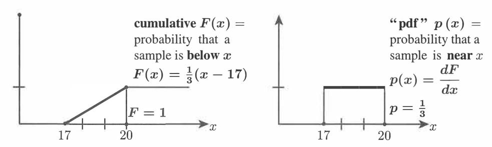
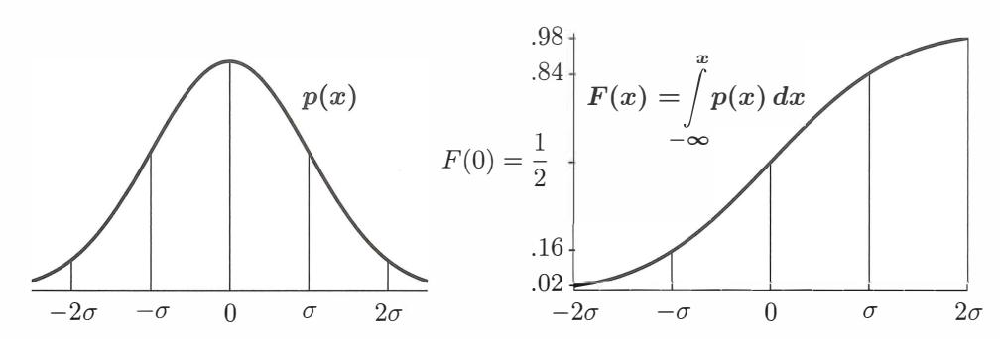
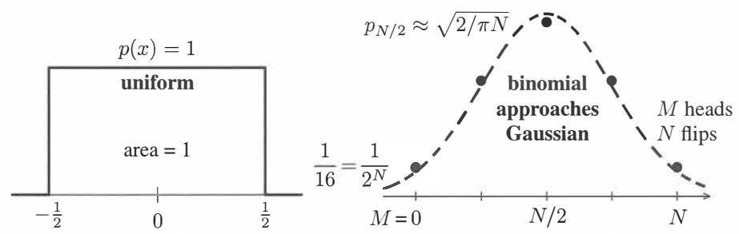

# **Chapter 12**

# **Linear Algebra in Probability & Statistics**

# **12.1 Mean, Variance, and Probability**

We are starting with the three fundamental words of this chapter : *mean, variance, and probability.* Let me give a rough explanation of their meaning before I write any formulas :

The **mean** is the *average value* or expected value

The **variance** o-2measures the average *squared distance* from the mean *m*

The **probabilities** of n different outcomes are positive numbers p1, ... , Pn adding to 1.

Certainly the mean is easy to understand. We will start there. But right away we have two different situations that you have to keep straight. On the one hand, we may have the results *(sample values)* from a completed trial. On the other hand, we may have the expected results *(expected values)* from future trials. Let me give examples:

**Sample values** Five random freshmen have ages **18, 17, 18, 19, 17** 

**Sample mean g(18** + **17** + **18** + **19** + **17) = 17.8** 

**Probabilities** The ages in a freshmen class are **17 (20%), 18 (50%), 19 (30%)** 

A random freshman has **expected age E** [x] = (0.2) **17** + (0.5) **18** + (0.3) **19** = **18.1** 

Both numbers **17.8** and **18.1** are correct averages. The sample mean starts with N samples x1, ... , *x* N from a completed trial. Their mean is the *average* of the *N* observed samples :

| Sample mean | $m = \mu = \frac{1}{N}(x_1 + x_2 + \cdots + x_N)$ | (1) |
|-------------|---------------------------------------------------|-----|
|-------------|---------------------------------------------------|-----|

The **expected value of** x starts with the probabilities p1, ... , *Pn* of the ages x 1, ... , *Xn* :

| Expected value | $m = \mathbf{E}[x] = p_1x_1 + p_2x_2 + \cdots + p_nx_n$ | (2) |
|----------------|---------------------------------------------------------|-----|
|----------------|---------------------------------------------------------|-----|

This is *p* · *x.* Notice that *m* = E[x] tells us what to expect, *m* = *µ* tells us what we got.

By taking many samples (large *N),* the sample results will come close to the probabilities. The "Law of Large Numbers" says that with probability 1, the sample mean will converge to its expected value E[x] as the sample size *N* increases. A fair coin has probability *p0* = ½ of tails and p1 = ½ of heads. Then E [ x] = ( ½) 0 + ½ ( 1). The fraction of heads in *N* flips of the coin is the sample mean, expected to approach E [ x] = ½.

This does *not* mean that if we have seen more tails than heads, the next sample is likely to be heads. The odds remain 50-50. The first 100 or 1000 flips do affect the sample mean. *But* 1000 *flips will not affect its* limit-because you are dividing by *N* --+ oo.

#### **Variance (around the mean)**

The **variance** *a 2*measures expected distance (squared) from the expected mean E[x]. The **sample variance** S **2**measures actual distance (squared) from the sample mean. The square root is the **standard deviation** *a* or *S.* After an exam, I emailµ and *S* to the class. I don't know the expected mean and variance because I don't know the probabilities p1 to *p100* for each score. (After teaching for 50 years, I still have no idea what to expect.)

The deviation is always deviation *from the* mean-sample or expected. We are looking for the size of the "spread" around the mean value *x* = *m.* Start with *N* samples.

| Sample variance | $S^2 = \frac{1}{N-1} \left[ (x_1 - m)^2 + \dots + (x_N - m)^2 \right]$ | (3) |
|-----------------|------------------------------------------------------------------------|-----|
|-----------------|------------------------------------------------------------------------|-----|

The sample ages *x* = 18, 17, 18, 19, 17have mean *m* = 17.8. That sample has variance 0.7:

$$S^2 = \frac{1}{4} \left[ (\cdot 2)^2 + (-.8)^2 + (\cdot 2)^2 + (1.2)^2 + (-.8)^2 \right] = \frac{1}{4} (2.8) = \mathbf{0.7}$$

The minus signs disappear when we compute squares. Please notice ! Statisticians divide by *N* - l = 4 (and not *N* = 5) so that S 2 is an unbiased estimate of o-. One degree of freedom is already accounted for in the sample mean.

An important identity comes from splitting each (x - m)2 into x 2- 2mx + m2 :

$$\begin{aligned} \text{sum of } (x_i - m)^2 &= (\text{sum of } x_i^2) - 2m(\text{sum of } x_i) + (\text{sum of } m^2) \\ &= (\text{sum of } x_i^2) - 2m(Nm) + Nm^2 \\ \text{sum of } (x_i - m)^2 &= (\text{sum of } x_i^2) - Nm^2. \end{aligned} \tag{4}$$

This is an equivalent way to find (x1 - m)2 + · · · + (xN - m2 ) by adding Xi+···+ xJ.,.

Now start with probabilities Pi (never negative!) instead of samples. We find expected values instead of sample values. The variance 0" 2is the crucial number in statistics.

| Variance | $\sigma^2 = E [(x - m)^2] = p_1(x_1 - m)^2 + \dots + p_n(x_n - m)^2$ |  |
|----------|----------------------------------------------------------------------|--|
|          |                                                                      |  |

We are squaring the distance from the expected value *m*= E[x]. We don't have samples, only expectations. We know probabilities but we don't know experimental outcomes.

**Example** 1 Find the variance 0" 2of the ages of college freshmen.

**Solution** The probabilities of ages Xi = 17, 18, 19 were Pi = 0.2 and 0.5 and 0.3. The expected value was *m* = *L* **PiXi** = 18.1. The variance uses those same probabilities:

$$\sigma^2 = (0.2)(17 - 18.1)^2 + (0.5)(18 - 18.1)^2 + (0.3)(19 - 18.1)^2$$
  
 $= (0.2)(1.21) + (0.5)(0.01) + (0.3)(0.81) = 0.49.$ 

The **standard deviation** is the square root **o-** =0. 7.

This measures the spread of 17, 18, 19 around E[x], weighted by probabilities .2, .5, .3.

# **Continuous Probability Distributions**

Up to now we have allowed for n possible outcomes x1, ... , *Xn-* With ages 17, 18, 19, we only had n = 3. If we measure age in days instead of years, there will be a thousand possible ages (too many). Better to allow *every number between* 17 *and* 20-a continuum of possible ages. Then the probabilities p1, P2, p3 for ages x1, x2, X3 have to move to a **probability distribution** p( **x)** for a whole continuous range of ages 17 ::; **x** :=; 20.

The best way to explain probability distributions is to give you two examples. They will be the **uniform distribution** and the **normal distribution.** The first (uniform) is easy. The normal distribution is all-important.

**Uniform distribution** Suppose ages are uniformly distributed between 17.0 and 20.0. All ages between those numbers are "equally likely". Of course any one exact age has no chance at all. There is zero probability that you will hit the exact number *x*= 17.1 or *x*=17 + y'2. What you can truthfully provide (assuming our uniform distribution) is **the chance** F ( x) **that a random freshman has age less than** x :

The chance of age less than x **=** l 7 is F(l 7) **=** 0

| The chance of age less than $x = 20$ is $F(20) = 1$             | $x \leq 20$ will happen |
|-----------------------------------------------------------------|-------------------------|
| The chance of age less than $x$ is $F(x) = \frac{1}{3}(x - 17)$ | $F$ goes from 0 to 1    |

x :=; 17 won't happen

That formula *F(x)* = ½(x - 17) gives *F* = 0 at *x* = l 7; then *x* :=; 17 won't happen. It gives *F(x)* = 1 at *x* = 20; then *x* :=; 20 is sure. Between 17 and 20, the graph of the **cumulative distribution** F ( x) increases linearly for this uniform model.

Let me draw the graphs of *F(x)* and its derivative *p(x)* ="probability density function".

Figure 12.1: *F* ( *x)* is the cumulative distribution and its derivative *p( x)* = *dF* / *dx* is the **probability density function (pdf).** For this uniform distribution, *p( x)* is constant between 17 and 20. The total area under the graph of *p( x)* is the total probability *F* =1.

You could say that *p(x) dx* is the probability of a sample falling in between *x* and *x* + *dx.* This is "infinitesimally true": *p(x) dx* is *F(x* + *dx)* - *F(x).* Here is the full truth:

| $F = \text{integral of } p$ | Probability of $a \leq x \leq b = \int_a^b p(x) dx = F(b) - F(a)$ |  |
|-----------------------------|-------------------------------------------------------------------|--|
|                             |                                                                   |  |

*F(b)* is the probability of *x* :S *b.* I subtract *F(a)* to keep *x* 2". *a.* That leaves *a* :S *x* :S *b.*

# **Mean and Variance of** *p(* x)

What are the mean *m* and variance a 2for a probability distribution? Previously we added PiXi to get the mean (expected value). With a continuous distribution we **integrate** *xp(x):* 

$$\text{Mean } m = \mathbb{E}[x] = \int_{x=17}^{20} x p(x) dx = \int_{x=17}^{20} (x) \left(\frac{1}{3}\right) dx = 18.5$$

For this uniform distribution, the mean *m* is halfway between 17 and 20. Then the probability of a random value *x* below this halfway point *m* = 18.5 is *F(m)* = ½-

In MATLAB, x = rand (1) chooses a random number uniformly between O and 1. Then the expected mean ism = ½- The interval from Oto *x* has probability *F(x)* = *x.* The interval below the mean *m* always has probability *F(m)* = ½-

The variance is the average squared distance to the mean. With *N* outcomes, a 2is the sum of Pi ( Xi -m) 2 • For a continuous random variable *x,* the sum changes to an **integral.**

| Variance | $\sigma^2 = \mathbb{E} [(x - m)^2] = \int p(x) (x - m)^2 dx$ | (7) |
|----------|--------------------------------------------------------------|-----|
|----------|--------------------------------------------------------------|-----|

When ages are uniform between 17 ::; *x* :=; 20, the integral can shift to 0 ::; *x* :=; 3 :

$$\sigma^2 = \int_{17}^{20} \frac{1}{3}(x - 18.5)^2 dx = \int_0^3 \frac{1}{3}(x - 1.5)^2 dx = \frac{1}{9}(x - 1.5)^3 \bigg|_{x=0}^{x=3} = \frac{2}{9}(1.5)^3 = \frac{3}{4}.$$

That is a typical example, and here is the complete picture for a uniform *p(x),* 0 to *a.* 

**l** *X*  **Uniformdistribution forO S x Sa Density p(x)** = - **Cumulative F(x)** = *a a* 

| Uniform distribution for $0 \leq x \leq a$ | Density | $p(x) = \frac{1}{a}$ | Cumulative | $F(x) = \frac{1}{a}$ |
|--------------------------------------------|---------|----------------------|------------|----------------------|
|--------------------------------------------|---------|----------------------|------------|----------------------|

$$\text{Mean } m = \frac{a}{2} \text{ halfway} \quad \text{Variance } \sigma^2 = \int_0^a \frac{1}{a} \left(x - \frac{a}{2}\right)^2 dx = \frac{a^2}{12} \quad (8)$$

The mean is a multiple of *a,* the variance is a multiple of a . For *a* = 3, <7 2= i92= f For one random number between 0 and 1 ( mean ½) the variance is <7 2= /2.

# **Normal Distribution: Bell-shaped Curve**

The normal distribution is also called the "Gaussian" distribution. It is the most important of all probability density functions *p(* **x).** The reason for its overwhelming importance comes from repeating an experiment and averaging the outcomes. The experiments have their own distribution (like heads and tails). *The average approaches a normal distribution.* 

# **Central Limit Theorem (informal)** The average of *N* samples of "any" probability distribution approaches a normal distribution as *N* -+ oo.

Start with the "standard normal distribution". It is symmetric around x = 0, so its mean value ism = 0. It is chosen to have a standard variance <7 2= 1. It is called **N** (0, 1).

| Standard normal distribution | $p(x) = \frac{1}{\sqrt{2\pi}} e^{-x^2/2}$ | (9) |
|------------------------------|-------------------------------------------|-----|
|------------------------------|-------------------------------------------|-----|

The graph of *p(* x) is the **bell-shaped curve** in Figure 12.2. The standard facts are

| Total probability = 1 | $\int_{-\infty}^{\infty} p(x) dx = \frac{1}{\sqrt{2\pi}} \int_{-\infty}^{\infty} e^{-x^2/2} dx = 1$ |
|-----------------------|-----------------------------------------------------------------------------------------------------|
|                       |                                                                                                     |

| Mean $E[x] = 0$ | $m = \frac{1}{\sqrt{2\pi}} \int_0^\infty x e^{-x^2/2} dx = 0$ |
|-----------------|---------------------------------------------------------------|
|-----------------|---------------------------------------------------------------|

| Variance E [ $x^2$ ] = 1 | $\sigma^2 = \frac{1}{\sqrt{2\pi}} \int_{-\infty}^{\infty} (x - 0)^2 e^{-x^2/2} dx = 1$ |
|--------------------------|----------------------------------------------------------------------------------------|
|                          |                                                                                        |

The zero mean was easy because we are integrating an odd function. Changing *x* to *-x*  shows that "integral= - integral". So that integral must be m = 0.

The other two integrals apply the idea in Problem 12 to reach 1. Figure 12.2 shows a graph of *p(x)* for the normal distribution **N** (0, er) and also its cumulative distribution *F(x)* = integral of *p(x).* From the symmetry of *p(x)* you see *mean= zero.* From *F(x)*  you see a very important practical approximation for opinion polling :

The probability that a random sample falls between -er and er is *F(a')* - *F(-a)* � i,

This is because 
$$\int_{-\sigma}^{\sigma} p(x) dx$$
 equals  $\int_{-\infty}^{\sigma} p(x) dx - \int_{-\infty}^{\sigma} p(x) dx = F(\sigma) - F(-\sigma)$ .

Similarly, the probability that a random *x* lies between -2cr and 2cr *("less than two standard deviations from the mean")* is F(2cr) - F(-2cr) � 0.95. If you have an experimental result further than 2cr from the mean, it is fairly sure to be not accidental : chance = 0.05. Drug tests may look for a tighter confirmation, like probability 0.001. Searching for the Higgs boson used a hyper-strict test of 5cr deviation from pure accident.

Figure 12.2: The standard normal distribution *p* ( *x)* has mean *m* = 0 and er = 1.

The normal distribution with any mean m and standard deviation er comes by shifting and stretching the standardN (0, 1). **Shift** x **to** *x* - m. **Stretch** *x* - *m* **to** (x - *m)/a.* 

|                                                         |                                                             |                                                    |
|----------------------------------------------------------------------|-------------------------------------------------------------|-----------------------------------------------------------------|
| 
<b>Gaussian density <math display="block">p(x)</math></b>
 |                                                             | 
<b>Normal distribution <math>N(m, \sigma)</math></b>
 |
|                                                                      |                                                             |                                                                 |
|                                                                      | $p(x) = \frac{1}{\sigma\sqrt{2\pi}} e^{-(x-m)^2/2\sigma^2}$ | (10)                                                            |

The integral of *p(x)* is F(x)-the probability that a random sample will fall below *x.*  The differential *p(x) dx* = *F(x* + *dx)* - *F(x)* is the probability that a random sample will fall between *x* and *x* + *dx.* There is no simple formula to integrate e-x*2*/ 2 , so this cumulative distribution *F* ( *x)* is computed and tabulated very carefully.

# *N***Coin Flips and** *N* **--+** oo

**Example 2 Suppose** *xis* **1 or -1 with equal probabilities p**1 **= p\_**1 **=**½.

The mean value ism= ½(1) + ½(-1) = 0. The variance is u 2= ½(1)2+½(-1)2 = 1.

The key question is the *average* AN = ( x1+ · · · + *x* N) / *N.* The independent *Xi*  are ±1 and we are dividing their sum by N. The expected mean of AN is still zero. The law of large numbers says that this sample average approaches zero with probability 1. How fast does AN approach zero? **What is its variance** u'f..?

| By linearity | $\sigma_N^2 = \frac{\sigma^2}{N^2} + \frac{\sigma^2}{N^2} + \cdots + \frac{\sigma^2}{N^2} = N \frac{\sigma^2}{N^2} = \frac{1}{N}$ | since $\sigma^2 = 1$ . | (11) |
|--------------|-----------------------------------------------------------------------------------------------------------------------------------|------------------------|------|
|--------------|-----------------------------------------------------------------------------------------------------------------------------------|------------------------|------|

**Example 3 Change outputs from 1 or -1 to** x = 1 **or** x = 0. **Keep p**1 = *p0* = ½- The new mean value *m* = ½ falls halfway between 0 and 1. The variance moves to u 2= ¼ :

$$\mathbf{m} = \frac{1}{2}(1) + \frac{1}{2}(0) = \frac{1}{2} \quad \text{and} \quad \mathbf{\sigma}^2 = \frac{1}{2} \left(1 - \frac{1}{2}\right)^2 + \frac{1}{2} \left(0 - \frac{1}{2}\right)^2 = \frac{1}{4}.$$

1 1 1 1 The average AN now has mean - and variance --2+ · · · + --2= - = *u'fv.* (12) 2*4N 4N 4 N*  This *CTN* is half the size of *CTN* in Example 2. This must be correct because the new range 0 to 1 is half as long as -1 to 1. Examples **2-3** are showing a law of linearity.

**The new 0** - 1 **variable xnew is** ½ **Xold** + ½. So the mean *m* is increased to ½ and the variance is *multiplied* by ( ½) 2 . A shift changes *m* and the rescaling changes CT .

**Linearity Xnew** = **aXoJd** + b has **ffinew** = **amold** + b and u **2 new** = **a 2**u **2 oJd·** (13)

Here are the results from three numerical tests: random 0 or 1 averaged over *N* trials. **[48** l's from N = **100] [5035** l's from N = **10000] [19967** l's from N = **40000]. The standardized** *X* = *(x* - *m)/CT* = (AN - ½) / 2vN was **[-.40] [.70] [-.33].**

The Central Limit Theorem says that the average of many coin flips will approach a normal distribution. Let us begin to see how that happens: **binomial approaches normal.** 

For each flip, the probability of heads is ½. For N = 3 flips, the probability of heads all three times is ( ½) 3= ½. The probability of heads twice and tails once is j, from three sequences HHT and HTH and THH. These numbers ½ and ¾ are pieces of ( ½ + ½) 3= ½ + ¾ + ¾ + ½ = 1. *The average number of heads in* 3 *flips is* 1.5.

**1 3 3 3 6 3 Mean** *m* = (3 heads)8 + (2 heads)8 + (1 head)8 + 0 = 8 +8 +8 = 1.5 **heads**

With *N* flips, Example 3 ( or common sense) gives a mean of rn = :E *Xi Pi* = ½ *N* heads.

The variance 0' is based on the *squared distance* from this mean *N* /2. With *N* = 3 the variance is 0' = ¾ *(which is N* / 4). To find 0' we add ( *Xi* - *m*) Pi with *m* = 1.5 :

$$\sigma^2 = (3 - 1.5)^2 \frac{1}{8} + (2 - 1.5)^2 \frac{3}{8} + (1 - 1.5)^2 \frac{3}{8} + (0 - 1.5)^2 \frac{1}{8} = \frac{9 + 3 + 3 + 9}{32} = \frac{3}{4}.$$

For any *N,* the variance is u'f.., = *N/4.* Then *O'N* = ,/Fi /2.

Figure 12.3 shows how the probabilities of 0, 1, 2, 3, 4 heads in N = 4 flips come close to a bell-shaped Gaussian. That Gaussian is centered at the mean value N /2 = 2. To reach the standard Gaussian (mean O and variance 1) we shift and rescale that graph. If *x* is the number of heads in N flips-the average of N zero-one outcomes-then *x* is shifted by its mean *m* = *N* /2 and rescaled by *O'* = ,/Fi /2 to produce the standard *X* :

| Shifted and scaled | $X = \frac{x - m}{\sigma} = \frac{x - \frac{1}{2}N}{\sqrt{N}/2}$ | $(N = 4 \text{ has } X = x - 2)$ |
|--------------------|------------------------------------------------------------------|----------------------------------|
|--------------------|------------------------------------------------------------------|----------------------------------|

**Subtracting** rn **is "centering" or "detrending". The mean of Xis zero.**

**Dividing by** u **is "normalizing" or "standardizing". The variance of Xis** 1.

Figure 12.3: The probabilities *p* (l, 4, 6, 4, 1) /16 for the number of heads in 4 flips. These *Pi* approach a Gaussian distribution with variance 0' 2= *N* / 4 centered at *m* = *N* /2. For *X,* the Central Limit Theorem gives convergence to the normal distribution N(O, 1).

It is fun to see the Central Limit Theorem giving the right answer at the center point X = 0. At that point, the factor e-X*2*/ 2equals 1. We know that the variance for N coin flips is 0' 2= N / 4. The center of the bell-shaped curve has height 1 / v'21m2 = )2 / N *1r.* 

What is the height at the center of the coin-flip distribution *p0*to PN (the binomial distribution)? For N = 4, the probabilities for 0, 1, 2, 3, 4 heads come from(½+ ½) 4 .

| Center probability $\frac{6}{16}$ | $\left(\frac{1}{2} + \frac{1}{2}\right)^4 = \frac{1}{16} + \frac{4}{16} + \frac{6}{16} + \frac{4}{16} + \frac{1}{16} = 1.$ |
|-----------------------------------|----------------------------------------------------------------------------------------------------------------------------|
|                                   |                                                                                                                            |

The binomial theorem in Problem 8 tells us the center probability *PN/2* for any even N:

| The center probability $\left(\frac{N}{2} \text{ heads}, \frac{N}{2} \text{ tails}\right)$ is | $\frac{1}{2^N} \frac{N!}{(N/2)!(N/2)!}$ |
|-----------------------------------------------------------------------------------------------|-----------------------------------------|
|                                                                                               |                                         |

For *N* = 4, those factorials produce 4!/2! 2! = 24/4 = 6. For large *N,* Stirling's formula v'21r *N(N/ e)N* is a close approximation to *N!.* Use Stirling for *N* and twice for N/2:

| Limit of coin-flip Center probability | $p_{N/2} \approx \frac{1}{2^N} \frac{\sqrt{2\pi N (N/e)^N}}{\pi N (N/2e)^N} = \frac{\sqrt{2}}{\sqrt{\pi N}} = \frac{1}{\sqrt{2\pi \sigma}}.$ | (14) |
|---------------------------------------|----------------------------------------------------------------------------------------------------------------------------------------------|------|
|---------------------------------------|----------------------------------------------------------------------------------------------------------------------------------------------|------|

At that last step we used the variance <J 2= *N* / 4 for the coin-tossing problem. The result 1/,,/'h<J matches the center value (above) for the Gaussian. The Central Limit Theorem is true: The "binomial distribution" approaches the normal distribution as *N* --+ oo.

#### **Monte Carlo Estimation Methods**

Scientific computing has to work with errors in the data. Financial computing has to work with unsure numbers and uncertain predictions. All of applied mathematics has moved to **accepting uncertainty in the inputs and estimating the variance in the outputs.** 

How to estimate that variance? Often probability distributions *p(x)* are not known. What we can do is to try different inputs *b* and compute the outputs x and take an average. This is the simplest form of a **Monte Carlo method** (named after the gambling palace on the Riviera, where I once saw a fight about whether the bet was placed in time). Monte Carlo approximates an expected value E[x] by a sample average (x 1+ · · · *+xN* )/ *N.*

Please understand that every *Xk* can be expensive to compute. We are not just flipping coins. Each sample comes from a set of data *bk . Monte Carlo randomly chooses this data bk, it computes the outputs Xk , and then it averages those x's.* Decent accuracy for E[x] often requires many samples band huge computing cost. The error in approximating E[x] by (x 1+ · · *·+XN )/N* is normally of order 1/vN. *Slow improvement as N increases.* 

That 1/ vN estimate came for coin flips in equation (11). Averaging *N* independent samples x *k* of variance <J 2reduces the variance to <J 2/ *N.* 

"Quasi-Monte Carlo" can sometimes reduce this variance to <J 2/ N2: a big difference! The inputs *bk* are selected very carefully-not just randomly. This QMC approach is surveyed in the journal *Acta Numerica* 2013. The newer idea of "Multilevel Monte Carlo" is outlined by Michael Giles in *Acta Numerica* 2015. Here is how it works.

Suppose it is much simpler to simulate another variable *y(b)* close to *x(b).* Then use *N* computations of *y(bk)* and only *N\** < *N* computations of *x(bk )* to estimate E[x].

| 2-level Monte Carlo | $\mathbf{E}[x] \approx \frac{1}{N} \sum_1^N y(b_k) + \frac{1}{N^*} \sum_1^{N^*} [x(b_k) - y(b_k)] \cdot$ |
|---------------------|----------------------------------------------------------------------------------------------------------|
|---------------------|----------------------------------------------------------------------------------------------------------|

The idea is that *x* - *y* has a smaller variance *CJ\** than the original *x.* Therefore *N\** can be smaller than *N,* with the same accuracy for E[x]. We do *N* cheap simulations to find the *y's.* Those cost *C* each. We only do *N\** expensive simulations involving *x's.* Those cost *C\** each. The total computing cost is *NC+ N\*C\*.* 

Calculus minimizes the overall variance for a fixed total cost. The optimal ratio *N\** / *N*  is *JC/ C\* CJ\*/ CJ.* Three-level Monte Carlo would simulate *x, y,* and *z* :

$$y = \frac{1}{N} \sum_{k=1}^N y_k = \frac{1}{N} \sum_{k=1}^N y_k y_k = \frac{1}{N} \sum_{k=1}^N y_k^2$$

Giles optimizes *N, N\*, N\*\*, ...* to keep E[x] :s; fixed E0 , and provides a MATLAB code.

# **Review : Three Formulas for the Mean and the Variance**

The formulas for *m* and CJ 2are the starting point for all of probability and statistics. There are three different cases to keep straight: **sample** values Xi , **expected** values (discrete Pi), and a range of **expected** values ( continuous p( x) ). Here are the mean and the variance:

| Samples X 1 to X N                                   |                        |
|------------------------------------------------------|------------------------|
| n possible outputs                                   |                        |
| X1+···+XN                                            | S                      |
|                                                      | 2 =                    |
|                                                      | (X1-m) 2 +···+(XN-m) 2 |
| N                                                    | N-1                    |
| m = I:: PiX i                                        |                        |
| Range of outputs m=fxp(x)dx with probability density |                        |
|                                                      | 2 = I:: P i (X i m) 2  |
|                                                      | 2 = f (x -m) 2 p(x)dx  |

A natural question: Why are there no probabilities *p* on the first line? How can these formulas be parallel ? Answer : *We expect a fraction* Pi *of the samples to be* X = Xi . If this is exactly true, X = Xi is repeated PiN times. Then lines 1 and 2 give the same m.

When we work with samples, we don't know the Pi · We just include each output *X*  as often as it comes. We get the "empirical" mean instead of the expected mean.

### **Problem Set 12.1**

**1**Add 7 to every output *x.* What happens to the mean and the variance? What are the new sample mean, the new expected mean, and the new variance? **2** We know: ½ of all integers are divisible by 3 and t of integers are divisible by 7. What fraction of integers will be divisible by 3 or 7 or both ? 3 Suppose you sample from the numbers 1 to 1000 with equal probabilities 1/1000. What are the probabilities *p0* to *pg* that the last digit of your sample is 0, ... , 9? What is the expected mean *m* of that last digit? What is its variance CJ 2? 4 Sample again from 1 to 1000 but look at the last digit of the sample *squared.* That square could end with *x* = 0, 1, 4, 5, 6, or 9. What are the probabilities Po,Pi, *p4,p5,*  p6, *pg?* What are the ( expected) mean *m* and variance CJ 2 of that number *x?* 

5 (a little tricky) Sample again from 1 to 1000 with equal probabilities and let  $x$  be the *first* digit ( $x = 1$  if the number is 15). What are the probabilities  $p_1$  to  $p_9$  (adding to 1) of  $x = 1, \dots, 9$ ? What are the mean and variance of  $x$ ?

6 Suppose you have  $N = 4$  samples 157, 312, 696, 602 in Problem 5. What are the first digits  $x_1$  to  $x_4$  of the squares? What is the sample mean  $\mu$ ? What is the sample variance  $S^2$ ? Remember to divide by  $N - 1 = 3$  and not  $N = 4$ .

7 Equation (4) gave a second equivalent form for  $S^2$  (the variance using samples):

$$S^2 = \frac{1}{N-1} \text{ sum of } (x_i - m)^2 = \frac{1}{N-1} [(\text{sum of } x_i^2) - Nm^2].$$

Verify the matching identity for the expected variance  $\sigma^2$  (using  $m = \sum p_i x_i$ ):

$$\sigma^2 = \text{sum of } p_i (x_i - m)^2 = (\text{sum of } p_i x_i^2) - m^2.$$

8 If all 24 samples from a population produce the same age  $x = 20$ , what are the sample mean  $\mu$  and the sample variance  $S^2$ ? What if  $x = 20$  or 21, 12 times each?

9 Computer experiment as on page 541: Find the average  $A_{1000000}$  of a million random 0-1 samples! What is  $X = (A_N - \frac{1}{2}) / 2\sqrt{N}$ ?

10 The probability  $p_i$  to get  $i$  heads in  $N$  coin flips is the *binomial number*  $b_i = \binom{N}{i}$  divided by  $2^N$ . The  $b_i$  add to  $(1+1)^N = 2^N$  so the probabilities  $p_i$  add to 1.

$$p_0 + \dots + p_N = \left(\frac{1}{2} + \frac{1}{2}\right)^N = \frac{1}{2^N} (b_0 + \dots + b_N) \text{ with } b_i = \frac{N!}{i!(N-i)!}$$

$$N=4 \text{ leads to } b_0 = \frac{24}{24}, b_1 = \frac{24}{(1)(6)} = 4, b_2 = \frac{24}{(2)(2)} = 6, p_i = \frac{1}{16}(1, 4, 6, 4, 1).$$

Notice  $b_i = b_{N-i}$ . *Problem:* Confirm that the mean  $m = 0p_0 + \dots + Np_N$  equals  $\frac{N}{2}$ .

11 For any function  $f(x)$  the expected value is  $E[f] = \sum p_i f(x_i)$  or  $\int p(x) f(x) dx$  (discrete probability or continuous probability). Suppose the mean is  $E[x] = m$  and the variance is  $E[(x - m)^2] = \sigma^2$ . **What is  $E[x^2]$ ?**

12 Show that the standard normal distribution  $p(x)$  has total probability  $\int p(x) dx = 1$  as required. A famous trick multiplies  $\int p(x) dx$  by  $\int p(y) dy$  and computes the integral over all  $x$  and all  $y$  ( $-\infty$  to  $\infty$ ). The trick is to replace  $dx$  by  $dy$  in that double integral by  $r dr d\theta$  (polar coordinates with  $x^2 + y^2 = r^2$ ). Explain each step:

$$2\pi \int_{-\infty}^{\infty} \int_{-\infty}^{\infty} \int_{-\infty}^{\infty} e^{-(x^2+y^2)/2} dx dy = \int_0^{2\pi} \int_0^{\infty} \int_0^{\infty} e^{-r^2/2} r dr d\theta = 2\pi.$$

# **12.2 Covariance Matrices and Joint Probabilities**

Linear algebra enters when we run *M* different experiments at once. We might measure age and height and weight (M = 3 measurements of *N* people). Each experiment has its own mean value. So we have a vector *m* = (m1, m2, m3 ) containing the *M* mean values. Those could be *sample means* of age and height and weight. Or m1, m2, m3 could be *expected values* of age, height, weight based on known probabilities.

A matrix becomes involved when we look at variances. Each experiment will have a sample variance *S;* or an expected *a}* = E [(xi - mi) 2 ] based on the squared distance from its mean. Those *M* numbers O"r, ... , *O"i* will go on the main diagonal of the matrix. So far we have made no connection between the *M* parallel experiments. They measure *M* different random variables, but the experiments are not necessarily independent!

If we measure age and height and weight (a, *h, w)* for children, the results will be strongly correlated. Older children are generally taller and heavier. Suppose the means ma, mh, mw are known. Then *O"�, O"�, O"!* are the separate variances in age, height, weight. **The new numbers are the covariances like** *u* ah, **where age multiplies height.**

| Covariance | $\sigma_{ah} = \mathbf{E} [(\text{age} - \text{mean age}) (\text{height} - \text{mean height})].$ | (1) |
|------------|---------------------------------------------------------------------------------------------------|-----|
|------------|---------------------------------------------------------------------------------------------------|-----|

This definition needs a close look. To compute *O"ah,* it is not enough to know the probability of each age and the probability of each height. We have to know the **joint probability of each pair (age and height).** This is because age is connected to height.

Pah = probability that a random child has age = a **and** height = *h:* both at once

Pij = **probability that experiment 1 produces** Xi **and experiment 2 produces** Yj

Suppose experiment 1 (age) has mean m1. Experiment 2 (height) has mean m2. The covariance in (1) between experiments 1 and 2 looks at **all pairs** of ages *Xi,* heights *y*1 :

| Covariance | $\sigma_{12} = \sum_{\text{all } i, j} \sum_j p_{ij}(x_i - m_1)(y_j - m_2)$ | (2) |
|------------|-----------------------------------------------------------------------------|-----|
|------------|-----------------------------------------------------------------------------|-----|

To capture this idea of "joint probability Pij" we begin with two small examples.

**Example 1** Flip two coins separately. With 1 for heads and O for tails, the results can be (1, 1) or (1, 0) or (0, 1) or (0, 0). Those four outcomes all have probability p11 = p1o = Poi= *Poo* = ¼- **Independent experiments have Prob of** ( i, j) = **(Prob of** i) **(Prob of** j).

**Example 2** *Glue the coins together,* facing the same way. The only possibilities are (1, 1) and (0, 0). Those have probabilities ½ and ½- The probabilities *p10* and p01 are zero. (1, 0) and (0, 1) won't happen because the coins stick together: both heads or both tails.

| Probability matrices for Examples 1 and 2 | $P = \begin{bmatrix} p_{11} & p_{12} \\ p_{21} & p_{22} \end{bmatrix} = \begin{bmatrix} \frac{1}{4} & \frac{1}{4} \\ \frac{1}{4} & \frac{1}{4} \end{bmatrix}$ | $P = \begin{bmatrix} \frac{1}{2} & 0 \\ 0 & \frac{1}{2} \end{bmatrix}$ |
|-------------------------------------------|---------------------------------------------------------------------------------------------------------------------------------------------------------------|------------------------------------------------------------------------|
|                                           |                                                                                                                                                               |                                                                        |

Let me stay longer with *P,* to show it in good matrix notation. The matrix shows the probability Pij of each pair (Xi, Yj )-starting with ( x1, Y1) = (heads, heads) and ( x1, Y2) (heads, tails). Notice the row sums Pi and column sums *Pj*and the total sum =1.

| Probability matrix | $P = \begin{bmatrix} p_{11} & p_{12} \\ p_{21} & p_{22} \end{bmatrix}$ | $p_{11} + p_{12} = p_1 \quad (\text{first})$ $p_{21} + p_{22} = p_2 \quad (\text{coin})$ |
|--------------------|------------------------------------------------------------------------|---------------------------------------------------------------------------------------------|
|                    |                                                                        |                                                                                             |

| (second coin) column sums | $P_1$ | $P_2$ | 4 entries add to 1 |
|---------------------------|-------|-------|--------------------|
|                           |       |       |                    |

Those numbers p1, P2 and Pi, P2 are called the **marginals** of the matrix *P:*

$$p_1 = p_{11} + p_{12} = \text{chance of heads from } \mathbf{coin 1} \text{ (coin 2 can be heads or tails)}$$
  
 $P_1 = p_{11} + p_{21} = \text{chance of heads from } \mathbf{coin 2} \text{ (coin 1 can be heads or tails)}$ 

Example 1 showed *independent* variables. Every probability Pij equals Pi times Pj (½ times ½ gave Pij =¼ in that example). In this case **the covariance** u12 **will be zero.** Heads or tails from the first coin gave no information about the second coin.

| Zero covariance $\sigma_{12}$ | $V = \begin{bmatrix} \sigma_1^2 & 0 \\ 0 & \sigma_2^2 \end{bmatrix} = \text{diagonal covariance matrix.}$ |
|-------------------------------|-----------------------------------------------------------------------------------------------------------|
| for independent trials        |                                                                                                           |

Independent experiments have 0'12 = 0 because every Pij = (Pi) (Pj) in equation (2):

$$\sigma_{12} = \sum_i \sum_j (p_i)(p_j)(x_i - m_1)(y_j - m_2) = \left[ \sum_i (p_i)(x_i - m_1) \right] \left[ \sum_j (p_j)(y_j - m_2) \right] = [\mathbf{0}][\mathbf{0}].$$

The glued coins show perfect correlation. Heads on one means heads on the other. The covariance 0'12 moves from O to 0"10'2 =¼-this is the largest possible value of 0'12 :

| Means = $\frac{1}{2}$ | $\sigma_{12} = \frac{1}{2} \left(1 - \frac{1}{2}\right) \left(1 - \frac{1}{2}\right) + \mathbf{0} + \mathbf{0} + \frac{1}{2} \left(0 - \frac{1}{2}\right) \left(0 - \frac{1}{2}\right) = \frac{1}{4}$ |
|-----------------------|-------------------------------------------------------------------------------------------------------------------------------------------------------------------------------------------------------|
|                       |                                                                                                                                                                                                       |

Heads or tails from coin 1 gives complete information about heads or tails from coin 2 :

| Glued coins give largest possible covariances | $V_{\text{glue}} = \begin{bmatrix} \sigma_1^2 & \sigma_1\sigma_2 \\ \sigma_1\sigma_2 & \sigma_2^2 \end{bmatrix}$ |
|-----------------------------------------------|------------------------------------------------------------------------------------------------------------------|
| Singular covariance matrix: determinant = 0   |                                                                                                                  |

**Always** *Uiu� � ui2 ,* Thus 0'12 is *between* -0"10"2 *and* 0"10"2. The covariance matrix *V* is **positive definite** (or in this singular case of glued coins, *V* is **positive semidefinite).** That is an important fact about *M* by *M* covariance matrices for *M* experiments.

Note that the **sample covariance matrix** *S* from *N* trials is certainly semidefinite. Every new sample *X*=(age, height, weight) contributes to the **sample mean** *X* and to *S.* Each term (Xi - X)(Xi - X)T is positive semidefinite and we just add to reach *S:* 

$$\mathbf{X} = \frac{X_1 + \dots + X_N}{N} \quad S = \frac{(X_1 - \bar{X})(X_1 - \bar{X})^T + \dots + (X_N - \bar{X})(X_N - \bar{X})^T}{N-1} \quad (3)$$

# **The Covariance Matrix** V **is Positive Semidefinite**

Come back to the *expected* covariance o-12 between two experiments 1 and 2 (two coins):

$$\begin{aligned} \sigma_{12} &= \text{expected value of } [(\text{output } 1 - \text{mean } 1) \text{ times } (\text{output } 2 - \text{mean } 2)] \\ &= \sum_{\text{all } i, j} \sum_{j=1}^{n_i} p_{ij} (x_i - m_1) (y_j - m_2). \end{aligned} \quad (4)$$

Pij 2". 0 is the probability of seeing output Xi in experiment 1 **and** y1 in experiment 2. Some pair of outputs must appear. Therefore the N2 probabilities Pij add to 1.

| Total probability (all pairs) is 1 | $\sum_{\text{all}} \sum_{i,j} p_{ij} = 1.$ | (5) |
|------------------------------------|--------------------------------------------|-----|
|------------------------------------|--------------------------------------------|-----|

Here is another fact we need. *Fix on one particular output* Xi in experiment 1. Allow *all outputs* y1 in experiment 2. Add the probabilities of (xi, Y1), (xi, Y2), ... , (xi, Yn) :

| Row sum $p_i$ of $P$ | $\sum_{j=1}^n p_{ij} = \text{probability } p_i \text{ of } x_i \text{ in experiment 1.}$ | (6) |
|----------------------|------------------------------------------------------------------------------------------|-----|
|----------------------|------------------------------------------------------------------------------------------|-----|

Some *y*1must happen in experiment 2 ! Whether the two coins are completely separate or glued together, we still get ½ for the probability PH =PHH+ PHT that coin 1 is heads:

| (separate) $P_{HH} + P_{HT} = \frac{1}{4} + \frac{1}{4} = \frac{1}{2}$ | (glued) $P_{HH} + P_{HT} = \frac{1}{2} + 0 = \frac{1}{2}$ . |
|------------------------------------------------------------------------|-------------------------------------------------------------|
|------------------------------------------------------------------------|-------------------------------------------------------------|

That basic reasoning allows us to write one matrix formula that includes the covariance o-12 along with the separate variances o-f and o-� for experiment 1 and experiment 2. We get the whole covariance matrix *V* by adding the matrices ¼1 for each pair ( i, *j)* :

| Covariance matrix | $V = \sum_{i,j} \sum_{i,j} p_{ij} \begin{bmatrix} (x_i - m_1)^2 & (x_i - m_1)(y_j - m_2) \\ (x_i - m_1)(y_j - m_2) & (y_j - m_2)^2 \end{bmatrix}$ | (7) |
|-------------------|---------------------------------------------------------------------------------------------------------------------------------------------------|-----|
|-------------------|---------------------------------------------------------------------------------------------------------------------------------------------------|-----|

Off the diagonal, this is equation (2) for the covariance o-12. On the diagonal, we are getting the ordinary variances o-f and d. I will show in detail how we get V11=o-f by using equation (6). Allowing all *j* just leaves the probability Pi of xi in experiment 1:

---

$$\mathbf{V}_{11} = \sum_{\text{all}} \sum_{i,j} p_{ij}(x_i - m_1)^2 = \sum_{\text{all}} (\text{probability of } x_i) (x_i - m_1)^2 = \sigma_1^2. \quad (8)$$

Please look at that twice. It is the key to producing the whole covariance matrix by one formula (7). The beauty of that formula is that it combines 2 by 2 matrices ¼1 . And the matrix ¼1 in (7) for each pair of outcomes i, *j* is **positive semidefinite:**

| $x_{ij}$ | has diagonal entries $p_{ij}(x_i - m_1)^2 \geq 0$ | and $p_{ij}(y_j - m_2)^2 \geq 0$ | and | $det(V_{ij}) = 0$ . |
|----------|---------------------------------------------------|----------------------------------|-----|---------------------|
| 1        |                                                   |                                  |     |                     |

That matrix *¼j*has rank 1. Equation (7) multiplies *Pijtimes column U times row* U T:

$$\begin{bmatrix} (x_i - m_1)^2 & (x_i - m_1)(y_j - m_2) \\ (x_i - m_1)(y_j - m_2) & (y_j - m_2)^2 \end{bmatrix} = \begin{bmatrix} x_i - m_1 & [x_i - m_1 & y_j - m_2] \\ y_j - m_2 & [y_j - m_2] & (y_j - m_2)^2 \end{bmatrix} \quad (9)$$

*Every matrix UUT*is *positive semidefinite.* So the whole matrix *V* (combining these matrices *UUT*with weights *Pij�* 0) is **at least semidefinite-and** probably *V* is definite.

**The covariance matrix** *V* **is positive definite unless the experiments are dependent.** 

Now we move from two variables x and y to *M* variables like age-height-weight. The output from each trial is a vector *X* with *M* components. (Each child has an ageheight-weight vector with 3 components.) The covariance matrix *V* is now *M* by *M. V*is created from the output vectors *X* and their average *X* = E [ X]

| Covariance matrix | $V = E \left[ (X - \bar{X}) (X - \bar{X})^T \right]$ | (10) |
|-------------------|------------------------------------------------------|------|
|-------------------|------------------------------------------------------|------|

Remember that *X XT*and *XX* T = (column) (row) are *M* by *M* matrices.

For *M*= l (one variable) you see that Xis the mean m and *Vis* 1J 2(Section 12.1). For M = 2 (two coins) you see that Xis (m1,m2 ) and V matches equation (10). The expectation E always adds up outputs times their probabilities. For age-height-weight the output could be *X* = (5 years, 31 inches, 48 pounds) and its probability is P5,31,48.

Now comes a new idea. *Take any linear combination* c T*X* = c1X1 + · · · + cMXM. With *c* = (6, 2, 5) this would be c T*X* = 6 (age)+ 2 (height)+ 5 (weight). By linearity we know that its expected value E [cT X] is c TE [X] = cT X:

$$\mathbf{E}[c^T \mathbf{X}] = c^T \mathbf{E}[\mathbf{X}] = 6 \text{ (expected age)} + 2 \text{ (expected height)} + 5 \text{ (expected weight)}.$$

More than that, we also know the *variance* 1J 2of that number c TX:

$$\begin{aligned} \text{Variance of } \mathbf{c}^T \mathbf{X} &= \mathbb{E} \left[ (\mathbf{c}^T \mathbf{X} - \mathbf{c}^T \bar{\mathbf{X}}) (\mathbf{c}^T \mathbf{X} - \mathbf{c}^T \bar{\mathbf{X}})^T \right] \\ &= \mathbf{c}^T \mathbb{E} \left[ (\mathbf{X} - \bar{\mathbf{X}}) (\mathbf{X} - \bar{\mathbf{X}})^T \right] \mathbf{c} = \mathbf{c}^T \mathbf{V} \mathbf{c} \end{aligned} \quad (11)$$

Now the key point: *The variance of* c T*X can never be negative.* So c TV c 2'. 0. *The covariance matrix Vis therefore positive semidefinite by the energy test* c TV c 2'. 0.

Covariance matrices *V* open up the link between probability and linear algebra: V equals QAQT with eigenvalues Ai � 0 and orthonormal eigenvectors q1 to qM.

**Diagonalizing the covariance matrix means finding** M *independent* **experiments as combinations of the original** *M* **experiments.** 

**Confession** I am not entirely happy with that proof based on c TV c ;:::: 0. The expectation symbol Eis burying the key idea of **joint probability.** Allow me to show directly that Vis positive semidefinite (at least for the age-height-weight example). The proof is simply that V **is the sum of the joint probability** *Pahw* **of each combination (age, height, weight) times the positive semidefinite matrix** *UUT.* Here U is *X* - *X*:

$$V = \sum_{\text{all } a, h, w} p_{ahw} U U^T \quad \text{with} \quad U = \begin{bmatrix} \text{age} \\ \text{height} \\ \text{weight} \end{bmatrix} - \begin{bmatrix} \text{mean age} \\ \text{mean height} \\ \text{mean weight} \end{bmatrix}. \quad (12)$$

This is exactly like the 2 by 2 coin flip matrix *V* in equation (7). Now *M* = 3.

The value of the expectation symbol E is that it also allows *pdf's* (probability density functions like *p(x, y, z)* for continuous random variables *x* and *y* and *z).* If we allow all numbers as ages and heights and weights, instead of age i = 0, 1, 2, 3 ... , then we need *p( x,* y, *z)* instead of Pij k. The sums in this section of the book would all change to integrals. But we still have V = E [UUT ] :

**Covariance matrix** 
$$V = \iint p(x, y, z) U U^T dx dy dz$$
 with  $U = \begin{bmatrix} x - \bar{x} \\ y - \bar{y} \\ z - \bar{z} \end{bmatrix}$ . (13)

Always *J J J p* = 1. Examples 1-2 emphasized how *p* can give diagonal V or singular V:

**Independent variables** *x, y, z p(x, y, z)* **= P1** *(x) P2(Y) p3(z).* 

**Dependent variables** *x, y, z p(x, y, z)* = 0 except when *ex+ dy* + *ez* = 0.

### **The Mean and Variance of** *z*= *x*+ *y*

Start with the sample mean. We have N samples of x. Their mean(= average) is mx. We also have N samples of y and their mean is my. **The sample mean of** z = x + y **is clearly** mz = mx + my :

| Mean of sum = Sum of means | $\frac{1}{N} \sum_1^N (x_i + y_i) = \frac{1}{N} \sum_1^N x_i + \frac{1}{N} \sum_1^N y_i.$ | (14) |
|----------------------------|-------------------------------------------------------------------------------------------|------|
|----------------------------|-------------------------------------------------------------------------------------------|------|

Nice to see something that simple. The *expected* mean of *z* = *x*+ *y*doesn't look so simple, but it must come out as E[z] = E[x] + E[y]. Here is one way to see this.

The joint probability of the pair (Xi, yj) is Pij. Its value depends on whether the experiments are independent, which we don't know. But for the mean of the sum *z* = *x*+ *y,*  dependence or independence of x and y doesn't matter. Expected values still add:

$$\mathbf{E}[\mathbf{x} + \mathbf{y}] = \sum_i \sum_j p_{ij}(x_i + y_j) = \sum_i \sum_j p_{ij}x_i + \sum_i \sum_j p_{ij}y_j. \quad (15)$$

All the sums go from 1 to *N.* We can add in any order. For the first term on the right side, add the Pij along row i of the probability matrix P to get Pi· That double sum gives E[x] :

$$\sum_{\vec{i}} \sum_j p_{ij} x_i = \sum_{\vec{i}} (p_{i1} + \cdots + p_{iN}) x_i = \sum_{\vec{i}} p_i x_i = \mathbf{E}[x].$$

For the last term, add Pij down column *j* of the matrix to get the probability Pj of Yj. Those pairs (x1, Yj ) and (x2, Yj ) and ... and (xN, Yj ) are all the ways to produce Yj :

$$\sum_{\mathfrak{i}} \sum_j p_{ij} y_j = \sum_j (p_{1j} + \cdots + p_{Nj}) y_j = \sum_j P_j y_j = E[y].$$

Now equation (15) says that E[x + y] = E[x] + E[y].

What about the variance of z = x + y? The joint probabilities Pij and the covariance CTxy will be involved. Let me separate the variance of x + y into three simple pieces:

$$\begin{aligned}\sigma_z^2 &= \sum \sum p_{ij}(x_i + y_j - m_x - m_y)^2 \\ &= \sum \sum p_{ij}(x_i - m_x)^2 + \sum \sum p_{ij}(y_j - m_y)^2 + 2 \sum \sum p_{ij}(x_i - m_x)(y_j - m_y)\end{aligned}$$

The first piece is u;. The second piece is u�. The last piece is **2u** *rey .* 

| <b>The variance of <math display="block">z = x + y</math></b> | <b><math>z</math></b> | $\sigma_z^2 = \sigma_x^2 + \sigma_y^2 + 2\sigma_{xy}$ | <b>(16)</b> |
|---------------------------------------------------------------|-----------------------|-------------------------------------------------------|-------------|
|---------------------------------------------------------------|-----------------------|-------------------------------------------------------|-------------|

#### **The Covariance Matrix for** *Z* = *AX*

Here is a good way to see *u;* when *z* = *x* + *y.* Think of *(x, y)* as a column vector *X.*  Think of the 1 by 2 matrix *A* = [ 1 1 ] multiplying that vector *X.* Then *AX* is the sum *z* = *x* + *y.* The variance *u;* in equation (16) goes into matrix notation as

$$\sigma_z^2 = \begin{bmatrix} 1 & 1 \\ 1 & 1 \end{bmatrix} \begin{bmatrix} \sigma_x^2 & \sigma_{xy} \\ \sigma_{xy} & \sigma_y^2 \end{bmatrix} \begin{bmatrix} 1 \\ 1 \end{bmatrix} \quad \text{which is} \quad \sigma_z^2 = AVA^T. \quad (17)$$

You can see that u; = AV A Tin (17) agrees with u� + u� + 2uxy in (16).

Now for the main point. The vector *X* could have *M* components corning from *M* experiments (instead of only 2). Those experiments will have an *M* by *M* covariance matrix *Vx.* The matrix *A* could be *K* by *M.* Then *AX* is a vector with *K* combinations of the *M* outputs (instead of 1 combination *x* + *y* of 2 outputs).

That vector *Z* = *AX* of length *K* has a *K* by *K* covariance matrix *V z.* Then the great rule for covariance matrices-of which equation (17) was only a 1 by 2 exampleis this beautiful formula: Covariance matrix of *AX* is *A* (covariance matrix of X) AT :

| <b>The covariance matrix of <math display="block">Z = AX</math> is <math>Z_Z = AV_X A^T</math></b> | (18) |
|----------------------------------------------------------------------------------------------------|------|
|----------------------------------------------------------------------------------------------------|------|

To me, this neat formula shows the beauty of matrix multiplication. I won't prove this formula, just admire it. It is constantly used in applications-corning in Section 12.3.

### **The Correlation** *p*

Correlation *Pxy* is closely related to covariance *O"xy·* They both measure dependence or independence. Start by rescaling or "standardizing" the random variables x and y **The new** *X* = x /a"' **and** *Y* = *y* / a y **have variance** ai = a-} = **1.** This is just like dividing a vector *v* by its length to produce a unit vector *v* / I Iv 11 of length 1.

**The correlation of** x **and** *y* **is the covariance of** *X* **and** *Y.* If the original covariance of *x* and y was *O"xy,* then rescaling to *X* and *Y* will divide by *O"x* and *O"y:* 

| Correlation | $\rho_{xy} = \frac{\sigma_{xy}}{\sigma_x \sigma_y} = \text{covariance of } \frac{x}{\sigma_x} \text{ and } \frac{y}{\sigma_y}$ | Always $-1 \leq \rho_{xy} \leq 1$ |
|-------------|--------------------------------------------------------------------------------------------------------------------------------|-----------------------------------|
|-------------|--------------------------------------------------------------------------------------------------------------------------------|-----------------------------------|

Zero covariance gives zero correlation. *Independent random variables* produce *Pxy* = 0.

We know that always *O"�Y* ::;: *O"�O"�* (the covariance matrix *V* is at least positive semidefinite). Then *p;,Y �* 1. Correlation near p = + l means strong dependence in the same direction: often voting the same. Negative correlation means that y tends to be below its mean when *x* is above its mean: Voting in opposite directions.

**Example 3** *Suppose that* y *is just -x.* A coin flip has outputs *x* = 0 or 1. The same flip has outputs y = 0 or -1. The mean mx is ½ for a fair coin, and myis -½. The covariance is *O"xy* = *-O"xO"y.* The correlation divides by *O"xO"y* to get *Pxy* = -1. In this case the correlation matrix *R* has determinant zero (singular and only semidefinite):

| Correlation matrix | $R = \begin{bmatrix} 1 & \rho_{xy} \\ \rho_{xy} & 1 \end{bmatrix}$ | $R = \begin{bmatrix} 1 & -1 \\ -1 & 1 \end{bmatrix}$ | when $y = -x$ |
|--------------------|--------------------------------------------------------------------|------------------------------------------------------|---------------|
|                    |                                                                    |                                                      |               |

*R always has* l's *on the diagonal because we normalized to O"x* = *O"y* = l. *R* is the correlation matrix for x and *y,* and the covariance matrix for *X* = x / *O" x* and *Y* = *y* / *O" y.* 

That number *Pxy* is also called the Pearson coefficient.

**Example 4** Suppose the random variables *x, y, z* are *independent. What matrix is R?*

*Answer R is the identity matrix.* All three correlations *Pxx, Pyy, Pzz* are 1 by definition. All three cross-correlations *Pxy, Pxz, Pyz* are zero by independence.

The correlation matrix *R* comes from the covariance matrix *V,* when we rescale every row and every column. Divide each row i and column i by the ith standard deviation *O"i-*

- (a) *R*= *DVD* for the diagonal matrix *D* = diag [1/ 0"1, ... , 1/ O"Af].
- (b) If covariance *V* is positive definite, correlation *R* = *DVD* is also positive definite.

#### **•WORKED EXAMPLES •**

**12.2 A** Suppose *x* and y are independent random variables with mean O and variance 1. Then the covariance matrix Vx for *X* = *(x, y)* is the 2 by 2 identity matrix. What are the mean mz and the covariance matrix Vz for the 3-component vector *Z* = *(x, y, ax+ by)?* 

**Solution** 

Z is connected to X by A 
$$Z = \begin{bmatrix} x \\ y \\ ax + by \end{bmatrix} = \begin{bmatrix} 1 & 0 \\ 0 & 1 \\ a & b \end{bmatrix} \begin{bmatrix} x \\ y \end{bmatrix} = AX.$$

The vector m *x* contains the means of the *M* components of *X.* The vector m *z* contains the means of the K components of *Z* = AX. The matrix connection between the means of *X* and *Z* has to be linear: mz = *A* mx. The mean of *ax+ by* is *amx*+*bmy .* 

The covariance matrix for *Z* is Vz=AAT, when Vx is the 2 by 2 identity matrix:

$$V_Z = \text{covariance matrix for } Z = (x, y, ax + by) = \begin{bmatrix} 1 & 0 \\ 0 & 1 \\ a & b \end{bmatrix} \begin{bmatrix} 1 & 0 & a \\ 0 & 1 & b \end{bmatrix} = \begin{bmatrix} 1 & 0 & a \\ 0 & 1 & b \\ a & b & a^2 + b^2 \end{bmatrix}.$$

Interpretation: *x* and *y* are independent so *axy* =0. Then the covariance of *x* with *ax* + *by* is *a* and the covariance of *y* with *ax* + *by* is *b.* Those just come from the two independent parts of *ax+ by.* Finally, equation (18) gives the variance of *ax+ by:* 

| Use $V_Z = AV_X A^T$ | $\sigma_{ax+by}^2 = \sigma_{ax}^2 + \sigma_{by}^2 + 2\sigma_{ax,by} = a^2 + b^2 + 0.$ |
|----------------------|---------------------------------------------------------------------------------------|
|                      |                                                                                       |

The 3 by 3 matrix Vz is *singular.* Its determinant is a 2+b 2- a 2- b2=0. The third component *z =ax+ by* is completely dependent on *x* and *y.* The rank of Vz is only 2.

**GPS Example** The signal from a GPS satellite includes its departure time. The receiver clock gives the arrival time. The receiver multiplies the travel time by the speed of light. Then it knows the distance from that satellite. Distances from four or more satellites pinpoint the receiver position (using least squares !).

One problem: The speed of light changes in the ionosphere. But the correction will be almost the same for all nearby receivers. If one receiver stays in a known position, we can take differences from that position. **Differential GPS** reduces the error variance:

| Difference matrix                                    | Covariance matrix | $V_Z = \begin{bmatrix} 1 & -1 \\ -1 & 1 \end{bmatrix}$ | $\sigma_1^2 - 2\sigma_{12} + \sigma_2^2$ |
|------------------------------------------------------|-------------------|--------------------------------------------------------|------------------------------------------|
| $A = \begin{bmatrix} 1 & -1 \\ -1 & 1 \end{bmatrix}$ | $AV_X A^T$        |                                                        |                                          |

Errors in the speed of light are gone. Then centimeter positioning accuracy is achievable. (The key ideas are on page 320 of *Algorithms for Global Positioning* by Borre and Strang.) The GPS world is all about time and space and amazing accuracy.

### **Problem Set 12.2**

- **1**(a) Compute the variance a-2when the coin flip probabilities are p and 1 - p (tails = 0, heads= 1).
- (b) The sum of *N* independent flips (0 or 1) is the count of heads after *N* tries. The rule ( 16-17-18) for the variance of a sum gives a-2= \_\_ . **2**What is the covariance *O"kz* between the results x1, ... , Xn of Experiment 3 and the results y1, ... , Yn of Experiment 5? Your formula will look like a-12 in equation (2). Then the (3, 5) and (5, 3) entries of the covariance matrix *V* are a-35 = a-53. **3**For *M* = 3 experiments, the variance-covariance matrix *V* will be 3 by 3. There will be a probability Pijk that the three outputs are Xi and Yj and Zk- Write down a formula like equation (7) for the matrix *V.*  4 What is the covariance matrix *V* for *M* = 3 independent experiments with means m1, m2, m3 and variances a-r, (T�, *O"§* ?

**Problems** 5-9 **are about the conditional probability that** *Y* = *y*3 **when we know** *X* =*Xi.*  Notation: **Prob** *(Y* =*y*3 IX =xi) = probability of the outcome Yj given that X = Xi.

*Example* 1 *Coin* 1 *is glued to coin* 2. Then Prob *(Y* = heads when *X* = heads) is 1. *Example* 2 *Independent coin flips* : *X* gives no information about *Y.* Useless to know *X.*

Then Prob *(Y* = heads IX = heads) is the same as Prob *(Y* = heads).

**5**Explain the **sum rule** of conditional probability :

Prob 
$$(Y = y_j) =$$
 sum over all outputs  $x_i$  of Prob  $(Y = y_j|X = x_i)$ .

**6**Then by n matrix *P* contains **joint probabilities** *Pij* = Prob ( *X* = Xi **and** *Y* = Yj).

p· Pi1· Explain why the conditional Prob *(Y* = Yj IX = xi) equals '*1* Pi1 + · · · + Pin Pi

7 For this joint probability matrix with Prob (x1, y2) = 0.3, find Prob (Y2 lx1) and Prob (x1).

| $P = \begin{bmatrix} p_{11} & p_{12} \\ p_{21} & p_{22} \end{bmatrix} = \begin{bmatrix} 0.1 & 0.3 \\ 0.2 & 0.4 \end{bmatrix}$ | The entries $p_{ij}$ add to 1. Some $i, j$ must happen. |
|-------------------------------------------------------------------------------------------------------------------------------|------------------------------------------------------------|
|-------------------------------------------------------------------------------------------------------------------------------|------------------------------------------------------------|

8 Explain the **product rule** of conditional probability: Pij = Prob (X = Xi **and** Y = Yj) equals Prob (Y = YjlX = Xi) times Prob (X = Xi)- **9**Derive this **Bayes Theorem** for Pij from the product rule in Problem 8:

| Prob ( $Y = y_j$ <b>and</b> $X = x_i$ ) | $\frac{\text{Prob}(X = x_i   Y = y_j) \text{Prob}(Y = y_j)}{\text{Prob}(X = x_i)}$ |
|-----------------------------------------|------------------------------------------------------------------------------------|
|-----------------------------------------|------------------------------------------------------------------------------------|

"Bayesians" use prior information. "Frequentists" only use sampling information.

# **12.3 Multivariate Gaussian and Weighted Least Squares**

The normal probability density *p(x)* (the Gaussian) depends on only two numbers:

| Mean $m$ and variance $\sigma^2$ | $p(x) = \frac{1}{\sqrt{2\pi}\sigma} e^{-(x-m)^2/2\sigma^2}$ | (1) |
|----------------------------------|-------------------------------------------------------------|-----|
|                                  |                                                             |     |

The graph of *p(x)* is a bell-shaped curve centered at *x* = m. The continuous variable *x* can be anywhere between -oo and oo. With probability close to *i,* that random x will lie between m - r, and m + r, (less than one standard deviation r, from its mean value m).

$$\int_{-\infty}^{\infty} p(x) dx = 1 \quad \text{and} \quad \int_{m-\sigma}^m p(x) dx = \frac{1}{\sqrt{2\pi}} \int_{-1}^1 e^{-X^2/2} dX \approx \frac{2}{3}. \quad (2)$$

That integral has a change of variables from *x* to *X* ( *x* - m) / r,. This simplifies the exponent to -X2/ 2 and it simplifies the limits of integration to -1 and 1. Even the 1 / r, from *p* disappears outside the integral because *dX* equals *dx* / r,. Every Gaussian turns into a **standard Gaussian** *p(X)* with mean m = 0 and variance r, 2= 1. Just call it *p(x):*

| The standard normal distribution $N(0, 1)$ | has | $p(x) = \frac{1}{\sqrt{2\pi}} e^{-x^2/2}$ | (3) |
|--------------------------------------------|-----|-------------------------------------------|-----|
|--------------------------------------------|-----|-------------------------------------------|-----|

Integrating *p(x)* from -oo to *x* gives the cumulative distribution *F(x):* the probability that a random sample is below *x.* That probability will be *F* = ½ at *x* = 0 (the mean).

#### **Two-dimensional Gaussians**

Now we have *M* = 2 Gaussian random variables x and *y.* They have means m1and m2. They have variances <5f and *<5§.* If they are *independent,* then their probability density *p( x, y)* is just p1 ( *x)* **times** p2 *(y).* Multiply probabilities when variables are independent:

| Independent $x$ and $y$ | $p(x, y) = \frac{1}{2\pi\sigma_1\sigma_2} e^{-(x-m_1)^2/2\sigma_1^2} e^{-(y-m_2)^2/2\sigma_2^2}$ |
|-------------------------|--------------------------------------------------------------------------------------------------|
|                         |                                                                                                  |

The covariance of *x* and y will be a-12= 0. The covariance matrix *V* will be *diagonal.* The variances <5f and *<5§* are always on the main diagonal of *V.* The exponent in *p(x, y)* is just the sum of the x-exponent and they-exponent. Good to notice that the two exponents can be combined into -½ ( *x* - *m?* v-1 ( *x* - m) with v-1in the middle:

$$-\frac{(x-m_1)^2}{2\sigma_1^2} - \frac{(y-m_2)^2}{2\sigma_2^2} = -\frac{1}{2} \begin{bmatrix} x-m_1 & y-m_2 \end{bmatrix} \begin{bmatrix} \sigma_1^2 & 0 \\ 0 & \sigma_2^2 \end{bmatrix}^{-1} \begin{bmatrix} x-m_1 \\ y-m_2 \end{bmatrix} \quad (5)$$

# **Non-independent** x **and** y

We are ready to give up independence. The exponent (5) with v-1 is still correct when Vis no longer a diagonal matrix. **Now the Gaussian depends on a vector** *m* **and a matrix** *V.*

When M = 2, the first variable x may give partial information about the second variable y (and vice versa). Maybe part of y is decided by x and part is truly independent. It is the M by M covariance matrix V that accounts for dependencies between the M variables *x* = x1, ... , XM. Its inverse v- 1goes into *p(x):*

| Multivariate Gaussian probability distribution | $p(x) = \frac{1}{(\sqrt{2\pi})^M \sqrt{\det V}} e^{-(x-m)^T V^{-1}(x-m)/2} \quad (6)$ |
|------------------------------------------------|---------------------------------------------------------------------------------------|
|------------------------------------------------|---------------------------------------------------------------------------------------|

The vectors x = ( x1, ... , *x M)* and *m* = ( m1, ... , *m M)* contain the random variables and their means. The M square roots of 21r and the determinant of V are included to make the total probability equal to 1. Let me check that by linear algebra. I use the eigenvalues >. and orthonormal eigenvectors *q* of the symmetric matrix *V* = QAQT. So **v- 1**= QA-**1** QT :

$$X = x - m \quad (x - m)^T V^{-1}(x - m) = X^T Q \Lambda^{-1} Q^T X = Y^T \Lambda^{-1} Y$$

*Notice!* The combinations *Y* = QT *X* = QT ( x - m) are statistically independent. *Their covariance matrix* A *is diagonal.*

This step of diagonalizing *V* by its eigenvector matrix Q is the same as "uncorrelating" the random variables. Covariances are zero for the new variables X 1, ... X m. This is the point where linear algebra helps calculus to compute multidimensional integrals.

The integral of *p( x)* is not changed when we center the variable *x* by subtracting *m* to reach *X,* and rotate that variable to reach *Y* = QT *X.* The matrix **A** is diagonal! So the integral we want splits into M separate one-dimensional integrals that we know :

$$\begin{aligned} \int \dots \int e^{-\mathbf{Y}^T \mathbf{\Lambda}^{-1} \mathbf{Y} / 2} d\mathbf{Y} &= \left( \int_{-\infty}^{\infty} e^{-y_1^2/2\lambda_1} dy_1 \right) \dots \left( \int_{-\infty}^{\infty} e^{-y_M^2/2\lambda_M} dy_M \right) \\ &= \left( \sqrt{2\pi\lambda_1} \right) \dots \left( \sqrt{2\pi\lambda_M} \right) = \left( \sqrt{2\pi} \right)^M \sqrt{\det V}. \end{aligned} \quad (7)$$

The determinant of *V* (also the determinant of A) is the product (>-1 ) ... (>.M) of the eigenvalues. Then (7) gives the correct number to divide by so that *p(* x1 , ... , x*M)* in equation (6) has integral= 1 as desired.

The mean and variance of *p( x)* are also M-dimensional integrals. The same idea of diagonalizing V by its eigenvectors and introducing *Y* = QT X will find those integrals :

| Vector $m$ of means | $\int \dots \int x p(x) dx = (m_1, m_2, \dots) = m$ | (8) |
|---------------------|-----------------------------------------------------|-----|
|---------------------|-----------------------------------------------------|-----|

Covariance matrix 
$$V$$
  $\int \dots \int (x - m) p(x)(x - m)^T dx = V$ . (9)

Conclusion: Formula (6) for the probability density *p(x)* has all the properties we want.

# **Weighted Least Squares**

In Chapter 4, least squares started from an unsolvable system *Ax* = *b.* We chose *x* to minimize the error 11 *b* - *Ax* I I 2 . That led us to the least squares equation *A TAx* = *A Tb.* The best *Ax* is the projection of b onto the column space of *A.* But is this squared distance *E* = 11 *b* - *Ax* 112 the right error measure to minimize ?

If the measurement errors in b are independent random variables, with mean m = 0 and variance CJ 2= 1 and a normal distribution, Gauss would say **yes:** *Use least squares.* If the errors are not independent or their variances are not equal. Gauss would say **no** : *Use weighted least squares.* This section will show that the good measure of error is *E*= ( *b* - *Ax)* Ty-1 ( *b* - *Ax).* The equation for the best *x* uses the covariance matrix *V* :

| Weighted least squares | $A^T V^{-1} A \hat{x} = A^T V^{-1} b$ | (10) |
|------------------------|---------------------------------------|------|
|                        |                                       |      |

The most important examples have m *independent* errors in *b.* Those errors have variances CJi, ... , *CJ;,.* By independence, *V* is a diagonal matrix. The good weights 1 / CJi, ... , 1 / *CJ;,* come from v-1 . *We are weighting the errors in b to have* **variance** = **1** :

| Weighted least squares             | Minimize | $E = \sum_{i=1}^m \frac{(\mathbf{b} - Ax)_i^2}{\sigma_i^2}$ | (11) |
|------------------------------------|----------|-------------------------------------------------------------|------|
| Independent errors in $\mathbf{b}$ |          |                                                             |      |

By weighting the errors, we are "whitening" the noise. **White noise** is a quick description of independent errors based on the standard Gaussian **N** ( 0, 1) with mean zero and CJ 2= 1.

Let me write down the steps to equations (10) and (11) for the best x:

Start with *Ax* = *b* (m equations, *n* unknowns, *m* > *n,* no solution)

Each right side bi has mean zero and variance *er;.* The bi are independent.

Divide the ith equation by *CJi* to have variance = 1 for every bi/ *CJi* 

That division turns *Ax* = *b* into v- 1 / 2*Ax* = *v-1* ! *2b* with v-1 / 2= diag (1/ CJ1, ... , 1/ Cim)

Ordinary least squares on those weighted equations has A--+ v-1 1 2 A and b--+ *v-1* 1 *2*b

| $(V^{-1/2}A)^T(V^{-1/2}A)\hat{x} = (V^{-1/2}A)^TV^{-1/2}b$ | is | $A^TV^{-1}A\hat{x} = A^TV^{-1}b$ | (12) |
|------------------------------------------------------------|----|----------------------------------|------|
|                                                            |    |                                  |      |

Because of 1/ CJ 2in v- 1 , more reliable equations *(smaller* CI) get heavier weights. This is the main point of weighted least squares.

Those diagonal weightings (uncoupled equations) are the most frequent and the simplest. They apply to *independent errors in the* bi. When these measurement errors are not independent, *Vis* no longer diagonal-but (12) is still the correct weighted equation.

In practice, finding all the covariances can be serious work. Diagonal V is simpler.

#### **The Variance in the Estimated** *x*

One more point : Often the important question is not the best *x* for one particular set of measurements *b.* This is only one sample ! The real goal is to know the reliability of the whole experiment. That is measured (as reliability always is) by the **variance in the estimate** *x.* First, zero mean in *b* gives zero mean in *x.* Then the formula connecting variance V in the inputs *b* to variance W in the outputs x turns out to be beautiful:

| Variance-covariance matrix $W$ for $\hat{x}$ | $E[(\hat{x} - x)(\hat{x} - x)^T] = (A^T V^{-1} A)^{-1}$ | (13) |
|----------------------------------------------|---------------------------------------------------------|------|
|                                              |                                                         |      |

That smallest possible variance comes from the best possible weighting, which is v- 1 .

This key formula is a perfect application of Section 12.2. If *b* **has covariance matrix** V, **then** *x* = *Lb* **has covariance matrix** *LV* L T . Equation (12) above tells us that Lis (AT v-*1* A)-1AT v-*1 .* Now substitute this into LV LT and watch equation (13) appear:

$$LVL^T = (A^T V^{-1} A)^{-1} A^T V^{-1} \quad V \quad V^{-1} A (A^T V^{-1} A)^{-1} = (A^T V^{-1} A)^{-1}.$$

This is the covariance W of the output, our best estimate *x.* It is time for examples.

**Example 1** Suppose a doctor measures your heart rate x three times ( m = 3, n = 1) :

| $x = b_-$ | is | $Ax = b$ | with | $A = \begin{bmatrix} 1 \\ 1 \\ 1 \end{bmatrix}$ | and | $V = \begin{bmatrix} \sigma_1^2 & 0 & 0 \\ 0 & \sigma_2^2 & 0 \\ 0 & 0 & \sigma_3^2 \end{bmatrix}$ |
|-----------|----|----------|------|-------------------------------------------------|-----|----------------------------------------------------------------------------------------------------|
| $x = b_2$ |    |          |      |                                                 |     |                                                                                                    |
| $x = b_3$ |    |          |      |                                                 |     |                                                                                                    |

The variances could be af - / 9 and a§ = 1 / 4 and a� = 1. You are getting more nervous as measurements are taken: ; is less reliable than b2 and bi . All three measurements contain some information, so they all go into the best (weighted) estimate x:

$$V^{-1/2} A \hat{x} = V^{-1/2} \mathbf{b} \quad \text{is} \quad \begin{aligned} 3x &= 3b_1 \\ 2x &= 2b_2 \\ 1x &= 1b_3 \end{aligned} \quad \text{leading to} \quad A^T V^{-1} A \hat{x} = A^T V^{-1} \mathbf{b}$$

$$\begin{bmatrix} 1 & 1 & 1 \\ & 4 & 1 \\ & & 1 \end{bmatrix} \begin{bmatrix} 9 \\ 4 \\ 1 \end{bmatrix} \begin{bmatrix} 1 \\ 1 \\ 1 \end{bmatrix} \hat{x} = \begin{bmatrix} 1 & 1 & 1 \\ & 4 & 1 \\ & & 1 \end{bmatrix} \begin{bmatrix} 9 \\ 4 \\ 1 \end{bmatrix} \begin{bmatrix} b_1 \\ b_2 \\ b_3 \end{bmatrix}$$

$$\hat{x} = \frac{9b_1 + 4b_2 + b_3}{14} \quad \text{is a weighted average of } b_1, b_2, b_3$$

Most weight is on b1 since its variance o-1 is smallest. The variance of *x* has the beautiful formula *W* = (AT v-*1*A)-1= 1/14:

| Variance of $\widehat{x}$ | $\left( \begin{bmatrix} 1 & 1 & 1 \\ & 1 & 1 \end{bmatrix} \begin{bmatrix} 9 & 4 & 1 \\ & 4 & 1 \end{bmatrix} \begin{bmatrix} 1 & 1 \\ 1 & 1 \end{bmatrix} \right)^{-1} = \frac{1}{14}$ is smaller than $\frac{1}{9}$ |
|---------------------------|-----------------------------------------------------------------------------------------------------------------------------------------------------------------------------------------------------------------------|
|---------------------------|-----------------------------------------------------------------------------------------------------------------------------------------------------------------------------------------------------------------------|

The BLUE theorem of Gauss (proved on the website) says that our x = *Lb* is the best linear unbiased estimate of the solution to Ax = *b.* Any other unbiased choice x\* = L \* *b* has greater variance than x. All unbiased choices have *L* \* A = *I* so that an exact Ax = *b* will produce the right answer x = *L* \* b = *L* \* Ax.

*Note.* I must add that there are reasons not to minimize squared errors in the first place. One reason : This *x* often has many small components. The squares of small numbers are very small, and they appear when we minimize. It is easier to make sense of *sparse* vectors-only a few nonzeros. Statisticians often prefer to minimize **unsquared errors: the sum of** l(b - Ax)il- *This error measure is* L 1*instead of* L . Because of the absolute values, the equation for *x* becomes nonlinear (it is actually piecewise linear).

Fast new algorithms are computing a sparse *x* quickly and the future may belong to L .

#### **The Kalman Filter**

The "Kalman filter" is the great algorithm in dynamic least squares. That word *dynamic* means that new measurements bk keep coming. So the best estimate Xk keeps changing (based on all of bo, ... , bk). More than that, the matrix A is also changing. So x2will be our best least squares estimate of the latest solution x *k* to the **whole history of observation equations and update equations (state equations) up to time 2:** 

| $A_0x_0 = b_0$ | $x_1 = F_0x_0$ | $A_1x_1 = b_1$ | $x_2 = F_1x_1$ | $A_2x_2 = b_2$ | (14) |
|----------------|----------------|----------------|----------------|----------------|------|
|                |                |                |                |                |      |

The Kalman idea is to introduce one equation at a time. There will be errors in each equation. With every new equation, we update the best estimate Xk for the current Xk. But history is not forgotten! This new estimate Xk uses all the past observations b*0* to bk-I and all the state equations Xnew = Fold Xo!d· A large and growing least squares problem.

One more important point. Each least squares equation is **weighted** using the covariance matrix Vi for the error in bk . There is even a covariance matrix Ck for errors in the update equations Xk+I = Fk Xk - The best x2then depends on *b0 ,* b**1 ,** b**2** and Vo, Vi, Vi and C1, C2. The good way to write Xk is as an update to the previous Xkl·

Let me concentrate on a simplified problem, without the matrices Fk and the covariances Ck . We are estimating the same true x at every step. How do we get x1 from x*0 ?*

**OOLD**   
$$A_0 x_0 = b_0$$
 leads to the weighted equation  $A_0^T V_0^{-1} A_0 \hat{x}_0 = A_0^T V_0^{-1} b_0$ . (15)

**NEW** 
$$\begin{bmatrix} A_0 \\ A_1 \end{bmatrix} \hat{x}_1 = \begin{bmatrix} b_0 \\ b_1 \end{bmatrix}$$
 leads to the following weighted equation for  $\hat{x}_1$  :

| $\begin{bmatrix} A_0^T & A_1^T \end{bmatrix} \begin{bmatrix} V_0^{-1} \\ V_1^{-1} \end{bmatrix} \begin{bmatrix} A_0 \\ A_1 \end{bmatrix} \widehat{\mathbf{x}}_1 = \begin{bmatrix} A_0^T & A_1^T \end{bmatrix} \begin{bmatrix} V_0^{-1} \\ V_1^{-1} \end{bmatrix} \begin{bmatrix} \mathbf{b}_0 \\ \mathbf{b}_1 \end{bmatrix}. \quad (16)$ |
|------------------------------------------------------------------------------------------------------------------------------------------------------------------------------------------------------------------------------------------------------------------------------------------------------------------------------------------|
|------------------------------------------------------------------------------------------------------------------------------------------------------------------------------------------------------------------------------------------------------------------------------------------------------------------------------------------|

Yes, we could just solve that new problem and forget the old one. But the old solution *x0* needed work that we hope to reuse in x1. What we look for is **an update to** *x0*:

| Kalman update gives $\hat{x}_1$ from $\hat{x}_0$ | $\hat{x}_1 = \hat{x}_0 + K(\mathbf{b}_1 - A_1 \hat{x}_0)$ | (17) |
|--------------------------------------------------|-----------------------------------------------------------|------|
|                                                  |                                                           |      |

The update correction is the mismatch b1 *-A1x0* between the old state *x0* and the new measurements b1-multiplied by the *Kalman gain matrix* K1. The formula for K1 comes from comparing the solutions x1 and *x0*to (15) and (16). And when we update *xo* to x1 based on new data **b1 , we also update the covariance matrix** *W0***to W1 .** Remember Wo = (AJ v0- 1Ao)-1 from equation (13). Update its inverse to w1- 1:

| Covariance $W_1$ of errors in $\hat{x}_1$ | $W_1^{-1} = W_0^{-1} + A_1^{-1} V_1^{-1} A_1$ | (18) |
|-------------------------------------------|-----------------------------------------------|------|
|-------------------------------------------|-----------------------------------------------|------|

| Kalman gain matrix $K_1$ | $K_1 = W_1 A_1^{-1} V_1^{-1}$ | (19) |
|--------------------------|-------------------------------|------|
|                          |                               |      |

This is the heart of the Kalman filter. Notice the importance of the Wk. Those matrices measure the reliability of the whole process, where the vector Xk estimates the current state based on the particular measurements bo to bk.

Whole chapters and whole books are written to explain the dynamic Kalman filter, when the states *Xk* are also changing (based on the matrices *Fk)-* There is a *prediction* of *Xk* using *F,* followed by a *correction* using the new data *b.* Perhaps best to stop here.

This page was about **recursive least squares:** adding new data bk and updating both *x* and W : the best current estimate based on all the data, and its covariance matrix.

### **Problem Set 12.3**

1 Two measurements of the same variable *x* give two equations *x* = b1 and *x* = b2. Suppose the means are zero and the variances are o-f and o-�, with independent errors: *V* is diagonal with entries o-f and o-�. Write the two equations as *Ax* = *b (A* is 2 by 1). As in the text Example 1, find this best estimate x based on b1 and b2 :

$$\widehat{\mathbf{x}} = \frac{b_1/\sigma_1^2 + b_2/\sigma_2^2}{1/\sigma_1^2 + 1/\sigma_2^2} \quad \mathbf{E} \left[ \widehat{\mathbf{x}} \widehat{\mathbf{x}}^T \right] = \left( \frac{1}{\sigma_1^2} + \frac{1}{\sigma_2^2} \right)^{-1}.$$

- 2 (a) In Problem 1, suppose the second measurement b2 becomes super-exact and its variance o-2 -+ 0. What is the best estimate x when o-2 reaches zero?
  - (b) The opposite case has o-2 -+ oo and no information in b2. What is now the best estimate *x* based on bi and b2 ?
3 If  $x$  and  $y$  are independent with probabilities  $p_1(x)$  and  $p_2(y)$ , then  $p(x, y) = p_1(x)p_2(y)$ . By separating double integrals into products of single integrals ( $-\infty$  to  $\infty$ ) show that

$$\iint p(x, y) dx dy = \mathbf{1} \quad \text{and} \quad \iint (x + y) p(x, y) dx dy = \mathbf{m}_1 + \mathbf{m}_2.$$

4 Continue Problem 3 for independent  $x, y$  to show that  $p(x, y) = p_1(x)p_2(y)$  has

$$\iint (x - m_1)^2 p(x, y) dx dy = \sigma_1^2 \quad \iint (x - m_1)(y - m_2) p(x, y) dx dy = \mathbf{0}.$$

So the 2 by 2 covariance matrix  $V$  is diagonal and its entries are \_\_\_\_\_.

5 Show that the inverse of a 2 by 2 covariance matrix  $V$  is

$$V^{-1} = \begin{bmatrix} \sigma_1^2 & \sigma_{12} \\ \sigma_{12} & \sigma_2^2 \end{bmatrix}^{-1} = \frac{1}{1 - \rho^2} \begin{bmatrix} 1/\sigma_1^2 & -\rho/\sigma_1\sigma_2 \\ -\rho/\sigma_1\sigma_2 & 1/\sigma_2^2 \end{bmatrix} \quad \text{with correlation} \quad \rho = \sigma_{12}/\sigma_1\sigma_2.$$

This produces the exponent  $-(x - m)^T V^{-1}(x - m)$  in a 2-variable Gaussian.

6 Suppose  $\hat{x}_k$  is the average of  $b_1, \dots, b_k$ . A new measurement  $b_{k+1}$  arrives and we want the new average  $\hat{x}_{k+1}$ . The Kalman update equation (17) is

$$\text{New average} \quad \hat{x}_{k+1} = \hat{x}_k + \frac{1}{k+1} (b_{k+1} - \hat{x}_k).$$

Verify that  $\hat{x}_{k+1}$  is the correct average of  $b_1, \dots, b_{k+1}$ .

7 Also check the update equation (18) for the variance  $W_{k+1} = \sigma^2/(k+1)$  of this average  $\hat{x}$  assuming that  $W_k = \sigma^2/k$  and  $b_{k+1}$  has variance  $V = \sigma^2$ .

8 (**Steady model**) Problems 6–7 were *static* least squares. All the sample averages  $\hat{x}_k$  were estimates of the same  $x$ . To make the Kalman filter *dynamic*, include also a *state equation*  $x_{k+1} = Fx_k$  with its own error variance  $s^2$ . The dynamic least squares problem allows  $x$  to “drift” as  $k$  increases:

$$\begin{bmatrix} 1 & \\ -F & 1 \end{bmatrix} \begin{bmatrix} x_0 \\ x_1 \end{bmatrix} = \begin{bmatrix} b_0 \\ 0 \\ b_1 \end{bmatrix} \quad \text{with variances} \quad \begin{bmatrix} \sigma^2 \\ s^2 \\ \sigma^2 \end{bmatrix}.$$

With  $F = 1$ , divide both sides of those three equations by  $\sigma$ ,  $s$ , and  $\sigma$ . Find  $\hat{x}_0$  and  $\hat{x}_1$  by least squares, which gives more weight to the recent  $b_1$ . The Kalman filter is developed in *Algorithms for Global Positioning* (Borre and Strang, Wellesley-Cambridge Press).

# **Change in** A -1 **from a Change in** A

This final page connects the beginning of the book (inverses and rank one matrices) with the end of the book (dynamic least squares and filters). Begin with this basic formula:

| The inverse of $M = I - uv^T$ is $M^{-1} = I + \frac{uv^T}{1 - v^T u}$ |
|------------------------------------------------------------------------|
|------------------------------------------------------------------------|

T The quickest proof is *MM-1=I* -uv T+1-( uvT) uv T= *I* -uvT + uvT *=I. l-v u*

Misnot invertible ifv Tu=l(thenMu=O).Herev T =u T = [ 1 1 1):

**Example** The inverse of 
$$M = I - \begin{bmatrix} 1 & 1 & 1 \\ 1 & 1 & 1 \\ 1 & 1 & 1 \end{bmatrix}$$
 is  $M^{-1} = I + \frac{1}{1-3} \begin{bmatrix} 1 & 1 & 1 \\ 1 & 1 & 1 \\ 1 & 1 & 1 \end{bmatrix}$ 

But we don't always start from the identity matrix. Many applications need to invert M =*A*-uv T. After we solve Ax = b we expect a rank one change to give *My* = b. The division by 1 -vT u above will become a division by c = 1 -vT A-*1*u = l -vT z.

**Step 1** Solve 
$$Az = u$$
 and compute  $c = 1 - u^T z$ .
**Step 2** If  $c \neq 0$  then  $M^{-1}b$  is  $y = x + \frac{v^T x}{c}z$ .

Suppose A is easy to work with. A might already be factored into *LU* by elimination. Then this Sherman-Woodbury-Morrison formula is the fast way to solve *My* = *b.* Here are three problems to end the book !

**9**TakeStepsl-2tofindywhenA=Jandu T =v T =[l 2 3] andbT=[2 1 4]. **10**Step 2 in this "update formula" claims that *My* = ( A -uv T ) ( x + v : x *z)* = b. T Simplify this to uv x [1 - c -v T z] = 0. This is true since c = 1 -v T z. C **11**When A has a new row v T , AT A in the least squares equation changes to *M* : *M*= [ AT v ] [ : T ] = A TA + vv T = rank one change in A T *A.*

Why is that multiplication correct? The updated Xnew comes from Steps 1 and 2. For reference here are four formulas for M-1 . The first two were given above, when the change was uvT . Formulas 3 and 4 go beyond rank one to allow matrices *U,* V, *W.*

*M* = I -uv Tand M-1 = *J*+ uvT /(1 -vTu) (rank l change) *M*= A-uvT and M-1 = A-1+A-*1*uvT A-1 /(1-v T A-*1*u) *M* = *I* - *UV* and M-1*=In + U(Lm* - VU)-*1V M* = A- *uw- 1v* and M-1 = A-1+A-*1U(W* - *VA-1*u)-*1* VA-*1*

Formula 4 is the "matrix inversion lemma" in engineering. Not seen until now ! The Kalman filter for solving block tridiagonal systems uses formula 4 at each step.

# MATRIX FACTORIZATIONS

1.  $A = LU = \begin{pmatrix} \text{lower triangular } L & \text{upper triangular } U \\ 1\text{'s on the diagonal} & \text{pivots on the diagonal} \end{pmatrix}$ 

**Requirements:** No row exchanges as Gaussian elimination reduces square  $A$  to  $U$ .

2.  $A = LDU = \begin{pmatrix} \text{lower triangular } L & \text{pivot matrix} \\ 1\text{'s on the diagonal} & D \text{ is diagonal} \end{pmatrix} \begin{pmatrix} \text{upper triangular } U \\ 1\text{'s on the diagonal} \end{pmatrix}$ 

**Requirements:** No row exchanges. The pivots in  $D$  are divided out to leave 1's on the diagonal of  $U$ . If  $A$  is symmetric then  $U$  is  $L^T$  and  $A = LDL^T$ .

3.  $PA = LU$  (permutation matrix  $P$  to avoid zeros in the pivot positions).

**Requirements:**  $A$  is invertible. Then  $P, L, U$  are invertible.  $P$  does all of the row exchanges on  $A$  in advance, to allow normal  $LU$ . Alternative:  $A = L_1 P_1 U_1$ .

4.  $EA = R$  ( $m$  by  $m$  invertible  $E$ ) (any  $m$  by  $n$  matrix  $A$ )  $= \text{rref}(A)$ .

**Requirements:** None! *The reduced row echelon form  $R$  has  $r$  pivot rows and pivot columns, containing the identity matrix. The last  $m - r$  rows of  $E$  are a basis for the left nullspace of  $A$ ; they multiply  $A$  to give  $m - r$  zero rows in  $R$ . The first  $r$  columns of  $E^{-1}$  are a basis for the column space of  $A$ .*

5.  $S = C^T C = (\text{lower triangular})$  (upper triangular) with  $\sqrt{D}$  on both diagonals

**Requirements:**  $S$  is symmetric and positive definite (all  $n$  pivots in  $D$  are positive). This *Cholesky factorization*  $C = \text{chol}(S)$  has  $C^T = L\sqrt{D}$ , so  $S = C^T C = LDL^T$ .

6.  $A = QR = (\text{orthonormal columns in } Q)$  (upper triangular  $R$ ).

**Requirements:**  $A$  has independent columns. Those are *orthogonalized* in  $Q$  by the Gram-Schmidt or Householder process. If  $A$  is square then  $Q^{-1} = Q^T$ .

7.  $A = X\Lambda X^{-1} = (\text{eigenvectors in } X)$  (eigenvalues in  $\Lambda$ ) (left eigenvectors in  $X^{-1}$ ).

**Requirements:**  $A$  must have  $n$  linearly independent eigenvectors.

8.  $S = Q\Lambda Q^T = (\text{orthogonal matrix } Q)$  (real eigenvalue matrix  $\Lambda$ ) ( $Q^T$  is  $Q^{-1}$ ).

**Requirements:**  $S$  is *real and symmetric*:  $S^T = S$ . This is the Spectral Theorem.

- 9. *A*=*BJ* B-1= (generalized eigenvectors in B) (Jordan blocks in J) (B-1 ).

- 10. A = U:EVT = ( or: hogonal ) ( m x n singular \_ val� e matrix ) ( ort?ogonal ) . *U*1s m x m o-1, ... , *O-r* on its diagonal *V* 1s n x n

Requirements: *A* is any square matrix. This *Jordan form* J has a block for each independent eigenvector of A. Every block has only one eigenvalue.

Requirements: None. This *Singular Value Decomposition* (SVD) has the eigenvectors of AAT in U and eigenvectors of A TA in V; o-i = J>.i(AT A)= J>.i(AAT).

Those singular values are o-1 2: o-2 2: · · · 2: *O-r* > 0. By column-row multiplication

$$A = U\Sigma V^T = \sigma_1 u_1 v_1^T + \cdots + \sigma_r u_r v_r^T.$$

If Sis symmetric positive definite then *U* = *V* = *Q* and I:= A and *S* = *QAQT.*

- ll. A+ = V:E+uT = (orthogonal) ( n / x m pseu / doinver� e of I: ) (orthogonal). nxn 1 o-1, ... ,1 o-r on diagonal mxm

Requirements: None. The *pseudoinverse* A+ has = projection onto row space of A and AA+ = projection onto column space. A+ = A -1if A is invertible. The shortest least-squares solution to Ax = bis x+ =A+ b. This solves AT Ax+= AT b.

- 12. A= QS = (orthogonal matrix Q) (symmetric positive definite matrix S).

Requirements: A is invertible. This *polar decomposition* has S *2*=AT A. The factor *S* is semidefinite if *A* is singular. The reverse polar decomposition *A*= *K Q* has K*2*=AAT. Both have *Q*= uvT from the SVD.

- 13. A= *u* Au-1= (unitary U) (eigenvalue matrix A) cu- 1which is U H= UT ).

Requirements: A is *normal:* AH A= AAH . Its orthonormal (and possibly complex) eigenvectors are the columns of *U.* Complex ,\.'s unless *S* = SH: Hermitian case.

- 14. A= QTQ-1 = (unitary Q) (triangular T with Xs on diagonal) (Q-1 = QH ).

**Requirements:** *Schur triangularization* of any square A. There is a matrix *Q* with orthonormal columns that makes Q-1*AQ* triangular: Section 6.4.

- ] [ even-odd ] .
- *F*. = one step of the recursive **FFT.**  n/2 permutat10n

**Requirements:** *Fn* = Fourier matrix with entlies *wjk* where *w n*= 1: *FnF n* = *nI. D* has 1, *w, ... , w n/2*  1on its diagonal. For *n* = 2£ the *Fast Fourier Transform* will compute *Fnx* with only ½nR = ½n log2 n multiplications from .e stages of D's.

# **Index**

**A**  Absolute value, 430, 433, 436 Add angles, 434 Add vectors, 2, 3 Adjacency matrix, 76 Adjoint, 439 Affine,402,410,497,498 All combinations, 5, 130 Angle, 11, 14, 15 Antisymmetric matrix, 122, 328, 349 Applied mathematics, 455, 468 Area,276,277,284 Arnoldi iteration, 531, 533 Arrow, 3, 4 Associative law, 61, 73, 82 Augmented matrix, 58, 63, 86, 134, 150 Average value, 231,493 Axes of ellipse, 355.392 **B**  Back substitution, 34, 46, 50 Backslash, 102 Backward difference, 325 Balance equation, 189,455,468 Band matrix, 52, 101,102,512 Basis, 164, 168, 170,200,403 Bayes Theorem, 554 Bell-shaped curve, 539, 555 Bidiagonal matrix, 377, 512 Big formula, 248, 258, 260, 261, 266 Big Picture, 149, 184, 197, 199, 222 Binomial, 541, 542, 545 Bit-reversed order, 450, 451 Bits per second, 365 Black-Scholes, 473 Block determinants, 270 Block elimination, 75, 117 Block factorization, 117 Block matrix, 74, 96, 400, 509 Block multiplication, 7 4, 81 BLUE theorem, 559 BlueGene, 509 Boundary conditions, 462 Bowl, 361 Box, 278, 285 Breakdown, 47, 51 Butterflies in FFT, 449 **C**  Calculus, 24, 25, 122, 221, 257, 270, 286,404,405 Cauchy-Binet, 287 Cayley-Hamilton Theorem, 317 Center the data, 382, 391 Centered difference, 25, 28 Central Limit Theorem, 539, 541, 542 Change of basis matrix, 174,412,419 Change signs, 249 Characteristic polynomial, 292 Chebyshev basis, 427,428 Chemical engineering, 473 Chemistry, 461 Chess matrix, 193 Cholesky, 353, 360 Circulant matrix, 363,425 Civil engineering, 462 Clock, 9 Closest line, 219, 223, 229, 383 Code,240,245,504 Coefficient matrix, 33, 36

Cofactor, 263, 264, 267 Cofactor matrix, 275, 284 Coin flip, 536, 541, 543, 546, 554 Column at a time, 22, 38 Column picture, 31, 32, 34, 36 Column rank, 150, 152 Column space, 127, 156, 182 Column vector, 4, 123 Columns times rows, 65, 72, 140, 147 Combination (linear), 9 Combination of basis vectors, 168 Combination of columns, 22, 127 Combination of eigenvectors, 310,321 Commutative law, 61 Commuting matrices, 317 Companion matrix, 301, 322 Complement, 197, 207 Complete graph, 453,461 Complete solution, 151, 153, 154, 463 Complex conjugate, 341,430,432,436 Complex eigenvalues, 341 Complex inner product, 426 Complex number, 430, 431 Complex plane, 431,432 Complex symmetry, 346 Components, 2 Compression, 365, 368 Computational science, 472, 473 Computer graphics, 402, 496 Condition number, 379, 509, 520, 521, 522 Conditional probability, 554 Conductance, 458 Conductance matrix, 469 Confounding, 385 Congruent, 349, 502 Conjugate gradient method, 509, 528, 533 Conjugate transpose, 438, 439 Conservation, 455 Constant coefficients, 319,322 Constant diagonals, 425 Constraint, 483 Consumption matrix, 478,479,480 Convergence, 480, 525 Corner, 484, 486 Comer submatrix, 259 Correlation matrix, 384, 552 Cosine, 11, 15, 16, 17,490 Cosine Law, 20 Cosine matrix, 336, 344 Cost vector, 483, 484 Counting Theorem, 142,179,185,404 Covariance,383,546,547 Covariance matrix, 230,547,549,553,556 Cramer's Rule, 273, 274, 282, 283 Cross product, 279, 280 Cryptography,502,503,505,507 Cube, 8, 10, 501 Cumulative distribution, 537,540 Current Law (Kirchhoff), 145,455,456 Cyclic, 25, 30, 425 Cyclic matrix, 363 **D**  Data matrix, 382 Delta function, 492, 495 Dense matrix, 101 Dependent, 27, 164, 165, 175 Dependent columns, 225, 354, 396 Derivative, 122, 404, 413 Determinant, 84, 87, 115, 247, 249, 352 Determinant of *A* - >.I, 292, 293 Determinant of *A T*and *A* -l and *AB,* 252 Diagonal matrix, 84, 304, 384 Diagonalizable, 311, 327 Diagonalization, 304, 305, 339, 371 Diagonally dominant, 89, 297 Difference coding, 365 Difference equation, 310, 323 Difference matrix, 23, 90, 96, 108 Differential equation, 319,337,422,462 Diffusion, 473 Dimension, 141,164,171,181,184,201 Discrete Fourier Transform (DFT), 344, 424,435,442 Distance to subspace, 213 Domain, 402 Dot product, 11, 15, 17, 23, 71,111 Dot product matrix, 223,426 Double angle, 415,434

Dual problem, 485, 489 Duality, 485,486 Dynamic least squares, 559 **E**  Echelon matrix, 138 Economics, 479,482 Edges, 365 Eigenfaces, 386 Eigenvalue, 248, 288, 289, 292 Eigenvalue computations, 377, 530 Eigenvalue instability, 375 Eigenvalue matrix A, 304, 314 Eigenvalues of A-1 , 299 Eigenvalues of A TA, 378 Eigenvalues of *A 2 ,* 289,304 Eigenvalues of *AB,* 295,318 Eigenvalues of e At , 328 Eigenvalues of permutation, 302 Eigenvector, 288, 289 Eigenvector basis, 416, 421 Eigenvector matrix *X,* 304, 314 Eigenvector of A TA, 380 Eight vector space rules, 131 Eigshow, 303, 380 Einstein, 59 Elementary matrix, 60 Elimination, 46, 99, 149, 250, 511 Elimination matrix, 28, 58, 60, 61, 97 Ellipse, 354,356,381,392,399,410 Encryption, 505 Energy, 351, 352 Engineering, 462, 463, 465, 466, 468, 470 *Enigma,* 504 Entry, 37, 59, 70 Equal rows, 250, 275 Error, 208, 220, 525 Error equation, 520, 524, 526 Euler's formula, 434,456,460 Even permutation, 118, 248, 267 Even-odd permutation, 448 Exascale, 509 Exchange equations, 49, 508 Existence of solution, 151, 154, 200 Expected value, 536, 544, 545, 548 Exponential matrix, 326, 331 Exponential series, 327, 334 Exponential solution, 319, 320 **F**  Face recognition, 386 Face space, 386, 387 Factorial, 113, 543 Factorization, 97, 99, 104, 121,147,448 Failure of elimination, 49, 53 False proof, 346 Fast Fourier Transform, 424, 445, 448 Favorite matrix, 86, 264, 357 Feasible set, 483, 484 Fermat's Last Theorem, 502 Fibonacci, 265,268,271,287,308,315,380 Field, 502, 505, 506 Fill-in, 513, 527 Finite element, 4 73 First order system, 333 Fixed-free, 466,467,470 Flag, 366, 369, 370 Flip across diagonal, 111 Flows in networks, 456 Formula for *JT,* 493 Formula for A-1, 275 Forward difference, 30, 463 Forward Euler, 324 Forward substitution, 56 Four Fundamental Subspaces, 181, 184, 196, 371,443 Four numbers determine *A,* 400 Four possible ranks, 155, 161 Fourier coefficient, 427, 493 Fourier matrix, 421,424,425,442,446 Fourier series,427,429,491,493 Framework for applications, 467 Fredholm Alternative, 202 Free column, 137, 138, 140 Free variables, 48, 138, 151 Frequency space, 445, 447 Frobenius, 518 Full column rank, 153, 160, 166 Full row rank, 154 Function space, 172, 178, 421, 426, 491, 492

Functions, 122, 124 Fundamental Theorem of Algebra, 445 Fundamental Theorem of Calculus, 405 Fundamental Theorem of Linear Algebra, 181, 185, 198 **G**  Gain matrix, 560 Galileo, 226 Gambling, 485 Gauss, 51,557,559 Gauss-Jordan, 86, 87, 94, 149, 161 Gauss-Seidel method, 524, 526, 527, 531 Gaussian, 540, 542, 555 Gaussian elimination, 51, 508 General (complete) solution, 159 Generalized eigenvector, 421,422 Geometric mean, 16 Geometric series, 4 79 Geometry of A = UI;VT, 392 Gershgorin circles, 297 Giles, 543, 544 Givens rotation, 514, 517 Glued coins, 546, 547, 548, 554 GMRES, 528 Golden mean, 309 Golub-Van Loan, 528 Google, 387,477 GPS, 553 GPU, 509 Gram-Schmidt, 232,237,239,240,428,515 Graph, 76,186,187,452 Graph Laplacian matrix, 457 Grayscale, 364 Greece, 369 Grounded node, 458 Group, 121, 362 Growth factor, 321,327,337,478 **H**  Hadamard matrix, 241,285,313 Half-plane, 7, 15 Heat equation, 330 Heisenberg, 296, 303 Hermitian matrix, 347,430,438, 440 Hessenberg matrix, 265, 530, 534 Hessian matrix, 356 High Definition TV, 365 Hilbert matrix, 95,257,357,368,426,516 Hilbert space, 490, 492, 493 Hill Cipher, 504, 505 HITS algorithm, 388 Homogeneous coordinates, 496, 497, 500 Homogeneous solution, 159 Hooke's Law, 467,468 House matrix, 406, 409 Householder, 241, 513, 515 Hypercube, 285 Hyperplane, 33, 232 Identity matrix, 37 Ill-conditioned, 516 Image processing, 364 Imaginary eigenvalues, 294 Incidence matrix, 186,452,456,459 Incomplete *LU,* 524 Independent columns, 153 Independent eigenvectors, 305, 306 Independent random variables, 555, 557 Independent vectors, 27, 164, 547 Infinite dimensions, 490 Inner product, 11, 111, 122,426,439,491 Input basis, 411,412,421 Integral, 404,413,545 Integration by parts, 122 Interior point method, 488 Interlacing, 349 Interpolation, 44 7 Intersection, 133, 179 Inverse formula, 275, 284 Inverse matrix, 24, 83, 255, 408 Inverse power method, 530, 532 Invertible matrix, 27, 88, 89 Isometric, 416 Iteration, 524 **J**  Jacobi's method, 524, 526, 527 Jacobian matrix, 279

Joint probability, 546, 550, 554 Jordan form, 308, 421, 423, 429, 525 Jordan matrix, 422, 423 JPEG, 344 **K**  Kalman filter, 218,559,560,561 Kernel, 405 Kirchhoff's Laws, 145, 187, 189,455 Krylov space, 533 **L**  Lagrange multiplier, 488 Lanczos method, 533, 534 Laplace transform, 337 Largest ratio, 393 Law of Inertia, 349 Law of large numbers, 536 Lax, 317, 348 Leapfrog method, 324, 325, 336 Least squares, 220, 226, 239, 240, 396 Left eigenvectors, 318 Left inverse, 83, 148, 397 Left nullspace, 181, 183, 185 Legendre polynomial, 428, 494 Length, 11,438,490,491 Line, 5 Line of springs, 467 Linear combination, 1, 3, 9, 33 Linear independence, 164,165,167,175 Linear programming, 483, 485 Linear transformation, 401, 402, 407, 411 Linearity, 45,403,411, 541 Loadings, 390 Loop, 187,314,453,456 Lower triangular, 98 Lucas numbers, 312 **M**  Magic matrix, 44 Map of Europe, 385 Markov equation, 332, 481 Markov matrix, 290,301,387,474,476,480 Mass matrix, 324 Matching signs, 342 Mathematical finance, 473 Matrix, 7, 22, 37 Matrix exponential, 326 Matrix for transformation, 413 Matrix inversion lemma, 562 Matrix multiplication, 58, 62, 70, 414 Matrix powers, 74, 80 Matrix space, 125, 126, 171, 172, 178, 409 Max **=** min, 485 Maximum ratio, 376 Mean,230,535,538 Mean square error, 227 Mechanical engineering, 462,463,465,468 Median, 228 Medical genetics, 385 Minimum of function, 356,361,381 Minimum cost, 483, 485, 486 Minor, 263 Model Order Reduction, 387 Modified Gram-Schmidt, 240 Modular arithmetic, 502, 504 Monte Carlo, 543 Moore's Law, 509 Multigrid, 528 Multiplication, 71, 72, 74,414 Multiplication by rows/ columns, 36, 37, 72 Multiplication count, 71, 82, 101 Multiplicity of eigenvalues, 311 Multiplier, 46, 47, 51, 85, 97,105,508 Multiply pivots, 251 Multivariate Gaussian, 556 **N**  Nearest singular matrix, 395 Network, 76, 458, 469 No solution, 26, 40, 48, 220 Nodes, 187,454 Noise, 219, 230, 427 N ondiagonalizable matrix, 306, 311 Nonnegative Factorization, 386 Nonnegative matrix, 479 Nonzero solution, 139 Norm, 393,394,518,519 Normal distribution, 537, 539, 540 Normal equation, 211,219

Normal matrix, 348, 444 Not diagonalizable, 306, 312, 429 Nullspace, 135, 147 Nullspace of ATA, 203,212,217 0 Odd permutation, 249, 261 Ohm's Law, 189,458 One at a time, 376 Operation count, 511 Optimal solution, 483 Order of importance, 371 Orthogonal columns, 224,447 Pivot matrix, 106 Pivot variables, 138, 151 Pixel, 364, 499 Plane, 1, 5, 128 Plane rotation, 498 Polar decomposition, 392, 394 Polar form, 285, 430, 433 Population, 384, 478 Positive definite, 350, 469, 547, 549 Positive definite matrix, 352, 359 Positive matrix, 474, 477 Positive semidefinite, 350, 354 Power method, 388, 529, 532 Orthogonal complement, 197, 198 Orthogonal eigenvectors, 340, 440 Orthogonal matrix, 234,241,242,295,494 Orthogonal subspaces, 195, 196, 203 Orthogonal vectors, 194, 233, 430 Orthonormal basis, 371,492 Powers of A, 121,305,307,310,315,525 Preconditioner, 524, 528 Orthonormal columns, 234,236,441 Orthonormal eigenvectors, 338, 348 Orthonormal vectors, 233, 237 Outer product (see columns times rows), 81 Output basis, 411,412, 413 p P-value, 385 PageRank, 388 Parabola, 226, 227, 464 Paradox, 347 Parallel plane, 41, 483 Parallelogram, 3, 8, 277 Parentheses, 61, 73, 83 Partial pivoting, 115,508,510,516 Particular solution, 151,153,334,462 Pascal matrix, 91,103,271,357 PCA, 382, 383, 389 Primal problem, 489 Prime number, 503 Principal axis theorem, 339 Principal Component Analysis, 382, 389 Probability, 535, 538 Probability density (pdf), 538, 544, 555 Probability matrix, 547,554 Probability vector, 475 Product inequality, 393 Product of eigenvalues, 294, 300, 342 Product of pivots, 248, 342 Product rule, 252, 266, 273, 554 Projection, 206, 208, 236, 395, 496, 498 Projection matrix, 206, 209, 211, 216, 236, 291,415,501 Pseudoinverse, 198,225,392,395,399,404 Pythagoras, 13, 14, 20, 194 **Q**  Quadratic formula, 309, 437 Quantum mechanics, 111, 296 Permutation matrix, 49, 62, 63, 109, 113, R 116, 179,303,424 Random matrix, 57, 541 Perpendicular, 11 rank(AB), 147 Perpendicular distances, 384 Range, 402, 405 Perron-Frobenius theorem, 477,482 Rank, 139,146,155,171,181,190,366,369 Pivot, 46, 47, 88,137,378,508,510 Rank one matrix, 140,188,318,372,400 Pivot columns, 137, 138, 169 Rank one update, 562 Pivot formula, 258 Rayleigh quotient, 376,519

Real eigenvalues, 339,440 Recursive, 214,218,231,449,560 Reduced row echelon form, 86, 137, 138 Reflection matrix, 235,241,291,499,514 Repeated eigenvalue, 311,327, 333 Rescaling, 496, 552 Residual, 224, 524 Reverse order, 84, 85, 110 Right hand rule, 278, 280 Right inverse, 83, 397, 448 Right triangle, 13, 14, 194, 220 Roots of 1, 435, 442, 445 Rotation, 15, 392,394,496 Rotation matrix, 294, 414 Roundoff error, 510, 520 Row at a time, 22, 23, 38 Row exchange,49,58,63, 115,247,256 Row picture, 31, 32, 34 Row rank, 150 Row space, 168, 182,443 Rules for vector spaces, 131 Rules for determinant, 249, 254 Runge-Kutta, 337 s Saddle point, 117, 358, 361 Same eigenvalues, 308,318 Same length, 235 Sample covariance matrix, 382, 547 Sample mean, 535, 547, 550 Sample value, 535, 544 Sample variance, 382, 536 Scalar, 2, 32, 124 Schur, 343, 363 Schur complement, 75, 96, 270, 357 Schwarz inequality, 11, 16, 20, 393, 490 Scree plot, 389 Second derivative matrix, 356, 361 Second difference, 344, 357, 464 Second eigenvalue, 477 Second order equation, 322, 333 Semidefinite matrix, 354 Sensitivity, 478, 482 Sherman-Woodbury-Morrison, 562 Shift by Uo, 402 Short wide matrix, 139, 171 Shortage of eigenvectors, 329 Shortest solution, 225, 397, 400 Sigma notation, 59 Signal processing, 435,445,450 Similar matrix, 307,318,416,421,429 Simplex method, 486 Simulation, 4 72 Sine matrix, 344 Singular matrix, 27, 88,225,251 Singular value, 367,368,371,520 (see SVD) Singular value matrix, 416 Singular vector, 367,371,416 Skew-symmetric matrix, 119,295,334,437 Slope, 19, 31 Snapshot, 387 SNP, 384, 385 Solvable, 127, 130 SOR, 527, 532 Span, 128,134,164,167,200 Spanning tree, 314 Sparse matrix, 101,508,513,559 Spatial statistics, 385 Special solution, 135,137, 140, 149, 158 Spectral radius, 522, 525, 534 Spectral Theorem, 339, 340, 343 Spiral, 323 Splitting, 200, 222, 260, 524, 531 Spread, 536 Spreadsheet, 12, 375 Square root matrix, 353 Square wave, 492, 494 Squashed, 410 Stoichiometric matrix, 461 Stability, 307,319,325,326,375 Standard basis, 169,415,421 Standard deviation, 536 Standard normal (Gaussian), 545, 555 Standardize, 541, 542, 552 State equations, 559 Statistics, 38, 230, 384 Steady model, 561 Steady state, 290, 332, 474, 476 Stiffness matrix, 324, 462, 469

Stirling's formula, 543 Straight line, 223, 231 Stretching, 279, 392, 394 Stripes on flag, 369 Submatrix, 38, 146, 263 Subspace, 123,125,126,130,132 Sum matrix, 29, 90, 276 Sum of eigenvalues, 294, 300 Sum of errors, 228 Sum of spaces, 179 Sum of squares, 353 Super Bowl, 387 Supercomputer, 509 SVD, 364, 370, 372, 392 Symmetric factorization, 116 Symmetric matrix, 87, 111, 338 **T**  Table of eigenvalues, 363 Test, 350, 359 Test for minimum, 356, 361 Three-dimensional space, 4 Tic-tac-toe, 193 Time to maturity, 389 TOP500, 509 Total least squares, 384 Total variance,383,389 Trace,294,300,316,325,380,383 Training set, 386 Transform, 236 Transformation, 401, 402 Translation matrix, 496 Transpose matrix, 109, 117, 122, 417 Transpose of inverse, 110 Trapezoidal, 336 Tree, 187,314,453 Trefethen-Bau, 528 Triangle area, 276 Triangle inequality, 16, 17, 20, 393, 523 Triangular matrix, 52, 89, 100, 251 Tridiagonal matrix, 87,107,268,363,377 Triple product, 112, 281, 286 Turing,504 Two-dimensional Gaussian, 555 u U.S. Treasury, 389 Uncertainty principle, 296, 303 Underdamping, 337 Underdetermined, 154 Uniform distribution, 537, 539 Unique solution, 153, 168, 200 Unit circle, 432 Unit vector, 13, 14 Unitary matrix, 430,441,446 Unsquared errors, 559 Update, 214, 218, 559, 560, 562 Upper left submatrix, 259, 352 Upper triangular, 46, 87 **V**  Vandermonde, 256,269,447 Variance,230,535,537,539,545,551 Variance in *x,* 558 Vector addition, 2, 32 Vector space, 123, 124 Vertical distances, 220, 384 Voltage, 187, 454, 457 Volume, 42, 278 w Wall, 203 Wave equation, 330 Wavelets, 245 Web matrix, 387 Weight function, 426 Weighted least squares, 557 White noise, 557 y Yield curve, 389, 390 z Zero determinant, 24 7 Zero nullspace, 138 Zero vector, 2, 3, 166, 167

## Index of Symbols and Computer Codes

| $A = LDU, 99$                       | $(AB)^{-1} = B^{-1}A^{-1}, 84$      | chebfun, 428              |
|-------------------------------------|-------------------------------------|---------------------------|
| $A = LU, 99, 114, 378$              | $(AB)C = A(BC), 70$                 | Fortran, 39               |
| $A = QR, 239, 240, 378$             | $[A \ b]$ and $[A \ I], 149$        | Julia, 16, 38, 39         |
| $A = QS$ and $KQ, 394$              | $\det(A - \lambda I) = 0, 292, 293$ | LAPACK, 100, 378, 509,    |
| $A = U\Sigma V^T, 372, 378$         | $C(A)$ and $C(A^T), 128$            | 515, 529                  |
| $A = uv^T, 140$                     | $N(A)$ and $N(A^T), 135$            | Maple, 38                 |
| $A = BCB^{-1}, 308$                 | $C^n, 430, 444$                     | Mathematica, 38           |
| $A = BJB^{-1}, 422, 423$            | $\mathbf{R}^n, 123, 430$            | MATLAB, 16, 38, 43, 88,   |
| $A = QR, 239, 513, 530, 532$        | $S \cup T, 134$                     | 115, 240, 303             |
| $A = QTQ^{-1}, 343$                 | $S + T, 134, 179$                   | MINRES, 528               |
| $A = X\Lambda X^{-1}, 304, 310$     | $S \cap T, 133, 179$                | Python, 16, 38, 39        |
| $A^k = X\Lambda^k X^{-1}, 307, 310$ | $V^\perp, 197, 204$                 | R, 38, 39                 |
| $A^+ = V\Sigma^+ U^T, 395$          | $\mathbf{Z}, 123, 125, 137, 173$    |                           |
| $A^T A, 112, 203, 212, 372$         | $\ell^1$ and $\ell^\infty, 523$     |                           |
| $A^T A \widehat{x} = A^T b, 219$    | $i, j, k, 13, 169, 280$             | <b>Code Names</b>         |
| $A^T C A, 362, 459, 467$            | $u \times v, 279$                   | <b>amd, 513</b>           |
| $P = A(A^T A)^{-1} A^T, 211$        | $x^+ = A^+ b, 397$                  | <b>chol, 353</b>          |
| $P A = LU, 114$                     | $N(0, 1), 555$                      | <b>eig, 293</b>           |
| $Q^T Q = I, 234$                    | $mod p, 502, 503$                   | <b>eigshow, 303, 380</b>  |
| $R = \mathbf{rref}(A), 137$         | $NaN, 225$                          | <b>lu, 103</b>            |
| $S = A^T A, 352, 372$               | $-1, 2, -1$ matrix, 259, 368,       | <b>norm, 17, 392, 518</b> |
| $S = LDL^T, 342$                    | 523                                 | <b>pascal, 95</b>         |
| $S = Q\Lambda Q^T, 338, 341, 353$   | 3 by 3 determinant, 271             | <b>plot2d, 406, 410</b>   |
| $e^{At}, 326, 328, 334$             |                                     | <b>qr, 241, 246</b>       |
| $e^{At} = X e^{At} X^{-1}, 327$     |                                     | <b>rand, 370</b>          |
| $(A - \lambda I)x = 0, 292$         | <b>Computer Packages</b>            | <b>rref, 88, 137</b>      |
| $(Ax)^T y = x^T (A^T y), 111$       | ARPACK, 531                         | <b>svd, 378</b>           |
| $(AB)^T = B^T A^T, 110$             | BLAS, 509                           | <b>toeplitz, 108</b>      |

### Linear Algebra Websites and Email Address

[math.mit.edu/linearalgebra](http://math.mit.edu/linearalgebra) Dedicated to readers and teachers working with this book  
[ocw.mit.edu](http://ocw.mit.edu) MIT's OpenCourseWare site including video lectures in 18.06 and 18.085-6  
[web.mit.edu/18.06](http://web.mit.edu/18.06) Current and past exams and homeworks with extra materials  
[wellesleycambridge.com](http://wellesleycambridge.com) Ordering information for books by Gilbert Strang  
[linearalgebrabook@gmail.com](mailto:linearalgebrabook@gmail.com) Direct email contact about this book
 

# **Six Great Theorems of Linear Algebra**

**Dimension Theorem** All bases for a vector space have the same number of vectors.

**Counting Theorem** Dimension of column space + dimension of nullspace = number of columns.

**Rank Theorem** Dimension of column space = dimension of row space. This is the rank.

**Fundamental Theorem** The row space and nullspace of *A* are orthogonal complements in *R n .*

**SVDThere** are orthonormal bases (v's and *u's* for the row and column spaces) so that *Avi* = CTiUi.

**Spectral Theorem** If *A T = A* there are orthonormal *q's* so that *Aqi* = >..iqi and A **=** QAQT.

# **LINEAR ALGEBRA IN A NUTSHELL**

**((** *The matrix A is n by n* **))** 

### **Nonsingular**

*A* is invertible

The columns are independent

The rows are independent

The determinant is not zero

*Ax=* 0 has one solution *x* = 0

*Ax=b* has one solution *x=A-1b* 

*A* has *n* (nonzero) pivots

*A* has full rank r = n

The reduced row echelon form is *R* = *I* 

The column space is all of *Rn*

The row space is all of *Rn*

All eigenvalues are nonzero

*ATA* is symmetric positive definite

*A* has n (positive) singular values

### **Singular**

*A* is not invertible

The columns are dependent

The rows are dependent

The determinant is zero

*Ax=* 0 has infinitely many solutions

*Ax= b* has no solution or infinitely many

*A* has r < n pivots *A* has rank r < n

*R* has at least one zero row

The column space has dimension r < n

The row space has dimension r < n

Zero is an eigenvalue of *A* 

*ATA* is only semidefinite

*A* has r < n singular values